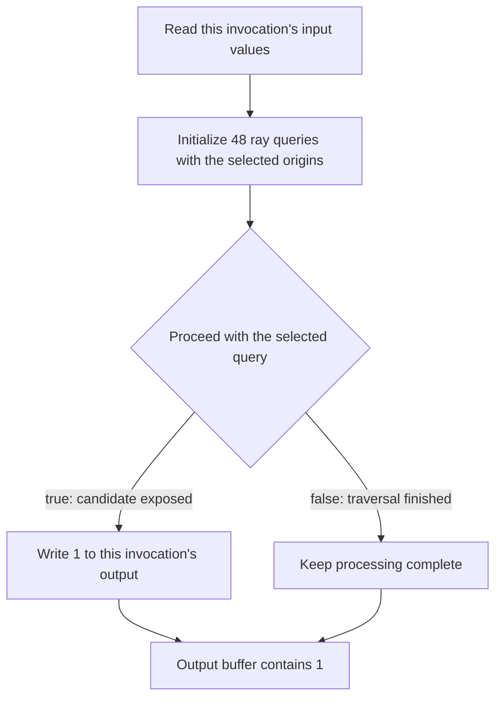

## Overview

**Core question:** Does a `VK_KHR_ray_query` implementation survive a bag of unrelated corner cases that the larger matrices do not cover, plus a fragment-shader family that exercises ray queries inside helper invocations alongside screen-space derivatives?

This page covers the `misc` and `helper_invocations` test families registered by [vktRayQueryMiscTests.cpp](../../../modules/vulkan/ray_query/vktRayQueryMiscTests.cpp#L2207-L2271) and [vktRayQueryMiscTests.cpp](../../../modules/vulkan/ray_query/vktRayQueryMiscTests.cpp#L2142-L2205). The two families are siblings only because they share one implementation file; their failure mechanisms do not overlap.

- `misc` is itself heterogeneous. It contains `dynamic_indexing` and `dynamic_indexing_use_first` (arrays of `rayQueryEXT` indexed at runtime), `reuse_scratch_buffer` (one scratch buffer shared across two sequential BLAS builds), `update_empty_bottom` and `update_empty_top` (in-place update of an empty AS pre-filled with random bytes), and a `ray_per_inv_*` matrix (one ray per compute invocation across 11 workgroup sizes and four single-invocation gating modes).
- `helper_invocations` is one coherent matrix: 2 build paths × 3 derivative styles × 3 surface modes × 2 screen sizes × 2 model sizes = 72 cases. The fragment shader runs an inline ray query and writes a color computed from both the analytic and the screen-space derivative of the surface. The host scans the color buffer for negative `.z` or `.w` channels.
- The shared theme is corner-case coverage. Each subfamily isolates one property that the larger matrices do not exercise on its own.

## Background Knowledge

For the shared concept acceleration-structure and traversal, see [Background Knowledge](../../categories/ray_query.md#background-knowledge) of the `ray_query` page.

- **Arrays of ray-query objects.** Each `rayQueryEXT` object owns independent traversal state. Runtime indexing must select the same object consistently across initialization, `proceed`, and intersection queries, even when source control flow does not place those operations in simple textual order.
- **Acceleration-structure scratch memory.** Build scratch storage is temporary workspace rather than part of the final acceleration structure. One scratch range may be reused by sequential builds only when synchronization orders the earlier build before the later reuse.
- **Updating an empty acceleration structure.** An update reuses acceleration-structure storage and requires the original structure to have been built with update permission. Zero primitives or inactive instances still describe a valid empty structure; old storage or scratch bytes must not become traversal data.
- **Helper invocations and derivatives.** Fragment helper invocations do not contribute final framebuffer values, but they participate in derivative calculations for neighboring fragments. Coarse, fine, and ordinary derivatives operate on fragment quads, so shader work used to establish derivative inputs must remain coherent across active and helper lanes.
- **Specialization-controlled workgroups.** Compute specialization constants can determine workgroup size, and `gl_LocalInvocationIndex` identifies one invocation within that specialized shape. Per-invocation ray-query state must remain independent when many lanes execute queries or when control flow allows only one lane to do so.

## Registration Hierarchy

```text
ray_query
├── misc
└── helper_invocations
```

The two families are direct children of the `ray_query` test category. They share one source file but not one failure mechanism, so the page treats them as siblings and does not collapse one into the other.

`misc` itself contains six subfamilies with no intermediate hierarchy node: `dynamic_indexing`, `dynamic_indexing_use_first`, `reuse_scratch_buffer`, `update_empty_bottom`, `update_empty_top`, and a flat list of 44 `ray_per_inv_*` test case leaves. `helper_invocations` expands into a 5-dimensional matrix (build, style, mode, screen, model) below the family node.

## Parameter Dimensions and Observed Values

| Dimension | Registered values | Meaning in this test | Evidence |
|-----------|-------------------|----------------------|----------|
| Test family | `misc`, `helper_invocations` | Selects which subfamily matrix runs. The two families are unrelated except for sharing one source file. | [vktRayQueryMiscTests.cpp:2207-L2271](../../../modules/vulkan/ray_query/vktRayQueryMiscTests.cpp#L2207-L2271), [L2142-L2205](../../../modules/vulkan/ray_query/vktRayQueryMiscTests.cpp#L2142-L2205) |
| `misc` subfamily | `dynamic_indexing`, `dynamic_indexing_use_first`, `reuse_scratch_buffer`, `update_empty_bottom`, `update_empty_top`, `ray_per_inv_*` | Selects the corner-case mechanism under test. | [vktRayQueryMiscTests.cpp:2212-L2268](../../../modules/vulkan/ray_query/vktRayQueryMiscTests.cpp#L2212-L2268) |
| `useFirst` ordering (`dynamic_indexing`) | `false`, `true` | When `true`, the use site precedes the init site textually in the GLSL source. Reduces workgroup to 2 invocations and 2 queries. | [vktRayQueryMiscTests.cpp:69-L82](../../../modules/vulkan/ray_query/vktRayQueryMiscTests.cpp#L69-L82), [L180-L191](../../../modules/vulkan/ray_query/vktRayQueryMiscTests.cpp#L180-L191) |
| Workgroup size (`ray_per_inv_*`) | `61`, `64`, `127`, `128`, `251`, `256`, `509`, `512`, `1021`, `1024`, `0` (device max) | The `local_size_x` specialization constant. `0` defers to `limits.maxComputeWorkGroupSize[0]`. | [vktRayQueryMiscTests.cpp:2238](../../../modules/vulkan/ray_query/vktRayQueryMiscTests.cpp#L2238), [L1986-L1987](../../../modules/vulkan/ray_query/vktRayQueryMiscTests.cpp#L1986-L1987) |
| Single-invocation mode (`ray_per_inv_*`) | `_all`, `_single_first`, `_single_last`, `_single_middle` | Whether every invocation runs a query or only one invocation does. `_single_last` uses `UINT32_MAX` to mean "the last invocation." | [vktRayQueryMiscTests.cpp:2233-L2266](../../../modules/vulkan/ray_query/vktRayQueryMiscTests.cpp#L2233-L2266) |
| Build path (`helper_invocations`) | `gpu`, `cpu` | `VK_ACCELERATION_STRUCTURE_BUILD_TYPE_DEVICE_KHR` vs `_HOST_KHR`. CPU requires `accelerationStructureHostCommands`. | [vktRayQueryMiscTests.cpp:2144](../../../modules/vulkan/ray_query/vktRayQueryMiscTests.cpp#L2144), [L588-L590](../../../modules/vulkan/ray_query/vktRayQueryMiscTests.cpp#L588-L590), [L873-L875](../../../modules/vulkan/ray_query/vktRayQueryMiscTests.cpp#L873-L875) |
| Derivative style (`helper_invocations`) | `regular`, `coarse`, `fine` | Selects `dFdx`/`dFdy`, `dFdxCoarse`/`dFdyCoarse`, or `dFdxFine`/`dFdyFine` in the fragment shader. | [vktRayQueryMiscTests.cpp:2146-L2149](../../../modules/vulkan/ray_query/vktRayQueryMiscTests.cpp#L2146-L2149), [L694-L708](../../../modules/vulkan/ray_query/vktRayQueryMiscTests.cpp#L694-L708) |
| Surface mode (`helper_invocations`) | `linear_quadratic`, `linear_cubic`, `cubic_quadratic` | Combines two of `linear`, `quadratic`, `cubic` for the X and Y axes of the parametric surface. | [vktRayQueryMiscTests.cpp:2151-L2154](../../../modules/vulkan/ray_query/vktRayQueryMiscTests.cpp#L2151-L2154) |
| Screen size (`helper_invocations`) | `64x64`, `32x64` | Color image extent. | [vktRayQueryMiscTests.cpp:2165](../../../modules/vulkan/ray_query/vktRayQueryMiscTests.cpp#L2165) |
| Model size (`helper_invocations`) | `64x64`, `64x32` | Surface mesh subdivision along X and Y. | [vktRayQueryMiscTests.cpp:2167](../../../modules/vulkan/ray_query/vktRayQueryMiscTests.cpp#L2167) |

## Behavior Parameters

The primary behavioral axis is the test family. Each subfamily targets an unrelated implementation property, so no single dimension other than the family name captures what changes between cases.

### `misc.dynamic_indexing` — runtime indexing into a `rayQueryEXT` array

A 48-element `rayQueryEXT rayQueries[48]` array is initialized per invocation. Only one element has the origin that hits a triangle; the rest are sent from `(5, 5, 0)` and miss. The shader proceeds the element indexed by `inputValues.proceedQueryIndex` (which the host sets equal to `goodQueryIndex`) and writes `1` to the output SSBO on every candidate. The host asserts every output entry equals `1`.

### `misc.dynamic_indexing_use_first` — use site before init site textually

The workgroup shrinks to 2 invocations and 2 queries. The GLSL emits the use loop textually before the initialization loop inside a `for (i = 0; i < 2; ++i)` wrapper that runs the use site on iteration 1 and the init site on iteration 0. The SPIR-V must trace query state across the loop body. The same invariance as `dynamic_indexing` holds, but with a hostile source order.

### `misc.reuse_scratch_buffer` — shared scratch across two BLAS builds

A 256x256 coverage mask is generated with a seeded RNG. Two BLASes are built back-to-back through `BottomLevelAccelerationStructurePool` using the same device scratch allocation, with a build-stage barrier between builds. Each BLAS contains the triangle rows for one half of the grid. The fragment shader traces one ray query per fragment from `(gl_FragCoord.xy, 0)` along `+Z` and writes blue on hit, black on miss. The host compares against a reference generated directly from the coverage mask with `tcu::floatThresholdCompare` and zero threshold.

### `misc.update_empty_bottom` — in-place update of an empty BLAS

The host allocates the BLAS storage buffer and scratch buffers, pre-fills them with pseudorandom bytes, builds an empty BLAS with `primitiveCount = 0` and `ALLOW_UPDATE_BIT_KHR`, and performs an in-place update with the same `primitiveCount = 0`. It builds a TLAS over the empty BLAS, dispatches one compute invocation that traces a ray query, and reads back one `vec4` from a storage buffer. The shader writes `(0, 0, 1, 1)` for miss and `(1, 0, 0, 1)` for hit. The host asserts the result equals `(0, 0, 1, 1)`.

### `misc.update_empty_top` — in-place update of an empty TLAS

The same flow as `update_empty_bottom`, but applied to the TLAS itself. The TLAS is built from a single geometry whose `instances.data.deviceAddress = 0ull` (an inactive instance) with `primitiveCount = 1u` and a build range of `0u`. The shader and the host check are identical to `update_empty_bottom`.

### `misc.ray_per_inv_*` — one ray per compute invocation across workgroup sizes

The compute shader declares `layout (local_size_x_id=0, local_size_y_id=1, local_size_z_id=2) in;` and the host supplies the actual workgroup size through `VkSpecializationInfo`. Each invocation traces a ray from `(invocationIndex + 0.5, 0, 0)` along `+Z`. The host pseudorandomly places a quad at `z = 1` for some invocations and not others. The shader writes `2` if it ran a query and hit, `1` if it ran and missed, and leaves the slot at `0` if it did not run a query. The `_single_*` variants gate the query on `gl_LocalInvocationIndex == k` for first / last / middle. The host mirrors the same condition when computing the expected value.

### `helper_invocations.*` — ray query inside fragment helper invocations

A parametric surface mesh is generated from one of three mode tuples (`linear_quadratic`, `linear_cubic`, `cubic_quadratic`). The BLAS contains the surface's coord vertices; the TLAS contains one instance of it. The fragment shader initializes a ray query from `(center.x, center.y, -1)` along `+Z` and loops over `rayQueryProceedEXT`. A triangle candidate drives the derivative calculation; each candidate returned by the loop is then passed to `rayQueryConfirmIntersectionEXT`. The shader computes `dfx = dzx / dx`, `dfy = dzy / dy`, `cx = dfx - vx`, `cy = dfy - vy`, and writes `(cx, cy, sign(dx - abs(cx)), sign(dy - abs(cy)))`. The host scans the color buffer and fails the case when any pixel has `.z < 0` or `.w < 0`.

## Shader Analysis

Each subfamily uses its own shader. The representative walkthrough below uses `dEQP-VK.ray_query.misc.dynamic_indexing` because it exercises the unique behavior of this file (runtime indexing into an array of `rayQueryEXT` objects) and yields a small, readable SPIR-V. The other subfamilies use similar or simpler shader bodies; their differences are documented in `## Behavior Parameters` and `## Parameter Variation Summary`.

### Representative Shader Walkthrough 1

#### Parameter Values Chosen

Representative path:

```text
dEQP-VK.ray_query.misc.dynamic_indexing
```

| Parameter choice | Meaning in this representative case |
|------------------|-------------------------------------|
| `useFirst = false` | The init loop precedes the use loop in source order. Workgroup is 48 invocations and 48 query objects. |
| `local_size_x = 48` | One invocation per SSBO slot. One workgroup is dispatched. |
| `numQueries = 48` | The `rayQueryEXT rayQueries[48]` array has one slot per invocation. |
| `goodQueryIndex == proceedQueryIndex` | The host seeds both fields with the same random value per invocation, so the proceed step targets the initialized query. |

#### Purpose

Verify that initializing 48 ray queries in a loop and proceeding the one query whose origin can hit produces a triangle candidate that drives `outputData[lid] = 1` for every invocation.

#### Structural Design



The triangle BLAS spans `[-1, 1] × [-1, 1]` at `z = 1`. Only the query whose origin is `(0, 0, 0)` reaches it. The 47 queries initialized from `(5, 5, 0)` miss cleanly. The host asserts every output slot equals `1`.

#### Shader Code

```glsl
#version 460
#extension GL_EXT_ray_query : require
#extension GL_EXT_ray_tracing : require

layout (local_size_x=48, local_size_y=1, local_size_z=1) in;

struct InputData {
    uint goodQueryIndex;
    uint proceedQueryIndex; // Note: same index as the one above in practice.
};

layout (set=0, binding=0) uniform accelerationStructureEXT topLevelAS;
layout (set=0, binding=1, std430) buffer InputBlock {
    InputData inputData[];
} inputBlock;
layout (set=0, binding=2, std430) buffer OutputBlock {
    uint outputData[];
} outputBlock;

void main()
{
    const uint numQueries = 48u;

    const uint rayFlags = 0u;
    const uint cullMask = 0xFFu;
    const float tmin = 0.1;
    const float tmax = 10.0;
    const vec3 direct = vec3(0, 0, 1);

    rayQueryEXT rayQueries[numQueries];
    vec3 origin;

    InputData inputValues = inputBlock.inputData[gl_LocalInvocationID.x];

    // Initialize all queries. Only goodQueryIndex will have the right origin for a hit.
    for (int i = 0; i < numQueries; i++) {
        origin = ((i == inputValues.goodQueryIndex) ? vec3(0, 0, 0) : vec3(5, 5, 0));
        rayQueryInitializeEXT(rayQueries[i], topLevelAS, rayFlags, cullMask, origin, tmin, direct, tmax);
    }

    // Attempt to proceed with the good query to confirm a hit.
    while (rayQueryProceedEXT(rayQueries[inputValues.proceedQueryIndex]))
        outputBlock.outputData[gl_LocalInvocationID.x] = 1u;
}
```

#### Additional Info

- `updateRayTracingGLSL()` is an identity passthrough in this CTS version ([vkRayTracingUtil.hpp:111](../../../framework/vulkan/vkRayTracingUtil.hpp#L111)), so the reconstructed GLSL matches the GLSL the host feeds to `glslangValidator`. `glslBuildOptions` is `vk::ShaderBuildOptions` with `SPIRV_VERSION_1_4` ([vktRayQueryMiscTests.cpp:130](../../../modules/vulkan/ray_query/vktRayQueryMiscTests.cpp#L130)).
- The `dynamic_indexing_use_first` variant swaps the init and use order: it emits a `for (i = 0; i < 2; ++i)` wrapper that runs the use site on iteration `i > 0` and the init site on iteration `i == 0`. The SPIR-V must preserve query state across the loop body. The shader binary is otherwise the same shape, with `numQueries = 2` and `local_size_x = 2` ([vktRayQueryMiscTests.cpp:180-L191](../../../modules/vulkan/ray_query/vktRayQueryMiscTests.cpp#L180-L191)).
- The host seeds `goodQueryIndex` per invocation with `rng.getInt(0, kNumQueries - 1)` and copies it into `proceedQueryIndex` ([vktRayQueryMiscTests.cpp:250-L255](../../../modules/vulkan/ray_query/vktRayQueryMiscTests.cpp#L250-L255)). The two fields are equal in practice; the struct carries both so the shader can be parameterized to test divergent indices in the future.
- The `rayQueries` array lives in `Private` storage in the SPIR-V because `rayQueryEXT` is not writable from non-function storage. The SPIR-V uses `OpAccessChain` into `%_ptr_Private_55` for both the init and the proceed site, which is the lowering under test.

#### Parameter Variation Summary

| Parameter dimension | Shader-level variation from this shader | Evidence |
|---------------------|---------------------------------------|----------|
| `useFirst = true` | Reduces `local_size_x` to 2 and `numQueries` to 2. Wraps init and use in a `for (i = 0; i < 2; ++i)` loop that runs the use site on iteration 1. | [vktRayQueryMiscTests.cpp:73-L81](../../../modules/vulkan/ray_query/vktRayQueryMiscTests.cpp#L73-L81), [L180-L191](../../../modules/vulkan/ray_query/vktRayQueryMiscTests.cpp#L180-L191) |
| `update_empty_bottom` / `update_empty_top` shader | One compute invocation traces a ray query and writes `(0,0,1,1)` for miss, `(1,0,0,1)` for hit. No array indexing. | [vktRayQueryMiscTests.cpp:1304-L1332](../../../modules/vulkan/ray_query/vktRayQueryMiscTests.cpp#L1304-L1332) |
| `reuse_scratch_buffer` shader | Fragment shader traces one ray query per fragment from `(gl_FragCoord.xy, 0)` along `+Z`. Writes blue on hit, black on miss. | [vktRayQueryMiscTests.cpp:1092-L1120](../../../modules/vulkan/ray_query/vktRayQueryMiscTests.cpp#L1092-L1120) |
| `ray_per_inv_*` shader | Compute shader specialized on `local_size_x`. One ray query per invocation gated on `gl_LocalInvocationIndex == k`. Writes `2` (hit), `1` (miss), or leaves slot at `0` (no query). | [vktRayQueryMiscTests.cpp:1935-L1979](../../../modules/vulkan/ray_query/vktRayQueryMiscTests.cpp#L1935-L1979) |
| `helper_invocations.*` shader | Fragment shader traces one ray query per fragment and computes color from analytic and screen-space derivatives of `coord`. `${DFDX}` / `${DFDY}` template specializes on `dFdx`/`dFdy` vs coarse vs fine. | [vktRayQueryMiscTests.cpp:619-L691](../../../modules/vulkan/ray_query/vktRayQueryMiscTests.cpp#L619-L691) |

#### SPIR-V

- Status: generated and validated
- Source: reconstructed GLSL from this walkthrough
- Stage: `comp`
- Target SPIRV version: `spirv1.4`

<details>
<summary>Click to expand SPIRV asm code</summary>

```llvm
; SPIR-V
; Version: 1.4
; Generator: Khronos Glslang Reference Front End; 11
; Bound: 94
; Schema: 0
               OpCapability Shader
               OpCapability RayQueryKHR
               OpExtension "SPV_KHR_ray_query"
          %1 = OpExtInstImport "GLSL.std.450"
               OpMemoryModel Logical GLSL450
               OpEntryPoint GLCompute %main "main" %inputBlock %gl_LocalInvocationID %rayQueries %topLevelAS %outputBlock
               OpExecutionMode %main LocalSize 48 1 1
               OpSource GLSL 460
               OpSourceExtension "GL_EXT_ray_query"
               OpSourceExtension "GL_EXT_ray_tracing"
               OpName %main "main"
               OpName %InputData "InputData"
               OpMemberName %InputData 0 "goodQueryIndex"
               OpMemberName %InputData 1 "proceedQueryIndex"
               OpName %inputValues "inputValues"
               OpName %InputData_0 "InputData"
               OpMemberName %InputData_0 0 "goodQueryIndex"
               OpMemberName %InputData_0 1 "proceedQueryIndex"
               OpName %InputBlock "InputBlock"
               OpMemberName %InputBlock 0 "inputData"
               OpName %inputBlock "inputBlock"
               OpName %gl_LocalInvocationID "gl_LocalInvocationID"
               OpName %i "i"
               OpName %origin "origin"
               OpName %rayQueries "rayQueries"
               OpName %topLevelAS "topLevelAS"
               OpName %OutputBlock "OutputBlock"
               OpMemberName %OutputBlock 0 "outputData"
               OpName %outputBlock "outputBlock"
               OpMemberDecorate %InputData_0 0 Offset 0
               OpMemberDecorate %InputData_0 1 Offset 4
               OpDecorate %_runtimearr_InputData_0 ArrayStride 8
               OpDecorate %InputBlock Block
               OpMemberDecorate %InputBlock 0 Offset 0
               OpDecorate %inputBlock Binding 1
               OpDecorate %inputBlock DescriptorSet 0
               OpDecorate %gl_LocalInvocationID BuiltIn LocalInvocationId
               OpDecorate %topLevelAS Binding 0
               OpDecorate %topLevelAS DescriptorSet 0
               OpDecorate %_runtimearr_uint ArrayStride 4
               OpDecorate %OutputBlock Block
               OpMemberDecorate %OutputBlock 0 Offset 0
               OpDecorate %outputBlock Binding 2
               OpDecorate %outputBlock DescriptorSet 0
               OpDecorate %gl_WorkGroupSize BuiltIn WorkgroupSize
       %void = OpTypeVoid
          %3 = OpTypeFunction %void
       %uint = OpTypeInt 32 0
  %InputData = OpTypeStruct %uint %uint
%_ptr_Function_InputData = OpTypePointer Function %InputData
%InputData_0 = OpTypeStruct %uint %uint
%_runtimearr_InputData_0 = OpTypeRuntimeArray %InputData_0
 %InputBlock = OpTypeStruct %_runtimearr_InputData_0
%_ptr_StorageBuffer_InputBlock = OpTypePointer StorageBuffer %InputBlock
 %inputBlock = OpVariable %_ptr_StorageBuffer_InputBlock StorageBuffer
        %int = OpTypeInt 32 1
      %int_0 = OpConstant %int 0
     %v3uint = OpTypeVector %uint 3
%_ptr_Input_v3uint = OpTypePointer Input %v3uint
%gl_LocalInvocationID = OpVariable %_ptr_Input_v3uint Input
     %uint_0 = OpConstant %uint 0
%_ptr_Input_uint = OpTypePointer Input %uint
%_ptr_StorageBuffer_InputData_0 = OpTypePointer StorageBuffer %InputData_0
%_ptr_Function_int = OpTypePointer Function %int
    %uint_48 = OpConstant %uint 48
       %bool = OpTypeBool
      %float = OpTypeFloat 32
    %v3float = OpTypeVector %float 3
%_ptr_Function_v3float = OpTypePointer Function %v3float
%_ptr_Function_uint = OpTypePointer Function %uint
    %float_0 = OpConstant %float 0
         %51 = OpConstantComposite %v3float %float_0 %float_0 %float_0
    %float_5 = OpConstant %float 5
         %53 = OpConstantComposite %v3float %float_5 %float_5 %float_0
         %55 = OpTypeRayQueryKHR
%_arr_55_uint_48 = OpTypeArray %55 %uint_48
%_ptr_Private__arr_55_uint_48 = OpTypePointer Private %_arr_55_uint_48
 %rayQueries = OpVariable %_ptr_Private__arr_55_uint_48 Private
%_ptr_Private_55 = OpTypePointer Private %55
         %62 = OpTypeAccelerationStructureKHR
%_ptr_UniformConstant_62 = OpTypePointer UniformConstant %62
 %topLevelAS = OpVariable %_ptr_UniformConstant_62 UniformConstant
   %uint_255 = OpConstant %uint 255
%float_0_100000001 = OpConstant %float 0.100000001
    %float_1 = OpConstant %float 1
         %70 = OpConstantComposite %v3float %float_0 %float_0 %float_1
   %float_10 = OpConstant %float 10
      %int_1 = OpConstant %int 1
%_runtimearr_uint = OpTypeRuntimeArray %uint
%OutputBlock = OpTypeStruct %_runtimearr_uint
%_ptr_StorageBuffer_OutputBlock = OpTypePointer StorageBuffer %OutputBlock
 %outputBlock = OpVariable %_ptr_StorageBuffer_OutputBlock StorageBuffer
     %uint_1 = OpConstant %uint 1
%_ptr_StorageBuffer_uint = OpTypePointer StorageBuffer %uint
%gl_WorkGroupSize = OpConstantComposite %v3uint %uint_48 %uint_1 %uint_1
       %main = OpFunction %void None %3
          %5 = OpLabel
%inputValues = OpVariable %_ptr_Function_InputData Function
          %i = OpVariable %_ptr_Function_int Function
     %origin = OpVariable %_ptr_Function_v3float Function
         %22 = OpAccessChain %_ptr_Input_uint %gl_LocalInvocationID %uint_0
         %23 = OpLoad %uint %22
         %25 = OpAccessChain %_ptr_StorageBuffer_InputData_0 %inputBlock %int_0 %23
         %26 = OpLoad %InputData_0 %25
         %27 = OpCopyLogical %InputData %26
               OpStore %inputValues %27
               OpStore %i %int_0
               OpBranch %30
         %30 = OpLabel
               OpLoopMerge %32 %33 None
               OpBranch %34
         %34 = OpLabel
         %35 = OpLoad %int %i
         %36 = OpBitcast %uint %35
         %39 = OpULessThan %bool %36 %uint_48
               OpBranchConditional %39 %31 %32
         %31 = OpLabel
         %44 = OpLoad %int %i
         %45 = OpBitcast %uint %44
         %47 = OpAccessChain %_ptr_Function_uint %inputValues %int_0
         %48 = OpLoad %uint %47
         %49 = OpIEqual %bool %45 %48
         %54 = OpSelect %v3float %49 %51 %53
               OpStore %origin %54
         %59 = OpLoad %int %i
         %61 = OpAccessChain %_ptr_Private_55 %rayQueries %59
         %65 = OpLoad %62 %topLevelAS
         %67 = OpLoad %v3float %origin
               OpRayQueryInitializeKHR %61 %65 %uint_0 %uint_255 %67 %float_0_100000001 %70 %float_10
               OpBranch %33
         %33 = OpLabel
         %72 = OpLoad %int %i
         %74 = OpIAdd %int %72 %int_1
               OpStore %i %74
               OpBranch %30
         %32 = OpLabel
               OpBranch %75
         %75 = OpLabel
               OpLoopMerge %77 %78 None
               OpBranch %79
         %79 = OpLabel
         %80 = OpAccessChain %_ptr_Function_uint %inputValues %int_1
         %81 = OpLoad %uint %80
         %82 = OpAccessChain %_ptr_Private_55 %rayQueries %81
         %83 = OpRayQueryProceedKHR %bool %82
               OpBranchConditional %83 %76 %77
         %76 = OpLabel
         %88 = OpAccessChain %_ptr_Input_uint %gl_LocalInvocationID %uint_0
         %89 = OpLoad %uint %88
         %92 = OpAccessChain %_ptr_StorageBuffer_uint %outputBlock %int_0 %89
               OpStore %92 %uint_1
               OpBranch %78
         %78 = OpLabel
               OpBranch %75
         %77 = OpLabel
               OpReturn
               OpFunctionEnd
```

</details>

## Runtime Execution and Result Checking

The host flow differs per subfamily. The shared prefix is the `checkRayQuerySupport` extension gate at [vktRayQueryMiscTests.cpp:63-L67](../../../modules/vulkan/ray_query/vktRayQueryMiscTests.cpp#L63-L67), which requires `VK_KHR_acceleration_structure` and `VK_KHR_ray_query`.

- **`dynamic_indexing` / `dynamic_indexing_use_first`.** The host seeds a 48-element (or 2-element for `use_first`) `InputData` array with random `goodQueryIndex` values from `[0, numQueries - 1]`, sets `proceedQueryIndex = goodQueryIndex`, builds a triangle BLAS at `z = 1` covering `[-1, 1] × [-1, 1]`, builds a TLAS with one instance of that BLAS, dispatches one workgroup, and reads back the output SSBO. The pass condition is `outputData[i] == 1` for every `i` ([vktRayQueryMiscTests.cpp:380-L398](../../../modules/vulkan/ray_query/vktRayQueryMiscTests.cpp#L380-L398)).
- **`reuse_scratch_buffer`.** The host generates a 256x256 coverage mask with seeded RNG, builds a pool of 2 BLASes with a shared device scratch buffer and sequential build barriers (each BLAS covering half the rows), builds a TLAS with both BLASes as instances, draws a full-screen quad, copies the color image to a readback buffer, builds a reference image directly from the coverage mask, and runs `tcu::floatThresholdCompare` with threshold `(0, 0, 0, 0)` ([vktRayQueryMiscTests.cpp:1282-L1301](../../../modules/vulkan/ray_query/vktRayQueryMiscTests.cpp#L1282-L1301)).
- **`update_empty_bottom` / `update_empty_top`.** The host allocates AS storage and scratch buffers, pre-fills them with random bytes, builds the empty AS with `ALLOW_UPDATE_BIT_KHR`, performs an in-place update with the same primitive count, builds the TLAS (bottom variant only), dispatches one compute invocation that traces a ray query and writes one `vec4` to a storage buffer, and reads back the `vec4`. The pass condition is exact equality with `(0, 0, 1, 1)` ([vktRayQueryMiscTests.cpp:1653-L1668](../../../modules/vulkan/ray_query/vktRayQueryMiscTests.cpp#L1653-L1668), [L1887-L1902](../../../modules/vulkan/ray_query/vktRayQueryMiscTests.cpp#L1887-L1902)).
- **`ray_per_inv_*`.** The host chooses the workgroup size from the registered values (or `limits.maxComputeWorkGroupSize[0]` for `0`), pseudorandomly decides per invocation whether a triangle quad exists at `z = 1`, builds a single BLAS with the union of all quads, builds a TLAS over it, dispatches one workgroup with specialization constants setting `local_size`, and reads back the SSBO. The pass condition is `ssbo[i] == 0` if invocation `i` did not run a query, `1` if it ran and missed, `2` if it ran and hit ([vktRayQueryMiscTests.cpp:2114-L2135](../../../modules/vulkan/ray_query/vktRayQueryMiscTests.cpp#L2114-L2135)).
- **`helper_invocations.*`.** The host generates a parametric surface mesh from the chosen mode, builds a triangle BLAS over the surface's coord vertices, builds a TLAS with one instance of it, sets up a graphics pipeline with vert + frag shaders and push constants for `fun_x`, `fun_y`, `width`, `height`, clears the color image to `(0.1, 0.2, 0.3, 0.4)`, draws the surface, copies the color image to a readback buffer, and scans every pixel. The pass condition is `px.z >= 0 && px.w >= 0` for every pixel ([vktRayQueryMiscTests.cpp:944-L965](../../../modules/vulkan/ray_query/vktRayQueryMiscTests.cpp#L944-L965)).

## Failure Meaning

### Failure Cause Mapping

| If this behavior parameter value fails | Possible failure cause(s) |
|----------------------------------------|---------------------------|
| `misc.dynamic_indexing` | Dynamic indexing into the `rayQueryEXT` array misroutes initialize or proceed to the wrong query object, or the SPIR-V lowering corrupts per-element query state. |
| `misc.dynamic_indexing_use_first` | The SPIR-V lowering does not preserve query state when the use site precedes the initialization site textually in the GLSL source. |
| `misc.reuse_scratch_buffer` | A shared host-visible scratch buffer reused across two BLAS builds is overwritten mid-build, or one build's scratch use trashes the other's. |
| `misc.update_empty_bottom` | An in-place update of an empty bottom-level AS produces an AS that traversal treats as non-empty, or the build reads uninitialized scratch/storage bytes that the host pre-filled with random data. |
| `misc.update_empty_top` | Same as `update_empty_bottom`, but for the top-level AS built from one NULL-address instance. |
| `misc.ray_per_inv_*` (`_all`) | Per-invocation query state is corrupted when every invocation in a large workgroup issues a query, near `limits.maxComputeWorkGroupSize[0]`. |
| `misc.ray_per_inv_*` (`_single_*`) | The single-invocation condition is applied to the wrong `gl_LocalInvocationIndex`, or the unused invocations corrupt the SSBO. |
| `helper_invocations.*` | Helper invocations skip the ray query, or the screen-space derivative is computed without including helper-invocation results, producing a negative `.z` or `.w` channel. |

### Cause Analysis

#### Dynamic indexing of `rayQueryEXT` arrays

**Possible failure symptoms:** For `dynamic_indexing`, some entry of the output SSBO is `0` instead of `1`. For `dynamic_indexing_use_first`, the same symptom appears but only on iteration `i == 1` of the wrapper loop, because the use site ran against an uninitialized query object.

**Possible implementation causes:** The SPIR-V lowers `rayQueries[i]` into `OpAccessChain %_ptr_Private_55 %rayQueries %i` followed by `OpRayQueryInitializeKHR` or `OpRayQueryProceedKHR`. A SPIR-V processor that miscomputes the element pointer, that hoists the proceed call out of the loop without preserving per-element state, or that promotes the array to a single scalar slot would produce the symptom. The `use_first` variant adds the additional stress that the proceed site dominates the init site textually; a lowering that assumes init-before-use would fail. Source-level investigation is needed to localize whether the failure is in the SPIR-V lowering, the driver's per-query state allocation, or the descriptor binding.

#### Reusable scratch buffer

**Possible failure symptoms:** `tcu::floatThresholdCompare` reports a non-zero diff between the rendered color buffer and the reference built from the coverage mask. Some pixels that should be blue (hit) show black (miss), or the reverse.

**Possible implementation causes:** `BottomLevelAccelerationStructurePool::batchCreateAdjust` is called with `scratchIsHostVisible = false`, so the pool allocates one device scratch buffer sized for the largest build. `batchBuild` reuses it for both BLASes and inserts an acceleration-structure-build barrier between them. A driver that does not honor that dependency could overlap scratch accesses and corrupt either BLAS. The image comparison cannot distinguish such a scratch-reuse failure from an error in BLAS contents, TLAS traversal, fragment-shader ray queries, rendering, or copyback; source-level investigation is needed.

#### Empty AS in-place update

**Possible failure symptoms:** For `update_empty_bottom` or `update_empty_top`, the readback `vec4` is `(1, 0, 0, 1)` (hit color) instead of `(0, 0, 1, 1)` (miss color). The compute shader wrote the hit color because `rayQueryProceedEXT` returned `true` and reported a triangle candidate.

**Possible implementation causes:** The host pre-fills the AS storage buffer, the build scratch buffer, and (for the bottom variant) the update scratch buffer with pseudorandom bytes (kPaddingFactor of 8 multiplies the reported sizes so the buffer is larger than strictly needed). The Vulkan spec requires the build to write a valid empty BVH even when `primitiveCount = 0`. A driver that skips the build because the input is empty would leave the random bytes in place; if those bytes happen to look like a valid BVH node, traversal reports a hit. A driver that reads uninitialized scratch during the in-place update could produce a non-empty BVH. Source-level investigation is needed to determine whether the build skipped the empty input or read past the scratch buffer.

#### Per-invocation query state at large workgroup sizes

**Possible failure symptoms:** For `ray_per_inv_*` with `_all`, some SSBO entry is `0` (no query ran) or `1` (query ran but missed) where the host expected `2` (hit). The failure clusters near `wgSize = 0` (device max) or at the larger registered sizes (`1021`, `1024`).

**Possible implementation causes:** Each invocation declares one `rayQueryEXT` object in function storage. The implementation must allocate per-invocation query state for the full workgroup. A driver that under-allocates query state at large workgroup sizes, or that aliases query state across invocations, would produce the symptom. The `_0` case defers to `limits.maxComputeWorkGroupSize[0]`, so the failure may surface as a device-dependent mismatch between the reported limit and the actual supported concurrent query count. Source-level investigation is needed to localize whether the failure is in the per-invocation state allocation or in the workgroup dispatch itself.

#### Single-invocation gating

**Possible failure symptoms:** For `ray_per_inv_*` with `_single_first`, `_single_last`, or `_single_middle`, some SSBO entry is `2` (hit) where the host expected `0` (no query ran), or `0` where the host expected `2`.

**Possible implementation causes:** The shader gates the query on `gl_LocalInvocationIndex == k` where `k` is a specialization-derived constant. A SPIR-V processor that folds the comparison incorrectly, or that hoists the query out of the conditional, would run queries on invocations that should have skipped them. The `_single_last` variant uses `gl_LocalInvocationIndex == totalInvs - 1`, which depends on `gl_WorkGroupSize` at runtime; a lowering that treats `totalInvs` as a constant would compute the wrong index. Source-level investigation is needed to determine whether the gating comparison is folded correctly.

#### Helper invocations and derivatives

**Possible failure symptoms:** For `helper_invocations.*`, the host scan finds a pixel with `.z < 0` or `.w < 0`. The negative channel means `abs(cx) > dx` (or `abs(cy) > dy`), i.e., the screen-space derivative of `coord.z` along X (or Y) diverged from the analytic derivative by more than the screen-space derivative of `coord.x` (or `coord.y`) itself.

**Possible implementation causes:** The fragment shader calls `dFdx`/`dFdy` (or coarse/fine variants) on `coord.x`, `coord.y`, and `coord.z`. These derivatives are computed from a quad of fragments, including helper invocations. A driver that skips helper invocations (and skips their ray queries) would still need to produce correct derivatives for the non-helper fragments in the quad. If the driver computes derivatives from only the non-helper fragments, the derivative is wrong. The shader calls `rayQueryConfirmIntersectionEXT` only inside the triangle-candidate branch; a driver that fails to confirm on a helper invocation, or that misattributes the candidate to the wrong fragment in the quad, would propagate the wrong `coord` to the derivative computation. Source-level investigation is needed to determine whether the failure is in helper-invocation handling, derivative computation, or ray-query state propagation across the quad.

## Case Pruning

### Requirement-based pruning

- All cases require `VK_KHR_acceleration_structure` and `VK_KHR_ray_query` ([vktRayQueryMiscTests.cpp:63-L67](../../../modules/vulkan/ray_query/vktRayQueryMiscTests.cpp#L63-L67)).
- `dynamic_indexing` and `dynamic_indexing_use_first` check `rayQueryFeaturesKHR.rayQuery` and `accelerationStructureFeaturesKHR.accelerationStructure`, throwing `NotSupportedError` and `TCU_FAIL` respectively when missing ([vktRayQueryMiscTests.cpp:198-L208](../../../modules/vulkan/ray_query/vktRayQueryMiscTests.cpp#L198-L208)).
- `helper_invocations.cpu.*` requires `accelerationStructureFeaturesKHR.accelerationStructureHostCommands` ([vktRayQueryMiscTests.cpp:588-L590](../../../modules/vulkan/ray_query/vktRayQueryMiscTests.cpp#L588-L590)).
- `ray_per_inv_*` checks `limits.maxComputeWorkGroupSize[0] >= usedWgSize` and throws `NotSupportedError` when the device cannot support the chosen workgroup size ([vktRayQueryMiscTests.cpp:1921-L1933](../../../modules/vulkan/ray_query/vktRayQueryMiscTests.cpp#L1921-L1933)).

### Design-based pruning

- `ray_per_inv_*` registers only one `_all` case per workgroup size. The source breaks out of the `singleCase` loop when `single == false` and `singleCase != 0` ([vktRayQueryMiscTests.cpp:2239-L2244](../../../modules/vulkan/ray_query/vktRayQueryMiscTests.cpp#L2239-L2244)).
- `helper_invocations` registers only three surface modes by default. The `ENABLE_ALL_HELPER_COMBINATIONS` compile-time flag would enable nine modes, but it is not defined in the default build ([vktRayQueryMiscTests.cpp:459-L490](../../../modules/vulkan/ray_query/vktRayQueryMiscTests.cpp#L459-L490)).
- `dynamic_indexing_use_first` reduces the workgroup to 2 invocations and 2 queries to keep the source-order stress test small and still exercise the loop wrapper.

## Key Takeaways

- The page bundles unrelated corner cases into one file. The shared theme is coverage of properties the larger matrices do not isolate: dynamic indexing of `rayQueryEXT` arrays, reusable scratch buffers across BLAS builds, in-place update of empty ASes, per-invocation ray counts at large workgroup sizes, and ray queries inside fragment helper invocations.
- A failure in any subfamily points to a distinct mechanism. The failure-cause table maps each subfamily to its likely locus; the cause analysis isolates the specific symptom the host observes.
- The `helper_invocations` family is the only one that uses a graphics pipeline. Its pass condition is a per-pixel negativity scan, not an exact equality check, because the test catches divergence between analytic and screen-space derivatives, not a specific color value.
- The `update_empty_*` cases pre-fill the AS storage and scratch buffers with random bytes. A driver that skips the build or reads uninitialized scratch exposes itself through a visible hit on what should be a miss.
- The `dynamic_indexing_use_first` variant is the same invariance as `dynamic_indexing` with a hostile source order. The two cases together catch SPIR-V lowerings that assume init-before-use.

## Source Reference Appendix

| Entry point | Link | Why it matters |
|-------------|------|----------------|
| `checkRayQuerySupport` | [vktRayQueryMiscTests.cpp:63-L67](../../../modules/vulkan/ray_query/vktRayQueryMiscTests.cpp#L63-L67) | Common extension gate. |
| `DynamicIndexingParams` | [vktRayQueryMiscTests.cpp:69-L82](../../../modules/vulkan/ray_query/vktRayQueryMiscTests.cpp#L69-L82) | Defines `useFirst`, `getLocalSizeX`, `getNumQueries`. |
| `DynamicIndexingCase::initPrograms` | [vktRayQueryMiscTests.cpp:128-L196](../../../modules/vulkan/ray_query/vktRayQueryMiscTests.cpp#L128-L196) | Generates the compute shader, including the `useFirst` ordering variant. |
| `DynamicIndexingInstance::iterate` | [vktRayQueryMiscTests.cpp:233-L399](../../../modules/vulkan/ray_query/vktRayQueryMiscTests.cpp#L233-L399) | Host setup, dispatch, output verification. |
| `initReuseScratchBufferPrograms` | [vktRayQueryMiscTests.cpp:1080-L1121](../../../modules/vulkan/ray_query/vktRayQueryMiscTests.cpp#L1080-L1121) | Vert + frag shaders for the scratch-buffer reuse case. |
| `reuseScratchBufferInstance` | [vktRayQueryMiscTests.cpp:1123-L1302](../../../modules/vulkan/ray_query/vktRayQueryMiscTests.cpp#L1123-L1302) | BLAS pool with shared scratch, coverage mask, reference image, comparison. |
| `initEmptyASPrograms` | [vktRayQueryMiscTests.cpp:1304-L1332](../../../modules/vulkan/ray_query/vktRayQueryMiscTests.cpp#L1304-L1332) | Compute shader that writes miss color on no candidate. |
| `updateEmptyBottomASInstance` | [vktRayQueryMiscTests.cpp:1348-L1668](../../../modules/vulkan/ray_query/vktRayQueryMiscTests.cpp#L1348-L1668) | Empty BLAS build, in-place update, miss-color check. |
| `updateEmptyTopASInstance` | [vktRayQueryMiscTests.cpp:1670-L1902](../../../modules/vulkan/ray_query/vktRayQueryMiscTests.cpp#L1670-L1902) | Same flow for the TLAS built from one NULL-address instance. |
| `RayPerInvParams` + `RayPerInvPrograms` + `RayPerInvRun` | [vktRayQueryMiscTests.cpp:1904-L2138](../../../modules/vulkan/ray_query/vktRayQueryMiscTests.cpp#L1904-L2138) | Specialized compute shader, per-invocation gating, SSBO verification. |
| `HelperInvocationsCase::initPrograms` | [vktRayQueryMiscTests.cpp:593-L711](../../../modules/vulkan/ray_query/vktRayQueryMiscTests.cpp#L593-L711) | Vert + frag shaders, derivative-style template specialization. |
| `HelperInvocationsInstance::iterate` + `verifyResult` | [vktRayQueryMiscTests.cpp:976-L1078](../../../modules/vulkan/ray_query/vktRayQueryMiscTests.cpp#L976-L1078), [L944-L965](../../../modules/vulkan/ray_query/vktRayQueryMiscTests.cpp#L944-L965) | Surface mesh generation, graphics pipeline, draw, color-buffer scan. |
| `addHelperInvocationsTests` | [vktRayQueryMiscTests.cpp:2142-L2205](../../../modules/vulkan/ray_query/vktRayQueryMiscTests.cpp#L2142-L2205) | Registers the `helper_invocations` matrix. |
| `createMiscTests` | [vktRayQueryMiscTests.cpp:2207-L2271](../../../modules/vulkan/ray_query/vktRayQueryMiscTests.cpp#L2207-L2271) | Registers the `misc` family. |
