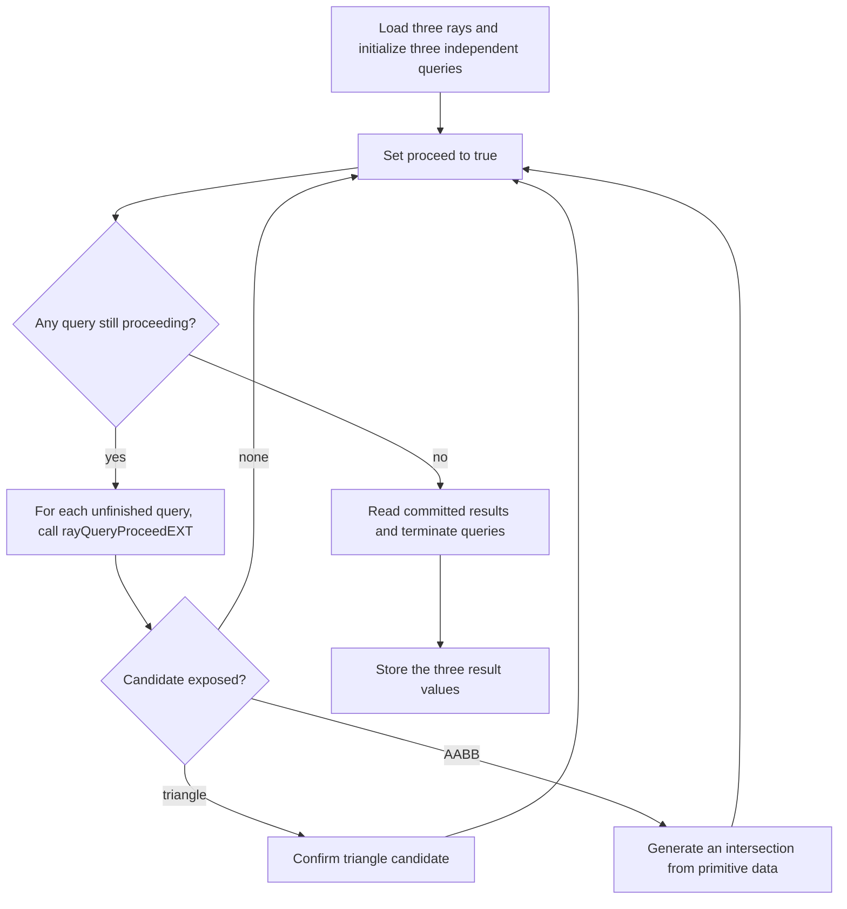

## Overview

**Core question:** Does each shader stage maintain and traverse three independent `rayQueryEXT` objects in parallel for each host-provided base ray, producing the expected `(instanceId * 10 + primitiveIndex)` tuple for each query?

This page covers the `multiple_ray_queries` test family registered by [vktRayQueryMultipleRayQueries.cpp](../../../modules/vulkan/ray_query/vktRayQueryMultipleRayQueries.cpp#L401-L473). The file is both the implementation and the registration point for the family.

- Twelve test case leaves are registered, one per shader source stage across the graphics, compute, and ray-tracing pipelines ([vktRayQueryMultipleRayQueries.cpp:403-L458](../../../modules/vulkan/ray_query/vktRayQueryMultipleRayQueries.cpp#L403-L458)).
- Every leaf shares the same `rayQueryPart` shader body. Each invocation takes one host-provided base ray, copies it into three rays with `+0/+3/+6` x-offsets, creates three independent `rayQueryEXT` objects, and advances those objects in lockstep inside one `while (proceed)` loop ([vktRayQueryMultipleRayQueries.cpp:178-L241](../../../modules/vulkan/ray_query/vktRayQueryMultipleRayQueries.cpp#L178-L241)).
- The host provides six base rays and the shader dispatches six invocations, so the complete test performs 18 ray-query traversals: three per base ray. Rays 0..2 start at `z = 0` and target the triangle instance; rays 3..5 start at `z = 95` and target the AABB instance. The three x-offsets select different geometry bands for each base ray ([vktRayQueryMultipleRayQueries.cpp:262-L323](../../../modules/vulkan/ray_query/vktRayQueryMultipleRayQueries.cpp#L262-L323)).
- The host precomputes six `ResultData` quadruples, each packing the three query results for one base ray, and compares each shader output cell to its expected value with a `1e-6` epsilon ([vktRayQueryMultipleRayQueries.cpp:67-L77](../../../modules/vulkan/ray_query/vktRayQueryMultipleRayQueries.cpp#L67-L77), [L368-L397](../../../modules/vulkan/ray_query/vktRayQueryMultipleRayQueries.cpp#L368-L397)).

## Background Knowledge

For the shared concept acceleration-structure and traversal, see [Background Knowledge](../../categories/ray_query.md#background-knowledge) of the `ray_query` page.

- **Independent ray-query objects.** Every `rayQueryEXT` object is a separate traversal state machine. Arrays of query objects may be initialized and advanced in an interleaved order, but a `proceed`, candidate, or committed result for one element must not alter a sibling element. See the [ray traversal chapter](../../../../vulkan-docs/src/chapters/raytraversal.adoc).
- **Candidate and committed state.** `rayQueryProceedEXT` exposes provisional candidates. A triangle candidate can be committed with `rayQueryConfirmIntersectionEXT`; an AABB candidate needs `rayQueryGenerateIntersectionEXT` with an application-supplied parametric distance. Committed-state queries then describe the accepted intersection.
- **Instance and primitive indices.** An instance index identifies a TLAS instance, while a primitive index identifies geometry within the referenced BLAS. Reading both values distinguishes which placement and which primitive a query committed.
- **Per-query termination.** `rayQueryTerminateEXT` ends traversal only for the query object passed to it. Other live queries in the same invocation retain their own state.

## Registration Hierarchy

```text
ray_query.multiple_ray_queries
├── vertex_shader
├── tess_control_shader
├── tess_evaluation_shader
├── geometry_shader
├── fragment_shader
├── compute_shader
├── rgen_shader
├── isect_shader
├── ahit_shader
├── chit_shader
├── miss_shader
└── call_shader
```

Each child is a direct test case leaf. There are no intermediate nodes. The twelve leaves correspond one-to-one to the twelve entries in the `shaderSourceTypes` array in `createMultipleRayQueryTests` ([vktRayQueryMultipleRayQueries.cpp:403-L458](../../../modules/vulkan/ray_query/vktRayQueryMultipleRayQueries.cpp#L403-L458)).

## Parameter Dimensions and Observed Values

| Dimension | Registered values | Meaning in this test | Evidence |
|-----------|-------------------|----------------------|----------|
| Shader source stage | `VERTEX`, `TESSELLATION_CONTROL`, `TESSELLATION_EVALUATION`, `GEOMETRY`, `FRAGMENT`, `COMPUTE`, `RAY_GENERATION`, `INTERSECTION`, `ANY_HIT`, `CLOSEST_HIT`, `MISS`, `CALLABLE` | Selects which stage hosts the shared `rayQueryPart` body. The body is identical for every leaf; only the surrounding stage wrapper from `generateRayQueryShaders` changes. | [vktRayQueryMultipleRayQueries.cpp:403-L458](../../../modules/vulkan/ray_query/vktRayQueryMultipleRayQueries.cpp#L403-L458) |
| Pipeline | `GRAPHICS`, `COMPUTE`, `RAYTRACING` | Pairs with the stage. `vertex_shader`..`fragment_shader` use `GRAPHICS`, `compute_shader` uses `COMPUTE`, `rgen_shader`..`call_shader` use `RAYTRACING`. Selects which host setup helper runs. | [vktRayQueryMultipleRayQueries.cpp:329-L366](../../../modules/vulkan/ray_query/vktRayQueryMultipleRayQueries.cpp#L329-L366) |
| Ray-query count | `3` per invocation; `18` total traversals | The shader hardcodes `rayQueryCount = 3`. Each of the six invocations owns three concurrent `rayQueryEXT` objects, so the test traverses three x-offset rays for each of six host-provided base rays. | [vktRayQueryMultipleRayQueries.cpp:178](../../../modules/vulkan/ray_query/vktRayQueryMultipleRayQueries.cpp#L178) |
| Ray x-offsets | `+0.0`, `+3.0`, `+6.0` per base ray | Each invocation copies its one host-provided base ray three times and shifts the copies in x, so its three queries land in different x-bands of the corresponding scene. | [vktRayQueryMultipleRayQueries.cpp:180-L184](../../../modules/vulkan/ray_query/vktRayQueryMultipleRayQueries.cpp#L180-L184) |
| Ray flags | `0` (default-initialized `RayQueryTestParams::rayFlags`) | `gl_RayFlagsNoneEXT`. No face culling, no skip flags, no terminate-on-first-hit. | [vktRayQueryMultipleRayQueries.cpp:464-L467](../../../modules/vulkan/ray_query/vktRayQueryMultipleRayQueries.cpp#L464-L467), [vkRayTracingUtil.hpp:1623-L1636](../../../framework/vulkan/vkRayTracingUtil.hpp#L1623-L1636) |
| Resource residency | `TRADITIONAL` (fixed) | Standard host-visible allocations. No sparse or residency variants. | [vktRayQueryMultipleRayQueries.cpp:467](../../../modules/vulkan/ray_query/vktRayQueryMultipleRayQueries.cpp#L467) |
| Rays | 6 fixed host-provided base rays | Six invocations consume one base ray each. Rays 0..2 start at `z = 0` and target triangles in instance 0; rays 3..5 start at `z = 95` and target AABBs in instance 1. Each base ray produces three actual query rays through the `+0/+3/+6` x-offsets, for 18 traversals total. | [vktRayQueryMultipleRayQueries.cpp:262-L267](../../../modules/vulkan/ray_query/vktRayQueryMultipleRayQueries.cpp#L262-L267) |

## Behavior Parameters

The primary behavioral axis is the shader source stage, grouped by pipeline. The shared `rayQueryPart` body is identical across all twelve leaves. Only the stage wrapper from `generateRayQueryShaders` ([vkRayTracingUtil.cpp:5124-L5672](../../../framework/vulkan/vkRayTracingUtil.cpp#L5124-L5672)) changes, which determines how the body is reached and how `x, y, z, w` are written back.

### `graphics` — vertex, tessellation, geometry, and fragment stages

Five leaves (`vertex_shader`, `tess_control_shader`, `tess_evaluation_shader`, `geometry_shader`, `fragment_shader`) run the body inside a graphics pipeline. The stage wrapper writes `vec4(x, y, z, w)` to a `rgba32f` 3D image at the pixel corresponding to the ray index. The host reads the image back and reinterprets each texel as a `ResultData`. Vertex-pipeline stages additionally require `vertexPipelineStoresAndAtomics` so the storage image write is legal.

### `compute` — compute shader stage

One leaf (`compute_shader`) runs the body inside a compute dispatch of `6 x 1 x 1` invocations. The wrapper writes `results[index] = ResultType{x, y, z, w}` directly into a `std430` storage buffer. This is the simplest path because no vertex pipeline or ray-tracing pipeline is involved. The representative shader walkthrough below uses this leaf.

### `raytracing` — rgen, isect, ahit, chit, miss, and call stages

Six leaves (`rgen_shader`, `isect_shader`, `ahit_shader`, `chit_shader`, `miss_shader`, `call_shader`) run the body inside a ray-tracing pipeline. The stage wrapper routes the result back through a `vec4` payload, a hit attribute, or a callable data structure depending on the stage. `rgen_shader` is the simplest of the six because it runs the body inline in the ray generation shader. The other five stages require the rgen shader to `traceRayEXT` or `executeCallableEXT` so control reaches the stage that hosts the body. All six require `VK_KHR_ray_tracing_pipeline`.

## Shader Analysis

All twelve leaves compile to different stage wrappers around the same `rayQueryPart` string. The wrapper provides the stage-specific entry, the `Ray` and result buffer declarations, and the writeback of `x, y, z, w`. The body declares the `rayQueryEXT rqs[3]` array, initializes all three queries, advances them in lockstep, confirms triangle candidates, generates AABB intersections with a per-primitive `t`, then reads the committed instance and primitive indices per query.

The representative walkthrough uses `compute_shader` because the compute wrapper is the smallest and exercises the body without the graphics-pipeline image write or the ray-tracing-pipeline payload routing.

### Representative Shader Walkthrough 1

#### Parameter Values Chosen

Representative path:

```text
dEQP-VK.ray_query.multiple_ray_queries.compute_shader
```

| Parameter choice | Meaning in this representative case |
|------------------|-------------------------------------|
| `compute_shader` | Compute wrapper from `generateRayQueryShaders`. Six invocations, one per host-provided base ray. |
| `local_size_x = 1` | One invocation per workgroup; the host dispatches `6 x 1 x 1` workgroups. |
| `rayQueryCount = 3` | The body maintains three `rayQueryEXT` objects per invocation. |
| `rayFlags = 0` | `gl_RayFlagsNoneEXT`. Triangle and AABB candidates are both reported. |

#### Purpose

Verify that each invocation's three `rayQueryEXT` objects, initialized from one host-provided base ray with `+0/+3/+6` x-offsets, all commit the expected hits and report the expected `(instanceId, primitiveIndex)` pairs while traversal is interleaved across the three queries inside one `while (proceed)` loop. Six base rays produce six output records and 18 query traversals in total.

#### Structural Design



The `t` formula `100 + primIndex * 10 - (index/3) * 95` lands each AABB query at the correct primitive's z plane. For rays 0..2 (`index/3 = 0`), the formula is unused because the triangle branch takes over. For rays 3..5 (`index/3 = 1`), the formula becomes `100 + primIndex * 10 - 95`, which equals the parametric distance from `z = 95` to the AABB at `z = 100 + primIndex * 10`. The shader never enters the AABB branch for rays 0..2 because those rays never reach an AABB candidate, and never enters the triangle branch for rays 3..5 because instance 1 has no triangles.

#### Shader Code

```glsl
#version 460
#extension GL_EXT_ray_tracing : enable
#extension GL_EXT_ray_query : require

struct Ray { vec3 pos; float tmin; vec3 dir; float tmax; };
struct ResultType { float x; float y; float z; float w; };
layout(std430, set = 0, binding = 0) buffer Results { ResultType results[]; };
layout(set = 0, binding = 1) uniform accelerationStructureEXT scene;
layout(std430, set = 0, binding = 2) buffer Rays { Ray rays[]; };
layout (local_size_x = 1, local_size_y = 1, local_size_z = 1) in;

void main() {
   uint index = (gl_NumWorkGroups.x * gl_WorkGroupSize.x) * gl_GlobalInvocationID.y + gl_GlobalInvocationID.x;
   // This is rayQueryEXT array version
   const int rayQueryCount = 3;
   Ray ray[rayQueryCount];
   ray[0] = rays[index];
   ray[1] = rays[index];
   ray[2] = rays[index];
   ray[1].pos.x += 3.0;
   ray[2].pos.x += 6.0;
   float x = 0;
   float y = 0;
   float z = 0;
   float w = 0;
   float tempResults[] = {0, 0, 0};
   rayQueryEXT rqs[rayQueryCount];
   bool prcds[] = {true, true, true};

   for (int idx=0;idx<rayQueryCount;++idx)
   {
         rayQueryInitializeEXT(rqs[idx], scene, 0, 0xFF, ray[idx].pos, ray[idx].tmin, ray[idx].dir, ray[idx].tmax);
   }

   bool proceed = true;
   // traverse all rayQueries in parallel to verify rayQueryCount issues
   while (proceed)
    {
       proceed = false;
        for (int idx=0;idx<rayQueryCount;++idx)
        {
            prcds[idx] = prcds[idx] && rayQueryProceedEXT(rqs[idx]);
            if (prcds[idx])
            {
               if (rayQueryGetIntersectionTypeEXT(rqs[idx], false) == gl_RayQueryCandidateIntersectionTriangleEXT)
                {
                    rayQueryConfirmIntersectionEXT(rqs[idx]);
                }
                else if (rayQueryGetIntersectionTypeEXT(rqs[idx], false) == gl_RayQueryCandidateIntersectionAABBEXT)
                {
                    uint primIndex = rayQueryGetIntersectionPrimitiveIndexEXT(rqs[idx], false);
                    rayQueryGenerateIntersectionEXT(rqs[idx], 100.f + primIndex * 10.f - (index/3 * 95.f));
                }
            }
           proceed = proceed || prcds[idx];
       }
   }
   for (int idx=0;idx<rayQueryCount;++idx)
    {
        if ((rayQueryGetIntersectionTypeEXT(rqs[idx], true) == gl_RayQueryCommittedIntersectionTriangleEXT) ||
            (rayQueryGetIntersectionTypeEXT(rqs[idx], true) == gl_RayQueryCommittedIntersectionGeneratedEXT))
        {
            uint instIdx = rayQueryGetIntersectionInstanceIdEXT(rqs[idx], true);
           uint primIndex = rayQueryGetIntersectionPrimitiveIndexEXT(rqs[idx], true);
            tempResults[idx] = float(instIdx) * 10.f  +  float(primIndex);
        }
        rayQueryTerminateEXT(rqs[idx]);
   }

   x = tempResults[0];
   y = tempResults[1];
   z = tempResults[2];
   results[index].x = x;
   results[index].y = y;
   results[index].z = z;
   results[index].w = w;
}
```

#### Additional Info

- `updateRayTracingGLSL()` is an identity passthrough in this CTS version ([vkRayTracingUtil.hpp:111](../../../framework/vulkan/vkRayTracingUtil.hpp#L111)), so the reconstructed GLSL is the GLSL the host feeds to `glslangValidator`. The build options use `vk::SPIRV_VERSION_1_5` ([vkRayTracingUtil.cpp:5197](../../../framework/vulkan/vkRayTracingUtil.cpp#L5197)). The walkthrough below was compiled with `--target-env spirv1.4` and validated with `spirv-val --target-env spv1.4`, which is sufficient for the `SPV_KHR_ray_query` extension used here.
- The `prcds[idx]` array gates each query separately. Once a query's `proceed` returns false, that slot stops calling `proceed` even though the outer `while` loop keeps iterating for the other two queries. This is the interleaving pattern the test exists to exercise.
- `rayQueryTerminateEXT` is called unconditionally per query after results are read. The spec permits calling it on a query that has already finished; the test verifies the implementation tolerates that pattern across an array of queries.
- The `tempResults` defaults to `{0, 0, 0}`. If a query commits no hit, the corresponding slot stays at `0`. The expected results assume every query commits a hit, so a zero slot is a failure signal.

#### Parameter Variation Summary

| Parameter dimension | Shader-level variation from this shader | Evidence |
|---------------------|----------------------------------------|----------|
| `graphics` pipeline stages | Same `rayQueryPart` body, embedded into `vert`/`tesc`/`tese`/`geom`/`frag` wrappers. Result is written via `imageStore` into a `rgba32f` 3D image. | [vkRayTracingUtil.cpp:5229-L5451](../../../framework/vulkan/vkRayTracingUtil.cpp#L5229-L5451) |
| `raytracing` pipeline stages | Same `rayQueryPart` body, embedded into `rgen`/`isect`/`ahit`/`chit`/`miss_1`/`call` wrappers. Result is routed through `rayPayloadEXT`, `hitAttributeEXT`, or `callableDataEXT`. | [vkRayTracingUtil.cpp:5452-L5666](../../../framework/vulkan/vkRayTracingUtil.cpp#L5452-L5666) |
| Ray index | The host dispatches `6 x 1 x 1` workgroups for compute, draws six vertices for graphics, or traces six rays for ray tracing. `index` selects one host-provided base ray per invocation; the shader then creates three `+0/+3/+6` query rays from it. | [vktRayQueryMultipleRayQueries.cpp:269-L270](../../../modules/vulkan/ray_query/vktRayQueryMultipleRayQueries.cpp#L269-L270) |

#### SPIR-V

- Status: generated and validated
- Source: reconstructed GLSL from this walkthrough
- Stage: `comp`
- Target SPIRV version: `spirv1.4`
- SPIR-V Bound: 268

<details>
<summary>Click to expand SPIRV asm code</summary>

```llvm
; SPIR-V
; Version: 1.4
; Generator: Khronos Glslang Reference Front End; 11
; Bound: 268
; Schema: 0
               OpCapability Shader
               OpCapability RayQueryKHR
               OpExtension "SPV_KHR_ray_query"
          %1 = OpExtInstImport "GLSL.std.450"
               OpMemoryModel Logical GLSL450
               OpEntryPoint GLCompute %main "main" %gl_NumWorkGroups %gl_GlobalInvocationID %_ %rqs %scene %__0
               OpExecutionMode %main LocalSize 1 1 1
               OpSource GLSL 460
               OpSourceExtension "GL_EXT_ray_query"
               OpSourceExtension "GL_EXT_ray_tracing"
               OpName %main "main"
               OpName %index "index"
               OpName %gl_NumWorkGroups "gl_NumWorkGroups"
               OpName %gl_GlobalInvocationID "gl_GlobalInvocationID"
               OpName %Ray "Ray"
               OpMemberName %Ray 0 "pos"
               OpMemberName %Ray 1 "tmin"
               OpMemberName %Ray 2 "dir"
               OpMemberName %Ray 3 "tmax"
               OpName %ray "ray"
               OpName %Ray_0 "Ray"
               OpMemberName %Ray_0 0 "pos"
               OpMemberName %Ray_0 1 "tmin"
               OpMemberName %Ray_0 2 "dir"
               OpMemberName %Ray_0 3 "tmax"
               OpName %Rays "Rays"
               OpMemberName %Rays 0 "rays"
               OpName %_ ""
               OpName %x "x"
               OpName %y "y"
               OpName %z "z"
               OpName %w "w"
               OpName %tempResults "tempResults"
               OpName %prcds "prcds"
               OpName %idx "idx"
               OpName %rqs "rqs"
               OpName %scene "scene"
               OpName %proceed "proceed"
               OpName %idx_0 "idx"
               OpName %primIndex "primIndex"
               OpName %idx_1 "idx"
               OpName %instIdx "instIdx"
               OpName %primIndex_0 "primIndex"
               OpName %ResultType "ResultType"
               OpMemberName %ResultType 0 "x"
               OpMemberName %ResultType 1 "y"
               OpMemberName %ResultType 2 "z"
               OpMemberName %ResultType 3 "w"
               OpName %Results "Results"
               OpMemberName %Results 0 "results"
               OpName %__0 ""
               OpDecorate %gl_NumWorkGroups BuiltIn NumWorkgroups
               OpDecorate %gl_GlobalInvocationID BuiltIn GlobalInvocationId
               OpMemberDecorate %Ray_0 0 Offset 0
               OpMemberDecorate %Ray_0 1 Offset 12
               OpMemberDecorate %Ray_0 2 Offset 16
               OpMemberDecorate %Ray_0 3 Offset 28
               OpDecorate %_runtimearr_Ray_0 ArrayStride 32
               OpDecorate %Rays Block
               OpMemberDecorate %Rays 0 Offset 0
               OpDecorate %_ Binding 2
               OpDecorate %_ DescriptorSet 0
               OpDecorate %scene Binding 1
               OpDecorate %scene DescriptorSet 0
               OpMemberDecorate %ResultType 0 Offset 0
               OpMemberDecorate %ResultType 1 Offset 4
               OpMemberDecorate %ResultType 2 Offset 8
               OpMemberDecorate %ResultType 3 Offset 12
               OpDecorate %_runtimearr_ResultType ArrayStride 16
               OpDecorate %Results Block
               OpMemberDecorate %Results 0 Offset 0
               OpDecorate %__0 Binding 0
               OpDecorate %__0 DescriptorSet 0
               OpDecorate %gl_WorkGroupSize BuiltIn WorkgroupSize
       %void = OpTypeVoid
          %3 = OpTypeFunction %void
       %uint = OpTypeInt 32 0
%_ptr_Function_uint = OpTypePointer Function %uint
     %v3uint = OpTypeVector %uint 3
%_ptr_Input_v3uint = OpTypePointer Input %v3uint
%gl_NumWorkGroups = OpVariable %_ptr_Input_v3uint Input
     %uint_0 = OpConstant %uint 0
%_ptr_Input_uint = OpTypePointer Input %uint
     %uint_1 = OpConstant %uint 1
%gl_GlobalInvocationID = OpVariable %_ptr_Input_v3uint Input
      %float = OpTypeFloat 32
    %v3float = OpTypeVector %float 3
        %Ray = OpTypeStruct %v3float %float %v3float %float
     %uint_3 = OpConstant %uint 3
%_arr_Ray_uint_3 = OpTypeArray %Ray %uint_3
%_ptr_Function__arr_Ray_uint_3 = OpTypePointer Function %_arr_Ray_uint_3
        %int = OpTypeInt 32 1
      %int_0 = OpConstant %int 0
      %Ray_0 = OpTypeStruct %v3float %float %v3float %float
%_runtimearr_Ray_0 = OpTypeRuntimeArray %Ray_0
       %Rays = OpTypeStruct %_runtimearr_Ray_0
%_ptr_StorageBuffer_Rays = OpTypePointer StorageBuffer %Rays
          %_ = OpVariable %_ptr_StorageBuffer_Rays StorageBuffer
%_ptr_StorageBuffer_Ray_0 = OpTypePointer StorageBuffer %Ray_0
%_ptr_Function_Ray = OpTypePointer Function %Ray
      %int_1 = OpConstant %int 1
      %int_2 = OpConstant %int 2
    %float_3 = OpConstant %float 3
%_ptr_Function_float = OpTypePointer Function %float
    %float_6 = OpConstant %float 6
    %float_0 = OpConstant %float 0
%_arr_float_uint_3 = OpTypeArray %float %uint_3
%_ptr_Function__arr_float_uint_3 = OpTypePointer Function %_arr_float_uint_3
         %77 = OpConstantComposite %_arr_float_uint_3 %float_0 %float_0 %float_0
       %bool = OpTypeBool
%_arr_bool_uint_3 = OpTypeArray %bool %uint_3
%_ptr_Function__arr_bool_uint_3 = OpTypePointer Function %_arr_bool_uint_3
       %true = OpConstantTrue %bool
         %83 = OpConstantComposite %_arr_bool_uint_3 %true %true %true
%_ptr_Function_int = OpTypePointer Function %int
      %int_3 = OpConstant %int 3
         %94 = OpTypeRayQueryKHR
%_arr_94_uint_3 = OpTypeArray %94 %uint_3
%_ptr_Private__arr_94_uint_3 = OpTypePointer Private %_arr_94_uint_3
        %rqs = OpVariable %_ptr_Private__arr_94_uint_3 Private
%_ptr_Private_94 = OpTypePointer Private %94
        %101 = OpTypeAccelerationStructureKHR
%_ptr_UniformConstant_101 = OpTypePointer UniformConstant %101
      %scene = OpVariable %_ptr_UniformConstant_101 UniformConstant
   %uint_255 = OpConstant %uint 255
%_ptr_Function_v3float = OpTypePointer Function %v3float
%_ptr_Function_bool = OpTypePointer Function %bool
      %false = OpConstantFalse %bool
  %float_100 = OpConstant %float 100
   %float_10 = OpConstant %float 10
   %float_95 = OpConstant %float 95
     %uint_2 = OpConstant %uint 2
 %ResultType = OpTypeStruct %float %float %float %float
%_runtimearr_ResultType = OpTypeRuntimeArray %ResultType
    %Results = OpTypeStruct %_runtimearr_ResultType
%_ptr_StorageBuffer_Results = OpTypePointer StorageBuffer %Results
        %__0 = OpVariable %_ptr_StorageBuffer_Results StorageBuffer
%_ptr_StorageBuffer_float = OpTypePointer StorageBuffer %float
%gl_WorkGroupSize = OpConstantComposite %v3uint %uint_1 %uint_1 %uint_1
       %main = OpFunction %void None %3
          %5 = OpLabel
      %index = OpVariable %_ptr_Function_uint Function
        %ray = OpVariable %_ptr_Function__arr_Ray_uint_3 Function
          %x = OpVariable %_ptr_Function_float Function
          %y = OpVariable %_ptr_Function_float Function
          %z = OpVariable %_ptr_Function_float Function
          %w = OpVariable %_ptr_Function_float Function
%tempResults = OpVariable %_ptr_Function__arr_float_uint_3 Function
      %prcds = OpVariable %_ptr_Function__arr_bool_uint_3 Function
        %idx = OpVariable %_ptr_Function_int Function
    %proceed = OpVariable %_ptr_Function_bool Function
      %idx_0 = OpVariable %_ptr_Function_int Function
  %primIndex = OpVariable %_ptr_Function_uint Function
      %idx_1 = OpVariable %_ptr_Function_int Function
    %instIdx = OpVariable %_ptr_Function_uint Function
%primIndex_0 = OpVariable %_ptr_Function_uint Function
         %14 = OpAccessChain %_ptr_Input_uint %gl_NumWorkGroups %uint_0
         %15 = OpLoad %uint %14
         %17 = OpIMul %uint %15 %uint_1
         %19 = OpAccessChain %_ptr_Input_uint %gl_GlobalInvocationID %uint_1
         %20 = OpLoad %uint %19
         %21 = OpIMul %uint %17 %20
         %22 = OpAccessChain %_ptr_Input_uint %gl_GlobalInvocationID %uint_0
         %23 = OpLoad %uint %22
         %24 = OpIAdd %uint %21 %23
               OpStore %index %24
         %39 = OpLoad %uint %index
         %41 = OpAccessChain %_ptr_StorageBuffer_Ray_0 %_ %int_0 %39
         %42 = OpLoad %Ray_0 %41
         %44 = OpAccessChain %_ptr_Function_Ray %ray %int_0
         %45 = OpCopyLogical %Ray %42
               OpStore %44 %45
         %47 = OpLoad %uint %index
         %48 = OpAccessChain %_ptr_StorageBuffer_Ray_0 %_ %int_0 %47
         %49 = OpLoad %Ray_0 %48
         %50 = OpAccessChain %_ptr_Function_Ray %ray %int_1
         %51 = OpCopyLogical %Ray %49
               OpStore %50 %51
         %53 = OpLoad %uint %index
         %54 = OpAccessChain %_ptr_StorageBuffer_Ray_0 %_ %int_0 %53
         %55 = OpLoad %Ray_0 %54
         %56 = OpAccessChain %_ptr_Function_Ray %ray %int_2
         %57 = OpCopyLogical %Ray %55
               OpStore %56 %57
         %60 = OpAccessChain %_ptr_Function_float %ray %int_1 %int_0 %uint_0
         %61 = OpLoad %float %60
         %62 = OpFAdd %float %61 %float_3
         %63 = OpAccessChain %_ptr_Function_float %ray %int_1 %int_0 %uint_0
               OpStore %63 %62
         %65 = OpAccessChain %_ptr_Function_float %ray %int_2 %int_0 %uint_0
         %66 = OpLoad %float %65
         %67 = OpFAdd %float %66 %float_6
         %68 = OpAccessChain %_ptr_Function_float %ray %int_2 %int_0 %uint_0
               OpStore %68 %67
               OpStore %x %float_0
               OpStore %y %float_0
               OpStore %z %float_0
               OpStore %w %float_0
               OpStore %tempResults %77
               OpStore %prcds %83
               OpStore %idx %int_0
               OpBranch %86
         %86 = OpLabel
               OpLoopMerge %88 %89 None
               OpBranch %90
         %90 = OpLabel
         %91 = OpLoad %int %idx
         %93 = OpSLessThan %bool %91 %int_3
               OpBranchConditional %93 %87 %88
         %87 = OpLabel
         %98 = OpLoad %int %idx
        %100 = OpAccessChain %_ptr_Private_94 %rqs %98
        %104 = OpLoad %101 %scene
        %106 = OpLoad %int %idx
        %108 = OpAccessChain %_ptr_Function_v3float %ray %106 %int_0
        %109 = OpLoad %v3float %108
        %110 = OpLoad %int %idx
        %111 = OpAccessChain %_ptr_Function_float %ray %110 %int_1
        %112 = OpLoad %float %111
        %113 = OpLoad %int %idx
        %114 = OpAccessChain %_ptr_Function_v3float %ray %113 %int_2
        %115 = OpLoad %v3float %114
        %116 = OpLoad %int %idx
        %117 = OpAccessChain %_ptr_Function_float %ray %116 %int_3
        %118 = OpLoad %float %117
               OpRayQueryInitializeKHR %100 %104 %uint_0 %uint_255 %109 %112 %115 %118
               OpBranch %89
         %89 = OpLabel
        %119 = OpLoad %int %idx
        %120 = OpIAdd %int %119 %int_1
               OpStore %idx %120
               OpBranch %86
         %88 = OpLabel
               OpStore %proceed %true
               OpBranch %123
        %123 = OpLabel
               OpLoopMerge %125 %126 None
               OpBranch %127
        %127 = OpLabel
        %128 = OpLoad %bool %proceed
               OpBranchConditional %128 %124 %125
        %124 = OpLabel
               OpStore %proceed %false
               OpStore %idx_0 %int_0
               OpBranch %131
        %131 = OpLabel
               OpLoopMerge %133 %134 None
               OpBranch %135
        %135 = OpLabel
        %136 = OpLoad %int %idx_0
        %137 = OpSLessThan %bool %136 %int_3
               OpBranchConditional %137 %132 %133
        %132 = OpLabel
        %138 = OpLoad %int %idx_0
        %139 = OpLoad %int %idx_0
        %140 = OpAccessChain %_ptr_Function_bool %prcds %139
        %141 = OpLoad %bool %140
               OpSelectionMerge %143 None
               OpBranchConditional %141 %142 %143
        %142 = OpLabel
        %144 = OpLoad %int %idx_0
        %145 = OpAccessChain %_ptr_Private_94 %rqs %144
        %146 = OpRayQueryProceedKHR %bool %145
               OpBranch %143
        %143 = OpLabel
        %147 = OpPhi %bool %141 %132 %146 %142
        %148 = OpAccessChain %_ptr_Function_bool %prcds %138
               OpStore %148 %147
        %149 = OpLoad %int %idx_0
        %150 = OpAccessChain %_ptr_Function_bool %prcds %149
        %151 = OpLoad %bool %150
               OpSelectionMerge %153 None
               OpBranchConditional %151 %152 %153
        %152 = OpLabel
        %154 = OpLoad %int %idx_0
        %155 = OpAccessChain %_ptr_Private_94 %rqs %154
        %156 = OpRayQueryGetIntersectionTypeKHR %uint %155 %int_0
        %157 = OpIEqual %bool %156 %uint_0
               OpSelectionMerge %159 None
               OpBranchConditional %157 %158 %162
        %158 = OpLabel
        %160 = OpLoad %int %idx_0
        %161 = OpAccessChain %_ptr_Private_94 %rqs %160
               OpRayQueryConfirmIntersectionKHR %161
               OpBranch %159
        %162 = OpLabel
        %163 = OpLoad %int %idx_0
        %164 = OpAccessChain %_ptr_Private_94 %rqs %163
        %165 = OpRayQueryGetIntersectionTypeKHR %uint %164 %int_0
        %166 = OpIEqual %bool %165 %uint_1
               OpSelectionMerge %168 None
               OpBranchConditional %166 %167 %168
        %167 = OpLabel
        %170 = OpLoad %int %idx_0
        %171 = OpAccessChain %_ptr_Private_94 %rqs %170
        %172 = OpRayQueryGetIntersectionPrimitiveIndexKHR %int %171 %int_0
        %173 = OpBitcast %uint %172
               OpStore %primIndex %173
        %174 = OpLoad %int %idx_0
        %175 = OpAccessChain %_ptr_Private_94 %rqs %174
        %177 = OpLoad %uint %primIndex
        %178 = OpConvertUToF %float %177
        %180 = OpFMul %float %178 %float_10
        %181 = OpFAdd %float %float_100 %180
        %182 = OpLoad %uint %index
        %183 = OpUDiv %uint %182 %uint_3
        %184 = OpConvertUToF %float %183
        %186 = OpFMul %float %184 %float_95
        %187 = OpFSub %float %181 %186
               OpRayQueryGenerateIntersectionKHR %175 %187
               OpBranch %168
        %168 = OpLabel
               OpBranch %159
        %159 = OpLabel
               OpBranch %153
        %153 = OpLabel
        %188 = OpLoad %bool %proceed
        %189 = OpLogicalNot %bool %188
               OpSelectionMerge %191 None
               OpBranchConditional %189 %190 %191
        %190 = OpLabel
        %192 = OpLoad %int %idx_0
        %193 = OpAccessChain %_ptr_Function_bool %prcds %192
        %194 = OpLoad %bool %193
               OpBranch %191
        %191 = OpLabel
        %195 = OpPhi %bool %188 %153 %194 %190
               OpStore %proceed %195
               OpBranch %134
        %134 = OpLabel
        %196 = OpLoad %int %idx_0
        %197 = OpIAdd %int %196 %int_1
               OpStore %idx_0 %197
               OpBranch %131
        %133 = OpLabel
               OpBranch %126
        %126 = OpLabel
               OpBranch %123
        %125 = OpLabel
               OpStore %idx_1 %int_0
               OpBranch %199
        %199 = OpLabel
               OpLoopMerge %201 %202 None
               OpBranch %203
        %203 = OpLabel
        %204 = OpLoad %int %idx_1
        %205 = OpSLessThan %bool %204 %int_3
               OpBranchConditional %205 %200 %201
        %200 = OpLabel
        %206 = OpLoad %int %idx_1
        %207 = OpAccessChain %_ptr_Private_94 %rqs %206
        %208 = OpRayQueryGetIntersectionTypeKHR %uint %207 %int_1
        %209 = OpIEqual %bool %208 %uint_1
        %210 = OpLogicalNot %bool %209
               OpSelectionMerge %212 None
               OpBranchConditional %210 %211 %212
        %211 = OpLabel
        %213 = OpLoad %int %idx_1
        %214 = OpAccessChain %_ptr_Private_94 %rqs %213
        %215 = OpRayQueryGetIntersectionTypeKHR %uint %214 %int_1
        %217 = OpIEqual %bool %215 %uint_2
               OpBranch %212
        %212 = OpLabel
        %218 = OpPhi %bool %209 %200 %217 %211
               OpSelectionMerge %220 None
               OpBranchConditional %218 %219 %220
        %219 = OpLabel
        %222 = OpLoad %int %idx_1
        %223 = OpAccessChain %_ptr_Private_94 %rqs %222
        %224 = OpRayQueryGetIntersectionInstanceIdKHR %int %223 %int_1
        %225 = OpBitcast %uint %224
               OpStore %instIdx %225
        %227 = OpLoad %int %idx_1
        %228 = OpAccessChain %_ptr_Private_94 %rqs %227
        %229 = OpRayQueryGetIntersectionPrimitiveIndexKHR %int %228 %int_1
        %230 = OpBitcast %uint %229
               OpStore %primIndex_0 %230
        %231 = OpLoad %int %idx_1
        %232 = OpLoad %uint %instIdx
        %233 = OpConvertUToF %float %232
        %234 = OpFMul %float %233 %float_10
        %235 = OpLoad %uint %primIndex_0
        %236 = OpConvertUToF %float %235
        %237 = OpFAdd %float %234 %236
        %238 = OpAccessChain %_ptr_Function_float %tempResults %231
               OpStore %238 %237
               OpBranch %220
        %220 = OpLabel
        %239 = OpLoad %int %idx_1
        %240 = OpAccessChain %_ptr_Private_94 %rqs %239
               OpRayQueryTerminateKHR %240
               OpBranch %202
        %202 = OpLabel
        %241 = OpLoad %int %idx_1
        %242 = OpIAdd %int %241 %int_1
               OpStore %idx_1 %242
               OpBranch %199
        %201 = OpLabel
        %243 = OpAccessChain %_ptr_Function_float %tempResults %int_0
        %244 = OpLoad %float %243
               OpStore %x %244
        %245 = OpAccessChain %_ptr_Function_float %tempResults %int_1
        %246 = OpLoad %float %245
               OpStore %y %246
        %247 = OpAccessChain %_ptr_Function_float %tempResults %int_2
        %248 = OpLoad %float %247
               OpStore %z %248
        %254 = OpLoad %uint %index
        %255 = OpLoad %float %x
        %257 = OpAccessChain %_ptr_StorageBuffer_float %__0 %int_0 %254 %int_0
               OpStore %257 %255
        %258 = OpLoad %uint %index
        %259 = OpLoad %float %y
        %260 = OpAccessChain %_ptr_StorageBuffer_float %__0 %int_0 %258 %int_1
               OpStore %260 %259
        %261 = OpLoad %uint %index
        %262 = OpLoad %float %z
        %263 = OpAccessChain %_ptr_StorageBuffer_float %__0 %int_0 %261 %int_2
               OpStore %263 %262
        %264 = OpLoad %uint %index
        %265 = OpLoad %float %w
        %266 = OpAccessChain %_ptr_StorageBuffer_float %__0 %int_0 %264 %int_3
               OpStore %266 %265
               OpReturn
               OpFunctionEnd
```

</details>

## Runtime Execution and Result Checking

- **Rays.** The host fills `m_params.rays` with six `Ray` structs. Rays 0..2 sit at `z = 0` and travel along `+z`; rays 3..5 sit at `z = 95` and travel along `+z`. All six use `tmin` from the `Ray` constructor and `tmax = MAX_T_VALUE = 10000000.0` ([vktRayQueryMultipleRayQueries.cpp:262-L267](../../../modules/vulkan/ray_query/vktRayQueryMultipleRayQueries.cpp#L262-L267), [L41](../../../modules/vulkan/ray_query/vktRayQueryMultipleRayQueries.cpp#L41)).
- **Geometry.** `m_params.verts` carries the triangle instance (instance 0, nine triangle primitives in x-bands of width 1 starting at `x = -3`). `m_params.aabbs` carries the AABB instance (instance 1, nine AABB primitives in x-bands of width 1 at z values `100, 110, ..., 180`). The empty `verts[1]` and empty `aabbs[0]` tell `initRayQueryAccelerationStructures` which geometry type each instance uses ([vktRayQueryMultipleRayQueries.cpp:320-L323](../../../modules/vulkan/ray_query/vktRayQueryMultipleRayQueries.cpp#L320-L323), [vkRayTracingUtil.hpp:1708-L1745](../../../framework/vulkan/vkRayTracingUtil.hpp#L1708-L1745)).
- **Pipeline dispatch.** `iterate` branches on `m_params.pipelineType` and calls `rayQueryComputeTestSetup`, `rayQueryGraphicsTestSetup`, or `rayQueryRayTracingTestSetup` ([vktRayQueryMultipleRayQueries.cpp:329-L366](../../../modules/vulkan/ray_query/vktRayQueryMultipleRayQueries.cpp#L329-L366)). Each helper builds the BLASes and TLAS, allocates the rays and results buffers, records the dispatch or draw or trace, and copies the result data back into a `std::vector<ResultData>`.
- **Result layout.** The host reads back six `ResultData` quadruples, one per ray. `resultData[index].x` is the result of `rqs[0]`, `.y` of `rqs[1]`, `.z` of `rqs[2]`, and `.w` is the shader's `w = 0` initialization ([vktRayQueryMultipleRayQueries.cpp:368-L386](../../../modules/vulkan/ray_query/vktRayQueryMultipleRayQueries.cpp#L368-L386)).
- **Pass/fail condition.** `computeExpectedResults()` returns the six expected quadruples: `{(0,3,6,0), (1,4,7,0), (2,5,8,0), (10,13,16,0), (11,14,17,0), (12,15,18,0)}`. The host compares each cell with `ResultData::equal` using `epsilon = 1e-6` on all four components. Any mismatch sets `mismatch = true` and the instance fails with `TCU_FAIL("Result data did not match expected output")` ([vktRayQueryMultipleRayQueries.cpp:54-L59](../../../modules/vulkan/ray_query/vktRayQueryMultipleRayQueries.cpp#L54-L59), [L67-L77](../../../modules/vulkan/ray_query/vktRayQueryMultipleRayQueries.cpp#L67-L77), [L393-L396](../../../modules/vulkan/ray_query/vktRayQueryMultipleRayQueries.cpp#L393-L396)).
- **Image log.** The host also writes a `tcu::Surface` of size `6 x 1` with red pixels for matching cells and black pixels for mismatching cells, purely for log visualization. The pass/fail decision is the `mismatch` flag, not the image.

## Failure Meaning

### Failure Cause Mapping

| If this behavior parameter value fails | Possible failure cause(s) |
|----------------------------------------|---------------------------|
| `vertex_shader`, `tess_control_shader`, `tess_evaluation_shader`, `geometry_shader` | Graphics-pipeline stage did not execute the body, or the storage image write was not honored, or the vertex-pipeline-store requirement was missed. |
| `fragment_shader` | Fragment shader did not execute the body, or the per-fragment `imageStore` was not honored. |
| `compute_shader` | Compute dispatch did not execute, or the `std430` results buffer was not written. |
| `rgen_shader`, `isect_shader`, `ahit_shader`, `chit_shader`, `miss_shader`, `call_shader` | Ray-tracing pipeline did not route control to the stage that hosts the body, or the payload or callable data was not propagated back to `rgen`. |
| Any leaf | One of the three `rayQueryEXT` array elements returned the wrong `(instanceId, primitiveIndex)`, or the interleaved `proceed` loop advanced the wrong query, or the AABB `t` formula committed the wrong primitive. |

### Cause Analysis

#### `rayQueryEXT` array state cross-talk

**Possible failure symptoms:** A result quadruple has one correct component and two wrong components, or the components are permuted relative to the expected `(+0, +3, +6)` x-band pattern. The mismatch is consistent across runs because the rays and geometry are deterministic.

**Possible implementation causes:** The shader declares `rayQueryEXT rqs[3]` and indexes it with a loop variable. If the driver's lowering of the array stores per-query state in shared registers without proper isolation, `rayQueryProceedEXT(rqs[idx])` could advance the state of a sibling query, or `rayQueryGetIntersectionTypeEXT(rqs[idx], ...)` could read the candidate of a different query. The [ray traversal chapter](../../../../vulkan-docs/src/chapters/raytraversal.adoc) requires each `rayQueryEXT` object to maintain independent traversal state. Source-level investigation is needed to localize whether the bug is in the SPIR-V lowering of the array, the driver's per-query storage allocation, or the `proceed`/`getIntersection` built-in dispatch.

#### Wrong committed hit for one query

**Possible failure symptoms:** One component of a result quadruple is `0` (the `tempResults` default), or the value matches a different primitive than the one in the expected x-band. For example, ray 3's `.y` is `10` instead of `13`, meaning `rqs[1]` committed primitive 0 of instance 1 instead of primitive 3.

**Possible implementation causes:** The `rayQueryInitializeEXT` call uses `ray[idx].pos` with `+3` x-offset for `rqs[1]`. If the driver ignores the x component of the origin, or rounds it to the nearest integer, the query could land in the wrong x-band and commit a different primitive. For AABB queries, the `t` formula `100 + primIndex * 10 - (index/3) * 95` must commit the AABB candidate whose `primIndex` was read from the candidate state. If the driver reads the primitive index from the wrong state (candidate vs. committed), or if `rayQueryGenerateIntersectionEXT` accepts a `t` that lies outside the AABB's z slab, the wrong primitive may be committed. Source-level investigation is needed to confirm whether the bug is in the origin handling, the primitive index query, or the generated-intersection `t` validation.

#### Graphics or ray-tracing wrapper did not reach the body

**Possible failure symptoms:** All six result quadruples are zero, or the result buffer is never written. The `mismatch` flag fires on the first cell.

**Possible implementation causes:** For graphics stages, the vertex shader may not have the `vertexPipelineStoresAndAtomics` feature enabled, or the `imageStore` may target a wrong binding. For ray-tracing stages, the rgen shader may not invoke `traceRayEXT` or `executeCallableEXT` with the right SBT indices, so the body-containing stage never runs. These are wrapper-level failures rather than ray-query failures. The `checkSupport` function gates `vertexPipelineStoresAndAtomics` for vertex-pipeline stages and `VK_KHR_ray_tracing_pipeline` for ray-tracing stages ([vktRayQueryMultipleRayQueries.cpp:141-L167](../../../modules/vulkan/ray_query/vktRayQueryMultipleRayQueries.cpp#L141-L167)), so a wrapper failure on a conformant device points at the host-side pipeline setup or the shader wrapper generated by `generateRayQueryShaders`. Source-level investigation is needed to localize the missing write.

## Case Pruning

### Requirement-based pruning

- `VK_KHR_acceleration_structure` and `VK_KHR_ray_query` are required, with both feature bits checked. Missing `rayQuery` throws `NotSupportedError`; missing `accelerationStructure` throws `TestError` ([vktRayQueryMultipleRayQueries.cpp:116-L129](../../../modules/vulkan/ray_query/vktRayQueryMultipleRayQueries.cpp#L116-L129)).
- `tessellationShader` is required for `tess_control_shader` and `tess_evaluation_shader`. `geometryShader` is required for `geometry_shader` ([vktRayQueryMultipleRayQueries.cpp:133-L139](../../../modules/vulkan/ray_query/vktRayQueryMultipleRayQueries.cpp#L133-L139)).
- `vertexPipelineStoresAndAtomics` is required for `VERTEX`, `TESSELLATION_CONTROL`, `TESSELLATION_EVALUATION`, and `GEOMETRY` stages because those stages write the result via `imageStore` ([vktRayQueryMultipleRayQueries.cpp:141-L151](../../../modules/vulkan/ray_query/vktRayQueryMultipleRayQueries.cpp#L141-L151)).
- `VK_KHR_ray_tracing_pipeline` with the `rayTracingPipeline` feature bit is required for the six ray-tracing stage leaves ([vktRayQueryMultipleRayQueries.cpp:153-L167](../../../modules/vulkan/ray_query/vktRayQueryMultipleRayQueries.cpp#L153-L167)).

### Design-based pruning

- The scene, rays, ray-query count, and x-offsets are fixed across all twelve leaves. There is no sweep over ray flags, cull masks, `tmin`/`tmax` ranges, or resource residency.
- The shader body is fixed across all twelve leaves. Only the stage wrapper changes. The test does not vary the `rayQueryPart` string per leaf.
- The matrix is the twelve shader source stages. No leaf is registered for `RAY_GENERATION_RT` because that enum value is not used by `createMultipleRayQueryTests`; the ray-tracing branch uses `RAY_GENERATION` instead.
- Resource residency is fixed at `TRADITIONAL`. No sparse, protected, or host-coherent-only variants are exercised.

## Key Takeaways

- The family asks one mechanical question per leaf: does this shader stage correctly maintain and traverse three `rayQueryEXT` objects in parallel against one TLAS, and report the committed `(instanceId, primitiveIndex)` pair for each query?
- The twelve leaves group into three pipelines. The shared `rayQueryPart` body is identical; only the stage wrapper from `generateRayQueryShaders` changes. A failure on one leaf but not others points toward stage-specific wrapping, host setup, compilation, or execution, but the result alone does not uniquely localize the defect.
- The interleaved `while (proceed)` loop with a `prcds[idx]` gate per query is the part the test exists to exercise. A driver that lets one query's `proceed` or `getIntersection` call leak state into a sibling query would fail multiple components of one result quadruple.
- The expected results are deterministic and precomputed: rays 0..2 produce `(0,3,6,0)`, `(1,4,7,0)`, `(2,5,8,0)` from instance 0 triangles; rays 3..5 produce `(10,13,16,0)`, `(11,14,17,0)`, `(12,15,18,0)` from instance 1 AABBs. See `## Failure Meaning` for possible causes of a wrong component.

## Source Reference Appendix

| Entry point | Link | Why it matters |
|-------------|------|----------------|
| `computeExpectedResults` | [vktRayQueryMultipleRayQueries.cpp:67-L77](../../../modules/vulkan/ray_query/vktRayQueryMultipleRayQueries.cpp#L67-L77) | The six expected `ResultData` quadruples the host compares against. |
| `ResultData::equal` | [vktRayQueryMultipleRayQueries.cpp:54-L59](../../../modules/vulkan/ray_query/vktRayQueryMultipleRayQueries.cpp#L54-L59) | The `1e-6` four-component comparison that decides pass/fail. |
| `MultipleRayQueriesCase::checkSupport` | [vktRayQueryMultipleRayQueries.cpp:116-L168](../../../modules/vulkan/ray_query/vktRayQueryMultipleRayQueries.cpp#L116-L168) | Extension, feature, and stage-specific support gates. |
| `MultipleRayQueriesCase::initPrograms` | [vktRayQueryMultipleRayQueries.cpp:170-L245](../../../modules/vulkan/ray_query/vktRayQueryMultipleRayQueries.cpp#L170-L245) | Builds the shared `rayQueryPart` string and delegates to `generateRayQueryShaders`. |
| `rayQueryPart` literal | [vktRayQueryMultipleRayQueries.cpp:178-L241](../../../modules/vulkan/ray_query/vktRayQueryMultipleRayQueries.cpp#L178-L241) | The shader body shared by all twelve leaves. |
| `MultipleRayQueriesInstance::iterate` | [vktRayQueryMultipleRayQueries.cpp:258-L397](../../../modules/vulkan/ray_query/vktRayQueryMultipleRayQueries.cpp#L258-L397) | Ray setup, geometry setup, pipeline dispatch, result comparison, and pass/fail decision. |
| Rays and geometry constants | [vktRayQueryMultipleRayQueries.cpp:262-L323](../../../modules/vulkan/ray_query/vktRayQueryMultipleRayQueries.cpp#L262-L323) | The six rays, the triangle instance, and the AABB instance. |
| Pipeline dispatch branch | [vktRayQueryMultipleRayQueries.cpp:329-L366](../../../modules/vulkan/ray_query/vktRayQueryMultipleRayQueries.cpp#L329-L366) | Selects `rayQueryComputeTestSetup`, `rayQueryGraphicsTestSetup`, or `rayQueryRayTracingTestSetup` based on `pipelineType`. |
| `createMultipleRayQueryTests` registration | [vktRayQueryMultipleRayQueries.cpp:401-L473](../../../modules/vulkan/ray_query/vktRayQueryMultipleRayQueries.cpp#L401-L473) | Iterates `shaderSourceTypes` and registers the twelve test case leaves. |
| `generateRayQueryShaders` | [vkRayTracingUtil.cpp:5124-L5672](../../../framework/vulkan/vkRayTracingUtil.cpp#L5124-L5672) | Stage wrapper generation. Embeds `rayQueryPart` into compute, graphics, or ray-tracing stage shaders. |
| `initRayQueryAccelerationStructures` | [vkRayTracingUtil.hpp:1687-L1755](../../../framework/vulkan/vkRayTracingUtil.hpp#L1687-L1755) | Builds one BLAS per instance (triangle or AABB based on which `verts[i]`/`aabbs[i]` is non-empty) and one TLAS over them. |
| `RayQueryTestParams` and `RayQueryShaderSourceType` | [vkRayTracingUtil.hpp:1583-L1636](../../../framework/vulkan/vkRayTracingUtil.hpp#L1583-L1636) | The parameter struct and the twelve-value stage enum used by the registration loop. |
| `updateRayTracingGLSL` (identity passthrough) | [vkRayTracingUtil.hpp:111](../../../framework/vulkan/vkRayTracingUtil.hpp#L111) | Confirms the reconstructed GLSL is unmodified by the helper. |
| Vulkan spec: ray traversal | [raytraversal.adoc](../../../../vulkan-docs/src/chapters/raytraversal.adoc) | `rayQueryEXT` array semantics, candidate vs. committed state, `rayQueryProceedEXT`, `rayQueryConfirmIntersectionEXT`, `rayQueryGenerateIntersectionEXT`, and `rayQueryTerminateEXT`. |
