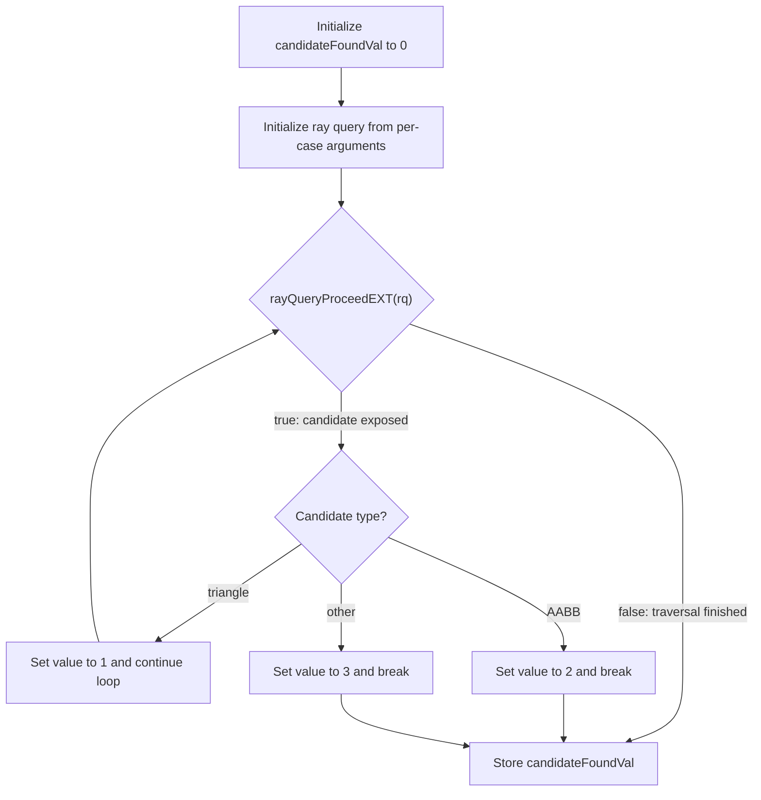

## Overview

**Core question:** Does `rayQueryInitializeEXT` honor each of its six non-AS traversal argument slots independently, so that flipping exactly one argument to a value that must make the ray miss all geometry produces zero candidates, while the all-good configuration reports a triangle candidate?

This page covers the `non_uniform_args` test family registered by [vktRayQueryNonUniformArgsTests.cpp](../../../modules/vulkan/ray_query/vktRayQueryNonUniformArgsTests.cpp#L375-L391). The file is both the implementation and the registration point for the family.

- Seven test case leaves are registered by iterating the `MissCause` enum: one `no_miss` positive control plus six `miss_cause_<i>` leaves, each of which sets exactly one `rayQueryInitializeEXT` argument to a value that must cause the ray to miss every candidate ([vktRayQueryNonUniformArgsTests.cpp:380-L388](../../../modules/vulkan/ray_query/vktRayQueryNonUniformArgsTests.cpp#L380-L388)).
- The host builds a two-triangle BLAS (one offscreen at `z = -5`, one onscreen at `z = +5`) wrapped in one TLAS instance with `cullMask = 0x0F` and `VK_GEOMETRY_INSTANCE_TRIANGLE_FACING_CULL_DISABLE_BIT_KHR`, then writes the per-case arguments into a `std430` storage buffer consumed by the shader ([vktRayQueryNonUniformArgsTests.cpp:190-L243](../../../modules/vulkan/ray_query/vktRayQueryNonUniformArgsTests.cpp#L190-L243)).
- The shader runs one `local_size_x = 1` compute invocation per case, performs an inline ray query with the buffer-supplied arguments, and stores `1` if a triangle candidate was reported, `2` for an AABB candidate, `3` for any other candidate, or `0` if `rayQueryProceedEXT` never reported a candidate ([vktRayQueryNonUniformArgsTests.cpp:120-L167](../../../modules/vulkan/ray_query/vktRayQueryNonUniformArgsTests.cpp#L120-L167)).
- The host reads one `uint32_t` and expects `1` for `no_miss` and `0` for every `miss_cause_*` leaf ([vktRayQueryNonUniformArgsTests.cpp:355-L370](../../../modules/vulkan/ray_query/vktRayQueryNonUniformArgsTests.cpp#L355-L370)).

## Background Knowledge

For the shared acceleration-structure and traversal model, see the
[ray-query category background](../../categories/ray_query.md#background-knowledge).

- **Ray-query initialization inputs.** Besides the acceleration structure, `rayQueryInitializeEXT` receives ray flags, a cull mask, origin, parametric lower bound `Tmin`, direction, and upper bound `Tmax`. Each input independently constrains which instances and primitives traversal can expose. See the [ray traversal chapter](../../../../vulkan-docs/src/chapters/raytraversal.adoc).
- **Cull masks.** A TLAS instance is eligible only when the bitwise AND of its instance mask and the ray's cull mask is nonzero. The instance mask is a visibility filter, not an identifier like `instanceCustomIndex`. For example, a renderer can give all opaque instances mask `0x01` and all alpha-tested foliage mask `0x02`, then trace opaque-only rays with cull mask `0x01` or shadow rays through both groups with cull mask `0x03`.
- **Parametric interval.** Candidate distances are accepted only within the ray interval bounded by `Tmin` and `Tmax`. Origin and direction define the ray line, while the bounds select the segment of that line considered by traversal.
- **Candidate state.** `rayQueryProceedEXT` exposes candidates that satisfy all initialization constraints. Querying intersection type with the candidate selector describes that provisional result, which is distinct from asking for committed state.

## Registration Hierarchy

```text
ray_query.non_uniform_args
├── no_miss
├── miss_cause_1
├── miss_cause_2
├── miss_cause_3
├── miss_cause_4
├── miss_cause_5
└── miss_cause_6
```

Each child is a direct test case leaf. There are no intermediate nodes. The seven leaves correspond one-to-one to the seven values of the `MissCause` enum (`NONE`, `FLAGS`, `CULL_MASK`, `ORIGIN`, `TMIN`, `DIRECTION`, `TMAX`); the registered name uses `no_miss` for `NONE` and `miss_cause_<causeIdx>` (the integer enum value) for the rest ([vktRayQueryNonUniformArgsTests.cpp:385-L386](../../../modules/vulkan/ray_query/vktRayQueryNonUniformArgsTests.cpp#L385-L386)).

## Parameter Dimensions and Observed Values

| Dimension | Registered values | Meaning in this test | Evidence |
|-----------|-------------------|----------------------|----------|
| `MissCause` | `NONE`, `FLAGS`, `CULL_MASK`, `ORIGIN`, `TMIN`, `DIRECTION`, `TMAX` | Selects which single `rayQueryInitializeEXT` argument receives a bad value; all other arguments stay at their good values. `NONE` is the all-good positive control. | [vktRayQueryNonUniformArgsTests.cpp:50-L60](../../../modules/vulkan/ray_query/vktRayQueryNonUniformArgsTests.cpp#L50-L60) |
| Geometry | Two triangles: offscreen at `z = -5`, onscreen at `z = +5`, both around `(x = 0, y = 2)` | Only the onscreen triangle is in the path of the good ray; the offscreen triangle sits behind the origin and is never hit. | [vktRayQueryNonUniformArgsTests.cpp:190-L201](../../../modules/vulkan/ray_query/vktRayQueryNonUniformArgsTests.cpp#L190-L201) |
| TLAS instance | One instance, `mask = 0x0F`, identity transform, `VK_GEOMETRY_INSTANCE_TRIANGLE_FACING_CULL_DISABLE_BIT_KHR` | Face culling is disabled so the `FLAGS` and `CULL_MASK` cases are the only culling-related mechanisms exercised. | [vktRayQueryNonUniformArgsTests.cpp:240-L243](../../../modules/vulkan/ray_query/vktRayQueryNonUniformArgsTests.cpp#L240-L243) |
| Good argument set | `origin = (0, 2, 0)`, `direction = (0, 0, 1)`, `Tmin = 4.0`, `Tmax = 6.0`, `rayFlags = 0`, `cullMask = 0x0F` | Hits the onscreen triangle at distance `5.0`, inside `[4.0, 6.0]`. | [vktRayQueryNonUniformArgsTests.cpp:202-L213](../../../modules/vulkan/ray_query/vktRayQueryNonUniformArgsTests.cpp#L202-L213) |
| Expected output | `1` for `no_miss`, `0` for every `miss_cause_*` | The host requires the positive control to find a triangle candidate and every negative control to find no candidate at all. | [vktRayQueryNonUniformArgsTests.cpp:359](../../../modules/vulkan/ray_query/vktRayQueryNonUniformArgsTests.cpp#L359) |

## Behavior Parameters

The primary behavioral axis is `MissCause`. Each value flips exactly one `rayQueryInitializeEXT` argument to a value that must make the ray miss every candidate, while the other five arguments stay at their good values. The host's expected output distinguishes the positive control (`1`) from the six negative controls (`0`).

### `no_miss` — positive control with all-good arguments

All six arguments take their good values. The ray starts at `(0, 2, 0)`, travels along `+z` over `[4.0, 6.0]`, and hits the onscreen triangle at distance `5.0`. The shader must report a triangle candidate and store `1`. This case proves the scene, the descriptor wiring, and the shader logic are correct before any argument is perturbed.

### `miss_cause_1` — `gl_RayFlagsSkipTrianglesEXT` suppresses triangle candidates

`rayFlags` is set to `256` (`gl_RayFlagsSkipTrianglesEXT`); the other five arguments stay good. The BLAS contains only triangles, so no candidate can be reported and the shader must store `0`.

### `miss_cause_2` — non-matching cull mask culls the instance

`cullMask` is set to `0xF0`; the instance mask is `0x0F`, so the bitwise AND is zero and the instance is skipped. No candidates can be reported and the shader must store `0`.

### `miss_cause_3` — origin above the triangle band

`origin` is set to `(0, 8, 0)`; the direction stays `(0, 0, 1)`. The ray travels parallel to the triangles but eight units above their `y ~= 2` band, so it never intersects either triangle. The shader must store `0`.

### `miss_cause_4` — `Tmin` past the triangle distance

`Tmin` is set to `5.5`; `Tmax` stays `6.0`. The onscreen triangle is at distance `5.0`, which is below `Tmin`, so the traversal rejects it. The shader must store `0`.

### `miss_cause_5` — direction away from the triangle

`direction` is set to `(1, 0, 0)`; the origin stays `(0, 2, 0)`. The ray travels along `+x` and never reaches `z = 5` where the onscreen triangle lives. The shader must store `0`.

### `miss_cause_6` — `Tmax` before the triangle distance

`Tmax` is set to `4.5`; `Tmin` stays `4.0`. The onscreen triangle is at distance `5.0`, which is above `Tmax`, so the traversal rejects it. The shader must store `0`.

## Shader Analysis

The same compute shader source is generated for all seven leaves; only the contents of the `ArgumentsBlock` storage buffer change between cases. The shader initializes a ray query with the buffer-supplied arguments, iterates `rayQueryProceedEXT`, and stores a small `uint` tag based on the first candidate type observed. The representative walkthrough uses `no_miss` because it is the only leaf that exercises the triangle-candidate path and stores a non-zero result; the six `miss_cause_*` leaves all produce `0` because the `proceed` loop exits without ever reporting a candidate.

### Representative Shader Walkthrough 1

#### Parameter Values Chosen

Representative path:

```text
dEQP-VK.ray_query.non_uniform_args.no_miss
```

| Parameter choice | Meaning in this representative case |
|------------------|-------------------------------------|
| `no_miss` | All six `rayQueryInitializeEXT` arguments take their good values. The ray hits the onscreen triangle at distance `5.0`. |
| `local_size_x = 1` | One compute invocation writes one `uint` to `result.candidateFound`. |

#### Purpose

Verify that the all-good argument configuration reports a triangle candidate, causing the shader to store `1` in the result buffer. This is the positive control against which the six miss-cause leaves are compared.

#### Structural Design



For `no_miss`, the only candidate is the onscreen triangle, so the loop sets `candidateFoundVal = 1` once and exits when `rayQueryProceedEXT` returns false on the next iteration. The offscreen triangle at `z = -5` is behind the origin and outside the ray's direction, so it is never reported.

#### Shader Code

```glsl
#version 460 core
#extension GL_EXT_ray_query : require

layout(local_size_x=1, local_size_y=1, local_size_z=1) in;

/// TLAS built by the host with one instance over a two-triangle BLAS
layout(set=0, binding=0) uniform accelerationStructureEXT topLevelAS;
/// Per-case arguments filled by the host; layout matches ArgsBufferData
layout(set=0, binding=1, std430) buffer ArgumentsBlock {
    vec4  origin;
    vec4  direction;
    float Tmin;
    float Tmax;
    uint  rayFlags;
    uint  cullMask;
} args;
/// Single uint output; host pre-fills with 42 to detect a non-writing shader
layout(set=0, binding=2, std430) buffer ResultBlock {
    uint candidateFound;
} result;

void main()
{
    uint candidateFoundVal = 0u;
    rayQueryEXT rq;
    rayQueryInitializeEXT(rq, topLevelAS, args.rayFlags, args.cullMask,
                          args.origin.xyz, args.Tmin, args.direction.xyz, args.Tmax);
    while (rayQueryProceedEXT(rq))
    {
        const uint candidateType = rayQueryGetIntersectionTypeEXT(rq, false);
        if (candidateType == gl_RayQueryCandidateIntersectionTriangleEXT)
        {
            candidateFoundVal = 1u;
        }
        else if (candidateType == gl_RayQueryCandidateIntersectionAABBEXT)
        {
            candidateFoundVal = 2u;
            break;
        }
        else
        {
            candidateFoundVal = 3u;
            break;
        }
    }
    result.candidateFound = candidateFoundVal;
}
```

#### Additional Info

- `updateRayTracingGLSL()` is an identity passthrough in this CTS version ([vkRayTracingUtil.hpp:111](../../../framework/vulkan/vkRayTracingUtil.hpp#L111)), so the reconstructed GLSL is the GLSL the host feeds to `glslangValidator`. The build options target `SPIRV_VERSION_1_4` ([vktRayQueryNonUniformArgsTests.cpp:122](../../../modules/vulkan/ray_query/vktRayQueryNonUniformArgsTests.cpp#L122)).
- The shader inspects the candidate type (`rayQueryGetIntersectionTypeEXT(rq, false)`, the `false` meaning candidate), not the committed type. With `gl_RayFlagsNoneEXT` and opaque triangle geometry, `proceed` auto-commits the triangle candidate, but the shader never calls `rayQueryConfirmIntersectionEXT` and never reads the committed state.
- The only candidate intersection types are Triangle and AABB; a generated intersection is a committed type produced after `rayQueryGenerateIntersectionEXT`, not a candidate type. The `else` branch is therefore defensive and unreachable for a valid candidate state. This BLAS has no AABBs, so the host never expects `2` or `3` as output.
- The host pre-fills the output buffer with byte value `42` before dispatch ([vktRayQueryNonUniformArgsTests.cpp:257-L259](../../../modules/vulkan/ray_query/vktRayQueryNonUniformArgsTests.cpp#L257-L259)). If the shader failed to write at all, the host would read `0x2A2A2A2A` and fail; this sentinel is a defensive check, not part of the tested behavior.

#### Parameter Variation Summary

| Parameter dimension | Shader-level variation | Evidence |
|---------------------|------------------------|----------|
| `MissCause = FLAGS` | Same shader binary; the host writes `rayFlags = 256` into `args`. The traversal skips triangles, `proceed` returns false immediately, and `candidateFoundVal` stays `0`. | [vktRayQueryNonUniformArgsTests.cpp:333](../../../modules/vulkan/ray_query/vktRayQueryNonUniformArgsTests.cpp#L333) |
| `MissCause = CULL_MASK` | Same shader binary; the host writes `cullMask = 0xF0`. The instance is skipped, `proceed` returns false immediately, and `candidateFoundVal` stays `0`. | [vktRayQueryNonUniformArgsTests.cpp:334](../../../modules/vulkan/ray_query/vktRayQueryNonUniformArgsTests.cpp#L334) |
| `MissCause = ORIGIN` | Same shader binary; the host writes `origin = (0, 8, 0, 0)`. The ray passes above the triangles, no candidate is reported, and `candidateFoundVal` stays `0`. | [vktRayQueryNonUniformArgsTests.cpp:329](../../../modules/vulkan/ray_query/vktRayQueryNonUniformArgsTests.cpp#L329) |
| `MissCause = TMIN` | Same shader binary; the host writes `Tmin = 5.5`. The triangle at `t = 5.0` is below `Tmin`, no candidate is reported, and `candidateFoundVal` stays `0`. | [vktRayQueryNonUniformArgsTests.cpp:331](../../../modules/vulkan/ray_query/vktRayQueryNonUniformArgsTests.cpp#L331) |
| `MissCause = DIRECTION` | Same shader binary; the host writes `direction = (1, 0, 0, 0)`. The ray travels along `+x` and never reaches `z = 5`, no candidate is reported, and `candidateFoundVal` stays `0`. | [vktRayQueryNonUniformArgsTests.cpp:330](../../../modules/vulkan/ray_query/vktRayQueryNonUniformArgsTests.cpp#L330) |
| `MissCause = TMAX` | Same shader binary; the host writes `Tmax = 4.5`. The triangle at `t = 5.0` is above `Tmax`, no candidate is reported, and `candidateFoundVal` stays `0`. | [vktRayQueryNonUniformArgsTests.cpp:332](../../../modules/vulkan/ray_query/vktRayQueryNonUniformArgsTests.cpp#L332) |

#### SPIR-V

- Status: generated and validated
- Source: reconstructed GLSL from this walkthrough
- Stage: `comp`
- Target SPIRV version: `spirv1.4`

<details>
<summary>Click to expand SPIRV asm code</summary>

```llvm
; SPIR-V
; Version: 1.4
; Generator: Khronos Glslang Reference Front End; 11
; Bound: 79
; Schema: 0
               OpCapability Shader
               OpCapability RayQueryKHR
               OpExtension "SPV_KHR_ray_query"
          %1 = OpExtInstImport "GLSL.std.450"
               OpMemoryModel Logical GLSL450
               OpEntryPoint GLCompute %main "main" %rq %topLevelAS %args %result
               OpExecutionMode %main LocalSize 1 1 1
               OpSource GLSL 460
               OpSourceExtension "GL_EXT_ray_query"
               OpName %main "main"
               OpName %candidateFoundVal "candidateFoundVal"
               OpName %rq "rq"
               OpName %topLevelAS "topLevelAS"
               OpName %ArgumentsBlock "ArgumentsBlock"
               OpMemberName %ArgumentsBlock 0 "origin"
               OpMemberName %ArgumentsBlock 1 "direction"
               OpMemberName %ArgumentsBlock 2 "Tmin"
               OpMemberName %ArgumentsBlock 3 "Tmax"
               OpMemberName %ArgumentsBlock 4 "rayFlags"
               OpMemberName %ArgumentsBlock 5 "cullMask"
               OpName %args "args"
               OpName %candidateType "candidateType"
               OpName %ResultBlock "ResultBlock"
               OpMemberName %ResultBlock 0 "candidateFound"
               OpName %result "result"
               OpDecorate %topLevelAS Binding 0
               OpDecorate %topLevelAS DescriptorSet 0
               OpDecorate %ArgumentsBlock Block
               OpMemberDecorate %ArgumentsBlock 0 Offset 0
               OpMemberDecorate %ArgumentsBlock 1 Offset 16
               OpMemberDecorate %ArgumentsBlock 2 Offset 32
               OpMemberDecorate %ArgumentsBlock 3 Offset 36
               OpMemberDecorate %ArgumentsBlock 4 Offset 40
               OpMemberDecorate %ArgumentsBlock 5 Offset 44
               OpDecorate %args Binding 1
               OpDecorate %args DescriptorSet 0
               OpDecorate %ResultBlock Block
               OpMemberDecorate %ResultBlock 0 Offset 0
               OpDecorate %result Binding 2
               OpDecorate %result DescriptorSet 0
               OpDecorate %gl_WorkGroupSize BuiltIn WorkgroupSize
       %void = OpTypeVoid
          %3 = OpTypeFunction %void
       %uint = OpTypeInt 32 0
%_ptr_Function_uint = OpTypePointer Function %uint
     %uint_0 = OpConstant %uint 0
         %10 = OpTypeRayQueryKHR
%_ptr_Private_10 = OpTypePointer Private %10
         %rq = OpVariable %_ptr_Private_10 Private
         %13 = OpTypeAccelerationStructureKHR
%_ptr_UniformConstant_13 = OpTypePointer UniformConstant %13
 %topLevelAS = OpVariable %_ptr_UniformConstant_13 UniformConstant
      %float = OpTypeFloat 32
    %v4float = OpTypeVector %float 4
%ArgumentsBlock = OpTypeStruct %v4float %v4float %float %float %uint %uint
%_ptr_StorageBuffer_ArgumentsBlock = OpTypePointer StorageBuffer %ArgumentsBlock
       %args = OpVariable %_ptr_StorageBuffer_ArgumentsBlock StorageBuffer
        %int = OpTypeInt 32 1
      %int_4 = OpConstant %int 4
%_ptr_StorageBuffer_uint = OpTypePointer StorageBuffer %uint
      %int_5 = OpConstant %int 5
      %int_0 = OpConstant %int 0
    %v3float = OpTypeVector %float 3
%_ptr_StorageBuffer_v4float = OpTypePointer StorageBuffer %v4float
      %int_2 = OpConstant %int 2
%_ptr_StorageBuffer_float = OpTypePointer StorageBuffer %float
      %int_1 = OpConstant %int 1
      %int_3 = OpConstant %int 3
       %bool = OpTypeBool
      %false = OpConstantFalse %bool
     %uint_1 = OpConstant %uint 1
     %uint_2 = OpConstant %uint 2
     %uint_3 = OpConstant %uint 3
%ResultBlock = OpTypeStruct %uint
%_ptr_StorageBuffer_ResultBlock = OpTypePointer StorageBuffer %ResultBlock
     %result = OpVariable %_ptr_StorageBuffer_ResultBlock StorageBuffer
     %v3uint = OpTypeVector %uint 3
%gl_WorkGroupSize = OpConstantComposite %v3uint %uint_1 %uint_1 %uint_1
       %main = OpFunction %void None %3
          %5 = OpLabel
%candidateFoundVal = OpVariable %_ptr_Function_uint Function
%candidateType = OpVariable %_ptr_Function_uint Function
               OpStore %candidateFoundVal %uint_0
         %16 = OpLoad %13 %topLevelAS
         %25 = OpAccessChain %_ptr_StorageBuffer_uint %args %int_4
         %26 = OpLoad %uint %25
         %28 = OpAccessChain %_ptr_StorageBuffer_uint %args %int_5
         %29 = OpLoad %uint %28
         %33 = OpAccessChain %_ptr_StorageBuffer_v4float %args %int_0
         %34 = OpLoad %v4float %33
         %35 = OpVectorShuffle %v3float %34 %34 0 1 2
         %38 = OpAccessChain %_ptr_StorageBuffer_float %args %int_2
         %39 = OpLoad %float %38
         %41 = OpAccessChain %_ptr_StorageBuffer_v4float %args %int_1
         %42 = OpLoad %v4float %41
         %43 = OpVectorShuffle %v3float %42 %42 0 1 2
         %45 = OpAccessChain %_ptr_StorageBuffer_float %args %int_3
         %46 = OpLoad %float %45
               OpRayQueryInitializeKHR %rq %16 %26 %29 %35 %39 %43 %46
               OpBranch %47
         %47 = OpLabel
               OpLoopMerge %49 %50 None
               OpBranch %51
         %51 = OpLabel
         %53 = OpRayQueryProceedKHR %bool %rq
               OpBranchConditional %53 %48 %49
         %48 = OpLabel
         %56 = OpRayQueryGetIntersectionTypeKHR %uint %rq %int_0
               OpStore %candidateType %56
         %57 = OpLoad %uint %candidateType
         %58 = OpIEqual %bool %57 %uint_0
               OpSelectionMerge %60 None
               OpBranchConditional %58 %59 %62
         %59 = OpLabel
               OpStore %candidateFoundVal %uint_1
               OpBranch %60
         %62 = OpLabel
         %63 = OpLoad %uint %candidateType
         %64 = OpIEqual %bool %63 %uint_1
               OpSelectionMerge %66 None
               OpBranchConditional %64 %65 %69
         %65 = OpLabel
               OpStore %candidateFoundVal %uint_2
               OpBranch %49
         %69 = OpLabel
               OpStore %candidateFoundVal %uint_3
               OpBranch %49
         %66 = OpLabel
               OpUnreachable
         %60 = OpLabel
               OpBranch %50
         %50 = OpLabel
               OpBranch %47
         %49 = OpLabel
         %75 = OpLoad %uint %candidateFoundVal
         %76 = OpAccessChain %_ptr_StorageBuffer_uint %result %int_0
               OpStore %76 %75
               OpReturn
               OpFunctionEnd
```

</details>

## Runtime Execution and Result Checking

- **Acceleration-structure build.** The host builds one BLAS with two triangle geometries (offscreen first, onscreen second) and one TLAS instance over it, using `cullMask = 0x0F` and `VK_GEOMETRY_INSTANCE_TRIANGLE_FACING_CULL_DISABLE_BIT_KHR` ([vktRayQueryNonUniformArgsTests.cpp:222-L243](../../../modules/vulkan/ray_query/vktRayQueryNonUniformArgsTests.cpp#L222-L243)).
- **Input and output buffers.** A host-visible `std430` storage buffer holds the per-case `ArgsBufferData` (origin, direction, Tmin, Tmax, rayFlags, cullMask). A second host-visible storage buffer holds one `uint32_t` output, pre-filled byte-by-byte with `42`, yielding the non-writing sentinel `0x2A2A2A2A` ([vktRayQueryNonUniformArgsTests.cpp:246-L259](../../../modules/vulkan/ray_query/vktRayQueryNonUniformArgsTests.cpp#L246-L259)).
- **Descriptor set.** Binding 0 is the TLAS, binding 1 is the arguments buffer, binding 2 is the result buffer. All three are storage-buffer or acceleration-structure bindings visible to the compute stage ([vktRayQueryNonUniformArgsTests.cpp:262-L296](../../../modules/vulkan/ray_query/vktRayQueryNonUniformArgsTests.cpp#L262-L296)).
- **Per-case argument fill.** The host selects, for each leaf, one field of `ArgsBufferData` to receive its bad value; the other five fields receive their good values. The struct is `deMemcpy`'d into the input buffer and flushed ([vktRayQueryNonUniformArgsTests.cpp:327-L339](../../../modules/vulkan/ray_query/vktRayQueryNonUniformArgsTests.cpp#L327-L339)).
- **Dispatch.** One compute dispatch of `1 x 1 x 1` runs the single invocation that writes the result ([vktRayQueryNonUniformArgsTests.cpp:342-L345](../../../modules/vulkan/ray_query/vktRayQueryNonUniformArgsTests.cpp#L342-L345)).
- **Copyback.** A `SHADER_WRITE -> HOST_READ` memory barrier is recorded before `endCommandBuffer` and `submitCommandsAndWait`. The host invalidates the output allocation and copies one `uint32_t` out ([vktRayQueryNonUniformArgsTests.cpp:347-L358](../../../modules/vulkan/ray_query/vktRayQueryNonUniformArgsTests.cpp#L347-L358)).
- **Pass/fail condition.** The expected value is `1` for `no_miss` and `0` for every `miss_cause_*` leaf. Any other value (including the `0x2A2A2A2A` sentinel, or `2`/`3` from an unexpected candidate state) fails the case with a message naming the observed and expected values ([vktRayQueryNonUniformArgsTests.cpp:359-L370](../../../modules/vulkan/ray_query/vktRayQueryNonUniformArgsTests.cpp#L359-L370)).

## Failure Meaning

### Failure Cause Mapping

| If this behavior parameter value fails | Possible failure cause(s) |
|----------------------------------------|---------------------------|
| `no_miss` | The all-good configuration did not report a triangle candidate. Points at AS build, descriptor wiring, or triangle-traversal correctness. |
| `miss_cause_1` | `gl_RayFlagsSkipTrianglesEXT` was not honored; a triangle candidate was reported when the flag should have suppressed it. |
| `miss_cause_2` | The cull-mask bit-AND test was not honored; the instance was traversed despite a zero bitwise AND. |
| `miss_cause_3` | The origin was not used correctly in the ray-triangle test; a hit was reported for a ray that passes above the triangle. |
| `miss_cause_4` | `Tmin` was not applied as a lower bound on candidate distance; a hit below `Tmin` was reported. |
| `miss_cause_5` | The direction was not used correctly in the ray-triangle test; a hit was reported for a ray that travels away from the triangle. |
| `miss_cause_6` | `Tmax` was not applied as an upper bound on candidate distance; a hit above `Tmax` was reported. |

A failure that produces `2`, `3`, or the `0x2A2A2A2A` sentinel instead of the expected `0` or `1` is not localized to a single argument: it indicates an unexpected candidate state or, for the sentinel, that the shader did not write. Source-level investigation is needed to localize such cases.

### Cause Analysis

#### Triangle traversal missing on the positive control

**Possible failure symptoms:** The `no_miss` leaf stores `0` (or the `0x2A2A2A2A` sentinel). The host message reports `Output value: 0 (expected 1)`.

**Possible implementation causes:** The good ray starts at `(0, 2, 0)`, travels along `+z` over `[4.0, 6.0]`, and should hit the onscreen triangle at `z = 5` (distance `5.0`). A driver whose BVH build drops the onscreen triangle, whose ray-triangle intersection rejects a valid front-facing hit, or whose `proceed` exits early without reporting the candidate would produce this symptom. The instance uses `VK_GEOMETRY_INSTANCE_TRIANGLE_FACING_CULL_DISABLE_BIT_KHR` so back-face culling cannot drop the hit; if the driver ignores that instance flag, the symptom would also appear. Source-level investigation is needed to distinguish a BVH build bug from an intersection bug.

#### `gl_RayFlagsSkipTrianglesEXT` not honored

**Possible failure symptoms:** The `miss_cause_1` leaf stores `1` instead of `0`. The host message reports `Output value: 1 (expected 0)`.

**Possible implementation causes:** `gl_RayFlagsSkipTrianglesEXT` (= 256 = `0x100`) requires the traversal to skip all triangle primitives. The BLAS contains only triangles, so the `proceed` loop must exit immediately with no candidates. A driver that passes the flag to the BVH but still reports triangle candidates, or that mishandles the flag's bit encoding, would produce a triangle hit and store `1`. The [ray traversal chapter](../../../../vulkan-docs/src/chapters/raytraversal.adoc) defines this flag's semantics.

#### Cull-mask bit-AND test not honored

**Possible failure symptoms:** The `miss_cause_2` leaf stores `1` instead of `0`.

**Possible implementation causes:** The instance mask is `0x0F` and the ray's `cullMask` is `0xF0`. The bitwise AND is zero, so the spec requires the instance to be skipped. A driver that compares the masks with equality, OR, or a wrong bit width, or that ignores the cull mask entirely, would traverse the instance and report the triangle. The [ray traversal chapter](../../../../vulkan-docs/src/chapters/raytraversal.adoc) defines the cull-mask rule.

#### `Tmin` or `Tmax` range bound not applied

**Possible failure symptoms:** The `miss_cause_4` (`Tmin`) or `miss_cause_6` (`Tmax`) leaf stores `1` instead of `0`.

**Possible implementation causes:** The triangle is at distance `5.0`. For `miss_cause_4`, `Tmin = 5.5` and a candidate below `Tmin` must be rejected. For `miss_cause_6`, `Tmax = 4.5` and a candidate above `Tmax` must be rejected. A driver that treats `Tmin` or `Tmax` as a soft hint, that compares with the wrong inequality direction, or that applies the bound only to the ray origin rather than to the candidate distance would report the hit. The two causes share a mechanism; a failure of both leaves together is a strong signal of a range-check issue. Source-level investigation is needed to confirm whether the bug is in the distance computation or in the bound comparison.

#### Origin or direction not used correctly in the ray-triangle test

**Possible failure symptoms:** The `miss_cause_3` (origin) or `miss_cause_5` (direction) leaf stores `1` instead of `0`.

**Possible implementation causes:** For `miss_cause_3`, the origin is `(0, 8, 0)` and the direction is `(0, 0, 1)`: the ray passes eight units above the triangle's `y ~ 2` band. For `miss_cause_5`, the origin is `(0, 2, 0)` and the direction is `(1, 0, 0)`: the ray travels along `+x` and never reaches `z = 5`. A driver that swaps axes in the intersection routine, uses a wrong origin, or fails to normalize the direction into the traversal would report a hit. The two causes share the geometric core of the intersection routine; source-level investigation is needed to localize which input is mis-used.

## Case Pruning

### Requirement-based pruning

- `VK_KHR_acceleration_structure` and `VK_KHR_ray_query` are required ([vktRayQueryNonUniformArgsTests.cpp:104-L108](../../../modules/vulkan/ray_query/vktRayQueryNonUniformArgsTests.cpp#L104-L108)).
- The dispatch is compute only; `rayTracingPipeline` is not required.

### Design-based pruning

- The matrix is the seven `MissCause` values. There is no sweep over ray-flag combinations, cull-mask values, or `Tmin`/`Tmax` ranges; each miss-cause leaf flips one argument to one chosen bad value.
- The geometry is fixed across all leaves. The offscreen triangle at `z = -5` exists so the BLAS contains two geometries; it is never hit by any case because it sits behind the origin along the good direction.
- The shader is fixed across all leaves. No per-leaf shader variant is generated; only the arguments buffer content changes.

## Key Takeaways

- The family asks one mechanical question per leaf: does flipping this single `rayQueryInitializeEXT` argument to a miss-inducing value produce zero candidates, while the all-good configuration produces a triangle candidate?
- The seven leaves map one-to-one to the seven values of the `MissCause` enum; the registered name uses the integer enum index (`miss_cause_1` through `miss_cause_6`), not the semantic name.
- The positive control (`no_miss`) must store `1`; every negative control must store `0`. Any other output (including `2`, `3`, or the `0x2A2A2A2A` sentinel) is not localized to a single argument.
- The leaf that fails identifies the argument mechanism under test—ray flags, cull mask, `Tmin`/`Tmax` range, origin/direction geometry, or general triangle traversal—but the observed value alone does not uniquely localize the implementation defect.

## Source Reference Appendix

| Entry point | Link | Why it matters |
|-------------|------|----------------|
| `MissCause` enum and `NonUniformParams` | [vktRayQueryNonUniformArgsTests.cpp:50-L65](../../../modules/vulkan/ray_query/vktRayQueryNonUniformArgsTests.cpp#L50-L65) | Defines the seven-value behavioral axis and the per-case parameter struct. |
| `ArgsBufferData` struct | [vktRayQueryNonUniformArgsTests.cpp:110-L118](../../../modules/vulkan/ray_query/vktRayQueryNonUniformArgsTests.cpp#L110-L118) | The `std430` layout the shader reads; must match the GLSL `ArgumentsBlock`. |
| `NonUniformArgsCase::checkSupport` | [vktRayQueryNonUniformArgsTests.cpp:104-L108](../../../modules/vulkan/ray_query/vktRayQueryNonUniformArgsTests.cpp#L104-L108) | Acceleration-structure and ray-query feature gates. |
| `NonUniformArgsCase::initPrograms` (compute shader) | [vktRayQueryNonUniformArgsTests.cpp:120-L167](../../../modules/vulkan/ray_query/vktRayQueryNonUniformArgsTests.cpp#L120-L167) | The GLSL source the host compiles; identical for all seven leaves. |
| Geometry and argument constants | [vktRayQueryNonUniformArgsTests.cpp:190-L213](../../../modules/vulkan/ray_query/vktRayQueryNonUniformArgsTests.cpp#L190-L213) | The two-triangle scene and the good/bad argument values per miss cause. |
| `NonUniformArgsInstance::iterate` | [vktRayQueryNonUniformArgsTests.cpp:180-L371](../../../modules/vulkan/ray_query/vktRayQueryNonUniformArgsTests.cpp#L180-L371) | AS build, descriptor setup, per-case argument fill, dispatch, copyback, and the `0`/`1` pass-fail check. |
| Per-case argument fill | [vktRayQueryNonUniformArgsTests.cpp:327-L339](../../../modules/vulkan/ray_query/vktRayQueryNonUniformArgsTests.cpp#L327-L339) | Selects the bad value for the active `MissCause` and the good values for the other five fields. |
| `createNonUniformArgsTests` registration | [vktRayQueryNonUniformArgsTests.cpp:375-L391](../../../modules/vulkan/ray_query/vktRayQueryNonUniformArgsTests.cpp#L375-L391) | Iterates `MissCause` and registers the seven test case leaves. |
| Vulkan spec: ray traversal | [raytraversal.adoc](../../../../vulkan-docs/src/chapters/raytraversal.adoc) | `rayQueryInitializeEXT` argument semantics, ray flags, cull mask, and `Tmin`/`Tmax` range. |
