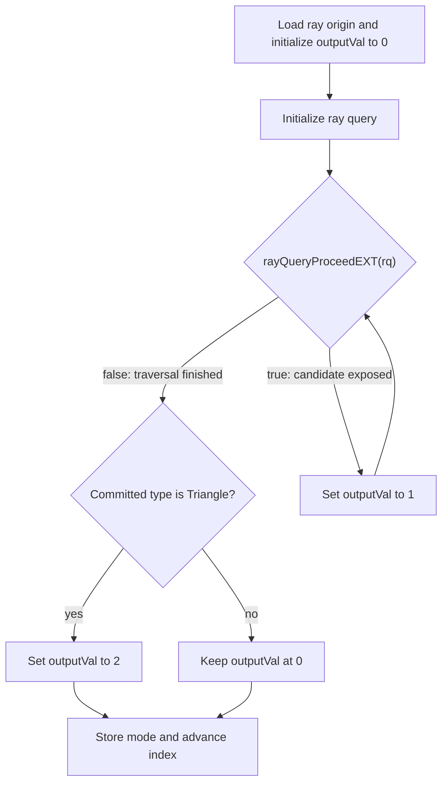

## Overview

**Core question:** Does `VK_EXT_opacity_micromap` classify each subtriangle of a unit triangle BLAS as transparent (no candidate), non-opaque candidate, or opaque committed hit, matching a host-computed reference across the registered combinations of micromap format, special-index mode, subdivision level, opacity override flag, base-triangle offset, shader stage, and copy path?

This page covers the `opacity_micromap` test family registered by [vktRayQueryOpacityMicromapTests.cpp](../../../modules/vulkan/ray_query/vktRayQueryOpacityMicromapTests.cpp#L1267-L1278).

- Two direct children: `render` exercises the traversal path against the full parameter matrix; `copy` exercises the host-side `cmdCopyMicromapEXT` paths with a fixed compute shader.
- The host builds an opacity micromap from a seeded random byte stream, attaches it to a single-triangle BLAS through `VkAccelerationStructureTrianglesOpacityMicromapEXT`, wraps that BLAS in a one-instance TLAS, and dispatches `1024` ray striding invocations from a per-subtriangle centroid buffer.
- The shader never calls `rayQueryConfirmIntersectionEXT`. The implementation's per-subtriangle opacity state therefore decides whether each ray writes `0` (miss), `1` (non-opaque candidate), or `2` (committed triangle hit) into the `modes` SSBO.
- The host reproduces the same `~state` bitwise-NOT encoding, applies the same force-opaque and force-2-state overrides, then compares every entry of `modes` to `expectedOutputModes` and logs per-ray mismatches.
- `render` crosses three shader stages (`vertex_shader`, `compute_shader`, `rgen_shader`) with all 32 combinations of five opacity flag bits, two micromap modes (2-state, 4-state), subdivision levels 0 through 15, four special-index values, and an optional `non_zero_base` variant. `copy` crosses two copy types (`Clone`, `Compact`), two modes, sixteen levels, plus a single `maintenance5` leaf.

## Background Knowledge

For the shared acceleration-structure and traversal model, see the
[ray-query category background](../../categories/ray_query.md#background-knowledge).

- **Opacity micromaps.** An opacity micromap is compact per-subtriangle data attached to triangle geometry. It lets traversal classify fine regions as transparent, opaque, or unknown without running an any-hit shader for every microtriangle.
- **Two-state and four-state formats.** A two-state micromap stores transparent or opaque with one bit per subtriangle. A four-state micromap uses two bits to add unknown-transparent and unknown-opaque states. Subdivision level controls how a base triangle is partitioned into microtriangles.
- **Opacity and ray-query state.** Transparent regions can be skipped, opaque triangle intersections can auto-commit, and unknown/non-opaque regions can remain candidates for shader handling. Thus opacity classification changes whether `rayQueryProceedEXT` exposes a candidate and whether committed state exists afterward.
- **Opacity overrides.** Geometry state can be overridden by instance and ray flags that force opacity, disable micromap use, or force four-state data into two-state behavior. These controls have defined precedence; they modify interpretation rather than rewriting the stored micromap bits.
- **Ray tracing pipeline opt-in.** A ray tracing pipeline that may consult opacity micromaps must declare that use through the corresponding pipeline create flag. Inline queries in non-ray-tracing stages do not use that pipeline declaration.

## Registration Hierarchy

```text
ray_query.opacity_micromap
├── render
└── copy
```

Each direct child is an intermediate node. Test case leaves live several levels deeper inside each subtree, indexed by shader stage, flag mask, special-index use, mode, subdivision level, and (for `render`) the optional `non_zero_base` suffix, or by copy type, mode, level, and (for `copy`) the single `misc.maintenance5` leaf.

## Parameter Dimensions and Observed Values

| Dimension | Registered values | Meaning in this test | Evidence |
|-----------|-------------------|----------------------|----------|
| Test family | `render`, `copy` | Behavioral axis. `render` varies what traversal must do per subtriangle; `copy` varies how the micromap is produced. | [vktRayQueryOpacityMicromapTests.cpp:1273-L1275](../../../modules/vulkan/ray_query/vktRayQueryOpacityMicromapTests.cpp#L1273-L1275) |
| Shader stage (`render` only) | `vertex_shader`, `compute_shader`, `rgen_shader` | Selects the pipeline that hosts the inline ray query. rgen requires `VK_KHR_ray_tracing_pipeline` and sets the opacity-micromap pipeline create flag. | [vktRayQueryOpacityMicromapTests.cpp:1080-L1092](../../../modules/vulkan/ray_query/vktRayQueryOpacityMicromapTests.cpp#L1080-L1092) |
| Test flag mask (`render` only) | All 32 combinations of `force_opaque_instance`, `force_opaque_ray_flag`, `disable_opacity_micromap_instance`, `force_2_state_instance`, `force_2_state_ray_flag`; `NoFlags` when zero | The five opacity override bits crossed fully. Drives both ray flags and per-instance flags. | [vktRayQueryOpacityMicromapTests.cpp:68-L81](../../../modules/vulkan/ray_query/vktRayQueryOpacityMicromapTests.cpp#L68-L81), [L1110-L1124](../../../modules/vulkan/ray_query/vktRayQueryOpacityMicromapTests.cpp#L1110-L1124) |
| Special-index use (`render` only) | `map_value`, `special_index` | `map_value` reads per-subtriangle state from the data buffer. `special_index` sets a single special index value for the whole triangle. | [vktRayQueryOpacityMicromapTests.cpp:1094-L1101](../../../modules/vulkan/ray_query/vktRayQueryOpacityMicromapTests.cpp#L1094-L1101) |
| Special index value (`render` only) | `0`, `1`, `2`, `3` | Maps to `FULLY_TRANSPARENT`, `FULLY_OPAQUE`, `FULLY_UNKNOWN_TRANSPARENT`, `FULLY_UNKNOWN_OPAQUE` after `~specialIndex`. | [vktRayQueryOpacityMicromapTests.cpp:1136-L1155](../../../modules/vulkan/ray_query/vktRayQueryOpacityMicromapTests.cpp#L1136-L1155) |
| Mode (`render`, `copy`) | `2`, `4` | Selects `VK_OPACITY_MICROMAP_FORMAT_2_STATE_EXT` or `VK_OPACITY_MICROMAP_FORMAT_4_STATE_EXT`. | [vktRayQueryOpacityMicromapTests.cpp:1160-L1164](../../../modules/vulkan/ray_query/vktRayQueryOpacityMicromapTests.cpp#L1160-L1164), [L1222-L1226](../../../modules/vulkan/ray_query/vktRayQueryOpacityMicromapTests.cpp#L1222-L1226) |
| Subdivision level | `level_0` through `level_15` | Sets `4^level` subtriangles and the `numRays` shader array length. Limited by `maxOpacity2StateSubdivisionLevel` / `maxOpacity4StateSubdivisionLevel`. | [vktRayQueryOpacityMicromapTests.cpp:1170](../../../modules/vulkan/ray_query/vktRayQueryOpacityMicromapTests.cpp#L1170), [L1232](../../../modules/vulkan/ray_query/vktRayQueryOpacityMicromapTests.cpp#L1232) |
| Non-zero base (`render` only) | absent, `_non_zero_base` | Adds a second triangle to the BLAS and sets `baseTriangle = 1` so only the second triangle's micromap data is consulted. Registered only when `testFlagMask == 0` and `map_value`. | [vktRayQueryOpacityMicromapTests.cpp:1191-L1196](../../../modules/vulkan/ray_query/vktRayQueryOpacityMicromapTests.cpp#L1191-L1196) |
| Copy type (`copy` only) | `Clone`, `Compact` | Selects `CT_CLONE` or `CT_COMPACT`. Both currently emit `VK_COPY_MICROMAP_MODE_CLONE_EXT`. | [vktRayQueryOpacityMicromapTests.cpp:1217-L1255](../../../modules/vulkan/ray_query/vktRayQueryOpacityMicromapTests.cpp#L1217-L1255) |
| Maintenance5 (`copy` only) | `misc.maintenance5` | Replaces `VkBufferUsageFlags` with `VkBufferUsageFlags2CreateInfoKHR` on the micromap data, scratch, origins, and modes buffers. | [vktRayQueryOpacityMicromapTests.cpp:1257-L1264](../../../modules/vulkan/ray_query/vktRayQueryOpacityMicromapTests.cpp#L1257-L1264) |
| Random seed | per-leaf monotonic from `1614674687u` (`render`) or `1614674688u` (`copy`) | Drives the `opacityMicromapData` byte stream. Same seed reproduces the same per-subtriangle state. | [vktRayQueryOpacityMicromapTests.cpp:1073](../../../modules/vulkan/ray_query/vktRayQueryOpacityMicromapTests.cpp#L1073), [L1213](../../../modules/vulkan/ray_query/vktRayQueryOpacityMicromapTests.cpp#L1213) |

## Behavior Parameters

The primary behavioral axis is the test family: `render` versus `copy`. `render` varies what the implementation must do for each subtriangle; `copy` varies how the micromap is produced before traversal.

### `render` — Per-subtriangle opacity traversal across the full flag and format matrix

`render` builds an opacity micromap, attaches it to a triangle BLAS, wraps that BLAS in a single-instance TLAS whose instance flags carry the per-instance override bits, and dispatches the shader. The shader queries the TLAS, proceeds through the candidate, and writes `0`, `1`, or `2` based on whether a candidate appeared and whether it auto-committed. The host computes the same expected code per ray and compares. The flag mask, special-index mode, format, subdivision level, base-triangle offset, and shader stage all vary inside `render`. The flag mask is the dominant sub-axis because each of the five bits changes the expected output code for some subtriangle.

### `copy` — Host-side micromap clone and compact paths

`copy` builds an opacity micromap, clones it into a second backing buffer through `cmdCopyMicromapEXT` with `VK_COPY_MICROMAP_MODE_CLONE_EXT`, then attaches the destination micromap to the BLAS. The shader is fixed to the compute `NoFlags` shape. A failure is consistent with the copy path (or, for the maintenance5 leaf, buffer-usage setup), but this test observes only traversal through the destination and does not independently validate the source micromap. `CT_COMPACT` is registered but currently uses the same `VK_COPY_MICROMAP_MODE_CLONE_EXT` mode as `CT_CLONE` ([vktRayQueryOpacityMicromapTests.cpp:696-L704](../../../modules/vulkan/ray_query/vktRayQueryOpacityMicromapTests.cpp#L696-L704)); source-level investigation is needed to determine whether a separate compact mode was intended.

## Shader Analysis

All `render` leaves and the `copy` leaves share one ray-query body fragment built by `mainLoop` and one shared header built by `sharedHeader` ([vktRayQueryOpacityMicromapTests.cpp:236-L271](../../../modules/vulkan/ray_query/vktRayQueryOpacityMicromapTests.cpp#L236-L271)). The body varies only in the `flagsString` (one of `gl_RayFlagsNoneEXT`, `gl_RayFlagsOpaqueEXT`, optionally OR'd with `gl_RayFlagsForceOpacityMicromap2StateEXT`) and in the array length `numRays = 4^subdivisionLevel`. Three stage wrappers wrap the body: compute uses `gl_GlobalInvocationID.x` and strides by `kNumThreadsAtOnce = 1024`; vertex uses `gl_VertexIndex.x` inside an empty render pass with `rasterizerDiscardEnable = VK_TRUE`; rgen uses `gl_LaunchIDEXT.x` and creates the ray tracing pipeline with `VK_PIPELINE_CREATE_RAY_TRACING_OPACITY_MICROMAP_BIT_EXT`.

The shader never calls `rayQueryConfirmIntersectionEXT`. The candidate-vs-committed distinction depends on the implementation's opacity decision: an opaque subtriangle auto-commits during `rayQueryProceedEXT` and the post-loop check sets `outputVal = 2`; a non-opaque subtriangle leaves the committed type at none and `outputVal` stays at `1`; a fully-transparent subtriangle produces no candidate and `outputVal` stays at `0`.

The representative walkthrough below uses the `render.compute_shader.NoFlags.map_value.2.level_0` path. Compute is the simplest stage wrapper, `NoFlags` exercises the unmodified micromap path, mode 2 has the smallest bit-packing, and level 0 produces a one-ray shader that compiles cleanly.

### Representative Shader Walkthrough 1

#### Parameter Values Chosen

Representative path:

```text
dEQP-VK.ray_query.opacity_micromap.render.compute_shader.NoFlags.map_value.2.level_0
```

| Parameter choice | Meaning in this representative case |
|------------------|-------------------------------------|
| `compute_shader` | Compute is the simplest stage wrapper: one `gl_GlobalInvocationID.x` per ray, stride `1024`. |
| `NoFlags` | No opacity override flags. The per-subtriangle state from the micromap data decides the output. |
| `map_value` | Each subtriangle reads its own state from the data buffer (no special-index override). |
| `2` | 2-state micromap format, one bit per subtriangle. |
| `level_0` | One subtriangle covering the entire parent triangle, so `numRays = 1`. |

#### Purpose

Verify that an inline ray query fired from the single subtriangle centroid through a one-triangle BLAS with an attached 2-state opacity micromap writes the host-expected `0` (transparent) or `2` (opaque) into the `modes` SSBO. The shader body is shared by every other `render` and `copy` leaf; only the dispatch shape, ray flag string, and array length differ.

#### Structural Design



A correct implementation reads the single 2-state bit from the micromap data. If the bit is `0` (`FULLY_TRANSPARENT` after `~state`), no candidate appears and `outputVal` stays `0`. If the bit is `1` (`FULLY_OPAQUE`), the candidate auto-commits and `outputVal` becomes `2`. The host computes the same expected value from the same byte and compares.

#### Shader Code

```glsl
#version 460 core
#extension GL_EXT_ray_query : require
#extension GL_EXT_opacity_micromap : require
/// Top-level acceleration structure carrying the opacity-micromap-tagged triangle instance
layout(set=0, binding=0) uniform accelerationStructureEXT topLevelAS;
/// Per-ray origins, one per subtriangle centroid (z = 1.0, ray fired along -Z)
layout(set=0, binding=1, std430) buffer RayOrigins {
  vec4 values[1];
} origins;
/// Per-ray output code: 0 = miss, 1 = non-opaque candidate, 2 = committed triangle hit
layout(set=0, binding=2, std430) buffer OutputModes {
  uint values[1];
} modes;

layout(local_size_x=128, local_size_y=1, local_size_z=1) in;

void main()
{
    /// 1024 invocations stride through numRays slots; for level_0 there is one slot
    uint index = gl_GlobalInvocationID.x;
    while (index < 1) {
        const uint  cullMask  = 0xFF;
        const vec3  origin    = origins.values[index].xyz;
        const vec3  direction = vec3(0.0, 0.0, -1.0);
        const float tMin      = 0.0f;
        const float tMax      = 2.0f;
        uint        outputVal = 0; /// 0 for miss, 1 for non-opaque, 2 for opaque
        rayQueryEXT rq;
        rayQueryInitializeEXT(rq, topLevelAS, gl_RayFlagsNoneEXT, cullMask, origin, tMin, direction, tMax);
        while (rayQueryProceedEXT(rq)) {
            /// A triangle candidate appeared; the implementation did not auto-commit, so the subtriangle is non-opaque
            if (rayQueryGetIntersectionTypeEXT(rq, false) == gl_RayQueryCandidateIntersectionTriangleEXT) {
                outputVal = 1;
            }
        }
        /// A committed triangle hit means the subtriangle was opaque and auto-committed during proceed
        if (rayQueryGetIntersectionTypeEXT(rq, true) == gl_RayQueryCommittedIntersectionTriangleEXT) {
            outputVal = 2;
        }
        modes.values[index] = outputVal;
        index += 1024;
    }
}
```

#### Additional Info

- The shader body is the verbatim `mainLoop` and `sharedHeader` source literals from [`OpacityMicromapCase::initPrograms`](../../../modules/vulkan/ray_query/vktRayQueryOpacityMicromapTests.cpp#L224-L310) spliced into the compute wrapper at [vktRayQueryOpacityMicromapTests.cpp:296-L309](../../../modules/vulkan/ray_query/vktRayQueryOpacityMicromapTests.cpp#L296-L309). Build options are `vk::ShaderBuildOptions(usedVulkanVersion, SPIRV_VERSION_1_4, 0u, true)` ([vktRayQueryOpacityMicromapTests.cpp:226](../../../modules/vulkan/ray_query/vktRayQueryOpacityMicromapTests.cpp#L226)).
- The `flagsString` substitution at [vktRayQueryOpacityMicromapTests.cpp:230-L234](../../../modules/vulkan/ray_query/vktRayQueryOpacityMicromapTests.cpp#L230-L234) is the only shader-side variation across `render` leaves. `force_opaque_ray_flag` substitutes `gl_RayFlagsOpaqueEXT` for `gl_RayFlagsNoneEXT`; `force_2_state_ray_flag` OR's in `gl_RayFlagsForceOpacityMicromap2StateEXT`. The instance-side flags (`force_opaque_instance`, `disable_opacity_micromap_instance`, `force_2_state_instance`) are encoded into the TLAS instance record at [vktRayQueryOpacityMicromapTests.cpp:759-L769](../../../modules/vulkan/ray_query/vktRayQueryOpacityMicromapTests.cpp#L759-L769) and do not change the shader.
- The vertex wrapper at [vktRayQueryOpacityMicromapTests.cpp:273-L283](../../../modules/vulkan/ray_query/vktRayQueryOpacityMicromapTests.cpp#L273-L283) replaces `gl_GlobalInvocationID.x` with `gl_VertexIndex.x` and runs inside an empty render pass with `rasterizerDiscardEnable = VK_TRUE` ([vktRayQueryOpacityMicromapTests.cpp:462-L463](../../../modules/vulkan/ray_query/vktRayQueryOpacityMicromapTests.cpp#L462-L463)).
- The rgen wrapper at [vktRayQueryOpacityMicromapTests.cpp:284-L295](../../../modules/vulkan/ray_query/vktRayQueryOpacityMicromapTests.cpp#L284-L295) replaces the index with `gl_LaunchIDEXT.x` and adds `#extension GL_EXT_ray_tracing : require`. The ray tracing pipeline sets `VK_PIPELINE_CREATE_RAY_TRACING_OPACITY_MICROMAP_BIT_EXT` (or the maintenance5 `setCreateFlags2` 64-bit equivalent) at [vktRayQueryOpacityMicromapTests.cpp:964-L967](../../../modules/vulkan/ray_query/vktRayQueryOpacityMicromapTests.cpp#L964-L967).
- The array length `numRays = 4^subdivisionLevel` is baked into the shader at compile time. For `level_15` the array length is `2^30`; the resulting SSBO allocations may exceed device memory on common hardware.

#### Parameter Variation Summary

| Parameter dimension | Shader-level variation from this shader | Evidence |
|---------------------|---------------------------------------|----------|
| `testFlagMask & TEST_FLAG_BIT_FORCE_OPAQUE_RAY_FLAG` | Replaces `gl_RayFlagsNoneEXT` with `gl_RayFlagsOpaqueEXT` in the `flagsString`. | [vktRayQueryOpacityMicromapTests.cpp:230-L231](../../../modules/vulkan/ray_query/vktRayQueryOpacityMicromapTests.cpp#L230-L231) |
| `testFlagMask & TEST_FLAG_BIT_FORCE_2_STATE_RAY_FLAG` | OR's `gl_RayFlagsForceOpacityMicromap2StateEXT` into the `flagsString`. | [vktRayQueryOpacityMicromapTests.cpp:233-L234](../../../modules/vulkan/ray_query/vktRayQueryOpacityMicromapTests.cpp#L233-L234) |
| Subdivision level | Changes the `numRays` array length in the shader header (`vec4 values[numRays]` and `uint values[numRays]`). | [vktRayQueryOpacityMicromapTests.cpp:228](../../../modules/vulkan/ray_query/vktRayQueryOpacityMicromapTests.cpp#L228), [L242-L247](../../../modules/vulkan/ray_query/vktRayQueryOpacityMicromapTests.cpp#L242-L247) |
| Shader stage | Replaces the compute wrapper with the vertex or rgen wrapper. The `mainLoop` body is identical. | [vktRayQueryOpacityMicromapTests.cpp:273-L309](../../../modules/vulkan/ray_query/vktRayQueryOpacityMicromapTests.cpp#L273-L309) |
| `useMaintenance5` (`copy` only) | No shader change. The maintenance5 path only changes host-side buffer-usage flags. | [vktRayQueryOpacityMicromapTests.cpp:538-L543](../../../modules/vulkan/ray_query/vktRayQueryOpacityMicromapTests.cpp#L538-L543) |

#### SPIR-V

- Status: generated and validated
- Source: reconstructed GLSL from this walkthrough
- Stage: `comp`
- Target SPIRV version: `spirv1.4`
- Bound: 86

<details>
<summary>Click to expand SPIRV asm code</summary>

```llvm
; SPIR-V
; Version: 1.4
; Generator: Khronos Glslang Reference Front End; 11
; Bound: 86
; Schema: 0
               OpCapability Shader
               OpCapability RayQueryKHR
               OpExtension "SPV_KHR_ray_query"
          %1 = OpExtInstImport "GLSL.std.450"
               OpMemoryModel Logical GLSL450
               OpEntryPoint GLCompute %main "main" %gl_GlobalInvocationID %origins %rq %topLevelAS %modes
               OpExecutionMode %main LocalSize 128 1 1
               OpSource GLSL 460
               OpSourceExtension "GL_EXT_opacity_micromap"
               OpSourceExtension "GL_EXT_ray_query"
               OpName %main "main"
               OpName %index "index"
               OpName %gl_GlobalInvocationID "gl_GlobalInvocationID"
               OpName %origin "origin"
               OpName %RayOrigins "RayOrigins"
               OpMemberName %RayOrigins 0 "values"
               OpName %origins "origins"
               OpName %outputVal "outputVal"
               OpName %rq "rq"
               OpName %topLevelAS "topLevelAS"
               OpName %OutputModes "OutputModes"
               OpMemberName %OutputModes 0 "values"
               OpName %modes "modes"
               OpDecorate %gl_GlobalInvocationID BuiltIn GlobalInvocationId
               OpDecorate %_arr_v4float_uint_1 ArrayStride 16
               OpDecorate %RayOrigins Block
               OpMemberDecorate %RayOrigins 0 Offset 0
               OpDecorate %origins Binding 1
               OpDecorate %origins DescriptorSet 0
               OpDecorate %topLevelAS Binding 0
               OpDecorate %topLevelAS DescriptorSet 0
               OpDecorate %_arr_uint_uint_1 ArrayStride 4
               OpDecorate %OutputModes Block
               OpMemberDecorate %OutputModes 0 Offset 0
               OpDecorate %modes Binding 2
               OpDecorate %modes DescriptorSet 0
               OpDecorate %gl_WorkGroupSize BuiltIn WorkgroupSize
       %void = OpTypeVoid
          %3 = OpTypeFunction %void
       %uint = OpTypeInt 32 0
%_ptr_Function_uint = OpTypePointer Function %uint
     %v3uint = OpTypeVector %uint 3
%_ptr_Input_v3uint = OpTypePointer Input %v3uint
%gl_GlobalInvocationID = OpVariable %_ptr_Input_v3uint Input
     %uint_0 = OpConstant %uint 0
%_ptr_Input_uint = OpTypePointer Input %uint
     %uint_1 = OpConstant %uint 1
       %bool = OpTypeBool
      %float = OpTypeFloat 32
    %v3float = OpTypeVector %float 3
%_ptr_Function_v3float = OpTypePointer Function %v3float
    %v4float = OpTypeVector %float 4
%_arr_v4float_uint_1 = OpTypeArray %v4float %uint_1
 %RayOrigins = OpTypeStruct %_arr_v4float_uint_1
%_ptr_StorageBuffer_RayOrigins = OpTypePointer StorageBuffer %RayOrigins
    %origins = OpVariable %_ptr_StorageBuffer_RayOrigins StorageBuffer
        %int = OpTypeInt 32 1
      %int_0 = OpConstant %int 0
%_ptr_StorageBuffer_v4float = OpTypePointer StorageBuffer %v4float
         %42 = OpTypeRayQueryKHR
%_ptr_Private_42 = OpTypePointer Private %42
         %rq = OpVariable %_ptr_Private_42 Private
         %45 = OpTypeAccelerationStructureKHR
%_ptr_UniformConstant_45 = OpTypePointer UniformConstant %45
 %topLevelAS = OpVariable %_ptr_UniformConstant_45 UniformConstant
   %uint_255 = OpConstant %uint 255
    %float_0 = OpConstant %float 0
   %float_n1 = OpConstant %float -1
         %53 = OpConstantComposite %v3float %float_0 %float_0 %float_n1
    %float_2 = OpConstant %float 2
      %false = OpConstantFalse %bool
       %true = OpConstantTrue %bool
      %int_1 = OpConstant %int 1
     %uint_2 = OpConstant %uint 2
%_arr_uint_uint_1 = OpTypeArray %uint %uint_1
%OutputModes = OpTypeStruct %_arr_uint_uint_1
%_ptr_StorageBuffer_OutputModes = OpTypePointer StorageBuffer %OutputModes
      %modes = OpVariable %_ptr_StorageBuffer_OutputModes StorageBuffer
%_ptr_StorageBuffer_uint = OpTypePointer StorageBuffer %uint
  %uint_1024 = OpConstant %uint 1024
   %uint_128 = OpConstant %uint 128
%gl_WorkGroupSize = OpConstantComposite %v3uint %uint_128 %uint_1 %uint_1
       %main = OpFunction %void None %3
          %5 = OpLabel
      %index = OpVariable %_ptr_Function_uint Function
     %origin = OpVariable %_ptr_Function_v3float Function
  %outputVal = OpVariable %_ptr_Function_uint Function
         %14 = OpAccessChain %_ptr_Input_uint %gl_GlobalInvocationID %uint_0
         %15 = OpLoad %uint %14
               OpStore %index %15
               OpBranch %16
         %16 = OpLabel
               OpLoopMerge %18 %19 None
               OpBranch %20
         %20 = OpLabel
         %21 = OpLoad %uint %index
         %24 = OpULessThan %bool %21 %uint_1
               OpBranchConditional %24 %17 %18
         %17 = OpLabel
         %36 = OpLoad %uint %index
         %38 = OpAccessChain %_ptr_StorageBuffer_v4float %origins %int_0 %36
         %39 = OpLoad %v4float %38
         %40 = OpVectorShuffle %v3float %39 %39 0 1 2
               OpStore %origin %40
               OpStore %outputVal %uint_0
         %48 = OpLoad %45 %topLevelAS
         %50 = OpLoad %v3float %origin
               OpRayQueryInitializeKHR %rq %48 %uint_0 %uint_255 %50 %float_0 %53 %float_2
               OpBranch %55
         %55 = OpLabel
               OpLoopMerge %57 %58 None
               OpBranch %59
         %59 = OpLabel
         %60 = OpRayQueryProceedKHR %bool %rq
               OpBranchConditional %60 %56 %57
         %56 = OpLabel
         %62 = OpRayQueryGetIntersectionTypeKHR %uint %rq %int_0
         %63 = OpIEqual %bool %62 %uint_0
               OpSelectionMerge %65 None
               OpBranchConditional %63 %64 %65
         %64 = OpLabel
               OpStore %outputVal %uint_1
               OpBranch %65
         %65 = OpLabel
               OpBranch %58
         %58 = OpLabel
               OpBranch %55
         %57 = OpLabel
         %68 = OpRayQueryGetIntersectionTypeKHR %uint %rq %int_1
         %69 = OpIEqual %bool %68 %uint_1
               OpSelectionMerge %71 None
               OpBranchConditional %69 %70 %71
         %70 = OpLabel
               OpStore %outputVal %uint_2
               OpBranch %71
         %71 = OpLabel
         %77 = OpLoad %uint %index
         %78 = OpLoad %uint %outputVal
         %80 = OpAccessChain %_ptr_StorageBuffer_uint %modes %int_0 %77
               OpStore %80 %78
         %82 = OpLoad %uint %index
         %83 = OpIAdd %uint %82 %uint_1024
               OpStore %index %83
               OpBranch %19
         %19 = OpLabel
               OpBranch %16
         %18 = OpLabel
               OpReturn
               OpFunctionEnd
```

</details>

## Runtime Execution and Result Checking

- **Micromap data setup.** The host computes `triangleMicromapBytes = (mode == 2) ? (numSubtriangles + 7) / 8 : (numSubtriangles + 3) / 4` and `opacityMicromapBytes = triangleMicromapBytes * triangleCount` where `triangleCount = nonZeroBase ? 2 : 1`. It fills `opacityMicromapData` from a seeded `de::Random` instance ([vktRayQueryOpacityMicromapTests.cpp:514-L528](../../../modules/vulkan/ray_query/vktRayQueryOpacityMicromapTests.cpp#L514-L528)).
- **Micromap data buffer layout.** A single host-visible buffer holds the `VkMicromapTriangleEXT` array at offset 0, the per-triangle `indexBuffer` `uint32_t` at offset 256, and the raw opacity bytes at offset 512 ([vktRayQueryOpacityMicromapTests.cpp:550-L587](../../../modules/vulkan/ray_query/vktRayQueryOpacityMicromapTests.cpp#L550-L587)). The `indexBuffer` value is `~specialIndex` when `useSpecialIndex`, otherwise `0`.
- **Micromap build.** The host queries `vkGetMicromapBuildSizesEXT`, allocates a device-local backing buffer and a scratch buffer, creates the `VkMicromapEXT`, and records `cmdBuildMicromapsEXT` ([vktRayQueryOpacityMicromapTests.cpp:589-L658](../../../modules/vulkan/ray_query/vktRayQueryOpacityMicromapTests.cpp#L589-L658)). A `VkMemoryBarrier2` with `MICROMAP_BUILD_BIT_EXT -> ACCELERATION_STRUCTURE_BUILD_BIT_KHR` (or `MICROMAP_BUILD_BIT_EXT` when a copy follows) separates the build from the next operation ([vktRayQueryOpacityMicromapTests.cpp:660-L682](../../../modules/vulkan/ray_query/vktRayQueryOpacityMicromapTests.cpp#L660-L682)).
- **Optional copy.** When `copyType != CT_NONE`, the host creates a second `VkMicromapEXT` backed by `copyMicromapBackingBuffer` and records `cmdCopyMicromapEXT` with `VK_COPY_MICROMAP_MODE_CLONE_EXT` ([vktRayQueryOpacityMicromapTests.cpp:684-L730](../../../modules/vulkan/ray_query/vktRayQueryOpacityMicromapTests.cpp#L684-L730)). `CT_COMPACT` reuses the same clone mode. A second barrier separates the copy from the BLAS build.
- **BLAS and TLAS build.** The host attaches the micromap to the BLAS triangle geometry through `VkAccelerationStructureTrianglesOpacityMicromapEXT` with `indexType = VK_INDEX_TYPE_UINT32`, `baseTriangle = nonZeroBase ? 1 : 0`, and the built `VkMicromapEXT` ([vktRayQueryOpacityMicromapTests.cpp:733-L753](../../../modules/vulkan/ray_query/vktRayQueryOpacityMicromapTests.cpp#L733-L753)). When `disable_opacity_micromap_instance` is set, the BLAS build flags include `VK_BUILD_ACCELERATION_STRUCTURE_ALLOW_DISABLE_OPACITY_MICROMAPS_EXT` ([vktRayQueryOpacityMicromapTests.cpp:754-L755](../../../modules/vulkan/ray_query/vktRayQueryOpacityMicromapTests.cpp#L754-L755)). The TLAS holds one instance carrying the per-instance opacity flags ([vktRayQueryOpacityMicromapTests.cpp:759-L770](../../../modules/vulkan/ray_query/vktRayQueryOpacityMicromapTests.cpp#L759-L770)).
- **Expected-output computation.** For each ray the host extracts the per-subtriangle state, applies `~state`, applies the force-2-state clamping, then applies the force-opaque override, then maps the result to `0`, `1`, or `2` ([vktRayQueryOpacityMicromapTests.cpp:788-L863](../../../modules/vulkan/ray_query/vktRayQueryOpacityMicromapTests.cpp#L788-L863)). The post-processing pipeline converts `FULLY_UNKNOWN_TRANSPARENT` to `FULLY_UNKNOWN_OPAQUE` unless force-2-state or force-opaque intervened.
- **Origins and modes buffers.** The host fills `origins.values[i]` with `(centroid.x, centroid.y, 1.0, 0.0)` per subtriangle and pre-fills `modes.values[i]` with `0xFF` ([vktRayQueryOpacityMicromapTests.cpp:865-L882](../../../modules/vulkan/ray_query/vktRayQueryOpacityMicromapTests.cpp#L865-L882)).
- **Descriptor set.** b0 is the TLAS, b1 is the origins SSBO, b2 is the modes SSBO ([vktRayQueryOpacityMicromapTests.cpp:884-L921](../../../modules/vulkan/ray_query/vktRayQueryOpacityMicromapTests.cpp#L884-L921)).
- **Dispatch.** Compute dispatches `8 x 1 x 1` workgroups of `128` invocations, totalling `1024` invocations that stride through `numRays` slots. Vertex draws `1024` point vertices inside an empty render pass. rgen calls `cmdTraceRaysKHR(1024, 1, 1)` ([vktRayQueryOpacityMicromapTests.cpp:928-L984](../../../modules/vulkan/ray_query/vktRayQueryOpacityMicromapTests.cpp#L928-L984)).
- **Result copyback.** A `VkMemoryBarrier` with `SHADER_WRITE -> HOST_READ` separates the shader run from host readback. The host calls `invalidateAlloc` and `deMemcpy`s the `modes` buffer into `outputData` ([vktRayQueryOpacityMicromapTests.cpp:1019-L1038](../../../modules/vulkan/ray_query/vktRayQueryOpacityMicromapTests.cpp#L1019-L1038)).
- **Pass/fail scan.** The host compares each `outputData[i]` to `expectedOutputModes[i]`, logs `"Ray <idx>: expected <ref> and found <res>"` on mismatch, and calls `TCU_FAIL` when any mismatch exists ([vktRayQueryOpacityMicromapTests.cpp:1040-L1064](../../../modules/vulkan/ray_query/vktRayQueryOpacityMicromapTests.cpp#L1040-L1064)).

## Failure Meaning

### Failure Cause Mapping

| If this behavior parameter value fails | Possible failure cause(s) |
|----------------------------------------|---------------------------|
| `render` (any leaf) | Micromap build encoded the wrong per-subtriangle state, or traversal did not consult the micromap, or the implementation misapplied one of the five opacity overrides (force-opaque instance / ray, disable micromap, force-2-state instance / ray), or the shader stage wrapper mis-dispatched its rays. |
| `render` (`map_value` leaves) | The host-computed reference and the device disagreed on the per-subtriangle state lookup. Indicates a packing bug in the 2-state (1 bit/subtriangle) or 4-state (2 bits/subtriangle) micromap data, or wrong bit ordering during traversal. |
| `render` (`special_index` leaves) | The special-index value (0..3 -> FULLY_TRANSPARENT, FULLY_OPAQUE, FULLY_UNKNOWN_TRANSPARENT, FULLY_UNKNOWN_OPAQUE) was not honored, or the bitwise-NOT encoding (`~specialIndex`) was misread. |
| `render` (`force_opaque_*` leaves) | A force-opaque instance or ray flag failed to override the per-subtriangle state, leaving a transparent or unknown subtriangle as a candidate or miss. |
| `render` (`disable_opacity_micromap_instance` leaves) | The `ALLOW_DISABLE_OPACITY_MICROMAPS_EXT` build flag or the per-instance disable flag was not honored, so traversal still consulted the micromap when it should have treated the triangle as a normal triangle. |
| `render` (`force_2_state_*` leaves) | A force-2-state instance or ray flag failed to clamp 4-state entries to 2-state, leaving an unknown-opaque subtriangle as a non-opaque candidate instead of an opaque committed hit (or an unknown-transparent as a candidate instead of a miss). |
| `render` (`non_zero_base` leaves) | The `baseTriangle` offset was not applied when indexing the micromap, so a multi-triangle BLAS read state from the wrong triangle's slot. |
| `render` (`rgen_shader` leaves) | The `VK_PIPELINE_CREATE_RAY_TRACING_OPACITY_MICROMAP_BIT_EXT` pipeline create flag (or its maintenance5 64-bit equivalent) was not honored, so the ray tracing pipeline did not consult the micromap during traversal. |
| `copy` (`Clone` / `Compact` / `maintenance5` leaves) | `cmdCopyMicromapEXT` produced a destination micromap that does not traversal-match the source, or the maintenance5 `VkBufferUsageFlags2CreateInfo` path produced a wrong-shape micromap data buffer. |

### Cause Analysis

#### Micromap build and data layout

**Possible failure symptoms:** A `render` leaf with `map_value` and `NoFlags` fails. The per-ray log shows `expected 0` with `found 2` (or the reverse), or `expected 1` with `found 0` or `found 2`. The mismatch localizes to specific subtriangle indices.

**Possible implementation causes:** The host packs 2-state data at one bit per subtriangle and 4-state data at two bits per subtriangle. A driver that interprets the bit order differently (LSB-first versus MSB-first within a byte, or different bit ordering across bytes) would read the wrong state for some subtriangles. The Vulkan spec defines the bit packing inside `VkMicromapBuildInfoEXT::data`; an implementation that disagrees with the spec on which bit corresponds to which subtriangle index would produce the symptom. Source-level investigation is needed to determine whether the failure is in the build encoder or in the traversal-side reader.

#### Special-index encoding

**Possible failure symptoms:** A `render` leaf with `special_index.<0..3>` fails. All rays in one leaf report the same wrong code, because the special index applies to the whole triangle.

**Possible implementation causes:** The host writes `~specialIndex` into the `indexBuffer` slot. The four resulting `uint32_t` values are `0xFFFFFFFF` (`FULLY_TRANSPARENT`), `0xFFFFFFFE` (`FULLY_OPAQUE`), `0xFFFFFFFD` (`FULLY_UNKNOWN_TRANSPARENT`), and `0xFFFFFFFC` (`FULLY_UNKNOWN_OPAQUE`). A driver that treats the `indexBuffer` as a signed `int32_t` instead of an unsigned one, or that masks the wrong number of bits, would map the special index to the wrong state. The Vulkan spec defines these as negative `int32_t` special indices; an implementation that reads them as unsigned positive values would produce the symptom. Source-level investigation is needed to confirm whether the failure is in the build input parsing or in the traversal-side special-index lookup.

#### Opacity override flag handling

**Possible failure symptoms:** A `render` leaf with one of `force_opaque_instance`, `force_opaque_ray_flag`, `disable_opacity_micromap_instance`, `force_2_state_instance`, or `force_2_state_ray_flag` set fails. The mismatch pattern depends on the flag: force-opaque leaves show `expected 2` with `found 0` or `found 1`; disable-micromap leaves show `expected 2` with `found 0` (when the underlying bit was transparent) or `expected 1` with `found 0`; force-2-state leaves with 4-state data show `expected 2` with `found 1` (unknown-opaque that should have clamped to opaque) or `expected 0` with `found 1` (unknown-transparent that should have clamped to transparent).

**Possible implementation causes:** The five flag bits cross instance flags and ray flags. The Vulkan spec defines precedence: ray flags override instance flags, and force-opaque overrides force-2-state. A driver that applies the bits in the wrong order, that ignores the per-instance flag when the matching ray flag is unset, or that fails to set the `ALLOW_DISABLE_OPACITY_MICROMAPS_EXT` build flag on the BLAS when the disable flag is in use would produce one of these symptoms. Source-level investigation is needed to localize which flag is mishandled.

#### Base-triangle offset

**Possible failure symptoms:** A `render` leaf with the `_non_zero_base` suffix fails. The host builds a two-triangle BLAS and sets `baseTriangle = 1`, so only the second triangle's micromap data is consulted. The mismatch pattern matches a wrong-triangle data read.

**Possible implementation causes:** The `baseTriangle` field of `VkAccelerationStructureTrianglesOpacityMicromapEXT` shifts the per-triangle micromap indexing. A driver that ignores `baseTriangle` and always starts from triangle 0 would read the first triangle's micromap data, which the host seeds with random bytes but never uses for the expected-output computation. Source-level investigation is needed to confirm whether the failure is in the BLAS build input parsing or in the traversal-side indexing.

#### Ray tracing pipeline create flag

**Possible failure symptoms:** A `render` leaf under `rgen_shader` fails on every ray, while the matching `compute_shader` and `vertex_shader` leaves with the same flag mask, mode, and level pass. The mismatch pattern suggests the micromap was not consulted at all (every ray reports the default behavior of a non-opaque triangle without a micromap).

**Possible implementation causes:** The rgen pipeline sets `VK_PIPELINE_CREATE_RAY_TRACING_OPACITY_MICROMAP_BIT_EXT` (or its maintenance5 `setCreateFlags2` 64-bit equivalent) at [vktRayQueryOpacityMicromapTests.cpp:964-L967](../../../modules/vulkan/ray_query/vktRayQueryOpacityMicromapTests.cpp#L964-L967). The Vulkan spec allows implementations to skip micromap processing on ray tracing pipelines that do not set this flag. A driver that drops the flag during pipeline creation, or that fails to consult the micromap when the flag is set, would produce the symptom. Source-level investigation is needed to determine whether the flag is preserved through pipeline creation.

#### Copy path

**Possible failure symptoms:** A `copy` leaf fails. A passing `render` leaf with the same mode and level provides useful comparison coverage, but it uses a different seed and does not validate the source micromap used by the copy leaf, so the observation does not isolate the destination copy by itself.

**Possible implementation causes:** The host clones the source micromap into a second backing buffer through `cmdCopyMicromapEXT` with `VK_COPY_MICROMAP_MODE_CLONE_EXT`, then attaches the destination micromap to the BLAS. A driver that produces a destination micromap with different internal layout, missing metadata, or wrong contents would produce a traversal mismatch; source micromap build or shared traversal defects can produce the same observed failure. `CT_COMPACT` reuses the clone mode in this CTS version, so both copy groups exercise that mechanism with separately seeded data. Source-level investigation is needed to determine whether `CT_COMPACT` was intended to use a separate compact mode.

#### Maintenance5 buffer flags

**Possible failure symptoms:** The single `copy.misc.maintenance5` leaf fails where the matching non-maintenance5 `copy.Clone.2.level_0` leaf passes. The mismatch localizes to the buffer-usage flag migration.

**Possible implementation causes:** The maintenance5 path replaces `VkBufferUsageFlags` with `VkBufferUsageFlags2CreateInfoKHR` on the micromap data, scratch, origins, and modes buffers ([vktRayQueryOpacityMicromapTests.cpp:538-L543](../../../modules/vulkan/ray_query/vktRayQueryOpacityMicromapTests.cpp#L538-L543), [L625-L630](../../../modules/vulkan/ray_query/vktRayQueryOpacityMicromapTests.cpp#L625-L630), [L778-L783](../../../modules/vulkan/ray_query/vktRayQueryOpacityMicromapTests.cpp#L778-L783)). The `pNext` chain replaces the `usage` field with zero and moves the same bits into the 64-bit `pUsageFlags2` struct. A driver that ignores `VkBufferUsageFlags2CreateInfoKHR`, that masks bits differently between the two forms, or that mishandles the `pNext` chain during buffer creation would produce a wrong-shape buffer or a build that reads garbage. Source-level investigation is needed to localize which buffer creation call is at fault.

## Case Pruning

### Requirement-based pruning

- All leaves require `VK_KHR_ray_query`, `VK_KHR_acceleration_structure`, and `VK_EXT_opacity_micromap` device extensions, plus their feature bits ([vktRayQueryOpacityMicromapTests.cpp:153-L175](../../../modules/vulkan/ray_query/vktRayQueryOpacityMicromapTests.cpp#L153-L175)).
- `rgen_shader` leaves also require `VK_KHR_ray_tracing_pipeline` with `rayTracingPipeline == VK_TRUE` ([vktRayQueryOpacityMicromapTests.cpp:177-L186](../../../modules/vulkan/ray_query/vktRayQueryOpacityMicromapTests.cpp#L177-L186)).
- `vertex_shader` leaves require `DEVICE_CORE_FEATURE_VERTEX_PIPELINE_STORES_AND_ATOMICS` ([vktRayQueryOpacityMicromapTests.cpp:188-L195](../../../modules/vulkan/ray_query/vktRayQueryOpacityMicromapTests.cpp#L188-L195)).
- `useMaintenance5 = true` leaves require `VK_KHR_maintenance5` ([vktRayQueryOpacityMicromapTests.cpp:159-L160](../../../modules/vulkan/ray_query/vktRayQueryOpacityMicromapTests.cpp#L159-L160)).
- Each `map_value` leaf checks `subdivisionLevel` against `maxOpacity2StateSubdivisionLevel` (for mode 2) or `maxOpacity4StateSubdivisionLevel` (for mode 4) and throws `NotSupportedError` when exceeded ([vktRayQueryOpacityMicromapTests.cpp:200-L216](../../../modules/vulkan/ray_query/vktRayQueryOpacityMicromapTests.cpp#L200-L216)).

### Design-based pruning

- `_non_zero_base` is registered only when `testFlagMask == 0` and `useSpecialIndex == false` ([vktRayQueryOpacityMicromapTests.cpp:1191-L1196](../../../modules/vulkan/ray_query/vktRayQueryOpacityMicromapTests.cpp#L1191-L1196)). The combination of `nonZeroBase` with opacity override flags would not change the test's coverage of the `baseTriangle` offset, so the matrix restricts the variant to the baseline configuration.
- `copy` uses only the compute shader and `NoFlags` configuration ([vktRayQueryOpacityMicromapTests.cpp:1234-L1245](../../../modules/vulkan/ray_query/vktRayQueryOpacityMicromapTests.cpp#L1234-L1245)). The copy path is independent of the traversal-side flag matrix, so crossing copy type with shader stage or flag mask would not add coverage.
- `CT_COMPACT` is registered as a separate copy type but currently emits the same `VK_COPY_MICROMAP_MODE_CLONE_EXT` mode as `CT_CLONE` ([vktRayQueryOpacityMicromapTests.cpp:696-L704](../../../modules/vulkan/ray_query/vktRayQueryOpacityMicromapTests.cpp#L696-L704)). The two groups exercise the same copy mode with different seeds; their names do not select distinct mechanisms in this source version.
- `useMaintenance5 = true` has a single leaf because the maintenance5 path only changes host-side buffer-usage flags. Crossing it with the full `render` matrix would not change the test's coverage of the buffer-flags migration.
- `subdivisionLevel` runs 0 through 15 unconditionally inside `render` and `copy`. The support check at [vktRayQueryOpacityMicromapTests.cpp:200-L216](../../../modules/vulkan/ray_query/vktRayQueryOpacityMicromapTests.cpp#L200-L216) throws `NotSupportedError` for levels above the device's reported maximum, which is the only pruning for this dimension.

## Key Takeaways

- The behavior parameter is the test family: `render` varies what traversal must do per subtriangle; `copy` varies how the micromap is produced before traversal. All other dimensions are configuration axes inside `render` or `copy`.
- The shader never calls `rayQueryConfirmIntersectionEXT`. The implementation's per-subtriangle opacity decision selects `0` (transparent, no candidate), `1` (non-opaque candidate), or `2` (opaque committed hit). The host computes the same expected code with the same `~state` bitwise-NOT encoding and the same flag overrides.
- The five opacity override flag bits are crossed fully (32 combinations) inside `render`. Force-opaque, disable-micromap, and force-2-state each exercise a distinct clause of the opacity-micromap spec; failures localize to the flag combination that breaks.
- `nonZeroBase` exercises the `baseTriangle` offset path on a two-triangle BLAS. `rgen_shader` exercises the `VK_PIPELINE_CREATE_RAY_TRACING_OPACITY_MICROMAP_BIT_EXT` pipeline create flag. Both are restricted to `testFlagMask == 0` (for `nonZeroBase`) or to the rgen stage (for the pipeline flag) because the dimension they test does not interact with the rest of the matrix.
- `copy` exercises the host-side `cmdCopyMicromapEXT` clone path plus the maintenance5 buffer-flags migration. `CT_COMPACT` reuses `VK_COPY_MICROMAP_MODE_CLONE_EXT`; source-level investigation is needed to determine whether a separate compact mode was intended.
- `subdivisionLevel = 15` produces `2^30` rays and ~4 GiB of `modes` SSBO. Devices with insufficient memory may fail the allocation; the support check does not pre-validate allocation size.

## Source Reference Appendix

| Entry point | Link | Why it matters |
|-------------|------|----------------|
| `TestParams` struct | [vktRayQueryOpacityMicromapTests.cpp:98-L110](../../../modules/vulkan/ray_query/vktRayQueryOpacityMicromapTests.cpp#L98-L110) | Defines every parameter the test crosses. |
| `TestFlagBits` enum and names | [vktRayQueryOpacityMicromapTests.cpp:68-L81](../../../modules/vulkan/ray_query/vktRayQueryOpacityMicromapTests.cpp#L68-L81) | The five opacity override flag bits. |
| `CopyType` enum and names | [vktRayQueryOpacityMicromapTests.cpp:83-L96](../../../modules/vulkan/ray_query/vktRayQueryOpacityMicromapTests.cpp#L83-L96) | Clone and Compact copy modes. |
| `OpacityMicromapCase::checkSupport` | [vktRayQueryOpacityMicromapTests.cpp:153-L217](../../../modules/vulkan/ray_query/vktRayQueryOpacityMicromapTests.cpp#L153-L217) | Extension and feature gates, plus per-leaf subdivision-level limit checks. |
| `OpacityMicromapCase::initPrograms` | [vktRayQueryOpacityMicromapTests.cpp:224-L310](../../../modules/vulkan/ray_query/vktRayQueryOpacityMicromapTests.cpp#L224-L310) | Source literal for the shared header, main loop, and three stage wrappers. |
| `calcSubtriangleCentroid` | [vktRayQueryOpacityMicromapTests.cpp:323-L375](../../../modules/vulkan/ray_query/vktRayQueryOpacityMicromapTests.cpp#L323-L375) | Bit-twiddling subtriangle centroid generator used to seed `origins`. |
| Micromap build and copy | [vktRayQueryOpacityMicromapTests.cpp:530-L730](../../../modules/vulkan/ray_query/vktRayQueryOpacityMicromapTests.cpp#L530-L730) | `cmdBuildMicromapsEXT`, `cmdCopyMicromapEXT`, and the surrounding barriers. |
| BLAS and TLAS build | [vktRayQueryOpacityMicromapTests.cpp:733-L770](../../../modules/vulkan/ray_query/vktRayQueryOpacityMicromapTests.cpp#L733-L770) | Micromap-to-geometry attachment, build flags, instance flags. |
| Expected-output computation | [vktRayQueryOpacityMicromapTests.cpp:788-L863](../../../modules/vulkan/ray_query/vktRayQueryOpacityMicromapTests.cpp#L788-L863) | The host reference model: `~state` mapping, force-2-state clamping, force-opaque override, final state-to-output mapping. |
| Dispatch and copyback | [vktRayQueryOpacityMicromapTests.cpp:923-L1025](../../../modules/vulkan/ray_query/vktRayQueryOpacityMicromapTests.cpp#L923-L1025) | Stage-specific pipeline creation, dispatch, and `SHADER_WRITE -> HOST_READ` barrier. |
| Pass/fail scan | [vktRayQueryOpacityMicromapTests.cpp:1033-L1064](../../../modules/vulkan/ray_query/vktRayQueryOpacityMicromapTests.cpp#L1033-L1064) | Per-ray comparison and `TCU_FAIL` on mismatch. |
| `addBasicTests` (`render`) | [vktRayQueryOpacityMicromapTests.cpp:1071-L1209](../../../modules/vulkan/ray_query/vktRayQueryOpacityMicromapTests.cpp#L1071-L1209) | Registration: 3 stages x 32 flag masks x (special_index 0..3 or 2 modes x 16 levels x optional non_zero_base). |
| `addCopyTests` (`copy`) | [vktRayQueryOpacityMicromapTests.cpp:1211-L1265](../../../modules/vulkan/ray_query/vktRayQueryOpacityMicromapTests.cpp#L1211-L1265) | Registration: 2 copy types x 2 modes x 16 levels plus 1 maintenance5 leaf. |
| `createOpacityMicromapTests` | [vktRayQueryOpacityMicromapTests.cpp:1267-L1278](../../../modules/vulkan/ray_query/vktRayQueryOpacityMicromapTests.cpp#L1267-L1278) | Top-level registration: `render` and `copy` direct children. |
