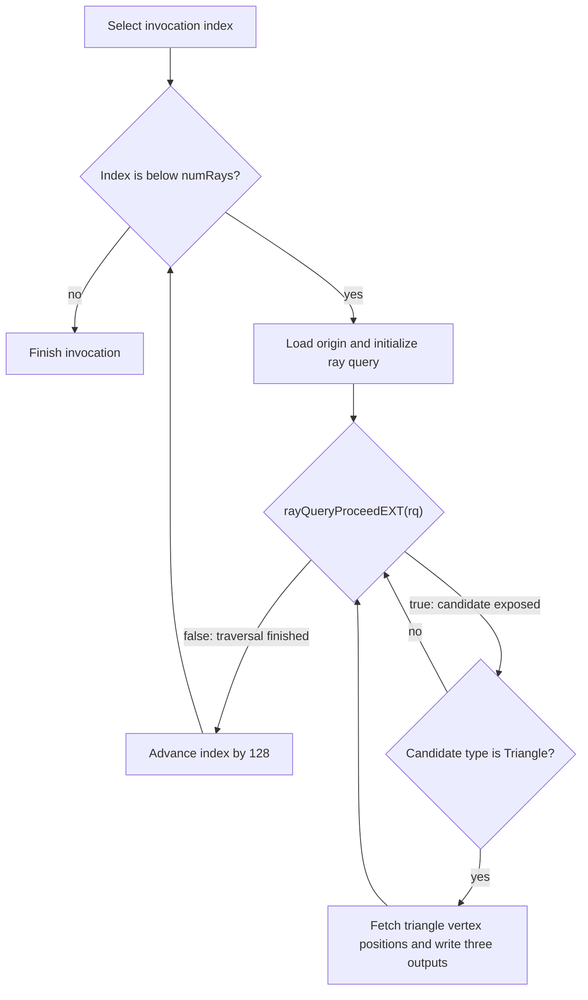

## Overview

**Core question:** Does `VK_KHR_ray_tracing_position_fetch` return the original triangle vertex positions stored in a BLAS, in object space, when invoked through `rayQueryGetIntersectionTriangleVertexPositionsEXT` across 15 vertex formats, CPU and GPU BLAS builds, an optional non-identity instance transform, and three shader stages?

This page covers the `position_fetch` test family registered by [vktRayQueryPositionFetchTests.cpp](../../../modules/vulkan/ray_query/vktRayQueryPositionFetchTests.cpp#L732-L840). The file is both the implementation and the registration point for the family.

- Three shader-source groups (`vertex_shader`, `compute_shader`, `rgen_shader`) are the direct children of `position_fetch`. Each group runs the same shader body in a different stage, dispatched by `cmdDraw(128 points)`, `cmdDispatch(1,1,1)` with `local_size_x=128`, or `cmdTraceRaysKHR(128,1,1)`.
- Each shader-source group contains a `cpu_built` and a `gpu_built` build-type subgroup, then 15 vertex-format subgroups, then two flag-mask leaves: `NoFlags` and `instance_transform`. The full matrix is `3 x 2 x 15 x 2 = 180` leaves.
- The three vertices `(0,0,0), (1,0,0), (0,1,0)` define a triangle template. For sfloat formats with 3+ used channels, the host copies that template into four triangle-geometry entries (`g in 0..3`), each with four triangles (`t in 0..3`), for 16 triangles in one BLAS built with `VK_BUILD_ACCELERATION_STRUCTURE_ALLOW_DATA_ACCESS_KHR`. One randomly chosen `(g, t)` copy is placed at `z = 0`; the other 15 copies are placed at distinct depths derived from `10 + 4*g + t`. The chosen `(g, t)` is randomized per leaf by a seed derived from `(buildType, vertexFormat, testFlagMask)`.
- A single ray starts at `(0.25, 0.25, 1.0)` and travels `(0, 0, -1)` over `t in [0, 2]`, hitting the chosen triangle at `z = 0`. The shader calls `rayQueryGetIntersectionTriangleVertexPositionsEXT(rq, false, outputVal)` on the candidate and writes the three fetched positions to a host-visible buffer.
- The host compares each fetched `.xyz` to the original triangle vertex under `dot(expected - fetched, expected - fetched) < 1e-5`. The threshold is a squared-length comparison, so the effective length tolerance is `sqrt(1e-5) ~ 0.00316`. This accommodates quantization in the lowest-precision tested format, `R8G8B8_SNORM`, while remaining tight enough to expose wrong-triangle fetches, instance-transform application, or a significant precision regression.

## Background Knowledge

For the shared acceleration-structure and traversal model, see the
[ray-query category background](../../categories/ray_query.md#background-knowledge).

- **Object-space vertex positions.** BLAS triangle vertices are stored in object space. A TLAS instance transform places that object in world space, but `rayQueryGetIntersectionTriangleVertexPositionsEXT` returns the original object-space vertices rather than transformed world-space positions.
- **Candidate versus committed fetch.** Position fetch can target the current candidate triangle or the committed triangle. The selector must match the traversal state whose vertices the caller intends to inspect.
- **Acceleration-structure data access.** Fetching source triangle positions requires the BLAS to retain accessible geometry data, enabled by `VK_BUILD_ACCELERATION_STRUCTURE_ALLOW_DATA_ACCESS_KHR`; ordinary traversal does not necessarily require that retained access.
- **Vertex formats.** BLAS vertices can use several floating-point or normalized formats with different component widths and counts. Decoding must preserve the represented position, including defined handling of omitted components, independently of whether the BLAS was built on the host or device.

## Registration Hierarchy

```text
ray_query.position_fetch
├── vertex_shader
├── compute_shader
└── rgen_shader
```

Each direct child is a shader-source group. Two intermediate levels sit below each group: `cpu_built` or `gpu_built` (build type), then one of 15 lowercase format names (for example `r32g32b32_sfloat`). Each format group holds two test case leaves, `NoFlags` and `instance_transform`, registered by iterating `testFlagMask` from `0` to `TEST_FLAG_BIT_LAST` ([vktRayQueryPositionFetchTests.cpp:803-L831](../../../modules/vulkan/ray_query/vktRayQueryPositionFetchTests.cpp#L803-L831)).

## Parameter Dimensions and Observed Values

| Dimension | Registered values | Meaning in this test | Evidence |
|-----------|-------------------|----------------------|----------|
| Shader source | `vertex_shader`, `compute_shader`, `rgen_shader` | Selects the pipeline that runs the ray query. Same shader body in each stage; only the `index` derivation, dispatch mechanism, and stage-specific feature gate differ. | [vktRayQueryPositionFetchTests.cpp:750-L762](../../../modules/vulkan/ray_query/vktRayQueryPositionFetchTests.cpp#L750-L762) |
| Build type | `cpu_built` (`VK_ACCELERATION_STRUCTURE_BUILD_TYPE_HOST_KHR`), `gpu_built` (`VK_ACCELERATION_STRUCTURE_BUILD_TYPE_DEVICE_KHR`) | Where the BLAS and TLAS build runs. `cpu_built` requires `accelerationStructureHostCommands`. | [vktRayQueryPositionFetchTests.cpp:738-L743](../../../modules/vulkan/ray_query/vktRayQueryPositionFetchTests.cpp#L738-L743) |
| Vertex format | `r32g32_sfloat`, `r32g32b32_sfloat`, `r16g16_sfloat`, `r16g16b16a16_sfloat`, `r16g16_snorm`, `r16g16b16a16_snorm`, `r8g8_snorm`, `r8g8b8_snorm`, `r8g8b8a8_snorm`, `r16g16b16_snorm`, `r16g16b16_sfloat`, `r32g32b32a32_sfloat`, `r64g64_sfloat`, `r64g64b64_sfloat`, `r64g64b64a64_sfloat` | The BLAS vertex buffer format. Drives the multi-triangle vs single-triangle scene split and the precision of the fetched positions. | [vktRayQueryPositionFetchTests.cpp:764-L783](../../../modules/vulkan/ray_query/vktRayQueryPositionFetchTests.cpp#L764-L783) |
| Test flag mask | `NoFlags` (mask 0), `instance_transform` (mask `TEST_FLAG_BIT_INSTANCE_TRANSFORM = 1`) | Selects whether the TLAS instance transform is identity or `diag(0.98, 0.97, 0.99)`. The expected output is the same for both because position fetch returns object-space positions. | [vktRayQueryPositionFetchTests.cpp:71-L78](../../../modules/vulkan/ray_query/vktRayQueryPositionFetchTests.cpp#L71-L78), [L803-L820](../../../modules/vulkan/ray_query/vktRayQueryPositionFetchTests.cpp#L803-L820) |
| Random seed | `(((buildType & 0xFF) << 24) | ((vertexFormat & 0xFF) << 16) | (testFlagMask & 0xFF))` | Drives the multi-triangle `chosenGeom` and `chosenTri` selection. Deterministic per leaf. | [vktRayQueryPositionFetchTests.cpp:88-L91](../../../modules/vulkan/ray_query/vktRayQueryPositionFetchTests.cpp#L88-L91) |
| Ray origin | `(0.25, 0.25, 1.0, 0.0)` | Fixed single ray. The host writes it to the origins buffer; the shader hard-codes direction `(0, 0, -1)`, `tmin = 0`, `tmax = 2`. | [vktRayQueryPositionFetchTests.cpp:521-L524](../../../modules/vulkan/ray_query/vktRayQueryPositionFetchTests.cpp#L521-L524) |
| Base triangle | `(0,0,0), (1,0,0), (0,1,0)` | The expected fetched positions. The chosen triangle in the multi-triangle path replaces its Z with 0, so the `.xy` match the base and the `.z` is 0. | [vktRayQueryPositionFetchTests.cpp:431-L435](../../../modules/vulkan/ray_query/vktRayQueryPositionFetchTests.cpp#L431-L435) |
| Multi-triangle path | Active for `r32g32b32_sfloat`, `r16g16b16a16_sfloat`, `r32g32b32a32_sfloat`, `r16g16b16_sfloat`, `r64g64b64_sfloat`, `r64g64b64a64_sfloat` | 4 geometries x 4 triangles, chosen one at `z = 0`, others at `z = 10 + (4*g + t)`. Active when format is sfloat and uses 3+ channels. | [vktRayQueryPositionFetchTests.cpp:445-L460](../../../modules/vulkan/ray_query/vktRayQueryPositionFetchTests.cpp#L445-L460) |
| Build flag | `VK_BUILD_ACCELERATION_STRUCTURE_ALLOW_DATA_ACCESS_KHR` | Required by position fetch. Fixed across all leaves. | [vktRayQueryPositionFetchTests.cpp:480](../../../modules/vulkan/ray_query/vktRayQueryPositionFetchTests.cpp#L480) |

## Behavior Parameters

The primary behavioral axis is `testFlagMask`. Both values share one shader binary, one BLAS layout (per format), and one build type per leaf. The principal configured difference is whether the TLAS instance transform is the identity matrix or the `notQuiteIdentityMatrix3x4` matrix that scales by `(0.98, 0.97, 0.99)`. The expected output is the original triangle vertices in both cases because position fetch returns object-space positions. The flag mask also contributes to the random seed, so paired `NoFlags` and `instance_transform` multi-triangle leaves can choose different geometry and triangle indices; a transform-only failure pattern is strong evidence for object-space handling but does not isolate that cause by itself.

The shader source, build type, and vertex format are configuration dimensions. They change which pipeline runs, where the build happens, and how positions are encoded, but the tested property (object-space fetch correctness) is the same.

### `NoFlags` — basic position fetch with identity instance transform

The TLAS instance transform is the identity. The shader fetches the candidate triangle's vertex positions, and the host compares them to the original `(0,0,0), (1,0,0), (0,1,0)` triangle. A failure here means the implementation returned wrong positions for some combination of shader source, build type, and vertex format. The failure does not involve the instance transform.

For the six sfloat 3+ channel formats, the BLAS contains 16 triangles at different Z depths and only one is on the ray's path. A failure localizes to one of three places: the BLAS stored the chosen triangle's positions with wrong precision, the BVH traversal picked the wrong triangle, or the position-fetch readback read from the wrong triangle's storage. The randomized `chosenGeom` and `chosenTri` make the wrong-triangle case reproducible per leaf because the seed is deterministic.

For the other nine formats, the BLAS contains a single triangle at `z = 0`. A failure localizes to format decoding (SNORM normalization, 2-component stride, 64-bit float handling) or to BLAS storage of the chosen format.

### `instance_transform` — object-space fetch under a non-identity instance transform

The TLAS instance transform is `notQuiteIdentityMatrix3x4 = diag(0.98, 0.97, 0.99)` with zero translation. The matrix is non-identity in every diagonal component to make a world-space-fetch bug produce a measurable diff: the fetched `.x` would be `0.98 * x`, the `.y` would be `0.97 * y`, and the `.z` would be `0.99 * z`. The expected output is still the original `(0,0,0), (1,0,0), (0,1,0)` triangle because position fetch returns object-space positions.

A failure under `instance_transform` that passes under `NoFlags` (same shader source, build type, format) is consistent with the implementation applying the instance transform to the fetched positions. A scale mismatch matching `(0.98, 0.97, 0.99)` would strengthen that diagnosis. The two leaves use different random seeds, however, so on the multi-triangle path they may select different storage slots; pass/fail alone does not isolate transform handling. A failure under both flag values likewise does not by itself distinguish format decoding, BLAS storage, position fetch, or stage-specific execution defects.

## Shader Analysis

All 180 leaves share one shader body. Three stage variants exist (`vert`, `comp`, `rgen`), all generated by `PositionFetchCase::initPrograms` from a shared `sharedHeader` and `mainLoop` ([vktRayQueryPositionFetchTests.cpp:198-L274](../../../modules/vulkan/ray_query/vktRayQueryPositionFetchTests.cpp#L198-L274)). The shader body initializes a ray query, proceeds to a triangle candidate, fetches the three candidate vertex positions via `rayQueryGetIntersectionTriangleVertexPositionsEXT(rq, false, outputVal)`, and writes them to the output buffer. The stage variant only changes the `index` derivation (`gl_VertexIndex.x` for vert, `gl_LocalInvocationID.x` for comp, `gl_LaunchIDEXT.x` for rgen) and the surrounding stage-specific declarations.

The representative walkthrough below uses the compute variant because compute is the simplest pipeline. The chosen leaf is `compute_shader.gpu_built.r32g32b32_sfloat.NoFlags`, which exercises the multi-triangle scene and the basic-fetch path.

### Representative Shader Walkthrough 1

#### Parameter Values Chosen

Representative path:

```text
dEQP-VK.ray_query.position_fetch.compute_shader.gpu_built.r32g32b32_sfloat.NoFlags
```

| Parameter choice | Meaning in this representative case |
|------------------|-------------------------------------|
| `compute_shader` | Compute pipeline. `local_size_x = 128`, `cmdDispatch(1, 1, 1)`. The `index` derivation from `gl_LocalInvocationID.x` is the simplest of the three variants. |
| `gpu_built` | The BLAS and TLAS build runs on the device via `vkCmdBuildAccelerationStructureKHR`. The most common production code path. |
| `r32g32b32_sfloat` | 3-component 32-bit float format. Exercises the multi-triangle path (4 geometries x 4 triangles, chosen one at `z = 0`). The format has enough precision that a wrong-triangle fetch produces a diff well above the `1e-5` threshold. |
| `NoFlags` | Identity instance transform. The basic-fetch proof; the `instance_transform` leaf uses the same shader binary. |

#### Purpose

Verify that an inline ray query, fired from a compute shader against a multi-triangle BLAS, fetches the three object-space vertex positions of the chosen candidate triangle and writes them to the output buffer within the host's tolerance. Every leaf uses the same ray-query body, wrapped for its selected shader stage; the remaining differences are in the host-side BLAS, TLAS, and dispatch configuration.

#### Structural Design



Only invocation 0 enters the per-ray loop because `numRays = 1` and the loop increment is `kNumThreadsAtOnce = 128`. The other 127 invocations do nothing. The BLAS geometry has no `VK_GEOMETRY_OPAQUE_BIT_KHR`, so `rayQueryProceedEXT` exposes the triangle as a non-opaque candidate. The shader fetches that candidate's positions and never calls `rayQueryConfirmIntersectionEXT`; no committed hit is needed for this test's output.

#### Shader Code

```glsl
#version 460 core
#extension GL_EXT_ray_query : require
#extension GL_EXT_ray_tracing_position_fetch : require

/// Top-level acceleration structure the ray query traces against
layout(set=0, binding=0) uniform accelerationStructureEXT topLevelAS;
/// Single ray origin; host prefills (0.25, 0.25, 1.0, 0.0)
layout(set=0, binding=1, std430) buffer RayOrigins {
  vec4 values[1];
} origins;
/// Three fetched vertex positions; host prefills 0xFF bytes as a non-writing sentinel
layout(set=0, binding=2, std430) buffer OutputPositions {
  vec4 values[3];
} modes;

layout(local_size_x=128, local_size_y=1, local_size_z=1) in;

void main()
{
    /// Per-invocation ray index; only invocation 0 enters the loop because numRays = 1
    uint index = gl_LocalInvocationID.x;
    while (index < 1) {
        const uint  cullMask  = 0xFF;
        const vec3  origin    = origins.values[index].xyz;
        const vec3  direction = vec3(0.0, 0.0, -1.0);
        const float tMin      = 0.0f;
        const float tMax      = 2.0f;
        rayQueryEXT rq;
        rayQueryInitializeEXT(rq, topLevelAS, gl_RayFlagsNoneEXT, cullMask, origin, tMin, direction, tMax);
        while (rayQueryProceedEXT(rq)) {
            /// Candidate triangle: fetch its three object-space vertex positions
            if (rayQueryGetIntersectionTypeEXT(rq, false) == gl_RayQueryCandidateIntersectionTriangleEXT) {
                vec3 outputVal[3];
                rayQueryGetIntersectionTriangleVertexPositionsEXT(rq, false, outputVal);
                for (int i = 0; i < 3; i++) {
                   modes.values[3*index+i] = vec4(outputVal[i], 0);
                }
            }
        }
        index += 128;
    }
}
```

#### Additional Info

- `updateRayTracingGLSL()` is an identity passthrough in this CTS version ([vkRayTracingUtil.hpp:111](../../../framework/vulkan/vkRayTracingUtil.hpp#L111)), so the reconstructed GLSL is exactly the GLSL the host feeds to `glslangValidator`. The build options target `SPIRV_VERSION_1_4` ([vktRayQueryPositionFetchTests.cpp:194](../../../modules/vulkan/ray_query/vktRayQueryPositionFetchTests.cpp#L194)).
- The `3*index.x+i` expression in the source literal uses `.x` on a `uint`. GLSL allows scalar swizzles as single-component vectors, so `index.x` is equivalent to `index`. The reconstructed GLSL preserves the source form for traceability; the compiled SPIR-V uses the scalar `index` directly.
- The vertex-shader variant replaces `gl_LocalInvocationID.x` with `gl_VertexIndex.x` and drops the `layout(local_size_x=...)` declaration. The host draws 128 points (`cmdDraw(128, 1, 0, 0)`) inside an empty render pass to drive 128 vertex-shader invocations.
- The raygen variant replaces `gl_LocalInvocationID.x` with `gl_LaunchIDEXT.x`, adds `#extension GL_EXT_ray_tracing : require`, and is wrapped by `updateRayTracingGLSL`. The host calls `cmdTraceRaysKHR(128, 1, 1)` with a single-shader-group SBT.
- The `false` argument to `rayQueryGetIntersectionTypeEXT` and `rayQueryGetIntersectionTriangleVertexPositionsEXT` means candidate, not committed. The geometry flags are zero, so the triangle is non-opaque and is exposed as a candidate by `rayQueryProceedEXT`. The shader reads those candidate positions without confirming the intersection.

#### Parameter Variation Summary

| Parameter dimension | Shader-level variation from this shader | Evidence |
|---------------------|---------------------------------------|----------|
| Shader source = `vertex_shader` | Replaces `gl_LocalInvocationID.x` with `gl_VertexIndex.x`; drops `layout(local_size_x=...)`; host draws 128 points inside an empty render pass. | [vktRayQueryPositionFetchTests.cpp:238-L247](../../../modules/vulkan/ray_query/vktRayQueryPositionFetchTests.cpp#L238-L247) |
| Shader source = `rgen_shader` | Replaces `gl_LocalInvocationID.x` with `gl_LaunchIDEXT.x`; adds `#extension GL_EXT_ray_tracing : require`; host calls `cmdTraceRaysKHR(128, 1, 1)`. | [vktRayQueryPositionFetchTests.cpp:248-L259](../../../modules/vulkan/ray_query/vktRayQueryPositionFetchTests.cpp#L248-L259) |
| `instance_transform` flag | Same shader binary; the host builds the TLAS instance with `notQuiteIdentityMatrix3x4` instead of identity. The fetched positions must remain the original triangle vertices. | [vktRayQueryPositionFetchTests.cpp:487-L489](../../../modules/vulkan/ray_query/vktRayQueryPositionFetchTests.cpp#L487-L489) |
| Vertex format | Same shader binary; the host stores the BLAS vertices in the chosen format. The multi-triangle scene is active for sfloat 3+ channel formats. | [vktRayQueryPositionFetchTests.cpp:462-L478](../../../modules/vulkan/ray_query/vktRayQueryPositionFetchTests.cpp#L462-L478) |
| Build type | Same shader binary; the BLAS and TLAS build runs on the host (`cpu_built`) or device (`gpu_built`). | [vktRayQueryPositionFetchTests.cpp:481-L482](../../../modules/vulkan/ray_query/vktRayQueryPositionFetchTests.cpp#L481-L482), [L485-L486](../../../modules/vulkan/ray_query/vktRayQueryPositionFetchTests.cpp#L485-L486) |

#### SPIR-V

- Status: generated and validated
- Source: reconstructed GLSL from this walkthrough
- Stage: `comp`
- Target SPIRV version: `spirv1.4`
- Bound: 104

<details>
<summary>Click to expand SPIRV asm code</summary>

```llvm
; SPIR-V
; Version: 1.4
; Generator: Khronos Glslang Reference Front End; 11
; Bound: 104
; Schema: 0
               OpCapability Shader
               OpCapability RayQueryKHR
               OpCapability RayQueryPositionFetchKHR
               OpExtension "SPV_KHR_ray_query"
               OpExtension "SPV_KHR_ray_tracing_position_fetch"
          %1 = OpExtInstImport "GLSL.std.450"
               OpMemoryModel Logical GLSL450
               OpEntryPoint GLCompute %main "main" %gl_LocalInvocationID %origins %rq %topLevelAS %modes
               OpExecutionMode %main LocalSize 128 1 1
               OpSource GLSL 460
               OpSourceExtension "GL_EXT_ray_query"
               OpSourceExtension "GL_EXT_ray_tracing_position_fetch"
               OpName %main "main"
               OpName %index "index"
               OpName %gl_LocalInvocationID "gl_LocalInvocationID"
               OpName %origin "origin"
               OpName %RayOrigins "RayOrigins"
               OpMemberName %RayOrigins 0 "values"
               OpName %origins "origins"
               OpName %rq "rq"
               OpName %topLevelAS "topLevelAS"
               OpName %outputVal "outputVal"
               OpName %i "i"
               OpName %OutputPositions "OutputPositions"
               OpMemberName %OutputPositions 0 "values"
               OpName %modes "modes"
               OpDecorate %gl_LocalInvocationID BuiltIn LocalInvocationId
               OpDecorate %_arr_v4float_uint_1 ArrayStride 16
               OpDecorate %RayOrigins Block
               OpMemberDecorate %RayOrigins 0 Offset 0
               OpDecorate %origins Binding 1
               OpDecorate %origins DescriptorSet 0
               OpDecorate %topLevelAS Binding 0
               OpDecorate %topLevelAS DescriptorSet 0
               OpDecorate %_arr_v4float_uint_3 ArrayStride 16
               OpDecorate %OutputPositions Block
               OpMemberDecorate %OutputPositions 0 Offset 0
               OpDecorate %modes Binding 2
               OpDecorate %modes DescriptorSet 0
               OpDecorate %gl_WorkGroupSize BuiltIn WorkgroupSize
       %void = OpTypeVoid
          %3 = OpTypeFunction %void
       %uint = OpTypeInt 32 0
%_ptr_Function_uint = OpTypePointer Function %uint
     %v3uint = OpTypeVector %uint 3
%_ptr_Input_v3uint = OpTypePointer Input %v3uint
%gl_LocalInvocationID = OpVariable %_ptr_Input_v3uint Input
     %uint_0 = OpConstant %uint 0
%_ptr_Input_uint = OpTypePointer Input %uint
     %uint_1 = OpConstant %uint 1
       %bool = OpTypeBool
      %float = OpTypeFloat 32
    %v3float = OpTypeVector %float 3
%_ptr_Function_v3float = OpTypePointer Function %v3float
    %v4float = OpTypeVector %float 4
%_arr_v4float_uint_1 = OpTypeArray %v4float %uint_1
 %RayOrigins = OpTypeStruct %_arr_v4float_uint_1
%_ptr_StorageBuffer_RayOrigins = OpTypePointer StorageBuffer %RayOrigins
    %origins = OpVariable %_ptr_StorageBuffer_RayOrigins StorageBuffer
        %int = OpTypeInt 32 1
      %int_0 = OpConstant %int 0
%_ptr_StorageBuffer_v4float = OpTypePointer StorageBuffer %v4float
         %41 = OpTypeRayQueryKHR
%_ptr_Private_41 = OpTypePointer Private %41
         %rq = OpVariable %_ptr_Private_41 Private
         %44 = OpTypeAccelerationStructureKHR
%_ptr_UniformConstant_44 = OpTypePointer UniformConstant %44
 %topLevelAS = OpVariable %_ptr_UniformConstant_44 UniformConstant
   %uint_255 = OpConstant %uint 255
    %float_0 = OpConstant %float 0
   %float_n1 = OpConstant %float -1
         %52 = OpConstantComposite %v3float %float_0 %float_0 %float_n1
    %float_2 = OpConstant %float 2
      %false = OpConstantFalse %bool
     %uint_3 = OpConstant %uint 3
%_arr_v3float_uint_3 = OpTypeArray %v3float %uint_3
%_ptr_Function__arr_v3float_uint_3 = OpTypePointer Function %_arr_v3float_uint_3
%_ptr_Function_int = OpTypePointer Function %int
      %int_3 = OpConstant %int 3
%_arr_v4float_uint_3 = OpTypeArray %v4float %uint_3
%OutputPositions = OpTypeStruct %_arr_v4float_uint_3
%_ptr_StorageBuffer_OutputPositions = OpTypePointer StorageBuffer %OutputPositions
      %modes = OpVariable %_ptr_StorageBuffer_OutputPositions StorageBuffer
      %int_1 = OpConstant %int 1
   %uint_128 = OpConstant %uint 128
%gl_WorkGroupSize = OpConstantComposite %v3uint %uint_128 %uint_1 %uint_1
       %main = OpFunction %void None %3
          %5 = OpLabel
      %index = OpVariable %_ptr_Function_uint Function
     %origin = OpVariable %_ptr_Function_v3float Function
  %outputVal = OpVariable %_ptr_Function__arr_v3float_uint_3 Function
          %i = OpVariable %_ptr_Function_int Function
         %14 = OpAccessChain %_ptr_Input_uint %gl_LocalInvocationID %uint_0
         %15 = OpLoad %uint %14
               OpStore %index %15
               OpBranch %16
         %16 = OpLabel
               OpLoopMerge %18 %19 None
               OpBranch %20
         %20 = OpLabel
         %21 = OpLoad %uint %index
         %24 = OpULessThan %bool %21 %uint_1
               OpBranchConditional %24 %17 %18
         %17 = OpLabel
         %36 = OpLoad %uint %index
         %38 = OpAccessChain %_ptr_StorageBuffer_v4float %origins %int_0 %36
         %39 = OpLoad %v4float %38
         %40 = OpVectorShuffle %v3float %39 %39 0 1 2
               OpStore %origin %40
         %47 = OpLoad %44 %topLevelAS
         %49 = OpLoad %v3float %origin
               OpRayQueryInitializeKHR %rq %47 %uint_0 %uint_255 %49 %float_0 %52 %float_2
               OpBranch %54
         %54 = OpLabel
               OpLoopMerge %56 %57 None
               OpBranch %58
         %58 = OpLabel
         %59 = OpRayQueryProceedKHR %bool %rq
               OpBranchConditional %59 %55 %56
         %55 = OpLabel
         %61 = OpRayQueryGetIntersectionTypeKHR %uint %rq %int_0
         %62 = OpIEqual %bool %61 %uint_0
               OpSelectionMerge %64 None
               OpBranchConditional %62 %63 %64
         %63 = OpLabel
         %69 = OpRayQueryGetIntersectionTriangleVertexPositionsKHR %_arr_v3float_uint_3 %rq %int_0
               OpStore %outputVal %69
               OpStore %i %int_0
               OpBranch %72
         %72 = OpLabel
               OpLoopMerge %74 %75 None
               OpBranch %76
         %76 = OpLabel
         %77 = OpLoad %int %i
         %79 = OpSLessThan %bool %77 %int_3
               OpBranchConditional %79 %73 %74
         %73 = OpLabel
         %84 = OpLoad %uint %index
         %85 = OpIMul %uint %uint_3 %84
         %86 = OpLoad %int %i
         %87 = OpBitcast %uint %86
         %88 = OpIAdd %uint %85 %87
         %89 = OpLoad %int %i
         %90 = OpAccessChain %_ptr_Function_v3float %outputVal %89
         %91 = OpLoad %v3float %90
         %92 = OpCompositeExtract %float %91 0
         %93 = OpCompositeExtract %float %91 1
         %94 = OpCompositeExtract %float %91 2
         %95 = OpCompositeConstruct %v4float %92 %93 %94 %float_0
         %96 = OpAccessChain %_ptr_StorageBuffer_v4float %modes %int_0 %88
               OpStore %96 %95
               OpBranch %75
         %75 = OpLabel
         %97 = OpLoad %int %i
         %99 = OpIAdd %int %97 %int_1
               OpStore %i %99
               OpBranch %72
         %74 = OpLabel
               OpBranch %64
         %64 = OpLabel
               OpBranch %57
         %57 = OpLabel
               OpBranch %54
         %56 = OpLabel
        %101 = OpLoad %uint %index
        %102 = OpIAdd %uint %101 %uint_128
               OpStore %index %102
               OpBranch %19
         %19 = OpLabel
               OpBranch %16
         %18 = OpLabel
               OpReturn
               OpFunctionEnd
```

</details>

## Runtime Execution and Result Checking

- **Acceleration-structure build.** The host builds one BLAS and one TLAS per leaf. The BLAS uses `VK_GEOMETRY_TYPE_TRIANGLES_KHR` with `VK_INDEX_TYPE_NONE_KHR` and the chosen vertex format. For the multi-triangle path the host adds 4 geometries, each with 4 triangles (16 triangles, 48 vertices total); for the single-triangle path it adds 1 geometry with 1 triangle (3 vertices). The BLAS build flag is `VK_BUILD_ACCELERATION_STRUCTURE_ALLOW_DATA_ACCESS_KHR` ([vktRayQueryPositionFetchTests.cpp:462-L482](../../../modules/vulkan/ray_query/vktRayQueryPositionFetchTests.cpp#L462-L482)). The TLAS holds one instance with the identity or `notQuiteIdentityMatrix3x4` transform per the leaf's `testFlagMask` ([vktRayQueryPositionFetchTests.cpp:485-L490](../../../modules/vulkan/ray_query/vktRayQueryPositionFetchTests.cpp#L485-L490)).
- **Origins buffer.** A host-visible `std430` storage buffer of 1 `vec4`, prefilled with `(0.25, 0.25, 1.0, 0.0)` ([vktRayQueryPositionFetchTests.cpp:497-L528](../../../modules/vulkan/ray_query/vktRayQueryPositionFetchTests.cpp#L497-L528)). Bound at descriptor b1.
- **Output positions buffer.** A host-visible `std430` storage buffer of 3 `vec4`s, prefilled with `0xFF` bytes as a non-writing sentinel ([vktRayQueryPositionFetchTests.cpp:530-L539](../../../modules/vulkan/ray_query/vktRayQueryPositionFetchTests.cpp#L530-L539)). Bound at descriptor b2.
- **Descriptor set.** b0 = TLAS (`VK_DESCRIPTOR_TYPE_ACCELERATION_STRUCTURE_KHR`), b1 = origins buffer, b2 = output positions buffer. All bindings are visible to `VK_SHADER_STAGE_ALL` ([vktRayQueryPositionFetchTests.cpp:541-L578](../../../modules/vulkan/ray_query/vktRayQueryPositionFetchTests.cpp#L541-L578)).
- **Stage-specific dispatch.** Vertex shader: empty render pass + framebuffer, `cmdDraw(128, 1, 0, 0)` ([vktRayQueryPositionFetchTests.cpp:585-L611](../../../modules/vulkan/ray_query/vktRayQueryPositionFetchTests.cpp#L585-L611)). Compute: `cmdDispatch(1, 1, 1)` with `local_size_x=128` ([vktRayQueryPositionFetchTests.cpp:652-L683](../../../modules/vulkan/ray_query/vktRayQueryPositionFetchTests.cpp#L652-L683)). Raygen: single-shader-group SBT, `cmdTraceRaysKHR(128, 1, 1)` ([vktRayQueryPositionFetchTests.cpp:612-L650](../../../modules/vulkan/ray_query/vktRayQueryPositionFetchTests.cpp#L612-L650)).
- **Copyback.** A `VK_ACCESS_SHADER_WRITE_BIT -> VK_ACCESS_HOST_READ_BIT` memory barrier precedes `endCommandBuffer` and `submitCommandsAndWait`. The host invalidates the output allocation and copies 3 `vec4`s out ([vktRayQueryPositionFetchTests.cpp:685-L699](../../../modules/vulkan/ray_query/vktRayQueryPositionFetchTests.cpp#L685-L699)).
- **Pass/fail condition.** The host compares each fetched `.xyz` to the original triangle vertex. The check is `dot(expected - fetched, expected - fetched) < 1e-5`. A failure on any of the three vertices fails the leaf with a message naming the expected and observed values ([vktRayQueryPositionFetchTests.cpp:701-L716](../../../modules/vulkan/ray_query/vktRayQueryPositionFetchTests.cpp#L701-L716)). The host returns `tcu::TestStatus::pass("Pass")` only when all three vertices satisfy the tolerance.

## Failure Meaning

### Failure Cause Mapping

| If this behavior parameter value fails | Possible failure cause(s) |
|----------------------------------------|---------------------------|
| `NoFlags` | Position fetch returned wrong vertex positions for the chosen vertex format, build type, or shader source. Possible causes include format decoding, BLAS storage, multi-triangle selection, or stage-specific descriptor wiring. |
| `instance_transform` | A world-space transform incorrectly applied to fetched vertices is one possible cause. On the multi-triangle path, this leaf also uses a flag-dependent seed and may select a different storage slot from the paired `NoFlags` leaf. |
| (both values, same format and build type and shader source) | A shared defect in format decoding, BLAS storage with `ALLOW_DATA_ACCESS_KHR`, traversal/position fetch, or stage execution could affect both. This observation does not establish lack of support. |
| (both values, same format, both build types, all shader sources) | A format-specific position-fetch defect is a plausible shared cause, but the output comparison cannot identify the implementation subsystem by itself. |

### Cause Analysis

#### Format-specific position decoding

**Possible failure symptoms:** A `NoFlags` leaf fails for exactly one vertex format (or a small subset of related formats) across both build types and all shader sources. The fetched positions are far from the expected `(0,0,0), (1,0,0), (0,1,0)` triangle. The diff is well above the `1e-5` threshold.

**Possible implementation causes:** Each format encodes positions differently. SNORM formats normalize signed integer components to `[-1, 1]`, so a stored `1` becomes `1.0` and a stored `0` stays `0.0`. 64-bit float formats (`R64G64_SFLOAT`, `R64G64B64_SFLOAT`, `R64G64B64A64_SFLOAT`) require 64-bit float decoding in the BLAS readback path. 2-component formats (`R32G32_SFLOAT`, `R16G16_SFLOAT`, `R64G64_SFLOAT`, `R16G16_SNORM`, `R8G8_SNORM`) require the implementation to default the missing Z component to 0. A driver that mishandles any of these encodings would produce wrong positions for the affected format and pass for the others. Source-level investigation is needed to localize which format's decoding is at fault.

#### Wrong-triangle fetch in the multi-triangle scene

**Possible failure symptoms:** A `NoFlags` leaf fails for one of the six sfloat 3+ channel formats. The fetched positions are valid float values but do not match the expected `(0,0,0), (1,0,0), (0,1,0)` triangle. The diff is large. Whether the same format would pass under the single-triangle path cannot be tested here, because the format always takes the multi-triangle path; the failure does not appear under other formats.

**Possible implementation causes:** The BLAS for sfloat 3+ channel formats contains 16 triangles at Z depths 0, 10, 11, ..., 25. The chosen triangle is at `z = 0` and is the only one on the ray's path. The implementation must traverse to that triangle and fetch its positions. A driver that fetches positions from the first triangle in the BLAS (which sits at `z = 10 + (4*0 + 0) = 10`), or from a triangle in a different geometry, would produce positions with a large Z offset and the test would fail. The randomized `chosenGeom` and `chosenTri` selection makes this case reproducible per leaf because the seed is deterministic. Source-level investigation is needed to determine whether the BVH traversal picks the wrong leaf or the position-fetch readback reads from the wrong storage slot.

#### Instance transform applied to fetched positions

**Possible failure symptoms:** The `instance_transform` leaf fails for a combination that passes under `NoFlags`. The fetched `.x` is approximately `0.98 * expected.x`, the `.y` is approximately `0.97 * expected.y`, or the `.z` is approximately `0.99 * expected.z`. The diff matches the `notQuiteIdentityMatrix3x4` scale factors.

**Possible implementation causes:** The Vulkan spec requires `rayQueryGetIntersectionTriangleVertexPositionsEXT` to return object-space positions, not world-space positions. A driver that applies the TLAS instance transform to the fetched positions would produce the scaled values. The `notQuiteIdentityMatrix3x4` matrix is `diag(0.98, 0.97, 0.99)` with zero translation, so the symptom is a clean scale mismatch on each axis. A driver that applies only the rotation/scale part but skips translation, or that applies the transform to some formats but not others, would produce a partial mismatch. Source-level investigation is needed to confirm which transform path is at fault.

#### Build-type-specific BLAS storage

**Possible failure symptoms:** A `NoFlags` leaf fails under `cpu_built` but passes under `gpu_built` (or vice versa) for the same shader source and format. The fetched positions are wrong by a small or large margin.

**Possible implementation causes:** The BLAS build encoder runs on the host (`vkBuildAccelerationStructureKHR`) for `cpu_built` and on the device (`vkCmdBuildAccelerationStructureKHR`) for `gpu_built`. The two paths may store vertex positions differently in the BVH leaf nodes, especially for formats that require conversion (SNORM, 64-bit float). A driver that stores positions with different precision or layout in the two paths would produce different fetched positions. Source-level investigation is needed to determine whether the host or device build path is at fault.

#### Stage-specific descriptor wiring

**Possible failure symptoms:** A `NoFlags` leaf fails under one shader source (for example `vertex_shader`) but passes under the other two (`compute_shader`, `rgen_shader`) for the same build type and format. The output retains the `0xFF` byte pre-fill (which forms NaN float values) or contains other unexpected values.

**Possible implementation causes:** Each shader source uses a different pipeline and dispatch mechanism. The vertex-shader path binds the descriptor set under `VK_PIPELINE_BIND_POINT_GRAPHICS` inside a render pass; the compute path binds under `VK_PIPELINE_BIND_POINT_COMPUTE`; the raygen path binds under `VK_PIPELINE_BIND_POINT_RAY_TRACING_KHR`. A driver that fails to execute the shader write or make it visible on one path could leave the output buffer at the pre-fill pattern. The vertex-shader path also requires `DEVICE_CORE_FEATURE_VERTEX_PIPELINE_STORES_AND_ATOMICS` because the shader writes to a storage buffer from the vertex stage. The observed buffer values do not distinguish descriptor binding, shader execution, synchronization, or position-fetch faults without further investigation.

## Case Pruning

### Requirement-based pruning

- All leaves require `VK_KHR_ray_query`, `VK_KHR_acceleration_structure`, and `VK_KHR_ray_tracing_position_fetch` device extensions, plus their feature bits ([vktRayQueryPositionFetchTests.cpp:132-L156](../../../modules/vulkan/ray_query/vktRayQueryPositionFetchTests.cpp#L132-L156)). Missing `rayQuery` or `rayTracingPositionFetch` throws `NotSupportedError`; missing `accelerationStructure` throws `TestError`.
- `cpu_built` leaves require `VkPhysicalDeviceAccelerationStructureFeaturesKHR::accelerationStructureHostCommands` ([vktRayQueryPositionFetchTests.cpp:148-L151](../../../modules/vulkan/ray_query/vktRayQueryPositionFetchTests.cpp#L148-L151)).
- `rgen_shader` leaves require `VK_KHR_ray_tracing_pipeline` with `rayTracingPipeline == VK_TRUE` ([vktRayQueryPositionFetchTests.cpp:162-L171](../../../modules/vulkan/ray_query/vktRayQueryPositionFetchTests.cpp#L162-L171)).
- `compute_shader` and `rgen_shader` leaves require `maxComputeWorkGroupSize[0] >= kNumThreadsAtOnce = 128` ([vktRayQueryPositionFetchTests.cpp:173-L180](../../../modules/vulkan/ray_query/vktRayQueryPositionFetchTests.cpp#L173-L180)).
- `vertex_shader` leaves require `DEVICE_CORE_FEATURE_VERTEX_PIPELINE_STORES_AND_ATOMICS` ([vktRayQueryPositionFetchTests.cpp:182-L189](../../../modules/vulkan/ray_query/vktRayQueryPositionFetchTests.cpp#L182-L189)).
- Each vertex format is checked through `checkAccelerationStructureVertexBufferFormat` ([vktRayQueryPositionFetchTests.cpp:158-L160](../../../modules/vulkan/ray_query/vktRayQueryPositionFetchTests.cpp#L158-L160)). Formats the implementation does not support as a BLAS vertex buffer are skipped, not failed.

### Design-based pruning

- The matrix is fully crossed: 3 shader sources x 2 build types x 15 formats x 2 flag masks = 180 leaves. No combination is excluded by design; exclusions come only from requirement-based pruning.
- The multi-triangle path is restricted to sfloat 3+ channel formats by the `multipleTriangles` predicate ([vktRayQueryPositionFetchTests.cpp:445-L446](../../../modules/vulkan/ray_query/vktRayQueryPositionFetchTests.cpp#L445-L446)). The restriction is not a pruning decision; it is a property of the test design. SNORM formats would normalize the Z values 10..25 to `[-1, 1]`, which would clip them and change the scene. 2-component formats have no Z channel to store. Restricting the multi-triangle path to sfloat 3+ channel formats keeps the scene well defined.
- The test fires one ray per leaf. The `XXX` comment in the source notes that multiple rays would give more coverage but the single-ray design is what shipped ([vktRayQueryPositionFetchTests.cpp:492-L495](../../../modules/vulkan/ray_query/vktRayQueryPositionFetchTests.cpp#L492-L495)).
- The dispatch sends 128 invocations per leaf but only invocation 0 enters the per-ray loop. The 127 idle invocations are a host-side artifact of the test harness, not a tested property.

## Key Takeaways

- The family asks one question per leaf: does `rayQueryGetIntersectionTriangleVertexPositionsEXT` return the original object-space triangle vertex positions stored in the BLAS, within the `1e-5` squared-length tolerance?
- The primary behavioral axis is `testFlagMask`. `NoFlags` checks basic fetch correctness; `instance_transform` checks object-space fetch under a non-identity instance transform. A transform-only failure pattern is consistent with an incorrectly applied instance transform, especially when observed values match its scale, but the flag-dependent random seed prevents pass/fail alone from isolating that cause on multi-triangle leaves.
- The configuration dimensions (shader source, build type, vertex format) cross the same shader body 180 ways. Their failure patterns can suggest stage, build-path, or format-specific defects, while the output comparison itself reports only which fetched vertex value was wrong.
- The multi-triangle scene for sfloat 3+ channel formats is the test's main mechanism for catching wrong-triangle fetches. The randomized `chosenGeom` and `chosenTri` selection makes the wrong-triangle case reproducible per leaf.
- The `VK_BUILD_ACCELERATION_STRUCTURE_ALLOW_DATA_ACCESS_KHR` flag is fixed across all leaves because position fetch requires it. A driver that rejects or silently drops this flag would fail every leaf.

## Source Reference Appendix

| Entry point | Link | Why it matters |
|-------------|------|----------------|
| `TestParams` struct and `getRandomSeed` | [vktRayQueryPositionFetchTests.cpp:80-L92](../../../modules/vulkan/ray_query/vktRayQueryPositionFetchTests.cpp#L80-L92) | Defines the per-leaf parameters and the seed derivation for multi-triangle selection. |
| `TestFlagBits` enum and `testFlagBitNames` | [vktRayQueryPositionFetchTests.cpp:70-L78](../../../modules/vulkan/ray_query/vktRayQueryPositionFetchTests.cpp#L70-L78) | Defines the `instance_transform` flag value and its registered name. |
| `PositionFetchCase::checkSupport` | [vktRayQueryPositionFetchTests.cpp:132-L190](../../../modules/vulkan/ray_query/vktRayQueryPositionFetchTests.cpp#L132-L190) | Extension, feature, format, and stage gates. |
| `PositionFetchCase::initPrograms` | [vktRayQueryPositionFetchTests.cpp:192-L275](../../../modules/vulkan/ray_query/vktRayQueryPositionFetchTests.cpp#L192-L275) | The shared GLSL source for vert, comp, rgen. |
| Geometry and instance setup | [vktRayQueryPositionFetchTests.cpp:431-L490](../../../modules/vulkan/ray_query/vktRayQueryPositionFetchTests.cpp#L431-L490) | The base triangle, the multi-triangle path, the `notQuiteIdentityMatrix3x4` instance transform, and the `ALLOW_DATA_ACCESS_KHR` build flag. |
| Origins and output buffers | [vktRayQueryPositionFetchTests.cpp:497-L539](../../../modules/vulkan/ray_query/vktRayQueryPositionFetchTests.cpp#L497-L539) | The single-ray origin and the 3-vec4 output buffer with `0xFF` pre-fill. |
| Descriptor set update | [vktRayQueryPositionFetchTests.cpp:541-L578](../../../modules/vulkan/ray_query/vktRayQueryPositionFetchTests.cpp#L541-L578) | b0 = TLAS, b1 = origins, b2 = output positions. |
| Stage-specific dispatch (vert / rgen / comp) | [vktRayQueryPositionFetchTests.cpp:585-L683](../../../modules/vulkan/ray_query/vktRayQueryPositionFetchTests.cpp#L585-L683) | The three dispatch paths and their stage-specific wrappers. |
| `PositionFetchInstance::iterate` (copyback and verify) | [vktRayQueryPositionFetchTests.cpp:685-L728](../../../modules/vulkan/ray_query/vktRayQueryPositionFetchTests.cpp#L685-L728) | The `1e-5` squared-length tolerance check and pass/fail decision. |
| `createPositionFetchTests` registration | [vktRayQueryPositionFetchTests.cpp:732-L840](../../../modules/vulkan/ray_query/vktRayQueryPositionFetchTests.cpp#L732-L840) | The 3 x 2 x 15 x 2 leaf matrix. |
