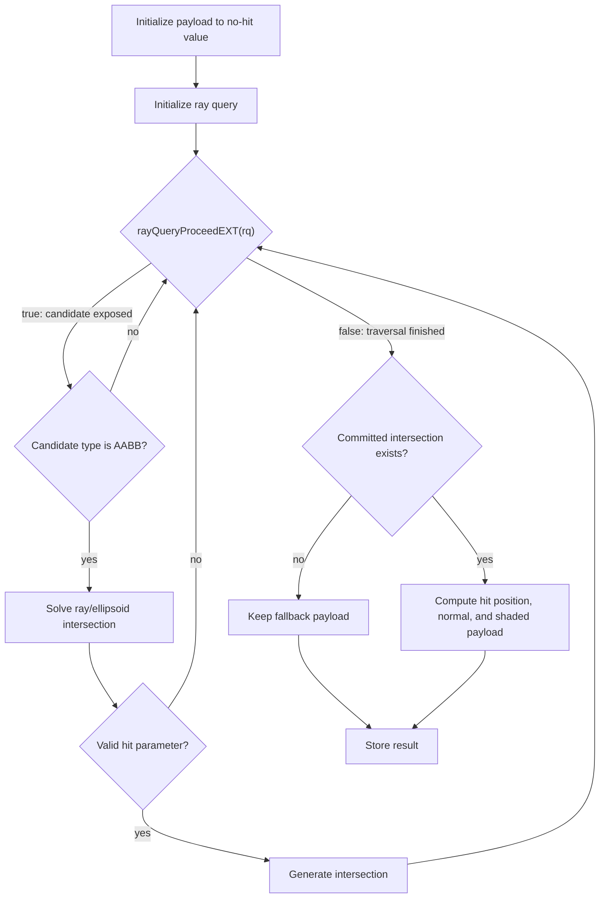

## Overview

**Core question:** Do different AABB representations of an application-defined procedural surface produce the same per-pixel payload, including when a real triangle is closer than the generated procedural hit?

This page covers the `procedural_geometry` test family registered by [vktRayQueryProceduralGeometryTests.cpp](../../../modules/vulkan/ray_query/vktRayQueryProceduralGeometryTests.cpp#L495-L503). Both test case leaves are implemented in one source file.

- A procedural surface is an application-defined shape whose exact ray intersection is calculated by shader code. Here the surface is an ellipsoid; an AABB in the acceleration structure acts as a traversal proxy that gives the shader an opportunity to run the ray-ellipsoid intersection test.
- Each leaf builds two TLASes: a reference representation and a result representation. They use the same rays, ellipsoid, and shader but different AABB layouts, then write one 64 × 64 payload image each for exact comparison.
- The reference uses a conventional AABB that encloses the ellipsoid. The result uses thin, non-enclosing proxy AABBs. This unusual setup is safe only for the controlled rays in this test, which hit the proxy before the shader-generated ellipsoid intersection.
- The shader solves the ray-versus-ellipsoid equation after an AABB candidate is exposed, and reports the near intersection with `rayQueryGenerateIntersectionEXT`. Triangle candidates are confirmed normally; the temporary `payload = 250` marker is overwritten by the common committed-hit shading calculation.

## Background Knowledge

For the shared acceleration-structure and traversal model, see the
[ray-query category background](../../categories/ray_query.md#background-knowledge).

- **Procedural geometry.** Vulkan natively intersects triangles, but application-defined surfaces use AABBs to request shader-side intersection work. The shader evaluates the actual surface and reports a valid parametric hit with `rayQueryGenerateIntersectionEXT`; the AABB itself is not the surface.
- **AABB proxies.** Normally, a procedural-geometry AABB conservatively encloses the custom surface so any ray that could hit the surface reaches the intersection shader. This test also uses controlled, non-enclosing AABBs as traversal proxies, so proxy location must not be interpreted as the location or bounds of the ellipsoid itself. This is an uncommon test-specific AABB usage.
- **Generated-hit ordering.** Encounter order for an AABB proxy does not decide the final hit. The generated `t` participates in closest-intersection ordering alongside triangle hits, so a proxy encountered earlier may report a procedural hit that lies behind a closer triangle.
- **Application-defined association.** An AABB does not contain a pointer to a mathematical surface. The application establishes the association through scene organization and shader logic that knows which surface to evaluate for the candidate.

## Registration Hierarchy

```text
ray_query.procedural_geometry
├── object_behind_bounding_boxes
└── triangle_in_between
```

Each child is a direct test case leaf. There are no intermediate nodes.

## Parameter Dimensions and Observed Values

| Dimension | Registered values | Meaning in this test | Evidence |
|-----------|-------------------|----------------------|----------|
| `TestType` | `OBJECT_BEHIND_BOUNDING_BOX`, `TRIANGLE_IN_BETWEEN` | Selects which `setupAccelerationStructures` implementation runs and therefore which reference/result TLAS pair the leaf builds. | [vktRayQueryProceduralGeometryTests.cpp:52-L56](../../../modules/vulkan/ray_query/vktRayQueryProceduralGeometryTests.cpp#L52-L56), [L486-L491](../../../modules/vulkan/ray_query/vktRayQueryProceduralGeometryTests.cpp#L486-L491) |
| Image size | `imageSize = 64u` | Sets dispatch count (`64 × 64`) and the per-pixel buffer length. | [vktRayQueryProceduralGeometryTests.cpp:97](../../../modules/vulkan/ray_query/vktRayQueryProceduralGeometryTests.cpp#L97), [L194](../../../modules/vulkan/ray_query/vktRayQueryProceduralGeometryTests.cpp#L194), [L199](../../../modules/vulkan/ray_query/vktRayQueryProceduralGeometryTests.cpp#L199) |
| Ray range | `tmin = 0.0`, `tmax = 50.0` | Defines the trace window shared by reference and result dispatches. | [vktRayQueryProceduralGeometryTests.cpp:425-L426](../../../modules/vulkan/ray_query/vktRayQueryProceduralGeometryTests.cpp#L425-L426) |
| Ray direction | `vec3(0, 0, -1)` | Fixed for every cell; rays trace straight along `-Z` from each grid cell's `(x + 0.5, y + 0.5, 2.0)`. | [vktRayQueryProceduralGeometryTests.cpp:427-L429](../../../modules/vulkan/ray_query/vktRayQueryProceduralGeometryTests.cpp#L427-L429) |

## Behavior Parameters

The primary behavioral axis is `TestType`. Each value changes which TLAS composition the leaf builds and what the host expects to see in the result dispatch.

### `object_behind_bounding_boxes` — Enclosing AABB vs proxy wall

The reference TLAS contains one large AABB enclosing the ellipsoid. The result TLAS replaces it with four thin AABBs covering the same screen area but not enclosing the ellipsoid. The controlled rays hit either representation, so the same shader-generated ellipsoid payload is expected from both dispatches.

### `triangle_in_between` — Triangle versus proxy-generated hit

Both TLASes contain the same real triangle. The reference uses one large enclosing AABB for the ellipsoid; the result uses three thin proxy AABBs. The proxy can be encountered before the triangle, but the shader-generated ellipsoid hit lies behind it. The test checks that the closer triangle remains the committed result in both representations.

## Shader Analysis

Both leaves share a single compute shader. The shader combines a procedural ray-vs-ellipsoid test with a triangle-confirm branch. The representative walkthrough below uses `object_behind_bounding_boxes` because it exercises the procedural-ellipsoid path without the triangle-confirm branch interfering.

### Representative Shader Walkthrough 1

#### Parameter Values Chosen

Representative path:

```text
dEQP-VK.ray_query.procedural_geometry.object_behind_bounding_boxes
```

| Parameter choice | Meaning in this representative case |
|------------------|-------------------------------------|
| `object_behind_bounding_boxes` | The TLAS is an AABB-only scene; every cell either hits an AABB-then-procedural-ellipsoid or misses entirely. Triangle-confirm branch is not exercised. |
| `imageSize = 64u` | Dispatch is `64 × 64 × 1` over `gl_GlobalInvocationID.xy`; each invocation covers one pixel of the result image. |

#### Purpose

Verify that for each `(x, y)` cell the ray query commits the procedural-ellipsoid intersection when the AABB partition changes, and that the same `payload + 0xFF000000` is written for both reference and result.

#### Structural Design



For this leaf the triangle-confirm branch never executes; every cell either lands on a generated AABB hit or misses. The pre-fill of `1` plus the `+ 0xFF000000` mask means unset cells show up as `0x01010101` in the comparison image.

#### Shader Code

```glsl
#version 460 core
#extension GL_EXT_ray_query : require

/// TLAS the ray query traces against (binds either referenceTLAS or resultTLAS)
layout(set = 0, binding = 0) uniform accelerationStructureEXT tlas;
/// One int per pixel; host reads back as R8G8B8A8_UNORM after the alpha mask
layout(set = 0, binding = 1, std430) writeonly buffer Result {
    int value[];
} result;

void main()
{
    float tmin          = 0.0;
    float tmax          = 50.0;
    vec3  rayOrigin     = vec3(float(gl_GlobalInvocationID.x) + 0.5f, float(gl_GlobalInvocationID.y) + 0.5f, 2.0);
    vec3  rayDir        = vec3(0.0, 0.0, -1.0);
    uint  resultIndex   = gl_GlobalInvocationID.x + gl_GlobalInvocationID.y * gl_NumWorkGroups.x;
    int   payload       = 30;                  // no-committed-hit baseline

    vec3 elipsoidOrigin = vec3(32.0, 32.0, -30.0);
    vec3 elipsoidRadii  = vec3(30.0, 15.0, 5.0);

    rayQueryEXT rq;
    rayQueryInitializeEXT(rq, tlas, gl_RayFlagsCullBackFacingTrianglesEXT, 0xFF, rayOrigin, tmin, rayDir, tmax);

    while (rayQueryProceedEXT(rq))
    {
        uint intersectionType = rayQueryGetIntersectionTypeEXT(rq, false);
        if (intersectionType == gl_RayQueryCandidateIntersectionAABBEXT)
        {
            /// Solve the ray-vs-ellipsoid quadratic inside the AABB candidate
            vec3  eliDir = rayOrigin - elipsoidOrigin;
            vec3  eliS   = eliDir / elipsoidRadii;
            vec3  rayS   = rayDir / elipsoidRadii;
            float a = dot(rayS, rayS);
            float b = dot(eliS, rayS);
            float c = dot(eliS, eliS);
            float h = b * b - a * (c - 1.0);
            if (h >= 0.0)
                rayQueryGenerateIntersectionEXT(rq, (-b - sqrt(h)) / a);
        }
        else if (intersectionType == gl_RayQueryCandidateIntersectionTriangleEXT)
        {
            payload = 250;                       /// triangle marker
            rayQueryConfirmIntersectionEXT(rq);
        }
    }

    if (rayQueryGetIntersectionTypeEXT(rq, true) != gl_RayQueryCommittedIntersectionNoneEXT)
    {
        int instanceId = rayQueryGetIntersectionInstanceIdEXT(rq, true);
        if (instanceId > -1)
        {
            /// Lighting term drives the visible payload across the ellipsoid
            float hitT      = rayQueryGetIntersectionTEXT(rq, true);
            vec3  lightDir  = normalize(vec3(0.0, 0.0, 1.0));
            vec3  hitPos    = rayOrigin + hitT * rayDir;
            vec3  hitNormal = normalize((hitPos - elipsoidOrigin) / elipsoidRadii);
            payload = 50 + int(200.0 * clamp(dot(hitNormal, lightDir), 0.0, 1.0));
        }
    }

    result.value[resultIndex] = payload + 0xFF000000;     /// saturate alpha for the comparison image
}
```

#### Additional Info

- `updateRayTracingGLSL()` is an identity passthrough in this CTS version ([vkRayTracingUtil.hpp:111](../../../framework/vulkan/vkRayTracingUtil.hpp#L111)), so the reconstructed GLSL is exactly the GLSL the host feeds to `glslangValidator`. `glslBuildOptions` is `vk::ShaderBuildOptions` with `SPIRV_VERSION_1_4` ([vktRayQueryProceduralGeometryTests.cpp:412](../../../modules/vulkan/ray_query/vktRayQueryProceduralGeometryTests.cpp#L412)).
- The `triangle_in_between` leaf runs the same shader binary; only the TLAS layout differs. Its triangle branch temporarily sets `payload = 250`, but any committed hit has a non-negative instance ID and the later common shading block overwrites that value using the committed `t`. The host therefore compares the resulting shaded payload, not a persistent triangle marker.
- The AABB quadratic uses only the near root `(-b - sqrt(h)) / a`; the far root `(-b + sqrt(h)) / a` is intentionally ignored. A driver that returns the far root would commit the back side of the ellipsoid and the lighting term would invert.
- The `instanceId > -1` guard exists because some leaves place non-renderable helper geometry that produces a committed intersection but no shading; the guard prevents the lighting math from running for those.

#### Parameter Variation Summary

| Parameter dimension | Shader-level variation from this shader | Evidence |
|---------------------|---------------------------------------|----------|
| `TestType = TRIANGLE_IN_BETWEEN` | Same shader binary; the TLAS adds a triangle instance whose candidates take the triangle-confirm branch and set `payload = 250`. | [vktRayQueryProceduralGeometryTests.cpp:320-L375](../../../modules/vulkan/ray_query/vktRayQueryProceduralGeometryTests.cpp#L320-L375) |
| Reference vs result dispatch | Same shader binary; the descriptor set is rewritten between dispatches to swap `m_referenceTLAS` for `m_resultTLAS`. | [vktRayQueryProceduralGeometryTests.cpp:189-L199](../../../modules/vulkan/ray_query/vktRayQueryProceduralGeometryTests.cpp#L189-L199) |
| Ray direction | Fixed `(0, 0, -1)` for every cell. | [vktRayQueryProceduralGeometryTests.cpp:427-L429](../../../modules/vulkan/ray_query/vktRayQueryProceduralGeometryTests.cpp#L427-L429) |

#### SPIR-V

- Status: generated and validated
- Source: reconstructed GLSL from this walkthrough
- Stage: `comp`
- Target SPIRV version: `spirv1.4`

<details>
<summary>Click to expand SPIRV asm code</summary>

```llvm
; SPIR-V
; Version: 1.4
; Generator: Khronos Glslang Reference Front End; 11
; Bound: 188
; Schema: 0
               OpCapability Shader
               OpCapability RayQueryKHR
               OpExtension "SPV_KHR_ray_query"
          %1 = OpExtInstImport "GLSL.std.450"
               OpMemoryModel Logical GLSL450
               OpEntryPoint GLCompute %main "main" %gl_GlobalInvocationID %gl_NumWorkGroups %rq %tlas %result
               OpExecutionMode %main LocalSize 1 1 1
               OpSource GLSL 460
               OpSourceExtension "GL_EXT_ray_query"
               OpName %main "main"
               OpName %tmin "tmin"
               OpName %tmax "tmax"
               OpName %rayOrigin "rayOrigin"
               OpName %gl_GlobalInvocationID "gl_GlobalInvocationID"
               OpName %rayDir "rayDir"
               OpName %resultIndex "resultIndex"
               OpName %gl_NumWorkGroups "gl_NumWorkGroups"
               OpName %payload "payload"
               OpName %elipsoidOrigin "elipsoidOrigin"
               OpName %elipsoidRadii "elipsoidRadii"
               OpName %rq "rq"
               OpName %tlas "tlas"
               OpName %intersectionType "intersectionType"
               OpName %eliDir "eliDir"
               OpName %eliS "eliS"
               OpName %rayS "rayS"
               OpName %a "a"
               OpName %b "b"
               OpName %c "c"
               OpName %h "h"
               OpName %instanceId "instanceId"
               OpName %hitT "hitT"
               OpName %lightDir "lightDir"
               OpName %hitPos "hitPos"
               OpName %hitNormal "hitNormal"
               OpName %Result "Result"
               OpMemberName %Result 0 "value"
               OpName %result "result"
               OpDecorate %gl_GlobalInvocationID BuiltIn GlobalInvocationId
               OpDecorate %gl_NumWorkGroups BuiltIn NumWorkgroups
               OpDecorate %tlas Binding 0
               OpDecorate %tlas DescriptorSet 0
               OpDecorate %_runtimearr_int ArrayStride 4
               OpDecorate %Result Block
               OpMemberDecorate %Result 0 NonReadable
               OpMemberDecorate %Result 0 Offset 0
               OpDecorate %result NonReadable
               OpDecorate %result Binding 1
               OpDecorate %result DescriptorSet 0
       %void = OpTypeVoid
          %3 = OpTypeFunction %void
      %float = OpTypeFloat 32
%_ptr_Function_float = OpTypePointer Function %float
    %float_0 = OpConstant %float 0
   %float_50 = OpConstant %float 50
    %v3float = OpTypeVector %float 3
%_ptr_Function_v3float = OpTypePointer Function %v3float
       %uint = OpTypeInt 32 0
     %v3uint = OpTypeVector %uint 3
%_ptr_Input_v3uint = OpTypePointer Input %v3uint
%gl_GlobalInvocationID = OpVariable %_ptr_Input_v3uint Input
     %uint_0 = OpConstant %uint 0
%_ptr_Input_uint = OpTypePointer Input %uint
  %float_0_5 = OpConstant %float 0.5
     %uint_1 = OpConstant %uint 1
    %float_2 = OpConstant %float 2
   %float_n1 = OpConstant %float -1
         %35 = OpConstantComposite %v3float %float_0 %float_0 %float_n1
%_ptr_Function_uint = OpTypePointer Function %uint
%gl_NumWorkGroups = OpVariable %_ptr_Input_v3uint Input
        %int = OpTypeInt 32 1
%_ptr_Function_int = OpTypePointer Function %int
     %int_30 = OpConstant %int 30
   %float_32 = OpConstant %float 32
  %float_n30 = OpConstant %float -30
         %54 = OpConstantComposite %v3float %float_32 %float_32 %float_n30
   %float_30 = OpConstant %float 30
   %float_15 = OpConstant %float 15
    %float_5 = OpConstant %float 5
         %59 = OpConstantComposite %v3float %float_30 %float_15 %float_5
         %60 = OpTypeRayQueryKHR
%_ptr_Private_60 = OpTypePointer Private %60
         %rq = OpVariable %_ptr_Private_60 Private
         %63 = OpTypeAccelerationStructureKHR
%_ptr_UniformConstant_63 = OpTypePointer UniformConstant %63
       %tlas = OpVariable %_ptr_UniformConstant_63 UniformConstant
    %uint_16 = OpConstant %uint 16
   %uint_255 = OpConstant %uint 255
       %bool = OpTypeBool
      %false = OpConstantFalse %bool
      %int_0 = OpConstant %int 0
    %float_1 = OpConstant %float 1
    %int_250 = OpConstant %int 250
       %true = OpConstantTrue %bool
      %int_1 = OpConstant %int 1
     %int_n1 = OpConstant %int -1
        %155 = OpConstantComposite %v3float %float_0 %float_0 %float_1
     %int_50 = OpConstant %int 50
  %float_200 = OpConstant %float 200
%_runtimearr_int = OpTypeRuntimeArray %int
     %Result = OpTypeStruct %_runtimearr_int
%_ptr_StorageBuffer_Result = OpTypePointer StorageBuffer %Result
     %result = OpVariable %_ptr_StorageBuffer_Result StorageBuffer
%int_n16777216 = OpConstant %int -16777216
%_ptr_StorageBuffer_int = OpTypePointer StorageBuffer %int
       %main = OpFunction %void None %3
          %5 = OpLabel
       %tmin = OpVariable %_ptr_Function_float Function
       %tmax = OpVariable %_ptr_Function_float Function
  %rayOrigin = OpVariable %_ptr_Function_v3float Function
     %rayDir = OpVariable %_ptr_Function_v3float Function
%resultIndex = OpVariable %_ptr_Function_uint Function
    %payload = OpVariable %_ptr_Function_int Function
%elipsoidOrigin = OpVariable %_ptr_Function_v3float Function
%elipsoidRadii = OpVariable %_ptr_Function_v3float Function
%intersectionType = OpVariable %_ptr_Function_uint Function
     %eliDir = OpVariable %_ptr_Function_v3float Function
       %eliS = OpVariable %_ptr_Function_v3float Function
       %rayS = OpVariable %_ptr_Function_v3float Function
          %a = OpVariable %_ptr_Function_float Function
          %b = OpVariable %_ptr_Function_float Function
          %c = OpVariable %_ptr_Function_float Function
          %h = OpVariable %_ptr_Function_float Function
 %instanceId = OpVariable %_ptr_Function_int Function
       %hitT = OpVariable %_ptr_Function_float Function
   %lightDir = OpVariable %_ptr_Function_v3float Function
     %hitPos = OpVariable %_ptr_Function_v3float Function
  %hitNormal = OpVariable %_ptr_Function_v3float Function
               OpStore %tmin %float_0
               OpStore %tmax %float_50
         %21 = OpAccessChain %_ptr_Input_uint %gl_GlobalInvocationID %uint_0
         %22 = OpLoad %uint %21
         %23 = OpConvertUToF %float %22
         %25 = OpFAdd %float %23 %float_0_5
         %27 = OpAccessChain %_ptr_Input_uint %gl_GlobalInvocationID %uint_1
         %28 = OpLoad %uint %27
         %29 = OpConvertUToF %float %28
         %30 = OpFAdd %float %29 %float_0_5
         %32 = OpCompositeConstruct %v3float %25 %30 %float_2
               OpStore %rayOrigin %32
               OpStore %rayDir %35
         %38 = OpAccessChain %_ptr_Input_uint %gl_GlobalInvocationID %uint_0
         %39 = OpLoad %uint %38
         %40 = OpAccessChain %_ptr_Input_uint %gl_GlobalInvocationID %uint_1
         %41 = OpLoad %uint %40
         %43 = OpAccessChain %_ptr_Input_uint %gl_NumWorkGroups %uint_0
         %44 = OpLoad %uint %43
         %45 = OpIMul %uint %41 %44
         %46 = OpIAdd %uint %39 %45
               OpStore %resultIndex %46
               OpStore %payload %int_30
               OpStore %elipsoidOrigin %54
               OpStore %elipsoidRadii %59
         %66 = OpLoad %63 %tlas
         %69 = OpLoad %v3float %rayOrigin
         %70 = OpLoad %float %tmin
         %71 = OpLoad %v3float %rayDir
         %72 = OpLoad %float %tmax
               OpRayQueryInitializeKHR %rq %66 %uint_16 %uint_255 %69 %70 %71 %72
               OpBranch %73
         %73 = OpLabel
               OpLoopMerge %75 %76 None
               OpBranch %77
         %77 = OpLabel
         %79 = OpRayQueryProceedKHR %bool %rq
               OpBranchConditional %79 %74 %75
         %74 = OpLabel
         %83 = OpRayQueryGetIntersectionTypeKHR %uint %rq %int_0
               OpStore %intersectionType %83
         %84 = OpLoad %uint %intersectionType
         %85 = OpIEqual %bool %84 %uint_1
               OpSelectionMerge %87 None
               OpBranchConditional %85 %86 %133
         %86 = OpLabel
         %89 = OpLoad %v3float %rayOrigin
         %90 = OpLoad %v3float %elipsoidOrigin
         %91 = OpFSub %v3float %89 %90
               OpStore %eliDir %91
         %93 = OpLoad %v3float %eliDir
         %94 = OpLoad %v3float %elipsoidRadii
         %95 = OpFDiv %v3float %93 %94
               OpStore %eliS %95
         %97 = OpLoad %v3float %rayDir
         %98 = OpLoad %v3float %elipsoidRadii
         %99 = OpFDiv %v3float %97 %98
               OpStore %rayS %99
        %101 = OpLoad %v3float %rayS
        %102 = OpLoad %v3float %rayS
        %103 = OpDot %float %101 %102
               OpStore %a %103
        %105 = OpLoad %v3float %eliS
        %106 = OpLoad %v3float %rayS
        %107 = OpDot %float %105 %106
               OpStore %b %107
        %109 = OpLoad %v3float %eliS
        %110 = OpLoad %v3float %eliS
        %111 = OpDot %float %109 %110
               OpStore %c %111
        %113 = OpLoad %float %b
        %114 = OpLoad %float %b
        %115 = OpFMul %float %113 %114
        %116 = OpLoad %float %a
        %117 = OpLoad %float %c
        %119 = OpFSub %float %117 %float_1
        %120 = OpFMul %float %116 %119
        %121 = OpFSub %float %115 %120
               OpStore %h %121
        %122 = OpLoad %float %h
        %123 = OpFOrdGreaterThanEqual %bool %122 %float_0
               OpSelectionMerge %125 None
               OpBranchConditional %123 %124 %125
        %124 = OpLabel
        %126 = OpLoad %float %b
        %127 = OpFNegate %float %126
        %128 = OpLoad %float %h
        %129 = OpExtInst %float %1 Sqrt %128
        %130 = OpFSub %float %127 %129
        %131 = OpLoad %float %a
        %132 = OpFDiv %float %130 %131
               OpRayQueryGenerateIntersectionKHR %rq %132
               OpBranch %125
        %125 = OpLabel
               OpBranch %87
        %133 = OpLabel
        %134 = OpLoad %uint %intersectionType
        %135 = OpIEqual %bool %134 %uint_0
               OpSelectionMerge %137 None
               OpBranchConditional %135 %136 %137
        %136 = OpLabel
               OpStore %payload %int_250
               OpRayQueryConfirmIntersectionKHR %rq
               OpBranch %137
        %137 = OpLabel
               OpBranch %87
         %87 = OpLabel
               OpBranch %76
         %76 = OpLabel
               OpBranch %73
         %75 = OpLabel
        %141 = OpRayQueryGetIntersectionTypeKHR %uint %rq %int_1
        %142 = OpINotEqual %bool %141 %uint_0
               OpSelectionMerge %144 None
               OpBranchConditional %142 %143 %144
        %143 = OpLabel
        %146 = OpRayQueryGetIntersectionInstanceIdKHR %int %rq %int_1
               OpStore %instanceId %146
        %147 = OpLoad %int %instanceId
        %149 = OpSGreaterThan %bool %147 %int_n1
               OpSelectionMerge %151 None
               OpBranchConditional %149 %150 %151
        %150 = OpLabel
        %153 = OpRayQueryGetIntersectionTKHR %float %rq %int_1
               OpStore %hitT %153
               OpStore %lightDir %155
        %157 = OpLoad %v3float %rayOrigin
        %158 = OpLoad %float %hitT
        %159 = OpLoad %v3float %rayDir
        %160 = OpVectorTimesScalar %v3float %159 %158
        %161 = OpFAdd %v3float %157 %160
               OpStore %hitPos %161
        %163 = OpLoad %v3float %hitPos
        %164 = OpLoad %v3float %elipsoidOrigin
        %165 = OpFSub %v3float %163 %164
        %166 = OpLoad %v3float %elipsoidRadii
        %167 = OpFDiv %v3float %165 %166
        %168 = OpExtInst %v3float %1 Normalize %167
               OpStore %hitNormal %168
        %171 = OpLoad %v3float %hitNormal
        %172 = OpLoad %v3float %lightDir
        %173 = OpDot %float %171 %172
        %174 = OpExtInst %float %1 FClamp %173 %float_0 %float_1
        %175 = OpFMul %float %float_200 %174
        %176 = OpConvertFToS %int %175
        %177 = OpIAdd %int %int_50 %176
               OpStore %payload %177
               OpBranch %151
        %151 = OpLabel
               OpBranch %144
        %144 = OpLabel
        %182 = OpLoad %uint %resultIndex
        %183 = OpLoad %int %payload
        %185 = OpIAdd %int %183 %int_n16777216
        %187 = OpAccessChain %_ptr_StorageBuffer_int %result %int_0 %182
               OpStore %187 %185
               OpReturn
               OpFunctionEnd
```

</details>

## Runtime Execution and Result Checking

- **Reference/result TLAS build.** The instance subclass builds both `m_referenceTLAS` and `m_resultTLAS` inside `setupAccelerationStructures()` during command-buffer recording ([vktRayQueryProceduralGeometryTests.cpp:151](../../../modules/vulkan/ray_query/vktRayQueryProceduralGeometryTests.cpp#L151)). The reference and result TLASes describe the same intended procedural surface differently: the reference uses an enclosing AABB, while the result uses thin proxy AABBs. In the `triangle_in_between` leaf, both also contain the same real triangle.
- **Buffer pre-fill.** Both `referenceBuffer` and `resultBuffer` (`imageSize² * sizeof(int)` bytes, host-visible) are cleared to `1` via `deMemset` + `flushAlloc` before dispatch so unset entries are visually distinguishable from shader-written entries in the comparison image ([vktRayQueryProceduralGeometryTests.cpp:240-L249](../../../modules/vulkan/ray_query/vktRayQueryProceduralGeometryTests.cpp#L240-L249)).
- **Two-dispatch flow.** Two compute dispatches are issued back to back: the first binds `referenceDescriptorSet`, the second binds `resultDescriptorSet`. Both use the same compute pipeline and the same shader binary ([vktRayQueryProceduralGeometryTests.cpp:189-L199](../../../modules/vulkan/ray_query/vktRayQueryProceduralGeometryTests.cpp#L189-L199)).
- **Result copyback and interpretation.** After submission, host memory is invalidated and the two `int` buffers are wrapped as `tcu::PixelBufferAccess` of `VK_FORMAT_R8G8B8A8_UNORM` size `64 × 64` ([vktRayQueryProceduralGeometryTests.cpp:219-L221](../../../modules/vulkan/ray_query/vktRayQueryProceduralGeometryTests.cpp#L219-L221)).
- **Pass/fail decision.** `tcu::intThresholdCompare` with `tcu::UVec4(0)` and `COMPARE_LOG_ON_ERROR`; mismatch returns `tcu::TestStatus::fail("Fail")` ([vktRayQueryProceduralGeometryTests.cpp:223-L226](../../../modules/vulkan/ray_query/vktRayQueryProceduralGeometryTests.cpp#L223-L226)). The instance passes only when reference and result agree on every cell.

## Failure Meaning

### Failure Cause Mapping

| If this behavior parameter value fails | Possible failure cause(s) |
|----------------------------------------|---------------------------|
| `object_behind_bounding_boxes` | Result dispatch disagrees with reference dispatch; the four-AABB wall does not produce the same final payload as the single fat AABB. |
| `triangle_in_between` | Result dispatch disagrees with reference dispatch; the triangle-plus-wall arrangement does not produce the same final payload as the triangle-plus-fat-AABB reference. |

### Cause Analysis

#### AABB traversal over the proxy partition

**Possible failure symptoms:** `tcu::intThresholdCompare` records a non-zero diff in the result pixel access. Visible ellipsoid pixels in the reference show the shaded payload, but the same result pixel shows the pre-fill `1` or the no-hit value `30`, indicating that the proxy did not produce a candidate or the generated ellipsoid hit was not committed.

**Possible implementation causes:** The result TLAS partitions geometry across four `setGeometryData` entries; if the implementation does not test every AABB leaf, or misorders them by `t`, the closest hit may be wrong. A driver that prunes AABBs with low hit probability, or that picks the wrong root when several AABBs overlap, would expose this bug. Source-level investigation is needed to localize whether the failure is in the TLAS build or in BVH traversal.

#### Procedural intersection root

**Possible failure symptoms:** Result dispatch shows a payload whose lighting term disagrees with the reference (for example, a darker cell on a face that should be bright, or a bright cell where the reference is dark). The lighting math depends on `hitNormal`, which depends on the committed `t`.

**Possible implementation causes:** `rayQueryGenerateIntersectionEXT(rq, t)` commits the AABB candidate with the supplied `t`. The shader uses the near root `(-b - sqrt(h)) / a`; a driver that swaps the sign of `b` (committing the far root) would invert the lighting. A precision bug in `sqrt(h)` for grazing rays would produce wrong `t` values and wrong hit positions. Source-level investigation is needed to confirm which arithmetic step is wrong.

#### Triangle confirmation

**Possible failure symptoms:** On the `triangle_in_between` leaf, the reference and result have different shaded payloads at a pixel. Because the triangle's temporary `250` marker is overwritten after traversal, the output does not directly identify whether either dispatch committed a triangle or a generated intersection.

**Possible implementation causes:** `rayQueryConfirmIntersectionEXT` may be skipped or applied to the wrong candidate, or the generated and triangle intersections may be ordered differently. The comparison localizes the mismatch to the two TLAS configurations, but source-level investigation is needed to identify which dispatch, committed type, or commit step is wrong.

#### Missing or different committed intersection

**Possible failure symptoms:** One dispatch writes the no-hit payload `30 + 0xFF000000` while the other writes a shaded committed-hit payload.

**Possible implementation causes:** A TLAS build or traversal defect may omit an expected candidate or produce a different committed intersection. The shader only tests whether the instance ID is non-negative; it does not encode the ID itself, so the comparison cannot localize an instance-order error.

## Case Pruning

### Requirement-based pruning

- Required: `VK_KHR_acceleration_structure` and `VK_KHR_ray_query` device extensions ([vktRayQueryProceduralGeometryTests.cpp:398-L407](../../../modules/vulkan/ray_query/vktRayQueryProceduralGeometryTests.cpp#L398-L407)).
- Required: `VkPhysicalDeviceRayQueryFeaturesKHR::rayQuery` and `VkPhysicalDeviceAccelerationStructureFeaturesKHR::accelerationStructure`. Missing `rayQuery` throws `NotSupportedError`; missing `accelerationStructure` throws `TestError`. The split between `NotSupportedError` and `TestError` is a deliberate distinction between "not legal on this device" and "test cannot recover."

### Design-based pruning

- The shader is fixed for both leaves; no `gl_RayFlagsCullBackFacingTrianglesEXT` toggling, no payload-width matrix, no `tmin/tmax` matrix is generated. The intentionally narrow matrix is the test itself: per leaf, only the TLAS composition varies.
- Each leaf produces exactly one reference dispatch and one result dispatch; no stress, no sweep over dispatch sizes, and no per-pixel randomization.

## Key Takeaways

- The family tests application-defined procedural intersection: an AABB candidate activates shader code that calculates an ellipsoid hit and reports its `t`.
- The reference TLAS uses a conventional enclosing AABB; the result TLAS uses controlled, non-enclosing proxy AABBs. The proxy does not contain the ellipsoid or define its surface; it only triggers the shader evaluation.
- In `triangle_in_between`, the generated ellipsoid hit is deliberately behind a real triangle, testing closest-hit ordering.
- Both leaves use one shader binary and compare reference and result payload images exactly. Equal images establish consistency between the two TLAS representations, not independent proof that either output is correct.

## Source Reference Appendix

| Entry point | Link | Why it matters |
|-------------|------|----------------|
| `createProceduralGeometryTests` (registration) | [vktRayQueryProceduralGeometryTests.cpp:495-L503](../../../modules/vulkan/ray_query/vktRayQueryProceduralGeometryTests.cpp#L495-L503) | Adds the `procedural_geometry` test family with both leaves. |
| `ObjectBehindBoundingBoxInstance::setupAccelerationStructures` | [vktRayQueryProceduralGeometryTests.cpp:263-L307](../../../modules/vulkan/ray_query/vktRayQueryProceduralGeometryTests.cpp#L263-L307) | Builds the four-thin-AABB wall and the single-fat-AABB reference. |
| `TriangleInBeteenInstance::setupAccelerationStructures` | [vktRayQueryProceduralGeometryTests.cpp:320-L375](../../../modules/vulkan/ray_query/vktRayQueryProceduralGeometryTests.cpp#L320-L375) | Builds the triangle + ellipsoid-wall TLAS and the two-instance reference. |
| `RayQueryProceduralGeometryTestCase::checkSupport` | [vktRayQueryProceduralGeometryTests.cpp:398-L408](../../../modules/vulkan/ray_query/vktRayQueryProceduralGeometryTests.cpp#L398-L408) | Enforces extension and feature gates. |
| `RayQueryProceduralGeometryTestCase::initPrograms` (compute shader) | [vktRayQueryProceduralGeometryTests.cpp:410-L482](../../../modules/vulkan/ray_query/vktRayQueryProceduralGeometryTests.cpp#L410-L482) | Implements the ray-vs-ellipsoid and triangle-confirm logic, writes the masked payload to `Result.value[]`. |
| `RayQueryProceduralGeometryTestBase::iterate` | [vktRayQueryProceduralGeometryTests.cpp:90-L227](../../../modules/vulkan/ray_query/vktRayQueryProceduralGeometryTests.cpp#L90-L227) | Runs the back-to-back reference/result dispatches and the `tcu::intThresholdCompare` verdict. |