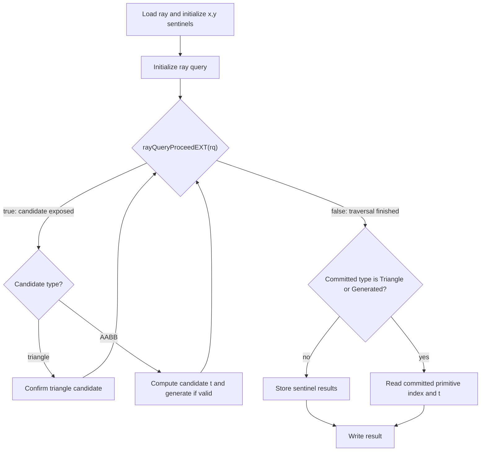

## Overview

**Core question:** Does inline ray-query traversal report the correct primitive ID and hit `t` for each of 60000 rays fired into a sequence of triangles or AABBs when run from 12 shader-stage configurations across graphics, compute, and ray tracing pipelines, and does a thirteenth `traceRayEXT` control report the expected hit `t`?

This page covers the `stress` test family registered by [vktRayQueryStressTests.cpp](../../../modules/vulkan/ray_query/vktRayQueryStressTests.cpp#L474-L575).

- The family registers 13 shader source types as direct children: 5 graphics-stage configurations, 1 compute configuration, 6 ray-query configurations in ray tracing shader stages, and 1 ray-generation `traceRayEXT` control. Each child fans out into `triangles` and `aabbs` leaves, for 26 test cases total.
- The host builds 60000 primitives at successively increasing z-values, with the xy shape rotating through three orientations. Ray `i` starts at `(centroid_x, centroid_y, z_i - epsilon)` and travels along `+z` to hit primitive `i`.
- The shader runs an inline ray query against the scene. For triangle candidates it calls `rayQueryConfirmIntersectionEXT`. For AABB candidates it computes `t = primitiveId - ray.pos.z` and calls `rayQueryGenerateIntersectionEXT`. After the proceed loop, it stores the committed primitive ID and hit `t`.
- The host compares each result's primitive ID (exact match) and hit `t` (tolerance 0.2) against CPU-computed expected values, renders a 3x20000 red/black image, and fails if any pixel mismatches.

## Background Knowledge

For the shared acceleration-structure and traversal model, see the
[ray-query category background](../../categories/ray_query.md#background-knowledge).

- **Inline ray queries across stages.** A ray query runs inside the shader stage that initializes it and does not transfer control to separate hit or miss shaders. Supported graphics, compute, and ray tracing shader stages can therefore host the same inline traversal logic.
- **Triangle and AABB commitment.** Non-opaque triangle candidates are accepted with `rayQueryConfirmIntersectionEXT`. AABB candidates have no built-in surface hit and require `rayQueryGenerateIntersectionEXT` with an application-supplied parametric distance.
- **Primitive indices.** `rayQueryGetIntersectionPrimitiveIndexEXT` identifies the primitive within the intersected BLAS geometry. It is distinct from invocation, launch, geometry, and TLAS instance indices.
- **Pipeline tracing versus inline queries.** `traceRayEXT` launches traversal through a ray tracing pipeline and routes control through shader-binding-table stages; `rayQueryInitializeEXT` keeps traversal under explicit control in the current shader. Comparing them can reveal shared versus mechanism-specific behavior, but they do not expose identical observables automatically.

## Registration Hierarchy

```text
ray_query.stress
├── vertex_shader
├── tess_control_shader
├── tess_evaluation_shader
├── geometry_shader
├── fragment_shader
├── compute_shader
├── rgen_shader
├── rgen_rt_shader
├── isect_shader
├── ahit_shader
├── chit_shader
├── miss_shader
└── call_shader
```

Each direct child is an intermediate node that fans out into `triangles` and `aabbs` test case leaves. The 13 children correspond to the 13 values of `RayQueryShaderSourceType` iterated in `createRayQueryStressTests`.

## Parameter Dimensions and Observed Values

| Dimension | Registered values | Meaning in this test | Evidence |
|-----------|-------------------|----------------------|----------|
| Shader source type | 13 values (see hierarchy) | Selects which shader stage hosts the ray query and which pipeline dispatches it. | [vktRayQueryStressTests.cpp:481-L536](../../../modules/vulkan/ray_query/vktRayQueryStressTests.cpp#L481-L536) |
| Geometry type | `triangles`, `aabbs` | Selects BLAS geometry. Triangles exercise `rayQueryConfirmIntersectionEXT`; AABBs exercise `rayQueryGenerateIntersectionEXT`. | [vktRayQueryStressTests.cpp:542-L545](../../../modules/vulkan/ray_query/vktRayQueryStressTests.cpp#L542-L545) |
| Scene size | `STRESS_NUM_LEVELS = 20000`, `STRESS_NUM_PRIMS_PER_LEVELS = 3` | 60000 primitives; despite the constant names, `z` increases after every primitive rather than once per three-primitive level. | [vktRayQueryStressTests.cpp:313-L318](../../../modules/vulkan/ray_query/vktRayQueryStressTests.cpp#L313-L318), [L331-L387](../../../modules/vulkan/ray_query/vktRayQueryStressTests.cpp#L331-L387) |
| Ray count | 60000 (RT pipelines) or 65536 (non-RT, rounded to a power of two whose exponent is even) | Non-RT pipelines round up for workgroup dispatch. The host verifies the first 60000 results. | [vktRayQueryStressTests.cpp:560-L566](../../../modules/vulkan/ray_query/vktRayQueryStressTests.cpp#L560-L566) |
| Ray flags | `0` (`gl_RayFlagsNoneEXT`) | No flags set; triangles are opaque, no culling. | [vktRayQueryStressTests.cpp:555](../../../modules/vulkan/ray_query/vktRayQueryStressTests.cpp#L555) |
| Hit T tolerance | `0.2` | Host accepts result `y` within 0.2 of expected. AABBs generate at `t = epsilon = 0.1` but expected is `0.0`; triangles generate at `epsilon` and expected is `epsilon`. | [vktRayQueryStressTests.cpp:448](../../../modules/vulkan/ray_query/vktRayQueryStressTests.cpp#L448) |

## Behavior Parameters

The primary behavioral axis is the shader source type. The 13 registered children cluster into 4 behavioral groups based on which pipeline dispatches the shader and whether the shader uses ray query or `traceRayEXT`.

### `graphics` — ray query hosted in a graphics pipeline stage

Five leaves (`vertex_shader`, `tess_control_shader`, `tess_evaluation_shader`, `geometry_shader`, `fragment_shader`) run the same ray-query body in different graphics pipeline stages. The host dispatches a graphics pipeline that renders into a 3D image. Each invocation reads one ray from the rays buffer, runs the ray query, and stores the result via `imageStore`. Vertex, tessellation, and geometry stages require `VERTEX_PIPELINE_STORES_AND_ATOMICS`. Tessellation stages require `tessellationShader`; the geometry stage requires `geometryShader`.

### `compute` — ray query hosted in a compute shader

One leaf (`compute_shader`) runs the ray-query body in a compute shader. The host dispatches `raySize` workgroups of `local_size_x = 1`. Each invocation reads one ray, runs the ray query, and writes the result to a storage buffer. This is the simplest dispatch path and isolates the ray query from graphics and ray tracing pipeline overhead.

### `raytracing` — ray query hosted in a ray tracing pipeline stage

Six leaves (`rgen_shader`, `isect_shader`, `ahit_shader`, `chit_shader`, `miss_shader`, `call_shader`) run the ray-query body in different ray tracing pipeline stages. The rgen shader traces a ray against a separate TLAS (`traceEXTAccel`) via `traceRayEXT` to invoke the user-supplied stage. The user-supplied stage (chit, ahit, miss, isect, or call) runs the ray query against the stress scene TLAS (`scene`). This exercises ray query inside shaders that the ray tracing pipeline itself invokes.

### `rgen_rt` — traceRayEXT control using the ray tracing pipeline

One leaf (`rgen_rt_shader`) does not use ray query. The rgen shader calls `traceRayEXT` against the stress scene TLAS. On any hit, the closest-hit shader sets `payload.x = launchIndex` and `payload.y = gl_HitTEXT`; it does not read `gl_PrimitiveID`. Consequently, the exact `x` comparison only distinguishes hit from miss and cannot verify which primitive was hit. This control primarily checks that `traceRayEXT` produces a hit with the expected `t`; correlated failures with ray-query leaves do not by themselves localize the fault to scene construction or verification.

## Shader Analysis

All 12 ray-query source types share the same ray-query body, with both geometry leaves under each source type. Only the surrounding shader template changes per pipeline and stage. The `rgen_rt` source type uses a different body that calls `traceRayEXT` instead of `rayQueryInitializeEXT`. The representative walkthrough uses `compute_shader.triangles` because the compute path is the simplest dispatch; this leaf exercises the triangle-confirm branch, while its sibling `compute_shader.aabbs` exercises the AABB-generate branch.

### Representative Shader Walkthrough 1

#### Parameter Values Chosen

Representative path:

```text
dEQP-VK.ray_query.stress.compute_shader.triangles
```

| Parameter choice | Meaning in this representative case |
|------------------|-------------------------------------|
| `compute_shader` | Compute pipeline; one invocation per ray. |
| `triangles` | BLAS contains 60000 triangles in a staircase. The triangle-confirm branch fires. |
| `raySize = 65536` | Non-RT pipeline; rounded up from 60000 to the next even power of 2. The host verifies the first 60000 results. |
| `rayFlags = 0` | `gl_RayFlagsNoneEXT`; triangles are opaque. |

#### Purpose

Verify that for each of the 60000 triangle primitives, the ray query commits the correct primitive and reports a hit `t` of `epsilon = 0.1`, matching the host-computed expected value within the 0.2 tolerance.

#### Structural Design



For the `triangles` leaf, each ray hits one triangle. The proceed loop runs once, confirms the triangle candidate, and exits. The committed intersection is the triangle at `z = index`, so `x = index` and `y = epsilon = 0.1`.

#### Shader Code

```glsl
#version 460
#extension GL_EXT_ray_tracing : enable
#extension GL_EXT_ray_query : require

struct Ray { vec3 pos; float tmin; vec3 dir; float tmax; };
struct ResultType { float x; float y; float z; float w; };
layout(std430, set = 0, binding = 0) buffer Results { ResultType results[]; };
layout(set = 0, binding = 1) uniform accelerationStructureEXT scene;
layout(std430, set = 0, binding = 2) buffer Rays { Ray rays[]; };
layout (local_size_x = 1, local_size_y = 1, local_size_z = 1) in;
void main() {
   uint index = (gl_NumWorkGroups.x * gl_WorkGroupSize.x) * gl_GlobalInvocationID.y + gl_GlobalInvocationID.x;
   Ray ray = rays[index];
   float x = 20000000.0;
   float y = 20000000.0;
   float z = index;
   float w = ray.pos.z;
   rayQueryEXT rayQuery;
   rayQueryInitializeEXT(rayQuery, scene, 0, 0xFF, ray.pos, ray.tmin, ray.dir, ray.tmax);
   while (rayQueryProceedEXT(rayQuery))
   {
       if (rayQueryGetIntersectionTypeEXT(rayQuery, false) == gl_RayQueryCandidateIntersectionTriangleEXT)
       {
           rayQueryConfirmIntersectionEXT(rayQuery);
       }
       else if (rayQueryGetIntersectionTypeEXT(rayQuery, false) == gl_RayQueryCandidateIntersectionAABBEXT)
       {
           float t = rayQueryGetIntersectionPrimitiveIndexEXT(rayQuery, false) - ray.pos.z;
           if (t >= ray.tmin && t < rayQueryGetIntersectionTEXT(rayQuery, true))
           {
               rayQueryGenerateIntersectionEXT(rayQuery, t);
           }
       }
   }

   if ((rayQueryGetIntersectionTypeEXT(rayQuery, true) == gl_RayQueryCommittedIntersectionTriangleEXT) ||
       (rayQueryGetIntersectionTypeEXT(rayQuery, true) == gl_RayQueryCommittedIntersectionGeneratedEXT))
   {
       x = rayQueryGetIntersectionPrimitiveIndexEXT(rayQuery, true);
       y = rayQueryGetIntersectionTEXT(rayQuery, true);
   }
   rayQueryTerminateEXT(rayQuery);
   results[index].x = x;
   results[index].y = y;
   results[index].z = z;
   results[index].w = w;
}
```

#### Additional Info

- The shader template is generated by `generateRayQueryShaders` in [vkRayTracingUtil.cpp:5124](../../../framework/vulkan/vkRayTracingUtil.cpp#L5124). The compute template wraps the ray-query body with the `Ray` and `ResultType` structs, the descriptor bindings, and the index computation.
- `MAX_T_VALUE * 2 = 20000000.0` is the sentinel for "no committed hit." If the ray query reports no committed intersection, `x` and `y` stay at the sentinel and the host's primitive-ID check fails.
- The shader handles both triangle and AABB candidates in the same body. For the `triangles` leaf, the triangle branch fires. For the `aabbs` leaf, the AABB branch fires.
- For AABBs, the shader computes `t = primitiveId - ray.pos.z`. Since `ray.pos.z = z - epsilon` and `primitiveId = z` (each primitive sits at `z = its index`), `t = epsilon = 0.1`. The host expects `y = 0.0` for AABBs, so the 0.2 tolerance covers this `epsilon` gap.
- The `rayFlags` value is 0 because `RayQueryTestParams{}` value-initializes `rayFlags` to 0 in the registration.

#### Parameter Variation Summary

| Parameter dimension | Shader-level variation | Evidence |
|---------------------|------------------------|----------|
| `aabbs` geometry | Same shader binary. The AABB branch fires; `rayQueryGenerateIntersectionEXT` commits at `t = epsilon`. | [vktRayQueryStressTests.cpp:380](../../../modules/vulkan/ray_query/vktRayQueryStressTests.cpp#L380) |
| Graphics pipeline stages | Different shader template per stage (vert, tesc, tese, geom, frag). Same ray-query body. Result written via `imageStore`. | [vkRayTracingUtil.cpp:5229-L5451](../../../framework/vulkan/vkRayTracingUtil.cpp#L5229-L5451) |
| Ray tracing pipeline stages | Different shader template per stage (rgen, isect, ahit, chit, miss, call). Ray-query body runs in the user-supplied stage. | [vkRayTracingUtil.cpp:5452-L5666](../../../framework/vulkan/vkRayTracingUtil.cpp#L5452-L5666) |
| `rgen_rt_shader` | Different ray-query body: uses `traceRayEXT` against `scene`. No `rayQueryEXT` variable. | [vktRayQueryStressTests.cpp:238-L254](../../../modules/vulkan/ray_query/vktRayQueryStressTests.cpp#L238-L254) |

#### SPIR-V

- Status: generated and validated
- Source: reconstructed GLSL from this walkthrough
- Stage: `comp`
- Target SPIRV version: `spirv1.4`
- Bound: 142

<details>
<summary>Click to expand SPIRV asm code</summary>

```llvm
; SPIR-V
; Version: 1.4
; Generator: Khronos Glslang Reference Front End; 11
; Bound: 142
; Schema: 0
               OpCapability Shader
               OpCapability RayQueryKHR
               OpExtension "SPV_KHR_ray_query"
          %1 = OpExtInstImport "GLSL.std.450"
               OpMemoryModel Logical GLSL450
               OpEntryPoint GLCompute %main "main" %gl_NumWorkGroups %gl_GlobalInvocationID %_ %rayQuery %scene %__0
               OpExecutionMode %main LocalSize 1 1 1
               OpSource GLSL 460
               OpSourceExtension "GL_EXT_ray_query"
               OpSourceExtension "GL_EXT_ray_tracing"
               OpName %main "main"
               OpName %index "index"
               OpName %gl_NumWorkGroups "gl_NumWorkGroups"
               OpName %gl_GlobalInvocationID "gl_GlobalInvocationID"
               OpName %Ray "Ray"
               OpMemberName %Ray 0 "pos"
               OpMemberName %Ray 1 "tmin"
               OpMemberName %Ray 2 "dir"
               OpMemberName %Ray 3 "tmax"
               OpName %ray "ray"
               OpName %Ray_0 "Ray"
               OpMemberName %Ray_0 0 "pos"
               OpMemberName %Ray_0 1 "tmin"
               OpMemberName %Ray_0 2 "dir"
               OpMemberName %Ray_0 3 "tmax"
               OpName %Rays "Rays"
               OpMemberName %Rays 0 "rays"
               OpName %_ ""
               OpName %x "x"
               OpName %y "y"
               OpName %z "z"
               OpName %w "w"
               OpName %rayQuery "rayQuery"
               OpName %scene "scene"
               OpName %t "t"
               OpName %ResultType "ResultType"
               OpMemberName %ResultType 0 "x"
               OpMemberName %ResultType 1 "y"
               OpMemberName %ResultType 2 "z"
               OpMemberName %ResultType 3 "w"
               OpName %Results "Results"
               OpMemberName %Results 0 "results"
               OpName %__0 ""
               OpDecorate %gl_NumWorkGroups BuiltIn NumWorkgroups
               OpDecorate %gl_GlobalInvocationID BuiltIn GlobalInvocationId
               OpMemberDecorate %Ray_0 0 Offset 0
               OpMemberDecorate %Ray_0 1 Offset 12
               OpMemberDecorate %Ray_0 2 Offset 16
               OpMemberDecorate %Ray_0 3 Offset 28
               OpDecorate %_runtimearr_Ray_0 ArrayStride 32
               OpDecorate %Rays Block
               OpMemberDecorate %Rays 0 Offset 0
               OpDecorate %_ Binding 2
               OpDecorate %_ DescriptorSet 0
               OpDecorate %scene Binding 1
               OpDecorate %scene DescriptorSet 0
               OpMemberDecorate %ResultType 0 Offset 0
               OpMemberDecorate %ResultType 1 Offset 4
               OpMemberDecorate %ResultType 2 Offset 8
               OpMemberDecorate %ResultType 3 Offset 12
               OpDecorate %_runtimearr_ResultType ArrayStride 16
               OpDecorate %Results Block
               OpMemberDecorate %Results 0 Offset 0
               OpDecorate %__0 Binding 0
               OpDecorate %__0 DescriptorSet 0
               OpDecorate %gl_WorkGroupSize BuiltIn WorkgroupSize
       %void = OpTypeVoid
          %3 = OpTypeFunction %void
       %uint = OpTypeInt 32 0
%_ptr_Function_uint = OpTypePointer Function %uint
     %v3uint = OpTypeVector %uint 3
%_ptr_Input_v3uint = OpTypePointer Input %v3uint
%gl_NumWorkGroups = OpVariable %_ptr_Input_v3uint Input
     %uint_0 = OpConstant %uint 0
%_ptr_Input_uint = OpTypePointer Input %uint
     %uint_1 = OpConstant %uint 1
%gl_GlobalInvocationID = OpVariable %_ptr_Input_v3uint Input
      %float = OpTypeFloat 32
    %v3float = OpTypeVector %float 3
        %Ray = OpTypeStruct %v3float %float %v3float %float
%_ptr_Function_Ray = OpTypePointer Function %Ray
      %Ray_0 = OpTypeStruct %v3float %float %v3float %float
%_runtimearr_Ray_0 = OpTypeRuntimeArray %Ray_0
       %Rays = OpTypeStruct %_runtimearr_Ray_0
%_ptr_StorageBuffer_Rays = OpTypePointer StorageBuffer %Rays
          %_ = OpVariable %_ptr_StorageBuffer_Rays StorageBuffer
        %int = OpTypeInt 32 1
      %int_0 = OpConstant %int 0
%_ptr_StorageBuffer_Ray_0 = OpTypePointer StorageBuffer %Ray_0
%_ptr_Function_float = OpTypePointer Function %float
%float_20000000 = OpConstant %float 20000000
     %uint_2 = OpConstant %uint 2
         %53 = OpTypeRayQueryKHR
%_ptr_Private_53 = OpTypePointer Private %53
   %rayQuery = OpVariable %_ptr_Private_53 Private
         %56 = OpTypeAccelerationStructureKHR
%_ptr_UniformConstant_56 = OpTypePointer UniformConstant %56
      %scene = OpVariable %_ptr_UniformConstant_56 UniformConstant
   %uint_255 = OpConstant %uint 255
%_ptr_Function_v3float = OpTypePointer Function %v3float
      %int_1 = OpConstant %int 1
      %int_2 = OpConstant %int 2
      %int_3 = OpConstant %int 3
       %bool = OpTypeBool
      %false = OpConstantFalse %bool
       %true = OpConstantTrue %bool
 %ResultType = OpTypeStruct %float %float %float %float
%_runtimearr_ResultType = OpTypeRuntimeArray %ResultType
    %Results = OpTypeStruct %_runtimearr_ResultType
%_ptr_StorageBuffer_Results = OpTypePointer StorageBuffer %Results
        %__0 = OpVariable %_ptr_StorageBuffer_Results StorageBuffer
%_ptr_StorageBuffer_float = OpTypePointer StorageBuffer %float
%gl_WorkGroupSize = OpConstantComposite %v3uint %uint_1 %uint_1 %uint_1
       %main = OpFunction %void None %3
          %5 = OpLabel
      %index = OpVariable %_ptr_Function_uint Function
        %ray = OpVariable %_ptr_Function_Ray Function
          %x = OpVariable %_ptr_Function_float Function
          %y = OpVariable %_ptr_Function_float Function
          %z = OpVariable %_ptr_Function_float Function
          %w = OpVariable %_ptr_Function_float Function
          %t = OpVariable %_ptr_Function_float Function
         %14 = OpAccessChain %_ptr_Input_uint %gl_NumWorkGroups %uint_0
         %15 = OpLoad %uint %14
         %17 = OpIMul %uint %15 %uint_1
         %19 = OpAccessChain %_ptr_Input_uint %gl_GlobalInvocationID %uint_1
         %20 = OpLoad %uint %19
         %21 = OpIMul %uint %17 %20
         %22 = OpAccessChain %_ptr_Input_uint %gl_GlobalInvocationID %uint_0
         %23 = OpLoad %uint %22
         %24 = OpIAdd %uint %21 %23
               OpStore %index %24
         %37 = OpLoad %uint %index
         %39 = OpAccessChain %_ptr_StorageBuffer_Ray_0 %_ %int_0 %37
         %40 = OpLoad %Ray_0 %39
         %41 = OpCopyLogical %Ray %40
               OpStore %ray %41
               OpStore %x %float_20000000
               OpStore %y %float_20000000
         %47 = OpLoad %uint %index
         %48 = OpConvertUToF %float %47
               OpStore %z %48
         %51 = OpAccessChain %_ptr_Function_float %ray %int_0 %uint_2
         %52 = OpLoad %float %51
               OpStore %w %52
         %59 = OpLoad %56 %scene
         %62 = OpAccessChain %_ptr_Function_v3float %ray %int_0
         %63 = OpLoad %v3float %62
         %65 = OpAccessChain %_ptr_Function_float %ray %int_1
         %66 = OpLoad %float %65
         %68 = OpAccessChain %_ptr_Function_v3float %ray %int_2
         %69 = OpLoad %v3float %68
         %71 = OpAccessChain %_ptr_Function_float %ray %int_3
         %72 = OpLoad %float %71
               OpRayQueryInitializeKHR %rayQuery %59 %uint_0 %uint_255 %63 %66 %69 %72
               OpBranch %73
         %73 = OpLabel
               OpLoopMerge %75 %76 None
               OpBranch %77
         %77 = OpLabel
         %79 = OpRayQueryProceedKHR %bool %rayQuery
               OpBranchConditional %79 %74 %75
         %74 = OpLabel
         %81 = OpRayQueryGetIntersectionTypeKHR %uint %rayQuery %int_0
         %82 = OpIEqual %bool %81 %uint_0
               OpSelectionMerge %84 None
               OpBranchConditional %82 %83 %85
         %83 = OpLabel
               OpRayQueryConfirmIntersectionKHR %rayQuery
               OpBranch %84
         %85 = OpLabel
         %86 = OpRayQueryGetIntersectionTypeKHR %uint %rayQuery %int_0
         %87 = OpIEqual %bool %86 %uint_1
               OpSelectionMerge %89 None
               OpBranchConditional %87 %88 %89
         %88 = OpLabel
         %91 = OpRayQueryGetIntersectionPrimitiveIndexKHR %int %rayQuery %int_0
         %92 = OpConvertSToF %float %91
         %93 = OpAccessChain %_ptr_Function_float %ray %int_0 %uint_2
         %94 = OpLoad %float %93
         %95 = OpFSub %float %92 %94
               OpStore %t %95
         %96 = OpLoad %float %t
         %97 = OpAccessChain %_ptr_Function_float %ray %int_1
         %98 = OpLoad %float %97
         %99 = OpFOrdGreaterThanEqual %bool %96 %98
               OpSelectionMerge %101 None
               OpBranchConditional %99 %100 %101
        %100 = OpLabel
        %102 = OpLoad %float %t
        %104 = OpRayQueryGetIntersectionTKHR %float %rayQuery %int_1
        %105 = OpFOrdLessThan %bool %102 %104
               OpBranch %101
        %101 = OpLabel
        %106 = OpPhi %bool %99 %88 %105 %100
               OpSelectionMerge %108 None
               OpBranchConditional %106 %107 %108
        %107 = OpLabel
        %109 = OpLoad %float %t
               OpRayQueryGenerateIntersectionKHR %rayQuery %109
               OpBranch %108
        %108 = OpLabel
               OpBranch %89
         %89 = OpLabel
               OpBranch %84
         %84 = OpLabel
               OpBranch %76
         %76 = OpLabel
               OpBranch %73
         %75 = OpLabel
        %110 = OpRayQueryGetIntersectionTypeKHR %uint %rayQuery %int_1
        %111 = OpIEqual %bool %110 %uint_1
        %112 = OpLogicalNot %bool %111
               OpSelectionMerge %114 None
               OpBranchConditional %112 %113 %114
        %113 = OpLabel
        %115 = OpRayQueryGetIntersectionTypeKHR %uint %rayQuery %int_1
        %116 = OpIEqual %bool %115 %uint_2
               OpBranch %114
        %114 = OpLabel
        %117 = OpPhi %bool %111 %75 %116 %113
               OpSelectionMerge %119 None
               OpBranchConditional %117 %118 %119
        %118 = OpLabel
        %120 = OpRayQueryGetIntersectionPrimitiveIndexKHR %int %rayQuery %int_1
        %121 = OpConvertSToF %float %120
               OpStore %x %121
        %122 = OpRayQueryGetIntersectionTKHR %float %rayQuery %int_1
               OpStore %y %122
               OpBranch %119
        %119 = OpLabel
               OpRayQueryTerminateKHR %rayQuery
        %128 = OpLoad %uint %index
        %129 = OpLoad %float %x
        %131 = OpAccessChain %_ptr_StorageBuffer_float %__0 %int_0 %128 %int_0
               OpStore %131 %129
        %132 = OpLoad %uint %index
        %133 = OpLoad %float %y
        %134 = OpAccessChain %_ptr_StorageBuffer_float %__0 %int_0 %132 %int_1
               OpStore %134 %133
        %135 = OpLoad %uint %index
        %136 = OpLoad %float %z
        %137 = OpAccessChain %_ptr_StorageBuffer_float %__0 %int_0 %135 %int_2
               OpStore %137 %136
        %138 = OpLoad %uint %index
        %139 = OpLoad %float %w
        %140 = OpAccessChain %_ptr_StorageBuffer_float %__0 %int_0 %138 %int_3
               OpStore %140 %139
               OpReturn
               OpFunctionEnd
```

</details>

## Runtime Execution and Result Checking

- **Scene construction.** The host builds a staircase of 60000 primitives. For triangles, each primitive is a triangle at `z = idx` rotated by `idx * 120 degrees` in the xy plane. For AABBs, each primitive is a flat AABB at `z = idx`. One BLAS holds all primitives; one TLAS instance wraps it.
- **Ray generation.** For each primitive `idx`, the host computes the centroid in xy, sets the ray origin to `(centroidX, centroidY, idx - epsilon)` with `epsilon = 0.1`, direction `(0, 0, 1)`, `tmin = 0.0`, `tmax = 10000000.0`. Ray `idx` targets primitive `idx`.
- **Expected results.** For triangles: `(idx, epsilon, 0, 0)`. For AABBs: `(idx, 0.0, 0, 0)`.
- **Ray count adjustment.** For non-RT pipelines, the host rounds `raySize` from 60000 up to 65536 (next even power of 2, minimum 64). The extra 5536 rays use default-constructed `Ray` values and the host does not verify them.
- **Dispatch.** Compute dispatches `raySize` workgroups of 1. Graphics renders into a 3D image. Ray tracing traces `raySize` rays. Each path calls `rayQueryComputeTestSetup`, `rayQueryGraphicsTestSetup`, or `rayQueryRayTracingTestSetup`.
- **Copyback.** The host reads the result buffer back after a `SHADER_WRITE -> HOST_READ` barrier.
- **Verification.** The host scans the first 60000 results. For each, `resultData.x` must equal `expectedResults.x` (primitive ID match), and `|resultData.y - expectedResults.y|` must be less than 0.2 (hit T). Each result maps to a pixel in a 3x20000 `tcu::Surface`: red for match, black for mismatch.
- **Pass condition.** `mismatched == 0`. Any mismatched pixel triggers `TCU_FAIL("Result data did not match expected output")`.

## Failure Meaning

### Failure Cause Mapping

| If this behavior parameter value fails | Possible failure cause(s) |
|----------------------------------------|---------------------------|
| `graphics` (any stage) | Ray query in a graphics pipeline stage reported wrong primitive ID or hit T, or the graphics pipeline dispatch dropped rays. |
| `compute` | Ray query in a compute shader reported wrong primitive ID or hit T. This is the simplest dispatch; it isolates the ray query from pipeline-specific issues. |
| `raytracing` (rgen, isect, ahit, chit, miss, call) | Ray query inside a ray tracing shader stage reported wrong results, or the two-TLAS routing (traceEXTAccel vs scene) is broken. |
| `rgen_rt` | The ray tracing pipeline reported wrong hit T via `traceRayEXT`. Control case; a failure here means the issue is not ray-query-specific. |

A failure across all 13 children is consistent with shared infrastructure such as BLAS/TLAS build, ray generation, or result verification, but the independently dispatched cases do not uniquely localize the cause.

### Cause Analysis

#### Wrong primitive ID reported

**Possible failure symptoms:** `resultData.x != expectedResults.x`. The host renders a black pixel at the mismatched index. The reported primitive ID is off by one, scrambled, or stuck at the sentinel `20000000.0`.

**Possible implementation causes:** For the 12 ray-query source types, the ray may have hit the wrong primitive or `rayQueryGetIntersectionPrimitiveIndexEXT` may have returned the wrong index. The three xy orientations repeat, but each successive primitive has a distinct z-value; there are not three triangles at one z-level. For `rgen_rt_shader`, `x` is the launch index written by the closest-hit shader, so an incorrect primitive cannot be diagnosed from `x`.

#### Wrong hit T reported

**Possible failure symptoms:** `|resultData.y - expectedResults.y| >= 0.2`. For triangles, the expected T is `epsilon = 0.1`. For AABBs, the expected T is `0.0` but the shader generates at `t = epsilon = 0.1`, so the tolerance is `0.2`.

**Possible implementation causes:** The reported `t` is the parametric distance along the ray direction. For triangles, a wrong `t` points at the ray-triangle intersection routine. For AABBs, a wrong `t` points at `rayQueryGenerateIntersectionEXT` not committing the supplied `t`, or at `rayQueryGetIntersectionTEXT` returning the wrong value after a generated intersection. The 0.2 tolerance covers the `epsilon` gap; a failure here means the reported `t` deviates by more than `2 * epsilon`.

#### No committed intersection

**Possible failure symptoms:** `resultData.x == 20000000.0` and `resultData.y == 20000000.0`. The ray query reported no committed intersection.

**Possible implementation causes:** The ray missed all primitives. For the staircase scene where ray `i` starts at `z_i - epsilon` and travels along `+z`, a miss means the BVH did not contain the expected primitive, the `tmax` was too small, or the traversal skipped the primitive. For AABBs, the shader's `t >= ray.tmin && t < rayQueryGetIntersectionTEXT(rayQuery, true)` check might have rejected the generated intersection if `rayQueryGetIntersectionTEXT` returned an unexpected value for the committed state before any commit.

#### Graphics pipeline dispatch drops rays

**Possible failure symptoms:** The `graphics` group fails alone; compute and ray tracing pass. Some pixels in the 3x20000 image are black with no geometric pattern.

**Possible implementation causes:** The graphics pipeline uses `imageStore` from vertex, tessellation, geometry, or fragment stages. A missing `VERTEX_PIPELINE_STORES_AND_ATOMICS` feature, a wrong vertex count, or a wrong image dimension could cause some invocations to skip the `imageStore`. The vertex shader template guards the ray query with `vertId == 0`, so the first vertex of each triangle triggers the query. Localizing this requires source-level investigation.

## Case Pruning

### Requirement-based pruning

- `VK_KHR_acceleration_structure` and `VK_KHR_ray_query` are required for all leaves.
- Tessellation leaves require `tessellationShader`. Geometry leaves require `geometryShader`.
- Vertex, tessellation, and geometry leaves require `VERTEX_PIPELINE_STORES_AND_ATOMICS`.
- Ray tracing leaves (rgen, rgen_rt, isect, ahit, chit, miss, call) require `VK_KHR_ray_tracing_pipeline` and the `rayTracingPipeline` feature.
- For COMPUTE and RAYTRACING pipelines, `raySize` must not exceed `maxComputeWorkGroupCount[0]`. The compute case uses `raySize = 65536`; the ray tracing cases use `raySize = 60000`.

### Design-based pruning

- The matrix is 13 shader source types x 2 geometry types = 26 cases. No sweep over ray flags, cull masks, or `tmin`/`tmax` ranges; those are fixed.
- The geometry is a fixed staircase of 60000 primitives. No small-scene or large-scene variant.
- The `rgen_rt_shader` source type uses `traceRayEXT` instead of ray query, unlike the other 12 source types. Its closest-hit shader writes the launch index rather than the primitive ID, so it controls hit existence and `t` but not primitive-index reporting.

## Key Takeaways

- Twelve source types test whether inline ray query reports the expected primitive index and hit T for all 60000 rays; `rgen_rt_shader` instead controls `traceRayEXT` hit existence and T.
- The 13 shader source types cluster into 4 behavioral groups by pipeline and mechanism: graphics, compute, ray tracing with ray query, and ray tracing with `traceRayEXT` control.
- The host compares `x` exactly and hit T within a 0.2 tolerance. For ray-query cases, `x` is the committed primitive index; for the `rgen_rt` control, it is the launch index written on any closest hit. The tolerance covers the AABB case where the shader generates at `t = epsilon` but the host expects `0.0`.
- Failure patterns can suggest a pipeline-, stage-, or shared-path issue, but the cases do not independently prove that localization.

## Source Reference Appendix

| Entry point | Link | Why it matters |
|-------------|------|----------------|
| Constants and structs | [vktRayQueryStressTests.cpp:46-L84](../../../modules/vulkan/ray_query/vktRayQueryStressTests.cpp#L46-L84) | `MAX_T_VALUE`, `STRESS_NUM_LEVELS`, `STRESS_NUM_PRIMS_PER_LEVELS`, `TestType`, `StressTestParams`, `ResultData`. |
| `checkSupport` | [vktRayQueryStressTests.cpp:128-L185](../../../modules/vulkan/ray_query/vktRayQueryStressTests.cpp#L128-L185) | Feature gates and ray-size limit. |
| `initPrograms` | [vktRayQueryStressTests.cpp:187-L258](../../../modules/vulkan/ray_query/vktRayQueryStressTests.cpp#L187-L258) | Builds the ray-query body and delegates to `generateRayQueryShaders`. |
| `iterate` | [vktRayQueryStressTests.cpp:273-L470](../../../modules/vulkan/ray_query/vktRayQueryStressTests.cpp#L273-L470) | Staircase construction, ray generation, dispatch, copyback, and the 0.2-tolerance check. |
| `createRayQueryStressTests` registration | [vktRayQueryStressTests.cpp:474-L575](../../../modules/vulkan/ray_query/vktRayQueryStressTests.cpp#L474-L575) | Iterates 13 shader source types and 2 geometry types; adjusts ray size for non-RT pipelines. |
| `generateRayQueryShaders` | [vkRayTracingUtil.cpp:5124-L5672](../../../framework/vulkan/vkRayTracingUtil.cpp#L5124-L5672) | Per-pipeline shader templates that wrap the ray-query body. |
| `rayQueryComputeTestSetup` | [vkRayTracingUtil.hpp:2086](../../../framework/vulkan/vkRayTracingUtil.hpp#L2086) | Compute dispatch and result copyback. |
| `rayQueryGraphicsTestSetup` | [vkRayTracingUtil.hpp:2225](../../../framework/vulkan/vkRayTracingUtil.hpp#L2225) | Graphics dispatch and result copyback. |
| `rayQueryRayTracingTestSetup` | [vkRayTracingUtil.hpp:1758](../../../framework/vulkan/vkRayTracingUtil.hpp#L1758) | Ray tracing dispatch and result copyback. |
| Vulkan spec: ray traversal | [raytraversal.adoc](../../../../vulkan-docs/src/chapters/raytraversal.adoc) | Ray query built-in semantics. |
