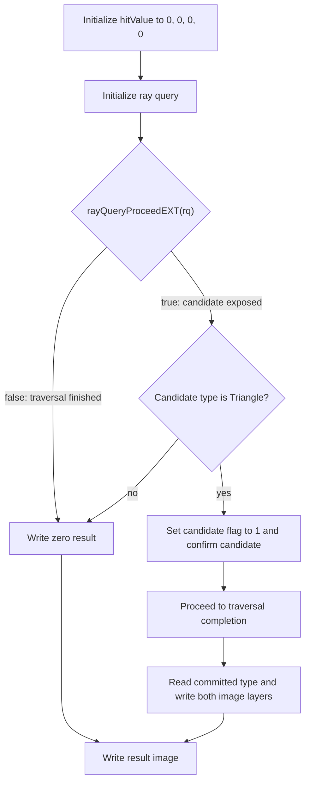

## Overview

**Core question:** Does the implementation correctly commit, generate, or skip candidate intersections during inline ray-query traversal, producing the right committed-type enum and hit/miss pattern on the result image for every shader stage that can host a ray query?

This page covers the `traversal_control` test family registered by [vktRayQueryTraversalControlTests.cpp](../../../modules/vulkan/ray_query/vktRayQueryTraversalControlTests.cpp#L2061-L2167).

- Each case traces one ray per cell from an 8x8 grid against a single BLAS (triangles or AABBs) inside a TLAS with one instance.
- The shader runs the inline ray query under one of 12 stages (vert, tesc, tese, geom, frag, comp, rgen, isect, ahit, chit, miss, call) and writes two layers of a 3D R32_UINT result image: layer 0 holds the committed-intersection enum the shader observed; layer 1 holds a 1 if a candidate was found.
- The traversal operation under test is `generate_intersection` (call `rayQueryConfirmIntersectionEXT` for triangles or `rayQueryGenerateIntersectionEXT(rq, t)` for AABBs) or `skip_intersection` (call neither).
- For ray-tracing stages the shader runs inside the matching pipeline stage invoked by an upstream `traceRayEXT`; the expected 8x8 image splits into four quadrants that exercise hit-hit, miss-hit, hit-miss, and miss-miss patterns against the regular TLAS while the inline ray query traces the second TLAS.

## Background Knowledge

For the shared acceleration-structure and traversal model, see the
[ray-query category background](../../categories/ray_query.md#background-knowledge).

- **Candidate acceptance.** `rayQueryProceedEXT` exposes a provisional candidate while the query separately retains
  the committed result. A triangle candidate uses `rayQueryConfirmIntersectionEXT`; an AABB candidate uses
  `rayQueryGenerateIntersectionEXT` with an explicit `t`. Calling neither discards the candidate and continues
  traversal.
- **Committed intersection types.** Candidate type describes the provisional intersection currently exposed by traversal, while committed type describes the accepted result retained by the query. Committed state distinguishes no accepted intersection, a committed triangle, and an application-generated intersection.
- **Shader-local traversal.** A ray-query object runs inline in whichever shader stage initializes it. Stage and pipeline wrappers can change how the shader is reached and how results are transported without changing the query's commit/discard semantics.
- **Pipeline tracing and inline traversal.** A ray tracing shader may be invoked by one `traceRayEXT` traversal and then start a separate inline query against another acceleration structure. These are independent traversals with separate descriptors and state.

## Registration Hierarchy

```text
ray_query.traversal_control
├── vertex_shader
├── tess_control_shader
├── tess_evaluation_shader
├── geometry_shader
├── fragment_shader
├── compute_shader
├── rgen_shader
├── isect_shader
├── ahit_shader
├── chit_shader
├── miss_shader
└── call_shader
```

Each intermediate node registers the `generate_intersection` and `skip_intersection` test-type groups, and each of those adds a triangle leaf and an AABB leaf. The generated matrix has `12 * 2 * 2 = 48` test case leaves under `traversal_control`.

## Parameter Dimensions and Observed Values

| Dimension | Registered values | Meaning in this test | Evidence |
|-----------|-------------------|----------------------|----------|
| Shader-source pipeline | graphics, compute, ray-tracing | Selects pipeline construction, descriptor binding count, and verification matrix. | [vktRayQueryTraversalControlTests.cpp:1895-L1907](../../../modules/vulkan/ray_query/vktRayQueryTraversalControlTests.cpp#L1895-L1907) |
| Shader-source stage | vert, tesc, tese, geom, frag, comp, rgen, isect, ahit, chit, miss, call | Selects which stage runs the inline ray query and which verifyImage overload builds the reference image. | [vktRayQueryTraversalControlTests.cpp:2066-L2120](../../../modules/vulkan/ray_query/vktRayQueryTraversalControlTests.cpp#L2066-L2120) |
| Shader test type | generate_intersection, skip_intersection | Selects which traversal-control call (or omission) the shader issues; this is the behavioral axis. | [vktRayQueryTraversalControlTests.cpp:2122-L2129](../../../modules/vulkan/ray_query/vktRayQueryTraversalControlTests.cpp#L2122-L2129) |
| Bottom test type | triangles, aabbs | Selects the BLAS geometry and which commit call is legal. | [vktRayQueryTraversalControlTests.cpp:2131-L2138](../../../modules/vulkan/ray_query/vktRayQueryTraversalControlTests.cpp#L2131-L2138) |

## Behavior Parameters

The primary behavioral axis is `ShaderTestType`: the traversal-control operation under test, crossed with `BottomTestType`. Each value pair changes which commit call the shader issues (or omits) and which committed-type enum the host expects. The shader-source pipeline modifies the dispatch path and the reference image but does not change the traversal-control semantics.

### `generate_intersection.triangles` — Commit a triangle candidate

The shader observes a triangle candidate and calls `rayQueryConfirmIntersectionEXT`. Expected layer 0 is `gl_RayQueryCommittedIntersectionTriangleEXT` (1) for cells where a candidate was found; expected layer 1 is 1 for those cells, 0 for border cells where traversal finishes without a hit.

### `generate_intersection.aabbs` — Generate an AABB intersection

The shader observes an AABB candidate and calls `rayQueryGenerateIntersectionEXT(rq, 0.5)`. Expected layer 0 is `gl_RayQueryCommittedIntersectionGeneratedEXT` (2); expected layer 1 is 1 for interior cells, 0 for border cells.

### `skip_intersection.triangles` — Discard a triangle candidate

The shader observes a triangle candidate and calls neither `rayQueryConfirmIntersectionEXT` nor `rayQueryGenerateIntersectionEXT`, so it discards the candidate. Expected layer 0 stays at 0 (`CommittedIntersectionNoneEXT`); expected layer 1 is 1 for cells where a candidate was found, 0 for border cells.

### `skip_intersection.aabbs` — Discard an AABB candidate

The shader observes an AABB candidate and calls neither commit operation. Expected layer 0 stays at 0; expected layer 1 is 1 for interior cells, 0 for border cells.

## Shader Analysis

Every case issues a ray query from the stage's own per-cell entry point: `gl_GlobalInvocationID` for compute, `gl_VertexIndex` for vert, `gl_FragCoord.xy - 0.5` for frag, `gl_LaunchIDEXT.xy` for ray-tracing stages, and the primitive index for tesc/tese/geom. The ray-query body fragment is shared; only the dispatch coordinate and verification matrix change. The representative walkthrough below uses the compute path, the simplest stage wrapper.

### Representative Shader Walkthrough 1

#### Parameter Values Chosen

Representative path:

```text
dEQP-VK.ray_query.traversal_control.compute_shader.generate_intersection.triangles
```

| Parameter choice | Meaning in this representative case |
|------------------|-------------------------------------|
| `compute_shader` | Compute is the simplest stage wrapper: one invocation per result-image cell, one ray origin per cell. |
| `generate_intersection` | The traversal-control operation under test; the shader issues `rayQueryConfirmIntersectionEXT` after observing a triangle candidate. |
| `triangles` | Triangle BLAS geometry, so a triangle candidate appears and `rayQueryConfirmIntersectionEXT` is the legal commit call. |

#### Purpose

Verify that `rayQueryConfirmIntersectionEXT` commits a triangle candidate as `gl_RayQueryCommittedIntersectionTriangleEXT`, and that `rayQueryGetIntersectionTypeEXT(rq, true)` reports that committed type, for an inline ray query run from a compute shader against a triangle BLAS.

#### Structural Design



For interior cells `(1..width-2, 1..height-2)` expected output is `(1, 1)` for the two layers; for border cells expected output is `(0, 0)`.

#### Shader Code

```glsl
#version 460 core
#extension GL_EXT_ray_query : require
/// Two-layer 3D R32_UINT storage image: layer 0 = committed type, layer 1 = candidate-found flag
layout(r32ui, set = 0, binding = 0) uniform uimage3D result;
/// Top-level acceleration structure the ray query traces against
layout(set = 0, binding = 1) uniform accelerationStructureEXT rqTopLevelAS;

void main()
{
    /// Per-invocation ray origin: cell center at z = 0.5, ray direction -Z, tmin=0, tmax=1
    vec3  origin   = vec3(float(gl_GlobalInvocationID.x) + 0.5,
                          float(gl_GlobalInvocationID.y) + 0.5, 0.5);
    /// hitValue.x <- committed type; hitValue.y <- 1 when a triangle candidate was found
    uvec4 hitValue = uvec4(0, 0, 0, 0);

    rayQueryEXT rq;
    rayQueryInitializeEXT(rq, rqTopLevelAS, 0, 0xFF, origin, 0.0, vec3(0.0, 0.0, -1.0), 1.0);

    /// Step 1: proceed to the first candidate; if none, leave both layers at 0
    if (rayQueryProceedEXT(rq))
    {
        /// Step 2: only triangles are valid here (BLAS is triangle geometry)
        if (rayQueryGetIntersectionTypeEXT(rq, false) == gl_RayQueryCandidateIntersectionTriangleEXT)
        {
            hitValue.y = 1;
            rayQueryConfirmIntersectionEXT(rq);                /// commit triangle candidate
            rayQueryProceedEXT(rq);                            /// advance past commit
            hitValue.x = rayQueryGetIntersectionTypeEXT(rq, true);
        }
    }

    imageStore(result, ivec3(gl_GlobalInvocationID.xy, 0), uvec4(hitValue.x, 0, 0, 0));
    imageStore(result, ivec3(gl_GlobalInvocationID.xy, 1), uvec4(hitValue.y, 0, 0, 0));
}
```

#### Additional Info

- The shader body is the verbatim `STT_GENERATE_INTERSECTION` fragment for `BTT_TRIANGLES` emitted by [`initPrograms`](../../../modules/vulkan/ray_query/vktRayQueryTraversalControlTests.cpp#L1348-L1874), spliced into the standard compute wrapper at [vktRayQueryTraversalControlTests.cpp:1624-L1646](../../../modules/vulkan/ray_query/vktRayQueryTraversalControlTests.cpp#L1624-L1646). `updateRayTracingGLSL()` is an identity passthrough in this CTS version and is not applied to compute.
- The compute dispatch is `width x height x 1 = 8 x 8 x 1` ([vktRayQueryTraversalControlTests.cpp:802](../../../modules/vulkan/ray_query/vktRayQueryTraversalControlTests.cpp#L802)).
- Expected per-cell value pairs come from `ComputeConfiguration::verifyImage` ([vktRayQueryTraversalControlTests.cpp:805-L874](../../../modules/vulkan/ray_query/vktRayQueryTraversalControlTests.cpp#L805-L874)): interior cells `(1..6, 1..6)` get `hitValue = (1, 1)`; border cells get `(0, 0)`. The comparison uses `tcu::intThresholdCompare` with threshold `UVec4(0)` (exact equality on each layer).
- The same logic, with `BTT_AABBS` instead of `BTT_TRIANGLES`, uses `rayQueryGenerateIntersectionEXT(rq, 0.5)` instead of `rayQueryConfirmIntersectionEXT(rq)` and reports `hitValue.x == 2` (`CommittedIntersectionGeneratedEXT`).
- The `STT_SKIP_INTERSECTION` variants keep the candidate-observation branch but call neither `rayQueryConfirmIntersectionEXT` nor `rayQueryGenerateIntersectionEXT`; on those paths the shader still sets `hitValue.y = 1` when a candidate was found but leaves `hitValue.x == 0` (`CommittedIntersectionNoneEXT`).
- The graphics and ray-tracing stages share the same per-(bottom, test) ray-query body fragments; only the stage wrapper around them changes.

#### Parameter Variation Summary

| Parameter dimension | Shader-level variation from this shader | Evidence |
|---------------------|---------------------------------------|----------|
| `ShaderSourcePipeline` / `ShaderSourceType` | Replaces the compute wrapper with a graphics stage wrapper (vert/tesc/tese/geom/frag) or a ray-tracing pipeline wrapper (rgen/isect/ahit/chit/miss/call); each variant produces a different reference image in its `verifyImage` overload but uses the same ray-query body fragment. | [vktRayQueryTraversalControlTests.cpp:1438-L1874](../../../modules/vulkan/ray_query/vktRayQueryTraversalControlTests.cpp#L1438-L1874) |
| `BottomTestType` | Switches the BLAS geometry between triangles and AABBs and switches the commit call from `rayQueryConfirmIntersectionEXT` to `rayQueryGenerateIntersectionEXT(rq, 0.5)`. | [vktRayQueryTraversalControlTests.cpp:1353-L1436](../../../modules/vulkan/ray_query/vktRayQueryTraversalControlTests.cpp#L1353-L1436) |
| `ShaderTestType` | `skip_intersection` keeps the candidate-observation branch but removes both commit calls, so `hitValue.x` stays at `0` regardless of geometry. | [vktRayQueryTraversalControlTests.cpp:1353-L1436](../../../modules/vulkan/ray_query/vktRayQueryTraversalControlTests.cpp#L1353-L1436) |
| Dispatch coverage | For ray-tracing stages the same shader body fragment runs inside the matching stage of a `traceRayEXT` launch; the `verifyImage` overload expects a four-quadrant hit/miss pattern in the 8x8 reference image. | [vktRayQueryTraversalControlTests.cpp:1123-L1244](../../../modules/vulkan/ray_query/vktRayQueryTraversalControlTests.cpp#L1123-L1244) |

#### SPIR-V

- Status: generated and validated
- Source: reconstructed GLSL from this walkthrough
- Stage: `comp`
- Target SPIRV version: `spirv1.4`

<details>
<summary>Click to expand SPIRV asm code</summary>

```llvm
; SPIR-V
; Version: 1.4
; Generator: Khronos Glslang Reference Front End; 11
; Bound: 88
; Schema: 0
               OpCapability Shader
               OpCapability RayQueryKHR
               OpExtension "SPV_KHR_ray_query"
          %1 = OpExtInstImport "GLSL.std.450"
               OpMemoryModel Logical GLSL450
               OpEntryPoint GLCompute %main "main" %gl_GlobalInvocationID %rq %rqTopLevelAS %result
               OpExecutionMode %main LocalSize 1 1 1
               OpSource GLSL 460
               OpSourceExtension "GL_EXT_ray_query"
               OpName %main "main"
               OpName %origin "origin"
               OpName %gl_GlobalInvocationID "gl_GlobalInvocationID"
               OpName %hitValue "hitValue"
               OpName %rq "rq"
               OpName %rqTopLevelAS "rqTopLevelAS"
               OpName %result "result"
               OpDecorate %gl_GlobalInvocationID BuiltIn GlobalInvocationId
               OpDecorate %rqTopLevelAS Binding 1
               OpDecorate %rqTopLevelAS DescriptorSet 0
               OpDecorate %result Binding 0
               OpDecorate %result DescriptorSet 0
       %void = OpTypeVoid
          %3 = OpTypeFunction %void
      %float = OpTypeFloat 32
    %v3float = OpTypeVector %float 3
%_ptr_Function_v3float = OpTypePointer Function %v3float
       %uint = OpTypeInt 32 0
     %v3uint = OpTypeVector %uint 3
%_ptr_Input_v3uint = OpTypePointer Input %v3uint
%gl_GlobalInvocationID = OpVariable %_ptr_Input_v3uint Input
     %uint_0 = OpConstant %uint 0
%_ptr_Input_uint = OpTypePointer Input %uint
  %float_0_5 = OpConstant %float 0.5
     %uint_1 = OpConstant %uint 1
     %v4uint = OpTypeVector %uint 4
%_ptr_Function_v4uint = OpTypePointer Function %v4uint
         %30 = OpConstantComposite %v4uint %uint_0 %uint_0 %uint_0 %uint_0
         %31 = OpTypeRayQueryKHR
%_ptr_Private_31 = OpTypePointer Private %31
         %rq = OpVariable %_ptr_Private_31 Private
         %34 = OpTypeAccelerationStructureKHR
%_ptr_UniformConstant_34 = OpTypePointer UniformConstant %34
%rqTopLevelAS = OpVariable %_ptr_UniformConstant_34 UniformConstant
   %uint_255 = OpConstant %uint 255
    %float_0 = OpConstant %float 0
   %float_n1 = OpConstant %float -1
         %42 = OpConstantComposite %v3float %float_0 %float_0 %float_n1
    %float_1 = OpConstant %float 1
       %bool = OpTypeBool
      %false = OpConstantFalse %bool
        %int = OpTypeInt 32 1
      %int_0 = OpConstant %int 0
%_ptr_Function_uint = OpTypePointer Function %uint
       %true = OpConstantTrue %bool
      %int_1 = OpConstant %int 1
         %62 = OpTypeImage %uint 3D 0 0 0 2 R32ui
%_ptr_UniformConstant_62 = OpTypePointer UniformConstant %62
     %result = OpVariable %_ptr_UniformConstant_62 UniformConstant
     %v2uint = OpTypeVector %uint 2
      %v2int = OpTypeVector %int 2
      %v3int = OpTypeVector %int 3
       %main = OpFunction %void None %3
          %5 = OpLabel
     %origin = OpVariable %_ptr_Function_v3float Function
   %hitValue = OpVariable %_ptr_Function_v4uint Function
         %16 = OpAccessChain %_ptr_Input_uint %gl_GlobalInvocationID %uint_0
         %17 = OpLoad %uint %16
         %18 = OpConvertUToF %float %17
         %20 = OpFAdd %float %18 %float_0_5
         %22 = OpAccessChain %_ptr_Input_uint %gl_GlobalInvocationID %uint_1
         %23 = OpLoad %uint %22
         %24 = OpConvertUToF %float %23
         %25 = OpFAdd %float %24 %float_0_5
         %26 = OpCompositeConstruct %v3float %20 %25 %float_0_5
               OpStore %origin %26
               OpStore %hitValue %30
         %37 = OpLoad %34 %rqTopLevelAS
         %39 = OpLoad %v3float %origin
               OpRayQueryInitializeKHR %rq %37 %uint_0 %uint_255 %39 %float_0 %42 %float_1
         %45 = OpRayQueryProceedKHR %bool %rq
               OpSelectionMerge %47 None
               OpBranchConditional %45 %46 %47
         %46 = OpLabel
         %51 = OpRayQueryGetIntersectionTypeKHR %uint %rq %int_0
         %52 = OpIEqual %bool %51 %uint_0
               OpSelectionMerge %54 None
               OpBranchConditional %52 %53 %54
         %53 = OpLabel
         %56 = OpAccessChain %_ptr_Function_uint %hitValue %uint_1
               OpStore %56 %uint_1
               OpRayQueryConfirmIntersectionKHR %rq
         %57 = OpRayQueryProceedKHR %bool %rq
         %60 = OpRayQueryGetIntersectionTypeKHR %uint %rq %int_1
         %61 = OpAccessChain %_ptr_Function_uint %hitValue %uint_0
               OpStore %61 %60
               OpBranch %54
         %54 = OpLabel
               OpBranch %47
         %47 = OpLabel
         %65 = OpLoad %62 %result
         %67 = OpLoad %v3uint %gl_GlobalInvocationID
         %68 = OpVectorShuffle %v2uint %67 %67 0 1
         %70 = OpBitcast %v2int %68
         %72 = OpCompositeExtract %int %70 0
         %73 = OpCompositeExtract %int %70 1
         %74 = OpCompositeConstruct %v3int %72 %73 %int_0
         %75 = OpAccessChain %_ptr_Function_uint %hitValue %uint_0
         %76 = OpLoad %uint %75
         %77 = OpCompositeConstruct %v4uint %76 %uint_0 %uint_0 %uint_0
               OpImageWrite %65 %74 %77 ZeroExtend
         %78 = OpLoad %62 %result
         %79 = OpLoad %v3uint %gl_GlobalInvocationID
         %80 = OpVectorShuffle %v2uint %79 %79 0 1
         %81 = OpBitcast %v2int %80
         %82 = OpCompositeExtract %int %81 0
         %83 = OpCompositeExtract %int %81 1
         %84 = OpCompositeConstruct %v3int %82 %83 %int_1
         %85 = OpAccessChain %_ptr_Function_uint %hitValue %uint_1
         %86 = OpLoad %uint %85
         %87 = OpCompositeConstruct %v4uint %86 %uint_0 %uint_0 %uint_0
               OpImageWrite %78 %84 %87 ZeroExtend
               OpReturn
               OpFunctionEnd
```

</details>

## Runtime Execution and Result Checking

- **Resource setup.** The host allocates a 3D `R32_UINT` image sized `width = height = 8, depth = 2` and a host-visible readback buffer. The image is cleared to `0xFF` in the graphics and ray-tracing paths; the compute path keeps the clear-and-reset to compare against the layered reference.
- **Acceleration structure.** A BLAS with one geometry is built: two triangles forming the interior `(1..width-1, 1..height-1)` quad for `BTT_TRIANGLES`, or a single AABB covering the same region for `BTT_AABBS`. The TLAS holds one instance. The test reuses a separate second TLAS for ray-tracing stages so the inline ray query can trace against a distinct AS while `traceRayEXT` walks the first.
- **Descriptor binding.** For graphics and compute the result image is at binding 0 and the TLAS at binding 1 ([vktRayQueryTraversalControlTests.cpp:741-L743](../../../modules/vulkan/ray_query/vktRayQueryTraversalControlTests.cpp#L741-L743), [vktRayQueryTraversalControlTests.cpp:251-L255](../../../modules/vulkan/ray_query/vktRayQueryTraversalControlTests.cpp#L251-L255)). For ray tracing the result image is at b0, the regular TLAS at b1, and the ray-query TLAS at b2 ([vktRayQueryTraversalControlTests.cpp:935-L939](../../../modules/vulkan/ray_query/vktRayQueryTraversalControlTests.cpp#L935-L939)).
- **Dispatch.** Compute dispatches `8x8x1`; the graphics case draws four vertices; the ray-tracing case uses `cmdTraceRays(width=8, height=8, depth=1)`.
- **Result copyback.** After the pipeline command, the host records `vkCmdCopyImageToBuffer` for the full `8x8x2` image extent into the readback buffer, then awaits with a `TRANSFER -> HOST` memory barrier before mapping the buffer.
- **Verification.** Each `verifyImage` overload constructs an `8x8x2` reference image by:

  - setting per-stage hit/miss tokens (e.g. `(1,0,0,0)` for `rayQueryConfirmIntersectionEXT`, `(2,0,0,0)` for `rayQueryGenerateIntersectionEXT`, `(3,0,0,0)` for a fixed closest-hit payload, `(4,0,0,0)` for the miss payload or ahit-without-confirm path), and clearing border cells to `(0,0,0,0)` for graphics stages or to a per-stage miss pattern for ray-tracing stages ([vktRayQueryTraversalControlTests.cpp:580-L690](../../../modules/vulkan/ray_query/vktRayQueryTraversalControlTests.cpp#L580-L690), [L805-L874](../../../modules/vulkan/ray_query/vktRayQueryTraversalControlTests.cpp#L805-L874), [L1123-L1244](../../../modules/vulkan/ray_query/vktRayQueryTraversalControlTests.cpp#L1123-L1244));
  - calling `tcu::intThresholdCompare` with threshold `UVec4(0)` (exact equality on each layer).
- **Pass condition.** Comparison reports no failure; otherwise the instance returns `tcu::TestStatus::fail("Fail")` ([vktRayQueryTraversalControlTests.cpp:2054-L2056](../../../modules/vulkan/ray_query/vktRayQueryTraversalControlTests.cpp#L2054-L2056)).

### Per-stage verification summary

| Stage | verifyImage result layout | Reference pattern |
|-------|--------------------------|-------------------|
| vertex | image (8,8,2), one entry per `gl_VertexIndex` | clear to 0xFF, set vertex 0 (0,0) and (0,1) to per-(bottom,test) hit tokens; rest = miss |
| tess_control / tess_evaluation / geometry | iterate over the 2 primitives and 3 vertices per primitive | clear to 0xFF, primitive 0 vertex 0 set to hit tokens; rest = miss |
| fragment | iterate over interior `(1..6, 1..6)` | clear to miss, interior set to per-(bottom,test) hit tokens |
| compute | iterate over interior `(1..6, 1..6)` | clear to miss, interior set to per-(bottom,test) hit tokens |
| rgen | split into top half (hit) and bottom half (miss), inner quadrants pattern | `hitMiss`, `hitHit`, `missHit`, `missMiss` cells per the four quadrants |
| intersection / any-hit / closest-hit | split with `(4,0,0,0)` for non-rq paths through miss shader or ahit; rq-in-rchit sets payload only after the rq | same top/bottom split; rchit with hit-chit path uses `chit` shader setting `hitValue.y = 3` |
| miss | miss shader sets `hitValue.x = 4`; rq-in-miss issues the same probe | top half: hit-hit, hit-miss; bottom half: miss-hit (rq found), miss-miss |
| callable | rgen uses `executeCallableEXT(0,0)`; callable round-trips `param.hitValue` | matches the rgen-style four-quadrant layout |

## Failure Meaning

### Failure Cause Mapping

| If this behavior parameter value fails | Possible failure cause(s) |
|----------------------------------------|---------------------------|
| `generate_intersection.triangles` | The expected candidate flag or committed `TriangleEXT` type is absent from a cell whose stage-specific reference expects it. |
| `generate_intersection.aabbs` | The expected candidate flag or committed `GeneratedEXT` type is absent from a cell whose stage-specific reference expects it. The test passes `t = 0.5` but does not query the committed distance. |
| `skip_intersection.triangles` | A candidate is not observed where expected, or the committed type after continuing traversal is not `NoneEXT`. |
| `skip_intersection.aabbs` | A candidate is not observed where expected, or the committed type after continuing traversal is nonzero instead of `NoneEXT`. |
| Stage-specific routing (ray-tracing stages) | The exact two-layer image differs from the stage-specific combination of regular-trace routing tokens and inline-ray-query values. |

### Cause Analysis

#### Triangle confirmation, AABB generation, and candidate-discard semantics

**Possible failure symptoms:** In cells where the inline query is expected to hit, `generate_intersection.triangles` expects the pair `(1, 1)`, `generate_intersection.aabbs` expects `(2, 1)`, and both `skip_intersection` variants expect `(0, 1)`. Any other pair is a failure, but only the two stored values are observed: layer 1 records whether the first `rayQueryProceedEXT` exposed the expected candidate type, while layer 0 records the committed type after the shader issues the selected operation and calls `rayQueryProceedEXT` again. Graphics and compute misses use `(0, 0)`; ray-tracing stages instead use their stage-specific regular-trace and inline-query pattern.

**Possible implementation causes:** The Vulkan spec defines that `rayQueryConfirmIntersectionEXT` commits a triangle candidate as `TriangleEXT`, `rayQueryGenerateIntersectionEXT` commits an AABB candidate as `GeneratedEXT`, and a candidate for which the shader calls neither operation is discarded. A wrong pair can therefore be consistent with incorrect candidate reporting, commit/discard semantics, committed-type reporting, shader execution, or result storage. The image comparison does not independently identify which step failed; source-level investigation is needed to distinguish traversal behavior from SPIR-V lowering or stage plumbing.

#### Stage-local plumbing and two-TLAS bindings

**Possible failure symptoms:** The exact reference comparison fails only for one shader stage while an otherwise equivalent stage passes, or a ray-tracing stage produces the wrong regular-trace/inline-query quadrant values.

**Possible implementation causes:** Ray-tracing cases exercise additional pipeline, shader-binding-table, payload/attribute, and two-AS-descriptor paths; callable cases also pass the values through `executeCallableEXT`. A stage-local mismatch is consistent with one of those paths or that stage's ray-query lowering, but the final image alone does not localize the cause. Source-level investigation is needed to identify the failing path.

## Case Pruning

### Requirement-based pruning

- All cases require `VK_KHR_acceleration_structure` with `accelerationStructure` and `VK_KHR_ray_query` with `rayQuery` feature bits ([vktRayQueryTraversalControlTests.cpp:1297-L1310](../../../modules/vulkan/ray_query/vktRayQueryTraversalControlTests.cpp#L1297-L1310)).
- Tessellation-control and tessellation-evaluation stages require `VkPhysicalDeviceFeatures2.tessellationShader` ([vktRayQueryTraversalControlTests.cpp:1314-L1317](../../../modules/vulkan/ray_query/vktRayQueryTraversalControlTests.cpp#L1314-L1317)).
- Geometry stage requires `VkPhysicalDeviceFeatures2.geometryShader` ([vktRayQueryTraversalControlTests.cpp:1319-L1320](../../../modules/vulkan/ray_query/vktRayQueryTraversalControlTests.cpp#L1319-L1320)).
- Vertex, tessellation-control, tessellation-evaluation, and geometry stages require `DEVICE_CORE_FEATURE_VERTEX_PIPELINE_STORES_AND_ATOMICS` because they `imageStore` from graphics stages ([vktRayQueryTraversalControlTests.cpp:1322-L1332](../../../modules/vulkan/ray_query/vktRayQueryTraversalControlTests.cpp#L1322-L1332)).
- Ray-generation, intersection, any-hit, closest-hit, miss, and callable stages require `VK_KHR_ray_tracing_pipeline` with `rayTracingPipeline` feature bit ([vktRayQueryTraversalControlTests.cpp:1334-L1345](../../../modules/vulkan/ray_query/vktRayQueryTraversalControlTests.cpp#L1334-L1345)).

### Design-based pruning

- The same 8x8 single-instance BLAS is built for every leaf; the geometry is `triangles` (two triangles covering the interior quad) or `aabbs` (one AABB over the same region). Cells on the 1-pixel border miss.
- Only one ray per cell is traced; the result image records exactly two values per cell.
- The shader body fragment for `STT_GENERATE_INTERSECTION.triangles`, `STT_GENERATE_INTERSECTION.aabbs`, `STT_SKIP_INTERSECTION.triangles`, and `STT_SKIP_INTERSECTION.aabbs` is shared across all 12 stages.

## Key Takeaways

- The traversal-control operation under test distinguishes triangle confirmation with `rayQueryConfirmIntersectionEXT`, AABB generation with `rayQueryGenerateIntersectionEXT`, and candidate discard when the shader calls neither operation; the test checks the resulting candidate-observed flag and committed-type value together.
- The shader body is identical across the 12 stages for a given `(bottom, test)` pair; only the per-stage wrapper (dispatch coordinate, descriptor binding) and the per-stage reference image change.
- Two TLAS descriptors appear only in the ray-tracing stages; graphics and compute cases use a single AS descriptor at b1, ray-tracing cases bind the regular TLAS at b1 and the ray-query TLAS at b2.
- Result verification uses exact equality on each of the two image layers (`tcu::intThresholdCompare` with threshold `UVec4(0)`); a mismatch does not independently localize which traversal, stage-routing, or storage step failed.

## Source Reference Appendix

| Entry point | Link | Why it matters |
|-------------|------|----------------|
| `TestParams`, enums, constants | [vktRayQueryTraversalControlTests.cpp:61-L98](../../../modules/vulkan/ray_query/vktRayQueryTraversalControlTests.cpp#L61-L98) | Per-case parameters, source-pipeline, source-type, shader-test-type, bottom-type. |
| `GraphicsConfiguration::initConfiguration` | [vktRayQueryTraversalControlTests.cpp:244-L543](../../../modules/vulkan/ray_query/vktRayQueryTraversalControlTests.cpp#L244-L543) | Graphics pipeline and framebuffer creation; per-stage wrapper selection. |
| `GraphicsConfiguration::verifyImage` | [vktRayQueryTraversalControlTests.cpp:580-L690](../../../modules/vulkan/ray_query/vktRayQueryTraversalControlTests.cpp#L580-L690) | Reference image generator and `intThresholdCompare` for graphics stages. |
| `ComputeConfiguration::initConfiguration` / `verifyImage` | [vktRayQueryTraversalControlTests.cpp:734-L803](../../../modules/vulkan/ray_query/vktRayQueryTraversalControlTests.cpp#L734-L803), [L805-L874](../../../modules/vulkan/ray_query/vktRayQueryTraversalControlTests.cpp#L805-L874) | Compute pipeline and reference image generator. |
| `RayTracingConfiguration::initConfiguration` / `verifyImage` | [vktRayQueryTraversalControlTests.cpp:927-L1013](../../../modules/vulkan/ray_query/vktRayQueryTraversalControlTests.cpp#L927-L1013), [L1123-L1244](../../../modules/vulkan/ray_query/vktRayQueryTraversalControlTests.cpp#L1123-L1244) | Ray-tracing pipeline construction and four-quadrant verification. |
| `initPrograms` | [vktRayQueryTraversalControlTests.cpp:1348-L1874](../../../modules/vulkan/ray_query/vktRayQueryTraversalControlTests.cpp#L1348-L1874) | Per-stage shader wrappers; the four per-(bottom,test) ray-query bodies are spliced into each. |
| Per-(bottom,test) ray-query bodies | [vktRayQueryTraversalControlTests.cpp:1353-L1436](../../../modules/vulkan/ray_query/vktRayQueryTraversalControlTests.cpp#L1353-L1436) | The traversal-control body fragments. |
| `RayQueryTraversalControlTestCase::checkSupport` | [vktRayQueryTraversalControlTests.cpp:1297-L1346](../../../modules/vulkan/ray_query/vktRayQueryTraversalControlTests.cpp#L1297-L1346) | Feature gates and per-stage support gating. |
| `iterate` | [vktRayQueryTraversalControlTests.cpp:1891-L2057](../../../modules/vulkan/ray_query/vktRayQueryTraversalControlTests.cpp#L1891-L2057) | Image / buffer allocation, AS build, dispatch/draw/trace, copy-back, verification. |
| `createTraversalControlTests` | [vktRayQueryTraversalControlTests.cpp:2061-L2167](../../../modules/vulkan/ray_query/vktRayQueryTraversalControlTests.cpp#L2061-L2167) | Top-level registration: `traversal_control.<shader_source>.<test_type>.<bottom_type>`. |
| Vulkan spec: ray query traversal | [raytraversal.adoc](../../../../vulkan-docs/src/chapters/raytraversal.adoc) | Triangle confirmation, AABB generation, and candidate-discard semantics. |
