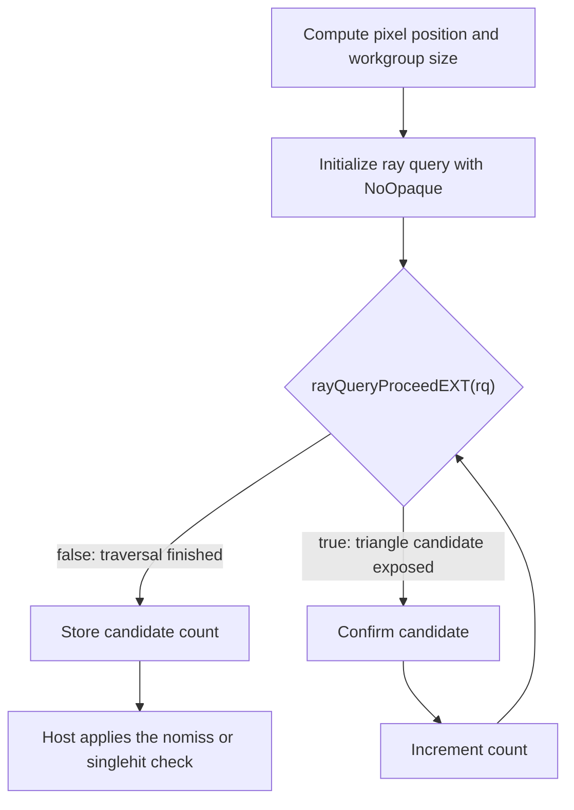

## Overview

**Core question:** Does `VK_KHR_ray_query` traversal of a heavily subdivided surface hit every pixel ray at least once (`nomiss`) and report exactly one triangle candidate (`singlehit`), exposing misses or duplicate candidate reports at shared edges and vertices?

This page covers the `watertightness` test family registered by [vktRayQueryWatertightnessTests.cpp](../../../modules/vulkan/ray_query/vktRayQueryWatertightnessTests.cpp#L2251-L2347). Both test types share one source file, one shader body, and one geometry generator.

- The host builds a bottom-level acceleration structure (BLAS) of `256 * 256 = 65536` triangles or AABBs whose XY projections cover the unit square, then wraps that BLAS in a single-instance top-level acceleration structure (TLAS).
- Each pixel ray starts at the corresponding XY pixel center at `z = 0` and points down `(0, 0, -1)` with `tmin = 0`, `tmax = 9`. The shader counts every matching candidate returned by `rayQueryProceedEXT`; it confirms each triangle candidate or generates an AABB intersection at `t = 0.5`, but does not independently query whether that operation became the final committed hit.
- `nomiss` fails when any pixel count is `<= 0`. `singlehit` fails when any pixel count is `!= 1`, including both zero and multiple candidates. Both rules scan all 65536 result ints.
- Twelve shader stages run every applicable test-type/geometry combination: `nomiss` uses triangles and AABBs, while `singlehit` uses triangles only, for 36 leaves across `vert`, `tesc`, `tese`, `geom`, `frag`, `comp`, `rgen`, `ahit`, `chit`, `miss`, `sect`, and `call`.
- The triangle body uses `gl_RayFlagsNoOpaqueEXT` and `rayQueryConfirmIntersectionEXT`. The AABB body uses `rayFlags = 0` and `rayQueryGenerateIntersectionEXT(rayQuery, 0.5f)`.

## Background Knowledge

For the shared concept acceleration-structure and traversal, see [Background Knowledge](../../categories/ray_query.md#background-knowledge) of the `ray_query` page.

- **Traversal watertightness.** Adjacent triangles share edges and vertices, but finite-precision intersection rules must assign boundary rays consistently. A crack occurs when both adjacent triangles reject such a ray; a double hit occurs when both accept it where only one candidate should be reported.
- **Candidate counts versus committed hits.** A shader can count candidates exposed by `rayQueryProceedEXT` independently of the final committed intersection. Confirming a triangle or generating an AABB hit does not turn that explicit candidate counter into a committed-hit counter.
- **Triangle and AABB boundaries.** Connected triangle interiors can form a non-overlapping surface with shared boundaries. AABBs that cover subdivided regions may overlap, so more than one AABB candidate for a ray can be valid even when the projected region appears continuous.

## Registration Hierarchy

```text
ray_query.watertightness
├── nomiss
└── singlehit
```

Each child is an intermediate node. The test case leaves live two levels deeper, indexed by shader stage and geometry type (for example, `dEQP-VK.ray_query.watertightness.nomiss.comp.triangles` and `dEQP-VK.ray_query.watertightness.singlehit.geom.triangles`).

## Parameter Dimensions and Observed Values

| Dimension | Registered values | Meaning in this test | Evidence |
|-----------|-------------------|----------------------|----------|
| `TestType` | `nomiss`, `singlehit` | Behavior parameter. Selects the host scan rule and which `verify` override runs. | [vktRayQueryWatertightnessTests.cpp:60-L64](../../../modules/vulkan/ray_query/vktRayQueryWatertightnessTests.cpp#L60-L64), [L2275-L2282](../../../modules/vulkan/ray_query/vktRayQueryWatertightnessTests.cpp#L2275-L2282) |
| Shader stage | `vert`, `tesc`, `tese`, `geom`, `frag`, `comp`, `rgen`, `ahit`, `chit`, `miss`, `sect`, `call` | Selects the pipeline family (graphics, compute, or ray tracing) and the stage-specific wrapper that derives `pos`. | [vktRayQueryWatertightnessTests.cpp:2257-L2274](../../../modules/vulkan/ray_query/vktRayQueryWatertightnessTests.cpp#L2257-L2274) |
| `GeomType` | `triangles`, `aabbs` | Selects the BLAS primitive type and which `rayQuery*` commit call the shader body uses. `aabbs` is pruned from `singlehit`. | [vktRayQueryWatertightnessTests.cpp:66-L71](../../../modules/vulkan/ray_query/vktRayQueryWatertightnessTests.cpp#L66-L71), [L2283-L2290](../../../modules/vulkan/ray_query/vktRayQueryWatertightnessTests.cpp#L2283-L2290) |
| Image size | `256 x 256 x 1` | Sets the per-pixel ray count and the result-image extent. | [vktRayQueryWatertightnessTests.cpp:73-L74](../../../modules/vulkan/ray_query/vktRayQueryWatertightnessTests.cpp#L73-L74) |
| Ray range | `tmin = 0.0`, `tmax = 9.0` | Fixed trace window. `tmax` is large enough to reach every primitive below the unit square. | [vktRayQueryWatertightnessTests.cpp:1527-L1528](../../../modules/vulkan/ray_query/vktRayQueryWatertightnessTests.cpp#L1527-L1528), [L1556-L1557](../../../modules/vulkan/ray_query/vktRayQueryWatertightnessTests.cpp#L1556-L1557) |
| Ray direction | `vec3(0, 0, -1)` | Fixed for every pixel. Rays fire straight down through the subdivided mesh. | [vktRayQueryWatertightnessTests.cpp:1531](../../../modules/vulkan/ray_query/vktRayQueryWatertightnessTests.cpp#L1531), [L1560](../../../modules/vulkan/ray_query/vktRayQueryWatertightnessTests.cpp#L1560) |
| `squaresGroupCount` | `256 * 256 / 1 / 1 = 65536` | Target primitive count after subdivision. The generator rejects slivers until this count is reached. | [vktRayQueryWatertightnessTests.cpp:2307-L2311](../../../modules/vulkan/ray_query/vktRayQueryWatertightnessTests.cpp#L2307-L2311) |
| Random seed | `baseSeed` from the test context | Drives the subdivision RNG for both triangles and AABBs. Failures reproduce across runs with the same seed. | [vktRayQueryWatertightnessTests.cpp:2253](../../../modules/vulkan/ray_query/vktRayQueryWatertightnessTests.cpp#L2253) |
| Image format | `VK_FORMAT_R32_SINT` | One signed `int32` per pixel. The shader writes `count` and the host scans `int32` values. | [vktRayQueryWatertightnessTests.cpp:2327](../../../modules/vulkan/ray_query/vktRayQueryWatertightnessTests.cpp#L2327) |

## Behavior Parameters

The primary behavioral axis is `TestType`. Both values share one shader body (`getShaderBodyText`) and one geometry generator (`TestConfigurationNoMiss::initAccelerationStructures`). The only difference is the host verification rule. `TestConfigurationSingleHit` inherits from `TestConfigurationNoMiss` and overrides only `verify` ([vktRayQueryWatertightnessTests.cpp:1922-L1926](../../../modules/vulkan/ray_query/vktRayQueryWatertightnessTests.cpp#L1922-L1926)).

### `nomiss` — Every pixel ray must report at least one candidate

The host scans every result int and counts failures where `resultPtr[pos] <= 0` ([vktRayQueryWatertightnessTests.cpp:1885-L1892](../../../modules/vulkan/ray_query/vktRayQueryWatertightnessTests.cpp#L1885-L1892)). The test expects one or more matching candidates for every pixel ray because the geometry's XY projection covers the unit square. A zero count shows that the shader did not process an expected candidate, but the stored count alone does not distinguish traversal, acceleration-structure construction, stage dispatch, or image-write failures.

This value runs against both `triangles` and `aabbs`. The AABB path calls `rayQueryGenerateIntersectionEXT(rayQuery, 0.5f)` for each AABB candidate. Overlapping AABBs in the generated geometry can produce multiple candidates for the same ray, which is allowed; `nomiss` only requires the count to be positive.

### `singlehit` — Every pixel ray must report exactly one triangle candidate

The host scans every result int and counts failures where `resultPtr[pos] != expectedValue` with `expectedValue = 1` ([vktRayQueryWatertightnessTests.cpp:1938-L1945](../../../modules/vulkan/ray_query/vktRayQueryWatertightnessTests.cpp#L1938-L1945)). The expected count is exactly one because the triangle surface's XY projection covers the square without overlapping triangle interiors. A zero count is a miss; a count above one is a duplicate candidate report, potentially where a ray meets a shared edge or vertex. The count does not by itself identify the implementation component responsible.

This value runs against `triangles` only. The AABB path is pruned in the registration loop ([vktRayQueryWatertightnessTests.cpp:2333-L2334](../../../modules/vulkan/ray_query/vktRayQueryWatertightnessTests.cpp#L2333-L2334)) because the subdivided AABB mesh contains overlapping candidates by design and a correct implementation can legitimately produce more than one generated intersection per ray.

## Shader Analysis

Both test types share one shader body fragment emitted by `getShaderBodyText` ([vktRayQueryWatertightnessTests.cpp:1520-L1584](../../../modules/vulkan/ray_query/vktRayQueryWatertightnessTests.cpp#L1520-L1584)). The fragment is wrapped by a stage-specific GLSL program for each of the twelve stages. The compute wrapper is the simplest: it sets `pos = ivec3(gl_WorkGroupID)` and `size = ivec3(gl_NumWorkGroups)`, then inlines the shared body. The graphics wrappers derive `pos` from `gl_VertexIndex`, `gl_InvocationID`, `gl_PrimitiveIDIn`, or `gl_FragCoord`. The ray tracing wrappers derive `pos = ivec3(gl_LaunchIDEXT)` and `size = ivec3(gl_LaunchSizeEXT)`.

The representative walkthrough below uses the `nomiss.comp.triangles` path. It exercises the most common commit path (`rayQueryConfirmIntersectionEXT`) and the simplest pipeline (compute). The same shader body drives every other stage and geometry combination; only the commit call differs between `triangles` and `aabbs`.

### Representative Shader Walkthrough 1

#### Parameter Values Chosen

Representative path:

```text
dEQP-VK.ray_query.watertightness.nomiss.comp.triangles
```

| Parameter choice | Meaning in this representative case |
|------------------|-------------------------------------|
| `nomiss` | Host scan requires `count > 0` per pixel. The shader body is shared with `singlehit`; only the host rule changes. |
| `comp` | Compute pipeline. One workgroup per pixel, dispatched `256 x 256 x 1`. The `pos` and `size` derivation is the simplest of all twelve wrappers. |
| `triangles` | Triangle BLAS. The shader uses `gl_RayFlagsNoOpaqueEXT` and `rayQueryConfirmIntersectionEXT`. The AABB body would use `rayFlags = 0` and `rayQueryGenerateIntersectionEXT(rq, 0.5f)`. |

#### Purpose

Verify that an inline ray query fired from each pixel center through the subdivided triangle mesh reports at least one triangle candidate that the shader confirms. The `count` written to the result image must be greater than zero for every pixel.

#### Structural Design



A correct watertight implementation reports one or more triangle candidates for every pixel ray. The shader confirms each candidate and counts it. The host then enforces the `nomiss` rule on the stored count.

#### Shader Code

```glsl
#version 460 core
#extension GL_EXT_ray_query : require
/// 3D R32_SINT storage image: per-pixel hit count, host reads back as int32
layout(set = 0, binding = 0, r32i) uniform iimage3D result;
/// Top-level acceleration structure wrapping the subdivided BLAS
layout(set = 0, binding = 1) uniform accelerationStructureEXT rayQueryTopLevelAccelerationStructure;

void main()
{
    /// One workgroup per pixel; pos and size are derived from the workgroup IDs
    ivec3 pos      = ivec3(gl_WorkGroupID);
    ivec3 size     = ivec3(gl_NumWorkGroups);
    /// gl_RayFlagsNoOpaqueEXT forces triangle candidates to require explicit confirm
    uint  rayFlags = gl_RayFlagsNoOpaqueEXT;
    uint  cullMask = 0xFF;
    float tmin     = 0.0;
    float tmax     = 9.0;
    /// Pixel center on the unit square, ray fired straight down -Z
    vec3  origin   = vec3((float(pos.x) + 0.5f) / float(size.x), (float(pos.y) + 0.5f) / float(size.y), 0.0);
    vec3  direct   = vec3(0.0, 0.0, -1.0);
    uint  count    = 0;
    rayQueryEXT rayQuery;

    rayQueryInitializeEXT(rayQuery, rayQueryTopLevelAccelerationStructure, rayFlags, cullMask, origin, tmin, direct, tmax);

    while (rayQueryProceedEXT(rayQuery))
    {
        if (rayQueryGetIntersectionTypeEXT(rayQuery, false) == gl_RayQueryCandidateIntersectionTriangleEXT)
        {
            /// Confirm each triangle candidate and count it; tests watertightness across shared edges
            rayQueryConfirmIntersectionEXT(rayQuery);
            count++;
        }
    }

    imageStore(result, pos, ivec4(count, 0, 0, 0));
}
```

#### Additional Info

- The shader body is the verbatim `getShaderBodyText` triangle branch spliced into the compute wrapper from [`ComputeConfiguration::initPrograms`](../../../modules/vulkan/ray_query/vktRayQueryWatertightnessTests.cpp#L947-L978). `updateRayTracingGLSL` is an identity passthrough in this CTS version, so the reconstructed GLSL is exactly the source fed to `glslangValidator`. Build options are `vk::ShaderBuildOptions(usedVulkanVersion, SPIRV_VERSION_1_4, 0u, true)` ([vktRayQueryWatertightnessTests.cpp:949](../../../modules/vulkan/ray_query/vktRayQueryWatertightnessTests.cpp#L949)).
- The AABB variant replaces `gl_RayFlagsNoOpaqueEXT` with `0` and replaces `rayQueryConfirmIntersectionEXT(rayQuery)` with `rayQueryGenerateIntersectionEXT(rayQuery, 0.5f)` ([vktRayQueryWatertightnessTests.cpp:1524-L1547](../../../modules/vulkan/ray_query/vktRayQueryWatertightnessTests.cpp#L1524-L1547)). The candidate-type check uses `gl_RayQueryCandidateIntersectionAABBEXT`. Every other line of the shader body is identical.
- The graphics wrappers (`vert`, `tesc`, `tese`, `geom`, `frag`) write the same `count` to the same `result` image, but they derive `pos` differently. The vertex wrapper uses `gl_VertexIndex / 3` and runs `testFunc` only on `vertId == 0` to avoid triple-counting each triangle ([vktRayQueryWatertightnessTests.cpp:417-L426](../../../modules/vulkan/ray_query/vktRayQueryWatertightnessTests.cpp#L417-L426)). The fragment wrapper uses `gl_FragCoord - 0.5` ([vktRayQueryWatertightnessTests.cpp:657-L661](../../../modules/vulkan/ray_query/vktRayQueryWatertightnessTests.cpp#L657-L661)).
- The `sect` (intersection) stage injects `reportIntersectionEXT(1.0f, 0)` after the ray-query body so the parent `traceRays` call sees a hit ([vktRayQueryWatertightnessTests.cpp:1236-L1239](../../../modules/vulkan/ray_query/vktRayQueryWatertightnessTests.cpp#L1236-L1239)). That side effect does not change the per-pixel `count` written to the result image.
- The `call` (callable) stage routes the body through `executeCallableEXT(0, 0)` in the rgen shader; the callable shader runs the body. The rgen shader's b1 descriptor is the traceRays TLAS (default geometry), and b2 is the ray-query TLAS ([vktRayQueryWatertightnessTests.cpp:1286-L1321](../../../modules/vulkan/ray_query/vktRayQueryWatertightnessTests.cpp#L1286-L1321)).

#### Parameter Variation Summary

| Parameter dimension | Shader-level variation from this shader | Evidence |
|---------------------|---------------------------------------|----------|
| `TestType = SINGLE_HIT` | Same shader binary; the host scan rule changes from `> 0` to `== 1`. | [vktRayQueryWatertightnessTests.cpp:1934-L1945](../../../modules/vulkan/ray_query/vktRayQueryWatertightnessTests.cpp#L1934-L1945) |
| `GeomType = AABBs` | Replaces `gl_RayFlagsNoOpaqueEXT` with `0`, replaces `rayQueryConfirmIntersectionEXT` with `rayQueryGenerateIntersectionEXT(rq, 0.5f)`, replaces the triangle candidate check with `gl_RayQueryCandidateIntersectionAABBEXT`. | [vktRayQueryWatertightnessTests.cpp:1522-L1547](../../../modules/vulkan/ray_query/vktRayQueryWatertightnessTests.cpp#L1522-L1547) |
| Shader stage | Replaces the compute wrapper with a graphics, ray tracing, or callable wrapper. The `testFunc(pos, size)` body is identical. | [vktRayQueryWatertightnessTests.cpp:393-L672](../../../modules/vulkan/ray_query/vktRayQueryWatertightnessTests.cpp#L393-L672), [L1126-L1336](../../../modules/vulkan/ray_query/vktRayQueryWatertightnessTests.cpp#L1126-L1336) |

#### SPIR-V

- Status: generated and validated
- Source: reconstructed GLSL from this walkthrough
- Stage: `comp`
- Target SPIRV version: `spirv1.4`
- Bound: 97

<details>
<summary>Click to expand SPIRV asm code</summary>

```llvm
; SPIR-V
; Version: 1.4
; Generator: Khronos Glslang Reference Front End; 11
; Bound: 97
; Schema: 0
               OpCapability Shader
               OpCapability RayQueryKHR
               OpExtension "SPV_KHR_ray_query"
          %1 = OpExtInstImport "GLSL.std.450"
               OpMemoryModel Logical GLSL450
               OpEntryPoint GLCompute %main "main" %gl_WorkGroupID %gl_NumWorkGroups %rayQuery %rayQueryTopLevelAccelerationStructure %result
               OpExecutionMode %main LocalSize 1 1 1
               OpSource GLSL 460
               OpSourceExtension "GL_EXT_ray_query"
               OpName %main "main"
               OpName %pos "pos"
               OpName %gl_WorkGroupID "gl_WorkGroupID"
               OpName %size "size"
               OpName %gl_NumWorkGroups "gl_NumWorkGroups"
               OpName %rayFlags "rayFlags"
               OpName %cullMask "cullMask"
               OpName %tmin "tmin"
               OpName %tmax "tmax"
               OpName %origin "origin"
               OpName %direct "direct"
               OpName %count "count"
               OpName %rayQuery "rayQuery"
               OpName %rayQueryTopLevelAccelerationStructure "rayQueryTopLevelAccelerationStructure"
               OpName %result "result"
               OpDecorate %gl_WorkGroupID BuiltIn WorkgroupId
               OpDecorate %gl_NumWorkGroups BuiltIn NumWorkgroups
               OpDecorate %rayQueryTopLevelAccelerationStructure Binding 1
               OpDecorate %rayQueryTopLevelAccelerationStructure DescriptorSet 0
               OpDecorate %result Binding 0
               OpDecorate %result DescriptorSet 0
       %void = OpTypeVoid
          %3 = OpTypeFunction %void
        %int = OpTypeInt 32 1
      %v3int = OpTypeVector %int 3
%_ptr_Function_v3int = OpTypePointer Function %v3int
       %uint = OpTypeInt 32 0
     %v3uint = OpTypeVector %uint 3
%_ptr_Input_v3uint = OpTypePointer Input %v3uint
%gl_WorkGroupID = OpVariable %_ptr_Input_v3uint Input
%gl_NumWorkGroups = OpVariable %_ptr_Input_v3uint Input
%_ptr_Function_uint = OpTypePointer Function %uint
     %uint_2 = OpConstant %uint 2
   %uint_255 = OpConstant %uint 255
      %float = OpTypeFloat 32
%_ptr_Function_float = OpTypePointer Function %float
    %float_0 = OpConstant %float 0
    %float_9 = OpConstant %float 9
    %v3float = OpTypeVector %float 3
%_ptr_Function_v3float = OpTypePointer Function %v3float
     %uint_0 = OpConstant %uint 0
%_ptr_Function_int = OpTypePointer Function %int
  %float_0_5 = OpConstant %float 0.5
     %uint_1 = OpConstant %uint 1
   %float_n1 = OpConstant %float -1
         %57 = OpConstantComposite %v3float %float_0 %float_0 %float_n1
         %59 = OpTypeRayQueryKHR
%_ptr_Private_59 = OpTypePointer Private %59
   %rayQuery = OpVariable %_ptr_Private_59 Private
         %62 = OpTypeAccelerationStructureKHR
%_ptr_UniformConstant_62 = OpTypePointer UniformConstant %62
%rayQueryTopLevelAccelerationStructure = OpVariable %_ptr_UniformConstant_62 UniformConstant
       %bool = OpTypeBool
      %false = OpConstantFalse %bool
      %int_0 = OpConstant %int 0
      %int_1 = OpConstant %int 1
         %88 = OpTypeImage %int 3D 0 0 0 2 R32i
%_ptr_UniformConstant_88 = OpTypePointer UniformConstant %88
     %result = OpVariable %_ptr_UniformConstant_88 UniformConstant
      %v4int = OpTypeVector %int 4
       %main = OpFunction %void None %3
          %5 = OpLabel
        %pos = OpVariable %_ptr_Function_v3int Function
       %size = OpVariable %_ptr_Function_v3int Function
   %rayFlags = OpVariable %_ptr_Function_uint Function
   %cullMask = OpVariable %_ptr_Function_uint Function
       %tmin = OpVariable %_ptr_Function_float Function
       %tmax = OpVariable %_ptr_Function_float Function
     %origin = OpVariable %_ptr_Function_v3float Function
     %direct = OpVariable %_ptr_Function_v3float Function
      %count = OpVariable %_ptr_Function_uint Function
         %14 = OpLoad %v3uint %gl_WorkGroupID
         %15 = OpBitcast %v3int %14
               OpStore %pos %15
         %18 = OpLoad %v3uint %gl_NumWorkGroups
         %19 = OpBitcast %v3int %18
               OpStore %size %19
               OpStore %rayFlags %uint_2
               OpStore %cullMask %uint_255
               OpStore %tmin %float_0
               OpStore %tmax %float_9
         %36 = OpAccessChain %_ptr_Function_int %pos %uint_0
         %37 = OpLoad %int %36
         %38 = OpConvertSToF %float %37
         %40 = OpFAdd %float %38 %float_0_5
         %41 = OpAccessChain %_ptr_Function_int %size %uint_0
         %42 = OpLoad %int %41
         %43 = OpConvertSToF %float %42
         %44 = OpFDiv %float %40 %43
         %46 = OpAccessChain %_ptr_Function_int %pos %uint_1
         %47 = OpLoad %int %46
         %48 = OpConvertSToF %float %47
         %49 = OpFAdd %float %48 %float_0_5
         %50 = OpAccessChain %_ptr_Function_int %size %uint_1
         %51 = OpLoad %int %50
         %52 = OpConvertSToF %float %51
         %53 = OpFDiv %float %49 %52
         %54 = OpCompositeConstruct %v3float %44 %53 %float_0
               OpStore %origin %54
               OpStore %direct %57
               OpStore %count %uint_0
         %65 = OpLoad %62 %rayQueryTopLevelAccelerationStructure
         %66 = OpLoad %uint %rayFlags
         %67 = OpLoad %uint %cullMask
         %68 = OpLoad %v3float %origin
         %69 = OpLoad %float %tmin
         %70 = OpLoad %v3float %direct
         %71 = OpLoad %float %tmax
               OpRayQueryInitializeKHR %rayQuery %65 %66 %67 %68 %69 %70 %71
               OpBranch %72
         %72 = OpLabel
               OpLoopMerge %74 %75 None
               OpBranch %76
         %76 = OpLabel
         %78 = OpRayQueryProceedKHR %bool %rayQuery
               OpBranchConditional %78 %73 %74
         %73 = OpLabel
         %81 = OpRayQueryGetIntersectionTypeKHR %uint %rayQuery %int_0
         %82 = OpIEqual %bool %81 %uint_0
               OpSelectionMerge %84 None
               OpBranchConditional %82 %83 %84
         %83 = OpLabel
               OpRayQueryConfirmIntersectionKHR %rayQuery
         %85 = OpLoad %uint %count
         %87 = OpIAdd %uint %85 %int_1
               OpStore %count %87
               OpBranch %84
         %84 = OpLabel
               OpBranch %75
         %75 = OpLabel
               OpBranch %72
         %74 = OpLabel
         %91 = OpLoad %88 %result
         %92 = OpLoad %v3int %pos
         %93 = OpLoad %uint %count
         %94 = OpBitcast %int %93
         %96 = OpCompositeConstruct %v4int %94 %int_0 %int_0 %int_0
               OpImageWrite %91 %92 %96 SignExtend
               OpReturn
               OpFunctionEnd
```

</details>

## Runtime Execution and Result Checking

- **Resource setup.** The host creates a 3D `VK_FORMAT_R32_SINT` image sized `256 x 256 x 1` with `STORAGE | TRANSFER_SRC | TRANSFER_DST` usage, plus a host-visible readback buffer of `256 * 256 * 4` bytes ([vktRayQueryWatertightnessTests.cpp:2053-L2069](../../../modules/vulkan/ray_query/vktRayQueryWatertightnessTests.cpp#L2053-L2069)).
- **Image clear and layout transition.** The image starts in `UNDEFINED`, transitions to `TRANSFER_DST_OPTIMAL` for `vkCmdClearColorImage` (clear value zero), then transitions to `GENERAL` with `VK_ACCESS_ACCELERATION_STRUCTURE_READ_BIT_KHR | VK_ACCESS_ACCELERATION_STRUCTURE_WRITE_BIT_KHR` for the shader write ([vktRayQueryWatertightnessTests.cpp:2083-L2101](../../../modules/vulkan/ray_query/vktRayQueryWatertightnessTests.cpp#L2083-L2101)).
- **BLAS and TLAS build.** `TestConfigurationNoMiss::initAccelerationStructures` builds the subdivided BLAS in the command buffer using `createAndBuild`, adds it as a single instance to the TLAS, and builds the TLAS ([vktRayQueryWatertightnessTests.cpp:1639-L1874](../../../modules/vulkan/ray_query/vktRayQueryWatertightnessTests.cpp#L1639-L1874)). The same routine runs for `singlehit`.
- **Pipeline dispatch.** Compute dispatches `256 x 256 x 1` workgroups ([vktRayQueryWatertightnessTests.cpp:1028](../../../modules/vulkan/ray_query/vktRayQueryWatertightnessTests.cpp#L1028)). Graphics draws a fullscreen-like vertex buffer sized to one vertex per pixel for vert/tesc/tese/geom, or two triangles for frag ([vktRayQueryWatertightnessTests.cpp:674-L776](../../../modules/vulkan/ray_query/vktRayQueryWatertightnessTests.cpp#L674-L776)). Ray tracing calls `cmdTraceRays(256, 256, 1)` ([vktRayQueryWatertightnessTests.cpp:1515-L1517](../../../modules/vulkan/ray_query/vktRayQueryWatertightnessTests.cpp#L1515-L1517)). The ray tracing pipeline builds a second, default-geometry BLAS/TLAS for the `traceRays` call that drives `rgen` execution; the ray-query TLAS the body queries is the subdivided one bound at descriptor b2.
- **Descriptor binding.** Compute and graphics bind the result image at b0 and the ray-query TLAS at b1. Ray tracing binds the result image at b0, the traceRays TLAS at b1, and the ray-query TLAS at b2 ([vktRayQueryWatertightnessTests.cpp:1501-L1508](../../../modules/vulkan/ray_query/vktRayQueryWatertightnessTests.cpp#L1501-L1508)).
- **Result copyback.** After the shader run, a `SHADER_READ | SHADER_WRITE -> TRANSFER_READ` memory barrier precedes `vkCmdCopyImageToBuffer`, followed by a `TRANSFER_WRITE -> HOST_READ` barrier ([vktRayQueryWatertightnessTests.cpp:2091-L2115](../../../modules/vulkan/ray_query/vktRayQueryWatertightnessTests.cpp#L2091-L2115)). The host calls `invalidateMappedMemoryRange` before scanning the buffer.
- **Pass/fail decision.** `TestConfigurationNoMiss::verify` counts failures where `resultPtr[pos] <= 0` and returns `failures == 0` ([vktRayQueryWatertightnessTests.cpp:1876-L1920](../../../modules/vulkan/ray_query/vktRayQueryWatertightnessTests.cpp#L1876-L1920)). `TestConfigurationSingleHit::verify` counts failures where `resultPtr[pos] != 1` and returns `failures == 0` ([vktRayQueryWatertightnessTests.cpp:1928-L1973](../../../modules/vulkan/ray_query/vktRayQueryWatertightnessTests.cpp#L1928-L1973)). Both verifiers log a grid of failing cell values when any failure exists. `RayQueryBuiltinTestInstance::iterate` returns `pass` or `fail` from that boolean ([vktRayQueryWatertightnessTests.cpp:2124-L2127](../../../modules/vulkan/ray_query/vktRayQueryWatertightnessTests.cpp#L2124-L2127)).

## Failure Meaning

### Failure Cause Mapping

| If this behavior parameter value fails | Possible failure cause(s) |
|----------------------------------------|---------------------------|
| `nomiss` | One or more pixels contain `count <= 0`, meaning no matching candidate was processed there. This is consistent with a traversal miss, but also with setup, dispatch, or storage failure. |
| `singlehit` | One or more pixels contain a value other than `1`: `0` is a missing candidate, while values above `1` are duplicate candidate reports. AABB geometry is pruned from this value because overlapping AABBs can legitimately yield multiple candidates. |
| (both values, same pixel pattern) | The same unexpected counts can also arise from stage-specific wrapper, descriptor, acceleration-structure, or image-write paths; the result grid does not independently localize them. |

### Cause Analysis

#### Traversal crack at a shared edge or vertex

**Possible failure symptoms:** On a `nomiss` leaf, one or more pixels hold `count <= 0` after the dispatch. The host logs failing values and prints `___` for positive cells. A sparse pattern aligned with shared edges or vertices would be consistent with a watertightness defect, but the verifier does not require or classify that spatial pattern.

**Possible implementation causes:** The Vulkan ray traversal spec defines triangle intersection in floating-point arithmetic with implementation-defined precision. Incorrect edge inclusion can reject a candidate that the test expects, while acceleration-structure construction or candidate reporting faults can produce the same symptom. The generator's minimum edge and area checks only prevent an already-small triangle from being selected for another subdivision; they do not independently validate every emitted child. Source-level investigation is therefore needed to distinguish input sensitivity from BVH build, triangle intersection, and candidate reporting behavior.

#### Missing or duplicate triangle candidates

**Possible failure symptoms:** On a `singlehit` leaf, one or more pixels hold `count != 1`. The host logs the actual failing value and prints `___` for cells equal to `1`. A zero is a missing candidate; a value above one records multiple triangle candidates processed by the shader. A shared-edge or shared-vertex pattern would be consistent with the watertightness behavior under test, but is not classified automatically.

**Possible implementation causes:** The Vulkan watertightness language says implementations should not miss or double-hit rays at shared edges or shared vertices of a closed fan. Incorrect edge inclusion can therefore produce zero or multiple candidates. Other traversal, acceleration-structure, shader, or storage faults can produce the same counts, so source-level investigation is needed to localize a failure.

#### Stage-dispatch infrastructure failure

**Possible failure symptoms:** All pixels, or a contiguous block of pixels, hold zero on one specific shader stage while comparable leaves in other stages pass. The cleared image also starts at zero, so unwritten cells and queries that process no candidate have the same observed value.

**Possible implementation causes:** Each stage uses a different wrapper to derive `pos`, and ray-tracing stages additionally use a second TLAS descriptor and stage-routing machinery. Those paths are possible stage-local causes, but the final count image cannot distinguish them from stage-specific ray-query compilation or execution faults. The host descriptor update lives in `fillCommandBuffer` per pipeline family ([vktRayQueryWatertightnessTests.cpp:867-L899](../../../modules/vulkan/ray_query/vktRayQueryWatertightnessTests.cpp#L867-L899), [L1003-L1029](../../../modules/vulkan/ray_query/vktRayQueryWatertightnessTests.cpp#L1003-L1029), [L1462-L1518](../../../modules/vulkan/ray_query/vktRayQueryWatertightnessTests.cpp#L1462-L1518)). Source-level investigation is needed to localize the failure.

## Case Pruning

### Requirement-based pruning

- All leaves require `VK_KHR_acceleration_structure` and `VK_KHR_ray_query` device extensions, plus their feature bits ([vktRayQueryWatertightnessTests.cpp:2154-L2169](../../../modules/vulkan/ray_query/vktRayQueryWatertightnessTests.cpp#L2154-L2169)). Missing `rayQuery` throws `NotSupportedError`; missing `accelerationStructure` throws `TestError`.
- Ray tracing stages (`rgen`, `ahit`, `chit`, `miss`, `sect`, `call`) require `VK_KHR_ray_tracing_pipeline` with `rayTracingPipeline == VK_TRUE` ([vktRayQueryWatertightnessTests.cpp:1115-L1124](../../../modules/vulkan/ray_query/vktRayQueryWatertightnessTests.cpp#L1115-L1124)).
- Vertex, tessellation control, tessellation evaluation, and geometry stages require `DEVICE_CORE_FEATURE_VERTEX_PIPELINE_STORES_AND_ATOMICS` because the shader writes to a storage image from those stages ([vktRayQueryWatertightnessTests.cpp:369-L377](../../../modules/vulkan/ray_query/vktRayQueryWatertightnessTests.cpp#L369-L377)).
- Tessellation stages require `DEVICE_CORE_FEATURE_TESSELLATION_SHADER`. Geometry stages require `DEVICE_CORE_FEATURE_GEOMETRY_SHADER` ([vktRayQueryWatertightnessTests.cpp:379-L390](../../../modules/vulkan/ray_query/vktRayQueryWatertightnessTests.cpp#L379-L390)).

### Design-based pruning

- `singlehit x aabbs` is pruned in the registration loop ([vktRayQueryWatertightnessTests.cpp:2333-L2334](../../../modules/vulkan/ray_query/vktRayQueryWatertightnessTests.cpp#L2333-L2334)). The subdivided AABB mesh contains overlapping candidates by design. `rayQueryGenerateIntersectionEXT(rq, 0.5f)` commits a procedural hit at the middle of each candidate interval, so overlapping AABBs can legitimately produce more than one generated intersection per ray. Restricting `singlehit` to triangles keeps the test well defined.
- The triangle selector does not further subdivide a parent whose edge length is below `MIN_TRIANGLE_EDGE_LENGTH` or whose area is below `MIN_TRIANGLE_AREA_SIZE` ([vktRayQueryWatertightnessTests.cpp:1631-L1633](../../../modules/vulkan/ray_query/vktRayQueryWatertightnessTests.cpp#L1631-L1633)).
- The AABB selector similarly avoids further subdividing a parent whose X or Y side is below `MIN_AABB_SIDE_LENGTH = 1e-6f` ([vktRayQueryWatertightnessTests.cpp:1610-L1611](../../../modules/vulkan/ray_query/vktRayQueryWatertightnessTests.cpp#L1610-L1611)). These are generator selection rules, not runtime support pruning.
- The geometry type, shader stage, and test type matrices are fully crossed except for the `singlehit x aabbs` exclusion. There is no sweep over `tmin`, `tmax`, ray direction, image size, or build flags; those dimensions are fixed by the test design.

## Key Takeaways

- The two test types share one shader body and one geometry generator. The behavior parameter is `TestType`, and the only difference between `nomiss` and `singlehit` is the host scan rule applied to the per-pixel candidate count.
- `nomiss` rejects every `count <= 0`. `singlehit` rejects every `count != 1`, so it detects both missing (`0`) and duplicate (`>1`) triangle candidates.
- The `singlehit x aabbs` pruning is part of the test design, not a missing case. Overlapping AABBs in the generated geometry can legitimately produce more than one candidate per ray, so the `== 1` rule would not be well defined against AABB geometry.
- Twelve shader stages exercise the applicable test-type/geometry combinations. Cross-stage patterns can guide investigation, but the count image alone does not independently localize a failure to traversal, BLAS construction, stage plumbing, or result storage.

## Source Reference Appendix

| Entry point | Link | Why it matters |
|-------------|------|----------------|
| `TestType` enum | [vktRayQueryWatertightnessTests.cpp:60-L64](../../../modules/vulkan/ray_query/vktRayQueryWatertightnessTests.cpp#L60-L64) | Defines the behavior parameter values. |
| `GeomType` enum | [vktRayQueryWatertightnessTests.cpp:66-L71](../../../modules/vulkan/ray_query/vktRayQueryWatertightnessTests.cpp#L66-L71) | Defines the geometry-type configuration dimension. |
| `getShaderBodyText` | [vktRayQueryWatertightnessTests.cpp:1520-L1584](../../../modules/vulkan/ray_query/vktRayQueryWatertightnessTests.cpp#L1520-L1584) | The shared shader body for triangles and AABBs. |
| `GraphicsConfiguration::initPrograms` | [vktRayQueryWatertightnessTests.cpp:393-L672](../../../modules/vulkan/ray_query/vktRayQueryWatertightnessTests.cpp#L393-L672) | Per-stage GLSL wrappers for vert, tesc, tese, geom, frag. |
| `ComputeConfiguration::initPrograms` | [vktRayQueryWatertightnessTests.cpp:947-L978](../../../modules/vulkan/ray_query/vktRayQueryWatertightnessTests.cpp#L947-L978) | Compute wrapper used by the representative walkthrough. |
| `RayTracingConfiguration::initPrograms` | [vktRayQueryWatertightnessTests.cpp:1126-L1336](../../../modules/vulkan/ray_query/vktRayQueryWatertightnessTests.cpp#L1126-L1336) | Ray tracing wrappers for rgen, ahit, chit, miss, sect, call. |
| `TestConfigurationNoMiss::initAccelerationStructures` | [vktRayQueryWatertightnessTests.cpp:1639-L1874](../../../modules/vulkan/ray_query/vktRayQueryWatertightnessTests.cpp#L1639-L1874) | Builds the subdivided BLAS for both `nomiss` and `singlehit`. |
| `TestConfigurationNoMiss::verify` | [vktRayQueryWatertightnessTests.cpp:1876-L1920](../../../modules/vulkan/ray_query/vktRayQueryWatertightnessTests.cpp#L1876-L1920) | The `nomiss` scan rule. |
| `TestConfigurationSingleHit::verify` | [vktRayQueryWatertightnessTests.cpp:1928-L1973](../../../modules/vulkan/ray_query/vktRayQueryWatertightnessTests.cpp#L1928-L1973) | The `singlehit` scan rule. |
| `RayQueryBuiltinTestInstance::iterate` | [vktRayQueryWatertightnessTests.cpp:2042-L2128](../../../modules/vulkan/ray_query/vktRayQueryWatertightnessTests.cpp#L2042-L2128) | End-to-end host flow including barriers, copyback, and pass/fail. |
| `RayQueryBuiltinTestCase::checkSupport` | [vktRayQueryWatertightnessTests.cpp:2154-L2170](../../../modules/vulkan/ray_query/vktRayQueryWatertightnessTests.cpp#L2154-L2170) | Extension and feature gates. |
| `createWatertightnessTests` | [vktRayQueryWatertightnessTests.cpp:2251-L2347](../../../modules/vulkan/ray_query/vktRayQueryWatertightnessTests.cpp#L2251-L2347) | Top-level registration. |
