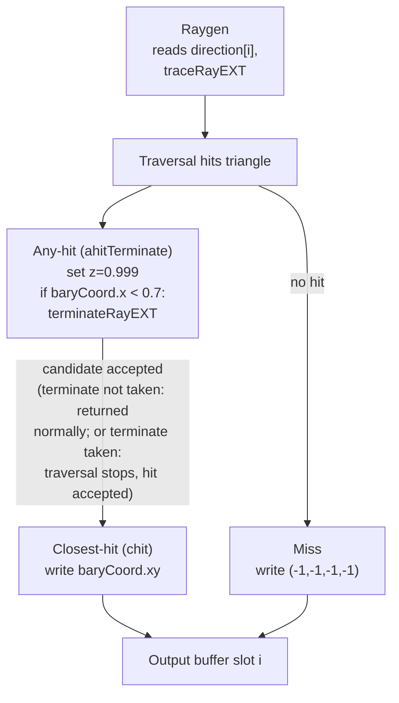

## Overview

**Core question:** Do the `hitAttributeEXT vec2 baryCoord` values reported by the ray tracing pipeline at a triangle hit match the barycentric coordinates the host computed for each ray direction, and does `terminateRayEXT` in an any-hit shader stop further candidate processing as expected?

- [vktRayTracingBarycentricCoordinatesTests.cpp](../../../modules/vulkan/ray_tracing/vktRayTracingBarycentricCoordinatesTests.cpp) registers the `barycentric_coordinates` test family under the `ray_tracing_pipeline` test category and implements it in the same file.
- The test family has three test case leaves: `chit`, `ahit`, and `ahitTerminate`. Each leaf traces 20 rays at a single triangle and reads back the barycentric hit attribute the pipeline reported, comparing it against coordinates the host computed from the same triangle and ray directions.
- The leaves differ in which hit shader reports the attribute. `chit` uses a closest-hit shader, `ahit` uses an any-hit shader, and `ahitTerminate` uses both a closest-hit and an any-hit shader where the any-hit shader calls `terminateRayEXT` conditionally and writes a marker z value the host checks.
- The page explains the registration hierarchy, the behavioral axis formed by the three hit-shader configurations, the shader logic, the host-side ray generation and result comparison, and what a failure of each leaf points at.

## Background Knowledge

- **Barycentric hit attributes.** For a triangle hit, the Vulkan ray tracing pipeline reports the intersection barycentrics through the `hitAttributeEXT vec2 baryCoord` built-in. The two components are the weights of the second and third triangle vertices; the first vertex weight is `1 - b - c`. The spec requires these to be the vertex weights of the hit primitive.
- **Closest-hit versus any-hit shaders.** A closest-hit shader runs once for the accepted (closest) hit. An any-hit shader runs for each candidate intersection during traversal and can accept or reject a candidate. `chit` and `ahit` exercise these two reporting paths separately; `ahitTerminate` exercises both together.
- **`terminateRayEXT`.** In an any-hit shader, `terminateRayEXT` ends the current invocation, stops further traversal for the ray, accepts the current candidate as the hit, and invokes the closest-hit shader if one is present. The test uses it conditionally on the barycentric x value and records a marker so the host can confirm the any-hit shader executed.
- **`VK_GEOMETRY_NO_DUPLICATE_ANY_HIT_INVOCATION_BIT_KHR`.** The bottom-level acceleration structure geometry is created with this flag, so the any-hit shader runs at most once per primitive per ray. This makes the any-hit cases deterministic.

## Registration Hierarchy

```text
ray_tracing_pipeline.barycentric_coordinates
├── ahit
├── ahitTerminate
└── chit
```

The three direct children are registered by [createBarycentricCoordinatesTests](../../../modules/vulkan/ray_tracing/vktRayTracingBarycentricCoordinatesTests.cpp#L498-L512). Each child is one `BarycentricCoordinatesCase` with a distinct `TestCaseRT` value and a deterministic seed. The dispatcher at [createTests](../../../modules/vulkan/ray_tracing/vktRayTracingTests.cpp#L93) adds the `barycentric_coordinates` group as a child of the `ray_tracing_pipeline` test category. All three leaves appear in the mustpass at [ray-tracing-pipeline.txt](../../../mustpass/main/vk-default/ray-tracing-pipeline.txt).

## Parameter Dimensions and Observed Values

| Dimension | Registered values | Meaning in this test | Evidence |
|-----------|-------------------|----------------------|----------|
| Hit shader configuration (test case leaf) | `chit`, `ahit`, `ahitTerminate` | Selects which shader stage reports the barycentric attribute and whether `terminateRayEXT` is exercised. This is the primary behavioral axis. | [createBarycentricCoordinatesTests](../../../modules/vulkan/ray_tracing/vktRayTracingBarycentricCoordinatesTests.cpp#L506-L509) |
| Seed | `1614343620u`, `1614343621u`, `1614343622u` | Each leaf gets a deterministic seed (`seed++`) that drives `de::Random` ray direction generation. The seed varies per leaf but does not change what is being tested. | [seed assignment](../../../modules/vulkan/ray_tracing/vktRayTracingBarycentricCoordinatesTests.cpp#L505-L509) |
| Ray count | 20 (`kNumRays`) | Fixed across all leaves. The first three rays target near-vertex barycentric coordinates; the remaining 17 are generated randomly while avoiding zero weights. | [kNumRays](../../../modules/vulkan/ray_tracing/vktRayTracingBarycentricCoordinatesTests.cpp#L84) |
| Coordinate threshold | `0.001f` (`kThreshold`) | Fixed tolerance for the x and y barycentric comparisons. The z and w components are checked exactly. | [kThreshold](../../../modules/vulkan/ray_tracing/vktRayTracingBarycentricCoordinatesTests.cpp#L81-L83) |

## Behavior Parameters

The primary behavioral axis is the hit shader configuration, which is the test case leaf. The three leaves each test a different reporting path for the barycentric hit attribute.

### chit - closest-hit shader reports barycentrics

The closest-hit shader reads `hitAttributeEXT vec2 baryCoord` and writes `baryCoord` into the output storage buffer at the x and y components of the ray's slot. The host compares those x and y values against the coordinates it computed for the same ray direction, within `kThreshold`. This leaf verifies that the pipeline reports correct barycentric attributes through the closest-hit path. Only the closest-hit stage is added to the pipeline for this case ([getUsedStages](../../../modules/vulkan/ray_tracing/vktRayTracingBarycentricCoordinatesTests.cpp#L65-L76) returns `CLOSEST_HIT_BIT_KHR`).

### ahit - any-hit shader reports barycentrics

The same shader text that the `chit` leaf uses is registered as an any-hit shader instead of a closest-hit shader ([initPrograms](../../../modules/vulkan/ray_tracing/vktRayTracingBarycentricCoordinatesTests.cpp#L204-L206)). The any-hit shader writes `baryCoord` to the x and y components. Because the geometry uses `VK_GEOMETRY_NO_DUPLICATE_ANY_HIT_INVOCATION_BIT_KHR` and there is one triangle, the any-hit shader runs once for the single candidate hit, which is then accepted as the closest hit. The host applies the same x and y comparison as `chit`. This leaf verifies barycentric reporting through the any-hit path. The z component stays at its cleared zero value.

### ahitTerminate - any-hit shader conditionally terminates, closest-hit reports barycentrics

This leaf uses both a closest-hit shader and a separate any-hit shader. The closest-hit shader writes `baryCoord` to x and y as in `chit`. The any-hit shader writes a marker to the z component first, then calls `terminateRayEXT` when `baryCoord.x < 0.7`. The host expects z to be `0.999` for every ray. The default marker is `0.999`. Although the shader also writes z to `0.5` after `terminateRayEXT`, that store is dead code: `terminateRayEXT` ends the invocation, stops traversal, accepts the current candidate as the hit, and invokes the closest-hit shader, which writes `baryCoord.xy` and leaves z at `0.999`. This leaf exercises `terminateRayEXT` control flow and confirms the any-hit shader ran without altering the accepted barycentrics.

## Shader Analysis

Shader code is part of the tested behavior. The shaders are generated in [initPrograms](../../../modules/vulkan/ray_tracing/vktRayTracingBarycentricCoordinatesTests.cpp#L129-L216) from C++ string streams, with explicit `vk::ShaderBuildOptions` targeting SPIR-V 1.4. The three leaves share the same raygen, miss, and closest-hit shader text; they differ only in which hit shader is registered. The representative walkthrough below uses the `ahitTerminate` case because it is the only leaf that exercises `terminateRayEXT` and the z-marker validation, and it includes both the closest-hit and any-hit shaders.

### Representative Shader Walkthrough 1

#### Parameter Values Chosen

Representative path:

```text
dEQP-VK.ray_tracing_pipeline.barycentric_coordinates.ahitTerminate
```

| Parameter choice | Meaning in this representative case |
|------------------|-------------------------------------|
| `testCase = CLOSEST_AND_ANY_HIT_TERMINATE` | Registers both a closest-hit and an any-hit shader in the same hit group; the only leaf that exercises `terminateRayEXT`. |
| `seed = 1614343622u` | Deterministic seed for the 17 randomly generated ray directions, so the expected barycentrics are reproducible on the host. |
| `kNumRays = 20` | 20 output slots; the first three target near-vertex barycentrics, the rest are random. |

#### Purpose

Verify that the `hitAttributeEXT vec2 baryCoord` reported at a triangle hit matches the host-computed barycentric coordinates, and that an any-hit shader calling `terminateRayEXT` conditionally accepts the candidate and stops traversal without corrupting the closest-hit barycentrics or the z marker.

#### Structural Design



#### Shader Code

##### Any-Hit Shader (ahitTerminate)

```glsl
#version 460 core
#extension GL_EXT_ray_tracing : require

/// Any-hit shader for the ahitTerminate case. Reads the hit barycentric attribute,
/// records a marker z value, and conditionally terminates the ray when baryCoord.x < 0.7.
hitAttributeEXT vec2 baryCoord;

/// Binding 0: top-level acceleration structure traversed by traceRayEXT in the raygen shader.
/// Binding 1: uniform buffer holding 20 ray directions (vec4 each), indexed by gl_LaunchIDEXT.x.
/// Binding 2: std430 storage buffer holding 20 vec4 output slots; this shader writes the z marker.
layout(set=0, binding=0) uniform accelerationStructureEXT topLevelAS;
layout(set=0, binding=1) uniform RayDirections {
  vec4 values[20];
} directions;
layout(set=0, binding=2, std430) buffer OutputBarycentrics {
  vec4 values[20];
} coordinates;

void main()
{
  /// Default marker: 0.999 indicates the any-hit shader ran. The 0.5 store below is
  /// dead code after OpTerminateRayKHR ends the invocation, so 0.999 survives both paths.
  coordinates.values[gl_LaunchIDEXT.x].z = 0.999;
  if(baryCoord.x < 0.7){
    /// terminateRayEXT ends the invocation, stops traversal, accepts the current
    /// candidate as the hit, and invokes the closest-hit shader. The 0.5 store
    /// below is unreachable dead code.
    terminateRayEXT;
    coordinates.values[gl_LaunchIDEXT.x].z = 0.5;
  }
}
```

##### Closest-Hit Shader (chit)

```glsl
#version 460 core
#extension GL_EXT_ray_tracing : require

hitAttributeEXT vec2 baryCoord;

/// Same descriptor layout as the any-hit shader. The closest-hit shader writes the accepted
/// barycentric x and y to the output slot, leaving z at whatever the any-hit shader set.
layout(set=0, binding=0) uniform accelerationStructureEXT topLevelAS;
layout(set=0, binding=1) uniform RayDirections {
  vec4 values[20];
} directions;
layout(set=0, binding=2, std430) buffer OutputBarycentrics {
  vec4 values[20];
} coordinates;

void main()
{
  coordinates.values[gl_LaunchIDEXT.x].xy = baryCoord;
}
```

##### Raygen Shader (rgen)

```glsl
#version 460 core
#extension GL_EXT_ray_tracing : require

/// Payload declared but unused by the hit shaders; the miss shader also does not read it.
layout(location=0) rayPayloadEXT vec3 hitValue;

/// Binding 0: top-level acceleration structure. Binding 1: 20 ray directions.
/// Binding 2: output storage buffer written by hit/miss shaders.
layout(set=0, binding=0) uniform accelerationStructureEXT topLevelAS;
layout(set=0, binding=1) uniform RayDirections {
  vec4 values[20];
} directions;
layout(set=0, binding=2, std430) buffer OutputBarycentrics {
  vec4 values[20];
} coordinates;

void main()
{
  const uint  cullMask  = 0xFF;
  const vec3  origin    = vec3(0.0, 0.0, 0.0);
  const vec3  direction = directions.values[gl_LaunchIDEXT.x].xyz;
  /// tMin and tMax are tightened around 1.0 (kTMin=0.999, kTMax=1.001) to require
  /// the same precision in the ray parameter T as in the barycentric coordinates.
  const float tMin      = 0.999000013;
  const float tMax      = 1.000999928;
  traceRayEXT(topLevelAS, gl_RayFlagsNoneEXT, cullMask, 0, 0, 0, origin, tMin, direction, tMax, 0);
}
```

#### Additional Info

- The closest-hit shader text is identical across all three leaves; only its registration stage differs. In `chit` and `ahitTerminate` it is added as `ClosestHitSource`; in `ahit` the same text is added as `AnyHitSource` ([initPrograms](../../../modules/vulkan/ray_tracing/vktRayTracingBarycentricCoordinatesTests.cpp#L201-L213)). It stays fixed in structure and varies only in stage binding.
- The `0.5` store after `terminateRayEXT` is dead code. The reconstructed SPIR-V ends the true branch with `OpTerminateRayKHR`, so the `0.5` store is eliminated and never executes. The host accordingly expects z=`0.999` for every ray, confirming the any-hit shader ran; per the `OpTerminateRayKHR` semantics, the terminated candidate is accepted as the hit and the closest-hit shader still writes `baryCoord.xy`.
- `updateRayTracingGLSL` is an identity helper ([vkRayTracingUtil.hpp](../../../framework/vulkan/vkRayTracingUtil.hpp#L111-L114)), so the reconstructed GLSL matches the generator output exactly.

#### Parameter Variation Summary

| Parameter dimension | Shader-level variation from this shader | Evidence |
|---------------------|---------------------------------------|----------|
| Hit shader configuration | `chit` registers the shared shader text as a closest-hit shader only; `ahit` registers it as an any-hit shader only; `ahitTerminate` registers it as a closest-hit shader plus the separate `ahitTerminate` any-hit shader. The raygen and miss shaders are fixed across all leaves. | [initPrograms](../../../modules/vulkan/ray_tracing/vktRayTracingBarycentricCoordinatesTests.cpp#L201-L213) |

#### SPIR-V

- Status: generated and validated
- Source: reconstructed `GLSL` from this walkthrough
- Stage: `rahit`
- Target SPIRV version: `spirv1.4`

<details>
<summary>Click to expand SPIRV asm code</summary>

```llvm
; SPIR-V
; Version: 1.4
; Generator: Khronos Glslang Reference Front End; 11
; Bound: 50
; Schema: 0
               OpCapability RayTracingKHR
               OpExtension "SPV_KHR_ray_tracing"
          %1 = OpExtInstImport "GLSL.std.450"
               OpMemoryModel Logical GLSL450
               OpEntryPoint AnyHitKHR %main "main" %coordinates %gl_LaunchIDEXT %baryCoord %topLevelAS %directions
               OpSource GLSL 460
               OpSourceExtension "GL_EXT_ray_tracing"
               OpName %main "main"
               OpName %OutputBarycentrics "OutputBarycentrics"
               OpMemberName %OutputBarycentrics 0 "values"
               OpName %coordinates "coordinates"
               OpName %gl_LaunchIDEXT "gl_LaunchIDEXT"
               OpName %baryCoord "baryCoord"
               OpName %topLevelAS "topLevelAS"
               OpName %RayDirections "RayDirections"
               OpMemberName %RayDirections 0 "values"
               OpName %directions "directions"
               OpDecorate %_arr_v4float_uint_20 ArrayStride 16
               OpDecorate %OutputBarycentrics Block
               OpMemberDecorate %OutputBarycentrics 0 Offset 0
               OpDecorate %coordinates Binding 2
               OpDecorate %coordinates DescriptorSet 0
               OpDecorate %gl_LaunchIDEXT BuiltIn LaunchIdKHR
               OpDecorate %topLevelAS Binding 0
               OpDecorate %topLevelAS DescriptorSet 0
               OpDecorate %_arr_v4float_uint_20_0 ArrayStride 16
               OpDecorate %RayDirections Block
               OpMemberDecorate %RayDirections 0 Offset 0
               OpDecorate %directions Binding 1
               OpDecorate %directions DescriptorSet 0
       %void = OpTypeVoid
          %3 = OpTypeFunction %void
      %float = OpTypeFloat 32
    %v4float = OpTypeVector %float 4
       %uint = OpTypeInt 32 0
    %uint_20 = OpConstant %uint 20
%_arr_v4float_uint_20 = OpTypeArray %v4float %uint_20
%OutputBarycentrics = OpTypeStruct %_arr_v4float_uint_20
%_ptr_StorageBuffer_OutputBarycentrics = OpTypePointer StorageBuffer %OutputBarycentrics
%coordinates = OpVariable %_ptr_StorageBuffer_OutputBarycentrics StorageBuffer
        %int = OpTypeInt 32 1
      %int_0 = OpConstant %int 0
     %v3uint = OpTypeVector %uint 3
%_ptr_Input_v3uint = OpTypePointer Input %v3uint
%gl_LaunchIDEXT = OpVariable %_ptr_Input_v3uint Input
     %uint_0 = OpConstant %uint 0
%_ptr_Input_uint = OpTypePointer Input %uint
%float_0_999000013 = OpConstant %float 0.999000013
     %uint_2 = OpConstant %uint 2
%_ptr_StorageBuffer_float = OpTypePointer StorageBuffer %float
    %v2float = OpTypeVector %float 2
%_ptr_HitAttributeKHR_v2float = OpTypePointer HitAttributeKHR %v2float
  %baryCoord = OpVariable %_ptr_HitAttributeKHR_v2float HitAttributeKHR
%_ptr_HitAttributeKHR_float = OpTypePointer HitAttributeKHR %float
%float_0_699999988 = OpConstant %float 0.699999988
       %bool = OpTypeBool
  %float_0_5 = OpConstant %float 0.5
         %43 = OpTypeAccelerationStructureKHR
%_ptr_UniformConstant_43 = OpTypePointer UniformConstant %43
 %topLevelAS = OpVariable %_ptr_UniformConstant_43 UniformConstant
%_arr_v4float_uint_20_0 = OpTypeArray %v4float %uint_20
%RayDirections = OpTypeStruct %_arr_v4float_uint_20_0
%_ptr_Uniform_RayDirections = OpTypePointer Uniform %RayDirections
 %directions = OpVariable %_ptr_Uniform_RayDirections Uniform
       %main = OpFunction %void None %3
          %5 = OpLabel
         %21 = OpAccessChain %_ptr_Input_uint %gl_LaunchIDEXT %uint_0
         %22 = OpLoad %uint %21
         %26 = OpAccessChain %_ptr_StorageBuffer_float %coordinates %int_0 %22 %uint_2
               OpStore %26 %float_0_999000013
         %31 = OpAccessChain %_ptr_HitAttributeKHR_float %baryCoord %uint_0
         %32 = OpLoad %float %31
         %35 = OpFOrdLessThan %bool %32 %float_0_699999988
               OpSelectionMerge %37 None
               OpBranchConditional %35 %36 %37
         %36 = OpLabel
               OpTerminateRayKHR
         %37 = OpLabel
               OpReturn
               OpFunctionEnd
```

</details>## Failure Meaning

### Failure Cause Mapping

| If this behavior parameter value fails | Possible failure cause(s) |
|----------------------------------------|---------------------------|
| `chit` | Closest-hit barycentric attribute reporting produced wrong x or y values for triangle geometry. |
| `ahit` | Any-hit barycentric attribute reporting produced wrong x or y values, or the any-hit shader did not run for the accepted hit. |
| `ahitTerminate` | `terminateRayEXT` did not accept the candidate or invoke the closest-hit shader, the z marker was wrong, or the closest-hit barycentrics were corrupted by the any-hit interaction. |

All three leaves share the acceleration structure, ray direction generation, pipeline/SBT construction, output buffer, and the host comparison loop. A failure common to all three points at shared infrastructure: triangle AS build, the ray direction uniform buffer, the output storage buffer copyback, or the host comparison logic.

### Cause Analysis

#### Barycentric attribute reporting failure

**Possible failure symptoms:** The `chit` or `ahit` leaf fails its `TCU_FAIL` check. The reported message names a ray index where `abs(out.x - expected.x) > kThreshold` or `abs(out.y - expected.y) > kThreshold`. The z and w values are correct, so the failure is isolated to the x and y barycentric components.

**Possible implementation causes:** The Vulkan spec requires the intersection barycentrics reported through `hitAttributeEXT vec2 baryCoord` to be the vertex weights of the hit primitive. A systematic offset, swapped components, or a precision error beyond `kThreshold` would point at the implementation's triangle intersection and barycentric computation. Because the ray `tMin` and `tMax` are tightened to `0.999` and `1.001` around the expected hit distance, a precision problem in the ray parameter T could also shift the reported barycentrics. A difference between `chit` and `ahit` results would indicate the barycentric attribute differs between the any-hit and closest-hit reporting paths, which is a stage-specific hit-attribute bug. Source-level investigation of the driver's triangle intersection and attribute reporting would be needed to confirm the exact cause.

#### Any-hit invocation and termination failure

**Possible failure symptoms:** The `ahit` leaf fails because z is nonzero (the any-hit shader wrote x and y but the host expects z to stay at its cleared zero) or because the x and y values are wrong. The `ahitTerminate` leaf fails because z is not `0.999` for one or more rays, meaning the any-hit shader either did not run, executed the unreachable `0.5` store, or overwrote z with an unexpected value.

**Possible implementation causes:** For `ahit`, a wrong z means the any-hit shader ran when the host expected only x and y to be written, which would be a shader-stage binding or invocation bug. For `ahitTerminate`, the spec defines `OpTerminateRayKHR` as ending the any-hit invocation, stopping further traversal, accepting the current candidate as the hit, and invoking the closest-hit shader. If the host observes z=`0.5`, the implementation executed the store after `OpTerminateRayKHR` instead of treating it as a block terminator, violating the SPIR-V contract. If the host observes z=`0.0`, the any-hit shader did not run at all, which points at SBT hit-group construction or any-hit shader selection. If only x and y are wrong while z is `0.999`, the any-hit shader ran but the closest-hit shader did not write the accepted barycentrics, indicating `OpTerminateRayKHR` did not invoke the closest-hit shader as required. Because the geometry uses `VK_GEOMETRY_NO_DUPLICATE_ANY_HIT_INVOCATION_BIT_KHR`, duplicate invocation is not expected; observing it would indicate the flag was not honored. Grounded investigation should check the `terminateRayEXT` SPIR-V lowering (`OpTerminateRayKHR`) and the driver's any-hit traversal control against the `VK_KHR_ray_tracing_pipeline` specification.

## Case Pruning

### Requirement-based pruning

- All three leaves require `VK_KHR_acceleration_structure` and `VK_KHR_ray_tracing_pipeline` device functionality, checked in [checkSupport](../../../modules/vulkan/ray_tracing/vktRayTracingBarycentricCoordinatesTests.cpp#L123-L127). No cases register if either extension is unsupported.
- No additional feature bits, formats, or limits are queried beyond the two KHR extensions.

### Design-based pruning

- No parameter matrix is generated. The three leaves are a fixed set with no generated variants. The seed varies per leaf but only affects the random ray directions, not the tested property ([seed assignment](../../../modules/vulkan/ray_tracing/vktRayTracingBarycentricCoordinatesTests.cpp#L505-L509)).
- The first three rays intentionally target near-vertex barycentric coordinates (`a=0.999`) to exercise edge precision, and zero-weight barycentrics are explicitly avoided in the random generation ([random loop](../../../modules/vulkan/ray_tracing/vktRayTracingBarycentricCoordinatesTests.cpp#L328-L342)).
- Ray directions that miss the triangle are not part of the design. The directions are computed from known in-triangle barycentric coordinates, so all 20 rays are expected to hit. The miss shader exists only as a safety net and writes `(-1, -1, -1, -1)`, which would fail the comparison if reached ([miss shader](../../../modules/vulkan/ray_tracing/vktRayTracingBarycentricCoordinatesTests.cpp#L188-L196)).

## Key Takeaways

- The `barycentric_coordinates` test family verifies that the ray tracing pipeline reports correct triangle barycentric hit attributes through three hit-shader paths: closest-hit, any-hit, and any-hit with conditional `terminateRayEXT`.
- The primary behavioral axis is the hit shader configuration. The raygen, miss, and closest-hit shader text is shared; the leaves differ only in which stage is registered and whether the `ahitTerminate` any-hit shader is present.
- The `ahitTerminate` leaf is the only one that exercises `terminateRayEXT` control flow. Its z-marker design confirms the any-hit shader ran while the accepted closest-hit barycentrics remain correct, because the store after `terminateRayEXT` is dead code and the host expects z=`0.999`.
- Validation compares the reported x and y barycentrics against host-computed coordinates within `kThreshold`, and checks z and w exactly. A failure isolated to x and y points at barycentric attribute reporting; a wrong z in `ahitTerminate` points at `terminateRayEXT` or any-hit invocation behavior. See `## Failure Meaning` for the per-cause analysis.

## Source Reference Appendix

| Entry point | Link | Why it matters |
|-------------|------|----------------|
| `createBarycentricCoordinatesTests` | [vktRayTracingBarycentricCoordinatesTests.cpp#L498-L512](../../../modules/vulkan/ray_tracing/vktRayTracingBarycentricCoordinatesTests.cpp#L498-L512) | Registration of the `barycentric_coordinates` group and its three leaves |
| `initPrograms` | [vktRayTracingBarycentricCoordinatesTests.cpp#L129-L216](../../../modules/vulkan/ray_tracing/vktRayTracingBarycentricCoordinatesTests.cpp#L129-L216) | Generates the raygen, miss, closest-hit, and any-hit-terminate shaders per `TestCaseRT` |
| `iterate` | [vktRayTracingBarycentricCoordinatesTests.cpp#L259-L494](../../../modules/vulkan/ray_tracing/vktRayTracingBarycentricCoordinatesTests.cpp#L259-L494) | Host-side AS build, ray generation, dispatch, copyback, and result comparison |
| `getUsedStages` | [vktRayTracingBarycentricCoordinatesTests.cpp#L65-L76](../../../modules/vulkan/ray_tracing/vktRayTracingBarycentricCoordinatesTests.cpp#L65-L76) | Maps each `TestCaseRT` to its shader stage flags |
| `checkSupport` | [vktRayTracingBarycentricCoordinatesTests.cpp#L123-L127](../../../modules/vulkan/ray_tracing/vktRayTracingBarycentricCoordinatesTests.cpp#L123-L127) | Requires `VK_KHR_acceleration_structure` and `VK_KHR_ray_tracing_pipeline` |
| Category dispatcher | [vktRayTracingTests.cpp#L93](../../../modules/vulkan/ray_tracing/vktRayTracingTests.cpp#L93) | `createBarycentricCoordinatesTests` is added to the `ray_tracing_pipeline` test category |
| Mustpass evidence | [ray-tracing-pipeline.txt](../../../mustpass/main/vk-default/ray-tracing-pipeline.txt) | All three `barycentric_coordinates.*` leaves listed in the default ray-tracing-pipeline mustpass |
