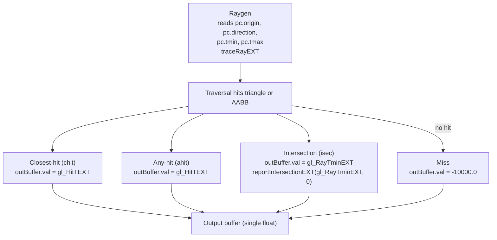

## Overview

**Core question:** When a ray tracing pipeline traces a ray whose direction vector is scaled and rotated, does the hit shader report the correct hit distance T, both for rays shot from outside geometry that cross it (`direction_length`) and for rays shot from inside an AABB (`inside_aabbs`)?

- [vktRayTracingDirectionTests.cpp](../../../modules/vulkan/ray_tracing/vktRayTracingDirectionTests.cpp) registers and implements two test families under the `ray_tracing_pipeline` test category: `direction_length` and `inside_aabbs`. Both are added by the category dispatcher in [vktRayTracingTests.cpp](../../../modules/vulkan/ray_tracing/vktRayTracingTests.cpp#L91-L92).
- `direction_length` traces rays from outside a single triangle or AABB so that the ray crosses the geometry. It varies the hit stage (closest-hit, any-hit, intersection), geometry type, direction scaling factor, and rotation angle. The host compares the reported hit T against `4.0 / directionScale` within a tolerance of `0.001`.
- `inside_aabbs` traces rays that start inside a single AABB. It varies the hit stage, ray-end type (tmax zero, inside, edge, outside), direction scaling factor, and rotation angle. The host checks that the reported hit T is exactly `0.0`.
- Both families share one raygen shader, one miss shader, and one hit/intersection shader set. The rgen shader receives the rotated origin, the scaled and rotated direction, and the tmin/tmax pair through push constants. The page explains the two-family behavioral axis, the shared shader logic, the host-side matrix and tmin/tmax derivation, and what a failure of each family points at.

## Background Knowledge

- **Non-normalized ray direction.** `traceRayEXT` accepts a direction vector that is not required to be normalized. The hit parameter T is measured in units of the direction vector's length, so the hit point is `origin + T * direction`. If the direction is scaled by factor `s`, the hit T scales by `1/s` for the same world-space geometry. This is the property `direction_length` exercises.
- **Instance transform.** The top-level acceleration structure instance carries a 3x4 transform matrix. The test applies a rotation matrix as the instance transform, and separately rotates the ray origin and direction on the host. The hit T should be invariant under rotation because the rotation is applied consistently to both the geometry and the ray.
- **Intersection shader and `gl_RayTminEXT`.** For AABB geometry, an intersection shader is invoked for candidate intersections. The test's intersection shader calls `reportIntersectionEXT(gl_RayTminEXT, 0)`, reporting the intersection at the ray's tmin value. When tmin is zero, the reported hit T should be zero.
- **`hitAttributeEXT` and `gl_HitTEXT`.** The closest-hit and any-hit shaders read the hit T through `gl_HitTEXT`. For AABB geometry, this value comes from what the intersection shader reported via `reportIntersectionEXT`. For triangle geometry, the implementation reports the hit T directly.

## Registration Hierarchy

```text
ray_tracing_pipeline
├── direction_length
└── inside_aabbs
```

Both test families are direct children of the `ray_tracing_pipeline` test category. `direction_length` is registered by [createDirectionLengthTests](../../../modules/vulkan/ray_tracing/vktRayTracingDirectionTests.cpp#L681-L773) and `inside_aabbs` is registered by [createInsideAABBsTests](../../../modules/vulkan/ray_tracing/vktRayTracingDirectionTests.cpp#L775-L859). The dispatcher adds both at [vktRayTracingTests.cpp#L91-L92](../../../modules/vulkan/ray_tracing/vktRayTracingTests.cpp#L91-L92). Both families appear in the default mustpass at [ray-tracing-pipeline.txt](../../../mustpass/main/vk-default/ray-tracing-pipeline.txt).

## Parameter Dimensions and Observed Values

| Dimension | Registered values | Meaning in this test | Evidence |
|-----------|-------------------|----------------------|----------|
| Test family | `direction_length`, `inside_aabbs` | Selects whether rays start outside geometry and cross it, or start inside an AABB. This is the primary behavioral axis. | [createDirectionLengthTests](../../../modules/vulkan/ray_tracing/vktRayTracingDirectionTests.cpp#L681-L773), [createInsideAABBsTests](../../../modules/vulkan/ray_tracing/vktRayTracingDirectionTests.cpp#L775-L859) |
| Hit stage | `chit`, `ahit`, `isec` | Selects which shader stage writes the validated output: closest-hit, any-hit, or intersection. For AABBs the intersection shader is always present; for triangles it is only present when `isec` is the test stage (which is pruned, see Case Pruning). | [stages array](../../../modules/vulkan/ray_tracing/vktRayTracingDirectionTests.cpp#L690-L694) |
| Geometry type (`direction_length` only) | `triangles`, `aabbs` | Selects BLAS geometry. Triangles report hit T directly; AABBs go through the intersection shader. `inside_aabbs` always uses AABBs. | [geometryTypes array](../../../modules/vulkan/ray_tracing/vktRayTracingDirectionTests.cpp#L700-L703) |
| Ray-end type (`inside_aabbs` only) | `ray_end_tmax_zero`, `ray_end_inside`, `ray_end_edge`, `ray_end_outside` | Selects tmax relative to the AABB boundary: zero, half the distance to edge, exactly at edge, or one unit past edge. Tests that tmax does not affect the reported hit T when the intersection is at tmin. | [rayEndCases array](../../../modules/vulkan/ray_tracing/vktRayTracingDirectionTests.cpp#L794-L799) |
| Scaling factor | `scaling_factor_0` through `scaling_factor_5` | Direction vector multiplier. Index 0 is `1.0`; indices 1 through 5 are random values in `[0.5, 10.0]`. Drives the expected hit T as `4.0 / scale`. | [generateScalingFactors](../../../modules/vulkan/ray_tracing/vktRayTracingDirectionTests.cpp#L643-L659) |
| Rotation angle | `rotation_0` through `rotation_4` | X and Y rotation angles in radians. Index 0 is `(0, 0)`; indices 1 through 4 are random in `[0, 2*pi]`. Tests rotation invariance of the hit T. | [generateRotationAngles](../../../modules/vulkan/ray_tracing/vktRayTracingDirectionTests.cpp#L662-L677) |
| Arrays of pointers (`direction_length` only) | alternating per case | `useArraysOfPointers` toggles every other case. `inside_aabbs` always sets it to false. | [caseCounter modulo](../../../modules/vulkan/ray_tracing/vktRayTracingDirectionTests.cpp#L752) |
| Matrix update after build (`direction_length` only) | every third case | `updateMatrixAfterBuild` toggles every third case, updating the TLAS instance matrix after the initial build. `inside_aabbs` always sets it to false. | [caseCounter modulo](../../../modules/vulkan/ray_tracing/vktRayTracingDirectionTests.cpp#L754) |
| SPIR-V target | `spirv1.4` | All generated shaders use `vk::SPIRV_VERSION_1_4`. | [ShaderBuildOptions](../../../modules/vulkan/ray_tracing/vktRayTracingDirectionTests.cpp#L310) |

The leaf name encodes the full parameter path. For `direction_length` the path is `direction_length.<stage>.<geometry>.scaling_factor_<i>.rotation_<j>`. For `inside_aabbs` the path is `inside_aabbs.<stage>.ray_end_<type>.scaling_factor_<i>.rotation_<j>`.

## Behavior Parameters

The primary behavioral axis is the test family. The two families share the same source file, raygen shader, and hit-shader structure, but they test different properties of the hit T reporting: `direction_length` tests that T scales correctly with a non-normalized direction vector, while `inside_aabbs` tests that T is zero when the intersection is reported at tmin zero.

### direction_length — hit T matches scaled distance for rays crossing geometry from outside

Each case traces a single ray from origin `(0, 0, 1)` toward a triangle or AABB centered at `(0, 0, 5)`. The host scales the direction vector by `directionScale` and rotates both the origin and direction by the rotation angles. The expected hit T is `getDefaultDistance() / directionScale = 4.0 / directionScale`, computed by [SpaceObjects::getDistanceToEdge](../../../modules/vulkan/ray_tracing/vktRayTracingDirectionTests.cpp#L119-L122). The host derives tmin and tmax around this expected distance with a half-tolerance margin by [calcTminTmax](../../../modules/vulkan/ray_tracing/vktRayTracingDirectionTests.cpp#L129-L163). The hit or intersection shader writes the observed hit T to a storage buffer, and the host checks `abs(bufferValue - distanceToEdge) <= 0.001`. The hit stage dimension (`chit`, `ahit`, `isec`) selects which shader writes the value, exercising the T reporting path through each stage. The geometry type dimension selects triangles (implementation-reported T) or AABBs (intersection-shader-reported T). Triangles with the `isec` stage are pruned because intersection shaders do not apply to triangle geometry.

### inside_aabbs — hit T is zero for rays starting inside AABBs

Each case traces a single ray from origin `(0, 0, 1)` inside an AABB spanning `(-0.5, -0.5, 0.0)` to `(0.5, 0.5, 5.0)`. The host sets tmin to `0.0` and tmax to a value determined by the ray-end type: zero, half the distance to edge, exactly at edge, or one unit past edge. The intersection shader calls `reportIntersectionEXT(gl_RayTminEXT, 0)`, so the reported hit T should be the tmin value, which is zero. The host checks `bufferValue == 0.0f` exactly. The ray-end type dimension tests that tmax does not affect the reported hit T when the intersection is at tmin. The hit stage dimension selects which shader writes the value: for `isec` the intersection shader writes `gl_RayTminEXT` directly; for `chit` and `ahit` the hit shader writes `gl_HitTEXT`, which inherits the T from the auxiliary intersection shader. Geometry is always AABBs because the ray starts inside the geometry, which only works with procedural AABB geometry.

## Shader Analysis

Shader code is part of the tested behavior. The shaders are generated in [initPrograms](../../../modules/vulkan/ray_tracing/vktRayTracingDirectionTests.cpp#L308-L393) from C++ string streams with `vk::SPIRV_VERSION_1_4`. All cases share the same raygen and miss shader text. The hit shader text is shared between `chit` and `ahit` and registered as the appropriate stage. The intersection shader text differs slightly: when `isec` is the test stage it includes the output buffer declaration and writes `gl_RayTminEXT`; when it is an auxiliary shader for AABBs it omits the buffer declaration and only reports the intersection. The representative walkthrough below uses the raygen shader because it is the entry point that carries the scaled and rotated direction through push constants, which is the core mechanism both families test.

### Representative Shader Walkthrough 1

#### Parameter Values Chosen

Representative path:

```text
dEQP-VK.ray_tracing_pipeline.direction_length.chit.triangles.scaling_factor_0.rotation_0
```

| Parameter choice | Meaning in this representative case |
|------------------|-------------------------------------|
| `testStage = VK_SHADER_STAGE_CLOSEST_HIT_BIT_KHR` | Closest-hit shader writes `gl_HitTEXT` to the output buffer. |
| `geometryType = VK_GEOMETRY_TYPE_TRIANGLES_KHR` | BLAS contains a single triangle at Z=5; hit T is reported by the implementation. |
| `directionScale = 1.0` | Scaling factor index 0 is the identity scale; expected hit T is `4.0 / 1.0 = 4.0`. |
| `rotationX = 0.0`, `rotationY = 0.0` | Rotation index 0 is the identity rotation; no transform applied to origin, direction, or instance. |
| `rayOriginType = OUTSIDE`, `rayEndType = CROSS` | Ray starts outside and crosses the geometry; tmin and tmax bracket the expected distance. |

This case is the simplest baseline: identity scale, identity rotation, triangle geometry, and closest-hit reporting. The same rgen shader serves every case across both families; only the push constant values and the registered hit stage change.

#### Purpose

Verify that the raygen shader correctly passes the scaled and rotated direction, origin, tmin, and tmax through push constants to `traceRayEXT`, and that the hit T reported by the closest-hit shader matches the host-computed expected distance.

#### Structural Design



#### Shader Code

##### Raygen Shader (rgen)

```glsl
#version 460 core
#extension GL_EXT_ray_tracing : require

/// Ray payload declared by the raygen shader and consumed by hit/miss shaders.
/// In this test the payload itself is unused; the validated output is written
/// directly to a storage buffer by the hit or miss shader.
layout(location=0) rayPayloadEXT vec3 hitValue;

/// Binding 0: top-level acceleration structure traversed by traceRayEXT.
/// Holds one instance of one BLAS containing either a single triangle or a
/// single AABB, depending on the test case's geometry type.
layout(set=0, binding=0) uniform accelerationStructureEXT topLevelAS;

/// Push constants carrying the rotated ray origin, the scaled+rotated ray
/// direction, and the tmin/tmax pair computed by the host from the direction
/// scaling factor and ray-end type. The host computes:
///   rotatedOrigin  = spaceObjects.origin * rotationMatrix
///   finalDirection = spaceObjects.direction * scaleMatrix * rotationMatrix
///   distanceToEdge = getDefaultDistance() / directionScale
/// and derives tmin/tmax around distanceToEdge (or around 0 for inside_aabbs).
layout(push_constant, std430) uniform PushConstants {
  vec4 origin;
  vec4 direction;
  float tmin;
  float tmax;
} pc;

void main()
{
  const uint cullMask = 0xFF;
  /// One ray per launch ID. origin.xyz and direction.xyz come from push
  /// constants, so the same shader serves every scale/rotation/stage case.
  traceRayEXT(topLevelAS, gl_RayFlagsNoneEXT, cullMask, 0, 0, 0, pc.origin.xyz, pc.tmin, pc.direction.xyz, pc.tmax, 0);
}
```

##### Closest-Hit / Any-Hit Shader (hits)

```glsl
#version 460 core
#extension GL_EXT_ray_tracing : require
layout(location=0) rayPayloadInEXT vec3 hitValue;
hitAttributeEXT vec3 attribs;
layout(set=0, binding=1, std430) buffer OutBuffer { float val; } outBuffer;

void main()
{
  outBuffer.val = gl_HitTEXT;
}
```

##### Intersection Shader (isec, test stage)

```glsl
#version 460 core
#extension GL_EXT_ray_tracing : require
hitAttributeEXT vec3 hitAttribute;
layout(set=0, binding=1, std430) buffer OutBuffer { float val; } outBuffer;

void main()
{
  hitAttribute = vec3(0.0f, 0.0f, 0.0f);
  outBuffer.val = gl_RayTminEXT;
  reportIntersectionEXT(gl_RayTminEXT, 0);
}
```

##### Miss Shader (miss)

```glsl
#version 460 core
#extension GL_EXT_ray_tracing : require
layout(location = 0) rayPayloadInEXT vec3 hitValue;
layout(set=0, binding=1, std430) buffer OutBuffer { float val; } outBuffer;

void main()
{
  outBuffer.val = -10000.0f;
}
```

#### Additional Info

- The rgen, miss, and hit shader text is identical across all cases in both families. Only the intersection shader differs: when `isec` is the test stage, it includes the output buffer write (`outBuffer.val = gl_RayTminEXT`); when it is an auxiliary shader for AABB geometry in `chit` or `ahit` cases, it omits the buffer declaration and only calls `reportIntersectionEXT(gl_RayTminEXT, 0)` ([initPrograms isecAux check](../../../modules/vulkan/ray_tracing/vktRayTracingDirectionTests.cpp#L334-L345)).
- The miss shader writes `-10000.0f`, which would fail both families' validation: `abs(-10000.0 - distanceToEdge)` far exceeds the tolerance, and `-10000.0 != 0.0`. The miss path exists as a safety net; the host computes tmin/tmax to bracket the geometry, so a miss indicates the ray did not reach the expected hit point.
- `updateRayTracingGLSL` is an identity helper ([vkRayTracingUtil.hpp#L111-L114](../../../framework/vulkan/vkRayTracingUtil.hpp#L111-L114)), so the reconstructed GLSL matches the generator output exactly.
- The C++ `PushConstants` struct names the third field `tmix` ([PushConstants](../../../modules/vulkan/ray_tracing/vktRayTracingDirectionTests.cpp#L295-L301)), but this is a naming typo in the host struct only; the GLSL and the memory layout use `tmin` at offset 32, and the field is populated with `tMinMax.first` at runtime.

#### Parameter Variation Summary

| Parameter dimension | Shader-level variation from this shader | Evidence |
|---------------------|---------------------------------------|----------|
| Direction scale | The direction vector passed to `traceRayEXT` is `spaceObjects.direction * scaleMatrix * rotationMatrix`. The shader does not normalize it, so hit T scales as `1/scale`. | [iterate push constants](../../../modules/vulkan/ray_tracing/vktRayTracingDirectionTests.cpp#L584-L593) |
| Rotation | Both origin and direction are multiplied by the rotation matrix on the host before being passed as push constants. The instance transform also uses the same rotation matrix. | [iterate push constants](../../../modules/vulkan/ray_tracing/vktRayTracingDirectionTests.cpp#L584-L585) |
| Hit stage | The rgen shader is fixed; the hit stage dimension changes which hit shader is registered and writes the output. The rgen `traceRayEXT` call is identical. | [initPrograms stage switch](../../../modules/vulkan/ray_tracing/vktRayTracingDirectionTests.cpp#L358-L375) |
| Ray-end type | The rgen shader receives tmin/tmax from push constants. For `inside_aabbs`, tmin is always 0 and tmax varies by ray-end type. | [calcTminTmax](../../../modules/vulkan/ray_tracing/vktRayTracingDirectionTests.cpp#L129-L163) |

#### SPIR-V

- Status: generated and validated
- Source: reconstructed `GLSL` from this walkthrough
- Stage: `rgen`
- Target SPIRV version: `spirv1.5`

<details>
<summary>Click to expand SPIRV asm code</summary>

```llvm
; SPIR-V
; Version: 1.5
; Generator: Khronos Glslang Reference Front End; 11
; Bound: 38
; Schema: 0
               OpCapability RayTracingKHR
               OpExtension "SPV_KHR_ray_tracing"
          %1 = OpExtInstImport "GLSL.std.450"
               OpMemoryModel Logical GLSL450
               OpEntryPoint RayGenerationKHR %main "main" %topLevelAS %pc %hitValue
               OpSource GLSL 460
               OpSourceExtension "GL_EXT_ray_tracing"
               OpName %main "main"
               OpName %topLevelAS "topLevelAS"
               OpName %PushConstants "PushConstants"
               OpMemberName %PushConstants 0 "origin"
               OpMemberName %PushConstants 1 "direction"
               OpMemberName %PushConstants 2 "tmin"
               OpMemberName %PushConstants 3 "tmax"
               OpName %pc "pc"
               OpName %hitValue "hitValue"
               OpDecorate %topLevelAS Binding 0
               OpDecorate %topLevelAS DescriptorSet 0
               OpDecorate %PushConstants Block
               OpMemberDecorate %PushConstants 0 Offset 0
               OpMemberDecorate %PushConstants 1 Offset 16
               OpMemberDecorate %PushConstants 2 Offset 32
               OpMemberDecorate %PushConstants 3 Offset 36
       %void = OpTypeVoid
          %3 = OpTypeFunction %void
          %6 = OpTypeAccelerationStructureKHR
%_ptr_UniformConstant_6 = OpTypePointer UniformConstant %6
 %topLevelAS = OpVariable %_ptr_UniformConstant_6 UniformConstant
       %uint = OpTypeInt 32 0
     %uint_0 = OpConstant %uint 0
   %uint_255 = OpConstant %uint 255
      %float = OpTypeFloat 32
    %v4float = OpTypeVector %float 4
%PushConstants = OpTypeStruct %v4float %v4float %float %float
%_ptr_PushConstant_PushConstants = OpTypePointer PushConstant %PushConstants
         %pc = OpVariable %_ptr_PushConstant_PushConstants PushConstant
        %int = OpTypeInt 32 1
      %int_0 = OpConstant %int 0
    %v3float = OpTypeVector %float 3
%_ptr_PushConstant_v4float = OpTypePointer PushConstant %v4float
      %int_2 = OpConstant %int 2
%_ptr_PushConstant_float = OpTypePointer PushConstant %float
      %int_1 = OpConstant %int 1
      %int_3 = OpConstant %int 3
%_ptr_RayPayloadKHR_v3float = OpTypePointer RayPayloadKHR %v3float
   %hitValue = OpVariable %_ptr_RayPayloadKHR_v3float RayPayloadKHR
       %main = OpFunction %void None %3
          %5 = OpLabel
          %9 = OpLoad %6 %topLevelAS
         %22 = OpAccessChain %_ptr_PushConstant_v4float %pc %int_0
         %23 = OpLoad %v4float %22
         %24 = OpVectorShuffle %v3float %23 %23 0 1 2
         %27 = OpAccessChain %_ptr_PushConstant_float %pc %int_2
         %28 = OpLoad %float %27
         %30 = OpAccessChain %_ptr_PushConstant_v4float %pc %int_1
         %31 = OpLoad %v4float %30
         %32 = OpVectorShuffle %v3float %31 %31 0 1 2
         %34 = OpAccessChain %_ptr_PushConstant_float %pc %int_3
         %35 = OpLoad %float %34
               OpTraceRayKHR %9 %uint_0 %uint_255 %uint_0 %uint_0 %uint_0 %24 %28 %32 %35 %hitValue
               OpReturn
               OpFunctionEnd
```

</details>## Runtime Execution and Result Checking

- **Geometry setup.** The host creates one BLAS with a single geometry: either a triangle with vertices at `(0, 0.5, 5)`, `(-0.5, -0.5, 5)`, `(0.5, -0.5, 5)`, or an AABB with corners `(-0.5, -0.5, z0)` and `(0.5, 0.5, 5.0)` where `z0` is `5.0` for `direction_length` and `0.0` for `inside_aabbs` ([SpaceObjects constructor](../../../modules/vulkan/ray_tracing/vktRayTracingDirectionTests.cpp#L87-L110)). Triangle geometry carries `VK_GEOMETRY_INSTANCE_TRIANGLE_FACING_CULL_DISABLE_BIT_KHR` so both faces register.
- **Instance transform.** The TLAS has one instance. The instance matrix is the rotation matrix from [getRotationMatrix](../../../modules/vulkan/ray_tracing/vktRayTracingDirectionTests.cpp#L175-L194). When `updateMatrixAfterBuild` is set, the instance is added with an identity matrix and then updated to the rotation matrix after the TLAS build via `updateInstanceMatrix` ([updateMatrixAfterBuild](../../../modules/vulkan/ray_tracing/vktRayTracingDirectionTests.cpp#L449-L454)).
- **Push constant derivation.** The host computes `rotatedOrigin = spaceObjects.origin * rotationMatrix`, `finalDirection = spaceObjects.direction * scaleMatrix * rotationMatrix`, and `distanceToEdge = 4.0 / directionScale`. The tmin/tmax pair comes from [calcTminTmax](../../../modules/vulkan/ray_tracing/vktRayTracingDirectionTests.cpp#L129-L163): for `CROSS` it brackets `distanceToEdge` with a half-tolerance margin; for `inside_aabbs` it sets tmin to 0 and tmax based on the ray-end type ([push constant setup](../../../modules/vulkan/ray_tracing/vktRayTracingDirectionTests.cpp#L584-L593)).
- **Pipeline and dispatch.** One ray tracing pipeline with raygen, miss, and hit groups. The dispatch is `1x1x1`, tracing a single ray ([cmdTraceRaysKHR](../../../modules/vulkan/ray_tracing/vktRayTracingDirectionTests.cpp#L600)).
- **Result copyback.** The output is a single `float` in a host-visible storage buffer. After the trace, a `SHADER_WRITE` to `HOST_READ` barrier makes it readable, and the host copies the value with `deMemcpy` ([buffer readback](../../../modules/vulkan/ray_tracing/vktRayTracingDirectionTests.cpp#L611-L613)).
- **Pass/fail condition.** For `direction_length` (`CROSS`), the host checks `abs(bufferValue - distanceToEdge) <= 0.001` and calls `TCU_FAIL` with both values on mismatch ([CROSS check](../../../modules/vulkan/ray_tracing/vktRayTracingDirectionTests.cpp#L615-L625)). For `inside_aabbs`, the host checks `bufferValue == 0.0f` exactly and calls `TCU_FAIL` with the nonzero value on mismatch ([inside check](../../../modules/vulkan/ray_tracing/vktRayTracingDirectionTests.cpp#L626-L635)). The test returns `pass` only if no `TCU_FAIL` is triggered.

## Failure Meaning

### Failure Cause Mapping

| If this behavior parameter value fails | Possible failure cause(s) |
|----------------------------------------|---------------------------|
| `direction_length` | Hit T reported by the hit or intersection shader does not match `4.0 / directionScale` within tolerance, pointing at direction vector scaling, T parameter semantics, or rotation transform handling. |
| `inside_aabbs` | Hit T reported by the hit or intersection shader is not zero, pointing at tmin propagation to `gl_RayTminEXT`, intersection reporting, or AABB traversal for rays starting inside. |

Both families share the raygen shader, the AS build, the pipeline, the output buffer, and the dispatch. A failure common to both families points at shared infrastructure: the push constant layout, the BLAS or TLAS build, the SBT, or the buffer readback.

### Cause Analysis

#### Scaled hit-distance reporting failure

**Possible failure symptoms:** A `direction_length` leaf fails its `TCU_FAIL` check. The reported message shows a buffer value that differs from the expected `distanceToEdge` by more than `0.001`. The failure may appear only at specific scaling factors or rotation angles, or it may appear across all scale and rotation variants for a given hit stage and geometry type.

**Possible implementation causes:** The test scales the direction vector by `directionScale` and expects the hit T to be `4.0 / directionScale`, because the Vulkan spec defines the hit point as `origin + T * direction` with T in units of the direction vector's length. If the implementation normalizes the direction internally before traversal, the reported T would be the world-space distance `4.0` instead of `4.0 / scale`, failing for any non-unit scale. If the failure appears only at nonzero rotations, the implementation may be mishandling the instance transform or the rotated origin and direction. For triangle geometry, the hit T is implementation-reported; for AABB geometry, it comes from `reportIntersectionEXT(gl_RayTminEXT, 0)` in the intersection shader. A difference between triangle and AABB results for the same scale and rotation would indicate the AABB intersection T reporting differs from the triangle intersection T reporting. Source-level investigation of the driver's T parameter computation and direction handling is needed to confirm the exact cause.

#### Zero hit-distance reporting failure

**Possible failure symptoms:** An `inside_aabbs` leaf fails because `bufferValue != 0.0f`. The reported message shows the nonzero value. The failure may appear only for specific ray-end types or hit stages, or it may appear across all ray-end types for a given stage.

**Possible implementation causes:** The test sets tmin to `0.0` and the intersection shader reports at `gl_RayTminEXT`. The Vulkan spec states that `gl_RayTminEXT` holds the tmin value passed to `traceRayEXT`. If the implementation clamps, offsets, or recomputes tmin before passing it to the intersection shader, the reported value would be nonzero. For `chit` and `ahit` stages, the hit shader writes `gl_HitTEXT`, which should inherit the T from `reportIntersectionEXT`. A nonzero value here would indicate the hit T was modified between intersection reporting and closest-hit or any-hit execution. The ray-end type variations test that tmax does not affect the reported hit T when the intersection is at tmin; a failure only at `ray_end_tmax_zero` (where tmax is also 0) could indicate the implementation rejects or mishandles rays where tmin equals tmax. Source-level investigation of tmin propagation and intersection T reporting is needed to confirm the exact cause.

## Case Pruning

### Requirement-based pruning

- All cases require `VK_KHR_acceleration_structure` and `VK_KHR_ray_tracing_pipeline` device functionality, checked in [checkSupport](../../../modules/vulkan/ray_tracing/vktRayTracingDirectionTests.cpp#L287-L291). No cases register if either extension is unsupported.
- No additional feature bits, formats, or limits are queried beyond the two KHR extensions.

### Design-based pruning

- `direction_length` skips the combination of triangle geometry with the intersection hit stage, because intersection shaders only apply to procedural (AABB) geometry ([triangles + isec skip](../../../modules/vulkan/ray_tracing/vktRayTracingDirectionTests.cpp#L722-L724)). This leaves `chit` and `ahit` for triangles, and `chit`, `ahit`, and `isec` for AABBs.
- `inside_aabbs` always uses AABB geometry. Rays starting inside geometry only work with procedural AABBs because triangle geometry does not support interior rays ([geometryType fixed](../../../modules/vulkan/ray_tracing/vktRayTracingDirectionTests.cpp#L828)).
- `inside_aabbs` always sets `useArraysOfPointers` and `updateMatrixAfterBuild` to false, keeping the focus on tmin and ray-end behavior rather than TLAS construction variants ([fixed false](../../../modules/vulkan/ray_tracing/vktRayTracingDirectionTests.cpp#L840-L841)).
- The scaling factor and rotation angle lists always include the identity value (index 0) plus random values, so the identity case serves as a baseline against which the scaled and rotated cases are compared.

## Key Takeaways

- The `direction_length` family tests that the hit T reported by the ray tracing pipeline scales correctly with a non-normalized direction vector. The expected T is `4.0 / directionScale`, confirming that the implementation treats T as a parameter of the direction vector rather than a world-space distance.
- The `inside_aabbs` family tests that the hit T is exactly zero when the intersection shader reports at `gl_RayTminEXT` with tmin set to zero. The ray-end type dimension confirms that tmax does not affect the reported T when the intersection is at tmin.
- Both families share one raygen shader that receives the rotated origin, scaled and rotated direction, and tmin/tmax through push constants. The hit stage dimension exercises the T reporting path through closest-hit, any-hit, and intersection shaders.
- Rotation is applied consistently to the ray origin, the ray direction, and the instance transform, so the hit T should be rotation-invariant. A failure that appears only at nonzero rotations points at transform handling rather than T semantics.
- A failure common to both families points at shared infrastructure; a failure isolated to one family points at that family's specific validation path. See `## Failure Meaning` for the per-cause analysis.

## Source Reference Appendix

| Entry point | Link | Why it matters |
|-------------|------|----------------|
| `SpaceObjects` | [vktRayTracingDirectionTests.cpp#L81-L123](../../../modules/vulkan/ray_tracing/vktRayTracingDirectionTests.cpp#L81-L123) | Defines ray origin, direction, and geometry placement for both families |
| `calcTminTmax` | [vktRayTracingDirectionTests.cpp#L129-L163](../../../modules/vulkan/ray_tracing/vktRayTracingDirectionTests.cpp#L129-L163) | Derives tmin/tmax from ray origin type, ray end type, and distance to edge |
| `getScaleMatrix` / `getRotationMatrix` | [vktRayTracingDirectionTests.cpp#L166-L194](../../../modules/vulkan/ray_tracing/vktRayTracingDirectionTests.cpp#L166-L194) | Builds the scale and rotation matrices applied to the direction and instance |
| `TestParams` | [vktRayTracingDirectionTests.cpp#L209-L249](../../../modules/vulkan/ray_tracing/vktRayTracingDirectionTests.cpp#L209-L249) | Per-case parameters including stage, geometry, scale, rotation, and ray end type |
| `checkSupport` | [vktRayTracingDirectionTests.cpp#L287-L291](../../../modules/vulkan/ray_tracing/vktRayTracingDirectionTests.cpp#L287-L291) | Feature gates for acceleration structure and ray tracing pipeline |
| `initPrograms` | [vktRayTracingDirectionTests.cpp#L308-L393](../../../modules/vulkan/ray_tracing/vktRayTracingDirectionTests.cpp#L308-L393) | Generates the rgen, miss, hit, and intersection shaders |
| `iterate` | [vktRayTracingDirectionTests.cpp#L406-L638](../../../modules/vulkan/ray_tracing/vktRayTracingDirectionTests.cpp#L406-L638) | AS build, push constant setup, trace dispatch, result readback, and pass/fail check |
| `generateScalingFactors` | [vktRayTracingDirectionTests.cpp#L643-L659](../../../modules/vulkan/ray_tracing/vktRayTracingDirectionTests.cpp#L643-L659) | Scaling factor list: 1.0 plus 5 random values in [0.5, 10.0] |
| `generateRotationAngles` | [vktRayTracingDirectionTests.cpp#L662-L677](../../../modules/vulkan/ray_tracing/vktRayTracingDirectionTests.cpp#L662-L677) | Rotation angle list: (0, 0) plus 4 random pairs in [0, 2*pi] |
| `createDirectionLengthTests` | [vktRayTracingDirectionTests.cpp#L681-L773](../../../modules/vulkan/ray_tracing/vktRayTracingDirectionTests.cpp#L681-L773) | Registration of the `direction_length` family tree |
| `createInsideAABBsTests` | [vktRayTracingDirectionTests.cpp#L775-L859](../../../modules/vulkan/ray_tracing/vktRayTracingDirectionTests.cpp#L775-L859) | Registration of the `inside_aabbs` family tree |
| Category dispatcher | [vktRayTracingTests.cpp#L91-L92](../../../modules/vulkan/ray_tracing/vktRayTracingTests.cpp#L91-L92) | Adds both families to the `ray_tracing_pipeline` test category |
| Mustpass evidence | [ray-tracing-pipeline.txt](../../../mustpass/main/vk-default/ray-tracing-pipeline.txt) | All `direction_length.*` and `inside_aabbs.*` leaves listed in the default ray-tracing-pipeline mustpass |
