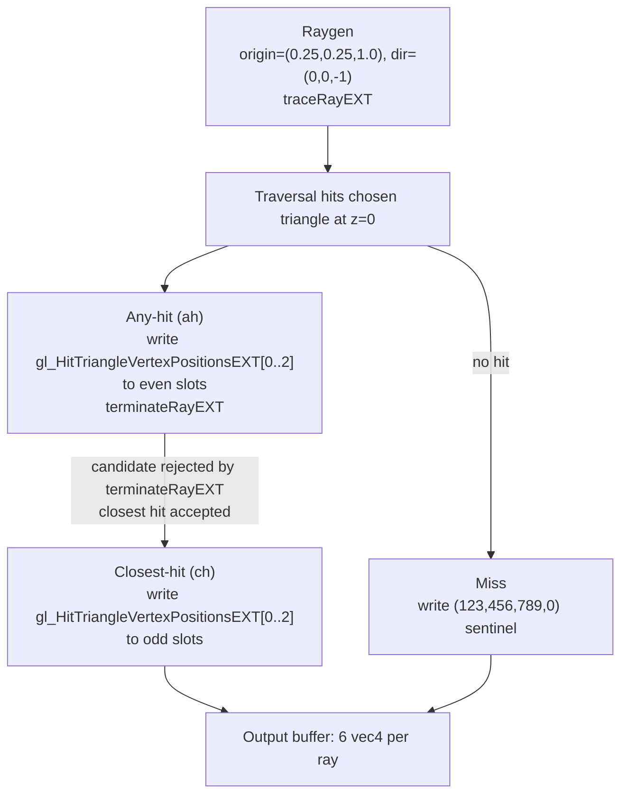

## Overview

**Core question:** Does `gl_HitTriangleVertexPositionsEXT` return the spec-required object-space vertex positions of the hit triangle in ray tracing pipeline hit shaders, across host and device acceleration structure builds, 15 vertex formats, and an optional non-identity instance transform?

- [vktRayTracingPositionFetchTests.cpp](../../../modules/vulkan/ray_tracing/vktRayTracingPositionFetchTests.cpp) registers the `position_fetch` test family under the `ray_tracing_pipeline` test category and implements it in the same file.
- The family has two direct children, `cpu_built` and `gpu_built`, that select the acceleration structure build path. Below each build type, 15 vertex format groups each contain two test case leaves (`NoFlags`, `instance_transform`), for 60 registered cases total.
- The test traces a single ray from `(0.25, 0.25, 1.0)` along `(0, 0, -1)` into a triangle at `z=0`. The any-hit shader writes the three fetched vertex positions to even-indexed output slots and calls `terminateRayEXT`. The closest-hit shader writes the same three positions to odd-indexed slots. The host compares all six outputs against the original triangle vertices using a squared-difference tolerance.
- The page explains the registration hierarchy, the build-type behavioral axis, the shader logic, the multi-geometry and instance-transform design choices, the host-side validation, and what a failure of each build type points at.

## Background Knowledge

- **`VK_KHR_ray_tracing_position_fetch`.** Adds the `HitTriangleVertexPositionsKHR` built-in (GLSL `gl_HitTriangleVertexPositionsEXT`), an array of three `vec3` values available in any-hit and closest-hit shaders. The values are the object-space vertex coordinates of the hit primitive, taken from the bottom-level acceleration structure geometry. Instance transforms applied at the top level do not affect them.
- **`VK_BUILD_ACCELERATION_STRUCTURE_ALLOW_DATA_ACCESS_KHR`.** Build flag required on the bottom-level acceleration structure so the implementation keeps enough geometry data for shader position fetch. The test sets this flag on every BLAS build.
- **`VkPhysicalDeviceRayTracingPositionFetchFeaturesKHR::rayTracingPositionFetch`.** Feature bit gated in `checkSupport`. The test throws `NotSupportedError` when the bit is false.
- **Host versus device build.** `VK_KHR_acceleration_structure` allows building on the host (`VK_ACCELERATION_STRUCTURE_BUILD_TYPE_HOST_KHR`) or on the device (`VK_ACCELERATION_STRUCTURE_BUILD_TYPE_DEVICE_KHR`). The two paths use different build entry points and may store geometry differently. Position fetch must work for both.
- **`terminateRayEXT` in any-hit.** Terminates further any-hit invocations for the current ray and rejects the current candidate. The test uses it after writing the fetched positions so the closest-hit shader still runs for the accepted hit.

## Registration Hierarchy

```text
ray_tracing_pipeline.position_fetch
├── cpu_built
└── gpu_built
```

The two direct children are registered by [createPositionFetchTests](../../../modules/vulkan/ray_tracing/vktRayTracingPositionFetchTests.cpp#L529-L609). Below each build type, the registration loop adds 15 vertex format groups, each containing two leaves (`NoFlags`, `instance_transform`). The full leaf set appears in the default mustpass at [ray-tracing-pipeline.txt](../../../mustpass/main/vk-default/ray-tracing-pipeline.txt). The category dispatcher at [vktRayTracingTests.cpp#L98](../../../modules/vulkan/ray_tracing/vktRayTracingTests.cpp#L98) adds `position_fetch` to the `ray_tracing_pipeline` test category.

## Parameter Dimensions and Observed Values

| Dimension | Registered values | Meaning in this test | Evidence |
|-----------|-------------------|----------------------|----------|
| Build type (direct child) | `cpu_built`, `gpu_built` | Selects `VK_ACCELERATION_STRUCTURE_BUILD_TYPE_HOST_KHR` or `VK_ACCELERATION_STRUCTURE_BUILD_TYPE_DEVICE_KHR`. Primary behavioral axis. | [buildTypes array](../../../modules/vulkan/ray_tracing/vktRayTracingPositionFetchTests.cpp#L534-L541) |
| Vertex format | `r16g16_sfloat`, `r16g16_snorm`, `r16g16b16_sfloat`, `r16g16b16_snorm`, `r16g16b16a16_sfloat`, `r16g16b16a16_snorm`, `r32g32_sfloat`, `r32g32b32_sfloat`, `r32g32b32a32_sfloat`, `r64g64_sfloat`, `r64g64b64_sfloat`, `r64g64b64a64_sfloat`, `r8g8_snorm`, `r8g8b8_snorm`, `r8g8b8a8_snorm` (15 total) | Decodes differently between AS build and position fetch readback. Six formats with three or more used channels and `sfloat` ordering trigger the multi-geometry path. | [vertexFormats array](../../../modules/vulkan/ray_tracing/vktRayTracingPositionFetchTests.cpp#L543-L562) |
| Flag mask (test case leaf) | `NoFlags`, `instance_transform` | `NoFlags` uses an identity instance matrix. `instance_transform` applies a non-identity matrix with diagonal `(0.98, 0.97, 0.99)` to verify that position fetch returns object-space, not world-space, positions. | [testFlagMask loop](../../../modules/vulkan/ray_tracing/vktRayTracingPositionFetchTests.cpp#L577-L603) |
| Seed | Derived from `(buildType, vertexFormat, testFlagMask)` | Drives `de::Random` to pick `chosenGeom` and `chosenTri` in the multi-geometry path. Deterministic per case. | [TestParams::getRandomSeed](../../../modules/vulkan/ray_tracing/vktRayTracingPositionFetchTests.cpp#L71-L74) |

## Behavior Parameters

The primary behavioral axis is the build type. The two direct children of `position_fetch` select different acceleration structure build paths. The vertex format and flag mask are configuration dimensions that change how geometry is stored and whether an instance transform is applied, but the property under test stays the same: position fetch returns the object-space vertex positions of the hit triangle.

### cpu_built — Host-side acceleration structure build with position fetch

The bottom-level and top-level acceleration structures are built through `VK_ACCELERATION_STRUCTURE_BUILD_TYPE_HOST_KHR`. The host builds the BLAS with one or four geometries, sets `VK_BUILD_ACCELERATION_STRUCTURE_ALLOW_DATA_ACCESS_KHR`, and applies the instance transform when the `instance_transform` flag is set. Position fetch must read back the original object-space vertices from the host-built AS. Cases in this branch require `VkPhysicalDeviceAccelerationStructureFeaturesKHR::accelerationStructureHostCommands` to be true, checked in [checkSupport](../../../modules/vulkan/ray_tracing/vktRayTracingPositionFetchTests.cpp#L125-L128).

### gpu_built — Device-side acceleration structure build with position fetch

The same BLAS and TLAS are built through `VK_ACCELERATION_STRUCTURE_BUILD_TYPE_DEVICE_KHR` using command buffer submissions. The geometry data, build flags, and instance transform are identical to the `cpu_built` branch; only the build entry point differs. Position fetch must read back the original object-space vertices from the device-built AS. No host-commands feature is required for this branch.

## Shader Analysis

Shader code is part of the tested behavior. Four shaders are generated in [initPrograms](../../../modules/vulkan/ray_tracing/vktRayTracingPositionFetchTests.cpp#L140-L223): `rgen`, `miss`, `ah`, and `ch`. The `rgen`, `ah`, and `ch` shaders use `#extension GL_EXT_ray_tracing : require` and `#extension GL_EXT_ray_tracing_position_fetch : require`. The `miss` shader uses only `GL_EXT_ray_tracing` because it writes a sentinel without fetching positions. The shaders are identical across all 60 cases; only host-side AS construction and parameter setup vary.

The representative walkthrough uses the any-hit shader from `dEQP-VK.ray_tracing_pipeline.position_fetch.gpu_built.r32g32b32_sfloat.instance_transform` because that case exercises the multi-geometry path (4 geometries, 4 triangles each), the instance-transform object-space requirement, and the any-hit position fetch plus `terminateRayEXT` in a single case. The rgen and closest-hit GLSL are shown for context. The shaders do not change across cases, so the walkthrough covers the full family.

### Representative Shader Walkthrough 1

#### Parameter Values Chosen

Representative path:

```text
dEQP-VK.ray_tracing_pipeline.position_fetch.gpu_built.r32g32b32_sfloat.instance_transform
```

| Parameter choice | Meaning in this representative case |
|------------------|-------------------------------------|
| `buildType = VK_ACCELERATION_STRUCTURE_BUILD_TYPE_DEVICE_KHR` | Device-side AS build path. |
| `vertexFormat = VK_FORMAT_R32G32B32_SFLOAT` | Three-channel float format. Triggers the multi-geometry path because it has three used channels and is `sfloat`. |
| `testFlagMask = TEST_FLAG_BIT_INSTANCE_TRANSFORM` | Applies the non-identity instance matrix with diagonal `(0.98, 0.97, 0.99)`. Expected output stays the original triangle vertices, verifying object-space return. |
| `geometryCount = 4`, `triangleCount = 4` | Four geometries, four triangles each. Only the seed-chosen triangle sits at `z=0`; the other 15 sit at `z=10+N`. |
| `numRays = 1` | One ray from `(0.25, 0.25, 1.0)` along `(0, 0, -1)`. |

#### Purpose

Verify that `gl_HitTriangleVertexPositionsEXT` returns the three object-space vertex positions of the hit triangle in an any-hit shader, that `terminateRayEXT` does not corrupt the stored values, and that the closest-hit shader sees the same positions. The instance transform must not be applied to the fetched positions.

#### Structural Design



#### Shader Code

##### Any-Hit Shader (ah)

```glsl
#version 460 core
#extension GL_EXT_ray_tracing : require
#extension GL_EXT_ray_tracing_position_fetch : require

/// Descriptor layout shared across rgen, miss, ah, ch. numRays is 1 in this test.
/// Binding 0: top-level acceleration structure (unused by ah, declared for layout consistency).
/// Binding 1: ray origins SSBO (unused by ah).
/// Binding 2: output positions SSBO; ah writes the three even-indexed slots, ch writes the odd ones.
layout(set=0, binding=0) uniform accelerationStructureEXT topLevelAS;
layout(set=0, binding=1, std430) buffer RayOrigins {
  vec4 values[1];
} origins;
layout(set=0, binding=2, std430) buffer OutputPositions {
  vec4 values[6];
} modes;

void main()
{
  /// gl_HitTriangleVertexPositionsEXT is the position-fetch built-in added by
  /// GL_EXT_ray_tracing_position_fetch. It returns the three object-space vertex
  /// positions of the hit triangle. The test writes them to even-indexed output
  /// slots so the host can compare against the original triangle vertices.
  for (int i=0; i<3; i++) {
    modes.values[6*gl_LaunchIDEXT.x+2*i] = vec4(gl_HitTriangleVertexPositionsEXT[i], 0.0);
  }
  /// terminateRayEXT stops further any-hit invocations and rejects the current
  /// candidate. Because there is only one triangle at z=0, the candidate is the
  /// accepted hit; the closest-hit shader still runs and writes the odd slots.
  terminateRayEXT;
}
```

##### Raygen Shader (rgen)

```glsl
#version 460 core
#extension GL_EXT_ray_tracing : require
#extension GL_EXT_ray_tracing_position_fetch : require

layout(location=0) rayPayloadEXT int value;

layout(set=0, binding=0) uniform accelerationStructureEXT topLevelAS;
layout(set=0, binding=1, std430) buffer RayOrigins {
  vec4 values[1];
} origins;
layout(set=0, binding=2, std430) buffer OutputPositions {
  vec4 values[6];
} modes;

void main()
{
  const uint  cullMask  = 0xFF;
  const vec3  origin    = origins.values[gl_LaunchIDEXT.x].xyz;
  const vec3  direction = vec3(0.0, 0.0, -1.0);
  const float tMin      = 0.0;
  const float tMax      = 2.0;
  value                 = 0xFFFFFFFF;
  traceRayEXT(topLevelAS, gl_RayFlagsNoneEXT, cullMask, 0, 0, 0, origin, tMin, direction, tMax, 0);
}
```

##### Closest-Hit Shader (ch)

```glsl
#version 460 core
#extension GL_EXT_ray_tracing : require
#extension GL_EXT_ray_tracing_position_fetch : require

layout(set=0, binding=0) uniform accelerationStructureEXT topLevelAS;
layout(set=0, binding=1, std430) buffer RayOrigins {
  vec4 values[1];
} origins;
layout(set=0, binding=2, std430) buffer OutputPositions {
  vec4 values[6];
} modes;
layout(location=0) rayPayloadEXT int value;

void main()
{
  for (int i=0; i<3; i++) {
    modes.values[6*gl_LaunchIDEXT.x+2*i+1] = vec4(gl_HitTriangleVertexPositionsEXT[i], 0);
  }
}
```

#### Additional Info

- The any-hit and closest-hit shaders both read `gl_HitTriangleVertexPositionsEXT[i]` for `i=0..2` and write `vec4(..., 0.0)` to the output buffer. The any-hit writes even indices (`2*i`), the closest-hit writes odd indices (`2*i+1`). The host expects all six values to match the original triangle vertices, so the two stages must agree.
- The miss shader writes the sentinel `vec4(123.0, 456.0, 789.0, 0.0)` to all six slots. If the ray misses, the sentinel fails the `1e-5` tolerance check immediately, turning a miss into a hard failure rather than a silent zero output.
- `updateRayTracingGLSL` is an identity helper, so the reconstructed GLSL matches the generator output.
- The any-hit shader declares the `topLevelAS` and `origins` descriptors for layout consistency with the other stages but does not read them. The SPIR-V reflects them as bound but unused.

#### Parameter Variation Summary

| Parameter dimension | Shader-level variation from this shader | Evidence |
|---------------------|---------------------------------------|----------|
| Build type | No shader variation. The shaders are identical for `cpu_built` and `gpu_built`. Only the host-side AS build path differs. | [initPrograms](../../../modules/vulkan/ray_tracing/vktRayTracingPositionFetchTests.cpp#L140-L223) |
| Vertex format | No shader variation. The vertex format affects only host-side geometry construction and the AS build. The shader reads `gl_HitTriangleVertexPositionsEXT` regardless of format. | [initPrograms](../../../modules/vulkan/ray_tracing/vktRayTracingPositionFetchTests.cpp#L140-L223) |
| Flag mask | No shader variation. The instance transform is applied at the TLAS level by the host. | [initPrograms](../../../modules/vulkan/ray_tracing/vktRayTracingPositionFetchTests.cpp#L140-L223) |

#### SPIR-V

- Status: generated and validated
- Source: reconstructed `GLSL` from this walkthrough
- Stage: `rahit`
- Target SPIRV version: `spirv1.4`

<details>
<summary>Click to expand SPIRV asm code</summary>

```llvm
; SPIR-V
; Version: 1.4
; Generator: Khronos Glslang Reference Front End; 11
; Bound: 68
; Schema: 0
               OpCapability RayTracingKHR
               OpCapability RayTracingPositionFetchKHR
               OpExtension "SPV_KHR_ray_tracing"
               OpExtension "SPV_KHR_ray_tracing_position_fetch"
          %1 = OpExtInstImport "GLSL.std.450"
               OpMemoryModel Logical GLSL450
               OpEntryPoint AnyHitKHR %main "main" %modes %gl_LaunchIDEXT %gl_HitTriangleVertexPositionsEXT %topLevelAS %origins
               OpSource GLSL 460
               OpSourceExtension "GL_EXT_ray_tracing"
               OpSourceExtension "GL_EXT_ray_tracing_position_fetch"
               OpName %main "main"
               OpName %i "i"
               OpName %OutputPositions "OutputPositions"
               OpMemberName %OutputPositions 0 "values"
               OpName %modes "modes"
               OpName %gl_LaunchIDEXT "gl_LaunchIDEXT"
               OpName %gl_HitTriangleVertexPositionsEXT "gl_HitTriangleVertexPositionsEXT"
               OpName %topLevelAS "topLevelAS"
               OpName %RayOrigins "RayOrigins"
               OpMemberName %RayOrigins 0 "values"
               OpName %origins "origins"
               OpDecorate %_arr_v4float_uint_6 ArrayStride 16
               OpDecorate %OutputPositions Block
               OpMemberDecorate %OutputPositions 0 Offset 0
               OpDecorate %modes Binding 2
               OpDecorate %modes DescriptorSet 0
               OpDecorate %gl_LaunchIDEXT BuiltIn LaunchIdKHR
               OpDecorate %gl_HitTriangleVertexPositionsEXT BuiltIn HitTriangleVertexPositionsKHR
               OpDecorate %topLevelAS Binding 0
               OpDecorate %topLevelAS DescriptorSet 0
               OpDecorate %_arr_v4float_uint_1 ArrayStride 16
               OpDecorate %RayOrigins Block
               OpMemberDecorate %RayOrigins 0 Offset 0
               OpDecorate %origins Binding 1
               OpDecorate %origins DescriptorSet 0
       %void = OpTypeVoid
          %3 = OpTypeFunction %void
        %int = OpTypeInt 32 1
%_ptr_Function_int = OpTypePointer Function %int
      %int_0 = OpConstant %int 0
      %int_3 = OpConstant %int 3
       %bool = OpTypeBool
      %float = OpTypeFloat 32
    %v4float = OpTypeVector %float 4
       %uint = OpTypeInt 32 0
     %uint_6 = OpConstant %uint 6
%_arr_v4float_uint_6 = OpTypeArray %v4float %uint_6
%OutputPositions = OpTypeStruct %_arr_v4float_uint_6
%_ptr_StorageBuffer_OutputPositions = OpTypePointer StorageBuffer %OutputPositions
      %modes = OpVariable %_ptr_StorageBuffer_OutputPositions StorageBuffer
     %v3uint = OpTypeVector %uint 3
%_ptr_Input_v3uint = OpTypePointer Input %v3uint
%gl_LaunchIDEXT = OpVariable %_ptr_Input_v3uint Input
     %uint_0 = OpConstant %uint 0
%_ptr_Input_uint = OpTypePointer Input %uint
      %int_2 = OpConstant %int 2
    %v3float = OpTypeVector %float 3
     %uint_3 = OpConstant %uint 3
%_arr_v3float_uint_3 = OpTypeArray %v3float %uint_3
%_ptr_Input__arr_v3float_uint_3 = OpTypePointer Input %_arr_v3float_uint_3
%gl_HitTriangleVertexPositionsEXT = OpVariable %_ptr_Input__arr_v3float_uint_3 Input
%_ptr_Input_v3float = OpTypePointer Input %v3float
    %float_0 = OpConstant %float 0
%_ptr_StorageBuffer_v4float = OpTypePointer StorageBuffer %v4float
      %int_1 = OpConstant %int 1
         %60 = OpTypeAccelerationStructureKHR
%_ptr_UniformConstant_60 = OpTypePointer UniformConstant %60
 %topLevelAS = OpVariable %_ptr_UniformConstant_60 UniformConstant
     %uint_1 = OpConstant %uint 1
%_arr_v4float_uint_1 = OpTypeArray %v4float %uint_1
 %RayOrigins = OpTypeStruct %_arr_v4float_uint_1
%_ptr_StorageBuffer_RayOrigins = OpTypePointer StorageBuffer %RayOrigins
    %origins = OpVariable %_ptr_StorageBuffer_RayOrigins StorageBuffer
       %main = OpFunction %void None %3
          %5 = OpLabel
          %i = OpVariable %_ptr_Function_int Function
               OpStore %i %int_0
               OpBranch %10
         %10 = OpLabel
               OpLoopMerge %12 %13 None
               OpBranch %14
         %14 = OpLabel
         %15 = OpLoad %int %i
         %18 = OpSLessThan %bool %15 %int_3
               OpBranchConditional %18 %11 %12
         %11 = OpLabel
         %32 = OpAccessChain %_ptr_Input_uint %gl_LaunchIDEXT %uint_0
         %33 = OpLoad %uint %32
         %34 = OpIMul %uint %uint_6 %33
         %36 = OpLoad %int %i
         %37 = OpIMul %int %int_2 %36
         %38 = OpBitcast %uint %37
         %39 = OpIAdd %uint %34 %38
         %45 = OpLoad %int %i
         %47 = OpAccessChain %_ptr_Input_v3float %gl_HitTriangleVertexPositionsEXT %45
         %48 = OpLoad %v3float %47
         %50 = OpCompositeExtract %float %48 0
         %51 = OpCompositeExtract %float %48 1
         %52 = OpCompositeExtract %float %48 2
         %53 = OpCompositeConstruct %v4float %50 %51 %52 %float_0
         %55 = OpAccessChain %_ptr_StorageBuffer_v4float %modes %int_0 %39
               OpStore %55 %53
               OpBranch %13
         %13 = OpLabel
         %56 = OpLoad %int %i
         %58 = OpIAdd %int %56 %int_1
               OpStore %i %58
               OpBranch %10
         %12 = OpLabel
               OpTerminateRayKHR
               OpFunctionEnd
```

</details>## Runtime Execution and Result Checking

- **Acceleration structure setup.** The instance builds one bottom-level AS containing one or four geometries. Each geometry contains one or four triangles. The base triangle is `(0,0,0)`, `(1,0,0)`, `(0,1,0)` placed at `z=0` for the chosen triangle, and at `z=10+N` for the others, where `N = triangleCount * geomIndex + triangleIndex`. The chosen geometry and triangle indices come from `de::Random(seed)` with `seed` derived from `(buildType, vertexFormat, testFlagMask)`. The BLAS build uses `VK_BUILD_ACCELERATION_STRUCTURE_ALLOW_DATA_ACCESS_KHR` and the build type from the case parameter ([AS build](../../../modules/vulkan/ray_tracing/vktRayTracingPositionFetchTests.cpp#L296-L316)). The top-level AS has one instance. The instance transform is the non-identity matrix with diagonal `(0.98, 0.97, 0.99)` when `TEST_FLAG_BIT_INSTANCE_TRANSFORM` is set, and identity otherwise ([TLAS setup](../../../modules/vulkan/ray_tracing/vktRayTracingPositionFetchTests.cpp#L319-L324)).
- **Multi-geometry path.** The `multipleTriangles` flag is true when the vertex format has at least three used channels and is `sfloat`. Six of the 15 formats trigger this path. When active, the test builds four geometries with four triangles each, so the ray must select the correct triangle among 16 candidates. Only the chosen triangle sits at `z=0`; the other 15 sit at `z=10+N`, outside the ray `tMax=2`.
- **Ray origins buffer.** The host allocates a host-visible SSBO with one `vec4` set to `(0.25, 0.25, 1.0, 0.0)` and flushes it before dispatch ([origins setup](../../../modules/vulkan/ray_tracing/vktRayTracingPositionFetchTests.cpp#L331-L364)).
- **Output positions buffer.** The host allocates a host-visible SSBO sized for six `vec4` values, clears it to `0xFF`, and flushes it. After dispatch, a pipeline barrier transitions `VK_ACCESS_SHADER_WRITE_BIT` to `VK_ACCESS_HOST_READ_BIT`, then the host invalidates and reads the buffer ([output buffer setup](../../../modules/vulkan/ray_tracing/vktRayTracingPositionFetchTests.cpp#L367-L375)).
- **Pipeline and shader binding table.** The raygen, miss, and hit shaders are assembled into one ray tracing pipeline. The pipeline has `geometryCount` hit groups (one or four), each containing the any-hit and closest-hit shaders. The SBT regions are sized for one raygen entry, one miss entry, and `geometryCount` hit entries ([pipeline setup](../../../modules/vulkan/ray_tracing/vktRayTracingPositionFetchTests.cpp#L443-L473)).
- **Dispatch.** The instance dispatches `vkCmdTraceRaysKHR` with `numRays=1, 1, 1` ([trace](../../../modules/vulkan/ray_tracing/vktRayTracingPositionFetchTests.cpp#L476-L480)).
- **Expected output.** The host fills `expectedOutputPositions` with the original triangle vertices `(0,0,0)`, `(1,0,0)`, `(0,1,0)`, each appearing twice: once for the any-hit slot and once for the closest-hit slot. The expected values do not change with the instance transform or the vertex format ([expected setup](../../../modules/vulkan/ray_tracing/vktRayTracingPositionFetchTests.cpp#L344-L354)).
- **Result comparison.** For each of the six output `vec4` values, the host computes `diff = expected.xyz - output.xyz` and `len = dot(diff, diff)`. The pass condition is `len < 1e-5` for all six entries. Any mismatch calls `TCU_FAIL` with the element index, expected value, and found value ([verification loop](../../../modules/vulkan/ray_tracing/vktRayTracingPositionFetchTests.cpp#L498-L522)).

## Failure Meaning

### Failure Cause Mapping

| If this behavior parameter value fails | Possible failure cause(s) |
|----------------------------------------|---------------------------|
| `cpu_built` | The host-build acceleration structure path stored geometry in a form that position fetch cannot read back, the host build did not honor `ALLOW_DATA_ACCESS_KHR`, or position fetch returned wrong object-space vertices for host-built AS. Format-specific decoding failures also surface here. |
| `gpu_built` | The device-build acceleration structure path stored geometry in a form that position fetch cannot read back, the device build did not honor `ALLOW_DATA_ACCESS_KHR`, or position fetch returned wrong object-space vertices for device-built AS. |

Both build types share the shader code, descriptor setup, ray origin, expected-value computation, and host comparison loop. A failure common to both build types points at shared infrastructure: the position fetch built-in implementation, vertex format decoding, instance-transform object-space handling, or the host validation logic.

### Cause Analysis

#### Host-build acceleration structure position fetch failure

**Possible failure symptoms:** One or more `cpu_built` cases fail the `len < 1e-5` check. The failure message names the element index, the expected triangle vertex, and the found value. If the failure appears only in `cpu_built` and not in `gpu_built` for the same format and flag mask, the host-build path is implicated. If the failure appears in both build types, see the shared-infrastructure cause below.

**Possible implementation causes:** The host-build acceleration structure code path stored the geometry data in a form that the position fetch readback cannot interpret, or it stripped the geometry data when `ALLOW_DATA_ACCESS_KHR` was set. The host build may have honored the build flag but stored positions in a different precision or order than the device build. For 64-bit float formats, the host build may have truncated or converted the vertices in a way that loses precision beyond the `1e-5` tolerance. Source-level investigation of the driver host-build path and its interaction with `ALLOW_DATA_ACCESS_KHR` would be needed to confirm the exact cause.

#### Device-build acceleration structure position fetch failure

**Possible failure symptoms:** One or more `gpu_built` cases fail the `len < 1e-5` check. The failure message names the element index, the expected triangle vertex, and the found value. If the failure appears only in `gpu_built` and not in `cpu_built` for the same format and flag mask, the device-build path is implicated. If the failure appears in both build types, see the shared-infrastructure cause below.

**Possible implementation causes:** The device-build acceleration structure code path stored the geometry data in a form that the position fetch readback cannot interpret, or it did not keep the data accessible after the build completed. The device build may have honored `ALLOW_DATA_ACCESS_KHR` but stored positions at a different offset or stride than the host build. For formats that trigger the multi-geometry path, the device build may have reordered geometries or triangles, causing position fetch to return a neighbor triangle's vertices. Source-level investigation of the driver device-build path and its interaction with `ALLOW_DATA_ACCESS_KHR` would be needed to confirm the exact cause.

#### Shared position fetch or object-space handling failure

**Possible failure symptoms:** The same case fails in both `cpu_built` and `gpu_built`. The found values may be zero (position fetch returned nothing), garbage (position fetch read wrong memory), the world-space transformed vertices (instance transform was incorrectly applied), or a neighbor triangle's vertices (multi-geometry selection picked the wrong primitive). The `instance_transform` cases failing while `NoFlags` cases pass indicates the implementation applied the instance transform to the fetched positions, which violates the spec requirement that `gl_HitTriangleVertexPositionsEXT` returns object-space coordinates.

**Possible implementation causes:** The spec requires `gl_HitTriangleVertexPositionsEXT` to return the object-space vertex positions of the hit primitive, taken from the bottom-level acceleration structure geometry. If the implementation applied the instance transform, it returned world-space coordinates instead. If the values are zero or garbage, the position fetch built-in did not read the geometry data that `ALLOW_DATA_ACCESS_KHR` was supposed to keep accessible. If the values match a neighbor triangle in the multi-geometry path, the implementation reported the wrong primitive id or read from the wrong geometry offset. For `snorm` formats, the implementation may have decoded the normalized values with the wrong scale or sign, producing positions outside the `1e-5` tolerance. Grounded investigation should check the `HitTriangleVertexPositionsKHR` SPIR-V built-in lowering and the driver position fetch readback against the `VK_KHR_ray_tracing_position_fetch` specification.

## Case Pruning

### Requirement-based pruning

- All cases require `VK_KHR_acceleration_structure`, `VK_KHR_ray_tracing_pipeline`, and `VK_KHR_ray_tracing_position_fetch` device functionality, checked in [checkSupport](../../../modules/vulkan/ray_tracing/vktRayTracingPositionFetchTests.cpp#L113-L117).
- The `rayTracingPositionFetch` feature bit must be true, otherwise the case throws `NotSupportedError` ([feature check](../../../modules/vulkan/ray_tracing/vktRayTracingPositionFetchTests.cpp#L130-L133)).
- The `accelerationStructure` feature bit must be true, otherwise the case throws `TestError` ([feature check](../../../modules/vulkan/ray_tracing/vktRayTracingPositionFetchTests.cpp#L119-L123)).
- `cpu_built` cases require `accelerationStructureHostCommands` to be true, otherwise the case throws `NotSupportedError` ([host-commands check](../../../modules/vulkan/ray_tracing/vktRayTracingPositionFetchTests.cpp#L125-L128)).
- Each vertex format is checked against `checkAccelerationStructureVertexBufferFormat` before the case runs. Formats not supported by the device for acceleration structure vertex buffers are pruned ([format check](../../../modules/vulkan/ray_tracing/vktRayTracingPositionFetchTests.cpp#L135-L137)).

### Design-based pruning

- The test fixes the triangle at `(0,0,0)`, `(1,0,0)`, `(0,1,0)` and the ray at origin `(0.25, 0.25, 1.0)` along `(0, 0, -1)` with `tMax=2`. Only one ray is traced per case. The design intentionally keeps the geometry small and deterministic to isolate the position fetch property from traversal precision.
- The multi-geometry path is enabled only for the six `sfloat` formats with three or more used channels. The other nine formats use a single geometry with a single triangle, because they cannot store the `z` component needed to place extra triangles at different depths.
- The flag mask loop iterates `testFlagMask` from 0 to `TEST_FLAG_BIT_LAST` (exclusive), which is 0 and 1. Only the `INSTANCE_TRANSFORM` bit is defined, so the flag mask dimension has exactly two values: `NoFlags` and `instance_transform`.
- The `r64g64*sfloat` formats are included as additional formats beyond the mandatory set. They are not required by the spec for acceleration structure vertex buffers, but the test registers them to exercise 64-bit float position fetch where supported.

## Key Takeaways

- The `position_fetch` test family verifies that `gl_HitTriangleVertexPositionsEXT` returns the object-space vertex positions of the hit triangle in ray tracing pipeline any-hit and closest-hit shaders.
- The primary behavioral axis is the build type (`cpu_built` versus `gpu_built`). The two branches exercise the host-build and device-build acceleration structure paths. The shaders are identical across all 60 cases; only host-side AS construction and parameter setup vary.
- The `instance_transform` flag mask applies a non-identity instance matrix and checks that the fetched positions remain the original object-space vertices. This isolates the object-space return requirement from the baseline identity-transform case.
- The multi-geometry path, enabled for six `sfloat` formats with three or more used channels, builds 16 triangles and places only one at the ray's hit depth. This catches position fetch returning a neighbor triangle's vertices.
- Validation compares six fetched positions against the original triangle vertices using a squared-difference tolerance of `1e-5`. A miss triggers the sentinel `(123, 456, 789, 0)` and fails the same check. See `## Failure Meaning` for the per-cause analysis distinguishing host-build, device-build, and shared position fetch failures.

## Source Reference Appendix

| Entry point | Link | Why it matters |
|-------------|------|----------------|
| `TestParams` and `TestFlagBits` | [vktRayTracingPositionFetchTests.cpp#L55-L75](../../../modules/vulkan/ray_tracing/vktRayTracingPositionFetchTests.cpp#L55-L75) | Defines the per-case parameter struct, flag bits, and the seed derivation. |
| `checkSupport` | [vktRayTracingPositionFetchTests.cpp#L113-L138](../../../modules/vulkan/ray_tracing/vktRayTracingPositionFetchTests.cpp#L113-L138) | Gates on the three KHR extensions, the position-fetch feature bit, host-commands for CPU build, and vertex format support. |
| `initPrograms` | [vktRayTracingPositionFetchTests.cpp#L140-L223](../../../modules/vulkan/ray_tracing/vktRayTracingPositionFetchTests.cpp#L140-L223) | Generates the rgen, miss, ah, and ch shader strings. Identical for all 60 cases. |
| `iterate` AS build | [vktRayTracingPositionFetchTests.cpp#L236-L324](../../../modules/vulkan/ray_tracing/vktRayTracingPositionFetchTests.cpp#L236-L324) | Builds BLAS with 1 or 4 geometries, sets `ALLOW_DATA_ACCESS_KHR`, applies instance transform, builds TLAS. |
| `iterate` pipeline and trace | [vktRayTracingPositionFetchTests.cpp#L416-L480](../../../modules/vulkan/ray_tracing/vktRayTracingPositionFetchTests.cpp#L416-L480) | Builds pipeline with `geometryCount` hit groups, dispatches `vkCmdTraceRaysKHR` with `numRays=1`. |
| `iterate` verification | [vktRayTracingPositionFetchTests.cpp#L490-L522](../../../modules/vulkan/ray_tracing/vktRayTracingPositionFetchTests.cpp#L490-L522) | Reads back 6 vec4, compares with `dot(diff,diff) < 1e-5` tolerance. |
| `createPositionFetchTests` registration | [vktRayTracingPositionFetchTests.cpp#L529-L609](../../../modules/vulkan/ray_tracing/vktRayTracingPositionFetchTests.cpp#L529-L609) | Registers `cpu_built`/`gpu_built`, 15 vertex formats, and `NoFlags`/`instance_transform` leaves. |
| Category dispatcher | [vktRayTracingTests.cpp#L98](../../../modules/vulkan/ray_tracing/vktRayTracingTests.cpp#L98) | Adds `position_fetch` to the `ray_tracing_pipeline` test category. |
| Mustpass evidence | [ray-tracing-pipeline.txt](../../../mustpass/main/vk-default/ray-tracing-pipeline.txt) | All 60 leaves listed in the default ray-tracing-pipeline mustpass. |
