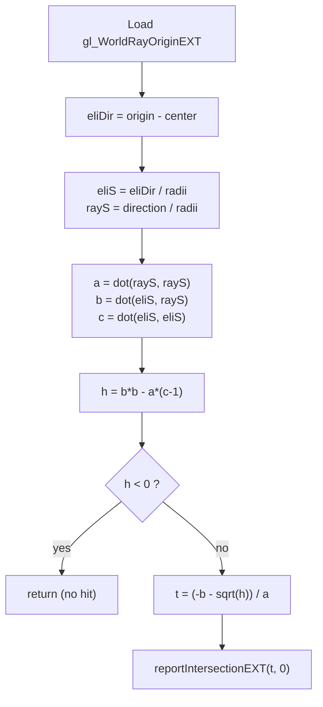

## Overview

**Core question:** Does a custom intersection shader that generates procedural geometry behind a wall of AABB bounding boxes (and, in the second case, between AABB boxes and a triangle) produce the same per-pixel result as a single large AABB that encloses the whole procedural object?

- [vktRayTracingProceduralGeometryTests.cpp](../../../modules/vulkan/ray_tracing/vktRayTracingProceduralGeometryTests.cpp) implements the single test family `procedural_geometry` under the `ray_tracing_pipeline` test category.
- Both test case leaves trace a grid of downward rays into a top-level acceleration structure (TLAS) that references bottom-level acceleration structures (BLAS) built from AABB geometry. An intersection shader computes a ray-ellipsoid intersection in world space and reports it via `reportIntersectionEXT`.
- The core idea is an equivalence check: a *reference* TLAS uses one large AABB that bounds the entire procedural ellipsoid, while a *result* TLAS uses a wall of small AABBs whose extents do not themselves contain the ellipsoid. Because the intersection shader generates the actual hit, both arrangements must produce the identical shaded image.
- The page explains the two AABB arrangements, the intersection-shader mechanism, the result-buffer comparison, and what a failure of each leaf points to.

## Background Knowledge

- **Procedural geometry and AABBs.** In `VK_KHR_ray_tracing_pipeline`, a BLAS geometry of type `VK_GEOMETRY_TYPE_AABBS_KHR` holds axis-aligned bounding boxes. The implementation traverses the AABBs, and when a ray intersects one, an intersection shader runs. The shader is responsible for computing and reporting the actual hit; the AABB is only a traversal cull.
- **Intersection shader and `reportIntersectionEXT`.** An intersection shader (`VK_SHADER_STAGE_INTERSECTION_BIT_KHR`) runs for each candidate AABB a ray crosses. It calls `reportIntersectionEXT(t, hitKind)` to report a candidate hit at ray parameter `t`; the reported hit then competes in the normal closest-hit selection. If the shader does not report, no hit is produced for that AABB.
- **Reference versus result comparison.** The test traces the same rays against two TLASes (reference and result) into two separate result buffers, then compares the buffers pixel-by-pixel. Equivalence of the two images is the pass condition.

## Registration Hierarchy

```text
ray_tracing_pipeline.procedural_geometry
├── object_behind_bounding_boxes
└── triangle_in_between
```

The two direct children are registered by [createProceduralGeometryTests](../../../modules/vulkan/ray_tracing/vktRayTracingProceduralGeometryTests.cpp#L611-L622). Each child maps to a `TestType` value and selects a different AABB arrangement and, for `triangle_in_between`, an additional triangle instance and a second closest-hit shader.

## Parameter Dimensions and Observed Values

| Dimension | Registered values | Meaning in this test | Evidence |
|-----------|-------------------|----------------------|----------|
| Test case leaf | `object_behind_bounding_boxes`, `triangle_in_between` | Selects the AABB arrangement and whether a triangle geometry interleaves with the procedural object. This is the primary behavioral axis. | [createProceduralGeometryTests](../../../modules/vulkan/ray_tracing/vktRayTracingProceduralGeometryTests.cpp#L614-L619) |
| Image size | `64` | Both the launch grid and the result buffer are 64x64. Fixed for all cases. | [iterate](../../../modules/vulkan/ray_tracing/vktRayTracingProceduralGeometryTests.cpp#L112) |
| SPIR-V target | `spirv1.4` | All generated shaders use `vk::SPIRV_VERSION_1_4`. | [ShaderBuildOptions](../../../modules/vulkan/ray_tracing/vktRayTracingProceduralGeometryTests.cpp#L487) |

## Behavior Parameters

The primary behavioral axis is the test case leaf. Each leaf selects a different AABB arrangement for the *result* TLAS and a different reference/result pairing. The shaders (rgen, isec, chit, miss) are shared; only `triangle_in_between` adds an extra `chit_triangle` closest-hit shader bound to the triangle hit group.

### object_behind_bounding_boxes - procedural object entirely behind a wall of AABBs

The reference TLAS contains a single large AABB spanning `(0,0,-64)` to `(64,64,-16)`, which encloses the whole procedural ellipsoid. The result TLAS contains a wall of four thin AABBs at z `[0,1]` arranged in a 2x2 grid covering the 64x64 xy area. The procedural ellipsoid (centered at z `-30`) lies behind this 1-unit-thick wall, so the AABB extents themselves do not contain the ellipsoid. The intersection shader must generate the ellipsoid hit through the wall. If traversal correctly invokes the intersection shader for the wall AABBs and the shader reports the correct `t`, the result image matches the reference. This is the [ObjectBehindBoundingBoxInstance acceleration structure setup](../../../modules/vulkan/ray_tracing/vktRayTracingProceduralGeometryTests.cpp#L303-L347).

### triangle_in_between - procedural intersections generated behind an opaque triangle

The reference TLAS contains the same single large AABB plus one opaque triangle geometry. The result TLAS contains a wall of three thin AABBs (z `[0,1]`) plus the same opaque triangle. The triangle sits at z `-8`, in front of the procedural ellipsoid (centered at z `-30`). The intersection shader reports ellipsoid hits that are *behind* the triangle, so the triangle should win as the closest hit where the ray crosses both. This adds a second closest-hit shader (`chit_triangle`, writing a fixed payload of `250`) bound to the triangle hit group, and the raygen uses `gl_RayFlagsCullBackFacingTrianglesEXT`. This is the [TriangleInBeteenInstance acceleration structure setup](../../../modules/vulkan/ray_tracing/vktRayTracingProceduralGeometryTests.cpp#L392-L447).

## Shader Analysis

Shader code is part of the tested behavior. The intersection shader (`isec`) generates the procedural ellipsoid intersection, and the equivalence comparison checks whether it reports the correct hit parameter through a wall of AABBs. The rgen, chit, and miss shaders set up the probe and shade the reported hit, and `chit_triangle` distinguishes the triangle-in-between path. One representative walkthrough covers the intersection shader for the `object_behind_bounding_boxes` case, because that shader is shared verbatim across both leaves and is the core procedural-geometry mechanism.

### Representative Shader Walkthrough 1

#### Parameter Values Chosen

Representative path:

```text
dEQP-VK.ray_tracing_pipeline.procedural_geometry.object_behind_bounding_boxes
```

| Parameter choice | Meaning in this representative case |
|------------------|-------------------------------------|
| Test case leaf `object_behind_bounding_boxes` | The simplest arrangement: a wall of AABBs in front of a procedural ellipsoid, with no interleaving triangle. Isolates the intersection-shader hit reporting. |
| Intersection shader (`isec`) | The stage that computes the ray-ellipsoid hit and calls `reportIntersectionEXT`. This is the procedural-geometry mechanism under test. |
| Result BLAS = four AABBs at z `[0,1]` | The AABB extents do not contain the ellipsoid; the hit is generated entirely by the shader. |

#### Purpose

Verify that an intersection shader running over a set of small AABBs reports the correct procedural-geometry hit parameter, so that tracing through a wall of AABBs produces the same shaded result as tracing through one large AABB that encloses the procedural object.

#### Structural Design

The intersection shader reduces the ray-ellipsoid test to a normalized ray-sphere test by dividing both the ray-to-center vector and the ray direction by the per-axis radii, then solves the quadratic and reports the near root.



#### Shader Code

```glsl
#version 460 core
#extension GL_EXT_ray_tracing : require

void main()
{
  // note: same elipsoid center and radii are also defined in chit shader
  /// ellipsoid parameters duplicated verbatim in the closest-hit shader so
  /// the reported hit and the shading normal use the same implicit surface
  vec3 center = vec3(32.0, 32.0, -30.0);
  vec3 radii  = vec3(30.0, 15.0, 5.0);

  // simplify to ray sphere intersection
  /// normalize the ray and the center offset by the per-axis radii so the
  /// ellipsoid becomes the unit sphere in scaled space
  vec3  eliDir = gl_WorldRayOriginEXT - center;
  vec3  eliS   = eliDir / radii;
  vec3  rayS   = gl_WorldRayDirectionEXT / radii;

  /// quadratic coefficients of the scaled ray-unit-sphere intersection
  float a = dot(rayS, rayS);
  float b = dot(eliS, rayS);
  float c = dot(eliS, eliS);
  float h = b * b - a * (c - 1.0);
  if (h < 0.0)
    return;
  /// report the near root as the candidate hit; hit kind 0
  reportIntersectionEXT((-b - sqrt(h)) / a, 0);
}
```

#### Additional Info

- The closest-hit shader (`chit`) uses the same `center` and `radii` literals to compute the ellipsoid surface normal `normalize((hitPos - center) / radii)` and writes a Lambertian-shaded payload `50 + int(200.0 * clamp(dot(hitNormal, lightDir), 0.0, 1.0))`. It stays fixed across both leaves; the `chit_triangle` shader (payload `250`) is added only for `triangle_in_between`. [initPrograms](../../../modules/vulkan/ray_tracing/vktRayTracingProceduralGeometryTests.cpp#L538-L567).
- The rgen shader traces one ray per launch ID straight down -z (`direction = vec3(0,0,-1)`) from `origin.z = 2.0` with `tmax = 50.0`, so rays start in front of the AABB wall (z `[0,1]`) and reach the ellipsoid at z `-30`. The payload is stored as `payload + 0xFF000000` so the int result buffer reinterprets as `R8G8B8A8_UNORM` during verification. [rgen source](../../../modules/vulkan/ray_tracing/vktRayTracingProceduralGeometryTests.cpp#L489-L511).
- The miss shader writes a fixed payload of `30`, used where no AABB is crossed.

#### Parameter Variation Summary

| Parameter dimension | Shader-level variation from this shader | Evidence |
|---------------------|---------------------------------------|----------|
| Test case leaf | The intersection, closest-hit (ellipsoid), and miss shaders are identical across both leaves. `triangle_in_between` adds a `chit_triangle` closest-hit shader (payload `250`) bound to a second hit group for the triangle instance; the raygen and isec shaders are unchanged. | [initPrograms](../../../modules/vulkan/ray_tracing/vktRayTracingProceduralGeometryTests.cpp#L555-L567) |

#### SPIR-V

- Status: generated and validated
- Source: reconstructed `GLSL` from this walkthrough
- Stage: `rint`
- Target SPIRV version: `spirv1.4`

<details>
<summary>Click to expand SPIRV asm code</summary>

```llvm
; SPIR-V
; Version: 1.4
; Generator: Khronos Glslang Reference Front End; 11
; Bound: 73
; Schema: 0
               OpCapability RayTracingKHR
               OpExtension "SPV_KHR_ray_tracing"
          %1 = OpExtInstImport "GLSL.std.450"
               OpMemoryModel Logical GLSL450
               OpEntryPoint IntersectionKHR %main "main" %gl_WorldRayOriginEXT %gl_WorldRayDirectionEXT
               OpSource GLSL 460
               OpSourceExtension "GL_EXT_ray_tracing"
               OpName %main "main"
               OpName %center "center"
               OpName %radii "radii"
               OpName %eliDir "eliDir"
               OpName %gl_WorldRayOriginEXT "gl_WorldRayOriginEXT"
               OpName %eliS "eliS"
               OpName %rayS "rayS"
               OpName %gl_WorldRayDirectionEXT "gl_WorldRayDirectionEXT"
               OpName %a "a"
               OpName %b "b"
               OpName %c "c"
               OpName %h "h"
               OpDecorate %gl_WorldRayOriginEXT BuiltIn WorldRayOriginKHR
               OpDecorate %gl_WorldRayDirectionEXT BuiltIn WorldRayDirectionKHR
       %void = OpTypeVoid
          %3 = OpTypeFunction %void
      %float = OpTypeFloat 32
    %v3float = OpTypeVector %float 3
%_ptr_Function_v3float = OpTypePointer Function %v3float
   %float_32 = OpConstant %float 32
  %float_n30 = OpConstant %float -30
         %12 = OpConstantComposite %v3float %float_32 %float_32 %float_n30
   %float_30 = OpConstant %float 30
   %float_15 = OpConstant %float 15
    %float_5 = OpConstant %float 5
         %17 = OpConstantComposite %v3float %float_30 %float_15 %float_5
%_ptr_Input_v3float = OpTypePointer Input %v3float
%gl_WorldRayOriginEXT = OpVariable %_ptr_Input_v3float Input
%gl_WorldRayDirectionEXT = OpVariable %_ptr_Input_v3float Input
%_ptr_Function_float = OpTypePointer Function %float
    %float_1 = OpConstant %float 1
    %float_0 = OpConstant %float 0
       %bool = OpTypeBool
       %uint = OpTypeInt 32 0
     %uint_0 = OpConstant %uint 0
       %main = OpFunction %void None %3
          %5 = OpLabel
     %center = OpVariable %_ptr_Function_v3float Function
      %radii = OpVariable %_ptr_Function_v3float Function
     %eliDir = OpVariable %_ptr_Function_v3float Function
       %eliS = OpVariable %_ptr_Function_v3float Function
       %rayS = OpVariable %_ptr_Function_v3float Function
          %a = OpVariable %_ptr_Function_float Function
          %b = OpVariable %_ptr_Function_float Function
          %c = OpVariable %_ptr_Function_float Function
          %h = OpVariable %_ptr_Function_float Function
               OpStore %center %12
               OpStore %radii %17
         %21 = OpLoad %v3float %gl_WorldRayOriginEXT
         %22 = OpLoad %v3float %center
         %23 = OpFSub %v3float %21 %22
               OpStore %eliDir %23
         %25 = OpLoad %v3float %eliDir
         %26 = OpLoad %v3float %radii
         %27 = OpFDiv %v3float %25 %26
               OpStore %eliS %27
         %30 = OpLoad %v3float %gl_WorldRayDirectionEXT
         %31 = OpLoad %v3float %radii
         %32 = OpFDiv %v3float %30 %31
               OpStore %rayS %32
         %35 = OpLoad %v3float %rayS
         %36 = OpLoad %v3float %rayS
         %37 = OpDot %float %35 %36
               OpStore %a %37
         %39 = OpLoad %v3float %eliS
         %40 = OpLoad %v3float %rayS
         %41 = OpDot %float %39 %40
               OpStore %b %41
         %43 = OpLoad %v3float %eliS
         %44 = OpLoad %v3float %eliS
         %45 = OpDot %float %43 %44
               OpStore %c %45
         %47 = OpLoad %float %b
         %48 = OpLoad %float %b
         %49 = OpFMul %float %47 %48
         %50 = OpLoad %float %a
         %51 = OpLoad %float %c
         %53 = OpFSub %float %51 %float_1
         %54 = OpFMul %float %50 %53
         %55 = OpFSub %float %49 %54
               OpStore %h %55
         %56 = OpLoad %float %h
         %59 = OpFOrdLessThan %bool %56 %float_0
               OpSelectionMerge %61 None
               OpBranchConditional %59 %60 %61
         %60 = OpLabel
               OpReturn
         %61 = OpLabel
         %63 = OpLoad %float %b
         %64 = OpFNegate %float %63
         %65 = OpLoad %float %h
         %66 = OpExtInst %float %1 Sqrt %65
         %67 = OpFSub %float %64 %66
         %68 = OpLoad %float %a
         %69 = OpFDiv %float %67 %68
         %72 = OpReportIntersectionKHR %bool %69 %uint_0
               OpReturn
               OpFunctionEnd
```

</details>## Runtime Execution and Result Checking

- **Resource and descriptor setup.** Two descriptor sets (reference and result) each bind one acceleration structure (binding 0) and one storage buffer (binding 1). Both bindings use `ALL_RAY_TRACING_STAGES` so every stage can read the TLAS and write the result. The result and reference buffers are each `64 * 64 * sizeof(int)` bytes and host-visible [descriptor and buffer setup](../../../modules/vulkan/ray_tracing/vktRayTracingProceduralGeometryTests.cpp#L114-L138).
- **Buffer clearing.** Both buffers are cleared to `0x01` bytes on the host before the trace, so a missed pixel is distinguishable from a never-written pixel [clearBuffer](../../../modules/vulkan/ray_tracing/vktRayTracingProceduralGeometryTests.cpp#L250-L259).
- **Pipeline and SBT.** `ObjectBehindBoundingBoxInstance` builds one raygen group, one hit group (intersection + closest-hit), and one miss group. `TriangleInBeteenInstance` adds a second closest-hit shader (`chit_triangle`) as a second hit group for the triangle, and the chit SBT region covers two entries [pipeline setup](../../../modules/vulkan/ray_tracing/vktRayTracingProceduralGeometryTests.cpp#L275-L301).
- **Acceleration structure build.** Within the command buffer, `setupAccelerationStructures` builds the reference BLAS/TLAS and the result BLAS/TLAS. Both use `ResourceResidency::TRADITIONAL`. The AABB data is set via `setGeometryData` with `triangles = false` (procedural) for the AABB geometries and `triangles = true` for the triangle [reference BLAS build](../../../modules/vulkan/ray_tracing/vktRayTracingProceduralGeometryTests.cpp#L303-L347).
- **Synchronization.** Two pipeline barriers guard the trace: a `TRANSFER_WRITE -> SHADER_READ` barrier for the buffer upload, and an `ACCELERATION_STRUCTURE_WRITE -> ACCELERATION_STRUCTURE_READ` barrier for the AS build [barriers](../../../modules/vulkan/ray_tracing/vktRayTracingProceduralGeometryTests.cpp#L188-L197).
- **Trace.** The reference trace binds the reference descriptor set and launches `64x64x1` rays; the result trace binds the result descriptor set and launches the same [trace dispatch](../../../modules/vulkan/ray_tracing/vktRayTracingProceduralGeometryTests.cpp#L201-L209). A `SHADER_WRITE -> TRANSFER_READ` barrier follows the trace.
- **Result comparison.** Both buffers are invalidated and reinterpreted as `R8G8B8A8_UNORM` pixel access. The host compares them with `tcu::intThresholdCompare` using a zero threshold (`tcu::UVec4(0)`), so any differing pixel fails the case [result comparison](../../../modules/vulkan/ray_tracing/vktRayTracingProceduralGeometryTests.cpp#L220-L237). Pass requires an exact pixel-for-pixel match between reference and result.

## Failure Meaning

### Failure Cause Mapping

| If this behavior parameter value fails | Possible failure cause(s) |
|----------------------------------------|---------------------------|
| `object_behind_bounding_boxes` | Intersection-shader hit reporting through a wall of AABBs produced a different image than a single enclosing AABB; or AABB traversal did not invoke the intersection shader for the wall boxes; or the reported hit parameter was wrong. |
| `triangle_in_between` | Closest-hit selection between a shader-reported procedural hit behind the triangle and the opaque triangle hit did not match the reference; or the second hit group (`chit_triangle`) was bound incorrectly; or the triangle was culled when it should have been hit. |

Both leaves share the rgen, isec, chit, and miss shaders, the reference/result buffer comparison, and the trace pipeline, so a failure common to both leaves points at shared infrastructure (the intersection shader math, the ellipsoid constants, the result-buffer comparison, the descriptor setup) rather than a leaf-specific arrangement.

### Cause Analysis

#### Procedural intersection hit reporting through AABBs

**Possible failure symptoms:** The `object_behind_bounding_boxes` result image differs from its reference image. Pixels that should show a shaded ellipsoid hit instead show the miss value `30`, the clear value, or an incorrectly shaded value. The failure is isolated to the result (wall-of-AABBs) trace while the reference (single-large-AABB) trace is correct.

**Possible implementation causes:** The result path relies on the implementation invoking the intersection shader when a ray crosses each wall AABB, and on the shader calling `reportIntersectionEXT` with the correct `t`. The ellipsoid lies behind the wall AABBs, so the reported `t` is larger than the AABB entry `t`; the implementation must still accept the reported hit and run the closest-hit shader. A grounded investigation should check whether the intersection shader was invoked for the wall AABBs, whether the reported `t` fell within the ray `[tmin, tmax]` range (`tmin = 0`, `tmax = 50`), and whether the quadratic solver used the near root. The Vulkan spec requires that a candidate hit reported by `reportIntersectionEXT` participates in closest-hit selection; if the implementation discards a reported hit whose `t` exceeds the AABB's own bounds, that is a traversal bug. If both the reference and result traces fail identically, the cause is shared shader math or constants, not traversal.

#### Closest-hit competition between procedural and triangle geometry

**Possible failure symptoms:** The `triangle_in_between` result image differs from its reference image. Pixels where the ray crosses both the triangle and the procedural ellipsoid show the wrong winner: the procedural shading appears where the triangle should have won, or the triangle shading appears where the procedural hit should have won.

**Possible implementation causes:** The triangle sits at z `-8` in front of the ellipsoid at z `-30`, so for rays crossing both, the triangle hit (smaller `t`) must win as the closest hit. The `chit_triangle` shader writes a fixed payload `250`, distinct from the ellipsoid shading range `50-250`. A grounded investigation should check whether the SBT bound the triangle hit group to the second record and the ellipsoid hit group to the first, whether the instance SBT offsets routed triangle hits to `chit_triangle`, and whether `gl_RayFlagsCullBackFacingTrianglesEXT` in the rgen incorrectly culled the triangle. The Vulkan spec defines that the candidate hit with the smallest `t` wins; if a farther procedural hit is selected over a nearer triangle hit, that points at a closest-hit selection bug. If only `triangle_in_between` fails and `object_behind_bounding_boxes` passes, the cause is triangle-specific routing, culling, or hit-group binding, not the shared intersection shader.

## Case Pruning

### Requirement-based pruning

- Both leaves require `VK_KHR_ray_tracing_pipeline` and `VK_KHR_acceleration_structure`, with the `rayTracingPipeline` and `accelerationStructure` feature bits set. If `rayTracingPipeline` is not set, the test throws `NotSupportedError`; if `accelerationStructure` is not set, it throws `TestError` [checkSupport](../../../modules/vulkan/ray_tracing/vktRayTracingProceduralGeometryTests.cpp#L472-L483).
- The device capabilities also require `VK_KHR_deferred_host_operations`, `VK_KHR_buffer_device_address`, `VK_EXT_descriptor_indexing`, `VK_KHR_spirv_1_4`, and `VK_KHR_shader_float_controls`, plus the `bufferDeviceAddress` feature [initDeviceCapabilities](../../../modules/vulkan/ray_tracing/vktRayTracingProceduralGeometryTests.cpp#L593-L607).

### Design-based pruning

- No parameter matrix is generated. The two leaves are the only cases; each is a fixed arrangement with a fixed 64x64 image and fixed ellipsoid constants. There are no redundant or excluded combinations [createProceduralGeometryTests](../../../modules/vulkan/ray_tracing/vktRayTracingProceduralGeometryTests.cpp#L611-L622).

## Key Takeaways

- The `procedural_geometry` family isolates the AABB arrangement as the behavioral axis: `object_behind_bounding_boxes` tests intersection-shader hit reporting through a wall of AABBs, and `triangle_in_between` adds closest-hit competition between a procedural hit and an opaque triangle.
- The intersection shader reduces the ray-ellipsoid test to a scaled ray-sphere test and reports the near root via `reportIntersectionEXT`; the AABB extents are only a traversal cull and do not contain the procedural object.
- The pass condition is an exact, zero-threshold pixel match between a reference trace (one large enclosing AABB) and a result trace (wall of small AABBs), so any difference in hit reporting, hit parameter, or closest-hit selection fails the case.
- A failure isolated to `object_behind_bounding_boxes` points at intersection-shader invocation or hit reporting through the wall AABBs; a failure isolated to `triangle_in_between` points at triangle hit-group binding, SBT routing, or face culling. See `## Failure Meaning` for the per-cause analysis.

## Source Reference Appendix

| Entry point | Link | Why it matters |
|-------------|------|----------------|
| `TestType` enum | [vktRayTracingProceduralGeometryTests.cpp#L57-L61](../../../modules/vulkan/ray_tracing/vktRayTracingProceduralGeometryTests.cpp#L57-L61) | Defines `OBJECT_BEHIND_BOUNDING_BOX` and `TRIANGLE_IN_BETWEEN` |
| `RayTracingProceduralGeometryTestBase::iterate` | [vktRayTracingProceduralGeometryTests.cpp#L104-L237](../../../modules/vulkan/ray_tracing/vktRayTracingProceduralGeometryTests.cpp#L104-L237) | Descriptor/buffer setup, dual trace, and result-buffer comparison |
| `ObjectBehindBoundingBoxInstance::setupAccelerationStructures` | [vktRayTracingProceduralGeometryTests.cpp#L303-L347](../../../modules/vulkan/ray_tracing/vktRayTracingProceduralGeometryTests.cpp#L303-L347) | Reference single AABB and result wall of four AABBs |
| `TriangleInBeteenInstance::setupAccelerationStructures` | [vktRayTracingProceduralGeometryTests.cpp#L392-L447](../../../modules/vulkan/ray_tracing/vktRayTracingProceduralGeometryTests.cpp#L392-L447) | Reference single AABB + triangle and result wall of three AABBs + triangle |
| `initPrograms` (rgen/isec/chit/chit_triangle/miss) | [vktRayTracingProceduralGeometryTests.cpp#L485-L577](../../../modules/vulkan/ray_tracing/vktRayTracingProceduralGeometryTests.cpp#L485-L577) | Generated GLSL for all shader stages |
| `checkSupport` | [vktRayTracingProceduralGeometryTests.cpp#L472-L483](../../../modules/vulkan/ray_tracing/vktRayTracingProceduralGeometryTests.cpp#L472-L483) | Feature gates for ray tracing pipeline and acceleration structure |
| `initDeviceCapabilities` | [vktRayTracingProceduralGeometryTests.cpp#L593-L607](../../../modules/vulkan/ray_tracing/vktRayTracingProceduralGeometryTests.cpp#L593-L607) | Required extensions and features |
| `createProceduralGeometryTests` | [vktRayTracingProceduralGeometryTests.cpp#L611-L622](../../../modules/vulkan/ray_tracing/vktRayTracingProceduralGeometryTests.cpp#L611-L622) | Registration of the two test case leaves |
