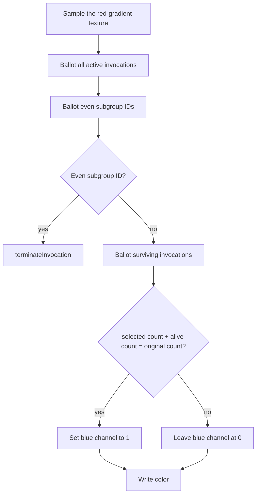

## Overview

**Core question:** Do fragment invocations that execute `terminateInvocation` stop participating in later subgroup, quad, memory-access, and color-output behavior?

- This page covers the `reconvergence.terminate_invocation` test family implemented and registered by [vktReconvergenceTerminateInvocationTests.cpp](../../../modules/vulkan/reconvergence/vktReconvergenceTerminateInvocationTests.cpp).
- Four test case leaves observe termination through subgroup ballot counts, helper-invocation votes, an unreachable out-of-bounds load, and a quad-scoped vote.
- Every case draws a full-screen triangle into a 32 by 32 color attachment. Terminated fragment invocations leave the black clear color; surviving invocations write a case-specific success color.
- The host copies the framebuffer to a buffer and compares every pixel with a reference image.

## Background Knowledge

- **Shader invocation termination.** `OpTerminateInvocation` ends the current invocation. A terminated invocation has finished executing instructions, and early fragment termination clears coverage for its samples [shaders.adoc](../../../../vulkan-docs/src/chapters/shaders.adoc#L1841-L1859), [fragops.adoc](../../../../vulkan-docs/src/chapters/fragops.adoc#L851-L857).
- **Helper invocations.** Fragment processing may create helper invocations for derivatives and quad operations. Helpers do not contribute ordinary framebuffer results, but shader code can identify them through `gl_HelperInvocation` [shaders.adoc](../../../../vulkan-docs/src/chapters/shaders.adoc#L3728-L3753).
- **Full quads and maximal reconvergence.** `layout(full_quads) in` requests quads that start with four active invocations. Under maximal reconvergence, helpers remain active for their quad's lifetime unless termination ends them [VK_KHR_shader_quad_control.adoc](../../../../vulkan-docs/src/proposals/VK_KHR_shader_quad_control.adoc#L87-L157), [shaders.adoc](../../../../vulkan-docs/src/chapters/shaders.adoc#L3755-L3771).

## Registration Hierarchy

```text
reconvergence.terminate_invocation
├── bit_count
├── terminate_helpers
├── oob_read
└── quad_any
```

The implementation registers these four test case leaves directly under the `terminate_invocation` test family [registration](../../../modules/vulkan/reconvergence/vktReconvergenceTerminateInvocationTests.cpp#L653-L675). The default mustpass list contains every path [reconvergence.txt](../../../mustpass/main/vk-default/reconvergence.txt#L3850-L3853).

## Parameter Dimensions and Observed Values

| Dimension | Registered values | Meaning in this test | Evidence |
|-----------|-------------------|----------------------|----------|
| Test case leaf | `bit_count`, `terminate_helpers`, `oob_read`, `quad_any` | Selects the post-termination observation and reference image. | [subcases and registration](../../../modules/vulkan/reconvergence/vktReconvergenceTerminateInvocationTests.cpp#L55-L61), [#L653-L675](../../../modules/vulkan/reconvergence/vktReconvergenceTerminateInvocationTests.cpp#L653-L675) |
| Divisor | `2` for `bit_count`, `oob_read`, and `quad_any`; `0` for `terminate_helpers` | Divisor `2` selects even subgroup invocation IDs. Zero makes the helper case predicate depend on `gl_HelperInvocation`. | [`getDivisor`](../../../modules/vulkan/reconvergence/vktReconvergenceTerminateInvocationTests.cpp#L67-L77) |
| Helper built-in use | used by `terminate_helpers` and `quad_any`; absent from the other bodies | Selects helper invocations and raises the minimum API and SPIR-V target for those two cases. | [`usesHelperInvBuiltIn`](../../../modules/vulkan/reconvergence/vktReconvergenceTerminateInvocationTests.cpp#L84-L87), [program setup](../../../modules/vulkan/reconvergence/vktReconvergenceTerminateInvocationTests.cpp#L201-L203), [#L243-L244](../../../modules/vulkan/reconvergence/vktReconvergenceTerminateInvocationTests.cpp#L243-L244) |
| Maximal reconvergence | enabled only for `bit_count` and `terminate_helpers`; disabled for `oob_read` and `quad_any` | Applies the maximal-reconvergence execution mode only to the two subgroup checks that request it. | [`needsMaximalReconvergence`](../../../modules/vulkan/reconvergence/vktReconvergenceTerminateInvocationTests.cpp#L166-L169), [shader generation](../../../modules/vulkan/reconvergence/vktReconvergenceTerminateInvocationTests.cpp#L246-L273) |
| Framebuffer | 32 by 32, `VK_FORMAT_R8G8B8A8_UNORM` | Encodes termination as untouched clear pixels and surviving execution as a written color. | [runtime constants](../../../modules/vulkan/reconvergence/vktReconvergenceTerminateInvocationTests.cpp#L386-L399) |

## Behavior Parameters

The primary behavioral axis is the test case leaf. Each value chooses a different operation after `terminateInvocation`.

### `bit_count` - Post-termination subgroup population

The shader ballots all active invocations and the half selected by even subgroup invocation ID. After the selected half terminates, surviving invocations ballot again. They mark success when `terminated_count + alive_count == all_count` [shader body](../../../modules/vulkan/reconvergence/vktReconvergenceTerminateInvocationTests.cpp#L276-L306).

### `terminate_helpers` - Helper participation in a subgroup vote

The shader selects helper invocations, terminates them, and asks `subgroupAny(should_terminate)` whether any selected invocation remains active. A false result sets the blue success channel [shader body](../../../modules/vulkan/reconvergence/vktReconvergenceTerminateInvocationTests.cpp#L308-L330).

### `oob_read` - Execution after termination

The selected half terminates before a storage-buffer load. Those invocations would choose `UINT32_MAX` as the index if they reached the load; survivors choose valid index `0`. The case checks the resulting image and that execution completes without the invalid path taking effect [shader body](../../../modules/vulkan/reconvergence/vktReconvergenceTerminateInvocationTests.cpp#L332-L354), [push constants](../../../modules/vulkan/reconvergence/vktReconvergenceTerminateInvocationTests.cpp#L553-L557).

### `quad_any` - Helper participation in a quad vote

The shader terminates invocations with even subgroup IDs and all invocations that started as helpers. Survivors call `subgroupQuadAny(gl_HelperInvocation)`. A true result replaces the fixed blue success color with a sampled texture color, which the host detects [shader body](../../../modules/vulkan/reconvergence/vktReconvergenceTerminateInvocationTests.cpp#L356-L376).

## Shader Analysis

### Representative Shader Walkthrough 1

#### Parameter Values Chosen

Representative path:

```text
dEQP-VK.reconvergence.terminate_invocation.bit_count
```

| Parameter choice | Meaning in this representative case |
|------------------|-------------------------------------|
| `bit_count` | Selects the pre-termination and post-termination subgroup ballot comparison. |
| Divisor `2` | Selects invocations with even `gl_SubgroupInvocationID` for termination. |
| `[[maximally_reconverges]]` | Applies maximal reconvergence to this fragment entry point. |
| `layout(full_quads) in` | Requests complete fragment quads at shader entry. |
| SPIR-V 1.3 | Matches the explicit target for cases that do not read `gl_HelperInvocation`. |

#### Purpose

The fragment shader verifies that the subgroup population after `terminateInvocation` excludes the selected invocations. Surviving invocations write a blue success channel only when the pre-termination and post-termination counts partition the original active population.

#### Structural Design



#### Shader Code

```glsl
#version 460
#extension GL_KHR_shader_subgroup_ballot : enable
#extension GL_KHR_shader_subgroup_vote : enable
#extension GL_EXT_terminate_invocation : enable
#extension GL_EXT_maximal_reconvergence : enable
#extension GL_EXT_shader_quad_control : enable

layout (full_quads) in;

/// The render target stores the observable result for each surviving fragment invocation.
layout (location=0) out vec4 outColor;
/// Binding 0 is the 32 by 32 sampled red gradient.
layout (set=0, binding=0) uniform sampler2D inTexture;
/// Binding 1 contains one vec4. The bit_count shader declares it but does not read it.
layout (set=0, binding=1, std430) readonly buffer InValuesBlock {
    vec4 values[];
} inValues;

/// Separate divisor fields discourage folding the recorded predicate into the terminating branch.
layout (push_constant, std430) uniform PCBlock {
    uint divisor;
    uint divisorCopy;
    uint indexZero;
    uint indexLarge;
    float width;
    float height;
} pc;

void main()
[[maximally_reconverges]]
{
    // The texture should only have non-zero variable red values and alpha 1.0.
    vec2 dim = vec2(pc.width, pc.height);
    vec2 sampleCoords = gl_FragCoord.xy / dim;
    vec4 inColor = texture(inTexture, sampleCoords);

    /// Both divisors are 2, so each predicate selects even subgroup invocation IDs.
    bool should_terminate = (gl_SubgroupInvocationID % pc.divisor == 0u);
    bool should_terminate_2 = (gl_SubgroupInvocationID % pc.divisorCopy == 0u);

    /// Capture the original subgroup population and selected half before termination.
    uvec4 all_ballot = subgroupBallot(true);
    uint all_count = subgroupBallotBitCount(all_ballot);

    uvec4 terminated_ballot = subgroupBallot(should_terminate);
    uint terminated_count = subgroupBallotBitCount(terminated_ballot);

    // Separate condition to prevent the compiler from being too smart.
    if (should_terminate_2)
        terminateInvocation;

    /// Only surviving invocations reach this ballot.
    uvec4 alive_ballot = subgroupBallot(true);
    uint alive_count = subgroupBallotBitCount(alive_ballot);

    bool success = (terminated_count + alive_count == all_count);
    if (success)
        inColor.b = 1.0;

    // Output framebuffer:
    // * Half the pixels should be (textureRed, 0.0, 1.0, 1.0).
    // * The other half should have the clear color.
    outColor = inColor;
}
```

#### Additional Info

- The fixed vertex shader only generates a full-screen triangle. The fragment shader owns the tested behavior [shader generation](../../../modules/vulkan/reconvergence/vktReconvergenceTerminateInvocationTests.cpp#L228-L384).
- The host supplies identical values for `divisor` and `divisorCopy`; separate predicates prevent the generated source from reusing one variable for both roles [push constants](../../../modules/vulkan/reconvergence/vktReconvergenceTerminateInvocationTests.cpp#L553-L557).

#### Parameter Variation Summary

| Parameter dimension | Shader-level variation from this shader | Evidence |
|---------------------|---------------------------------------|----------|
| Test case leaf | `terminate_helpers` uses helper termination and `subgroupAny`; `oob_read` places a storage-buffer load after termination; `quad_any` uses a helper-aware predicate and `subgroupQuadAny`. | [fragment body selection](../../../modules/vulkan/reconvergence/vktReconvergenceTerminateInvocationTests.cpp#L275-L379) |
| Maximal reconvergence | `terminate_helpers` retains it; `oob_read` and `quad_any` omit the extension and entry-point attribute. | [`needsMaximalReconvergence`](../../../modules/vulkan/reconvergence/vktReconvergenceTerminateInvocationTests.cpp#L166-L169), [common shader generation](../../../modules/vulkan/reconvergence/vktReconvergenceTerminateInvocationTests.cpp#L246-L273) |
| Helper built-in and SPIR-V target | `terminate_helpers` and `quad_any` read `gl_HelperInvocation` and target SPIR-V 1.6; `bit_count` and `oob_read` target SPIR-V 1.3. | [`usesHelperInvBuiltIn`](../../../modules/vulkan/reconvergence/vktReconvergenceTerminateInvocationTests.cpp#L84-L87), [build options](../../../modules/vulkan/reconvergence/vktReconvergenceTerminateInvocationTests.cpp#L243-L244) |

#### SPIR-V

- Status: generated and validated
- Source: reconstructed `GLSL` from this walkthrough
- Stage: `frag`
- Target SPIRV version: `spirv1.3`

<details>
<summary>Click to expand SPIRV asm code</summary>

```llvm
; SPIR-V
; Version: 1.3
; Generator: Khronos Glslang Reference Front End; 11
; Bound: 105
; Schema: 0
               OpCapability Shader
               OpCapability GroupNonUniform
               OpCapability GroupNonUniformBallot
               OpCapability QuadControlKHR
               OpExtension "SPV_KHR_maximal_reconvergence"
               OpExtension "SPV_KHR_quad_control"
               OpExtension "SPV_KHR_terminate_invocation"
          %1 = OpExtInstImport "GLSL.std.450"
               OpMemoryModel Logical GLSL450
               OpEntryPoint Fragment %main "main" %gl_FragCoord %gl_SubgroupInvocationID %outColor
               OpExecutionMode %main MaximallyReconvergesKHR
               OpExecutionMode %main RequireFullQuadsKHR
               OpExecutionMode %main OriginUpperLeft
               OpSource GLSL 460
               OpSourceExtension "GL_EXT_maximal_reconvergence"
               OpSourceExtension "GL_EXT_shader_quad_control"
               OpSourceExtension "GL_EXT_terminate_invocation"
               OpSourceExtension "GL_KHR_shader_subgroup_ballot"
               OpSourceExtension "GL_KHR_shader_subgroup_basic"
               OpSourceExtension "GL_KHR_shader_subgroup_vote"
               OpName %main "main"
               OpName %dim "dim"
               OpName %PCBlock "PCBlock"
               OpMemberName %PCBlock 0 "divisor"
               OpMemberName %PCBlock 1 "divisorCopy"
               OpMemberName %PCBlock 2 "indexZero"
               OpMemberName %PCBlock 3 "indexLarge"
               OpMemberName %PCBlock 4 "width"
               OpMemberName %PCBlock 5 "height"
               OpName %pc "pc"
               OpName %sampleCoords "sampleCoords"
               OpName %gl_FragCoord "gl_FragCoord"
               OpName %inColor "inColor"
               OpName %inTexture "inTexture"
               OpName %should_terminate "should_terminate"
               OpName %gl_SubgroupInvocationID "gl_SubgroupInvocationID"
               OpName %should_terminate_2 "should_terminate_2"
               OpName %all_ballot "all_ballot"
               OpName %all_count "all_count"
               OpName %terminated_ballot "terminated_ballot"
               OpName %terminated_count "terminated_count"
               OpName %alive_ballot "alive_ballot"
               OpName %alive_count "alive_count"
               OpName %success "success"
               OpName %outColor "outColor"
               OpName %InValuesBlock "InValuesBlock"
               OpMemberName %InValuesBlock 0 "values"
               OpName %inValues "inValues"
               OpDecorate %PCBlock Block
               OpMemberDecorate %PCBlock 0 Offset 0
               OpMemberDecorate %PCBlock 1 Offset 4
               OpMemberDecorate %PCBlock 2 Offset 8
               OpMemberDecorate %PCBlock 3 Offset 12
               OpMemberDecorate %PCBlock 4 Offset 16
               OpMemberDecorate %PCBlock 5 Offset 20
               OpDecorate %gl_FragCoord BuiltIn FragCoord
               OpDecorate %inTexture Binding 0
               OpDecorate %inTexture DescriptorSet 0
               OpDecorate %gl_SubgroupInvocationID RelaxedPrecision
               OpDecorate %gl_SubgroupInvocationID BuiltIn SubgroupLocalInvocationId
               OpDecorate %gl_SubgroupInvocationID Flat
               OpDecorate %45 RelaxedPrecision
               OpDecorate %54 RelaxedPrecision
               OpDecorate %outColor Location 0
               OpDecorate %_runtimearr_v4float ArrayStride 16
               OpDecorate %InValuesBlock Block
               OpMemberDecorate %InValuesBlock 0 NonWritable
               OpMemberDecorate %InValuesBlock 0 Offset 0
               OpDecorate %inValues NonWritable
               OpDecorate %inValues Binding 1
               OpDecorate %inValues DescriptorSet 0
       %void = OpTypeVoid
          %3 = OpTypeFunction %void
      %float = OpTypeFloat 32
    %v2float = OpTypeVector %float 2
%_ptr_Function_v2float = OpTypePointer Function %v2float
       %uint = OpTypeInt 32 0
    %PCBlock = OpTypeStruct %uint %uint %uint %uint %float %float
%_ptr_PushConstant_PCBlock = OpTypePointer PushConstant %PCBlock
         %pc = OpVariable %_ptr_PushConstant_PCBlock PushConstant
        %int = OpTypeInt 32 1
      %int_4 = OpConstant %int 4
%_ptr_PushConstant_float = OpTypePointer PushConstant %float
      %int_5 = OpConstant %int 5
    %v4float = OpTypeVector %float 4
%_ptr_Input_v4float = OpTypePointer Input %v4float
%gl_FragCoord = OpVariable %_ptr_Input_v4float Input
%_ptr_Function_v4float = OpTypePointer Function %v4float
         %33 = OpTypeImage %float 2D 0 0 0 1 Unknown
         %34 = OpTypeSampledImage %33
%_ptr_UniformConstant_34 = OpTypePointer UniformConstant %34
  %inTexture = OpVariable %_ptr_UniformConstant_34 UniformConstant
       %bool = OpTypeBool
%_ptr_Function_bool = OpTypePointer Function %bool
%_ptr_Input_uint = OpTypePointer Input %uint
%gl_SubgroupInvocationID = OpVariable %_ptr_Input_uint Input
      %int_0 = OpConstant %int 0
%_ptr_PushConstant_uint = OpTypePointer PushConstant %uint
     %uint_0 = OpConstant %uint 0
      %int_1 = OpConstant %int 1
     %v4uint = OpTypeVector %uint 4
%_ptr_Function_v4uint = OpTypePointer Function %v4uint
       %true = OpConstantTrue %bool
     %uint_3 = OpConstant %uint 3
%_ptr_Function_uint = OpTypePointer Function %uint
    %float_1 = OpConstant %float 1
     %uint_2 = OpConstant %uint 2
%_ptr_Function_float = OpTypePointer Function %float
%_ptr_Output_v4float = OpTypePointer Output %v4float
   %outColor = OpVariable %_ptr_Output_v4float Output
%_runtimearr_v4float = OpTypeRuntimeArray %v4float
%InValuesBlock = OpTypeStruct %_runtimearr_v4float
%_ptr_StorageBuffer_InValuesBlock = OpTypePointer StorageBuffer %InValuesBlock
   %inValues = OpVariable %_ptr_StorageBuffer_InValuesBlock StorageBuffer
       %main = OpFunction %void None %3
          %5 = OpLabel
        %dim = OpVariable %_ptr_Function_v2float Function
%sampleCoords = OpVariable %_ptr_Function_v2float Function
    %inColor = OpVariable %_ptr_Function_v4float Function
%should_terminate = OpVariable %_ptr_Function_bool Function
%should_terminate_2 = OpVariable %_ptr_Function_bool Function
 %all_ballot = OpVariable %_ptr_Function_v4uint Function
  %all_count = OpVariable %_ptr_Function_uint Function
%terminated_ballot = OpVariable %_ptr_Function_v4uint Function
%terminated_count = OpVariable %_ptr_Function_uint Function
%alive_ballot = OpVariable %_ptr_Function_v4uint Function
%alive_count = OpVariable %_ptr_Function_uint Function
    %success = OpVariable %_ptr_Function_bool Function
         %17 = OpAccessChain %_ptr_PushConstant_float %pc %int_4
         %18 = OpLoad %float %17
         %20 = OpAccessChain %_ptr_PushConstant_float %pc %int_5
         %21 = OpLoad %float %20
         %22 = OpCompositeConstruct %v2float %18 %21
               OpStore %dim %22
         %27 = OpLoad %v4float %gl_FragCoord
         %28 = OpVectorShuffle %v2float %27 %27 0 1
         %29 = OpLoad %v2float %dim
         %30 = OpFDiv %v2float %28 %29
               OpStore %sampleCoords %30
         %37 = OpLoad %34 %inTexture
         %38 = OpLoad %v2float %sampleCoords
         %39 = OpImageSampleImplicitLod %v4float %37 %38
               OpStore %inColor %39
         %45 = OpLoad %uint %gl_SubgroupInvocationID
         %48 = OpAccessChain %_ptr_PushConstant_uint %pc %int_0
         %49 = OpLoad %uint %48
         %50 = OpUMod %uint %45 %49
         %52 = OpIEqual %bool %50 %uint_0
               OpStore %should_terminate %52
         %54 = OpLoad %uint %gl_SubgroupInvocationID
         %56 = OpAccessChain %_ptr_PushConstant_uint %pc %int_1
         %57 = OpLoad %uint %56
         %58 = OpUMod %uint %54 %57
         %59 = OpIEqual %bool %58 %uint_0
               OpStore %should_terminate_2 %59
         %65 = OpGroupNonUniformBallot %v4uint %uint_3 %true
               OpStore %all_ballot %65
         %68 = OpLoad %v4uint %all_ballot
         %69 = OpGroupNonUniformBallotBitCount %uint %uint_3 Reduce %68
               OpStore %all_count %69
         %71 = OpLoad %bool %should_terminate
         %72 = OpGroupNonUniformBallot %v4uint %uint_3 %71
               OpStore %terminated_ballot %72
         %74 = OpLoad %v4uint %terminated_ballot
         %75 = OpGroupNonUniformBallotBitCount %uint %uint_3 Reduce %74
               OpStore %terminated_count %75
         %76 = OpLoad %bool %should_terminate_2
               OpSelectionMerge %78 None
               OpBranchConditional %76 %77 %78
         %77 = OpLabel
               OpTerminateInvocation
         %78 = OpLabel
         %81 = OpGroupNonUniformBallot %v4uint %uint_3 %true
               OpStore %alive_ballot %81
         %83 = OpLoad %v4uint %alive_ballot
         %84 = OpGroupNonUniformBallotBitCount %uint %uint_3 Reduce %83
               OpStore %alive_count %84
         %86 = OpLoad %uint %terminated_count
         %87 = OpLoad %uint %alive_count
         %88 = OpIAdd %uint %86 %87
         %89 = OpLoad %uint %all_count
         %90 = OpIEqual %bool %88 %89
               OpStore %success %90
         %91 = OpLoad %bool %success
               OpSelectionMerge %93 None
               OpBranchConditional %91 %92 %93
         %92 = OpLabel
         %97 = OpAccessChain %_ptr_Function_float %inColor %uint_2
               OpStore %97 %float_1
               OpBranch %93
         %93 = OpLabel
        %100 = OpLoad %v4float %inColor
               OpStore %outColor %100
               OpReturn
               OpFunctionEnd
```

</details>

## Runtime Execution and Result Checking

- The host creates a sampled 32 by 32 red-gradient image, an R8G8B8A8 framebuffer cleared to `(0, 0, 0, 1)`, and a one-`vec4` storage buffer containing `(0, 0, 1, 0)` [resource setup](../../../modules/vulkan/reconvergence/vktReconvergenceTerminateInvocationTests.cpp#L386-L471).
- Descriptor binding `0` supplies the texture and sampler. Binding `1` supplies the storage buffer. Push constants provide duplicate divisors, index `0`, `UINT32_MAX`, and framebuffer dimensions [descriptors](../../../modules/vulkan/reconvergence/vktReconvergenceTerminateInvocationTests.cpp#L473-L511), [push constants](../../../modules/vulkan/reconvergence/vktReconvergenceTerminateInvocationTests.cpp#L553-L557).
- The host draws one full-screen triangle, copies the color attachment to a host-visible buffer, waits, and passes the pixels to the selected checker [draw and copyback](../../../modules/vulkan/reconvergence/vktReconvergenceTerminateInvocationTests.cpp#L513-L571).
- `bit_count` and `oob_read` expect even-x pixels to remain black and other pixels to match sampled red with blue `1`. `terminate_helpers` expects every pixel to contain sampled red with blue `1`. These checks allow `0.005` red-channel sampling error [image checks](../../../modules/vulkan/reconvergence/vktReconvergenceTerminateInvocationTests.cpp#L574-L623).
- `quad_any` expects even-x pixels to remain black and other pixels to be exactly blue. Its comparison threshold is zero [quad check](../../../modules/vulkan/reconvergence/vktReconvergenceTerminateInvocationTests.cpp#L626-L648).

## Failure Meaning

### Failure Cause Mapping

| If this behavior parameter value fails | Possible failure cause(s) |
|----------------------------------------|---------------------------|
| `bit_count` | Terminated invocations remain represented in the post-termination ballot, or the required reconvergence does not preserve the intended pre/post count relation. |
| `terminate_helpers` | Terminated helper invocations remain active in the later subgroup vote, or helper activity under maximal reconvergence is handled incorrectly. |
| `oob_read` | Code after `terminateInvocation` executes or is lowered so that a terminated invocation can issue the out-of-bounds storage-buffer read. |
| `quad_any` | Terminated helper or selected invocations remain active in the later quad vote, or full-quad participation is handled incorrectly around termination. |

### Cause Analysis

#### Post-termination subgroup participation or reconvergence error

**Possible failure symptoms:** `bit_count` leaves blue at zero on surviving pixels because its count equation fails, or `terminate_helpers` leaves blue at zero because the later subgroup vote still sees a selected helper. The host reports mismatched pixels against the sampled-red-plus-blue reference.

**Possible implementation causes:** The implementation may retain terminated invocations in subgroup ballots or votes, mishandle reconvergence around the termination branch, or lower `terminateInvocation` so later group operations still observe terminated lanes. The Vulkan specification states that `OpTerminateInvocation` ends instruction execution; maximal reconvergence keeps helpers active until termination ends them [shaders.adoc](../../../../vulkan-docs/src/chapters/shaders.adoc#L1841-L1859), [#L3755-L3771](../../../../vulkan-docs/src/chapters/shaders.adoc#L3755-L3771).

#### Post-termination storage-buffer access

**Possible failure symptoms:** `oob_read` produces wrong surviving colors, fails to complete, or triggers a device error because an invocation reaches the load with `UINT32_MAX` instead of terminating first.

**Possible implementation causes:** Compiler control-flow lowering, instruction scheduling, or termination handling may allow the storage-buffer load to execute for a path that has executed `terminateInvocation`. The invalid index is intentional only as unreachable code; ordinary out-of-bounds shader access has no automatic bounds guarantee [shader body](../../../modules/vulkan/reconvergence/vktReconvergenceTerminateInvocationTests.cpp#L332-L354), [shaders.adoc](../../../../vulkan-docs/src/chapters/shaders.adoc#L1871-L1890).

#### Post-termination quad participation

**Possible failure symptoms:** `quad_any` writes blue to an even-x pixel if a selected non-helper invocation reaches color output, or samples the red-gradient texture on surviving odd-x pixels if the later quad vote still sees a helper; either result fails the exact zero-threshold comparison.

**Possible implementation causes:** The implementation may fail to end a selected non-helper invocation before color output, keep a terminated helper active in `subgroupQuadAny`, form the active quad incorrectly after termination, or mishandle `RequireFullQuadsKHR` around a terminating branch. Quad-any evaluates its predicate over active invocations in quad scope [VK_KHR_shader_quad_control.adoc](../../../../vulkan-docs/src/proposals/VK_KHR_shader_quad_control.adoc#L94-L157).

#### Shared rendering or readback error

**Possible failure symptoms:** Any leaf can show misplaced clear pixels, wrong sampled red values, missing blue values, or a framebuffer-wide mismatch unrelated to its expected termination pattern.

**Possible implementation causes:** A defect in sampled-image transfer or visibility, descriptor access, color-attachment writes, framebuffer copyback, or format conversion can corrupt the image before the checker reads it. Source-level investigation is needed to distinguish these shared-path failures from termination failures.

## Case Pruning

### Requirement-based pruning

- Only `bit_count` and `terminate_helpers` require `VK_KHR_shader_maximal_reconvergence`. All leaves require fragment-stage subgroup support, `VK_SUBGROUP_FEATURE_BASIC_BIT`, and `VK_KHR_shader_quad_control` [support checks](../../../modules/vulkan/reconvergence/vktReconvergenceTerminateInvocationTests.cpp#L196-L226).
- `bit_count` also requires `VK_SUBGROUP_FEATURE_BALLOT_BIT`. `terminate_helpers` and `quad_any` require `VK_SUBGROUP_FEATURE_VOTE_BIT` [support checks](../../../modules/vulkan/reconvergence/vktReconvergenceTerminateInvocationTests.cpp#L213-L223).
- `terminate_helpers` and `quad_any` require Vulkan 1.3 and target SPIR-V 1.6 because they use `gl_HelperInvocation`. `bit_count` and `oob_read` require Vulkan 1.1 and target SPIR-V 1.3 [API and build targets](../../../modules/vulkan/reconvergence/vktReconvergenceTerminateInvocationTests.cpp#L201-L203), [#L243-L244](../../../modules/vulkan/reconvergence/vktReconvergenceTerminateInvocationTests.cpp#L243-L244).
- A missing requirement makes the test unsupported rather than failed.

### Design-based pruning

- The implementation registers one fixed case for each observation mechanism. It does not generate a divisor, framebuffer-size, format, or shader-stage matrix [registration](../../../modules/vulkan/reconvergence/vktReconvergenceTerminateInvocationTests.cpp#L653-L675).
- Divisor `2` gives the three parity-based cases a stable alternating reference pattern. `terminate_helpers` fixes the divisor at `0` because helper status supplies its predicate [`getDivisor`](../../../modules/vulkan/reconvergence/vktReconvergenceTerminateInvocationTests.cpp#L67-L77).
- All cases run in the fragment stage because framebuffer coverage, helper invocations, full quads, and color output provide the required observations.

## Key Takeaways

- The four leaves test the same termination boundary through subgroup population, helper participation, unreachable memory access, and quad participation.
- Terminated fragments leave black clear pixels; surviving success paths write blue-bearing output, which makes the termination pattern visible to host-side image comparison.
- Only `bit_count` and `terminate_helpers` request maximal reconvergence. `oob_read` and `quad_any` do not.
- See `## Failure Meaning` to separate case-specific termination failures from shared rendering and readback failures.

## Source Reference Appendix

| Entry point | Link | Why it matters |
|-------------|------|----------------|
| Factory declaration | [vktReconvergenceTerminateInvocationTests.hpp#L30-L35](../../../modules/vulkan/reconvergence/vktReconvergenceTerminateInvocationTests.hpp#L30-L35) | Declares `createTerminateInvocationTests`. |
| Parent attachment | [vktReconvergenceTests.cpp#L7943-L7948](../../../modules/vulkan/reconvergence/vktReconvergenceTests.cpp#L7943-L7948) | Attaches the test family under the `reconvergence` test category. |
| Parameters and instance selection | [vktReconvergenceTerminateInvocationTests.cpp#L55-L194](../../../modules/vulkan/reconvergence/vktReconvergenceTerminateInvocationTests.cpp#L55-L194) | Defines subcases, fixed parameters, and result checker classes. |
| Support checks | [vktReconvergenceTerminateInvocationTests.cpp#L196-L226](../../../modules/vulkan/reconvergence/vktReconvergenceTerminateInvocationTests.cpp#L196-L226) | Enforces API, extension, stage, and subgroup-operation requirements. |
| Shader generation | [vktReconvergenceTerminateInvocationTests.cpp#L228-L384](../../../modules/vulkan/reconvergence/vktReconvergenceTerminateInvocationTests.cpp#L228-L384) | Emits the full-screen vertex shader and four fragment-shader bodies. |
| Runtime execution | [vktReconvergenceTerminateInvocationTests.cpp#L386-L571](../../../modules/vulkan/reconvergence/vktReconvergenceTerminateInvocationTests.cpp#L386-L571) | Creates resources, records the draw and copy, waits, and starts validation. |
| Result checkers | [vktReconvergenceTerminateInvocationTests.cpp#L574-L648](../../../modules/vulkan/reconvergence/vktReconvergenceTerminateInvocationTests.cpp#L574-L648) | Builds and compares the reference images. |
| Test case registration | [vktReconvergenceTerminateInvocationTests.cpp#L653-L675](../../../modules/vulkan/reconvergence/vktReconvergenceTerminateInvocationTests.cpp#L653-L675) | Registers `terminate_invocation` and all four leaves. |
| Mustpass coverage | [reconvergence.txt#L3850-L3853](../../../mustpass/main/vk-default/reconvergence.txt#L3850-L3853) | Lists every complete default-mustpass path for this test family. |
| Vulkan termination semantics | [shaders.adoc#L1841-L1859](../../../../vulkan-docs/src/chapters/shaders.adoc#L1841-L1859) | Defines when an invocation terminates. |
| Helper and maximal-reconvergence semantics | [shaders.adoc#L3728-L3771](../../../../vulkan-docs/src/chapters/shaders.adoc#L3728-L3771) | Defines helpers and their activity under maximal reconvergence. |
| Quad control semantics | [VK_KHR_shader_quad_control.adoc#L87-L157](../../../../vulkan-docs/src/proposals/VK_KHR_shader_quad_control.adoc#L87-L157) | Defines full quads and quad-scoped all/any behavior. |
