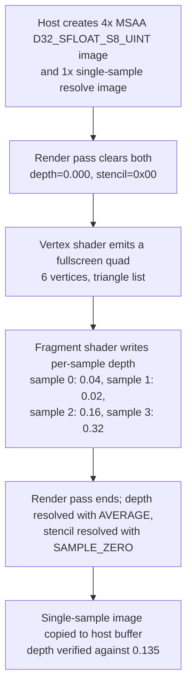

## Overview

**Core question:** When a render pass resolves a multisample depth/stencil attachment to a single-sample attachment, does the implementation apply each requested resolve mode correctly and report the right capability properties?

- This page covers the `renderpasses.renderpass2.depth_stencil_resolve` test family, implemented in
  [vktRenderPassDepthStencilResolveTests.cpp](../../../modules/vulkan/renderpass/vktRenderPassDepthStencilResolveTests.cpp) and
  registered under the `renderpass2` test category root as `"depth_stencil_resolve"`
  ([createRenderPass2DepthStencilResolveTests](../../../modules/vulkan/renderpass/vktRenderPassDepthStencilResolveTests.cpp#L2191-L2194)).
- The test exercises `VK_KHR_depth_stencil_resolve` / Vulkan 1.2 subpass depth/stencil resolve through
  `VkSubpassDescriptionDepthStencilResolve` in `VkRenderPassCreateInfo2`, using a multisample depth/stencil attachment
  and a single-sample resolve attachment.
- It covers a large matrix of formats, sample counts, depth and stencil resolve modes, separate depth/stencil layouts,
  unused-resolve attachment variants, and a layered framebuffer case, then checks the resolved single-sample image.
- A small `misc` group additionally verifies the reported `VkPhysicalDeviceDepthStencilResolveProperties` and checks
  resolve behavior when the requested aspect is not present in the format.

## Background Knowledge

- **Multisample resolve for depth/stencil.** Vulkan render passes can downsample a multisample color attachment into a
  single-sample resolve attachment automatically at the end of a subpass. `VK_KHR_depth_stencil_resolve` (core in Vulkan
  1.2) extends the same mechanism to depth/stencil attachments through a `VkSubpassDescriptionDepthStencilResolve`
  structure chained off `VkSubpassDescription2`, with separate `depthResolveMode` and `stencilResolveMode` fields.
- **Resolve modes (`VkResolveModeFlagBits`).** `SAMPLE_ZERO` copies sample 0; `AVERAGE` averages samples; `MIN`/`MAX`
  take the per-sample minimum or maximum; `NONE` performs no resolve for that aspect. `SAMPLE_ZERO` is mandatory for
  both aspects; `AVERAGE` is forbidden for stencil by the spec, so the test never registers a stencil `AVERAGE` case.
- **Per-aspect independence.** For combined depth/stencil formats, the implementation may require depth and stencil to
  use the same mode, allow them to differ only when one is `NONE` (`independentResolveNone`), or allow all combinations
  (`independentResolve`). The test gates mixed-mode cases on these reported properties.
- **Separate depth/stencil layouts.** When `VK_KHR_separate_depth_stencil_layouts` is supported, depth and stencil
  aspects of an attachment can be in different image layouts. The test generates a `_separate_layouts` variant for
  every combined depth/stencil format to cover this path.

## Registration Hierarchy

```text
renderpasses.renderpass2.depth_stencil_resolve
├── image_2d_16_64_6
├── image_2d_17_1
├── image_2d_32_32
├── image_2d_49_13
├── image_2d_5_1
├── image_2d_8_32
└── misc
```

The six `image_2d_*` children are full resolve-matrix test families sharing one implementation
([DepthStencilResolveTest](../../../modules/vulkan/renderpass/vktRenderPassDepthStencilResolveTests.cpp#L213-L265)).
`misc` holds three leaf cases that query properties and probe non-present-aspect resolve behavior
([misc registration](../../../modules/vulkan/renderpass/vktRenderPassDepthStencilResolveTests.cpp#L1861-L1873)).

## Parameter Dimensions and Observed Values

| Dimension | Registered values | Meaning in this test | Evidence |
|-----------|-------------------|----------------------|----------|
| Image geometry | `image_2d_32_32`, `image_2d_8_32`, `image_2d_49_13`, `image_2d_5_1`, `image_2d_17_1` | Five non-layered geometries with differing render areas and clear values, chosen so both full-framebuffer and sub-rectangle resolves, plus 1-pixel-tall strips, are exercised. | [imagesTestData](../../../modules/vulkan/renderpass/vktRenderPassDepthStencilResolveTests.cpp#L1832-L1838) |
| Layered framebuffer | `image_2d_16_64_6` | A 16×64 image with 6 layers; rendering targets layers 4–6 while the resolve attachment base layer is 1, so non-zero-base-layer resolve is covered. Requires the geometry shader to broadcast draws across layers. | [layeredTextureTestData](../../../modules/vulkan/renderpass/vktRenderPassDepthStencilResolveTests.cpp#L2069), [geometry shader](../../../modules/vulkan/renderpass/vktRenderPassDepthStencilResolveTests.cpp#L1098-L1129) |
| Sample count | 2, 4, 8, 16, 32, 64 | Iterates `sampleCounts` under `samples_N`; expected depth values and the number of stencil render passes depend on this. | [sampleCounts](../../../modules/vulkan/renderpass/vktRenderPassDepthStencilResolveTests.cpp#L1839) |
| Format | `d16_unorm`, `x8_d24_unorm_pack32`, `d32_sfloat`, `s8_uint`, `d16_unorm_s8_uint`, `d24_unorm_s8_uint`, `d32_sfloat_s8_uint` | Covers depth-only, stencil-only, and combined depth/stencil formats; combined formats also get a `_separate_layouts` variant. | [formats](../../../modules/vulkan/renderpass/vktRenderPassDepthStencilResolveTests.cpp#L1795-L1803) |
| Resolve mode | `none`, `zero`, `average`, `min`, `max` | Drives `depthResolveMode`/`stencilResolveMode`; stencil `average` and double-`none` are skipped by design. | [resolveModes](../../../modules/vulkan/renderpass/vktRenderPassDepthStencilResolveTests.cpp#L1810-L1814) |
| Separate layouts | boolean | Adds a `_separate_layouts` subgroup for combined formats, using per-aspect layouts via `VK_KHR_separate_depth_stencil_layouts`. | [separate layout loop](../../../modules/vulkan/renderpass/vktRenderPassDepthStencilResolveTests.cpp#L1902-L1909) |
| Unused resolve | boolean | Adds an `_unused_resolve` variant where the resolve attachment is `VK_ATTACHMENT_UNUSED` and the single-sample image is cleared outside the render pass. | [unusedIdx loop](../../../modules/vulkan/renderpass/vktRenderPassDepthStencilResolveTests.cpp#L1922-L1951) |
| Sample mask | boolean (stencil, `SAMPLE_ZERO` only) | Adds a `_samplemask` variant that uses `VkPipelineMultisampleStateCreateInfo::pSampleMask` to enable one sample per pass instead of using `discard`. | [samplemask registration](../../../modules/vulkan/renderpass/vktRenderPassDepthStencilResolveTests.cpp#L2026-L2034) |
| Compatible format | `D32_SFLOAT`, `D16_UNORM`, `X8_D24_UNORM_PACK32`, `S8_UINT` | Adds a `compatibility_*` case for the first image/sample using a format-compatible resolve attachment (fewer aspects, same bit depth). | [compatibility registration](../../../modules/vulkan/renderpass/vktRenderPassDepthStencilResolveTests.cpp#L1981-L2049), [DepthCompatibilityManager](../../../modules/vulkan/renderpass/vktRenderPassDepthStencilResolveTests.cpp#L147-L167) |

## Behavior Parameters

The primary behavioral axis is the **resolve mode combination** applied to the depth and stencil aspects. Each registered
leaf selects one depth resolve mode and one stencil resolve mode (subject to the pruning rules below) and then verifies
either depth or stencil via the `testing_depth` / `testing_stencil` suffix.

### `zero`: sample 0 is the resolved value

`VK_RESOLVE_MODE_SAMPLE_ZERO_BIT` copies sample 0 of the multisample attachment into the single-sample attachment. This
is the only mandatory mode for both aspects, so every format and sample count registers a `zero` case. The expected
depth value is `0.04` and the expected stencil value is `1` regardless of sample count
([expected value tables](../../../modules/vulkan/renderpass/vktRenderPassDepthStencilResolveTests.cpp#L1840-L1855)).

### `average`: arithmetic mean of samples (depth only)

`VK_RESOLVE_MODE_AVERAGE_BIT` resolves to the average of the per-sample depth values. The fragment shader writes one of
four depth values (`0.04`, `0.02`, `0.16`, `0.32`) per sample
([depth fragment shader](../../../modules/vulkan/renderpass/vktRenderPassDepthStencilResolveTests.cpp#L1142-L1157)), so the
expected average is `0.135` for sample counts ≥ 4 and `0.03` for 2 samples. `average` is never registered for stencil
because the spec forbids it.

### `min` / `max`: per-sample extreme

`MIN` and `MAX` pick the smallest or largest sample value. The shader deliberately makes sample 1 carry the extreme
depth (`0.02` for `min`, `0.32` for `max`), and the host sets stencil references so the first half of samples hold `1`
and the second half hold `255`. Expected depth is `0.02` (`min`) or `0.32`/`0.04` (`max` at ≥4 / 2 samples); expected
stencil is `1` (`min`) or `255` (`max`)
([stencil pass setup](../../../modules/vulkan/renderpass/vktRenderPassDepthStencilResolveTests.cpp#L798-L863)).

### `none`: no resolve for that aspect

`VK_RESOLVE_MODE_NONE` performs no resolve, so the single-sample attachment keeps its clear value for that aspect. The
test expects the configured `clearValue.depth` / `clearValue.stencil`. Double-`none` is pruned because the spec forbids
both modes being `NONE` when a resolve attachment is present and not `VK_ATTACHMENT_UNUSED`.

### `misc` leaves: properties and non-present aspects

Beyond the resolve-matrix leaves, three `misc` cases probe separate contracts:

- `properties` queries `VkPhysicalDeviceDepthStencilResolveProperties` and asserts that `SAMPLE_ZERO` is present for
  both aspects, `AVERAGE` is absent for stencil, and that `independentResolve` implies `independentResolveNone`
  ([PropertiesTestInstance::iterate](../../../modules/vulkan/renderpass/vktRenderPassDepthStencilResolveTests.cpp#L1325-L1352)).
- `resolve_stencil_aspect_that_is_not_present` uses a depth-only format and asks the implementation to resolve a
  non-present stencil aspect; it then verifies the present depth aspect still resolves correctly across two render
  passes ([ResolveNonPresentAspectTestInstance](../../../modules/vulkan/renderpass/vktRenderPassDepthStencilResolveTests.cpp#L1448-L1706)).
- `resolve_depth_aspect_that_is_not_present` is the symmetric case using `S8_UINT` and resolving a non-present depth
  aspect.

## Shader Analysis

### Representative Shader Walkthrough 1

#### Parameter Values Chosen

Representative path:

```text
renderpasses.renderpass2.depth_stencil_resolve.image_2d_32_32.samples_4.d32_sfloat_s8_uint.depth_average_stencil_zero_testing_depth
```

mustpass: [renderpasses.txt#L58951](../../../mustpass/main/vk-default/renderpasses.txt#L58951).

| Parameter choice | Meaning in this representative case |
|------------------|-------------------------------------|
| `image_2d_32_32`, render area `{0,0,32,32}` | Full-framebuffer resolve; every pixel is inside the render area. |
| `samples_4` | 4× MSAA; the `average` expected depth is `0.135`. |
| `d32_sfloat_s8_uint` | Combined depth/stencil format with a 32-bit float depth and 8-bit stencil. |
| `depth_average`, `stencil_zero` | Independent depth/stencil resolve; requires `independentResolve`. |
| `testing_depth` | This leaf verifies the resolved depth buffer (`VB_DEPTH`). |

#### Purpose

Prove that `VK_RESOLVE_MODE_AVERAGE_BIT` averages the four per-sample depth values written by the fragment shader and
writes the result to the single-sample resolve attachment, while `VK_RESOLVE_MODE_SAMPLE_ZERO_BIT` is independently
selected for the stencil aspect.

#### Structural Design



#### Shader Code

Reconstructed GLSL for the depth-testing path. The vertex shader is shared across all cases; the fragment shader is the
depth-testing variant.

```glsl
#version 450

/// Vertex shader: emits a fullscreen quad as a two-triangle list (6 vertices).
/// gl_Position is computed purely from gl_VertexIndex, so no vertex input is bound.
out gl_PerVertex {
    vec4 gl_Position;
};

void main(void)
{
    gl_Position = vec4(((gl_VertexIndex + 2) / 3) % 2 == 0 ? -1.0 : 1.0,
                       ((gl_VertexIndex + 1) / 3) % 2 == 0 ? -1.0 : 1.0,
                       0.0, 1.0);
}
```

```glsl
#version 450
precision highp float;
precision highp int;

/// Depth-testing fragment shader. gl_SampleID selects which of four depth
/// values is written to gl_FragDepth for the current sample. The values are
/// chosen so the four resolve modes produce distinct results:
///   SAMPLE_ZERO -> 0.04, MIN -> 0.02, MAX -> 0.32, AVERAGE -> 0.135.
void main(void)
{
    float sampleIndex = float(gl_SampleID);           // 0..63
    float valueIndex  = round(mod(sampleIndex, 4.0)); // wraps to 0..3
    float value       = valueIndex + 2.0;             // 2,3,4,5
    value             = round(exp2(value));           // 4,8,16,32
    bool condition    = (int(value) == 8);            // select the second value
    value             = round(value - float(condition) * 6.0); // 4,2,16,32
    gl_FragDepth      = value / 100.0;                // 0.04,0.02,0.16,0.32
}
```

#### Additional Info

- The vertex shader builds the quad without any bound vertex buffer
  ([quad-vert](../../../modules/vulkan/renderpass/vktRenderPassDepthStencilResolveTests.cpp#L1131-L1140)).
- Depth testing is always enabled with `VK_COMPARE_OP_ALWAYS`, so every sample's `gl_FragDepth` is written
  ([depth/stencil pipeline state](../../../modules/vulkan/renderpass/vktRenderPassDepthStencilResolveTests.cpp#L612-L633)).
- The render pass is created with `VkRenderPassCreateInfo2` and chains
  `VkSubpassDescriptionDepthStencilResolve` only on the final render pass, with the multisample image as the
  depth/stencil attachment and the single-sample image as the resolve attachment
  ([createRenderPass](../../../modules/vulkan/renderpass/vktRenderPassDepthStencilResolveTests.cpp#L359-L517)).

#### Parameter Variation Summary

- For stencil-testing leaves, the fragment shader discards all samples except the one identified by a push constant,
  sets `gl_FragDepth = 0.5`, and the host iterates one render pass per sample with a per-pass stencil reference
  ([stencil fragment shader](../../../modules/vulkan/renderpass/vktRenderPassDepthStencilResolveTests.cpp#L1173-L1184),
  [stencil submission loop](../../../modules/vulkan/renderpass/vktRenderPassDepthStencilResolveTests.cpp#L798-L863)).
- The `_samplemask` stencil variant replaces `discard` with `VkSampleMask` so each render pass writes exactly one
  sample ([samplemask state](../../../modules/vulkan/renderpass/vktRenderPassDepthStencilResolveTests.cpp#L603-L611)).
- Layered cases add a geometry shader that broadcasts each triangle to three layers via `gl_Layer`
  ([quad-geom](../../../modules/vulkan/renderpass/vktRenderPassDepthStencilResolveTests.cpp#L1098-L1129)).

#### SPIR-V

This page does not include a `shader-disassembler` SPIR-V block. The tested behavior is fixed-function depth/stencil
resolve, not per-instruction shader logic; the shaders only generate the per-sample depth/stencil values that the
resolve operation then combines. The fragment and vertex shaders above are short and fully determined by the source, so
a disassembly would not add information beyond the GLSL shown here.

## Runtime Execution and Result Checking

- **Resources.** The test creates a multisample depth/stencil image, a single-sample resolve image (using the
  `compatibleFormat` when set), a host-visible readback buffer sized for all layers, and a framebuffer holding both
  image views
  ([constructor](../../../modules/vulkan/renderpass/vktRenderPassDepthStencilResolveTests.cpp#L267-L303)).
- **Unused-resolve pre-clear.** When the resolve attachment is `VK_ATTACHMENT_UNUSED`, the single-sample image is
  cleared to the configured clear value outside the render pass using `vkCmdClearDepthStencilImage` with explicit
  layout transitions, so the expected-value check still applies
  ([unusedResolve block](../../../modules/vulkan/renderpass/vktRenderPassDepthStencilResolveTests.cpp#L705-L761)).
- **Depth submission.** One render pass clears both attachments, binds the pipeline, and records a 6-vertex draw; the
  resolve happens at `cmdEndRenderPass`
  ([depth path](../../../modules/vulkan/renderpass/vktRenderPassDepthStencilResolveTests.cpp#L770-L795)).
- **Stencil submission.** Because a stencil reference applies to one sample at a time, the host records one render pass
  per sample (`sampleCount` passes), pushing the sample index as a constant and setting a per-pass stencil reference
  (`1` for the first half of samples, `255` for the second half). A `LATE_FRAGMENT_TESTS → EARLY_FRAGMENT_TESTS`
  barrier separates passes so the store/load between them is observable
  ([stencil path](../../../modules/vulkan/renderpass/vktRenderPassDepthStencilResolveTests.cpp#L798-L863)).
- **Copyback.** A `COLOR_ATTACHMENT_WRITE_BIT → TRANSFER_READ_BIT` image barrier (the spec requires color-attachment
  access masks to synchronize depth/stencil *resolve* operations) precedes `vkCmdCopyImageToBuffer` of the single-sample
  image into the host-visible buffer, followed by a `TRANSFER_WRITE_BIT → HOST_READ_BIT` buffer barrier
  ([copyback barriers](../../../modules/vulkan/renderpass/vktRenderPassDepthStencilResolveTests.cpp#L866-L926)).
- **Depth check.** The host walks every pixel of every view layer, extracts the tightly-packed depth using a
  format-specific getter (16/24/32-bit), and compares against the expected value for the selected resolve mode with
  epsilon `0.002`. Pixels outside the render area must equal the clear value
  ([verifyDepth](../../../modules/vulkan/renderpass/vktRenderPassDepthStencilResolveTests.cpp#L933-L1015)).
- **Stencil check.** The host walks every pixel and compares the `uint8_t` stencil exactly against the expected value
  for the selected resolve mode; pixels outside the render area must equal the clear stencil
  ([verifyStencil](../../../modules/vulkan/renderpass/vktRenderPassDepthStencilResolveTests.cpp#L1017-L1076)).

| Resource | Created/configured by host? | Bound to GPU? | Device access | Host readback | Role |
|----------|-----------------------------|---------------|---------------|---------------|------|
| Multisample depth/stencil image | Yes | Depth/stencil attachment | Written by fragment shader | No | Per-sample depth/stencil source for resolve. |
| Single-sample resolve image | Yes | Resolve attachment | Written by resolve op (or pre-clear when unused) | Via copy buffer | Holds the resolved result that is verified. |
| Host-visible buffer | Yes | Copy target | Written by `vkCmdCopyImageToBuffer` | Yes | Readback buffer for depth/stencil verification. |
| Graphics pipeline | Yes | Pipeline state | Executes vertex/fragment (and geometry for layered) shaders | No | Generates the per-sample depth/stencil values. |
| Render pass (RenderPass2) | Yes | Submission state | Drives clear, draw, and resolve | No | Wires the resolve attachment and modes through `VkSubpassDescriptionDepthStencilResolve`. |

## Failure Meaning

### Failure Cause Mapping

| If this behavior parameter value fails | Possible failure cause(s) |
|----------------------------------------|---------------------------|
| `zero` (depth or stencil) | Incorrect sample-0 resolve, or attachment load/copyback corruption. |
| `average` (depth) | Incorrect per-sample averaging or sample-value generation. |
| `min` / `max` (depth or stencil) | Incorrect per-sample extreme selection, or stencil reference/push-constant setup. |
| `none` (depth or stencil) | Resolve attachment not preserved at clear value when no resolve is requested. |
| `misc.properties` | Incorrect reported `VkPhysicalDeviceDepthStencilResolveProperties`. |
| `misc.resolve_*_aspect_that_is_not_present` | Non-present aspect resolve crashes or corrupts the present aspect. |
| Any layered (`image_2d_16_64_6`) leaf | Layered resolve, non-zero base layer, or geometry-shader broadcast failure. |
| Any `_unused_resolve` leaf | Resolve-attachment-unused path or external pre-clear failure. |

### Cause Analysis

#### Incorrect sample-0 resolve, or attachment load/copyback corruption

**Possible failure symptoms:** `verifyDepth` or `verifyStencil` reports a pixel whose value differs from the `SAMPLE_ZERO`
expected value (`0.04` depth or `1` stencil), or an out-of-render-area pixel differs from the clear value
([verifyDepth](../../../modules/vulkan/renderpass/vktRenderPassDepthStencilResolveTests.cpp#L933-L1015),
[verifyStencil](../../../modules/vulkan/renderpass/vktRenderPassDepthStencilResolveTests.cpp#L1017-L1076)).

**Possible implementation causes:** The resolve operation did not select sample 0, the single-sample attachment was not
loaded with the resolved value at end of subpass, or the copyback image/buffer barrier pipeline stages or access masks
were wrong. The spec requires depth/stencil *resolve* operations to be synchronized with
`VK_ACCESS_COLOR_ATTACHMENT_WRITE_BIT` in the `COLOR_ATTACHMENT_OUTPUT_BIT` stage
([renderpass.adoc resolve operations](../../../../vulkan-docs/src/chapters/renderpass.adoc)); a driver or test barrier using
depth/stencil attachment masks instead would be a plausible cause.

#### Incorrect per-sample averaging or sample-value generation

**Possible failure symptoms:** `verifyDepth` reports a depth that is not within `0.002` of `0.135` (≥4 samples) or
`0.03` (2 samples) for an `average` leaf.

**Possible implementation causes:** The implementation averaged the wrong set of samples, the fragment shader's
per-sample depth was not written as expected (for example, sample shading not honored because
`sampleRateShading` is broken), or the averaging used insufficient precision for the `D32_SFLOAT` / normalized source
format. The spec allows implementation-defined precision for `AVERAGE` on float/normalized types
([renderpass.adoc resolve operations](../../../../vulkan-docs/src/chapters/renderpass.adoc)), so a near-epsilon miss on
`average` should be treated cautiously before declaring a driver bug.

#### Incorrect per-sample extreme selection, or stencil reference/push-constant setup

**Possible failure symptoms:** A `min`/`max` leaf reports depth not near `0.02`/`0.32` (or `0.04` at 2 samples for
`max`), or a stencil `min`/`max` leaf reports a value other than `1`/`255`.

**Possible implementation causes:** For depth, the implementation did not pick the true per-sample min/max. For stencil,
the multi-pass submission that sets one stencil reference per sample
([stencil loop](../../../modules/vulkan/renderpass/vktRenderPassDepthStencilResolveTests.cpp#L798-L863)) may have
mis-set the reference or the push-constant sample index, or sample shading / `discard` may not have isolated the
intended sample. Source-level investigation is needed to distinguish a driver resolve bug from a test harness issue
before blaming the implementation.

#### Resolve attachment not preserved at clear value when no resolve is requested

**Possible failure symptoms:** For a `none` leaf, `verifyDepth`/`verifyStencil` reports a value other than the configured
`clearValue.depth` / `clearValue.stencil` on the resolve attachment
([expected value override](../../../modules/vulkan/renderpass/vktRenderPassDepthStencilResolveTests.cpp#L946-L948),
[stencil override](../../../modules/vulkan/renderpass/vktRenderPassDepthStencilResolveTests.cpp#L1033-L1035)).

**Possible implementation causes:** When `depthResolveMode`/`stencilResolveMode` is `NONE` the spec states no resolve is
performed for that aspect, so the single-sample attachment must retain whatever was written by its load op. A failure
points to the implementation resolving anyway, or to the attachment contents being undefined by mistake (for example,
the wrong `loadOp` or layout transition).

#### Incorrect reported VkPhysicalDeviceDepthStencilResolveProperties

**Possible failure symptoms:** `misc.properties` fails one of its four assertions
([PropertiesTestInstance::iterate](../../../modules/vulkan/renderpass/vktRenderPassDepthStencilResolveTests.cpp#L1325-L1352)).

**Possible implementation causes:** The driver reported a `supportedDepthResolveModes` / `supportedStencilResolveModes`
mask missing `SAMPLE_ZERO`, reported `AVERAGE` for stencil, or reported `independentResolve == VK_TRUE` without
`independentResolveNone`. Each of these violates the spec limits contract
([limits.adoc](../../../../vulkan-docs/src/chapters/limits.adoc)).

#### Non-present aspect resolve crashes or corrupts the present aspect

**Possible failure symptoms:** `resolve_stencil_aspect_that_is_not_present` or `resolve_depth_aspect_that_is_not_present`
returns `fail`, crashes, or reports a wrong value in the four bottom fragments of the 16×16 image
([non-present-aspect check](../../../modules/vulkan/renderpass/vktRenderPassDepthStencilResolveTests.cpp#L1635-L1703)).

**Possible implementation causes:** The render pass requests a resolve mode for an aspect the format does not have; the
spec says no resolve is performed for a missing aspect, and the present aspect must still resolve correctly across two
render passes. A failure suggests the implementation touched memory it should not have, or failed to resolve the present
aspect when the non-present one was configured.

#### Layered resolve, non-zero base layer, or geometry-shader broadcast failure

**Possible failure symptoms:** A leaf under `image_2d_16_64_6` reports a wrong depth/stencil value, especially on layers
other than the base, or the case fails to draw at all.

**Possible implementation causes:** The layered test renders to layers 4–6 of a 6-layer image and resolves into a view
starting at base layer 1, so a failure can come from layered resolve, non-zero-base-layer resolve, or the geometry
shader that broadcasts triangles via `gl_Layer`
([layered setup](../../../modules/vulkan/renderpass/vktRenderPassDepthStencilResolveTests.cpp#L2064-L2069),
[geometry shader](../../../modules/vulkan/renderpass/vktRenderPassDepthStencilResolveTests.cpp#L1098-L1129)). The
`geometryShader` device feature is required and gated.

#### Resolve-attachment-unused path or external pre-clear failure

**Possible failure symptoms:** An `_unused_resolve` leaf reports a value other than the clear value, because the resolve
attachment is `VK_ATTACHMENT_UNUSED` and the single-sample image is cleared externally before the render pass.

**Possible implementation causes:** The external `vkCmdClearDepthStencilImage` and its layout transitions did not take
effect, the framebuffer still wrote through the unused attachment, or the resolve attachment's contents became
undefined inside the render pass. The expected value for an unused resolve is the clear value
([unusedResolve handling](../../../modules/vulkan/renderpass/vktRenderPassDepthStencilResolveTests.cpp#L705-L761)).

## Case Pruning

### Requirement-based pruning

- `VK_KHR_depth_stencil_resolve` is required for every case
  ([checkSupport](../../../modules/vulkan/renderpass/vktRenderPassDepthStencilResolveTests.cpp#L1209)).
- `DEVICE_CORE_FEATURE_SAMPLE_RATE_SHADING` is required for every case because the fragment shader relies on per-sample
  writes ([sampleRateShading](../../../modules/vulkan/renderpass/vktRenderPassDepthStencilResolveTests.cpp#L1207)).
- `DEVICE_CORE_FEATURE_GEOMETRY_SHADER` is required when `imageLayers > 1` (the `image_2d_16_64_6` family)
  ([geometryShader gate](../../../modules/vulkan/renderpass/vktRenderPassDepthStencilResolveTests.cpp#L1210-L1211)).
- `VK_KHR_separate_depth_stencil_layouts` is required for every `_separate_layouts` variant
  ([separateDepthStencilLayouts gate](../../../modules/vulkan/renderpass/vktRenderPassDepthStencilResolveTests.cpp#L1213-L1214)).
- Each requested depth/stencil resolve mode must be present in the reported `supportedDepthResolveModes` /
  `supportedStencilResolveModes`; mixed depth/stencil modes additionally require `independentResolve` or
  `independentResolveNone` as appropriate. Unsupported cases raise `NotSupportedError`, not failure
  ([mode and independence checks](../../../modules/vulkan/renderpass/vktRenderPassDepthStencilResolveTests.cpp#L1230-L1261)).
- Format, sample-count, and array-layer limits are queried via `getPhysicalDeviceImageFormatProperties`; unsupported
  combinations raise `NotSupportedError`
  ([format/limit checks](../../../modules/vulkan/renderpass/vktRenderPassDepthStencilResolveTests.cpp#L1270-L1302)).

### Design-based pruning

- Stencil `AVERAGE` is never registered because the spec forbids it
  ([skip](../../../modules/vulkan/renderpass/vktRenderPassDepthStencilResolveTests.cpp#L1924-L1927),
  [layered skip](../../../modules/vulkan/renderpass/vktRenderPassDepthStencilResolveTests.cpp#L2146-L2148)).
- Depth `NONE` + stencil `NONE` together is skipped because the spec forbids both being `NONE` when a resolve
  attachment is present and not unused
  ([skip](../../../modules/vulkan/renderpass/vktRenderPassDepthStencilResolveTests.cpp#L1931-L1933)).
- For depth-only formats, a non-`NONE` stencil mode must equal the depth mode; the symmetric rule holds for
  stencil-only formats
  ([aspect-match skips](../../../modules/vulkan/renderpass/vktRenderPassDepthStencilResolveTests.cpp#L1935-L1945)).
- The `compatibility_*` cases are registered only for the first image (`image_2d_32_32`) at the first sample count (2)
  to avoid exploding the matrix
  ([compatibility gating](../../../modules/vulkan/renderpass/vktRenderPassDepthStencilResolveTests.cpp#L1981-L1996),
  [stencil compatibility gating](../../../modules/vulkan/renderpass/vktRenderPassDepthStencilResolveTests.cpp#L2039-L2049)).
- The `_samplemask` stencil variant is registered only when the depth mode is `SAMPLE_ZERO`
  ([samplemask gating](../../../modules/vulkan/renderpass/vktRenderPassDepthStencilResolveTests.cpp#L2026-L2034)).

## Key Takeaways

- This is a render-pass behavior test, not a shader-behavior test: the fragment shader only generates per-sample
  depth/stencil values; the correctness contract is that the fixed-function resolve combines them according to the
  requested mode.
- The four non-`NONE` depth modes produce four distinct expected values (`0.04`, `0.135`, `0.02`, `0.32`), so a single
  leaf per mode is enough to distinguish them; stencil is restricted to `zero`/`min`/`max` with expected values
  `1`/`1`/`255`.
- `misc.properties` is a pure limits test: it fails on a spec violation in the reported properties, not on a resolve
  operation.
- The `_unused_resolve` and `_separate_layouts` variants exist to cover the spec's edge paths: the former isolates the
  no-resolve-attachment case, the latter isolates per-aspect image layouts.
- See `## Failure Meaning` for the failure interpretation: a failing leaf points at resolve-mode correctness, attachment
  load/store, copyback synchronization, layered/non-zero-base-layer resolve, or, for `misc`, property reporting.

## Source Reference Appendix

| Entry point | Link | Why it matters |
|-------------|------|----------------|
| Test registration root | [createRenderPass2DepthStencilResolveTests](../../../modules/vulkan/renderpass/vktRenderPassDepthStencilResolveTests.cpp#L2191-L2194) | Adds the `depth_stencil_resolve` group under `renderpass2`. |
| Matrix generator (non-layered + layered + misc) | [initTests](../../../modules/vulkan/renderpass/vktRenderPassDepthStencilResolveTests.cpp#L1783-L2187) | Builds the six `image_2d_*` families, the layered family, and the `misc` leaves. |
| Test instance and resources | [DepthStencilResolveTest](../../../modules/vulkan/renderpass/vktRenderPassDepthStencilResolveTests.cpp#L213-L303) | Creates images, framebuffer, render passes, and pipelines used by every resolve-matrix leaf. |
| Render pass construction | [createRenderPass](../../../modules/vulkan/renderpass/vktRenderPassDepthStencilResolveTests.cpp#L359-L517) | Wires `VkSubpassDescriptionDepthStencilResolve` with the requested depth/stencil modes. |
| Submission and copyback | [submit](../../../modules/vulkan/renderpass/vktRenderPassDepthStencilResolveTests.cpp#L698-L931) | Records the depth or stencil render path and the image-to-buffer copyback with correct barriers. |
| Depth/stencil verification | [verifyDepth](../../../modules/vulkan/renderpass/vktRenderPassDepthStencilResolveTests.cpp#L933-L1015), [verifyStencil](../../../modules/vulkan/renderpass/vktRenderPassDepthStencilResolveTests.cpp#L1017-L1076) | Per-pixel host checks against expected resolve values and clear values outside the render area. |
| Shader generation | [Programs::init](../../../modules/vulkan/renderpass/vktRenderPassDepthStencilResolveTests.cpp#L1093-L1188) | Emits the vertex, fragment, and (for layered) geometry shaders. |
| Support and feature gates | [checkSupport](../../../modules/vulkan/renderpass/vktRenderPassDepthStencilResolveTests.cpp#L1205-L1303) | Requires the extension, features, resolve-mode support, independence, and format/limit checks. |
| `misc.properties` instance | [PropertiesTestInstance::iterate](../../../modules/vulkan/renderpass/vktRenderPassDepthStencilResolveTests.cpp#L1325-L1352) | Asserts the four spec invariants on reported properties. |
| `misc` non-present-aspect instance | [ResolveNonPresentAspectTestInstance::iterate](../../../modules/vulkan/renderpass/vktRenderPassDepthStencilResolveTests.cpp#L1448-L1706) | Resolves a non-present aspect and verifies the present aspect still resolves. |
| Expected value tables | [depthExpectedValue / stencilExpectedValue](../../../modules/vulkan/renderpass/vktRenderPassDepthStencilResolveTests.cpp#L1840-L1855) | Drives the per-mode expected depth/stencil values used by the verifiers. |
| Mustpass (vk-default) | [renderpasses.txt](../../../mustpass/main/vk-default/renderpasses.txt) | Lists every `dEQP-VK.renderpasses.renderpass2.depth_stencil_resolve.*` case. |
| Spec: resolve operations | [renderpass.adoc](../../../../vulkan-docs/src/chapters/renderpass.adoc) | Defines `VkSubpassDescriptionDepthStencilResolve`, resolve modes, and synchronization rules. |
| Spec: resolve properties | [limits.adoc](../../../../vulkan-docs/src/chapters/limits.adoc) | Defines `VkPhysicalDeviceDepthStencilResolveProperties` and the mandatory-mode invariants. |
