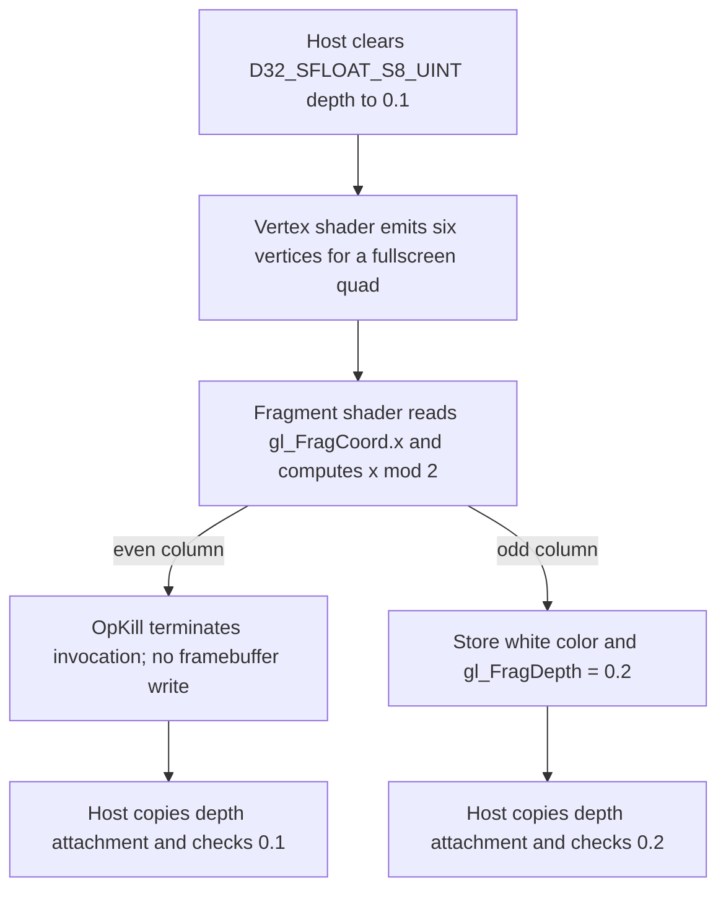

## Overview

**Core question:** When a fragment invocation is terminated or demoted to a helper invocation after the shader has already set up a depth or stencil write, does the implementation suppress that write so it does not reach the depth/stencil attachment?

- This page covers the `depth_stencil_write_conditions` test family in [`vktRenderPassDepthStencilWriteConditionsTests.cpp`](../../../modules/vulkan/renderpass/vktRenderPassDepthStencilWriteConditionsTests.cpp). The family is created by [`createDepthStencilWriteConditionsTests()`](../../../modules/vulkan/renderpass/vktRenderPassDepthStencilWriteConditionsTests.cpp#L587) and attached directly under `renderpasses.renderpass1` ([dispatcher attach](../../../modules/vulkan/renderpass/vktRenderPassTests.cpp#L8499)).
- It registers 54 test case leaves that combine a depth or stencil target with one of three fragment-discard mechanisms (`OpKill`, `OpTerminateInvocation`, `OpDemoteToHelperInvocation`) and one of three output initialization states (`WRITE`, `INITIALIZE`, `INITIALIZE_WRITE`).
- The core idea is that a fragment shader conditionally discards every even-column fragment before writing depth or stencil, then the test reads back the depth/stencil attachment and checks that discarded invocations left the cleared value intact while non-discarded invocations wrote the shader value.
- The three discard mechanisms exercise `VK_EXT_shader_demote_to_helper_invocation`, `VK_KHR_shader_terminate_invocation`, and `VK_EXT_shader_stencil_export`, because stencil writes require the stencil export capability.

## Background Knowledge

- **Helper invocation.** A fragment shader invocation becomes a helper invocation when its samples are dropped by the rasterizer or when the shader explicitly demotes it. Helper invocations have no side effects on the framebuffer: they do not write color, depth, or stencil. The Vulkan specification states that terminating a fragment shader invocation or demoting it to a helper invocation via `OpKill`, `OpTerminateInvocation`, or `OpDemoteToHelperInvocation` zeroes the coverage mask bits for the affected samples ([fragops.adoc, Shader Termination and Demotion](../../../../vulkan-docs/src/chapters/fragops.adoc)). With zero coverage, the per-fragment coverage reduction step produces no covered samples, so the depth/stencil write that depends on coverage does not occur.
- **Three discard mechanisms.** `OpKill` is the legacy GLSL `discard` instruction. `OpTerminateInvocation` (`VK_KHR_shader_terminate_invocation`) terminates the invocation immediately. `OpDemoteToHelperInvocation` (`VK_EXT_shader_demote_to_helper_invocation`) demotes the invocation to a helper but allows it to continue executing, with subsequent framebuffer writes suppressed. All three result in helper-invocation status for framebuffer-write purposes, which is the property this test family checks.
- **Depth-replacing and stencil-export.** A fragment shader that writes `gl_FragDepth` must declare the `DepthReplacing` execution mode. A fragment shader that writes `gl_FragStencilRefEXT` requires the `StencilExportEXT` capability from `VK_EXT_shader_stencil_export`. The test uses both paths to cover depth writes and stencil writes under the same discard conditions.

## Registration Hierarchy

```text
renderpasses.renderpass1.depth_stencil_write_conditions
├── depth_kill_write_d32sf_s8ui
├── depth_demote_initialize_d24_unorm
├── stencil_terminate_initialize_d24unorm_s8ui
├── depth_terminate_write_d32sf
├── stencil_kill_write_initialize_d32sf_s8ui
└── depth_demote_initialize_d24unorm_s8ui
```

The tree shows six representative leaves out of the 54 registered. The full matrix is generated by the registration loop, which iterates four depth formats and two stencil formats across all three discard types and three mutation modes ([registration loop](../../../modules/vulkan/renderpass/vktRenderPassDepthStencilWriteConditionsTests.cpp#L595-L668)). The family is registered only under `renderpass1` and is guarded out for VulkanSC by `#ifndef CTS_USES_VULKANSC` ([guard](../../../modules/vulkan/renderpass/vktRenderPassTests.cpp#L8497-L8500)). It is not registered under `renderpass2` or `dynamic_rendering` because it does not route through the `suballocation`/`dedicated_allocation` intermediate nodes.

## Parameter Dimensions and Observed Values

| Dimension | Registered values | Meaning in this test | Evidence |
|-----------|-------------------|----------------------|----------|
| Buffer target | DEPTH, STENCIL | Selects whether the shader writes `gl_FragDepth` or `gl_FragStencilRefEXT`, and whether the depth test or stencil test is enabled on the pipeline. | [BufferType enum](../../../modules/vulkan/renderpass/vktRenderPassDepthStencilWriteConditionsTests.cpp#L63-L67) |
| Discard mechanism | KILL (`OpKill`), TERMINATE (`OpTerminateInvocation`), DEMOTE (`OpDemoteToHelperInvocation`) | The SPIR-V instruction used to discard the even-column fragment. Each maps to a different extension or core path. | [DiscardType enum](../../../modules/vulkan/renderpass/vktRenderPassDepthStencilWriteConditionsTests.cpp#L56-L61) |
| Output mutation mode | WRITE, INITIALIZE, INITIALIZE_WRITE | Whether the `gl_FragDepth` / `gl_FragStencilRefEXT` output variable is declared without an initializer, with an initial value, or with an initial value that is then overwritten by a store. This distinguishes a plain store from an initialized output that a helper invocation might or might not commit. | [MutationMode enum](../../../modules/vulkan/renderpass/vktRenderPassDepthStencilWriteConditionsTests.cpp#L69-L74) |
| Depth formats | `D32_SFLOAT_S8_UINT`, `D24_UNORM_S8_UINT`, `X8_D24_UNORM_PACK32`, `D32_SFLOAT` | The four depth attachment formats the depth-target leaves cycle through. `D32_SFLOAT` has no stencil aspect. | [depthFormats array](../../../modules/vulkan/renderpass/vktRenderPassDepthStencilWriteConditionsTests.cpp#L591-L592) |
| Stencil formats | `D32_SFLOAT_S8_UINT`, `D24_UNORM_S8_UINT` | The two combined depth/stencil formats the stencil-target leaves cycle through, since stencil requires a stencil aspect. | [stencilFormats array](../../../modules/vulkan/renderpass/vktRenderPassDepthStencilWriteConditionsTests.cpp#L593) |

## Behavior Parameters

The primary behavioral axis is the discard mechanism. Each value tests a different path by which a fragment invocation becomes a helper invocation, and all three must suppress the depth or stencil write identically.

The buffer target and output mutation mode are secondary axes: they change what is being written and how the output variable is declared, but the pass/fail condition is the same coverage-based suppression in every case.

### KILL: `OpKill`

The fragment shader emits `OpKill` for even-column fragments (`int(gl_FragCoord.x) % 2 == 0`). `OpKill` is the core SPIR-V equivalent of GLSL `discard` and requires no extension. The shader is built directly in SPIR-V assembly so that the three discard instructions can be swapped without relying on a GLSL frontend ([shader construction](../../../modules/vulkan/renderpass/vktRenderPassDepthStencilWriteConditionsTests.cpp#L456-L548)).

### TERMINATE: `OpTerminateInvocation`

The shader emits `OpTerminateInvocation` for even-column fragments. This requires the `SPV_KHR_terminate_invocation` extension and the `VK_KHR_shader_terminate_invocation` device feature. Unlike `OpDemoteToHelperInvocation`, termination stops further shader execution, but the coverage-suppression effect is the same.

### DEMOTE: `OpDemoteToHelperInvocation`

The shader emits `OpDemoteToHelperInvocationEXT` for even-column fragments, then continues executing to the depth or stencil store. This requires the `SPV_EXT_demote_to_helper_invocation` extension and the `VK_EXT_shader_demote_to_helper_invocation` device feature. The demoted invocation's framebuffer writes are suppressed by coverage, which is the central property the test verifies.

## Shader Analysis

### Representative Shader Walkthrough 1

#### Parameter Values Chosen

Representative path:

```text
dEQP-VK.renderpasses.renderpass1.depth_stencil_write_conditions.depth_kill_write_d32sf_s8ui
```

mustpass: [renderpasses.txt#L35866](../../../mustpass/main/vk-default/renderpasses.txt#L35866).

| Parameter choice | Meaning in this representative case |
|------------------|-------------------------------------|
| `depth` | The fragment output is decorated as `FragDepth`; the pipeline enables depth testing and depth writes. |
| `kill` | Even-column fragment invocations execute `OpKill`, testing suppression of depth writes after termination. |
| `write` | The depth output has no initializer; the surviving path explicitly stores `0.2`. |
| `d32sf_s8ui` | The depth/stencil attachment uses `VK_FORMAT_D32_SFLOAT_S8_UINT`; this depth case does not write its stencil aspect. |

#### Purpose

Show that an invocation terminated by `OpKill` cannot commit a depth write, while a surviving invocation writes the explicit
`0.2` depth value. The color store is only a visibility aid; the pass/fail signal is the depth attachment readback.

#### Structural Design



#### Shader Code

##### Vertex Shader

```glsl
#version 450
layout(location = 0) in highp vec4 a_position;

/// The host supplies six positions for two triangles covering the 64x64 render area.
/// No stage-to-stage varying is needed: the fragment stage uses only built-in FragCoord.
void main (void) {
    gl_Position = a_position;
}
```

##### Fragment Shader

This CTS fragment stage is generated directly as SPIR-V assembly and does not use GLSL or HLSL source. The complete
source-generated fragment module is kept only in the final `#### SPIR-V` subsection so the selected discard opcode remains exact.

The fragment dataflow is deliberately small: `FragCoord.x` is converted to signed integer and reduced modulo two; zero
branches to `OpKill`, while the merge block stores white to color and `0.2` to `FragDepth`. `DepthReplacing` makes the depth
output the fragment depth value. The source assembly also declares `FragCoord`, color location 0, and `FragDepth` in the entry
point interface, with no descriptors or push constants.

#### Additional Info

- The host creates a 64x64 color attachment and a selected-format depth/stencil attachment, clears depth to `0.1`, enables
  depth test/write with `VK_COMPARE_OP_GREATER`, and copies the depth/stencil image to a host-visible buffer for verification
  ([iteration and clear setup](../../../modules/vulkan/renderpass/vktRenderPassDepthStencilWriteConditionsTests.cpp#L169-L319),
  [depth/stencil state](../../../modules/vulkan/renderpass/vktRenderPassDepthStencilWriteConditionsTests.cpp#L285-L300)).
- The vertex shader is fixed across the family; the fragment stage is the material shader because its selected termination
  instruction and output mutation mode define which invocation reaches the depth/stencil output
  ([program generation](../../../modules/vulkan/renderpass/vktRenderPassDepthStencilWriteConditionsTests.cpp#L404-L549)).
- The chosen case uses the `WRITE` mutation mode, so the `FragDepth` variable is declared without an initializer. The
  `INITIALIZE` and `INITIALIZE_WRITE` variants instead initialize it to `0.2` and optionally perform the same explicit store.

#### Parameter Variation Summary

| Parameter dimension | Shader-level variation from this shader | Evidence |
|---------------------|----------------------------------------|----------|
| Discard mechanism | `KILL` emits `OpKill`; `TERMINATE` emits `OpTerminateInvocation` and requires `SPV_KHR_terminate_invocation`; `DEMOTE` emits `OpDemoteToHelperInvocationEXT`, then branches to the merge block so later stores are reached but framebuffer effects remain suppressed. | [discard command selection](../../../modules/vulkan/renderpass/vktRenderPassDepthStencilWriteConditionsTests.cpp#L434-L448) |
| Buffer target | `DEPTH` declares `FragDepth` and `DepthReplacing`; `STENCIL` declares `FragStencilRefEXT`, adds `StencilExportEXT`, and uses an integer output. | [output decorations and execution mode](../../../modules/vulkan/renderpass/vktRenderPassDepthStencilWriteConditionsTests.cpp#L450-L474) |
| Mutation mode | `WRITE` declares an uninitialized output and stores the target value; `INITIALIZE` declares the initial value without an explicit store; `INITIALIZE_WRITE` combines the initializer and store. | [output variable generation](../../../modules/vulkan/renderpass/vktRenderPassDepthStencilWriteConditionsTests.cpp#L492-L523), [store selection](../../../modules/vulkan/renderpass/vktRenderPassDepthStencilWriteConditionsTests.cpp#L541-L542) |
| Attachment format | Depth cases use `D32_SFLOAT_S8_UINT`, `D24_UNORM_S8_UINT`, `X8_D24_UNORM_PACK32`, or `D32_SFLOAT`; stencil cases use the two formats with a stencil aspect. | [registration matrix](../../../modules/vulkan/renderpass/vktRenderPassDepthStencilWriteConditionsTests.cpp#L591-L668) |

#### SPIR-V

##### Vertex Shader

- Status: generated and validated
- Source: reconstructed `GLSL` from this walkthrough
- Stage: `vert`
- Target SPIRV version: `spirv1.0`

<details>
<summary>Click to expand SPIRV asm code</summary>

```llvm
; SPIR-V
; Version: 1.0
; Generator: Khronos Glslang Reference Front End; 11
; Bound: 21
; Schema: 0
               OpCapability Shader
          %1 = OpExtInstImport "GLSL.std.450"
               OpMemoryModel Logical GLSL450
               OpEntryPoint Vertex %main "main" %_ %a_position
               OpSource GLSL 450
               OpName %main "main"
               OpName %gl_PerVertex "gl_PerVertex"
               OpMemberName %gl_PerVertex 0 "gl_Position"
               OpMemberName %gl_PerVertex 1 "gl_PointSize"
               OpMemberName %gl_PerVertex 2 "gl_ClipDistance"
               OpMemberName %gl_PerVertex 3 "gl_CullDistance"
               OpName %_ ""
               OpName %a_position "a_position"
               OpDecorate %gl_PerVertex Block
               OpMemberDecorate %gl_PerVertex 0 BuiltIn Position
               OpMemberDecorate %gl_PerVertex 1 BuiltIn PointSize
               OpMemberDecorate %gl_PerVertex 2 BuiltIn ClipDistance
               OpMemberDecorate %gl_PerVertex 3 BuiltIn CullDistance
               OpDecorate %a_position Location 0
       %void = OpTypeVoid
          %3 = OpTypeFunction %void
      %float = OpTypeFloat 32
    %v4float = OpTypeVector %float 4
       %uint = OpTypeInt 32 0
     %uint_1 = OpConstant %uint 1
%_arr_float_uint_1 = OpTypeArray %float %uint_1
%gl_PerVertex = OpTypeStruct %v4float %float %_arr_float_uint_1 %_arr_float_uint_1
%_ptr_Output_gl_PerVertex = OpTypePointer Output %gl_PerVertex
          %_ = OpVariable %_ptr_Output_gl_PerVertex Output
        %int = OpTypeInt 32 1
      %int_0 = OpConstant %int 0
%_ptr_Input_v4float = OpTypePointer Input %v4float
 %a_position = OpVariable %_ptr_Input_v4float Input
%_ptr_Output_v4float = OpTypePointer Output %v4float
       %main = OpFunction %void None %3
          %5 = OpLabel
         %18 = OpLoad %v4float %a_position
         %20 = OpAccessChain %_ptr_Output_v4float %_ %int_0
               OpStore %20 %18
               OpReturn
               OpFunctionEnd
```

</details>

##### Fragment Shader

- Status: generated and validated
- Source: source-generated `SPIR-V assembly` from this walkthrough
- Stage: `frag`
- Target SPIRV version: `spirv1.0`

<details>
<summary>Click to expand SPIRV asm code</summary>

```llvm
; SPIR-V
; Version: 1.0
; Generator: Khronos SPIR-V Tools Assembler; 0
; Bound: 31
; Schema: 0
               OpCapability Shader
          %1 = OpExtInstImport "GLSL.std.450"
               OpMemoryModel Logical GLSL450
               OpEntryPoint Fragment %2 "main" %gl_FragCoord %4 %gl_FragDepth
               OpExecutionMode %2 OriginUpperLeft
               OpExecutionMode %2 DepthReplacing
               OpDecorate %gl_FragCoord BuiltIn FragCoord
               OpDecorate %4 Location 0
               OpDecorate %gl_FragDepth BuiltIn FragDepth
       %void = OpTypeVoid
          %7 = OpTypeFunction %void
      %float = OpTypeFloat 32
    %v4float = OpTypeVector %float 4
%_ptr_Input_v4float = OpTypePointer Input %v4float
%gl_FragCoord = OpVariable %_ptr_Input_v4float Input
       %uint = OpTypeInt 32 0
     %uint_0 = OpConstant %uint 0
%_ptr_Input_float = OpTypePointer Input %float
        %int = OpTypeInt 32 1
      %int_2 = OpConstant %int 2
      %int_0 = OpConstant %int 0
       %bool = OpTypeBool
%_ptr_Output_v4float = OpTypePointer Output %v4float
          %4 = OpVariable %_ptr_Output_v4float Output
    %float_1 = OpConstant %float 1
         %20 = OpConstantComposite %v4float %float_1 %float_1 %float_1 %float_1
%_ptr_Output_float = OpTypePointer Output %float
%gl_FragDepth = OpVariable %_ptr_Output_float Output
%float_0_200000003 = OpConstant %float 0.200000003
          %2 = OpFunction %void None %7
         %23 = OpLabel
         %24 = OpAccessChain %_ptr_Input_float %gl_FragCoord %uint_0
         %25 = OpLoad %float %24
         %26 = OpConvertFToS %int %25
         %27 = OpSMod %int %26 %int_2
         %28 = OpIEqual %bool %27 %int_0
               OpSelectionMerge %29 None
               OpBranchConditional %28 %30 %29
         %30 = OpLabel
               OpKill
         %29 = OpLabel
               OpStore %4 %20
               OpStore %gl_FragDepth %float_0_200000003
               OpReturn
               OpFunctionEnd

```

</details>

## Runtime Execution and Result Checking

Each test case builds a render pass with one color attachment (`R8G8B8A8_UNORM`) and one depth/stencil attachment in the selected format. The depth/stencil attachment is cleared to depth `0.1` and stencil `0` ([clear values](../../../modules/vulkan/renderpass/vktRenderPassDepthStencilWriteConditionsTests.cpp#L316-L319)). The pipeline enables the depth test or the stencil test depending on the buffer target, with depth write enabled and a `GREATER` compare op, or stencil configured to replace on `GREATER` ([depth/stencil state](../../../modules/vulkan/renderpass/vktRenderPassDepthStencilWriteConditionsTests.cpp#L285-L300)).

The test draws the full-screen quad, ends the render pass, and copies the depth/stencil attachment back to a host-visible buffer. Verification is per-pixel over the 64x64 render area ([verification loop](../../../modules/vulkan/renderpass/vktRenderPassDepthStencilWriteConditionsTests.cpp#L349-L368)):

- For DEPTH: even-column pixels (discarded) must retain the cleared depth `0.1`, and odd-column pixels (not discarded) must have the shader-written depth `0.2`. The comparison tolerates a small range around each target (`0.09`-`0.11` and `0.19`-`0.21`).
- For STENCIL: even-column pixels must retain the cleared stencil `0`, and odd-column pixels must have the shader-written stencil reference `1`. The check compares each pixel against `x % 2`.

A mismatch means a discarded invocation's depth or stencil write reached the attachment despite the invocation being a helper invocation.

## Failure Meaning

### Failure Cause Mapping

| If this behavior parameter value fails | Possible failure cause(s) |
|----------------------------------------|---------------------------|
| KILL leaves | An `OpKill`-discarded fragment still produced a depth or stencil write, meaning the coverage-zeroing effect of termination was not applied to the depth/stencil output. |
| TERMINATE leaves | An `OpTerminateInvocation`-terminated fragment still produced a depth or stencil write, meaning the `VK_KHR_shader_terminate_invocation` path did not suppress coverage identically to `OpKill`. |
| DEMOTE leaves | A demoted fragment still produced a depth or stencil write, meaning the `VK_EXT_shader_demote_to_helper_invocation` demotion did not zero the coverage mask before depth/stencil output commit. |
| STENCIL leaves only | The stencil-export write path committed the reference value from a helper invocation, or `VK_EXT_shader_stencil_export` interacted incorrectly with demotion or termination. |
| INITIALIZE / INITIALIZE_WRITE leaves | The output variable's declared initial value was committed to the attachment from a helper invocation even when the store instruction on the non-discarded path was never reached. |
| Any leaf (common cause) | Clear value, format support, image layout transition, or copyback produced the wrong attachment contents independent of the discard mechanism. |

### Cause Analysis

#### Discarded fragment wrote depth or stencil

**Possible failure symptoms:** Even-column pixels (where `x % 2 == 0`) show the shader-written depth `0.2` or stencil reference instead of the cleared `0.1` or `0`. The odd-column pixels are correct, so only the discarded-invocation path is wrong.

**Possible implementation causes:** The Vulkan specification zeroes the coverage mask when a fragment shader invocation is terminated or demoted to a helper invocation ([fragops.adoc, Shader Termination and Demotion](../../../../vulkan-docs/src/chapters/fragops.adoc)). A driver that commits the depth or stencil output before applying the coverage mask, or that treats `OpDemoteToHelperInvocation` as a no-op for depth/stencil writes, can produce this symptom. The three discard mechanisms exist precisely because they reach helper-invocation status through different code paths, so a failure on only one of the three points to that specific lowering rather than a shared coverage-reduction bug.

#### Initialized output value committed from a helper invocation

**Possible failure symptoms:** Even-column pixels show the output variable's declared initial value (`0.2` depth or the initial stencil reference) rather than the cleared value, but only for `INITIALIZE` and `INITIALIZE_WRITE` leaves. The `WRITE` leaves pass because the output variable has no initial value.

**Possible implementation causes:** The SPIR-V output variable for depth or stencil can be declared with an initializer that provides a default value. If the implementation commits that initial value to the attachment before checking whether the invocation is a helper invocation, a demoted or terminated invocation would still write the default. Source-level investigation is needed to determine whether the driver initializes the depth/stencil output from the variable initializer before or after coverage reduction.

## Case Pruning

### Requirement-based pruning

- The DEMOTE leaves require `VK_EXT_shader_demote_to_helper_invocation` ([checkSupport](../../../modules/vulkan/renderpass/vktRenderPassDepthStencilWriteConditionsTests.cpp#L553-L554)).
- The TERMINATE leaves require `VK_KHR_shader_terminate_invocation` ([checkSupport](../../../modules/vulkan/renderpass/vktRenderPassDepthStencilWriteConditionsTests.cpp#L555-L556)).
- The STENCIL leaves require `VK_EXT_shader_stencil_export` ([checkSupport](../../../modules/vulkan/renderpass/vktRenderPassDepthStencilWriteConditionsTests.cpp#L557-L558)).
- Every leaf checks `getPhysicalDeviceImageFormatProperties` for the selected depth/stencil format with `DEPTH_STENCIL_ATTACHMENT_BIT | TRANSFER_SRC_BIT` usage and throws `NotSupportedError` if the format is unsupported ([format support check](../../../modules/vulkan/renderpass/vktRenderPassDepthStencilWriteConditionsTests.cpp#L568-L577)).

### Design-based pruning

- The family is registered only under `renderpass1` and is excluded from VulkanSC builds. It does not route through the `renderpass2` or `dynamic_rendering` variants because it tests a per-fragment property that is independent of the render pass construction API.
- The `X8_D24_UNORM_PACK32` and `D32_SFLOAT` depth formats appear only in the DEPTH leaves, because they have no stencil aspect and therefore cannot host a stencil write.

## Key Takeaways

- The test verifies one property across three discard mechanisms: a fragment invocation that becomes a helper invocation must not commit its depth or stencil write.
- The three mechanisms (`OpKill`, `OpTerminateInvocation`, `OpDemoteToHelperInvocation`) exist as separate leaves so a regression in one extension's lowering is visible independently of the core `discard` path.
- The output mutation mode (`WRITE` vs `INITIALIZE` vs `INITIALIZE_WRITE`) probes whether the depth or stencil output variable's declared initial value is also suppressed for helper invocations, not just the explicit store.
- The stencil path adds `VK_EXT_shader_stencil_export` coverage, exercising the same suppression property against a different framebuffer output.
- See [Failure Meaning](#failure-meaning) for how each discard mechanism and output mode maps to a distinct failure symptom.

## Source Reference Appendix

| Entry point | Link | Why it matters |
|-------------|------|----------------|
| Test family factory | [`createDepthStencilWriteConditionsTests`](../../../modules/vulkan/renderpass/vktRenderPassDepthStencilWriteConditionsTests.cpp#L587-L671) | Creates the group and generates all 54 leaves from the buffer, discard, mutation, and format matrix. |
| Dispatcher attach | [`vktRenderPassTests.cpp#L8499`](../../../modules/vulkan/renderpass/vktRenderPassTests.cpp#L8499) | Attaches the group directly under `renderpasses.renderpass1`, inside the `CTS_USES_VULKANSC` guard. |
| Iteration and verification | [`DepthStencilWriteConditionsInstance::iterate`](../../../modules/vulkan/renderpass/vktRenderPassDepthStencilWriteConditionsTests.cpp#L169-L371) | Builds resources, records the draw, reads back the depth/stencil attachment, and runs the per-pixel check. |
| Shader generation | [`DepthStencilWriteConditionsTest::initPrograms`](../../../modules/vulkan/renderpass/vktRenderPassDepthStencilWriteConditionsTests.cpp#L404-L549) | Emits the SPIR-V fragment shader with the selected discard instruction, output variable initializer, and depth or stencil output decoration. |
| Support checks | [`DepthStencilWriteConditionsTest::checkSupport`](../../../modules/vulkan/renderpass/vktRenderPassDepthStencilWriteConditionsTests.cpp#L551-L578) | Requires the demote, terminate, and stencil-export extensions as applicable, plus format support. |
| Depth/stencil pipeline state | [depthStencilCreateInfo](../../../modules/vulkan/renderpass/vktRenderPassDepthStencilWriteConditionsTests.cpp#L285-L300) | Enables depth or stencil test with write and `GREATER` compare, controlling which attachment the shader output targets. |
| Vulkan spec: shader termination and demotion | [fragops.adoc](../../../../vulkan-docs/src/chapters/fragops.adoc) | Defines that `OpKill`, `OpTerminateInvocation`, and `OpDemoteToHelperInvocation` zero the coverage mask for affected samples. |
