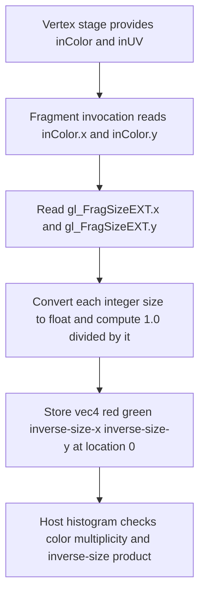

## Overview

**Core question:** When a render pass instance attaches a fragment density map that specifies per-region fragment invocation density, does the implementation invoke the fragment shader the correct number of times per framebuffer region and broadcast the results to the expected pixels?

- This page covers the `fragment_density_map` test family in [`vktRenderPassFragmentDensityMapTests.cpp`](../../../modules/vulkan/renderpass/vktRenderPassFragmentDensityMapTests.cpp). The family is created by [`createFragmentDensityMapTests()`](../../../modules/vulkan/renderpass/vktRenderPassFragmentDensityMapTests.cpp#L5482-L5488) and attached under each rendering variant root (`renderpass1`, `renderpass2`, `dynamic_rendering`) at the rendering-type level, monolithic pipeline only.
- It registers across `VK_EXT_fragment_density_map`, `VK_EXT_fragment_density_map2`, and `VK_EXT_fragment_density_map_offset` (or the Qualcomm variant), exercising static, deferred, and dynamic density maps with subsampled and non-subsampled images, multiple view counts, sample counts, fragment areas, size ratios, and offset behaviors.
- The core idea is to render a known pattern into a framebuffer whose density map specifies one fragment area, then read back the framebuffer and verify that the color histogram matches the expected fragment-shader invocation distribution for that density. The histogram of each rendered image is the pass/fail signal.
- The family is large because density maps interact with multiview, sample counts, subsampled images, render-pass copy semantics, framebuffer offsets, and a spec-version-3 texel-size formula, and each interaction has its own parameter matrix.

## Background Knowledge

- **Fragment density map.** A fragment density map is an attachment whose texels specify the rate at which the fragment shader is invoked across the framebuffer. Each texel covers a region of the framebuffer, and its normalized (x, y) density values determine how many fragment shader invocations run in that region. The invoked fragments are broadcast to the pixels in the region. This lets an application reduce fragment work in areas where lower quality is acceptable, such as the periphery of a lens-distorted image ([VK_EXT_fragment_density_map.adoc](../../../../vulkan-docs/src/appendices/VK_EXT_fragment_density_map.adoc)).
- **Fragment area.** The fragment area is the framebuffer region covered by one fragment shader invocation. A density map texel value of `1.0` on an axis means one fragment per pixel on that axis (full density); a value of `0.5` means one fragment per two pixels. The test uses fragment areas `{1,2}`, `{2,1}`, and `{2,2}` to exercise the three density shapes.
- **Subsampled images.** `VK_EXT_fragment_density_map2` introduces subsampled images, which are storage-optimized for use with density maps. A subsampled sampler reads from a subsampled image at a rate matching the density, and subsampled loads and coarse reconstruction are additional capabilities this extension adds.
- **Deferred and dynamic density maps.** A deferred density map is written by the device during one render pass and consumed by a later render pass, reducing host-side density-map updates. A dynamic density map is updated by the host or device between render passes. The test exercises all three update modes (static, deferred, dynamic) because they exercise different density-map lifecycles.
- **Density-map offset.** `VK_EXT_fragment_density_map_offset` (or `VK_QCOM_fragment_density_map_offset`) lets an application shift the alignment of density-map texels relative to the framebuffer. The offset tests verify oversized FDM behavior, minimum shift by granularity, and clamp-to-edge semantics.

## Registration Hierarchy

```text
renderpasses.renderpass1.fragment_density_map
├── 1_view
├── depth_format
└── properties
```

The tree shows the three children present under `renderpass1`. The same family is registered under `renderpass2` and under each `dynamic_rendering.*.fragment_density_map` root, where it additionally includes multiview children (`2_views`, `4_views`, `6_views`), the `offset` subgroup (guarded to non-legacy rendering types), and the `density_formula` subgroup added under each view group for spec-version-3 formula verification. Multiview is not supported under the legacy render pass path, so `renderpass1` has only `1_view` ([view-count guard](../../../modules/vulkan/renderpass/vktRenderPassFragmentDensityMapTests.cpp#L4978-L4980)). The `offset` group is added only when `renderingType != RENDERING_TYPE_RENDERPASS_LEGACY` ([offset guard](../../../modules/vulkan/renderpass/vktRenderPassFragmentDensityMapTests.cpp#L5362-L5364)).

## Parameter Dimensions and Observed Values

| Dimension | Registered values | Meaning in this test | Evidence |
|-----------|-------------------|----------------------|----------|
| View count | `1`, `2`, `4`, `6` | Number of multiview views. Only `1` is present under `renderpass1`; the rest appear under `renderpass2` and `dynamic_rendering`. | [views array](../../../modules/vulkan/renderpass/vktRenderPassFragmentDensityMapTests.cpp#L4958-L4965) |
| Render type | `render`, `render_copy` | `render` renders directly to the target; `render_copy` renders to an intermediate image and copies it, exercising the density-map copy path. | [renders array](../../../modules/vulkan/renderpass/vktRenderPassFragmentDensityMapTests.cpp#L4967) |
| Size ratio | `divisible_density_size` (4.0), `non_divisible_density_size` (3.75) | The framebuffer-to-density-map size ratio. A non-integer ratio exercises rounding of density-map texel boundaries. | [sizes array](../../../modules/vulkan/renderpass/vktRenderPassFragmentDensityMapTests.cpp#L4969-L4972) |
| Sample count | `1`, `2`, `4`, `8` | Multisample count of the color attachment. Higher sample counts interact with density-map fragment broadcasting. | [samples array](../../../modules/vulkan/renderpass/vktRenderPassFragmentDensityMapTests.cpp#L4974-L4978) |
| Fragment area | `{1,2}`, `{2,1}`, `{2,2}` | The per-texel fragment invocation shape written into the density map. Drives the expected histogram. | [fragmentArea](../../../modules/vulkan/renderpass/vktRenderPassFragmentDensityMapTests.cpp#L4983) |
| Density map mode | static, deferred, dynamic; subsampled or non-subsampled | How and when the density map is populated, and whether the target image is subsampled. | [test name construction](../../../modules/vulkan/renderpass/vktRenderPassFragmentDensityMapTests.cpp#L5028-L5100) |
| Depth formats | `D16_UNORM`, `D32_SFLOAT`, `D24_UNORM_S8_UINT` | The `depth_format` subgroup uses deferred density maps with depth enabled to cover depth-specific density behavior. | [depthFormats array](../../../modules/vulkan/renderpass/vktRenderPassFragmentDensityMapTests.cpp#L5162-L5165) |

## Behavior Parameters

The primary behavioral axis is the density-map mode (static, deferred, dynamic) combined with subsampled vs non-subsampled targets. Each combination produces a different expected color histogram because the fragment invocation distribution depends on the fragment area and the density-map lifecycle.

The secondary axes configure how many views, samples, and which size ratio and fragment area the test uses. These do not change what is being tested (the density-map-driven invocation distribution) but they stress the implementation across the legal parameter space.

### Static, deferred, and dynamic density maps

Static density maps are populated before the render pass and do not change. Deferred density maps are written by the device in a prior render pass and consumed later, which tests the device-side density-map commit path. Dynamic density maps are updated between render passes, testing the host-device density-map synchronization. All three must produce the same invocation distribution for the same fragment area.

### Subsampled images

Subsampled images require `VK_EXT_fragment_density_map2` and pair with subsampled samplers. The `properties` subgroup includes `2_subsampled_samplers`, `4_subsampled_samplers`, `6_subsampled_samplers`, `8_subsampled_samplers` (subsampled sampler counts), `subsampled_loads` (subsampled image load operations), and `subsampled_coarse_reconstruction` (coarse reconstruction with subsampled images).

### Density-map offsets

The `offset` subgroup covers `oversized_fdm` (oversized density map with horizontal and vertical offsets, including multiview, suspend/resume, and extra-large variants), `min_shift` (minimum shift by granularity), and `clamp_to_edge` (clamp-to-edge behavior). Each iterates offset direction, multiview, and suspend/resume under dynamic rendering.

### Density formula verification

The `density_formula` subgroup verifies the texel-size formula `2^ceil(log2(floor(framebufferSize / densityMapSize)))` introduced in `VK_EXT_fragment_density_map` spec version 3. It uses a `renderMultiplier` of `33.0/16.0` with a `{16,16}` density map and `{4,4}` fragment area, with static, deferred, and dynamic subsampled variants ([formula test params](../../../modules/vulkan/renderpass/vktRenderPassFragmentDensityMapTests.cpp#L5114-L5155)).

## Shader Analysis

The representative case uses the generated `frag_produce_subsampled` fragment stage from `FragmentDensityMapTest::initPrograms()`. The shader is a diagnostic observer: the fragment-density-map machinery controls invocation frequency and broadcast, while this stage exposes the selected fragment size in the output color. The generated vertex stage supplies the matching `inUV`/`inColor` interface; it is unchanged for this fragment-stage analysis.

### Representative Shader Walkthrough 1

#### Parameter Values Chosen

Representative path:

```text
dEQP-VK.renderpasses.renderpass1.fragment_density_map.1_view.render.divisible_density_size.1_sample.static_nonsubsampled_2_2
```

Mustpass: [`renderpasses.txt#L36009`](../../../mustpass/main/vk-default/renderpasses.txt#L36009).

| Parameter choice | Meaning in this representative case |
|------------------|-------------------------------------|
| `1_view` | One view uses the ordinary fragment input/output interface; multiview routing is not needed for this leaf. |
| `render` | The density-map-produced color image is rendered directly rather than copied through the `render_copy` path. |
| `divisible_density_size` | The framebuffer-to-density-map ratio is the divisible `4.0` case, so density-map texel coverage is not exercising non-divisible rounding. |
| `1_sample` | The color attachment is single-sampled, isolating fragment-density behavior from multisample interactions. |
| `static_nonsubsampled_2_2` | The host-populated map is consumed without the subsampled-image path; the map's fragment area is `{2,2}`, which should make each fragment result cover four pixels. |

#### Purpose

The fragment shader writes the interpolated red/green pattern together with the inverse `gl_FragSizeEXT` components. The host can therefore check both that the implementation reports the requested fragment area and that each shader result is broadcast to the expected number of framebuffer pixels.

#### Structural Design



#### Shader Code

Reconstructed from the exact `frag_produce_subsampled` source emitted by [`FragmentDensityMapTest::initPrograms()`](../../../modules/vulkan/renderpass/vktRenderPassFragmentDensityMapTests.cpp#L1371-L1413).

```glsl
#version 450
#extension GL_EXT_fragment_invocation_density : enable
#extension GL_EXT_multiview : enable

/// Location 0 is the interpolated UV interface shared with the generated vertex stage.
/// This diagnostic fragment stage declares it for pipeline interface compatibility but does not read it.
layout(location = 0) in vec4 inUV;

/// Location 1 carries the vertex-generated color pattern. The host later groups complete output colors
/// in a histogram, so the red/green values identify the source pattern while z/w identify fragment size.
layout(location = 1) in vec4 inColor;

/// Location 0 is the color attachment written by each fragment invocation.
layout(location = 0) out vec4 fragColor;

void main(void)
{
    /// gl_FragSizeEXT is the fragment area selected by the active fragment density map.
    /// Its inverse is written per axis so verifyImage() can detect an invalid reported area.
    fragColor = vec4(inColor.x, inColor.y,
                     1.0 / float(gl_FragSizeEXT.x),
                     1.0 / float(gl_FragSizeEXT.y));
}
```

#### Additional Info

- The `GL_EXT_multiview` extension is emitted in this common fragment source even for the one-view representative; view-count-specific routing is supplied by the vertex-side path when multiview cases are selected ([source](../../../modules/vulkan/renderpass/vktRenderPassFragmentDensityMapTests.cpp#L1371-L1388)).
- `gl_FragSizeEXT` is a flat two-component integer input in the compiled interface. For the selected `{2,2}` fragment area, the expected diagnostic components are `0.5` and `0.5`, whose product is `0.25` ([fragment-area setup](../../../modules/vulkan/renderpass/vktRenderPassFragmentDensityMapTests.cpp#L4981-L4983); [verification](../../../modules/vulkan/renderpass/vktRenderPassFragmentDensityMapTests.cpp#L3130-L3172)).

#### Parameter Variation Summary

| Parameter dimension | Shader-level variation from this shader | Evidence |
|---------------------|---------------------------------------|----------|
| `fragmentArea` | Changes the two `gl_FragSizeEXT` values consumed by the same shader; the source expression is unchanged, while the output z/w values and expected broadcast multiplicity change. | [`TestParams::fragmentArea`](../../../modules/vulkan/renderpass/vktRenderPassFragmentDensityMapTests.cpp#L4981-L4983) |
| View count | The common fragment source remains the same; multiview cases change the vertex-side viewport/layer routing and multiply the expected histogram count by the view count. | [`multiViewport` branch](../../../modules/vulkan/renderpass/vktRenderPassFragmentDensityMapTests.cpp#L1387-L1395); [`verifyImage`](../../../modules/vulkan/renderpass/vktRenderPassFragmentDensityMapTests.cpp#L3149-L3155) |
| Density-map mode and subsampling | `static`, `deferred`, and `dynamic`, plus subsampled/non-subsampled variants, reuse this producer shader; they vary map lifecycle and later image handling rather than its GLSL body. | [`initPrograms`](../../../modules/vulkan/renderpass/vktRenderPassFragmentDensityMapTests.cpp#L1371-L1503); [shader-module selection](../../../modules/vulkan/renderpass/vktRenderPassFragmentDensityMapTests.cpp#L2107-L2121) |
| `render_copy` and sample count | The producer shader remains unchanged; copy variants select a separate input-attachment fragment module, while multisample cases use the corresponding MS copy path. | [copy module selection](../../../modules/vulkan/renderpass/vktRenderPassFragmentDensityMapTests.cpp#L2111-L2118) |

#### SPIR-V

- Status: generated and validated
- Source: reconstructed `GLSL` from this walkthrough
- Stage: `frag`
- Target SPIRV version: `spirv1.0`

<details>
<summary>Click to expand SPIRV asm code</summary>

```llvm
; SPIR-V
; Version: 1.0
; Generator: Khronos Glslang Reference Front End; 11
; Bound: 36
; Schema: 0
               OpCapability Shader
               OpCapability FragmentDensityEXT
               OpExtension "SPV_EXT_fragment_invocation_density"
          %1 = OpExtInstImport "GLSL.std.450"
               OpMemoryModel Logical GLSL450
               OpEntryPoint Fragment %main "main" %fragColor %inColor %gl_FragSizeEXT %inUV
               OpExecutionMode %main OriginUpperLeft
               OpSource GLSL 450
               OpSourceExtension "GL_EXT_fragment_invocation_density"
               OpSourceExtension "GL_EXT_multiview"
               OpName %main "main"
               OpName %fragColor "fragColor"
               OpName %inColor "inColor"
               OpName %gl_FragSizeEXT "gl_FragSizeEXT"
               OpName %inUV "inUV"
               OpDecorate %fragColor Location 0
               OpDecorate %inColor Location 1
               OpDecorate %gl_FragSizeEXT BuiltIn FragSizeEXT
               OpDecorate %gl_FragSizeEXT Flat
               OpDecorate %inUV Location 0
       %void = OpTypeVoid
          %3 = OpTypeFunction %void
      %float = OpTypeFloat 32
    %v4float = OpTypeVector %float 4
%_ptr_Output_v4float = OpTypePointer Output %v4float
  %fragColor = OpVariable %_ptr_Output_v4float Output
%_ptr_Input_v4float = OpTypePointer Input %v4float
    %inColor = OpVariable %_ptr_Input_v4float Input
       %uint = OpTypeInt 32 0
     %uint_0 = OpConstant %uint 0
%_ptr_Input_float = OpTypePointer Input %float
     %uint_1 = OpConstant %uint 1
    %float_1 = OpConstant %float 1
        %int = OpTypeInt 32 1
      %v2int = OpTypeVector %int 2
%_ptr_Input_v2int = OpTypePointer Input %v2int
%gl_FragSizeEXT = OpVariable %_ptr_Input_v2int Input
%_ptr_Input_int = OpTypePointer Input %int
       %inUV = OpVariable %_ptr_Input_v4float Input
       %main = OpFunction %void None %3
          %5 = OpLabel
         %15 = OpAccessChain %_ptr_Input_float %inColor %uint_0
         %16 = OpLoad %float %15
         %18 = OpAccessChain %_ptr_Input_float %inColor %uint_1
         %19 = OpLoad %float %18
         %26 = OpAccessChain %_ptr_Input_int %gl_FragSizeEXT %uint_0
         %27 = OpLoad %int %26
         %28 = OpConvertSToF %float %27
         %29 = OpFDiv %float %float_1 %28
         %30 = OpAccessChain %_ptr_Input_int %gl_FragSizeEXT %uint_1
         %31 = OpLoad %int %30
         %32 = OpConvertSToF %float %31
         %33 = OpFDiv %float %float_1 %32
         %34 = OpCompositeConstruct %v4float %16 %19 %29 %33
               OpStore %fragColor %34
               OpReturn
               OpFunctionEnd
```

</details>

## Runtime Execution and Result Checking

Each test case builds a framebuffer image and a density-map image in the selected formats, populates the density map with the fragment-area values, renders a known pattern, and reads the framebuffer back. The verification builds a histogram of framebuffer colors and checks that the count of each color matches the expected fragment-shader invocation distribution for the fragment area and density-map mode ([verifyImage](../../../modules/vulkan/renderpass/vktRenderPassFragmentDensityMapTests.cpp#L3130-L3200)).

For the density-formula leaves, the verification additionally checks the texel-size formula against the actual framebuffer-to-density-map size ratio ([checkDensityFormula](../../../modules/vulkan/renderpass/vktRenderPassFragmentDensityMapTests.cpp#L3174-L3180)). For the offset leaves, the verification compares half-image regions with `tcu::floatThresholdCompare` and raises a `QualityWarning` when an offset is not applied exactly but high-density pixels are preserved ([offset verification](../../../modules/vulkan/renderpass/vktRenderPassFragmentDensityMapTests.cpp#L4679-L4729)).

## Failure Meaning

### Failure Cause Mapping

| If this behavior parameter value fails | Possible failure cause(s) |
|----------------------------------------|---------------------------|
| Static density map leaves | The implementation invoked the fragment shader at the wrong rate for the density-map texel values, producing a histogram that does not match the fragment area. |
| Deferred density map leaves | The device-side density-map commit from a prior render pass did not make the values visible to the consuming render pass. |
| Dynamic density map leaves | A density-map update between render passes was lost or partially applied, so a later render pass used stale density values. |
| Subsampled image leaves | The subsampled image storage or sampler read rate did not match the density, or subsampled loads or coarse reconstruction behaved incorrectly. |
| Multiview leaves (`2_views`, `4_views`, `6_views`) | The density map was not applied per-view, so one view's fragment distribution leaked into another view's framebuffer region. |
| Offset leaves (`oversized_fdm`, `min_shift`, `clamp_to_edge`) | The density-map offset was not applied, was applied in the wrong direction, or was clamped incorrectly at the framebuffer edge. |
| Density formula leaves | The implementation did not compute the texel size using the spec-version-3 `2^ceil(log2(...))` formula, so the fragment area did not match the expected value. |
| Any leaf (common cause) | Density-map image layout, format, copy, or readback produced wrong framebuffer contents independent of the invocation distribution. |

### Cause Analysis

#### Wrong fragment invocation count for the density-map values

**Possible failure symptoms:** The framebuffer color histogram does not match the expected counts for the fragment area. For example, a `{2,2}` fragment area should produce one fragment shader invocation broadcast to a 2x2 pixel block, so each color count should be a multiple of four.

**Possible implementation causes:** The fragment density map specifies per-region density, and the rasterizer must invoke the fragment shader at the rate the density-map texels dictate, then broadcast each invocation to the covered pixels. A driver that ignores the density-map values, applies them at the wrong framebuffer location, or broadcasts to the wrong pixel set produces a histogram mismatch. The static, deferred, and dynamic modes exist as separate leaves so a regression in one density-map lifecycle path is visible independently.

#### Density-map offset not applied or clamped incorrectly

**Possible failure symptoms:** The offset leaves show a half-image region that does not match the expected shifted density. The `min_shift` leaf may pass exactly or raise a `QualityWarning` when high-density pixels are preserved but the offset is not exact.

**Possible implementation causes:** `VK_EXT_fragment_density_map_offset` shifts the alignment of density-map texels relative to the framebuffer. A driver that does not add the offset to the density-map texel coordinates, or that clamps the offset at the wrong granularity, produces a shifted or truncated fragment distribution. The oversized FDM, min-shift, and clamp-to-edge subgroups each stress a different offset edge case.

## Case Pruning

### Requirement-based pruning

- Every leaf requires the `VK_EXT_fragment_density_map` extension and the `fragmentDensityMap` device feature ([checkSupport](../../../modules/vulkan/renderpass/vktRenderPassFragmentDensityMapTests.cpp#L1515-L1558)).
- Leaves using more than one sample per pixel additionally require the `sampleRateShading` core feature, checked only when `colorSamples != VK_SAMPLE_COUNT_1_BIT` ([sample-rate feature check](../../../modules/vulkan/renderpass/vktRenderPassFragmentDensityMapTests.cpp#L1635-L1636)).
- Subsampled loads and coarse reconstruction require `VK_EXT_fragment_density_map2` ([checkSupport](../../../modules/vulkan/renderpass/vktRenderPassFragmentDensityMapTests.cpp#L1566-L1608)).
- Offset leaves require `VK_EXT_fragment_density_map_offset` or `VK_QCOM_fragment_density_map_offset` ([checkSupport](../../../modules/vulkan/renderpass/vktRenderPassFragmentDensityMapTests.cpp#L3369-L3373)).
- Density-formula leaves require `VK_EXT_fragment_density_map` spec version 3 or later.
- Multiview leaves require `VK_KHR_multiview`; dynamic-rendering leaves require `VK_KHR_dynamic_rendering` and, where applicable, `VK_KHR_dynamic_rendering_local_read`.

### Design-based pruning

- Multiview view counts above 1 are skipped under `renderpass1` because the legacy render pass path does not support multiview ([view-count guard](../../../modules/vulkan/renderpass/vktRenderPassFragmentDensityMapTests.cpp#L4978-L4980)).
- The `offset` group is registered only under `renderpass2` and `dynamic_rendering` ([offset guard](../../../modules/vulkan/renderpass/vktRenderPassFragmentDensityMapTests.cpp#L5362-L5364)).
- Secondary command buffer dynamic-rendering variants reduce the view count and sample count matrices to limit test explosion.
- The `depth_format` group is registered only under `renderpass1` and provides depth-specific density coverage that the multiview-capable paths do not duplicate.

## Key Takeaways

- The test verifies that a fragment density map drives the fragment shader invocation rate and pixel broadcast correctly, using the framebuffer color histogram as the pass/fail signal.
- Static, deferred, and dynamic density-map modes test three density-map lifecycles independently, so a regression in one commit path is isolated.
- Subsampled images and their sampler counts, loads, and coarse reconstruction extend coverage to `VK_EXT_fragment_density_map2`.
- Density-map offsets test `VK_EXT_fragment_density_map_offset` across oversized FDM, minimum shift, and clamp-to-edge scenarios.
- The density-formula subgroup verifies the spec-version-3 texel-size formula directly.
- See [Failure Meaning](#failure-meaning) for how each density-map mode, image type, and offset scenario maps to a distinct failure symptom.

## Source Reference Appendix

| Entry point | Link | Why it matters |
|-------------|------|----------------|
| Test family factory | [`createFragmentDensityMapTests`](../../../modules/vulkan/renderpass/vktRenderPassFragmentDensityMapTests.cpp#L5482-L5488) | Creates the group and dispatches to `createChildren`. |
| Child group construction | [`createChildren`](../../../modules/vulkan/renderpass/vktRenderPassFragmentDensityMapTests.cpp#L4954-L5473) | Builds the `1_view`, multiview, `depth_format`, `properties`, `offset`, and `density_formula` subtrees. |
| Offset subgroup construction | [offset group](../../../modules/vulkan/renderpass/vktRenderPassFragmentDensityMapTests.cpp#L5362-L5469) | Builds `oversized_fdm`, `min_shift`, and `clamp_to_edge` under non-legacy rendering types. |
| Density formula subgroup | [density_formula group](../../../modules/vulkan/renderpass/vktRenderPassFragmentDensityMapTests.cpp#L5114-L5155) | Verifies the spec-version-3 texel-size formula with a 33/16 render multiplier. |
| Image verification | [`verifyImage`](../../../modules/vulkan/renderpass/vktRenderPassFragmentDensityMapTests.cpp#L3130-L3200) | Builds the framebuffer color histogram and checks it against the expected fragment invocation distribution. |
| Offset verification | [offset comparators](../../../modules/vulkan/renderpass/vktRenderPassFragmentDensityMapTests.cpp#L4679-L4729) | Compares half-image regions with `tcu::floatThresholdCompare` and raises `QualityWarning` for non-exact offsets. |
| Support checks | [offset support](../../../modules/vulkan/renderpass/vktRenderPassFragmentDensityMapTests.cpp#L3369-L3373), [base support](../../../modules/vulkan/renderpass/vktRenderPassFragmentDensityMapTests.cpp#L1515) | Requires the FDM, FDM2, and offset extensions plus `shaderSampleRate` as applicable. |
| Vulkan spec: fragment density map | [VK_EXT_fragment_density_map.adoc](../../../../vulkan-docs/src/appendices/VK_EXT_fragment_density_map.adoc) | Defines fragment density maps, fragment areas, and the invocation-broadcast model. |
| Vulkan spec: FDM2 | [VK_EXT_fragment_density_map2.adoc](../../../../vulkan-docs/src/appendices/VK_EXT_fragment_density_map2.adoc) | Defines subsampled images, deferred density maps, and coarse reconstruction. |
| Vulkan spec: FDM offset | [VK_EXT_fragment_density_map_offset.adoc](../../../../vulkan-docs/src/appendices/VK_EXT_fragment_density_map_offset.adoc) | Defines density-map offsets and granularity. |
