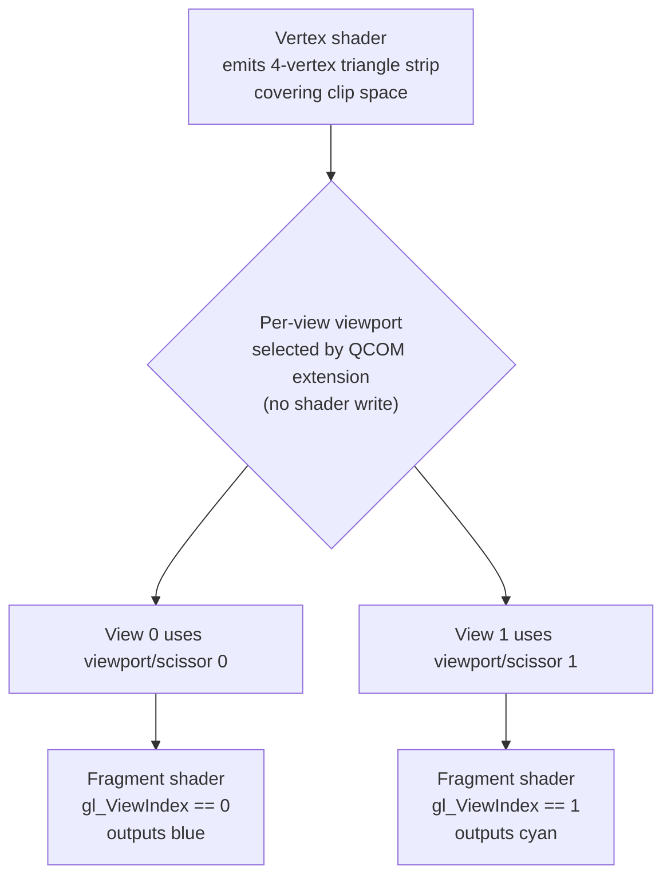
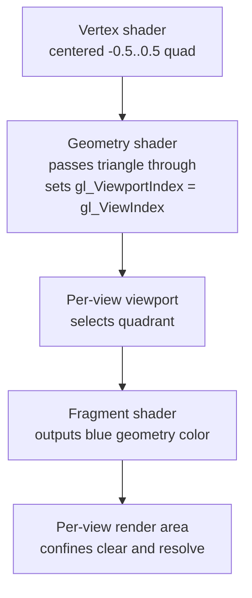

## Overview

**Core question:** Do the Qualcomm per-view extensions actually route a distinct viewport/scissor and a distinct render area to each multiview view, so that load, store, resolve, scissor, and depth-range effects stay confined to the per-view region?

- [vktRenderPassMultiviewPerViewTests.cpp](../../../modules/vulkan/renderpass/vktRenderPassMultiviewPerViewTests.cpp) implements the `multiview_per_view` test family and registers two test families underneath it: `viewports` and `render_areas`.
- `viewports` exercises `VK_QCOM_multiview_per_view_viewports`. This extension lets each view of a multiview render pass pick its own viewport and scissor index without shader-based viewport indexing.
- `render_areas` exercises `VK_QCOM_multiview_per_view_render_areas`. This extension lets each view declare its own render area, so attachment load, store, and resolve operations only touch the pixels in that view's region.
- Both families render to a two-layer multiview framebuffer and compare each layer against a host-built reference image. They differ in which per-view state they vary and how they make a wrong result visible.

## Background Knowledge

- **Multiview.** A multiview subpass renders to several layers of an attachment in a single render pass instance. Each active view is identified by its `gl_ViewIndex`, and a view mask selects which views are active. This page always uses two views (view mask bits 0 and 1).
- **Per-view viewports without shader indexing.** Without `VK_QCOM_multiview_per_view_viewports`, giving each view its own viewport requires writing `gl_ViewportIndex` from a geometry or vertex shader (`GL_ARB_shader_viewport_layer_array`, Vulkan 1.2 `shaderOutputViewportIndex`). The extension removes that requirement: when enabled and the last pre-rasterization shader does not write `ViewportIndex`, each view automatically uses the viewport and scissor whose index equals the view index.
- **Per-view render areas.** A normal render pass has one `renderArea` shared by all views. `VK_QCOM_multiview_per_view_render_areas` adds a per-view render area array through `VkMultiviewPerViewRenderAreasRenderPassBeginInfoQCOM`. For each view, only the pixels inside that view's render area are affected by attachment load, store, and multisample resolve. The global `renderArea` must still cover the union of all per-view areas.
- **Single-sample and multisample color attachments.** The `render_areas` family can use a single-sample color attachment alone, or a multisample color attachment with a single-sample resolve target. The load operation for each attachment (`CLEAR` or `LOAD`) decides whether the render pass clears that attachment or preserves its pre-render-pass contents inside the render area.

## Registration Hierarchy

```text
renderpasses.renderpass2.multiview_per_view
├── viewports
└── render_areas
```

The same `multiview_per_view` group is attached under both the `renderpasses.renderpass2` and `renderpasses.dynamic_rendering.primary_cmd_buff` roots by [`createRenderPassMultiviewPerViewTests`](../../../modules/vulkan/renderpass/vktRenderPassMultiviewPerViewTests.cpp#L1833-L1885), invoked from [`vktRenderPassTests.cpp`](../../../modules/vulkan/renderpass/vktRenderPassTests.cpp#L8508-L8512) for renderpass2 and [`vktRenderPassTests.cpp`](../../../modules/vulkan/renderpass/vktRenderPassTests.cpp#L8530-L8539) for dynamic rendering. It is not registered under `renderpasses.renderpass` (legacy render pass).

## Parameter Dimensions and Observed Values

The two families use separate parameter matrices, generated by nested loops in [`createRenderPassMultiviewPerViewTests`](../../../modules/vulkan/renderpass/vktRenderPassMultiviewPerViewTests.cpp#L1843-L1881).

### viewports

| Dimension | Registered values | Meaning in this test | Evidence |
|-----------|-------------------|----------------------|----------|
| Viewport dynamic state | `static`, `dynamic`, `dynamic_with_count` | Selects static pipeline viewport state, `VK_DYNAMIC_STATE_VIEWPORT`, or `VK_DYNAMIC_STATE_VIEWPORT_WITH_COUNT` (the last needs `VK_EXT_extended_dynamic_state`). | [DynamicState enum](../../../modules/vulkan/renderpass/vktRenderPassMultiviewPerViewTests.cpp#L50-L68), [loop](../../../modules/vulkan/renderpass/vktRenderPassMultiviewPerViewTests.cpp#L1843) |
| Scissor dynamic state | `static`, `dynamic`, `dynamic_with_count` | Same three options applied to scissors. | [DynamicState enum](../../../modules/vulkan/renderpass/vktRenderPassMultiviewPerViewTests.cpp#L50-L68), [loop](../../../modules/vulkan/renderpass/vktRenderPassMultiviewPerViewTests.cpp#L1844) |
| Viewport difference | `offset`, `size`, `depth`, `offset_size_depth` | Chooses which viewport/scissor fields differ between view 0 and view 1, so each view lands in a different screen region or depth range. | [ViewportDiffFlagBits](../../../modules/vulkan/renderpass/vktRenderPassMultiviewPerViewTests.cpp#L71-L89), [loop](../../../modules/vulkan/renderpass/vktRenderPassMultiviewPerViewTests.cpp#L1845-L1847) |
| Multi-pass | off, on | Uses one subpass with view mask `0x03` (both views) or two subpasses with view masks `0x01` and `0x02` (one view each). | [subpass mask setup](../../../modules/vulkan/renderpass/vktRenderPassMultiviewPerViewTests.cpp#L333-L342), [loop](../../../modules/vulkan/renderpass/vktRenderPassMultiviewPerViewTests.cpp#L1848) |

Full matrix: 3 x 3 x 4 x 2 = 72 cases per rendering root.

### render_areas

| Dimension | Registered values | Meaning in this test | Evidence |
|-----------|-------------------|----------------------|----------|
| Viewport type | `single_viewport`, `multi_viewport_qcom`, `multi_viewport_geom`, `multi_viewport_vert` | Chooses how each view gets its viewport/scissor: one shared viewport, the QCOM per-view extension, a geometry shader writing `gl_ViewportIndex`, or a vertex shader writing `gl_ViewportIndex` (Vulkan 1.2). | [RenderAreasViewportType](../../../modules/vulkan/renderpass/vktRenderPassMultiviewPerViewTests.cpp#L877-L883), [loop](../../../modules/vulkan/renderpass/vktRenderPassMultiviewPerViewTests.cpp#L1861-L1862) |
| Single-sample load op | `clear`, `load` | Load operation for the single-sample color attachment inside the render pass. | [ssLoadOp](../../../modules/vulkan/renderpass/vktRenderPassMultiviewPerViewTests.cpp#L926), [loop](../../../modules/vulkan/renderpass/vktRenderPassMultiviewPerViewTests.cpp#L1863) |
| Multisample load op | `dont_care`, `clear`, `load` | Load operation for the optional multisample color attachment. `dont_care` means no multisample attachment is used at all. | [msLoadOp](../../../modules/vulkan/renderpass/vktRenderPassMultiviewPerViewTests.cpp#L927), [loop](../../../modules/vulkan/renderpass/vktRenderPassMultiviewPerViewTests.cpp#L1864-L1865) |
| Multi-pass | off, on | One subpass with view mask `0x03`, or two subpasses with view masks `0x01` and `0x02`. | [subpass mask setup](../../../modules/vulkan/renderpass/vktRenderPassMultiviewPerViewTests.cpp#L1286-L1295), [loop](../../../modules/vulkan/renderpass/vktRenderPassMultiviewPerViewTests.cpp#L1866) |

Full matrix before pruning: 4 x 2 x 3 x 2 = 48 cases per root. The renderpass2 root keeps all 48; the dynamic rendering root keeps only the 16 cases where the single-sample and multisample load ops match, because dynamic rendering exposes a single load op for both.

## Behavior Parameters

The primary behavioral axis for this page is the **test family** under `multiview_per_view`. Each family targets a different extension and produces failures through a different mechanism. The remaining dimensions configure how the per-view state is set and how the reference image is built.

### viewports: per-view viewport and scissor selection

The `viewports` family verifies `VK_QCOM_multiview_per_view_viewports`. It renders a full-screen triangle strip into a two-layer multiview framebuffer. View 0 and view 1 get deliberately different viewport and scissor parameters: different offsets, different sizes, different depth ranges, or all three together. The fragment shader outputs a distinct clear color per view (blue for view 0, cyan for view 1), so a misplaced viewport shows up as the wrong color in the wrong region. A depth attachment is also rendered and checked, because the per-view depth range is one of the dimensions that can differ between views.

The expected image is built per layer by taking the base viewport and scissor, applying the same offset, size, and depth changes the test configured, and clearing the resulting subregion to the view's color and depth. If the implementation routes the wrong viewport or scissor to a view, the colored region and the depth values for that layer will not match the reference.

### render_areas: per-view render area confinement

The `render_areas` family verifies `VK_QCOM_multiview_per_view_render_areas`. Each view gets its own render area through `VkMultiviewPerViewRenderAreasRenderPassBeginInfoQCOM`. To make a confinement bug visible, the test establishes three color levels per layer before the geometry is drawn: a pre-render-pass clear of the whole layer, an in-render-pass load or clear confined to that view's render area, and finally a small blue square drawn inside the viewport. If the implementation applies load, store, or resolve operations outside the declared per-view render area, one of those color borders will be wrong.

The `single_viewport` variant places the two per-view render areas so they overlap in the center of the 16x16 framebuffer, and uses one shared viewport that fits in the overlap. The other three variants use non-overlapping top-left and bottom-right quadrants, each with its own viewport and scissor. They differ only in how the per-view viewport index is selected: the QCOM extension, a geometry shader, or a vertex shader.

## Shader Analysis

The shaders in this file are generated as GLSL strings. They are short, and their structure is part of the tested behavior, so this section reconstructs the two relevant shader paths. Each family uses a vertex plus fragment pair. The `multi_viewport_geom` render-area variant adds a geometry shader pass-through that sets `gl_ViewportIndex`.

### Representative Shader Walkthrough 1

#### Parameter Values Chosen

Representative path:

```text
renderpasses.renderpass2.multiview_per_view.viewports.viewport_static_scissor_static_vary_offset
```

| Parameter choice | Meaning in this representative case |
|------------------|-------------------------------------|
| `viewports` family | Exercises `VK_QCOM_multiview_per_view_viewports`; the shader does not write `gl_ViewportIndex`. |
| `viewport_static` / `scissor_static` | Viewports and scissors are baked into the pipeline, so the per-view index mapping is the only thing selecting them. |
| `vary_offset` | View 0 and view 1 viewports/scissors sit at different framebuffer offsets, making a swapped viewport immediately visible. |
| `USE_PER_VIEW_VIEWPORTS_EXT` build flag | Selects the QCOM extension shader path, which omits the `gl_ViewportIndex = gl_ViewIndex` write and the `GL_ARB_shader_viewport_layer_array` extension. | [build flag](../../../modules/vulkan/renderpass/vktRenderPassMultiviewPerViewTests.cpp#L38) |

#### Purpose

This shader pair draws a full-screen triangle strip into both views. The extension, not the shader, is responsible for routing view 0 to viewport 0 and view 1 to viewport 1. The fragment shader tags each view with its own color so the host reference check can detect a misrouted viewport.

#### Structural Design



#### Shader Code

Reconstructed GLSL for the QCOM extension path:

```glsl
#version 460

/// Vertex shader: full-screen clockwise triangle strip.
/// The QCOM extension path does NOT write gl_ViewportIndex; the implementation
/// derives the viewport index from gl_ViewIndex.
void main()
{
    const float x = (-1.0 + 2.0 * ((gl_VertexIndex & 2) >> 1));
    const float y = ( 1.0 - 2.0 *  (gl_VertexIndex % 2));
    gl_Position = vec4(x, y, 0.0, 1.0);
}
```

```glsl
#version 460
#extension GL_EXT_multiview : enable

layout (location = 0) out vec4 outColor;

/// Fragment shader: per-view clear color so a misrouted viewport shows up
/// as the wrong color in the wrong region.
void main()
{
    if (gl_ViewIndex == 0)
        outColor = vec4(0.0, 0.0, 1.0, 1.0); // blue
    else if (gl_ViewIndex == 1)
        outColor = vec4(0.0, 1.0, 1.0, 1.0); // cyan
    else
        outColor = vec4(0.0, 0.0, 0.0, 1.0); // clear color, should not be reached
}
```

#### Additional Info

- When the build flag `USE_PER_VIEW_VIEWPORTS_EXT` is unset, the vertex shader instead enables `GL_EXT_multiview` and `GL_ARB_shader_viewport_layer_array` and writes `gl_ViewportIndex = gl_ViewIndex`, and the SPIR-V target is 1.5. That path needs Vulkan 1.2 `shaderOutputViewportIndex` and is not the representative case here [shader generation](../../../modules/vulkan/renderpass/vktRenderPassMultiviewPerViewTests.cpp#L224-L267).
- The host builds the expected viewport parameters from the same `DIFF_FLAGS_OFFSET`, `DIFF_FLAGS_SIZE`, and `DIFF_FLAGS_DEPTH` bits the pipeline used, so a mismatch between the shader-routed viewport and the host reference points directly at viewport routing [reference setup](../../../modules/vulkan/renderpass/vktRenderPassMultiviewPerViewTests.cpp#L487-L519), [host reference](../../../modules/vulkan/renderpass/vktRenderPassMultiviewPerViewTests.cpp#L798-L838).

#### Parameter Variation Summary

The vertex and fragment shader bodies are identical across all 72 `viewports` cases. What changes between cases is pipeline and command-buffer state: whether viewports and scissors are static, dynamic, or dynamic-with-count; which fields differ between the two views; and whether one or two subpasses are used. Those differences are exercised through `cmdSetViewport`, `cmdSetScissor`, `cmdSetViewportWithCount`, and `cmdSetScissorWithCount` before each draw, and through the static viewport and scissor arrays passed at pipeline creation [dynamic state recording](../../../modules/vulkan/renderpass/vktRenderPassMultiviewPerViewTests.cpp#L640-L660).

#### SPIR-V

- Status: generated and validated
- Source: reconstructed GLSL from this walkthrough
- Stage: `vert`
- Target SPIRV version: `spirv1.0`

<details>
<summary>Click to expand SPIRV asm code</summary>

```llvm
; SPIR-V
; Version: 1.0
; Generator: Khronos Glslang Reference Front End; 11
; Bound: 43
; Schema: 0
               OpCapability Shader
          %1 = OpExtInstImport "GLSL.std.450"
               OpMemoryModel Logical GLSL450
               OpEntryPoint Vertex %main "main" %gl_VertexIndex %_
               OpSource GLSL 460
               OpName %main "main"
               OpName %x "x"
               OpName %gl_VertexIndex "gl_VertexIndex"
               OpName %y "y"
               OpName %gl_PerVertex "gl_PerVertex"
               OpMemberName %gl_PerVertex 0 "gl_Position"
               OpMemberName %gl_PerVertex 1 "gl_PointSize"
               OpMemberName %gl_PerVertex 2 "gl_ClipDistance"
               OpMemberName %gl_PerVertex 3 "gl_CullDistance"
               OpName %_ ""
               OpDecorate %gl_VertexIndex BuiltIn VertexIndex
               OpDecorate %gl_PerVertex Block
               OpMemberDecorate %gl_PerVertex 0 BuiltIn Position
               OpMemberDecorate %gl_PerVertex 1 BuiltIn PointSize
               OpMemberDecorate %gl_PerVertex 2 BuiltIn ClipDistance
               OpMemberDecorate %gl_PerVertex 3 BuiltIn CullDistance
       %void = OpTypeVoid
          %3 = OpTypeFunction %void
      %float = OpTypeFloat 32
%_ptr_Function_float = OpTypePointer Function %float
   %float_n1 = OpConstant %float -1
    %float_2 = OpConstant %float 2
        %int = OpTypeInt 32 1
%_ptr_Input_int = OpTypePointer Input %int
%gl_VertexIndex = OpVariable %_ptr_Input_int Input
      %int_2 = OpConstant %int 2
      %int_1 = OpConstant %int 1
    %float_1 = OpConstant %float 1
    %v4float = OpTypeVector %float 4
       %uint = OpTypeInt 32 0
     %uint_1 = OpConstant %uint 1
%_arr_float_uint_1 = OpTypeArray %float %uint_1
%gl_PerVertex = OpTypeStruct %v4float %float %_arr_float_uint_1 %_arr_float_uint_1
%_ptr_Output_gl_PerVertex = OpTypePointer Output %gl_PerVertex
          %_ = OpVariable %_ptr_Output_gl_PerVertex Output
      %int_0 = OpConstant %int 0
    %float_0 = OpConstant %float 0
%_ptr_Output_v4float = OpTypePointer Output %v4float
       %main = OpFunction %void None %3
          %5 = OpLabel
          %x = OpVariable %_ptr_Function_float Function
          %y = OpVariable %_ptr_Function_float Function
         %14 = OpLoad %int %gl_VertexIndex
         %16 = OpBitwiseAnd %int %14 %int_2
         %18 = OpShiftRightArithmetic %int %16 %int_1
         %19 = OpConvertSToF %float %18
         %20 = OpFMul %float %float_2 %19
         %21 = OpFAdd %float %float_n1 %20
               OpStore %x %21
         %24 = OpLoad %int %gl_VertexIndex
         %25 = OpSMod %int %24 %int_2
         %26 = OpConvertSToF %float %25
         %27 = OpFMul %float %float_2 %26
         %28 = OpFSub %float %float_1 %27
               OpStore %y %28
         %37 = OpLoad %float %x
         %38 = OpLoad %float %y
         %40 = OpCompositeConstruct %v4float %37 %38 %float_0 %float_1
         %42 = OpAccessChain %_ptr_Output_v4float %_ %int_0
               OpStore %42 %40
               OpReturn
               OpFunctionEnd
```

</details>

### Representative Shader Walkthrough 2

#### Parameter Values Chosen

Representative path:

```text
renderpasses.renderpass2.multiview_per_view.render_areas.multi_viewport_geom_ss_clear_ms_clear
```

| Parameter choice | Meaning in this representative case |
|------------------|-------------------------------------|
| `render_areas` family | Exercises `VK_QCOM_multiview_per_view_render_areas`; the per-view render area must confine load/store/resolve. |
| `multi_viewport_geom` | Uses a geometry shader to write `gl_ViewportIndex = gl_ViewIndex`, the shader-based alternative to the QCOM viewport extension. | [geometry shader](../../../modules/vulkan/renderpass/vktRenderPassMultiviewPerViewTests.cpp#L1218-L1239) |
| `ss_clear` / `ms_clear` | Both single-sample and multisample attachments are cleared inside the render pass, so the in-render-area clear color must appear inside the per-view region and the pre-render-pass clear color must survive outside it. |
| Quadrant viewports | The two per-view render areas are non-overlapping top-left and bottom-right 8x8 quadrants. | [getRenderAreas](../../../modules/vulkan/renderpass/vktRenderPassMultiviewPerViewTests.cpp#L1004-L1023) |

#### Purpose

This shader triplet draws a small centered blue square into each view. The geometry shader routes each view to its own viewport; the per-view render area is meant to confine the render-pass clear and the resolve. The host reference checks three color levels per layer: the pre-render-pass clear outside the render area, the render-pass clear inside the render area but outside the geometry, and the blue geometry inside the viewport.

#### Structural Design



#### Shader Code

Reconstructed GLSL for the `multi_viewport_geom` path:

```glsl
#version 460

/// Vertex shader for the render_areas family: a small quad from -0.5 to 0.5,
/// so the drawn geometry sits in the center of the chosen viewport.
void main()
{
    const float x = float((gl_VertexIndex & 2) >> 1) - 0.5;
    const float y = float (gl_VertexIndex & 1)       - 0.5;
    gl_Position = vec4(x, y, 0.0, 1.0);
}
```

```glsl
#version 460
#extension GL_EXT_multiview : require

/// Geometry shader pass-through. It exists only to set gl_ViewportIndex per
/// view, which is the shader-based alternative to the QCOM per-view viewport
/// extension. The QCOM and vertex-shader variants do not use this stage.
layout (triangles) in;
layout (triangle_strip, max_vertices = 3) out;

in  gl_PerVertex { vec4 gl_Position; } gl_in[3];
out gl_PerVertex { vec4 gl_Position; };

void main()
{
    for (uint i = 0; i < 3; ++i)
    {
        gl_Position     = gl_in[i].gl_Position;
        gl_ViewportIndex = gl_ViewIndex;
        EmitVertex();
    }
}
```

```glsl
#version 460

layout (location = 0) out vec4 outColor;

/// Fragment shader for the render_areas family: one fixed geometry color.
/// The confinement check comes from where this color and the surrounding
/// clear colors end up, not from the shader value itself.
void main()
{
    outColor = vec4(0.0, 0.0, 1.0, 1.0); // blue
}
```

#### Additional Info

- The `single_viewport` and `multi_viewport_qcom` variants omit the geometry shader entirely; the vertex shader does not write `gl_ViewportIndex` in those cases [vertex shader generation](../../../modules/vulkan/renderpass/vktRenderPassMultiviewPerViewTests.cpp#L1186-L1216).
- The `multi_viewport_vert` variant writes `gl_ViewportIndex = gl_ViewIndex` in the vertex shader and targets SPIR-V 1.5, requiring Vulkan 1.2 [vertex shader branch](../../../modules/vulkan/renderpass/vktRenderPassMultiviewPerViewTests.cpp#L1191-L1208).
- The clear color palette is chosen so every color level is distinguishable: blue geometry, plus distinct single-sample and multisample pre-render-pass and in-render-pass clear colors [getClearColor](../../../modules/vulkan/renderpass/vktRenderPassMultiviewPerViewTests.cpp#L937-L956).

#### Parameter Variation Summary

The fragment shader is constant across all `render_areas` cases. The vertex shader changes only in whether it writes `gl_ViewportIndex`. The geometry shader is present only for `multi_viewport_geom`. The load-op and multi-pass dimensions do not change shader text; they change attachment setup and the host reference image.

#### SPIR-V

- Status: generated and validated
- Source: reconstructed GLSL from this walkthrough
- Stage: `vert`
- Target SPIRV version: `spirv1.0`

<details>
<summary>Click to expand SPIRV asm code</summary>

```llvm
; SPIR-V
; Version: 1.0
; Generator: Khronos Glslang Reference Front End; 11
; Bound: 40
; Schema: 0
               OpCapability Shader
          %1 = OpExtInstImport "GLSL.std.450"
               OpMemoryModel Logical GLSL450
               OpEntryPoint Vertex %main "main" %gl_VertexIndex %_
               OpSource GLSL 460
               OpName %main "main"
               OpName %x "x"
               OpName %gl_VertexIndex "gl_VertexIndex"
               OpName %y "y"
               OpName %gl_PerVertex "gl_PerVertex"
               OpMemberName %gl_PerVertex 0 "gl_Position"
               OpMemberName %gl_PerVertex 1 "gl_PointSize"
               OpMemberName %gl_PerVertex 2 "gl_ClipDistance"
               OpMemberName %gl_PerVertex 3 "gl_CullDistance"
               OpName %_ ""
               OpDecorate %gl_VertexIndex BuiltIn VertexIndex
               OpDecorate %gl_PerVertex Block
               OpMemberDecorate %gl_PerVertex 0 BuiltIn Position
               OpMemberDecorate %gl_PerVertex 1 BuiltIn PointSize
               OpMemberDecorate %gl_PerVertex 2 BuiltIn ClipDistance
               OpMemberDecorate %gl_PerVertex 3 BuiltIn CullDistance
       %void = OpTypeVoid
          %3 = OpTypeFunction %void
      %float = OpTypeFloat 32
%_ptr_Function_float = OpTypePointer Function %float
        %int = OpTypeInt 32 1
%_ptr_Input_int = OpTypePointer Input %int
%gl_VertexIndex = OpVariable %_ptr_Input_int Input
      %int_2 = OpConstant %int 2
      %int_1 = OpConstant %int 1
  %float_0_5 = OpConstant %float 0.5
    %v4float = OpTypeVector %float 4
       %uint = OpTypeInt 32 0
     %uint_1 = OpConstant %uint 1
%_arr_float_uint_1 = OpTypeArray %float %uint_1
%gl_PerVertex = OpTypeStruct %v4float %float %_arr_float_uint_1 %_arr_float_uint_1
%_ptr_Output_gl_PerVertex = OpTypePointer Output %gl_PerVertex
          %_ = OpVariable %_ptr_Output_gl_PerVertex Output
      %int_0 = OpConstant %int 0
    %float_0 = OpConstant %float 0
    %float_1 = OpConstant %float 1
%_ptr_Output_v4float = OpTypePointer Output %v4float
       %main = OpFunction %void None %3
          %5 = OpLabel
          %x = OpVariable %_ptr_Function_float Function
          %y = OpVariable %_ptr_Function_float Function
         %12 = OpLoad %int %gl_VertexIndex
         %14 = OpBitwiseAnd %int %12 %int_2
         %16 = OpShiftRightArithmetic %int %14 %int_1
         %17 = OpConvertSToF %float %16
         %19 = OpFSub %float %17 %float_0_5
               OpStore %x %19
         %21 = OpLoad %int %gl_VertexIndex
         %22 = OpBitwiseAnd %int %21 %int_1
         %23 = OpConvertSToF %float %22
         %24 = OpFSub %float %23 %float_0_5
               OpStore %y %24
         %33 = OpLoad %float %x
         %34 = OpLoad %float %y
         %37 = OpCompositeConstruct %v4float %33 %34 %float_0 %float_1
         %39 = OpAccessChain %_ptr_Output_v4float %_ %int_0
               OpStore %39 %37
               OpReturn
               OpFunctionEnd
```

</details>

## Runtime Execution and Result Checking

### Shared setup

- Both families create a two-layer 16x16 color attachment (`VK_FORMAT_R8G8B8A8_UNORM`). The `viewports` family also creates a two-layer `VK_FORMAT_D16_UNORM` depth attachment. The `render_areas` family optionally adds a 4x multisample color attachment and uses the single-sample attachment as the resolve target [color buffer](../../../modules/vulkan/renderpass/vktRenderPassMultiviewPerViewTests.cpp#L299-L301), [depth buffer](../../../modules/vulkan/renderpass/vktRenderPassMultiviewPerViewTests.cpp#L303-L328), [multisample buffer](../../../modules/vulkan/renderpass/vktRenderPassMultiviewPerViewTests.cpp#L1269-L1277).
- One pipeline is created per subpass mask, so the single-pass and multi-pass cases differ in pipeline count as well as subpass structure [pipeline loop](../../../modules/vulkan/renderpass/vktRenderPassMultiviewPerViewTests.cpp#L600-L633), [pipeline loop](../../../modules/vulkan/renderpass/vktRenderPassMultiviewPerViewTests.cpp#L1474-L1505).
- For dynamic rendering, images are transitioned to `COLOR_ATTACHMENT_OPTIMAL` or `DEPTH_STENCIL_ATTACHMENT_OPTIMAL` before rendering, and view masks are set through `VkPipelineRenderingCreateInfo` [dynamic rendering path](../../../modules/vulkan/renderpass/vktRenderPassMultiviewPerViewTests.cpp#L668-L719), [dynamic rendering path](../../../modules/vulkan/renderpass/vktRenderPassMultiviewPerViewTests.cpp#L1592-L1678).

### viewports execution

- The full-screen triangle strip is drawn once per subpass. Viewports and scissors are applied either statically from the pipeline or dynamically through `cmdSetViewport`, `cmdSetScissor`, `cmdSetViewportWithCount`, or `cmdSetScissorWithCount` [draw loop](../../../modules/vulkan/renderpass/vktRenderPassMultiviewPerViewTests.cpp#L636-L736).
- After rendering, both color and depth images are copied to host-visible verification buffers and invalidated [copyback](../../../modules/vulkan/renderpass/vktRenderPassMultiviewPerViewTests.cpp#L738-L770).
- Each layer is compared against a host-built reference using `tcu::floatThresholdCompare` with a zero threshold for color, and `tcu::dsThresholdCompare` with a small depth tolerance for depth [per-layer check](../../../modules/vulkan/renderpass/vktRenderPassMultiviewPerViewTests.cpp#L787-L853).

### render_areas execution

- Before the render pass, every layer is cleared to a per-layer pre-render-pass color using `cmdClearColorImage`, so pixels outside every per-view render area start with a known distinguishable color [pre-RP clear](../../../modules/vulkan/renderpass/vktRenderPassMultiviewPerViewTests.cpp#L1513-L1553).
- The per-view render areas are passed through `VkMultiviewPerViewRenderAreasRenderPassBeginInfoQCOM` chained to the render pass begin info or the rendering info. The global `renderArea` is set to the whole framebuffer, satisfying the rule that it must cover the union of the per-view areas [per-view render area setup](../../../modules/vulkan/renderpass/vktRenderPassMultiviewPerViewTests.cpp#L1577-L1590).
- The centered blue square is drawn once per subpass. With a multisample attachment, the single-sample attachment is the resolve target and receives the resolved result [attachment setup](../../../modules/vulkan/renderpass/vktRenderPassMultiviewPerViewTests.cpp#L1361-L1384).
- The single-sample color buffer is copied to its verification buffer and compared per layer against a reference built from three color levels: the pre-render-pass background, the in-render-pass clear or loaded color confined to the per-view render area, and the blue geometry inside the viewport [reference build](../../../modules/vulkan/renderpass/vktRenderPassMultiviewPerViewTests.cpp#L1730-L1799). The comparison uses `tcu::floatThresholdCompare` with a zero threshold.

| Resource | Created/configured by host? | Bound to GPU? | Device access | Host readback | Role |
|----------|-----------------------------|---------------|---------------|---------------|------|
| Single-sample color attachment | Yes | Color attachment 0 | Written by draw, cleared or loaded, resolve target | Yes, via verification buffer | Holds the per-layer image checked against the reference. |
| Multisample color attachment (render_areas only) | Yes, when `msLoadOp != DONT_CARE` | Color attachment | Written by draw, cleared or loaded | No | Sampled and resolved into the single-sample attachment. |
| Depth attachment (viewports only) | Yes | Depth attachment | Written by draw, cleared | Yes, via verification buffer | Holds per-layer depth values checked against the reference. |
| Per-view render area info (render_areas only) | Yes | pNext of begin info | Read by implementation | No | Supplies the per-view render areas that must confine load/store/resolve. |

## Failure Meaning

### Failure Cause Mapping

Because the two families target different extensions, their failure causes are mapped separately.

`viewports`:

| If this behavior parameter value fails | Possible failure cause(s) |
|----------------------------------------|---------------------------|
| `viewports` (any case) | Per-view viewport or scissor misrouting; depth-range misrouting for `vary_depth`. |

`render_areas`:

| If this behavior parameter value fails | Possible failure cause(s) |
|----------------------------------------|---------------------------|
| `single_viewport` | Per-view render area not confining load/store; shared viewport placement wrong. |
| `multi_viewport_qcom` | Per-view render area not confining load/store; QCOM per-view viewport misrouting. |
| `multi_viewport_geom` | Per-view render area not confining load/store; geometry-shader viewport index not honored under multiview. |
| `multi_viewport_vert` | Per-view render area not confining load/store; vertex-shader viewport index not honored under multiview. |

Both families also share a possible resolve-path failure when a multisample attachment is used.

### Cause Analysis

#### Per-view viewport or scissor misrouting

**Possible failure symptoms:** In the `viewports` family, a layer's color region or depth values do not match the host reference. Concretely, `tcu::floatThresholdCompare` reports the colored region in the wrong offset or size, or `tcu::dsThresholdCompare` reports the wrong depth range, for one or both layers [per-layer check](../../../modules/vulkan/renderpass/vktRenderPassMultiviewPerViewTests.cpp#L787-L853).

**Possible implementation causes:** With `VK_QCOM_multiview_per_view_viewports` enabled and the shader not writing `ViewportIndex`, the spec requires each view to use the viewport and scissor whose index equals the view index. A failure points to the implementation not applying that automatic mapping, applying it to only one of viewport or scissor, or mishandling the dynamic-state (`VK_DYNAMIC_STATE_VIEWPORT`, `VK_DYNAMIC_STATE_SCISSOR`, `VK_DYNAMIC_STATE_VIEWPORT_WITH_COUNT`, `VK_DYNAMIC_STATE_SCISSOR_WITH_COUNT`) variants of the same selection. The spec also requires the most significant bit of the view mask to be less than the current viewport and scissor counts, so a count mismatch is a separate plausible source.

#### Depth-range misrouting for vary_depth

**Possible failure symptoms:** Only the `vary_depth` viewport cases fail, and only the depth comparison (`tcu::dsThresholdCompare`) reports a mismatch while color matches [depth check](../../../modules/vulkan/renderpass/vktRenderPassMultiviewPerViewTests.cpp#L846-L852).

**Possible implementation causes:** The depth dimension gives each view a distinct `minDepth`/`maxDepth` range. A failure here points to the per-view viewport depth range not being applied independently, so one view's depth values are transformed with the other view's range.

#### Per-view render area not confining load/store

**Possible failure symptoms:** In the `render_areas` family, the in-render-pass clear or loaded color appears outside the declared per-view render area, or the pre-render-pass clear color does not survive outside it. The resolve result may also leak outside the render area. Any of these makes the per-layer `tcu::floatThresholdCompare` fail [reference build](../../../modules/vulkan/renderpass/vktRenderPassMultiviewPerViewTests.cpp#L1730-L1799).

**Possible implementation causes:** The spec says that when per-view render areas are provided, only pixels inside each view's render area are affected by load, store, and multisample resolve, and that pixels inside the global `renderArea` but outside every per-view area must not be touched. A failure points to the implementation applying load/store/resolve to the global area instead of the per-view areas, or to an interaction with the multisample resolve path that ignores the per-view confinement.

#### Shader-based viewport index not honored under multiview

**Possible failure symptoms:** Only the `multi_viewport_geom` or `multi_viewport_vert` variants of `render_areas` fail; the `single_viewport` and `multi_viewport_qcom` variants pass. Geometry lands in the wrong quadrant for one or both layers.

**Possible implementation causes:** These variants rely on `gl_ViewportIndex = gl_ViewIndex` written from the geometry or vertex shader, plus the `multiviewGeometryShader` feature or Vulkan 1.2 `shaderOutputViewportIndex`. A failure points to the implementation not propagating the shader-written viewport index under multiview, or to the geometry-shader path interacting incorrectly with multiview. The render-area confinement itself is exercised identically across all four viewport types, so a failure scoped to these two variants isolates the viewport-indexing path rather than the render-area path.

#### Resolve-path failure with multisample attachment

**Possible failure symptoms:** Only `render_areas` cases with `msLoadOp != DONT_CARE` fail, and the mismatch is in the region that should hold the resolved multisample result.

**Possible implementation causes:** When a multisample attachment is present, the single-sample attachment is the resolve target. The resolve operation is also meant to be confined by the per-view render area. A failure scoped to multisample cases points to the resolve path not respecting the per-view render area, or to the multisample load operation not being applied inside the per-view region as specified.

## Case Pruning

### Requirement-based pruning

- Both families require `VK_KHR_create_renderpass2` and `VK_KHR_multiview` [checkSupport](../../../modules/vulkan/renderpass/vktRenderPassMultiviewPerViewTests.cpp#L202-L203), [checkSupport](../../../modules/vulkan/renderpass/vktRenderPassMultiviewPerViewTests.cpp#L1160-L1161).
- The `viewports` family requires `VK_QCOM_multiview_per_view_viewports` and `DEVICE_CORE_FEATURE_MULTI_VIEWPORT` [checkSupport](../../../modules/vulkan/renderpass/vktRenderPassMultiviewPerViewTests.cpp#L194), [checkSupport](../../../modules/vulkan/renderpass/vktRenderPassMultiviewPerViewTests.cpp#L205-L206).
- The `render_areas` family requires `VK_QCOM_multiview_per_view_render_areas` [checkSupport](../../../modules/vulkan/renderpass/vktRenderPassMultiviewPerViewTests.cpp#L1135).
- The `multi_viewport_qcom` render-area variant additionally requires `VK_QCOM_multiview_per_view_viewports` [checkSupport](../../../modules/vulkan/renderpass/vktRenderPassMultiviewPerViewTests.cpp#L1137-L1140).
- The `multi_viewport_geom` render-area variant requires `DEVICE_CORE_FEATURE_GEOMETRY_SHADER` and `multiviewGeometryShader` [checkSupport](../../../modules/vulkan/renderpass/vktRenderPassMultiviewPerViewTests.cpp#L1146-L1151).
- The `multi_viewport_vert` render-area variant requires Vulkan 1.2 [checkSupport](../../../modules/vulkan/renderpass/vktRenderPassMultiviewPerViewTests.cpp#L1141-L1144).
- The `dynamic_with_count` viewport and scissor variants require `VK_EXT_extended_dynamic_state` [checkSupport](../../../modules/vulkan/renderpass/vktRenderPassMultiviewPerViewTests.cpp#L199-L200).
- The dynamic rendering path requires `VK_KHR_dynamic_rendering` [checkSupport](../../../modules/vulkan/renderpass/vktRenderPassMultiviewPerViewTests.cpp#L196-L198), [checkSupport](../../../modules/vulkan/renderpass/vktRenderPassMultiviewPerViewTests.cpp#L1157-L1158).
- Multisample `render_areas` cases are skipped if the color format does not support 4 samples [image format check](../../../modules/vulkan/renderpass/vktRenderPassMultiviewPerViewTests.cpp#L1163-L1172).

When any requirement is not met, the case is reported as unsupported rather than failed.

### Design-based pruning

- In the dynamic rendering root, `render_areas` cases where the single-sample load op differs from the multisample load op are skipped, because dynamic rendering exposes a single attachment load op for both the multisample and resolve attachments. This removes the `ss_clear_ms_load` and `ss_load_ms_clear` combinations from the dynamic rendering root, leaving 16 `render_areas` cases there instead of 48 [dynamic rendering skip](../../../modules/vulkan/renderpass/vktRenderPassMultiviewPerViewTests.cpp#L1870-L1872).
- The `viewports` matrix is generated in full (72 cases per root) with no design-based pruning.

## Key Takeaways

- The two families target orthogonal extensions: `viewports` tests `VK_QCOM_multiview_per_view_viewports`, and `render_areas` tests `VK_QCOM_multiview_per_view_render_areas`. The spec states the two features do not interact directly, and the test design reflects that by varying them independently.
- `viewports` makes routing failures visible through per-view color and depth: each view is tagged with its own color and depth range, so a misrouted viewport produces the wrong color or depth in the wrong layer region.
- `render_areas` makes confinement failures visible through three stacked color levels: a pre-render-pass clear outside the render area, an in-render-pass clear or load inside it, and the blue geometry inside the viewport. Wrong confinement breaks one of those borders.
- The four `render_areas` viewport types (`single_viewport`, `multi_viewport_qcom`, `multi_viewport_geom`, `multi_viewport_vert`) exist to cover every way an implementation can give each view its own viewport, including the shader-based alternatives to the QCOM extension.
- See `## Failure Meaning` for the failure interpretation: a failing result means per-view viewport or scissor misrouting, per-view render area not confining load/store/resolve, shader-written viewport index not honored under multiview, or a resolve-path confinement failure.

## Source Reference Appendix

| Entry point | Link | Why it matters |
|-------------|------|----------------|
| Test family registration | [createRenderPassMultiviewPerViewTests](../../../modules/vulkan/renderpass/vktRenderPassMultiviewPerViewTests.cpp#L1833-L1885) | Builds the `multiview_per_view` group and the `viewports` and `render_areas` children. |
| Category attachment | [vktRenderPassTests.cpp#L8508-L8512](../../../modules/vulkan/renderpass/vktRenderPassTests.cpp#L8508-L8512) | Attaches the group under the `renderpass2` root. |
| Category attachment | [vktRenderPassTests.cpp#L8530-L8539](../../../modules/vulkan/renderpass/vktRenderPassTests.cpp#L8530-L8539) | Attaches the group under the `dynamic_rendering.primary_cmd_buff` root. |
| Viewports parameters and shader generation | [ViewportsCase::initPrograms](../../../modules/vulkan/renderpass/vktRenderPassMultiviewPerViewTests.cpp#L224-L267) | Generates the vertex and fragment shaders for the per-view viewport family. |
| Viewports runtime and checks | [ViewportsInstance::iterate](../../../modules/vulkan/renderpass/vktRenderPassMultiviewPerViewTests.cpp#L269-L859) | Runs the draw, copyback, and per-layer color and depth comparison. |
| Render areas parameters | [RenderAreasParams](../../../modules/vulkan/renderpass/vktRenderPassMultiviewPerViewTests.cpp#L922-L1060) | Defines viewport types, load ops, render areas, viewports, scissors, and colors. |
| Render areas shader generation | [RenderAreasCase::initPrograms](../../../modules/vulkan/renderpass/vktRenderPassMultiviewPerViewTests.cpp#L1186-L1248) | Generates the vertex, optional geometry, and fragment shaders. |
| Per-view render area setup | [VkMultiviewPerViewRenderAreasRenderPassBeginInfoQCOM](../../../modules/vulkan/renderpass/vktRenderPassMultiviewPerViewTests.cpp#L1580-L1590) | Chains the per-view render areas to the render pass or rendering begin info. |
| Render areas runtime and checks | [RenderAreasInstance::iterate](../../../modules/vulkan/renderpass/vktRenderPassMultiviewPerViewTests.cpp#L1250-L1805) | Runs the pre-RP clear, render pass, resolve, copyback, and per-layer reference comparison. |
| Mustpass, renderpass2 root | [renderpasses.txt#L71471-L71590](../../../mustpass/main/vk-default/renderpasses.txt#L71471-L71590) | Lists the 120 renderpass2 cases for this family. |
| Mustpass, dynamic rendering root | [renderpasses.txt#L19870-L19957](../../../mustpass/main/vk-default/renderpasses.txt#L19870-L19957) | Lists the 88 dynamic rendering primary command buffer cases. |
