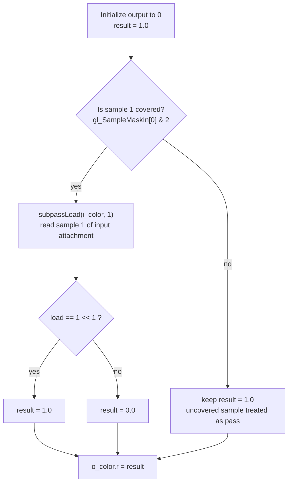

## Overview

**Core question:** After a multisampled color attachment is written by one subpass, can a later subpass read an individual sample of that attachment as an input attachment and get back exactly the per-sample value the first subpass wrote?

- [vktRenderPassSampleReadTests.cpp](../../../modules/vulkan/renderpass/vktRenderPassSampleReadTests.cpp) implements the `sampleread` test family under `renderpasses`.
- The file registers the `sampleread` group for each rendering type and builds all cases from one generator, [initTests](../../../modules/vulkan/renderpass/vktRenderPassSampleReadTests.cpp#L1143-L1177).
- The core test runs two subpasses over the same multisampled image: subpass 1 writes a sample-identifying value into every sample using sample-rate shading; subpass 2 reads that image back as an input attachment, either summing every sample (`TESTMODE_ADD`) or reading one chosen sample (`TESTMODE_SELECT`).
- The validation lives inside the subpass-2 fragment shader. It compares the loaded sample value against the value subpass 1 should have produced and writes `1.0` to a single-sample resolve target only when the read is correct. The host then checks that every pixel is `1.0`.

## Background Knowledge

- **Multisampling and samples.** A multisampled color attachment stores more than one sample per pixel. `VK_SAMPLE_COUNT_n_BIT` means `n` samples per pixel. Rasterization, coverage, and per-sample shading all key off the sample index.
- **Sample-rate (per-sample) shading.** When `sampleShadingEnable` is `VK_TRUE` with `minSampleShading` `1.0`, the fragment shader runs once per covered sample, and `gl_SampleID` identifies which sample the invocation shades. Subpass 1 of this test relies on that to write a distinct, sample-identifying value into each sample.
- **Input attachments.** An attachment written by one subpass can be bound as an input attachment of a later subpass and read inline from the same render pass instance, without a descriptor pointing at unrelated memory. For a multisampled input attachment, the shader selects which sample to read.
- **`gl_SampleMaskIn`.** This built-in reports the coverage mask of the current fragment as computed before fragment shading. In this test it distinguishes samples the current fragment covers from samples it does not, so the validation shader only enforces a read on samples that were shaded.
- **Subpass dependency.** Reading an attachment that another subpass wrote requires an execution and memory dependency from that subpass's color-attachment output to the next subpass's fragment-shader input-attachment read, so the read observes the write rather than stale or undefined contents.

## Registration Hierarchy

```text
renderpasses.renderpass1.suballocation.sampleread
├── numsamples_2_add
├── numsamples_2_selected_sample_0
├── numsamples_4_selected_sample_1
├── numsamples_8_selected_sample_3
├── numsamples_16_selected_sample_7
└── numsamples_32_selected_sample_15
```

The representative root shows the `renderpass1` rendering type under the `suballocation` subgroup. The same `sampleread` group is also registered under `renderpass2.suballocation` and under several `dynamic_rendering` subgroups. Only a few representative leaves are shown here; the full generated matrix is documented in [Parameter Dimensions and Observed Values](#parameter-dimensions-and-observed-values). Registered group name: `"sampleread"` at [createRenderPassSampleReadTests](../../../modules/vulkan/renderpass/vktRenderPassSampleReadTests.cpp#L1181-L1184); leaves are added by the sample-count loop at [initTests](../../../modules/vulkan/renderpass/vktRenderPassSampleReadTests.cpp#L1148-L1176).

## Parameter Dimensions and Observed Values

The matrix is generated from the sample-count array and the per-sample `TESTMODE_SELECT` loop at [initTests](../../../modules/vulkan/renderpass/vktRenderPassSampleReadTests.cpp#L1145-L1176).

| Dimension | Registered values | Meaning in this test | Evidence |
|-----------|-------------------|----------------------|----------|
| Sample count | `2`, `4`, `8`, `16`, `32` | Sets the multisample rate of the source color attachment and both pipelines, and the number of samples subpass 2 must read or sum. | [sampleCounts](../../../modules/vulkan/renderpass/vktRenderPassSampleReadTests.cpp#L1145) |
| Test mode | `_add`, `_selected_sample_N` | `_add` sums every sample and compares against the bitmask of all sample indices; `_selected_sample_N` reads only sample `N` and compares against that sample's identifying bit. | [TestMode](../../../modules/vulkan/renderpass/vktRenderPassSampleReadTests.cpp#L497-L503), [ADD registration](../../../modules/vulkan/renderpass/vktRenderPassSampleReadTests.cpp#L1156-L1162), [SELECT registration](../../../modules/vulkan/renderpass/vktRenderPassSampleReadTests.cpp#L1165-L1175) |
| Selected sample | `0` to `sampleCount-1` | For `_selected_sample_N`, the exact sample index read by `subpassLoad`. One leaf exists per index. | [SELECT loop](../../../modules/vulkan/renderpass/vktRenderPassSampleReadTests.cpp#L1165-L1175) |
| Rendering type | `renderpass1`, `renderpass2`, `dynamic_rendering` | Selects legacy render pass objects, `VK_KHR_create_renderpass2`, or `VK_KHR_dynamic_rendering_local_read`. Same shader logic in all three; attachment layout and dependency setup differ. | [iterate dispatch](../../../modules/vulkan/renderpass/vktRenderPassSampleReadTests.cpp#L647-L660) |
| Pipeline construction | monolithic, non-monolithic | Non-monolithic pipelines limit the matrix to sample counts `2` and `4`. | [non-monolithic pruning](../../../modules/vulkan/renderpass/vktRenderPassSampleReadTests.cpp#L1150-L1152) |

For `renderpass1.suballocation`, the full set of leaves is five `_add` cases plus one `_selected_sample_N` case per sample index, giving 2 + 4 + 8 + 16 + 32 `SELECT` cases plus 5 `ADD` cases = 67 leaves.

## Behavior Parameters

The primary behavioral axis is the **test mode**: whether subpass 2 sums all samples or reads one selected sample. This is what changes the validation logic in the fragment shader.

### `_add`: sum of all samples

Subpass 2 loads every sample index of the input attachment, sums the loaded values, and compares the sum against the bitmask that subpass 1 is expected to have produced (`(1 << 0) | (1 << 1) | ... | (1 << sampleCount-1)`). The output pixel is `1.0` only when the summed read matches that expected bitmask [ADD shader branch](../../../modules/vulkan/renderpass/vktRenderPassSampleReadTests.cpp#L1064-L1078). Because sample coverage varies per fragment, samples not covered by the current fragment are treated as already-correct so they do not force a false failure.

### `_selected_sample_N`: one chosen sample

Subpass 2 reads only sample `N` from the input attachment and compares it against `1 << N`, the exact bit subpass 1 writes into that sample. The output pixel is `1.0` only when the single-sample read matches [SELECT shader branch](../../../modules/vulkan/renderpass/vktRenderPassSampleReadTests.cpp#L1079-L1092). One leaf exists for each valid `N`, so this mode exercises each sample index in isolation.

## Shader Analysis

This test is shader-internal validation. The subpass-2 fragment shader is the only place that decides pass or fail: it reads the input attachment and compares against the expected per-sample value. One representative walkthrough covers the SELECT mode, which exercises the core per-sample input-attachment read. The ADD mode uses the same input-attachment load inside a loop; its differences are summarized in the variation table rather than given a separate walkthrough. The shared vertex shader and the subpass-1 color shader are boilerplate and are not shown.

### Representative Shader Walkthrough 1

#### Parameter Values Chosen

Representative path:

```text
dEQP-VK.renderpasses.renderpass1.suballocation.sampleread.numsamples_4_selected_sample_1
```

| Parameter choice | Meaning in this representative case |
|------------------|-------------------------------------|
| `_selected_sample_1` | Selects `TESTMODE_SELECT` with `selectedSample = 1`, so the validation shader reads exactly sample 1 and compares it against `1 << 1`. |
| `4` samples | Both pipelines and the source attachment use `VK_SAMPLE_COUNT_4_BIT`; sample indices run 0 to 3. |
| `renderpass1` | Uses a legacy `VkRenderPass` object with two subpasses and a subpass dependency; the shader logic is identical across rendering types. |
| subpass 2 fragment shader | The `quad-subpass-frag` stage performs the per-sample read and the pass/fail comparison. |

#### Purpose

This shader verifies that after subpass 1 writes a sample-identifying value into each sample of a multisampled color attachment, subpass 2 can read sample 1 of that same attachment as an input attachment and get back exactly the value subpass 1 wrote there.

#### Structural Design



The coverage check is required because not every fragment invocation covers every sample. A fragment that does not cover sample 1 has no shaded value to validate, so it must not force a failure.

#### Shader Code

```glsl
#version 450
precision mediump int;
precision highp float;
/// Binding 0 is the multisampled input attachment written by subpass 1. Each sample holds a
/// single uint: bit `i` set means subpass 1 shaded sample `i` and stored `1u << gl_SampleID`.
layout(input_attachment_index = 0, set = 0, binding = 0) uniform highp usubpassInputMS i_color;
/// Location 0 is the single-sample resolve target. Its R channel carries the per-pixel pass/fail.
layout(location = 0) out highp vec4 o_color;
void main (void)
{
    o_color = vec4(0.0);
    float result = 1.0; // Non-covered samples must emulate a good result
//      Only covered samples are valid to load
    /// Sample 1 is validated only when the current fragment covers it.
    if ((gl_SampleMaskIn[0] & (1 << 1)) != 0)
    {
        /// Read sample 1 of the input attachment; expected value is 1 << 1 because subpass 1
        /// stores `1u << gl_SampleID` into each sample under per-sample shading.
        uint load = subpassLoad(i_color, 1).r;
        result = (load == (1 << 1)) ? 1.0 : 0.0;
    }
    o_color.r = result;
}
```

#### Additional Info

- The `1 << 1` literals are generated by substituting `selectedSample = 1` into the SELECT template at [shader generation](../../../modules/vulkan/renderpass/vktRenderPassSampleReadTests.cpp#L1079-L1092); for sample `N` the constant is `1 << N`.
- The input attachment is declared `usubpassInputMS` because the source attachment is multisampled and uses `VK_FORMAT_R32_UINT`; `subpassLoad(i_color, N)` maps to a per-sample input-attachment read, not a filtered texture sample.
- The shared `quad-vert` shader is an identity fullscreen triangle strip and does not vary across cases; subpass 1's `quad-frag` writes `uvec4(1u << gl_SampleID, 0, 0, 0)` and is also fixed.

#### Parameter Variation Summary

| Parameter dimension | Shader-level variation from this shader | Evidence |
|---------------------|---------------------------------------|----------|
| Test mode | SELECT reads one sample and compares to `1 << N`; ADD loads all samples in a loop, summing only covered samples, and compares the sum to the OR of all sample bits. | [ADD branch](../../../modules/vulkan/renderpass/vktRenderPassSampleReadTests.cpp#L1064-L1078), [SELECT branch](../../../modules/vulkan/renderpass/vktRenderPassSampleReadTests.cpp#L1079-L1092) |
| Sample count | In ADD mode the loop bound is the sample count and the expected bitmask grows to `(1 << sampleCount) - 1`. SELECT mode is unaffected by count beyond the range of valid `N`. | [ADD loop](../../../modules/vulkan/renderpass/vktRenderPassSampleReadTests.cpp#L1069-L1076) |
| Selected sample | SELECT substitutes the chosen index into the coverage test, the `subpassLoad` sample argument, and the expected-value constant. | [SELECT template](../../../modules/vulkan/renderpass/vktRenderPassSampleReadTests.cpp#L1083-L1090) |
| Rendering type | No shader-text variation; the same `quad-subpass-frag` is used for `renderpass1`, `renderpass2`, and `dynamic_rendering`. Attachment layout and dependency setup differ on the host side. | [shader registration](../../../modules/vulkan/renderpass/vktRenderPassSampleReadTests.cpp#L1054-L1096) |

#### SPIR-V

- Status: generated and validated
- Source: reconstructed `GLSL` from this walkthrough
- Stage: `frag`
- Target SPIRV version: `spirv1.0`

<details>
<summary>Click to expand SPIRV asm code</summary>

```llvm
; SPIR-V
; Version: 1.0
; Generator: Khronos Glslang Reference Front End; 11
; Bound: 51
; Schema: 0
               OpCapability Shader
               OpCapability InputAttachment
          %1 = OpExtInstImport "GLSL.std.450"
               OpMemoryModel Logical GLSL450
               OpEntryPoint Fragment %main "main" %o_color %gl_SampleMaskIn
               OpExecutionMode %main OriginUpperLeft
               OpSource GLSL 450
               OpName %main "main"
               OpName %o_color "o_color"
               OpName %result "result"
               OpName %gl_SampleMaskIn "gl_SampleMaskIn"
               OpName %load "load"
               OpName %i_color "i_color"
               OpDecorate %o_color Location 0
               OpDecorate %gl_SampleMaskIn BuiltIn SampleMask
               OpDecorate %gl_SampleMaskIn Flat
               OpDecorate %load RelaxedPrecision
               OpDecorate %i_color Binding 0
               OpDecorate %i_color DescriptorSet 0
               OpDecorate %i_color InputAttachmentIndex 0
               OpDecorate %44 RelaxedPrecision
       %void = OpTypeVoid
          %3 = OpTypeFunction %void
      %float = OpTypeFloat 32
    %v4float = OpTypeVector %float 4
%_ptr_Output_v4float = OpTypePointer Output %v4float
    %o_color = OpVariable %_ptr_Output_v4float Output
    %float_0 = OpConstant %float 0
         %11 = OpConstantComposite %v4float %float_0 %float_0 %float_0 %float_0
%_ptr_Function_float = OpTypePointer Function %float
    %float_1 = OpConstant %float 1
        %int = OpTypeInt 32 1
       %uint = OpTypeInt 32 0
     %uint_1 = OpConstant %uint 1
%_arr_int_uint_1 = OpTypeArray %int %uint_1
%_ptr_Input__arr_int_uint_1 = OpTypePointer Input %_arr_int_uint_1
%gl_SampleMaskIn = OpVariable %_ptr_Input__arr_int_uint_1 Input
      %int_0 = OpConstant %int 0
%_ptr_Input_int = OpTypePointer Input %int
      %int_2 = OpConstant %int 2
       %bool = OpTypeBool
%_ptr_Function_uint = OpTypePointer Function %uint
         %33 = OpTypeImage %uint SubpassData 0 0 1 2 Unknown
%_ptr_UniformConstant_33 = OpTypePointer UniformConstant %33
    %i_color = OpVariable %_ptr_UniformConstant_33 UniformConstant
      %int_1 = OpConstant %int 1
      %v2int = OpTypeVector %int 2
         %39 = OpConstantComposite %v2int %int_0 %int_0
     %v4uint = OpTypeVector %uint 4
     %uint_0 = OpConstant %uint 0
     %uint_2 = OpConstant %uint 2
%_ptr_Output_float = OpTypePointer Output %float
       %main = OpFunction %void None %3
          %5 = OpLabel
     %result = OpVariable %_ptr_Function_float Function
       %load = OpVariable %_ptr_Function_uint Function
               OpStore %o_color %11
               OpStore %result %float_1
         %23 = OpAccessChain %_ptr_Input_int %gl_SampleMaskIn %int_0
         %24 = OpLoad %int %23
         %26 = OpBitwiseAnd %int %24 %int_2
         %28 = OpINotEqual %bool %26 %int_0
               OpSelectionMerge %30 None
               OpBranchConditional %28 %29 %30
         %29 = OpLabel
         %36 = OpLoad %33 %i_color
         %41 = OpImageRead %v4uint %36 %39 Sample %int_1
         %43 = OpCompositeExtract %uint %41 0
               OpStore %load %43
         %44 = OpLoad %uint %load
         %46 = OpIEqual %bool %44 %uint_2
         %47 = OpSelect %float %46 %float_1 %float_0
               OpStore %result %47
               OpBranch %30
         %30 = OpLabel
         %48 = OpLoad %float %result
         %50 = OpAccessChain %_ptr_Output_float %o_color %uint_0
               OpStore %50 %48
               OpReturn
               OpFunctionEnd
```

</details>

## Runtime Execution and Result Checking

- **Resources.** Three attachments back each case: a multisampled `VK_FORMAT_R32_UINT` source image (used as subpass 1 color and subpass 2 input attachment), a multisampled `VK_FORMAT_R8_UNORM` destination image (subpass 2 color), and a single-sample `VK_FORMAT_R8_UNORM` resolve image that is also transfer-src. A host-visible buffer receives the copied result [constructor setup](../../../modules/vulkan/renderpass/vktRenderPassSampleReadTests.cpp#L588-L645).
- **Render pass shape.** Two subpasses with one dependency from subpass 0 color-attachment output to subpass 1 fragment-shader input-attachment read, `VK_DEPENDENCY_BY_REGION_BIT`, so the second subpass observes the first's writes [createRenderPass](../../../modules/vulkan/renderpass/vktRenderPassSampleReadTests.cpp#L204-L361).
- **Subpass 1.** Binds the render pipeline (sample-rate shading enabled, `minSampleShading` `1.0`) and draws a fullscreen quad, writing `1u << gl_SampleID` into each sample [drawFirstSubpass](../../../modules/vulkan/renderpass/vktRenderPassSampleReadTests.cpp#L980-L984), [render pipeline multisample state](../../../modules/vulkan/renderpass/vktRenderPassSampleReadTests.cpp#L825-L836).
- **Subpass 2.** Binds the subpass pipeline and the input-attachment descriptor set, then draws the fullscreen quad again. The fragment shader performs the validation read and writes `1.0` or `0.0` into the resolve target [drawSecondSubpass](../../../modules/vulkan/renderpass/vktRenderPassSampleReadTests.cpp#L986-L992).
- **Result copyback.** After the render pass ends, the single-sample destination image is copied to the host-visible buffer [postRenderCommands](../../../modules/vulkan/renderpass/vktRenderPassSampleReadTests.cpp#L994-L1002).
- **Pass/fail.** The host builds an all-`1.0` reference image and compares with `tcu::floatThresholdCompare` using a zero threshold. Any pixel not exactly `1.0` fails the case [verifyResult](../../../modules/vulkan/renderpass/vktRenderPassSampleReadTests.cpp#L1004-L1024).

## Failure Meaning

### Failure Cause Mapping

| If this behavior parameter value fails | Possible failure cause(s) |
|----------------------------------------|---------------------------|
| Any `_add` case | Per-sample input-attachment read returns wrong sample contents, or summed coverage handling is wrong. |
| Any `_selected_sample_N` case | The specific sample index `N` reads back wrong contents from the input attachment, or the coverage filter for `N` is mishandled. |
| All cases, all modes | Shared infrastructure: subpass dependency does not make subpass 1 writes visible to subpass 2, or sample-rate shading does not run per sample. |

### Cause Analysis

#### Wrong per-sample input-attachment contents

**Possible failure symptoms:** One or more pixels of the resolve target are not `1.0` after the run, so `tcu::floatThresholdCompare` reports a mismatch against the all-`1.0` reference.

**Possible implementation causes:** The input-attachment read for the requested sample returns a value other than the bit subpass 1 wrote into that sample. This points at per-sample input-attachment read handling for multisampled attachments: incorrect sample selection, stale or unresolved contents, or a tile-based path that does not preserve per-sample data between subpasses. Source-level investigation of the driver's input-attachment sample routing would be needed to confirm which.

#### Subpass dependency or visibility break

**Possible failure symptoms:** A broad or full-image failure where the resolve target reads as `0.0` (or as undefined data), affecting both modes and many sample counts at once.

**Possible implementation causes:** The subpass dependency from `VK_PIPELINE_STAGE_COLOR_ATTACHMENT_OUTPUT_BIT` / `VK_ACCESS_COLOR_ATTACHMENT_WRITE_BIT` to `VK_PIPELINE_STAGE_FRAGMENT_SHADER_BIT` / `VK_ACCESS_INPUT_ATTACHMENT_READ_BIT` does not correctly make subpass 1's color writes available and visible to subpass 2's input-attachment loads, so the validation shader reads stale or undefined contents and writes `0.0`. A dependency or layout-transition bug that affects all cases would surface this way.

#### Sample-rate shading not honored

**Possible failure symptoms:** Failure concentrated in cases where per-sample writes matter most (higher sample counts), with the validation shader observing the same value across samples or zero where a distinct bit was expected.

**Possible implementation causes:** Subpass 1 was set up with `sampleShadingEnable = VK_TRUE` and `minSampleShading = 1.0`, so the fragment shader must run once per covered sample and `gl_SampleID` must vary per sample. If the implementation does not run per-sample shading, every sample of a pixel receives the same write and the validation read cannot match the expected distinct per-sample bits. The test gates on the core device feature `sampleRateShading` at [checkSupport](../../../modules/vulkan/renderpass/vktRenderPassSampleReadTests.cpp#L1116).

## Case Pruning

### Requirement-based pruning

- `DEVICE_CORE_FEATURE_SAMPLE_RATE_SHADING` must be supported; the case is skipped otherwise [checkSupport](../../../modules/vulkan/renderpass/vktRenderPassSampleReadTests.cpp#L1116).
- `renderpass2` cases require `VK_KHR_create_renderpass2`; `dynamic_rendering` cases require `VK_KHR_dynamic_rendering_local_read`, and on Vulkan 1.4+ also require `dynamicRenderingLocalReadMultisampledAttachments` [checkSupport](../../../modules/vulkan/renderpass/vktRenderPassSampleReadTests.cpp#L1118-L1128).
- The source `VK_FORMAT_R32_UINT` and destination `VK_FORMAT_R8_UNORM` images must support the requested sample count and usage at the tested extent; otherwise the case is skipped [isFormatSupported](../../../modules/vulkan/renderpass/vktRenderPassSampleReadTests.cpp#L1100-L1108), [format check](../../../modules/vulkan/renderpass/vktRenderPassSampleReadTests.cpp#L1135-L1140).

### Design-based pruning

- Non-monolithic pipeline construction limits the matrix to sample counts `2` and `4`; counts `8`, `16`, `32` are not generated for graphics pipeline library or similar non-monolithic builds [initTests pruning](../../../modules/vulkan/renderpass/vktRenderPassSampleReadTests.cpp#L1150-L1152).
- Sample count `1` is intentionally not in the array: reading samples from a single-sample attachment is not the property under test [sampleCounts](../../../modules/vulkan/renderpass/vktRenderPassSampleReadTests.cpp#L1145).
- Sample counts above `32` are not tested; `64` is supported by the helper but outside the generated matrix.

## Key Takeaways

- The test reduces multisampled input-attachment correctness to a single per-pixel value: `1.0` means every enforced sample read matched the value subpass 1 wrote, `0.0` means at least one did not.
- Subpass 1 writes a sample-identifying bitmask (`1u << gl_SampleID`) under forced per-sample shading, so each sample is independently checkable; this is what lets the `_selected_sample_N` cases isolate one sample at a time.
- The validation logic lives entirely in the subpass-2 fragment shader; the host only checks that the resolve target is all `1.0` with a zero threshold.
- Both ADD and SELECT modes gate their reads on `gl_SampleMaskIn`, so fragments that do not cover the relevant sample cannot force a false failure.
- A broad failure across modes and sample counts is more likely a subpass-dependency or sample-rate-shading problem than a single-sample read bug; see [Failure Meaning](#failure-meaning).

## Source Reference Appendix

| Entry point | Link | Why it matters |
|-------------|------|----------------|
| `createRenderPassSampleReadTests` | [vktRenderPassSampleReadTests.cpp#L1181-L1184](../../../modules/vulkan/renderpass/vktRenderPassSampleReadTests.cpp#L1181-L1184) | Registers the `"sampleread"` group. |
| `initTests` | [vktRenderPassSampleReadTests.cpp#L1143-L1177](../../../modules/vulkan/renderpass/vktRenderPassSampleReadTests.cpp#L1143-L1177) | Generates the sample-count × mode × selected-sample matrix and applies non-monolithic pruning. |
| `Programs::init` | [vktRenderPassSampleReadTests.cpp#L1026-L1098](../../../modules/vulkan/renderpass/vktRenderPassSampleReadTests.cpp#L1026-L1098) | Generates the vertex, subpass-1 color, and subpass-2 validation shaders. |
| `createRenderPass` (template) | [vktRenderPassSampleReadTests.cpp#L204-L361](../../../modules/vulkan/renderpass/vktRenderPassSampleReadTests.cpp#L204-L361) | Builds the two-subpass render pass and the input-attachment dependency. |
| `iterateInternal` / `iterateInternalDynamicRendering` | [vktRenderPassSampleReadTests.cpp#L662-L811](../../../modules/vulkan/renderpass/vktRenderPassSampleReadTests.cpp#L662-L811) | Host-side execution for legacy/renderpass2 and dynamic rendering. |
| `verifyResult` | [vktRenderPassSampleReadTests.cpp#L1004-L1024](../../../modules/vulkan/renderpass/vktRenderPassSampleReadTests.cpp#L1004-L1024) | Final all-`1.0` comparison with zero threshold. |
| `checkSupport` | [vktRenderPassSampleReadTests.cpp#L1110-L1141](../../../modules/vulkan/renderpass/vktRenderPassSampleReadTests.cpp#L1110-L1141) | Feature, extension, and format/sample-count support gates. |
