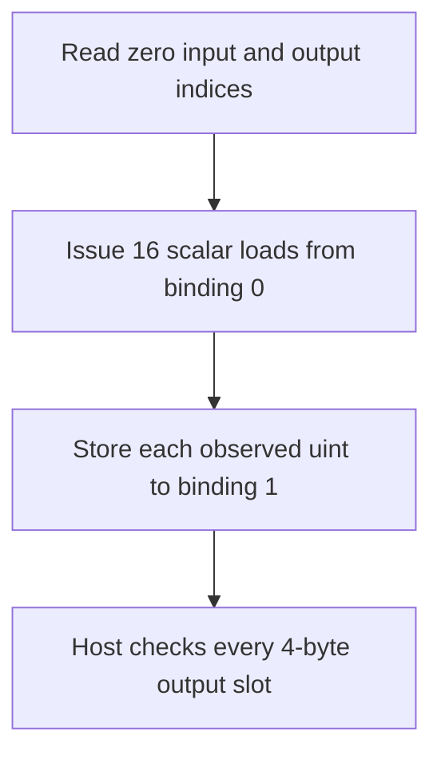

## Overview

**Core question:** Does the robustness buffer-access generator preserve permitted results for uniform, storage, and texel-buffer accesses that cross a descriptor or allocation boundary?

- This page covers `robustness.buffer_access`, `robustness.pipeline_robustness_buffer_access`, and `robustness.descriptor_heap_buffer_access` from [vktRobustnessBufferAccessTests.cpp](../../../modules/vulkan/robustness/vktRobustnessBufferAccessTests.cpp#L1930-L2122).
- The shared generator varies shader stage, access form, format, range, and read/write operation; the latter two roots are non-VulkanSC variants with different feature/device setup.
- The host checks in-range values, partial accesses, out-of-bounds results, and untouched output bytes against the local robustness predicates.

## Background Knowledge

For the shared model of bounded resource access, robustness contracts, and shader/host responsibilities, see [Robustness Background Knowledge](../../categories/robustness.md#background-knowledge).

- **Buffer and texel-buffer access:** uniform/storage blocks use ordinary buffer addressing; texel-buffer cases use formatted texel fetch or image operations. The format determines element width and value interpretation.

## Registration Hierarchy

```text
robustness.buffer_access
├── vertex
├── fragment
├── compute
└── through_pointers (registered here, implemented by VariablePointers.md)

robustness.pipeline_robustness_buffer_access
├── compute
├── fragment
└── vertex

robustness.descriptor_heap_buffer_access
├── compute
├── fragment
└── vertex
```

`pipeline_robustness_buffer_access` and `descriptor_heap_buffer_access` are registered only outside Vulkan SC. The shared factory and dispatcher are [here](../../../modules/vulkan/robustness/vktRobustnessBufferAccessTests.cpp#L1930-L2122) and [here](../../../modules/vulkan/robustness/vktRobustnessTests.cpp#L65-L95).

## Parameter Dimensions and Observed Values

| Dimension | Registered values | Meaning in this test | Evidence |
|-----------|-------------------|----------------------|----------|
| Root mode | `buffer_access`, `pipeline_robustness_buffer_access`, `descriptor_heap_buffer_access` | Selects ordinary robust-device setup, pipeline robustness, or descriptor-heap binding. | [Factory flags](../../../modules/vulkan/robustness/vktRobustnessBufferAccessTests.cpp#L2097-L2122) |
| Shader stage | `vertex`, `fragment`, `compute` | Runs equivalent access logic in graphics or compute execution. | [Stage registration](../../../modules/vulkan/robustness/vktRobustnessBufferAccessTests.cpp#L1939-L1943) |
| Access type | `mat4_copy`, `vec4_copy`, `vec4_member_copy`, `scalar_copy`, `texel_copy` | Changes access granularity and generated resource declarations. | [Shader types](../../../modules/vulkan/robustness/vktRobustnessBufferAccessTests.cpp#L49-L58) |
| Format | `r32_sint`, `r32_uint`, `r64_sint`, `r64_uint`, `r32_sfloat`, plus four-component texel formats | Changes scalar width, component layout, and required features. | [Format arrays](../../../modules/vulkan/robustness/vktRobustnessBufferAccessTests.cpp#L1945-L1951) |
| Operation | `oob_uniform_read`, `oob_storage_read`, `oob_storage_write` | Selects the access direction and descriptor class. | [Operation groups](../../../modules/vulkan/robustness/vktRobustnessBufferAccessTests.cpp#L2023-L2058) |
| Range | `range_1_byte`, `range_3_bytes`, `range_4_bytes`, `range_32_bytes`, `range_1_texel`, `range_3_texels` | Creates complete or partial boundary crossings. | [Range arrays](../../../modules/vulkan/robustness/vktRobustnessBufferAccessTests.cpp#L1953-L1963) |
| Boundary group | ordinary range and `out_of_alloc` | Separates descriptor-range overrun from backing-allocation overrun. | [Out-of-allocation generation](../../../modules/vulkan/robustness/vktRobustnessBufferAccessTests.cpp#L2063-L2089) |

## Behavior Parameters

The primary behavioral axis is the operation subgroup.

### `oob_uniform_read` — read outside a uniform descriptor range

The shader reads from a uniform buffer or uniform texel buffer after the descriptor-visible range is shortened. Fully in-range reads must reproduce the expected input, while partial or wholly out-of-range reads must satisfy the verifier's accepted buffer-derived, zero, or applicable vector result rules.

### `oob_storage_read` — read outside a storage descriptor range

The shader reads through a storage buffer or storage texel buffer. The same range and partial-access checks apply; pipeline-robustness mode omits this operation as duplicated coverage.

### `oob_storage_write` — write outside a storage descriptor range

The shader writes through a storage resource. The verifier checks that in-range writes are correct and that invalid portions remain unchanged or contain only permitted values.

The orthogonal `out_of_alloc` boundary group contains the same operation leaves (except the pruned pipeline-robustness storage-read leaf). It moves the selected input or output index to the last generated array or vector position so the access crosses the memory-backed range instead of testing only the ordinary short-range cases.

## Shader Analysis

The generator emits GLSL for compute, vertex, and fragment paths. A representative compute case isolates a scalar storage-buffer read with a shortened descriptor range.

### Representative Shader Walkthrough 1

#### Parameter Values Chosen

Representative path:

```text
dEQP-VK.robustness.buffer_access.compute.scalar_copy.r32_uint.oob_storage_read.range_3_bytes
```

| Parameter choice | Meaning in this representative case |
|------------------|-------------------------------------|
| `compute` | Uses a `local_size = 1,1,1` compute shader. |
| `scalar_copy` | Emits 16 separate scalar loads and stores rather than one aggregate copy. |
| `r32_uint` | Selects the integer `uvec4[128][4]` storage-block declarations. |
| `oob_storage_read.range_3_bytes` | Uses a storage-buffer input whose three-byte range is shorter than each 32-bit scalar load. |

#### Purpose

The shader exposes the results of 16 scalar loads through an output storage buffer. With a three-byte input range, each 32-bit load reaches beyond the descriptor range and must produce a result accepted by the robust-access verifier.

#### Structural Design



#### Shader Code

```glsl
#version 440
#extension GL_EXT_texture_buffer : require
precision highp float;
/// Binding 0 is the storage-buffer input whose descriptor range is only three bytes in this case.
layout(binding = 0, std430) buffer readonly InBuffer
{
    uvec4 inVecs[128][4];
};

/// Binding 1 records all 16 scalar observations in the first four output vectors.
layout(binding = 1, std430) buffer OutBuffer
{
    uvec4 outVecs[128][4];
};

/// The host leaves both indices at zero for descriptor-range cases.
layout(binding = 2, std140) uniform Indices
{
    int inIndex;
    int outIndex;
};

void main (void)
{
    /// Copy separate scalar components so each 32-bit load is checked against the short input range.
    outVecs[outIndex][0][0] = inVecs[inIndex][0][0];
    outVecs[outIndex][0][1] = inVecs[inIndex][0][1];
    outVecs[outIndex][0][2] = inVecs[inIndex][0][2];
    outVecs[outIndex][0][3] = inVecs[inIndex][0][3];

    outVecs[outIndex][1][0] = inVecs[inIndex][1][0];
    outVecs[outIndex][1][1] = inVecs[inIndex][1][1];
    outVecs[outIndex][1][2] = inVecs[inIndex][1][2];
    outVecs[outIndex][1][3] = inVecs[inIndex][1][3];

    outVecs[outIndex][2][0] = inVecs[inIndex][2][0];
    outVecs[outIndex][2][1] = inVecs[inIndex][2][1];
    outVecs[outIndex][2][2] = inVecs[inIndex][2][2];
    outVecs[outIndex][2][3] = inVecs[inIndex][2][3];

    outVecs[outIndex][3][0] = inVecs[inIndex][3][0];
    outVecs[outIndex][3][1] = inVecs[inIndex][3][1];
    outVecs[outIndex][3][2] = inVecs[inIndex][3][2];
    outVecs[outIndex][3][3] = inVecs[inIndex][3][3];
}
```

#### Additional Info

- The integer `scalar_copy` branch emits `uvec4 inVecs[128][4]`/`outVecs[128][4]` blocks and 16 component-wise assignments [source](../../../modules/vulkan/robustness/vktRobustnessBufferAccessTests.cpp#L432-L515).
- Descriptor-range cases leave `inIndex` and `outIndex` at zero; only `out_of_alloc` cases move an index near an allocation end [index setup](../../../modules/vulkan/robustness/vktRobustnessBufferAccessTests.cpp#L1154-L1184).

#### Parameter Variation Summary

| Parameter dimension | Shader-level variation from this shader | Evidence |
|---------------------|---------------------------------------|----------|
| Access type | Replaces the component-wise scalar assignments with matrix, vector, member, or texel-buffer operations. | [Shader generators](../../../modules/vulkan/robustness/vktRobustnessBufferAccessTests.cpp#L318-L574) |
| Stage | Wraps the generated access in compute, vertex, or fragment stage declarations and execution code. | [Stage assembly](../../../modules/vulkan/robustness/vktRobustnessBufferAccessTests.cpp#L591-L699) |
| Format | Changes block element types or selects formatted texel-buffer declarations and operations. | [Buffer and texel generators](../../../modules/vulkan/robustness/vktRobustnessBufferAccessTests.cpp#L318-L574) |
| Operation | Selects uniform-block reads, storage-block reads, or storage-buffer writes through the generator's `readFromStorage` and instance setup. | [Program selection](../../../modules/vulkan/robustness/vktRobustnessBufferAccessTests.cpp#L701-L905) |
| Root mode | Leaves this GLSL unchanged while selecting device-level robustness, pipeline robustness, or descriptor-heap setup. | [Root setup](../../../modules/vulkan/robustness/vktRobustnessBufferAccessTests.cpp#L721-L905) |

#### SPIR-V

- Status: generated and validated
- Source: reconstructed `GLSL` from this walkthrough
- Stage: `comp`
- Target SPIRV version: `spirv1.0`

<details>
<summary>Click to expand SPIRV asm code</summary>

```llvm
; SPIR-V
; Version: 1.0
; Generator: Khronos Glslang Reference Front End; 11
; Bound: 146
; Schema: 0
               OpCapability Shader
          %1 = OpExtInstImport "GLSL.std.450"
               OpMemoryModel Logical GLSL450
               OpEntryPoint GLCompute %main "main"
               OpExecutionMode %main LocalSize 1 1 1
               OpSource GLSL 440
               OpSourceExtension "GL_EXT_texture_buffer"
               OpName %main "main"
               OpName %OutBuffer "OutBuffer"
               OpMemberName %OutBuffer 0 "outVecs"
               OpName %_ ""
               OpName %Indices "Indices"
               OpMemberName %Indices 0 "inIndex"
               OpMemberName %Indices 1 "outIndex"
               OpName %__0 ""
               OpName %InBuffer "InBuffer"
               OpMemberName %InBuffer 0 "inVecs"
               OpName %__1 ""
               OpDecorate %_arr_v4uint_uint_4 ArrayStride 16
               OpDecorate %_arr__arr_v4uint_uint_4_uint_128 ArrayStride 64
               OpDecorate %OutBuffer BufferBlock
               OpMemberDecorate %OutBuffer 0 Offset 0
               OpDecorate %_ Binding 1
               OpDecorate %_ DescriptorSet 0
               OpDecorate %Indices Block
               OpMemberDecorate %Indices 0 Offset 0
               OpMemberDecorate %Indices 1 Offset 4
               OpDecorate %__0 Binding 2
               OpDecorate %__0 DescriptorSet 0
               OpDecorate %_arr_v4uint_uint_4_0 ArrayStride 16
               OpDecorate %_arr__arr_v4uint_uint_4_0_uint_128 ArrayStride 64
               OpDecorate %InBuffer BufferBlock
               OpMemberDecorate %InBuffer 0 NonWritable
               OpMemberDecorate %InBuffer 0 Offset 0
               OpDecorate %__1 NonWritable
               OpDecorate %__1 Binding 0
               OpDecorate %__1 DescriptorSet 0
       %void = OpTypeVoid
          %3 = OpTypeFunction %void
       %uint = OpTypeInt 32 0
     %v4uint = OpTypeVector %uint 4
     %uint_4 = OpConstant %uint 4
%_arr_v4uint_uint_4 = OpTypeArray %v4uint %uint_4
   %uint_128 = OpConstant %uint 128
%_arr__arr_v4uint_uint_4_uint_128 = OpTypeArray %_arr_v4uint_uint_4 %uint_128
  %OutBuffer = OpTypeStruct %_arr__arr_v4uint_uint_4_uint_128
%_ptr_Uniform_OutBuffer = OpTypePointer Uniform %OutBuffer
          %_ = OpVariable %_ptr_Uniform_OutBuffer Uniform
        %int = OpTypeInt 32 1
      %int_0 = OpConstant %int 0
    %Indices = OpTypeStruct %int %int
%_ptr_Uniform_Indices = OpTypePointer Uniform %Indices
        %__0 = OpVariable %_ptr_Uniform_Indices Uniform
      %int_1 = OpConstant %int 1
%_ptr_Uniform_int = OpTypePointer Uniform %int
%_arr_v4uint_uint_4_0 = OpTypeArray %v4uint %uint_4
%_arr__arr_v4uint_uint_4_0_uint_128 = OpTypeArray %_arr_v4uint_uint_4_0 %uint_128
   %InBuffer = OpTypeStruct %_arr__arr_v4uint_uint_4_0_uint_128
%_ptr_Uniform_InBuffer = OpTypePointer Uniform %InBuffer
        %__1 = OpVariable %_ptr_Uniform_InBuffer Uniform
     %uint_0 = OpConstant %uint 0
%_ptr_Uniform_uint = OpTypePointer Uniform %uint
     %uint_1 = OpConstant %uint 1
     %uint_2 = OpConstant %uint 2
     %uint_3 = OpConstant %uint 3
      %int_2 = OpConstant %int 2
      %int_3 = OpConstant %int 3
       %main = OpFunction %void None %3
          %5 = OpLabel
         %22 = OpAccessChain %_ptr_Uniform_int %__0 %int_1
         %23 = OpLoad %int %22
         %29 = OpAccessChain %_ptr_Uniform_int %__0 %int_0
         %30 = OpLoad %int %29
         %33 = OpAccessChain %_ptr_Uniform_uint %__1 %int_0 %30 %int_0 %uint_0
         %34 = OpLoad %uint %33
         %35 = OpAccessChain %_ptr_Uniform_uint %_ %int_0 %23 %int_0 %uint_0
               OpStore %35 %34
         %36 = OpAccessChain %_ptr_Uniform_int %__0 %int_1
         %37 = OpLoad %int %36
         %38 = OpAccessChain %_ptr_Uniform_int %__0 %int_0
         %39 = OpLoad %int %38
         %41 = OpAccessChain %_ptr_Uniform_uint %__1 %int_0 %39 %int_0 %uint_1
         %42 = OpLoad %uint %41
         %43 = OpAccessChain %_ptr_Uniform_uint %_ %int_0 %37 %int_0 %uint_1
               OpStore %43 %42
         %44 = OpAccessChain %_ptr_Uniform_int %__0 %int_1
         %45 = OpLoad %int %44
         %46 = OpAccessChain %_ptr_Uniform_int %__0 %int_0
         %47 = OpLoad %int %46
         %49 = OpAccessChain %_ptr_Uniform_uint %__1 %int_0 %47 %int_0 %uint_2
         %50 = OpLoad %uint %49
         %51 = OpAccessChain %_ptr_Uniform_uint %_ %int_0 %45 %int_0 %uint_2
               OpStore %51 %50
         %52 = OpAccessChain %_ptr_Uniform_int %__0 %int_1
         %53 = OpLoad %int %52
         %54 = OpAccessChain %_ptr_Uniform_int %__0 %int_0
         %55 = OpLoad %int %54
         %57 = OpAccessChain %_ptr_Uniform_uint %__1 %int_0 %55 %int_0 %uint_3
         %58 = OpLoad %uint %57
         %59 = OpAccessChain %_ptr_Uniform_uint %_ %int_0 %53 %int_0 %uint_3
               OpStore %59 %58
         %60 = OpAccessChain %_ptr_Uniform_int %__0 %int_1
         %61 = OpLoad %int %60
         %62 = OpAccessChain %_ptr_Uniform_int %__0 %int_0
         %63 = OpLoad %int %62
         %64 = OpAccessChain %_ptr_Uniform_uint %__1 %int_0 %63 %int_1 %uint_0
         %65 = OpLoad %uint %64
         %66 = OpAccessChain %_ptr_Uniform_uint %_ %int_0 %61 %int_1 %uint_0
               OpStore %66 %65
         %67 = OpAccessChain %_ptr_Uniform_int %__0 %int_1
         %68 = OpLoad %int %67
         %69 = OpAccessChain %_ptr_Uniform_int %__0 %int_0
         %70 = OpLoad %int %69
         %71 = OpAccessChain %_ptr_Uniform_uint %__1 %int_0 %70 %int_1 %uint_1
         %72 = OpLoad %uint %71
         %73 = OpAccessChain %_ptr_Uniform_uint %_ %int_0 %68 %int_1 %uint_1
               OpStore %73 %72
         %74 = OpAccessChain %_ptr_Uniform_int %__0 %int_1
         %75 = OpLoad %int %74
         %76 = OpAccessChain %_ptr_Uniform_int %__0 %int_0
         %77 = OpLoad %int %76
         %78 = OpAccessChain %_ptr_Uniform_uint %__1 %int_0 %77 %int_1 %uint_2
         %79 = OpLoad %uint %78
         %80 = OpAccessChain %_ptr_Uniform_uint %_ %int_0 %75 %int_1 %uint_2
               OpStore %80 %79
         %81 = OpAccessChain %_ptr_Uniform_int %__0 %int_1
         %82 = OpLoad %int %81
         %83 = OpAccessChain %_ptr_Uniform_int %__0 %int_0
         %84 = OpLoad %int %83
         %85 = OpAccessChain %_ptr_Uniform_uint %__1 %int_0 %84 %int_1 %uint_3
         %86 = OpLoad %uint %85
         %87 = OpAccessChain %_ptr_Uniform_uint %_ %int_0 %82 %int_1 %uint_3
               OpStore %87 %86
         %88 = OpAccessChain %_ptr_Uniform_int %__0 %int_1
         %89 = OpLoad %int %88
         %91 = OpAccessChain %_ptr_Uniform_int %__0 %int_0
         %92 = OpLoad %int %91
         %93 = OpAccessChain %_ptr_Uniform_uint %__1 %int_0 %92 %int_2 %uint_0
         %94 = OpLoad %uint %93
         %95 = OpAccessChain %_ptr_Uniform_uint %_ %int_0 %89 %int_2 %uint_0
               OpStore %95 %94
         %96 = OpAccessChain %_ptr_Uniform_int %__0 %int_1
         %97 = OpLoad %int %96
         %98 = OpAccessChain %_ptr_Uniform_int %__0 %int_0
         %99 = OpLoad %int %98
        %100 = OpAccessChain %_ptr_Uniform_uint %__1 %int_0 %99 %int_2 %uint_1
        %101 = OpLoad %uint %100
        %102 = OpAccessChain %_ptr_Uniform_uint %_ %int_0 %97 %int_2 %uint_1
               OpStore %102 %101
        %103 = OpAccessChain %_ptr_Uniform_int %__0 %int_1
        %104 = OpLoad %int %103
        %105 = OpAccessChain %_ptr_Uniform_int %__0 %int_0
        %106 = OpLoad %int %105
        %107 = OpAccessChain %_ptr_Uniform_uint %__1 %int_0 %106 %int_2 %uint_2
        %108 = OpLoad %uint %107
        %109 = OpAccessChain %_ptr_Uniform_uint %_ %int_0 %104 %int_2 %uint_2
               OpStore %109 %108
        %110 = OpAccessChain %_ptr_Uniform_int %__0 %int_1
        %111 = OpLoad %int %110
        %112 = OpAccessChain %_ptr_Uniform_int %__0 %int_0
        %113 = OpLoad %int %112
        %114 = OpAccessChain %_ptr_Uniform_uint %__1 %int_0 %113 %int_2 %uint_3
        %115 = OpLoad %uint %114
        %116 = OpAccessChain %_ptr_Uniform_uint %_ %int_0 %111 %int_2 %uint_3
               OpStore %116 %115
        %117 = OpAccessChain %_ptr_Uniform_int %__0 %int_1
        %118 = OpLoad %int %117
        %120 = OpAccessChain %_ptr_Uniform_int %__0 %int_0
        %121 = OpLoad %int %120
        %122 = OpAccessChain %_ptr_Uniform_uint %__1 %int_0 %121 %int_3 %uint_0
        %123 = OpLoad %uint %122
        %124 = OpAccessChain %_ptr_Uniform_uint %_ %int_0 %118 %int_3 %uint_0
               OpStore %124 %123
        %125 = OpAccessChain %_ptr_Uniform_int %__0 %int_1
        %126 = OpLoad %int %125
        %127 = OpAccessChain %_ptr_Uniform_int %__0 %int_0
        %128 = OpLoad %int %127
        %129 = OpAccessChain %_ptr_Uniform_uint %__1 %int_0 %128 %int_3 %uint_1
        %130 = OpLoad %uint %129
        %131 = OpAccessChain %_ptr_Uniform_uint %_ %int_0 %126 %int_3 %uint_1
               OpStore %131 %130
        %132 = OpAccessChain %_ptr_Uniform_int %__0 %int_1
        %133 = OpLoad %int %132
        %134 = OpAccessChain %_ptr_Uniform_int %__0 %int_0
        %135 = OpLoad %int %134
        %136 = OpAccessChain %_ptr_Uniform_uint %__1 %int_0 %135 %int_3 %uint_2
        %137 = OpLoad %uint %136
        %138 = OpAccessChain %_ptr_Uniform_uint %_ %int_0 %133 %int_3 %uint_2
               OpStore %138 %137
        %139 = OpAccessChain %_ptr_Uniform_int %__0 %int_1
        %140 = OpLoad %int %139
        %141 = OpAccessChain %_ptr_Uniform_int %__0 %int_0
        %142 = OpLoad %int %141
        %143 = OpAccessChain %_ptr_Uniform_uint %__1 %int_0 %142 %int_3 %uint_3
        %144 = OpLoad %uint %143
        %145 = OpAccessChain %_ptr_Uniform_uint %_ %int_0 %140 %int_3 %uint_3
               OpStore %145 %144
               OpReturn
               OpFunctionEnd
```

</details>

## Runtime Execution and Result Checking

- The instance creates a custom robust device when required, then allocates and initializes input, output, and index resources [device and buffer setup](../../../modules/vulkan/robustness/vktRobustnessBufferAccessTests.cpp#L721-L1178).
- The output allocation is initialized to `0xFF`; input data is filled with deterministic format-specific values [initialization](../../../modules/vulkan/robustness/vktRobustnessBufferAccessTests.cpp#L1002-L1104).
- One compute dispatch or graphics draw executes the generated shader. The host waits for completion and invalidates the output allocation before reading it [iteration](../../../modules/vulkan/robustness/vktRobustnessBufferAccessTests.cpp#L1591-L1626).
- `verifyResult()` checks four-byte slots, partial access portions, untouched bytes, accepted zero/in-range values, and the permitted vector pattern [verification](../../../modules/vulkan/robustness/vktRobustnessBufferAccessTests.cpp#L1634-L1851).
- A case returns `pass("All values OK")` only when no invalid output is found; otherwise it returns `fail("Invalid value(s) found")` [result](../../../modules/vulkan/robustness/vktRobustnessBufferAccessTests.cpp#L1628-L1631).

## Failure Meaning

### Failure Cause Mapping

| If this behavior parameter value fails | Possible failure cause(s) |
|----------------------------------------|---------------------------|
| `oob_uniform_read` | Uniform-buffer or uniform-texel-buffer robust-read handling produced a value outside the accepted set, or corrupted an unrelated output slot. |
| `oob_storage_read` | Storage-buffer or storage-texel-buffer robust-read handling produced a value outside the accepted set, including an invalid partial or vector result. |
| `oob_storage_write` | A storage-buffer or storage-texel-buffer out-of-bounds write changed protected bytes or stored a value outside the verifier's permitted set. |

All values also depend on correct stage execution, descriptor or descriptor-heap setup, format handling, synchronization, and host readback.

### Cause Analysis

#### Buffer boundary enforcement

**Possible failure symptoms:** an in-range value is wrong, an out-of-range value is outside the accepted set, or untouched output bytes change unexpectedly.

**Possible implementation causes:** the failure requires implementation-level investigation of descriptor bounds, robust access lowering, resource format handling, or host-visible memory synchronization; the source does not identify one unique layer.

## Case Pruning

### Requirement-based pruning

Cases are skipped when required robust-buffer, stage-store, 64-bit, texel-format, pipeline-robustness, descriptor-heap, or buffer-device-address support is unavailable [support checks](../../../modules/vulkan/robustness/vktRobustnessBufferAccessTests.cpp#L281-L315) [resource checks](../../../modules/vulkan/robustness/vktRobustnessBufferAccessTests.cpp#L918-L999).

### Design-based pruning

Matrix reductions keep `mat4_copy` for floating-point formats, restrict `vec4_member_copy` to accesses no wider than 16 bytes, reduce pipeline-robustness formats, and omit pipeline-robustness storage reads as duplicated coverage [generation](../../../modules/vulkan/robustness/vktRobustnessBufferAccessTests.cpp#L2009-L2089).

## Key Takeaways

- One generator covers ordinary, pipeline-selected, and descriptor-heap buffer robustness while changing only the setup flags and intentional reductions.
- The matrix separates descriptor-range failures from backing-allocation failures through ordinary range cases and `out_of_alloc`.
- The verifier is deliberately permissive only within the values allowed by the tested robustness behavior; arbitrary data is not accepted.
- `through_pointers` is registered under `buffer_access` but is implemented on the separate `VariablePointers.md` page.

## Source Reference Appendix

| Entry point | Link | Why it matters |
|-------------|------|----------------|
| Shader generation | [genBufferShaderAccess()](../../../modules/vulkan/robustness/vktRobustnessBufferAccessTests.cpp#L318-L699) | Emits the stage- and format-specific GLSL access logic. |
| Device and feature setup | [Read/write instance creation](../../../modules/vulkan/robustness/vktRobustnessBufferAccessTests.cpp#L721-L905) | Selects robust, pipeline-robustness, and descriptor-heap paths. |
| Resource setup | [Buffer and descriptor setup](../../../modules/vulkan/robustness/vktRobustnessBufferAccessTests.cpp#L918-L1536) | Creates buffers, descriptors, and execution environments. |
| Host verification | [verifyResult()](../../../modules/vulkan/robustness/vktRobustnessBufferAccessTests.cpp#L1543-L1851) | Defines accepted values and final status. |
| Registration | [addBufferAccessTests()](../../../modules/vulkan/robustness/vktRobustnessBufferAccessTests.cpp#L1930-L2122) | Defines roots, direct children, and parameter reductions. |
| Category insertion | [Dispatcher](../../../modules/vulkan/robustness/vktRobustnessTests.cpp#L65-L95) | Attaches the roots below `robustness`. |
