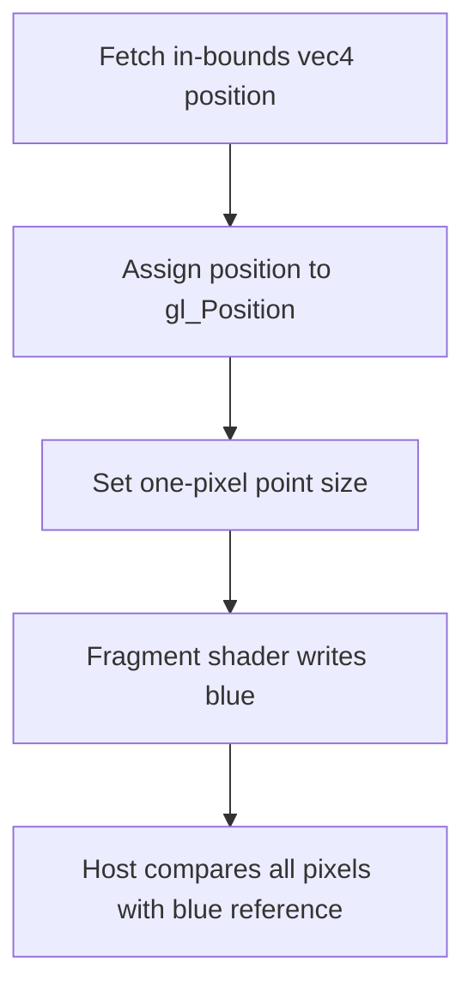

## Overview

**Core question:** Do robustness extensions return permitted values for out-of-bounds or null accesses without corrupting valid data?

- This page covers the extension test matrix implemented by [vktRobustnessExtsTests.cpp](../../../modules/vulkan/robustness/vktRobustnessExtsTests.cpp#L1-L4376).
- The source implements `robustness.robustness2`, `robustness.image_robustness`, and, outside Vulkan SC, `robustness.pipeline_robustness`.
- The matrix varies descriptor update method, resource and format, shader stage, access shape, and pipeline construction, then checks the observed values against the selected robustness contract.

## Background Knowledge

For the shared model of bounded resource access, robustness contracts, and shader/host responsibilities, see [Robustness Background Knowledge](../../categories/robustness.md#background-knowledge).

- **Null descriptors:** with `nullDescriptor`, a descriptor containing `VK_NULL_HANDLE` has defined zero-like access and query behavior.
- **Pipeline robustness:** `VkPipelineRobustnessCreateInfoEXT` selects robustness behavior for pipeline stages or resource categories without changing the descriptor itself.

## Registration Hierarchy

The `robustness` test category registers the three extension test families implemented by this source file.

```text
robustness
├── robustness2
├── image_robustness
└── pipeline_robustness
```

`pipeline_robustness` is excluded from Vulkan SC builds. The factories and literal test family names are visible in the [top-level registration code](../../../modules/vulkan/robustness/vktRobustnessExtsTests.cpp#L4311-L4372). Deeper generated paths are documented under parameter dimensions and behavior parameters.

## Parameter Dimensions and Observed Values

| Dimension | Registered values | Meaning in this test | Evidence |
|-----------|-------------------|----------------------|----------|
| Robustness mode | `robustness2`, `image_robustness`, `pipeline_robustness` | Selects the value contract and whether robustness is enabled as a device feature or pipeline state. | [Factories](../../../modules/vulkan/robustness/vktRobustnessExtsTests.cpp#L4311-L4345) |
| Descriptor update | `bind`, `push` (non-Vulkan SC) | Compares ordinary descriptor sets with push descriptors. | [`pushCases[]`](../../../modules/vulkan/robustness/vktRobustnessExtsTests.cpp#L3947-L3952) |
| Format | `r32i`, `r32ui`, `r32f`, `rg32i`, `rg32ui`, `rg32f`, `rgba32i`, `rgba32ui`, `rgba32f`, `r64i`, `r64ui` | Changes element width, component count, and numeric interpretation. | [`fmtCases[]`](../../../modules/vulkan/robustness/vktRobustnessExtsTests.cpp#L3850-L3862) |
| Descriptor/resource type | `uniform_buffer`, `storage_buffer`, `uniform_buffer_dynamic`, `storage_buffer_dynamic`, `uniform_texel_buffer`, `storage_texel_buffer`, `storage_image`, `sampled_image`, `vertex_attribute_fetch` | Chooses the Vulkan access path subjected to robustness. | [`fullDescCases[]`](../../../modules/vulkan/robustness/vktRobustnessExtsTests.cpp#L3864-L3874) |
| Image view type | `1d`, `2d`, `3d`, `cube`, `1d_array`, `2d_array`, `cube_array` | Exercises coordinate and layer handling for different image shapes. | [`viewCases[]`](../../../modules/vulkan/robustness/vktRobustnessExtsTests.cpp#L3897-L3905) |
| Shader stage | `comp`, `frag`, `vert`, `rgen` (rgen non-Vulkan SC) | Selects compute, fragment, vertex, or ray-generation execution. | [`stageCases[]`](../../../modules/vulkan/robustness/vktRobustnessExtsTests.cpp#L3912-L3923) |
| Pipeline construction | monolithic; fast GPL and optimized GPL (graphics pipeline, non-Vulkan SC) | Changes where pipeline robustness state is attached and consumed. | [Pipeline expansion](../../../modules/vulkan/robustness/vktRobustnessExtsTests.cpp#L4182-L4205) |
| Access modifiers | `notemplate`/`template` (template non-Vulkan SC), `dontunroll`/`unroll`, `nonvolatile`/`volatile`, `no_fmt_qual`/`fmt_qual`, `readwrite`/`readonly` | Covers descriptor-update and shader-access paths that exercise robustness for update templates, loop control, memory volatility, image format declarations, and storage read/write behavior. | [Parameter arrays](../../../modules/vulkan/robustness/vktRobustnessExtsTests.cpp#L3930-L3962) |

## Behavior Parameters

The primary behavioral axis is the robustness mode because it changes which out-of-bounds results are legal and where the behavior is selected.

### `robustness2` — strict buffer, image, and null-descriptor behavior

Cases enable robustness2 features on a custom device. In-bounds reads must retain their reference values; out-of-bounds accesses must match the robustness2 component-default rules. Null-descriptor cases additionally check zero-like access and size-query results. The nested `64b_indexing` group repeats storage-buffer coverage with `VK_PIPELINE_CREATE_2_64_BIT_INDEXING_BIT_EXT`.

### `image_robustness` — robust image access

These cases restrict the generated matrix to storage and sampled images. They accept the image-robustness result set, including the permitted zero-or-one alpha behavior, while still requiring deterministic in-bounds texels.

### `pipeline_robustness` — per-pipeline robustness selection

Outside Vulkan SC, these cases attach `VkPipelineRobustnessCreateInfoEXT` during compute, graphics, or ray-tracing pipeline construction. Nested `robustness2` and `image_robustness` families verify that the selected pipeline resource behavior is honored across monolithic and graphics-pipeline-library paths.

## Shader Analysis

The source generates shaders for both the large resource-access matrix and the focused `misc` stride cases. The representative case below isolates robust vertex-input fetching: the final vertex lies inside the buffer even though the padding at the end of its stride does not.

### Representative Shader Walkthrough 1

#### Parameter Values Chosen

Representative path:

```text
dEQP-VK.robustness.robustness2.misc.out_of_bounds_stride
```

| Parameter choice | Meaning in this representative case |
|------------------|-------------------------------------|
| `robustness2` | Enables the `robustBufferAccess2` contract checked by this case. |
| `out_of_bounds_stride` | Uses a pipeline-declared vertex binding stride whose final padding extends beyond the buffer while the final position remains in bounds. |

#### Purpose

The vertex shader consumes every in-bounds position, including the final position whose surrounding stride extends past the vertex buffer. A correct robust fetch produces one point at each expected pixel.

#### Structural Design



#### Shader Code

```glsl
#version 460
/// The host binds one vec4 position followed by one vec4 padding slot per vertex.
layout (location=0) in vec4 inPos;
void main (void) {
    /// The last position remains in bounds even though its trailing padding is outside the buffer.
    gl_Position = inPos;
    gl_PointSize = 1.0;
}
```

#### Additional Info

- The fixed fragment shader writes opaque blue; the host compares the copied attachment against that color for every pixel.

#### Parameter Variation Summary

| Parameter dimension | Shader-level variation from this shader | Evidence |
|---------------------|---------------------------------------|----------|
| Dynamic stride | `out_of_bounds_stride_dynamic_stride` keeps this vertex shader but supplies the same stride through dynamic vertex-input state. | [Stride case generation](../../../modules/vulkan/robustness/vktRobustnessExtsTests.cpp#L4294-L4308) |
| Pipeline robustness | The nested pipeline-robustness version keeps this shader and selects robust buffer access through `VkPipelineRobustnessCreateInfoEXT`. | [Pipeline robustness state](../../../modules/vulkan/robustness/vktRobustnessExtsTests.cpp#L3740-L3754) |
| Main generated matrix | Other registered paths replace this small shader with resource-specific declarations and checks generated by `RobustnessExtsTestCase::initPrograms`. | [Main shader generator](../../../modules/vulkan/robustness/vktRobustnessExtsTests.cpp#L1070-L1945) |

#### SPIR-V

- Status: generated and validated
- Source: reconstructed `GLSL` from this walkthrough
- Stage: `vert`
- Target SPIRV version: `spirv1.0`

<details>
<summary>Click to expand SPIRV asm code</summary>

```llvm
; SPIR-V
; Version: 1.0
; Generator: Khronos Glslang Reference Front End; 11
; Bound: 25
; Schema: 0
               OpCapability Shader
          %1 = OpExtInstImport "GLSL.std.450"
               OpMemoryModel Logical GLSL450
               OpEntryPoint Vertex %main "main" %_ %inPos
               OpSource GLSL 460
               OpName %main "main"
               OpName %gl_PerVertex "gl_PerVertex"
               OpMemberName %gl_PerVertex 0 "gl_Position"
               OpMemberName %gl_PerVertex 1 "gl_PointSize"
               OpMemberName %gl_PerVertex 2 "gl_ClipDistance"
               OpMemberName %gl_PerVertex 3 "gl_CullDistance"
               OpName %_ ""
               OpName %inPos "inPos"
               OpDecorate %gl_PerVertex Block
               OpMemberDecorate %gl_PerVertex 0 BuiltIn Position
               OpMemberDecorate %gl_PerVertex 1 BuiltIn PointSize
               OpMemberDecorate %gl_PerVertex 2 BuiltIn ClipDistance
               OpMemberDecorate %gl_PerVertex 3 BuiltIn CullDistance
               OpDecorate %inPos Location 0
       %void = OpTypeVoid
          %3 = OpTypeFunction %void
      %float = OpTypeFloat 32
    %v4float = OpTypeVector %float 4
       %uint = OpTypeInt 32 0
     %uint_1 = OpConstant %uint 1
%_arr_float_uint_1 = OpTypeArray %float %uint_1
%gl_PerVertex = OpTypeStruct %v4float %float %_arr_float_uint_1 %_arr_float_uint_1
%_ptr_Output_gl_PerVertex = OpTypePointer Output %gl_PerVertex
          %_ = OpVariable %_ptr_Output_gl_PerVertex Output
        %int = OpTypeInt 32 1
      %int_0 = OpConstant %int 0
%_ptr_Input_v4float = OpTypePointer Input %v4float
      %inPos = OpVariable %_ptr_Input_v4float Input
%_ptr_Output_v4float = OpTypePointer Output %v4float
      %int_1 = OpConstant %int 1
    %float_1 = OpConstant %float 1
%_ptr_Output_float = OpTypePointer Output %float
       %main = OpFunction %void None %3
          %5 = OpLabel
         %18 = OpLoad %v4float %inPos
         %20 = OpAccessChain %_ptr_Output_v4float %_ %int_0
               OpStore %20 %18
         %24 = OpAccessChain %_ptr_Output_float %_ %int_1
               OpStore %24 %float_1
               OpReturn
               OpFunctionEnd
```

</details>

## Runtime Execution and Result Checking

- A singleton device is created with the requested robustness feature chain because the context device may not enable those features ([device setup](../../../modules/vulkan/robustness/vktRobustnessExtsTests.cpp#L78-L180)).
- The host initializes deterministic resource data, creates the selected descriptor and pipeline path, and dispatches, draws, or traces rays once.
- The shader writes `(1,0,0,1)` for success and `(0,0,0,0)` for failure into an 8-by-8 storage image ([result write](../../../modules/vulkan/robustness/vktRobustnessExtsTests.cpp#L1853-L1860)).
- The host copies the image to visible memory and checks every component of every pixel ([execution and copyback](../../../modules/vulkan/robustness/vktRobustnessExtsTests.cpp#L3405-L3465), [result scan](../../../modules/vulkan/robustness/vktRobustnessExtsTests.cpp#L3467-L3494)).
- `misc.out_of_bounds_stride*` instead renders points and compares the copied color attachment against the blue reference image ([draw and validation](../../../modules/vulkan/robustness/vktRobustnessExtsTests.cpp#L3766-L3819)).

## Failure Meaning

### Failure Cause Mapping

| If this behavior parameter value fails | Possible failure cause(s) |
|----------------------------------------|---------------------------|
| `robustness2` | Incorrect robust buffer/image result, broken null-descriptor semantics, or corruption of an in-bounds access. |
| `image_robustness` | Image access returned a value outside the extension's permitted result set or changed valid texels. |
| `pipeline_robustness` | Pipeline robustness state was ignored, attached to the wrong pipeline component, or applied to the wrong resource category. |

### Cause Analysis

#### Robust access value or bounds handling

**Possible failure symptoms:** one or more output pixels are zero because a valid access differed from its reference value or an invalid access produced a disallowed component value.

**Possible implementation causes:** descriptor bounds, image-coordinate bounds, vertex-fetch bounds, or generated access lowering may apply the wrong robustness rule. For 64-bit indexing, truncation or incorrect handling of the 64-bit address expression can select an unintended element.

#### Null-descriptor semantics

**Possible failure symptoms:** a null-descriptor access or size query contributes a mismatch instead of the expected zero-like result.

**Possible implementation causes:** descriptor decoding or shader instruction lowering may fail to recognize the null descriptor for the tested resource operation.

#### Pipeline robustness state application

**Possible failure symptoms:** only pipeline-robustness variants fail while equivalent device-feature variants pass, or failures depend on monolithic versus GPL construction.

**Possible implementation causes:** `VkPipelineRobustnessCreateInfoEXT` may not be propagated to the relevant shader stage, pipeline library, or final linked pipeline.

## Case Pruning

### Requirement-based pruning

Cases are skipped when required features or extensions are absent. Important gates include `robustBufferAccess2`, `robustImageAccess2`, `robustImageAccess`, `nullDescriptor`, `pipelineRobustness`, `shader64BitIndexing`, `VK_KHR_push_descriptor`, `VK_KHR_ray_tracing_pipeline`, required 64-bit format features, shader stores/atomics, scalar block layout, dynamic vertex stride, and an exclusive compute queue where requested ([support checks](../../../modules/vulkan/robustness/vktRobustnessExtsTests.cpp#L519-L738)).

### Design-based pruning

Pipeline-robustness and `64b_indexing` use reduced format sets. Pipeline robustness also limits descriptor types, sample counts, view types, ray-generation cases, null descriptors, and non-power-of-two lengths; `64b_indexing` keeps storage buffers only. These exclusions constrain matrix size while retaining distinct robustness mechanisms ([generator and pruning](../../../modules/vulkan/robustness/vktRobustnessExtsTests.cpp#L3840-L4308)).

## Key Takeaways

- One source generator compares three related contracts: robustness2, image robustness, and pipeline-selected robustness.
- Success requires both sides of the boundary: valid accesses preserve initialized data, while invalid or null accesses return only permitted values.
- `bind`, `push`, shader-stage, format, and pipeline-construction variants exercise different implementation routes to the same contract.
- See `## Failure Meaning` to distinguish a value/bounds failure from null-descriptor or pipeline-state propagation failures.

## Source Reference Appendix

| Entry point | Link | Why it matters |
|-------------|------|----------------|
| Feature and custom-device setup | [Lines 69–180](../../../modules/vulkan/robustness/vktRobustnessExtsTests.cpp#L69-L180) | Enables the precise robustness feature set under test. |
| Case support checks | [Lines 519–738](../../../modules/vulkan/robustness/vktRobustnessExtsTests.cpp#L519-L738) | Defines requirement-based skips. |
| Generated shader logic | [Lines 1070–1993](../../../modules/vulkan/robustness/vktRobustnessExtsTests.cpp#L1070-L1993) | Builds robust-access comparisons and result writes. |
| Runtime and validation | [Lines 2021–3495](../../../modules/vulkan/robustness/vktRobustnessExtsTests.cpp#L2021-L3495) | Creates resources and pipelines, executes work, and scans results. |
| Stride cases | [Lines 3497–3820](../../../modules/vulkan/robustness/vktRobustnessExtsTests.cpp#L3497-L3820) | Implements `misc.out_of_bounds_stride*`. |
| Matrix generator and pruning | [Lines 3840–4308](../../../modules/vulkan/robustness/vktRobustnessExtsTests.cpp#L3840-L4308) | Registers parameters and removes unsupported or redundant combinations. |
| Root factories | [Lines 4311–4372](../../../modules/vulkan/robustness/vktRobustnessExtsTests.cpp#L4311-L4372) | Creates the documented hierarchy roots. |
| Category dispatcher | [vktRobustnessTests.cpp](../../../modules/vulkan/robustness/vktRobustnessTests.cpp#L84-L88) | Attaches the factories to `robustness`. |
| Mustpass inventory | [robustness.txt](../../../mustpass/main/vk-default/robustness.txt#L1866-L96873) | Confirms generated registered paths. |
