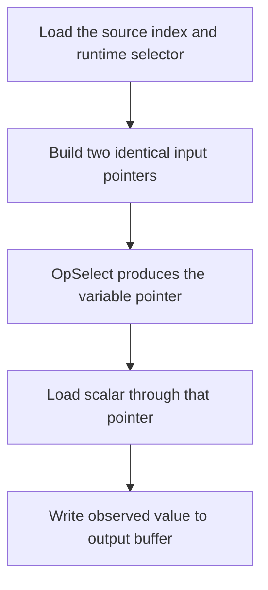

## Overview

**Core question:** Does robust buffer access remain correct when a storage-buffer access is performed through a pointer produced by a runtime-dependent SPIR-V `OpSelect`?

- This page covers `robustness.buffer_access.through_pointers`, implemented by [vktRobustBufferAccessWithVariablePointersTests.cpp](../../../modules/vulkan/robustness/vktRobustBufferAccessWithVariablePointersTests.cpp#L1-L2005).
- The source generates direct SPIR-V for storage-buffer reads and writes in compute, vertex, and fragment stages.
- The pointer candidates given to `OpSelect` are intentionally identical; the selector is loaded at run time so the access still passes through a variable pointer. The resulting access can be inside the allocation but outside the descriptor range, or beyond the backing allocation, and the host accepts only values permitted by the robustness checks.

## Background Knowledge

For the shared concepts bounded resource access and robustness contracts, see [Background Knowledge](../../categories/robustness.md#background-knowledge) of the `robustness` page.

- **Variable pointers:** `VariablePointersStorageBuffer` permits pointer-valued instructions such as `OpSelect` to produce storage-buffer pointers. This matters here because the tested load or store dereferences a pointer produced by `OpSelect`, rather than an `OpAccessChain` result directly.

## Registration Hierarchy

```text
robustness.buffer_access.through_pointers
├── graphics
└── compute
```

The root is inserted below `buffer_access` by [vktRobustnessTests.cpp](../../../modules/vulkan/robustness/vktRobustnessTests.cpp#L69-L82). The factory creates the `graphics` and `compute` direct children in [vktRobustBufferAccessWithVariablePointersTests.cpp](../../../modules/vulkan/robustness/vktRobustBufferAccessWithVariablePointersTests.cpp#L1897-L2001).

## Parameter Dimensions and Observed Values

| Dimension | Registered values | Meaning in this test | Evidence |
|-----------|-------------------|----------------------|----------|
| Execution path | `graphics`, `compute` | Selects a graphics pipeline or compute dispatch. | [Factory](../../../modules/vulkan/robustness/vktRobustBufferAccessWithVariablePointersTests.cpp#L1897-L2001) |
| Access direction | `reads`, `writes` | Places the selected pointer on a load or store operation. | [Case generation](../../../modules/vulkan/robustness/vktRobustBufferAccessWithVariablePointersTests.cpp#L1958-L1984) |
| Graphics stage | `vertex`, `fragment` | Chooses the graphics shader that performs the variable-pointer access. | [Stage mapping](../../../modules/vulkan/robustness/vktRobustBufferAccessWithVariablePointersTests.cpp#L1945-L1953) |
| Copy type | `vec4`, `scalar` | Usually changes the generated load/store width and result shape; for 64-bit integer formats, registered `vec4` cases deliberately use the scalar generation path. | [Type array and R64 mapping](../../../modules/vulkan/robustness/vktRobustBufferAccessWithVariablePointersTests.cpp#L843-L845) |
| Format | `s32`, `u32`, `f32`, `s64`, `u64` | Selects scalar representation and required shader capabilities. | [Format array](../../../modules/vulkan/robustness/vktRobustBufferAccessWithVariablePointersTests.cpp#L1923-L1927) |
| Descriptor range | `1B`, `3B`, `4B`, `16B`, `32B` | Sets the storage-buffer range visible through the descriptor, creating complete and partial boundary crossings. | [Range sizes](../../../modules/vulkan/robustness/vktRobustBufferAccessWithVariablePointersTests.cpp#L1929-L1931) |
| Boundary mode | `in_memory`, `out_of_memory` | Distinguishes descriptor-range overrun from backing-allocation overrun. | [Read/write registration](../../../modules/vulkan/robustness/vktRobustBufferAccessWithVariablePointersTests.cpp#L1955-L1983) |

## Behavior Parameters

The primary behavioral axis is access direction. Boundary mode remains an important matrix dimension because it determines whether the pointer is merely outside the descriptor range or also outside the backing allocation.

### `reads` — load through a selected pointer

The generated shader constructs two identical input-pointer candidates from the runtime-loaded source index, passes them through `OpSelect`, and loads a scalar or vector through the resulting pointer. In-range bytes must match deterministic input data; bytes outside the descriptor range must resolve to an accepted robust value.

### `writes` — store through a selected pointer

The generated shader constructs two identical output-pointer candidates from the runtime-loaded destination index, passes them through `OpSelect`, and stores the value loaded through a regular input pointer. Output locations inside the descriptor range may contain a value from the input descriptor range or zero; locations affected by an out-of-range write may remain unchanged or contain a value that the robust-access rules permit from memory bound to the buffer.

## Shader Analysis

The source emits direct SPIR-V rather than GLSL or HLSL. The representative operation is the source-backed `OpSelect` pointer choice followed by a load or store; the exact generated assembly is assembled by the CTS source in `MakeShader()` and the read/write builders.

### Representative Shader Walkthrough 1

#### Parameter Values Chosen

Representative path:

```text
dEQP-VK.robustness.buffer_access.through_pointers.compute.reads.16B_in_memory_with_scalar_f32
```

| Parameter choice | Meaning in this representative case |
|------------------|-------------------------------------|
| `compute` | Uses the compute entry point with local size `1,1,1`. |
| `reads` | Performs a variable-pointer load. |
| `16B_in_memory_with_scalar_f32` | Uses a scalar `f32` copy with a 16-byte input descriptor range. The input index remains zero, so the generated 16 scalar loads begin in range and cross that descriptor boundary while staying inside the allocation. |

#### Purpose

The shader verifies robust access when the load dereferences a storage-buffer pointer produced by a runtime-dependent `OpSelect`.

#### Structural Design



#### Shader Code

This direct-SPIR-V case does not use GLSL or HLSL. The implementation emits the following source-backed instruction sequence:

```text
OpCapability VariablePointersStorageBuffer
OpExtension "SPV_KHR_variable_pointers"
; construct two identical candidate storage-buffer pointers
%selected = OpSelect %pointer %condition %candidateA %candidateB
%value = OpLoad %scalar %selected
; store the observed value for host verification
```

#### Additional Info

- The compute entry point is generated with `LocalSize 1 1 1` by [MakeShader()](../../../modules/vulkan/robustness/vktRobustBufferAccessWithVariablePointersTests.cpp#L839-L876).
- Graphics cases place the same variable-pointer logic in the selected vertex or fragment stage and provide an unused pass-through shader for the other stage [program setup](../../../modules/vulkan/robustness/vktRobustBufferAccessWithVariablePointersTests.cpp#L1250-L1350).

#### Parameter Variation Summary

| Parameter dimension | Shader-level variation from this shader | Evidence |
|---------------------|---------------------------------------|----------|
| Access direction | Replaces the selected `OpLoad` with the corresponding output-buffer store path. | [Read/write builders](../../../modules/vulkan/robustness/vktRobustBufferAccessWithVariablePointersTests.cpp#L1105-L1218) |
| Execution path | Changes the entry-point stage and adds the required graphics pass-through stage. | [Program registration](../../../modules/vulkan/robustness/vktRobustBufferAccessWithVariablePointersTests.cpp#L1250-L1350) |
| Copy type and format | Changes scalar/vector types, byte width, and `Int64` capability for 64-bit formats. | [Shader generation](../../../modules/vulkan/robustness/vktRobustBufferAccessWithVariablePointersTests.cpp#L859-L869) |

#### SPIR-V

- Status: source-backed direct SPIR-V sequence; full artifact is generated by the CTS builder for the selected case
- Source: direct SPIR-V generated by `MakeShader()`
- Stage: `comp`
- Target SPIRV version: `spirv1.0`

<details>
<summary>Click to expand SPIRV asm code</summary>

```llvm
; SPIR-V
; Version: 1.0
; Generator: Vulkan CTS direct-SPIR-V builder
; Representative capability and pointer-selection instructions are shown above; the complete case-specific module is emitted at runtime.
```

</details>

## Runtime Execution and Result Checking

- A custom device enables `robustBufferAccess` and the variable-pointer storage-buffer feature [device setup](../../../modules/vulkan/robustness/vktRobustBufferAccessWithVariablePointersTests.cpp#L67-L87).
- Input and output buffers are initialized deterministically; output bytes use `0xBA` so untouched regions remain identifiable [setup](../../../modules/vulkan/robustness/vktRobustBufferAccessWithVariablePointersTests.cpp#L1387-L1479).
- One compute dispatch or graphics draw runs the selected stage. The result allocation is invalidated before host inspection [execution](../../../modules/vulkan/robustness/vktRobustBufferAccessWithVariablePointersTests.cpp#L1589-L1624).
- `verifyResult()` classifies each element by the accessible range, checks partial accesses byte by byte, and returns `pass("All values OK")` only when every observed value is permitted [verification](../../../modules/vulkan/robustness/vktRobustBufferAccessWithVariablePointersTests.cpp#L1632-L1848).

## Failure Meaning

### Failure Cause Mapping

| If this behavior parameter value fails | Possible failure cause(s) |
|----------------------------------------|---------------------------|
| `reads` | Variable-pointer selection, pointer dereference, descriptor-range handling, or robust out-of-bounds read result is incorrect. |
| `writes` | Variable-pointer store selection or robust out-of-bounds write containment is incorrect. |

### Cause Analysis

#### Variable-pointer robustness

**Possible failure symptoms:** a read result fails the deterministic in-range or permitted out-of-range checks, or a write changes output bytes to a value outside the accepted set.

**Possible implementation causes:** source inspection points to variable-pointer SPIR-V lowering, robust buffer bounds handling, or stage-specific storage-buffer access; the exact cause requires implementation-level investigation.

## Case Pruning

### Requirement-based pruning

Cases are skipped when variable-pointer storage-buffer support is unavailable, or when a portability-subset implementation lacks `robustBufferAccess` [case support checks](../../../modules/vulkan/robustness/vktRobustBufferAccessWithVariablePointersTests.cpp#L214-L224). R64 cases additionally require `shaderInt64`, while vertex and fragment cases require the corresponding pipeline-store feature [instance checks](../../../modules/vulkan/robustness/vktRobustBufferAccessWithVariablePointersTests.cpp#L1387-L1408).

### Design-based pruning

The registered type array contains only `vec4` and `scalar`; the source enum's matrix-copy value is not registered. The factory also uses a fixed five-format and five-range matrix rather than every possible storage-buffer type [registration](../../../modules/vulkan/robustness/vktRobustBufferAccessWithVariablePointersTests.cpp#L1923-L1984).

## Key Takeaways

- `through_pointers` tests robust access through a storage-buffer pointer produced by a runtime-dependent `OpSelect`; both pointer candidates intentionally name the same address.
- Read and write cases share the same boundary matrix but exercise opposite data-flow directions.
- `in_memory` and `out_of_memory` distinguish descriptor limits from allocation limits.
- A failure indicates that the selected pointer path or its robust bounds handling produced an unpermitted result.

## Source Reference Appendix

| Entry point | Link | Why it matters |
|-------------|------|----------------|
| Direct SPIR-V generation | [MakeShader()](../../../modules/vulkan/robustness/vktRobustBufferAccessWithVariablePointersTests.cpp#L839-L1239) | Builds capabilities, declarations, pointer selection, and load/store operations. |
| Device and support setup | [Support and device creation](../../../modules/vulkan/robustness/vktRobustBufferAccessWithVariablePointersTests.cpp#L67-L87) | Enables required robustness and variable-pointer features. |
| Runtime environments | [Instance setup](../../../modules/vulkan/robustness/vktRobustBufferAccessWithVariablePointersTests.cpp#L1352-L1540) | Creates buffers, descriptors, and compute/graphics execution. |
| Result verification | [verifyResult()](../../../modules/vulkan/robustness/vktRobustBufferAccessWithVariablePointersTests.cpp#L1632-L1848) | Defines accepted values and final status. |
| Registration | [Factory](../../../modules/vulkan/robustness/vktRobustBufferAccessWithVariablePointersTests.cpp#L1897-L2001) | Defines the registered hierarchy and leaf matrix. |
