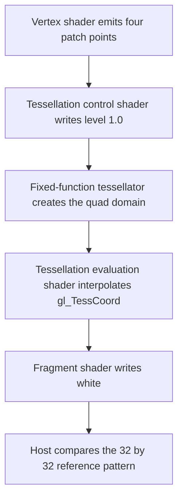

## Overview

**Core question:** Do shader objects preserve graphics state, stage interfaces, tessellation behavior, object lifetime, and push-constant data across the `misc` test matrix?

- [vktShaderObjectMiscTests.cpp](../../../modules/vulkan/shader_object/vktShaderObjectMiscTests.cpp#L3497-L4080) implements the `shader_object.misc` test family. It owns the blend and vertex-input matrix, the large `state` matrix, `unused_variable`, `tessellation_modes`, `tess_patch_non_match`, and `push_const`.
- The family checks several observable results: color attachments, depth and stencil attachments, storage-buffer markers, transform-feedback output, tessellation reference images, and packed push-constant colors.
- The `state` family runs the same selected stage sets with individual shader objects or a graphics pipeline. The other families target narrower contracts: dynamic vertex input and layout lifetime, unused stage interfaces, tessellation modes and patch rebinding, or sparse 8-bit push-constant layouts.
- This page gives the registered hierarchy, the parameter axes, one representative tessellation shader walkthrough, the host-side result checks, and the meaning of failures. Large generated leaf ranges stay summarized rather than expanded one by one.

## Background Knowledge

For the shared concepts shader objects, dynamic state, and tessellation stages, see [Background Knowledge](../../categories/shader_object.md#background-knowledge) of the `shader_object` page.

- **Push-constant ranges.** Push constants are bytes addressed through a pipeline layout and made visible to selected shader stages. The `push_const` cases deliberately vary the declared range and the bytes declared inside it, so byte offsets must be interpreted as layout facts rather than as ordinary descriptor bindings.

## Registration Hierarchy

```text
shader_object.misc
├── on
├── off
├── state
├── unused_variable
├── tessellation_modes
├── tess_patch_non_match
└── push_const
```

The `misc` test family is created at [createShaderObjectMiscTests](../../../modules/vulkan/shader_object/vktShaderObjectMiscTests.cpp#L3497-L3500). Its seven direct children and their exact names are registered at [blend and state registration](../../../modules/vulkan/shader_object/vktShaderObjectMiscTests.cpp#L3501-L3972), [unused-variable and tessellation registration](../../../modules/vulkan/shader_object/vktShaderObjectMiscTests.cpp#L3974-L4067), and [push-constant registration](../../../modules/vulkan/shader_object/vktShaderObjectMiscTests.cpp#L4069-L4078). The parent attaches `misc` directly under the `shader_object` test category at [vktShaderObjectTests.cpp#L60](../../../modules/vulkan/shader_object/vktShaderObjectTests.cpp#L60).

## Parameter Dimensions and Observed Values

| Dimension | Registered values | Meaning in this test | Evidence |
|-----------|-------------------|----------------------|----------|
| Blend matrix | Outer `on`, `off`; inner `on`, `off` | Selects the blend enable state for the first and second color attachments. | [blend loops](../../../modules/vulkan/shader_object/vktShaderObjectMiscTests.cpp#L3501-L3516) |
| Vertex-input timing | `before`, `after` | Chooses whether `vkCmdSetVertexInputEXT` occurs before or after vertex-buffer binding. | [vertex-input loop](../../../modules/vulkan/shader_object/vktShaderObjectMiscTests.cpp#L3516-L3524) |
| Vertex-buffer stride pointer | `null`, `non_null` | Chooses whether `vkCmdBindVertexBuffers2` receives a null stride pointer or the selected stride address. | [stride binding](../../../modules/vulkan/shader_object/vktShaderObjectMiscTests.cpp#L3521-L3539) |
| Vertex-buffer stride | `16`, `32`, `40`, `48` | Changes the distance between the four `vec4` vertices in the host buffer. | [stride table](../../../modules/vulkan/shader_object/vktShaderObjectMiscTests.cpp#L3501-L3506) |
| Descriptor-set-layout lifetime | `destroyed`, `set` | Despite the leaf names, `set` destroys the local descriptor-set-layout handle before command recording, while `destroyed` keeps it alive. | [layout lifetime and registration](../../../modules/vulkan/shader_object/vktShaderObjectMiscTests.cpp#L292-L295), [leaf-name mapping](../../../modules/vulkan/shader_object/vktShaderObjectMiscTests.cpp#L3528-L3540) |
| State binding mode | `shaders`, `pipeline` | Selects independent shader-object binding or a conventional graphics pipeline. | [pipeline mode table](../../../modules/vulkan/shader_object/vktShaderObjectMiscTests.cpp#L3553-L3561) |
| State stage set | `vert`, `vert_frag`, `vert_tess_frag`, `vert_geom_frag`, `vert_tess_geom_frag`, `mesh_frag` | Selects which shader stages execute and which stage markers and rasterization paths can be checked. | [stage-set table](../../../modules/vulkan/shader_object/vktShaderObjectMiscTests.cpp#L3562-L3619) |
| State family | `alphaToOne`, `depth`, `discard_rectangles`, `rasterization_discard`, `color_blend`, `primitives`, `stencil`, `logic_op`, `geometry_streams`, `provoking_vertex`, `sample_locations`, `lines`, `cull`, `conservative_rasterization`, `color_write` | Selects the dynamic or fixed-function state under test. | [state family registration](../../../modules/vulkan/shader_object/vktShaderObjectMiscTests.cpp#L3621-L3970) |
| State value | Family-specific values such as `enabled`, `disabled`, `bounds_enabled`, `copy`, `lines`, `front`, and `overestimate` | Chooses the exact state setting and expected output rule. | [state value tables](../../../modules/vulkan/shader_object/vktShaderObjectMiscTests.cpp#L3622-L3781) |
| Unused-variable matrix | `linked`/`unlinked`, `output`/`builtin`, `vert`/`tesc`/`tese`/`geom` | Places an unused user output or built-in use in one selected stage. The registered `linked` value is intended to request linked stage creation, but the implementation currently sets the link flags only after its sole creation call. | [creation order](../../../modules/vulkan/shader_object/vktShaderObjectMiscTests.cpp#L2442-L2459), [unused-variable registration](../../../modules/vulkan/shader_object/vktShaderObjectMiscTests.cpp#L3974-L4022) |
| Tessellation modes | Subdivision `one`/`two`; spacing `equal`/`even`/`odd` | Changes control-shader tessellation levels and evaluation-shader spacing execution mode. | [tessellation registration](../../../modules/vulkan/shader_object/vktShaderObjectMiscTests.cpp#L4024-L4057) |
| Patch binding order | `standard`, `reverse` | Selects which of two tessellation-control shader objects is bound for the first and second draw. | [patch registration](../../../modules/vulkan/shader_object/vktShaderObjectMiscTests.cpp#L4059-L4067) |
| Push-constant layout | `57_64_all`, `63_64_all`, `17_64`, `63_64`, `17_37_all`, `36_37_all`, `17_37`, `36_37` | Selects the word offset, a word-count bound, and complete versus sparse declarations. The bound determines range size only for `_all`; sparse cases use one word at the selected offset. | [range construction](../../../modules/vulkan/shader_object/vktShaderObjectMiscTests.cpp#L3283-L3296), [push-constant registration](../../../modules/vulkan/shader_object/vktShaderObjectMiscTests.cpp#L4069-L4078) |

## Behavior Parameters

The page has several independent behavioral axes. The direct children are the useful page-level grouping, while the large `state` family has additional axes described below.

### on or off: blend, vertex input, and descriptor-layout matrix

The `on` and `off` test families are the two values of the outer blend axis. Each contains an inner `on`/`off` blend choice, `before`/`after` vertex-input timing, `null`/`non_null` stride-pointer behavior, four stride values, and `destroyed`/`set` descriptor-set-layout lifetime. The test creates two 32 by 32 color attachments, draws twice, and checks the inner rectangle against the blend-selected reference color. The outer family name controls attachment 0 and its sibling controls attachment 1.

### state: pipeline and shader-object state

`state` compares a selected stage set under either `shaders` or `pipeline`. The state-family value then chooses one mechanism, such as depth, stencil, line rasterization, color writes, or geometry streams. The shader-object path binds stage handles and sets state with commands. The pipeline path creates a graphics pipeline with the corresponding state either baked into the pipeline or listed as dynamic. Stage marker writes and rendered attachments expose whether the selected state was applied.

### unused_variable: stage-interface tolerance

`unused_variable` selects `linked` or `unlinked`, a user `output` or a `builtin`, and one of `vert`, `tesc`, `tese`, or `geom`. The selected stage receives an otherwise unused location 0 output, or writes built-ins such as `gl_PointSize` and `gl_ClipDistance[0]`. The draw must still produce white inside the expected region and black outside it. The source applies `VK_SHADER_CREATE_LINK_STAGE_BIT_EXT` after calling `vkCreateShadersEXT`, so the current `linked` leaves do not actually exercise linked creation; this remains a source-level defect.

### tessellation_modes: subdivision and spacing

`one` and `two` select control-shader tessellation levels of `1.0` and `2.0`. `equal`, `even`, and `odd` select `equal_spacing`, `fractional_even_spacing`, and `fractional_odd_spacing` in the tessellation evaluation shader. Polygon mode is line, so the host can compare the generated tessellation pattern against a reference matrix.

### tess_patch_non_match: tessellation-control stage rebinding

`standard` binds `tesc0` first and `tesc1` second. `reverse` swaps that order. Both shaders write the same `patchColor` at location 1, but `tesc1` also declares patch outputs at locations 0 and 2. The host pushes the geometry color, draws with the first shader, rebinds the tessellation-control stage, and draws again. The final image must contain the geometry color from the shared `patchColor` path. The source comment calls the first draw a no-op with the clear color, but the code pushes `geomColor` before that draw; this discrepancy remains a source-level risk.

### push_const: sparse and complete 8-bit ranges

The eight names encode the selected 32-bit word offset, a word-count bound, and whether the block declares all words up to that bound. In `_all` cases, that bound is also the push-constant range size; in sparse cases, the actual range is one 32-bit word at the selected offset and the second number does not change runtime behavior. The fragment shader reads the selected `uint8_t` members and packs them into an `R8G8B8A8_UINT` output. The host checks every pixel against the expected packed value.

## Shader Analysis

### Representative Shader Walkthrough 1

#### Parameter Values Chosen

Representative path:

```text
dEQP-VK.shader_object.misc.tessellation_modes.one.equal
```

| Parameter choice | Meaning in this representative case |
|------------------|-------------------------------------|
| `tessellation_modes.one.equal` | Selects the tessellation-mode family with subdivision `one` and `equal` spacing. |
| Control-shader subdivision | The generated tessellation control shader writes `1.0` to both inner and all four outer tessellation levels. |
| Evaluation-shader spacing | The generated tessellation evaluation shader declares `layout(quads, equal_spacing) in`. |
| Line polygon mode | The host sets `VK_POLYGON_MODE_LINE`, making the tessellated primitive pattern visible in the color image. |

#### Purpose

This shader pair checks that shader-object tessellation stages agree on a quad domain and that the selected subdivision and spacing modes produce the expected rasterized line pattern.

#### Structural Design



#### Shader Code

Reconstructed GLSL for the exact evaluation-stage source generated by `ShaderObjectTessellationModesCase::initPrograms`:

```glsl
#version 450

/// This stage evaluates a quad domain with equal segment spacing.
layout(quads, equal_spacing) in;

void main (void)
{
    /// `gl_TessCoord` gives the generated vertex's normalized position in the quad.
    float u = gl_TessCoord.x;
    float v = gl_TessCoord.y;
    float omu = 1.0f - u;
    float omv = 1.0f - v;

    /// Bilinear interpolation maps the four vertex-stage control points to the tessellated quad.
    gl_Position = omu * omv * gl_in[0].gl_Position + u * omv * gl_in[2].gl_Position + u * v * gl_in[3].gl_Position + omu * v * gl_in[1].gl_Position;
}
```

#### Additional Info

- The companion vertex shader derives four positions from `gl_VertexIndex`, and the tessellation-control shader forwards the positions while writing all tessellation levels as `1.0` for this representative case [generated stages](../../../modules/vulkan/shader_object/vktShaderObjectMiscTests.cpp#L2955-L2987).
- The fragment shader writes `vec4(1.0f)`. The host selects polygon line mode before the draw, then compares against the case-specific reference matrix [fragment source and draw](../../../modules/vulkan/shader_object/vktShaderObjectMiscTests.cpp#L3008-L3016), [draw and check](../../../modules/vulkan/shader_object/vktShaderObjectMiscTests.cpp#L2807-L2922).

#### Parameter Variation Summary

| Parameter dimension | Shader-level variation from this shader | Evidence |
|---------------------|---------------------------------------|----------|
| Subdivision | `one` emits control-shader levels of `1.0`; `two` emits levels of `2.0`, changing the generated tessellation pattern. | [subdivision branch](../../../modules/vulkan/shader_object/vktShaderObjectMiscTests.cpp#L2974-L2985) |
| Spacing | `equal`, `even`, and `odd` emit `equal_spacing`, `fractional_even_spacing`, or `fractional_odd_spacing` in the evaluation-stage declaration. | [spacing branch](../../../modules/vulkan/shader_object/vktShaderObjectMiscTests.cpp#L2989-L2997) |

#### SPIR-V

- Status: generated and validated
- Source: reconstructed GLSL from this walkthrough
- Stage: `tese`
- Target SPIRV version: `spirv1.0`

<details>
<summary>Click to expand SPIRV asm code</summary>

```llvm
; SPIR-V
; Version: 1.0
; Generator: Khronos Glslang Reference Front End; 11
; Bound: 73
; Schema: 0
               OpCapability Tessellation
          %1 = OpExtInstImport "GLSL.std.450"
               OpMemoryModel Logical GLSL450
               OpEntryPoint TessellationEvaluation %main "main" %gl_TessCoord %_ %gl_in
               OpExecutionMode %main Quads
               OpExecutionMode %main SpacingEqual
               OpExecutionMode %main VertexOrderCcw
               OpSource GLSL 450
               OpName %main "main"
               OpName %u "u"
               OpName %gl_TessCoord "gl_TessCoord"
               OpName %v "v"
               OpName %omu "omu"
               OpName %omv "omv"
               OpName %gl_PerVertex "gl_PerVertex"
               OpMemberName %gl_PerVertex 0 "gl_Position"
               OpMemberName %gl_PerVertex 1 "gl_PointSize"
               OpMemberName %gl_PerVertex 2 "gl_ClipDistance"
               OpMemberName %gl_PerVertex 3 "gl_CullDistance"
               OpName %_ ""
               OpName %gl_PerVertex_0 "gl_PerVertex"
               OpMemberName %gl_PerVertex_0 0 "gl_Position"
               OpMemberName %gl_PerVertex_0 1 "gl_PointSize"
               OpMemberName %gl_PerVertex_0 2 "gl_ClipDistance"
               OpMemberName %gl_PerVertex_0 3 "gl_CullDistance"
               OpName %gl_in "gl_in"
               OpDecorate %gl_TessCoord BuiltIn TessCoord
               OpDecorate %gl_PerVertex Block
               OpMemberDecorate %gl_PerVertex 0 BuiltIn Position
               OpMemberDecorate %gl_PerVertex 1 BuiltIn PointSize
               OpMemberDecorate %gl_PerVertex 2 BuiltIn ClipDistance
               OpMemberDecorate %gl_PerVertex 3 BuiltIn CullDistance
               OpDecorate %gl_PerVertex_0 Block
               OpMemberDecorate %gl_PerVertex_0 0 BuiltIn Position
               OpMemberDecorate %gl_PerVertex_0 1 BuiltIn PointSize
               OpMemberDecorate %gl_PerVertex_0 2 BuiltIn ClipDistance
               OpMemberDecorate %gl_PerVertex_0 3 BuiltIn CullDistance
       %void = OpTypeVoid
          %3 = OpTypeFunction %void
      %float = OpTypeFloat 32
%_ptr_Function_float = OpTypePointer Function %float
    %v3float = OpTypeVector %float 3
%_ptr_Input_v3float = OpTypePointer Input %v3float
%gl_TessCoord = OpVariable %_ptr_Input_v3float Input
       %uint = OpTypeInt 32 0
     %uint_0 = OpConstant %uint 0
%_ptr_Input_float = OpTypePointer Input %float
     %uint_1 = OpConstant %uint 1
    %float_1 = OpConstant %float 1
    %v4float = OpTypeVector %float 4
%_arr_float_uint_1 = OpTypeArray %float %uint_1
%gl_PerVertex = OpTypeStruct %v4float %float %_arr_float_uint_1 %_arr_float_uint_1
%_ptr_Output_gl_PerVertex = OpTypePointer Output %gl_PerVertex
          %_ = OpVariable %_ptr_Output_gl_PerVertex Output
        %int = OpTypeInt 32 1
      %int_0 = OpConstant %int 0
%gl_PerVertex_0 = OpTypeStruct %v4float %float %_arr_float_uint_1 %_arr_float_uint_1
    %uint_32 = OpConstant %uint 32
%_arr_gl_PerVertex_0_uint_32 = OpTypeArray %gl_PerVertex_0 %uint_32
%_ptr_Input__arr_gl_PerVertex_0_uint_32 = OpTypePointer Input %_arr_gl_PerVertex_0_uint_32
      %gl_in = OpVariable %_ptr_Input__arr_gl_PerVertex_0_uint_32 Input
%_ptr_Input_v4float = OpTypePointer Input %v4float
      %int_2 = OpConstant %int 2
      %int_3 = OpConstant %int 3
      %int_1 = OpConstant %int 1
%_ptr_Output_v4float = OpTypePointer Output %v4float
       %main = OpFunction %void None %3
          %5 = OpLabel
          %u = OpVariable %_ptr_Function_float Function
          %v = OpVariable %_ptr_Function_float Function
        %omu = OpVariable %_ptr_Function_float Function
        %omv = OpVariable %_ptr_Function_float Function
         %15 = OpAccessChain %_ptr_Input_float %gl_TessCoord %uint_0
         %16 = OpLoad %float %15
               OpStore %u %16
         %19 = OpAccessChain %_ptr_Input_float %gl_TessCoord %uint_1
         %20 = OpLoad %float %19
               OpStore %v %20
         %23 = OpLoad %float %u
         %24 = OpFSub %float %float_1 %23
               OpStore %omu %24
         %26 = OpLoad %float %v
         %27 = OpFSub %float %float_1 %26
               OpStore %omv %27
         %35 = OpLoad %float %omu
         %36 = OpLoad %float %omv
         %37 = OpFMul %float %35 %36
         %44 = OpAccessChain %_ptr_Input_v4float %gl_in %int_0 %int_0
         %45 = OpLoad %v4float %44
         %46 = OpVectorTimesScalar %v4float %45 %37
         %47 = OpLoad %float %u
         %48 = OpLoad %float %omv
         %49 = OpFMul %float %47 %48
         %51 = OpAccessChain %_ptr_Input_v4float %gl_in %int_2 %int_0
         %52 = OpLoad %v4float %51
         %53 = OpVectorTimesScalar %v4float %52 %49
         %54 = OpFAdd %v4float %46 %53
         %55 = OpLoad %float %u
         %56 = OpLoad %float %v
         %57 = OpFMul %float %55 %56
         %59 = OpAccessChain %_ptr_Input_v4float %gl_in %int_3 %int_0
         %60 = OpLoad %v4float %59
         %61 = OpVectorTimesScalar %v4float %60 %57
         %62 = OpFAdd %v4float %54 %61
         %63 = OpLoad %float %omu
         %64 = OpLoad %float %v
         %65 = OpFMul %float %63 %64
         %67 = OpAccessChain %_ptr_Input_v4float %gl_in %int_1 %int_0
         %68 = OpLoad %v4float %67
         %69 = OpVectorTimesScalar %v4float %68 %65
         %70 = OpFAdd %v4float %62 %69
         %72 = OpAccessChain %_ptr_Output_v4float %_ %int_0
               OpStore %72 %70
               OpReturn
               OpFunctionEnd
```

</details>

## Runtime Execution and Result Checking

- **Blend and vertex-input matrix.** The host creates two 32 by 32 `VK_FORMAT_R8G8B8A8_UNORM` color images, two host-visible transfer buffers, a storage buffer containing four `0.5f` values, and a vertex buffer containing four positions at the selected stride. It sets the selected blend state, binds the vertex buffer with either a null or non-null stride pointer, sets vertex input before or after that binding, binds the vertex and fragment shader objects, and draws twice [host setup and draws](../../../modules/vulkan/shader_object/vktShaderObjectMiscTests.cpp#L141-L229), [state and draws](../../../modules/vulkan/shader_object/vktShaderObjectMiscTests.cpp#L296-L366).
- The host copies both images to host-visible buffers. Outside the inner rectangle, it expects black. Inside it, attachment `k` expects `(0.75, 0.75, 0.75, 0.75)` when that attachment's blend value is enabled and `(0.5, 0.5, 0.5, 0.5)` otherwise. Each component uses a threshold of `1.0f / 256.0f` [blend check](../../../modules/vulkan/shader_object/vktShaderObjectMiscTests.cpp#L368-L410).
- **State matrix.** The host creates a custom logical device with the extensions and features needed for the selected state. It creates a color image, a depth/stencil image, two storage buffers, and, for `geometry_streams`, a transform-feedback buffer. It creates either a graphics pipeline or the selected shader objects, begins dynamic rendering, binds the selected shaders or pipeline, applies state, and draws. A second draw uses the second descriptor set when depth-clamp and depth-clip do not suppress it [custom device and resources](../../../modules/vulkan/shader_object/vktShaderObjectMiscTests.cpp#L702-L875), [draw flow](../../../modules/vulkan/shader_object/vktShaderObjectMiscTests.cpp#L1627-L1758).
- State validation checks stage markers in storage buffers, transform-feedback values of `1.0`, `2.0`, and `3.0` for line or triangle output, color inside and outside the expected primitive, and depth/stencil values. Color comparisons use `1.0f / 256.0f`; depth uses an epsilon of `0.02f`, and enabled stencil expects `255` inside the primitive and `0` outside [state checks](../../../modules/vulkan/shader_object/vktShaderObjectMiscTests.cpp#L1760-L2000).
- **Unused-variable matrix.** The host creates five graphics-stage shader objects, binds all five, draws one patch, copies the color image to a host-visible buffer, destroys the shader objects, and then checks exact white pixels in the inner 24 by 24 region and exact black pixels outside it [unused-variable execution and check](../../../modules/vulkan/shader_object/vktShaderObjectMiscTests.cpp#L2387-L2542).
- **Tessellation modes.** The host binds vertex, tessellation-control, tessellation-evaluation, and fragment shader objects, sets default shader-object state plus `VK_POLYGON_MODE_LINE`, draws four vertices as a patch, copies the image, and compares each pixel with one of three 17 by 17 reference matrices selected by the subdivision and spacing values [tessellation draw and check](../../../modules/vulkan/shader_object/vktShaderObjectMiscTests.cpp#L2724-L2923).
- **Tessellation patch mismatch.** The host creates `tesc0` and `tesc1`, pushes the geometry color, draws once, rebinds the tessellation-control stage, draws again, copies the final one-pixel image, and compares it with the geometry color using `tcu::floatThresholdCompare()` [patch run](../../../modules/vulkan/shader_object/vktShaderObjectMiscTests.cpp#L3127-L3227). Both stages write the shared `patchColor`; the source comment describing the first draw as a clear-color no-op does not match the preceding `cmdPushConstants` call.
- **Push constants.** The host creates an `R8G8B8A8_UINT` image, builds a fragment-stage push-constant range at the selected offset and size, initializes the range to zero where required, pushes the packed input value, draws, copies the image, and requires every pixel to equal the expected packed output value [push-constant execution and check](../../../modules/vulkan/shader_object/vktShaderObjectMiscTests.cpp#L3253-L3405).

## Failure Meaning

### Failure Cause Mapping

| If this behavior parameter value fails | Possible failure cause(s) |
|----------------------------------------|---------------------------|
| `on` or `off` | Dynamic vertex-input setup, vertex-buffer stride handling, descriptor-set-layout lifetime handling, or color-blend state produces the wrong attachment pixels. |
| `state` | A selected shader-object or pipeline state value is not applied, is applied at the wrong time, or produces the wrong color, depth, stencil, storage-buffer, or transform-feedback result. |
| `unused_variable` | Shader creation or stage linking mishandles an unused user output or built-in in the selected stage. |
| `tessellation_modes` | Tessellation control/evaluation execution modes or shader-object stage binding produce the wrong subdivision pattern. |
| `tess_patch_non_match` | Rebinding the tessellation-control stage with a different patch interface is mishandled, or the second draw does not use the newly bound stage. |
| `push_const` | Push-constant byte offsets, declared ranges, 8-bit member layout, or fragment reads produce the wrong packed color. |

### Cause Analysis

#### Blend, vertex input, or descriptor-layout behavior

**Possible failure symptoms:** One or both color attachments differ from black outside the inner rectangle or from the blend-selected reference color inside it. The failure can vary with the outer or inner blend value, the vertex-input ordering, the null stride pointer, the stride value, or the descriptor-set-layout lifetime leaf.

**Possible implementation causes:** The command-buffer state may not follow the selected ordering, `vkCmdBindVertexBuffers2` may interpret the stride pointer incorrectly, or the implementation may retain or access the destroyed descriptor-set-layout handle beyond the allowed command. A blend-state failure can also produce the wrong two-draw accumulation. The exact cause requires investigation of the failing parameter combination and implementation logs.

#### Selected pipeline or shader-object state

**Possible failure symptoms:** The relevant color, depth, stencil, storage-buffer, or transform-feedback check fails. A rasterizer-discard or discard-rectangle case may leave pixels black, a cull or primitive case may change the tested region, and a stage marker may be missing or written to the wrong index.

**Possible implementation causes:** The selected state command may not affect the following draw, a pipeline may use a baked value where the test expects a dynamic value, or shader-object and pipeline state paths may interpret the same setting differently. For a stage marker mismatch, source inspection of the selected shader stage and its bound storage buffer is needed before assigning the fault to a particular implementation layer.

#### Unused stage-interface variable

**Possible failure symptoms:** Shader creation, linked stage creation, or the final draw fails, or pixels outside the expected white region change. The failing stage and `output`/`builtin` value identify which unused interface form was involved.

**Possible implementation causes:** The implementation may incorrectly treat an unused user output or built-in write as an invalid stage interface, or linked stage processing may reject a legal interface that does not contribute to the final fragment output. The source proves the test's interface construction, but a driver-specific cause needs investigation.

#### Tessellation mode handling

**Possible failure symptoms:** The rendered line image differs from the selected `equal1`, `even1`, or `odd2` reference matrix. The mismatch means the generated primitive coverage does not match the subdivision and spacing combination recorded by the test.

**Possible implementation causes:** The tessellation control or evaluation stage may use the wrong execution mode, the fixed-function tessellator may calculate segment placement incorrectly, or shader-object binding may fail to connect the two stages. Vulkan defines the spacing rules and requires the relevant tessellation modes to agree; the failing reference pixels do not by themselves identify which stage or fixed-function component is responsible.

#### Tessellation-control stage rebinding

**Possible failure symptoms:** The final one-pixel image is not the pushed geometry color, which means the second draw did not produce the expected output after the tessellation-control stage rebind.

**Possible implementation causes:** `vkCmdBindShadersEXT` may not replace the selected tessellation-control stage for the next draw, or the implementation may mishandle the differing patch output declarations between `tesc0` and `tesc1`. The two shaders intentionally share `patchColor` at location 1, so a failure needs source and validation inspection rather than an assumption that every differing declaration is invalid.

#### Push-constant byte layout or readback

**Possible failure symptoms:** Any pixel differs from the expected packed `outColor`, and the log reports a push-constant value mismatch. The failing leaf identifies the offset, range length, and complete or sparse declaration form.

**Possible implementation causes:** The implementation may apply the push-constant offset incorrectly, read the wrong 8-bit members, use a different layout for bytes in a sparse block, or fail to make the pushed value visible to the fragment stage. The test's expected value comes from the generated `uint8_t` declarations and the explicit pipeline layout range, so the exact cause requires correlating the failing leaf with shader and layout validation.

## Case Pruning

### Requirement-based pruning

- The blend and vertex-input matrix requires `VK_EXT_shader_object` [support check](../../../modules/vulkan/shader_object/vktShaderObjectMiscTests.cpp#L413-L439).
- `state` requires a supported depth/stencil format, `vertexPipelineStoresAndAtomics`, and `VK_EXT_shader_object` for `shaders` or `VK_KHR_dynamic_rendering` for `pipeline`. Individual values add requirements for core features or extensions such as logic operation, depth clip control, color write enable, transform feedback geometry streams, discard rectangles version 2, sample locations, provoking vertex, conservative rasterization, line rasterization, mesh shaders, and extended dynamic state [state support checks](../../../modules/vulkan/shader_object/vktShaderObjectMiscTests.cpp#L2025-L2178).
- `unused_variable` requires `VK_EXT_shader_object`, geometry shader support, and tessellation shader support. `tessellation_modes` and `tess_patch_non_match` require `VK_EXT_shader_object` and tessellation shader support [support checks](../../../modules/vulkan/shader_object/vktShaderObjectMiscTests.cpp#L2568-L2573), [tessellation checks](../../../modules/vulkan/shader_object/vktShaderObjectMiscTests.cpp#L2949-L2953), [patch checks](../../../modules/vulkan/shader_object/vktShaderObjectMiscTests.cpp#L3024-L3028).
- `push_const` requires `VK_EXT_shader_object` and `VK_KHR_8bit_storage` [push-constant support check](../../../modules/vulkan/shader_object/vktShaderObjectMiscTests.cpp#L3436-L3440).

### Design-based pruning

- The `on` and `off` branches do not duplicate a separate implementation. They expose the two values of the outer blend toggle while sharing the same nested matrix.
- The `state` registration summarizes a large generated matrix rather than adding separate page-level families for every state value. The `lines` family also registers rasterizer-discard and triangle-topology variants by appending `_rasterizer_discard` and `_topology_triangles` to the line names [lines registration](../../../modules/vulkan/shader_object/vktShaderObjectMiscTests.cpp#L3916-L3933).
- `mesh_frag` has no vertex, tessellation, or geometry stages. The state implementation uses mesh-specific output and draw commands, while the other five stage sets use graphics stages selected by their names [stage-set table](../../../modules/vulkan/shader_object/vktShaderObjectMiscTests.cpp#L3562-L3619), [mesh draw](../../../modules/vulkan/shader_object/vktShaderObjectMiscTests.cpp#L1671-L1715).
- `tess_patch_non_match` keeps only two binding orders because the test asks whether a stage rebind changes the next draw; additional permutations would repeat that mechanism. The implementation comment and the first draw's `geomColor` push disagree, so the exact intended first-draw contrast needs source-owner clarification.
- The eight push-constant leaves cover two full-range lengths in `_all` cases, selected offsets near their ends, and complete versus sparse declarations. Sparse cases use a one-word range at the selected offset; consequently, `17_64` and `17_37` have the same effective layout and runtime behavior despite their different second numbers [range construction](../../../modules/vulkan/shader_object/vktShaderObjectMiscTests.cpp#L3283-L3296), [shader generation](../../../modules/vulkan/shader_object/vktShaderObjectMiscTests.cpp#L3453-L3489), [push registration](../../../modules/vulkan/shader_object/vktShaderObjectMiscTests.cpp#L4069-L4078).

## Key Takeaways

- `state` checks that shader-object binding and pipeline binding apply the selected graphics state to the same kinds of observable output.
- The blend matrix tests command ordering and vertex-buffer stride handling as well as color blending. Its two color attachments make the two blend toggles independently visible.
- The tessellation families separate ordinary tessellation mode behavior from stage rebinding with a changed patch interface.
- `unused_variable` checks that an unused user output or built-in in a selected stage does not invalidate the shader-object setup or alter the expected image.
- `push_const` makes byte-level layout visible by reading 8-bit members from a fragment push-constant block and checking every output pixel.
- A failure identifies a tested contract and a parameter combination. The result alone does not choose between shader creation, command-buffer state, fixed-function processing, and host readback without further investigation.

## Source Reference Appendix

| Entry point | Link | Why it matters |
|-------------|------|----------------|
| `createShaderObjectMiscTests` | [registration](../../../modules/vulkan/shader_object/vktShaderObjectMiscTests.cpp#L3497-L4080) | Builds all direct families and parameter matrices. |
| `ShaderObjectMiscInstance::iterate` | [blend and vertex-input execution](../../../modules/vulkan/shader_object/vktShaderObjectMiscTests.cpp#L124-L410) | Creates the two color attachments, binds shader objects, and checks blend results. |
| `ShaderObjectStateInstance::createDevice` | [custom device setup](../../../modules/vulkan/shader_object/vktShaderObjectMiscTests.cpp#L702-L875) | Enables the selected shader-object, pipeline, and optional feature paths. |
| `ShaderObjectStateInstance::setDynamicStates` | [dynamic state commands](../../../modules/vulkan/shader_object/vktShaderObjectMiscTests.cpp#L877-L1187) | Applies the selected state values before drawing. |
| `ShaderObjectStateInstance::iterate` | [state execution and validation](../../../modules/vulkan/shader_object/vktShaderObjectMiscTests.cpp#L1231-L2001) | Runs the draw and checks color, depth, stencil, storage, and transform-feedback output. |
| `ShaderObjectStateCase::checkSupport` | [state requirements](../../../modules/vulkan/shader_object/vktShaderObjectMiscTests.cpp#L2025-L2179) | Defines the feature and extension gates for state cases. |
| `ShaderObjectStateCase::initPrograms` | [state shader generators](../../../modules/vulkan/shader_object/vktShaderObjectMiscTests.cpp#L2181-L2347) | Generates vertex, tessellation, geometry, fragment, and mesh sources. |
| `ShaderObjectUnusedBuiltinInstance` | [unused-variable flow](../../../modules/vulkan/shader_object/vktShaderObjectMiscTests.cpp#L2369-L2542) | Creates, binds, destroys, and validates the five-stage interface cases. |
| `ShaderObjectUnusedBuiltinCase::initPrograms` | [unused-variable generators](../../../modules/vulkan/shader_object/vktShaderObjectMiscTests.cpp#L2575-L2704) | Selects the user-output or built-in declaration for one stage. |
| `ShaderObjectTessellationModesCase::initPrograms` | [tessellation generators](../../../modules/vulkan/shader_object/vktShaderObjectMiscTests.cpp#L2925-L3017) | Emits the subdivision and spacing variants. |
| `tessPatchNonMatchInitPrograms` and `tessPatchNonMatchRun` | [patch mismatch flow](../../../modules/vulkan/shader_object/vktShaderObjectMiscTests.cpp#L3019-L3227) | Defines the two patch interfaces and the tessellation-control rebind. |
| `ShaderObjectPushConstInstance::iterate` | [push-constant flow](../../../modules/vulkan/shader_object/vktShaderObjectMiscTests.cpp#L3230-L3405) | Sets the range, pushes bytes, renders, and checks packed output. |
| `ShaderObjectPushConstCase::initPrograms` | [push-constant generator](../../../modules/vulkan/shader_object/vktShaderObjectMiscTests.cpp#L3407-L3493) | Emits complete and sparse `uint8_t` block declarations. |
| `misc.txt` | [mustpass entries](../../../mustpass/main/vk-default/shader-object/misc.txt) | Contains 744 default mustpass entries for this test family. |
| Tessellation stages and spacing | [Vulkan tessellation chapter](../../../../vulkan-docs/src/chapters/tessellation.adoc#L7-L19), [spacing rules](../../../../vulkan-docs/src/chapters/tessellation.adoc#L181-L220) | Grounds the control, tessellator, evaluation, subdivision, and spacing explanations. |
| Shader-object stage creation | [Vulkan shader-object creation](../../../../vulkan-docs/src/chapters/shaders.adoc#L46-L60), [shader create info](../../../../vulkan-docs/src/chapters/shaders.adoc#L270-L306) | Grounds independent stage objects, `nextStage`, descriptors, and push-constant ranges. |
| Push-constant validity | [common push-constant rules](../../../../vulkan-docs/src/chapters/commonvalidity/push_constants_common.adoc#L1-L40) | Grounds the range and stage-layout discussion. |
