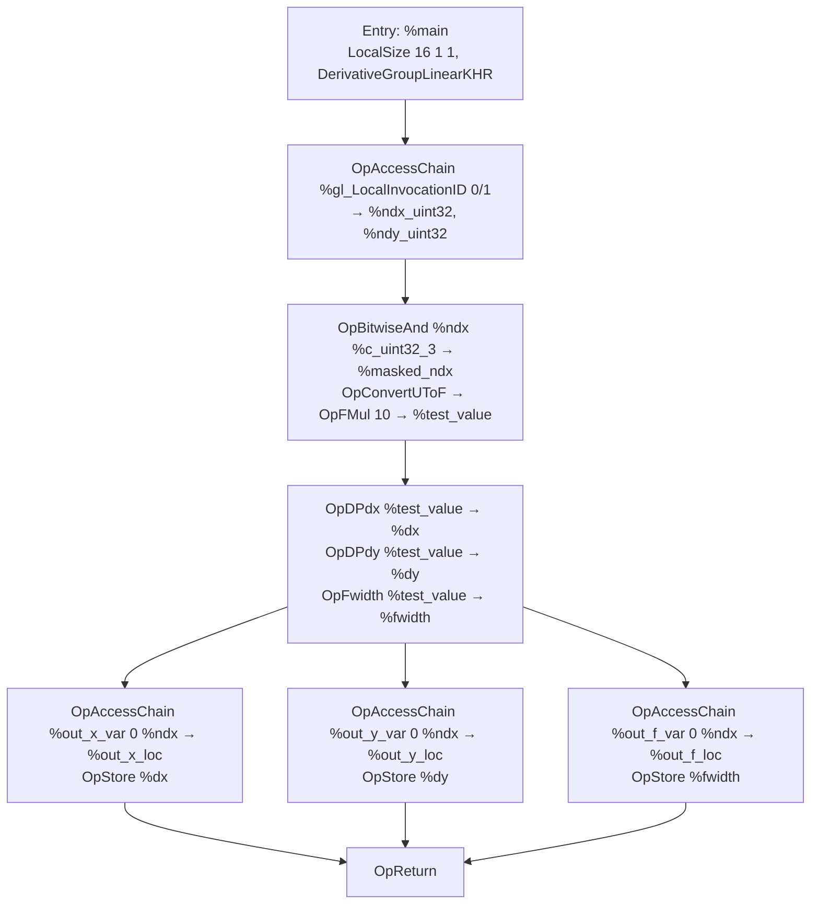

## Overview

**Core question:** does an implementation that advertises `VK_KHR_compute_shader_derivatives` (and, for the mesh/task paths, `VK_EXT_mesh_shader` with `meshAndTaskShaderDerivatives`) correctly execute SPIR-V derivative, quad-subgroup, and LOD instructions inside `GLCompute`, `MeshEXT`, and `TaskEXT` entry points under the `DerivativeGroupLinearKHR` and `DerivativeGroupQuadsKHR` execution modes?

- Source file: [`vktSpvAsmComputeShaderDerivativesTests.cpp`](../../../modules/vulkan/spirv_assembly/vktSpvAsmComputeShaderDerivativesTests.cpp). One implementation file, one test family, three shader-type subtrees.
- Test category: `spirv_assembly`. Test family (page scope): `compute_shader_derivatives`, rooted at `spirv_assembly.instruction.compute.compute_shader_derivatives` with three shader-type children (`compute`, `mesh`, `task`).
- Core test idea: each case authors a SPIR-V module as a `tcu::StringTemplate` specialized per `testType`/`feature`/`variant`/`dataType`, dispatches or draws, then compares device-written output SSBOs against host-computed expected buffers. The derivative group execution mode and the per-quad invocation grouping are the actual surface under test.
- What to expect from the page: the registration tree and shader-type split; the per-`testType` behavior (derivative_value, verify_ndx, quad_op, lod_op); one representative walkthrough that exercises `OpDPdx`/`OpDPdy`/`OpFwidth` under `DerivativeGroupLinearKHR`; the support gate that prunes mesh/task and subgroup cases; and the failure mapping back to derivative execution mode, quad layout, or LOD computation.

## Background Knowledge

- **Compute-shader derivative execution modes.** Fragment shaders compute derivatives implicitly per 2×2 pixel quad. Compute, mesh, and task shaders have no rasterizer, so `SPV_KHR_compute_shader_derivatives` defines two explicit execution modes that group invocations into the units derivatives are computed over. `DerivativeGroupLinearKHR` groups 4 consecutive invocations in linear `LocalInvocationIndex` order; `DerivativeGroupQuadsKHR` groups 2×2 invocations by `(x,y)` index. The two modes differ in which invocations share a derivative quad, so the same input pattern produces different expected derivative values. Each mode requires its own capability (`ComputeDerivativeGroupLinearKHR` / `ComputeDerivativeGroupQuadsKHR`) and Vulkan feature bit (`computeDerivativeGroupLinear` / `computeDerivativeGroupQuads`).
- **Mesh/task shader derivative property gate.** `VK_EXT_mesh_shader` adds the `MeshEXT` and `TaskEXT` execution models, but derivative operations are not automatically legal in those stages. The implementation must additionally report `meshAndTaskShaderDerivatives = VK_TRUE` in `VkPhysicalDeviceComputeShaderDerivativesPropertiesKHR`. The mesh/task variants of every case register only when that property is supported, plus the `meshShader` feature (mesh) or both `meshShader` and `taskShader` features (task).
- **Subgroup quad operations and `verify_ndx`.** `OpGroupNonUniformQuadBroadcast` and `OpGroupNonUniformQuadSwap` operate on a 4-invocation quad. The test relies on the quad grouping seen by `OpSubgroup*` matching the grouping the derivative mode implies, so `verify_ndx` writes `SubgroupLocalInvocationId % 4` to confirm the layout. `verify_ndx` and `quad_op` require Vulkan 1.1+ with `VK_SUBGROUP_FEATURE_BASIC_BIT` (plus `VK_SUBGROUP_FEATURE_QUAD_BIT` for `quad_op`) in the relevant shader stage, and `verify_ndx` additionally requires `numWorkgroup.x() % subgroupSize == 0` (VUID-VkPipelineShaderStageCreateInfo-flags-02759), so the compute pipeline sets `VK_PIPELINE_SHADER_STAGE_CREATE_REQUIRE_FULL_SUBGROUPS_BIT` only for `verify_ndx`.

## Registration Hierarchy

```text
spirv_assembly.instruction.compute.compute_shader_derivatives
├── compute
├── mesh
└── task
```

Each shader-type child registers the same four `testType` subtrees: `derivative_value`, `verify_ndx`, `quad_op` (with `broadcast` and `swap` children), and `lod_op` (with `sample` and `query` children). The registration root is [`createComputeShaderDerivativesTests`](../../../modules/vulkan/spirv_assembly/vktSpvAsmComputeShaderDerivativesTests.cpp#L3729-L4176); it iterates `ShaderType::COMPUTE`/`MESH`/`TASK` and adds the four subtrees per shader type. The entire family is registered only when `CTS_USES_VULKANSC` is not defined; the source file is excluded from VulkanSC builds.

## Parameter Dimensions and Observed Values

| Dimension | Registered values | Meaning in this test | Evidence |
|-----------|-------------------|----------------------|----------|
| ShaderType | `compute`, `mesh`, `task` | Selects the SPIR-V execution model (`GLCompute`, `MeshEXT`, `TaskEXT`) and the paired infrastructure (none for compute; fixed fragment shader for mesh; fixed mesh + fragment shaders for task). Mesh/task add `OpCapability MeshShadingEXT` + `VK_EXT_mesh_shader` and require the `meshAndTaskShaderDerivatives` property. | [shader-type loop](../../../modules/vulkan/spirv_assembly/vktSpvAsmComputeShaderDerivativesTests.cpp#L3734-L3738) |
| TestType | `derivative_value`, `verify_ndx`, `quad_op` (broadcast/swap), `lod_op` (sample/query) | Primary behavioral axis. Each value changes the SPIR-V body emitted into `${testValueCode}`/`${testLogicCode}`/`${storeCode}` and the host-side expected-buffer logic. | [testType switch](../../../modules/vulkan/spirv_assembly/vktSpvAsmComputeShaderDerivativesTests.cpp#L3480-L3672) |
| DerivativeFeature | `linear`, `quads` | Selects `DerivativeGroupLinearKHR` or `DerivativeGroupQuadsKHR` execution mode and the matching capability/feature bit. Changes the per-quad invocation grouping and therefore the expected derivative values. | [getDerivativeCapability](../../../modules/vulkan/spirv_assembly/vktSpvAsmComputeShaderDerivativesTests.cpp#L282-L292), [getDerivativeExecutionMode](../../../modules/vulkan/spirv_assembly/vktSpvAsmComputeShaderDerivativesTests.cpp#L294-L303) |
| DerivativeVariant | `normal`, `fine`, `coarse` | `derivative_value` only. Selects `OpDPdx`/`OpDPdy`/`OpFwidth` (normal), `OpDPdxFine`/`OpDPdyFine`/`OpFwidthFine` (fine), or `OpDPdxCoarse`/`OpDPdyCoarse`/`OpFwidthCoarse` (coarse). | [getDxFunc/getDyFunc/getWidthFunc](../../../modules/vulkan/spirv_assembly/vktSpvAsmComputeShaderDerivativesTests.cpp#L3482-L3521) |
| DataType | `float32`, `vec2_float32`, `vec3_float32`, `vec4_float32` | Scalar/vector pointee type used by the derivative computation. Drives `ArrayStride` (4/8/16/16, with vec3 padded to vec4 in std430) and the `${dataType}` placeholder in the assembly. | [getDataType](../../../modules/vulkan/spirv_assembly/vktSpvAsmComputeShaderDerivativesTests.cpp#L249-L261), [getArrayDeclaration](../../../modules/vulkan/spirv_assembly/vktSpvAsmComputeShaderDerivativesTests.cpp#L263-L280) |
| QuadOp | `broadcast`, `swap` | `quad_op` only. `broadcast` uses `OpGroupNonUniformQuadBroadcast` with `quadNdx` 0..3; `swap` uses `OpGroupNonUniformQuadSwap` with `quadNdx` 0..2 (Horizontal/Vertical/Diagonal). | [quad_op registration](../../../modules/vulkan/spirv_assembly/vktSpvAsmComputeShaderDerivativesTests.cpp#L3860-L4029) |
| quadNdx | 0..3 (broadcast), 0..2 (swap) | Lane/direction selector passed to the quad-subgroup opcode. | [registration loop](../../../modules/vulkan/spirv_assembly/vktSpvAsmComputeShaderDerivativesTests.cpp#L3879-L3906) |
| numWorkgroup | `(16,1,1)`, `(4,4,1)`, `(128,1,1)`, `(32,4,1)` | Workgroup dimensions. `LINEAR` uses `(16,1,1)` and `(4,4,1)`; `QUADS` uses `(4,4,1)`; `verify_ndx` uses `(128,1,1)` and `(32,4,1)`. Drives `LocalSize` and the host-side expected buffer length. | [DERIVATIVE_VALUE params](../../../modules/vulkan/spirv_assembly/vktSpvAsmComputeShaderDerivativesTests.cpp#L3756-L3802) |
| mipLvl | 0, 1 | `lod_op` only. Selects the mip level that the lod_op shader samples or queries and drives the expected LOD/sample value. The host still creates, clears, and transitions both sampled-image mip levels for every test instance. | [LOD_SAMPLE params](../../../modules/vulkan/spirv_assembly/vktSpvAsmComputeShaderDerivativesTests.cpp#L4044-L4066) |
| useLocalInvocationIndex | `false` (default), `true` | `derivative_value` `quads` variant only. The `true` path switches the shader from reading `LocalInvocationID.x/.y` to deriving `ndx = LocalInvocationIndex % wg_size_x`, `ndy = (LocalInvocationIndex / wg_size_x) % wg_size_y`. Expected values are identical. | [quads local_inv_index registration](../../../modules/vulkan/spirv_assembly/vktSpvAsmComputeShaderDerivativesTests.cpp#L3798-L3799) |

## Behavior Parameters

The primary behavioral axis is `testType` (the intermediate node below `<shaderType>`). `shaderType` is a secondary axis that reuses the same per-`testType` SPIR-V body and only swaps the entry point and paired infrastructure. The four `testType` values each probe a distinct consequence of advertising `VK_KHR_compute_shader_derivatives`.

### `derivative_value` — derivative opcode correctness

The most direct probe: each invocation builds `%test_value` from its per-quad index, computes `%dx = OpDPdx %test_value`, `%dy = OpDPdy %test_value`, `%fwidth = OpFwidth %test_value` (or the `*Fine`/`*Coarse` variants), and stores all three into separate output SSBOs. The host builds three expected vectors of length `numWorkgroup.x*y*z * alignedComponentCount(dataType)`. For non-`fine` variants, the expected values are `(10, 20, 30)` for `(dx, dy, fwidth)`. For `fine` variants, the expected values differ per `ndx % 4` (LINEAR) or `ndx % 8` (QUADS) depending on `dataType`. Comparison is exact (no tolerance). The `quads` subtree registers an additional `4_4_1_local_inv_index` case per `(variant, dataType)` pair that switches the addressing mode without changing the expected values.

### `verify_ndx` — per-quad invocation index and subgroup containment

Confirms that the quad grouping seen by `OpSubgroup*` matches the grouping the derivative mode implies. Each invocation writes `SubgroupLocalInvocationId % 4` to one output slot and its `gl_SubgroupID` to another. The host expects `expI[ndx] = ndx % 4` (LINEAR) or a 2×2 pattern (QUADS), and additionally verifies that all 4 invocations of each quad share the same `gl_SubgroupID` (a quad must not be split across subgroups). Comparison is exact. Registered only when Vulkan 1.1+ and `VK_SUBGROUP_FEATURE_BASIC_BIT` are present in the relevant stage, and only for workgroup-X dimensions that are multiples of `subgroupSize`.

### `quad_op` — quad subgroup opcode correctness

Tests `OpGroupNonUniformQuadBroadcast` (broadcast subtree, `quadNdx` 0..3) and `OpGroupNonUniformQuadSwap` (swap subtree, `quadNdx` 0..2 → Horizontal/Vertical/Diagonal). Each invocation builds `%test_value` from its per-quad index, applies the quad opcode, and stores the result into one output SSBO. The host builds the expected buffer using `getHorizontallySwappedValues` / `getVerticallySwappedValues` / `getDiagonallySwappedValues` for swap, or `10 * quadNdx` for broadcast. Comparison is exact. Registered only when `VK_SUBGROUP_FEATURE_QUAD_BIT` is present in the relevant stage.

### `lod_op` — derivative-driven LOD computation

Tests that derivatives computed in compute-like shaders drive LOD selection correctly. The `sample` subtree uses `OpImageSampleImplicitLod` on a 2-mip image (mip 0 cleared to `(0.5,0.5,0.5,0.5)`, mip 1 cleared to `(1.0,1.0,1.0,1.0)`); the host expects each 4-element group to equal `CLR_COLORS[mipLvl]`. The `query` subtree uses `OpImageQueryLod`; the host expects the integer mip level in even slots and the computed LOD in odd slots, with the even slot compared exactly and the odd slot compared via `compareFloats(a, b, 0.015 + (lodMax-lodMin)/2)`. The `[lodMin, lodMax]` range and the `0.015 + (lodMax-lodMin)/2` tolerance are the test's own (taken from source comments), not a Vulkan spec tolerance. `LINEAR` lod_op cases use a 1D image (`OpCapability Sampled1D`); `QUADS` cases use a 2D image.

## Shader Analysis

This page uses one representative walkthrough. The selected case is the smallest one that exercises the three core derivative opcodes (`OpDPdx`, `OpDPdy`, `OpFwidth`) under `DerivativeGroupLinearKHR` with `LocalSize 16 1 1`. Other `testType`/`variant`/`feature`/`dataType` combinations reuse the same template structure with different `${testValueCode}`/`${testLogicCode}`/`${storeCode}` branches; their differences are summarized in `#### Parameter Variation Summary`.

### Representative Shader Walkthrough 1

- **Representative path:** `spirv_assembly.instruction.compute.compute_shader_derivatives.compute.derivative_value.normal.float32.linear.16_1_1`
- **Source file:** [`vktSpvAsmComputeShaderDerivativesTests.cpp`](../../../modules/vulkan/spirv_assembly/vktSpvAsmComputeShaderDerivativesTests.cpp)
- **Builder function:** [`ComputeShaderDerivativeCase::initPrograms`](../../../modules/vulkan/spirv_assembly/vktSpvAsmComputeShaderDerivativesTests.cpp#L2909-L3477) (`ShaderType::COMPUTE` branch), specialized by the [`TestType::DERIVATIVE_VALUE` specMap](../../../modules/vulkan/spirv_assembly/vktSpvAsmComputeShaderDerivativesTests.cpp#L3482-L3521).

#### Purpose

Verify that `OpDPdx`, `OpDPdy`, and `OpFwidth` executed inside a `GLCompute` entry point under `DerivativeGroupLinearKHR` produce the host-computed derivative of `10 * (ndx & 3)` over each 4-invocation linear quad. The host expects `(10, 20, 30)` for `(dx, dy, fwidth)` at every invocation index, so any mismatch isolates the derivative execution mode or the per-quad invocation grouping.

#### Parameter Values Chosen

| Parameter | Value | Source |
|-----------|-------|--------|
| ShaderType | `COMPUTE` → `GLCompute` entry point, SPIR-V 1.3 | [initPrograms COMPUTE branch](../../../modules/vulkan/spirv_assembly/vktSpvAsmComputeShaderDerivativesTests.cpp#L3068-L3187), [SPIRV_VERSION_1_3](../../../modules/vulkan/spirv_assembly/vktSpvAsmComputeShaderDerivativesTests.cpp#L3682-L3683) |
| TestType | `DERIVATIVE_VALUE` → `${testLogicCode}` emits `OpDPdx`/`OpDPdy`/`OpFwidth` | [DERIVATIVE_VALUE specMap](../../../modules/vulkan/spirv_assembly/vktSpvAsmComputeShaderDerivativesTests.cpp#L3482-L3521) |
| DerivativeFeature | `LINEAR` → `ComputeDerivativeGroupLinearKHR` capability + `DerivativeGroupLinearKHR` execution mode | [getDerivativeCapability](../../../modules/vulkan/spirv_assembly/vktSpvAsmComputeShaderDerivativesTests.cpp#L282-L287), [getDerivativeExecutionMode](../../../modules/vulkan/spirv_assembly/vktSpvAsmComputeShaderDerivativesTests.cpp#L294-L299) |
| DerivativeVariant | `NORMAL` → `OpDPdx`/`OpDPdy`/`OpFwidth` (no `*Fine`/`*Coarse` suffix) | [getDxFunc/getDyFunc/getWidthFunc](../../../modules/vulkan/spirv_assembly/vktSpvAsmComputeShaderDerivativesTests.cpp#L3514-L3516) |
| DataType | `FLOAT32` → `OpTypeFloat 32`, `ArrayStride 4` | [getDataType](../../../modules/vulkan/spirv_assembly/vktSpvAsmComputeShaderDerivativesTests.cpp#L249-L261), [getArrayDeclaration](../../../modules/vulkan/spirv_assembly/vktSpvAsmComputeShaderDerivativesTests.cpp#L263-L280) |
| numWorkgroup | `(16,1,1)` → `LocalSize 16 1 1` | [16_1_1 registration](../../../modules/vulkan/spirv_assembly/vktSpvAsmComputeShaderDerivativesTests.cpp#L3756-L3767) |
| Linear ndx mul | multiplier 4 (`%multi_ndy_uint32 = OpIMul %ndy %c_uint32_4`) | [getLinearNdxMul(DERIVATIVE_VALUE)](../../../modules/vulkan/spirv_assembly/vktSpvAsmComputeShaderDerivativesTests.cpp#L426-L462) |

#### Structural Design

The shader is a single `GLCompute` entry point with `LocalSize 16 1 1` and `DerivativeGroupLinearKHR`. The 16 invocations form 4 linear quads of 4 consecutive invocations. The flow has four phases: resolve `ndx`/`ndy` from `LocalInvocationID`, mask `ndx` down to the per-quad index and build `%test_value`, compute the three derivatives, then store each into its own output SSBO at the invocation's index.



The two-pass `tcu::StringTemplate` specialization is a non-obvious reconstruction detail. The first pass fills `${capability}`, `${executionMode}`, `${testValueCode}`, `${testLogicCode}`, `${storeCode}`, `${linearNdxMul}`, `${arrayDeclaration}`, `${dataType}`, `${arrayStride}`, `${x}`/`${y}`/`${z}`. The second pass fills the second-level placeholders `${dxFunc}`/`${dyFunc}`/`${dwidthFunc}`/`${storeNdx}` that live inside `testLogicCode` and `storeCode`. A reader who greps the C++ source must apply both passes to recover the final text.

#### Resource and Interface Facts

| Resource | Declaration | Role |
|----------|-------------|------|
| `%out_x_var` | `OpVariable %out_x_storage_buffer_ptr StorageBuffer` | Output SSBO at descriptor set 0 binding 0. Holds `dx` per invocation. Read back and compared against `expX`. |
| `%out_y_var` | `OpVariable %out_y_storage_buffer_ptr StorageBuffer` | Output SSBO at descriptor set 0 binding 1. Holds `dy` per invocation. Read back and compared against `expY`. |
| `%out_f_var` | `OpVariable %out_f_storage_buffer_ptr StorageBuffer` | Output SSBO at descriptor set 0 binding 2. Holds `fwidth` per invocation. Read back and compared against `expF`. |
| `%gl_LocalInvocationID` | `OpVariable %vec3_uint32_input_ptr Input` | `LocalInvocationId`; provides `ndx` (`.x`) and `ndy` (`.y`). |
| `%gl_SubgroupID` | `OpVariable %uint32_input_ptr Input` | `SubgroupId`; declared and listed in the entry point interface but unused by `derivative_value`. Used by `verify_ndx`. |
| `%gl_SubgroupInvocationID` | `OpVariable %uint32_input_ptr Input` | `SubgroupLocalInvocationId`; same as above. Used by `verify_ndx` and `quad_op`. |
| 4th SSBO (binding 3) | allocated and cleared by host, never written by shader | Placeholder slot. The descriptor layout always allocates 4 SSBOs and a combined image sampler even when only 1-3 are used. |

#### Source Code

The SPIR-V assembly below is extracted from the C++ `tcu::StringTemplate` concatenation in [`ComputeShaderDerivativeCase::initPrograms`](../../../modules/vulkan/spirv_assembly/vktSpvAsmComputeShaderDerivativesTests.cpp#L3068-L3187) (header + decorations + types + variables from the `ShaderType::COMPUTE` template, body from the `TestType::DERIVATIVE_VALUE` specMap). Wiki-authored section markers use `;` comment syntax. The assembly targets SPIR-V 1.3 (set by [`SPIRV_VERSION_1_3`](../../../modules/vulkan/spirv_assembly/vktSpvAsmComputeShaderDerivativesTests.cpp#L3682-L3683)). It was round-trip-validated with `spirv-as` → `spirv-val` → `spirv-dis` against `vulkan1.1` (SPIR-V 1.3 + the `SPV_KHR_compute_shader_derivatives` / `SPV_KHR_storage_buffer_storage_class` extensions); the disassembler output is not published (category-scoped `TEMP-SPIRV-ASSEMBLY` deviation).

```llvm
; SPIR-V
; Version: 1.3
; Generator: Vulkan CTS vktSpvAsmComputeShaderDerivativesTests; 0
; Bound: 50
; Schema: 0
; --- Capabilities, extensions, memory model, entry point (from ShaderType::COMPUTE template, DERIVATIVE_VALUE specialization, LINEAR feature, NORMAL variant, FLOAT32 dataType, numWorkgroup 16_1_1) ---
OpCapability Shader
OpCapability ComputeDerivativeGroupLinearKHR
OpCapability DerivativeControl
OpCapability GroupNonUniformQuad
OpExtension "SPV_KHR_storage_buffer_storage_class"
OpExtension "SPV_KHR_compute_shader_derivatives"
OpMemoryModel Logical GLSL450
OpEntryPoint GLCompute %main "main" %gl_LocalInvocationID %gl_SubgroupID %gl_SubgroupInvocationID
OpExecutionMode %main LocalSize 16 1 1
OpExecutionMode %main DerivativeGroupLinearKHR

; --- Decorations ---
OpDecorate      %gl_LocalInvocationID    BuiltIn     LocalInvocationId
OpDecorate      %gl_SubgroupID           BuiltIn     SubgroupId
OpDecorate      %gl_SubgroupInvocationID BuiltIn     SubgroupLocalInvocationId
OpDecorate      %out_array               ArrayStride 4
OpMemberDecorate %out_x 0 Offset 0
OpDecorate       %out_x Block
OpDecorate       %out_x_var DescriptorSet 0
OpDecorate       %out_x_var Binding       0
OpMemberDecorate %out_y 0 Offset 0
OpDecorate       %out_y Block
OpDecorate       %out_y_var DescriptorSet 0
OpDecorate       %out_y_var Binding       1
OpMemberDecorate %out_f 0 Offset 0
OpDecorate       %out_f Block
OpDecorate       %out_f_var DescriptorSet 0
OpDecorate       %out_f_var Binding       2

; --- Types ---
%void         = OpTypeVoid
%void_func    = OpTypeFunction %void
%uint32       = OpTypeInt      32       0
%vec3_uint32  = OpTypeVector   %uint32  3
%float32      = OpTypeFloat    32
%vec2_float32 = OpTypeVector   %float32 2
%vec3_float32 = OpTypeVector   %float32 3
%vec4_float32 = OpTypeVector   %float32 4

; --- Constants ---
%c_uint32_0     = OpConstant %uint32  0
%c_uint32_1     = OpConstant %uint32  1
%c_uint32_2     = OpConstant %uint32  2
%c_uint32_3     = OpConstant %uint32  3
%c_uint32_4     = OpConstant %uint32  4
%c_uint32_16    = OpConstant %uint32  16
%c_uint32_32    = OpConstant %uint32  32
%c_uint32_128   = OpConstant %uint32  128
%c_float32_2    = OpConstant %float32 2
%c_float32_3    = OpConstant %float32 3
%c_float32_4    = OpConstant %float32 4
%c_float32_10   = OpConstant %float32 10
%c_float32_20   = OpConstant %float32 20
%c_float32_0_08 = OpConstant %float32 0.08
%c_float32_0_10 = OpConstant %float32 0.10
%c_float32_0_12 = OpConstant %float32 0.12

; --- Arrays (arrayDeclaration for FLOAT32) ---
%out_array = OpTypeArray %float32 %c_uint32_16

; --- Structs ---
%out_x = OpTypeStruct %out_array
%out_y = OpTypeStruct %out_array
%out_f = OpTypeStruct %out_array

; --- Pointers ---
%uint32_input_ptr              = OpTypePointer Input         %uint32
%vec3_uint32_input_ptr         = OpTypePointer Input         %vec3_uint32
%out_x_storage_buffer_ptr      = OpTypePointer StorageBuffer %out_x
%out_y_storage_buffer_ptr      = OpTypePointer StorageBuffer %out_y
%out_f_storage_buffer_ptr      = OpTypePointer StorageBuffer %out_f
%float32_storage_buffer_ptr    = OpTypePointer StorageBuffer %float32

; --- Variables ---
%gl_LocalInvocationID    = OpVariable %vec3_uint32_input_ptr Input
%gl_SubgroupID           = OpVariable %uint32_input_ptr         Input
%gl_SubgroupInvocationID = OpVariable %uint32_input_ptr         Input
%out_x_var               = OpVariable %out_x_storage_buffer_ptr StorageBuffer
%out_y_var               = OpVariable %out_y_storage_buffer_ptr StorageBuffer
%out_f_var               = OpVariable %out_f_storage_buffer_ptr StorageBuffer

; --- Main ---
%main               = OpFunction %void None %void_func
%label_main         = OpLabel
; Quering GroupThreadID (useLocalInvocationIndex=false path)
%gl_LocalInvocationID_x = OpAccessChain %uint32_input_ptr %gl_LocalInvocationID   %c_uint32_0
%ndx_uint32             = OpLoad        %uint32           %gl_LocalInvocationID_x
%gl_LocalInvocationID_y = OpAccessChain %uint32_input_ptr %gl_LocalInvocationID   %c_uint32_1
%ndy_uint32             = OpLoad        %uint32           %gl_LocalInvocationID_y
; linearNdxMul for DERIVATIVE_VALUE (multiplier 4, not 32)
%multi_ndy_uint32 = OpIMul %uint32 %ndy_uint32 %c_uint32_4
%linear_ndx             = OpIAdd        %uint32           %ndx_uint32 %multi_ndy_uint32
; Generating test values (getTestValueCode LINEAR, NORMAL, FLOAT32)
%masked_ndx_uint32  = OpBitwiseAnd         %uint32       %ndx_uint32 %c_uint32_3
%masked_ndx_float32 = OpConvertUToF        %float32      %masked_ndx_uint32
%scalar_value       = OpFMul               %float32      %c_float32_10 %masked_ndx_float32
%test_value         = OpFMul               %float32      %c_float32_10 %masked_ndx_float32
; Calculating derivatives (testLogicCode with dxFunc=OpDPdx, dyFunc=OpDPdy, dwidthFunc=OpFwidth)
%dx                 = OpDPdx     %float32       %test_value
%dy                 = OpDPdy     %float32       %test_value
%fwidth             = OpFwidth   %float32       %test_value
; Storing values in output buffer (storeCode with storeNdx=ndx_uint32 since numWorkgroup.y()==1)
%out_x_loc          = OpAccessChain %float32_storage_buffer_ptr %out_x_var %c_uint32_0 %ndx_uint32
                      OpStore       %out_x_loc                     %dx
%out_y_loc          = OpAccessChain %float32_storage_buffer_ptr %out_y_var %c_uint32_0 %ndx_uint32
                      OpStore       %out_y_loc                     %dy
%out_f_loc          = OpAccessChain %float32_storage_buffer_ptr %out_f_var %c_uint32_0 %ndx_uint32
                      OpStore       %out_f_loc                     %fwidth

                      OpReturn
                      OpFunctionEnd
```

#### Parameter Variation Summary

- **DerivativeFeature** swaps `${capability}` (between `ComputeDerivativeGroupLinearKHR` and `ComputeDerivativeGroupQuadsKHR`) and `${executionMode}` (between `DerivativeGroupLinearKHR` and `DerivativeGroupQuadsKHR`). The `getTestValueCode` body also changes: LINEAR masks `ndx & 3`, QUADS masks `ndx & 1` and `ndy & 1` separately. The host-side expected values change accordingly.
- **DerivativeVariant** swaps `${dxFunc}`/`${dyFunc}`/`${dwidthFunc}` between `OpDPdx`/`OpDPdy`/`OpFwidth` (normal), `OpDPdxFine`/`OpDPdyFine`/`OpFwidthFine` (fine), and `OpDPdxCoarse`/`OpDPdyCoarse`/`OpFwidthCoarse` (coarse). For non-fine variants the expected values are `(10, 20, 30)`; for fine variants the expected values differ per `ndx % 4` (LINEAR) or `ndx % 8` (QUADS).
- **DataType** swaps `${dataType}`/`${arrayDeclaration}`/`${arrayStride}` between `float32` (stride 4), `vec2_float32` (stride 8), `vec3_float32` (stride 16, vec3 padded to vec4 in std430), and `vec4_float32` (stride 16). `vec3_float32` writes 0 into the 4th component and the host expected vector also writes 0 at `(ndx+1) % 4 == 0`.
- **useLocalInvocationIndex** (quads variant of `derivative_value` only) switches the shader from reading `LocalInvocationID.x/.y` to reading `LocalInvocationIndex` and deriving `ndx = inv_index % wg_size_x`, `ndy = (inv_index / wg_size_x) % wg_size_y`. The two paths exercise different addressing modes for the same quad layout; expected values are identical.
- **ShaderType** swaps the entry point (`GLCompute` → `MeshEXT`/`TaskEXT`), the SPIR-V target version (1.3 → 1.4), and adds the mesh/task infrastructure. The mesh template adds `OutputVertices 3`, `OutputPrimitivesEXT 1`, `OutputTrianglesEXT` execution modes and a trailing `OpSetMeshOutputsEXT` + vertex/index store block. The task template replaces it with `OpEmitMeshTasksEXT`. The `${testValueCode}`/`${testLogicCode}`/`${storeCode}` bodies are otherwise identical.
- **verify_ndx** replaces `testValueCode` with `SubgroupLocalInvocationId` reads and `testLogicCode` with stores of `SubgroupLocalInvocationId % 4` and `gl_SubgroupID`; `storeCode` writes into two output SSBOs.
- **quad_op** replaces `testValueCode` with `10 * (ndx & 3)` (LINEAR) or `10 * ((ndx & 1) + 2 * (ndy & 1))` (QUADS), and `testLogicCode` with `OpGroupNonUniformQuadBroadcast`/`OpGroupNonUniformQuadSwap`.
- **lod_op** replaces `testValueCode` with `genTexCoords` (texture coordinate generation), `testLogicCode` with `OpImageSampleImplicitLod` (sample) or `OpImageQueryLod` (query), and adds `${images:opt}` (sampled image variable), `${sampleCap}` (`Sampled1D` for LINEAR), `${queryCap}` (`ImageQuery`), and `${interface}` (`%sampled_image_var` in the entry point interface).

#### Additional Info

- The fixed mesh shader ([`meshShaderStr`](../../../modules/vulkan/spirv_assembly/vktSpvAsmComputeShaderDerivativesTests.cpp#L2912-L3001)) used by the `task` path draws a single triangle (3 vertices, 1 primitive) and does not participate in the tested derivative behavior. The fixed fragment shader ([`fragmentShaderStr`](../../../modules/vulkan/spirv_assembly/vktSpvAsmComputeShaderDerivativesTests.cpp#L3003-L3034)) used by `mesh` and `task` paths writes a constant red output; the rendered image is not the test signal. The host reads results back from the storage buffers.
- The SPIR-V target version is **1.3 for compute and fragment shaders** and **1.4 for mesh and task shaders** ([source](../../../modules/vulkan/spirv_assembly/vktSpvAsmComputeShaderDerivativesTests.cpp#L3680-L3717)).

## Runtime Execution and Result Checking

- The host picks `shaderType`, `testType`, `feature`, `variant` (for `derivative_value`), `dataType`, `quadOp`/`quadNdx` (for `quad_op`), `mipLvl` (for `lod_op`), and `numWorkgroup`, then builds the SPIR-V assembly via two `tcu::StringTemplate` specialization passes per `testType` and registers it with `spirvAsmSources.add("compute" | "mesh" | "task")` ([source](../../../modules/vulkan/spirv_assembly/vktSpvAsmComputeShaderDerivativesTests.cpp#L3678-L3717)).
- Four storage buffers are created (bindings 0..3), host-cleared to 0, and sized to `numWorkgroup.x*y*z * alignedSize(dataType)` (or `*4` for `verify_ndx`). Every test instance also creates a combined image sampler at binding 4 with 2 mip levels, `VK_FORMAT_R32G32B32A32_SFLOAT`, nearest filtering, clamp-to-edge, and a 1D image for LINEAR (`SAMPLED_EXTENT_1D = {16,1,1}`) or 2D image for QUADS (`SAMPLED_EXTENT_2D = {4,4,1}`). The host clears mip 0 to `(0.5,0.5,0.5,0.5)` and mip 1 to `(1.0,1.0,1.0,1.0)` before transitioning the image for shader reads. Only `lod_op` shader variants declare and consume binding 4. For mesh/task, a `VK_FORMAT_R8G8B8A8_UNORM` render target (32×64) is also created so the graphics pipeline runs.
- The command buffer clears all 4 SSBOs to 0, clears both sampled-image mip levels, transitions the sampled image to `SHADER_READ_ONLY_OPTIMAL`, binds the pipeline and descriptor set, dispatches `1 1 1` workgroups (compute) or `cmdDrawMeshTasksEXT 1 1 1` (mesh/task), and inserts buffer barriers to `HOST_READ`. The sampled-image setup and descriptor binding run for every test instance; only `lod_op` shaders read the image ([iterate](../../../modules/vulkan/spirv_assembly/vktSpvAsmComputeShaderDerivativesTests.cpp#L2415-L2822)).
- After `submitCommandsAndWait`, the host runs [`checkResult`](../../../modules/vulkan/spirv_assembly/vktSpvAsmComputeShaderDerivativesTests.cpp#L1842-L2413) which builds expected buffers on the CPU from the same per-`testType`/`feature`/`variant`/`dataType` rules and compares against the readback buffers. For `LOD_QUERY` the comparison uses `compareFloats(a, b, 0.015 + (lodMax-lodMin)/2)` for the computed LOD slot; for every other `testType` the comparison is exact.
- The case returns `pass` only if every element matches; on mismatch it logs per-element `got:`/`expected:` diagnostics to the test log.

## Failure Meaning

### Failure Cause Mapping

| If this behavior parameter value fails | Possible failure cause(s) |
|----------------------------------------|---------------------------|
| `derivative_value` (any variant/feature/dataType) | Derivative instruction returns wrong value; derivative group execution mode not honored; per-quad invocation grouping incorrect. |
| `verify_ndx` | `gl_SubgroupInvocationID` does not match the per-quad index implied by the derivative group mode; quad invocations split across subgroups. |
| `quad_op` (broadcast) | `OpGroupNonUniformQuadBroadcast` reads the wrong lane or the quad layout differs from the assumed 2×2 / 4-linear grouping. |
| `quad_op` (swap) | `OpGroupNonUniformQuadSwap` Horizontal/Vertical/Diagonal mapping is wrong relative to the derivative group layout. |
| `lod_op` (sample) | `OpImageSampleImplicitLod` computes the wrong LOD from compute-shader derivatives; mip-level data layout or addressing is wrong. |
| `lod_op` (query) | `OpImageQueryLod` returns a LOD outside the spec-derived `[lodMin, lodMax]` range or the integer mip level is wrong. |
| Any `mesh` or `task` case | Same as the corresponding `compute` case, but specifically when mesh/task shader derivative support is broken; or the mesh/task shader did not run at all (render-target / mesh output setup is wrong). |

### Cause Analysis

#### Derivative instruction returns wrong value

**Possible failure symptoms:** The `derivative_value` output SSBOs mismatch the expected `(10, 20, 30)` vectors (or the per-`ndx` fine-variant expected values). The mismatch is reproducible per `(feature, variant, dataType)` combination and does not depend on input data values, since the test value is derived purely from the invocation index.

**Possible implementation causes:** The SPIR-V frontend or backend lowers `OpDPdx`/`OpDPdy`/`OpFwidth` (or the `*Fine`/`*Coarse` variants) to a wrong derivative computation, ignores the `DerivativeGroupLinearKHR`/`DerivativeGroupQuadsKHR` execution mode and uses a different quad grouping, or fails to materialize the 4-invocation quad the mode requires. For `fine` vs `coarse` mismatches specifically, the implementation may be conflating the two precision levels. Source-level investigation is needed to separate frontend execution-mode handling from backend derivative lowering.

#### Per-quad invocation grouping incorrect

**Possible failure symptoms:** `verify_ndx` output mismatches the expected `ndx % 4` (LINEAR) or 2×2 pattern (QUADS). The `quad_op` output also mismatches because the quad opcode sees a different lane layout than the host assumed. `derivative_value` may additionally fail because the derivative is taken over the wrong 4 invocations.

**Possible implementation causes:** The implementation groups invocations into quads in an order that does not match the spec-mandated linear (`LocalInvocationIndex` order) or 2×2 `(x,y)` grouping for the selected execution mode. For `verify_ndx`, the additional `gl_SubgroupID` check fails when a quad is split across two subgroups, which means the workgroup was scheduled in a way that breaks the quad's subgroup containment. Source-level investigation is needed to confirm whether the failure is in scheduling or in the execution-mode reporting.

#### Quad subgroup opcode reads wrong lane or direction

**Possible failure symptoms:** `quad_op` `broadcast` output mismatches `10 * quadNdx` at the broadcast target lane. `quad_op` `swap` output mismatches `getHorizontallySwappedValues`/`getVerticallySwappedValues`/`getDiagonallySwappedValues`. The mismatch is specific to the `quadNdx` value and the swap direction.

**Possible implementation causes:** `OpGroupNonUniformQuadBroadcast` reads from a lane index that differs from the `quadNdx` argument, or `OpGroupNonUniformQuadSwap` applies the wrong permutation (Horizontal/Vertical/Diagonal) relative to the derivative group layout. The failure may also indicate that the quad layout seen by `OpSubgroup*` differs from the derivative group layout, which would be a more general grouping defect (and would typically also fail `verify_ndx`).

#### LOD computation from compute-shader derivatives is wrong

**Possible failure symptoms:** `lod_op` `sample` output mismatches `CLR_COLORS[mipLvl]` at the sampled texels. `lod_op` `query` output mismatches the expected integer mip level (even slots) or falls outside the `[lodMin, lodMax]` tolerance (odd slots). The mismatch is reproducible per `mipLvl`.

**Possible implementation causes:** `OpImageSampleImplicitLod` computes the LOD from derivatives that are wrong (which would also fail `derivative_value`), or the LOD-to-mip-level selection logic disagrees with the test's image layout. `OpImageQueryLod` may return a LOD outside the spec-derived range when the derivative computation is correct but the LOD clamping is wrong. The `[lodMin, lodMax]` range and the `0.015 + (lodMax-lodMin)/2` tolerance are the test's own (taken from source comments), so a failure inside the tolerance is a real defect, not a false positive.

#### Mesh/task shader derivative support broken

**Possible failure symptoms:** A `compute` case passes but the corresponding `mesh` or `task` case fails with the same expected-buffer mismatch. The mesh/task shader may also fail to run at all (the host reads back zero-filled output buffers because the render target / mesh output setup did not execute the shader).

**Possible implementation causes:** The implementation reports `meshAndTaskShaderDerivatives = VK_TRUE` but does not lower derivative operations correctly in `MeshEXT`/`TaskEXT` entry points, or the mesh/task pipeline setup is broken in a way that prevents the shader from running. The latter would manifest as all output SSBOs remaining at their cleared-to-0 state. Source-level investigation is needed to separate shader-lowering defects from pipeline-setup defects.

## Case Pruning

### Requirement-based pruning

- `VK_KHR_compute_shader_derivatives` is required for every case. `checkSupport` calls `requireDeviceFunctionality("VK_KHR_compute_shader_derivatives")` and then checks `computeDerivativeGroupLinear` (LINEAR) or `computeDerivativeGroupQuads` (QUADS) ([source](../../../modules/vulkan/spirv_assembly/vktSpvAsmComputeShaderDerivativesTests.cpp#L2830-L2847)).
- `mesh` and `task` shader types require `VK_EXT_mesh_shader` plus `meshAndTaskShaderDerivatives = VK_TRUE` (a runtime property query, not just a feature enable). `mesh` additionally requires `meshShader`; `task` requires both `meshShader` and `taskShader` ([source](../../../modules/vulkan/spirv_assembly/vktSpvAsmComputeShaderDerivativesTests.cpp#L2850-L2875)).
- `verify_ndx` and `quad_op` require Vulkan 1.1+ and `VK_SUBGROUP_FEATURE_BASIC_BIT` in the relevant shader stage. `quad_op` additionally requires `VK_SUBGROUP_FEATURE_QUAD_BIT`. `verify_ndx` additionally requires `numWorkgroup.x() % subgroupSize == 0` (VUID-VkPipelineShaderStageCreateInfo-flags-02759); the compute pipeline sets `VK_PIPELINE_SHADER_STAGE_CREATE_REQUIRE_FULL_SUBGROUPS_BIT` only for `verify_ndx` ([source](../../../modules/vulkan/spirv_assembly/vktSpvAsmComputeShaderDerivativesTests.cpp#L2877-L2906)).
- `lod_op` LINEAR cases require `OpCapability Sampled1D` because the sampled image is 1D. `lod_op` QUERY cases require `OpCapability ImageQuery`.
- The entire family is non-VulkanSC only; the source file is excluded from VulkanSC builds.

### Design-based pruning

- `derivative_value` `quads` registers an additional `4_4_1_local_inv_index` case per `(variant, dataType)` pair to exercise the `LocalInvocationIndex`-derived addressing. The two paths produce identical expected values; the second case exists only to cover the alternate addressing mode.
- `verify_ndx` is registered for both LINEAR (`128_1_1`, `32_4_1`) and QUADS (`32_4_1`) workgroup shapes, while `derivative_value` LINEAR uses `(16,1,1)` and `(4,4,1)`. The `verify_ndx` workgroup-X dimensions are larger (128, 32) to ensure `numWorkgroup.x() % subgroupSize == 0` for typical subgroup sizes.
- `lod_op` is registered only for `vec4_float32` (sample) and `vec2_float32` (query), not for the full `dataType` matrix. The `dataType` dimension is exercised only by `derivative_value` and `quad_op`.
- `quad_op` `swap` registers `quadNdx` 0..2 (Horizontal/Vertical/Diagonal), while `broadcast` registers `quadNdx` 0..3. The two subtrees cover different opcode signatures.

## Key Takeaways

- The page covers one test family, `compute_shader_derivatives`, with three shader-type subtrees (`compute`, `mesh`, `task`) that reuse the same per-`testType` SPIR-V body and only swap the entry point and paired infrastructure.
- The tested property is that the `DerivativeGroupLinearKHR`/`DerivativeGroupQuadsKHR` execution mode groups invocations into 4-invocation quads the way the spec mandates, so derivative, quad-subgroup, and LOD instructions produce the host-computed expected values. `verify_ndx` is the most direct probe of the grouping itself.
- Every case is hand-authored SPIR-V assembly built from a per-`shaderType` template plus a per-`testType` specMap, specialized in two `tcu::StringTemplate` passes because `testLogicCode` and `storeCode` themselves contain second-level placeholders.
- The host comparison is exact for every `testType` except `lod_op` `query`, where the computed LOD slot uses `compareFloats(a, b, 0.015 + (lodMax-lodMin)/2)` with the test's own tolerance.
- Failure analysis is per-`testType`; see `## Failure Meaning` for the cause mapping. Mesh/task failures that mirror compute failures point to `meshAndTaskShaderDerivatives` lowering; mesh/task failures with zero output point to pipeline setup.

## Source Reference Appendix

| Entry point | Link | Why it matters |
|-------------|------|----------------|
| `createComputeShaderDerivativesTests` | [vktSpvAsmComputeShaderDerivativesTests.cpp#L3729-L4176](../../../modules/vulkan/spirv_assembly/vktSpvAsmComputeShaderDerivativesTests.cpp#L3729-L4176) | Registration root: builds the `compute_shader_derivatives` group and all leaves |
| `ComputeShaderDerivativeCase::checkSupport` | [vktSpvAsmComputeShaderDerivativesTests.cpp#L2830-L2907](../../../modules/vulkan/spirv_assembly/vktSpvAsmComputeShaderDerivativesTests.cpp#L2830-L2907) | Feature/property/subgroup gating logic for every test case |
| `ComputeShaderDerivativeInstance::iterate` | [vktSpvAsmComputeShaderDerivativesTests.cpp#L2415-L2822](../../../modules/vulkan/spirv_assembly/vktSpvAsmComputeShaderDerivativesTests.cpp#L2415-L2822) | Host-side command buffer recording, dispatch/draw, and result check entry |
| `ComputeShaderDerivativeInstance::checkResult` | [vktSpvAsmComputeShaderDerivativesTests.cpp#L1842-L2413](../../../modules/vulkan/spirv_assembly/vktSpvAsmComputeShaderDerivativesTests.cpp#L1842-L2413) | Per-testType expected-value generation and comparison logic |
| `ComputeShaderDerivativeCase::initPrograms` (COMPUTE template) | [vktSpvAsmComputeShaderDerivativesTests.cpp#L3068-L3187](../../../modules/vulkan/spirv_assembly/vktSpvAsmComputeShaderDerivativesTests.cpp#L3068-L3187) | The SPIR-V assembly string template for the compute variant |
| `ComputeShaderDerivativeCase::initPrograms` (MESH template) | [vktSpvAsmComputeShaderDerivativesTests.cpp#L3188-L3353](../../../modules/vulkan/spirv_assembly/vktSpvAsmComputeShaderDerivativesTests.cpp#L3188-L3353) | The SPIR-V assembly string template for the mesh variant |
| `ComputeShaderDerivativeCase::initPrograms` (TASK template) | [vktSpvAsmComputeShaderDerivativesTests.cpp#L3354-L3477](../../../modules/vulkan/spirv_assembly/vktSpvAsmComputeShaderDerivativesTests.cpp#L3354-L3477) | The SPIR-V assembly string template for the task variant |
| `TestType::DERIVATIVE_VALUE` specMap | [vktSpvAsmComputeShaderDerivativesTests.cpp#L3482-L3521](../../../modules/vulkan/spirv_assembly/vktSpvAsmComputeShaderDerivativesTests.cpp#L3482-L3521) | First and second specMap for derivative_value cases |
| `TestType::VERIFY_NDX` specMap | [vktSpvAsmComputeShaderDerivativesTests.cpp#L3522-L3556](../../../modules/vulkan/spirv_assembly/vktSpvAsmComputeShaderDerivativesTests.cpp#L3522-L3556) | specMap for verify_ndx cases (subgroup id and invocation id stores) |
| `TestType::QUAD_OPERATIONS` specMap | [vktSpvAsmComputeShaderDerivativesTests.cpp#L3557-L3588](../../../modules/vulkan/spirv_assembly/vktSpvAsmComputeShaderDerivativesTests.cpp#L3557-L3588) | specMap for quad_op cases |
| `TestType::LOD_SAMPLE` specMap | [vktSpvAsmComputeShaderDerivativesTests.cpp#L3589-L3629](../../../modules/vulkan/spirv_assembly/vktSpvAsmComputeShaderDerivativesTests.cpp#L3589-L3629) | specMap for lod_op.sample cases |
| `TestType::LOD_QUERY` specMap | [vktSpvAsmComputeShaderDerivativesTests.cpp#L3630-L3671](../../../modules/vulkan/spirv_assembly/vktSpvAsmComputeShaderDerivativesTests.cpp#L3630-L3671) | specMap for lod_op.query cases |
| SPIR-V target version per shader type | [vktSpvAsmComputeShaderDerivativesTests.cpp#L3680-L3717](../../../modules/vulkan/spirv_assembly/vktSpvAsmComputeShaderDerivativesTests.cpp#L3680-L3717) | 1.3 for compute/fragment, 1.4 for mesh/task |
| `getTestValueCode` | [vktSpvAsmComputeShaderDerivativesTests.cpp#L345-L424](../../../modules/vulkan/spirv_assembly/vktSpvAsmComputeShaderDerivativesTests.cpp#L345-L424) | Builds the per-feature/variant/dataType SPIR-V fragment that computes `%test_value` |
| `genTexCoords` | [vktSpvAsmComputeShaderDerivativesTests.cpp#L489-L518](../../../modules/vulkan/spirv_assembly/vktSpvAsmComputeShaderDerivativesTests.cpp#L489-L518) | Builds the per-feature/mipLvl SPIR-V fragment that computes texture coordinates (lod_op) |
| `getDerivativeCapability` / `getDerivativeExecutionMode` | [vktSpvAsmComputeShaderDerivativesTests.cpp#L282-L303](../../../modules/vulkan/spirv_assembly/vktSpvAsmComputeShaderDerivativesTests.cpp#L282-L303) | Maps `DerivativeFeature` to capability/execution-mode strings |
| `getLinearNdxMul` | [vktSpvAsmComputeShaderDerivativesTests.cpp#L426-L462](../../../modules/vulkan/spirv_assembly/vktSpvAsmComputeShaderDerivativesTests.cpp#L426-L462) | Per-testType multiplier for the linear `ndx` computation |
| Swap-value generators | [vktSpvAsmComputeShaderDerivativesTests.cpp#L621-L1123](../../../modules/vulkan/spirv_assembly/vktSpvAsmComputeShaderDerivativesTests.cpp#L621-L1123) | Host-side expected buffers for the three swap directions (quad_op swap) |
| Fixed mesh shader (task path) | [vktSpvAsmComputeShaderDerivativesTests.cpp#L2912-L3001](../../../modules/vulkan/spirv_assembly/vktSpvAsmComputeShaderDerivativesTests.cpp#L2912-L3001) | The fixed mesh shader that draws one triangle for the task path |
| Fixed fragment shader (mesh/task path) | [vktSpvAsmComputeShaderDerivativesTests.cpp#L3003-L3034](../../../modules/vulkan/spirv_assembly/vktSpvAsmComputeShaderDerivativesTests.cpp#L3003-L3034) | The fixed fragment shader paired with mesh/task test shaders |
| Mustpass leaves | [spirv-assembly.txt#L874-L1314](../../../mustpass/main/vk-default/spirv-assembly.txt) | All `compute_shader_derivatives.*` leaves in the default mustpass |
