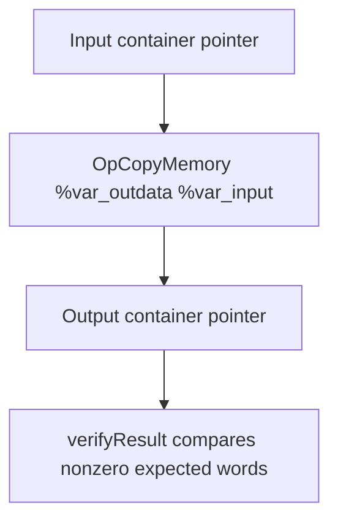

## Overview

**Core question:** Can a Vulkan implementation execute SPIR-V modules that use an empty `OpTypeStruct` in copies, pointer comparison, and function calls without corrupting the observable nonempty data around it?

- This page documents the `empty_struct` test family in the `spirv_assembly` test category. [`createEmptyStructComputeGroup()`](../../../modules/vulkan/spirv_assembly/vktSpvAsmEmptyStructTests.cpp#L532-L544) registers three intermediate nodes: `copying`, `pointer_comparison`, and `function`.
- The source defines empty structures with `OpTypeStruct` without member types, then embeds them between two `i32` members of a buffer block. The test cases make surrounding integer data, pointer inequality, or function results observable through storage-buffer output.
- The default Vulkan mustpass list contains eight executable leaves: four under `copying`, one under `pointer_comparison`, and three under `function`. The Vulkan SC list has the same eight registered paths. See [`spirv-assembly.txt`](../../../mustpass/main/vk-default/spirv-assembly.txt#L1484-L1491) and [`spirv-assembly.txt`](../../../mustpass/main/vksc-default/spirv-assembly.txt#L1043-L1050).

## Background Knowledge

- `OpTypeStruct` takes zero or more member-type IDs. An empty operand list therefore declares a structure with no members. The [SPIR-V grammar entry for `OpTypeStruct`](../../../../spirv-headers/src/include/spirv/1.0/spirv.core.grammar.json) records this variable-length operand form.
- `OpAccessChain` derives a pointer to a selected composite member. `OpPtrNotEqual` compares two pointer values, and `OpSelect` converts its Boolean result to the integer signal checked by the host. See the [SPIR-V grammar](../../../../spirv-headers/src/include/spirv/1.0/spirv.core.grammar.json).
- `OpCopyMemory` copies memory through pointers, while `OpCopyLogical` and `OpCopyObject` produce values. A function call can pass and return an empty-struct value even though the value contains no data members. The test observes neighboring payload fields or an independent integer result instead of attempting to inspect an empty value directly.

## Registration Hierarchy

```text
spirv_assembly.instruction.compute.empty_struct
├── copying
├── pointer_comparison
└── function
```

[`createInstructionTests()`](../../../modules/vulkan/spirv_assembly/vktSpvAsmInstructionTests.cpp#L21422-L21428) adds `empty_struct` to the compute instruction branch. [`createEmptyStructComputeGroup()`](../../../modules/vulkan/spirv_assembly/vktSpvAsmEmptyStructTests.cpp#L532-L544) supplies the three direct intermediate nodes shown above.

## Parameter Dimensions and Observed Values

| Dimension | Registered values | Meaning in this test | Evidence |
|-----------|-------------------|----------------------|----------|
| Intermediate node | `copying`, `pointer_comparison`, `function` | Selects the operation shape used to exercise the empty struct. | [group registration](../../../modules/vulkan/spirv_assembly/vktSpvAsmEmptyStructTests.cpp#L537-L542) |
| Copy instruction | `copy_object`, `copy_memory` | `copy_object` loads the container and stores the resulting value. `copy_memory` uses `OpCopyMemory` between the input and output pointers. | [copying method table](../../../modules/vulkan/spirv_assembly/vktSpvAsmEmptyStructTests.cpp#L167-L184) |
| Copy input layout | `ubo`, `ssbo` | The UBO uses offsets `0, 16, 32, 48`; the SSBO uses `0, 4, 8, 12`. Both layouts place two empty members between the observable first and last `i32` members. | [buffer type table](../../../modules/vulkan/spirv_assembly/vktSpvAsmEmptyStructTests.cpp#L141-L165) |
| Function empty-struct source variable | `global_variable_private`, `global_variable_shared`, `local_variable` | Selects the `Private`, `Workgroup`, or `Function` variable from which the caller loads one empty value before copying it into a function-scope parameter variable. | [variable definitions](../../../modules/vulkan/spirv_assembly/vktSpvAsmEmptyStructTests.cpp#L468-L502), [caller setup](../../../modules/vulkan/spirv_assembly/vktSpvAsmEmptyStructTests.cpp#L405-L415) |
| SPIR-V and feature requirement | SPIR-V 1.4 plus `VK_KHR_spirv_1_4` and `variablePointersStorageBuffer` | Required by the pointer comparison and function modules. | [pointer case setup](../../../modules/vulkan/spirv_assembly/vktSpvAsmEmptyStructTests.cpp#L304-L316), [function case setup](../../../modules/vulkan/spirv_assembly/vktSpvAsmEmptyStructTests.cpp#L517-L526) |

## Behavior Parameters

The behavioral axis is the **intermediate node**. Each direct child changes the SPIR-V operation that carries or addresses an empty-struct value.

### copying: copy a container with empty members

The `copying` node creates four test case leaves from the two copy instructions and two input-buffer layouts. The declared container is `OpTypeStruct %i32 %type_empty_struct %type_empty_struct %i32`. The UBO leaves use a uniform input and storage-buffer output; the SSBO leaves use storage buffers for both. The host checks only nonzero expected words; zero marks empty-member positions and, in the UBO representation, layout gaps that this oracle does not constrain.

### pointer_comparison: compare addresses of empty members

The sole `ssbo` leaf takes `OpAccessChain` pointers to member indices `1` and `2`, the two separate empty members in one container. `OpPtrNotEqual` must produce true, so `OpSelect` writes integer `1` to the output buffer. This module requests `VariablePointersStorageBuffer`, SPIR-V 1.4, and `VK_KHR_spirv_1_4`.

### function: pass and return an empty-struct value

The three leaves vary where the source empty-struct variable resides. Each of two workgroups has two local invocations; the local-ID branch routes each invocation through one of the two call sites. A call copies an empty value from `StorageBuffer` to the function type with `OpCopyLogical`, calls `%15`, copies the returned value back, and writes sentinel integer fields around the result. The repeated workgroups write the same expected values. The expected outputs for each output buffer are `{1, 0xffffffff, 1}`.

## Shader Analysis

The source contains CTS-authored SPIR-V assembly templates rather than GLSL. All three intermediate nodes run a compute entry point and publish their results through storage-buffer resources. The page therefore follows the source templates and their specialization tables; it does not reconstruct a separate GLSL shader.

### Representative Shader Walkthrough: `copying.copy_memory_ssbo`

#### Parameter Values Chosen

| Parameter choice | Value | Meaning |
|------------------|-------|---------|
| Representative path | `spirv_assembly.instruction.compute.empty_struct.copying.copy_memory_ssbo` | Uses the pointer-based copy operation with the compact SSBO layout. |
| Empty type | `%type_empty_struct = OpTypeStruct` | A structure with no member types. |
| Container type | `%type_container_struct = OpTypeStruct %i32 %type_empty_struct %type_empty_struct %i32` | Two empty members lie between integer payload fields. |
| Member offsets | `0, 4, 8, 12` | The SSBO specialization's explicit block offsets. |
| Copy sequence | `OpCopyMemory %var_outdata %var_input` | Copies from the input container pointer to the output container pointer. |
| Expected comparison | first and final payload words, `2` and `7` | The custom verifier ignores expected zero words. |

#### Purpose

The specialized `copy_memory_ssbo` module declares one empty structure type and one four-member container type. It binds the input at set `0`, binding `0`, and the output at set `0`, binding `1`. Its one-invocation `%main` performs `OpCopyMemory` between the two container pointers. The host input is `{2, 3, 5, 7}`, while the expected output vector is `{2, 0, 0, 7}`. The zeros are test markers, not payload values that the oracle requires the implementation to preserve.



#### Source Code

The empty and container types are generated in the [copying template](../../../modules/vulkan/spirv_assembly/vktSpvAsmEmptyStructTests.cpp#L81-L116). The selected specialization comes from the [SSBO entry](../../../modules/vulkan/spirv_assembly/vktSpvAsmEmptyStructTests.cpp#L155-L165) and the [`copy_memory` entry](../../../modules/vulkan/spirv_assembly/vktSpvAsmEmptyStructTests.cpp#L178-L184):

```llvm
%type_empty_struct = OpTypeStruct
%type_container_struct = OpTypeStruct %i32 %type_empty_struct %type_empty_struct %i32
%var_input = OpVariable %type_container_struct_ssbo_ptr StorageBuffer
%var_outdata = OpVariable %type_container_struct_ssbo_ptr StorageBuffer
OpCopyMemory %var_outdata %var_input
```

This is an excerpt of CTS-authored SPIR-V assembly from C++ templates rather than GLSL or HLSL. The compute-case builder submits the specialized complete assembly to `programCollection.spirvAsmSources`; this page does not publish a separate disassembly, so it intentionally has no `#### SPIR-V` subsection.

The other copying leaves retain the type layout but select the UBO offsets or replace the final instruction with a load and store. The pointer-comparison and function nodes use separate complete assembly templates, so this narrow walkthrough does not imply that their modules use `OpCopyMemory`.

## Runtime Execution and Result Checking

1. The copying builder specializes the assembly once for every buffer-layout and copy-method pair, gives each case one workgroup, and supplies the input and expected output buffers. [`verifyResult()`](../../../modules/vulkan/spirv_assembly/vktSpvAsmEmptyStructTests.cpp#L39-L61) reads every output word but skips every expected word of zero, including irrelevant UBO layout gaps. The leaf passes only if all nonzero expected words match.
2. The pointer-comparison builder creates one SSBO input `{2, 3, 5, 7}` and one expected output `{1}`. Its assembly selects the two empty-member pointers, compares them, converts the Boolean to an `i32`, and stores that value. The framework's normal output comparison checks the one-word result. See the [case construction](../../../modules/vulkan/spirv_assembly/vktSpvAsmEmptyStructTests.cpp#L304-L316).
3. The function builder launches two workgroups with two local invocations each and creates two output resources with the same expected vector `{1, 0xffffffff, 1}`. Each local-ID branch invokes `%15` with two function-scope empty-struct pointers and a Boolean, copies the returned empty value into a storage-buffer object, and stores visible integer sentinels. Both workgroups make the same writes, so the output vectors do not distinguish workgroups. See the [template control flow](../../../modules/vulkan/spirv_assembly/vktSpvAsmEmptyStructTests.cpp#L392-L465) and [expected-output setup](../../../modules/vulkan/spirv_assembly/vktSpvAsmEmptyStructTests.cpp#L504-L526).

## Failure Meaning

### Failure Cause Mapping

| If this behavior parameter value fails | Possible failure cause(s) |
|----------------------------------------|---------------------------|
| `copying` | Empty-member handling during value or memory copy, member-offset/layout handling, or the copying oracle's storage-buffer readback path. |
| `pointer_comparison` | Address formation for distinct empty members, `OpPtrNotEqual` execution, requested variable-pointer support, or the one-word output path. |
| `function` | Empty-struct type conversion or call/return handling, the selected variable storage class, requested variable-pointer support, or either output comparison. |

The observed buffers classify failures by operation shape. They do not isolate a compiler defect from descriptor setup, memory layout, or result readback without inspecting the failing module and runtime trace.

### Cause Analysis

#### Container-copy handling

**Possible failure symptoms:** A copying leaf returns a nonzero expected payload word other than `2` or `7`. A UBO-only or SSBO-only pattern narrows the symptom to that layout variant, while a `copy_memory`-only or `copy_object`-only pattern narrows it to that operation form.

**Possible implementation causes:** An implementation may mishandle a container type that has no-data members when it calculates member locations, transfers a composite value, or performs a memory copy. A layout or descriptor path may also select the wrong input representation. The source intentionally accepts any values in expected-zero positions, including UBO layout gaps, so those words alone are not a test failure.

#### Empty-member pointer comparison

**Possible failure symptoms:** `pointer_comparison.ssbo` writes `0` instead of the expected `1`, or the case cannot run after requesting SPIR-V 1.4 and `variablePointersStorageBuffer`.

**Possible implementation causes:** The implementation may collapse the two access-chain results, mishandle pointer inequality for distinct empty members, or fail the required variable-pointer feature path. Source-level investigation is needed to separate those paths from storage-buffer output setup.

#### Function argument and return handling

**Possible failure symptoms:** One or more function leaves differs from `{1, 0xffffffff, 1}` in either output resource. A failure limited to `global_variable_private`, `global_variable_shared`, or `local_variable` follows the selected empty-struct variable storage class.

**Possible implementation causes:** A compiler or execution implementation may mishandle `OpCopyLogical`, function parameters, or `OpReturnValue` for an empty structure. A storage-class-specific failure can also originate in private, workgroup, or function-variable lowering. The integer sentinels make the call path observable, but they do not identify the exact instruction that produced the mismatch.

## Case Pruning

- `pointer_comparison` has only an SSBO leaf because the source notes that this pointer comparison is possible only for the `StorageBuffer` storage class. See [the builder comment and capability declaration](../../../modules/vulkan/spirv_assembly/vktSpvAsmEmptyStructTests.cpp#L213-L219).
- The `copying` node tests two layouts rather than every possible buffer arrangement. The source supplies the UBO and SSBO forms needed to exercise their distinct member-offset tables.
- The function node uses three storage placements. It does not multiply those cases by the copying layouts because the function template has its own storage-buffer interface and varies only the empty variable definition.

## Key Takeaways

- `empty_struct` is one compute test family with three direct intermediate nodes and eight mustpass leaves.
- The tests make an otherwise data-free type observable through neighboring integers, pointer inequality, and call-side sentinel stores.
- `copying` accepts ignored zero marker positions by design; `pointer_comparison` requires output `1`; `function` requires `{1, 0xffffffff, 1}` from both outputs.
- `pointer_comparison` and `function` require SPIR-V 1.4, `VK_KHR_spirv_1_4`, and the requested `variablePointersStorageBuffer` feature.

## Source Reference Appendix

- [Obsolete navigation page: `vktSpvAsmEmptyStructTests.md`](vktSpvAsmEmptyStructTests.md)
- [Implementation: `vktSpvAsmEmptyStructTests.cpp`](../../../modules/vulkan/spirv_assembly/vktSpvAsmEmptyStructTests.cpp#L39-L544)
- [Parent registration: `vktSpvAsmInstructionTests.cpp`](../../../modules/vulkan/spirv_assembly/vktSpvAsmInstructionTests.cpp#L21422-L21428)
- [Default Vulkan mustpass entries](../../../mustpass/main/vk-default/spirv-assembly.txt#L1484-L1491)
- [Vulkan SC mustpass entries](../../../mustpass/main/vksc-default/spirv-assembly.txt#L1043-L1050)
- [SPIR-V core grammar](../../../../spirv-headers/src/include/spirv/1.0/spirv.core.grammar.json)
