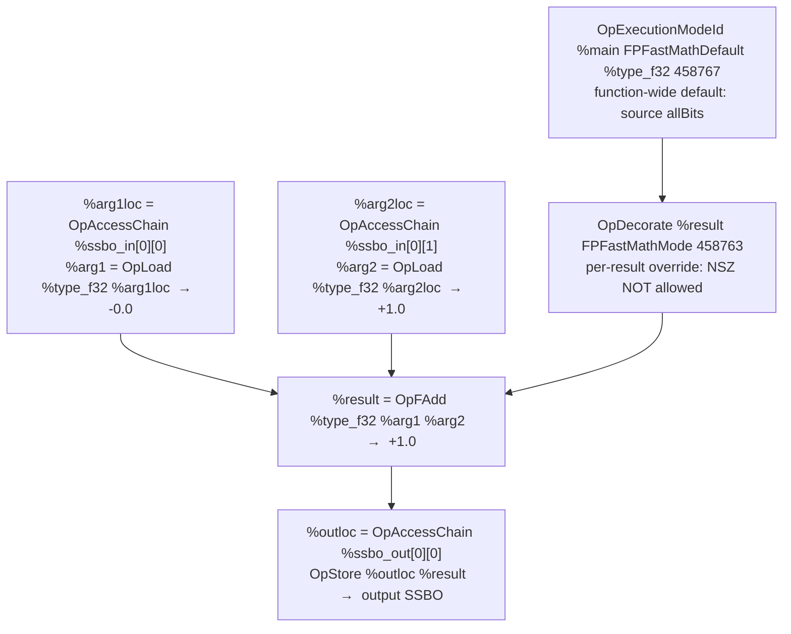

## Overview

**Core question:** Does the Vulkan implementation honor `SPV_KHR_float_controls2` `FPFastMathMode` decorations and `OpExecutionModeId FPFastMathDefault` execution modes by producing IEEE-correct output for whichever fast-math bits are *absent* from a given case?

- Source file: [`vktSpvAsmFloatControls2Tests.cpp`](../../../modules/vulkan/spirv_assembly/vktSpvAsmFloatControls2Tests.cpp), one of the delegated `float_controls*` families registered under `spirv_assembly.instruction.compute` and `spirv_assembly.instruction.graphics`. Unlike the v1 `float_controls` file, this one targets the v2 extension and only registers an `input_args` subgroup per float type.
- Test category: `spirv_assembly`. Test family (page scope): `float_controls2`, with three intermediate float-type children (`fp16`, `fp32`, `fp64`) under each pipeline variant (`compute`, `graphics`).
- Core test idea: every case specializes one SPIR-V template that emits `OpCapability FloatControls2`, `OpExtension "SPV_KHR_float_controls2"`, a function-wide `OpExecutionModeId %main FPFastMathDefault ...` mask, and (for `_deco` variants) a per-result `OpDecorate %result FPFastMathMode <bits>` mask. The applied mask is the *inverse* of the bits being tested, so the case exercises the absence of those bits.
- What to expect from the page: the registration tree and the compute/graphics split; the parameter matrix of `(FloatType, OperationId, testedFlagBits, _exec|_deco, _vert|_frag)`; one representative compute walkthrough that shows the template, the inverted-mask mechanism, and the input/output SSBO layout; and the failure mapping per fast-math bit.

## Background Knowledge

- `FPFastMathMode` masks and `OpExecutionModeId FPFastMathDefault`. `SPV_KHR_float_controls2` lets a shader attach a fast-math mask to a whole function via `OpExecutionModeId %main FPFastMathDefault %type_fN %bc_u32_fp_exec_mode`, or to a single result ID via `OpDecorate %id FPFastMathMode <bits>`. The mask tells the compiler which IEEE-754 guarantees it may relax. Each case applies an inverted mask, so a case named `testedWithout_NSZ` applies `allBits & ~NSZ`, and the implementation must preserve signed zeros for that operation.
- Fast-math bits and their meaning. The seven bits are `NotNaN`, `NotInf`, `NSZ`, `AllowRecip`, `AllowContract`, `AllowReassoc`, and `AllowTransform`. Their declared SPIR-V values are `0x1`, `0x2`, `0x4`, `0x8`, `0x10000`, `0x20000`, and `0x40000`; therefore source `allBits` is their union, `458767` (`0x7000F`). `AllowTransform` requires `AllowReassoc | AllowContract` to also be set; the `invert()` helper clears `AllowTransform` from the inverted mask whenever either companion bit is set, so generated masks stay legal.
- Two application points: `_exec` versus `_deco`. Each `(operation, args, flagBits)` row is registered twice. The `_exec` variant applies the inverted mask as the function-wide `FPFastMathDefault` and emits no per-result decoration. The `_deco` variant sets the function-wide default to source `allBits` (`458767`, all seven declared bits) and attaches the same inverted mask to `%result` via `OpDecorate`. A divergence between the two variants for the same logical mask isolates a bug in decoration handling rather than in fast-math semantics.

## Registration Hierarchy

```text
spirv_assembly.instruction.compute.float_controls2
├── fp16
├── fp32
└── fp64
```

The same three-children tree also exists under `spirv_assembly.instruction.graphics.float_controls2`. Each `<fp-type>` child contains a single `input_args` subgroup created by [`createFloatControls2TestGroup`](../../../modules/vulkan/spirv_assembly/vktSpvAsmFloatControls2Tests.cpp#L3332-L3358); `input_args` holds all the operation/flag combinations generated by [`TestCasesBuilder::build`](../../../modules/vulkan/spirv_assembly/vktSpvAsmFloatControls2Tests.cpp#L1981-L2006). The two pipeline variants are wired up in `vktSpvAsmInstructionTests.cpp` ([compute](../../../modules/vulkan/spirv_assembly/vktSpvAsmInstructionTests.cpp#L21397), [graphics](../../../modules/vulkan/spirv_assembly/vktSpvAsmInstructionTests.cpp#L21496)).

## Parameter Dimensions and Observed Values

| Dimension | Registered values | Meaning in this test | Evidence |
|-----------|-------------------|----------------------|----------|
| Pipeline variant | `compute`, `graphics` | Selects compute dispatch (`SpvAsmComputeShaderCase`) versus a vertex+fragment draw. The same `(operation, flag, args)` matrix runs under both variants; graphics adds `_vert`/`_frag` suffixes and routes the result through a bitcast varying. | [`createFloatControls2ComputeGroup`](../../../modules/vulkan/spirv_assembly/vktSpvAsmFloatControls2Tests.cpp#L3361-L3366), [`createFloatControls2GraphicsGroup`](../../../modules/vulkan/spirv_assembly/vktSpvAsmFloatControls2Tests.cpp#L3368-L3374) |
| Float type | `fp16`, `fp32`, `fp64` | Float width under test. Drives capabilities (`Float16`/`Float64`), SSBO element size (2/4/8 bytes), and feature gates (`shaderFloat16`, `shaderFloat64`, `storageBuffer16BitAccess`). | [`testGroups`](../../../modules/vulkan/spirv_assembly/vktSpvAsmFloatControls2Tests.cpp#L3342-L3346) |
| Argument source | `input_args` only | Both operands are read from a 2-element input SSBO. The v2 file does not register a `generated_args` subgroup (unlike v1), which keeps the SPIR-V template simpler. | [`createFloatControls2TestGroup`](../../../modules/vulkan/spirv_assembly/vktSpvAsmFloatControls2Tests.cpp#L3354) |
| Operation | `add`, `sub`, `mul`, `div`, `fma`, trig, conversion, matrix, comparison, ... | SPIR-V (`OpFAdd`, `OpFSub`, ...) and `GLSL.std.450` (`Sin`, `Atan2`, ...) operations, plus the synthetic `OID_FMA2PT58`/`OID_SZ_FMA`/`OID_ADD_SUB_REASSOCIABLE` cases crafted for specific fast-math bits. | [`OperationId`](../../../modules/vulkan/spirv_assembly/vktSpvAsmFloatControls2Tests.cpp#L256-L364), [`TestCasesBuilder::init`](../../../modules/vulkan/spirv_assembly/vktSpvAsmFloatControls2Tests.cpp#L1575-L1979) |
| Tested flag bits | `None`, `NSZ`, `NotInf`, `NotNaN`, `AllowRecip`, `AllowContract`, `AllowReassoc`, `AllowTransform`, plus combined masks | The fast-math bit(s) whose *absence* the case verifies. Each value is inverted by `invert()` to produce the applied mask. Combined masks (`AllowReassoc | NotInf`, `AllowContract | NSZ`, `NotNaN | NotInf`) appear where a single operation needs multiple bits absent. | [`behaviorToName`](../../../modules/vulkan/spirv_assembly/vktSpvAsmFloatControls2Tests.cpp#L110-L117), [`invert`](../../../modules/vulkan/spirv_assembly/vktSpvAsmFloatControls2Tests.cpp#L122-L129) |
| Application point | `_exec`, `_deco` | Selects the function-wide execution-mode mask versus the per-result `OpDecorate` mask. Both variants must produce identical results for the test to pass. | [`TestCasesBuilder::build`](../../../modules/vulkan/spirv_assembly/vktSpvAsmFloatControls2Tests.cpp#L1991-L1994) |
| Graphics stage | `_vert`, `_frag` | Selects which graphics stage runs the tested operation. The vertex stage cannot write to SSBOs, so the result is bitcast to a `u32` varying and stored by the fragment stage. | [`GraphicsTestGroupBuilder::createOperationTests`](../../../modules/vulkan/spirv_assembly/vktSpvAsmFloatControls2Tests.cpp#L2917-L2929) |

## Behavior Parameters

The primary behavioral axis is `testedFlagBits`: the registered dimension whose values change *which fast-math property is being verified*. The float type, operation, application point, and graphics stage are parameter dimensions that change the assembly, resources, or pipeline routing, but do not change which property is under test.

The full set of `testedFlagBits` values comes from the [`testCaseInputs`](../../../modules/vulkan/spirv_assembly/vktSpvAsmFloatControls2Tests.cpp#L1180-L1293) table and from `appendStandardCases`, which generates `(V_MINUS_ZERO, V_ONE, NSZ)`, `(V_INF, V_ONE, NotInf)`, and `(V_NAN, V_ONE, NotNaN)` rows for every standard operation.

### `NSZ`: signed-zero preservation

Tests that the implementation does not flush `-0.0` to `+0.0` when `NSZ` is *absent* from the applied mask. The case name `testedWithout_NSZ` reflects the inversion: the source-applied mask is `allBits & ~NSZ = 458763 = 0x7000B`. Most `NSZ` cases pair `-0.0` operands with non-zero operands to expose sign-flushing behavior in `OpFAdd`, `OpFSub`, `OpFMul`, `OpFDiv`, `OpDot`, `OpCross`, `OpClamp`, `OpNMin`, `OpNMax`, and the trig family.

### `NotNaN`: NaN preservation

Tests that the implementation preserves NaN payloads when `NotNaN` is absent. Cases use `V_NAN` as one operand and rely on the IEEE rule that any operation producing NaN leaves NaN in the result. Combined `NotNaN | NotInf` rows cover `inf - inf = NaN` and `0 * inf = NaN`.

### `NotInf`: infinity preservation

Tests that the implementation does not drop or substitute infinities when `NotInf` is absent. Cases feed `V_INF` or `V_MINUS_INF` as an operand and expect the IEEE infinity result. Overflow cases (`add(huge, huge)`, `mul(huge, huge)`) set `requireRte = true` so the implementation must round to nearest even when computing the intermediate.

### `AllowContract`: FMA contraction control

Tests that the implementation does not contract `OpFMul + OpFAdd` into a single FMA when `AllowContract` is absent. The synthetic `OID_FMA2PT58` (`0.1 * 25.8 - 2.58`) and `OID_SZ_FMA` operations are crafted so the contracted and non-contracted forms produce different bit patterns.

### `AllowReassoc`: reassociation control

Tests that the implementation does not rewrite `(a + b) - a` to `(a - a) + b` when `AllowReassoc` is absent. The synthetic `OID_ADD_SUB_REASSOCIABLE` operation pairs `V_MAX` with `V_HUGE` (or `V_MAX`) to expose overflow differences between the two associativity forms.

### `AllowRecip`: grammar acceptance

Tests only that the implementation accepts a valid `FPFastMathMode AllowRecip` decoration. The `op_AllowRecip_exec_grammar_test` case divides `1 / 2` and accepts `0.5` either way, so a failure here points at shader rejection rather than wrong arithmetic.

### `AllowTransform`: grammar acceptance with companion bits

Tests that the implementation accepts `AllowTransform` when both `AllowReassoc` and `AllowContract` are also set (the SPIR-V requirement). The `op_AllowTransform_OR_AllowReassoc_OR_AllowContract_exec_grammar_test` case exercises this combination. `AllowTransform` cannot be tested on its own because the inverted mask would be illegal.

### `None`: grammar acceptance of an empty mask

Tests that the implementation accepts `FPFastMathMode None` as a mask value. The `op_None_exec_grammar_test` case applies an empty inverted mask (`MaskNone`) and runs `add(max, huge)` with `requireRte = true`; the result must be `+inf`.

## Shader Analysis

This page uses one representative compute walkthrough. The graphics pipeline reuses the same per-stage SPIR-V template fragments with different entry points and a bitcast varying between vertex and fragment; graphics-specific differences are summarized in `#### Parameter Variation Summary` and `## Runtime Execution and Result Checking` rather than shown as a separate walkthrough.

> **TEMP-SPIRV-ASSEMBLY: spirv_assembly category deviation (temporary, revert before merge to vkcts-wiki).**
>
> For the `spirv_assembly` category only:
> - `#### Source Code` holds the **CTS-authored SPIR-V assembly** (the source of truth), unfoldable, replacing the usual GLSL/HLSL.
> - `shader-analyzer` extracts the assembly from C++ string templates (not reconstructs GLSL/HLSL); preserves CTS-generated `;` comments. Wiki-authored annotations also use `;` comment syntax.
> - The `#### SPIR-V` collapsed subsection is **omitted** because it would duplicate the assembly already shown under `#### Source Code`.
> - `shader-disassembler` runs as a generation-time validation gate only (`spirv-as` → `spirv-val` → `spirv-dis`); its output is not published.

### Representative Shader Walkthrough 1

#### Parameter Values Chosen

Representative path:

```text
dEQP-VK.spirv_assembly.instruction.compute.float_controls2.fp32.input_args.add_testedWithout_NSZ_arg1_minusZero_arg2_one_res_one_deco
```

| Parameter choice | Meaning in this representative case |
|------------------|-------------------------------------|
| Pipeline variant `compute` | Selects `SpvAsmComputeShaderCase` dispatch and the `m_operationShaderTemplate` skeleton in `ComputeTestGroupBuilder::init` |
| Float type `fp32` | No extra capabilities or extensions; SSBO stride is 4 bytes; `shaderFloatControls2` is the only feature required beyond the SPIR-V 1.2 baseline |
| Argument source `input_args` | Both operands are loaded from the 2-element input SSBO; no per-case float constants are emitted |
| Operation `add` | The tested instruction is `%result = OpFAdd %type_f32 %arg1 %arg2`; default `IDsToDecorate = {"result"}` |
| Tested flag bits `NSZ` | The case verifies signed-zero preservation. The source-applied decoration mask is `invert(NSZ) = allBits & ~NSZ = 458763 = 0x7000B` (`NotNaN|NotInf|AllowRecip|AllowContract|AllowReassoc|AllowTransform`) |
| Application point `_deco` | The function-wide `FPFastMathDefault` is set to source `allBits = 458767` (`0x7000F`, all seven declared bits), and the same inverted mask `458763` is attached to `%result` via `OpDecorate %result FPFastMathMode ...` |
| Inputs `arg1 = -0.0, arg2 = +1.0` | SSBO input bytes encode IEEE-754 `-0.0` (`0x80000000`) and `+1.0` (`0x3F800000`); expected output is `+1.0` |

#### Purpose

Verify that an `OpFAdd` decorated with an inverted-`NSZ` mask (function-wide default source `allBits = 458767`, per-result decoration `458763 = ~NSZ & allBits`) compiles and produces the IEEE-correct `+1.0` result for `-0.0 + 1.0`. This case is a shader-acceptance and per-result-decoration sanity check: the IEEE result is `+1.0` whether or not `NSZ` is allowed, so a failure here points at decoration plumbing rather than arithmetic.

#### Structural Design



#### Source Code

The compute SPIR-V assembly fence below is the complete source-equivalent representative specialization built from the [`m_operationShaderTemplate`](../../../modules/vulkan/spirv_assembly/vktSpvAsmFloatControls2Tests.cpp#L2397-L2466) skeleton, the FP32 snippets from [`TypeSnippets<float>::TypeSnippets`](../../../modules/vulkan/spirv_assembly/vktSpvAsmFloatControls2Tests.cpp#L915-L938), the behavior snippets from [`getBehaviorCapabilityAndExecutionModeDecoration`](../../../modules/vulkan/spirv_assembly/vktSpvAsmFloatControls2Tests.cpp#L2319-L2336), and the `OID_ADD` command `%result = OpFAdd %type_float %arg1 %arg2` from [`TestCasesBuilder::init`](../../../modules/vulkan/spirv_assembly/vktSpvAsmFloatControls2Tests.cpp#L1643-L1644). Its fast-math numeric literals are the source generator's unsigned `FPFastMathModeMask` values. CTS-authored `;` comments are preserved verbatim; wiki-authored section markers also use `;` comment syntax.

```llvm
; --- capabilities ---
OpCapability Shader
OpCapability FloatControls2
; --- extensions ---
OpExtension "SPV_KHR_float_controls2"
%std450            = OpExtInstImport "GLSL.std.450"
OpMemoryModel Logical GLSL450
OpEntryPoint GLCompute %main "main" %id
OpExecutionMode %main LocalSize 1 1 1
; --- function-wide FPFastMathDefault: allBits = 458767 (everything allowed) ---
OpExecutionModeId %main FPFastMathDefault %type_f32 %bc_u32_fp_exec_mode
OpDecorate %id BuiltIn GlobalInvocationId
; --- per-result FPFastMathMode decoration: invert(NSZ) = 458763 ---
; NotNaN|NotInf|AllowRecip|AllowContract|AllowReassoc|AllowTransform
OpDecorate %result FPFastMathMode NotNaN|NotInf|AllowRecip|AllowContract|AllowReassoc|AllowTransform
; --- SSBO annotations (input binding 0, output binding 1) ---
OpMemberDecorate %SSBO_in 0 Offset 0
OpDecorate %SSBO_in BufferBlock
OpDecorate %ssbo_in DescriptorSet 0
OpDecorate %ssbo_in Binding 0
OpDecorate %ssbo_in NonWritable
OpMemberDecorate %SSBO_out 0 Offset 0
OpDecorate %SSBO_out BufferBlock
OpDecorate %ssbo_out DescriptorSet 0
OpDecorate %ssbo_out Binding 1
OpDecorate %type_f32_arr_1 ArrayStride 4
OpDecorate %type_f32_arr_2 ArrayStride 4
; --- common scalar/vector types ---
%type_void            = OpTypeVoid
%type_voidf           = OpTypeFunction %type_void
%type_bool            = OpTypeBool
%type_u32             = OpTypeInt 32 0
%type_i32             = OpTypeInt 32 1
%type_i32_fptr        = OpTypePointer Function %type_i32
%type_u32_vec2        = OpTypeVector %type_u32 2
%type_u32_vec3        = OpTypeVector %type_u32 3
%type_u32_vec3_ptr    = OpTypePointer Input %type_u32_vec3
%c_i32_0              = OpConstant %type_i32 0
%c_i32_1              = OpConstant %type_i32 1
%c_i32_2              = OpConstant %type_i32 2
; --- FP32 type family ---
%type_f32             = OpTypeFloat 32
%type_f32_uptr        = OpTypePointer Uniform %type_f32
%type_f32_fptr        = OpTypePointer Function %type_f32
%type_f32_vec2        = OpTypeVector %type_f32 2
%type_f32_vec3        = OpTypeVector %type_f32 3
%type_f32_vec4        = OpTypeVector %type_f32 4
%type_f32_vec4_iptr   = OpTypePointer Input %type_f32_vec4
%type_f32_vec4_optr   = OpTypePointer Output %type_f32_vec4
%type_f32_mat2x2      = OpTypeMatrix %type_f32_vec2 2
%type_f32_arr_1       = OpTypeArray %type_f32 %c_i32_1
%type_f32_arr_2       = OpTypeArray %type_f32 %c_i32_2
; --- SSBO variables (binding 0 input, binding 1 output) ---
%SSBO_in              = OpTypeStruct %type_f32_arr_2
%up_SSBO_in           = OpTypePointer Uniform %SSBO_in
%ssbo_in              = OpVariable %up_SSBO_in Uniform
%SSBO_out             = OpTypeStruct %type_f32_arr_1
%up_SSBO_out          = OpTypePointer Uniform %SSBO_out
%ssbo_out             = OpVariable %up_SSBO_out Uniform
%id                   = OpVariable %type_u32_vec3_ptr Input
; --- behavior constant: function-wide FPFastMathDefault mask = 458767 ---
%bc_u32_fp_exec_mode  = OpConstant %type_u32 458767
; --- main function ---
%main                 = OpFunction %type_void None %type_voidf
%label                = OpLabel
%arg1loc              = OpAccessChain %type_f32_uptr %ssbo_in %c_i32_0 %c_i32_0
%arg1                 = OpLoad %type_f32 %arg1loc
%arg2loc              = OpAccessChain %type_f32_uptr %ssbo_in %c_i32_0 %c_i32_1
%arg2                 = OpLoad %type_f32 %arg2loc
%result               = OpFAdd %type_f32 %arg1 %arg2
%outloc               = OpAccessChain %type_f32_uptr %ssbo_out %c_i32_0 %c_i32_0
OpStore %outloc %result
OpReturn
OpFunctionEnd
```

#### Additional Info

- The `%type_bool`, `%type_f32_vec2`, `%type_f32_vec3`, `%type_f32_vec4`, `%type_f32_vec4_iptr`, `%type_f32_vec4_optr`, `%type_f32_mat2x2`, `%type_f32_arr_2`, and `%type_i32_fptr` types are emitted by the shared [`TypeSnippetsBase::updateSpirvSnippets`](../../../modules/vulkan/spirv_assembly/vktSpvAsmFloatControls2Tests.cpp#L693-L704) template but are unused in this particular compute body. They are retained because the helper is shared across many operations that do use them; SPIR-V permits unused type declarations.
- The `%c_i32_2` constant is also unused in this body; `%c_i32_0` and `%c_i32_1` index the two SSBO elements. Unused `%type_u32_vec2` is similarly a shared-helper artifact.
- The host fills `%ssbo_in` with `[V_MINUS_ZERO, V_ONE]` (`[-0.0, +1.0]`) and pre-fills `%ssbo_out` with the ValueId `V_ONE` reinterpreted as raw float bits. The single `OpStore` overwrites the first output element with the device-computed result; `checkFloats<Float32, float>` then reads it back and compares it against the expected ValueId.
- For the `_exec` variant, the same template is specialized with `useDecorationFlags = false`: the `OpDecorate %result FPFastMathMode ...` line is omitted and source `%bc_u32_fp_exec_mode` is set to `invert(NSZ) = 458763` (rather than `_deco`'s source `allBits = 458767`). Everything else is identical.
- **Representative-fence regeneration:** the source enumerants make `allBits = 458767` (`0x7000F`) and `invert(NSZ) = 458763` (`0x7000B`). For this `_deco` case, `OperationTestCase` assigns the former to `behaviorFlagsExecMode` and the latter to `behaviorFlagsDecoration`; the template serializes `behaviorFlagsExecMode` into `%bc_u32_fp_exec_mode`. The complete fence was regenerated with those source values and passed `spirv-as --target-env spv1.2`, `spirv-val --target-env vulkan1.2`, and `spirv-dis`.

#### Parameter Variation Summary

| Parameter dimension | Shader-level variation from this shader | Evidence |
|---------------------|---------------------------------------|----------|
| Float type `fp16` | Adds `OpCapability Float16`; replaces `%type_f32` with `%type_f16`; SSBO stride becomes 2 bytes; requests `storageBuffer16BitAccess` and `shaderFloat16`. When `fp16Without16BitStorage = true`, the SSBO is backed by `uint32` and the load/store path uses `OpBitcast %type_f16_vec2 %inval`. | [`TypeSnippets<deFloat16>::TypeSnippets`](../../../modules/vulkan/spirv_assembly/vktSpvAsmFloatControls2Tests.cpp#L886-L913), [`TypeSnippetsBase::updateSpirvSnippets`](../../../modules/vulkan/spirv_assembly/vktSpvAsmFloatControls2Tests.cpp#L807-L853) |
| Float type `fp64` | Adds `OpCapability Float64`; SSBO stride becomes 8 bytes; requests `shaderFloat64`. The graphics vertex↔fragment varying becomes `u32vec2` to hold the 8 bytes. | [`TypeSnippets<double>::TypeSnippets`](../../../modules/vulkan/spirv_assembly/vktSpvAsmFloatControls2Tests.cpp#L940-L963) |
| Operation `sub`/`mul`/`div`/`fma`/trig/... | Replaces the `%result = OpFAdd` line with the per-operation snippet (`OpFSub`, `OpFMul`, `OpExtInst %std450 Sin`, ...); operations that need extra constants or types emit them via `${constants}` and `${types}`. | [`TestCasesBuilder::init`](../../../modules/vulkan/spirv_assembly/vktSpvAsmFloatControls2Tests.cpp#L1575-L1979) |
| Tested flag bits `NotNaN`/`NotInf`/`AllowContract`/`AllowReassoc` | Changes the `OpDecorate %result FPFastMathMode <bits>` string and the `%bc_u32_fp_exec_mode` constant. `AllowTransform` and combined masks follow the `invert()` rule. | [`getBehaviourName`](../../../modules/vulkan/spirv_assembly/vktSpvAsmFloatControls2Tests.cpp#L131-L149), [`invert`](../../../modules/vulkan/spirv_assembly/vktSpvAsmFloatControls2Tests.cpp#L122-L129) |
| Application point `_exec` | Removes the `OpDecorate %result FPFastMathMode ...` line; sets `%bc_u32_fp_exec_mode` to the inverted mask directly. | [`OperationTestCase` constructor](../../../modules/vulkan/spirv_assembly/vktSpvAsmFloatControls2Tests.cpp#L1097-L1119) |
| `requireRte = true` | Adds `OpCapability RoundingModeRTE`, `OpExtension "SPV_KHR_float_controls"`, and `OpExecutionMode %main RoundingModeRTE <width>`; sets the matching `shaderRoundingModeRTEFloatN` property. | [`ComputeTestGroupBuilder::fillShaderSpec`](../../../modules/vulkan/spirv_assembly/vktSpvAsmFloatControls2Tests.cpp#L2629-L2634) |
| Graphics pipeline | Two SPIR-V modules (`vert` + `frag`) replace the single compute module. The tested stage runs `%result = OpFAdd`; the other stage passes its result through a bitcast `u32`/`u32vec2` varying (`%BP_vertex_result`). Only the fragment stage writes `%ssbo_out`. | [`getGraphicsShaderCode`](../../../modules/vulkan/spirv_assembly/vktSpvAsmFloatControls2Tests.cpp#L2670-L2868) |

## Runtime Execution and Result Checking

The compute path runs through the `SpvAsmComputeShaderCase` harness:

- The host calls [`fillShaderSpec`](../../../modules/vulkan/spirv_assembly/vktSpvAsmFloatControls2Tests.cpp#L2497-L2668) to specialize the SPIR-V template, build the input SSBO (`[-0.0, +1.0]`, 8 bytes for FP32), build the output SSBO (4 bytes pre-filled with the ValueId reinterpreted as float bits), request `SPIRV_VERSION_1_2`, and select `verifyIO = checkFloats<Float32, float>`.
- The harness binds `%ssbo_in` at descriptor set 0, binding 0 and `%ssbo_out` at binding 1, both as `VK_DESCRIPTOR_TYPE_STORAGE_BUFFER`. `LocalSize 1 1 1` dispatches one workgroup of one invocation.
- Feature requests include `extFloatControls2.shaderFloatControls2 = true` and the v1 properties set by [`FillFloatControlsProperties`](../../../modules/vulkan/spirv_assembly/vktSpvAsmFloatControls2Tests.cpp#L2338-L2371): `shaderSignedZeroInfNanPreserveFloat32` and `shaderRoundingModeRTEFloat32` are flipped on when the case needs them.
- After dispatch, the harness reads back the output SSBO and calls `checkFloats<Float32, float>` ([implementation](../../../modules/vulkan/spirv_assembly/vktSpvAsmFloatControls2Tests.cpp#L2169-L2186)). The callback reads the ValueId back from the expected-output buffer (the host stored it as raw float bits) and dispatches to one of:
  - exact `valMatches` for ordinary values (`V_ONE`, `V_ZERO`, ...);
  - `isEither` for multi-acceptable results (`V_ZERO_OR_MINUS_ZERO`, `V_ZERO_OR_ONE`, `V_ONE_OR_NAN`);
  - `isTrigAbsResultCorrect` for `V_TRIG_ONE` (`|error| < 2^-11` for FP32, `2^-7` for FP16);
  - `isTrigULPResultCorrect` for the `V_PI` family (4096 ULP for FP32, 5 ULP for FP16).
- Cases with `expectedOutput == V_UNUSED` are skipped at registration ([compute](../../../modules/vulkan/spirv_assembly/vktSpvAsmFloatControls2Tests.cpp#L2482), [graphics](../../../modules/vulkan/spirv_assembly/vktSpvAsmFloatControls2Tests.cpp#L2914)) and never produce a test case.
- The graphics path replaces the dispatch with a vertex+fragment draw through `runAndVerifyDefaultPipeline`. Each case is registered twice (once with `_vert`, once with `_frag`), and the untested stage passes the result through the bitcast varying. Graphics also requires `fragmentStoresAndAtomics` so the fragment shader can write `%ssbo_out`.

## Failure Meaning

### Failure Cause Mapping

| If this behavior parameter value fails | Possible failure cause(s) |
|----------------------------------------|---------------------------|
| `NSZ` (testedWithout_NSZ) | Signed-zero preservation: implementation flushes `-0`/`+0` to a single sign when `NSZ` is not allowed. |
| `NotNaN` (testedWithout_NotNaN) | NaN preservation: implementation drops or canonicalizes NaNs when `NotNaN` is not allowed. |
| `NotInf` (testedWithout_NotInf) | Inf preservation: implementation drops or substitutes infinities when `NotInf` is not allowed. |
| `AllowContract` (testedWithout_AllowContract, e.g. `OID_FMA2PT58`, `OID_SZ_FMA`) | Contraction control: implementation contracts `OpFMul`+`OpFAdd` into a single FMA when `AllowContract` is not allowed, changing the bit-exact result. |
| `AllowReassoc` (testedWithout_AllowReassoc, e.g. `OID_ADD_SUB_REASSOCIABLE`) | Reassociation control: implementation rewrites `(a+b)-a` to `(a-a)+b` (or vice versa) when `AllowReassoc` is not allowed, hiding or exposing overflow. |
| `AllowRecip` (grammar test `op_AllowRecip_exec_grammar_test`) | Grammar rejection: implementation rejects a valid `FPFastMathMode AllowRecip` decoration. |
| `AllowTransform | AllowReassoc | AllowContract` (grammar test) | Grammar rejection: implementation rejects the `AllowTransform` bit even though its required `AllowReassoc | AllowContract` companions are set. |
| `None` (grammar test `op_None_exec_grammar_test`) | Grammar rejection: implementation rejects `FPFastMathMode None` as a mask value. |
| `_deco` variant only (per-result `OpDecorate`) | Decoration plumbing: per-result `FPFastMathMode` decoration is parsed but not applied to the result ID, diverging from the function-wide `_exec` variant. |
| Graphics `_vert` only or `_frag` only | Stage routing: the tested stage's variant of the operation does not see the fast-math mask, or the vertex↔fragment varying bitcast loses the result. |

### Cause Analysis

#### Signed-zero preservation (NSZ)

**Possible failure symptoms:** A `testedWithout_NSZ` case stores a result with the wrong sign of zero in the output SSBO. The most common pattern is `add(-0, -0) = -0` returning `+0`, or `mul(-1, 0) = -0` returning `+0`. The `checkFloats<Float32, float>` callback compares the raw bits, so a sign flip is recorded as a mismatch and the test fails with `QP_TEST_RESULT_FAIL`.

**Possible implementation causes:** The driver's lowering treats `OpFAdd`/`OpFSub`/`OpFMul`/`OpFDiv` as commutative-with-flush even when the function-wide or per-result mask does not allow `NSZ`. The host-side `shaderSignedZeroInfNanPreserveFloat32` property must be set to `VK_TRUE` for FP32 by [`FillFloatControlsProperties`](../../../modules/vulkan/spirv_assembly/vktSpvAsmFloatControls2Tests.cpp#L2341-L2357) when the case needs it; an implementation that does not advertise this property should skip the case rather than fail it, so a real failure here points at the SPIR-V backend ignoring the FPFastMathMode mask.

#### NaN preservation (NotNaN)

**Possible failure symptoms:** A `testedWithout_NotNaN` case produces a non-NaN result where IEEE-754 requires NaN. The expected ValueId is typically `V_NAN` (or `V_ONE_OR_NAN` when both are acceptable), and the `checkFloats` callback uses `valMatches`'s `ret.isNaN()` branch for `V_NAN`. A non-NaN value fails the comparison.

**Possible implementation causes:** The driver replaces a NaN operand with a default value (typically zero) before the operation, or canonicalizes the NaN payload in a way that violates `shaderSignedZeroInfNanPreserveFloat32`. Combined `NotNaN | NotInf` cases (`0 * inf = NaN`) localize failures to the NaN-producing path rather than to infinity handling alone.

#### Infinity preservation (NotInf)

**Possible failure symptoms:** A `testedWithout_NotInf` case produces a finite result where IEEE requires infinity (for example `add(huge, huge)` returns the maximum finite value instead of `+inf`). Overflow cases set `requireRte = true`; an implementation that uses a different rounding mode may also produce a different finite value, which is still flagged as a mismatch.

**Possible implementation causes:** The driver clamps to the maximum finite value instead of producing infinity, or applies `AllowTransform`-style rewriting that hides the overflow. `RoundingModeRTE` is requested via `OpCapability RoundingModeRTE` + `OpExecutionMode %main RoundingModeRTE 32`; an implementation that does not honor this execution mode may round the wrong way at the boundary.

#### FMA contraction control (AllowContract)

**Possible failure symptoms:** A `testedWithout_AllowContract` case (`OID_FMA2PT58`, `OID_SZ_FMA`) returns the contracted-FMA result instead of the un-contracted `OpFMul + OpFAdd` result. For `OID_FMA2PT58` (`0.1 * 25.8 - 2.58`), the contracted form returns `0.0` while the un-contracted form returns a small non-zero value; the expected ValueId is `V_ZERO` so either is accepted for this specific case, but the `OID_SZ_FMA` rows (`-0 * 1 + 0` vs `-0 * 1 + -0`) distinguish the two by sign of zero.

**Possible implementation causes:** The SPIR-V backend fuses `OpFMul` and `OpFAdd` into a single FMA instruction despite the `OpDecorate %result FPFastMathMode` mask not allowing `AllowContract`. The failure isolates to the contraction path because the per-result decoration is what should prevent the fusion.

#### Reassociation control (AllowReassoc)

**Possible failure symptoms:** A `testedWithout_AllowReassoc` case (`OID_ADD_SUB_REASSOCIABLE` with `V_MAX` and `V_HUGE`) returns a different overflow result than expected. The operation is `(a + b) - a`; with reassociation, the driver may rewrite it as `(a - a) + b` so the intermediate `a + b` never overflows, hiding the infinity result that IEEE arithmetic produces.

**Possible implementation causes:** The driver's optimizer performs algebraic rewrites that are only legal under `AllowReassoc`, but applies them regardless of the FPFastMathMode mask. Combined `AllowReassoc | NotInf` rows are common because the test wants both reassociation-disabled and infinity-preserving behavior simultaneously.

#### Grammar acceptance (None, AllowRecip, AllowTransform|AllowReassoc|AllowContract)

**Possible failure symptoms:** A grammar test (`op_None_exec_grammar_test`, `op_AllowRecip_exec_grammar_test`, `op_AllowTransform_OR_AllowReassoc_OR_AllowContract_exec_grammar_test`) fails at shader-compile or pipeline-creation time with a validation error mentioning `FPFastMathMode`.

**Possible implementation causes:** The driver's SPIR-V validator rejects a mask value that is legal per `SPV_KHR_float_controls2`. `AllowRecip` and `None` are common false-rejection targets. `AllowTransform` should only be rejected when `AllowReassoc | AllowContract` is not also set; rejecting the legal combination points at a validator bug.

#### Per-result decoration plumbing (_deco)

**Possible failure symptoms:** A `_deco` variant fails while the corresponding `_exec` variant for the same `(operation, args, flagBits)` row passes. The `OpDecorate %result FPFastMathMode <bits>` line is in the assembly but the operation result does not honor it.

**Possible implementation causes:** The driver parses the per-result decoration but does not propagate the mask to the operation that produces the decorated result ID. The decoration may be silently dropped during SPIR-V-to-backend lowering. The test design (function-wide default = `allBits`, per-result override = `invert(flagBits)`) makes this divergence visible: only the per-result mask should constrain `%result`, so a wrong result here means the decoration was not applied.

#### Graphics stage routing (_vert, _frag)

**Possible failure symptoms:** A `_vert` case fails but the corresponding `_frag` case passes (or vice versa). The graphics pipeline produces the wrong output for the tested stage, or the bitcast varying between stages drops the result.

**Possible implementation causes:** The tested stage does not see the FPFastMathMode mask (because the decoration is on `%result` which lives in the tested stage's body but the mask is not propagated across the stage boundary), or the vertex↔fragment `u32`/`u32vec2` bitcast varying loses bits when the result type is FP16 or FP64. The fragment stage also requires `fragmentStoresAndAtomics`; an implementation that does not advertise this feature should skip the case rather than fail it.

## Case Pruning

### Requirement-based pruning

- `compute` and `graphics` `float_controls2` groups are registered only when `CTS_USES_VULKANSC` is not defined (the parent `computeTests`/`graphicsTests` blocks in [`vktSpvAsmInstructionTests.cpp`](../../../modules/vulkan/spirv_assembly/vktSpvAsmInstructionTests.cpp#L21361-L21449) guard them with `#ifndef CTS_USES_VULKANSC`).
- Feature-gated pruning per float type:
  - `fp16` cases require `shaderFloat16` and either `storageBuffer16BitAccess` (default) or the FP16-without-storage path (which drops `storageBuffer16BitAccess` and uses the `uint32`-backed bitcast snippet).
  - `fp64` cases require `shaderFloat64`.
  - Graphics cases require `fragmentStoresAndAtomics` so the fragment shader can write the output SSBO.
- `RoundingModeRTE` cases (`requireRte = true`) require the implementation to advertise the matching `shaderRoundingModeRTEFloatN` property; the v1 `FillFloatControlsProperties` helper sets the relevant property so the underlying `SpvAsmComputeShaderCase`/`runAndVerifyDefaultPipeline` skip path can prune.
- All cases require `extFloatControls2.shaderFloatControls2 = VK_TRUE` and SPIR-V 1.2 (set in [`csSpec.spirvVersion`](../../../modules/vulkan/spirv_assembly/vktSpvAsmFloatControls2Tests.cpp#L2655) and [`ctx.resources.spirvVersion`](../../../modules/vulkan/spirv_assembly/vktSpvAsmFloatControls2Tests.cpp#L3325-L3326)).

### Design-based pruning

- Cases with `expectedOutput == V_UNUSED` are skipped at registration time ([compute](../../../modules/vulkan/spirv_assembly/vktSpvAsmFloatControls2Tests.cpp#L2482-L2483), [graphics](../../../modules/vulkan/spirv_assembly/vktSpvAsmFloatControls2Tests.cpp#L2914-L2915)). The `V_UNUSED` ValueId is used for combinations where the operation would produce an undefined result (for example `OpCross(V_INF, V_ONE)` whose result is unused).
- The `_exec`/`_deco` duplication is intentional: the same `(operation, args, flagBits)` row is registered twice to compare function-wide mask application against per-result decoration application.
- The graphics `_vert`/`_frag` duplication is intentional: the same `(operation, args, flagBits)` row is registered twice so the tested operation runs in each stage and the untested stage only forwards the result.
- `AllowTransform` is never tested on its own because SPIR-V requires `AllowReassoc | AllowContract` to also be set when `AllowTransform` is set. The `invert()` helper clears `AllowTransform` from the inverted mask whenever either companion bit is set ([`invert`](../../../modules/vulkan/spirv_assembly/vktSpvAsmFloatControls2Tests.cpp#L122-L129)), so generated masks stay legal.
- The standard-case generator ([`appendStandardCases`](../../../modules/vulkan/spirv_assembly/vktSpvAsmFloatControls2Tests.cpp#L1372-L1380)) produces three rows per `standardOperationTestCase` entry by pairing `(V_MINUS_ZERO, V_ONE, NSZ)`, `(V_INF, V_ONE, NotInf)`, and `(V_NAN, V_ONE, NotNaN)`. This is why the `(arg1=minusZero, arg2=one)` family recurs across operations in the registered names.
- The v2 file does not register a `generated_args` subgroup (unlike v1 `float_controls`); only `input_args` exists, so arguments always come from the input SSBO.

## Key Takeaways

- Every case specializes one compute (or vertex+fragment) SPIR-V template with `OpCapability FloatControls2`, `OpExtension "SPV_KHR_float_controls2"`, a function-wide `OpExecutionModeId %main FPFastMathDefault`, and (for `_deco` cases only) a per-result `OpDecorate %result FPFastMathMode` mask. The applied mask is always `invert(testedFlagBits)`, so a case named `testedWithout_<flag>` verifies the *absence* of `<flag>`.
- The same `(operation, args, flagBits)` row is registered four times for graphics (`_exec`/`_deco` × `_vert`/`_frag`) and twice for compute. A divergence between any two variants for the same logical mask isolates the bug to the variant's specific mechanism (function-wide vs. per-result; vertex vs. fragment).
- The host stores the ValueId (not the float value) in the expected-output buffer; `checkFloats` reads it back and dispatches to exact, multi-acceptable, ULP-bounded, or absolute-error comparison. This is what makes `V_ONE_OR_NAN`, `V_ZERO_OR_MINUS_ZERO`, `V_TRIG_ONE`, and the `V_PI` family work without per-case verification code.
- The `AllowTransform requires AllowReassoc | AllowContract` rule is enforced in source by `invert()`: the inverted mask drops `AllowTransform` whenever either companion is set, so generated masks are always legal SPIR-V.
- See `## Failure Meaning` for the per-bit failure analysis; the brief's `### Failure Cause Mapping` table is preserved verbatim and the per-cause analysis is written fresh there.

## Source Reference Appendix

| Entry point | Link | Why it matters |
|-------------|------|----------------|
| `createFloatControls2TestGroup` | [`vktSpvAsmFloatControls2Tests.cpp#L3332-L3358`](../../../modules/vulkan/spirv_assembly/vktSpvAsmFloatControls2Tests.cpp#L3332-L3358) | Builds the `fp16`/`fp32`/`fp64` children and the single `input_args` subgroup per float type |
| `createFloatControls2ComputeGroup` | [`vktSpvAsmFloatControls2Tests.cpp#L3361-L3366`](../../../modules/vulkan/spirv_assembly/vktSpvAsmFloatControls2Tests.cpp#L3361-L3366) | Compute pipeline variant entry |
| `createFloatControls2GraphicsGroup` | [`vktSpvAsmFloatControls2Tests.cpp#L3368-L3374`](../../../modules/vulkan/spirv_assembly/vktSpvAsmFloatControls2Tests.cpp#L3368-L3374) | Graphics pipeline variant entry |
| `ComputeTestGroupBuilder::init` (template skeleton) | [`vktSpvAsmFloatControls2Tests.cpp#L2391-L2467`](../../../modules/vulkan/spirv_assembly/vktSpvAsmFloatControls2Tests.cpp#L2391-L2467) | The `m_operationShaderTemplate` StringTemplate that every compute case specializes |
| `ComputeTestGroupBuilder::createOperationTests` | [`vktSpvAsmFloatControls2Tests.cpp#L2469-L2495`](../../../modules/vulkan/spirv_assembly/vktSpvAsmFloatControls2Tests.cpp#L2469-L2495) | Iterates `testCaseInputs`, skips `V_UNUSED`, dispatches to `fillShaderSpec` |
| `ComputeTestGroupBuilder::fillShaderSpec` | [`vktSpvAsmFloatControls2Tests.cpp#L2497-L2668`](../../../modules/vulkan/spirv_assembly/vktSpvAsmFloatControls2Tests.cpp#L2497-L2668) | Builds the SPIR-V string, input/output buffers, feature requests, and `verifyIO` callback |
| `GraphicsTestGroupBuilder::createOperationTests` | [`vktSpvAsmFloatControls2Tests.cpp#L2900-L2931`](../../../modules/vulkan/spirv_assembly/vktSpvAsmFloatControls2Tests.cpp#L2900-L2931) | Registers each case twice (`_vert`/`_frag`) via `addFunctionCaseWithPrograms` |
| `GraphicsTestGroupBuilder::createInstanceContext` | [`vktSpvAsmFloatControls2Tests.cpp#L2933-L3328`](../../../modules/vulkan/spirv_assembly/vktSpvAsmFloatControls2Tests.cpp#L2933-L3328) | Builds per-case graphics specializations, resources, features, and stages |
| `getGraphicsShaderCode` (vert/frag templates) | [`vktSpvAsmFloatControls2Tests.cpp#L2670-L2868`](../../../modules/vulkan/spirv_assembly/vktSpvAsmFloatControls2Tests.cpp#L2670-L2868) | The two StringTemplate skeletons for graphics cases |
| `getBehaviorCapabilityAndExecutionModeDecoration` | [`vktSpvAsmFloatControls2Tests.cpp#L2319-L2336`](../../../modules/vulkan/spirv_assembly/vktSpvAsmFloatControls2Tests.cpp#L2319-L2336) | Emits `OpCapability FloatControls2`, `%bc_u32_fp_exec_mode`, the `FPFastMathDefault` execution mode, and (when `_deco`) the per-result `OpDecorate` |
| `FillFloatControlsProperties` | [`vktSpvAsmFloatControls2Tests.cpp#L2338-L2371`](../../../modules/vulkan/spirv_assembly/vktSpvAsmFloatControls2Tests.cpp#L2338-L2371) | Sets v1 `shaderSignedZeroInfNanPreserveFloatN` and `shaderRoundingModeRTEFloatN` so the underlying properties also match the case's needs |
| `behaviorToName` (FP bits to name map) | [`vktSpvAsmFloatControls2Tests.cpp#L109-L117`](../../../modules/vulkan/spirv_assembly/vktSpvAsmFloatControls2Tests.cpp#L109-L117) | Drives both the test name suffix and the `OpDecorate ... FPFastMathMode <name|name>` string |
| `getBehaviourName` (mask to name list) | [`vktSpvAsmFloatControls2Tests.cpp#L131-L149`](../../../modules/vulkan/spirv_assembly/vktSpvAsmFloatControls2Tests.cpp#L131-L149) | Iterates `behaviorToName` to assemble the `NotNaN|NotInf|...` decoration string |
| `invert` (mask inversion rule) | [`vktSpvAsmFloatControls2Tests.cpp#L122-L129`](../../../modules/vulkan/spirv_assembly/vktSpvAsmFloatControls2Tests.cpp#L122-L129) | Turns `testedFlagBits` into the actual applied mask; clears `AllowTransform` when companions are set |
| `TestCasesBuilder::init` (operations + commands) | [`vktSpvAsmFloatControls2Tests.cpp#L1575-L1979`](../../../modules/vulkan/spirv_assembly/vktSpvAsmFloatControls2Tests.cpp#L1575-L1979) | Per-OperationId SPIR-V command snippets and `IDsToDecorate` lists |
| `TestCasesBuilder::build` (test case factory) | [`vktSpvAsmFloatControls2Tests.cpp#L1981-L2006`](../../../modules/vulkan/spirv_assembly/vktSpvAsmFloatControls2Tests.cpp#L1981-L2006) | Constructs `_exec`/`_deco` variants and the grammar-only sanity cases |
| `OperationTestCaseInputs` table (matrix) | [`vktSpvAsmFloatControls2Tests.cpp#L1180-L1293`](../../../modules/vulkan/spirv_assembly/vktSpvAsmFloatControls2Tests.cpp#L1180-L1293) | The full `(operation, args, expected, testedFlagBits, requireRte)` matrix shared across FP16/FP32/FP64 |
| `appendStandardCases` | [`vktSpvAsmFloatControls2Tests.cpp#L1372-L1380`](../../../modules/vulkan/spirv_assembly/vktSpvAsmFloatControls2Tests.cpp#L1372-L1380) | Generates the `(V_MINUS_ZERO, V_ONE, NSZ)`, `(V_INF, V_ONE, NotInf)`, `(V_NAN, V_ONE, NotNaN)` rows for every standard operation |
| `TypeSnippets<float>` (FP32 snippets) | [`vktSpvAsmFloatControls2Tests.cpp#L915-L938`](../../../modules/vulkan/spirv_assembly/vktSpvAsmFloatControls2Tests.cpp#L915-L938) | FP32-specific type, IO, and varying snippets |
| `TypeSnippetsBase::updateSpirvSnippets` | [`vktSpvAsmFloatControls2Tests.cpp#L684-L874`](../../../modules/vulkan/spirv_assembly/vktSpvAsmFloatControls2Tests.cpp#L684-L874) | Generic type/IO/constant snippet templates with `_float`→`_fN` replacement |
| `checkFloats` / `compareBytes` | [`vktSpvAsmFloatControls2Tests.cpp#L2090-L2186`](../../../modules/vulkan/spirv_assembly/vktSpvAsmFloatControls2Tests.cpp#L2090-L2186) | ValueId-based verification with multi-acceptable-result and ULP tolerance rules |
| `TypeValues<float>::constructInputBuffer` / `constructOutputBuffer` | [`vktSpvAsmFloatControls2Tests.cpp#L450-L473`](../../../modules/vulkan/spirv_assembly/vktSpvAsmFloatControls2Tests.cpp#L450-L473) | Host-side SSBO construction: 2 input floats, 1 output element pre-filled with the ValueId as raw bits |
| Compute registration under `vktSpvAsmInstructionTests.cpp` | [`vktSpvAsmInstructionTests.cpp#L21397`](../../../modules/vulkan/spirv_assembly/vktSpvAsmInstructionTests.cpp#L21397) | Where `float_controls2` is wired into `spirv_assembly.instruction.compute` |
| Graphics registration under `vktSpvAsmInstructionTests.cpp` | [`vktSpvAsmInstructionTests.cpp#L21496`](../../../modules/vulkan/spirv_assembly/vktSpvAsmInstructionTests.cpp#L21496) | Where `float_controls2` is wired into `spirv_assembly.instruction.graphics` |
