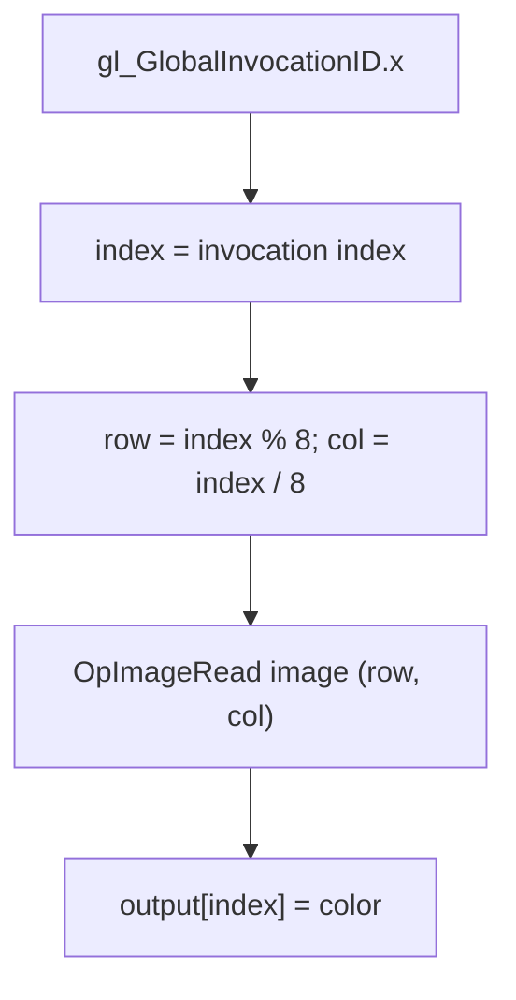

## Overview

**Core question:** Do SPIR-V image-read instructions return the expected texel or depth-comparison result when CTS supplies storage, sampled, and combined image-sampler descriptors through compute and graphics pipelines?

`ImageSamplerTests` implements the `image_sampler` test family under both `spirv_assembly.instruction.compute` and `spirv_assembly.instruction.graphics`. It emits SPIR-V assembly directly from C++ string templates and varies the instruction, descriptor representation, function-parameter route, declared image-depth property, and, for compute, SPIR-V version. The ordinary cases copy image data into an output storage buffer; Dref cases use a depth-comparison oracle, while `optypeimage_mismatch` only requires the pipeline to run without failure.
## Background Knowledge

- **SPIR-V image types and descriptors.** A shader uses `OpTypeImage` for image access. A storage image uses `Sampled=2`; sampled-image cases use `Sampled=1` with a separate sampler, a combined `OpTypeSampledImage`, or two combined descriptors whose image and sampler are selected from different bindings. Vulkan matches the shader's descriptor decorations and image properties to the bound image view ([image access rules](../../../../vulkan-docs/src/chapters/interfaces.adoc#L1239-L1278), [SPIR-V image access](../../../../vulkan-docs/src/chapters/images.adoc#L198-L222)).
- **Image read versus sampling.** `OpImageRead` reads a storage image with integer coordinates. `OpImageFetch` reads a sampled image at an integer texel coordinate. `OpImageSampleExplicitLod` and the Dref forms combine an image and sampler; the Dref forms also compare a reference value against a depth texel. This page focuses on how those instructions are assembled and bound, not on a GLSL/HLSL frontend.

## Registration Hierarchy

The source owns two concrete registration roots. The first-level children are direct `intermediate node` values below the `image_sampler` test family.

```text
spirv_assembly.instruction.compute.image_sampler
├── imageread
├── imagefetch
└── imagesample

spirv_assembly.instruction.graphics.image_sampler
├── imageread
├── imagefetch
├── imagesample
├── imagesample_dref_implicit_lod
└── imagesample_dref_explicit_lod
```

The remaining path components are generated under each intermediate node: descriptor type, test type (with a format leaf for `optypeimage_mismatch`), and `depth_property`. Graphics also appends a shader-stage suffix for the non-Dref stage cases.

## Parameter Dimensions and Observed Values

| Dimension | Registered values | Meaning in this test | Evidence |
|-----------|-------------------|----------------------|----------|
| Pipeline root | `compute`, `graphics` | Selects the compute dispatch builder or the graphics stage builder. | [`createImageSamplerComputeGroup()` and `createImageSamplerGraphicsGroup()`](../../../modules/vulkan/spirv_assembly/vktSpvAsmImageSamplerTests.cpp#L1337-L1353) |
| Image read operation | `imageread`, `imagefetch`, `imagesample`, `imagesample_dref_implicit_lod`, `imagesample_dref_explicit_lod` | Selects the SPIR-V image instruction. Compute registers the first three; graphics registers all five. | [`ReadOp` names and registration loops](../../../modules/vulkan/spirv_assembly/vktSpvAsmImageSamplerTests.cpp#L55-L64), [`addComputeImageSamplerTest()`](../../../modules/vulkan/spirv_assembly/vktSpvAsmImageSamplerTests.cpp#L812-L814), [`addGraphicsImageSamplerTest()`](../../../modules/vulkan/spirv_assembly/vktSpvAsmImageSamplerTests.cpp#L1204-L1206) |
| Descriptor representation | `storage_image`, `sampled_image`, `combined_image_sampler`, `combined_image_sampler_separate_variables`, `combined_image_sampler_separate_descriptors` | Changes the Vulkan descriptor type and the SPIR-V image/sampler declarations and bindings. | [`DescriptorType` and type generation](../../../modules/vulkan/spirv_assembly/vktSpvAsmImageSamplerTests.cpp#L67-L78), [`getImageSamplerTypeStr()`](../../../modules/vulkan/spirv_assembly/vktSpvAsmImageSamplerTests.cpp#L663-L727) |
| Function routing | `all_local_variables`, `pass_image_to_function`, `pass_sampler_to_function`, `pass_image_and_sampler_to_function`, `optypeimage_mismatch` | Changes whether opaque image/sampler values are loaded inside `read_func`, passed as parameters, or deliberately declared with a mismatched image format. | [`TestType` names and parameter helpers](../../../modules/vulkan/spirv_assembly/vktSpvAsmImageSamplerTests.cpp#L166-L189), [`getFunction*Str()`](../../../modules/vulkan/spirv_assembly/vktSpvAsmImageSamplerTests.cpp#L300-L600) |
| Image depth property | `non_depth`, `depth`, `unknown` | Supplies the third `OpTypeImage` operand (`0`, `1`, or `2`). Dref image format is `R32f`; other ordinary cases use `Rgba32f`. | [`getDepthPropertyName()` and image type generation](../../../modules/vulkan/spirv_assembly/vktSpvAsmImageSamplerTests.cpp#L241-L263), [`getImageSamplerTypeStr()`](../../../modules/vulkan/spirv_assembly/vktSpvAsmImageSamplerTests.cpp#L663-L669) |
| Mismatch format | 12 `optypeimageFormatMismatchSpirvData` entries | Pairs an actual `VkFormat` with an intentionally different SPIR-V image format. | [`optypeimageFormatMismatchSpirvData`](../../../modules/vulkan/spirv_assembly/vktSpvAsmImageSamplerTests.cpp#L610-L625) |
| Compute SPIR-V variant | SPIR-V 1.0 and SPIR-V 1.6 (`_nontemporal`) | SPIR-V 1.6 adds `Nontemporal`, changes `BufferBlock`/`Uniform` output encoding to `Block`/`StorageBuffer`, and supplies an entry-point interface list. | [`spirvDataVect` and SPIR-V 1.6 branch](../../../modules/vulkan/spirv_assembly/vktSpvAsmImageSamplerTests.cpp#L802-L810), [`useSpirV16`](../../../modules/vulkan/spirv_assembly/vktSpvAsmImageSamplerTests.cpp#L873-L889) |
| Graphics stage | `shader_vert`, `shader_tessc`, `shader_tesse`, `shader_geom`, `shader_frag` for non-Dref; `shader_frag` for Dref | Selects the graphics stage receiving the generated SPIR-V fragments. | [`createTestForStage()` calls](../../../modules/vulkan/spirv_assembly/vktSpvAsmImageSamplerTests.cpp#L1289-L1316) |

`isValidTestCase()` removes invalid products: `imageread` requires `storage_image`; the other read operations require sampled or combined forms; function-parameter routing excludes `combined_image_sampler`; and `optypeimage_mismatch` excludes Dref operations ([filter](../../../modules/vulkan/spirv_assembly/vktSpvAsmImageSamplerTests.cpp#L90-L163)).

## Behavior Parameters

The primary behavioral axis is the direct `intermediate node` under each concrete `image_sampler` root: it selects the SPIR-V instruction and therefore the image/sampler operation being checked. Descriptor and function-routing dimensions change how that instruction is reached, while depth and stage dimensions constrain the surrounding type and execution context.

### `imageread`: storage-image texel reads

`OpImageRead` reads the storage image at an integer `(row, col)` coordinate. It is registered under compute and graphics and is valid only with `storage_image`.

### `imagefetch`: sampled-image texel fetches

`OpImageFetch` reads an integer-coordinate texel from sampled or combined image-sampler forms. The generated code may load a sampled image directly, extract an image with `OpImage`, or form one with `OpSampledImage`.

### `imagesample`: explicit-LOD sampling

`OpImageSampleExplicitLod` samples a combined image and sampler using normalized coordinates and `Lod 0`. The compute SPIR-V 1.6 variant also adds the `Nontemporal` image operand.

### `imagesample_dref_implicit_lod`: implicit-LOD depth comparison

The graphics-only Dref form uses `OpImageSampleDrefImplicitLod` with reference value `0.5` and `Bias 0`. Only fragment-stage cases are registered, and the host checks the comparison result.

### `imagesample_dref_explicit_lod`: explicit-LOD depth comparison

The graphics-only Dref form uses `OpImageSampleDrefExplicitLod` with reference value `0.5` and `Lod 0`. It is also fragment-only and uses the same depth-comparison oracle.

## Shader Analysis

This family does not reconstruct GLSL or HLSL. The implementation authors SPIR-V assembly as C++ string fragments and combines shared declarations with operation- and descriptor-specific fragments. The compute `imageread` case below is the smallest representative path; its full extracted assembly is preserved under `#### Source Code`.

### Representative Shader Walkthrough 1: `spirv_assembly.instruction.compute.image_sampler.imageread.storage_image.all_local_variables.depth_property.non_depth`

#### Parameter Values Chosen

Representative path:

```text
spirv_assembly.instruction.compute.image_sampler.imageread.storage_image.all_local_variables.depth_property.non_depth
```

| Parameter choice | Meaning in this representative case |
|------------------|-------------------------------------|
| `compute` | Uses `SpvAsmComputeShaderCase` and a `64 x 1 x 1` dispatch. |
| `imageread` | Emits `OpImageRead`. |
| `storage_image` | Declares `OpTypeImage ... Sampled=2` and no sampler resource. |
| `all_local_variables` | Loads `%InputData` inside `read_func`. |
| `non_depth` | Uses `Depth=0` in `OpTypeImage`. |

#### Purpose

Check the simplest image-read path: each invocation reads one texel from the storage image and writes it to the matching output-buffer element.

#### Structural Design



#### Source Code

The following complete assembly is extracted by selecting `imageread`, `storage_image`, `all_local_variables`, `non_depth`, and SPIR-V 1.0 in [`addComputeImageSamplerTest()`](../../../modules/vulkan/spirv_assembly/vktSpvAsmImageSamplerTests.cpp#L788-L1028). It is the exact concatenated string-template result for that selection.

```llvm
                       OpCapability Shader
                  %1 = OpExtInstImport "GLSL.std.450"
                       OpMemoryModel Logical GLSL450
                       OpEntryPoint GLCompute %main "main" %id
                       OpExecutionMode %main LocalSize 1 1 1
                       OpSource GLSL 430
                       OpDecorate %id BuiltIn GlobalInvocationId
                       OpDecorate %_arr_v4type_u32_64 ArrayStride 16
                       OpMemberDecorate %Output 0 Offset 0
                       OpDecorate %Output BufferBlock
                       OpDecorate %InputData DescriptorSet 0
                       OpDecorate %InputData Binding 0
                       OpDecorate %OutputData DescriptorSet 0
                       OpDecorate %OutputData Binding 1
               %void = OpTypeVoid
                  %3 = OpTypeFunction %void
                %u32 = OpTypeInt 32 0
                %i32 = OpTypeInt 32 1
                %f32 = OpTypeFloat 32
 %_ptr_Function_uint = OpTypePointer Function %u32
              %v3u32 = OpTypeVector %u32 3
   %_ptr_Input_v3u32 = OpTypePointer Input %v3u32
                 %id = OpVariable %_ptr_Input_v3u32 Input
            %c_f32_0 = OpConstant %f32 0.0
            %c_u32_0 = OpConstant %u32 0
            %c_i32_0 = OpConstant %i32 0
    %_ptr_Input_uint = OpTypePointer Input %u32
              %v2u32 = OpTypeVector %u32 2
              %v2f32 = OpTypeVector %f32 2
              %v4f32 = OpTypeVector %f32 4
              %v4u32 = OpTypeVector %u32 4
              %v4i32 = OpTypeVector %i32 4
           %uint_128 = OpConstant %u32 128
           %c_u32_64 = OpConstant %u32 64
            %c_u32_8 = OpConstant %u32 8
            %c_f32_8 = OpConstant %f32 8.0
        %c_v2f32_8_8 = OpConstantComposite %v2f32 %c_f32_8 %c_f32_8
 %_arr_v4type_u32_64 = OpTypeArray %v4f32 %c_u32_64
%_ptr_Uniform_v4type = OpTypePointer Uniform %v4f32
             %Output = OpTypeStruct %_arr_v4type_u32_64
%_ptr_Uniform_Output = OpTypePointer Uniform %Output
         %OutputData = OpVariable %_ptr_Uniform_Output Uniform
              %Image = OpTypeImage %f32 2D 0 0 0 2 Rgba32f
           %ImagePtr = OpTypePointer UniformConstant %Image
          %InputData = OpVariable %ImagePtr UniformConstant
     %read_func_type = OpTypeFunction %void %u32
          %read_func = OpFunction %void None %read_func_type
           %func_ndx = OpFunctionParameter %u32
          %funcentry = OpLabel
                %row = OpUMod %u32 %func_ndx %c_u32_8
                %col = OpUDiv %u32 %func_ndx %c_u32_8
              %coord = OpCompositeConstruct %v2u32 %row %col
             %coordf = OpConvertUToF %v2f32 %coord
       %normalcoordf = OpFDiv %v2f32 %coordf %c_v2f32_8_8
           %func_img = OpLoad %Image %InputData
              %color = OpImageRead %v4f32 %func_img %coord
                 %36 = OpAccessChain %_ptr_Uniform_v4type %OutputData %c_u32_0 %func_ndx
                       OpStore %36 %color
                       OpReturn
                       OpFunctionEnd
               %main = OpFunction %void None %3
                  %5 = OpLabel
                  %i = OpVariable %_ptr_Function_uint Function
                 %14 = OpAccessChain %_ptr_Input_uint %id %c_u32_0
                 %15 = OpLoad %u32 %14
                       OpStore %i %15
              %index = OpLoad %u32 %14
                %res = OpFunctionCall %void %read_func %index
                       OpReturn
                       OpFunctionEnd
```

The source-extracted assembly passed the temporary round-trip gate: `spirv-as --target-env spv1.0`, `spirv-val --target-env spv1.0`, and `spirv-dis` completed successfully; the generated disassembly reports `Version: 1.0`. The page publishes the source-template assembly once, as required for `spirv_assembly` pages.

#### Additional Info

- `imagefetch` adds a sampled-image route and may use `OpImage`; sampling operations create a `OpSampledImage` value from an image and sampler.
- Graphics uses signed coordinates and a loop that writes 64 elements from each selected shader stage. Dref cases use a one-component depth input and skip vertex, tessellation, and geometry stages.
- The compute SPIR-V 1.6 variant changes the output decoration/storage class and appends `Nontemporal` to the non-Dref image instruction.

#### Parameter Variation Summary

| Parameter dimension | Shader-level variation from this shader | Evidence |
|---------------------|---------------------------------------|----------|
| Read operation | Replaces `OpImageRead` with `OpImageFetch`, `OpImageSampleExplicitLod`, or one of the Dref sample instructions. | [`getImageReadOpStr()`](../../../modules/vulkan/spirv_assembly/vktSpvAsmImageSamplerTests.cpp#L630-L652) |
| Descriptor representation | Adds `%SamplerData`, `%SampledImage`, `%InputData2`, and/or `%SamplerData2`, with decorations at bindings 0 and 1. | [`getImageSamplerTypeStr()` and `getSamplerDecoration()`](../../../modules/vulkan/spirv_assembly/vktSpvAsmImageSamplerTests.cpp#L663-L779) |
| Function routing | Moves image and sampler loads between `read_func` and `main`, and changes function parameter types. | [`getFunctionSrcVariableStr()` and `getFunctionDstVariableStr()`](../../../modules/vulkan/spirv_assembly/vktSpvAsmImageSamplerTests.cpp#L300-L465) |
| Depth property | Changes the third `OpTypeImage` operand among `0`, `1`, and `2`. | [`DepthProperty` handling](../../../modules/vulkan/spirv_assembly/vktSpvAsmImageSamplerTests.cpp#L241-L263) |
| SPIR-V version | SPIR-V 1.6 selects `StorageBuffer`/`Block`, an interface list, and `Nontemporal`; SPIR-V 1.0 keeps `Uniform`/`BufferBlock`. | [`addComputeImageSamplerTest()`](../../../modules/vulkan/spirv_assembly/vktSpvAsmImageSamplerTests.cpp#L873-L889) |

## Runtime Execution and Result Checking

### Compute path

1. `addComputeImageSamplerTest()` creates 64 random `Vec4` input values and sets `numWorkGroups` to `64 x 1 x 1`.
2. It binds the image and any sampler or second combined descriptor, builds the assembly, and creates one output buffer whose expected contents are the selected input data.
3. `SpvAsmComputeShaderCase` creates the shader module and pipeline, binds descriptor set 0, dispatches, inserts a shader-write to host-read barrier, waits for submission, invalidates output memory, and invokes the selected verifier ([dispatch and result check](../../../modules/vulkan/spirv_assembly/vktSpvAsmComputeShaderCase.cpp#L897-L970)).

### Graphics path

The graphics builder creates the same input/output resource model and passes `pre_main`, `decoration`, and `testfun` fragments to `createTestForStage()`. Non-Dref operations are registered for vertex, tessellation control, tessellation evaluation, geometry, and fragment stages. Dref operations are registered only for fragment. The graphics utility draws, reads the output storage buffer, and applies either the default comparison or the custom verifier ([stage registration](../../../modules/vulkan/spirv_assembly/vktSpvAsmImageSamplerTests.cpp#L1289-L1316), [graphics result verifier](../../../modules/vulkan/spirv_assembly/vktSpvAsmGraphicsShaderTestUtil.cpp#L4700-L4740)).

## Failure Meaning

### Failure Cause Mapping

| If this behavior parameter value fails | Possible failure cause(s) |
|----------------------------------------|---------------------------|
| `imageread` (compute or graphics) | `OpImageRead` against a storage image returns wrong texel data; storage-image descriptor binding or `OpTypeImage` (sampled=2) mishandled; `coord` computation wrong; host input image fill or expected buffer wrong; byte-equality mismatch on a single element |
| `imagefetch` (compute or graphics) | `OpImageFetch` against a sampled image returns wrong texel data; `OpImage` extraction from a combined image sampler wrong; separate-variable or separate-descriptor sampler routing wrong; `pass_sampler_to_function` / `pass_image_to_function` function-parameter passing wrong |
| `imagesample` (compute or graphics) | `OpImageSampleExplicitLod` with `Lod 0.0` returns wrong texel data; `OpSampledImage` recombination wrong; sampler state wrong; `coordf`/`normalcoordf` coordinate normalization wrong; SPIR-V 1.6 `Nontemporal` operand mishandled (compute `_nontemporal` variant) |
| `imagesample_dref_implicit_lod` (graphics, fragment only) | `OpImageSampleDrefImplicitLod` returns wrong depth-comparison result; depth image (`VK_FORMAT_D32_SFLOAT`) layout or `OpTypeImage ... Depth=1` declaration wrong; `Bias 0.0` or `Dref 0.5` operand mishandled; `verifyDepthCompareResult` host check wrong; non-fragment stage registered for Dref (would be a CTS bug, not a driver bug) |
| `imagesample_dref_explicit_lod` (graphics, fragment only) | `OpImageSampleDrefExplicitLod` returns wrong depth-comparison result; `Lod 0.0` operand mishandled; otherwise same class as the implicit-LOD variant |

A cross-cutting cause shared by every readOp: the `optypeimage_mismatch` subtree of each readOp deliberately declares an `OpTypeImage` format that disagrees with the bound `VkFormat`. A failure there means the implementation crashed or refused pipeline creation; output bytes are ignored. This is the only branch where a value mismatch is not a failure.

### Cause Analysis

#### Image read and fetch operations

**Possible failure symptoms:** The default verifier finds a byte mismatch between the output buffer and the expected input data, or shader module/pipeline creation fails.

**Possible implementation causes:** The failing case identifies the relevant SPIR-V image instruction and descriptor encoding, but not a unique implementation layer. Possible causes include incorrect image coordinates, incompatible `OpTypeImage` properties, descriptor decoration/binding resolution, or incorrect lowering of `OpImageRead`, `OpImageFetch`, or `OpImage`. Source-level investigation is needed to localize a failure further.

#### Sampling and opaque-parameter routing

**Possible failure symptoms:** A sampled-image case fails pipeline creation, fails during execution, or returns output bytes different from the expected texel data.

**Possible implementation causes:** The image and sampler may be combined incorrectly with `OpSampledImage`; `OpImage` extraction may be mishandled; or an image/sampler passed through `OpFunctionParameter` may not preserve the required opaque type. Descriptor binding differences between separate variables and separate descriptors are part of the tested behavior.

#### Dref comparison operations

**Possible failure symptoms:** A fragment case's output fails `verifyDepthCompareResult`, which expects `0.0` for input values below `0.5` and `1.0` otherwise under `VK_COMPARE_OP_LESS`.

**Possible implementation causes:** The implicit- or explicit-LOD Dref instruction, depth image declaration, normalized coordinate, reference operand, or comparison result handling may be wrong. The source verifier checks the returned values but cannot distinguish a shader instruction error from an image setup or pipeline error without further investigation.

#### Deliberate `OpTypeImage` format mismatch

**Possible failure symptoms:** A mismatch-format case fails shader module or pipeline creation, crashes, or otherwise fails to complete. Its output bytes are not used to decide the result.

**Possible implementation causes:** The case deliberately pairs a real `VkFormat` with a different SPIR-V image format and installs `nopVerifyFunction`, which always returns `true`. A failure therefore points to acceptance, validation, or execution handling of incompatible image-type properties; the exact failing layer requires source-level investigation.

## Case Pruning

- `isValidTestCase()` removes descriptor/read-operation combinations that do not match the SPIR-V image model or the generated variable routes ([filter](../../../modules/vulkan/spirv_assembly/vktSpvAsmImageSamplerTests.cpp#L90-L163)).
- Compute stops at `imagesample`; Dref operations are graphics-only.
- Graphics Dref cases skip vertex, tessellation, and geometry stages and emit fragment cases only.
- `optypeimage_mismatch` does not register Dref operations and expands to the 12 format pairs in `optypeimageFormatMismatchSpirvData`.
- Graphics vertex, tessellation, and geometry cases require `vertexPipelineStoresAndAtomics`; every graphics fragment case, including Dref, requires `fragmentStoresAndAtomics` ([feature setup](../../../modules/vulkan/spirv_assembly/vktSpvAsmImageSamplerTests.cpp#L1289-L1316)).

## Key Takeaways

- The `image_sampler` test family isolates five SPIR-V image-read forms while varying descriptor representation and opaque image/sampler parameter routing.
- The compute and graphics builders share the generated image/sampler assembly model, but use different host execution paths and stage coverage.
- Ordinary cases compare image data; Dref cases compare `VK_COMPARE_OP_LESS`; mismatch cases check completion rather than output bytes.
- The source registers 2,934 mustpass leaves in the default and Vulkan SC lists: 816 compute and 2,118 graphics entries.

## Source Reference Appendix

| Entry point | Link | Why it matters |
|-------------|------|----------------|
| `isValidTestCase()` | [`vktSpvAsmImageSamplerTests.cpp#L90-L163`](../../../modules/vulkan/spirv_assembly/vktSpvAsmImageSamplerTests.cpp#L90-L163) | Defines valid descriptor, instruction, function-routing, and Dref combinations. |
| `getImageReadOpStr()` | [`vktSpvAsmImageSamplerTests.cpp#L630-L652`](../../../modules/vulkan/spirv_assembly/vktSpvAsmImageSamplerTests.cpp#L630-L652) | Emits the five image-read instruction forms and the compute `Nontemporal` operand. |
| `getImageSamplerTypeStr()` | [`vktSpvAsmImageSamplerTests.cpp#L663-L727`](../../../modules/vulkan/spirv_assembly/vktSpvAsmImageSamplerTests.cpp#L663-L727) | Builds `OpTypeImage`, sampler, combined-image, and descriptor-variable declarations. |
| `addComputeImageSamplerTest()` | [`vktSpvAsmImageSamplerTests.cpp#L788-L1028`](../../../modules/vulkan/spirv_assembly/vktSpvAsmImageSamplerTests.cpp#L788-L1028) | Generates compute assembly, resources, SPIR-V versions, and custom verification. |
| `generateGraphicsImageSamplerSource()` | [`vktSpvAsmImageSamplerTests.cpp#L1030-L1152`](../../../modules/vulkan/spirv_assembly/vktSpvAsmImageSamplerTests.cpp#L1030-L1152) | Produces graphics assembly fragments and coordinate/output logic. |
| `verifyDepthCompareResult()` | [`vktSpvAsmImageSamplerTests.cpp#L1154-L1181`](../../../modules/vulkan/spirv_assembly/vktSpvAsmImageSamplerTests.cpp#L1154-L1181) | Implements the Dref result oracle. |
| `addGraphicsImageSamplerTest()` | [`vktSpvAsmImageSamplerTests.cpp#L1183-L1334`](../../../modules/vulkan/spirv_assembly/vktSpvAsmImageSamplerTests.cpp#L1183-L1334) | Registers graphics stages, features, resources, and read operations. |
| Default mustpass entries | [`spirv-assembly.txt#L6516-L37210`](../../../mustpass/main/vk-default/spirv-assembly.txt#L6516-L37210) | Contains 2,934 `image_sampler` leaves: 816 compute and 2,118 graphics. |
| Vulkan SC mustpass entries | [`spirv-assembly.txt#L4090-L19147`](../../../mustpass/main/vksc-default/spirv-assembly.txt#L4090-L19147) | Mirrors the same 2,934-leaf image-sampler registration inventory. |
| SPIR-V image access rules | [Vulkan image interfaces](../../../../vulkan-docs/src/chapters/interfaces.adoc#L1239-L1278) | Grounds image-type and descriptor compatibility claims. |
| SPIR-V image read semantics | [Vulkan SPIR-V image access](../../../../vulkan-docs/src/chapters/images.adoc#L198-L222) | Grounds `OpImageRead` coordinate and read claims. |
