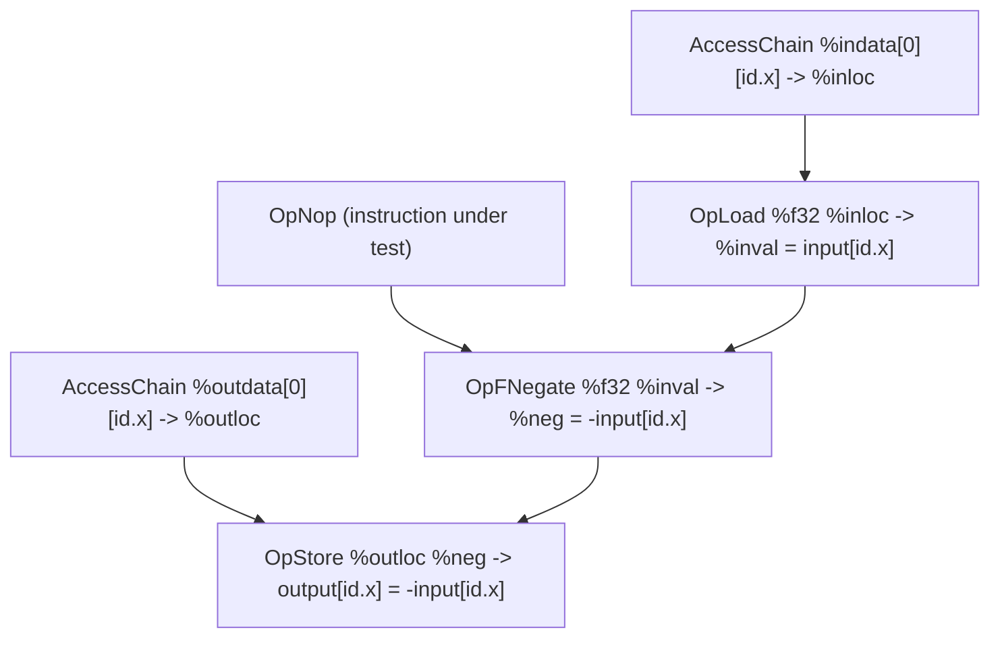

## Overview

**Core question:** Does the implementation correctly execute a broad catalog of SPIR-V instructions, authored directly as assembly text, under compute and graphics pipelines, with larger feature areas delegated to per-feature test families?

- Source file: [`vktSpvAsmInstructionTests.cpp`](../../../modules/vulkan/spirv_assembly/vktSpvAsmInstructionTests.cpp), the single largest source file in the `spirv_assembly` category. It is a hybrid implementation-plus-registration file: it defines ~50 inline instruction-test groups per pipeline variant and registers six direct single-purpose child families, four of which are implemented in separate source files.
- Test category: `spirv_assembly`. Test family (page scope): `instruction`, an aggregator with two pipeline-variant children (`compute`, `graphics`) and six single-purpose direct children (`amd_trinary_minmax`, `function_params`, `image_query`, `maint9_vectorization`, `spirv1p4`, `terminate_invocation`).
- Core test idea: each inline group authors a SPIR-V module as concatenated C++ string fragments, binds host-supplied input/output storage buffers, dispatches or draws, and compares the device-written output against a host-supplied expected buffer byte-for-byte (or via a custom callback). The `SpvAsmComputeShaderCase` harness fixes the descriptor layout and dispatch shape so per-test variation concentrates in the instruction(s) under test.
- What to expect from the page: the registration tree and the compute/graphics split; the shared inline-compute pattern via one representative walkthrough (`compute.opnop.all`); the `OpSRem`/`OpSMod` `failResult` variants that drive the `android` and `maintenance8` pruning story; and pointers to the delegated per-family pages for feature-specific detail.

## Background Knowledge

- SPIR-V assembly authored in C++ string templates. Unlike GLSL/HLSL-driven categories, the `spirv_assembly` category builds shader modules from SPIR-V assembly text concatenated from C++ string fragments at test construction time. The shader text is the source of truth; there is no GLSL frontend in the loop for the inline groups. Shared preamble helpers (`getComputeAsmShaderPreamble`, `getComputeAsmCommonTypes`, `getComputeAsmInputOutputBuffer`, `getComputeAsmInputOutputBufferTraits` in [`vktSpvAsmComputeShaderTestUtil.cpp`](../../../modules/vulkan/spirv_assembly/vktSpvAsmComputeShaderTestUtil.cpp#L65-L133)) fix the descriptor layout (binding 0 = input SSBO, binding 1 = output SSBO) and the `LocalSize 1 1 1` execution mode, so per-test variation lives in the body that names the instruction(s) under test.
- `SpvAsmComputeShaderCase` harness. The inline compute groups are wrapped in [`SpvAsmComputeShaderCase`](../../../modules/vulkan/spirv_assembly/vktSpvAsmComputeShaderCase.cpp#L940-L999), which binds host-supplied input/output buffers as storage descriptors, dispatches `numWorkGroups` invocations, and compares the output buffer byte-for-byte against an expected buffer the test supplies. Two overrides matter for this page: `verifyIO` replaces the default byte comparison with custom logic (NaN-aware float64 comparison, epsilon comparison, `deMemCmp`, etc.); `failResult` / `failMessage` control the status code returned on mismatch (default `QP_TEST_RESULT_FAIL`, overridden to `QP_TEST_RESULT_PASS`, `QP_TEST_RESULT_QUALITY_WARNING`, or `QP_TEST_RESULT_FAIL` for the `OpSRem`/`OpSMod` variants; see `## Behavior Parameters`).
- Legacy `Uniform` storage class with `BufferBlock` decoration. The shared compute helpers default to the legacy SPIR-V 1.0 storage-buffer encoding: variables in the `Uniform` storage class with the `BufferBlock` decoration, rather than the SPIR-V 1.3 `StorageBuffer` storage class. Both encodings map to a Vulkan `VK_DESCRIPTOR_TYPE_STORAGE_BUFFER`; the difference is purely textual in the assembly. A reader who greps the published assembly for `OpVariable ... StorageBuffer` will not find it in the default-helpers groups; this is conventional for SPIR-V 1.0 assembly and is not a defect. A few groups (`opatomic_storage_buffer`, `opatomic_storage_buffer_volatile`) opt into the modern `StorageBuffer` storage class explicitly.

## Registration Hierarchy

```text
spirv_assembly.instruction
├── compute
├── graphics
├── amd_trinary_minmax
├── function_params (non-VulkanSC only)
├── image_query (non-VulkanSC only)
├── maint9_vectorization
├── spirv1p4 (non-VulkanSC only)
└── terminate_invocation (non-VulkanSC only)
```

`compute` and `graphics` are themselves aggregators of ~50 inline groups plus separate-source subfamilies. Of the other six direct children, four are implemented in separate source files; `function_params` and `image_query` are Amber wrappers defined here. The aggregator root is built by [`createInstructionTests`](../../../modules/vulkan/spirv_assembly/vktSpvAsmInstructionTests.cpp#L21311-L21547), which assembles the [`computeTests`](../../../modules/vulkan/spirv_assembly/vktSpvAsmInstructionTests.cpp#L21316-L21449) and [`graphicsTests`](../../../modules/vulkan/spirv_assembly/vktSpvAsmInstructionTests.cpp#L21451-L21533) subtrees and then adds the six direct children.

The `(non-VulkanSC only)` marker means the family's test case leaves are registered only when `CTS_USES_VULKANSC` is not defined; on VulkanSC builds the family is either not registered at all (`spirv1p4`, `function_params`) or registered as an empty group (`image_query`, `terminate_invocation`).

## Parameter Dimensions and Observed Values

| Dimension | Registered values | Meaning in this test | Evidence |
|-----------|-------------------|----------------------|----------|
| Pipeline variant | `compute`, `graphics` | Selects the shader infrastructure: `SpvAsmComputeShaderCase` dispatch for `compute`; graphics shader utilities (vertex/fragment, plus geometry/tessellation for some groups) for `graphics`. Many inline groups exist under both variants with similar logic but different shader infrastructure. | [`computeTests`](../../../modules/vulkan/spirv_assembly/vktSpvAsmInstructionTests.cpp#L21316-L21449), [`graphicsTests`](../../../modules/vulkan/spirv_assembly/vktSpvAsmInstructionTests.cpp#L21451-L21533) |
| SPIR-V version | 1.0 (default), 1.3 (`opmoduleprocessed`, `opatomic_storage_buffer_volatile`), 1.4 (`spirv1p4`), 1.5 (`localsize_id`) | Selects version-specific features or capabilities. The default helpers target SPIR-V 1.0; a few groups opt into a higher version. | [`createSpivVersionCheckTests`](../../../modules/vulkan/spirv_assembly/vktSpvAsmInstructionTests.cpp#L21319), [`createSpirvVersion1p4Group`](../../../modules/vulkan/spirv_assembly/vktSpvAsmInstructionTests.cpp#L21538) |
| Integer width | 8-bit, 16-bit, 32-bit, 64-bit | Iterates conversion (`sconvert`/`uconvert`/`fconvert`/...), `mul_extended`, `opsrem64`/`opsmod64`, and `opundef` type coverage. Width implies a feature gate (`shaderInt8`/`shaderInt16`/`shaderInt64`). | [`createConvertComputeTests`](../../../modules/vulkan/spirv_assembly/vktSpvAsmInstructionTests.cpp#L21370-L21376), [`createOpSRemComputeGroup64`](../../../modules/vulkan/spirv_assembly/vktSpvAsmInstructionTests.cpp#L21358) |
| Float width | 16-bit, 32-bit, 64-bit | Iterates `float16`, `float32`, and NaN-aware `workgroup_memory` float64 verification. Width implies `shaderFloat16`/`shaderFloat64`. | [`createFloat16Group`](../../../modules/vulkan/spirv_assembly/vktSpvAsmInstructionTests.cpp#L21410), [`createFloat32Group`](../../../modules/vulkan/spirv_assembly/vktSpvAsmInstructionTests.cpp#L21412) |
| `failResult` override | `PASS`, `QUALITY_WARNING`, `FAIL` | Controls the status code returned when output verification fails. Only `OpSRem`/`OpSMod` use non-default values; the same instruction is registered three times under different groups to encode the SPIR-V "undefined for negative operands" rule and its `VK_KHR_maintenance8` override. | [`createOpSRemComputeGroup`](../../../modules/vulkan/spirv_assembly/vktSpvAsmInstructionTests.cpp#L2526-L2626), `android`/`maintenance8` sub-groups |

### Inline group inventory

These inline groups are defined directly in [`vktSpvAsmInstructionTests.cpp`](../../../modules/vulkan/spirv_assembly/vktSpvAsmInstructionTests.cpp). Groups that appear under both `compute` and `graphics` are listed once with the variant(s) in parentheses.

| Group | Inline under | Property exercised |
|-------|--------------|---------------------|
| `spirv_version` | compute, graphics | SPIR-V version-support checks per pipeline |
| `localsize` / `localsize_id` | compute | `LocalSize` and `LocalSizeId` (SPIR-V 1.5) execution modes |
| `opnop` | compute, graphics | `OpNop` in a function body |
| `opfunord` / `opfunord_nan` | compute | `OpFUnord*` comparisons, with and without NaN operands |
| `opatomic` / `opatomic_storage_buffer` / `opatomic_return_values` / `opatomic_storage_buffer_volatile` | compute | Atomic ops with `Uniform`/`StorageBuffer` decoration, return-value validation, volatile atomics |
| `opline` / `opnoline` / `opmoduleprocessed` | compute, graphics | `OpLine`/`OpNoLine`/`OpModuleProcessed` debug instructions |
| `opconstantnull` / `opconstantcomposite` / `opconstantnullcomposite` | compute, graphics | `OpConstantNull`/`OpConstantComposite` across scalar/vector/matrix/array/struct types |
| `opspecconstantop` | compute, graphics | `OpSpecConstantOp` with arithmetic, shift, bitwise, comparison, logical, composite operations |
| `opsource` / `opsourceextension` / `opsourcecontinued` | compute, graphics | `OpSource`/`OpSourceContinued`/`OpSourceExtension` |
| `decoration_group` | compute, graphics | `OpDecorationGroup`/`OpGroupDecorate`/`OpGroupMemberDecorate` |
| `opphi` | compute, graphics | `OpPhi` with switch, induction, swap, wide, nested patterns |
| `loop_control` / `function_control` / `selection_control` | compute | `OpLoopMerge`/`OpFunction`/`OpSelectionMerge` control hints |
| `block_order` / `selection_block_order` / `switch_block_order` | compute, graphics | Basic block ordering |
| `multiple_shaders` | compute | Multiple entry points in a single SPIR-V module |
| `memory_access` / `opmemoryaccess` | compute, graphics | `Volatile`/`Aligned`/`Nontemporal` qualifiers on load/store/copy |
| `opcopymemory` / `opcopyobject` | compute | `OpCopyMemory`/`OpCopyObject` across composite types |
| `nocontraction` | compute, graphics | `NoContraction` decoration preventing fused multiply-add |
| `opundef` | compute, graphics | `OpUndef` across bool/scalars/vectors/matrices/images/samplers/pointers/arrays/structs |
| `opunreachable` | compute | `OpUnreachable` in unreachable code paths |
| `opquantize` / `opquantize_vec4` | compute, graphics | `OpQuantizeToF16` scalar and vec4 forms |
| `opfrem` / `frem` | compute, graphics | `OpFRem` (sign follows dividend) |
| `opsrem` / `opsrem64` / `srem` | compute, graphics | `OpSRem` 32-bit and 64-bit (sign follows dividend; undefined for negative operands) |
| `opsmod` / `opsmod64` / `smod` | compute, graphics | `OpSMod` 32-bit and 64-bit (sign follows divisor; undefined for negative operands) |
| `sconvert`/`uconvert`/`fconvert`/`convertstof`/`convertftos`/`convertutof`/`convertftou` | compute, graphics | Type conversion instructions |
| `opcompositeinsert` | compute | `OpCompositeInsert` across vectors/matrices/structs |
| `opinboundsaccesschain` | compute | `OpInBoundsAccessChain` with struct member access |
| `shader_default_output` | compute | Default output values (initialized/uninitialized) |
| `opnmin` / `opnmax` / `opnclamp` | compute | GLSL.std.450 `NMin`/`NMax`/`NClamp` with NaN handling |
| `float16` / `float32` | compute, graphics | Float16/Float32 operations |
| `bool` | compute | Boolean type with mixed bit sizes |
| `spirv_ids_abuse` | compute, graphics | Sparse and large SPIR-V ID allocation |
| `unused_variables` | compute, graphics | Unused variables and functions |
| `opname` / `opname_abuse` / `opmembername` / `opmembername_abuse` | compute, graphics | `OpName`/`OpMemberName` debug instructions, including abuse cases |
| `mul_extended` | compute | `OpSMulExtended`/`OpUMulExtended` with 8/16/32/64-bit widths |
| `android` | compute, graphics | `OpSRem`/`OpSMod` with `QUALITY_WARNING` severity for negative operands |
| `maintenance8` | compute, graphics | `OpSRem`/`OpSMod` with `VK_KHR_maintenance8` (negative operands are errors) |
| `module` | graphics | Combined SPIR-V modules across multiple shader stages |
| `loop` | graphics | Loop constructs (single_block, multi_block, nested) |
| `barrier` | graphics | `OpControlBarrier`/`OpMemoryBarrier` in tessellation control shaders |
| `early_fragment` / `early_and_late_fragment` / `execution_mode` | graphics | `EarlyFragmentTests`, `VK_AMD_shader_early_and_late_fragment_tests`, depth execution modes |
| `mixed_relaxed_precision_operands` | graphics | `OpSelect` with mixed `RelaxedPrecision` operands |

### Delegated subfamilies

These subfamilies are implemented in separate source files. They are registered under `compute` or `graphics` unless the `Registered under` column says `instruction`. They carry `(registration only)` markers because their mechanics belong on their own pages.

| Delegated subfamily | Registered under | Implementation page |
|---------------------|------------------|---------------------|
| `8bit_storage` | compute, graphics | [`vktSpvAsm8bitStorageTests.md`](vktSpvAsm8bitStorageTests.md) |
| `16bit_storage` | compute, graphics | [`vktSpvAsm16bitStorageTests.md`](vktSpvAsm16bitStorageTests.md) |
| `64bit_compare` | compute, graphics | [`vktSpvAsm64bitCompareTests.md`](vktSpvAsm64bitCompareTests.md) |
| `float_controls` / `float_controls2` / `float_controls_extensionless` | compute, graphics | [`vktSpvAsmFloatControlsTests.md`](vktSpvAsmFloatControlsTests.md), [`vktSpvAsmFloatControls2Tests.md`](vktSpvAsmFloatControls2Tests.md), [`vktSpvAsmFloatControlsExtensionlessTests.md`](vktSpvAsmFloatControlsExtensionlessTests.md) |
| `ubo_padding` | compute, graphics | [`vktSpvAsmUboMatrixPaddingTests.md`](vktSpvAsmUboMatrixPaddingTests.md) |
| `composite_insert` | compute, graphics | [`vktSpvAsmCompositeInsertTests.md`](vktSpvAsmCompositeInsertTests.md) |
| `variable_init` | compute, graphics | [`vktSpvAsmVariableInitTests.md`](vktSpvAsmVariableInitTests.md) |
| `conditional_branch` | compute, graphics | [`vktSpvAsmConditionalBranchTests.md`](vktSpvAsmConditionalBranchTests.md) |
| `indexing` | compute, graphics | [`vktSpvAsmIndexingTests.md`](vktSpvAsmIndexingTests.md) |
| `variable_pointers` / `physical_pointers` | compute | [`vktSpvAsmVariablePointersTests.md`](vktSpvAsmVariablePointersTests.md) |
| `image_sampler` | compute, graphics | [`vktSpvAsmImageSamplerTests.md`](vktSpvAsmImageSamplerTests.md) |
| `pointer_parameter` | compute, graphics | [`vktSpvAsmPointerParameterTests.md`](vktSpvAsmPointerParameterTests.md) |
| `workgroup_memory` | compute | [`vktSpvAsmWorkgroupMemoryTests.md`](vktSpvAsmWorkgroupMemoryTests.md) |
| `signed_int_compare` | compute | [`vktSpvAsmSignedIntCompareTests.md`](vktSpvAsmSignedIntCompareTests.md) |
| `signed_op` | compute | [`vktSpvAsmSignedOpTests.md`](vktSpvAsmSignedOpTests.md) |
| `ptr_access_chain` | compute | [`vktSpvAsmPtrAccessChainTests.md`](vktSpvAsmPtrAccessChainTests.md) |
| `vector_shuffle` | compute | [`vktSpvAsmVectorShuffleTests.md`](vktSpvAsmVectorShuffleTests.md) |
| `hlsl_cases` | compute | [`vktSpvAsmFromHlslTests.md`](vktSpvAsmFromHlslTests.md) |
| `empty_struct` | compute | [`vktSpvAsmEmptyStructTests.md`](vktSpvAsmEmptyStructTests.md) |
| `physical_storage_buffer` | compute | [`vktSpvAsmPhysicalStorageBufferPointerTests.md`](vktSpvAsmPhysicalStorageBufferPointerTests.md) |
| `raw_access_chain` | compute | [`vktSpvAsmRawAccessChainTests.md`](vktSpvAsmRawAccessChainTests.md) |
| `untyped_pointers` | compute | [`vktSpvAsmUntypedPointersTests.md`](vktSpvAsmUntypedPointersTests.md) |
| `compute_shader_derivatives` | compute | [`vktSpvAsmComputeShaderDerivativesTests.md`](vktSpvAsmComputeShaderDerivativesTests.md) |
| `non_semantic_info` | compute | [`vktSpvAsmNonSemanticInfoTests.md`](vktSpvAsmNonSemanticInfoTests.md) |
| `relaxed_with_forward_reference` | compute | [`vktSpvAsmRelaxedWithForwardReferenceTests.md`](vktSpvAsmRelaxedWithForwardReferenceTests.md) |
| `multiple_shaders_extended` | compute | [`vktSpvAsmMultipleShadersTests.md`](vktSpvAsmMultipleShadersTests.md) |
| `opfma` | compute | [`vktSpvAsmFmaTests.md`](vktSpvAsmFmaTests.md) |
| `opsdotkhr`..`opsudotaccsatkhr` | compute | [`vktSpvAsmIntegerDotProductTests.md`](vktSpvAsmIntegerDotProductTests.md) |
| `ldexp` | compute | [`vktSpvAsmLdexpTests.md`](vktSpvAsmLdexpTests.md) |
| `cross_stage` | graphics | [`vktSpvAsmCrossStageInterfaceTests.md`](vktSpvAsmCrossStageInterfaceTests.md) |
| `varying_name` | graphics | [`vktSpvAsmVaryingNameTests.md`](vktSpvAsmVaryingNameTests.md) |
| `amd_trinary_minmax` | instruction | [`vktSpvAsmTrinaryMinMaxTests.md`](vktSpvAsmTrinaryMinMaxTests.md) |
| `maint9_vectorization` | instruction | [`vktSpvAsmMaint9VectorizationTests.md`](vktSpvAsmMaint9VectorizationTests.md) |
| `spirv1p4` | instruction | [`vktSpvAsmSpirvVersion1p4Tests.md`](vktSpvAsmSpirvVersion1p4Tests.md) |
| `terminate_invocation` | instruction | [`vktSpvAsmTerminateInvocationTests.md`](vktSpvAsmTerminateInvocationTests.md) |

## Behavior Parameters

The primary behavioral axis is the test family: the direct children of `spirv_assembly.instruction`. `compute` and `graphics` are pipeline-variant aggregators of inline groups plus separate-source subfamilies; the other six are single-purpose direct families, with `function_params` and `image_query` wrapped in this registration file and the remaining four implemented separately.

### `compute`: inline compute-pipeline instruction tests

Container for instruction tests that run as compute dispatches through `SpvAsmComputeShaderCase`. Each inline group authors a SPIR-V module from the shared preamble helpers plus a per-test body, binds one or two input SSBOs and one output SSBO, dispatches `numWorkGroups` invocations (typically `numElements×1×1`), and compares the output SSBO byte-for-byte against a host-supplied expected buffer. The representative walkthrough below (`compute.opnop.all`) shows the canonical inline-compute pattern; the inline group inventory above lists the full set. The `OpSRem`/`OpSMod` groups add a `failResult` override that encodes the SPIR-V "undefined for negative operands" rule and its `VK_KHR_maintenance8` override (see `### maintenance8` below).

### `graphics`: inline graphics-pipeline instruction tests

Container for instruction tests that render through graphics shader utilities (vertex/fragment, plus geometry/tessellation for some groups). Many inline groups mirror their `compute` counterpart with the same SPIR-V body but a different shader stage and per-pixel/per-attachment verification instead of per-SSBO-element. Graphics-only groups include `barrier` (`OpControlBarrier`/`OpMemoryBarrier` in tessellation control shaders), `module` (combined SPIR-V modules across multiple shader stages), `early_fragment`/`early_and_late_fragment`/`execution_mode` (depth-related execution modes), and `mixed_relaxed_precision_operands` (`OpSelect` with mixed `RelaxedPrecision` operands).

### `amd_trinary_minmax`: AMD trinary min/max operations

Tests `VK_AMD_shader_trinary_minmax` operations (`FMin3`/`FMax3`/`FMid3`/`SMin3`/`SMax3`/`SMid3`/`UMin3`/`UMax3`/`UMid3`) across data types and vector widths, with `deMemCmp`-based verification. Implemented in [`vktSpvAsmTrinaryMinMaxTests.cpp`](../../../modules/vulkan/spirv_assembly/vktSpvAsmTrinaryMinMaxTests.cpp); see [`vktSpvAsmTrinaryMinMaxTests.md`](vktSpvAsmTrinaryMinMaxTests.md) for detail.

### `function_params`: combined image sampler as function parameter

A single Amber test case, `sampler_param`, exercising combined image samplers passed as function parameters. Non-VulkanSC only; built by [`createFunctionParamsGroup`](../../../modules/vulkan/spirv_assembly/vktSpvAsmInstructionTests.cpp#L21096-L21118).

### `image_query`: image query on multisample storage images

A single Amber test case, `samples_storage`, exercising `OpImageQuery` on a multisample storage image. Requires `Features.shaderStorageImageMultisample`. Non-VulkanSC only; built by [`createQueryGroup`](../../../modules/vulkan/spirv_assembly/vktSpvAsmInstructionTests.cpp#L21283-L21309).

### `maint9_vectorization`: `VK_KHR_maintenance9` vectorized bit operations

Tests vectorization of `OpBitCount`/`OpBitReverse`/`OpBitFieldInsert`/`OpBitFieldSExtract`/`OpBitFieldUExtract` under `VK_KHR_maintenance9`. Implemented in [`vktSpvAsmMaint9VectorizationTests.cpp`](../../../modules/vulkan/spirv_assembly/vktSpvAsmMaint9VectorizationTests.cpp); see [`vktSpvAsmMaint9VectorizationTests.md`](vktSpvAsmMaint9VectorizationTests.md) for detail.

### `spirv1p4`: SPIR-V 1.4 features

Tests SPIR-V 1.4 additions: `OpCopyLogical`, selective image operands, `OpPtrEqual`/`OpPtrDiff`, and entry-point interface changes. Non-VulkanSC only; see [`vktSpvAsmSpirvVersion1p4Tests.md`](vktSpvAsmSpirvVersion1p4Tests.md) for detail.

### `terminate_invocation`: `VK_KHR_shader_terminate_invocation`

Verifies that `OpTerminateInvocation` prevents subsequent stores/atomics/loads in the terminated invocation. Non-VulkanSC only; see [`vktSpvAsmTerminateInvocationTests.md`](vktSpvAsmTerminateInvocationTests.md) for detail.

### `android` and `maintenance8`: `OpSRem`/`OpSMod` `failResult` variants

These two sub-groups are not separate SPIR-V instructions; they re-register `OpSRem` and `OpSMod` under a different `failResult` to encode how negative-operand behavior should be graded. They appear under both `compute` and `graphics`.

- `android` ([compute](../../../modules/vulkan/spirv_assembly/vktSpvAsmInstructionTests.cpp#L21384-L21391), [graphics](../../../modules/vulkan/spirv_assembly/vktSpvAsmInstructionTests.cpp#L21479-L21486)) registers `OpSRem`/`OpSMod` with `negFailResult = QP_TEST_RESULT_QUALITY_WARNING`. A mismatch on negative-operand cases is a quality warning, not a hard fail.
- `maintenance8` ([compute](../../../modules/vulkan/spirv_assembly/vktSpvAsmInstructionTests.cpp#L21437-L21448), [graphics](../../../modules/vulkan/spirv_assembly/vktSpvAsmInstructionTests.cpp#L21525-L21533)) registers the same instructions with `useMaintenance8 = true` and `negFailResult = QP_TEST_RESULT_FAIL`. Under `VK_KHR_maintenance8`, negative-operand `OpSRem`/`OpSMod` is well-defined and a mismatch is a hard fail.

The baseline `opsrem`/`opsmod`/`opsrem64`/`opsmod64` groups ([compute registration](../../../modules/vulkan/spirv_assembly/vktSpvAsmInstructionTests.cpp#L21357-L21360), [builder](../../../modules/vulkan/spirv_assembly/vktSpvAsmInstructionTests.cpp#L2526-L2626)) use `negFailResult = QP_TEST_RESULT_PASS`: per the SPIR-V spec, `OpSRem`/`OpSMod` with negative operands is undefined, so any result is accepted and a mismatch is reported as `PASS` with the message "Inconsistent results, but within specification".

## Shader Analysis

The inline compute groups share a near-identical shell built from the preamble helpers: `OpCapability Shader`, `Logical GLSL450` memory model, `GLCompute` entry point with `%id` (`gl_GlobalInvocationID`), `LocalSize 1 1 1` execution mode, two SSBO bindings, and a per-test body that reads `input[id.x]`, runs the instruction(s) under test, and writes `output[id.x]`. The `compute.opnop.all` case is the representative walkthrough because it is the smallest group: `OpNop` is the only thing that changes versus the baseline pattern, so the walkthrough exposes the shared infrastructure without distraction. Other inline groups vary the body (different instruction, more bindings, custom verification) but keep the same shell.

### Representative Shader Walkthrough 1: `spirv_assembly.instruction.compute.opnop.all`

#### Parameter Values Chosen

Representative path:

```text
spirv_assembly.instruction.compute.opnop.all
```

| Parameter choice | Meaning in this representative case |
|------------------|-------------------------------------|
| Pipeline variant `compute` | Selects `SpvAsmComputeShaderCase` dispatch and SSBO-based verification |
| Inline group `opnop` | The instruction under test is `OpNop`; everything else is the shared compute shell |
| Test case leaf `all` | Single case in the group; `OpNop` is placed once inside the function body |

#### Purpose

Verify that an `OpNop` placed inside a compute function body does not perturb the surrounding load/compute/store logic: the output SSBO must equal the exact negation of the input SSBO, byte-for-byte.

#### Structural Design



#### Source Code

The C++ string-template concatenation in [`createOpNopGroup`](../../../modules/vulkan/spirv_assembly/vktSpvAsmInstructionTests.cpp#L1089-L1141) produces the SPIR-V assembly below. The shared preamble/types/SSBO-layout helpers are inlined; wiki-authored section markers use `;` comment syntax.

```llvm
; --- preamble (getComputeAsmShaderPreamble, default args) ---
OpCapability Shader
OpMemoryModel Logical GLSL450
OpEntryPoint GLCompute %main "main" %id
OpExecutionMode %main LocalSize 1 1 1
; --- per-test header ---
OpSource GLSL 430
OpName %main           "main"
OpName %id             "gl_GlobalInvocationID"
OpDecorate %id BuiltIn GlobalInvocationId
; --- SSBO layout (getComputeAsmInputOutputBufferTraits, default BufferBlock) ---
OpDecorate %buf BufferBlock
OpDecorate %indata DescriptorSet 0
OpDecorate %indata Binding 0
OpDecorate %outdata DescriptorSet 0
OpDecorate %outdata Binding 1
OpDecorate %f32arr ArrayStride 4
OpMemberDecorate %buf 0 Offset 0
; --- common types (getComputeAsmCommonTypes, default Uniform) ---
%bool      = OpTypeBool
%void      = OpTypeVoid
%voidf     = OpTypeFunction %void
%u32       = OpTypeInt 32 0
%i32       = OpTypeInt 32 1
%f32       = OpTypeFloat 32
%uvec3     = OpTypeVector %u32 3
%fvec3     = OpTypeVector %f32 3
%uvec3ptr  = OpTypePointer Input %uvec3
%i32ptr    = OpTypePointer Uniform %i32
%f32ptr    = OpTypePointer Uniform %f32
%i32arr    = OpTypeRuntimeArray %i32
%f32arr    = OpTypeRuntimeArray %f32
; --- SSBO variables (getComputeAsmInputOutputBuffer, default Uniform) ---
%buf     = OpTypeStruct %f32arr
%bufptr  = OpTypePointer Uniform %buf
%indata    = OpVariable %bufptr Uniform
%outdata   = OpVariable %bufptr Uniform
; --- per-test body ---
%id        = OpVariable %uvec3ptr Input
%zero      = OpConstant %i32 0
%main      = OpFunction %void None %voidf
%label     = OpLabel
%idval     = OpLoad %uvec3 %id
%x         = OpCompositeExtract %u32 %idval 0
             OpNop
%inloc     = OpAccessChain %f32ptr %indata %zero %x
%inval     = OpLoad %f32 %inloc
%neg       = OpFNegate %f32 %inval
%outloc    = OpAccessChain %f32ptr %outdata %zero %x
             OpStore %outloc %neg
             OpReturn
             OpFunctionEnd
```

#### Additional Info

- The `%bool`, `%fvec3`, `%i32ptr`, and `%i32arr` types are declared by the shared `getComputeAsmCommonTypes` helper but unused in this particular body. Unused type declarations are legal in SPIR-V and are retained because the helper is shared across many groups.
- The input SSBO is filled with 100 random positive floats in `[1, 100]`; the expected output is the exact element-wise negation. The host dispatches `100×1×1` invocations, so invocation `id.x` reads `input[id.x]` and writes `output[id.x]`.
- The `Uniform` storage class with `BufferBlock` decoration (rather than `StorageBuffer` with `Block`) is the legacy SPIR-V 1.0 storage-buffer encoding; both map to `VK_DESCRIPTOR_TYPE_STORAGE_BUFFER` at the Vulkan level.

#### Parameter Variation Summary

| Parameter dimension | Shader-level variation from this shader | Evidence |
|---------------------|---------------------------------------|----------|
| Instruction under test | Replaces `OpNop` with the per-group instruction(s): `OpFNegate` is the computed op here; sibling groups substitute `OpFRem`/`OpSRem`/`OpSMod`/`OpQuantizeToF16`/`OpUndef`/`OpPhi`/`OpCopyMemory`/atomics/conversions/etc. | [`createOpNopGroup`](../../../modules/vulkan/spirv_assembly/vktSpvAsmInstructionTests.cpp#L1089-L1141), [`createOpFRemGroup`](../../../modules/vulkan/spirv_assembly/vktSpvAsmInstructionTests.cpp#L21356), [`createOpSRemComputeGroup`](../../../modules/vulkan/spirv_assembly/vktSpvAsmInstructionTests.cpp#L2526-L2626) |
| Number of input SSBOs | `opnop` uses one input (`%indata`); `opsrem`/`opsmod` add a second input (`%indata2` at binding 1) and shift the output to binding 2 | [`createOpSRemComputeGroup`](../../../modules/vulkan/spirv_assembly/vktSpvAsmInstructionTests.cpp#L2570-L2586) |
| Storage class | Most groups use `Uniform`+`BufferBlock` (default helpers); `opatomic_storage_buffer` and `opatomic_storage_buffer_volatile` opt into `StorageBuffer`+`Block` | [`getComputeAsmInputOutputBufferTraits`](../../../modules/vulkan/spirv_assembly/vktSpvAsmComputeShaderTestUtil.cpp#L123-L133) |
| `failResult` override | `opnop` uses the default `QP_TEST_RESULT_FAIL`; `opsrem`/`opsmod` override to `PASS` (baseline), `QUALITY_WARNING` (`android`), or `FAIL` (`maintenance8`) | [`createOpSRemComputeGroup`](../../../modules/vulkan/spirv_assembly/vktSpvAsmInstructionTests.cpp#L2541-L2542) |

## Runtime Execution and Result Checking

The inline compute groups share the `SpvAsmComputeShaderCase` host-side flow ([harness](../../../modules/vulkan/spirv_assembly/vktSpvAsmComputeShaderCase.cpp#L940-L999)):

- The build process compiles the concatenated SPIR-V assembly text into a shader module at program-build time. A few groups also inspect the compiled binary via `verifyBinary` (for example, `opmoduleprocessed`).
- The harness creates one host-visible `VK_DESCRIPTOR_TYPE_STORAGE_BUFFER` per input and per output, fills the inputs from the test-supplied buffers, zeroes the outputs, and binds them as descriptor set 0 (inputs at binding `0..N-1`, output at the last binding).
- The harness records `vkCmdBindPipeline` + `vkCmdBindDescriptorSets` + optional `vkCmdPushConstants` + `vkCmdDispatch numWorkGroups`.
- After the dispatch completes, the harness invalidates the output memory ranges and reads them back on the host.
- Default verification is `deMemCmp` byte equality between the device-written output and the host-supplied expected buffer, element-by-element, logging up to 16 mismatched bytes before stopping. A test can replace this with a `verifyIO` callback (NaN-aware float64 comparison in `workgroup_memory`, epsilon comparison in float-controls, `deMemCmp` in `amd_trinary_minmax`).
- On mismatch, the harness returns `tcu::TestStatus(m_shaderSpec.failResult, m_shaderSpec.failMessage)`; otherwise it returns `pass("Output match with expected")`.

Graphics groups replace the dispatch with a draw through graphics shader utilities and verify per-pixel or per-attachment rather than per-SSBO-element. Amber-backed subfamilies (`function_params`, `image_query`, `spirv1p4`, `terminate_invocation`, and the Amber-backed inline cases under `compute` such as `oparraylength`, `signed_int_compare`, `signed_op`, `vector_shuffle`, `ptr_access_chain`, `ldexp`, the integer-dot-product family, and `opfma`) replace the C++ harness entirely with an Amber script that owns the dispatch/draw and probe.

## Failure Meaning

### Failure Cause Mapping

| If this behavior parameter value fails | Possible failure cause(s) |
|----------------------------------------|---------------------------|
| `compute` (inline groups) | SPIR-V instruction lowering or semantics bug in the compute pipeline; host-side SSBO setup, descriptor binding, or dispatch dimension mismatch; missing feature/capability not pruned at registration; `verifyIO` callback mismatch for custom-verification groups |
| `graphics` (inline groups) | Same instruction-lowering class as `compute` but exercised through graphics stages (vertex/fragment, plus geometry/tessellation for some groups); graphics-specific infrastructure failure (renderpass/framebuffer/varying interface); per-pixel verification mismatch |
| `amd_trinary_minmax` | `VK_AMD_shader_trinary_minmax` extension not supported or miscompiled; `FMin3`/`FMax3`/`FMid3`/`SMin3`/`SMax3`/`SMid3`/`UMin3`/`UMax3`/`UMid3` lowering wrong for a type or vector width; `deMemCmp`-based verification mismatch |
| `function_params` | Combined image sampler passed as a function parameter not handled (calling-convention or descriptor-indexing issue); Amber script skip vs. fail on missing support |
| `image_query` | `OpImageQuery` on a multisample storage image returns wrong `Samples`; `shaderStorageImageMultisample` feature not advertised (Amber should skip, not fail) |
| `maint9_vectorization` | `VK_KHR_maintenance9` vectorized `OpBitCount`/`OpBitReverse`/`OpBitFieldInsert`/`OpBitFieldSExtract`/`OpBitFieldUExtract` lowering wrong for a width or signedness; missing `shaderInt16`/`shaderInt64` not pruned |
| `spirv1p4` | SPIR-V 1.4 feature miscompiled or rejected: `OpCopyLogical`, selective image operands, `OpPtrEqual`/`OpPtrDiff`, entry-point interface changes; `VK_KHR_spirv_1_4` not supported (Amber should skip) |
| `terminate_invocation` | `VK_KHR_shader_terminate_invocation` not supported or `OpTerminateInvocation` fails to suppress subsequent stores/atomics/loads in the terminated invocation |

A cross-cutting cause shared by every family: the harness's default byte comparison treats any byte-level mismatch between device output and host expected as a failure, so an off-by-one in dispatch dimension, SSBO stride, or expected-buffer computation produces a mismatch even when the instruction under test is correct.

### Cause Analysis

#### Inline compute instruction lowering

**Possible failure symptoms:** The output SSBO differs from the expected buffer at one or more byte positions; the harness logs up to 16 mismatched bytes and returns the test's `failResult`.

**Possible implementation causes:** The SPIR-V instruction under test is miscompiled by the driver/backend (wrong rounding, wrong sign, wrong component selection, fused operation the test explicitly forbids via `NoContraction`, undef/NaN handling that violates `shaderSignedZeroInfNanPreserveFloat32`, etc.). The failure localizes to the instruction by comparing which inline group fails: a `nocontraction` failure points at `NoContraction` being ignored; an `opfunord_nan` failure points at NaN-preserving float controls; an `opquantize` failure points at `OpQuantizeToF16` rounding. Source-level investigation is needed when the mismatch pattern does not match a simple instruction-semantics violation.

#### Inline graphics infrastructure

**Possible failure symptoms:** A graphics inline group produces wrong per-pixel output, fails to compile a stage, or fails pipeline creation.

**Possible implementation causes:** The SPIR-V instruction is correctly lowered but the graphics-specific infrastructure (renderpass attachment load/store, framebuffer layout, varying interface matching, tessellation/geometry stage binding) mis-routes the data. Graphics-only groups (`barrier`, `module`, `early_fragment`/`early_and_late_fragment`/`execution_mode`, `mixed_relaxed_precision_operands`) exercise infrastructure that has no compute counterpart; a failure there points at that infrastructure rather than at a generic instruction-lowering bug.

#### `OpSRem`/`OpSMod` negative-operand grading

**Possible failure symptoms:** The `all` case (negative operands) of `opsrem`/`opsmod`/`opsrem64`/`opsmod64` returns a status that depends on the group: `PASS` with "Inconsistent results, but within specification" on the baseline group, `QUALITY_WARNING` on the `android` group, or `FAIL` on the `maintenance8` group.

**Possible implementation causes:** Per the SPIR-V spec, `OpSRem`/`OpSMod` with negative operands is undefined; the baseline group accepts any result. Under `VK_KHR_maintenance8` the behavior becomes well-defined (sign follows the dividend for `OpSRem`, the divisor for `OpSMod`), so a `maintenance8` mismatch indicates the driver does not implement the maintenance8-defined behavior. An `android` `QUALITY_WARNING` is informational, not a conformance failure.

#### Custom `verifyIO` callback mismatch

**Possible failure symptoms:** A group that uses a custom `verifyIO` callback (float-controls epsilon, `amd_trinary_minmax` `deMemCmp`, `workgroup_memory` NaN-aware float64) returns the test's `failResult` even when the raw bytes look close.

**Possible implementation causes:** The callback's tolerance or NaN-handling rule does not match what the device produced. For float-controls, the test checks independence settings and rounding-mode preservation with a small epsilon; a mismatch points at the driver not honoring the requested float controls. For `workgroup_memory` float64, the callback treats NaN-as-NaN as correct; a mismatch points at the driver not preserving NaN payload bits. Source-level investigation is needed when the callback's exact rule is unclear.

#### Amber-backed subfamily infrastructure

**Possible failure symptoms:** An Amber-backed family (`function_params`, `image_query`, `spirv1p4`, `terminate_invocation`, and Amber-backed inline cases) fails to compile, fails pipeline creation, or produces a probe mismatch.

**Possible implementation causes:** Amber skips a case when a required feature or extension is not advertised; a skip is not a failure. A real failure points at the feature-specific behavior: `OpImageQuery` `Samples` on a multisample storage image (`image_query`), combined image sampler function-parameter passing (`function_params`), the SPIR-V 1.4 feature set (`spirv1p4`), or `OpTerminateInvocation` suppression of subsequent side effects (`terminate_invocation`). The feature-specific delegated pages carry the detailed analysis.

## Case Pruning

### Requirement-based pruning

- `spirv1p4` and `function_params` are not registered on VulkanSC builds (guarded by `#ifndef CTS_USES_VULKANSC` at the [`instructionTests->addChild`](../../../modules/vulkan/spirv_assembly/vktSpvAsmInstructionTests.cpp#L21537-L21540) call). `image_query` and `terminate_invocation` are registered as empty groups on VulkanSC (their child cases are added only `#ifndef CTS_USES_VULKANSC`), so they have no test case leaves on VulkanSC.
- Many inline compute groups are guarded by `#ifndef CTS_USES_VULKANSC` at registration: `opsdotkhr`..`opsudotaccsatkhr`, `opfma`, `float32`, `signed_int_compare`, `signed_op`, `ptr_access_chain`, `vector_shuffle`, `oparraylength`, `untyped_pointers`, `compute_shader_derivatives`, `float_controls2`, `ldexp`, and the `maintenance8` sub-groups (see [compute registration](../../../modules/vulkan/spirv_assembly/vktSpvAsmInstructionTests.cpp#L21361-L21449)).
- Feature-gated groups prune via the `SpvAsmComputeShaderCase` feature-requirement mechanism or Amber's `[require]` block: `shaderInt64` (`opsrem64`/`opsmod64`, `opundef` int64, `mul_extended` 64-bit), `shaderInt16`/`shaderInt8` (conversion and `mul_extended` width variants), `shaderFloat16`/`shaderFloat64` (`float16`, `workgroup_memory` float64), `VK_KHR_shader_float_controls` (`opfunord_nan`), `VK_KHR_vulkan_memory_model` + SPIR-V 1.3 (`opatomic_storage_buffer_volatile`), `VK_KHR_maintenance4` + SPIR-V 1.5 (`localsize_id`), `VK_KHR_maintenance8` (`maintenance8`), `VK_KHR_maintenance9` (`maint9_vectorization`), `VK_KHR_shader_terminate_invocation` (`terminate_invocation`), `VK_AMD_shader_early_and_late_fragment_tests` (`early_and_late_fragment`), `VK_KHR_storage_buffer_storage_class` (`opatomic_storage_buffer`), `shaderStorageImageMultisample` (`image_query`), tessellation shader (`barrier`), and geometry shader (some `module` sub-tests).
- The `maintenance8` sub-groups also require `VK_KHR_maintenance8`; without it the negative-operand cases would be undefined rather than well-defined, so the test prunes them on non-supporting implementations.

### Design-based pruning

- The `OpSRem`/`OpSMod` matrix is intentionally split across three registrations (`opsrem`/`opsmod` baseline, `android`, `maintenance8`) rather than parameterized in one group, because the expected `failResult` differs by group. The split encodes the SPIR-V "undefined for negative operands" rule and its `VK_KHR_maintenance8` override as distinct test outcomes.
- The `positive` case of `opsrem`/`opsmod` uses `QP_TEST_RESULT_FAIL` (positive operands are well-defined; a mismatch is a hard fail), while the `all` case uses the group's `negFailResult` (negative operands are graded per the group). See [`createOpSRemComputeGroup`](../../../modules/vulkan/spirv_assembly/vktSpvAsmInstructionTests.cpp#L2541-L2542).
- Graphics-only groups (`barrier`, `early_fragment`/`early_and_late_fragment`/`execution_mode`, `mixed_relaxed_precision_operands`, `module`, `loop`) have no compute counterpart by design: they exercise graphics-specific infrastructure that has no compute equivalent. Likewise, compute-only groups (`opatomic*`, `bool`, `shader_default_output`, `loop_control`/`function_control`/`selection_control`) have no graphics counterpart.
- The inline group inventory does not exhaust every SPIR-V instruction; it covers the instructions CTS has chosen to test directly. Coverage of larger feature areas (8-bit/16-bit storage, float controls, variable pointers, image/sampler, indexing, etc.) is delegated to separate per-family pages listed in `## Parameter Dimensions and Observed Values`.

## Key Takeaways

- This page is a hybrid implementation-plus-registration aggregator: ~50 inline compute/graphics groups and the two Amber-wrapper direct families are defined in [`vktSpvAsmInstructionTests.cpp`](../../../modules/vulkan/spirv_assembly/vktSpvAsmInstructionTests.cpp); four other direct child families are registered here but implemented elsewhere.
- The inline compute groups share a single shell (`SpvAsmComputeShaderCase` + the preamble helpers): two SSBO bindings, `LocalSize 1 1 1`, byte-exact output comparison. Per-test variation concentrates in the SPIR-V body that names the instruction(s) under test. The `compute.opnop.all` walkthrough is the canonical example.
- The default verification is exact byte equality between the device-written output SSBO and a host-supplied expected buffer; a `verifyIO` callback replaces this for groups that need tolerance or NaN-awareness, and a `failResult` override changes the status code returned on mismatch.
- The `OpSRem`/`OpSMod` `failResult` variants are the page's central pruning story: the same instruction is registered three times (`PASS` baseline, `QUALITY_WARNING` under `android`, `FAIL` under `maintenance8`) to encode the SPIR-V "undefined for negative operands" rule and its `VK_KHR_maintenance8` override.
- Delegated subfamilies (`8bit_storage`, `16bit_storage`, `float_controls`, `variable_pointers`, `image_sampler`, `spirv1p4`, `terminate_invocation`, etc.) are listed with `(registration only)` markers and linked from `## Parameter Dimensions and Observed Values`; their mechanics belong on their own pages.

## Source Reference Appendix

| Entry point | Link | Why it matters |
|-------------|------|----------------|
| `createInstructionTests` | [`vktSpvAsmInstructionTests.cpp#L21311-L21547`](../../../modules/vulkan/spirv_assembly/vktSpvAsmInstructionTests.cpp#L21311-L21547) | Aggregator root; assembles `compute`, `graphics`, and the six direct children |
| `computeTests` registration block | [`vktSpvAsmInstructionTests.cpp#L21316-L21449`](../../../modules/vulkan/spirv_assembly/vktSpvAsmInstructionTests.cpp#L21316-L21449) | All inline compute groups + delegated subfamilies |
| `graphicsTests` registration block | [`vktSpvAsmInstructionTests.cpp#L21451-L21533`](../../../modules/vulkan/spirv_assembly/vktSpvAsmInstructionTests.cpp#L21451-L21533) | All inline graphics groups + delegated subfamilies |
| `createOpNopGroup` (representative walkthrough) | [`vktSpvAsmInstructionTests.cpp#L1089-L1141`](../../../modules/vulkan/spirv_assembly/vktSpvAsmInstructionTests.cpp#L1089-L1141) | Smallest inline compute group; shows the shared-helpers + per-test-body pattern |
| `createOpSRemComputeGroup` (`failResult` story) | [`vktSpvAsmInstructionTests.cpp#L2526-L2626`](../../../modules/vulkan/spirv_assembly/vktSpvAsmInstructionTests.cpp#L2526-L2626) | Source of the `PASS` / `QUALITY_WARNING` / `FAIL` `failResult` variants |
| `android` sub-groups (compute) | [`vktSpvAsmInstructionTests.cpp#L21384-L21391`](../../../modules/vulkan/spirv_assembly/vktSpvAsmInstructionTests.cpp#L21384-L21391) | `QUALITY_WARNING` registration for `OpSRem`/`OpSMod` |
| `maintenance8` sub-groups (compute) | [`vktSpvAsmInstructionTests.cpp#L21437-L21448`](../../../modules/vulkan/spirv_assembly/vktSpvAsmInstructionTests.cpp#L21437-L21448) | `VK_KHR_maintenance8` `FAIL` registration |
| `createFunctionParamsGroup` | [`vktSpvAsmInstructionTests.cpp#L21096-L21118`](../../../modules/vulkan/spirv_assembly/vktSpvAsmInstructionTests.cpp#L21096-L21118) | Amber-backed `function_params` family |
| `createQueryGroup` (`image_query`) | [`vktSpvAsmInstructionTests.cpp#L21283-L21309`](../../../modules/vulkan/spirv_assembly/vktSpvAsmInstructionTests.cpp#L21283-L21309) | Amber-backed `image_query` family |
| `SpvAsmComputeShaderCase` harness | [`vktSpvAsmComputeShaderCase.cpp#L940-L999`](../../../modules/vulkan/spirv_assembly/vktSpvAsmComputeShaderCase.cpp#L940-L999) | Default byte comparison + `failResult`/`verifyIO` overrides |
| Compute assembly helpers | [`vktSpvAsmComputeShaderTestUtil.cpp#L65-L133`](../../../modules/vulkan/spirv_assembly/vktSpvAsmComputeShaderTestUtil.cpp#L65-L133) | Shared preamble / types / SSBO layout helpers |
