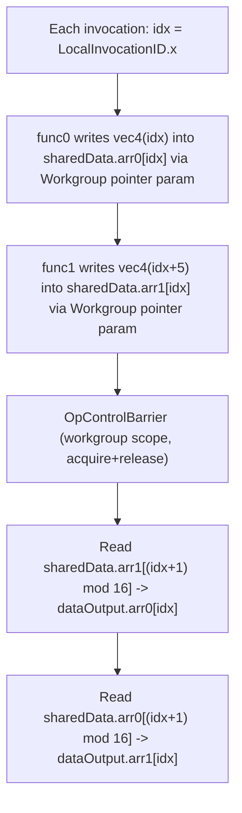

## Overview

**Core question:** When a SPIR-V function takes pointers as parameters, does the implementation preserve aliasing semantics and dereference pointers correctly across the `Function`, `Private`, `StorageBuffer`, and `Workgroup` storage classes, including the variable-pointer and workgroup-explicit-layout capability paths?

- [vktSpvAsmPointerParameterTests.cpp#L21-L22](../../../modules/vulkan/spirv_assembly/vktSpvAsmPointerParameterTests.cpp#L21-L22) implements the `pointer_parameter` test family for both compute and graphics pipelines.
- The compute factory ([createPointerParameterComputeGroup](../../../modules/vulkan/spirv_assembly/vktSpvAsmPointerParameterTests.cpp#L1082-L1093)) registers five cases under `spirv_assembly.instruction.compute.pointer_parameter`; the graphics factory ([createPointerParameterGraphicsGroup](../../../modules/vulkan/spirv_assembly/vktSpvAsmPointerParameterTests.cpp#L1095-L1105)) registers four base families, each expanded by `createTestsForAllStages` into `vert`, `frag`, `geom`, `tessc`, and `tesse` stage-suffixed cases.
- Each case authors a SPIR-V assembly shader directly in a C++ string template. There is no GLSL or HLSL source; the assembly is the source of truth and is validated by `spirv-as`/`spirv-val`/`spirv-dis` at generation time (see the spirv_assembly category deviation in `## Shader Analysis`).
- The core mechanism is a helper function that takes `OpTypePointer` parameters, writes through them, and returns or stores a result whose expected value is only correct if the compiler honored the parameter storage class, the `Aliased` decoration, and the relevant variable-pointer capability.

## Background Knowledge

- **SPIR-V pointer parameters.** A SPIR-V function may declare parameters of type `OpTypePointer` to a storage class. The caller passes an existing pointer (a variable address or an `OpAccessChain` result) and the callee dereferences it with `OpLoad`/`OpStore`. This is the SPIR-V analog of passing a pointer argument in C, and it is the single behavior this page exercises.
- **`Aliased` versus `Restrict`.** `Aliased` (the SPIR-V default) states that a parameter *may* alias other parameters or variables, so a write through one pointer must stay visible through a read of another. `Restrict` asserts no aliasing and would allow the compiler to reorder or eliminate accesses. Several cases here decorate parameters with `Aliased` and then call the function with both aliasing and non-aliasing arguments, so the expected result depends on the compiler preserving aliasing.
- **Variable-pointer capability gating.** `Function` and `Private` pointers are always allowed as parameters. Pointers into `StorageBuffer` require `VariablePointersStorageBuffer`; pointers into `Workgroup` require the broader `VariablePointers` capability. Both are exposed through `VK_KHR_variable_pointers` and the SPIR-V extensions `SPV_KHR_variable_pointers` and `SPV_KHR_storage_buffer_storage_class`.
- **Workgroup explicit layout.** `SPV_KHR_workgroup_memory_explicit_layout` (and the `WorkgroupMemoryExplicitLayoutKHR` capability) lets a `Workgroup` variable carry member-offset and array-stride decorations like a block. The workgroup-memory case uses it so a shared struct of two arrays can be addressed by offset and passed to helper functions as a pointer.

## Registration Hierarchy

```text
spirv_assembly.instruction.compute.pointer_parameter
├── param_to_param
├── param_to_global
├── buffer_memory
├── buffer_memory_variable_pointers
└── workgroup_memory_variable_pointers

spirv_assembly.instruction.graphics.pointer_parameter
├── global_to_param_frag
├── global_to_param_geom
├── global_to_param_tessc
├── global_to_param_tesse
├── global_to_param_vert
├── param_to_global_frag
├── param_to_global_geom
├── param_to_global_tessc
├── param_to_global_tesse
├── param_to_global_vert
├── buffer_memory_frag
├── buffer_memory_geom
├── buffer_memory_tessc
├── buffer_memory_tesse
├── buffer_memory_vert
├── buffer_memory_variable_pointers_frag
├── buffer_memory_variable_pointers_geom
├── buffer_memory_variable_pointers_tessc
├── buffer_memory_variable_pointers_tesse
└── buffer_memory_variable_pointers_vert
```

The compute root holds the five single-shader cases. The graphics root holds the four base families expanded into five stages each; for example `global_to_param` is the graphics counterpart of the compute `param_to_param` aliasing test. The graphics stage suffixes are `_vert`, `_frag`, `_geom`, `_tessc`, and `_tesse`.

## Parameter Dimensions and Observed Values

| Dimension | Registered values | Meaning in this test | Evidence |
|-----------|-------------------|----------------------|----------|
| Pipeline | `compute`, `graphics` | Selects the factory and shader template. Compute cases are single shaders; graphics cases inject fragments into a per-stage template. | [compute group](../../../modules/vulkan/spirv_assembly/vktSpvAsmPointerParameterTests.cpp#L1082-L1093), [graphics group](../../../modules/vulkan/spirv_assembly/vktSpvAsmPointerParameterTests.cpp#L1095-L1105) |
| Pointer storage class | `Function`, `Private`, `StorageBuffer`, `Workgroup` | The storage class pointed at by the function parameter; this is the primary property under test and maps one-to-one to a family. | [Function](../../../modules/vulkan/spirv_assembly/vktSpvAsmPointerParameterTests.cpp#L85-L87), [Private](../../../modules/vulkan/spirv_assembly/vktSpvAsmPointerParameterTests.cpp#L193-L195), [StorageBuffer](../../../modules/vulkan/spirv_assembly/vktSpvAsmPointerParameterTests.cpp#L321-L329), [Workgroup](../../../modules/vulkan/spirv_assembly/vktSpvAsmPointerParameterTests.cpp#L596-L605) |
| Aliasing | `Aliased`, non-aliased call pair | Whether the two pointer parameters of a single call resolve to the same variable. The `Aliased` decoration is applied; the call sequence exercises both aliasing and distinct arguments. | [Aliased decoration](../../../modules/vulkan/spirv_assembly/vktSpvAsmPointerParameterTests.cpp#L80-L81) |
| Variable-pointer capability | `VariablePointersStorageBuffer`, `VariablePointers` | Level of variable-pointer support: storage-buffer-only, or full (also covers `Workgroup`). | [StorageBuffer cap](../../../modules/vulkan/spirv_assembly/vktSpvAsmPointerParameterTests.cpp#L292-L295), [full cap](../../../modules/vulkan/spirv_assembly/vktSpvAsmPointerParameterTests.cpp#L560-L565) |
| Graphics stage | `vert`, `frag`, `geom`, `tessc`, `tesse` | Stage suffix produced by `createTestsForAllStages`; the pointer-parameter logic does not change across stages. | [stage expansion](../../../modules/vulkan/spirv_assembly/vktSpvAsmPointerParameterTests.cpp#L758-L766) |
| Buffer array form | fixed-size array, runtime array | `buffer_memory` families pass both a fixed-size `vec4` array pointer and a runtime-array pointer as parameters. | [fixed + runtime arrays](../../../modules/vulkan/spirv_assembly/vktSpvAsmPointerParameterTests.cpp#L321-L329) |

## Behavior Parameters

The primary behavioral axis is the **test family**. Each family selects a distinct pointer storage class together with the capability and synchronization shape needed to pass that storage class through a function parameter. The graphics families reuse four of the five compute behaviors under stage-suffixed names and do not introduce a new pointer-storage-class property, so this page describes them alongside their compute counterparts.

### param_to_param / global_to_param: aliased Function pointer parameters

`param_to_param` ([compute](../../../modules/vulkan/spirv_assembly/vktSpvAsmPointerParameterTests.cpp#L45-L141)) and `global_to_param` ([graphics](../../../modules/vulkan/spirv_assembly/vktSpvAsmPointerParameterTests.cpp#L692-L767)) pass two `Function`-storage-class pointers to a function and decorate both parameters `Aliased`. The function writes `5.0` through `g`, then `2.0` through `f`, and returns `*g`. The caller invokes it twice: once with both parameters aliasing the same variable (returns `2.0`), once with distinct variables (returns `5.0`). The summed output is `7.0`. No variable-pointer capability is required because only `Function` pointers are used.

The two names describe the same behavior. The graphics variant is built from `pre_main`/`decoration`/`testfun` fragments and runs once per stage; the aliasing logic is identical.

### param_to_global: Private and Function pointer parameters

`param_to_global` ([compute](../../../modules/vulkan/spirv_assembly/vktSpvAsmPointerParameterTests.cpp#L143-L257), [graphics](../../../modules/vulkan/spirv_assembly/vktSpvAsmPointerParameterTests.cpp#L769-L862)) adds a `Private` global variable `a` and declares two helper functions: `func0` takes a `Private` pointer, `func1` takes a `Function` pointer. Each writes `5.0` to `a`, writes `2.0` through its parameter, and returns `*a`. With `func0(&a)` the parameter aliases `a` so the return is `2.0`; with `func1(&b)` the parameter is distinct so the return is `5.0`. The summed output is again `7.0`. All relevant parameters and the global are decorated `Aliased`.

### buffer_memory: StorageBuffer array pointer parameters

`buffer_memory` ([compute](../../../modules/vulkan/spirv_assembly/vktSpvAsmPointerParameterTests.cpp#L259-L386), [graphics](../../../modules/vulkan/spirv_assembly/vktSpvAsmPointerParameterTests.cpp#L864-L970)) passes `StorageBuffer` array pointers to functions: one pointer to a fixed-size `vec4[16]` (compute) or `vec4[2]` (graphics) array, and one to a runtime array. `func0` writes `vec4(5.0)` into the fixed array at the invocation index; `func1` writes `vec4(2.0)` into the runtime array. The expected output is the first half `5.0` and the second half `2.0`. This family requires `VariablePointersStorageBuffer` and `VK_KHR_variable_pointers`.

### buffer_memory_variable_pointers: separately registered storage-buffer variant

`buffer_memory_variable_pointers` ([compute](../../../modules/vulkan/spirv_assembly/vktSpvAsmPointerParameterTests.cpp#L388-L514), [graphics](../../../modules/vulkan/spirv_assembly/vktSpvAsmPointerParameterTests.cpp#L972-L1078)) is registered as a separate case but, in the inspected source, emits `OpCapability VariablePointersStorageBuffer`, not the full `VariablePointers` capability that its name suggests. Its shader body, expected output, and feature request (`variablePointersStorageBuffer = true`) match `buffer_memory`; the only assembly-level difference is the order of the two `OpExtension` lines. Readers should not infer from the name that this family exercises a stronger capability than `buffer_memory`.

### workgroup_memory_variable_pointers: Workgroup pointer parameters (compute only)

`workgroup_memory_variable_pointers` ([compute](../../../modules/vulkan/spirv_assembly/vktSpvAsmPointerParameterTests.cpp#L516-L690)) is the only family that crosses invocation boundaries. It declares a `Workgroup` struct of two `vec4[16]` arrays, passes `Workgroup` array pointers to `func0` and `func1`, writes a per-invocation value into each array, synchronizes with `OpControlBarrier`, then reads a shuffled partner slot `((idx + 1) mod 16)` and writes it to the output buffer. It requires the full `VariablePointers` capability, `WorkgroupMemoryExplicitLayoutKHR`, `VK_KHR_variable_pointers`, `VK_KHR_workgroup_memory_explicit_layout`, and SPIR-V 1.4 (`spec.spirvVersion = SPIRV_VERSION_1_4`). There is no graphics counterpart.

## Shader Analysis

The shaders in this file are authored directly as SPIR-V assembly in C++ string templates; there is no GLSL or HLSL source. Under the temporary `spirv_assembly` category deviation, `#### Source Code` holds the extracted SPIR-V assembly verbatim (unfoldable), and the usual collapsed `#### SPIR-V` subsection is omitted because it would duplicate that assembly. Each extracted assembly was round-tripped through `spirv-as` → `spirv-val` → `spirv-dis` as a generation-time validation gate; that gate output is not published.

This page uses two walkthroughs. The first is the simplest aliased `Function` pointer case and establishes the core mechanism. The second is the workgroup-memory case, which is the only family that combines `Workgroup` pointer parameters, full `VariablePointers`, a control barrier, and a shuffled cross-invocation read. The intermediate families (`param_to_global`, `buffer_memory`, `buffer_memory_variable_pointers`) differ in storage class and capability but follow the same call-then-write shape; their variations are summarized in each walkthrough's variation table.

### Representative Shader Walkthrough 1

#### Parameter Values Chosen

Representative path:

```text
dEQP-VK.spirv_assembly.instruction.compute.pointer_parameter.param_to_param
```

| Parameter choice | Meaning in this representative case |
|------------------|-------------------------------------|
| `param_to_param` | Tests aliased `Function`-storage-class pointers as function parameters with no variable-pointer capability. |
| `compute` | Single compute shader, `LocalSize 1 1 1`, dispatched 128×1×1 so each invocation writes one output slot. |
| `Aliased` on `%f` and `%g` | Declares that the two parameters may alias; the call sequence then exercises both aliasing and distinct arguments. |
| Output in `Uniform`/`BufferBlock` | The 128-float result buffer uses the legacy `Uniform` storage class with `BufferBlock`, written through an `OpAccessChain` per invocation. |

#### Purpose

This shader checks that a SPIR-V function with two `Aliased` `Function` pointer parameters preserves aliasing: when both parameters point at the same variable, a write through one must be visible to a read through the other, so the function returns `2.0` rather than a stale `5.0`.

#### Structural Design

| Step | Call | Pointers passed | Expected return | Why |
|------|------|-----------------|-----------------|-----|
| 1 | `func(%a, %a)` | `%f` and `%g` both alias `%a` | `2.0` | `OpStore %g 5.0` then `OpStore %f 2.0` write to the same variable; `OpLoad %g` returns `2.0` only if aliasing is honored. |
| 2 | `func(%a, %b)` | `%f` and `%g` are distinct | `5.0` | `OpStore %g 5.0` writes `%a`; `OpStore %f 2.0` writes `%b`; `OpLoad %g` returns `%a`'s `5.0`. |
| 3 | `main` | (none) | `ret0 + ret1 = 7.0` | The sum is stored to `dataOutput[invocation]`. |

#### Shader Code

This representative case does not use GLSL or HLSL. CTS supplies the shader module directly as SPIR-V assembly. The selected module contains `compute` stage entry point `main`; the source template or Amber artifact cited by this walkthrough is the authoritative shader source. The complete validated assembly is presented in the final `SPIR-V` subsection.

#### Additional Info

- The expected output is 128 floats of `7.0f`, produced by dispatching `128×1×1` workgroups of `LocalSize 1 1 1` ([host setup](../../../modules/vulkan/spirv_assembly/vktSpvAsmPointerParameterTests.cpp#L131-L140)).
- The graphics counterpart `global_to_param` reuses this exact aliasing logic but injects it as `pre_main`/`decoration`/`testfun` fragments into a per-stage shader template and writes a single `7.0f` per stage to a storage-buffer output ([graphics builder](../../../modules/vulkan/spirv_assembly/vktSpvAsmPointerParameterTests.cpp#L742-L756)).

#### Parameter Variation Summary

| Parameter dimension | Shader-level variation from this shader | Evidence |
|---------------------|---------------------------------------|----------|
| Pointer storage class | `param_to_global` adds a `Private` global `%a` and a second helper `func1` taking a `Function` pointer; `func0` takes a `Private` pointer. Both paths still sum to `7.0`. | [param_to_global assembly](../../../modules/vulkan/spirv_assembly/vktSpvAsmPointerParameterTests.cpp#L174-L245) |
| Storage-buffer families | `buffer_memory` replaces `Function` pointers with `StorageBuffer` array pointers, adds `VariablePointersStorageBuffer` and `SPV_KHR_*` extensions, and writes `5.0`/`2.0` halves instead of `7.0`. | [buffer_memory assembly](../../../modules/vulkan/spirv_assembly/vktSpvAsmPointerParameterTests.cpp#L291-L368) |
| `buffer_memory_variable_pointers` | Near-identical to `buffer_memory`; still emits `VariablePointersStorageBuffer`, only the `OpExtension` order differs. | [assembly](../../../modules/vulkan/spirv_assembly/vktSpvAsmPointerParameterTests.cpp#L420-L497) |
| Pipeline | Graphics variants move the `func` definition into `fragments["pre_main"]` and the caller into `fragments["testfun"]`, returning `param` to satisfy the stage template. | [graphics fragments](../../../modules/vulkan/spirv_assembly/vktSpvAsmPointerParameterTests.cpp#L718-L756) |

#### SPIR-V

- Status: assembled, validated, and disassembled
- Source: CTS-authored SPIR-V assembly from this walkthrough
- Entry point(s): `GLCompute` (`main`)
- Stage: `GLCompute`
- Target SPIRV version: `spv1.0`

<details>
<summary>Click to expand SPIRV asm code</summary>

```llvm
; SPIR-V
; Version: 1.0
; Generator: Khronos SPIR-V Tools Assembler; 0
; Bound: 41
; Schema: 0
               OpCapability Shader
          %1 = OpExtInstImport "GLSL.std.450"
               OpMemoryModel Logical GLSL450
               OpEntryPoint GLCompute %2 "main" %gl_GlobalInvocationID
               OpExecutionMode %2 LocalSize 1 1 1
               OpSource GLSL 430
               OpDecorate %_arr_float_uint_128 ArrayStride 4
               OpMemberDecorate %_struct_5 0 Offset 0
               OpDecorate %_struct_5 BufferBlock
               OpDecorate %6 DescriptorSet 0
               OpDecorate %6 Binding 0
               OpDecorate %7 Aliased
               OpDecorate %8 Aliased
               OpDecorate %gl_GlobalInvocationID BuiltIn GlobalInvocationId
       %void = OpTypeVoid
         %10 = OpTypeFunction %void
      %float = OpTypeFloat 32
%_ptr_Function_float = OpTypePointer Function %float
         %13 = OpTypeFunction %float %_ptr_Function_float %_ptr_Function_float
    %float_0 = OpConstant %float 0
    %float_5 = OpConstant %float 5
    %float_2 = OpConstant %float 2
       %uint = OpTypeInt 32 0
   %uint_128 = OpConstant %uint 128
%_arr_float_uint_128 = OpTypeArray %float %uint_128
  %_struct_5 = OpTypeStruct %_arr_float_uint_128
%_ptr_Uniform__struct_5 = OpTypePointer Uniform %_struct_5
          %6 = OpVariable %_ptr_Uniform__struct_5 Uniform
        %int = OpTypeInt 32 1
      %int_0 = OpConstant %int 0
     %v3uint = OpTypeVector %uint 3
%_ptr_Input_v3uint = OpTypePointer Input %v3uint
%gl_GlobalInvocationID = OpVariable %_ptr_Input_v3uint Input
     %uint_0 = OpConstant %uint 0
%_ptr_Input_uint = OpTypePointer Input %uint
%_ptr_Uniform_float = OpTypePointer Uniform %float
          %2 = OpFunction %void None %10
         %27 = OpLabel
         %28 = OpVariable %_ptr_Function_float Function %float_0
         %29 = OpVariable %_ptr_Function_float Function %float_0
         %30 = OpVariable %_ptr_Function_float Function %float_0
         %31 = OpFunctionCall %float %32 %28 %28
               OpStore %30 %31
         %33 = OpFunctionCall %float %32 %28 %29
         %34 = OpLoad %float %30
         %35 = OpFAdd %float %34 %33
         %36 = OpAccessChain %_ptr_Input_uint %gl_GlobalInvocationID %uint_0
         %37 = OpLoad %uint %36
         %38 = OpAccessChain %_ptr_Uniform_float %6 %int_0 %37
               OpStore %38 %35
               OpReturn
               OpFunctionEnd
         %32 = OpFunction %float None %13
          %7 = OpFunctionParameter %_ptr_Function_float
          %8 = OpFunctionParameter %_ptr_Function_float
         %39 = OpLabel
               OpStore %8 %float_5
               OpStore %7 %float_2
         %40 = OpLoad %float %8
               OpReturnValue %40
               OpFunctionEnd
```

</details>

### Representative Shader Walkthrough 2

#### Parameter Values Chosen

Representative path:

```text
dEQP-VK.spirv_assembly.instruction.compute.pointer_parameter.workgroup_memory_variable_pointers
```

| Parameter choice | Meaning in this representative case |
|------------------|-------------------------------------|
| `workgroup_memory_variable_pointers` | Tests `Workgroup` array pointers as function parameters, the only family that needs full `VariablePointers`. |
| `WorkgroupMemoryExplicitLayoutKHR` | Lets the `Workgroup` struct `sharedData` carry member offsets and array strides so it can be addressed by offset. |
| `LocalSize 16 1 1`, one workgroup | 16 invocations cooperate through `sharedData`; `numWorkGroups` is `1×1×1`. |
| `OpControlBarrier` + shuffle | After the writes, a workgroup barrier makes partner writes visible; each invocation reads slot `((idx+1) mod 16)`. |
| SPIR-V 1.4 | `spec.spirvVersion = SPIRV_VERSION_1_4`; the assembly target env is `spirv1.4`. |

#### Purpose

This shader checks that `Workgroup` storage can be reached through pointer parameters under the full `VariablePointers` capability, and that a control barrier makes per-invocation writes visible before a different invocation reads a shuffled partner slot.

#### Structural Design



#### Shader Code

This representative case does not use GLSL or HLSL. CTS supplies the shader module directly as SPIR-V assembly. The selected module contains `compute` stage entry point `main`; the source template or Amber artifact cited by this walkthrough is the authoritative shader source. The complete validated assembly is presented in the final `SPIR-V` subsection.

#### Additional Info

- The `OpControlBarrier` operands `%uint_2 %uint_2 %uint_264` mean workgroup execution scope, workgroup memory scope, and an acquire+release memory barrier covering `Workgroup` storage (`AcquireRelease | WorkgroupMemory`, value 264) ([barrier](../../../modules/vulkan/spirv_assembly/vktSpvAsmPointerParameterTests.cpp#L622-L637)).
- The expected output is computed on the host from the shuffle formula `((idx + 1) mod 16)`: `dataOutput.arr0[idx]` holds `shuffleIdx + 5` and `dataOutput.arr1[idx]` holds `shuffleIdx`, each replicated across the four components of a `vec4` ([expected-output loop](../../../modules/vulkan/spirv_assembly/vktSpvAsmPointerParameterTests.cpp#L663-L677)).
- `func0` and `func1` share the same `%func_decl` type because both take a `Workgroup` `vec4[16]` pointer plus an index; only the written value differs (`idx` versus `idx + 5`).

#### Parameter Variation Summary

| Parameter dimension | Shader-level variation from this shader | Evidence |
|---------------------|---------------------------------------|----------|
| Pointer storage class | `buffer_memory` swaps `Workgroup` for `StorageBuffer` array pointers and drops the barrier and shuffle, writing `5.0`/`2.0` halves directly. | [buffer_memory assembly](../../../modules/vulkan/spirv_assembly/vktSpvAsmPointerParameterTests.cpp#L291-L368) |
| Capability | `buffer_memory`/`buffer_memory_variable_pointers` use `VariablePointersStorageBuffer` only; this case uses full `VariablePointers` plus `WorkgroupMemoryExplicitLayoutKHR`. | [capability declarations](../../../modules/vulkan/spirv_assembly/vktSpvAsmPointerParameterTests.cpp#L560-L565) |
| Synchronization | Only this family issues `OpControlBarrier` and reads a partner slot; the other families have no cross-invocation dependency. | [barrier and shuffle](../../../modules/vulkan/spirv_assembly/vktSpvAsmPointerParameterTests.cpp#L622-L637) |
| Target SPIR-V version | Only this family sets `spec.spirvVersion = SPIRV_VERSION_1_4`; the others default to `SPIRV_VERSION_1_0`. | [spirv version](../../../modules/vulkan/spirv_assembly/vktSpvAsmPointerParameterTests.cpp#L687) |

#### SPIR-V

- Status: assembled, validated, and disassembled
- Source: CTS-authored SPIR-V assembly from this walkthrough
- Entry point(s): `GLCompute` (`main`)
- Stage: `GLCompute`
- Target SPIRV version: `spv1.4`

<details>
<summary>Click to expand SPIRV asm code</summary>

```llvm
; SPIR-V
; Version: 1.4
; Generator: Khronos SPIR-V Tools Assembler; 0
; Bound: 70
; Schema: 0
               OpCapability Shader
               OpCapability VariablePointers
               OpCapability WorkgroupMemoryExplicitLayoutKHR
               OpExtension "SPV_KHR_variable_pointers"
               OpExtension "SPV_KHR_storage_buffer_storage_class"
               OpExtension "SPV_KHR_workgroup_memory_explicit_layout"
          %1 = OpExtInstImport "GLSL.std.450"
               OpMemoryModel Logical GLSL450
               OpEntryPoint GLCompute %2 "main" %gl_LocalInvocationID %4 %5
               OpExecutionMode %2 LocalSize 16 1 1
               OpSource GLSL 430
               OpMemberDecorate %_struct_6 0 Offset 0
               OpMemberDecorate %_struct_6 1 Offset 256
               OpMemberDecorate %_struct_7 0 Offset 0
               OpMemberDecorate %_struct_7 1 Offset 256
               OpDecorate %_arr_v4float_uint_16 ArrayStride 16
               OpDecorate %_runtimearr_v4float ArrayStride 16
               OpDecorate %_struct_6 Block
               OpDecorate %4 DescriptorSet 0
               OpDecorate %4 Binding 0
               OpDecorate %gl_LocalInvocationID BuiltIn LocalInvocationId
       %void = OpTypeVoid
         %11 = OpTypeFunction %void
      %float = OpTypeFloat 32
%_ptr_Function_float = OpTypePointer Function %float
       %uint = OpTypeInt 32 0
%_ptr_Function_uint = OpTypePointer Function %uint
     %uint_1 = OpConstant %uint 1
     %uint_2 = OpConstant %uint 2
     %uint_5 = OpConstant %uint 5
    %uint_16 = OpConstant %uint 16
   %uint_264 = OpConstant %uint 264
    %v4float = OpTypeVector %float 4
%_arr_v4float_uint_16 = OpTypeArray %v4float %uint_16
%_runtimearr_v4float = OpTypeRuntimeArray %v4float
%_ptr_StorageBuffer__arr_v4float_uint_16 = OpTypePointer StorageBuffer %_arr_v4float_uint_16
%_ptr_StorageBuffer__runtimearr_v4float = OpTypePointer StorageBuffer %_runtimearr_v4float
%_ptr_Workgroup__arr_v4float_uint_16 = OpTypePointer Workgroup %_arr_v4float_uint_16
         %25 = OpTypeFunction %void %_ptr_Workgroup__arr_v4float_uint_16 %_ptr_Function_uint
  %_struct_6 = OpTypeStruct %_arr_v4float_uint_16 %_runtimearr_v4float
  %_struct_7 = OpTypeStruct %_arr_v4float_uint_16 %_arr_v4float_uint_16
%_ptr_StorageBuffer__struct_6 = OpTypePointer StorageBuffer %_struct_6
%_ptr_Workgroup__struct_7 = OpTypePointer Workgroup %_struct_7
          %4 = OpVariable %_ptr_StorageBuffer__struct_6 StorageBuffer
          %5 = OpVariable %_ptr_Workgroup__struct_7 Workgroup
        %int = OpTypeInt 32 1
      %int_0 = OpConstant %int 0
      %int_1 = OpConstant %int 1
     %v3uint = OpTypeVector %uint 3
%_ptr_Input_v3uint = OpTypePointer Input %v3uint
%gl_LocalInvocationID = OpVariable %_ptr_Input_v3uint Input
     %uint_0 = OpConstant %uint 0
%_ptr_Input_uint = OpTypePointer Input %uint
%_ptr_StorageBuffer_v4float = OpTypePointer StorageBuffer %v4float
%_ptr_Workgroup_v4float = OpTypePointer Workgroup %v4float
          %2 = OpFunction %void None %11
         %37 = OpLabel
         %38 = OpVariable %_ptr_Function_uint Function
         %39 = OpAccessChain %_ptr_Input_uint %gl_LocalInvocationID %uint_0
         %40 = OpLoad %uint %39
               OpStore %38 %40
         %41 = OpAccessChain %_ptr_Workgroup__arr_v4float_uint_16 %5 %int_0
         %42 = OpAccessChain %_ptr_Workgroup__arr_v4float_uint_16 %5 %int_1
         %43 = OpFunctionCall %void %44 %41 %38
         %45 = OpFunctionCall %void %46 %42 %38
               OpControlBarrier %uint_2 %uint_2 %uint_264
         %47 = OpIAdd %uint %40 %uint_1
         %48 = OpUMod %uint %47 %uint_16
         %49 = OpAccessChain %_ptr_Workgroup_v4float %5 %int_1 %48
         %50 = OpLoad %v4float %49
         %51 = OpAccessChain %_ptr_StorageBuffer_v4float %4 %int_0 %40
               OpStore %51 %50
         %52 = OpAccessChain %_ptr_Workgroup_v4float %5 %int_0 %48
         %53 = OpLoad %v4float %52
         %54 = OpAccessChain %_ptr_StorageBuffer_v4float %4 %int_1 %40
               OpStore %54 %53
               OpReturn
               OpFunctionEnd
         %44 = OpFunction %void None %25
         %55 = OpFunctionParameter %_ptr_Workgroup__arr_v4float_uint_16
         %56 = OpFunctionParameter %_ptr_Function_uint
         %57 = OpLabel
         %58 = OpLoad %uint %56
         %59 = OpAccessChain %_ptr_Workgroup_v4float %55 %58
         %60 = OpConvertUToF %float %58
         %61 = OpCompositeConstruct %v4float %60 %60 %60 %60
               OpStore %59 %61
               OpReturn
               OpFunctionEnd
         %46 = OpFunction %void None %25
         %62 = OpFunctionParameter %_ptr_Workgroup__arr_v4float_uint_16
         %63 = OpFunctionParameter %_ptr_Function_uint
         %64 = OpLabel
         %65 = OpLoad %uint %63
         %66 = OpAccessChain %_ptr_Workgroup_v4float %62 %65
         %67 = OpIAdd %uint %65 %uint_5
         %68 = OpConvertUToF %float %67
         %69 = OpCompositeConstruct %v4float %68 %68 %68 %68
               OpStore %66 %69
               OpReturn
               OpFunctionEnd
```

</details>

## Runtime Execution and Result Checking

- **Compute resource setup.** Each compute case builds a `ComputeShaderSpec` with the authored assembly, an expected-output `Float32Buffer`, and `numWorkGroups`. The aliasing and global cases dispatch `128×1×1` workgroups of `LocalSize 1 1 1`; `buffer_memory` and `buffer_memory_variable_pointers` dispatch `16×1×1`; `workgroup_memory_variable_pointers` dispatches `1×1×1` with `LocalSize 16 1 1` ([compute specs](../../../modules/vulkan/spirv_assembly/vktSpvAsmPointerParameterTests.cpp#L131-L140)).
- **Graphics resource setup.** Each graphics case supplies a `GraphicsResources` block with one storage-buffer output and default color attachments, then calls `createTestsForAllStages` to register `_vert`, `_frag`, `_geom`, `_tessc`, and `_tesse` variants ([graphics resources](../../../modules/vulkan/spirv_assembly/vktSpvAsmPointerParameterTests.cpp#L758-L766)).
- **Feature and extension gating.** `buffer_memory` and `buffer_memory_variable_pointers` request `variablePointersStorageBuffer = true` and the `VK_KHR_variable_pointers` extension. `workgroup_memory_variable_pointers` requests `variablePointers = true`, `VK_KHR_variable_pointers`, and `VK_KHR_workgroup_memory_explicit_layout`. The graphics `global_to_param`/`param_to_global` cases request `vertexPipelineStoresAndAtomics` and `fragmentStoresAndAtomics`; the graphics buffer families add `variablePointersStorageBuffer` ([feature requests](../../../modules/vulkan/spirv_assembly/vktSpvAsmPointerParameterTests.cpp#L376-L385)).
- **Result comparison.** Compute cases compare the read-back output storage buffer byte-for-byte against the expected sequence. Graphics cases use the graphics runner's resource comparison: it permits a one-ULP RTZ/RNE difference, and for vertex, geometry, tessellation-control, and tessellation-evaluation stages can additionally accept an expected value plus a non-negative integer; fragment cases do not use that stage-specific allowance ([graphics resource check](../../../modules/vulkan/spirv_assembly/vktSpvAsmGraphicsShaderTestUtil.cpp#L4719-L4784)). Expected sequences are `7.0f` for the aliasing/global cases, first half `5.0f` then second half `2.0f` for the buffer cases, and the host-computed shuffle pattern for the workgroup case.
- **Pass/fail rule.** Compute cases pass only on an exact expected-buffer match. Graphics cases pass under the runner comparison described above; a mismatch reports an observable result disagreement, but the stage-specific allowance means a graphics pass does not establish exact equality for every output float.

## Failure Meaning

### Failure Cause Mapping

| If this behavior parameter value fails | Possible failure cause(s) |
|----------------------------------------|---------------------------|
| `param_to_param` / `global_to_param` | Aliased pointer parameter semantics not preserved: a write through one parameter not visible through an aliasing parameter read, or function-call argument wiring dropped the aliasing relationship. |
| `param_to_global` | Cross-storage-class pointer parameter handling broken for `Private` or `Function` targets, or aliased global/parameter interaction mis-compiled. |
| `buffer_memory` | `StorageBuffer` pointer parameter dereference or `VariablePointersStorageBuffer` capability handling incorrect; pointer arithmetic / `OpAccessChain` into a runtime or fixed array mis-lowered. |
| `buffer_memory_variable_pointers` | Same storage-buffer pointer causes as `buffer_memory`; the separately registered case is otherwise near-identical in the inspected source (it still emits `VariablePointersStorageBuffer`, not full `VariablePointers`). |
| `workgroup_memory_variable_pointers` | `Workgroup` pointer parameter handling under full `VariablePointers` broken, `WorkgroupMemoryExplicitLayoutKHR` layout mis-handled, or `OpControlBarrier` did not make partner writes visible before the shuffled read. |

Compute cases use an exact byte comparison; graphics cases use the graphics runner's stage-dependent comparison and can therefore accept the documented rounding or stage-specific non-negative-integer allowance. In either path, a reported mismatch means the observed output did not satisfy that case's oracle, but it does not alone identify whether pointer-parameter handling, synchronization, or another shader/pipeline operation caused the discrepancy.

### Cause Analysis

#### Aliased pointer parameter semantics not preserved

**Possible failure symptoms:** A `param_to_param` or `global_to_param` case produces an output other than `7.0f`. If the aliasing call returned the stale `5.0` instead of `2.0`, the sum becomes `10.0`; if the non-aliasing call returned `2.0` instead of `5.0`, the sum becomes `4.0`.

**Possible implementation causes:** The SPIR-V `Aliased` decoration is the default and should forbid restrict-style forwarding. A compiler that incorrectly treated the parameters as non-aliasing could reorder or eliminate the `OpStore %f`/`OpLoad %g` pair, or forward a stale value to the read. The failure points at SPIR-V function-call argument handling or alias analysis in the shader compiler rather than at the host or fixed-function pipeline.

#### Cross-storage-class pointer parameter handling broken

**Possible failure symptoms:** A `param_to_global` case produces an output other than `7.0f`. The symptom is the same shape as the aliasing case but appears only when one parameter is a `Private` global and the other is a `Function` local.

**Possible implementation causes:** This family mixes `Private` and `Function` pointer parameters in the same entry point and decorates the global and both parameters `Aliased`. Check whether the compiler correctly models a `Private` global written through a `Private` pointer parameter and read back through the same global, and whether the `Function`-pointer path in `func1` is kept distinct from the `Private` path in `func0`. Any cause not explained by this storage-class mixing needs source-level investigation.

#### StorageBuffer pointer parameter dereference or capability handling incorrect

**Possible failure symptoms:** A `buffer_memory` or `buffer_memory_variable_pointers` case produces an output whose first half is not all `5.0f` or whose second half is not all `2.0f`. The mismatch localizes to the array written by `func0` or `func1`.

**Possible implementation causes:** These families pass `StorageBuffer` array pointers (one to a fixed-size array, one to a runtime array) as function parameters and dereference them with `OpAccessChain` plus `OpStore`. A failure points at `VariablePointersStorageBuffer` handling, `OpAccessChain` into a runtime array, or the `SPV_KHR_storage_buffer_storage_class` mapping. Because `buffer_memory_variable_pointers` is near-identical to `buffer_memory` in the inspected source, a failure in only one of the two would need source-level investigation to explain.

#### Workgroup pointer parameter or barrier visibility broken

**Possible failure symptoms:** A `workgroup_memory_variable_pointers` case produces an output that does not match the shuffle pattern. The first output array should hold `shuffleIdx + 5` and the second `shuffleIdx` for `shuffleIdx = (idx + 1) mod 16`; a wrong value at a given index indicates either a mis-directed write or a missing partner read.

**Possible implementation causes:** This is the only family that combines `Workgroup` pointer parameters, full `VariablePointers`, `WorkgroupMemoryExplicitLayoutKHR`, and a control barrier before a cross-invocation read. Check whether `Workgroup` pointers passed to `func0`/`func1` dereference to the correct slot, whether the explicit-layout decorations are honored, and whether `OpControlBarrier` made each invocation's writes visible to the partner that reads slot `(idx + 1) mod 16`. A barrier-scope or memory-semantics mismatch would produce a stale-partner read rather than a write to the wrong slot.

## Case Pruning

### Requirement-based pruning

- The `buffer_memory` and `buffer_memory_variable_pointers` families require `variablePointersStorageBuffer = true` and the `VK_KHR_variable_pointers` extension ([feature request](../../../modules/vulkan/spirv_assembly/vktSpvAsmPointerParameterTests.cpp#L376-L385)).
- `workgroup_memory_variable_pointers` requires `variablePointers = true`, `VK_KHR_variable_pointers`, `VK_KHR_workgroup_memory_explicit_layout`, and SPIR-V 1.4 ([workgroup features](../../../modules/vulkan/spirv_assembly/vktSpvAsmPointerParameterTests.cpp#L680-L687)).
- Graphics cases that write storage-buffer outputs require `vertexPipelineStoresAndAtomics` and `fragmentStoresAndAtomics`; the graphics buffer families also require `variablePointersStorageBuffer` ([graphics features](../../../modules/vulkan/spirv_assembly/vktSpvAsmPointerParameterTests.cpp#L758-L766)).
- The `param_to_param` and `param_to_global` cases use only `Function`/`Private` pointers and require no variable-pointer feature or extension.

### Design-based pruning

- The compute pipeline registers `workgroup_memory_variable_pointers` as a separate case because its shader body, capability set, and SPIR-V target version differ from the storage-buffer families; it is not a stage variant.
- The graphics pipeline does not register a workgroup-memory family because workgroup storage and `WorkgroupMemoryExplicitLayoutKHR` are compute-stage concepts here.
- `buffer_memory` and `buffer_memory_variable_pointers` are kept as two registrations even though their inspected assembly is near-identical; the second exists to cover the variable-pointers extension path as a distinct registered case.
- Graphics families are expanded only across the five stage suffixes produced by `createTestsForAllStages`; no other dimension is varied per stage, because the pointer-parameter logic does not change across stages.

## Key Takeaways

- The tested property is narrow: a SPIR-V function receives pointers as parameters and dereferences them. Each family changes only the pointer storage class, the capability needed to form that pointer, and (for the workgroup case) whether a barrier is required.
- For the aliasing cases, the expected `7.0` output is only correct when a write through one parameter is visible through a read of an aliasing parameter; a restrict-style forwarding optimization would break it.
- The name `buffer_memory_variable_pointers` does not imply full `VariablePointers`. In the inspected source it emits `VariablePointersStorageBuffer`, matching `buffer_memory`; only `workgroup_memory_variable_pointers` exercises the full `VariablePointers` capability.
- The workgroup-memory case is the only one with a cross-invocation dependency: the `OpControlBarrier` must make each invocation's `sharedData` write visible before a different invocation reads the shuffled partner slot.
- Compute `param_to_param` and graphics `global_to_param` are the same behavior under different names; the graphics families are stage-suffixed variants of compute behaviors 1-4, with no new pointer-storage-class property.

## Source Reference Appendix

| Entry point | Link | Why it matters |
|-------------|------|----------------|
| Compute `param_to_param` builder and assembly | [vktSpvAsmPointerParameterTests.cpp#L45-L141](../../../modules/vulkan/spirv_assembly/vktSpvAsmPointerParameterTests.cpp#L45-L141) | Aliased `Function` pointer parameters; expected `7.0f`. |
| Compute `param_to_global` builder and assembly | [vktSpvAsmPointerParameterTests.cpp#L143-L257](../../../modules/vulkan/spirv_assembly/vktSpvAsmPointerParameterTests.cpp#L143-L257) | `Private` + `Function` pointer parameters; expected `7.0f`. |
| Compute `buffer_memory` builder and assembly | [vktSpvAsmPointerParameterTests.cpp#L259-L386](../../../modules/vulkan/spirv_assembly/vktSpvAsmPointerParameterTests.cpp#L259-L386) | `StorageBuffer` array pointer parameters; `VariablePointersStorageBuffer`. |
| Compute `buffer_memory_variable_pointers` builder | [vktSpvAsmPointerParameterTests.cpp#L388-L514](../../../modules/vulkan/spirv_assembly/vktSpvAsmPointerParameterTests.cpp#L388-L514) | Near-identical to `buffer_memory`; still emits `VariablePointersStorageBuffer`. |
| Compute `workgroup_memory_variable_pointers` builder and assembly | [vktSpvAsmPointerParameterTests.cpp#L516-L690](../../../modules/vulkan/spirv_assembly/vktSpvAsmPointerParameterTests.cpp#L516-L690) | `Workgroup` pointer parameters; full `VariablePointers`; SPIR-V 1.4; shuffled output. |
| Graphics `global_to_param` builder | [vktSpvAsmPointerParameterTests.cpp#L692-L767](../../../modules/vulkan/spirv_assembly/vktSpvAsmPointerParameterTests.cpp#L692-L767) | Graphics counterpart of compute `param_to_param`. |
| Graphics `param_to_global` builder | [vktSpvAsmPointerParameterTests.cpp#L769-L862](../../../modules/vulkan/spirv_assembly/vktSpvAsmPointerParameterTests.cpp#L769-L862) | Graphics counterpart of compute `param_to_global`. |
| Graphics `buffer_memory` builder | [vktSpvAsmPointerParameterTests.cpp#L864-L970](../../../modules/vulkan/spirv_assembly/vktSpvAsmPointerParameterTests.cpp#L864-L970) | Graphics storage-buffer pointer parameters across all stages. |
| Graphics `buffer_memory_variable_pointers` builder | [vktSpvAsmPointerParameterTests.cpp#L972-L1078](../../../modules/vulkan/spirv_assembly/vktSpvAsmPointerParameterTests.cpp#L972-L1078) | Graphics counterpart of compute `buffer_memory_variable_pointers`. |
| Compute group factory | [vktSpvAsmPointerParameterTests.cpp#L1082-L1093](../../../modules/vulkan/spirv_assembly/vktSpvAsmPointerParameterTests.cpp#L1082-L1093) | Registers the five compute cases under `pointer_parameter`. |
| Graphics group factory | [vktSpvAsmPointerParameterTests.cpp#L1095-L1105](../../../modules/vulkan/spirv_assembly/vktSpvAsmPointerParameterTests.cpp#L1095-L1105) | Registers the four graphics base families under `pointer_parameter`. |
| Graphics stage expansion helper | [vktSpvAsmGraphicsShaderTestUtil.hpp#L479-L487](../../../modules/vulkan/spirv_assembly/vktSpvAsmGraphicsShaderTestUtil.hpp#L479-L487) | `createTestsForAllStages` declares the stage-suffix expansion used by every graphics family. |
