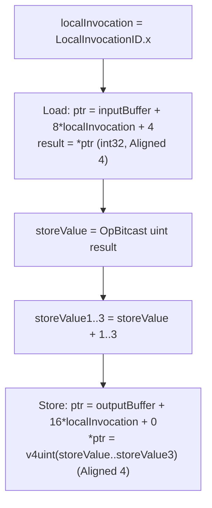
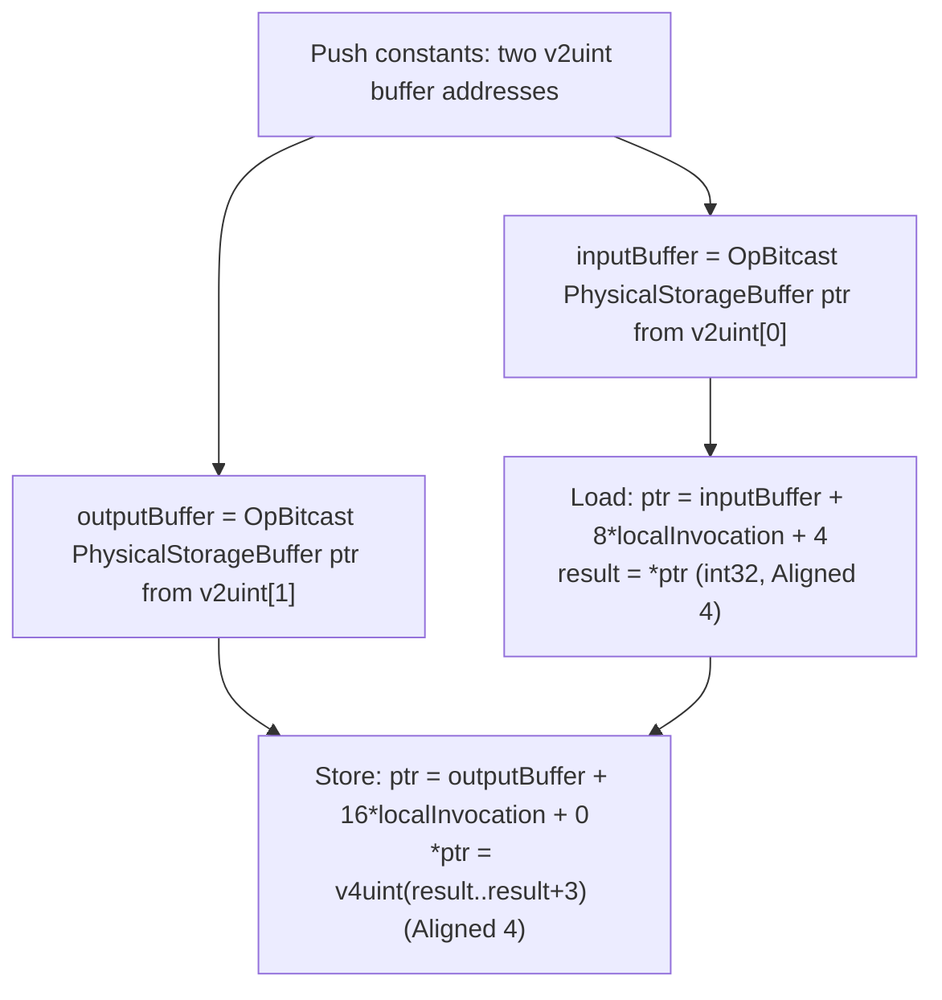

## Overview

**Core question:** Does the implementation compute `OpRawAccessChainNV` byte addresses, alignment operands, and robustness zeroing correctly when the base pointer comes from a plain `StorageBuffer`, a variable pointer, a runtime descriptor array, or a physical storage buffer address?

- [vktSpvAsmRawAccessChainTests.cpp](../../../modules/vulkan/spirv_assembly/vktSpvAsmRawAccessChainTests.cpp) implements the `raw_access_chain` test family under `spirv_assembly.instruction.compute.raw_access_chain`.
- Each generated case authors a SPIR-V assembly compute shader directly in C++ via the `CodeGen` helper. There is no GLSL or HLSL source; the assembly is the source of truth and `initPrograms()` supplies it to the CTS SPIR-V-assembly build path for the test pipeline.
- Each case performs a load-side `OpRawAccessChainNV` and a store-side `OpRawAccessChainNV` over a generated combination of scalar size, vector component count, alignment, padding, stride, robustness operand, memory qualifiers, buffer addressing mode, and 64-bit indexing.
- The host pre-computes the expected output bytes with the same arithmetic and bounds-zeroing rules as the shader, then compares the output buffer byte-by-byte with `deMemCmp`.

## Background Knowledge

- **`OpRawAccessChainNV`.** Forms a pointer by computing `base + stride * element_index + offset` in byte units, with an optional robustness operand. `Aligned` is not an operand of `OpRawAccessChainNV`: when a resulting pointer is consumed by `OpLoad` or `OpStore`, those instructions require a valid `Aligned` memory operand. Unlike `OpAccessChain`, which navigates a typed SPIR-V structure, `OpRawAccessChainNV` treats the base as a raw byte address and produces a typed pointer to the result type declared on the instruction. Exposed by `VK_NV_raw_access_chains` and the `RawAccessChainsNV` capability.
- **Robustness operands.** `RobustnessPerComponentNV` zeros each vector component whose computed byte offset falls outside the descriptor range. `RobustnessPerElementNV` zeros the entire element if its base offset is out of range. When bounds checking is active, the test derives the range from 11 generated structures and, for per-component checks on vectors, subtracts one scalar width; the exact out-of-range component boundary therefore depends on the generated padding rather than being uniformly “invocations 11 to 31.”
- **`PhysicalStorageBuffer64` addressing.** When `physicalBuffers` is enabled, the memory model switches to `PhysicalStorageBuffer64`. Buffer device addresses obtained via `vkGetBufferDeviceAddress` are pushed as `v2uint` pairs through a push constant struct, then `OpBitcast` to `PhysicalStorageBuffer` pointers inside the shader. No descriptor sets are bound; the shader addresses buffers purely by 64-bit address.
- **Variable pointers and descriptor indexing.** The `variablePointers` path adds `OpCapability VariablePointers` and still addresses the two `StorageBuffer` variables directly; it neither declares `SPV_KHR_variable_pointers` nor performs pointer comparisons. The `descriptorIndexing` path adds `OpCapability RuntimeDescriptorArray` and indexes a runtime array of storage buffers using a push-constant descriptor index (set to 6). Both are skipped when `physicalBuffers` is enabled.

## Registration Hierarchy

```text
spirv_assembly.instruction.compute.raw_access_chain
```

The source creates [`raw_access_chain`](../../../modules/vulkan/spirv_assembly/vktSpvAsmRawAccessChainTests.cpp#L1200-L1206) as a flat test group and adds generated test cases directly under that root; it does not create a named subgroup below `raw_access_chain`. Case names encode the full parameter combination (for example, `load_int32_stride_no_bounds`, `store_physical_buffers_int8_no_stride_per_component_load_non_writable_64b_indexing`).

## Parameter Dimensions and Observed Values

| Dimension | Registered values | Meaning in this test | Evidence |
|-----------|-------------------|----------------------|----------|
| Operation orientation | `load_`, `store_` | Selects whether the generated `size`/`components`/`alignment`/`prePadding` dimensions are on the load side or the store side. The non-tested side is fixed to 4-byte, 4-component, no pre-padding. | [testingStore loop](../../../modules/vulkan/spirv_assembly/vktSpvAsmRawAccessChainTests.cpp#L1013-L1075) |
| Scalar size | `1`, `2`, `4`, `8` bytes | Size of each scalar component in bytes. Selects `Int8`/`Int16`/`Int32`/`Int64` capabilities. | [size loop](../../../modules/vulkan/spirv_assembly/vktSpvAsmRawAccessChainTests.cpp#L1021-L1024) |
| Components | `1`, `2`, `3`, `4` | Number of vector components. Vector prefixes (`v2`, `v3`, `v4`) are emitted only when components > 1. | [components loop](../../../modules/vulkan/spirv_assembly/vktSpvAsmRawAccessChainTests.cpp#L1021-L1024) |
| Alignment divisor | `{1, 4, 2, 3}` | Divides `components * size` to produce an explicit alignment. Divisors that do not evenly divide the component count are skipped. A divisor > 1 produces intentionally misaligned access. | [alignmentDiv loop](../../../modules/vulkan/spirv_assembly/vktSpvAsmRawAccessChainTests.cpp#L1021-L1024) |
| Stride | `true`, `false` | When true, `OpRawAccessChainNV` receives `(stride, elementIndex, offset)`. When false, the shader pre-computes the byte offset via `OpIMul`/`OpIAdd` and passes `(0, 0, offset)`. | [stride loop](../../../modules/vulkan/spirv_assembly/vktSpvAsmRawAccessChainTests.cpp#L1021-L1028) |
| Bounds check | `NO_BOUNDS_CHECK`, `BOUNDS_CHECK_PER_COMPONENT`, `BOUNDS_CHECK_PER_ELEMENT` | Maps to `RobustnessPerComponentNV`/`RobustnessPerElementNV` operands on `OpRawAccessChainNV`. Per-element requires stride. | [BoundsCheck enum](../../../modules/vulkan/spirv_assembly/vktSpvAsmRawAccessChainTests.cpp#L73-L78) |
| Buffer addressing | plain `StorageBuffer`, `variable_pointers_`, `descriptor_indexing_`, `physical_buffers_` | Selects how the base pointer is obtained: plain `StorageBuffer` variable, variable-pointer `StorageBuffer`, runtime descriptor array, or `PhysicalStorageBuffer` address from push constants. | [addressing loops](../../../modules/vulkan/spirv_assembly/vktSpvAsmRawAccessChainTests.cpp#L1013-L1045) |
| Qualifiers | none, `load_non_writable`, `load_volatile`, `load_coherent`, `store_non_readable`, `store_volatile`, `store_coherent` | Memory qualifiers decorated on the load/store pointer. Complex combinations are restricted to 4-byte, 4-component, default-alignment cases. | [qualifiersCombinations](../../../modules/vulkan/spirv_assembly/vktSpvAsmRawAccessChainTests.cpp#L1000-L1011) |
| 64-bit indexing | `true`, `false` | When true, the pipeline is created with `VK_PIPELINE_CREATE_2_64_BIT_INDEXING_BIT_EXT`. The shader assembly does not change. | [uses64BitIndexing loop](../../../modules/vulkan/spirv_assembly/vktSpvAsmRawAccessChainTests.cpp#L1013-L1018) |

The [`Parameters`](../../../modules/vulkan/spirv_assembly/vktSpvAsmRawAccessChainTests.cpp#L91-L121) struct stores the resolved per-case specification. The [`addTests()`](../../../modules/vulkan/spirv_assembly/vktSpvAsmRawAccessChainTests.cpp#L1000-L1196) function iterates the combination matrix, applies skip rules, builds each case name, and registers each generated test directly under `raw_access_chain`.

## Behavior Parameters

The primary behavioral axis is the **buffer addressing mode**. Each value changes how `OpRawAccessChainNV` obtains its base pointer, which is the dimension that most affects shader structure and capability requirements. A secondary axis is the **operation orientation** (`load_` vs `store_`), which swaps which side carries the generated dimensions.

### Plain `StorageBuffer` (default)

The default path uses `OpMemoryModel Logical GLSL450` with two `StorageBuffer` variables (`%inputBuffer` at descriptor set 0, `%outputBuffer` at descriptor set 1). `OpRawAccessChainNV` takes the `StorageBuffer` variable directly as its base. No extra capabilities beyond `Shader` and `RawAccessChainsNV` are required. This is the simplest addressing path and the baseline for all other variations.

### `variable_pointers`

Adds `OpCapability VariablePointers`. The shader still uses two `StorageBuffer` variables directly as raw-access-chain bases; this generator does not add a separate `SPV_KHR_variable_pointers` declaration or perform pointer comparisons. Skipped when `physicalBuffers` is enabled.

### `descriptor_indexing`

Adds `OpCapability RuntimeDescriptorArray` and declares `OpTypeRuntimeArray` of `StorageBuffer` structs for both input and output. The shader reads a descriptor index from push constants (set to 6 on the host) and uses `OpAccessChain` into the runtime array to obtain the base pointer for `OpRawAccessChainNV`. Skipped when `physicalBuffers` is enabled.

### `physical_buffers`

Switches to `OpMemoryModel PhysicalStorageBuffer64 GLSL450` and adds `OpCapability PhysicalStorageBufferAddresses`. No descriptor sets are bound; instead, the host pushes two 64-bit buffer device addresses as `v2uint` pairs in a push constant struct. The shader `OpAccessChain`s into the push constant, loads the `v2uint` address, and `OpBitcast`s it to a `PhysicalStorageBuffer` pointer that is the base for `OpRawAccessChainNV`. Only generated with `NO_BOUNDS_CHECK`, no variable pointers, and no descriptor indexing.

### `load_` vs `store_` orientation

When `testingStore=false` (load-oriented cases), the input side uses the generated `size`/`components`/`alignment`/`prePadding` while the output side is fixed to 4-byte, 4-component, no pre-padding. When `testingStore=true`, the roles swap: the output side carries the generated dimensions and the input side is fixed to 4-byte, 4-component. This means `load_int8_*` cases read `int8` inputs but write `v4uint32` outputs, while `store_int8_*` cases read `v4uint32` inputs but write `int8` outputs.

## Shader Analysis

The shaders in this file are authored directly as SPIR-V assembly in C++ string templates via the `CodeGen` helper; there is no GLSL or HLSL source. Under the temporary `spirv_assembly` category deviation, `#### Source Code` holds the representative assembly (unfoldable), and the usual collapsed `#### SPIR-V` subsection is omitted because it would duplicate that source. `initPrograms()` registers each generated assembly with `SpirVAsmBuildOptions` for the CTS test pipeline; this page does not claim a separate generation-time `spirv-as`/`spirv-val`/`spirv-dis` gate.

This page uses two walkthroughs. The first is the simplest plain `StorageBuffer` case and establishes the core `OpRawAccessChainNV` load/store mechanism. The second is the `physical_buffers` case, which is the only path that uses `PhysicalStorageBuffer64` addressing, push-constant buffer addresses, and `OpBitcast` to form the base pointer. The `variable_pointers` and `descriptor_indexing` paths differ from the default only in how the base pointer is obtained; their variations are summarized in each walkthrough's variation table.

### Representative Shader Walkthrough 1

#### Parameter Values Chosen

Representative path:

```text
dEQP-VK.spirv_assembly.instruction.compute.raw_access_chain.load_int32_stride_no_bounds
```

| Parameter choice | Meaning in this representative case |
|------------------|-------------------------------------|
| `load_` orientation | Load side carries the generated dimensions; store side is fixed to `v4uint32`. |
| `int32` (size=4, components=1) | Reads one `int32` per invocation. `OpTypeInt 32 1` is the input type. |
| `stride` | `OpRawAccessChainNV` receives `(stride=8, elementIndex=localInvocation, offset=4)`. |
| `no_bounds` | No robustness operand; the full 32 invocations read valid data. |
| Plain `StorageBuffer` | Two `StorageBuffer` variables at descriptor sets 0 and 1; no extra capabilities. |
| `Aligned 4` | Both load and store use the default alignment (equal to the type size). |
| `LocalSize 32 1 1`, dispatch `1×1×1` | 32 invocations, one per output slot. |

#### Purpose

This shader checks that `OpRawAccessChainNV` correctly computes the byte address `base + stride * index + offset` for both load and store, and that the `Aligned` operand is honored, against a plain `StorageBuffer` variable with no robustness.

#### Structural Design



#### Shader Code

This representative case does not use GLSL or HLSL. CTS supplies the shader module directly as SPIR-V assembly. The selected module contains `compute` stage entry point `main`; the source template or Amber artifact cited by this walkthrough is the authoritative shader source. The complete validated assembly is presented in the final `SPIR-V` subsection.

#### Additional Info

- The input buffer is filled with random bytes from seed 434 ([random fill](../../../modules/vulkan/spirv_assembly/vktSpvAsmRawAccessChainTests.cpp#L619-L626)). Each invocation reads one `int32` at byte offset `8*invocation + 4` (4 bytes of pre-padding per element, 4 bytes of data, 0 bytes of post-padding; the 8-byte stride is a power of two).
- The output is a `v4uint` of `(value, value+1, value+2, value+3)` written at byte offset `16*invocation`. The host computes the same expected output and compares with `deMemCmp`.
- The push constant `%pushConstants` carries the descriptor index (set to 0 for non-descriptor-indexing cases) but is unused in this shader's body; it appears in the entry point interface because the host always binds it.

#### Parameter Variation Summary

| Parameter dimension | Shader-level variation from this shader | Evidence |
|---------------------|---------------------------------------|----------|
| Stride = false | The shader pre-computes `%elementOffset = OpIMul %uint %localInvocation %stride` and `%loadOffset = OpIAdd %uint %elementOffset %prePadding`, then passes `(0, 0, %loadOffset)` to `OpRawAccessChainNV`. | [no-stride path](../../../modules/vulkan/spirv_assembly/vktSpvAsmRawAccessChainTests.cpp#L862-L879) |
| Bounds check | Adds `RobustnessPerComponentNV` or `RobustnessPerElementNV` operand to `OpRawAccessChainNV`. Host binds a descriptor range covering only 11 elements. | [GetRobustnessOperand](../../../modules/vulkan/spirv_assembly/vktSpvAsmRawAccessChainTests.cpp#L575-L586) |
| Scalar size | `size=1` adds `OpCapability Int8` and `%type = OpTypeInt 8 1`; `size=2` adds `Int16`; `size=8` adds `Int64`. When input and output sizes differ, the shader uses `OpUConvert` instead of `OpBitcast`. | [type selection](../../../modules/vulkan/spirv_assembly/vktSpvAsmRawAccessChainTests.cpp#L716-L733) |
| Components > 1 | The load side extracts each component with `OpCompositeExtract` and sums them with `OpIAdd`. The store side constructs a vector with `OpCompositeConstruct`. | [component arithmetic](../../../modules/vulkan/spirv_assembly/vktSpvAsmRawAccessChainTests.cpp#L906-L974) |
| Alignment divisor > 1 | Sets the `Aligned` operand to `(components * size) / alignmentDiv`, which may be smaller than the type size. Extra pre-padding shifts the access off the natural alignment. | [alignment computation](../../../modules/vulkan/spirv_assembly/vktSpvAsmRawAccessChainTests.cpp#L1059-L1070) |
| Qualifiers | Adds `OpDecorate %pointer NonWritable`/`Volatile`/`Coherent` (load side) or `OpDecorate %storePointer NonReadable`/`Volatile`/`Coherent` (store side). | [SetLoadDecorations](../../../modules/vulkan/spirv_assembly/vktSpvAsmRawAccessChainTests.cpp#L589-L597), [SetStoreDecorations](../../../modules/vulkan/spirv_assembly/vktSpvAsmRawAccessChainTests.cpp#L599-L607) |
| `store_` orientation | Swaps which side carries the generated dimensions. The load side becomes fixed 4-byte/4-component and the store side carries the generated `size`/`components`/`alignment`. | [orientation swap](../../../modules/vulkan/spirv_assembly/vktSpvAsmRawAccessChainTests.cpp#L1128-L1147) |

#### SPIR-V

- Status: assembled, validated, and disassembled
- Source: CTS-authored SPIR-V assembly from this walkthrough
- Entry point(s): `GLCompute` (`main`)
- Stage: `GLCompute`
- Target SPIRV version: `spv1.4`

<details>
<summary>Click to expand SPIRV asm code</summary>

```llvm
; SPIR-V
; Version: 1.4
; Generator: Khronos SPIR-V Tools Assembler; 0
; Bound: 47
; Schema: 0
               OpCapability Shader
               OpCapability RawAccessChainsNV
               OpExtension "SPV_NV_raw_access_chains"
          %1 = OpExtInstImport "GLSL.std.450"
               OpMemoryModel Logical GLSL450
               OpEntryPoint GLCompute %2 "main" %gl_LocalInvocationID %4 %5 %6
               OpExecutionMode %2 LocalSize 32 1 1
               OpDecorate %gl_LocalInvocationID BuiltIn LocalInvocationId
               OpDecorate %_struct_7 Block
               OpMemberDecorate %_struct_7 0 Offset 0
               OpDecorate %_struct_8 Block
               OpMemberDecorate %_struct_8 0 Offset 0
               OpDecorate %6 DescriptorSet 1
               OpDecorate %6 Binding 0
               OpDecorate %5 DescriptorSet 0
               OpDecorate %5 Binding 0
        %int = OpTypeInt 32 1
       %void = OpTypeVoid
      %v2int = OpTypeVector %int 2
      %v3int = OpTypeVector %int 3
      %v4int = OpTypeVector %int 4
       %uint = OpTypeInt 32 0
     %v2uint = OpTypeVector %uint 2
     %v3uint = OpTypeVector %uint 3
     %v4uint = OpTypeVector %uint 4
         %18 = OpTypeFunction %void
%_ptr_Input_v3uint = OpTypePointer Input %v3uint
%_ptr_Input_uint = OpTypePointer Input %uint
  %_struct_7 = OpTypeStruct %uint
  %_struct_8 = OpTypeStruct %uint
%_ptr_StorageBuffer__struct_7 = OpTypePointer StorageBuffer %_struct_7
%_ptr_StorageBuffer_int = OpTypePointer StorageBuffer %int
%_ptr_StorageBuffer_v2int = OpTypePointer StorageBuffer %v2int
%_ptr_StorageBuffer_v3int = OpTypePointer StorageBuffer %v3int
%_ptr_StorageBuffer_v4int = OpTypePointer StorageBuffer %v4int
%_ptr_StorageBuffer_v4uint = OpTypePointer StorageBuffer %v4uint
%_ptr_PushConstant_uint = OpTypePointer PushConstant %uint
%_ptr_PushConstant__struct_8 = OpTypePointer PushConstant %_struct_8
     %uint_8 = OpConstant %uint 8
    %uint_16 = OpConstant %uint 16
     %uint_0 = OpConstant %uint 0
     %uint_4 = OpConstant %uint 4
     %uint_1 = OpConstant %uint 1
     %uint_2 = OpConstant %uint 2
     %uint_3 = OpConstant %uint 3
%gl_LocalInvocationID = OpVariable %_ptr_Input_v3uint Input
          %4 = OpVariable %_ptr_PushConstant__struct_8 PushConstant
          %6 = OpVariable %_ptr_StorageBuffer__struct_7 StorageBuffer
          %5 = OpVariable %_ptr_StorageBuffer__struct_7 StorageBuffer
          %2 = OpFunction %void None %18
         %36 = OpLabel
         %37 = OpAccessChain %_ptr_Input_uint %gl_LocalInvocationID %uint_0
         %38 = OpLoad %uint %37
         %39 = OpRawAccessChainNV %_ptr_StorageBuffer_int %5 %uint_8 %38 %uint_4
         %40 = OpLoad %int %39 Aligned 4
         %41 = OpBitcast %uint %40
         %42 = OpRawAccessChainNV %_ptr_StorageBuffer_v4uint %6 %uint_16 %38 %uint_0
         %43 = OpIAdd %uint %41 %uint_1
         %44 = OpIAdd %uint %41 %uint_2
         %45 = OpIAdd %uint %41 %uint_3
         %46 = OpCompositeConstruct %v4uint %41 %43 %44 %45
               OpStore %42 %46 Aligned 4
               OpReturn
               OpFunctionEnd
```

</details>

### Representative Shader Walkthrough 2

#### Parameter Values Chosen

Representative path:

```text
dEQP-VK.spirv_assembly.instruction.compute.raw_access_chain.load_physical_buffers_int32_stride_no_bounds
```

| Parameter choice | Meaning in this representative case |
|------------------|-------------------------------------|
| `physical_buffers_` | Uses `PhysicalStorageBuffer64` memory model; no descriptor sets bound. |
| `int32` (size=4, components=1) | Same scalar dimensions as walkthrough 1. |
| `stride` | Same stride-based addressing as walkthrough 1. |
| `no_bounds` | Required for physical buffers; only `NO_BOUNDS_CHECK` is generated. |
| No variable pointers / descriptor indexing | Physical buffers are exclusive with both. |
| Push-constant buffer addresses | Host pushes two 64-bit device addresses as `v2uint` pairs. |

#### Purpose

This shader checks that `OpRawAccessChainNV` works correctly when the base pointer is a `PhysicalStorageBuffer` pointer obtained by `OpBitcast` from a pushed 64-bit buffer device address, under the `PhysicalStorageBuffer64` memory model.

#### Structural Design



#### Shader Code

This representative case does not use GLSL or HLSL. CTS supplies the shader module directly as SPIR-V assembly. The selected module contains `compute` stage entry point `main`; the source template or Amber artifact cited by this walkthrough is the authoritative shader source. The complete validated assembly is presented in the final `SPIR-V` subsection.

#### Additional Info

- The host queries buffer device addresses via `vkGetBufferDeviceAddress` for both input and output buffers, then pushes them as two `v2uint` pairs (16 bytes total) through the push constant struct ([push-constant setup](../../../modules/vulkan/spirv_assembly/vktSpvAsmRawAccessChainTests.cpp#L304-L318), [cmdPushConstants](../../../modules/vulkan/spirv_assembly/vktSpvAsmRawAccessChainTests.cpp#L370-L374)).
- The pipeline layout sets `descriptorSetCount = 0` when `usesPhysicalBuffers` is true, and the push constant size is 16 bytes (two `v2uint` pairs) instead of 4 bytes (one `uint` descriptor index) ([pipeline layout](../../../modules/vulkan/spirv_assembly/vktSpvAsmRawAccessChainTests.cpp#L182-L209)).
- The `OpBitcast` from `v2uint` to a `PhysicalStorageBuffer` pointer is valid because both are 64 bits wide. The shader does not declare `Int64` capability for this case; the address is handled as two 32-bit uints.

#### Parameter Variation Summary

| Parameter dimension | Shader-level variation from this shader | Evidence |
|---------------------|---------------------------------------|----------|
| Plain `StorageBuffer` | Replaces push-constant addresses with two `StorageBuffer` variables (`%inputBuffer`/`%outputBuffer`) at descriptor sets 0 and 1. No `OpBitcast` needed. | [default declarations](../../../modules/vulkan/spirv_assembly/vktSpvAsmRawAccessChainTests.cpp#L765-L801) |
| `variable_pointers` | Adds `OpCapability VariablePointers`; otherwise identical to the default `StorageBuffer` path. | [variable pointers capability](../../../modules/vulkan/spirv_assembly/vktSpvAsmRawAccessChainTests.cpp#L735-L736) |
| `descriptor_indexing` | Replaces single `StorageBuffer` variables with `OpTypeRuntimeArray` arrays; adds `OpAccessChain` into the runtime array using a push-constant descriptor index. | [descriptor indexing declarations](../../../modules/vulkan/spirv_assembly/vktSpvAsmRawAccessChainTests.cpp#L781-L801), [runtime array access](../../../modules/vulkan/spirv_assembly/vktSpvAsmRawAccessChainTests.cpp#L893-L900) |
| 64-bit indexing | No shader-level change; only the pipeline creation flag `VK_PIPELINE_CREATE_2_64_BIT_INDEXING_BIT_EXT` differs. | [pipeline creation](../../../modules/vulkan/spirv_assembly/vktSpvAsmRawAccessChainTests.cpp#L254-L262) |

#### SPIR-V

- Status: assembled, validated, and disassembled
- Source: CTS-authored SPIR-V assembly from this walkthrough
- Entry point(s): `GLCompute` (`main`)
- Stage: `GLCompute`
- Target SPIRV version: `spv1.4`

<details>
<summary>Click to expand SPIRV asm code</summary>

```llvm
; SPIR-V
; Version: 1.4
; Generator: Khronos SPIR-V Tools Assembler; 0
; Bound: 50
; Schema: 0
               OpCapability Shader
               OpCapability RawAccessChainsNV
               OpCapability PhysicalStorageBufferAddresses
               OpExtension "SPV_NV_raw_access_chains"
               OpExtension "SPV_KHR_physical_storage_buffer"
          %1 = OpExtInstImport "GLSL.std.450"
               OpMemoryModel PhysicalStorageBuffer64 GLSL450
               OpEntryPoint GLCompute %2 "main" %gl_LocalInvocationID %4
               OpExecutionMode %2 LocalSize 32 1 1
               OpDecorate %gl_LocalInvocationID BuiltIn LocalInvocationId
               OpDecorate %_struct_5 Block
               OpMemberDecorate %_struct_5 0 Offset 0
               OpMemberDecorate %_struct_5 1 Offset 8
        %int = OpTypeInt 32 1
       %void = OpTypeVoid
      %v2int = OpTypeVector %int 2
      %v3int = OpTypeVector %int 3
      %v4int = OpTypeVector %int 4
       %uint = OpTypeInt 32 0
     %v2uint = OpTypeVector %uint 2
     %v3uint = OpTypeVector %uint 3
     %v4uint = OpTypeVector %uint 4
         %15 = OpTypeFunction %void
%_ptr_Input_v3uint = OpTypePointer Input %v3uint
%_ptr_Input_uint = OpTypePointer Input %uint
  %_struct_5 = OpTypeStruct %v2uint %v2uint
%_ptr_PhysicalStorageBuffer_int = OpTypePointer PhysicalStorageBuffer %int
%_ptr_PhysicalStorageBuffer_v2int = OpTypePointer PhysicalStorageBuffer %v2int
%_ptr_PhysicalStorageBuffer_v3int = OpTypePointer PhysicalStorageBuffer %v3int
%_ptr_PhysicalStorageBuffer_v4int = OpTypePointer PhysicalStorageBuffer %v4int
%_ptr_PhysicalStorageBuffer_v4uint = OpTypePointer PhysicalStorageBuffer %v4uint
%_ptr_PushConstant_v2uint = OpTypePointer PushConstant %v2uint
%_ptr_PushConstant__struct_5 = OpTypePointer PushConstant %_struct_5
     %uint_8 = OpConstant %uint 8
    %uint_16 = OpConstant %uint 16
     %uint_0 = OpConstant %uint 0
     %uint_4 = OpConstant %uint 4
     %uint_1 = OpConstant %uint 1
   %uint_1_0 = OpConstant %uint 1
     %uint_2 = OpConstant %uint 2
     %uint_3 = OpConstant %uint 3
%gl_LocalInvocationID = OpVariable %_ptr_Input_v3uint Input
          %4 = OpVariable %_ptr_PushConstant__struct_5 PushConstant
          %2 = OpFunction %void None %15
         %33 = OpLabel
         %34 = OpAccessChain %_ptr_Input_uint %gl_LocalInvocationID %uint_0
         %35 = OpLoad %uint %34
         %36 = OpAccessChain %_ptr_PushConstant_v2uint %4 %uint_0
         %37 = OpLoad %v2uint %36
         %38 = OpBitcast %_ptr_PhysicalStorageBuffer_int %37
         %39 = OpAccessChain %_ptr_PushConstant_v2uint %4 %uint_1
         %40 = OpLoad %v2uint %39
         %41 = OpBitcast %_ptr_PhysicalStorageBuffer_int %40
         %42 = OpRawAccessChainNV %_ptr_PhysicalStorageBuffer_int %38 %uint_8 %35 %uint_4
         %43 = OpLoad %int %42 Aligned 4
         %44 = OpBitcast %uint %43
         %45 = OpRawAccessChainNV %_ptr_PhysicalStorageBuffer_v4uint %41 %uint_16 %35 %uint_0
         %46 = OpIAdd %uint %44 %uint_1_0
         %47 = OpIAdd %uint %44 %uint_2
         %48 = OpIAdd %uint %44 %uint_3
         %49 = OpCompositeConstruct %v4uint %44 %46 %47 %48
               OpStore %45 %49 Aligned 4
               OpReturn
               OpFunctionEnd
```

</details>

## Runtime Execution and Result Checking

- **Buffer creation.** Both input and output buffers are created with `VK_BUFFER_USAGE_STORAGE_BUFFER_BIT | VK_BUFFER_USAGE_SHADER_DEVICE_ADDRESS_BIT` and bound to host-visible, coherent, device-addressable memory ([createBufferAndBindMemory](../../../modules/vulkan/spirv_assembly/vktSpvAsmRawAccessChainTests.cpp#L211-L239)). The device-address usage flag is set even for non-physical-buffer cases because the same creation function is used.
- **Input initialization.** The input buffer is filled with random bytes from a fixed seed (`de::Random(434)`) so results are deterministic ([random fill](../../../modules/vulkan/spirv_assembly/vktSpvAsmRawAccessChainTests.cpp#L619-L626)). The output buffer is initialized to `0xcc`.
- **Descriptor binding.** For non-physical-buffer cases, two descriptor sets are bound: set 0 for input, set 1 for output. For `descriptorIndexing` cases, the buffers are bound at array element 6 within each descriptor set's runtime array ([descriptorIndex = 6](../../../modules/vulkan/spirv_assembly/vktSpvAsmRawAccessChainTests.cpp#L284-L285)). For `physicalBuffers` cases, no descriptor sets are bound; instead, buffer device addresses are pushed as constants.
- **Dispatch.** A single `cmdDispatch(1, 1, 1)` runs 32 invocations (LocalSize 32 1 1) ([dispatch](../../../modules/vulkan/spirv_assembly/vktSpvAsmRawAccessChainTests.cpp#L384)).
- **Synchronization.** A pipeline barrier with `srcAccessMask = SHADER_WRITE` and `dstAccessMask = HOST_READ` separates shader writes from host readback ([barrier](../../../modules/vulkan/spirv_assembly/vktSpvAsmRawAccessChainTests.cpp#L387-L395)).
- **Result comparison.** The host compares the output buffer byte-by-byte against `expectedOutput` using `deMemCmp` with no tolerance ([deMemCmp](../../../modules/vulkan/spirv_assembly/vktSpvAsmRawAccessChainTests.cpp#L402-L438)). On mismatch, up to 16 differing bytes are logged with their positions and values.
- **Expected output computation.** The CPU computes the expected output using the same arithmetic as the shader: sum input components, truncate to input type size, then increment per output component for vector outputs. Bounds-check modes zero or suppress out-of-range components using the same descriptor range bound to the shader.

## Failure Meaning

### Failure Cause Mapping

| If this behavior parameter value fails | Possible failure cause(s) |
|----------------------------------------|---------------------------|
| Plain `StorageBuffer` (default path) | `OpRawAccessChainNV` byte-address computation, `Aligned` operand handling, or robustness operand zeroing incorrect against a plain `StorageBuffer` variable. |
| `variable_pointers` | Same raw-access-chain causes as the default path, plus `VariablePointers` capability handling or `OpAccessChain` into a `StorageBuffer` variable under variable pointers. |
| `descriptor_indexing` | Same raw-access-chains causes as the default path, plus runtime descriptor array indexing or `OpAccessChain` into a `TypeRuntimeArray` with a push-constant index. |
| `physical_buffers` | `OpRawAccessChainNV` against a `PhysicalStorageBuffer` pointer obtained via `OpBitcast` from a pushed 64-bit address, or `PhysicalStorageBuffer64` memory model handling. |
| `load_` vs `store_` orientation | Load-side failures isolate the `OpRawAccessChainNV` load path (address + `Aligned` + robustness on read); store-side failures isolate the same instruction on the write path. |

All cases share the same final host comparison: any byte of the output buffer that differs from the CPU-computed expected value fails the case.

### Cause Analysis

#### OpRawAccessChainNV byte-address computation incorrect

**Possible failure symptoms:** A case produces output bytes that differ from the expected values at positions that correspond to a specific invocation or component. The mismatch pattern may shift consistently with the stride, offset, or component count.

**Possible implementation causes:** The instruction computes `base + stride * element_index + offset` in byte units. A failure points at the shader compiler's lowering of `OpRawAccessChainNV`, for example, if the stride multiplication used the wrong bit width, if the offset was treated as an element index rather than a byte offset, or if the base pointer was mis-aligned. The `Aligned` operand is an optimization hint; if the compiler assumed a stronger alignment than the operand declares, unaligned cases (alignment divisor > 1) would fail while aligned cases pass.

#### Robustness operand zeroing incorrect

**Possible failure symptoms:** A bounds-checked case (`per_component` or `per_element`) produces nonzero values in the generated out-of-range region that should have been zeroed, or zeros values at offsets that the host oracle considers valid. For per-component checks, the exact boundary depends on the descriptor range and generated padding; for per-element checks, it is the 11-structure base-offset range. The mismatch localizes to the out-of-range region.

**Possible implementation causes:** `RobustnessPerComponentNV` bounds-checks each scalar using its computed offset, while `RobustnessPerElementNV` bounds-checks the whole operation from the product of stride and index. A failure points at the implementation's robustness computation, for example, if the comparison used the wrong boundary (component offset vs element offset), or if the zeroing was applied to the wrong set of invocations. The host derives the descriptor range from 11 generated structures; per-component vectors additionally subtract one scalar width, so the boundary is at the corresponding generated byte offset rather than universally at invocation 11.

#### PhysicalStorageBuffer pointer formation incorrect

**Possible failure symptoms:** A `physical_buffers` case produces garbage or all-zero output, regardless of the input data. The failure is not localized to specific invocations; all 32 invocations are affected.

**Possible implementation causes:** The base pointer for `OpRawAccessChainNV` is obtained by `OpBitcast` from a `v2uint` loaded from push constants. A failure could mean the `OpBitcast` did not produce the correct 64-bit `PhysicalStorageBuffer` pointer, the push-constant offsets were wrong, or the `PhysicalStorageBuffer64` memory model does not interact correctly with `OpRawAccessChainNV`. Check whether `vkGetBufferDeviceAddress` returned the correct address on the host and whether the push-constant data was written correctly.

#### Variable pointers or descriptor indexing base pointer incorrect

**Possible failure symptoms:** A `variable_pointers` or `descriptor_indexing` case produces output that is shifted, garbled, or all-zero, while the corresponding plain `StorageBuffer` case passes. The `OpRawAccessChainNV` instruction itself is the same; only the base pointer source differs.

**Possible implementation causes:** For `variable_pointers`, check whether `OpCapability VariablePointers` is correctly enabled and whether the `StorageBuffer` variable is treated as a valid base for `OpRawAccessChainNV`. For `descriptor_indexing`, check whether `OpAccessChain` into the `TypeRuntimeArray` with a push-constant index produces the correct base pointer, and whether the runtime descriptor array is correctly bound at index 6. A failure here that does not reproduce in the plain `StorageBuffer` path points at the pointer-formation path rather than the raw-access-chain arithmetic.

## Case Pruning

### Requirement-based pruning

- [`VK_NV_raw_access_chains`](../../../modules/vulkan/spirv_assembly/vktSpvAsmRawAccessChainTests.cpp#L448-L453) extension and `shaderRawAccessChains` feature are required for all cases.
- [`VK_KHR_variable_pointers`](../../../modules/vulkan/spirv_assembly/vktSpvAsmRawAccessChainTests.cpp#L455-L464) and `variablePointers` + `variablePointersStorageBuffer` features are required when `usesVariablePointers` is true.
- [`VK_KHR_buffer_device_address`](../../../modules/vulkan/spirv_assembly/vktSpvAsmRawAccessChainTests.cpp#L466-L472) and `bufferDeviceAddress` feature are required when `usesPhysicalBuffers` is true.
- [`VK_KHR_shader_float16_int8`](../../../modules/vulkan/spirv_assembly/vktSpvAsmRawAccessChainTests.cpp#L474-L479) and `shaderInt8` feature are required when `usesInt8` is true (input or output size = 1).
- [`shaderInt16`](../../../modules/vulkan/spirv_assembly/vktSpvAsmRawAccessChainTests.cpp#L482-L483) core feature is required when `usesInt16` is true (input or output size = 2).
- [`shaderInt64`](../../../modules/vulkan/spirv_assembly/vktSpvAsmRawAccessChainTests.cpp#L485-L486) core feature is required when `usesInt64` is true (input or output size = 8).
- [`shader64BitIndexing`](../../../modules/vulkan/spirv_assembly/vktSpvAsmRawAccessChainTests.cpp#L488-L491) feature (`VK_EXT_shader_64bit_indexing`) is required when `uses64BitIndexing` is true, outside Vulkan SC builds.
- All test classes and the generator are guarded by `#ifndef CTS_USES_VULKANSC` ([guard](../../../modules/vulkan/spirv_assembly/vktSpvAsmRawAccessChainTests.cpp#L123-L140)); the entire family is non-VulkanSC.

### Design-based pruning

- **No-stride with per-element bounds check is skipped.** When `stride=false` and `boundsCheck=BOUNDS_CHECK_PER_ELEMENT`, the combination is skipped because per-element bounds checking requires a stride to define the element boundary ([skip rule](../../../modules/vulkan/spirv_assembly/vktSpvAsmRawAccessChainTests.cpp#L1027-L1028)).
- **Alignment divisors that do not evenly divide the component count are skipped.** For example, divisor 3 is skipped for components 1, 2, and 4 ([skip rule](../../../modules/vulkan/spirv_assembly/vktSpvAsmRawAccessChainTests.cpp#L1031-L1034)).
- **Physical buffers are exclusive with variable pointers, descriptor indexing, and bounds checks.** Physical buffer addressing is only generated with `NO_BOUNDS_CHECK`, no variable pointers, and no descriptor indexing ([skip rules](../../../modules/vulkan/spirv_assembly/vktSpvAsmRawAccessChainTests.cpp#L1037-L1045)).
- **Complex qualifier combinations are restricted.** Anything beyond `QUALIFIER_NONE` and `QUALIFIER_LOAD_NON_WRITABLE` is only generated with 4-byte, 4-component, default-alignment cases ([skip rule](../../../modules/vulkan/spirv_assembly/vktSpvAsmRawAccessChainTests.cpp#L1048-L1057)).
- **Asymmetric input/output dimensions.** The non-tested side is always fixed to 4-byte, 4-component, no pre-padding, so the matrix only varies one side at a time ([orientation swap](../../../modules/vulkan/spirv_assembly/vktSpvAsmRawAccessChainTests.cpp#L1128-L1147)).

## Key Takeaways

- The tested property is `OpRawAccessChainNV` byte-address computation, `Aligned` operand handling, and robustness operand zeroing. Each case exercises the instruction on both load and store sides.
- The buffer addressing mode is the primary behavioral axis: plain `StorageBuffer`, `variable_pointers`, `descriptor_indexing`, and `physical_buffers` each obtain the base pointer differently. The `physical_buffers` path is the only one that uses `PhysicalStorageBuffer64` addressing and `OpBitcast` from pushed device addresses.
- The `load_`/`store_` orientation swaps which side carries the generated dimensions. The non-tested side is always fixed to 4-byte, 4-component, so `load_int8_*` and `store_int8_*` cases test different sides of the same instruction.
- Robustness operands (`RobustnessPerComponentNV`/`RobustnessPerElementNV`) are validated by binding a descriptor range covering only 11 of 32 invocations and checking that out-of-range reads are zeroed according to the selected mode.
- The `64b_indexing` suffix does not change the shader assembly; it only sets `VK_PIPELINE_CREATE_2_64_BIT_INDEXING_BIT_EXT` on the pipeline.
- The entire family is non-VulkanSC, guarded by `#ifndef CTS_USES_VULKANSC`.

## Source Reference Appendix

| Entry point | Link | Why it matters |
|-------------|------|----------------|
| `Parameters` struct | [vktSpvAsmRawAccessChainTests.cpp#L91-L121](../../../modules/vulkan/spirv_assembly/vktSpvAsmRawAccessChainTests.cpp#L91-L121) | Holds the generated case specification consumed by `addTest`. |
| `BoundsCheck` enum | [vktSpvAsmRawAccessChainTests.cpp#L73-L78](../../../modules/vulkan/spirv_assembly/vktSpvAsmRawAccessChainTests.cpp#L73-L78) | `NO_BOUNDS_CHECK`, `BOUNDS_CHECK_PER_COMPONENT`, `BOUNDS_CHECK_PER_ELEMENT`. |
| `Qualifiers` enum | [vktSpvAsmRawAccessChainTests.cpp#L80-L89](../../../modules/vulkan/spirv_assembly/vktSpvAsmRawAccessChainTests.cpp#L80-L89) | Load/store `NonWritable`/`NonReadable`/`Volatile`/`Coherent` bit flags. |
| `addTest`: shader body generation | [vktSpvAsmRawAccessChainTests.cpp#L610-L998](../../../modules/vulkan/spirv_assembly/vktSpvAsmRawAccessChainTests.cpp#L610-L998) | Builds the SPIR-V assembly string, input/output data, and expected output via `CodeGen`. |
| `OpRawAccessChainNV` load emission | [vktSpvAsmRawAccessChainTests.cpp#L902-L904](../../../modules/vulkan/spirv_assembly/vktSpvAsmRawAccessChainTests.cpp#L902-L904) | The load-side `OpRawAccessChainNV` instruction. |
| `OpRawAccessChainNV` store emission | [vktSpvAsmRawAccessChainTests.cpp#L938-L953](../../../modules/vulkan/spirv_assembly/vktSpvAsmRawAccessChainTests.cpp#L938-L953) | The store-side `OpRawAccessChainNV` instruction. |
| `CodeGen` class | [vktSpvAsmRawAccessChainTests.cpp#L516-L573](../../../modules/vulkan/spirv_assembly/vktSpvAsmRawAccessChainTests.cpp#L516-L573) | Accumulates capabilities, extensions, decorations, declarations, and body sections into the final assembly string. |
| `GetRobustnessOperand` | [vktSpvAsmRawAccessChainTests.cpp#L575-L586](../../../modules/vulkan/spirv_assembly/vktSpvAsmRawAccessChainTests.cpp#L575-L586) | Maps `BoundsCheck` to `RobustnessPerComponentNV`/`RobustnessPerElementNV` operands. |
| `addTests`: parameter matrix | [vktSpvAsmRawAccessChainTests.cpp#L1000-L1196](../../../modules/vulkan/spirv_assembly/vktSpvAsmRawAccessChainTests.cpp#L1000-L1196) | Iterates the full combination matrix, applies skip rules, builds case names. |
| `checkSupport`: feature gating | [vktSpvAsmRawAccessChainTests.cpp#L448-L491](../../../modules/vulkan/spirv_assembly/vktSpvAsmRawAccessChainTests.cpp#L448-L491) | Extension and feature requirements per case. |
| `iterate`: host-side execution and check | [vktSpvAsmRawAccessChainTests.cpp#L277-L439](../../../modules/vulkan/spirv_assembly/vktSpvAsmRawAccessChainTests.cpp#L277-L439) | Buffer creation, descriptor binding, dispatch, barrier, `deMemCmp` comparison. |
| `initPrograms`: SPIR-V assembly registration | [vktSpvAsmRawAccessChainTests.cpp#L494-L501](../../../modules/vulkan/spirv_assembly/vktSpvAsmRawAccessChainTests.cpp#L494-L501) | Adds the assembly string to `spirvAsmSources` with `SPIRV_VERSION_1_6` target. |
| Group factory | [vktSpvAsmRawAccessChainTests.cpp#L1200-L1207](../../../modules/vulkan/spirv_assembly/vktSpvAsmRawAccessChainTests.cpp#L1200-L1207) | Creates the `raw_access_chain` test group. |
