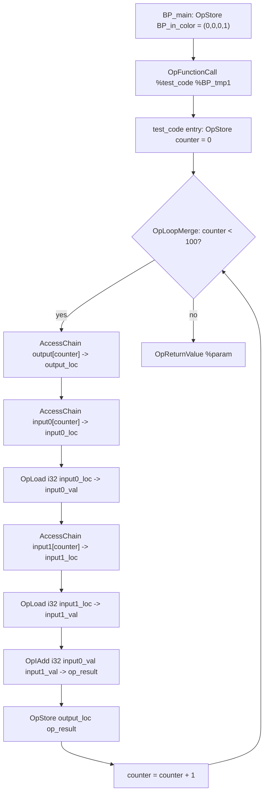

## Overview

**Core question:** Does the implementation correctly execute SPIR-V integer type operations (arithmetic, GLSL.std.450 extended math, shifts, bitwise, comparisons, bit-field, and constant/initializer forms) across 8/16/32/64-bit signed and unsigned integers, in scalar and vector widths up to 12 components, when the shader text is authored directly as SPIR-V assembly and run under both compute and graphics stages?

- Source file: [`vktSpvAsmTypeTests.cpp#L1`](../../../modules/vulkan/spirv_assembly/vktSpvAsmTypeTests.cpp#L1), a hybrid implementation-plus-registration file. It defines the `spirv_assembly.type` test family inline through a templated `SpvAsmTypeTests<T>` framework and registers every test case leaf from operation macros.
- Test category: `spirv_assembly`. Test family (page scope): `type`, an aggregator with seven vector-width intermediate nodes (`scalar`, `vec1`, `vec2`, `vec3`, `vec4`, `vec8`, `vec12`), each containing eight type subgroups (`i8`/`i16`/`i32`/`i64`/`u8`/`u16`/`u32`/`u64`).
- Core test idea: each case authors a SPIR-V compute or graphics module from C++ string-template fragments, binds host-supplied input/output storage buffers, dispatches or draws, and verifies the device-written output against a host-computed expected buffer. The `SpvAsmTypeTests<T>` template fixes the buffer layout, the loop-over-elements shape for compute variants, and the verification callback; per-case variation concentrates in the SPIR-V instruction under test.
- What to expect from the page: the registration tree and the vector-width split; the parameter matrix (signedness, bit width, vector size, input range, input width, filter, stage, operation family); the shared compute-shell pattern via one representative walkthrough (`scalar.i32.add_comp`); the operation-family behavioral axis and its failure mapping; and the pruning rules for non-VulkanSC widths, feature gates, and the `VK_KHR_maintenance9` bit-field requirement.

## Background Knowledge

- `OpTypeInt` width and signedness pair. `OpTypeInt <width> <signedness>` defines an integer type by bit width and a 1-bit signedness flag. The type tests instantiate eight combinations (`i8`, `u8`, `i16`, `u16`, `i32`, `u32`, `i64`, `u64`), each as a separate `SpvAsmTypeTests<T>` specialization where `T` is the host C++ integer type used to compute expected values. Width implies a Vulkan feature gate (`shaderInt8`/`shaderInt16`/`shaderInt64`) plus a matching 8/16-bit storage feature, and a SPIR-V capability (`Int8`/`Int16`/`Int64` plus `UniformAndStorageBuffer8BitAccess`/`UniformAndStorageBuffer16BitAccess`) because inputs and outputs live in storage buffers.
- Vector widths beyond 4 and `SPV_EXT_long_vector`. Standard `OpTypeVector %scalar N` accepts `N` in 2..4. The `SPV_EXT_long_vector` extension adds `OpTypeVectorIdEXT` and the `LongVectorEXT` capability to allow `N` of 1 or `N > 4`. The type tests route `vec1` and `vec12` through `OpTypeVectorIdEXT`; `vec8` uses standard `OpTypeVector` but still declares the extension. `vec1`, `vec8`, and `vec12` are non-VulkanSC only.
- Result-type shape per operation family. Most arithmetic, bitwise, shift, and bit-field operations return the same integer type as the inputs. Comparison operations (`OpIEqual`, `OpUGreaterThan`, etc.) return a boolean scalar or vector; the shader converts booleans to integer 0/1 via `OpSelect` and narrows back to the test type via `OpBitcast` (32-bit) or `OpSConvert` (non-32-bit). Several registration macros also create 16-bit `_test_high_part_zero` variants: they zero-extend the operation result to 32 bits, shift right by 16, and narrow back, checking the zero-extension post-processing path.
- Vec3 padding rule. A three-component vector with component size N has base alignment 4N in std140/std430 layout. The type tests inject a zero padding entry after every three real entries when `m_vectorSize == 3` and skip those padding slots at verification time with `skip = 4`. This is the only vector width that requires padding.

## Registration Hierarchy

```text
spirv_assembly.type
├── scalar
├── vec1 (non-VulkanSC only)
├── vec2
├── vec3
├── vec4
├── vec8 (non-VulkanSC only)
└── vec12 (non-VulkanSC only)
```

Each vector-width intermediate node contains eight type subgroups (`i8`/`i16`/`i32`/`i64`/`u8`/`u16`/`u32`/`u64`), and each type subgroup contains one test case leaf per `(operation, stage)` pair, where `stage` is one of `_comp`, `_vert`, `_tessc`, `_tesse`, `_geom`, `_frag`. The aggregator root is built by [`createTypeTests()`](../../../modules/vulkan/spirv_assembly/vktSpvAsmTypeTests.cpp#L4278-L4456), which assembles the vector-width containers, attaches the eight type subgroups, and runs the operation macros that populate each subgroup.

## Parameter Dimensions and Observed Values

| Dimension | Registered values | Meaning in this test | Evidence |
|-----------|-------------------|----------------------|----------|
| Signedness | signed (`i*`), unsigned (`u*`) | Selects the SPIR-V signedness flag in `OpTypeInt` and chooses signed versus unsigned op variants (`OpSDiv`/`OpUDiv`, `OpSMod`/`OpUMod`, `OpSGreaterThan`/`OpUGreaterThan`, `GLSLstd450SMin`/`GLSLstd450UMin`, etc.) | [`createTypeTests()`](../../../modules/vulkan/spirv_assembly/vktSpvAsmTypeTests.cpp#L4430-L4453) |
| Bit width | 8, 16, 32, 64 | Selects the `OpTypeInt` width and the implied feature/capability gate. 32-bit is the baseline (no extra feature); 8/16/64-bit require `shaderInt8`/`shaderInt16`/`shaderInt64` plus 8/16-bit storage access | [`SpvAsmTypeInt8Tests`...`SpvAsmTypeUint64Tests`](../../../modules/vulkan/spirv_assembly/vktSpvAsmTypeTests.cpp#L2896-L3220) |
| Vector size | `scalar`, `vec1`, `vec2`, `vec3`, `vec4`, `vec8`, `vec12` | Selects `OpTypeVector` versus `OpTypeVectorIdEXT` and the vec3 padding rule. `vec1`/`vec8`/`vec12` are non-VulkanSC only | [VecSize enum](../../../modules/vulkan/spirv_assembly/vktSpvAsmTypeTests.cpp#L85-L109), [OpTypeVectorIdEXT routing](../../../modules/vulkan/spirv_assembly/vktSpvAsmTypeTests.cpp#L1886-L1916) |
| Operation family | arithmetic, mul-div combined, shift, bitwise logical, comparison, bit-field, constant/initializer | The primary behavioral axis. Each family exercises a different SPIR-V instruction category with its own result-type handling, filter rules, and failure semantics | [Operation macros](../../../modules/vulkan/spirv_assembly/vktSpvAsmTypeTests.cpp#L4042-L4276) |
| Input range | `RANGE_FULL`, `RANGE_BIT_WIDTH`, `RANGE_BIT_WIDTH_SUM` | `RANGE_FULL` passes operands unchanged; `RANGE_BIT_WIDTH` masks the second operand to the type's bit width (shift count); `RANGE_BIT_WIDTH_SUM` clamps offset+count to the bit width (bit-field) | [`combine()` binary overload](../../../modules/vulkan/spirv_assembly/vktSpvAsmTypeTests.cpp#L1339-L1422) |
| Input width | `WIDTH_DEFAULT`, `_shift8`/`_shift16`/`_shift32`/`_shift64`, `_offset{8,16,32,64}_count{8,16,32,64}` | Selects `OpSConvert` between the test type width and the shift-count or bit-field offset/count operand width. Exercises cross-width conversion | [`getOtherSizeTypes()`](../../../modules/vulkan/spirv_assembly/vktSpvAsmTypeTests.cpp#L944-L975) |
| Filter | `FILTER_NONE`, `FILTER_ZERO`, `FILTER_SIGNED_DIV`, `FILTER_NEGATIVES_AND_ZERO`, `FILTER_MIN_GT_MAX` | Excludes division by zero, signed division overflow, negative/zero divisor cases, and invalid clamp bounds so the host expected buffer matches defined SPIR-V semantics | [Filter functions](../../../modules/vulkan/spirv_assembly/vktSpvAsmTypeTests.cpp#L2822-L2855) |
| Stage | `_comp`, `_vert`, `_tessc`, `_tesse`, `_geom`, `_frag` | Selects the shader stage that runs the assembled SPIR-V. Compute uses `SpvAsmComputeShaderCase`; graphics use the per-stage templates | [`createTestsForAllStages()`](../../../modules/vulkan/spirv_assembly/vktSpvAsmGraphicsShaderTestUtil.cpp#L4902-L4928) |

## Behavior Parameters

The primary behavioral axis is the operation family (behavioral group). Each family exercises a different SPIR-V instruction category with its own result-type handling, filter rules, and failure semantics. Type and vector size are secondary configuration axes: they scale the same operation across widths and component counts but do not change what is being tested.

### `arithmetic`: integer arithmetic and GLSL.std.450 extended math

Covers `negate` (`OpSNegate`), `add` (`OpIAdd`), `sub` (`OpISub`), `mul` (`OpIMul`), `div` (`OpSDiv`/`OpUDiv`), `rem` (`OpSRem`), `mod` (`OpSMod`/`OpUMod`), `abs` (`GLSLstd450SAbs`), `sign` (`GLSLstd450SSign`), `min` (`GLSLstd450SMin`/`GLSLstd450UMin`), `max` (`GLSLstd450SMax`/`GLSLstd450UMax`), and `clamp` (`GLSLstd450SClamp`/`GLSLstd450UClamp`). The `abs`/`sign`/`min`/`max`/`clamp`/`find_lsb`/`find_msb` ops go through `OpExtInst` against the imported `GLSL.std.450` extended instruction set rather than raw SPIR-V ops. The `rem`/`div`/`mod` ops apply signed-division filters to exclude undefined cases.

### `mul-div combined`: multiply then divide

`mul_sdiv` chains `OpIMul` then `OpSDiv`; `mul_udiv` chains `OpIMul` then `OpUDiv`. The chain exercises intermediate width handling and signed/unsigned division selection on the product of two operands.

### `shift`: logical and arithmetic shifts

`shift_right_logical` (`OpShiftRightLogical`), `shift_right_arithmetic` (`OpShiftRightArithmetic`), and `shift_left_logical` (`OpShiftLeftLogical`), each with four width postfixes (`_shift8`/`_shift16`/`_shift32`/`_shift64`) that drive `OpSConvert` of the shift-count operand. The host masks the shift count to `m_typeSize - 1` via `RANGE_BIT_WIDTH`. The 16-bit shift registrations additionally include a `<op>_test_high_part_zero` variant that zero-extends the operation result, shifts it right by 16, and converts it back.

### `bitwise logical`: bitwise ops

`bitwise_or` (`OpBitwiseOr`), `bitwise_xor` (`OpBitwiseXor`), `bitwise_and` (`OpBitwiseAnd`), and `not` (`OpNot`). These ops are signness-agnostic at the bit level; the test still iterates both signedness variants to confirm the result type matches.

### `comparison`: integer comparisons with boolean result

`iequal` (`OpIEqual`), `inotequal` (`OpINotEqual`), `ugreaterthan`/`sgreaterthan` (`OpUGreaterThan`/`OpSGreaterThan`), `ugreaterthanequal`/`sgreaterthanequal`, `ulessthan`/`slessthan`, `ulessthanequal`/`slessthanequal`. The result is a boolean scalar or vector; the shader converts it to integer 0/1 via `OpSelect` and narrows back to the test type via `OpBitcast` (32-bit) or `OpSConvert` (non-32-bit). The signed versus unsigned opcode selection is the central correctness question.

### `bit-field`: bit-field insert/extract/reverse/count

`bit_field_insert` (`OpBitFieldInsert`), `bit_field_s_extract` (`OpBitFieldSExtract`), `bit_field_u_extract` (`OpBitFieldUExtract`), `bit_reverse` (`OpBitReverse`), `bit_count` (`OpBitCount`). The insert/extract ops register 16 width combinations per type per vector size (`_offset{8,16,32,64}_count{8,16,32,64}`); `bit_reverse` and `bit_count` take no width postfix. Non-32-bit bit-field operations require `VK_KHR_maintenance9` because SPIR-V restricts `OpBitField*` operands to 32-bit unless that extension is enabled.

### `constant/initializer`: constant and initializer forms

`constant` (`OpConstant`), `constant_composite` (`OpConstantComposite`), `constant_null` (`OpConstantNull`), `variable_initializer` (`OpVariable` with initializer), `spec_constant_initializer` (`OpSpecConstant`), `spec_constant_composite_initializer` (`OpSpecConstantComposite`). These verify literal value assembly, composite constituent ordering, initializers, and specialization-constant wiring from the host.

## Shader Analysis

Every type-test case shares a near-identical compute shell built from the [`computeShaderTemplate`](../../../modules/vulkan/spirv_assembly/vktSpvAsmTypeTests.cpp#L1705-L1736) and the shared `SPIRV_ASSEMBLY_TYPES`/`SPIRV_ASSEMBLY_CONSTANTS`/`SPIRV_ASSEMBLY_ARRAYS` macros ([`vktSpvAsmUtils.hpp#L45-L126`](../../../modules/vulkan/spirv_assembly/vktSpvAsmUtils.hpp#L45-L126)): `OpCapability Shader`, `Logical GLSL450` memory model, `GLCompute` entry point `%BP_main`, `LocalSize 1 1 1` execution mode, the legacy `Uniform` storage class with `BufferBlock` decoration for the SSBOs (the SPIR-V 1.0 storage-buffer encoding, equivalent to `VK_DESCRIPTOR_TYPE_STORAGE_BUFFER`), and a `test_code` function that loops over the input buffers element-by-element via `OpLoopMerge`/`OpBranchConditional`, applies the SPIR-V op under test, and writes the result to the output SSBO. Per-case variation lives in the `${testfun}` operation line and the `${decoration}`/`${pre_main}` slots that declare the input SSBOs.

The `scalar.i32.add_comp` case is the representative walkthrough because it is the simplest case that shows the full compute template shape: 32-bit signed integer (no extra feature/capability), scalar width (no vector type, no padding), binary `OpIAdd` (two input SSBOs, one output SSBO), and the default `verifyDefaultResult` comparison. A brief contrast with the comparison and bit-field families follows the walkthrough; those families add the `OpSelect`/`OpBitcast` boolean conversion or the `OpSConvert` offset/count width conversion via [`finalizeFullOperation()`](../../../modules/vulkan/spirv_assembly/vktSpvAsmTypeTests.cpp#L2753-L2796), but the shell is identical.

### Representative Shader Walkthrough 1: `spirv_assembly.type.scalar.i32.add_comp`

#### Parameter Values Chosen

Representative path:

```text
spirv_assembly.type.scalar.i32.add_comp
```

| Parameter choice | Meaning in this representative case |
|------------------|-------------------------------------|
| Vector-width node `scalar` | No `OpTypeVector`; test type is `%i32` directly; no vec3 padding |
| Type subgroup `i32` | `OpTypeInt 32 1`; no extra feature/capability (32-bit is the baseline) |
| Operation `add` | Binary `OpIAdd`; two input SSBOs at bindings 0 and 1, output at binding 2 |
| Stage `_comp` | Compute dispatch through `SpvAsmComputeShaderCase` with `LocalSize 1 1 1` |
| Input range `RANGE_FULL` | Operands passed unchanged (no shift masking) |
| Filter `FILTER_NONE` | All 10x10 = 100 operand pairs are legal for `OpIAdd` |

#### Purpose

Verify that `OpIAdd` on 32-bit signed integers produces the exact two's-complement sum for every operand pair in the dataset, including `INT32_MIN+1`, `INT32_MAX`, and random values. The host computes the expected buffer with the C++ `+` operator on `int32_t`; the device writes its `OpIAdd` results to the output SSBO; the host compares element-by-element with exact equality.

#### Resources and Bindings

| Resource | Type | Storage class | Decoration | Role |
|----------|------|---------------|------------|------|
| `%input0` | `%bufptr` (`%buf` = struct of fixed-size `%a100testtype` `%i32` array) | `Uniform` | `DescriptorSet 0`, `Binding 0`, `BufferBlock` | First operand stream (100 `int32` values, one for each operand pair) |
| `%input1` | `%bufptr` | `Uniform` | `DescriptorSet 0`, `Binding 1`, `BufferBlock` | Second operand stream (100 `int32` values, one for each operand pair) |
| `%output` | `%bufptr` | `Uniform` | `DescriptorSet 0`, `Binding 2`, `BufferBlock` | Output stream; holds 100 `OpIAdd` results, read back by host |
| `%counter` | `%fp_i32` | `Function` | none | Loop counter, ranges `0..99` |
| `%op_constant` | `%fp_i32` | `Function` | none | Function-local slot reserved by the template for ops that need a constant operand; unused by `OpIAdd` |
| `%param` / `%BP_in_color` / `%BP_out_color` | `%v4f32` / `%fp_v4f32` | Function | none | Plumbing for the `BP_main` → `test_code` call; the color value is irrelevant to verification |

[`SpvAsmTypeInt32Tests::getDataset()`](../../../modules/vulkan/spirv_assembly/vktSpvAsmTypeTests.cpp#L3007-L3024) first produces a 10-element `int32` dataset (seeded with `0`, `INT32_MIN+1`, `INT32_MAX`, three switch cases, and four random values). [`combine()`](../../../modules/vulkan/spirv_assembly/vktSpvAsmTypeTests.cpp#L1339-L1422) then expands every pair into 100-element `%input0`, `%input1`, and expected-output streams by applying the host `add()` function. The `BufferBlock` decoration on `%buf` is the legacy SPIR-V 1.0 storage-buffer encoding; it maps to `VK_DESCRIPTOR_TYPE_STORAGE_BUFFER` at the Vulkan level.

#### Structural Design



#### Walkthrough

The entry point `%BP_main` runs once for the single invocation in the `1x1x1` dispatch. It stores the constant color `(0, 0, 0, 1)` into `%BP_in_color`, calls `%test_code` with that color as the parameter, and stores the return value into `%BP_out_color`. The color value is plumbing; verification reads the output SSBO, not the color.

`%test_code` is where the tested operation lives:

- `%counter` is initialized to `0` and the loop begins at `%loop`.
- `%counter_val = OpLoad %i32 %counter` reads the current loop index.
- `%lt = OpSLessThan %bool %counter_val %c_i32_100` checks `counter < 100`.
- `OpLoopMerge %exit %inc None` / `OpBranchConditional %lt %write %exit` either enters the `%write` block or exits the loop.
- In `%write`: `%output_loc = OpAccessChain %up_testtype %output %c_i32_0 %counter_val` computes a pointer to `output[counter]`; the same pattern computes `%input0_loc` and `%input1_loc`.
- `%input0_val = OpLoad %i32 %input0_loc` and `%input1_val = OpLoad %i32 %input1_loc` load the two operands.
- `%op_result = OpIAdd %i32 %input0_val %input1_val` is the instruction under test.
- `OpStore %output_loc %op_result` writes the sum to the output SSBO.
- `%inc` increments `%counter` by 1 and branches back to `%loop`.
- After 100 iterations, `%exit` returns `%param` (the unused color) to `BP_main`.

Because `compute 1 1 1` dispatches a single invocation, the loop runs 100 times in that one invocation, writing all 100 `OpIAdd` results sequentially to the output SSBO. The host reads back the output SSBO and compares it element-by-element against the host-computed expected buffer via [`verifyDefaultResult()`](../../../modules/vulkan/spirv_assembly/vktSpvAsmTypeTests.cpp#L2030-L2076).

#### Source Code

The SPIR-V assembly below is extracted from the C++ string-template concatenation in [`createStageTests()`](../../../modules/vulkan/spirv_assembly/vktSpvAsmTypeTests.cpp#L1687-L2004). The shared preamble types/constants/arrays come from the `SPIRV_ASSEMBLY_TYPES`/`SPIRV_ASSEMBLY_CONSTANTS`/`SPIRV_ASSEMBLY_ARRAYS` macros; wiki-authored section markers use `;` comment syntax. The assembly targets SPIR-V 1.0 (the `BufferBlock` decoration is deprecated in SPIR-V 1.4+, confirming the runtime target is 1.0).

<details>
<summary>SPIR-V assembly for <code>spirv_assembly.type.scalar.i32.add_comp</code></summary>

```llvm
; SPIR-V
; Version: 1.0
; Generator: Vulkan CTS SpvAsmTypeTests; 0
; Bound: 100
; Schema: 0
; --- capability / memory model / entry point (computeShaderTemplate header) ---
OpCapability Shader
OpMemoryModel Logical GLSL450
OpEntryPoint GLCompute %BP_main "main"
OpExecutionMode %BP_main LocalSize 1 1 1
; --- decorations (createInputDecoration x2, then output decoration) ---
OpDecorate %input0 DescriptorSet 0
OpDecorate %input0 Binding 0
OpDecorate %input1 DescriptorSet 0
OpDecorate %input1 Binding 1
OpDecorate %output DescriptorSet 0
OpDecorate %output Binding 2
OpDecorate %a100testtype ArrayStride 4
OpDecorate %buf BufferBlock
OpMemberDecorate %buf 0 Offset 0
; --- common types (SPIRV_ASSEMBLY_TYPES) ---
%void = OpTypeVoid
%bool = OpTypeBool
%i32 = OpTypeInt 32 1
%u32 = OpTypeInt 32 0
%f32 = OpTypeFloat 32
%v2i32 = OpTypeVector %i32 2
%v2u32 = OpTypeVector %u32 2
%v2f32 = OpTypeVector %f32 2
%v3i32 = OpTypeVector %i32 3
%v3u32 = OpTypeVector %u32 3
%v3f32 = OpTypeVector %f32 3
%v4i32 = OpTypeVector %i32 4
%v4u32 = OpTypeVector %u32 4
%v4f32 = OpTypeVector %f32 4
%v4bool = OpTypeVector %bool 4
%v4f32_v4f32_function = OpTypeFunction %v4f32 %v4f32
%bool_function = OpTypeFunction %bool
%voidf = OpTypeFunction %void
%ip_f32 = OpTypePointer Input %f32
%ip_i32 = OpTypePointer Input %i32
%ip_u32 = OpTypePointer Input %u32
%ip_v2f32 = OpTypePointer Input %v2f32
%ip_v2i32 = OpTypePointer Input %v2i32
%ip_v2u32 = OpTypePointer Input %v2u32
%ip_v3f32 = OpTypePointer Input %v3f32
%ip_v4f32 = OpTypePointer Input %v4f32
%ip_v4i32 = OpTypePointer Input %v4i32
%ip_v4u32 = OpTypePointer Input %v4u32
%op_f32 = OpTypePointer Output %f32
%op_i32 = OpTypePointer Output %i32
%op_u32 = OpTypePointer Output %u32
%op_v2f32 = OpTypePointer Output %v2f32
%op_v2i32 = OpTypePointer Output %v2i32
%op_v2u32 = OpTypePointer Output %v2u32
%op_v4f32 = OpTypePointer Output %v4f32
%op_v4i32 = OpTypePointer Output %v4i32
%op_v4u32 = OpTypePointer Output %v4u32
%fp_f32   = OpTypePointer Function %f32
%fp_i32   = OpTypePointer Function %i32
%fp_v4f32 = OpTypePointer Function %v4f32
; --- common constants (SPIRV_ASSEMBLY_CONSTANTS) ---
%c_f32_1 = OpConstant %f32 1.0
%c_f32_0 = OpConstant %f32 0.0
%c_f32_0_5 = OpConstant %f32 0.5
%c_f32_n1  = OpConstant %f32 -1.
%c_f32_7 = OpConstant %f32 7.0
%c_f32_8 = OpConstant %f32 8.0
%c_i32_0 = OpConstant %i32 0
%c_i32_1 = OpConstant %i32 1
%c_i32_2 = OpConstant %i32 2
%c_i32_3 = OpConstant %i32 3
%c_i32_4 = OpConstant %i32 4
%c_u32_0 = OpConstant %u32 0
%c_u32_1 = OpConstant %u32 1
%c_u32_2 = OpConstant %u32 2
%c_u32_3 = OpConstant %u32 3
%c_u32_32 = OpConstant %u32 32
%c_u32_4 = OpConstant %u32 4
%c_u32_31_bits = OpConstant %u32 0x7FFFFFFF
%c_v4f32_1_1_1_1 = OpConstantComposite %v4f32 %c_f32_1 %c_f32_1 %c_f32_1 %c_f32_1
%c_v4f32_1_0_0_1 = OpConstantComposite %v4f32 %c_f32_1 %c_f32_0 %c_f32_0 %c_f32_1
%c_v4f32_0_5_0_5_0_5_0_5 = OpConstantComposite %v4f32 %c_f32_0_5 %c_f32_0_5 %c_f32_0_5 %c_f32_0_5
; --- common arrays (SPIRV_ASSEMBLY_ARRAYS) ---
%a1f32 = OpTypeArray %f32 %c_u32_1
%a2f32 = OpTypeArray %f32 %c_u32_2
%a3v4f32 = OpTypeArray %v4f32 %c_u32_3
%a4f32 = OpTypeArray %f32 %c_u32_4
%a32v4f32 = OpTypeArray %v4f32 %c_u32_32
%ip_a3v4f32 = OpTypePointer Input %a3v4f32
%ip_a32v4f32 = OpTypePointer Input %a32v4f32
%op_a2f32 = OpTypePointer Output %a2f32
%op_a3v4f32 = OpTypePointer Output %a3v4f32
%op_a4f32 = OpTypePointer Output %a4f32
; --- BP_color constant ---
%BP_color = OpConstantComposite %v4f32 %c_f32_0 %c_f32_0 %c_f32_0 %c_f32_1
; --- pre_main: pre_pre_main (num_elements constants) ---
%c_u32_100 = OpConstant %u32 100
%c_i32_100 = OpConstant %i32 100
; --- pre_main: pre_main_consts (scalar path) ---
%c_shift  = OpConstant %u32 16
%c_zero = OpConstant %u32 0
%c_one = OpConstant %u32 1
; --- pre_main: post_pre_main (test type array, buf, output variable) ---
%a100testtype = OpTypeArray %i32 %c_u32_100
%up_testtype = OpTypePointer Uniform %i32
%buf = OpTypeStruct %a100testtype
%bufptr = OpTypePointer Uniform %buf
%output = OpVariable %bufptr Uniform
; --- pre_main: createInputPreMain(0), createInputPreMain(1) ---
%input0 = OpVariable %bufptr Uniform
%input1 = OpVariable %bufptr Uniform
; --- BP_main function (compute shader entry point) ---
%BP_main = OpFunction %void None %voidf
%BP_label_main = OpLabel
%BP_in_color = OpVariable %fp_v4f32 Function
%BP_out_color = OpVariable %fp_v4f32 Function
OpStore %BP_in_color %BP_color
%BP_tmp1 = OpLoad %v4f32 %BP_in_color
%BP_tmp2 = OpFunctionCall %v4f32 %test_code %BP_tmp1
OpStore %BP_out_color %BP_tmp2
OpReturn
OpFunctionEnd
; --- testfun: pre_testfun (function header + loop prologue) ---
%test_code = OpFunction %v4f32 None %v4f32_v4f32_function
%param = OpFunctionParameter %v4f32
%entry = OpLabel
%op_constant = OpVariable %fp_i32 Function
%counter = OpVariable %fp_i32 Function
OpStore %counter %c_i32_0
OpBranch %loop
%loop = OpLabel
%counter_val = OpLoad %i32 %counter
%lt = OpSLessThan %bool %counter_val %c_i32_100
OpLoopMerge %exit %inc None
OpBranchConditional %lt %write %exit
%write = OpLabel
%output_loc = OpAccessChain %up_testtype %output %c_i32_0 %counter_val
; --- testfun: createInputTestfun(0), createInputTestfun(1) ---
%input0_loc = OpAccessChain %up_testtype %input0 %c_i32_0 %counter_val
%input0_val = OpLoad %i32 %input0_loc
%input1_loc = OpAccessChain %up_testtype %input1 %c_i32_0 %counter_val
%input1_val = OpLoad %i32 %input1_loc
; --- testfun: operation (OpIAdd, binary, WIDTH_DEFAULT, no extension) ---
%op_result = OpIAdd %i32 %input0_val %input1_val
; --- testfun: post_testfun (store result, loop increment, exit) ---
OpStore %output_loc %op_result
OpBranch %inc
%inc = OpLabel
%counter_val_next = OpIAdd %i32 %counter_val %c_i32_1
OpStore %counter %counter_val_next
OpBranch %loop
%exit = OpLabel
OpReturnValue %param
OpFunctionEnd
```

</details>

#### Contrast with comparison and bit-field families

The shell above is shared by every operation family; only the `${testfun}` operation line and the [`finalizeFullOperation()`](../../../modules/vulkan/spirv_assembly/vktSpvAsmTypeTests.cpp#L2753-L2796) trailer differ. For a comparison case such as `iequal_comp`, the operation line becomes `%op_result_pre = OpIEqual %bool %input0_val %input1_val`, and `finalizeFullOperation()` appends `%op_result_u32 = OpSelect %u32 %op_result_pre %c_one %c_zero` followed by `%op_result = OpBitcast %i32 %op_result_u32` (for `i32`) or `%op_result = OpSConvert %i32 %op_result_u32` (for non-32-bit types). For a 16-bit multiply `_test_high_part_zero` variant, `finalizeFullOperation()` appends `%op_result_a = OpUConvert %vu32 %op_result_pre`, `%op_result_b = OpShiftRightLogical %vu32 %op_result_a %c_shift`, and `%op_result = OpSConvert %i16 %op_result_b`. For a bit-field case with non-default input width, the offset/count operands are loaded through a separate scalar SSBO and converted via `OpSConvert` to the test type width before the `OpBitField*` op. None of these change the BP_main shell, the loop structure, or the output SSBO layout.

## Runtime Execution and Result Checking

The host-side flow is shared across every type-test case:

- `getDataset()` populates a 10-element input dataset (per type) seeded with `0`, the type's `INT_MIN+1`, the type's `INT_MAX`, three switch cases, and random values.
- `combine()` generates the input0/input1/.../inputsN and output buffers by applying the host C++ equivalent of the SPIR-V operation to every (filtered) operand tuple. For binary ops this is a 10x10 = 100-element triple; for ternary ops it is 10x10x10 (reduced for `RANGE_BIT_WIDTH_SUM`); for quaternary ops it is 10x10x10x10. Vec3 injects a zero padding entry after every three real entries.
- The host creates one `VK_DESCRIPTOR_TYPE_STORAGE_BUFFER` per input and per output, fills the inputs from the generated buffers, zeroes the outputs, and binds them as descriptor set 0 (inputs at bindings `0..N-1`, output at the last binding).
- The host builds a shader module from the concatenated SPIR-V assembly text, records `vkCmdBindPipeline` + `vkCmdBindDescriptorSets` + `vkCmdDispatch 1 1 1`, and submits.
- The device runs `%BP_main`, which calls `%test_code`; `%test_code` loops over the input buffers element-by-element, applies the SPIR-V op, and writes the result to the output SSBO.
- The host reads back the output SSBO and compares it element-by-element against the expected buffer via `verifyResult()` ([source](../../../modules/vulkan/spirv_assembly/vktSpvAsmTypeTests.cpp#L2030-L2076)). For `vec3`, `verifyVec3Result()` skips every 4th element as padding. The check is exact equality (no epsilon). Mismatch logs the `(inputs)` triple, `expected`, and `obtained` for the first failing element.
- Each case is checked independently; results are not aggregated across cases.
- For the scalar-only switch tests, the host checks a single `int32` flag in the binding-2 SSBO equals 1 via `verifyComputeSwitchResult()` instead of comparing the output buffer.

Graphics-stage variants (`_vert`/`_tessc`/`_tesse`/`_geom`/`_frag`) replace the compute dispatch with a draw through [`createTestsForAllStages()`](../../../modules/vulkan/spirv_assembly/vktSpvAsmGraphicsShaderTestUtil.cpp#L4902-L4928). Their runner verifies the stage's rendered output and then invokes the same `resources.verifyIO` callback to compare the output SSBO; the SPIR-V `test_code` body is the same.

## Failure Meaning

### Failure Cause Mapping

| If this behavior parameter value fails | Possible failure cause(s) |
|----------------------------------------|---------------------------|
| Arithmetic (`negate`, `add`, `sub`, `mul`, `div`, `rem`, `mod`, `abs`, `sign`, `min`, `max`, `clamp`) | Wrong result for the SPIR-V integer op or its GLSL.std.450 extended form; width-specific storage buffer load/store mismatch; INT_MIN / divide-by-zero / signed-overflow edge case mishandled despite the host filter |
| Mul-div combined (`mul_sdiv`, `mul_udiv`) | `OpIMul` → `OpSDiv`/`OpUDiv` chain lowered incorrectly; intermediate width handling wrong; signed vs unsigned division selected wrong |
| Shift (`shift_right_logical`, `shift_right_arithmetic`, `shift_left_logical`, with `_shift8`/`_shift16`/`_shift32`/`_shift64` postfix) | Wrong shift semantics (logical vs arithmetic right shift); shift count not masked to bit width; cross-width `OpSConvert` of the shift operand wrong; `_test_high_part_zero` 16-bit high-part extraction wrong |
| Bitwise logical (`bitwise_or`, `bitwise_xor`, `bitwise_and`, `not`) | Wrong bitwise op selection for the signedness; width-mismatched operand conversion (`OpSConvert`) wrong |
| Comparison (`iequal`, `inotequal`, `ugreaterthan`, `sgreaterthan`, `ugreaterthanequal`, `sgreaterthanequal`, `ulessthan`, `slessthan`, `ulessthanequal`, `slessthanequal`) | Signed vs unsigned comparison opcode selected wrong; boolean→integer `OpSelect` conversion wrong; `OpBitcast`/`OpSConvert` narrowing back to test type wrong; vector boolean result type wrong |
| Bit-field (`bit_field_insert`, `bit_field_s_extract`, `bit_field_u_extract`, `bit_reverse`, `bit_count`, with `_offset{8,16,32,64}_count{8,16,32,64}` postfix) | Offset/count width conversion (`OpSConvert`) wrong; bit-field insertion/extraction semantics wrong for the offset+count combination; `OpBitReverse`/`OpBitCount` lowering wrong; non-32-bit type requires `VK_KHR_maintenance9` and the device lacks it or miscompiles |
| Constant/initializer (`constant`, `constant_composite`, `constant_null`, `variable_initializer`, `spec_constant_initializer`, `spec_constant_composite_initializer`) | `OpConstant`/`OpConstantComposite`/`OpConstantNull` literal value or composite assembly wrong; `OpVariable` initializer not honored; specialization constant not wired from host; `OpSpecConstantComposite` constituent mismatch |

Shared infrastructure causes that affect every value:

- The compute/graphics stage wrapper (descriptor binding layout, `OpFunctionCall %test_code`, loop structure) is shared, so a wrapper-level bug would surface across multiple operation families and types simultaneously.
- The `verifyResult()` host comparison is shared; a buffer-stride or element-size mismatch in `pushResource()` (e.g. `Int8Buffer` vs `Int16Buffer` for `int16`) would mismatch every element of every operation in that type subgroup.

### Cause Analysis

#### Arithmetic instruction lowering

**Possible failure symptoms:** The output SSBO differs from the expected buffer at one or more element positions; `verifyDefaultResult()` logs the `(inputs)` triple, `expected`, and `obtained` for the first mismatch and returns `QP_TEST_RESULT_FAIL`.

**Possible implementation causes:** The SPIR-V integer op under test is miscompiled by the driver/backend. The failure pattern localizes the cause: a mismatch only on `INT32_MIN`/`INT32_MAX` operands points at signed-overflow or negation-of-MIN handling; a mismatch only on `div`/`rem`/`mod` points at signed division semantics (`OpSRem` sign follows the dividend, `OpSMod` sign follows the divisor); a mismatch on `abs`/`sign`/`min`/`max`/`clamp` points at the `GLSL.std.450` extended-instruction lowering. A width-specific mismatch (only `i8` or only `i64` fails) points at the width's storage-buffer load/store path or the `OpSConvert`/`OpUConvert` width conversion. The host filter excludes undefined cases (divide by zero, signed division overflow), so a mismatch on a filtered case would point at the filter being too lenient rather than at the op.

#### Mul-div chain lowering

**Possible failure symptoms:** `mul_sdiv` or `mul_udiv` mismatches the expected buffer; the mismatch appears only on the second step (the division) because the multiplication is well-defined for all operand pairs.

**Possible implementation causes:** The `OpIMul` → `OpSDiv`/`OpUDiv` chain is lowered incorrectly, or the backend selects the wrong signedness for the division. Because the product is computed in the same width as the operands (no widening), an implementation that widens the product internally and then narrows incorrectly would mismatch. Source-level investigation is needed if the mismatch pattern does not match a signedness-selection error.

#### Shift semantics and width conversion

**Possible failure symptoms:** A shift case mismatches; the mismatch appears only on a specific `_shiftN` postfix (e.g. only `_shift16` fails) or only on the `_test_high_part_zero` 16-bit variant.

**Possible implementation causes:** Logical versus arithmetic right shift selection is wrong (`OpShiftRightLogical` versus `OpShiftRightArithmetic`); the shift-count operand may be converted from a different width incorrectly; or the `_test_high_part_zero` post-processing (`OpUConvert` to 32-bit, `OpShiftRightLogical` by 16, then conversion back) is wrong. The high-part variants use a zero-valued host expected output and specifically expose an error in that extension-and-shift sequence.

#### Bitwise op selection

**Possible failure symptoms:** A bitwise logical case mismatches; the mismatch is consistent across all operand values for a given type.

**Possible implementation causes:** Bitwise ops are signness-agnostic at the bit level, so a mismatch points at the result type or the width conversion (`OpSConvert`) rather than at the bitwise op itself. A mismatch only on non-32-bit types points at the width conversion path.

#### Comparison boolean-result conversion

**Possible failure symptoms:** A comparison case mismatches; the output is `0` where `1` was expected (or vice versa), or the output is a non-`0`/`1` value.

**Possible implementation causes:** The signed versus unsigned comparison opcode was selected wrong (e.g. `OpSGreaterThan` emitted where `OpUGreaterThan` was intended, or vice versa); the `OpSelect %u32 %op_result_pre %c_one %c_zero` boolean-to-integer conversion is wrong; the `OpBitcast` (32-bit) or `OpSConvert` (non-32-bit) narrowing back to the test type is wrong; or the vector boolean result type (`%vNbool`) is wrong for the vector width. A mismatch only on signed types points at signed comparison opcode selection; a mismatch only on unsigned types points at unsigned comparison opcode selection.

#### Bit-field offset/count handling

**Possible failure symptoms:** A bit-field case mismatches; the mismatch appears only on specific `_offsetM_countN` postfixes, or the case fails to compile on a non-32-bit type.

**Possible implementation causes:** The `OpSConvert` of the offset or count operand from a different width is wrong; the `OpBitFieldInsert`/`OpBitFieldSExtract`/`OpBitFieldUExtract` semantics are wrong for the offset+count combination (e.g. count greater than the type width is not clamped to zero); or `OpBitReverse`/`OpBitCount` lowering is wrong. Non-32-bit bit-field operations require `VK_KHR_maintenance9` because SPIR-V restricts `OpBitField*` operands to 32-bit unless that extension is enabled; if the device lacks the extension, the case should be skipped rather than fail, but a failure here points at the driver advertising the extension but miscompiling the non-32-bit path.

#### Constant and initializer assembly

**Possible failure symptoms:** A constant/initializer case mismatches; the output buffer contains the wrong literal value, the wrong composite constituent ordering, or zero where a non-zero initializer was expected.

**Possible implementation causes:** The `OpConstant`/`OpConstantComposite`/`OpConstantNull` literal value or composite assembly is wrong in the shader text (a CTS-side bug); the `OpVariable` initializer is not honored by the device; the specialization constant is not wired from the host (`OpSpecConstant`/`OpSpecConstantComposite`); or the `OpSpecConstantComposite` constituent ordering is wrong. Because the assembly is CTS-authored, a mismatch here is more likely a driver-side initializer or specialization-constant handling bug than a CTS bug, but the assembly should be checked first.

#### Shared infrastructure mismatch

**Possible failure symptoms:** Every operation in a type subgroup mismatches at the same element positions, regardless of which op is under test.

**Possible implementation causes:** The compute/graphics stage wrapper (descriptor binding layout, `OpFunctionCall %test_code`, loop structure) is shared, so a wrapper-level bug surfaces across multiple operation families and types simultaneously. The `verifyResult()` host comparison is also shared; a buffer-stride or element-size mismatch in `pushResource()` (e.g. `Int8Buffer` used where `Int16Buffer` was needed) would mismatch every element of every operation in that type subgroup. A failure that crosses operation-family boundaries points at the shared infrastructure rather than at any single op.

## Case Pruning

### Requirement-based pruning

- `vec1`, `vec8`, and `vec12` are registered only when `CTS_USES_VULKANSC` is not defined. VulkanSC builds keep `scalar`, `vec2`, `vec3`, `vec4`. `vec1` and `vec12` go through `OpTypeVectorIdEXT` under `OpCapability LongVectorEXT` and `OpExtension "SPV_EXT_long_vector"`; `vec8` uses standard `OpTypeVector` but still declares the extension.
- 8-bit types require `shaderInt8` plus `uniformAndStorageBuffer8BitAccess` and declare `OpExtension "SPV_KHR_8bit_storage"` ([source](../../../modules/vulkan/spirv_assembly/vktSpvAsmTypeTests.cpp#L1853-L1862)).
- 16-bit types require `shaderInt16` plus `uniformAndStorageBuffer16BitAccess` and declare `OpExtension "SPV_KHR_16bit_storage"` ([source](../../../modules/vulkan/spirv_assembly/vktSpvAsmTypeTests.cpp#L1864-L1868)).
- 64-bit types require `shaderInt64` and declare `OpCapability Int64`.
- Graphics-stage type tests request `vertexPipelineStoresAndAtomics` and `fragmentStoresAndAtomics` because their shared stage harness writes results into an output SSBO. `createStageTests()` clears both requests on `computeResources` before registering the compute case, so they are not compute-case requirements ([source](../../../modules/vulkan/spirv_assembly/vktSpvAsmTypeTests.cpp#L1838-L1840), [`compute override`](../../../modules/vulkan/spirv_assembly/vktSpvAsmTypeTests.cpp#L1999-L2003)).
- Non-32-bit bit-field operations request `VK_KHR_maintenance9` through the per-case feature requirements when built outside VulkanSC; VulkanSC's compile-time macro path registers only 32-bit bit-field types. Unsupported devices are handled by the CTS support/feature machinery rather than by a prose-level registration exclusion.
- Shift and bit-field cases with non-default input width require `shaderInt16` or `shaderInt64` depending on the width postfix ([source](../../../modules/vulkan/spirv_assembly/vktSpvAsmTypeTests.cpp#L1844-L1851)).
- VulkanSC uses the reduced `MAKE_TEST_SV_*_3_W` macro path for bit-field operations (only `i32`/`u32`); non-VulkanSC uses the broader `MAKE_TEST_SV_*_8136_WN` set covering 8/16/32/64-bit types ([source](../../../modules/vulkan/spirv_assembly/vktSpvAsmTypeTests.cpp#L4379-L4413)).

### Design-based pruning

- The operation matrix is split across macro families (`MAKE_TEST_SV_I_8136`, `MAKE_TEST_SV_U_8136`, `MAKE_TEST_SV_I_8136_W`, `MAKE_TEST_SV_I_8136_WN`, etc.) so that 16-bit multiply/shift gets the extra `_test_high_part_zero` variant while other widths do not.
- The `rem`/`div`/`mod`/`clamp` ops apply signed-division or min/max filters to exclude operand combinations that are undefined in SPIR-V (divide by zero, signed division overflow, invalid clamp bounds). This is design pruning, not requirement pruning: the cases are legal but undefined, so the host filters them out to keep the expected buffer well-defined.
- The switch-test variant is registered only for scalar widths (no vector subgroups) because it uses a different compute template that writes a single `int32` flag to a binding-2 SSBO rather than scanning the output buffer ([source](../../../modules/vulkan/spirv_assembly/vktSpvAsmTypeTests.cpp#L2485-L2748)).
- The stage suffix (`_comp`/`_vert`/`_tessc`/`_tesse`/`_geom`/`_frag`) is a configuration axis, not a behavioral axis: it changes the shader infrastructure that runs the same `test_code` body, not what is being tested.

## Key Takeaways

- This page is a hybrid implementation-plus-registration aggregator: the `spirv_assembly.type` test family is implemented inline through the templated `SpvAsmTypeTests<T>` framework, and every test case leaf is registered from operation macros in [`vktSpvAsmTypeTests.cpp#L1`](../../../modules/vulkan/spirv_assembly/vktSpvAsmTypeTests.cpp#L1).
- The shared compute shell (`computeShaderTemplate` + the `SPIRV_ASSEMBLY_TYPES`/`CONSTANTS`/`ARRAYS` macros) fixes the descriptor layout, the `LocalSize 1 1 1` execution mode, the legacy `Uniform`+`BufferBlock` SSBO encoding (SPIR-V 1.0), and the loop-over-elements shape. Per-case variation concentrates in the single SPIR-V operation line and the `finalizeFullOperation()` trailer. The `scalar.i32.add_comp` walkthrough is the canonical example.
- The operation family is the primary behavioral axis. Comparison and 16-bit high-part-zero families add post-processing (`OpSelect`/`OpBitcast`/`OpSConvert`, or `OpUConvert`+shift+convert); bit-field and shift families add cross-width `OpSConvert` of the offset/count/shift operand; constant/initializer families exercise `OpConstant`/`OpSpecConstant` assembly.
- Verification is exact element-by-element equality between the device-written output SSBO and a host-computed expected buffer, with vec3 padding skipped. The host filters undefined operand combinations (divide by zero, signed overflow, invalid clamp bounds) so the expected buffer matches defined SPIR-V semantics.
- `vec1`/`vec8`/`vec12` are non-VulkanSC only and exercise `SPV_EXT_long_vector` (`OpTypeVectorIdEXT` for `vec1`/`vec12`, standard `OpTypeVector` for `vec8`). Non-32-bit bit-field operations require `VK_KHR_maintenance9`.
- See `## Failure Meaning` for the per-family failure analysis; the shared infrastructure (wrapper, `verifyResult()`, `pushResource()`) is the cross-cutting cause when failures span multiple operation families.

## Source Reference Appendix

| Entry point | Link | Why it matters |
|-------------|------|----------------|
| `SpvAsmTypeTests<T>` template class | [`vktSpvAsmTypeTests.cpp#L919-L1193`](../../../modules/vulkan/spirv_assembly/vktSpvAsmTypeTests.cpp#L919-L1193) | Owns the `createTests()`/`doCreateTests()` API, deferred-parameter init, and the host verification callbacks |
| `createStageTests()` (representative walkthrough source) | [`vktSpvAsmTypeTests.cpp#L1687-L2004`](../../../modules/vulkan/spirv_assembly/vktSpvAsmTypeTests.cpp#L1687-L2004) | Assembles the compute/graphics SPIR-V from the `computeShaderTemplate` and per-case fragments |
| Compute shader template | [`vktSpvAsmTypeTests.cpp#L1705-L1736`](../../../modules/vulkan/spirv_assembly/vktSpvAsmTypeTests.cpp#L1705-L1736) | The SPIR-V assembly text the type tests specialize per case |
| `combine()` binary overload | [`vktSpvAsmTypeTests.cpp#L1339-L1422`](../../../modules/vulkan/spirv_assembly/vktSpvAsmTypeTests.cpp#L1339-L1422) | Generates input0/input1/output triples with optional vec3 padding and `RANGE_BIT_WIDTH` shift masking |
| `verifyResult()` | [`vktSpvAsmTypeTests.cpp#L2030-L2076`](../../../modules/vulkan/spirv_assembly/vktSpvAsmTypeTests.cpp#L2030-L2076) | Element-by-element output comparison with vec3 padding skip |
| `finalizeFullOperation()` | [`vktSpvAsmTypeTests.cpp#L2753-L2796`](../../../modules/vulkan/spirv_assembly/vktSpvAsmTypeTests.cpp#L2753-L2796) | Appends boolean-result `OpSelect` conversion or `_test_high_part_zero` high-part extraction |
| `getSpirvCapabilityStr()` | [`vktSpvAsmTypeTests.cpp#L775-L813`](../../../modules/vulkan/spirv_assembly/vktSpvAsmTypeTests.cpp#L775-L813) | Emits `OpCapability Int8/Int16/Int64/LongVectorEXT` and storage-buffer 8/16-bit access capabilities |
| Operation macros (MAKE_TEST_*) | [`vktSpvAsmTypeTests.cpp#L4042-L4276`](../../../modules/vulkan/spirv_assembly/vktSpvAsmTypeTests.cpp#L4042-L4276) | Macro-expanded registration of every operation across types, vector sizes, and width postfixes |
| `createTypeTests()` | [`vktSpvAsmTypeTests.cpp#L4278-L4456`](../../../modules/vulkan/spirv_assembly/vktSpvAsmTypeTests.cpp#L4278-L4456) | Root registration: builds `scalar`/`vecN` containers and attaches the eight type subgroups |
| Switch tests | [`vktSpvAsmTypeTests.cpp#L2485-L2748`](../../../modules/vulkan/spirv_assembly/vktSpvAsmTypeTests.cpp#L2485-L2748) | Scalar-only `OpSwitch` variant with a different compute template and binding-2 flag SSBO |
| VecSize enum and `OpTypeVectorIdEXT` routing | [`vktSpvAsmTypeTests.cpp#L85-L109`](../../../modules/vulkan/spirv_assembly/vktSpvAsmTypeTests.cpp#L85-L109), [`vktSpvAsmTypeTests.cpp#L1886-L1916`](../../../modules/vulkan/spirv_assembly/vktSpvAsmTypeTests.cpp#L1886-L1916) | Decides whether to emit `OpTypeVector` or `OpTypeVectorIdEXT` for `vec1`/`vec8`/`vec12` |
| Per-type concrete classes | [`vktSpvAsmTypeTests.cpp#L2896-L3220`](../../../modules/vulkan/spirv_assembly/vktSpvAsmTypeTests.cpp#L2896-L3220) | `SpvAsmTypeInt8Tests` ... `SpvAsmTypeUint64Tests`; each sets the SPIR-V type string, capability, feature, and dataset |
| `SPIRV_ASSEMBLY_TYPES` / `CONSTANTS` / `ARRAYS` macros | [`vktSpvAsmUtils.hpp#L45-L126`](../../../modules/vulkan/spirv_assembly/vktSpvAsmUtils.hpp#L45-L126) | Shared SPIR-V preamble types and constants inlined into every type-test shader |
| `createTestsForAllStages()` | [`vktSpvAsmGraphicsShaderTestUtil.cpp#L4902-L4928`](../../../modules/vulkan/spirv_assembly/vktSpvAsmGraphicsShaderTestUtil.cpp#L4902-L4928) | Registers the `_vert`/`_tessc`/`_tesse`/`_geom`/`_frag` stage variants for each case |
