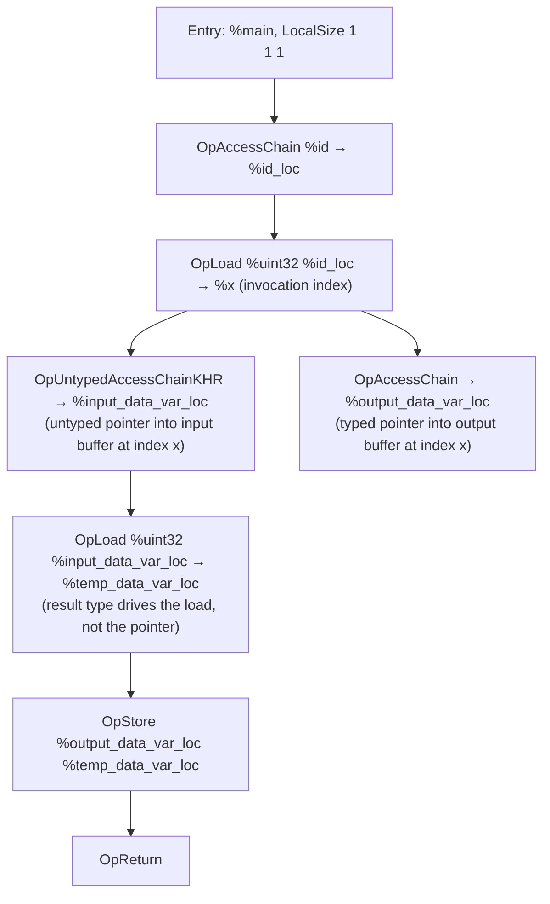

## Overview

**Core question:** does an implementation that advertises `VK_KHR_shader_untyped_pointers` correctly declare, access, load, store, copy, atomically update, type-pun, and pass through pointers whose pointee type is not encoded in the pointer itself?

The `untyped_pointers` test family in [`vktSpvAsmUntypedPointersTests.cpp`](../../../modules/vulkan/spirv_assembly/vktSpvAsmUntypedPointersTests.cpp) registers SPIR-V assembly compute cases for `SPV_KHR_untyped_pointers` / `VK_KHR_shader_untyped_pointers`. Its `vulkan_memory_model` and `glsl_memory_model` roots select `OpMemoryModel Logical Vulkan` (SPIR-V 1.3) and `OpMemoryModel Logical GLSL450` (SPIR-V 1.0) for their common families; physical-storage cases replace that logical model with the corresponding `PhysicalStorageBuffer64` model, and `cooperative_matrix` exists only in the Vulkan root ([registration root](../../../modules/vulkan/spirv_assembly/vktSpvAsmUntypedPointersTests.cpp#L12702-L12711)).

- The family centrally exercises `OpTypeUntypedPointerKHR`, `OpUntypedVariableKHR`, `OpUntypedAccessChainKHR`, and `OpUntypedArrayLengthKHR`; `SPV_KHR_untyped_pointers` also defines related untyped access-chain instructions.
- Seven interaction subgroups cover the basic load/store/copy/atomic/array-length/descriptor-array surface plus type punning, variable pointers, physical storage buffers, workgroup explicit layout, cooperative matrices, and block arrays.
- Every case is hand-authored SPIR-V assembly built from C++ `tcu::StringTemplate`s; there is no GLSL or HLSL source.

## Background Knowledge

- **`SPV_KHR_untyped_pointers` and its access instructions.** `OpTypeUntypedPointerKHR <StorageClass>` declares a pointer type that carries only a storage class, not a pointee type. `OpUntypedAccessChainKHR` supplies the type used to interpret addressing; `OpLoad` supplies its result type and `OpStore` supplies the stored object's type. `OpUntypedVariableKHR` declares a variable whose type is an untyped pointer, and `OpUntypedArrayLengthKHR` queries a runtime array length through such a pointer. The extension limits untyped pointers to storage classes with explicit layout, so interpretations have a consistent layout.
- **Memory model split.** This family creates `Logical Vulkan` cases with `VulkanMemoryModel`, `SPV_KHR_vulkan_memory_model`, and SPIR-V 1.3, and `Logical GLSL450` cases at SPIR-V 1.0. These are the two logical-model branches selected by its helper, not a claim that they are the only logical memory models generally; physical-storage cases deliberately replace either with `PhysicalStorageBuffer64 <Vulkan|GLSL450>`.
- **Type punning through untyped pointers.** Because an untyped pointer carries no pointee type, the same pointer can be loaded as one type and stored as a different type as long as the two types share the same byte size. This is the property most unique to untyped pointers; typed `OpTypePointer` makes punning illegal at the SPIR-V type level. The `type_punning` and `memory_interpretation` subgroups exercise this directly.

## Registration Hierarchy

```text
spirv_assembly.instruction.compute.untyped_pointers
├── vulkan_memory_model
└── glsl_memory_model
```

Both subtrees are implemented in the same source file. The `vulkan_memory_model` subtree registers `basic_usecase`, `type_punning`, `variable_pointers`, `physical_storage`, `workgroup_memory_explicit_layout`, `cooperative_matrix`, and `block_array`. The `glsl_memory_model` subtree registers the same set except `cooperative_matrix` ([Vulkan registration](../../../modules/vulkan/spirv_assembly/vktSpvAsmUntypedPointersTests.cpp#L12679-L12689), [GLSL registration](../../../modules/vulkan/spirv_assembly/vktSpvAsmUntypedPointersTests.cpp#L12691-L12700)).

## Parameter Dimensions and Observed Values

| Dimension | Registered values | Meaning in this test | Evidence |
|-----------|-------------------|----------------------|----------|
| Memory model | `VULKAN`, `GLSL` | Top-level split. Selects `OpMemoryModel Logical Vulkan` (SPIR-V 1.3) or `Logical GLSL450` (SPIR-V 1.0). The `cooperative_matrix` subgroup is registered only under `VULKAN`. | [enum](../../../modules/vulkan/spirv_assembly/vktSpvAsmUntypedPointersTests.cpp#L133-L139), [adjuster](../../../modules/vulkan/spirv_assembly/vktSpvAsmUntypedPointersTests.cpp#L1406-L1437) |
| Subgroup | `basic_usecase`, `type_punning`, `variable_pointers`, `physical_storage`, `workgroup_memory_explicit_layout`, `cooperative_matrix`, `block_array` | Primary behavioral axis. Each subgroup targets a distinct untyped-pointer property or interaction. | [Vulkan groups](../../../modules/vulkan/spirv_assembly/vktSpvAsmUntypedPointersTests.cpp#L12679-L12689) |
| Data type | `uint8`, `int8`, `uint16`, `int16`, `float16`, `uint32`, `int32`, `float32`, `uint64`, `int64`, `float64` | Scalar pointee type used by load/store/atomic/pun cases. Drives `OpCapability Int8/Int16/Int64/Float16/Float64` and the matching Vulkan feature bits. | [enum](../../../modules/vulkan/spirv_assembly/vktSpvAsmUntypedPointersTests.cpp#L59-L74), [cases](../../../modules/vulkan/spirv_assembly/vktSpvAsmUntypedPointersTests.cpp#L304-L315) |
| Composite data type | `vec2/vec3/vec4` of each scalar | Vector pointee forms used by type-punning and copy paths. | [enum](../../../modules/vulkan/spirv_assembly/vktSpvAsmUntypedPointersTests.cpp#L76-L113) |
| Container type | `STORAGE_BUFFER`, `UNIFORM`, `PUSH_CONSTANT`, `WORKGROUP` | Storage class the untyped pointer lives in. `UNIFORM` widens array stride to 16; `PUSH_CONSTANT` shrinks workgroup count to 4; `WORKGROUP` is exercised through the explicit-layout subtree. | [enum](../../../modules/vulkan/spirv_assembly/vktSpvAsmUntypedPointersTests.cpp#L123-L131), [load containers](../../../modules/vulkan/spirv_assembly/vktSpvAsmUntypedPointersTests.cpp#L336-L340) |
| Operation type | `NORMAL`, `ATOMIC` | Whether the load/store uses `OpLoad`/`OpStore` or `OpAtomicLoad`/`OpAtomicStore`. | [enum](../../../modules/vulkan/spirv_assembly/vktSpvAsmUntypedPointersTests.cpp#L115-L121) |
| Copy operation | `COPY_OBJECT`, `COPY_MEMORY`, `COPY_MEMORY_SIZED` | `OpCopyObject` of the loaded value, `OpCopyMemory` between untyped and typed pointers, or `OpCopyMemorySized` by byte count. | [enum](../../../modules/vulkan/spirv_assembly/vktSpvAsmUntypedPointersTests.cpp#L141-L148) |
| Base test case | `LOAD`, `STORE`, `COPY_FROM`, `COPY_TO`, `ARRAY_LENGTH`, `DESCRIPTOR_ARRAY` | Core operations under `basic_usecase`. | [enum](../../../modules/vulkan/spirv_assembly/vktSpvAsmUntypedPointersTests.cpp#L150-L160) |
| Atomic test case | `OP_ATOMIC_LOAD`…`OP_ATOMIC_XOR`, plus compare-exchange/exchange/increment/decrement/add/sub/min/max/and/or/xor | Atomic operation routed through an untyped pointer. | [enum](../../../modules/vulkan/spirv_assembly/vktSpvAsmUntypedPointersTests.cpp#L182-L199) |
| Pointer test case | bitcast, select, phi, ptr_access_chain, function_call, ptr_equal, ptr_not_equal, ptr_diff, function_variable, private_variable, multiple_access_chains, workgroup_memory | Pointer-value operations on untyped pointers, split across `variable_pointers` and `physical_storage`. | [enum](../../../modules/vulkan/spirv_assembly/vktSpvAsmUntypedPointersTests.cpp#L201-L222) |
| Memory interpretation | large stride, non-zero offset, mixed offsets, multiple access chains, `SHORT2_NO_STORAGE_CAP`, `CHAR4_NO_STORAGE_CAP`, `CHAR2_16BIT_STORAGE_CAP`, untyped-from-typed | Reinterpretation shapes and 8/16-bit storage capability probes. | [enum](../../../modules/vulkan/spirv_assembly/vktSpvAsmUntypedPointersTests.cpp#L224-L237) |
| Block array test case | basic, reinterpret×4 (normal/untyped × access_chain/ptr_access_chain), select×4 | Array-of-block operations with normal vs untyped access chains. | [enum](../../../modules/vulkan/spirv_assembly/vktSpvAsmUntypedPointersTests.cpp#L239-L252) |
| Workgroup test case | `ALIASED`, `NOT_ALIASED` | Workgroup explicit-layout aliasing with untyped workgroup pointers. | [enum](../../../modules/vulkan/spirv_assembly/vktSpvAsmUntypedPointersTests.cpp#L254-L260) |
| Cooperative matrix | `BASIC_LOAD`, `BASIC_STORE`, `TYPE_PUNNING_LOAD`, `TYPE_PUNNING_STORE`, `MIXED_LOAD`, `MIXED_STORE` | Cooperative matrix load/store through untyped pointers. | [enum](../../../modules/vulkan/spirv_assembly/vktSpvAsmUntypedPointersTests.cpp#L262-L272) |
| Matrix layout and role | `ROW_MAJOR`, `COL_MAJOR`; `A`, `B`, `ACCUMULATOR` | Cooperative matrix layout and operand role. | [enum](../../../modules/vulkan/spirv_assembly/vktSpvAsmUntypedPointersTests.cpp#L274-L289) |

## Behavior Parameters

The primary behavioral axis is the **subgroup**, the intermediate node below `<memory_model>`. Each subgroup targets a distinct untyped-pointer property or interaction. The memory model (`VULKAN` vs `GLSL`) is a secondary axis that changes `OpMemoryModel` and the SPIR-V target version but reuses the same pointer operations, except that `cooperative_matrix` is registered only under `VULKAN`.

### `basic_usecase` — core untyped pointer operations

The entry surface for untyped pointers: `load`, `store`, `copy` (`COPY_OBJECT` / `COPY_MEMORY` / `COPY_MEMORY_SIZED`), `array_length` (`OpUntypedArrayLengthKHR`), `atomics` (`OpAtomicLoad`/`OpAtomicStore`/`OpAtomic*`), and `descriptor_array` (untyped variable as an array of blocks). The ordinary load/store/copy forms route values between untyped and typed resource accesses; the other forms use their operation-specific resources and expected values. The container-type dimension (`STORAGE_BUFFER`, `UNIFORM`, `PUSH_CONSTANT`) varies the storage class the untyped pointer lives in.

### `type_punning` — same-byte-size reinterpretation

Exercises loading one type from an untyped pointer whose backing memory was written as a different same-byte-size type. The shape axis splits into `*_SAME_SIZE_TYPES` (e.g. `uint32` ↔ `float32`), `*_SCALAR_VECTOR`, and `*_VECTOR_SCALAR`. The `reinterpret` subtree further splits into `struct_as_type`, `multiple_access_chains`, and `memory_interpretation` (read/write) with offset and stride variations.

### `variable_pointers` — untyped pointer value flow

Verifies that an untyped pointer value can flow through `OpSelect`, `OpPhi`, `OpFunctionCall`, `OpPtrAccessChain`, `OpPtrEqual`, `OpPtrNotEqual`, and `OpPtrDiff`, and that `function_variable`, `private_variable`, and `workgroup_memory` forms compile and run correctly. Adds `VK_KHR_variable_pointers` plus `OpCapability VariablePointersStorageBuffer` / `VariablePointers`.

### `physical_storage` — untyped physical storage buffer pointers

Verifies `OpBitcast` between an untyped `PhysicalStorageBuffer` pointer and a 64-bit integer address, plus select/phi/access-chain/function-call on physical untyped pointers. `adjustSpecForPhysicalStorageBuffer` overrides `OpMemoryModel` to `PhysicalStorageBuffer64 <Vulkan|GLSL450>` and adds `VK_KHR_buffer_device_address` + `OpCapability PhysicalStorageBufferAddresses`.

### `workgroup_memory_explicit_layout` — workgroup untyped pointers with explicit layout

Exercises untyped pointers in the `Workgroup` storage class under `VK_KHR_workgroup_memory_explicit_layout`, with `ALIASED` and `NOT_ALIASED` variants. 8/16-bit element types add `WorkgroupMemoryExplicitLayout8BitAccessKHR` / `WorkgroupMemoryExplicitLayout16BitAccessKHR`.

### `cooperative_matrix` — cooperative matrix load/store through untyped pointers

Vulkan-memory-model-only. Exercises `OpCooperativeMatrixLoadKHR` / `OpCooperativeMatrixStoreKHR` with an untyped memory pointer in `basic_usecase`, `type_punning`, and `mixed` subgroups. It requires both `VK_KHR_shader_untyped_pointers` and `VK_KHR_cooperative_matrix`, checks both feature bits, and accepts a leaf only when the queried cooperative-matrix properties contain the selected component type in the selected A, B, or C role. It overrides the SPIR-V target to 1.6 regardless of the memory-model default.

### `block_array` — array-of-blocks with untyped pointers

Exercises untyped pointers indexing into arrays of blocks, with `basic`, `reinterpret` (normal vs untyped × access_chain vs ptr_access_chain), and `select` variants. Always adds `SPV_EXT_descriptor_indexing` + `StorageBufferArrayDynamicIndexing`; the `*_PTR_ACCESS_CHAIN` and `SELECT_*` variants additionally pull in `SPV_KHR_variable_pointers`.

## Shader Analysis

This page uses one representative walkthrough. The selected case is the smallest one that exercises the untyped-pointer instruction trio (`OpTypeUntypedPointerKHR`, `OpUntypedVariableKHR`, `OpUntypedAccessChainKHR`) under the Vulkan memory model at SPIR-V 1.3. Other subgroups reuse the same template structure with different `createShaderMain`/`createShaderVariables` branches; their differences are summarized in `#### Parameter Variation Summary`.

### Representative Shader Walkthrough 1

#### Parameter Values Chosen

Representative path:

```text
dEQP-VK.spirv_assembly.instruction.compute.untyped_pointers.basic_usecase.load.storage_buffer.uint32
```

| Parameter choice | Meaning in this representative case |
|---|---|
| Memory model | `VULKAN` selects `OpMemoryModel Logical Vulkan` and SPIR-V 1.3 ([adjuster](../../../modules/vulkan/spirv_assembly/vktSpvAsmUntypedPointersTests.cpp#L1412-L1422)). |
| Subgroup | `basic_usecase.load` selects the ordinary load path ([registration](../../../modules/vulkan/spirv_assembly/vktSpvAsmUntypedPointersTests.cpp#L12604-L12612)). |
| Container type | `STORAGE_BUFFER` selects the `StorageBuffer` storage class ([mapping](../../../modules/vulkan/spirv_assembly/vktSpvAsmUntypedPointersTests.cpp#L936-L946)). |
| Data type | `UINT32` selects `OpTypeInt 32 0` ([declaration generator](../../../modules/vulkan/spirv_assembly/vktSpvAsmUntypedPointersTests.cpp#L876-L893)). |
| Operation | `NORMAL` selects `OpLoad` with no atomic operands ([load cases](../../../modules/vulkan/spirv_assembly/vktSpvAsmUntypedPointersTests.cpp#L342-L345)). |
| Workgroup count | 64 (`Constants::numThreads`) so one invocation processes each input element ([case generator](../../../modules/vulkan/spirv_assembly/vktSpvAsmUntypedPointersTests.cpp#L6989-L6991)). |
| Array stride | 4 bytes, derived from `getSizeInBytes(UINT32)` ([resource decorations](../../../modules/vulkan/spirv_assembly/vktSpvAsmUntypedPointersTests.cpp#L1176-L1202)). |

#### Purpose

Verify that an `OpLoad %uint32` through an `OpUntypedAccessChainKHR` result into an `OpUntypedVariableKHR`-declared storage-buffer variable produces the same bytes the host wrote, and that the result round-trips into a typed `OpTypePointer StorageBuffer %uint32` output. The expected output buffer equals the random input buffer, so any mismatch isolates the untyped-pointer load path.

#### Structural Design

The shader is a single `GLCompute` entry point with a `1 1 1` local size, dispatched across 64 workgroups so each invocation handles one array element. The flow has three phases: resolve the invocation index, form the untyped input pointer and typed output pointer at that index, then load and store between them.



#### Shader Code

This representative case does not use GLSL or HLSL. CTS supplies the shader module directly as SPIR-V assembly. The selected module contains the `GLCompute` execution-model entry point `main`; the generated assembly is the authoritative shader source and appears in full in the final `SPIR-V` subsection.

#### Additional Info

- The `physical_storage` subtree overrides `OpMemoryModel` to `PhysicalStorageBuffer64 <Vulkan|GLSL450>` and uses `OpTypeUntypedPointerKHR PhysicalStorageBuffer` plus `OpBitcast` between the untyped physical pointer and a 64-bit address. That override happens in `adjustSpecForPhysicalStorageBuffer`, not in the `LOAD` template shown here.
- The `cooperative_matrix` subtree overrides the SPIR-V target to 1.6 in `CooperativeMatrixInteractionTestCase::initPrograms` and uses `OpCooperativeMatrixLoadKHR`/`OpCooperativeMatrixStoreKHR` with the untyped pointer as the memory operand. It is registered only under `vulkan_memory_model`.
- `%input_data_untyped_var` is the input SSBO at descriptor set 0, binding 0, declared with `OpUntypedVariableKHR %storage_buffer_untyped_ptr StorageBuffer %input_buffer`; the host fills it with random data and the shader accesses it through the tested untyped pointer.
- `%output_data_var` is the typed output SSBO at descriptor set 0, binding 1; the host reads it back and compares it exactly with the input buffer.
- `%id` carries `GlobalInvocationId`, while `%storage_buffer_untyped_ptr` encodes only `StorageBuffer` and `%storage_buffer_uint32_ptr` supplies the typed output-side pointer. The round trip therefore exercises untyped and typed addressing in one shader.

#### Parameter Variation Summary

| Parameter dimension | Shader-level variation from this shader | Evidence |
|---|---|---|
| Container type | Changes `${storageClass}` and resource decorations. `UNIFORM` widens `ArrayStride` to 16; `PUSH_CONSTANT` reduces the workgroup count to 4 and moves the input into the push-constant range. The shader body otherwise remains the same. | [container cases](../../../modules/vulkan/spirv_assembly/vktSpvAsmUntypedPointersTests.cpp#L336-L340), [resource decorations](../../../modules/vulkan/spirv_assembly/vktSpvAsmUntypedPointersTests.cpp#L1176-L1202) |
| Operation type | Replaces `${loadOp}` with `OpLoad` or `OpAtomicLoad`; the atomic form also supplies scope and memory-semantics operands and is registered under `basic_usecase.atomics`. | [operation enum](../../../modules/vulkan/spirv_assembly/vktSpvAsmUntypedPointersTests.cpp#L115-L121), [load cases](../../../modules/vulkan/spirv_assembly/vktSpvAsmUntypedPointersTests.cpp#L342-L345) |
| Data type | Replaces `${baseType}` and `${baseDecl}`. 8/16/64-bit integer and floating-point forms add their matching type and storage capabilities plus `SPV_KHR_8bit_storage` or `SPV_KHR_16bit_storage` where required. | [data-type cases](../../../modules/vulkan/spirv_assembly/vktSpvAsmUntypedPointersTests.cpp#L304-L315), [small-container adjustment](../../../modules/vulkan/spirv_assembly/vktSpvAsmUntypedPointersTests.cpp#L1713-L1815) |
| Memory model | Switches between `Logical Vulkan` at SPIR-V 1.3 with `VulkanMemoryModel` and `Logical GLSL450` at SPIR-V 1.0. Physical-storage branches replace the logical model with `PhysicalStorageBuffer64`. | [memory-model adjustment](../../../modules/vulkan/spirv_assembly/vktSpvAsmUntypedPointersTests.cpp#L1406-L1437), [physical-storage adjustment](../../../modules/vulkan/spirv_assembly/vktSpvAsmUntypedPointersTests.cpp#L1818-L1846) |
| Store and copy cases | `STORE` and `COPY_TO` move the untyped pointer to the output side. `COPY_FROM`/`COPY_TO` insert `OpCopyObject`, `OpCopyMemory`, or `OpCopyMemorySized` according to the copy-operation parameter. | [base-case enum](../../../modules/vulkan/spirv_assembly/vktSpvAsmUntypedPointersTests.cpp#L150-L160), [copy-operation enum](../../../modules/vulkan/spirv_assembly/vktSpvAsmUntypedPointersTests.cpp#L141-L148) |
| Array length | Replaces the load/store body with `OpUntypedArrayLengthKHR %uint32 %input_buffer %input_data_untyped_var 0`, then stores the queried runtime-array length to the output. | [base-case enum](../../../modules/vulkan/spirv_assembly/vktSpvAsmUntypedPointersTests.cpp#L150-L160) |
| Descriptor array | Wraps the input in an array of blocks and indexes it dynamically, exercising an untyped variable over a block array rather than one block. | [basic-usecase registration](../../../modules/vulkan/spirv_assembly/vktSpvAsmUntypedPointersTests.cpp#L12604-L12612) |

#### SPIR-V

- Status: assembled, validated, and disassembled
- Source: CTS-authored SPIR-V assembly from this walkthrough
- Entry point(s): `GLCompute` (`main`)
- Stage: `GLCompute`
- Target SPIRV version: `spv1.3`

<details>
<summary>Click to expand SPIRV asm code</summary>

```llvm
; SPIR-V
; Version: 1.3
; Generator: Khronos SPIR-V Tools Assembler; 0
; Bound: 25
; Schema: 0
               OpCapability Shader
               OpCapability UntypedPointersKHR
               OpCapability VulkanMemoryModel
               OpCapability VulkanMemoryModelDeviceScope
               OpExtension "SPV_KHR_storage_buffer_storage_class"
               OpExtension "SPV_KHR_untyped_pointers"
               OpExtension "SPV_KHR_vulkan_memory_model"
               OpMemoryModel Logical Vulkan
               OpEntryPoint GLCompute %1 "main" %gl_GlobalInvocationID
               OpExecutionMode %1 LocalSize 1 1 1
               OpDecorate %gl_GlobalInvocationID BuiltIn GlobalInvocationId
               OpMemberDecorate %_struct_3 0 Offset 0
               OpDecorate %_struct_3 Block
               OpMemberDecorate %_struct_4 0 Offset 0
               OpDecorate %_struct_4 Block
               OpDecorate %_arr_uint_uint_64 ArrayStride 4
               OpDecorate %6 DescriptorSet 0
               OpDecorate %6 Binding 0
               OpDecorate %7 DescriptorSet 0
               OpDecorate %7 Binding 1
       %void = OpTypeVoid
       %uint = OpTypeInt 32 0
     %v3uint = OpTypeVector %uint 3
         %11 = OpTypeFunction %void
     %uint_0 = OpConstant %uint 0
    %uint_64 = OpConstant %uint 64
%_arr_uint_uint_64 = OpTypeArray %uint %uint_64
  %_struct_3 = OpTypeStruct %_arr_uint_uint_64
  %_struct_4 = OpTypeStruct %_arr_uint_uint_64
%_ptr_Input_uint = OpTypePointer Input %uint
%_ptr_Input_v3uint = OpTypePointer Input %v3uint
%_ptr_StorageBuffer_uint = OpTypePointer StorageBuffer %uint
%_ptr_StorageBuffer = OpTypeUntypedPointerKHR StorageBuffer
%_ptr_StorageBuffer__struct_4 = OpTypePointer StorageBuffer %_struct_4
%gl_GlobalInvocationID = OpVariable %_ptr_Input_v3uint Input
          %6 = OpUntypedVariableKHR %_ptr_StorageBuffer StorageBuffer %_struct_3
          %7 = OpVariable %_ptr_StorageBuffer__struct_4 StorageBuffer
          %1 = OpFunction %void None %11
         %19 = OpLabel
         %20 = OpAccessChain %_ptr_Input_uint %gl_GlobalInvocationID %uint_0
         %21 = OpLoad %uint %20
         %22 = OpUntypedAccessChainKHR %_ptr_StorageBuffer %_struct_3 %6 %uint_0 %21
         %23 = OpAccessChain %_ptr_StorageBuffer_uint %7 %uint_0 %21
         %24 = OpLoad %uint %22
               OpStore %23 %24
               OpReturn
               OpFunctionEnd
```

</details>

## Runtime Execution and Result Checking

- The ordinary generated families select their memory model, data type, container, and operation, then call their applicable `adjustSpecFor*` helpers to assemble `OpCapability`/`OpExtension`/feature requirements and `${memModelOp}`. They specialize the header, annotations, variables, and main `tcu::StringTemplate`s into SPIR-V assembly registered as `comp`.
- In the representative `basic_usecase.load` family, the input uses `FillingTypes::RANDOM` seeded by `deStringHash(testGroup->getName())`; `PUSH_CONSTANT` binds it as push constants, while the other variants bind descriptor set 0 binding 0 as storage or uniform. Its expected output is that input, and its dispatch is four work groups for push constants or 64 otherwise, with local size `1 1 1`.
- Other ordinary cases provide operation-specific resources and expected results; atomic cases, for example, construct expected resources from their operation descriptors (initial value, operands, and compare/exchange value).
- The ordinary generated cases use `SpvAsmComputeShaderCase`, which copies back the output SSBO and compares it byte-for-byte against the expected resource. The comparison is exact; there is no per-case tolerance.
- Cooperative-matrix leaves instead use `CooperativeMatrixInteractionTestCase`. Its custom instance allocates buffers sized for the queried matrix, but initializes and compares only `expectedBytes.size()` bytes, where `expectedBytes` is built from one scalar `m_params.dataType` resource. Thus its exact oracle observes only that leading scalar-sized output prefix, not every matrix element.

## Failure Meaning

### Failure Cause Mapping

| If this behavior parameter value fails | Possible failure cause(s) |
|----------------------------------------|---------------------------|
| `basic_usecase` | Untyped pointer declaration/access-chain/load/store lowering; `OpUntypedArrayLengthKHR` runtime-array length; atomic opcode routing through untyped pointer; descriptor-array indexing of untyped variables |
| `type_punning` | Result-type-driven memory transaction width; same-byte-size type reinterpretation; access-chain offset/stride math; 8/16-bit storage capability gating when punning through untyped pointer |
| `variable_pointers` | Untyped pointer value flowing through `OpSelect`/`OpPhi`/`OpFunctionCall`/`OpPtrAccessChain`/`OpPtrEqual`/`OpPtrNotEqual`/`OpPtrDiff`; function/private variable pointer storage |
| `physical_storage` | `OpBitcast` between untyped physical pointer and 64-bit address; physical storage memory model; access-chain on physical untyped pointer |
| `workgroup_memory_explicit_layout` | Aliased vs not-aliased explicit layout with untyped workgroup pointer; 8/16-bit workgroup access capability |
| `cooperative_matrix` | `OpCooperativeMatrixLoadKHR`/`OpCooperativeMatrixStoreKHR` taking untyped pointer; cooperative matrix + Vulkan memory model + SPIR-V 1.6 interaction; matrix layout/role decoding |
| `block_array` | Untyped pointer to array-of-blocks; descriptor-array dynamic indexing; `OpPtrAccessChain` into block arrays; reinterpret/select across normal vs untyped access chains |
| (all subgroups, both memory models) | Memory-model-specific lowering (`Logical Vulkan` vs `Logical GLSL450`); missing `VK_KHR_shader_untyped_pointers` feature gate; wrong SPIR-V target version |

### Cause Analysis

#### Untyped pointer declaration and access-chain lowering

**Possible failure symptoms:** The output buffer mismatches the expected (input) buffer at the elements touched by `OpUntypedAccessChainKHR` + `OpLoad`/`OpStore`. For `ARRAY_LENGTH`, the output `uint32` does not equal the runtime array length. The mismatch is reproducible per case and does not depend on input data values, only on which element index is accessed.

**Possible implementation causes:** The SPIR-V frontend mishandles `OpUntypedVariableKHR` or `OpUntypedAccessChainKHR` and computes a wrong effective address, drops the trailing indices, or ignores the storage class encoded in `OpTypeUntypedPointerKHR`. For `OpUntypedArrayLengthKHR`, the lowering reads the wrong stride or bound. Source-level investigation is needed before attributing the failure to a specific backend stage.

#### Result-type-driven memory transaction width

**Possible failure symptoms:** Type-punning cases (`*_SAME_SIZE_TYPES`, `*_SCALAR_VECTOR`, `*_VECTOR_SCALAR`) produce bytes that match a different width than the load/store result type specifies. For example, loading `%uint32` from memory written as `%float32` returns a value whose low or high bits are zeroed or sign-extended incorrectly.

**Possible implementation causes:** The backend derives the memory transaction width from the pointer's pointee type instead of the `OpLoad`/`OpStore` result type, or it caches a pointee type on the untyped pointer that contradicts the result type at the access site. The `SHORT2_NO_STORAGE_CAP` / `CHAR4_NO_STORAGE_CAP` cases additionally check whether the implementation wrongly requires `StorageBuffer16BitAccess`/`StorageBuffer8BitAccess` when 8/16-bit access happens only through an untyped pointer; if those cases fail, the implementation is over-gating the capability.

#### Pointer-value flow through variable-pointer operations

**Possible failure symptoms:** `variable_pointers` cases fail when the untyped pointer passes through `OpSelect`/`OpPhi`/`OpFunctionCall`/`OpPtrAccessChain` or is compared with `OpPtrEqual`/`OpPtrNotEqual`/`OpPtrDiff`. The output is wrong only on the path that uses the flowed pointer, not on the direct-access path.

**Possible implementation causes:** The optimizer or code generator loses track of the untyped pointer's storage class when it is forwarded through a `phi` or `select`, or it refuses to materialize a `VariablePointers`-conformant pointer value because the untyped pointer type lacks a pointee type. Source-level investigation is needed to confirm whether the failure is in the SPIR-V frontend's variable-pointer legality check or in the backend's pointer representation.

#### Physical storage buffer address round-trip

**Possible failure symptoms:** `physical_storage` cases fail on `OpBitcast` between an untyped `PhysicalStorageBuffer` pointer and a 64-bit address, or on a subsequent load/store through the cast pointer. The output is wrong only for the physical-storage path; the same operations through a `StorageBuffer` untyped pointer succeed.

**Possible implementation causes:** The `OpMemoryModel PhysicalStorageBuffer64` form is not honored, the address computed by `OpBitcast` is truncated or zero-extended incorrectly, or the access-chain on a physical untyped pointer produces a wrong offset. Source-level investigation is needed to separate SPIR-V frontend handling from buffer-device-address backend lowering.

#### Cooperative matrix load/store through untyped pointers

**Possible failure symptoms:** `cooperative_matrix` cases fail specifically when `OpCooperativeMatrixLoadKHR`/`OpCooperativeMatrixStoreKHR` take an untyped pointer as the memory operand, or fail to compile/load at SPIR-V 1.6. The custom oracle can establish only that its leading scalar-sized output prefix differs from the expected scalar bytes; it does not establish that every matrix element is wrong. Non-cooperative untyped pointer cases in the same memory model may still pass.

**Possible implementation causes:** The cooperative-matrix lowering may not accept an untyped pointer as the memory operand, or the SPIR-V 1.6 target override may be absent. The support gate is narrower than a full cooperative-matrix property match: `checkMatrixSupport` tests only whether any property advertises the selected component type in the selected A, B, or C role. A skip therefore establishes neither complete shape/layout support nor an untyped-versus-typed support difference.

#### Memory-model and feature-gate mismatches

**Possible failure symptoms:** A case passes under one memory model but fails under the other, or the entire family is skipped because `shaderUntypedPointers` is reported as unsupported on a device that advertises `VK_KHR_shader_untyped_pointers`.

**Possible implementation causes:** The driver's `OpMemoryModel Logical Vulkan` path handles untyped pointers differently from its `Logical GLSL450` path, or the driver reports `VK_KHR_shader_untyped_pointers` in the extension list but leaves `shaderUntypedPointers = VK_FALSE` in the feature struct. Source-level investigation is needed to confirm whether the failure is a driver feature-query defect or a genuine shader-lowering difference.

## Case Pruning

### Requirement-based pruning

- `VK_KHR_shader_untyped_pointers` and `shaderUntypedPointers` are required for every case. `adjustSpecForUntypedPointers` emits `OpCapability UntypedPointersKHR` + `OpExtension "SPV_KHR_untyped_pointers"` and sets the feature bit ([source](../../../modules/vulkan/spirv_assembly/vktSpvAsmUntypedPointersTests.cpp#L1637-L1645)).
- The parent instruction registration adds `untyped_pointers` only inside `#ifndef CTS_USES_VULKANSC`; it is absent from the Vulkan SC build and has no `vksc-default` mustpass leaves ([registration](../../../modules/vulkan/spirv_assembly/vktSpvAsmInstructionTests.cpp#L21429-L21433)).
- 8/16-bit element types add `OpCapability Int8`/`Int16`/`Float16` plus `SPV_KHR_8bit_storage`/`SPV_KHR_16bit_storage` and the matching `StorageBuffer8BitAccess`/`StorageBuffer16BitAccess`/`UniformAndStorageBuffer8BitAccess`/`UniformAndStorageBuffer16BitAccess`/`StoragePushConstant8`/`StoragePushConstant16` capability per container type ([source](../../../modules/vulkan/spirv_assembly/vktSpvAsmUntypedPointersTests.cpp#L1713-L1815)).
- `vulkan_memory_model` adds `VulkanMemoryModel` + `SPV_KHR_vulkan_memory_model` and selects SPIR-V 1.3; `cooperative_matrix` requires `VK_KHR_cooperative_matrix` + `cooperativeMatrix`, tests `shaderUntypedPointers`, and gates only on the selected A/B/C component type appearing in the queried cooperative-matrix properties before overriding SPIR-V to 1.6 ([source](../../../modules/vulkan/spirv_assembly/vktSpvAsmUntypedPointersTests.cpp#L12224-L12303)).
- `variable_pointers` adds `VK_KHR_variable_pointers` + `VariablePointersStorageBuffer`/`VariablePointers`; `physical_storage` adds `VK_KHR_buffer_device_address` + `PhysicalStorageBufferAddresses`; `workgroup_memory_explicit_layout` adds `VK_KHR_workgroup_memory_explicit_layout`; `block_array` adds `SPV_EXT_descriptor_indexing` + `StorageBufferArrayDynamicIndexing` (and `SPV_KHR_variable_pointers` for the `*_PTR_ACCESS_CHAIN`/`SELECT_*` variants).
- Atomic float min/max cases add `VK_EXT_shader_atomic_float2` plus `OpCapability AtomicFloat16/32/64MinMaxEXT`; atomic int64 adds `VK_KHR_shader_atomic_int64` + `Int64Atomics`; atomic float add cases add `VK_EXT_shader_atomic_float` (+ `VK_EXT_shader_atomic_float2` for float16).

### Design-based pruning

- `ATOMIC_DATA_TYPE_CASES` drops `UINT8`/`INT8`/`UINT16`/`INT16` from atomic cases (8/16-bit atomic int ops are noted as unavailable on known devices) and keeps `FLOAT16`, `UINT32`/`INT32`/`FLOAT32`, `UINT64`/`INT64`/`FLOAT64` ([source](../../../modules/vulkan/spirv_assembly/vktSpvAsmUntypedPointersTests.cpp#L310-L313)).
- `ATOMIC_INT_DATA_TYPE_CASES` further restricts integer-only atomics (min/max/and/or/xor) to 32/64-bit types.
- The `WORKGROUP` container is not exercised by the basic load/store family; it is covered by the `workgroup_memory_explicit_layout` subtree.
- `cooperative_matrix` is registered only under `vulkan_memory_model`; its program builder uses SPIR-V 1.6.

## Key Takeaways

- The page covers one test family, `untyped_pointers`, with Vulkan and GLSL logical-memory-model roots. Physical-storage leaves replace the logical model with `PhysicalStorageBuffer64`, and `cooperative_matrix` is Vulkan-root-only.
- The tested property is that the load/store result type, not the pointer's type, drives the memory transaction, because `OpTypeUntypedPointerKHR` carries no pointee type. Type punning is the most direct probe of this property.
- Every case is hand-authored SPIR-V assembly built from four `tcu::StringTemplate`s; the untyped-pointer instruction trio (`OpTypeUntypedPointerKHR`, `OpUntypedVariableKHR`, `OpUntypedAccessChainKHR`) plus `OpUntypedArrayLengthKHR` is the surface under test.
- Ordinary generated cases use exact byte comparisons through `SpvAsmComputeShaderCase`; in-place round-trip cases make a mismatch evidence about that exercised path. The cooperative-matrix custom oracle is exact only over its leading scalar-sized expected byte range, so it does not validate a full matrix result.
- Failure analysis is per-subgroup; see `## Failure Meaning` for the cause mapping. Memory-model and feature-gate mismatches are the only cross-subgroup causes.

## Source Reference Appendix

| Entry point | Link | Why it matters |
|-------------|------|----------------|
| `createUntypedPointersTestGroup` | [vktSpvAsmUntypedPointersTests.cpp#L12702-L12711](../../../modules/vulkan/spirv_assembly/vktSpvAsmUntypedPointersTests.cpp#L12702-L12711) | Registration root: creates `vulkan_memory_model` and `glsl_memory_model` |
| `addVulkanMemoryModelTestGroup` | [vktSpvAsmUntypedPointersTests.cpp#L12679-L12689](../../../modules/vulkan/spirv_assembly/vktSpvAsmUntypedPointersTests.cpp#L12679-L12689) | Registers the seven Vulkan subgroups including `cooperative_matrix` |
| `addGLSLMemoryModelTestGroup` | [vktSpvAsmUntypedPointersTests.cpp#L12691-L12700](../../../modules/vulkan/spirv_assembly/vktSpvAsmUntypedPointersTests.cpp#L12691-L12700) | Registers the six GLSL subgroups (no `cooperative_matrix`) |
| `addBasicUsecaseTestGroup` | [vktSpvAsmUntypedPointersTests.cpp#L12604-L12612](../../../modules/vulkan/spirv_assembly/vktSpvAsmUntypedPointersTests.cpp#L12604-L12612) | Routes `load`/`store`/`copy`/`array_length`/`atomics`/`descriptor_array` |
| `addLoadTests` | [vktSpvAsmUntypedPointersTests.cpp#L6967-L7083](../../../modules/vulkan/spirv_assembly/vktSpvAsmUntypedPointersTests.cpp#L6967-L7083) | Driver for the representative walkthrough case |
| `createShaderHeader` | [vktSpvAsmUntypedPointersTests.cpp#L2513-L2527](../../../modules/vulkan/spirv_assembly/vktSpvAsmUntypedPointersTests.cpp#L2513-L2527) | Header template (capabilities/extensions/memory model/entry point) |
| `createShaderAnnotations(LOAD)` | [vktSpvAsmUntypedPointersTests.cpp#L2576-L2586](../../../modules/vulkan/spirv_assembly/vktSpvAsmUntypedPointersTests.cpp#L2576-L2586) | Decorations for the LOAD case |
| `createShaderVariables(LOAD)` | [vktSpvAsmUntypedPointersTests.cpp#L3480-L3516](../../../modules/vulkan/spirv_assembly/vktSpvAsmUntypedPointersTests.cpp#L3480-L3516) | Types/constants/variables: defines `OpTypeUntypedPointerKHR` and `OpUntypedVariableKHR` |
| `createShaderMain(LOAD)` | [vktSpvAsmUntypedPointersTests.cpp#L5440-L5456](../../../modules/vulkan/spirv_assembly/vktSpvAsmUntypedPointersTests.cpp#L5440-L5456) | Entry point body: `OpUntypedAccessChainKHR` + `OpLoad` + `OpStore` |
| `adjustSpecForUntypedPointers` | [vktSpvAsmUntypedPointersTests.cpp#L1637-L1645](../../../modules/vulkan/spirv_assembly/vktSpvAsmUntypedPointersTests.cpp#L1637-L1645) | Emits `OpCapability UntypedPointersKHR` + extension + feature bit |
| `adjustSpecForMemoryModel` | [vktSpvAsmUntypedPointersTests.cpp#L1406-L1437](../../../modules/vulkan/spirv_assembly/vktSpvAsmUntypedPointersTests.cpp#L1406-L1437) | Flips `OpMemoryModel` and SPIR-V version |
| `adjustSpecForSmallContainerType` | [vktSpvAsmUntypedPointersTests.cpp#L1713-L1815](../../../modules/vulkan/spirv_assembly/vktSpvAsmUntypedPointersTests.cpp#L1713-L1815) | 8/16-bit storage capabilities per container |
| `adjustSpecForPhysicalStorageBuffer` | [vktSpvAsmUntypedPointersTests.cpp#L1818-L1846](../../../modules/vulkan/spirv_assembly/vktSpvAsmUntypedPointersTests.cpp#L1818-L1846) | Overrides `OpMemoryModel` to `PhysicalStorageBuffer64` |
| `adjustSpecForCooperativeMatrix` | [vktSpvAsmUntypedPointersTests.cpp#L1894-L1901](../../../modules/vulkan/spirv_assembly/vktSpvAsmUntypedPointersTests.cpp#L1894-L1901) | Adds `VK_KHR_cooperative_matrix` + `CooperativeMatrixKHR` |
| `CooperativeMatrixInteractionTestCase::initPrograms` | [vktSpvAsmUntypedPointersTests.cpp#L12255-L12303](../../../modules/vulkan/spirv_assembly/vktSpvAsmUntypedPointersTests.cpp#L12255-L12303) | Overrides SPIR-V target to 1.6 |
| `CooperativeMatrixInteractionTestCase::checkSupport` | [vktSpvAsmUntypedPointersTests.cpp#L12224-L12253](../../../modules/vulkan/spirv_assembly/vktSpvAsmUntypedPointersTests.cpp#L12224-L12253) | Gates `shaderUntypedPointers` + `cooperativeMatrix` + matrix support |
| Parameter enums | [vktSpvAsmUntypedPointersTests.cpp#L59-L289](../../../modules/vulkan/spirv_assembly/vktSpvAsmUntypedPointersTests.cpp#L59-L289) | All `*_TEST_CASE` enums and matrix layout/type enums |
| Mustpass leaves | [spirv-assembly.txt#L16233-L19552](../../../mustpass/main/vk-default/spirv-assembly.txt#L16233-L19552) | 3,320 `vk-default` leaves: 1,408 GLSL-root and 1,912 Vulkan-root leaves |
