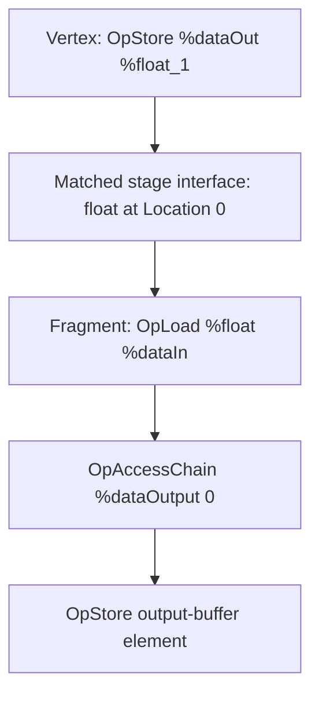

## Overview

**Core question:** Does a graphics pipeline match a vertex output to a fragment input by its interface decorations rather than by `OpName` debug text?

- This test family covers the SPIR-V assembly emitted by [`createShaders`](../../../modules/vulkan/spirv_assembly/vktSpvAsmVaryingNameTests.cpp#L49-L173) and the three test case leaves registered by [`createVaryingNameGraphicsGroup`](../../../modules/vulkan/spirv_assembly/vktSpvAsmVaryingNameTests.cpp#L234-L245).
- Each case keeps a scalar vertex output and fragment input at `Location 0`, writes `1.0` in the vertex stage, then stores the fragment-stage input in an output buffer.
- The cases change only whether the two variables receive matching `OpName` strings, distinct strings, or no `OpName` instructions. They test interface matching, not source-language name resolution.

## Background Knowledge

- A graphics shader interface connects `Output` variables from one shader stage to `Input` variables of the next. Both appear in the corresponding `OpEntryPoint` interface lists. [The Vulkan Shader Interfaces chapter](../../../../vulkan-docs/src/chapters/interfaces.adoc#L55-L73) defines this relationship.
- User-defined interface variables require `Location` decorations. An output and later input form an interface match when their applicable decorations and types meet the matching rules. [`Interface Matching`](../../../../vulkan-docs/src/chapters/interfaces.adoc#L119-L190) describes those requirements.
- `OpName` gives an ID a debug name. This test deliberately changes that metadata while retaining the declarations that define the stage interface.

## Registration Hierarchy

```text
spirv_assembly.instruction.graphics.varying_name
├── names_differ
├── names_match
└── no_names
```

The parent graphics registration adds this family to `spirv_assembly.instruction.graphics` in [`createInstructionGraphicsGroup`](../../../modules/vulkan/spirv_assembly/vktSpvAsmInstructionTests.cpp#L21513). Both the Vulkan and Vulkan SC default mustpass profiles contain the same three leaves: [`vk-default/spirv-assembly.txt`](../../../mustpass/main/vk-default/spirv-assembly.txt#L39899-L39901) and [`vksc-default/spirv-assembly.txt`](../../../mustpass/main/vksc-default/spirv-assembly.txt#L21724-L21726).

## Parameter Dimensions and Observed Values

| Dimension | Registered values | Meaning in this test | Evidence |
|-----------|-------------------|----------------------|----------|
| Varying-name scenario | `names_differ`, `names_match`, `no_names` | Chooses the optional `OpName` text for `%dataOut` and `%dataIn`; it does not change their storage classes, `Location 0` decorations, or scalar `float` type. | [`TestParams`](../../../modules/vulkan/spirv_assembly/vktSpvAsmVaryingNameTests.cpp#L43-L47), [`params`](../../../modules/vulkan/spirv_assembly/vktSpvAsmVaryingNameTests.cpp#L238-L240) |
| Graphics stages | vertex then fragment | The vertex stage produces the tested value. The fragment stage consumes it and writes it to the output buffer. | [`pipelineStages`](../../../modules/vulkan/spirv_assembly/vktSpvAsmVaryingNameTests.cpp#L204-L207) |
| Expected buffer value | `1.0f` | Host verification expects the fragment shader to preserve the scalar produced by the vertex shader. | [`expectedOutput`](../../../modules/vulkan/spirv_assembly/vktSpvAsmVaryingNameTests.cpp#L202-L203) |

## Behavior Parameters

The primary behavioral axis is the test case leaf. Each leaf selects one naming scenario while using the common graphics setup and common SPIR-V templates.

### `names_differ`: vertex and fragment `OpName` strings differ

[`createShadersNamesDiffer`](../../../modules/vulkan/spirv_assembly/vktSpvAsmVaryingNameTests.cpp#L180-L183) passes `dataOut` for the vertex output and `dataIn` for the fragment input. Both variables remain `float` variables at `Location 0`. A passing result shows that the pipeline accepts the matched interface despite different debug names.

### `names_match`: vertex and fragment `OpName` strings match

[`createShadersNamesMatch`](../../../modules/vulkan/spirv_assembly/vktSpvAsmVaryingNameTests.cpp#L175-L178) passes `data` to both stages. This is the control naming scenario. It retains the same location, types, producer store, fragment load, and output-buffer store as the other leaves.

### `no_names`: neither tested interface variable has an `OpName`

[`createShadersNoNames`](../../../modules/vulkan/spirv_assembly/vktSpvAsmVaryingNameTests.cpp#L185-L188) passes empty strings. [`createShaders`](../../../modules/vulkan/spirv_assembly/vktSpvAsmVaryingNameTests.cpp#L54-L59) therefore emits neither optional `OpName %dataOut ...` nor optional `OpName %dataIn ...`. The interface still carries the same `Location 0` decorations.

## Shader Analysis

The representative `names_differ` case makes the tested distinction visible in both stages. It is the strongest demonstration because it makes the producer and consumer debug names unequal while retaining the two interface properties required for a match: the scalar `float` type and `Location 0`. The code below is the CTS-authored SPIR-V assembly emitted by [`createShaders`](../../../modules/vulkan/spirv_assembly/vktSpvAsmVaryingNameTests.cpp#L65-L172), with the `names_differ` optional lines selected by [`createShadersNamesDiffer`](../../../modules/vulkan/spirv_assembly/vktSpvAsmVaryingNameTests.cpp#L180-L183).

### Representative Shader Walkthrough 1: `spirv_assembly.instruction.graphics.varying_name.names_differ`

#### Parameter Values Chosen

Representative path:

```text
spirv_assembly.instruction.graphics.varying_name.names_differ
```

| Parameter choice | Meaning in this representative case |
|------------------|-------------------------------------|
| Test case leaf `names_differ` | Emits `OpName %dataOut "dataOut"` in the vertex module and `OpName %dataIn "dataIn"` in the fragment module. |
| Interface location | `OpDecorate %dataOut Location 0` and `OpDecorate %dataIn Location 0` identify the producer and consumer interface variables. |
| Observed payload | The vertex stage stores `%float_1`, then the fragment stage loads `%dataIn` and writes the value through `%dataOutput`. |

#### Purpose

This pair verifies that unequal debug names do not prevent the vertex output from becoming the fragment input. The output buffer provides one host-visible observation of the stage interface: the fragment store is expected to receive `1.0f`; the default runner also verifies rendered-image corners.

#### Structural Design



#### Source Code

##### Vertex shader

```llvm
OpCapability Shader
%1 = OpExtInstImport "GLSL.std.450"
OpMemoryModel Logical GLSL450
OpEntryPoint Vertex %main "main" %_ %position %vtxColor %color %dataOut
OpSource GLSL 450
OpName %main "main"
OpName %gl_PerVertex "gl_PerVertex"
OpMemberName %gl_PerVertex 0 "gl_Position"
OpMemberName %gl_PerVertex 1 "gl_PointSize"
OpMemberName %gl_PerVertex 2 "gl_ClipDistance"
OpMemberName %gl_PerVertex 3 "gl_CullDistance"
OpName %_ ""
OpName %position "position"
OpName %vtxColor "vtxColor"
OpName %color "color"
OpName %dataOut "dataOut"
OpMemberDecorate %gl_PerVertex 0 BuiltIn Position
OpMemberDecorate %gl_PerVertex 1 BuiltIn PointSize
OpMemberDecorate %gl_PerVertex 2 BuiltIn ClipDistance
OpMemberDecorate %gl_PerVertex 3 BuiltIn CullDistance
OpDecorate %gl_PerVertex Block
OpDecorate %position Location 0
OpDecorate %vtxColor Location 1
OpDecorate %color Location 1
OpDecorate %dataOut Location 0
%void = OpTypeVoid
%3 = OpTypeFunction %void
%float = OpTypeFloat 32
%v4float = OpTypeVector %float 4
%uint = OpTypeInt 32 0
%uint_1 = OpConstant %uint 1
%_arr_float_uint_1 = OpTypeArray %float %uint_1
%gl_PerVertex = OpTypeStruct %v4float %float %_arr_float_uint_1 %_arr_float_uint_1
%_ptr_Output_gl_PerVertex = OpTypePointer Output %gl_PerVertex
%_ = OpVariable %_ptr_Output_gl_PerVertex Output
%int = OpTypeInt 32 1
%int_0 = OpConstant %int 0
%_ptr_Input_v4float = OpTypePointer Input %v4float
%position = OpVariable %_ptr_Input_v4float Input
%_ptr_Output_v4float = OpTypePointer Output %v4float
%vtxColor = OpVariable %_ptr_Output_v4float Output
%color = OpVariable %_ptr_Input_v4float Input
%_ptr_Output_float = OpTypePointer Output %float
%dataOut = OpVariable %_ptr_Output_float Output
%float_1 = OpConstant %float 1
%main = OpFunction %void None %3
%5 = OpLabel
%18 = OpLoad %v4float %position
%20 = OpAccessChain %_ptr_Output_v4float %_ %int_0
OpStore %20 %18
%23 = OpLoad %v4float %color
OpStore %vtxColor %23
OpStore %dataOut %float_1
OpReturn
OpFunctionEnd
```

##### Fragment shader

```llvm
OpCapability Shader
%1 = OpExtInstImport "GLSL.std.450"
OpMemoryModel Logical GLSL450
OpEntryPoint Fragment %main "main" %dataIn %fragColor %vtxColor
OpExecutionMode %main OriginUpperLeft
OpSource GLSL 450
OpName %main "main"
OpName %Output "Output"
OpMemberName %Output 0 "dataOut"
OpName %dataOutput "dataOutput"
OpName %dataIn "dataIn"
OpName %fragColor "fragColor"
OpName %vtxColor "vtxColor"
OpMemberDecorate %Output 0 Offset 0
OpDecorate %Output BufferBlock
OpDecorate %dataOutput DescriptorSet 0
OpDecorate %dataOutput Binding 0
OpDecorate %dataIn Location 0
OpDecorate %fragColor Location 0
OpDecorate %vtxColor Location 1
%void = OpTypeVoid
%3 = OpTypeFunction %void
%float = OpTypeFloat 32
%Output = OpTypeStruct %float
%_ptr_Uniform_Output = OpTypePointer Uniform %Output
%dataOutput = OpVariable %_ptr_Uniform_Output Uniform
%int = OpTypeInt 32 1
%int_0 = OpConstant %int 0
%_ptr_Input_float = OpTypePointer Input %float
%dataIn = OpVariable %_ptr_Input_float Input
%_ptr_Uniform_float = OpTypePointer Uniform %float
%v4float = OpTypeVector %float 4
%_ptr_Output_v4float = OpTypePointer Output %v4float
%fragColor = OpVariable %_ptr_Output_v4float Output
%_ptr_Input_v4float = OpTypePointer Input %v4float
%vtxColor = OpVariable %_ptr_Input_v4float Input
%main = OpFunction %void None %3
%5 = OpLabel
%14 = OpLoad %float %dataIn
%16 = OpAccessChain %_ptr_Uniform_float %dataOutput %int_0
OpStore %16 %14
%22 = OpLoad %v4float %vtxColor
OpStore %fragColor %22
OpReturn
OpFunctionEnd
```

#### Additional Info

- The auxiliary `vtxColor` interface stays at `Location 1` in both stages and is passed to the fragment color output. It supplies the normal rendering path, while the scalar at `Location 0` supplies the checked value.
- `%dataOutput` is a `BufferBlock` uniform-storage-class buffer with `DescriptorSet 0` and `Binding 0`. The source setup supplies it as a storage-buffer output resource.

#### Parameter Variation Summary

| Parameter dimension | Shader-level variation from this shader | Evidence |
|---------------------|------------------------------------------|----------|
| `names_match` | Replaces both selected `OpName` strings with `"data"`. | [`createShadersNamesMatch`](../../../modules/vulkan/spirv_assembly/vktSpvAsmVaryingNameTests.cpp#L175-L178) |
| `no_names` | Removes both optional `OpName` instructions because empty name strings select empty `opNameVert` and `opNameFrag` fragments. | [`createShaders`](../../../modules/vulkan/spirv_assembly/vktSpvAsmVaryingNameTests.cpp#L54-L59), [`createShadersNoNames`](../../../modules/vulkan/spirv_assembly/vktSpvAsmVaryingNameTests.cpp#L185-L188) |
| All three leaves | Keep the `Location 0` decorations, `float` declarations, and producer-load-consumer-store data path unchanged. | [`vertexShader`](../../../modules/vulkan/spirv_assembly/vktSpvAsmVaryingNameTests.cpp#L88-L121), [`fragmentShader`](../../../modules/vulkan/spirv_assembly/vktSpvAsmVaryingNameTests.cpp#L137-L168) |

For the `spirv_assembly` category, the shown assembly is the authored test artifact. The extracted vertex and fragment modules were assembled with `spirv-as --target-env spv1.0`, validated with `spirv-val --target-env spv1.0`, and disassembled as a generation-time check. The resulting disassembly is intentionally not repeated because the category-specific shader workflow keeps CTS-authored assembly under `#### Source Code`.

## Runtime Execution and Result Checking

- [`addGraphicsVaryingNameTest`](../../../modules/vulkan/spirv_assembly/vktSpvAsmVaryingNameTests.cpp#L190-L230) creates one output resource containing the expected vector `{ 1.0f }` and declares it as `VK_DESCRIPTOR_TYPE_STORAGE_BUFFER`.
- The helper selects the `vert` and `frag` entry points, enables `fragmentStoresAndAtomics`, and requests `VK_KHR_storage_buffer_storage_class`. The feature and extension support the fragment-stage buffer store used for the observable result.
- `createInstanceContext` receives the two stages, default color setup, output resource, both shader-stage flags, and the default failure result. [`addFunctionCaseWithPrograms`](../../../modules/vulkan/spirv_assembly/vktSpvAsmVaryingNameTests.cpp#L221-L228) then builds the selected program pair and runs `runAndVerifyDefaultPipeline`.
- During the draw, the vertex shader stores `1.0` into `%dataOut`. If shader-module compilation or graphics-pipeline interface validation rejects the stage pair, the case can fail before any host output is available. Otherwise, interface matching supplies that value to `%dataIn`; the fragment shader writes it to element zero of `%dataOutput`. The utility first checks rendered-image corner colors and then compares the output resource against the expected `1.0f` value.

## Failure Meaning

### Failure Cause Mapping

| If this behavior parameter value fails | Possible failure cause(s) |
|----------------------------------------|---------------------------|
| `names_differ` | The stage pair may be rejected during shader-module or graphics-pipeline interface validation if matching incorrectly depends on unequal `OpName` text. If it runs, a mismatch can instead arise in the shared graphics execution, rendered-image, or output-buffer checks. |
| `names_match` | The common `Location 0` interface may be rejected or mishandled, or a shared graphics execution, rendered-image, or output-buffer check may fail. This control leaf does not isolate name handling. |
| `no_names` | The stage pair may be rejected if the implementation requires optional debug names for this interface. If it runs, a mismatch can instead arise in the shared graphics execution, rendered-image, or output-buffer checks. |

A failure is not limited to a storage-buffer mismatch. Shader-module compilation or graphics-pipeline creation can reject the selected interface before the draw; after execution, the default runner can fail on one of four rendered-image corner checks or on the `1.0f` output-resource comparison. A later mismatch alone does not separate a stage-interface failure from shared graphics execution, color-output, descriptor/output-buffer, or readback behavior.

### Cause Analysis

#### Interface matching or debug-metadata handling

**Possible failure symptoms:** `names_differ` or `no_names` is rejected during shader-module compilation or graphics-pipeline creation while `names_match` proceeds, or only those leaves later fail a rendered-image or output-resource check. A differing `OpName` presence or spelling is the relevant delta, but the later checks do not independently localize the fault to interface matching.

**Possible implementation causes:** A pipeline linker, shader compiler, or interface-reflection path may use `OpName` as an input to matching user-defined stage variables. The Vulkan interface rules instead require the applicable decorations and type rules for a match; `OpName` is absent from those matching conditions. Inspect the pipeline-link and compiler interface-matching path if this pattern occurs.

#### Common graphics execution or result-store path

**Possible failure symptoms:** all three leaves are rejected, all three later fail the same rendered-image corner check, or all three return an output resource other than `1.0f`, including the matching-name control case.

**Possible implementation causes:** The common shader-module/pipeline path, vertex store, fragment input load, fragment color output, fragment storage-buffer store, descriptor binding, draw setup, or readback comparisons may be faulty. The shared leaves and final probes make a common failure diagnostic, but source-level investigation is needed to localize it further.

## Case Pruning

### Requirement-based pruning

The common support check runs before the test program. The case requests `VK_KHR_storage_buffer_storage_class` and `fragmentStoresAndAtomics`, as configured in [`addGraphicsVaryingNameTest`](../../../modules/vulkan/spirv_assembly/vktSpvAsmVaryingNameTests.cpp#L212-L228). An implementation that does not support this setup cannot execute the fragment-stage output-buffer store used by this family.

### Design-based pruning

The family registers three deliberate naming scenarios and no matrix of locations, types, stages, or interpolation decorations. Keeping those dimensions fixed isolates the intended condition: `OpName` metadata changes while the interface declaration needed for a `Location 0` scalar match does not.

## Key Takeaways

- `varying_name` is a three-leaf graphics test family. Its behavioral axis is the exact test case leaf: matching names, distinct names, or omitted names.
- The representative `names_differ` assembly keeps `float` and `Location 0` constant across the vertex output and fragment input while making their `OpName` strings unequal.
- The default runner’s output-resource comparison makes stage-interface transport observable after execution, while its rendered-image corner checks and pre-draw shader-module/pipeline validation add other failure modes. A uniform failure across all leaves therefore does not isolate the interface or output-buffer path. See [Failure Meaning](#failure-meaning) for that localization limit.

## Source Reference Appendix

| Entry point | Link | Why it matters |
|-------------|------|----------------|
| SPIR-V template builder | [`createShaders`](../../../modules/vulkan/spirv_assembly/vktSpvAsmVaryingNameTests.cpp#L49-L173) | Builds the vertex and fragment assembly and makes `OpName` fragments optional. |
| Naming-scenario wrappers | [`createShadersNamesMatch`, `createShadersNamesDiffer`, `createShadersNoNames`](../../../modules/vulkan/spirv_assembly/vktSpvAsmVaryingNameTests.cpp#L175-L188) | Select the exact optional names for the three leaves. |
| Graphics setup and check | [`addGraphicsVaryingNameTest`](../../../modules/vulkan/spirv_assembly/vktSpvAsmVaryingNameTests.cpp#L190-L230) | Defines expected output, feature and extension requests, resource setup, and the default pipeline verifier. |
| Family registration | [`createVaryingNameGraphicsGroup`](../../../modules/vulkan/spirv_assembly/vktSpvAsmVaryingNameTests.cpp#L234-L245) | Registers `names_differ`, `names_match`, and `no_names`. |
| Parent registration | [`createInstructionGraphicsGroup`](../../../modules/vulkan/spirv_assembly/vktSpvAsmInstructionTests.cpp#L21513) | Adds this family under the graphics instruction hierarchy. |
| Vulkan interface contract | [Shader Input and Output Interfaces](../../../../vulkan-docs/src/chapters/interfaces.adoc#L55-L73), [Interface Matching](../../../../vulkan-docs/src/chapters/interfaces.adoc#L119-L190) | Defines the stage-interface variables and matching requirements used by the analysis. |
