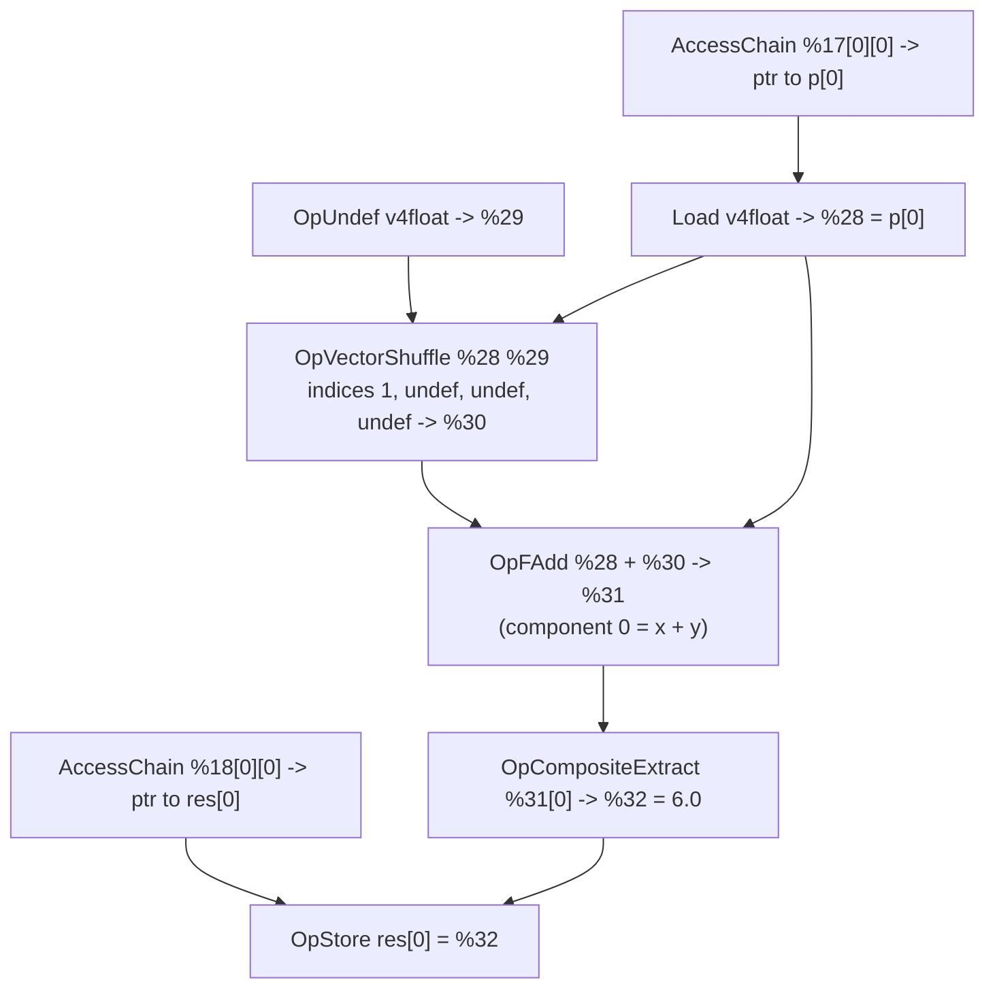

## Overview

**Core question:** Does the implementation correctly handle `OpVectorShuffle` when component indices include the `0xFFFFFFFF` undef marker, and when shuffling long vectors (more than 4 components) enabled by `SPV_EXT_long_vector`?

- Source file: [`vktSpvAsmVectorShuffleTests.cpp`](../../../modules/vulkan/spirv_assembly/vktSpvAsmVectorShuffleTests.cpp), a pure Amber dispatcher registering two test case leaves under the `spirv_assembly.instruction.compute.vector_shuffle` test family.
- Test case leaves: `vector_shuffle` (undef-component handling on a 4-component vector) and `long_vector_shuffle` (shuffle of a 6-component long vector requiring `ShaderLongVectorFeaturesEXT.longVector`).
- Both cases are Amber-backed; the SPIR-V assembly, host-side data setup, and probe logic live in the corresponding `.amber` files.
- The page walks through the SPIR-V assembly of the representative `vector_shuffle` case and explains the long-vector variant by contrast.

## Background Knowledge

- `OpVectorShuffle` builds a result vector by selecting components from two source vectors. Component indices are numbered starting at 0 for `Vector 1`, and at `N` (the component count of `Vector 1`) for `Vector 2`. The special index `0xFFFFFFFF` (printed as `4294967295` in the assembly, equal to `-1` as a signed 32-bit integer) marks an undefined result component: the implementation may produce any value there, but well-defined components must remain correct.
- Standard SPIR-V `OpTypeVector` is limited to 4 components. The `SPV_EXT_long_vector` extension raises this limit through a new `LongVectorEXT` capability and a new `OpTypeVectorIdEXT` instruction that takes the component count as an additional `Id` operand (instead of the literal operand used by `OpTypeVector`).

## Registration Hierarchy

```text
spirv_assembly.instruction.compute.vector_shuffle
├── vector_shuffle
└── long_vector_shuffle
```

The test family `vector_shuffle` is registered by [`createVectorShuffleGroup()`](../../../modules/vulkan/spirv_assembly/vktSpvAsmVectorShuffleTests.cpp#L68-L73); both test case leaves are added inside [`createTests()`](../../../modules/vulkan/spirv_assembly/vktSpvAsmVectorShuffleTests.cpp#L35-L63) from the local [`cases`](../../../modules/vulkan/spirv_assembly/vktSpvAsmVectorShuffleTests.cpp#L46-L50) array.

## Parameter Dimensions and Observed Values

| Dimension | Registered values | Meaning in this test | Evidence |
|-----------|-------------------|----------------------|----------|
| Vector type | 4-component `v4float` (`vector_shuffle`), 6-component `v6float` (`long_vector_shuffle`) | Whether the shuffle targets a standard or a long vector; the long-vector case also exercises the `SPV_EXT_long_vector` extension path | [`vector_shuffle.amber`](../../../data/vulkan/amber/spirv_assembly/instruction/compute/vector_shuffle/vector_shuffle.amber#L38-L39), [`long_vector_shuffle.amber`](../../../data/vulkan/amber/spirv_assembly/instruction/compute/vector_shuffle/long_vector_shuffle.amber#L40-L41) |
| Shuffle indices | `1 4294967295 4294967295 4294967295` (undef marker), `1 0 9 8 11 10` (cross-operand permutation) | Whether the test exercises the `0xFFFFFFFF` undef marker or a fully-defined permutation across both shuffle operands | [`vector_shuffle.amber`](../../../data/vulkan/amber/spirv_assembly/instruction/compute/vector_shuffle/vector_shuffle.amber#L69), [`long_vector_shuffle.amber`](../../../data/vulkan/amber/spirv_assembly/instruction/compute/vector_shuffle/long_vector_shuffle.amber#L67) |

## Behavior Parameters

The primary behavioral axis is the test case leaf: each leaf changes both the vector type and the shuffle index pattern being exercised.

### `vector_shuffle`: `OpVectorShuffle` with `0xFFFFFFFF` undef components

A 4-component `float` vector `p[0]` is loaded from the input SSBO, then shuffled against an `OpUndef` vector using indices `1 4294967295 4294967295 4294967295`. Only component 0 of the shuffle result is well-defined (it selects `p[0].y`); components 1-3 are undefined. The shader adds the shuffle result back to `p[0]` and stores component 0 of the sum to the output SSBO. Because `p[0].x + p[0].y` is the only well-defined component of the sum, the probe checks `res[0] == 6.0` (with `p[0] = (2.0, 4.0, 9.0, -3.0)`).

### `long_vector_shuffle`: `OpVectorShuffle` on a 6-component long vector

A 6-component `float` vector `p[0]` is loaded from the input SSBO and shuffled against itself using indices `1 0 9 8 11 10`. Indices 0-5 select from `Vector 1` and indices 6-11 select from `Vector 2` (which is the same vector), producing the permutation `(p[0].y, p[0].x, p[0].w, p[0].z, p[0][5], p[0][4])`. The result is stored directly to the output SSBO and probed against `(4.0, 2.0, -3.0, 9.0, 7.0, 1.0)`. This case requires `ShaderLongVectorFeaturesEXT.longVector` and exercises `OpTypeVectorIdEXT`, the `LongVectorEXT` capability, and the `SPV_EXT_long_vector` extension.

## Shader Analysis

The two cases share a near-identical compute shell: entry point `%21 "main"`, `GLCompute` execution model, `Logical GLSL450` memory model, specialization-constant `gl_WorkGroupSize` of `(1, 1, 1)`, and two SSBO bindings. They differ in the vector type, the second shuffle operand, the shuffle indices, and the post-shuffle work. The `vector_shuffle` case is the representative walkthrough because it exercises the `0xFFFFFFFF` undef marker, the more semantically interesting behavior. The `long_vector_shuffle` case is explained by contrast below and in `## Behavior Parameters`.

### Representative Shader Walkthrough 1: `vector_shuffle`

#### Resources and Bindings

| Resource | Type | Storage class | Decoration | Role |
|----------|------|---------------|------------|------|
| `%17` | `_ptr_StorageBuffer__struct_4` (runtime array of `v4float`, `ArrayStride 16`) | StorageBuffer | `DescriptorSet 0`, `Binding 0` | Input SSBO `p` |
| `%18` | `_ptr_StorageBuffer__struct_7` (runtime array of `float`, `ArrayStride 4`) | StorageBuffer | `DescriptorSet 0`, `Binding 1` | Output SSBO `res` |
| `%16` | `_ptr_Private_v3uint` | Private | `BuiltIn WorkgroupSize` | `gl_WorkGroupSize` = `(1, 1, 1)` via specialization constants `%12`, `%13`, `%14` (`SpecId 0/1/2`) |
| `%29` | `v4float` | (not a variable) | none | `OpUndef` value used as `Vector 2` of the shuffle |

Both SSBO blocks are decorated as `Block` with member `Offset 0`. The `SPV_KHR_storage_buffer_storage_class` extension is declared for the `StorageBuffer` storage class.

#### Structural Design



#### Walkthrough

The entry point `%21 "main"` runs once for the single invocation in the `1×1×1` dispatch.

- `%25 = OpAccessChain %_ptr_StorageBuffer_v4float %17 %uint_0 %uint_0`: pointer to `p[0]` (binding 0).
- `%27 = OpAccessChain %_ptr_StorageBuffer_float %18 %uint_0 %uint_0`: pointer to `res[0]` (binding 1).
- `%28 = OpLoad %v4float %25`: loads `p[0]`. The Amber `[test]` block seeds this with `(2.0, 4.0, 9.0, -3.0)`.
- `%29 = OpUndef %v4float`: an undefined 4-component float vector used as `Vector 2` of the shuffle.
- `%30 = OpVectorShuffle %v4float %28 %29 1 4294967295 4294967295 4294967295`: selects `%28[1]` (= `4.0`) for component 0, and undefined values for components 1-3. The literal `4294967295` is `0xFFFFFFFF`, the SPIR-V undef-component marker.
- `%31 = OpFAdd %v4float %28 %30`: component-wise add. Component 0 is `2.0 + 4.0 = 6.0`; components 1-3 are `9.0 + undef`, `-3.0 + undef`, and `undef`, all undefined.
- `%32 = OpCompositeExtract %float %31 0`: extracts the well-defined component 0 = `6.0`.
- `OpStore %27 %32`: writes `6.0` to `res[0]`.

The Amber `[test]` block dispatches `compute 1 1 1` and probes `ssbo float 0:1 0 == 6.0`. The test passes if and only if the implementation preserves the well-defined component 0 through the shuffle and the add despite the adjacent undef components.

#### Source Code

<details>
<summary>SPIR-V assembly from <code>vector_shuffle.amber</code></summary>

```llvm
; SPIR-V
; Version: 1.0
; Generator: Google Clspv; 0
; Bound: 45
; Schema: 0
               OpCapability Shader
               OpExtension "SPV_KHR_storage_buffer_storage_class"
               OpMemoryModel Logical GLSL450
               OpEntryPoint GLCompute %21 "main"
               OpSource OpenCL_C 120
               OpDecorate %_runtimearr_v4float ArrayStride 16
               OpMemberDecorate %_struct_4 0 Offset 0
               OpDecorate %_struct_4 Block
               OpDecorate %_runtimearr_float ArrayStride 4
               OpMemberDecorate %_struct_7 0 Offset 0
               OpDecorate %_struct_7 Block
               OpDecorate %gl_WorkGroupSize BuiltIn WorkgroupSize
               OpDecorate %17 DescriptorSet 0
               OpDecorate %17 Binding 0
               OpDecorate %18 DescriptorSet 0
               OpDecorate %18 Binding 1
               OpDecorate %12 SpecId 0
               OpDecorate %13 SpecId 1
               OpDecorate %14 SpecId 2
      %float = OpTypeFloat 32
    %v4float = OpTypeVector %float 4
%_runtimearr_v4float = OpTypeRuntimeArray %v4float
  %_struct_4 = OpTypeStruct %_runtimearr_v4float
%_ptr_StorageBuffer__struct_4 = OpTypePointer StorageBuffer %_struct_4
%_runtimearr_float = OpTypeRuntimeArray %float
  %_struct_7 = OpTypeStruct %_runtimearr_float
%_ptr_StorageBuffer__struct_7 = OpTypePointer StorageBuffer %_struct_7
       %uint = OpTypeInt 32 0
     %v3uint = OpTypeVector %uint 3
%_ptr_Private_v3uint = OpTypePointer Private %v3uint
         %12 = OpSpecConstant %uint 1
         %13 = OpSpecConstant %uint 1
         %14 = OpSpecConstant %uint 1
%gl_WorkGroupSize = OpSpecConstantComposite %v3uint %12 %13 %14
       %void = OpTypeVoid
         %20 = OpTypeFunction %void
%_ptr_StorageBuffer_v4float = OpTypePointer StorageBuffer %v4float
     %uint_0 = OpConstant %uint 0
%_ptr_StorageBuffer_float = OpTypePointer StorageBuffer %float
         %29 = OpUndef %v4float
     %uint_1 = OpConstant %uint 1
     %uint_2 = OpConstant %uint 2
         %16 = OpVariable %_ptr_Private_v3uint Private %gl_WorkGroupSize
         %17 = OpVariable %_ptr_StorageBuffer__struct_4 StorageBuffer
         %18 = OpVariable %_ptr_StorageBuffer__struct_7 StorageBuffer
         %21 = OpFunction %void None %20
         %22 = OpLabel
         %25 = OpAccessChain %_ptr_StorageBuffer_v4float %17 %uint_0 %uint_0
         %27 = OpAccessChain %_ptr_StorageBuffer_float %18 %uint_0 %uint_0
         %28 = OpLoad %v4float %25
         %30 = OpVectorShuffle %v4float %28 %29 1 4294967295 4294967295 4294967295
         %31 = OpFAdd %v4float %28 %30
         %32 = OpCompositeExtract %float %31 0
               OpStore %27 %32
               OpReturn
               OpFunctionEnd
```

</details>

#### Contrast with `long_vector_shuffle`

The `long_vector_shuffle` case replaces `OpTypeVector %float 4` with `OpTypeVectorIdEXT %float %uint_6` (declared under `OpCapability LongVectorEXT` and `OpExtension "SPV_EXT_long_vector"`), drops the `OpUndef` second operand (using the loaded vector as both `Vector 1` and `Vector 2`), uses indices `1 0 9 8 11 10` instead of the undef marker, and stores the full 6-component result directly. The output SSBO has the same struct type as the input (runtime array of `v6float`, `ArrayStride 32`) rather than a separate `float` array. There is no `OpFAdd` or `OpCompositeExtract`; the shuffle result is stored verbatim.

## Runtime Execution and Result Checking

Both cases follow the same Amber-driven flow:

- Amber writes the input vector to SSBO binding 0 (`p[0]`) and zeroes the output SSBO binding 1 (`res[0]`).
- Amber dispatches `compute 1 1 1`, a single workgroup with a single invocation, so there is no cross-invocation synchronization.
- Amber probes the output SSBO with exact equality (no tolerance):
  - `vector_shuffle`: `probe ssbo float 0:1 0 == 6.0` (a single scalar).
  - `long_vector_shuffle`: `probe ssbo float 0:1 0 == 4.0 2.0 -3.0 9.0 7.0 1.0` (six consecutive floats).

## Failure Meaning

### Failure Cause Mapping

| If this behavior parameter value fails | Possible failure cause(s) |
|----------------------------------------|---------------------------|
| `vector_shuffle` | Undef-component mishandling in `OpVectorShuffle` lowering; over-aggressive undef propagation through `OpFAdd` poisoning the well-defined component; wrong component selection for the literal index `1` |
| `long_vector_shuffle` | `OpTypeVectorIdEXT` / `LongVectorEXT` capability not supported or miscompiled; cross-operand index arithmetic wrong for 6-component vectors; declared `ArrayStride 32` not respected by the storage buffer layout; 6-component load/store mismatch |

### Cause Analysis

#### Undef-component mishandling in `OpVectorShuffle`

**Possible failure symptoms:** `res[0]` is not `6.0`; it is some other value, garbage, or zero.

**Possible implementation causes:** The SPIR-V frontend or downstream compiler treats `0xFFFFFFFF` as a real index (for example, interpreting it as `-1` and selecting a wrong component, or masking it incorrectly), or undef propagation folds the entire `OpFAdd` result to undef and then writes a wrong value for component 0. Per the SPIR-V spec, only the explicitly undefined components are unconstrained; well-defined components must remain correct.

#### Cross-operand index arithmetic for long vectors

**Possible failure symptoms:** One or more components of the 6-float result differ from `(4.0, 2.0, -3.0, 9.0, 7.0, 1.0)`.

**Possible implementation causes:** The `SPV_EXT_long_vector` extension allows `Vector 1` to have more than 4 components; the index numbering rule (indices `0..N-1` for `Vector 1`, indices `N..N+M-1` for `Vector 2`) is unchanged. A backend that hardcodes the standard 4-component assumption when computing `Vector 2` offsets would select the wrong source components. Source-level investigation is needed if the failure pattern does not match a simple off-by-N index error.

#### `OpTypeVectorIdEXT` / `LongVectorEXT` support

**Possible failure symptoms:** The case fails to compile, fails to create a pipeline, or produces a wrong or garbage 6-component result.

**Possible implementation causes:** The driver does not advertise `ShaderLongVectorFeaturesEXT.longVector` (in which case Amber should skip the case rather than fail it), or the driver advertises the feature but the compiler backend does not implement `OpTypeVectorIdEXT` lowering, `LongVectorEXT` capability handling, or 6-component storage buffer load/store. The declared `ArrayStride 32` (rather than the natural `24` bytes for 6 floats) must be honored for both the input and output SSBOs.

## Case Pruning

### Requirement-based pruning

- The whole test family is guarded by `#ifndef CTS_USES_VULKANSC` in [`createTests()`](../../../modules/vulkan/spirv_assembly/vktSpvAsmVectorShuffleTests.cpp#L35-L63); neither case is registered on VulkanSC builds.
- Both cases require `VariablePointerFeatures.variablePointers` (declared in the `[require]` block of each Amber script and in the C++ [`cases`](../../../modules/vulkan/spirv_assembly/vktSpvAsmVectorShuffleTests.cpp#L46-L50) array).
- `long_vector_shuffle` also requires `ShaderLongVectorFeaturesEXT.longVector`. Amber skips the case on devices that do not advertise the feature.

### Design-based pruning

- Only two test case leaves are registered. There is no matrix over vector widths, component types, or index patterns beyond the two representative cases: one exercising the undef marker on a standard vector, and one exercising a fully-defined permutation on a long vector.

## Key Takeaways

- The `0xFFFFFFFF` literal in `OpVectorShuffle` indices is the SPIR-V undef-component marker (`4294967295` decimal, `-1` signed). Well-defined components in the same shuffle must remain correct.
- `vector_shuffle` relies on this property: only component 0 of the shuffle is well-defined, and the test extracts and probes exactly that component after an `OpFAdd`.
- `long_vector_shuffle` exercises `SPV_EXT_long_vector` (`OpTypeVectorIdEXT`, `LongVectorEXT` capability) with a 6-component vector and a cross-operand permutation using indices `1 0 9 8 11 10`.
- Both cases use a `1×1×1` dispatch with exact-equality SSBO probes and no tolerance.

## Source Reference Appendix

| Entry point | Link | Why it matters |
|-------------|------|----------------|
| `createVectorShuffleGroup()` | [`vktSpvAsmVectorShuffleTests.cpp#L68-L73`](../../../modules/vulkan/spirv_assembly/vktSpvAsmVectorShuffleTests.cpp#L68-L73) | Registers the `vector_shuffle` test family and points at the Amber data directory |
| `createTests()` | [`vktSpvAsmVectorShuffleTests.cpp#L35-L63`](../../../modules/vulkan/spirv_assembly/vktSpvAsmVectorShuffleTests.cpp#L35-L63) | Adds both Amber test case leaves; contains the VulkanSC guard |
| `cases` array | [`vktSpvAsmVectorShuffleTests.cpp#L46-L50`](../../../modules/vulkan/spirv_assembly/vktSpvAsmVectorShuffleTests.cpp#L46-L50) | The two basenames and their feature requirements |
| `vector_shuffle.amber` | [`vector_shuffle.amber`](../../../data/vulkan/amber/spirv_assembly/instruction/compute/vector_shuffle/vector_shuffle.amber) | Representative Amber script: undef-marker shuffle, expected `6.0` |
| `long_vector_shuffle.amber` | [`long_vector_shuffle.amber`](../../../data/vulkan/amber/spirv_assembly/instruction/compute/vector_shuffle/long_vector_shuffle.amber) | Long-vector Amber script: 6-component permutation, expected `(4.0, 2.0, -3.0, 9.0, 7.0, 1.0)` |
