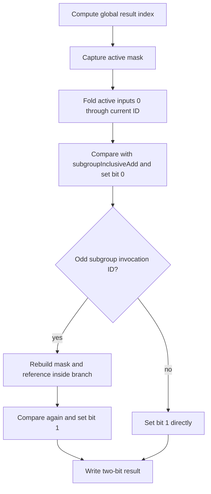

## Overview

**Core question:** Do subgroup reductions and scans produce the expected value for the active invocations in each tested scope?

- The `subgroups.arithmetic` test family covers reductions, inclusive scans, and exclusive scans for add, multiply, minimum, maximum, AND, OR, and XOR.
- The same arithmetic body runs through compute, graphics, framebuffer, mesh, and ray-tracing harnesses where those stages are available.
- Each shader invocation builds an independent reference from ballot-selected inputs and normally checks the subgroup built-in in ordinary and divergent control flow. Floating-point min/max cases with no contributing input are accepted without comparing their infinity-based identity; the shader writes a two-bit result that must equal `0x3`.
- The generated matrix varies scan form, operator, scalar or vector type, stage family, stage, and required subgroup size.

## Background Knowledge

For the shared concepts subgroup identity, active invocations, ballots, masks, and collective result shapes, see [Background Knowledge](../../categories/subgroups.md#background-knowledge) of the `subgroups` page.

- **Operation identity:** The fold starts from a neutral value such as `0` for addition, `1` for multiplication, all one bits for AND, or `0` for OR and XOR. This is also the expected exclusive-scan result when no lower-indexed invocation contributes.
- **Operation order:** The Vulkan specification permits an implementation-dependent application order. The test therefore uses source-defined tolerances for floating-point add and multiply while retaining exact comparisons for integer, Boolean, and floating min/max cases.

## Registration Hierarchy

```text
subgroups.arithmetic
├── graphics
├── compute
├── framebuffer
├── ray_tracing
└── mesh
```

The `ray_tracing` and `mesh` intermediate nodes are not built for Vulkan SC. The current default mustpass lists all five direct intermediate nodes for ordinary Vulkan builds.

## Parameter Dimensions and Observed Values

| Dimension | Registered values | Meaning in this test | Evidence |
|-----------|-------------------|----------------------|----------|
| Scan form | reduction, inclusive scan, exclusive scan | Selects which active invocation IDs contribute to each invocation's expected value. | [`getScanType()` and `getIndexVars()`](../../../modules/vulkan/subgroups/vktSubgroupsArithmeticTests.cpp#L118-L192) |
| Operator | add, multiply, minimum, maximum, AND, OR, XOR | Selects the subgroup built-in, reference expression, identity, and comparison rule. | [`getOperator()`](../../../modules/vulkan/subgroups/vktSubgroupsArithmeticTests.cpp#L80-L116) and [scan helpers](../../../modules/vulkan/subgroups/vktSubgroupsScanHelpers.cpp#L39-L349) |
| Data type | signed and unsigned integers, floating point, double, Boolean; scalar and vector widths 2, 3, 4, and, outside Vulkan SC, 8 | Exercises arithmetic built-ins and reference generation across supported basic and extended subgroup types. | [`getAllFormats()`](../../../modules/vulkan/subgroups/vktSubgroupsTestsUtils.cpp#L1878-L1912) |
| Stage family | `graphics`, `compute`, `framebuffer`, `ray_tracing`, `mesh` | Routes the same test body through different shader and result-transport harnesses. | [`createSubgroupsArithmeticTests()`](../../../modules/vulkan/subgroups/vktSubgroupsArithmeticTests.cpp#L475-L665) |
| Explicit stage | framebuffer: vertex, tessellation evaluation, tessellation control, geometry; mesh: mesh, task | Selects the stage that executes subgroup arithmetic in stage-specific families. | [Stage arrays and registration loops](../../../modules/vulkan/subgroups/vktSubgroupsArithmeticTests.cpp#L487-L605) |
| Required subgroup size | disabled, enabled for compute and mesh | The enabled case repeats execution for every supported power-of-two size from the reported minimum through maximum. | [Required-size loop](../../../modules/vulkan/subgroups/vktSubgroupsArithmeticTests.cpp#L397-L430) |
| Type/operator legality | floating types omit bitwise operations; Boolean types omit non-bitwise operations | Removes combinations that do not match the generated GLSL operation domain. | [Matrix filters](../../../modules/vulkan/subgroups/vktSubgroupsArithmeticTests.cpp#L513-L527) |

The default Vulkan mustpass contains 12,087 arithmetic cases: 2,130 compute, 1,065 graphics, 4,260 framebuffer, 4,260 mesh, and 372 ray-tracing cases. No arithmetic-specific exclusion appears in `mustpass/main/src/test-issues.txt`.

## Behavior Parameters

The primary behavioral axis is **scan form** because it changes the contributor set for every invocation. Operator and type change the function applied to that set, but not which invocations belong to it.

### reduction: all active invocations

Every invocation expects the selected operator folded over the complete active set. The built-in result should therefore be common across those invocations for the same inputs and active set. A reduction-only failure points first to full-set membership or reduction semantics rather than a prefix boundary.

### inclusive scan: lower IDs plus the current invocation

Invocation `i` expects the fold over active invocation IDs from `0` through `i`. This value checks both prefix membership and inclusion of the current input. The representative shader below uses this form because its boundary is visible in `end = gl_SubgroupInvocationID + 1`.

### exclusive scan: lower IDs only

Invocation `i` expects the fold over active IDs strictly below `i`. For operations whose identity is compared directly, invocation 0 therefore checks that identity. Floating-point min/max are the exception: when no invocation contributes, the source accepts the result without comparing the positive- or negative-infinity identity because the compiler may assume those infinities do not occur. This form tests current-invocation exclusion and prefix membership, but it does not test the empty-prefix identity result for floating-point min/max.

## Shader Analysis

The representative compute case shows the shared arithmetic body without stage-specific output plumbing. It uses an exact integer comparison, an inclusive boundary, and the second check inside odd-invocation divergent control flow.

### Representative Shader Walkthrough 1

#### Parameter Values Chosen

Representative path:

```text
dEQP-VK.subgroups.arithmetic.compute.subgroupinclusiveadd_uint
```

| Parameter choice | Meaning in this representative case |
|------------------|-------------------------------------|
| `compute` | Uses the common compute builder, two storage buffers, global invocation indexing, and SPIR-V 1.3 build options. |
| `subgroupinclusiveadd` | Selects addition and an inclusive scan, so each invocation's reference includes its own `uint` input. |
| `uint` | Keeps the reference and subgroup result comparison exact and avoids extended-type declarations. |
| no `_requiredsubgroupsize` suffix | Uses the implementation's ordinary subgroup size rather than requesting each supported size explicitly. |

#### Purpose

This shader checks that `subgroupInclusiveAdd` matches a ballot-filtered inclusive reference in both ordinary execution and a branch where only odd subgroup invocations execute the second operation.

#### Structural Design



#### Shader Code

```glsl
#version 450
#extension GL_KHR_shader_subgroup_arithmetic: enable
#extension GL_KHR_shader_subgroup_ballot: enable
layout (local_size_x_id = 0, local_size_y_id = 1, local_size_z_id = 2) in;

/// Binding 0 stores one two-bit result per global invocation. Both bits must be set for the host check to pass.
layout(set = 0, binding = 0, std430) buffer Buffer1
{
  uint result[];
};
/// Binding 1 contains nonzero uint inputs indexed by subgroup invocation ID.
layout(set = 0, binding = 1, std430) buffer Buffer2
{
  uint data[];
};

void main (void)
{
  uvec3 globalSize = gl_NumWorkGroups * gl_WorkGroupSize;
  highp uint offset = globalSize.x * ((globalSize.y * gl_GlobalInvocationID.z) + gl_GlobalInvocationID.y) + gl_GlobalInvocationID.x;
  uvec4 mask = subgroupBallot(true);
  uint start = 0, end = gl_SubgroupInvocationID + 1;
  uint ref = uint(0);
  uint tempRes = 0;
  uint identityOnly = 0x3;
  /// Build the inclusive reference from active invocations 0 through the current invocation.
  for (uint index = start; index < end; index++)
  {
    if (subgroupBallotBitExtract(mask, index))
    {
      ref = ref + data[index];
      identityOnly &= ~0x1;
    }
  }
  tempRes = (ref == subgroupInclusiveAdd(data[gl_SubgroupInvocationID])) ? 0x1 : 0;
  /// Odd invocations repeat the calculation after divergent control flow and set the second result bit.
  if (1 == (gl_SubgroupInvocationID % 2))
  {
    mask = subgroupBallot(true);
    ref = uint(0);
    for (uint index = start; index < end; index++)
    {
      if (subgroupBallotBitExtract(mask, index))
      {
        ref = ref + data[index];
        identityOnly &= ~0x2;
      }
    }
    tempRes |= (ref == subgroupInclusiveAdd(data[gl_SubgroupInvocationID])) ? 0x2 : 0;
  }
  else
  {
    tempRes |= 0x2;
  }
  result[offset] = tempRes;
}
```

#### Additional Info

- The exact arithmetic body comes from [`getTestSrc()`](../../../modules/vulkan/subgroups/vktSubgroupsArithmeticTests.cpp#L194-L249); [`initStdPrograms()`](../../../modules/vulkan/subgroups/vktSubgroupsTestsUtils.cpp#L1406-L1434) supplies the compute declarations, specialization-constant local size, global index calculation, and result write.
- `identityOnly` is generated for all operations. In this `uint` add case it is updated but not merged into `tempRes`; that merge is reserved for floating min/max identity handling.

#### Parameter Variation Summary

| Parameter dimension | Shader-level variation from this shader | Evidence |
|---------------------|---------------------------------------|----------|
| Scan form | Changes `end` to subgroup size, current ID plus one, or current ID and selects the reduction, inclusive, or exclusive built-in. | [`getIndexVars()`](../../../modules/vulkan/subgroups/vktSubgroupsArithmeticTests.cpp#L179-L192) |
| Operator | Changes the identity, reference expression, subgroup built-in name, and comparison expression. | [`getTestSrc()`](../../../modules/vulkan/subgroups/vktSubgroupsArithmeticTests.cpp#L194-L249) and [scan helpers](../../../modules/vulkan/subgroups/vktSubgroupsScanHelpers.cpp#L39-L349) |
| Data type | Changes buffer element type, required GLSL extensions, identity literals, and exact or tolerant comparison. | [`getExtHeader()`](../../../modules/vulkan/subgroups/vktSubgroupsArithmeticTests.cpp#L172-L177) and [format helpers](../../../modules/vulkan/subgroups/vktSubgroupsTestsUtils.cpp#L1878-L1983) |
| Shader stage family | Wraps the same test body in compute, graphics, framebuffer, mesh, or ray-tracing stage source and changes result transport. | [`initFrameBufferPrograms()` and `initPrograms()`](../../../modules/vulkan/subgroups/vktSubgroupsArithmeticTests.cpp#L252-L277) |
| Required subgroup size | Keeps the GLSL body but requests a particular subgroup size through pipeline state for each supported size. | [`test()` required-size path](../../../modules/vulkan/subgroups/vktSubgroupsArithmeticTests.cpp#L397-L430) |

#### SPIR-V

- Status: generated and validated
- Source: reconstructed `GLSL` from this walkthrough
- Stage: `comp`
- Target SPIRV version: `spirv1.3`

<details>
<summary>Click to expand SPIRV asm code</summary>

```llvm
; SPIR-V
; Version: 1.3
; Generator: Khronos Glslang Reference Front End; 11
; Bound: 147
; Schema: 0
               OpCapability Shader
               OpCapability GroupNonUniform
               OpCapability GroupNonUniformArithmetic
               OpCapability GroupNonUniformBallot
          %1 = OpExtInstImport "GLSL.std.450"
               OpMemoryModel Logical GLSL450
               OpEntryPoint GLCompute %main "main" %gl_NumWorkGroups %gl_GlobalInvocationID %gl_SubgroupInvocationID
               OpExecutionMode %main LocalSize 1 1 1
               OpSource GLSL 450
               OpSourceExtension "GL_KHR_shader_subgroup_arithmetic"
               OpSourceExtension "GL_KHR_shader_subgroup_ballot"
               OpSourceExtension "GL_KHR_shader_subgroup_basic"
               OpName %main "main"
               OpName %globalSize "globalSize"
               OpName %gl_NumWorkGroups "gl_NumWorkGroups"
               OpName %offset "offset"
               OpName %gl_GlobalInvocationID "gl_GlobalInvocationID"
               OpName %mask "mask"
               OpName %start "start"
               OpName %end "end"
               OpName %gl_SubgroupInvocationID "gl_SubgroupInvocationID"
               OpName %ref "ref"
               OpName %tempRes "tempRes"
               OpName %identityOnly "identityOnly"
               OpName %index "index"
               OpName %Buffer2 "Buffer2"
               OpMemberName %Buffer2 0 "data"
               OpName %_ ""
               OpName %index_0 "index"
               OpName %Buffer1 "Buffer1"
               OpMemberName %Buffer1 0 "result"
               OpName %__0 ""
               OpDecorate %gl_NumWorkGroups BuiltIn NumWorkgroups
               OpDecorate %13 SpecId 0
               OpDecorate %14 SpecId 1
               OpDecorate %15 SpecId 2
               OpDecorate %gl_WorkGroupSize BuiltIn WorkgroupSize
               OpDecorate %gl_GlobalInvocationID BuiltIn GlobalInvocationId
               OpDecorate %gl_SubgroupInvocationID RelaxedPrecision
               OpDecorate %gl_SubgroupInvocationID BuiltIn SubgroupLocalInvocationId
               OpDecorate %49 RelaxedPrecision
               OpDecorate %50 RelaxedPrecision
               OpDecorate %_runtimearr_uint ArrayStride 4
               OpDecorate %Buffer2 Block
               OpMemberDecorate %Buffer2 0 Offset 0
               OpDecorate %_ Binding 1
               OpDecorate %_ DescriptorSet 0
               OpDecorate %88 RelaxedPrecision
               OpDecorate %95 RelaxedPrecision
               OpDecorate %96 RelaxedPrecision
               OpDecorate %127 RelaxedPrecision
               OpDecorate %_runtimearr_uint_0 ArrayStride 4
               OpDecorate %Buffer1 Block
               OpMemberDecorate %Buffer1 0 Offset 0
               OpDecorate %__0 Binding 0
               OpDecorate %__0 DescriptorSet 0
       %void = OpTypeVoid
          %3 = OpTypeFunction %void
       %uint = OpTypeInt 32 0
     %v3uint = OpTypeVector %uint 3
%_ptr_Function_v3uint = OpTypePointer Function %v3uint
%_ptr_Input_v3uint = OpTypePointer Input %v3uint
%gl_NumWorkGroups = OpVariable %_ptr_Input_v3uint Input
         %13 = OpSpecConstant %uint 1
         %14 = OpSpecConstant %uint 1
         %15 = OpSpecConstant %uint 1
%gl_WorkGroupSize = OpSpecConstantComposite %v3uint %13 %14 %15
%_ptr_Function_uint = OpTypePointer Function %uint
     %uint_0 = OpConstant %uint 0
     %uint_1 = OpConstant %uint 1
%gl_GlobalInvocationID = OpVariable %_ptr_Input_v3uint Input
     %uint_2 = OpConstant %uint 2
%_ptr_Input_uint = OpTypePointer Input %uint
     %v4uint = OpTypeVector %uint 4
%_ptr_Function_v4uint = OpTypePointer Function %v4uint
       %bool = OpTypeBool
       %true = OpConstantTrue %bool
     %uint_3 = OpConstant %uint 3
%gl_SubgroupInvocationID = OpVariable %_ptr_Input_uint Input
%_runtimearr_uint = OpTypeRuntimeArray %uint
    %Buffer2 = OpTypeStruct %_runtimearr_uint
%_ptr_StorageBuffer_Buffer2 = OpTypePointer StorageBuffer %Buffer2
          %_ = OpVariable %_ptr_StorageBuffer_Buffer2 StorageBuffer
        %int = OpTypeInt 32 1
      %int_0 = OpConstant %int 0
%_ptr_StorageBuffer_uint = OpTypePointer StorageBuffer %uint
%uint_4294967294 = OpConstant %uint 4294967294
      %int_1 = OpConstant %int 1
%uint_4294967293 = OpConstant %uint 4294967293
      %int_2 = OpConstant %int 2
%_runtimearr_uint_0 = OpTypeRuntimeArray %uint
    %Buffer1 = OpTypeStruct %_runtimearr_uint_0
%_ptr_StorageBuffer_Buffer1 = OpTypePointer StorageBuffer %Buffer1
        %__0 = OpVariable %_ptr_StorageBuffer_Buffer1 StorageBuffer
       %main = OpFunction %void None %3
          %5 = OpLabel
 %globalSize = OpVariable %_ptr_Function_v3uint Function
     %offset = OpVariable %_ptr_Function_uint Function
       %mask = OpVariable %_ptr_Function_v4uint Function
      %start = OpVariable %_ptr_Function_uint Function
        %end = OpVariable %_ptr_Function_uint Function
        %ref = OpVariable %_ptr_Function_uint Function
    %tempRes = OpVariable %_ptr_Function_uint Function
%identityOnly = OpVariable %_ptr_Function_uint Function
      %index = OpVariable %_ptr_Function_uint Function
    %index_0 = OpVariable %_ptr_Function_uint Function
         %12 = OpLoad %v3uint %gl_NumWorkGroups
         %17 = OpIMul %v3uint %12 %gl_WorkGroupSize
               OpStore %globalSize %17
         %21 = OpAccessChain %_ptr_Function_uint %globalSize %uint_0
         %22 = OpLoad %uint %21
         %24 = OpAccessChain %_ptr_Function_uint %globalSize %uint_1
         %25 = OpLoad %uint %24
         %29 = OpAccessChain %_ptr_Input_uint %gl_GlobalInvocationID %uint_2
         %30 = OpLoad %uint %29
         %31 = OpIMul %uint %25 %30
         %32 = OpAccessChain %_ptr_Input_uint %gl_GlobalInvocationID %uint_1
         %33 = OpLoad %uint %32
         %34 = OpIAdd %uint %31 %33
         %35 = OpIMul %uint %22 %34
         %36 = OpAccessChain %_ptr_Input_uint %gl_GlobalInvocationID %uint_0
         %37 = OpLoad %uint %36
         %38 = OpIAdd %uint %35 %37
               OpStore %offset %38
         %45 = OpGroupNonUniformBallot %v4uint %uint_3 %true
               OpStore %mask %45
               OpStore %start %uint_0
         %49 = OpLoad %uint %gl_SubgroupInvocationID
         %50 = OpIAdd %uint %49 %uint_1
               OpStore %end %50
               OpStore %ref %uint_0
               OpStore %tempRes %uint_0
               OpStore %identityOnly %uint_3
         %55 = OpLoad %uint %start
               OpStore %index %55
               OpBranch %56
         %56 = OpLabel
               OpLoopMerge %58 %59 None
               OpBranch %60
         %60 = OpLabel
         %61 = OpLoad %uint %index
         %62 = OpLoad %uint %end
         %63 = OpULessThan %bool %61 %62
               OpBranchConditional %63 %57 %58
         %57 = OpLabel
         %64 = OpLoad %v4uint %mask
         %65 = OpLoad %uint %index
         %66 = OpGroupNonUniformBallotBitExtract %bool %uint_3 %64 %65
               OpSelectionMerge %68 None
               OpBranchConditional %66 %67 %68
         %67 = OpLabel
         %69 = OpLoad %uint %ref
         %76 = OpLoad %uint %index
         %78 = OpAccessChain %_ptr_StorageBuffer_uint %_ %int_0 %76
         %79 = OpLoad %uint %78
         %80 = OpIAdd %uint %69 %79
               OpStore %ref %80
         %82 = OpLoad %uint %identityOnly
         %83 = OpBitwiseAnd %uint %82 %uint_4294967294
               OpStore %identityOnly %83
               OpBranch %68
         %68 = OpLabel
               OpBranch %59
         %59 = OpLabel
         %84 = OpLoad %uint %index
         %86 = OpIAdd %uint %84 %int_1
               OpStore %index %86
               OpBranch %56
         %58 = OpLabel
         %87 = OpLoad %uint %ref
         %88 = OpLoad %uint %gl_SubgroupInvocationID
         %89 = OpAccessChain %_ptr_StorageBuffer_uint %_ %int_0 %88
         %90 = OpLoad %uint %89
         %91 = OpGroupNonUniformIAdd %uint %uint_3 InclusiveScan %90
         %92 = OpIEqual %bool %87 %91
         %93 = OpSelect %int %92 %int_1 %int_0
         %94 = OpBitcast %uint %93
               OpStore %tempRes %94
         %95 = OpLoad %uint %gl_SubgroupInvocationID
         %96 = OpUMod %uint %95 %uint_2
         %97 = OpIEqual %bool %uint_1 %96
               OpSelectionMerge %99 None
               OpBranchConditional %97 %98 %137
         %98 = OpLabel
        %100 = OpGroupNonUniformBallot %v4uint %uint_3 %true
               OpStore %mask %100
               OpStore %ref %uint_0
        %102 = OpLoad %uint %start
               OpStore %index_0 %102
               OpBranch %103
        %103 = OpLabel
               OpLoopMerge %105 %106 None
               OpBranch %107
        %107 = OpLabel
        %108 = OpLoad %uint %index_0
        %109 = OpLoad %uint %end
        %110 = OpULessThan %bool %108 %109
               OpBranchConditional %110 %104 %105
        %104 = OpLabel
        %111 = OpLoad %v4uint %mask
        %112 = OpLoad %uint %index_0
        %113 = OpGroupNonUniformBallotBitExtract %bool %uint_3 %111 %112
               OpSelectionMerge %115 None
               OpBranchConditional %113 %114 %115
        %114 = OpLabel
        %116 = OpLoad %uint %ref
        %117 = OpLoad %uint %index_0
        %118 = OpAccessChain %_ptr_StorageBuffer_uint %_ %int_0 %117
        %119 = OpLoad %uint %118
        %120 = OpIAdd %uint %116 %119
               OpStore %ref %120
        %122 = OpLoad %uint %identityOnly
        %123 = OpBitwiseAnd %uint %122 %uint_4294967293
               OpStore %identityOnly %123
               OpBranch %115
        %115 = OpLabel
               OpBranch %106
        %106 = OpLabel
        %124 = OpLoad %uint %index_0
        %125 = OpIAdd %uint %124 %int_1
               OpStore %index_0 %125
               OpBranch %103
        %105 = OpLabel
        %126 = OpLoad %uint %ref
        %127 = OpLoad %uint %gl_SubgroupInvocationID
        %128 = OpAccessChain %_ptr_StorageBuffer_uint %_ %int_0 %127
        %129 = OpLoad %uint %128
        %130 = OpGroupNonUniformIAdd %uint %uint_3 InclusiveScan %129
        %131 = OpIEqual %bool %126 %130
        %133 = OpSelect %int %131 %int_2 %int_0
        %134 = OpBitcast %uint %133
        %135 = OpLoad %uint %tempRes
        %136 = OpBitwiseOr %uint %135 %134
               OpStore %tempRes %136
               OpBranch %99
        %137 = OpLabel
        %138 = OpLoad %uint %tempRes
        %139 = OpBitwiseOr %uint %138 %uint_2
               OpStore %tempRes %139
               OpBranch %99
         %99 = OpLabel
        %144 = OpLoad %uint %offset
        %145 = OpLoad %uint %tempRes
        %146 = OpAccessChain %_ptr_StorageBuffer_uint %__0 %int_0 %144
               OpStore %146 %145
               OpReturn
               OpFunctionEnd
```

</details>

## Runtime Execution and Result Checking

- [`supportedCheck()`](../../../modules/vulkan/subgroups/vktSubgroupsArithmeticTests.cpp#L279-L345) first requires Vulkan subgroup support, `VK_SUBGROUP_FEATURE_ARITHMETIC_BIT`, the selected type, the selected stage, and any type-specific or stage-specific features.
- The host initializes nonzero input data with one element per possible subgroup invocation. Compute and mesh use `std430`; graphics and ray tracing also use storage-buffer transport; framebuffer variants use `std140` uniform input.
- Compute, graphics, mesh, and ray-tracing shaders write `tempRes` to a result buffer or stage output. Framebuffer variants route it through a color attachment and copy the `R32_UINT` image to a host-readable buffer.
- Bit 0 means the ordinary-flow comparison passed. Odd invocations set bit 1 only if the divergent-flow comparison also passed; even invocations set bit 1 directly. Every checked output must therefore equal `0x3`.
- For floating-point min/max, [`getTestSrc()`](../../../modules/vulkan/subgroups/vktSubgroupsArithmeticTests.cpp#L244-L247) also sets either result bit when its reference loop found no contributor. This deliberately accepts the untested infinity-based identity case; non-empty prefixes still use an exact comparison.
- [`check()`](../../../modules/vulkan/subgroups/vktSubgroupsTestsUtils.cpp#L2640-L2653) scans graphics and framebuffer results. [`checkComputeOrMesh()`](../../../modules/vulkan/subgroups/vktSubgroupsTestsUtils.cpp#L2655-L2663) derives the full invocation count before applying the same rule.
- Required-size compute and mesh cases repeat the common harness for every supported power-of-two subgroup size. The first failed size ends the case and is logged.

## Failure Meaning

### Failure Cause Mapping

| If this behavior parameter value fails | Possible failure cause(s) |
|----------------------------------------|---------------------------|
| `reduction` | Incorrect all-active-set reduction, operator or type lowering, divergent active-set handling, or result transport/checking. |
| `inclusive scan` | Incorrect inclusion of the current invocation, prefix ordering or membership, operator or type lowering, divergent active-set handling, or result transport/checking. |
| `exclusive scan` | Incorrect exclusion of the current invocation, empty-prefix identity handling for operations whose identity is compared, prefix ordering or membership, operator or type lowering, divergent active-set handling, or result transport/checking. |

All three values also depend on correct stage support reporting, input binding, shader execution, and two-bit result readback.

### Cause Analysis

#### Incorrect contributor-set or scan-boundary semantics

**Possible failure symptoms:** reduction results differ between invocations that use the same active set, inclusive results omit the current input, exclusive results include it, or an exclusive empty prefix fails for an operation whose identity is compared. Floating-point min/max empty prefixes cannot produce this last symptom because the source accepts them without comparison. The output loses bit 0, bit 1, or both.

**Possible implementation causes:** the subgroup arithmetic operation may use the wrong active invocation set or lower reduction, `InclusiveScan`, or `ExclusiveScan` semantics incorrectly. Vulkan defines these contributor sets explicitly, while permitting implementation-dependent operator order.

#### Incorrect operator or data-type lowering

**Possible failure symptoms:** failures cluster by add, multiply, min, max, AND, OR, or XOR, or by a scalar/vector type. Floating add or multiply exceeds the source-defined tolerance; exact cases produce unequal values.

**Possible implementation causes:** shader compilation or execution may select the wrong SPIR-V group operation, signedness, vector element operation, extended type, identity, or result type. A compiler transformation may also change subgroup operation semantics rather than only choosing a legal application order.

#### Incorrect divergent active-set handling

**Possible failure symptoms:** bit 0 remains set while bit 1 is missing for odd invocations, with even invocations still producing `0x3`. Failures can appear only when the operation executes inside the odd-invocation branch.

**Possible implementation causes:** active invocation tracking or subgroup arithmetic execution under non-uniform control flow may not match the ballot-derived active set at that program point. Source-level investigation is needed to distinguish compiler control-flow lowering from execution behavior.

#### Incorrect result transport or host checking

**Possible failure symptoms:** broad failures appear in one stage family even though arithmetic combinations behave consistently elsewhere, or readback values are not `0x3` despite correct shader-side comparisons.

**Possible implementation causes:** descriptor binding, stage-output transport, framebuffer conversion/copyback, synchronization, result indexing, or harness readback may be wrong. The relevant path differs between SSBO-backed and framebuffer-backed families, so the failing family determines which source path needs inspection.

## Case Pruning

### Requirement-based pruning

- The device must support Vulkan subgroups, arithmetic subgroup operations, the selected shader stage, and the selected format.
- Extended 8-bit and 16-bit input types require the corresponding shader and storage capabilities. Integer 64-bit, floating 16-bit, and double cases likewise depend on their format support checks.
- `_requiredsubgroupsize` cases require `VK_EXT_subgroup_size_control`, `subgroupSizeControl`, `computeFullSubgroups`, and required-size support for the tested stage.
- Ray-tracing cases require `VK_KHR_ray_tracing_pipeline`. Mesh cases require vertex-pipeline stores and atomics plus `VK_EXT_mesh_shader`; task cases also require `taskShader`.
- The common stage-support check skips stages that cannot execute the requested subgroup operation.

### Design-based pruning

- Floating-point types are not paired with AND, OR, or XOR. Boolean types are paired only with those bitwise categories.
- Required subgroup size is generated only for compute and mesh, not graphics, framebuffer, or ray tracing.
- Framebuffer cases cover vertex, tessellation-control, tessellation-evaluation, and geometry stages. Mesh cases cover mesh and task stages. Other stage choices belong to their common stage-family harnesses.
- Vulkan SC excludes ray tracing, mesh shading, and eight-component vector forms through compile-time guards.
- Ray tracing uses the helper's reduced format list rather than the full format list used by the other families.

## Key Takeaways

- Scan form is the central behavior choice: reduction uses the full active set, inclusive scan includes the current invocation, and exclusive scan stops before it.
- The shader does not trust the subgroup result as its own reference. It reconstructs the expected fold from a ballot and input array.
- The required `0x3` result combines an ordinary check with a divergent odd-invocation check, which makes active-set handling observable.
- Stage families share the arithmetic logic but use different program wrappers and result paths. A family-specific failure can therefore implicate transport or harness behavior as well as subgroup arithmetic.
- See `## Failure Meaning` for the distinctions among boundary, operator/type, divergence, and result-transport failures.

## Source Reference Appendix

| Entry point | Link | Why it matters |
|-------------|------|----------------|
| Case model and operation mapping | [`OpType`, `CaseDefinition`, `getOperator()`, `getScanType()`](../../../modules/vulkan/subgroups/vktSubgroupsArithmeticTests.cpp#L42-L150) | Defines registered semantic combinations. |
| Shader test body | [`getExtHeader()`, `getIndexVars()`, `getTestSrc()`](../../../modules/vulkan/subgroups/vktSubgroupsArithmeticTests.cpp#L172-L249) | Generates extensions, contributor range, reference fold, subgroup call, and result bits. |
| Program builders | [`initFrameBufferPrograms()` and `initPrograms()`](../../../modules/vulkan/subgroups/vktSubgroupsArithmeticTests.cpp#L252-L277) | Selects common wrappers and SPIR-V targets. |
| Support checks | [`supportedCheck()`](../../../modules/vulkan/subgroups/vktSubgroupsArithmeticTests.cpp#L279-L345) | Enforces subgroup, format, stage, extended-type, and size-control requirements. |
| Runtime routing | [`noSSBOtest()` and `test()`](../../../modules/vulkan/subgroups/vktSubgroupsArithmeticTests.cpp#L347-L468) | Selects framebuffer, compute, graphics, ray-tracing, or mesh execution. |
| Registration matrix | [`createSubgroupsArithmeticTests()`](../../../modules/vulkan/subgroups/vktSubgroupsArithmeticTests.cpp#L475-L665) | Creates the five direct intermediate nodes and exact case names. |
| Scan and comparison helpers | [`vktSubgroupsScanHelpers.cpp`](../../../modules/vulkan/subgroups/vktSubgroupsScanHelpers.cpp#L39-L349) | Defines built-in names, reference operations, identities, and comparison tolerances. |
| Common GLSL wrappers | [`initStdFrameBufferPrograms()`](../../../modules/vulkan/subgroups/vktSubgroupsTestsUtils.cpp#L1275-L1371) and [`initStdPrograms()`](../../../modules/vulkan/subgroups/vktSubgroupsTestsUtils.cpp#L1406-L1675) | Supplies stage interfaces, buffers, indexing, and output writes. |
| Result callbacks | [`check()` and `checkComputeOrMesh()`](../../../modules/vulkan/subgroups/vktSubgroupsTestsUtils.cpp#L2640-L2663) | Requires every observed value to equal `0x3`. |
| Mustpass paths | [`vk-default/subgroups.txt`](../../../mustpass/main/vk-default/subgroups.txt#L1) | Confirms executable hierarchy and leaf naming. |
| Vulkan arithmetic semantics | [`shaders.adoc`](../../../../vulkan-docs/src/chapters/shaders.adoc#L3446-L3512) | Defines subgroup group-operation scope and reduction/scan behavior. |
| Vulkan arithmetic feature | [`limits.adoc`](../../../../vulkan-docs/src/chapters/limits.adoc#L1435-L1453) | Defines `VK_SUBGROUP_FEATURE_ARITHMETIC_BIT`. |