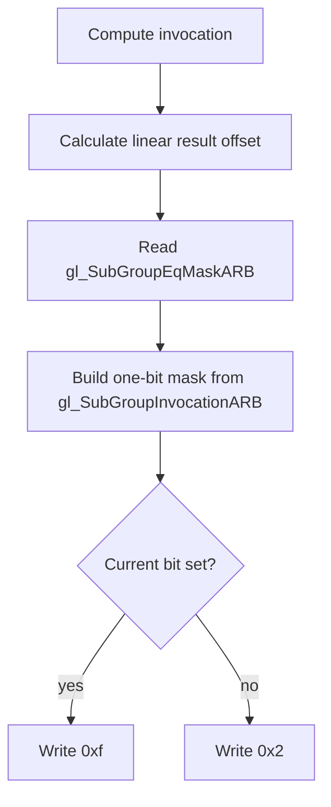

## Overview

**Core question:** Does each legacy subgroup ballot mask mark the invocation IDs selected by its relation to the current invocation?

- This page covers the `subgroups.ballot_mask.ext_shader_subgroup_ballot` test family implemented by [`vktSubgroupsBallotMasksTests.cpp`](../../../modules/vulkan/subgroups/vktSubgroupsBallotMasksTests.cpp#L1).
- The tests read five `GL_ARB_shader_ballot` mask built-ins and compare their bits with `gl_SubGroupInvocationARB` and, where needed, `gl_SubGroupSizeARB`.
- The tests repeat these relations in compute, graphics, framebuffer, ray tracing, and mesh execution families where supported.
- Every device-side check records `0xf` for success or `0x2` for failure. The host accepts a case only when all checked results are `0xf`.

## Background Knowledge

For the shared concepts subgroup identity, active invocations, ballots, and masks, see [Background Knowledge](../../categories/subgroups.md#background-knowledge) of the `subgroups` page.

- The five mask built-ins select the current invocation ID, IDs above it, or IDs below it, with either an inclusive or exclusive boundary.
- `VK_EXT_shader_subgroup_ballot` maps the GLSL `gl_SubGroup*MaskARB` names to the SPIR-V `Subgroup*MaskKHR` built-ins. GLSL exposes these legacy values as `uint64_t`, so the required subgroup size variants stop at 64.

## Registration Hierarchy

```text
subgroups.ballot_mask.ext_shader_subgroup_ballot
├── compute
├── framebuffer
├── graphics
├── mesh
└── ray_tracing
```

The `mesh` and `ray_tracing` intermediate nodes are not registered in Vulkan SC builds.

## Parameter Dimensions and Observed Values

| Dimension | Registered values | Meaning in this test | Evidence |
|-----------|-------------------|----------------------|----------|
| Mask relation | `gl_subgroupeqmaskarb`, `gl_subgroupgemaskarb`, `gl_subgroupgtmaskarb`, `gl_subgrouplemaskarb`, `gl_subgroupltmaskarb` | Selects which invocation IDs must have set bits relative to the current invocation. | [`getMaskTypeName` and `getBodySource`](../../../modules/vulkan/subgroups/vktSubgroupsBallotMasksTests.cpp#L74-L149) |
| Execution family | `compute`, `graphics`, `framebuffer`, `ray_tracing`, `mesh` | Changes pipeline construction, result transport, and available shader stages while preserving the mask relation. | [`createSubgroupsBallotMasksTests`](../../../modules/vulkan/subgroups/vktSubgroupsBallotMasksTests.cpp#L1415-L1525) |
| Framebuffer shader stage | `vertex`, `tess_control`, `tess_eval`, `geometry` | Isolates the mask check in a stage whose result is carried through a framebuffer rather than an SSBO written by the tested stage. | [Framebuffer registration loop](../../../modules/vulkan/subgroups/vktSubgroupsBallotMasksTests.cpp#L1503-L1515) |
| Mesh shader stage | `mesh`, `task` | Runs the relation in an EXT mesh or task shader. | [Mesh registration loop](../../../modules/vulkan/subgroups/vktSubgroupsBallotMasksTests.cpp#L1459-L1476) |
| Required subgroup size mode | absent, `_requiredsubgroupsize` | Uses the implementation-selected size or sweeps each supported power-of-two size through 64 for compute, mesh, and task stages. | [Required-size execution](../../../modules/vulkan/subgroups/vktSubgroupsBallotMasksTests.cpp#L1350-L1388) |

The current default mustpass list contains 60 executable paths for this test family: 10 compute, 20 framebuffer, 5 graphics, 20 mesh, and 5 ray tracing cases. The exact representative compute path appears in [`subgroups.txt`](../../../mustpass/main/vk-default/subgroups.txt#L18228).

## Behavior Parameters

The primary behavioral axis is the **mask relation test case leaf stem**. The execution family, stage, and required subgroup size mode repeat the selected relation through different pipeline and subgroup-size conditions.

### `gl_subgroupeqmaskarb` - current invocation

`gl_SubGroupEqMaskARB` must contain the bit for `gl_SubGroupInvocationARB`. The shader intersects the built-in value with `uint64_t(1) << gl_SubGroupInvocationARB`. This leaf checks that the current bit is present, but it does not separately reject extra set bits.

### `gl_subgroupgemaskarb` - current and higher invocations

`gl_SubGroupGeMaskARB` must set each bit whose ID is greater than or equal to the current invocation and clear each lower bit. The shader checks both sides of that inclusive boundary for every ID below `gl_SubGroupSizeARB`.

### `gl_subgroupgtmaskarb` - higher invocations only

`gl_SubGroupGtMaskARB` must set only IDs greater than the current invocation. The current invocation's bit belongs to the cleared side of this exclusive boundary.

### `gl_subgrouplemaskarb` - current and lower invocations

`gl_SubGroupLeMaskARB` must set each bit whose ID is less than or equal to the current invocation and clear every higher bit below the subgroup size.

### `gl_subgroupltmaskarb` - lower invocations only

`gl_SubGroupLtMaskARB` must set only IDs lower than the current invocation. The current bit and all higher bits must be clear within the checked range.

## Shader Analysis

The representative case uses the equality relation in a required-subgroup-size compute shader, whose size sweep is capped at 64. [`initPrograms`](../../../modules/vulkan/subgroups/vktSubgroupsBallotMasksTests.cpp#L211-L1263) registers CTS-authored SPIR-V assembly for the executable compute path; that assembly addresses the built-in's four 32-bit components and can also handle an implementation-selected subgroup larger than 64 in the unsuffixed case. The GLSL below is a behavior-equivalent reconstruction only for this capped representative path and uses the shared compute generator's layout. The required CCVDO workflow compiled and validated its SPIR-V artifact at the source-selected SPIR-V 1.3 target.

### Representative Shader Walkthrough 1

#### Parameter Values Chosen

Representative path:

```text
dEQP-VK.subgroups.ballot_mask.ext_shader_subgroup_ballot.compute.gl_subgroupeqmaskarb_requiredsubgroupsize
```

| Parameter choice | Meaning in this representative case |
|------------------|-------------------------------------|
| `ext_shader_subgroup_ballot` | Uses the legacy GLSL ARB ballot built-ins backed by `VK_EXT_shader_subgroup_ballot`. |
| `compute` | Runs one mask check per global compute invocation and writes results to a storage buffer. |
| `gl_subgroupeqmaskarb` | Selects the equality relation, so the current invocation's bit must be set. |
| `_requiredsubgroupsize` suffix | Sweeps supported required subgroup sizes through 64, the range for which this 64-bit GLSL reconstruction is behavior-equivalent to the CTS-authored four-component SPIR-V. |

#### Purpose

This shader checks that `gl_SubGroupEqMaskARB` contains the bit selected by the current invocation's subgroup-local ID. It writes a status value that the host can check for every dispatched invocation.

#### Structural Design



#### Shader Code

```glsl
#version 450
#extension GL_ARB_shader_ballot: enable
#extension GL_ARB_gpu_shader_int64: enable
layout (local_size_x_id = 0, local_size_y_id = 1, local_size_z_id = 2) in;
/// Binding 0 stores one status value per global invocation. A correct equality-mask check writes 0xf.
layout(set = 0, binding = 0, std430) buffer Buffer1
{
  uint result[];
};
void main (void)
{
  uvec3 globalSize = gl_NumWorkGroups * gl_WorkGroupSize;
  highp uint offset = globalSize.x * ((globalSize.y * gl_GlobalInvocationID.z) + gl_GlobalInvocationID.y) + gl_GlobalInvocationID.x;
  /// The legacy 64-bit built-in must contain the bit selected by this invocation's subgroup-local ID.
  uint64_t value = gl_SubGroupEqMaskARB;
  bool temp = true;
  uint64_t mask = uint64_t(1) << gl_SubGroupInvocationARB;
  temp = (value & mask) != 0;
  uint tempResult = temp ? 0xf : 0x2;
  uint tempRes = tempResult;
  result[offset] = tempRes;
}
```

#### Additional Info

- The exact executable uses CTS-authored compute SPIR-V selected by the `MASKTYPE_EQ` branch in `initPrograms`. Unlike this 64-bit GLSL reconstruction, it selects a 32-bit component and bit position from the full four-component built-in; the two forms are behavior-equivalent for the representative required-size sweep through 64.
- The equality branch checks that the current bit is present. The four ordered-mask branches also scan the other bit positions below the subgroup size.

#### Parameter Variation Summary

| Parameter dimension | Shader-level variation from this shader | Evidence |
|---------------------|---------------------------------------|----------|
| Mask relation | `GE`, `GT`, `LE`, and `LT` replace the one-bit equality check with a loop over IDs below `gl_SubGroupSizeARB` and test the appropriate inclusive or exclusive boundary. | [`getBodySource`](../../../modules/vulkan/subgroups/vktSubgroupsBallotMasksTests.cpp#L93-L149) |
| Execution family | Other families embed the same relation body in graphics, framebuffer, ray tracing, mesh, or task stage scaffolding and change result addressing or stage output. | [`initPrograms`](../../../modules/vulkan/subgroups/vktSubgroupsBallotMasksTests.cpp#L211-L1263) |
| Required subgroup size mode | Removing the suffix uses the implementation-selected size once. The CTS-authored compute SPIR-V still indexes the full four-component mask if that size exceeds 64; the reconstructed GLSL shown here represents only the suffixed sweep capped at 64. | [`initPrograms` and `test`](../../../modules/vulkan/subgroups/vktSubgroupsBallotMasksTests.cpp#L211-L1388) |

#### SPIR-V

- Status: generated and validated
- Source: reconstructed `GLSL` from this walkthrough
- Stage: `comp`
- Target SPIRV version: `spirv1.3`

<details>
<summary>Click to expand SPIRV asm code</summary>

```llvm
; SPIR-V
; Version: 1.3
; Generator: Khronos Glslang Reference Front End; 11
; Bound: 83
; Schema: 0
               OpCapability Shader
               OpCapability Int64
               OpCapability SubgroupBallotKHR
               OpExtension "SPV_KHR_shader_ballot"
          %1 = OpExtInstImport "GLSL.std.450"
               OpMemoryModel Logical GLSL450
               OpEntryPoint GLCompute %main "main" %gl_NumWorkGroups %gl_GlobalInvocationID %gl_SubGroupEqMaskARB %gl_SubGroupInvocationARB
               OpExecutionMode %main LocalSize 1 1 1
               OpSource GLSL 450
               OpSourceExtension "GL_ARB_gpu_shader_int64"
               OpSourceExtension "GL_ARB_shader_ballot"
               OpName %main "main"
               OpName %globalSize "globalSize"
               OpName %gl_NumWorkGroups "gl_NumWorkGroups"
               OpName %offset "offset"
               OpName %gl_GlobalInvocationID "gl_GlobalInvocationID"
               OpName %value "value"
               OpName %gl_SubGroupEqMaskARB "gl_SubGroupEqMaskARB"
               OpName %temp "temp"
               OpName %mask "mask"
               OpName %gl_SubGroupInvocationARB "gl_SubGroupInvocationARB"
               OpName %tempResult "tempResult"
               OpName %tempRes "tempRes"
               OpName %Buffer1 "Buffer1"
               OpMemberName %Buffer1 0 "result"
               OpName %_ ""
               OpDecorate %gl_NumWorkGroups BuiltIn NumWorkgroups
               OpDecorate %13 SpecId 0
               OpDecorate %14 SpecId 1
               OpDecorate %15 SpecId 2
               OpDecorate %gl_WorkGroupSize BuiltIn WorkgroupSize
               OpDecorate %gl_GlobalInvocationID BuiltIn GlobalInvocationId
               OpDecorate %gl_SubGroupEqMaskARB BuiltIn SubgroupEqMask
               OpDecorate %gl_SubGroupInvocationARB BuiltIn SubgroupLocalInvocationId
               OpDecorate %_runtimearr_uint ArrayStride 4
               OpDecorate %Buffer1 Block
               OpMemberDecorate %Buffer1 0 Offset 0
               OpDecorate %_ Binding 0
               OpDecorate %_ DescriptorSet 0
       %void = OpTypeVoid
          %3 = OpTypeFunction %void
       %uint = OpTypeInt 32 0
     %v3uint = OpTypeVector %uint 3
%_ptr_Function_v3uint = OpTypePointer Function %v3uint
%_ptr_Input_v3uint = OpTypePointer Input %v3uint
%gl_NumWorkGroups = OpVariable %_ptr_Input_v3uint Input
         %13 = OpSpecConstant %uint 1
         %14 = OpSpecConstant %uint 1
         %15 = OpSpecConstant %uint 1
%gl_WorkGroupSize = OpSpecConstantComposite %v3uint %13 %14 %15
%_ptr_Function_uint = OpTypePointer Function %uint
     %uint_0 = OpConstant %uint 0
     %uint_1 = OpConstant %uint 1
%gl_GlobalInvocationID = OpVariable %_ptr_Input_v3uint Input
     %uint_2 = OpConstant %uint 2
%_ptr_Input_uint = OpTypePointer Input %uint
      %ulong = OpTypeInt 64 0
%_ptr_Function_ulong = OpTypePointer Function %ulong
     %v4uint = OpTypeVector %uint 4
%_ptr_Input_v4uint = OpTypePointer Input %v4uint
%gl_SubGroupEqMaskARB = OpVariable %_ptr_Input_v4uint Input
     %v2uint = OpTypeVector %uint 2
       %bool = OpTypeBool
%_ptr_Function_bool = OpTypePointer Function %bool
       %true = OpConstantTrue %bool
    %ulong_1 = OpConstant %ulong 1
%gl_SubGroupInvocationARB = OpVariable %_ptr_Input_uint Input
    %ulong_0 = OpConstant %ulong 0
        %int = OpTypeInt 32 1
     %int_15 = OpConstant %int 15
      %int_2 = OpConstant %int 2
%_runtimearr_uint = OpTypeRuntimeArray %uint
    %Buffer1 = OpTypeStruct %_runtimearr_uint
%_ptr_StorageBuffer_Buffer1 = OpTypePointer StorageBuffer %Buffer1
          %_ = OpVariable %_ptr_StorageBuffer_Buffer1 StorageBuffer
      %int_0 = OpConstant %int 0
%_ptr_StorageBuffer_uint = OpTypePointer StorageBuffer %uint
       %main = OpFunction %void None %3
          %5 = OpLabel
 %globalSize = OpVariable %_ptr_Function_v3uint Function
     %offset = OpVariable %_ptr_Function_uint Function
      %value = OpVariable %_ptr_Function_ulong Function
       %temp = OpVariable %_ptr_Function_bool Function
       %mask = OpVariable %_ptr_Function_ulong Function
 %tempResult = OpVariable %_ptr_Function_uint Function
    %tempRes = OpVariable %_ptr_Function_uint Function
         %12 = OpLoad %v3uint %gl_NumWorkGroups
         %17 = OpIMul %v3uint %12 %gl_WorkGroupSize
               OpStore %globalSize %17
         %21 = OpAccessChain %_ptr_Function_uint %globalSize %uint_0
         %22 = OpLoad %uint %21
         %24 = OpAccessChain %_ptr_Function_uint %globalSize %uint_1
         %25 = OpLoad %uint %24
         %29 = OpAccessChain %_ptr_Input_uint %gl_GlobalInvocationID %uint_2
         %30 = OpLoad %uint %29
         %31 = OpIMul %uint %25 %30
         %32 = OpAccessChain %_ptr_Input_uint %gl_GlobalInvocationID %uint_1
         %33 = OpLoad %uint %32
         %34 = OpIAdd %uint %31 %33
         %35 = OpIMul %uint %22 %34
         %36 = OpAccessChain %_ptr_Input_uint %gl_GlobalInvocationID %uint_0
         %37 = OpLoad %uint %36
         %38 = OpIAdd %uint %35 %37
               OpStore %offset %38
         %45 = OpLoad %v4uint %gl_SubGroupEqMaskARB
         %46 = OpCompositeExtract %uint %45 0
         %47 = OpCompositeExtract %uint %45 1
         %49 = OpCompositeConstruct %v2uint %46 %47
         %50 = OpBitcast %ulong %49
               OpStore %value %50
               OpStore %temp %true
         %58 = OpLoad %uint %gl_SubGroupInvocationARB
         %59 = OpShiftLeftLogical %ulong %ulong_1 %58
               OpStore %mask %59
         %60 = OpLoad %ulong %value
         %61 = OpLoad %ulong %mask
         %62 = OpBitwiseAnd %ulong %60 %61
         %64 = OpINotEqual %bool %62 %ulong_0
               OpStore %temp %64
         %66 = OpLoad %bool %temp
         %70 = OpSelect %int %66 %int_15 %int_2
         %71 = OpBitcast %uint %70
               OpStore %tempResult %71
         %73 = OpLoad %uint %tempResult
               OpStore %tempRes %73
         %79 = OpLoad %uint %offset
         %80 = OpLoad %uint %tempRes
         %82 = OpAccessChain %_ptr_StorageBuffer_uint %_ %int_0 %79
               OpStore %82 %80
               OpReturn
               OpFunctionEnd
```

</details>

## Runtime Execution and Result Checking

- `supportedCheck` first requires subgroup support, `VK_EXT_shader_subgroup_ballot`, 64-bit integer shader support, and subgroup support for the selected shader stage.
- Required subgroup size cases also require `VK_EXT_subgroup_size_control`, `subgroupSizeControl`, `computeFullSubgroups`, and support for the selected stage in `requiredSubgroupSizeStages`.
- Ray tracing cases require `VK_KHR_ray_tracing_pipeline`. Mesh cases require vertex-pipeline stores and atomics plus `VK_EXT_mesh_shader`; task cases also require the `taskShader` feature.
- Compute and mesh paths use shared helpers to allocate an `R32_UINT` result buffer, execute the workload, make the result host-visible, and call `checkComputeOrMesh` over the full global invocation count.
- Graphics and ray tracing paths run the relation in each supported stage selected by the shared subgroup helpers. Their result callbacks require every checked element to equal `0xf`.
- Framebuffer variants export the status through a stage output, render it to an `R32_UINT` target, and use the same `0xf` reference check.
- A required subgroup size case repeats execution for each power-of-two size from `minSubgroupSize` through `min(maxSubgroupSize, 64)`. The case stops at the first failed size and logs that size.

## Failure Meaning

### Failure Cause Mapping

| If this behavior parameter value fails | Possible failure cause(s) |
|----------------------------------------|---------------------------|
| `gl_subgroupeqmaskarb` | The equality mask does not set the current invocation's bit, or shader lowering reads the wrong built-in value. |
| `gl_subgroupgemaskarb` | The greater-than-or-equal mask has an incorrect boundary at the current invocation or incorrect higher bits. |
| `gl_subgroupgtmaskarb` | The greater-than mask incorrectly includes the current invocation or mishandles higher bits. |
| `gl_subgrouplemaskarb` | The less-than-or-equal mask has an incorrect boundary at the current invocation or incorrect lower bits. |
| `gl_subgroupltmaskarb` | The less-than mask incorrectly includes the current invocation or mishandles lower bits. |

### Cause Analysis

#### Equality mask current-bit failure

**Possible failure symptoms:** One or more result elements contain `0x2` instead of `0xf` because the bit selected by `gl_SubGroupInvocationARB` is absent from `gl_SubGroupEqMaskARB`.

**Possible implementation causes:** The implementation may supply an incorrect `SubgroupEqMask` input or lower the legacy GLSL built-in to the wrong SPIR-V built-in or representation. Because this leaf only checks the current bit, a passing result does not prove that all other bits are clear.

#### Ordered mask boundary or range failure

**Possible failure symptoms:** An ordered-mask shader writes `0x2` after finding a missing bit on the selected side of the current invocation or an unexpected bit on the opposite side. `GE` and `LE` include the current bit; `GT` and `LT` exclude it.

**Possible implementation causes:** The built-in mask may use the wrong inclusive or exclusive comparison, use an incorrect subgroup-local ID, or produce incorrect lower or higher bits. A compiler translation error between `gl_SubGroup*MaskARB` and the corresponding SPIR-V built-in can produce the same symptom.

#### Stage, transport, or required-size-specific failure

**Possible failure symptoms:** The same relation passes in some execution families or subgroup sizes but returns a non-`0xf` value, missing output, or helper-reported failed iteration in another.

**Possible implementation causes:** Source inspection supports several distinct paths: storage-buffer writes for compute-like and multi-stage cases, stage outputs for framebuffer cases, and required-size pipeline creation for size-controlled cases. Investigation should first separate a wrong mask value from a stage-specific shader translation, output transport, synchronization or readback problem, or incorrect handling of the requested subgroup size.

## Case Pruning

### Requirement-based pruning

- All cases require subgroup operations, `VK_EXT_shader_subgroup_ballot`, shader `Int64`, and subgroup support in the selected stage.
- Required subgroup size leaves require `VK_EXT_subgroup_size_control`, the subgroup-size-control and compute-full-subgroups features, and required-size support for the selected stage.
- The required-size sweep is limited to supported power-of-two values and capped at 64 because the tested GLSL built-ins are `uint64_t`.
- Ray tracing cases require `VK_KHR_ray_tracing_pipeline`. Mesh cases require `VK_EXT_mesh_shader` and vertex-pipeline stores and atomics; task cases also require `taskShader`.
- The shared graphics and ray tracing helpers execute only stages that advertise subgroup support.

### Design-based pruning

- Required subgroup size variants are generated only for compute, mesh, and task execution, where the test has a dedicated size-sweep path.
- Framebuffer coverage uses vertex, tessellation control, tessellation evaluation, and geometry stages. Fragment behavior is covered through the multi-stage graphics family instead of a separate framebuffer leaf.
- Vulkan SC excludes mesh and ray tracing registration at compile time.
- The default mustpass issue list has no exclusion for `subgroups.ballot_mask.ext_shader_subgroup_ballot`.

## Key Takeaways

- The five test case leaf stems are direct encodings of equality and ordering relations around `gl_SubGroupInvocationARB`.
- The ordered masks validate both sides of their boundary for invocation IDs below `gl_SubGroupSizeARB`. The equality leaf checks only that the current bit is present.
- Pipeline and stage variants repeat the same relation through different result transports, while required subgroup size variants repeat it across supported sizes through 64.
- A case passes only when every checked device result equals `0xf`; see `## Failure Meaning` for how relation-specific and path-specific failures differ.

## Source Reference Appendix

| Entry point | Link | Why it matters |
|-------------|------|----------------|
| Mask relation generator | [`getMaskTypeName` and `getBodySource`](../../../modules/vulkan/subgroups/vktSubgroupsBallotMasksTests.cpp#L74-L149) | Defines the five registered relation names and device-side bit checks. |
| Framebuffer program builder | [`initFrameBufferPrograms`](../../../modules/vulkan/subgroups/vktSubgroupsBallotMasksTests.cpp#L199-L209) | Embeds the relation body in isolated framebuffer-stage shaders. |
| Main program builder | [`initPrograms`](../../../modules/vulkan/subgroups/vktSubgroupsBallotMasksTests.cpp#L211-L1263) | Selects SPIR-V targets, provides compute assembly, and delegates graphics, mesh, and ray tracing generation. |
| Support checks | [`supportedCheck`](../../../modules/vulkan/subgroups/vktSubgroupsBallotMasksTests.cpp#L1265-L1317) | Applies extension, feature, subgroup-size-control, and stage gates. |
| Runtime dispatcher | [`test`](../../../modules/vulkan/subgroups/vktSubgroupsBallotMasksTests.cpp#L1340-L1407) | Selects shared execution helpers and performs the required subgroup size sweep. |
| Test registration | [`createSubgroupsBallotMasksTests`](../../../modules/vulkan/subgroups/vktSubgroupsBallotMasksTests.cpp#L1415-L1527) | Builds the execution-family hierarchy and executable leaf names. |
| Shared shader generators | [`initStdFrameBufferPrograms`](../../../modules/vulkan/subgroups/vktSubgroupsTestsUtils.cpp#L1275-L1365) and [`initStdPrograms`](../../../modules/vulkan/subgroups/vktSubgroupsTestsUtils.cpp#L1406-L1580) | Supplies stage scaffolding around the relation-specific body outside the direct compute assembly path. |
| Shared result checks | [`check` and `checkComputeOrMesh`](../../../modules/vulkan/subgroups/vktSubgroupsTestsUtils.cpp#L2640-L2663) | Require all expected result elements to match `0xf`. |
| Vulkan mask definitions | [`SubgroupEqMask` through `SubgroupLtMask`](../../../../vulkan-docs/src/chapters/interfaces.adoc#L4983-L5120) | Defines each built-in's selected bits and interface type. |
| Legacy ballot extension | [`VK_EXT_shader_subgroup_ballot`](../../../../vulkan-docs/src/appendices/VK_EXT_shader_subgroup_ballot.adoc#L21-L69) | Maps GLSL ARB names to SPIR-V built-ins. |
| Required subgroup size rules | [`VkPipelineShaderStageRequiredSubgroupSizeCreateInfo`](../../../../vulkan-docs/src/chapters/pipelines.adoc#L1524-L1548) | Requires power-of-two sizes within the advertised device limits. |
