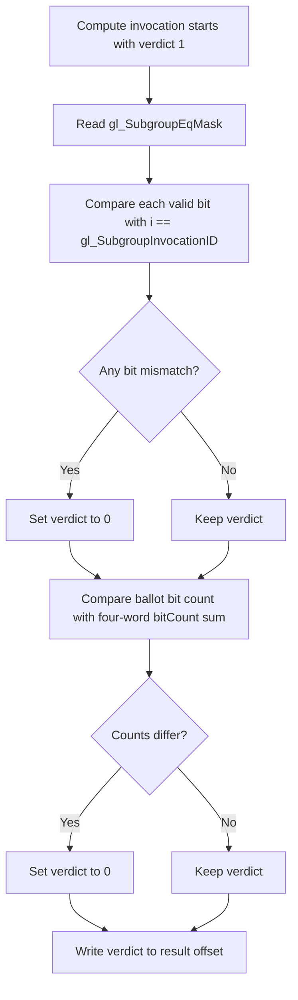

## Overview

**Core question:** Do subgroup mask built-ins mark exactly the invocation IDs defined by their relation to the current invocation?

- This page covers the `subgroups.builtin_mask_var` test family implemented by `vktSubgroupsBuiltinMaskVarTests.cpp`.
- Each case checks one of five relational mask built-ins bit by bit, then checks the same mask's population count by a second method.
- The same core check runs through graphics, compute, framebuffer, ray-tracing, mesh, and task paths when the implementation supports them.
- It explains the generated matrix, one exact compute shader, host-side result checking, feature-based pruning, and what each failure isolates.

## Background Knowledge

For the shared concepts subgroup identity, active invocations, ballots, and masks, see [Background Knowledge](../../categories/subgroups.md#background-knowledge) of the `subgroups` page.

- **Four-word ballot masks.** `SubgroupEqMask`, `SubgroupGeMask`, `SubgroupGtMask`, `SubgroupLeMask`, and `SubgroupLtMask` are input built-ins represented as four 32-bit components. A bit at position `i` states whether invocation ID `i` belongs to the selected relation.
- **Invocation repacking in ray tracing.** A shader call can change subgroup composition. Vulkan therefore requires these derived mask built-ins to be updated by repack instructions and used with `Volatile` semantics in the affected ray-tracing stages.

## Registration Hierarchy

```text
subgroups.builtin_mask_var
├── graphics
├── compute
├── framebuffer
├── ray_tracing
└── mesh
```

`ray_tracing` and `mesh` are not registered in Vulkan SC builds.

## Parameter Dimensions and Observed Values

| Dimension | Registered values | Meaning in this test | Evidence |
|-----------|-------------------|----------------------|----------|
| Mask relation test case | `subgroupeqmask`, `subgroupgemask`, `subgroupgtmask`, `subgrouplemask`, `subgroupltmask` | Selects the built-in mask and the invocation-ID relation checked against every mask bit. | [relation tables](../../../modules/vulkan/subgroups/vktSubgroupsBuiltinMaskVarTests.cpp#L43-L66) |
| Execution family | `graphics`, `compute`, `framebuffer`, `ray_tracing`, `mesh` | Chooses the pipeline and result-transport path while retaining the same mask relation check. | [family registration](../../../modules/vulkan/subgroups/vktSubgroupsBuiltinMaskVarTests.cpp#L1335-L1447) |
| Required subgroup size | absent or `_requiredsubgroupsize` for compute, mesh, and task cases | The suffixed form repeats the case for every supported power-of-two required subgroup size. | [variant construction](../../../modules/vulkan/subgroups/vktSubgroupsBuiltinMaskVarTests.cpp#L1392-L1423) |
| Concrete stage suffix | framebuffer: `_vertex`, `_tess_eval`, `_tess_control`, `_geometry`; mesh: `_mesh`, `_task` | Selects a single framebuffer, mesh, or task shader stage. Graphics and ray-tracing cases instead exercise the supported stages through shared all-stage helpers. | [stage arrays and names](../../../modules/vulkan/subgroups/vktSubgroupsBuiltinMaskVarTests.cpp#L1349-L1359) |

The mustpass list contains 60 executable leaves: 10 compute, 20 framebuffer, 5 graphics, 20 mesh/task, and 5 ray-tracing cases. The last two families are non-VulkanSC registrations.

## Behavior Parameters

The primary behavioral axis is the `mask relation test case`. Every value changes both the selected built-in and the predicate used as the expected bit value.

### `subgroupeqmask` - current invocation only

The built-in must contain exactly one set bit: the bit at `gl_SubgroupInvocationID`. The shader compares each bit with `i == gl_SubgroupInvocationID`.

### `subgroupgemask` - current and higher invocations

Bits from `gl_SubgroupInvocationID` through `gl_SubgroupSize - 1` must be set. Lower invocation IDs must be clear, so the comparison is `i >= gl_SubgroupInvocationID`.

### `subgroupgtmask` - higher invocations only

Only IDs above the current invocation may be set. The current bit must be clear, which distinguishes this case from `subgroupgemask`; the comparison is `i > gl_SubgroupInvocationID`.

### `subgrouplemask` - current and lower invocations

Bits from zero through `gl_SubgroupInvocationID` must be set. Higher IDs must be clear, so the comparison is `i <= gl_SubgroupInvocationID`.

### `subgroupltmask` - lower invocations only

Only IDs below the current invocation may be set. The current bit must be clear, which distinguishes this case from `subgrouplemask`; the comparison is `i < gl_SubgroupInvocationID`.

## Shader Analysis

The compute `subgroupeqmask` case is representative because it exposes the common generated `subgroupMask` body without unrelated pipeline stages. Other mask relations change only the selected built-in and comparison operator; other execution families place the same body in different wrappers or use equivalent direct SPIR-V for framebuffer cases.

### Representative Shader Walkthrough 1

#### Parameter Values Chosen

Representative path:

```text
dEQP-VK.subgroups.builtin_mask_var.compute.subgroupeqmask
```

| Parameter choice | Meaning in this representative case |
|------------------|-------------------------------------|
| `compute` | Uses the shared compute wrapper, an output storage buffer, and specialization-controlled local sizes. |
| `subgroupeqmask` | Selects `gl_SubgroupEqMask` and checks every bit against equality with `gl_SubgroupInvocationID`. |
| no `_requiredsubgroupsize` suffix | Runs the ordinary compute path without iterating over explicitly required subgroup sizes. |

#### Purpose

This shader verifies that `gl_SubgroupEqMask` contains exactly the current invocation's bit. It also checks that subgroup ballot bit counting agrees with the sum of component-wise `bitCount` results.

#### Structural Design



#### Shader Code

```glsl
#version 450
#extension GL_KHR_shader_subgroup_ballot: enable
layout (local_size_x_id = 0, local_size_y_id = 1, local_size_z_id = 2) in;
/// Binding 0 is an std430 output buffer with one uint verdict per global invocation.
layout(set = 0, binding = 0, std430) buffer Output
{
  uint result[];
};
void main (void)
{
  uvec3 globalSize = gl_NumWorkGroups * gl_WorkGroupSize;
  highp uint offset = globalSize.x * ((globalSize.y * gl_GlobalInvocationID.z) + gl_GlobalInvocationID.y) + gl_GlobalInvocationID.x;
  uint tempRes;
  /// Start optimistic; either a mask-bit mismatch or a population-count mismatch changes this invocation's verdict to zero.
  uint tempResult = 0x1;
  uvec4 mask = subgroupBallot(true);
  /// The selected EqMask built-in should contain only this invocation's subgroup-local bit.
  const uvec4 var = gl_SubgroupEqMask;
  for (uint i = 0; i < gl_SubgroupSize; i++)
  {
    if ((i == gl_SubgroupInvocationID) ^^ subgroupBallotBitExtract(var, i))
    {
      tempResult = 0;
    }
  }
  uint c = bitCount(var.x) + bitCount(var.y) + bitCount(var.z) + bitCount(var.w);
  if (subgroupBallotBitCount(var) != c)
  {
    tempResult = 0;
  }
  tempRes = tempResult;
  result[offset] = tempRes;
}
```

#### Additional Info

- The otherwise unused local `mask = subgroupBallot(true)` is preserved because [`subgroupMask`](../../../modules/vulkan/subgroups/vktSubgroupsBuiltinMaskVarTests.cpp#L139-L163) emits it for every relation case.
- `initPrograms` selects SPIR-V 1.3 for this compute case; SPIR-V 1.4 is reserved for ray-tracing and mesh-shading paths.

#### Parameter Variation Summary

| Parameter dimension | Shader-level variation from this shader | Evidence |
|---------------------|---------------------------------------|----------|
| Mask relation test case | Replaces `gl_SubgroupEqMask` and `==` with the selected mask built-in and one of `>=`, `>`, `<=`, or `<`; the loop and count check stay unchanged. | [`subgroupMask` and lookup tables](../../../modules/vulkan/subgroups/vktSubgroupsBuiltinMaskVarTests.cpp#L43-L66) |
| Execution family | Wraps the same test body in graphics, ray-tracing, mesh, or task stage code; framebuffer cases use direct SPIR-V with the matching built-in decoration and comparison instruction. | [`initPrograms` and `initFrameBufferPrograms`](../../../modules/vulkan/subgroups/vktSubgroupsBuiltinMaskVarTests.cpp#L165-L1194) |
| Required subgroup size | Shader text retains specialization-controlled local sizes; host pipeline creation supplies each supported required size. | [`test`](../../../modules/vulkan/subgroups/vktSubgroupsBuiltinMaskVarTests.cpp#L1266-L1313) |

#### SPIR-V

- Status: generated and validated
- Source: reconstructed `GLSL` from this walkthrough
- Stage: `comp`
- Target SPIRV version: `spirv1.3`

<details>
<summary>Click to expand SPIRV asm code</summary>

```llvm
; SPIR-V
; Version: 1.3
; Generator: Khronos Glslang Reference Front End; 11
; Bound: 109
; Schema: 0
               OpCapability Shader
               OpCapability GroupNonUniform
               OpCapability GroupNonUniformBallot
          %1 = OpExtInstImport "GLSL.std.450"
               OpMemoryModel Logical GLSL450
               OpEntryPoint GLCompute %main "main" %gl_NumWorkGroups %gl_GlobalInvocationID %gl_SubgroupEqMask %gl_SubgroupSize %gl_SubgroupInvocationID
               OpExecutionMode %main LocalSize 1 1 1
               OpSource GLSL 450
               OpSourceExtension "GL_KHR_shader_subgroup_ballot"
               OpSourceExtension "GL_KHR_shader_subgroup_basic"
               OpName %main "main"
               OpName %globalSize "globalSize"
               OpName %gl_NumWorkGroups "gl_NumWorkGroups"
               OpName %offset "offset"
               OpName %gl_GlobalInvocationID "gl_GlobalInvocationID"
               OpName %tempResult "tempResult"
               OpName %mask "mask"
               OpName %var "var"
               OpName %gl_SubgroupEqMask "gl_SubgroupEqMask"
               OpName %i "i"
               OpName %gl_SubgroupSize "gl_SubgroupSize"
               OpName %gl_SubgroupInvocationID "gl_SubgroupInvocationID"
               OpName %c "c"
               OpName %tempRes "tempRes"
               OpName %Output "Output"
               OpMemberName %Output 0 "result"
               OpName %_ ""
               OpDecorate %gl_NumWorkGroups BuiltIn NumWorkgroups
               OpDecorate %13 SpecId 0
               OpDecorate %14 SpecId 1
               OpDecorate %15 SpecId 2
               OpDecorate %gl_WorkGroupSize BuiltIn WorkgroupSize
               OpDecorate %gl_GlobalInvocationID BuiltIn GlobalInvocationId
               OpDecorate %gl_SubgroupEqMask BuiltIn SubgroupEqMask
               OpDecorate %gl_SubgroupSize RelaxedPrecision
               OpDecorate %gl_SubgroupSize BuiltIn SubgroupSize
               OpDecorate %59 RelaxedPrecision
               OpDecorate %gl_SubgroupInvocationID RelaxedPrecision
               OpDecorate %gl_SubgroupInvocationID BuiltIn SubgroupLocalInvocationId
               OpDecorate %63 RelaxedPrecision
               OpDecorate %_runtimearr_uint ArrayStride 4
               OpDecorate %Output Block
               OpMemberDecorate %Output 0 Offset 0
               OpDecorate %_ Binding 0
               OpDecorate %_ DescriptorSet 0
       %void = OpTypeVoid
          %3 = OpTypeFunction %void
       %uint = OpTypeInt 32 0
     %v3uint = OpTypeVector %uint 3
%_ptr_Function_v3uint = OpTypePointer Function %v3uint
%_ptr_Input_v3uint = OpTypePointer Input %v3uint
%gl_NumWorkGroups = OpVariable %_ptr_Input_v3uint Input
         %13 = OpSpecConstant %uint 1
         %14 = OpSpecConstant %uint 1
         %15 = OpSpecConstant %uint 1
%gl_WorkGroupSize = OpSpecConstantComposite %v3uint %13 %14 %15
%_ptr_Function_uint = OpTypePointer Function %uint
     %uint_0 = OpConstant %uint 0
     %uint_1 = OpConstant %uint 1
%gl_GlobalInvocationID = OpVariable %_ptr_Input_v3uint Input
     %uint_2 = OpConstant %uint 2
%_ptr_Input_uint = OpTypePointer Input %uint
     %v4uint = OpTypeVector %uint 4
%_ptr_Function_v4uint = OpTypePointer Function %v4uint
       %bool = OpTypeBool
       %true = OpConstantTrue %bool
     %uint_3 = OpConstant %uint 3
%_ptr_Input_v4uint = OpTypePointer Input %v4uint
%gl_SubgroupEqMask = OpVariable %_ptr_Input_v4uint Input
%gl_SubgroupSize = OpVariable %_ptr_Input_uint Input
%gl_SubgroupInvocationID = OpVariable %_ptr_Input_uint Input
        %int = OpTypeInt 32 1
      %int_1 = OpConstant %int 1
%_runtimearr_uint = OpTypeRuntimeArray %uint
     %Output = OpTypeStruct %_runtimearr_uint
%_ptr_StorageBuffer_Output = OpTypePointer StorageBuffer %Output
          %_ = OpVariable %_ptr_StorageBuffer_Output StorageBuffer
      %int_0 = OpConstant %int 0
%_ptr_StorageBuffer_uint = OpTypePointer StorageBuffer %uint
       %main = OpFunction %void None %3
          %5 = OpLabel
 %globalSize = OpVariable %_ptr_Function_v3uint Function
     %offset = OpVariable %_ptr_Function_uint Function
 %tempResult = OpVariable %_ptr_Function_uint Function
       %mask = OpVariable %_ptr_Function_v4uint Function
        %var = OpVariable %_ptr_Function_v4uint Function
          %i = OpVariable %_ptr_Function_uint Function
          %c = OpVariable %_ptr_Function_uint Function
    %tempRes = OpVariable %_ptr_Function_uint Function
         %12 = OpLoad %v3uint %gl_NumWorkGroups
         %17 = OpIMul %v3uint %12 %gl_WorkGroupSize
               OpStore %globalSize %17
         %21 = OpAccessChain %_ptr_Function_uint %globalSize %uint_0
         %22 = OpLoad %uint %21
         %24 = OpAccessChain %_ptr_Function_uint %globalSize %uint_1
         %25 = OpLoad %uint %24
         %29 = OpAccessChain %_ptr_Input_uint %gl_GlobalInvocationID %uint_2
         %30 = OpLoad %uint %29
         %31 = OpIMul %uint %25 %30
         %32 = OpAccessChain %_ptr_Input_uint %gl_GlobalInvocationID %uint_1
         %33 = OpLoad %uint %32
         %34 = OpIAdd %uint %31 %33
         %35 = OpIMul %uint %22 %34
         %36 = OpAccessChain %_ptr_Input_uint %gl_GlobalInvocationID %uint_0
         %37 = OpLoad %uint %36
         %38 = OpIAdd %uint %35 %37
               OpStore %offset %38
               OpStore %tempResult %uint_1
         %46 = OpGroupNonUniformBallot %v4uint %uint_3 %true
               OpStore %mask %46
         %50 = OpLoad %v4uint %gl_SubgroupEqMask
               OpStore %var %50
               OpStore %i %uint_0
               OpBranch %52
         %52 = OpLabel
               OpLoopMerge %54 %55 None
               OpBranch %56
         %56 = OpLabel
         %57 = OpLoad %uint %i
         %59 = OpLoad %uint %gl_SubgroupSize
         %60 = OpULessThan %bool %57 %59
               OpBranchConditional %60 %53 %54
         %53 = OpLabel
         %61 = OpLoad %uint %i
         %63 = OpLoad %uint %gl_SubgroupInvocationID
         %64 = OpIEqual %bool %61 %63
         %65 = OpLoad %v4uint %var
         %66 = OpLoad %uint %i
         %67 = OpGroupNonUniformBallotBitExtract %bool %uint_3 %65 %66
         %68 = OpLogicalNotEqual %bool %64 %67
               OpSelectionMerge %70 None
               OpBranchConditional %68 %69 %70
         %69 = OpLabel
               OpStore %tempResult %uint_0
               OpBranch %70
         %70 = OpLabel
               OpBranch %55
         %55 = OpLabel
         %71 = OpLoad %uint %i
         %74 = OpIAdd %uint %71 %int_1
               OpStore %i %74
               OpBranch %52
         %54 = OpLabel
         %76 = OpAccessChain %_ptr_Function_uint %var %uint_0
         %77 = OpLoad %uint %76
         %78 = OpBitCount %int %77
         %79 = OpAccessChain %_ptr_Function_uint %var %uint_1
         %80 = OpLoad %uint %79
         %81 = OpBitCount %int %80
         %82 = OpIAdd %int %78 %81
         %83 = OpAccessChain %_ptr_Function_uint %var %uint_2
         %84 = OpLoad %uint %83
         %85 = OpBitCount %int %84
         %86 = OpIAdd %int %82 %85
         %87 = OpAccessChain %_ptr_Function_uint %var %uint_3
         %88 = OpLoad %uint %87
         %89 = OpBitCount %int %88
         %90 = OpIAdd %int %86 %89
         %91 = OpBitcast %uint %90
               OpStore %c %91
         %92 = OpLoad %v4uint %var
         %93 = OpGroupNonUniformBallotBitCount %uint %uint_3 Reduce %92
         %94 = OpLoad %uint %c
         %95 = OpINotEqual %bool %93 %94
               OpSelectionMerge %97 None
               OpBranchConditional %95 %96 %97
         %96 = OpLabel
               OpStore %tempResult %uint_0
               OpBranch %97
         %97 = OpLabel
         %99 = OpLoad %uint %tempResult
               OpStore %tempRes %99
        %105 = OpLoad %uint %offset
        %106 = OpLoad %uint %tempRes
        %108 = OpAccessChain %_ptr_StorageBuffer_uint %_ %int_0 %105
               OpStore %108 %106
               OpReturn
               OpFunctionEnd
```

</details>

## Runtime Execution and Result Checking

- `supportedCheck` requires Vulkan subgroup support and `VK_SUBGROUP_FEATURE_BALLOT_BIT`; `supportedCheckShader` then requires the requested stage set to intersect the device's subgroup-supported stages. For all-graphics and all-ray-tracing cases, the runtime helper narrows execution to the supported subset.
- The ordinary compute and mesh/task paths call the matching shared helper once. A `_requiredsubgroupsize` case also requires `VK_EXT_subgroup_size_control`, `subgroupSizeControl`, `computeFullSubgroups`, and stage inclusion in `requiredSubgroupSizeStages`; it then repeats the helper for every power-of-two size from `minSubgroupSize` through `maxSubgroupSize`.
- Graphics cases use all supported graphics subgroup stages. Ray-tracing cases use all supported ray-tracing subgroup stages. Framebuffer cases run one explicitly named vertex, tessellation, or geometry stage without an SSBO output from that tested stage.
- Each invocation starts with a `1` verdict. A relation-bit mismatch or population-count mismatch changes it to `0`, which is written to an `R32_UINT` output buffer or framebuffer attachment.
- `check` scans the returned values and accepts only `1`. `checkComputeOrMesh` derives the total result count from workgroup and local sizes before applying the same scan.
- The relation loop checks only bit positions `0` through `gl_SubgroupSize - 1`. The population-count cross-check compares two ways of counting the same returned mask; it is not an independent expected-count oracle, so bits at positions `gl_SubgroupSize` and above are not directly rejected by this shader.

## Failure Meaning

### Failure Cause Mapping

| If this behavior parameter value fails | Possible failure cause(s) |
|----------------------------------------|---------------------------|
| `subgroupeqmask` | The equal mask does not contain exactly the current invocation's bit, or mask bit extraction/counting is inconsistent. |
| `subgroupgemask` | The greater-than-or-equal mask mishandles the current bit, a higher invocation bit, or the subgroup upper boundary. |
| `subgroupgtmask` | The greater-than mask includes the current invocation, omits a higher invocation, or mishandles the subgroup upper boundary. |
| `subgrouplemask` | The less-than-or-equal mask mishandles the current bit, a lower invocation bit, or the zero boundary. |
| `subgroupltmask` | The less-than mask includes the current invocation, omits a lower invocation, or mishandles the zero boundary. |

All values can also fail if `subgroupBallotBitExtract`, `subgroupBallotBitCount`, or result transport/readback disagrees with the direct relation and component-wise population-count checks.

### Cause Analysis

#### Equal-mask membership or ballot interpretation failure

**Possible failure symptoms:** one or more invocations write `0` because the current bit is absent, another bit is present, or the two population-count methods disagree.

**Possible implementation causes:** the implementation may expose an incorrect `SubgroupEqMask`, lower its built-in decoration incorrectly, or evaluate ballot extraction/counting inconsistently with the four-word mask representation required by the Vulkan interface rules.

#### Upper-range mask boundary failure

**Possible failure symptoms:** `subgroupgemask` or `subgroupgtmask` returns `0` near the current invocation or the highest valid subgroup-local ID. A `gemask` failure can include losing the current bit; a `gtmask` failure can include setting it.

**Possible implementation causes:** construction or compiler lowering of the greater-side relational mask may use the wrong inclusive boundary, current invocation ID, or effective subgroup size. In ray-tracing stages, stale derived values around an invocation repack can produce the same symptom if the required volatile/update semantics are not honored.

#### Lower-range mask boundary failure

**Possible failure symptoms:** `subgrouplemask` or `subgroupltmask` returns `0` near invocation zero or at the current invocation. A `lemask` failure can include losing the current bit; an `ltmask` failure can include setting it.

**Possible implementation causes:** construction or compiler lowering of the lower-side relational mask may use the wrong inclusive boundary or current invocation ID. Incorrect handling of subgroup composition can also make the mask disagree with `gl_SubgroupInvocationID`.

#### Shared ballot operation or result-transport failure

**Possible failure symptoms:** multiple or all relation choices fail their extraction/count checks, or valid shader verdicts do not arrive as `1` in the host-visible output.

**Possible implementation causes:** a defect in `subgroupBallotBitExtract`, `subgroupBallotBitCount`, storage-buffer writes, framebuffer output, synchronization, copyback, or host-visible result interpretation can affect several mask relations at once. The failing execution family and stage determine which transport path needs source-level investigation.

## Case Pruning

### Requirement-based pruning

- Cases require Vulkan subgroup support, support for the requested shader stage, and `VK_SUBGROUP_FEATURE_BALLOT_BIT`.
- `_requiredsubgroupsize` cases require `VK_EXT_subgroup_size_control`, the `subgroupSizeControl` and `computeFullSubgroups` features, and support for a required subgroup size in the selected stage.
- Ray-tracing cases require `VK_KHR_ray_tracing_pipeline`; mesh/task cases require `VK_EXT_mesh_shader`, vertex-pipeline stores and atomics, and `taskShader` when the task stage is selected.
- Shared helpers restrict graphics and ray-tracing execution to stages reported as supporting subgroup operations. Unsupported stage combinations are not run.

### Design-based pruning

- Required-subgroup-size variants exist only for compute, mesh, and task execution, where the shared compute-like helpers can exercise explicit subgroup sizes.
- Framebuffer coverage is limited to vertex, tessellation-evaluation, tessellation-control, and geometry stages; fragment behavior is already covered through the ordinary graphics family.
- The generated matrix uses one leaf per relation for graphics and ray tracing because their helpers iterate supported stages internally. Framebuffer and mesh leaves name concrete stages because each leaf selects one stage.
- Vulkan SC omits `ray_tracing` and `mesh` registration by design.

## Key Takeaways

- Each relation case checks every valid subgroup-local bit against a direct comparison, rather than relying only on a precomputed expected vector.
- A second check compares `subgroupBallotBitCount` with the sum of `bitCount` over all four mask components, exposing inconsistencies in mask interpretation as well as mask membership.
- Execution-family variants reuse the relational test but exercise different shader stages, pipeline construction, output resources, and readback paths.
- `_requiredsubgroupsize` variants rerun the same semantics across the implementation's supported power-of-two subgroup-size range.
- See `## Failure Meaning` to distinguish relation-boundary failures from shared ballot or result-transport failures.

## Source Reference Appendix

| Entry point | Link | Why it matters |
|-------------|------|----------------|
| Relation inventory and names | [enum and lookup tables](../../../modules/vulkan/subgroups/vktSubgroupsBuiltinMaskVarTests.cpp#L43-L102) | Maps each registered leaf to its mask built-in, comparison operator, and direct-SPIR-V comparison instruction. |
| Core check generator | [`subgroupMask`](../../../modules/vulkan/subgroups/vktSubgroupsBuiltinMaskVarTests.cpp#L139-L163) | Emits the bitwise relation check, independent population-count check, and verdict. |
| Framebuffer builder | [`initFrameBufferPrograms`](../../../modules/vulkan/subgroups/vktSubgroupsBuiltinMaskVarTests.cpp#L165-L1143) | Supplies direct SPIR-V 1.3 programs for the four framebuffer stage choices. |
| Standard builder | [`initPrograms`](../../../modules/vulkan/subgroups/vktSubgroupsBuiltinMaskVarTests.cpp#L1178-L1194) | Builds generated GLSL paths through `initStdPrograms` and chooses SPIR-V 1.3 or 1.4. |
| Feature checks | [`supportedCheck`](../../../modules/vulkan/subgroups/vktSubgroupsBuiltinMaskVarTests.cpp#L1196-L1245) | Applies subgroup, ballot, subgroup-size-control, ray-tracing, and mesh requirements. |
| Execution routing | [`noSSBOtest` and `test`](../../../modules/vulkan/subgroups/vktSubgroupsBuiltinMaskVarTests.cpp#L1247-L1333) | Selects framebuffer, compute, graphics, ray-tracing, or mesh runtime helpers. |
| Registration matrix | [`createSubgroupsBuiltinMaskVarTests`](../../../modules/vulkan/subgroups/vktSubgroupsBuiltinMaskVarTests.cpp#L1335-L1450) | Creates all five families, relation leaves, stage suffixes, and required-size variants. |
| Shared shader wrappers | [`initStdPrograms`](../../../modules/vulkan/subgroups/vktSubgroupsTestsUtils.cpp#L1406-L1675) | Places the generated check in the selected standard shader-stage wrapper. |
| Host result checks | [`check` and `checkComputeOrMesh`](../../../modules/vulkan/subgroups/vktSubgroupsTestsUtils.cpp#L2640-L2663) | Require every read-back verdict to equal one. |
| Vulkan mask semantics | [Interface built-ins](../../../../vulkan-docs/src/chapters/interfaces.adoc#L4983-L5120) | Defines exact bit membership and input-vector requirements for all five masks. |
| Vulkan ray-tracing semantics | [Invocation repacking](../../../../vulkan-docs/src/chapters/raytracing.adoc#L150-L175) | Defines update and volatile requirements for mask built-ins around ray-tracing repacks. |
