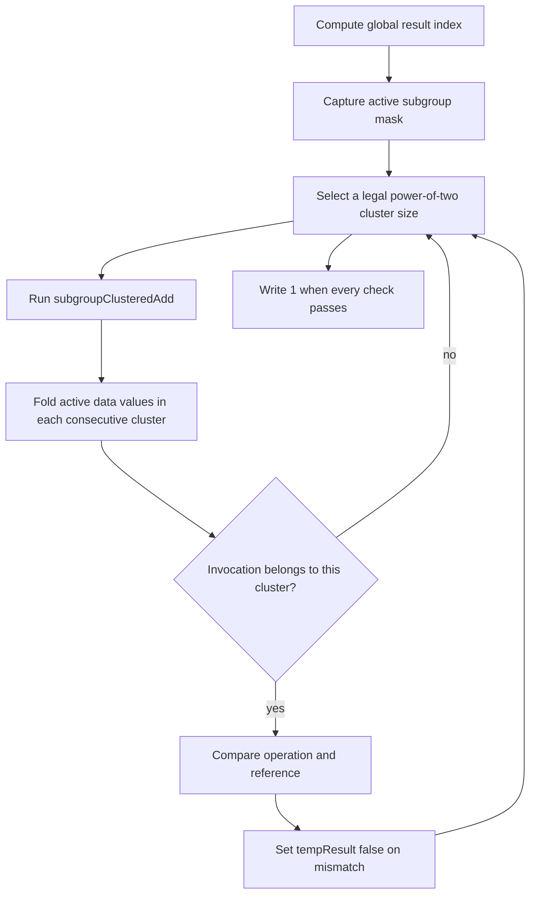

## Overview

**Core question:** Does each clustered subgroup operation return the reduction for the current consecutive partition?

- This page covers `subgroups.clustered` from [`vktSubgroupsClusteredTests.cpp`](../../../modules/vulkan/subgroups/vktSubgroupsClusteredTests.cpp#L384-L566).
- The test family registers `graphics`, `compute`, `framebuffer`, `ray_tracing`, and `mesh` execution-path intermediate nodes. Vulkan SC omits `ray_tracing` and `mesh`.
- Cases combine seven clustered operations, supported scalar and vector data types, execution paths, and required subgroup size where the stage supports it.
- Each generated shader compares the clustered built-in with an independent reference fold for every legal power-of-two cluster size, then writes a pass value for host checking.

## Background Knowledge

For the shared concepts active invocations, ballots, masks, collective result shapes, and clustered partitions, see [Background Knowledge](../../categories/subgroups.md#background-knowledge) of the `subgroups` page.

## Registration Hierarchy

```text
subgroups.clustered
├── graphics
├── compute
├── framebuffer
├── ray_tracing (non-VulkanSC only)
└── mesh (non-VulkanSC only)
```

## Parameter Dimensions and Observed Values

| Dimension | Registered values | Meaning in this test | Evidence |
|-----------|-------------------|----------------------|----------|
| Operation | `subgroupClusteredAdd`, `subgroupClusteredMul`, `subgroupClusteredMin`, `subgroupClusteredMax`, `subgroupClusteredAnd`, `subgroupClusteredOr`, `subgroupClusteredXor` | Selects the clustered built-in, identity, reference expression, and comparison rule. | [`getOperator` and `getOpTypeName`](../../../modules/vulkan/subgroups/vktSubgroupsClusteredTests.cpp#L42-L106) |
| Data type and vector width | Signed and unsigned integer, floating-point, double, Boolean, and supported extended types with widths 1, 2, 3, 4, and 8 where available | Changes GLSL declarations, format extensions, identity values, reference expressions, and comparison behavior. | [`getAllFormats`](../../../modules/vulkan/subgroups/vktSubgroupsTestsUtils.cpp#L1878-L1912) and [`getFormatNameForGLSL`](../../../modules/vulkan/subgroups/vktSubgroupsTestsUtils.cpp#L1821-L1875) |
| Execution path | `graphics`, `compute`, `framebuffer`, `ray_tracing`, `mesh` | Routes the shared clustered body through different shader stages and result transports. | [`createSubgroupsClusteredTests`](../../../modules/vulkan/subgroups/vktSubgroupsClusteredTests.cpp#L384-L566) |
| Framebuffer stage | `vertex`, `tess_control`, `tess_eval`, `geometry` | Selects which graphics stage evaluates the operation in a framebuffer path. | [`fbStages`](../../../modules/vulkan/subgroups/vktSubgroupsClusteredTests.cpp#L394-L399) |
| Mesh stage | `mesh`, `task` | Selects the mesh stage that runs the body or the task stage that records the result. | [`meshStages`](../../../modules/vulkan/subgroups/vktSubgroupsClusteredTests.cpp#L400-L405) |
| Required subgroup size | disabled, enabled for compute and mesh | The enabled case reruns the test for each supported power-of-two size. | [`test` required-size loop](../../../modules/vulkan/subgroups/vktSubgroupsClusteredTests.cpp#L295-L339) |
| Format and operation legality | Floating-point formats omit bitwise operations; Boolean formats omit non-bitwise operations | Removes generated combinations outside the operation's type domain. | [`createSubgroupsClusteredTests` filters](../../../modules/vulkan/subgroups/vktSubgroupsClusteredTests.cpp#L409-L452) |

## Behavior Parameters

The primary behavioral axis is the clustered operation. Execution path, format, cluster size, and required subgroup size change execution or representation, while the operation selects the property being checked.

### `subgroupClusteredAdd` | partitioned addition

The shader compares `subgroupClusteredAdd` with a sum of active `data[]` values in the current consecutive cluster.

### `subgroupClusteredMul` | partitioned multiplication

The shader uses the multiplicative identity and compares `subgroupClusteredMul` with the product of active values in the current cluster.

### `subgroupClusteredMin` | partitioned minimum

The shader uses a type-specific minimum identity and compares the built-in with the minimum of active values in the current cluster. Floating-point min and max reference expressions handle NaN values through the shared helpers.

### `subgroupClusteredMax` | partitioned maximum

The shader uses a type-specific maximum identity and compares the built-in with the maximum of active values in the current cluster. The comparison remains exact for min and max cases.

### `subgroupClusteredAnd` | partitioned bitwise or Boolean AND

The shader starts from all one bits for the reference identity and applies integer bitwise AND or component-wise Boolean AND. Floating-point formats do not register this operation.

### `subgroupClusteredOr` | partitioned bitwise or Boolean OR

The shader starts from zero and applies integer bitwise OR or component-wise Boolean OR. Floating-point formats do not register this operation.

### `subgroupClusteredXor` | partitioned bitwise or Boolean XOR

The shader starts from zero and applies integer bitwise XOR or component-wise Boolean XOR. Floating-point formats do not register this operation.

## Shader Analysis

The representative compute case shows the common generated body. It uses scalar `uint` data, `subgroupClusteredAdd`, and the SPIR-V 1.3 target selected by `initPrograms`.

### Representative Shader Walkthrough 1

#### Parameter Values Chosen

Representative path:

```text
dEQP-VK.subgroups.clustered.compute.subgroupclusteredadd_uint
```

| Parameter choice | Meaning in this representative case |
|------------------|-------------------------------------|
| `compute` | Uses the compute wrapper with specialization IDs for local size and storage buffers for input and result data. |
| `subgroupclusteredadd` | Selects addition and checks one result for each legal power-of-two cluster size. |
| `uint` | Uses scalar unsigned 32-bit data with exact equality. |
| no `_requiredsubgroupsize` suffix | Uses the ordinary implementation-selected subgroup size. |

#### Purpose

This shader checks that each invocation receives the sum for its own consecutive cluster, not the sum for a different cluster or for the whole subgroup.

#### Structural Design



#### Shader Code

```glsl
#version 450
#extension GL_KHR_shader_subgroup_clustered: enable
#extension GL_KHR_shader_subgroup_ballot: enable
layout (local_size_x_id = 0, local_size_y_id = 1, local_size_z_id = 2) in;

/// Binding 0 is a host-created std430 storage buffer. Each global invocation writes one pass flag at result[offset].
layout(set = 0, binding = 0, std430) buffer Buffer1
{
  uint result[];
};
/// Binding 1 is a host-created std430 storage buffer containing nonzero uint values indexed by subgroup-local ID.
layout(set = 0, binding = 1, std430) buffer Buffer2
{
  uint data[];
};

void main (void)
{
  /// The common wrapper maps a three-dimensional global invocation ID to the result-buffer index.
  uvec3 globalSize = gl_NumWorkGroups * gl_WorkGroupSize;
  highp uint offset = globalSize.x * ((globalSize.y * gl_GlobalInvocationID.z) + gl_GlobalInvocationID.y) + gl_GlobalInvocationID.x;
  uint tempRes;
  /// The test records failure if any cluster-size comparison fails.
  bool tempResult = true;
  uvec4 mask = subgroupBallot(true);
  {
    const uint clusterSize = 1;
    if (clusterSize <= gl_SubgroupSize)
    {
      uint op = subgroupClusteredAdd(data[gl_SubgroupInvocationID], clusterSize);
      for (uint clusterOffset = 0; clusterOffset < gl_SubgroupSize; clusterOffset += clusterSize)
      {
        uint ref = uint(0);
        for (uint index = clusterOffset; index < (clusterOffset + clusterSize); index++)
        {
          if (subgroupBallotBitExtract(mask, index))
          {
            ref = ref + data[index];
          }
        }
        if ((clusterOffset <= gl_SubgroupInvocationID) && (gl_SubgroupInvocationID < (clusterOffset + clusterSize)))
        {
          if (!(op == ref))
          {
            tempResult = false;
          }
        }
      }
    }
  }
  {
    const uint clusterSize = 2;
    if (clusterSize <= gl_SubgroupSize)
    {
      uint op = subgroupClusteredAdd(data[gl_SubgroupInvocationID], clusterSize);
      for (uint clusterOffset = 0; clusterOffset < gl_SubgroupSize; clusterOffset += clusterSize)
      {
        uint ref = uint(0);
        for (uint index = clusterOffset; index < (clusterOffset + clusterSize); index++)
        {
          if (subgroupBallotBitExtract(mask, index))
          {
            ref = ref + data[index];
          }
        }
        if ((clusterOffset <= gl_SubgroupInvocationID) && (gl_SubgroupInvocationID < (clusterOffset + clusterSize)))
        {
          if (!(op == ref))
          {
            tempResult = false;
          }
        }
      }
    }
  }
  {
    const uint clusterSize = 4;
    if (clusterSize <= gl_SubgroupSize)
    {
      uint op = subgroupClusteredAdd(data[gl_SubgroupInvocationID], clusterSize);
      for (uint clusterOffset = 0; clusterOffset < gl_SubgroupSize; clusterOffset += clusterSize)
      {
        uint ref = uint(0);
        for (uint index = clusterOffset; index < (clusterOffset + clusterSize); index++)
        {
          if (subgroupBallotBitExtract(mask, index))
          {
            ref = ref + data[index];
          }
        }
        if ((clusterOffset <= gl_SubgroupInvocationID) && (gl_SubgroupInvocationID < (clusterOffset + clusterSize)))
        {
          if (!(op == ref))
          {
            tempResult = false;
          }
        }
      }
    }
  }
  {
    const uint clusterSize = 8;
    if (clusterSize <= gl_SubgroupSize)
    {
      uint op = subgroupClusteredAdd(data[gl_SubgroupInvocationID], clusterSize);
      for (uint clusterOffset = 0; clusterOffset < gl_SubgroupSize; clusterOffset += clusterSize)
      {
        uint ref = uint(0);
        for (uint index = clusterOffset; index < (clusterOffset + clusterSize); index++)
        {
          if (subgroupBallotBitExtract(mask, index))
          {
            ref = ref + data[index];
          }
        }
        if ((clusterOffset <= gl_SubgroupInvocationID) && (gl_SubgroupInvocationID < (clusterOffset + clusterSize)))
        {
          if (!(op == ref))
          {
            tempResult = false;
          }
        }
      }
    }
  }
  {
    const uint clusterSize = 16;
    if (clusterSize <= gl_SubgroupSize)
    {
      uint op = subgroupClusteredAdd(data[gl_SubgroupInvocationID], clusterSize);
      for (uint clusterOffset = 0; clusterOffset < gl_SubgroupSize; clusterOffset += clusterSize)
      {
        uint ref = uint(0);
        for (uint index = clusterOffset; index < (clusterOffset + clusterSize); index++)
        {
          if (subgroupBallotBitExtract(mask, index))
          {
            ref = ref + data[index];
          }
        }
        if ((clusterOffset <= gl_SubgroupInvocationID) && (gl_SubgroupInvocationID < (clusterOffset + clusterSize)))
        {
          if (!(op == ref))
          {
            tempResult = false;
          }
        }
      }
    }
  }
  {
    const uint clusterSize = 32;
    if (clusterSize <= gl_SubgroupSize)
    {
      uint op = subgroupClusteredAdd(data[gl_SubgroupInvocationID], clusterSize);
      for (uint clusterOffset = 0; clusterOffset < gl_SubgroupSize; clusterOffset += clusterSize)
      {
        uint ref = uint(0);
        for (uint index = clusterOffset; index < (clusterOffset + clusterSize); index++)
        {
          if (subgroupBallotBitExtract(mask, index))
          {
            ref = ref + data[index];
          }
        }
        if ((clusterOffset <= gl_SubgroupInvocationID) && (gl_SubgroupInvocationID < (clusterOffset + clusterSize)))
        {
          if (!(op == ref))
          {
            tempResult = false;
          }
        }
      }
    }
  }
  {
    const uint clusterSize = 64;
    if (clusterSize <= gl_SubgroupSize)
    {
      uint op = subgroupClusteredAdd(data[gl_SubgroupInvocationID], clusterSize);
      for (uint clusterOffset = 0; clusterOffset < gl_SubgroupSize; clusterOffset += clusterSize)
      {
        uint ref = uint(0);
        for (uint index = clusterOffset; index < (clusterOffset + clusterSize); index++)
        {
          if (subgroupBallotBitExtract(mask, index))
          {
            ref = ref + data[index];
          }
        }
        if ((clusterOffset <= gl_SubgroupInvocationID) && (gl_SubgroupInvocationID < (clusterOffset + clusterSize)))
        {
          if (!(op == ref))
          {
            tempResult = false;
          }
        }
      }
    }
  }
  {
    const uint clusterSize = 128;
    if (clusterSize <= gl_SubgroupSize)
    {
      uint op = subgroupClusteredAdd(data[gl_SubgroupInvocationID], clusterSize);
      for (uint clusterOffset = 0; clusterOffset < gl_SubgroupSize; clusterOffset += clusterSize)
      {
        uint ref = uint(0);
        for (uint index = clusterOffset; index < (clusterOffset + clusterSize); index++)
        {
          if (subgroupBallotBitExtract(mask, index))
          {
            ref = ref + data[index];
          }
        }
        if ((clusterOffset <= gl_SubgroupInvocationID) && (gl_SubgroupInvocationID < (clusterOffset + clusterSize)))
        {
          if (!(op == ref))
          {
            tempResult = false;
          }
        }
      }
    }
  }
  tempRes = tempResult ? 1 : 0;
  result[offset] = tempRes;
}
```

#### Additional Info

- [`getTestSrc`](../../../modules/vulkan/subgroups/vktSubgroupsClusteredTests.cpp#L115-L159) emits the same operation body for each cluster size from 1 through `maxSupportedSubgroupSize()`, which the common utility fixes at 128 [maxSupportedSubgroupSize](../../../modules/vulkan/subgroups/vktSubgroupsTestsUtils.cpp#L932-L935).
- The representative source uses exact equality because `uint` addition produces an exact integer reference in the generated comparison.

#### Parameter Variation Summary

| Parameter dimension | Shader-level variation from this shader | Evidence |
|---------------------|---------------------------------------|----------|
| Operation | Changes the clustered built-in, identity, reference expression, and comparison. | [`getOperator` and `getTestSrc`](../../../modules/vulkan/subgroups/vktSubgroupsClusteredTests.cpp#L65-L159) |
| Data type | Changes the GLSL element type, format extensions, identity literal, operation expression, and comparison. | [`getExtHeader`](../../../modules/vulkan/subgroups/vktSubgroupsClusteredTests.cpp#L108-L113) and [scan helpers](../../../modules/vulkan/subgroups/vktSubgroupsScanHelpers.cpp#L81-L348) |
| Cluster size | Emits constants 1, 2, 4, 8, 16, 32, 64, and 128, guarded by `clusterSize <= gl_SubgroupSize`. | [`getTestSrc` cluster loop](../../../modules/vulkan/subgroups/vktSubgroupsClusteredTests.cpp#L127-L155) |
| Execution path | Wraps the body in compute, graphics, framebuffer, mesh, or ray-tracing shaders and changes result transport. | [`initStdPrograms`](../../../modules/vulkan/subgroups/vktSubgroupsTestsUtils.cpp#L1406-L1675) |
| Required subgroup size | Keeps the body and requests each supported size through pipeline configuration for compute and mesh cases. | [`test` required-size path](../../../modules/vulkan/subgroups/vktSubgroupsClusteredTests.cpp#L295-L339) |

#### SPIR-V

- Status: generated and validated
- Source: reconstructed `GLSL` from this walkthrough
- Stage: `comp`
- Target SPIRV version: `spirv1.3`

<details>
<summary>Click to expand SPIRV asm code</summary>

```llvm
; SPIR-V
; Version: 1.3
; Generator: Khronos Glslang Reference Front End; 11
; Bound: 572
; Schema: 0
               OpCapability Shader
               OpCapability GroupNonUniform
               OpCapability GroupNonUniformBallot
               OpCapability GroupNonUniformClustered
          %1 = OpExtInstImport "GLSL.std.450"
               OpMemoryModel Logical GLSL450
               OpEntryPoint GLCompute %main "main" %gl_NumWorkGroups %gl_GlobalInvocationID %gl_SubgroupSize %gl_SubgroupInvocationID
               OpExecutionMode %main LocalSize 1 1 1
               OpSource GLSL 450
               OpSourceExtension "GL_KHR_shader_subgroup_ballot"
               OpSourceExtension "GL_KHR_shader_subgroup_basic"
               OpSourceExtension "GL_KHR_shader_subgroup_clustered"
               OpName %main "main"
               OpName %globalSize "globalSize"
               OpName %gl_NumWorkGroups "gl_NumWorkGroups"
               OpName %offset "offset"
               OpName %gl_GlobalInvocationID "gl_GlobalInvocationID"
               OpName %tempResult "tempResult"
               OpName %mask "mask"
               OpName %gl_SubgroupSize "gl_SubgroupSize"
               OpName %op "op"
               OpName %Buffer2 "Buffer2"
               OpMemberName %Buffer2 0 "data"
               OpName %_ ""
               OpName %gl_SubgroupInvocationID "gl_SubgroupInvocationID"
               OpName %clusterOffset "clusterOffset"
               OpName %ref "ref"
               OpName %index "index"
               OpName %op_0 "op"
               OpName %clusterOffset_0 "clusterOffset"
               OpName %ref_0 "ref"
               OpName %index_0 "index"
               OpName %op_1 "op"
               OpName %clusterOffset_1 "clusterOffset"
               OpName %ref_1 "ref"
               OpName %index_1 "index"
               OpName %op_2 "op"
               OpName %clusterOffset_2 "clusterOffset"
               OpName %ref_2 "ref"
               OpName %index_2 "index"
               OpName %op_3 "op"
               OpName %clusterOffset_3 "clusterOffset"
               OpName %ref_3 "ref"
               OpName %index_3 "index"
               OpName %op_4 "op"
               OpName %clusterOffset_4 "clusterOffset"
               OpName %ref_4 "ref"
               OpName %index_4 "index"
               OpName %op_5 "op"
               OpName %clusterOffset_5 "clusterOffset"
               OpName %ref_5 "ref"
               OpName %index_5 "index"
               OpName %op_6 "op"
               OpName %clusterOffset_6 "clusterOffset"
               OpName %ref_6 "ref"
               OpName %index_6 "index"
               OpName %tempRes "tempRes"
               OpName %Buffer1 "Buffer1"
               OpMemberName %Buffer1 0 "result"
               OpName %__0 ""
               OpDecorate %gl_NumWorkGroups BuiltIn NumWorkgroups
               OpDecorate %13 SpecId 0
               OpDecorate %14 SpecId 1
               OpDecorate %15 SpecId 2
               OpDecorate %gl_WorkGroupSize BuiltIn WorkgroupSize
               OpDecorate %gl_GlobalInvocationID BuiltIn GlobalInvocationId
               OpDecorate %gl_SubgroupSize RelaxedPrecision
               OpDecorate %gl_SubgroupSize BuiltIn SubgroupSize
               OpDecorate %49 RelaxedPrecision
               OpDecorate %_runtimearr_uint ArrayStride 4
               OpDecorate %Buffer2 Block
               OpMemberDecorate %Buffer2 0 Offset 0
               OpDecorate %_ Binding 1
               OpDecorate %_ DescriptorSet 0
               OpDecorate %gl_SubgroupInvocationID RelaxedPrecision
               OpDecorate %gl_SubgroupInvocationID BuiltIn SubgroupLocalInvocationId
               OpDecorate %61 RelaxedPrecision
               OpDecorate %73 RelaxedPrecision
               OpDecorate %101 RelaxedPrecision
               OpDecorate %105 RelaxedPrecision
               OpDecorate %121 RelaxedPrecision
               OpDecorate %126 RelaxedPrecision
               OpDecorate %137 RelaxedPrecision
               OpDecorate %164 RelaxedPrecision
               OpDecorate %168 RelaxedPrecision
               OpDecorate %184 RelaxedPrecision
               OpDecorate %189 RelaxedPrecision
               OpDecorate %200 RelaxedPrecision
               OpDecorate %227 RelaxedPrecision
               OpDecorate %231 RelaxedPrecision
               OpDecorate %247 RelaxedPrecision
               OpDecorate %252 RelaxedPrecision
               OpDecorate %263 RelaxedPrecision
               OpDecorate %290 RelaxedPrecision
               OpDecorate %294 RelaxedPrecision
               OpDecorate %310 RelaxedPrecision
               OpDecorate %315 RelaxedPrecision
               OpDecorate %326 RelaxedPrecision
               OpDecorate %353 RelaxedPrecision
               OpDecorate %357 RelaxedPrecision
               OpDecorate %373 RelaxedPrecision
               OpDecorate %378 RelaxedPrecision
               OpDecorate %389 RelaxedPrecision
               OpDecorate %416 RelaxedPrecision
               OpDecorate %420 RelaxedPrecision
               OpDecorate %436 RelaxedPrecision
               OpDecorate %441 RelaxedPrecision
               OpDecorate %452 RelaxedPrecision
               OpDecorate %479 RelaxedPrecision
               OpDecorate %483 RelaxedPrecision
               OpDecorate %499 RelaxedPrecision
               OpDecorate %504 RelaxedPrecision
               OpDecorate %515 RelaxedPrecision
               OpDecorate %542 RelaxedPrecision
               OpDecorate %546 RelaxedPrecision
               OpDecorate %_runtimearr_uint_0 ArrayStride 4
               OpDecorate %Buffer1 Block
               OpMemberDecorate %Buffer1 0 Offset 0
               OpDecorate %__0 Binding 0
               OpDecorate %__0 DescriptorSet 0
       %void = OpTypeVoid
          %3 = OpTypeFunction %void
       %uint = OpTypeInt 32 0
     %v3uint = OpTypeVector %uint 3
%_ptr_Function_v3uint = OpTypePointer Function %v3uint
%_ptr_Input_v3uint = OpTypePointer Input %v3uint
%gl_NumWorkGroups = OpVariable %_ptr_Input_v3uint Input
         %13 = OpSpecConstant %uint 1
         %14 = OpSpecConstant %uint 1
         %15 = OpSpecConstant %uint 1
%gl_WorkGroupSize = OpSpecConstantComposite %v3uint %13 %14 %15
%_ptr_Function_uint = OpTypePointer Function %uint
     %uint_0 = OpConstant %uint 0
     %uint_1 = OpConstant %uint 1
%gl_GlobalInvocationID = OpVariable %_ptr_Input_v3uint Input
     %uint_2 = OpConstant %uint 2
%_ptr_Input_uint = OpTypePointer Input %uint
       %bool = OpTypeBool
%_ptr_Function_bool = OpTypePointer Function %bool
       %true = OpConstantTrue %bool
     %v4uint = OpTypeVector %uint 4
%_ptr_Function_v4uint = OpTypePointer Function %v4uint
     %uint_3 = OpConstant %uint 3
%gl_SubgroupSize = OpVariable %_ptr_Input_uint Input
%_runtimearr_uint = OpTypeRuntimeArray %uint
    %Buffer2 = OpTypeStruct %_runtimearr_uint
%_ptr_StorageBuffer_Buffer2 = OpTypePointer StorageBuffer %Buffer2
          %_ = OpVariable %_ptr_StorageBuffer_Buffer2 StorageBuffer
        %int = OpTypeInt 32 1
      %int_0 = OpConstant %int 0
%gl_SubgroupInvocationID = OpVariable %_ptr_Input_uint Input
%_ptr_StorageBuffer_uint = OpTypePointer StorageBuffer %uint
      %int_1 = OpConstant %int 1
      %false = OpConstantFalse %bool
     %uint_4 = OpConstant %uint 4
     %uint_8 = OpConstant %uint 8
    %uint_16 = OpConstant %uint 16
    %uint_32 = OpConstant %uint 32
    %uint_64 = OpConstant %uint 64
   %uint_128 = OpConstant %uint 128
%_runtimearr_uint_0 = OpTypeRuntimeArray %uint
    %Buffer1 = OpTypeStruct %_runtimearr_uint_0
%_ptr_StorageBuffer_Buffer1 = OpTypePointer StorageBuffer %Buffer1
        %__0 = OpVariable %_ptr_StorageBuffer_Buffer1 StorageBuffer
       %main = OpFunction %void None %3
          %5 = OpLabel
 %globalSize = OpVariable %_ptr_Function_v3uint Function
     %offset = OpVariable %_ptr_Function_uint Function
 %tempResult = OpVariable %_ptr_Function_bool Function
       %mask = OpVariable %_ptr_Function_v4uint Function
         %op = OpVariable %_ptr_Function_uint Function
%clusterOffset = OpVariable %_ptr_Function_uint Function
        %ref = OpVariable %_ptr_Function_uint Function
      %index = OpVariable %_ptr_Function_uint Function
       %op_0 = OpVariable %_ptr_Function_uint Function
%clusterOffset_0 = OpVariable %_ptr_Function_uint Function
      %ref_0 = OpVariable %_ptr_Function_uint Function
    %index_0 = OpVariable %_ptr_Function_uint Function
       %op_1 = OpVariable %_ptr_Function_uint Function
%clusterOffset_1 = OpVariable %_ptr_Function_uint Function
      %ref_1 = OpVariable %_ptr_Function_uint Function
    %index_1 = OpVariable %_ptr_Function_uint Function
       %op_2 = OpVariable %_ptr_Function_uint Function
%clusterOffset_2 = OpVariable %_ptr_Function_uint Function
      %ref_2 = OpVariable %_ptr_Function_uint Function
    %index_2 = OpVariable %_ptr_Function_uint Function
       %op_3 = OpVariable %_ptr_Function_uint Function
%clusterOffset_3 = OpVariable %_ptr_Function_uint Function
      %ref_3 = OpVariable %_ptr_Function_uint Function
    %index_3 = OpVariable %_ptr_Function_uint Function
       %op_4 = OpVariable %_ptr_Function_uint Function
%clusterOffset_4 = OpVariable %_ptr_Function_uint Function
      %ref_4 = OpVariable %_ptr_Function_uint Function
    %index_4 = OpVariable %_ptr_Function_uint Function
       %op_5 = OpVariable %_ptr_Function_uint Function
%clusterOffset_5 = OpVariable %_ptr_Function_uint Function
      %ref_5 = OpVariable %_ptr_Function_uint Function
    %index_5 = OpVariable %_ptr_Function_uint Function
       %op_6 = OpVariable %_ptr_Function_uint Function
%clusterOffset_6 = OpVariable %_ptr_Function_uint Function
      %ref_6 = OpVariable %_ptr_Function_uint Function
    %index_6 = OpVariable %_ptr_Function_uint Function
    %tempRes = OpVariable %_ptr_Function_uint Function
         %12 = OpLoad %v3uint %gl_NumWorkGroups
         %17 = OpIMul %v3uint %12 %gl_WorkGroupSize
               OpStore %globalSize %17
         %21 = OpAccessChain %_ptr_Function_uint %globalSize %uint_0
         %22 = OpLoad %uint %21
         %24 = OpAccessChain %_ptr_Function_uint %globalSize %uint_1
         %25 = OpLoad %uint %24
         %29 = OpAccessChain %_ptr_Input_uint %gl_GlobalInvocationID %uint_2
         %30 = OpLoad %uint %29
         %31 = OpIMul %uint %25 %30
         %32 = OpAccessChain %_ptr_Input_uint %gl_GlobalInvocationID %uint_1
         %33 = OpLoad %uint %32
         %34 = OpIAdd %uint %31 %33
         %35 = OpIMul %uint %22 %34
         %36 = OpAccessChain %_ptr_Input_uint %gl_GlobalInvocationID %uint_0
         %37 = OpLoad %uint %36
         %38 = OpIAdd %uint %35 %37
               OpStore %offset %38
               OpStore %tempResult %true
         %47 = OpGroupNonUniformBallot %v4uint %uint_3 %true
               OpStore %mask %47
         %49 = OpLoad %uint %gl_SubgroupSize
         %50 = OpULessThanEqual %bool %uint_1 %49
               OpSelectionMerge %52 None
               OpBranchConditional %50 %51 %52
         %51 = OpLabel
         %61 = OpLoad %uint %gl_SubgroupInvocationID
         %63 = OpAccessChain %_ptr_StorageBuffer_uint %_ %int_0 %61
         %64 = OpLoad %uint %63
         %65 = OpGroupNonUniformIAdd %uint %uint_3 ClusteredReduce %64 %uint_1
               OpStore %op %65
               OpStore %clusterOffset %uint_0
               OpBranch %67
         %67 = OpLabel
               OpLoopMerge %69 %70 None
               OpBranch %71
         %71 = OpLabel
         %72 = OpLoad %uint %clusterOffset
         %73 = OpLoad %uint %gl_SubgroupSize
         %74 = OpULessThan %bool %72 %73
               OpBranchConditional %74 %68 %69
         %68 = OpLabel
               OpStore %ref %uint_0
         %77 = OpLoad %uint %clusterOffset
               OpStore %index %77
               OpBranch %78
         %78 = OpLabel
               OpLoopMerge %80 %81 None
               OpBranch %82
         %82 = OpLabel
         %83 = OpLoad %uint %index
         %84 = OpLoad %uint %clusterOffset
         %85 = OpIAdd %uint %84 %uint_1
         %86 = OpULessThan %bool %83 %85
               OpBranchConditional %86 %79 %80
         %79 = OpLabel
         %87 = OpLoad %v4uint %mask
         %88 = OpLoad %uint %index
         %89 = OpGroupNonUniformBallotBitExtract %bool %uint_3 %87 %88
               OpSelectionMerge %91 None
               OpBranchConditional %89 %90 %91
         %90 = OpLabel
         %92 = OpLoad %uint %ref
         %93 = OpLoad %uint %index
         %94 = OpAccessChain %_ptr_StorageBuffer_uint %_ %int_0 %93
         %95 = OpLoad %uint %94
         %96 = OpIAdd %uint %92 %95
               OpStore %ref %96
               OpBranch %91
         %91 = OpLabel
               OpBranch %81
         %81 = OpLabel
         %97 = OpLoad %uint %index
         %99 = OpIAdd %uint %97 %int_1
               OpStore %index %99
               OpBranch %78
         %80 = OpLabel
        %100 = OpLoad %uint %clusterOffset
        %101 = OpLoad %uint %gl_SubgroupInvocationID
        %102 = OpULessThanEqual %bool %100 %101
               OpSelectionMerge %104 None
               OpBranchConditional %102 %103 %104
        %103 = OpLabel
        %105 = OpLoad %uint %gl_SubgroupInvocationID
        %106 = OpLoad %uint %clusterOffset
        %107 = OpIAdd %uint %106 %uint_1
        %108 = OpULessThan %bool %105 %107
               OpBranch %104
        %104 = OpLabel
        %109 = OpPhi %bool %102 %80 %108 %103
               OpSelectionMerge %111 None
               OpBranchConditional %109 %110 %111
        %110 = OpLabel
        %112 = OpLoad %uint %op
        %113 = OpLoad %uint %ref
        %114 = OpIEqual %bool %112 %113
        %115 = OpLogicalNot %bool %114
               OpSelectionMerge %117 None
               OpBranchConditional %115 %116 %117
        %116 = OpLabel
               OpStore %tempResult %false
               OpBranch %117
        %117 = OpLabel
               OpBranch %111
        %111 = OpLabel
               OpBranch %70
         %70 = OpLabel
        %119 = OpLoad %uint %clusterOffset
        %120 = OpIAdd %uint %119 %uint_1
               OpStore %clusterOffset %120
               OpBranch %67
         %69 = OpLabel
               OpBranch %52
         %52 = OpLabel
        %121 = OpLoad %uint %gl_SubgroupSize
        %122 = OpULessThanEqual %bool %uint_2 %121
               OpSelectionMerge %124 None
               OpBranchConditional %122 %123 %124
        %123 = OpLabel
        %126 = OpLoad %uint %gl_SubgroupInvocationID
        %127 = OpAccessChain %_ptr_StorageBuffer_uint %_ %int_0 %126
        %128 = OpLoad %uint %127
        %129 = OpGroupNonUniformIAdd %uint %uint_3 ClusteredReduce %128 %uint_2
               OpStore %op_0 %129
               OpStore %clusterOffset_0 %uint_0
               OpBranch %131
        %131 = OpLabel
               OpLoopMerge %133 %134 None
               OpBranch %135
        %135 = OpLabel
        %136 = OpLoad %uint %clusterOffset_0
        %137 = OpLoad %uint %gl_SubgroupSize
        %138 = OpULessThan %bool %136 %137
               OpBranchConditional %138 %132 %133
        %132 = OpLabel
               OpStore %ref_0 %uint_0
        %141 = OpLoad %uint %clusterOffset_0
               OpStore %index_0 %141
               OpBranch %142
        %142 = OpLabel
               OpLoopMerge %144 %145 None
               OpBranch %146
        %146 = OpLabel
        %147 = OpLoad %uint %index_0
        %148 = OpLoad %uint %clusterOffset_0
        %149 = OpIAdd %uint %148 %uint_2
        %150 = OpULessThan %bool %147 %149
               OpBranchConditional %150 %143 %144
        %143 = OpLabel
        %151 = OpLoad %v4uint %mask
        %152 = OpLoad %uint %index_0
        %153 = OpGroupNonUniformBallotBitExtract %bool %uint_3 %151 %152
               OpSelectionMerge %155 None
               OpBranchConditional %153 %154 %155
        %154 = OpLabel
        %156 = OpLoad %uint %ref_0
        %157 = OpLoad %uint %index_0
        %158 = OpAccessChain %_ptr_StorageBuffer_uint %_ %int_0 %157
        %159 = OpLoad %uint %158
        %160 = OpIAdd %uint %156 %159
               OpStore %ref_0 %160
               OpBranch %155
        %155 = OpLabel
               OpBranch %145
        %145 = OpLabel
        %161 = OpLoad %uint %index_0
        %162 = OpIAdd %uint %161 %int_1
               OpStore %index_0 %162
               OpBranch %142
        %144 = OpLabel
        %163 = OpLoad %uint %clusterOffset_0
        %164 = OpLoad %uint %gl_SubgroupInvocationID
        %165 = OpULessThanEqual %bool %163 %164
               OpSelectionMerge %167 None
               OpBranchConditional %165 %166 %167
        %166 = OpLabel
        %168 = OpLoad %uint %gl_SubgroupInvocationID
        %169 = OpLoad %uint %clusterOffset_0
        %170 = OpIAdd %uint %169 %uint_2
        %171 = OpULessThan %bool %168 %170
               OpBranch %167
        %167 = OpLabel
        %172 = OpPhi %bool %165 %144 %171 %166
               OpSelectionMerge %174 None
               OpBranchConditional %172 %173 %174
        %173 = OpLabel
        %175 = OpLoad %uint %op_0
        %176 = OpLoad %uint %ref_0
        %177 = OpIEqual %bool %175 %176
        %178 = OpLogicalNot %bool %177
               OpSelectionMerge %180 None
               OpBranchConditional %178 %179 %180
        %179 = OpLabel
               OpStore %tempResult %false
               OpBranch %180
        %180 = OpLabel
               OpBranch %174
        %174 = OpLabel
               OpBranch %134
        %134 = OpLabel
        %181 = OpLoad %uint %clusterOffset_0
        %182 = OpIAdd %uint %181 %uint_2
               OpStore %clusterOffset_0 %182
               OpBranch %131
        %133 = OpLabel
               OpBranch %124
        %124 = OpLabel
        %184 = OpLoad %uint %gl_SubgroupSize
        %185 = OpULessThanEqual %bool %uint_4 %184
               OpSelectionMerge %187 None
               OpBranchConditional %185 %186 %187
        %186 = OpLabel
        %189 = OpLoad %uint %gl_SubgroupInvocationID
        %190 = OpAccessChain %_ptr_StorageBuffer_uint %_ %int_0 %189
        %191 = OpLoad %uint %190
        %192 = OpGroupNonUniformIAdd %uint %uint_3 ClusteredReduce %191 %uint_4
               OpStore %op_1 %192
               OpStore %clusterOffset_1 %uint_0
               OpBranch %194
        %194 = OpLabel
               OpLoopMerge %196 %197 None
               OpBranch %198
        %198 = OpLabel
        %199 = OpLoad %uint %clusterOffset_1
        %200 = OpLoad %uint %gl_SubgroupSize
        %201 = OpULessThan %bool %199 %200
               OpBranchConditional %201 %195 %196
        %195 = OpLabel
               OpStore %ref_1 %uint_0
        %204 = OpLoad %uint %clusterOffset_1
               OpStore %index_1 %204
               OpBranch %205
        %205 = OpLabel
               OpLoopMerge %207 %208 None
               OpBranch %209
        %209 = OpLabel
        %210 = OpLoad %uint %index_1
        %211 = OpLoad %uint %clusterOffset_1
        %212 = OpIAdd %uint %211 %uint_4
        %213 = OpULessThan %bool %210 %212
               OpBranchConditional %213 %206 %207
        %206 = OpLabel
        %214 = OpLoad %v4uint %mask
        %215 = OpLoad %uint %index_1
        %216 = OpGroupNonUniformBallotBitExtract %bool %uint_3 %214 %215
               OpSelectionMerge %218 None
               OpBranchConditional %216 %217 %218
        %217 = OpLabel
        %219 = OpLoad %uint %ref_1
        %220 = OpLoad %uint %index_1
        %221 = OpAccessChain %_ptr_StorageBuffer_uint %_ %int_0 %220
        %222 = OpLoad %uint %221
        %223 = OpIAdd %uint %219 %222
               OpStore %ref_1 %223
               OpBranch %218
        %218 = OpLabel
               OpBranch %208
        %208 = OpLabel
        %224 = OpLoad %uint %index_1
        %225 = OpIAdd %uint %224 %int_1
               OpStore %index_1 %225
               OpBranch %205
        %207 = OpLabel
        %226 = OpLoad %uint %clusterOffset_1
        %227 = OpLoad %uint %gl_SubgroupInvocationID
        %228 = OpULessThanEqual %bool %226 %227
               OpSelectionMerge %230 None
               OpBranchConditional %228 %229 %230
        %229 = OpLabel
        %231 = OpLoad %uint %gl_SubgroupInvocationID
        %232 = OpLoad %uint %clusterOffset_1
        %233 = OpIAdd %uint %232 %uint_4
        %234 = OpULessThan %bool %231 %233
               OpBranch %230
        %230 = OpLabel
        %235 = OpPhi %bool %228 %207 %234 %229
               OpSelectionMerge %237 None
               OpBranchConditional %235 %236 %237
        %236 = OpLabel
        %238 = OpLoad %uint %op_1
        %239 = OpLoad %uint %ref_1
        %240 = OpIEqual %bool %238 %239
        %241 = OpLogicalNot %bool %240
               OpSelectionMerge %243 None
               OpBranchConditional %241 %242 %243
        %242 = OpLabel
               OpStore %tempResult %false
               OpBranch %243
        %243 = OpLabel
               OpBranch %237
        %237 = OpLabel
               OpBranch %197
        %197 = OpLabel
        %244 = OpLoad %uint %clusterOffset_1
        %245 = OpIAdd %uint %244 %uint_4
               OpStore %clusterOffset_1 %245
               OpBranch %194
        %196 = OpLabel
               OpBranch %187
        %187 = OpLabel
        %247 = OpLoad %uint %gl_SubgroupSize
        %248 = OpULessThanEqual %bool %uint_8 %247
               OpSelectionMerge %250 None
               OpBranchConditional %248 %249 %250
        %249 = OpLabel
        %252 = OpLoad %uint %gl_SubgroupInvocationID
        %253 = OpAccessChain %_ptr_StorageBuffer_uint %_ %int_0 %252
        %254 = OpLoad %uint %253
        %255 = OpGroupNonUniformIAdd %uint %uint_3 ClusteredReduce %254 %uint_8
               OpStore %op_2 %255
               OpStore %clusterOffset_2 %uint_0
               OpBranch %257
        %257 = OpLabel
               OpLoopMerge %259 %260 None
               OpBranch %261
        %261 = OpLabel
        %262 = OpLoad %uint %clusterOffset_2
        %263 = OpLoad %uint %gl_SubgroupSize
        %264 = OpULessThan %bool %262 %263
               OpBranchConditional %264 %258 %259
        %258 = OpLabel
               OpStore %ref_2 %uint_0
        %267 = OpLoad %uint %clusterOffset_2
               OpStore %index_2 %267
               OpBranch %268
        %268 = OpLabel
               OpLoopMerge %270 %271 None
               OpBranch %272
        %272 = OpLabel
        %273 = OpLoad %uint %index_2
        %274 = OpLoad %uint %clusterOffset_2
        %275 = OpIAdd %uint %274 %uint_8
        %276 = OpULessThan %bool %273 %275
               OpBranchConditional %276 %269 %270
        %269 = OpLabel
        %277 = OpLoad %v4uint %mask
        %278 = OpLoad %uint %index_2
        %279 = OpGroupNonUniformBallotBitExtract %bool %uint_3 %277 %278
               OpSelectionMerge %281 None
               OpBranchConditional %279 %280 %281
        %280 = OpLabel
        %282 = OpLoad %uint %ref_2
        %283 = OpLoad %uint %index_2
        %284 = OpAccessChain %_ptr_StorageBuffer_uint %_ %int_0 %283
        %285 = OpLoad %uint %284
        %286 = OpIAdd %uint %282 %285
               OpStore %ref_2 %286
               OpBranch %281
        %281 = OpLabel
               OpBranch %271
        %271 = OpLabel
        %287 = OpLoad %uint %index_2
        %288 = OpIAdd %uint %287 %int_1
               OpStore %index_2 %288
               OpBranch %268
        %270 = OpLabel
        %289 = OpLoad %uint %clusterOffset_2
        %290 = OpLoad %uint %gl_SubgroupInvocationID
        %291 = OpULessThanEqual %bool %289 %290
               OpSelectionMerge %293 None
               OpBranchConditional %291 %292 %293
        %292 = OpLabel
        %294 = OpLoad %uint %gl_SubgroupInvocationID
        %295 = OpLoad %uint %clusterOffset_2
        %296 = OpIAdd %uint %295 %uint_8
        %297 = OpULessThan %bool %294 %296
               OpBranch %293
        %293 = OpLabel
        %298 = OpPhi %bool %291 %270 %297 %292
               OpSelectionMerge %300 None
               OpBranchConditional %298 %299 %300
        %299 = OpLabel
        %301 = OpLoad %uint %op_2
        %302 = OpLoad %uint %ref_2
        %303 = OpIEqual %bool %301 %302
        %304 = OpLogicalNot %bool %303
               OpSelectionMerge %306 None
               OpBranchConditional %304 %305 %306
        %305 = OpLabel
               OpStore %tempResult %false
               OpBranch %306
        %306 = OpLabel
               OpBranch %300
        %300 = OpLabel
               OpBranch %260
        %260 = OpLabel
        %307 = OpLoad %uint %clusterOffset_2
        %308 = OpIAdd %uint %307 %uint_8
               OpStore %clusterOffset_2 %308
               OpBranch %257
        %259 = OpLabel
               OpBranch %250
        %250 = OpLabel
        %310 = OpLoad %uint %gl_SubgroupSize
        %311 = OpULessThanEqual %bool %uint_16 %310
               OpSelectionMerge %313 None
               OpBranchConditional %311 %312 %313
        %312 = OpLabel
        %315 = OpLoad %uint %gl_SubgroupInvocationID
        %316 = OpAccessChain %_ptr_StorageBuffer_uint %_ %int_0 %315
        %317 = OpLoad %uint %316
        %318 = OpGroupNonUniformIAdd %uint %uint_3 ClusteredReduce %317 %uint_16
               OpStore %op_3 %318
               OpStore %clusterOffset_3 %uint_0
               OpBranch %320
        %320 = OpLabel
               OpLoopMerge %322 %323 None
               OpBranch %324
        %324 = OpLabel
        %325 = OpLoad %uint %clusterOffset_3
        %326 = OpLoad %uint %gl_SubgroupSize
        %327 = OpULessThan %bool %325 %326
               OpBranchConditional %327 %321 %322
        %321 = OpLabel
               OpStore %ref_3 %uint_0
        %330 = OpLoad %uint %clusterOffset_3
               OpStore %index_3 %330
               OpBranch %331
        %331 = OpLabel
               OpLoopMerge %333 %334 None
               OpBranch %335
        %335 = OpLabel
        %336 = OpLoad %uint %index_3
        %337 = OpLoad %uint %clusterOffset_3
        %338 = OpIAdd %uint %337 %uint_16
        %339 = OpULessThan %bool %336 %338
               OpBranchConditional %339 %332 %333
        %332 = OpLabel
        %340 = OpLoad %v4uint %mask
        %341 = OpLoad %uint %index_3
        %342 = OpGroupNonUniformBallotBitExtract %bool %uint_3 %340 %341
               OpSelectionMerge %344 None
               OpBranchConditional %342 %343 %344
        %343 = OpLabel
        %345 = OpLoad %uint %ref_3
        %346 = OpLoad %uint %index_3
        %347 = OpAccessChain %_ptr_StorageBuffer_uint %_ %int_0 %346
        %348 = OpLoad %uint %347
        %349 = OpIAdd %uint %345 %348
               OpStore %ref_3 %349
               OpBranch %344
        %344 = OpLabel
               OpBranch %334
        %334 = OpLabel
        %350 = OpLoad %uint %index_3
        %351 = OpIAdd %uint %350 %int_1
               OpStore %index_3 %351
               OpBranch %331
        %333 = OpLabel
        %352 = OpLoad %uint %clusterOffset_3
        %353 = OpLoad %uint %gl_SubgroupInvocationID
        %354 = OpULessThanEqual %bool %352 %353
               OpSelectionMerge %356 None
               OpBranchConditional %354 %355 %356
        %355 = OpLabel
        %357 = OpLoad %uint %gl_SubgroupInvocationID
        %358 = OpLoad %uint %clusterOffset_3
        %359 = OpIAdd %uint %358 %uint_16
        %360 = OpULessThan %bool %357 %359
               OpBranch %356
        %356 = OpLabel
        %361 = OpPhi %bool %354 %333 %360 %355
               OpSelectionMerge %363 None
               OpBranchConditional %361 %362 %363
        %362 = OpLabel
        %364 = OpLoad %uint %op_3
        %365 = OpLoad %uint %ref_3
        %366 = OpIEqual %bool %364 %365
        %367 = OpLogicalNot %bool %366
               OpSelectionMerge %369 None
               OpBranchConditional %367 %368 %369
        %368 = OpLabel
               OpStore %tempResult %false
               OpBranch %369
        %369 = OpLabel
               OpBranch %363
        %363 = OpLabel
               OpBranch %323
        %323 = OpLabel
        %370 = OpLoad %uint %clusterOffset_3
        %371 = OpIAdd %uint %370 %uint_16
               OpStore %clusterOffset_3 %371
               OpBranch %320
        %322 = OpLabel
               OpBranch %313
        %313 = OpLabel
        %373 = OpLoad %uint %gl_SubgroupSize
        %374 = OpULessThanEqual %bool %uint_32 %373
               OpSelectionMerge %376 None
               OpBranchConditional %374 %375 %376
        %375 = OpLabel
        %378 = OpLoad %uint %gl_SubgroupInvocationID
        %379 = OpAccessChain %_ptr_StorageBuffer_uint %_ %int_0 %378
        %380 = OpLoad %uint %379
        %381 = OpGroupNonUniformIAdd %uint %uint_3 ClusteredReduce %380 %uint_32
               OpStore %op_4 %381
               OpStore %clusterOffset_4 %uint_0
               OpBranch %383
        %383 = OpLabel
               OpLoopMerge %385 %386 None
               OpBranch %387
        %387 = OpLabel
        %388 = OpLoad %uint %clusterOffset_4
        %389 = OpLoad %uint %gl_SubgroupSize
        %390 = OpULessThan %bool %388 %389
               OpBranchConditional %390 %384 %385
        %384 = OpLabel
               OpStore %ref_4 %uint_0
        %393 = OpLoad %uint %clusterOffset_4
               OpStore %index_4 %393
               OpBranch %394
        %394 = OpLabel
               OpLoopMerge %396 %397 None
               OpBranch %398
        %398 = OpLabel
        %399 = OpLoad %uint %index_4
        %400 = OpLoad %uint %clusterOffset_4
        %401 = OpIAdd %uint %400 %uint_32
        %402 = OpULessThan %bool %399 %401
               OpBranchConditional %402 %395 %396
        %395 = OpLabel
        %403 = OpLoad %v4uint %mask
        %404 = OpLoad %uint %index_4
        %405 = OpGroupNonUniformBallotBitExtract %bool %uint_3 %403 %404
               OpSelectionMerge %407 None
               OpBranchConditional %405 %406 %407
        %406 = OpLabel
        %408 = OpLoad %uint %ref_4
        %409 = OpLoad %uint %index_4
        %410 = OpAccessChain %_ptr_StorageBuffer_uint %_ %int_0 %409
        %411 = OpLoad %uint %410
        %412 = OpIAdd %uint %408 %411
               OpStore %ref_4 %412
               OpBranch %407
        %407 = OpLabel
               OpBranch %397
        %397 = OpLabel
        %413 = OpLoad %uint %index_4
        %414 = OpIAdd %uint %413 %int_1
               OpStore %index_4 %414
               OpBranch %394
        %396 = OpLabel
        %415 = OpLoad %uint %clusterOffset_4
        %416 = OpLoad %uint %gl_SubgroupInvocationID
        %417 = OpULessThanEqual %bool %415 %416
               OpSelectionMerge %419 None
               OpBranchConditional %417 %418 %419
        %418 = OpLabel
        %420 = OpLoad %uint %gl_SubgroupInvocationID
        %421 = OpLoad %uint %clusterOffset_4
        %422 = OpIAdd %uint %421 %uint_32
        %423 = OpULessThan %bool %420 %422
               OpBranch %419
        %419 = OpLabel
        %424 = OpPhi %bool %417 %396 %423 %418
               OpSelectionMerge %426 None
               OpBranchConditional %424 %425 %426
        %425 = OpLabel
        %427 = OpLoad %uint %op_4
        %428 = OpLoad %uint %ref_4
        %429 = OpIEqual %bool %427 %428
        %430 = OpLogicalNot %bool %429
               OpSelectionMerge %432 None
               OpBranchConditional %430 %431 %432
        %431 = OpLabel
               OpStore %tempResult %false
               OpBranch %432
        %432 = OpLabel
               OpBranch %426
        %426 = OpLabel
               OpBranch %386
        %386 = OpLabel
        %433 = OpLoad %uint %clusterOffset_4
        %434 = OpIAdd %uint %433 %uint_32
               OpStore %clusterOffset_4 %434
               OpBranch %383
        %385 = OpLabel
               OpBranch %376
        %376 = OpLabel
        %436 = OpLoad %uint %gl_SubgroupSize
        %437 = OpULessThanEqual %bool %uint_64 %436
               OpSelectionMerge %439 None
               OpBranchConditional %437 %438 %439
        %438 = OpLabel
        %441 = OpLoad %uint %gl_SubgroupInvocationID
        %442 = OpAccessChain %_ptr_StorageBuffer_uint %_ %int_0 %441
        %443 = OpLoad %uint %442
        %444 = OpGroupNonUniformIAdd %uint %uint_3 ClusteredReduce %443 %uint_64
               OpStore %op_5 %444
               OpStore %clusterOffset_5 %uint_0
               OpBranch %446
        %446 = OpLabel
               OpLoopMerge %448 %449 None
               OpBranch %450
        %450 = OpLabel
        %451 = OpLoad %uint %clusterOffset_5
        %452 = OpLoad %uint %gl_SubgroupSize
        %453 = OpULessThan %bool %451 %452
               OpBranchConditional %453 %447 %448
        %447 = OpLabel
               OpStore %ref_5 %uint_0
        %456 = OpLoad %uint %clusterOffset_5
               OpStore %index_5 %456
               OpBranch %457
        %457 = OpLabel
               OpLoopMerge %459 %460 None
               OpBranch %461
        %461 = OpLabel
        %462 = OpLoad %uint %index_5
        %463 = OpLoad %uint %clusterOffset_5
        %464 = OpIAdd %uint %463 %uint_64
        %465 = OpULessThan %bool %462 %464
               OpBranchConditional %465 %458 %459
        %458 = OpLabel
        %466 = OpLoad %v4uint %mask
        %467 = OpLoad %uint %index_5
        %468 = OpGroupNonUniformBallotBitExtract %bool %uint_3 %466 %467
               OpSelectionMerge %470 None
               OpBranchConditional %468 %469 %470
        %469 = OpLabel
        %471 = OpLoad %uint %ref_5
        %472 = OpLoad %uint %index_5
        %473 = OpAccessChain %_ptr_StorageBuffer_uint %_ %int_0 %472
        %474 = OpLoad %uint %473
        %475 = OpIAdd %uint %471 %474
               OpStore %ref_5 %475
               OpBranch %470
        %470 = OpLabel
               OpBranch %460
        %460 = OpLabel
        %476 = OpLoad %uint %index_5
        %477 = OpIAdd %uint %476 %int_1
               OpStore %index_5 %477
               OpBranch %457
        %459 = OpLabel
        %478 = OpLoad %uint %clusterOffset_5
        %479 = OpLoad %uint %gl_SubgroupInvocationID
        %480 = OpULessThanEqual %bool %478 %479
               OpSelectionMerge %482 None
               OpBranchConditional %480 %481 %482
        %481 = OpLabel
        %483 = OpLoad %uint %gl_SubgroupInvocationID
        %484 = OpLoad %uint %clusterOffset_5
        %485 = OpIAdd %uint %484 %uint_64
        %486 = OpULessThan %bool %483 %485
               OpBranch %482
        %482 = OpLabel
        %487 = OpPhi %bool %480 %459 %486 %481
               OpSelectionMerge %489 None
               OpBranchConditional %487 %488 %489
        %488 = OpLabel
        %490 = OpLoad %uint %op_5
        %491 = OpLoad %uint %ref_5
        %492 = OpIEqual %bool %490 %491
        %493 = OpLogicalNot %bool %492
               OpSelectionMerge %495 None
               OpBranchConditional %493 %494 %495
        %494 = OpLabel
               OpStore %tempResult %false
               OpBranch %495
        %495 = OpLabel
               OpBranch %489
        %489 = OpLabel
               OpBranch %449
        %449 = OpLabel
        %496 = OpLoad %uint %clusterOffset_5
        %497 = OpIAdd %uint %496 %uint_64
               OpStore %clusterOffset_5 %497
               OpBranch %446
        %448 = OpLabel
               OpBranch %439
        %439 = OpLabel
        %499 = OpLoad %uint %gl_SubgroupSize
        %500 = OpULessThanEqual %bool %uint_128 %499
               OpSelectionMerge %502 None
               OpBranchConditional %500 %501 %502
        %501 = OpLabel
        %504 = OpLoad %uint %gl_SubgroupInvocationID
        %505 = OpAccessChain %_ptr_StorageBuffer_uint %_ %int_0 %504
        %506 = OpLoad %uint %505
        %507 = OpGroupNonUniformIAdd %uint %uint_3 ClusteredReduce %506 %uint_128
               OpStore %op_6 %507
               OpStore %clusterOffset_6 %uint_0
               OpBranch %509
        %509 = OpLabel
               OpLoopMerge %511 %512 None
               OpBranch %513
        %513 = OpLabel
        %514 = OpLoad %uint %clusterOffset_6
        %515 = OpLoad %uint %gl_SubgroupSize
        %516 = OpULessThan %bool %514 %515
               OpBranchConditional %516 %510 %511
        %510 = OpLabel
               OpStore %ref_6 %uint_0
        %519 = OpLoad %uint %clusterOffset_6
               OpStore %index_6 %519
               OpBranch %520
        %520 = OpLabel
               OpLoopMerge %522 %523 None
               OpBranch %524
        %524 = OpLabel
        %525 = OpLoad %uint %index_6
        %526 = OpLoad %uint %clusterOffset_6
        %527 = OpIAdd %uint %526 %uint_128
        %528 = OpULessThan %bool %525 %527
               OpBranchConditional %528 %521 %522
        %521 = OpLabel
        %529 = OpLoad %v4uint %mask
        %530 = OpLoad %uint %index_6
        %531 = OpGroupNonUniformBallotBitExtract %bool %uint_3 %529 %530
               OpSelectionMerge %533 None
               OpBranchConditional %531 %532 %533
        %532 = OpLabel
        %534 = OpLoad %uint %ref_6
        %535 = OpLoad %uint %index_6
        %536 = OpAccessChain %_ptr_StorageBuffer_uint %_ %int_0 %535
        %537 = OpLoad %uint %536
        %538 = OpIAdd %uint %534 %537
               OpStore %ref_6 %538
               OpBranch %533
        %533 = OpLabel
               OpBranch %523
        %523 = OpLabel
        %539 = OpLoad %uint %index_6
        %540 = OpIAdd %uint %539 %int_1
               OpStore %index_6 %540
               OpBranch %520
        %522 = OpLabel
        %541 = OpLoad %uint %clusterOffset_6
        %542 = OpLoad %uint %gl_SubgroupInvocationID
        %543 = OpULessThanEqual %bool %541 %542
               OpSelectionMerge %545 None
               OpBranchConditional %543 %544 %545
        %544 = OpLabel
        %546 = OpLoad %uint %gl_SubgroupInvocationID
        %547 = OpLoad %uint %clusterOffset_6
        %548 = OpIAdd %uint %547 %uint_128
        %549 = OpULessThan %bool %546 %548
               OpBranch %545
        %545 = OpLabel
        %550 = OpPhi %bool %543 %522 %549 %544
               OpSelectionMerge %552 None
               OpBranchConditional %550 %551 %552
        %551 = OpLabel
        %553 = OpLoad %uint %op_6
        %554 = OpLoad %uint %ref_6
        %555 = OpIEqual %bool %553 %554
        %556 = OpLogicalNot %bool %555
               OpSelectionMerge %558 None
               OpBranchConditional %556 %557 %558
        %557 = OpLabel
               OpStore %tempResult %false
               OpBranch %558
        %558 = OpLabel
               OpBranch %552
        %552 = OpLabel
               OpBranch %512
        %512 = OpLabel
        %559 = OpLoad %uint %clusterOffset_6
        %560 = OpIAdd %uint %559 %uint_128
               OpStore %clusterOffset_6 %560
               OpBranch %509
        %511 = OpLabel
               OpBranch %502
        %502 = OpLabel
        %562 = OpLoad %bool %tempResult
        %563 = OpSelect %int %562 %int_1 %int_0
        %564 = OpBitcast %uint %563
               OpStore %tempRes %564
        %569 = OpLoad %uint %offset
        %570 = OpLoad %uint %tempRes
        %571 = OpAccessChain %_ptr_StorageBuffer_uint %__0 %int_0 %569
               OpStore %571 %570
               OpReturn
               OpFunctionEnd
```

</details>

## Runtime Execution and Result Checking

- [`supportedCheck`](../../../modules/vulkan/subgroups/vktSubgroupsClusteredTests.cpp#L188-L254) requires subgroup support, `VK_SUBGROUP_FEATURE_CLUSTERED_BIT`, the selected format, and the selected stage. Required-size cases also require `VK_EXT_subgroup_size_control`, `subgroupSizeControl`, `computeFullSubgroups`, and stage support for required subgroup size.
- Compute and mesh cases allocate a `std430` input buffer for `maxSupportedSubgroupSize()` elements. The common harness separately allocates the `R32_UINT` result buffer for the cube of a harness bound (`128` normally; `max(128, maxSubgroupSize)` in required-size runs), uses specialization IDs 0, 1, and 2 for local size, and writes one result at the flattened global invocation index [compute/mesh resources](../../../modules/vulkan/subgroups/vktSubgroupsTestsUtils.cpp#L3762-L3827) and [common compute wrapper](../../../modules/vulkan/subgroups/vktSubgroupsTestsUtils.cpp#L1415-L1433).
- Graphics cases use storage buffers and run through the possible supported graphics stages. Framebuffer cases use a UBO for input, write `tempRes` through the stage output, copy the color attachment to a buffer, and check the copied values.
- Ray-tracing cases use storage-buffer bindings across the ray-tracing stages and require `VK_KHR_ray_tracing_pipeline`. Mesh cases use mesh and task shaders and require `VK_EXT_mesh_shader` plus the source-checked mesh features.
- The host callback [`checkComputeOrMesh`](../../../modules/vulkan/subgroups/vktSubgroupsTestsUtils.cpp#L2655-L2663) checks every global result against `1`. The graphics callback [`check`](../../../modules/vulkan/subgroups/vktSubgroupsTestsUtils.cpp#L2640-L2653) applies the same rule to its result width.
- Required-size compute and mesh cases repeat the run from `minSubgroupSize` through `maxSubgroupSize`, multiplying the requested size by two each iteration. The first failing size returns the failure status.

## Failure Meaning

### Failure Cause Mapping

| If this behavior parameter value fails | Possible failure cause(s) |
|----------------------------------------|---------------------------|
| `subgroupClusteredAdd` | Incorrect clustered partitioning or add reduction for the selected type, cluster size, or stage. |
| `subgroupClusteredMul` | Incorrect clustered partitioning or multiply reduction for the selected type, cluster size, or stage. |
| `subgroupClusteredMin` | Incorrect clustered partitioning, minimum reduction, signedness, or floating-point minimum handling. |
| `subgroupClusteredMax` | Incorrect clustered partitioning, maximum reduction, signedness, or floating-point maximum handling. |
| `subgroupClusteredAnd` | Incorrect clustered partitioning or component-wise Boolean/integer AND reduction. |
| `subgroupClusteredOr` | Incorrect clustered partitioning or component-wise Boolean/integer OR reduction. |
| `subgroupClusteredXor` | Incorrect clustered partitioning or component-wise Boolean/integer XOR reduction. |

A failure in any row can also come from incorrect active-lane ballot handling, input/result transport, or host readback in the selected stage harness.

### Cause Analysis

#### Incorrect cluster membership or operation semantics

**Possible failure symptoms:** One or more output entries are `0` because the clustered result differs from the reference fold for the invocation's cluster. Failures may follow one operation, format, cluster size, or execution path.

**Possible implementation causes:** The implementation may assign an invocation to the wrong consecutive partition, use the wrong cluster size, or lower the selected clustered operation incorrectly. The specification requires consecutive power-of-two partitions and a pipeline-creation-time cluster size [clustered group operations](../../../../vulkan-docs/src/chapters/shaders.adoc#L3543-L3552). Further localization requires the failing case and source-level investigation.

#### Incorrect type, identity, or comparison handling

**Possible failure symptoms:** Failures group around a scalar or vector type, an extended width, a min or max operation, or a floating-point tolerance boundary. Bitwise cases can fail for one component while other components pass.

**Possible implementation causes:** Shader compilation or execution may use the wrong signedness, vector component operation, identity, extended-type lowering, or floating-point min/max behavior. The source selects identities and reference expressions per operation and type [scan helpers](../../../modules/vulkan/subgroups/vktSubgroupsScanHelpers.cpp#L81-L348), so the failing combination should guide further investigation.

#### Incorrect active-mask or result transport behavior

**Possible failure symptoms:** The reference differs only when active invocation bits are read, or a broad set of results fails in one execution path even though other paths pass. Framebuffer failures may appear after image copyback rather than in the ordinary storage-buffer paths.

**Possible implementation causes:** The shader may receive an incorrect ballot result or the harness may bind the wrong buffer, index the result incorrectly, copy framebuffer output incorrectly, or read back before the device work completes. The exact source path differs by execution path, so the failing path needs separate investigation.

## Case Pruning

### Requirement-based pruning

- The device must support Vulkan subgroups, clustered subgroup operations, the selected data format, and the selected shader stage.
- Extended 8-bit, 16-bit, 64-bit, float16, double, long-vector, and Boolean cases use the corresponding format and storage checks in [`supportedCheck`](../../../modules/vulkan/subgroups/vktSubgroupsClusteredTests.cpp#L188-L232).
- Required-subgroup-size cases need `VK_EXT_subgroup_size_control`, both `subgroupSizeControl` and `computeFullSubgroups`, and required-size support for the selected stage.
- Ray-tracing cases need `VK_KHR_ray_tracing_pipeline`. Mesh cases need `VK_EXT_mesh_shader` and vertex-pipeline stores and atomics; task cases also need `taskShader`.

### Design-based pruning

- Floating-point formats omit AND, OR, and XOR. Boolean formats omit add, multiply, min, and max.
- Required subgroup size is registered only for compute and mesh cases.
- Framebuffer stages are vertex, tessellation control, tessellation evaluation, and geometry. Mesh stages are mesh and task.
- Vulkan SC excludes ray-tracing, mesh, and eight-component vector registrations through compile-time guards.
- Ray-tracing cases use `getAllRayTracingFormats()` rather than the general format list [ray-tracing format registration](../../../modules/vulkan/subgroups/vktSubgroupsClusteredTests.cpp#L512-L553).

## Key Takeaways

- Clustered operations reduce within consecutive power-of-two partitions, so an invocation's subgroup-local ID determines which inputs belong to its result.
- The shader computes an independent ballot-filtered reference for cluster sizes up to 128 and compares each legal size with the clustered built-in.
- The operation is the primary behavior choice. Format, execution path, and requested subgroup size expose the same property through different shader and host paths.
- A zero result proves that at least one generated comparison failed. The failing operation, format, execution path, and requested size narrow the investigation, but the test does not identify the implementation component by itself.

## Source Reference Appendix

| Entry point | Link | Why it matters |
|-------------|------|----------------|
| Operation model and shader body | [`CaseDefinition`, `getOperator`, `getExtHeader`, `getTestSrc`](../../../modules/vulkan/subgroups/vktSubgroupsClusteredTests.cpp#L42-L159) | Defines operation names, type-dependent source, cluster-size loop, reference fold, and result flag. |
| Program build options | [`initFrameBufferPrograms` and `initPrograms`](../../../modules/vulkan/subgroups/vktSubgroupsClusteredTests.cpp#L161-L186) | Selects SPIR-V 1.3 or 1.4 according to the execution path. |
| Support checks | [`supportedCheck`](../../../modules/vulkan/subgroups/vktSubgroupsClusteredTests.cpp#L188-L254) | Enforces subgroup feature, format, stage, and required-size requirements. |
| Runtime routing | [`noSSBOtest` and `test`](../../../modules/vulkan/subgroups/vktSubgroupsClusteredTests.cpp#L256-L377) | Selects compute, graphics, framebuffer, ray-tracing, or mesh execution. |
| Registration matrix | [`createSubgroupsClusteredTests`](../../../modules/vulkan/subgroups/vktSubgroupsClusteredTests.cpp#L384-L566) | Creates exact execution-path names and operation, format, stage, and required-size combinations. |
| Common shader wrappers | [`initStdPrograms`](../../../modules/vulkan/subgroups/vktSubgroupsTestsUtils.cpp#L1406-L1675) | Supplies stage declarations, global indexing, and result writes. |
| Operation helpers | [`vktSubgroupsScanHelpers.cpp`](../../../modules/vulkan/subgroups/vktSubgroupsScanHelpers.cpp#L39-L348) | Defines built-in names, identities, reference operators, and comparisons. |
| Host result callbacks | [`check` and `checkComputeOrMesh`](../../../modules/vulkan/subgroups/vktSubgroupsTestsUtils.cpp#L2640-L2663) | Require every observed result to equal `1`. |
| Current mustpass representative | [`vk-default/subgroups.txt`](../../../mustpass/main/vk-default/subgroups.txt#L18606) | Confirms the representative compute add case is registered in ordinary Vulkan mustpass data. |
| Vulkan clustered semantics | [`shaders.adoc`](../../../../vulkan-docs/src/chapters/shaders.adoc#L3543-L3552) | Defines consecutive power-of-two partitions and supported operations. |
| Vulkan capability bit | [`limits.adoc`](../../../../vulkan-docs/src/chapters/limits.adoc#L1461-L1463) | Defines `VK_SUBGROUP_FEATURE_CLUSTERED_BIT` and its SPIR-V capability. |
| Issue list | [`test-issues.txt`](../../../mustpass/main/src/test-issues.txt#L1-L27) | Shows no listed exclusion for `subgroups.clustered`. |
