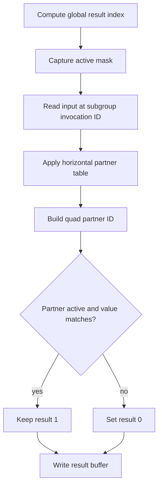

## Overview

**Core question:** Does each quad operation return the value from the correct invocation in its four-invocation quad?

- The `subgroups.quad` test family covers constant and dynamic quad broadcast plus horizontal, vertical, and diagonal quad swaps.
- The same operation body is routed through compute, graphics, framebuffer, mesh, and ray-tracing families when the required stages and features are available.
- Each shader compares the operation result with the selected partner's input and writes 1 for a match or 0 for a mismatch.
- The generated matrix varies operation, scalar or vector format, stage family, explicit stage, and required subgroup size.

## Background Knowledge

For the shared concepts subgroup identity, active invocations, ballots, masks, and quad partitions, see [Background Knowledge](../../categories/subgroups.md#background-knowledge) of the `subgroups` page.

- **Quad-local index:** `gl_SubgroupInvocationID & 0x3` identifies an invocation's position within its quad, while `gl_SubgroupInvocationID & ~0x3` identifies the quad base. The operation's partner must be interpreted within that quad.

## Registration Hierarchy

```text
subgroups.quad
├── graphics
├── compute
├── framebuffer
├── ray_tracing (non-VulkanSC only)
└── mesh (non-VulkanSC only)
```

The `ray_tracing` and `mesh` direct children are omitted from Vulkan SC builds by preprocessor guards.

## Parameter Dimensions and Observed Values

| Dimension | Registered values | Meaning in this test | Evidence |
|-----------|-------------------|----------------------|----------|
| Quad operation | `subgroupquadbroadcast`, `subgroupquadbroadcast_nonconst`, `subgroupquadswaphorizontal`, `subgroupquadswapvertical`, `subgroupquadswapdiagonal` | Selects the value-selection operation and the partner or broadcast-index rule. | [`getOpTypeCaseName()` and `getTestSrc()`](../../../modules/vulkan/subgroups/vktSubgroupsQuadTests.cpp#L96-L179) |
| Data format | Compute, graphics, framebuffer, and mesh use all formats from `getAllFormats()` (scalar and vector widths 1, 2, 3, 4, and, outside Vulkan SC, 8); ray tracing uses the separate `getAllRayTracingFormats()` subset | Changes the input element type, generated declarations, and required format support. | [`getAllFormats()`](../../../modules/vulkan/subgroups/vktSubgroupsTestsUtils.cpp#L1878-L1911) and [`getAllRayTracingFormats()`](../../../modules/vulkan/subgroups/vktSubgroupsTestsUtils.cpp#L4190-L4220) |
| Stage family | `graphics`, `compute`, `framebuffer`, `ray_tracing`, `mesh` | Routes the common operation body through different shader and result-transport harnesses. | [`createSubgroupsQuadTests()`](../../../modules/vulkan/subgroups/vktSubgroupsQuadTests.cpp#L412-L565) |
| Explicit stage | framebuffer: vertex, tessellation evaluation, tessellation control, geometry; mesh: mesh, task | Selects the stage that executes the quad operation in stage-specific families. | [`fbStages` and `meshStages`](../../../modules/vulkan/subgroups/vktSubgroupsQuadTests.cpp#L422-L433) |
| Required subgroup size | disabled, enabled for compute and mesh | The enabled case repeats the harness for every supported power-of-two size from the reported minimum through maximum. | [`test()` required-size loop](../../../modules/vulkan/subgroups/vktSubgroupsQuadTests.cpp#L335-L368) |
| Format-specific support | 8-bit and 16-bit uniform-buffer support for framebuffer cases | Allows the framebuffer input representation selected for extended formats. | [`supportedCheck()`](../../../modules/vulkan/subgroups/vktSubgroupsQuadTests.cpp#L214-L283) |

## Behavior Parameters

The primary behavioral axis is **quad operation** because it changes which invocation supplies the compared value or how the broadcast index is formed. Format and stage dimensions change representation or execution conditions around that operation.

### `subgroupquadbroadcast`: constant quad index

The shader emits four calls with literal indices 0 through 3. Each result is compared with the input at the corresponding position in the same quad.

### `subgroupquadbroadcast_nonconst`: dynamic quad index

The shader loops over indices 0 through 3 and then checks indices that are uniform only in active lanes or only across a quad. This variant exercises dynamic-index rules in addition to ordinary quad broadcast.

### `subgroupquadswaphorizontal`: horizontal partners

The generated table `{1, 0, 3, 2}` swaps local positions 0 with 1 and 2 with 3 within each quad.

### `subgroupquadswapvertical`: vertical partners

The generated table `{2, 3, 0, 1}` swaps the two rows of each quad, pairing local positions 0 with 2 and 1 with 3.

### `subgroupquadswapdiagonal`: diagonal partners

The generated table `{3, 2, 1, 0}` pairs each local position with its diagonal partner in the quad.

## Shader Analysis

The representative compute case uses the horizontal swap with `uint` data. It shows the common compute wrapper, the fixed partner table, the ballot guard, and the result write without stage-specific output plumbing.

### Representative Shader Walkthrough 1

#### Parameter Values Chosen

Representative path:

```text
dEQP-VK.subgroups.quad.compute.subgroupquadswaphorizontal_uint
```

| Parameter choice | Meaning in this representative case |
|------------------|-------------------------------------|
| `compute` | Uses the common compute builder, storage buffers, global invocation indexing, and the ordinary compute result callback. |
| `subgroupquadswaphorizontal` | Selects the `{1, 0, 3, 2}` partner table for each quad. |
| `uint` | Uses exact 32-bit unsigned input and result comparisons. |
| no `_requiredsubgroupsize` suffix | Uses the implementation's ordinary subgroup size rather than requesting each supported size explicitly. |

#### Purpose

This shader checks that `subgroupQuadSwapHorizontal` returns the value from the horizontal partner in the current quad for every active compute invocation.

#### Structural Design



#### Shader Code

```glsl
#version 450
#extension GL_KHR_shader_subgroup_quad: enable
#extension GL_KHR_shader_subgroup_ballot: enable
layout (local_size_x_id = 0, local_size_y_id = 1, local_size_z_id = 2) in;

/// Binding 0 stores one result per global invocation. The host expects every result to remain 1.
layout(set = 0, binding = 0, std430) buffer Buffer1
{
  uint result[];
};
/// Binding 1 contains nonzero uint inputs indexed by subgroup invocation ID.
layout(set = 0, binding = 1, std430) buffer Buffer2
{
  uint data[];
};

void main (void)
{
  uvec3 globalSize = gl_NumWorkGroups * gl_WorkGroupSize;
  highp uint offset = globalSize.x * ((globalSize.y * gl_GlobalInvocationID.z) + gl_GlobalInvocationID.y) + gl_GlobalInvocationID.x;
  uvec4 mask = subgroupBallot(true);
  const uint swapTable[4] = {1, 0, 3, 2};
  uint tempRes = 1;
  uint op = subgroupQuadSwapHorizontal(data[gl_SubgroupInvocationID]);
  uint otherID = (gl_SubgroupInvocationID & ~0x3) + swapTable[gl_SubgroupInvocationID & 0x3];
  if (subgroupBallotBitExtract(mask, otherID) && op != data[otherID])
    tempRes = 0;
  result[offset] = tempRes;
}
```

#### Additional Info

- The exact operation body comes from [`getTestSrc()`](../../../modules/vulkan/subgroups/vktSubgroupsQuadTests.cpp#L122-L179); [`initStdPrograms()`](../../../modules/vulkan/subgroups/vktSubgroupsTestsUtils.cpp#L1406-L1434) supplies the compute declarations, specialization-constant local size, global index calculation, and result write.
- The selected case uses the ordinary operation path, so [`initPrograms()`](../../../modules/vulkan/subgroups/vktSubgroupsQuadTests.cpp#L193-L212) selects SPIR-V 1.3 rather than the SPIR-V 1.5 target reserved for dynamic broadcast indices.

#### Parameter Variation Summary

| Parameter dimension | Shader-level variation from this shader | Evidence |
|---------------------|---------------------------------------|----------|
| Quad operation | Changes the subgroup built-in and either the constant broadcast calls, dynamic-index checks, or swap table. | [`getTestSrc()`](../../../modules/vulkan/subgroups/vktSubgroupsQuadTests.cpp#L122-L179) |
| Data format | Changes `data` and `op` types and adds format-specific GLSL extensions when needed. | [`getExtHeader()` and format helpers](../../../modules/vulkan/subgroups/vktSubgroupsQuadTests.cpp#L115-L120) and [`getAdditionalExtensionForFormat()`](../../../modules/vulkan/subgroups/vktSubgroupsTestsUtils.cpp#L1848-L1875) |
| Stage family | Wraps the same body in compute, graphics, framebuffer, mesh, or ray-tracing source and changes result transport. | [`initFrameBufferPrograms()` and `initPrograms()`](../../../modules/vulkan/subgroups/vktSubgroupsQuadTests.cpp#L182-L212) |
| Explicit stage | Selects the stage-specific shader in framebuffer or mesh registration and changes the helper's result location. | [`fbStages` and `meshStages`](../../../modules/vulkan/subgroups/vktSubgroupsQuadTests.cpp#L422-L433) |
| Required subgroup size | Keeps the operation body but requests each supported power-of-two size through the compute or mesh harness. | [`test()` required-size loop](../../../modules/vulkan/subgroups/vktSubgroupsQuadTests.cpp#L335-L368) |

#### SPIR-V

- Status: generated and validated
- Source: reconstructed `GLSL` from this walkthrough
- Stage: `comp`
- Target SPIRV version: `spirv1.3`

<details>
<summary>Click to expand SPIRV asm code</summary>

```llvm
; SPIR-V
; Version: 1.3
; Generator: Khronos Glslang Reference Front End; 11
; Bound: 94
; Schema: 0
               OpCapability Shader
               OpCapability GroupNonUniform
               OpCapability GroupNonUniformBallot
               OpCapability GroupNonUniformQuad
          %1 = OpExtInstImport "GLSL.std.450"
               OpMemoryModel Logical GLSL450
               OpEntryPoint GLCompute %main "main" %gl_NumWorkGroups %gl_GlobalInvocationID %gl_SubgroupInvocationID
               OpExecutionMode %main LocalSize 1 1 1
               OpSource GLSL 450
               OpSourceExtension "GL_KHR_shader_subgroup_ballot"
               OpSourceExtension "GL_KHR_shader_subgroup_basic"
               OpSourceExtension "GL_KHR_shader_subgroup_quad"
               OpName %main "main"
               OpName %globalSize "globalSize"
               OpName %gl_NumWorkGroups "gl_NumWorkGroups"
               OpName %offset "offset"
               OpName %gl_GlobalInvocationID "gl_GlobalInvocationID"
               OpName %mask "mask"
               OpName %tempRes "tempRes"
               OpName %op "op"
               OpName %Buffer2 "Buffer2"
               OpMemberName %Buffer2 0 "data"
               OpName %_ ""
               OpName %gl_SubgroupInvocationID "gl_SubgroupInvocationID"
               OpName %otherID "otherID"
               OpName %indexable "indexable"
               OpName %Buffer1 "Buffer1"
               OpMemberName %Buffer1 0 "result"
               OpName %__0 ""
               OpDecorate %gl_NumWorkGroups BuiltIn NumWorkgroups
               OpDecorate %13 SpecId 0
               OpDecorate %14 SpecId 1
               OpDecorate %15 SpecId 2
               OpDecorate %gl_WorkGroupSize BuiltIn WorkgroupSize
               OpDecorate %gl_GlobalInvocationID BuiltIn GlobalInvocationId
               OpDecorate %_runtimearr_uint ArrayStride 4
               OpDecorate %Buffer2 Block
               OpMemberDecorate %Buffer2 0 Offset 0
               OpDecorate %_ Binding 1
               OpDecorate %_ DescriptorSet 0
               OpDecorate %gl_SubgroupInvocationID RelaxedPrecision
               OpDecorate %gl_SubgroupInvocationID BuiltIn SubgroupLocalInvocationId
               OpDecorate %55 RelaxedPrecision
               OpDecorate %61 RelaxedPrecision
               OpDecorate %63 RelaxedPrecision
               OpDecorate %67 RelaxedPrecision
               OpDecorate %68 RelaxedPrecision
               OpDecorate %_runtimearr_uint_0 ArrayStride 4
               OpDecorate %Buffer1 Block
               OpMemberDecorate %Buffer1 0 Offset 0
               OpDecorate %__0 Binding 0
               OpDecorate %__0 DescriptorSet 0
       %void = OpTypeVoid
          %3 = OpTypeFunction %void
       %uint = OpTypeInt 32 0
     %v3uint = OpTypeVector %uint 3
%_ptr_Function_v3uint = OpTypePointer Function %v3uint
%_ptr_Input_v3uint = OpTypePointer Input %v3uint
%gl_NumWorkGroups = OpVariable %_ptr_Input_v3uint Input
         %13 = OpSpecConstant %uint 1
         %14 = OpSpecConstant %uint 1
         %15 = OpSpecConstant %uint 1
%gl_WorkGroupSize = OpSpecConstantComposite %v3uint %13 %14 %15
%_ptr_Function_uint = OpTypePointer Function %uint
     %uint_0 = OpConstant %uint 0
     %uint_1 = OpConstant %uint 1
%gl_GlobalInvocationID = OpVariable %_ptr_Input_v3uint Input
     %uint_2 = OpConstant %uint 2
%_ptr_Input_uint = OpTypePointer Input %uint
     %v4uint = OpTypeVector %uint 4
%_ptr_Function_v4uint = OpTypePointer Function %v4uint
       %bool = OpTypeBool
       %true = OpConstantTrue %bool
     %uint_3 = OpConstant %uint 3
%_runtimearr_uint = OpTypeRuntimeArray %uint
    %Buffer2 = OpTypeStruct %_runtimearr_uint
%_ptr_StorageBuffer_Buffer2 = OpTypePointer StorageBuffer %Buffer2
          %_ = OpVariable %_ptr_StorageBuffer_Buffer2 StorageBuffer
        %int = OpTypeInt 32 1
      %int_0 = OpConstant %int 0
%gl_SubgroupInvocationID = OpVariable %_ptr_Input_uint Input
%_ptr_StorageBuffer_uint = OpTypePointer StorageBuffer %uint
%uint_4294967292 = OpConstant %uint 4294967292
     %uint_4 = OpConstant %uint 4
%_arr_uint_uint_4 = OpTypeArray %uint %uint_4
         %66 = OpConstantComposite %_arr_uint_uint_4 %uint_1 %uint_0 %uint_3 %uint_2
%_ptr_Function__arr_uint_uint_4 = OpTypePointer Function %_arr_uint_uint_4
%_runtimearr_uint_0 = OpTypeRuntimeArray %uint
    %Buffer1 = OpTypeStruct %_runtimearr_uint_0
%_ptr_StorageBuffer_Buffer1 = OpTypePointer StorageBuffer %Buffer1
        %__0 = OpVariable %_ptr_StorageBuffer_Buffer1 StorageBuffer
       %main = OpFunction %void None %3
          %5 = OpLabel
 %globalSize = OpVariable %_ptr_Function_v3uint Function
     %offset = OpVariable %_ptr_Function_uint Function
       %mask = OpVariable %_ptr_Function_v4uint Function
    %tempRes = OpVariable %_ptr_Function_uint Function
         %op = OpVariable %_ptr_Function_uint Function
    %otherID = OpVariable %_ptr_Function_uint Function
  %indexable = OpVariable %_ptr_Function__arr_uint_uint_4 Function
         %12 = OpLoad %v3uint %gl_NumWorkGroups
         %17 = OpIMul %v3uint %12 %gl_WorkGroupSize
               OpStore %globalSize %17
         %21 = OpAccessChain %_ptr_Function_uint %globalSize %uint_0
         %22 = OpLoad %uint %21
         %24 = OpAccessChain %_ptr_Function_uint %globalSize %uint_1
         %25 = OpLoad %uint %24
         %29 = OpAccessChain %_ptr_Input_uint %gl_GlobalInvocationID %uint_2
         %30 = OpLoad %uint %29
         %31 = OpIMul %uint %25 %30
         %32 = OpAccessChain %_ptr_Input_uint %gl_GlobalInvocationID %uint_1
         %33 = OpLoad %uint %32
         %34 = OpIAdd %uint %31 %33
         %35 = OpIMul %uint %22 %34
         %36 = OpAccessChain %_ptr_Input_uint %gl_GlobalInvocationID %uint_0
         %37 = OpLoad %uint %36
         %38 = OpIAdd %uint %35 %37
               OpStore %offset %38
         %45 = OpGroupNonUniformBallot %v4uint %uint_3 %true
               OpStore %mask %45
               OpStore %tempRes %uint_1
         %55 = OpLoad %uint %gl_SubgroupInvocationID
         %57 = OpAccessChain %_ptr_StorageBuffer_uint %_ %int_0 %55
         %58 = OpLoad %uint %57
         %59 = OpGroupNonUniformQuadSwap %uint %uint_3 %58 %uint_0
               OpStore %op %59
         %61 = OpLoad %uint %gl_SubgroupInvocationID
         %63 = OpBitwiseAnd %uint %61 %uint_4294967292
         %67 = OpLoad %uint %gl_SubgroupInvocationID
         %68 = OpBitwiseAnd %uint %67 %uint_3
               OpStore %indexable %66
         %71 = OpAccessChain %_ptr_Function_uint %indexable %68
         %72 = OpLoad %uint %71
         %73 = OpIAdd %uint %63 %72
               OpStore %otherID %73
         %74 = OpLoad %v4uint %mask
         %75 = OpLoad %uint %otherID
         %76 = OpGroupNonUniformBallotBitExtract %bool %uint_3 %74 %75
               OpSelectionMerge %78 None
               OpBranchConditional %76 %77 %78
         %77 = OpLabel
         %79 = OpLoad %uint %op
         %80 = OpLoad %uint %otherID
         %81 = OpAccessChain %_ptr_StorageBuffer_uint %_ %int_0 %80
         %82 = OpLoad %uint %81
         %83 = OpINotEqual %bool %79 %82
               OpBranch %78
         %78 = OpLabel
         %84 = OpPhi %bool %76 %5 %83 %77
               OpSelectionMerge %86 None
               OpBranchConditional %84 %85 %86
         %85 = OpLabel
               OpStore %tempRes %uint_0
               OpBranch %86
         %86 = OpLabel
         %91 = OpLoad %uint %offset
         %92 = OpLoad %uint %tempRes
         %93 = OpAccessChain %_ptr_StorageBuffer_uint %__0 %int_0 %91
               OpStore %93 %92
               OpReturn
               OpFunctionEnd
```

</details>

## Runtime Execution and Result Checking

- [`supportedCheck()`](../../../modules/vulkan/subgroups/vktSubgroupsQuadTests.cpp#L214-L283) requires subgroup support, quad operations for the selected stage, the selected format, and any required 8-bit, 16-bit, dynamic-broadcast, subgroup-size-control, ray-tracing, or mesh features.
- Compute and mesh cases initialize nonzero input data in a `std430` storage buffer. The result buffer uses the same storage-buffer path and has one element per global invocation.
- The common compute wrapper uses specialization constants for local size and calculates a linear result offset from `gl_GlobalInvocationID`.
- The shader starts each result at 1. It changes the value to 0 when the selected partner is active but the operation result differs from the partner input.
- [`checkComputeOrMesh()`](../../../modules/vulkan/subgroups/vktSubgroupsTestsUtils.cpp#L2655-L2663) derives the global invocation count and checks every result against 1.
- Required-size compute and mesh cases repeat the harness for each supported power-of-two subgroup size. The first failed size ends the case and is logged.
- Graphics and framebuffer variants use stage-specific result transport. Framebuffer cases draw across increasing widths, copy the color result to a host-readable buffer, and apply the corresponding callback.

## Failure Meaning

### Failure Cause Mapping

| If this behavior parameter value fails | Possible failure cause(s) |
|----------------------------------------|---------------------------|
| `subgroupquadbroadcast` | Incorrect constant quad index handling, quad membership, value selection, or result transport/checking. |
| `subgroupquadbroadcast_nonconst` | Incorrect dynamically uniform broadcast-index handling, quad membership, value selection, or result transport/checking. |
| `subgroupquadswaphorizontal` | Incorrect horizontal partner mapping, quad membership, value selection, or result transport/checking. |
| `subgroupquadswapvertical` | Incorrect vertical partner mapping, quad membership, value selection, or result transport/checking. |
| `subgroupquadswapdiagonal` | Incorrect diagonal partner mapping, quad membership, value selection, or result transport/checking. |

All five values also depend on correct stage support reporting, input binding, shader execution, and result readback.

### Cause Analysis

#### Incorrect quad membership or partner selection

**Possible failure symptoms:** The shader returns a value from the wrong local position, or failures occur only for one swap table or broadcast index. The result buffer contains 0 for those invocations.

**Possible implementation causes:** The implementation may form quad scope instances incorrectly, apply the wrong implicit swap index, or interpret the explicit broadcast index outside the selected quad. The Vulkan specification defines quad operations over the quad scope instance and defines adjacent subgroup invocation indices for the compute shader case.

#### Incorrect dynamic broadcast-index handling

**Possible failure symptoms:** Constant broadcast cases pass while `subgroupquadbroadcast_nonconst` fails, especially in the checks for an index that is active-lane uniform or quad-uniform.

**Possible implementation causes:** The compiler or execution path may reject or mis-handle a dynamic index whose uniformity is valid for the operation's required scope. The device feature check specifically requires dynamic subgroup broadcast ID support for this case. Source-level investigation is needed to separate shader compilation, validation, and execution causes.

#### Incorrect active-invocation or value comparison handling

**Possible failure symptoms:** Failures appear when the selected partner's ballot bit is not set, or the operation result differs from the nonzero input stored at that partner index. The shader writes 0 instead of 1.

**Possible implementation causes:** The subgroup ballot or bit extraction may report the wrong active set, the operation may read a different invocation's value, or the generated type conversion may change the compared value. The exact source path and failing format determine whether the issue is in shader lowering, subgroup execution, or data representation.

#### Incorrect result transport or host checking

**Possible failure symptoms:** Broad failures cluster in one stage family while operation and format variants behave consistently in other families, or the shader-side result is correct but the host observes a value other than 1.

**Possible implementation causes:** Descriptor binding, stage output transport, framebuffer copyback, synchronization, result indexing, or callback interpretation may be wrong. The relevant path differs between storage-buffer, graphics, framebuffer, mesh, and ray-tracing harnesses, so the failing family determines which implementation path needs inspection.

## Case Pruning

### Requirement-based pruning

- The device must support Vulkan subgroups, quad operations for the selected stage, and the selected data format.
- 8-bit and 16-bit framebuffer input formats require the corresponding uniform-buffer storage support.
- `subgroupquadbroadcast_nonconst` requires dynamic subgroup broadcast ID support.
- `_requiredsubgroupsize` compute and mesh cases require `VK_EXT_subgroup_size_control`, `subgroupSizeControl`, `computeFullSubgroups`, and required-size support for the tested stage.
- Ray-tracing cases require `VK_KHR_ray_tracing_pipeline`. Mesh cases require `VK_EXT_mesh_shader` and vertex-pipeline stores and atomics; task cases also require `taskShader`.
- The common stage-support check skips stages that cannot execute the requested quad operation.

### Design-based pruning

- The registration loops use one direct test family per stage arrangement and omit required subgroup sizes from graphics, framebuffer, and ray-tracing cases.
- The framebuffer family uses its separate `noSSBOtest()` path because the helper supplies a std140 uniform input buffer and validates through a color attachment.
- Mesh and ray-tracing registrations are intentionally excluded from Vulkan SC builds.
- The operation body keeps one representative shader walkthrough sufficient. Operation-specific changes belong in the behavior and variation summaries rather than separate walkthroughs for every format and stage.

## Key Takeaways

- Quad operations select values from a four-invocation quad, not from an arbitrary subgroup position.
- The three swap operations differ only in their fixed local partner mappings, while broadcast has constant and dynamic-index forms.
- A result becomes 0 only when the selected partner is active and the operation result differs from that partner's input; inactive partners do not trigger this mismatch check.
- The same operation logic is checked through several stage and resource harnesses, so a stage-specific failure can point to transport or support handling rather than the quad operation itself.
- Required subgroup-size cases test the operation again across each supported power-of-two size for compute and mesh execution.

## Source Reference Appendix

| Entry point | Link | Why it matters |
|-------------|------|----------------|
| Operation names and generated body | [`getOpTypeName()`, `getOpTypeCaseName()`, and `getTestSrc()`](../../../modules/vulkan/subgroups/vktSubgroupsQuadTests.cpp#L77-L179) | Defines the five operations, swap tables, ballot guard, and comparison. |
| Compute program setup | [`initPrograms()`](../../../modules/vulkan/subgroups/vktSubgroupsQuadTests.cpp#L193-L212) | Selects the SPIR-V target and passes the operation body to the common generator. |
| Device support checks | [`supportedCheck()`](../../../modules/vulkan/subgroups/vktSubgroupsQuadTests.cpp#L214-L283) | Defines feature and stage requirements. |
| Compute and stage execution | [`test()`](../../../modules/vulkan/subgroups/vktSubgroupsQuadTests.cpp#L314-L404) | Selects the harness, result path, and required-size behavior. |
| Registration matrix | [`createSubgroupsQuadTests()`](../../../modules/vulkan/subgroups/vktSubgroupsQuadTests.cpp#L412-L565) | Registers operation, format, family, stage, and required-size combinations. |
| Common compute shader wrapper | [`initStdPrograms()`](../../../modules/vulkan/subgroups/vktSubgroupsTestsUtils.cpp#L1406-L1434) | Adds local-size inputs, buffers, global indexing, and result writes. |
| Result callback | [`checkComputeOrMesh()`](../../../modules/vulkan/subgroups/vktSubgroupsTestsUtils.cpp#L2655-L2663) | Checks the full compute or mesh result range against 1. |
| Quad scope membership | [Quad scope](../../../../vulkan-docs/src/chapters/shaders.adoc#L3326-L3355) | Defines adjacent subgroup invocation indices and scope membership. |
| Quad operation semantics | [Quad group operations](../../../../vulkan-docs/src/chapters/shaders.adoc#L3572-L3597) | Defines quad operation scope and index interpretation. |
| Dynamic broadcast requirement | [Subgroup broadcast feature](../../../../vulkan-docs/src/chapters/features.adoc#L952-L957) | Defines the feature requirement for dynamically uniform indices. |
