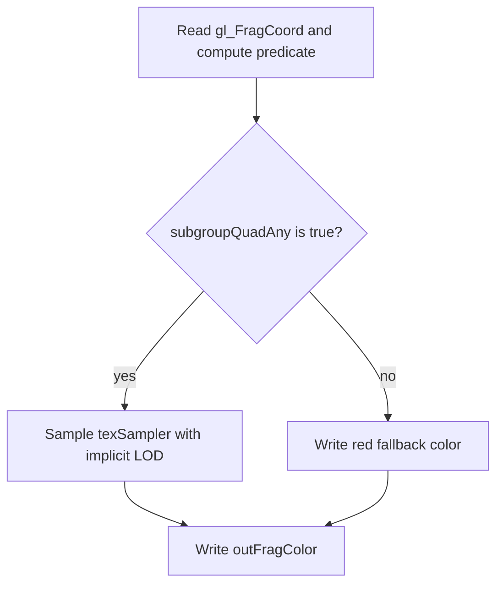

## Overview

**Core question:** Does `VK_KHR_shader_quad_control` produce the required quad scope and active-invocation behavior in fragment shaders?

- This page covers `subgroups.shader_quad_control`, implemented by `vktSubgroupsQuadControlTests.cpp`.
- The test family has four direct children: `quad_derivatives`, `require_full_quads`, `divergent_condition`, and `terminated_invocation`.
- Each child draws a mode-specific primitive, runs a generated fragment shader, copies the color image to host-visible memory, and checks pixels with a mode-specific rule.
- The branch is registered only for non-VulkanSC builds.

## Background Knowledge

For the shared concepts subgroup identity, active invocations, and quad partitions, see [Background Knowledge](../../categories/subgroups.md#background-knowledge) of the `subgroups` page.

- Fragment shaders may use helper invocations to support derivatives or quad operations at framebuffer locations not covered by rasterized fragments. `gl_HelperInvocation` identifies them. Their stores and atomics have no effect on memory except in the `Function`, `Private`, and `Output` storage classes, and fragment-shader `Output` stores still do not affect the framebuffer.
- `OpTerminateInvocation` finishes one shader invocation. Later quad operations and ballots must use the active invocations that remain under the applicable control-flow rules.

## Registration Hierarchy

```text
subgroups.shader_quad_control
├── quad_derivatives
├── require_full_quads
├── divergent_condition
└── terminated_invocation
```

## Parameter Dimensions and Observed Values

| Dimension | Registered values | Meaning in this test | Evidence |
|-----------|-------------------|----------------------|----------|
| Test family | `quad_derivatives`, `require_full_quads`, `divergent_condition`, `terminated_invocation` | Selects the fragment shader, primitive geometry, render size, and pixel checker. | [`createSubgroupsQuadControlTests`](../../../modules/vulkan/subgroups/vktSubgroupsQuadControlTests.cpp#L807-L818) |
| Shader variant | `frag`; `frag_ucf` for the selected termination path when maximal reconvergence is unavailable | Chooses the reconvergence extension used by the termination fragment shader. | [`TerminatedInvocationInstance` and `initPrograms`](../../../modules/vulkan/subgroups/vktSubgroupsQuadControlTests.cpp#L551-L567) |
| Fragment build target | SPIR-V 1.3 | Sets the explicit target used for the generated `frag` and `frag_ucf` programs; `vert` is added without these explicit build options. | [`ShaderBuildOptions` and program insertion](../../../modules/vulkan/subgroups/vktSubgroupsQuadControlTests.cpp#L648-L661), [`fragment program insertion`](../../../modules/vulkan/subgroups/vktSubgroupsQuadControlTests.cpp#L794-L804) |
| Render setup | 32 by 32, 128 by 128, or 16 by 16; triangle list or triangle strip | Changes the fragment coverage and the quad/helper-invocation patterns examined by each family. | [`mode constructors`](../../../modules/vulkan/subgroups/vktSubgroupsQuadControlTests.cpp#L349-L375) |

## Behavior Parameters

The primary behavioral axis is the registered test family. Each value selects a different quad-control property and result checker.

### `quad_derivatives` - quad-based derivative grouping

The fragment shader marks one coordinate on each of five triangles, then uses `subgroupQuadAny` to decide whether the quad should sample the texture. Interpolated coordinates are chosen so the selected pixels expose zero-based mip indices 0, 1, 4, 3, and 2 (the first, second, fifth, fourth, and third mip levels).

### `require_full_quads` - helper lanes in complete quads

The fragment shader computes a lane ID from `gl_SubgroupInvocationID`, checks horizontal, vertical, and diagonal quad swaps, and uses `gl_HelperInvocation` with quad votes. The checker requires valid lane IDs and enough pixels in both helper and non-helper classifications.

### `divergent_condition` - quad votes inside a branch

The fragment shader enters a coordinate-dependent branch and evaluates `subgroupQuadAny` and `subgroupQuadAll` on a second coordinate predicate. The host computes the expected active-lane counts for each 2 by 2 pixel quad and compares red and green output channels.

### `terminated_invocation` - votes after termination

The fragment shader ballots all invocations, terminates the bottom-right invocation in each 2 by 2 quad, ballots again, and checks quad votes against that invocation's removal. The output remains green only when the active mask shrinks and the quad operations exclude the terminated lane.

## Shader Analysis

The `quad_derivatives` case is the representative shader because it combines the `QuadDerivativesKHR` execution mode, a quad vote, implicit texture derivatives, and a visible mip-level result. The vertex shader only forwards position and texture coordinates, so the fragment shader is the relevant stage for this walkthrough.

### Representative Shader Walkthrough 1

#### Parameter Values Chosen

Representative path:

```text
dEQP-VK.subgroups.shader_quad_control.quad_derivatives
```

| Parameter choice | Meaning in this representative case |
|------------------|-------------------------------------|
| `shader_quad_control` | Selects the quad-control test category branch. |
| `quad_derivatives` | Selects `layout(quad_derivatives) in`, `subgroupQuadAny`, and the five-triangle geometry used for mip checks. |
| `frag` | Uses the standard fragment shader generated by `initPrograms`; the termination-only `frag_ucf` variant is not selected. |

#### Purpose

This shader makes one fragment in each test triangle request a texture sample through a quad vote. The host checks that those five samples use the mip levels encoded by the vertex texture coordinates.

#### Structural Design



#### Shader Code

```glsl
#version 450
precision highp float;
precision highp int;
#extension GL_EXT_shader_quad_control: enable
#extension GL_KHR_shader_subgroup_vote: enable
/// QuadDerivativesKHR makes the fragment derivative group the current quad scope instance.
layout(quad_derivatives) in;
/// Location 0 carries interpolated texture coordinates from the vertex shader.
layout(location = 0) in highp vec2 inTexCoords;
/// The output is copied back and compared by the host-side result checker.
layout(location = 0) out vec4 outFragColor;
/// Set 0, binding 0 is a host-created five-mip sampled image with distinct clear colors.
layout(binding = 0) uniform sampler2D texSampler;
void main (void)
{
    // The host vertices place one matching fragment on each triangle.
    bool conditionTrueForOneFrag = (abs(gl_FragCoord.y - 8.5) < 0.1) && (mod(gl_FragCoord.x-3.5, 6.0) < 0.1);
    /// The vote is true for the whole quad when any lane hits the selected coordinate.
    if (subgroupQuadAny(conditionTrueForOneFrag))
        /// Implicit texture sampling uses the fragment coordinate derivatives to choose a mip level.
        outFragColor = texture(texSampler, inTexCoords);
    else
        /// Non-selected quads write a color that the host does not accept at the five probe pixels.
        outFragColor = vec4(0.9, 0.2, 0.2, 1.0);
}
```

#### Additional Info

- `initPrograms` attaches `ShaderBuildOptions` with SPIR-V 1.3 to the fragment shader.
- The host clears five texture mip levels to different colors and chooses the probe coordinates through the vertex texture coordinates.

#### Parameter Variation Summary

| Parameter dimension | Shader-level variation from this shader | Evidence |
|---------------------|---------------------------------------|----------|
| Test family | The other three families replace the fragment source with full-quad, divergent-vote, or termination logic. | [`fragmentSource` branches](../../../modules/vulkan/subgroups/vktSubgroupsQuadControlTests.cpp#L663-L792) |
| Fragment shader variant | The termination family supplies `frag_ucf` with `GL_EXT_subgroup_uniform_control_flow` when maximal reconvergence is unavailable; this representative uses `frag`. | [`variant selection`](../../../modules/vulkan/subgroups/vktSubgroupsQuadControlTests.cpp#L551-L567) |
| Texture coordinates and geometry | This case uses five triangles and coordinates arranged to select the expected mip colors; the other families use different triangle coverage and no texture result check. | [`QuadDerivativesInstance`](../../../modules/vulkan/subgroups/vktSubgroupsQuadControlTests.cpp#L349-L398) |

#### SPIR-V

- Status: generated and validated
- Source: reconstructed `GLSL` from this walkthrough
- Stage: `frag`
- Target SPIRV version: `spirv1.3`

<details>
<summary>Click to expand SPIRV asm code</summary>

```llvm
; SPIR-V
; Version: 1.3
; Generator: Khronos Glslang Reference Front End; 11
; Bound: 56
; Schema: 0
               OpCapability Shader
               OpCapability GroupNonUniform
               OpCapability GroupNonUniformVote
               OpCapability QuadControlKHR
               OpExtension "SPV_KHR_quad_control"
          %1 = OpExtInstImport "GLSL.std.450"
               OpMemoryModel Logical GLSL450
               OpEntryPoint Fragment %main "main" %gl_FragCoord %outFragColor %inTexCoords
               OpExecutionMode %main QuadDerivativesKHR
               OpExecutionMode %main OriginUpperLeft
               OpSource GLSL 450
               OpSourceExtension "GL_EXT_shader_quad_control"
               OpSourceExtension "GL_KHR_shader_subgroup_basic"
               OpSourceExtension "GL_KHR_shader_subgroup_vote"
               OpName %main "main"
               OpName %conditionTrueForOneFrag "conditionTrueForOneFrag"
               OpName %gl_FragCoord "gl_FragCoord"
               OpName %outFragColor "outFragColor"
               OpName %texSampler "texSampler"
               OpName %inTexCoords "inTexCoords"
               OpDecorate %gl_FragCoord BuiltIn FragCoord
               OpDecorate %outFragColor Location 0
               OpDecorate %texSampler Binding 0
               OpDecorate %texSampler DescriptorSet 0
               OpDecorate %inTexCoords Location 0
       %void = OpTypeVoid
          %3 = OpTypeFunction %void
       %bool = OpTypeBool
%_ptr_Function_bool = OpTypePointer Function %bool
      %float = OpTypeFloat 32
    %v4float = OpTypeVector %float 4
%_ptr_Input_v4float = OpTypePointer Input %v4float
%gl_FragCoord = OpVariable %_ptr_Input_v4float Input
       %uint = OpTypeInt 32 0
     %uint_1 = OpConstant %uint 1
%_ptr_Input_float = OpTypePointer Input %float
  %float_8_5 = OpConstant %float 8.5
%float_0_100000001 = OpConstant %float 0.100000001
     %uint_0 = OpConstant %uint 0
  %float_3_5 = OpConstant %float 3.5
    %float_6 = OpConstant %float 6
     %uint_3 = OpConstant %uint 3
%_ptr_Output_v4float = OpTypePointer Output %v4float
%outFragColor = OpVariable %_ptr_Output_v4float Output
         %41 = OpTypeImage %float 2D 0 0 0 1 Unknown
         %42 = OpTypeSampledImage %41
%_ptr_UniformConstant_42 = OpTypePointer UniformConstant %42
 %texSampler = OpVariable %_ptr_UniformConstant_42 UniformConstant
    %v2float = OpTypeVector %float 2
%_ptr_Input_v2float = OpTypePointer Input %v2float
%inTexCoords = OpVariable %_ptr_Input_v2float Input
%float_0_899999976 = OpConstant %float 0.899999976
%float_0_200000003 = OpConstant %float 0.200000003
    %float_1 = OpConstant %float 1
         %55 = OpConstantComposite %v4float %float_0_899999976 %float_0_200000003 %float_0_200000003 %float_1
       %main = OpFunction %void None %3
          %5 = OpLabel
%conditionTrueForOneFrag = OpVariable %_ptr_Function_bool Function
         %16 = OpAccessChain %_ptr_Input_float %gl_FragCoord %uint_1
         %17 = OpLoad %float %16
         %19 = OpFSub %float %17 %float_8_5
         %20 = OpExtInst %float %1 FAbs %19
         %22 = OpFOrdLessThan %bool %20 %float_0_100000001
               OpSelectionMerge %24 None
               OpBranchConditional %22 %23 %24
         %23 = OpLabel
         %26 = OpAccessChain %_ptr_Input_float %gl_FragCoord %uint_0
         %27 = OpLoad %float %26
         %29 = OpFSub %float %27 %float_3_5
         %31 = OpFMod %float %29 %float_6
         %32 = OpFOrdLessThan %bool %31 %float_0_100000001
               OpBranch %24
         %24 = OpLabel
         %33 = OpPhi %bool %22 %5 %32 %23
               OpStore %conditionTrueForOneFrag %33
         %34 = OpLoad %bool %conditionTrueForOneFrag
         %36 = OpGroupNonUniformQuadAnyKHR %bool %34
               OpSelectionMerge %38 None
               OpBranchConditional %36 %37 %51
         %37 = OpLabel
         %45 = OpLoad %42 %texSampler
         %49 = OpLoad %v2float %inTexCoords
         %50 = OpImageSampleImplicitLod %v4float %45 %49
               OpStore %outFragColor %50
               OpBranch %38
         %51 = OpLabel
               OpStore %outFragColor %55
               OpBranch %38
         %38 = OpLabel
               OpReturn
               OpFunctionEnd
```

</details>

## Runtime Execution and Result Checking

- The shared instance creates a host-visible vertex buffer, a host-visible output buffer, a color image, and a five-mip sampled texture. The color image and texture use `VK_FORMAT_R8G8B8A8_UNORM`.
- The host clears each texture mip level to one of five colors, transitions the texture for shader reads, begins a render pass, binds the pipeline and descriptor set, and draws the mode-specific vertices.
- After the draw, the host transitions the color image for transfer, copies it into the output buffer, waits for the queue, and constructs a `tcu::ConstPixelBufferAccess` over the mapped data.
- The mode-specific `isResultCorrect` method determines pass or fail. A mismatch logs the result image and returns `Fail`.

## Failure Meaning

### Failure Cause Mapping

| If this behavior parameter value fails | Possible failure cause(s) |
|----------------------------------------|---------------------------|
| `quad_derivatives` | Incorrect quad derivative grouping or `subgroupQuadAny` participation; implicit texture LOD or coordinate derivatives produce the wrong mip selection; fragment interpolation or image sampling setup is wrong. |
| `require_full_quads` | Incorrect helper invocation creation or `gl_HelperInvocation` reporting; quad lane IDs or quad swap operations are wrong; `subgroupQuadAny` or `subgroupQuadAll` includes the wrong lanes. |
| `divergent_condition` | Quad vote operations do not evaluate the intended four-lane scope under divergent control flow; active-lane participation or coordinate-based expectation is wrong. |
| `terminated_invocation` | Invocation termination does not remove the selected lane from later ballots and quad votes; reconvergence or quad-control handling is wrong; the fragment output records an error. |

### Cause Analysis

#### Quad derivative grouping or sampling

**Possible failure symptoms:** One or more of the five probe pixels differs from its expected mip clear color by more than `0.1`, so `QuadDerivativesInstance::isResultCorrect` returns false.

**Possible implementation causes:** The fragment derivative group may not follow `QuadDerivativesKHR`, or implicit image sampling may use incorrect coordinate derivatives. The Vulkan specification defines derivative groups and the relation between implicit image sampling and coordinate derivatives in [`Derivative Operations`](../../../../vulkan-docs/src/chapters/shaders.adoc#L3600-L3717). The source also fixes the sampler, mip colors, vertices, and probe pixels in [`QuadDerivativesInstance`](../../../modules/vulkan/subgroups/vktSubgroupsQuadControlTests.cpp#L349-L398).

#### Helper invocation and quad operation behavior

**Possible failure symptoms:** `require_full_quads` fails its lane-ID equality or helper-count thresholds, `divergent_condition` finds a red or green channel inconsistent with its computed 2 by 2 expectation, or `terminated_invocation` records red or blue error output.

**Possible implementation causes:** The active lanes supplied to quad operations, the helper-invocation state, or the handling of a terminated lane may differ from the shader rules. The specification defines quad operation scope in [`Quad Group Operations`](../../../../vulkan-docs/src/chapters/shaders.adoc#L3572-L3597), helper behavior in [`Helper Invocations`](../../../../vulkan-docs/src/chapters/shaders.adoc#L3728-L3773), and termination in [`Shader Termination`](../../../../vulkan-docs/src/chapters/shaders.adoc#L1841-L1859). The exact output predicates and host checks are in [`mode-specific fragment sources and checks`](../../../modules/vulkan/subgroups/vktSubgroupsQuadControlTests.cpp#L377-L597).

#### Host setup or result transfer

**Possible failure symptoms:** The output image contains incorrect colors or values even when the fragment shader's quad result is otherwise valid, and the shared checker returns `Fail`.

**Possible implementation causes:** Source inspection identifies the required image layouts, transfer, queue wait, and host invalidation in [`iterate`](../../../modules/vulkan/subgroups/vktSubgroupsQuadControlTests.cpp#L263-L336). If the failure is not explained by those source-backed checks, source-level investigation is needed rather than assuming a driver, hardware, or host fault.

## Case Pruning

### Requirement-based pruning

- Every test case requires `VK_KHR_shader_quad_control`.
- `terminated_invocation` additionally requires `VK_KHR_shader_terminate_invocation` and at least one of `VK_KHR_shader_maximal_reconvergence` or `VK_KHR_shader_subgroup_uniform_control_flow`.
- The dispatcher includes this implementation and registers its test family only when `CTS_USES_VULKANSC` is not defined.

### Design-based pruning

- The implementation uses one representative branch per quad-control behavior rather than combining all four behaviors into one shader.
- The shared draw harness uses a fixed sampled texture, image format, descriptor binding, and copyback path. Each family changes only the geometry, selected shader logic, and checker needed to expose its property.
- Generated deep leaves are not present in this implementation. The four registered child names are the complete direct-child set.

## Key Takeaways

- `quad_derivatives` turns quad grouping into a visible mip-selection check through `subgroupQuadAny` and implicit texture sampling.
- `require_full_quads` checks both quad lane identity and helper-lane coverage instead of accepting a single vote result.
- `divergent_condition` compares quad votes with a host-computed 2 by 2 active-lane model.
- `terminated_invocation` checks the active mask before and after terminating the bottom-right lane, then checks quad votes against the remaining lanes.
- A failure identifies a mismatch in one of these quad-control behaviors or in the shared draw and readback path. The exact cause requires the family-specific evidence in `## Failure Meaning`.

## Source Reference Appendix

| Entry point | Link | Why it matters |
|-------------|------|----------------|
| `TestMode` and shared instance state | [`vktSubgroupsQuadControlTests.cpp#L53-L100`](../../../modules/vulkan/subgroups/vktSubgroupsQuadControlTests.cpp#L53-L100) | Defines the four behavior values and common render state. |
| `DrawWithQuadControlInstanceBase::iterate` | [`vktSubgroupsQuadControlTests.cpp#L124-L336`](../../../modules/vulkan/subgroups/vktSubgroupsQuadControlTests.cpp#L124-L336) | Creates resources, records the draw, copies back pixels, and dispatches result checking. |
| Mode-specific instances and checks | [`vktSubgroupsQuadControlTests.cpp#L339-L597`](../../../modules/vulkan/subgroups/vktSubgroupsQuadControlTests.cpp#L339-L597) | Supplies geometry and the four pass/fail contracts. |
| `DrawWithQuadControlTestCase::checkSupport` | [`vktSubgroupsQuadControlTests.cpp#L621-L633`](../../../modules/vulkan/subgroups/vktSubgroupsQuadControlTests.cpp#L621-L633) | Defines feature gates, including termination dependencies. |
| `DrawWithQuadControlTestCase::initPrograms` | [`vktSubgroupsQuadControlTests.cpp#L648-L805`](../../../modules/vulkan/subgroups/vktSubgroupsQuadControlTests.cpp#L648-L805) | Generates the vertex and mode-specific fragment programs and sets SPIR-V 1.3. |
| `createSubgroupsQuadControlTests` | [`vktSubgroupsQuadControlTests.cpp#L807-L818`](../../../modules/vulkan/subgroups/vktSubgroupsQuadControlTests.cpp#L807-L818) | Registers the four direct children below `subgroups.shader_quad_control`. |
| Mustpass paths | [`subgroups.txt#L38070-L38073`](../../../mustpass/main/vk-default/subgroups.txt#L38070-L38073) | Lists all four default exact executable paths. |
| Quad and derivative semantics | [`shaders.adoc#L3572-L3647`](../../../../vulkan-docs/src/chapters/shaders.adoc#L3572-L3647) | Defines quad operations, derivative grouping, and helper launches. |
| Helper invocation semantics | [`shaders.adoc#L3728-L3773`](../../../../vulkan-docs/src/chapters/shaders.adoc#L3728-L3773) | Defines helper identity and effects. |
| Termination semantics | [`shaders.adoc#L1841-L1859`](../../../../vulkan-docs/src/chapters/shaders.adoc#L1841-L1859) | Defines shader invocation termination. |
| Quad-control feature | [`features.adoc#L8889-L8906`](../../../../vulkan-docs/src/chapters/features.adoc#L8889-L8906) | Defines `shaderQuadControl` and `QuadControlKHR`. |
| Termination feature | [`features.adoc#L5250-L5283`](../../../../vulkan-docs/src/chapters/features.adoc#L5250-L5283) | Defines `shaderTerminateInvocation`. |
