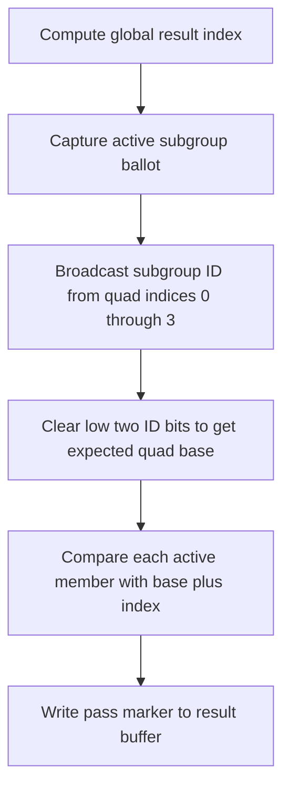

## Overview

**Core question:** Do clustered and quad subgroup operations use exactly the invocations required by their specified shapes?

- The `subgroups.shape` test family checks membership rather than arithmetic values: clustered operations must stay inside consecutive power-of-two partitions, while quad broadcasts must address the four members of the current quad.
- The same shape body runs through graphics, compute, framebuffer, ray-tracing, and mesh harnesses where those execution families are available.
- Every tested invocation reconstructs expected members from subgroup invocation IDs and an active-invocation ballot, then writes a pass marker that must equal `1`.
- The matrix varies shape operation, execution family, explicit stage, and optional required subgroup size.

## Background Knowledge

For the shared concepts subgroup identity, active invocations, ballots, masks, quad partitions, and clustered partitions, see [Background Knowledge](../../categories/subgroups.md#background-knowledge) of the `subgroups` page.

## Registration Hierarchy

```text
subgroups.shape
├── graphics
├── compute
├── framebuffer
├── ray_tracing
└── mesh
```

The `ray_tracing` and `mesh` intermediate nodes are omitted from Vulkan SC builds. The ordinary Vulkan default mustpass contains all five intermediate nodes.

## Parameter Dimensions and Observed Values

| Dimension | Registered values | Meaning in this test | Evidence |
|-----------|-------------------|----------------------|----------|
| Shape operation | `clustered`, `quad` | Selects consecutive power-of-two partition membership or four-member quad membership. | [`getBodySource()`](../../../modules/vulkan/subgroups/vktSubgroupsShapeTests.cpp#L94-L151) |
| Execution family | `graphics`, `compute`, `framebuffer`, `ray_tracing`, `mesh` | Routes the same membership check through different shader-stage and result-transport harnesses. | [`createSubgroupsShapeTests()`](../../../modules/vulkan/subgroups/vktSubgroupsShapeTests.cpp#L389-L500) |
| Explicit stage | framebuffer: `vertex`, `tess_eval`, `tess_control`, `geometry`; mesh: `mesh`, `task` | Selects the stage that executes the subgroup shape body in stage-specific families. | [Stage arrays and registration loops](../../../modules/vulkan/subgroups/vktSubgroupsShapeTests.cpp#L399-L488) |
| Required subgroup size | disabled, enabled for compute and mesh or task | Enabled leaves repeat the same shape check for every supported power-of-two size from the reported minimum through maximum. | [`test()` required-size loop](../../../modules/vulkan/subgroups/vktSubgroupsShapeTests.cpp#L325-L362) |
| Cluster size | powers of two from 1 through 128, limited at runtime by `gl_SubgroupSize` | Checks every cluster partition size supported by the generated shader and current subgroup. | [`getBodySource()` clustered loop](../../../modules/vulkan/subgroups/vktSubgroupsShapeTests.cpp#L101-L127) |

The default Vulkan mustpass contains 24 executable shape cases: 2 graphics, 4 compute, 8 framebuffer, 8 mesh, and 2 ray-tracing cases. No shape-specific entry appears in `mustpass/main/src/test-issues.txt`.

## Behavior Parameters

The primary behavioral axis is **`opType` shape operation** because it changes the membership rule being tested. Stage family and required subgroup size change where or under which size that rule runs.

### clustered: consecutive power-of-two partitions

Each invocation contributes a one-bit mask at its own subgroup ID. For every cluster size from 1 through 128 that fits the current subgroup, `subgroupClusteredOr` must return the bits belonging to the invocation's consecutive cluster. The shader compares each expected active member bit against the ballot, exposing both missing members and leakage across a cluster boundary.

### quad: four indexed members

Each invocation broadcasts `gl_SubgroupInvocationID` from quad indices 0, 1, 2, and 3. The expected values are the four IDs beginning at `gl_SubgroupInvocationID & ~0x3`. Comparisons are restricted to active IDs from the ballot, so incomplete active coverage does not create a false mismatch.

## Shader Analysis

The representative compute case isolates the quad membership rule without stage-specific graphics or ray-tracing plumbing. It uses the ordinary implementation-selected subgroup size; nearby required-size cases keep the same GLSL body and change pipeline state.

### Representative Shader Walkthrough 1

#### Parameter Values Chosen

Representative path:

```text
dEQP-VK.subgroups.shape.compute.quad
```

| Parameter choice | Meaning in this representative case |
|------------------|-------------------------------------|
| `compute` | Uses the common compute wrapper, specialization-controlled local size, one result storage buffer, and SPIR-V 1.3 build options. |
| `quad` | Selects four indexed `subgroupQuadBroadcast` calls and the four-member membership check. |
| no `_requiredsubgroupsize` suffix | Uses the implementation's ordinary subgroup size rather than requesting each supported size explicitly. |

#### Purpose

This shader checks that each indexed quad broadcast returns the subgroup invocation ID of the requested member of the current four-invocation quad.

#### Structural Design



#### Shader Code

```glsl
#version 450
#extension GL_KHR_shader_subgroup_quad: enable
#extension GL_KHR_shader_subgroup_ballot: enable
layout (local_size_x_id = 0, local_size_y_id = 1, local_size_z_id = 2) in;

/// Binding 0 is a std430 result buffer with one uint per global invocation. A value of 1 means every checked quad lane matched its expected subgroup invocation ID.
layout(set = 0, binding = 0, std430) buffer Buffer1
{
  uint result[];
};

void main (void)
{
  /// Flatten the three-dimensional dispatch so each invocation owns one result element.
  uvec3 globalSize = gl_NumWorkGroups * gl_WorkGroupSize;
  highp uint offset = globalSize.x * ((globalSize.y * gl_GlobalInvocationID.z) + gl_GlobalInvocationID.y) + gl_GlobalInvocationID.x;
  uint tempRes;
  uint tempResult = 0x1;
  uvec4 mask = subgroupBallot(true);
  /// Read the subgroup invocation ID contributed by each index in this invocation's four-lane quad.
  uint cluster[4] =
  {
    subgroupQuadBroadcast(gl_SubgroupInvocationID, 0),
    subgroupQuadBroadcast(gl_SubgroupInvocationID, 1),
    subgroupQuadBroadcast(gl_SubgroupInvocationID, 2),
    subgroupQuadBroadcast(gl_SubgroupInvocationID, 3)
  };
  uint rootID = gl_SubgroupInvocationID & ~0x3;
  /// Check only active lanes reported by the ballot. Any wrong broadcast changes the pass marker from 1.
  for (uint i = 0; i < 4; i++)
  {
    uint nextID = rootID + i;
    if (subgroupBallotBitExtract(mask, nextID) && (cluster[i] != nextID))
    {
      tempResult = mask.x;
    }
  }
  tempRes = tempResult;
  result[offset] = tempRes;
}
```

#### Additional Info

- [`getBodySource()`](../../../modules/vulkan/subgroups/vktSubgroupsShapeTests.cpp#L94-L151) supplies the quad body. [`initStdPrograms()`](../../../modules/vulkan/subgroups/vktSubgroupsTestsUtils.cpp#L1406-L1434) supplies the compute declarations, specialization-constant local size, global index calculation, and result write.
- The failure assignment is `mask.x`, not a constant zero. With the subgroup sizes accepted by the quad support rules, the active ballot contains bit 0, so this value differs from the required marker `1` when a comparison fails.

#### Parameter Variation Summary

| Parameter dimension | Shader-level variation from this shader | Evidence |
|---------------------|---------------------------------------|----------|
| Shape operation | `clustered` replaces indexed quad broadcasts with one-bit contributions and `subgroupClusteredOr` checks for each power-of-two cluster size. | [`getBodySource()`](../../../modules/vulkan/subgroups/vktSubgroupsShapeTests.cpp#L94-L151) |
| Shader stage family | Wraps the same body in compute, graphics, framebuffer, mesh, task, or ray-tracing source and changes result transport. | [`initFrameBufferPrograms()` and `initPrograms()`](../../../modules/vulkan/subgroups/vktSubgroupsShapeTests.cpp#L168-L225) |
| Explicit stage | Selects stage-specific declarations and output indexing in the common wrappers. | [`getFramebufferPerStageHeadDeclarations()` and `getPerStageHeadDeclarations()`](../../../modules/vulkan/subgroups/vktSubgroupsShapeTests.cpp#L154-L205) |
| Required subgroup size | Keeps the GLSL membership body but requests a particular power-of-two subgroup size in pipeline state. | [`test()`](../../../modules/vulkan/subgroups/vktSubgroupsShapeTests.cpp#L315-L381) |

#### SPIR-V

- Status: generated and validated
- Source: reconstructed `GLSL` from this walkthrough
- Stage: `comp`
- Target SPIRV version: `spirv1.3`

<details>
<summary>Click to expand SPIRV asm code</summary>

```llvm
; SPIR-V
; Version: 1.3
; Generator: Khronos Glslang Reference Front End; 11
; Bound: 107
; Schema: 0
               OpCapability Shader
               OpCapability GroupNonUniform
               OpCapability GroupNonUniformBallot
               OpCapability GroupNonUniformQuad
          %1 = OpExtInstImport "GLSL.std.450"
               OpMemoryModel Logical GLSL450
               OpEntryPoint GLCompute %main "main" %gl_NumWorkGroups %gl_GlobalInvocationID %gl_SubgroupInvocationID
               OpExecutionMode %main LocalSize 1 1 1
               OpSource GLSL 450
               OpSourceExtension "GL_KHR_shader_subgroup_ballot"
               OpSourceExtension "GL_KHR_shader_subgroup_basic"
               OpSourceExtension "GL_KHR_shader_subgroup_quad"
               OpName %main "main"
               OpName %globalSize "globalSize"
               OpName %gl_NumWorkGroups "gl_NumWorkGroups"
               OpName %offset "offset"
               OpName %gl_GlobalInvocationID "gl_GlobalInvocationID"
               OpName %tempResult "tempResult"
               OpName %mask "mask"
               OpName %cluster "cluster"
               OpName %gl_SubgroupInvocationID "gl_SubgroupInvocationID"
               OpName %rootID "rootID"
               OpName %i "i"
               OpName %nextID "nextID"
               OpName %tempRes "tempRes"
               OpName %Buffer1 "Buffer1"
               OpMemberName %Buffer1 0 "result"
               OpName %_ ""
               OpDecorate %gl_NumWorkGroups BuiltIn NumWorkgroups
               OpDecorate %13 SpecId 0
               OpDecorate %14 SpecId 1
               OpDecorate %15 SpecId 2
               OpDecorate %gl_WorkGroupSize BuiltIn WorkgroupSize
               OpDecorate %gl_GlobalInvocationID BuiltIn GlobalInvocationId
               OpDecorate %gl_SubgroupInvocationID RelaxedPrecision
               OpDecorate %gl_SubgroupInvocationID BuiltIn SubgroupLocalInvocationId
               OpDecorate %52 RelaxedPrecision
               OpDecorate %54 RelaxedPrecision
               OpDecorate %56 RelaxedPrecision
               OpDecorate %58 RelaxedPrecision
               OpDecorate %62 RelaxedPrecision
               OpDecorate %64 RelaxedPrecision
               OpDecorate %_runtimearr_uint ArrayStride 4
               OpDecorate %Buffer1 Block
               OpMemberDecorate %Buffer1 0 Offset 0
               OpDecorate %_ Binding 0
               OpDecorate %_ DescriptorSet 0
       %void = OpTypeVoid
          %3 = OpTypeFunction %void
       %uint = OpTypeInt 32 0
     %v3uint = OpTypeVector %uint 3
%_ptr_Function_v3uint = OpTypePointer Function %v3uint
%_ptr_Input_v3uint = OpTypePointer Input %v3uint
%gl_NumWorkGroups = OpVariable %_ptr_Input_v3uint Input
         %13 = OpSpecConstant %uint 1
         %14 = OpSpecConstant %uint 1
         %15 = OpSpecConstant %uint 1
%gl_WorkGroupSize = OpSpecConstantComposite %v3uint %13 %14 %15
%_ptr_Function_uint = OpTypePointer Function %uint
     %uint_0 = OpConstant %uint 0
     %uint_1 = OpConstant %uint 1
%gl_GlobalInvocationID = OpVariable %_ptr_Input_v3uint Input
     %uint_2 = OpConstant %uint 2
%_ptr_Input_uint = OpTypePointer Input %uint
     %v4uint = OpTypeVector %uint 4
%_ptr_Function_v4uint = OpTypePointer Function %v4uint
       %bool = OpTypeBool
       %true = OpConstantTrue %bool
     %uint_3 = OpConstant %uint 3
     %uint_4 = OpConstant %uint 4
%_arr_uint_uint_4 = OpTypeArray %uint %uint_4
%_ptr_Function__arr_uint_uint_4 = OpTypePointer Function %_arr_uint_uint_4
%gl_SubgroupInvocationID = OpVariable %_ptr_Input_uint Input
%uint_4294967292 = OpConstant %uint 4294967292
        %int = OpTypeInt 32 1
      %int_1 = OpConstant %int 1
%_runtimearr_uint = OpTypeRuntimeArray %uint
    %Buffer1 = OpTypeStruct %_runtimearr_uint
%_ptr_StorageBuffer_Buffer1 = OpTypePointer StorageBuffer %Buffer1
          %_ = OpVariable %_ptr_StorageBuffer_Buffer1 StorageBuffer
      %int_0 = OpConstant %int 0
%_ptr_StorageBuffer_uint = OpTypePointer StorageBuffer %uint
       %main = OpFunction %void None %3
          %5 = OpLabel
 %globalSize = OpVariable %_ptr_Function_v3uint Function
     %offset = OpVariable %_ptr_Function_uint Function
 %tempResult = OpVariable %_ptr_Function_uint Function
       %mask = OpVariable %_ptr_Function_v4uint Function
    %cluster = OpVariable %_ptr_Function__arr_uint_uint_4 Function
     %rootID = OpVariable %_ptr_Function_uint Function
          %i = OpVariable %_ptr_Function_uint Function
     %nextID = OpVariable %_ptr_Function_uint Function
    %tempRes = OpVariable %_ptr_Function_uint Function
         %12 = OpLoad %v3uint %gl_NumWorkGroups
         %17 = OpIMul %v3uint %12 %gl_WorkGroupSize
               OpStore %globalSize %17
         %21 = OpAccessChain %_ptr_Function_uint %globalSize %uint_0
         %22 = OpLoad %uint %21
         %24 = OpAccessChain %_ptr_Function_uint %globalSize %uint_1
         %25 = OpLoad %uint %24
         %29 = OpAccessChain %_ptr_Input_uint %gl_GlobalInvocationID %uint_2
         %30 = OpLoad %uint %29
         %31 = OpIMul %uint %25 %30
         %32 = OpAccessChain %_ptr_Input_uint %gl_GlobalInvocationID %uint_1
         %33 = OpLoad %uint %32
         %34 = OpIAdd %uint %31 %33
         %35 = OpIMul %uint %22 %34
         %36 = OpAccessChain %_ptr_Input_uint %gl_GlobalInvocationID %uint_0
         %37 = OpLoad %uint %36
         %38 = OpIAdd %uint %35 %37
               OpStore %offset %38
               OpStore %tempResult %uint_1
         %46 = OpGroupNonUniformBallot %v4uint %uint_3 %true
               OpStore %mask %46
         %52 = OpLoad %uint %gl_SubgroupInvocationID
         %53 = OpGroupNonUniformQuadBroadcast %uint %uint_3 %52 %uint_0
         %54 = OpLoad %uint %gl_SubgroupInvocationID
         %55 = OpGroupNonUniformQuadBroadcast %uint %uint_3 %54 %uint_1
         %56 = OpLoad %uint %gl_SubgroupInvocationID
         %57 = OpGroupNonUniformQuadBroadcast %uint %uint_3 %56 %uint_2
         %58 = OpLoad %uint %gl_SubgroupInvocationID
         %59 = OpGroupNonUniformQuadBroadcast %uint %uint_3 %58 %uint_3
         %60 = OpCompositeConstruct %_arr_uint_uint_4 %53 %55 %57 %59
               OpStore %cluster %60
         %62 = OpLoad %uint %gl_SubgroupInvocationID
         %64 = OpBitwiseAnd %uint %62 %uint_4294967292
               OpStore %rootID %64
               OpStore %i %uint_0
               OpBranch %66
         %66 = OpLabel
               OpLoopMerge %68 %69 None
               OpBranch %70
         %70 = OpLabel
         %71 = OpLoad %uint %i
         %72 = OpULessThan %bool %71 %uint_4
               OpBranchConditional %72 %67 %68
         %67 = OpLabel
         %74 = OpLoad %uint %rootID
         %75 = OpLoad %uint %i
         %76 = OpIAdd %uint %74 %75
               OpStore %nextID %76
         %77 = OpLoad %v4uint %mask
         %78 = OpLoad %uint %nextID
         %79 = OpGroupNonUniformBallotBitExtract %bool %uint_3 %77 %78
               OpSelectionMerge %81 None
               OpBranchConditional %79 %80 %81
         %80 = OpLabel
         %82 = OpLoad %uint %i
         %83 = OpAccessChain %_ptr_Function_uint %cluster %82
         %84 = OpLoad %uint %83
         %85 = OpLoad %uint %nextID
         %86 = OpINotEqual %bool %84 %85
               OpBranch %81
         %81 = OpLabel
         %87 = OpPhi %bool %79 %67 %86 %80
               OpSelectionMerge %89 None
               OpBranchConditional %87 %88 %89
         %88 = OpLabel
         %90 = OpAccessChain %_ptr_Function_uint %mask %uint_0
         %91 = OpLoad %uint %90
               OpStore %tempResult %91
               OpBranch %89
         %89 = OpLabel
               OpBranch %69
         %69 = OpLabel
         %92 = OpLoad %uint %i
         %95 = OpIAdd %uint %92 %int_1
               OpStore %i %95
               OpBranch %66
         %68 = OpLabel
         %97 = OpLoad %uint %tempResult
               OpStore %tempRes %97
        %103 = OpLoad %uint %offset
        %104 = OpLoad %uint %tempRes
        %106 = OpAccessChain %_ptr_StorageBuffer_uint %_ %int_0 %103
               OpStore %106 %104
               OpReturn
               OpFunctionEnd
```

</details>

## Runtime Execution and Result Checking

- [`supportedCheck()`](../../../modules/vulkan/subgroups/vktSubgroupsShapeTests.cpp#L227-L292) requires subgroup support, ballot operations, the selected clustered or quad feature, and support for the chosen stage. Quad cases outside fragment and compute also depend on `quadOperationsInAllStages`.
- Compute and mesh use 4 by 2 by 2 workgroups and seven local-size configurations, including single invocation, subgroup-sized axes, common rectangular layouts, and `3 x 5 x 7`. The output buffer contains one `R32_UINT` marker per global invocation.
- Graphics and ray-tracing paths use shared stage harnesses and stage-specific result storage. Framebuffer leaves write `R32_UINT` color output, copy the attachment into a host-readable buffer, and scan the relevant width.
- After compute or mesh execution, a shader-write to host-read barrier makes result writes available. The host waits, invalidates mapped memory, and checks every expected marker.
- [`check()`](../../../modules/vulkan/subgroups/vktSubgroupsTestsUtils.cpp#L2640-L2652) requires every observed uint to equal `1`. [`checkComputeOrMesh()`](../../../modules/vulkan/subgroups/vktSubgroupsTestsUtils.cpp#L2655-L2663) computes the full invocation count before applying the same rule.
- Required-size leaves repeat the harness for every supported power-of-two subgroup size. The first failed size is logged and ends the case.

## Failure Meaning

### Failure Cause Mapping

| If this behavior parameter value fails | Possible failure cause(s) |
|----------------------------------------|---------------------------|
| `clustered` | Incorrect consecutive power-of-two cluster membership, incorrect clustered OR aggregation, or incorrect active-invocation ballot bits. |
| `quad` | Incorrect four-invocation quad membership, incorrect indexed quad broadcast, or incorrect active-invocation ballot bits. |

A failure in either value can also come from stage-specific execution, result storage, synchronization, or host readback rather than the subgroup operation itself.

### Cause Analysis

#### Incorrect clustered partition or OR semantics

**Possible failure symptoms:** one or more clustered outputs are not `1`, failures appear only at particular cluster sizes, or results include a bit outside the expected consecutive partition or omit an active member inside it.

**Possible implementation causes:** the shader compiler or subgroup execution may lower `OpGroupNonUniform*` clustered semantics with the wrong power-of-two partition base, size, or OR aggregation. Vulkan defines these partitions as consecutive and limits the operation to members within each partition.

#### Incorrect quad membership or indexed broadcast

**Possible failure symptoms:** quad outputs differ from `1`, one broadcast index repeatedly returns the wrong invocation ID, or failures track quad boundaries within the subgroup.

**Possible implementation causes:** indexed quad broadcast may select the wrong member, or quad formation may not use the required four consecutive subgroup invocation indices. Vulkan defines the first index as a multiple of four and requires all four members to be in the same subgroup.

#### Incorrect active-invocation ballot handling

**Possible failure symptoms:** both shape operations fail when checking member IDs near an inactive part of the subgroup, even though full active shapes pass.

**Possible implementation causes:** ballot construction or bit extraction may report the wrong active set or index. Source-level investigation is needed to distinguish subgroup ballot lowering from stage-specific active-invocation behavior.

#### Incorrect stage execution or result transport

**Possible failure symptoms:** failures affect clustered and quad cases in one execution family while the same operations pass elsewhere, or host-visible markers are not `1` despite correct shader-side comparisons.

**Possible implementation causes:** stage support reporting, descriptor binding, output indexing, framebuffer conversion and copyback, shader-write visibility, or mapped-memory invalidation may be wrong. The failing family determines which common harness path needs inspection.

## Case Pruning

### Requirement-based pruning

- The device must support Vulkan subgroups, ballot operations, the selected clustered or quad operation, and the chosen shader stage.
- Quad tests in stages other than fragment and compute require quad operations in all subgroup-capable stages.
- `_requiredsubgroupsize` leaves require `VK_EXT_subgroup_size_control`, `subgroupSizeControl`, `computeFullSubgroups`, and required-size support for the selected compute, mesh, or task stage.
- Ray-tracing cases require `VK_KHR_ray_tracing_pipeline`. Mesh cases require vertex-pipeline stores and atomics plus `VK_EXT_mesh_shader`; task cases also require `taskShader`.
- Runtime clustered checks skip generated cluster sizes larger than `gl_SubgroupSize`.

### Design-based pruning

- Required-subgroup-size variants are generated only for compute, mesh, and task leaves, whose common harness can iterate explicit pipeline subgroup sizes.
- Framebuffer leaves cover vertex, tessellation evaluation, tessellation control, and geometry stages separately. Fragment behavior is covered through the `graphics` family rather than a separate framebuffer leaf.
- The shape check uses only `uint`; data type is not a behavioral dimension because invocation membership, not value arithmetic, is the tested property.
- Ray-tracing and mesh registration is excluded from Vulkan SC by source conditionals.

## Key Takeaways

- `clustered` checks that power-of-two partitions contain exactly their consecutive active member IDs.
- `quad` checks that indexed broadcasts expose the four IDs beginning at the current quad's aligned base.
- Stage families and required subgroup sizes broaden execution coverage without changing the primary membership rule.
- A host-observed value other than `1` identifies a failed shape check or a failure in that family's result path; `## Failure Meaning` separates those possibilities.

## Source Reference Appendix

| Entry point | Link | Why it matters |
|-------------|------|----------------|
| Shape operation and body generation | [`getExtHeader()` and `getBodySource()`](../../../modules/vulkan/subgroups/vktSubgroupsShapeTests.cpp#L84-L151) | Generates the clustered or quad GLSL check and required extensions. |
| Program builders | [`initFrameBufferPrograms()` and `initPrograms()`](../../../modules/vulkan/subgroups/vktSubgroupsShapeTests.cpp#L168-L225) | Selects common wrappers, stage declarations, and SPIR-V 1.3 or 1.4. |
| Support gates | [`supportedCheck()`](../../../modules/vulkan/subgroups/vktSubgroupsShapeTests.cpp#L227-L292) | Enforces operation, stage, extension, and required-size prerequisites. |
| Runtime routing | [`test()`](../../../modules/vulkan/subgroups/vktSubgroupsShapeTests.cpp#L315-L381) | Routes execution families and iterates requested subgroup sizes. |
| Registration | [`createSubgroupsShapeTests()`](../../../modules/vulkan/subgroups/vktSubgroupsShapeTests.cpp#L389-L500) | Generates the five intermediate nodes and 24 ordinary Vulkan mustpass leaves. |
| Common shader wrappers | [`initStdPrograms()`](../../../modules/vulkan/subgroups/vktSubgroupsTestsUtils.cpp#L1406-L1671) | Wraps the body for compute, graphics, mesh, task, and ray-tracing stages. |
| Compute-like runtime matrix | [`makeComputeOrMeshTest()`](../../../modules/vulkan/subgroups/vktSubgroupsTestsUtils.cpp#L4090-L4113) | Defines workgroup counts and local-size coverage. |
| Result validators | [`check()` and `checkComputeOrMesh()`](../../../modules/vulkan/subgroups/vktSubgroupsTestsUtils.cpp#L2640-L2663) | Requires every expected result marker to equal `1`. |
| Cluster semantics | [Vulkan shader chapter](../../../../vulkan-docs/src/chapters/shaders.adoc#L3543-L3552) | Defines consecutive power-of-two clustered partitions. |
| Quad semantics | [Vulkan shader chapter](../../../../vulkan-docs/src/chapters/shaders.adoc#L3283-L3369) | Defines four-invocation quad scope and stage availability. |
| Feature bits | [Vulkan limits chapter](../../../../vulkan-docs/src/chapters/limits.adoc#L1456-L1466) | Links advertised clustered and quad support to SPIR-V capabilities. |
| Registered executable paths | [Default subgroup mustpass](../../../mustpass/main/vk-default/subgroups.txt#L38074-L38097) | Confirms the exact leaf inventory and representative path. |
