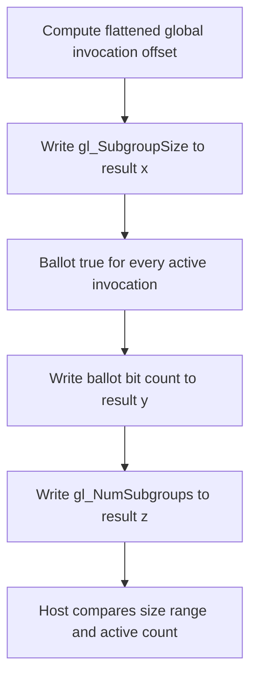

## Overview

**Core question:** Do subgroup size controls produce the advertised subgroup size and full-subgroup behavior in every supported shader stage?

- This page covers `subgroups.size_control`, implemented and registered by [`vktSubgroupsSizeControlTests.cpp`](../../../modules/vulkan/subgroups/vktSubgroupsSizeControlTests.cpp#L44-L1254).
- Six test families cover property consistency, graphics, compute, framebuffer, ray-tracing, and mesh or task execution. Vulkan SC omits the last two.
- Cases combine varying subgroup size, required minimum or maximum size, full subgroups, pipeline flags, SPIR-V 1.6 semantics, shader stages, and local workgroup shapes.
- Shaders expose `gl_SubgroupSize` and, for full-subgroup cases, active-lane and subgroup-count observations. Host checkers compare those values with advertised limits and requested controls.

## Background Knowledge

For the shared concept subgroup-size control, see [Background Knowledge](../../categories/subgroups.md#background-knowledge) of the `subgroups` page.

- A [`VkPipelineShaderStageRequiredSubgroupSizeCreateInfo`](../../../../vulkan-docs/src/chapters/pipelines.adoc#L1503-L1548) requests one power-of-two subgroup size within that range for a supported stage.
- Full-subgroup execution means every invocation in a launched subgroup is active. The pipeline flag enables this behavior for eligible compute, mesh, and task stages; Vulkan SPIR-V 1.6 shaders receive the corresponding behavior under the conditions in the [full-subgroup invocation rules](../../../../vulkan-docs/src/chapters/interfaces.adoc#L5134-L5184).

## Registration Hierarchy

```text
subgroups.size_control
├── generic
├── graphics
├── compute
├── framebuffer
├── ray_tracing (non-VulkanSC only)
└── mesh (non-VulkanSC only)
```

## Parameter Dimensions and Observed Values

| Dimension | Registered values | Meaning in this test | Evidence |
|-----------|-------------------|----------------------|----------|
| Test family | `generic`, `graphics`, `compute`, `framebuffer`, `ray_tracing`, `mesh` | Selects the execution path, stage coverage, result transport, and available size-control behaviors. | [`createSubgroupsSizeControlTests`](../../../modules/vulkan/subgroups/vktSubgroupsSizeControlTests.cpp#L1013-L1254) |
| Size-control behavior | `allow_varying_subgroup_size`, `require_full_subgroups`, `require_full_subgroups_allow_varying_subgroup_size`, `required_subgroup_size_min`, `required_subgroup_size_max`, and required-size plus full-subgroup combinations | Selects whether the implementation may vary size, must use a requested endpoint, or must launch full subgroups. | [case registration](../../../modules/vulkan/subgroups/vktSubgroupsSizeControlTests.cpp#L1044-L1205) |
| Semantic source | baseline flags, `_spirv16`, `_flags_spirv16` | Separates legacy pipeline flags, SPIR-V 1.6 semantics without those flags, and their combined use. | [`testParams`](../../../modules/vulkan/subgroups/vktSubgroupsSizeControlTests.cpp#L1044-L1055) |
| Framebuffer stage | `vertex`, `tess_control`, `tess_eval`, `geometry`, `fragment` | Selects the graphics stage that writes `gl_SubgroupSize` through a framebuffer path. | [`fbStages`](../../../modules/vulkan/subgroups/vktSubgroupsSizeControlTests.cpp#L1024-L1030) |
| Mesh stage | `mesh`, `task` | Selects mesh or task execution for varying-size and required-size cases. | [`meshStages`](../../../modules/vulkan/subgroups/vktSubgroupsSizeControlTests.cpp#L1031-L1036) |
| Required size | advertised `minSubgroupSize` or `maxSubgroupSize` | Requests an exact endpoint size through the pipeline stage create-info chain. | [`getRequiredSubgroupSizeFromMode`](../../../modules/vulkan/subgroups/vktSubgroupsSizeControlTests.cpp#L106-L125) |
| Local workgroup size | fixed shapes, subgroup-sized shapes, limit-derived shape | Exercises one-dimensional and multidimensional workgroups, partial occupancy, and full-subgroup conditions. | [ordinary compute matrix](../../../modules/vulkan/subgroups/vktSubgroupsSizeControlTests.cpp#L623-L663), [full-subgroup matrix](../../../modules/vulkan/subgroups/vktSubgroupsSizeControlTests.cpp#L752-L789) |
| Shader target | SPIR-V 1.3, 1.4, or 1.6 | Uses 1.3 for baseline compute and graphics, 1.4 where ray tracing or mesh requires it, and 1.6 for the semantic variants. | [registration case definitions](../../../modules/vulkan/subgroups/vktSubgroupsSizeControlTests.cpp#L1044-L1205) |

The Vulkan default mustpass contains 63 exact paths for this family, from [`compute.allow_varying_subgroup_size`](../../../mustpass/main/vk-default/subgroups.txt#L47660) through [`ray_tracing.required_subgroup_size_min`](../../../mustpass/main/vk-default/subgroups.txt#L47722).

## Behavior Parameters

The primary behavioral axis is the test family under `subgroups.size_control`. Each value changes the execution route and the controls or result transport that the test can exercise. The test case leaf selects a size-control behavior within that family.

### `generic` | property consistency

The single `subgroup_size_properties` case checks that the fixed `VkPhysicalDeviceSubgroupProperties::subgroupSize` value lies between the advertised minimum and maximum size-control properties. It does not execute a shader.

### `graphics` | varying-size compute and required-size graphics stages

The varying-size cases registered under `graphics` use the compute path and storage-buffer result checking, while the required-size cases use the all-graphics harness to cover supported classic graphics stages. Each participating stage writes its observed subgroup size, and the host checks the range or exact requested value.

### `compute` | varying, required, and full subgroup behavior

Compute has the broadest behavior matrix. It covers varying size, full subgroups, their combination, and required minimum or maximum size with or without full-subgroup semantics. Full-subgroup cases also compare `gl_SubgroupSize` with the active ballot count and validate `gl_NumSubgroups` when an exact size applies.

### `framebuffer` | per-stage size reporting without SSBO output

Separate vertex, tessellation control, tessellation evaluation, geometry, and fragment cases route the observed subgroup size through framebuffer output. The host applies the same range or required-size comparison to the readback values.

### `ray_tracing` | all supported ray-tracing stages

Non-VulkanSC builds apply varying-size or required-size controls to supported ray-generation, hit, miss, intersection, and callable stages through the shared ray-tracing harness. Each participating stage records its observed subgroup size.

### `mesh` | mesh and task size control

Non-VulkanSC builds test mesh and task stages separately. They exercise varying size and required minimum or maximum size, using compute-like local-size specialization and storage-buffer readback.

## Shader Analysis

The representative case uses the full-subgroup compute builder because it exposes the strongest shader-side observation set: reported subgroup size, active invocation count, and workgroup subgroup count. Registration and mustpass both contain the exact baseline SPIR-V 1.3 path.

### Representative Shader Walkthrough 1

#### Parameter Values Chosen

Representative path:

```text
dEQP-VK.subgroups.size_control.compute.require_full_subgroups
```

| Parameter choice | Meaning in this representative case |
|------------------|-------------------------------------|
| `compute` | Uses the compute pipeline and storage-buffer result harness. |
| `require_full_subgroups` | Requests full subgroup execution without allowing varying size or requiring a particular size. |
| baseline variant | Uses `VK_PIPELINE_SHADER_STAGE_CREATE_REQUIRE_FULL_SUBGROUPS_BIT_EXT` with SPIR-V 1.3. |
| one workgroup, multiple local-size pipelines | Repeats the shader with retained X-multiple workgroup shapes, including a device-limit-derived shape. |

#### Purpose

The shader records enough information for the host to check that every launched compute subgroup is full and that each reported size remains within the advertised range.

#### Structural Design



#### Shader Code

```glsl
#version 450
#extension GL_KHR_shader_subgroup_basic: enable
#extension GL_KHR_shader_subgroup_ballot: enable
layout (local_size_x_id = 0, local_size_y_id = 1, local_size_z_id = 2) in;
/// Binding 0 is an std430 storage buffer of uvec4 records, one for each global invocation.
/// The host reads x as gl_SubgroupSize, y as the active ballot count, and z as gl_NumSubgroups.
layout(set = 0, binding = 0, std430) buffer Buffer1
{
  uvec4 result[];
};

void main (void)
{
  /// Flatten the three-dimensional global invocation coordinate into the result-buffer index.
  uvec3 globalSize = gl_NumWorkGroups * gl_WorkGroupSize;
  highp uint offset = globalSize.x * ((globalSize.y * gl_GlobalInvocationID.z) + gl_GlobalInvocationID.y) + gl_GlobalInvocationID.x;
  /// Record the subgroup size, active invocation count, and workgroup subgroup count for host validation.
   result[offset].x = gl_SubgroupSize;
   uint numActive = subgroupBallotBitCount(subgroupBallot(true));
   result[offset].y = numActive;
   result[offset].z = gl_NumSubgroups;
}
```

#### Additional Info

- [`initProgramsRequireFull`](../../../modules/vulkan/subgroups/vktSubgroupsSizeControlTests.cpp#L472-L504) emits this shader directly and attaches the `CaseDefinition` SPIR-V target through `ShaderBuildOptions`.
- The selected case uses the seven-entry local-size table from [`testRequireFullSubgroups`](../../../modules/vulkan/subgroups/vktSubgroupsSizeControlTests.cpp#L752-L789). The harness executes the first six entries; its final `{1, 1, 1}` entry is a sentinel.

#### Parameter Variation Summary

| Parameter dimension | Shader-level variation from this shader | Evidence |
|---------------------|---------------------------------------|----------|
| `allow_varying_subgroup_size` without full subgroups | Uses `initPrograms`, which writes only `gl_SubgroupSize` through the shared stage wrapper. | [`initPrograms`](../../../modules/vulkan/subgroups/vktSubgroupsSizeControlTests.cpp#L460-L470) |
| Required minimum or maximum plus full subgroups | Keeps this `uvec4` shader but causes the host to check the requested endpoint and expected `gl_NumSubgroups`. | [`testRequireSubgroupSize`](../../../modules/vulkan/subgroups/vktSubgroupsSizeControlTests.cpp#L792-L837) |
| SPIR-V 1.6 suffix | Changes `ShaderBuildOptions` to SPIR-V 1.6 and treats full-subgroup semantics as active even without the legacy flag. | [`CaseDefinition::shaderUsesFullSubgroups`](../../../modules/vulkan/subgroups/vktSubgroupsSizeControlTests.cpp#L60-L69) |
| Stage family | Varying-size cases in the `graphics` family use the compute path; required-size graphics, ray-tracing, mesh, and task cases use `initStdPrograms`; framebuffer cases use dedicated per-stage shaders. | [`createSubgroupsSizeControlTests`](../../../modules/vulkan/subgroups/vktSubgroupsSizeControlTests.cpp#L1057-L1060), [`initPrograms`](../../../modules/vulkan/subgroups/vktSubgroupsSizeControlTests.cpp#L460-L470), [`initFrameBufferPrograms`](../../../modules/vulkan/subgroups/vktSubgroupsSizeControlTests.cpp#L299-L419) |

#### SPIR-V

- Status: generated and validated
- Source: reconstructed `GLSL` from this walkthrough
- Stage: `comp`
- Target SPIRV version: `spirv1.3`

<details>
<summary>Click to expand SPIRV asm code</summary>

```llvm
; SPIR-V
; Version: 1.3
; Generator: Khronos Glslang Reference Front End; 11
; Bound: 64
; Schema: 0
               OpCapability Shader
               OpCapability GroupNonUniform
               OpCapability GroupNonUniformBallot
          %1 = OpExtInstImport "GLSL.std.450"
               OpMemoryModel Logical GLSL450
               OpEntryPoint GLCompute %main "main" %gl_NumWorkGroups %gl_GlobalInvocationID %gl_SubgroupSize %gl_NumSubgroups
               OpExecutionMode %main LocalSize 1 1 1
               OpSource GLSL 450
               OpSourceExtension "GL_KHR_shader_subgroup_ballot"
               OpSourceExtension "GL_KHR_shader_subgroup_basic"
               OpName %main "main"
               OpName %globalSize "globalSize"
               OpName %gl_NumWorkGroups "gl_NumWorkGroups"
               OpName %offset "offset"
               OpName %gl_GlobalInvocationID "gl_GlobalInvocationID"
               OpName %Buffer1 "Buffer1"
               OpMemberName %Buffer1 0 "result"
               OpName %_ ""
               OpName %gl_SubgroupSize "gl_SubgroupSize"
               OpName %numActive "numActive"
               OpName %gl_NumSubgroups "gl_NumSubgroups"
               OpDecorate %gl_NumWorkGroups BuiltIn NumWorkgroups
               OpDecorate %13 SpecId 0
               OpDecorate %14 SpecId 1
               OpDecorate %15 SpecId 2
               OpDecorate %gl_WorkGroupSize BuiltIn WorkgroupSize
               OpDecorate %gl_GlobalInvocationID BuiltIn GlobalInvocationId
               OpDecorate %_runtimearr_v4uint ArrayStride 16
               OpDecorate %Buffer1 Block
               OpMemberDecorate %Buffer1 0 Offset 0
               OpDecorate %_ Binding 0
               OpDecorate %_ DescriptorSet 0
               OpDecorate %gl_SubgroupSize RelaxedPrecision
               OpDecorate %gl_SubgroupSize BuiltIn SubgroupSize
               OpDecorate %48 RelaxedPrecision
               OpDecorate %gl_NumSubgroups BuiltIn NumSubgroups
       %void = OpTypeVoid
          %3 = OpTypeFunction %void
       %uint = OpTypeInt 32 0
     %v3uint = OpTypeVector %uint 3
%_ptr_Function_v3uint = OpTypePointer Function %v3uint
%_ptr_Input_v3uint = OpTypePointer Input %v3uint
%gl_NumWorkGroups = OpVariable %_ptr_Input_v3uint Input
         %13 = OpSpecConstant %uint 1
         %14 = OpSpecConstant %uint 1
         %15 = OpSpecConstant %uint 1
%gl_WorkGroupSize = OpSpecConstantComposite %v3uint %13 %14 %15
%_ptr_Function_uint = OpTypePointer Function %uint
     %uint_0 = OpConstant %uint 0
     %uint_1 = OpConstant %uint 1
%gl_GlobalInvocationID = OpVariable %_ptr_Input_v3uint Input
     %uint_2 = OpConstant %uint 2
%_ptr_Input_uint = OpTypePointer Input %uint
     %v4uint = OpTypeVector %uint 4
%_runtimearr_v4uint = OpTypeRuntimeArray %v4uint
    %Buffer1 = OpTypeStruct %_runtimearr_v4uint
%_ptr_StorageBuffer_Buffer1 = OpTypePointer StorageBuffer %Buffer1
          %_ = OpVariable %_ptr_StorageBuffer_Buffer1 StorageBuffer
        %int = OpTypeInt 32 1
      %int_0 = OpConstant %int 0
%gl_SubgroupSize = OpVariable %_ptr_Input_uint Input
%_ptr_StorageBuffer_uint = OpTypePointer StorageBuffer %uint
       %bool = OpTypeBool
       %true = OpConstantTrue %bool
     %uint_3 = OpConstant %uint 3
%gl_NumSubgroups = OpVariable %_ptr_Input_uint Input
       %main = OpFunction %void None %3
          %5 = OpLabel
 %globalSize = OpVariable %_ptr_Function_v3uint Function
     %offset = OpVariable %_ptr_Function_uint Function
  %numActive = OpVariable %_ptr_Function_uint Function
         %12 = OpLoad %v3uint %gl_NumWorkGroups
         %17 = OpIMul %v3uint %12 %gl_WorkGroupSize
               OpStore %globalSize %17
         %21 = OpAccessChain %_ptr_Function_uint %globalSize %uint_0
         %22 = OpLoad %uint %21
         %24 = OpAccessChain %_ptr_Function_uint %globalSize %uint_1
         %25 = OpLoad %uint %24
         %29 = OpAccessChain %_ptr_Input_uint %gl_GlobalInvocationID %uint_2
         %30 = OpLoad %uint %29
         %31 = OpIMul %uint %25 %30
         %32 = OpAccessChain %_ptr_Input_uint %gl_GlobalInvocationID %uint_1
         %33 = OpLoad %uint %32
         %34 = OpIAdd %uint %31 %33
         %35 = OpIMul %uint %22 %34
         %36 = OpAccessChain %_ptr_Input_uint %gl_GlobalInvocationID %uint_0
         %37 = OpLoad %uint %36
         %38 = OpIAdd %uint %35 %37
               OpStore %offset %38
         %46 = OpLoad %uint %offset
         %48 = OpLoad %uint %gl_SubgroupSize
         %50 = OpAccessChain %_ptr_StorageBuffer_uint %_ %int_0 %46 %uint_0
               OpStore %50 %48
         %55 = OpGroupNonUniformBallot %v4uint %uint_3 %true
         %56 = OpGroupNonUniformBallotBitCount %uint %uint_3 Reduce %55
               OpStore %numActive %56
         %57 = OpLoad %uint %offset
         %58 = OpLoad %uint %numActive
         %59 = OpAccessChain %_ptr_StorageBuffer_uint %_ %int_0 %57 %uint_1
               OpStore %59 %58
         %60 = OpLoad %uint %offset
         %62 = OpLoad %uint %gl_NumSubgroups
         %63 = OpAccessChain %_ptr_StorageBuffer_uint %_ %int_0 %60 %uint_2
               OpStore %63 %62
               OpReturn
               OpFunctionEnd
```

</details>

## Runtime Execution and Result Checking

- The compute and mesh helper allocates a host-visible result storage buffer, creates one pipeline for each retained local size, and supplies local dimensions through specialization constants. Required-size cases also chain the selected size into the stage create info.
- Each iteration binds the pipeline and descriptor set, dispatches one workgroup or draws one mesh-task workgroup, and inserts a shader-write-to-host-read barrier. After queue completion, the host invalidates the result allocation and invokes the selected checker. See [`makeComputeOrMeshTestRequiredSubgroupSize`](../../../modules/vulkan/subgroups/vktSubgroupsTestsUtils.cpp#L3762-L4063).
- Ordinary checkers reject any size below `minSubgroupSize` or above `maxSubgroupSize`. Required-size cases also reject values unequal to the requested endpoint. See [`checkCompute`](../../../modules/vulkan/subgroups/vktSubgroupsSizeControlTests.cpp#L201-L239) and the graphics or framebuffer equivalents at [`checkVertexPipelineStages`](../../../modules/vulkan/subgroups/vktSubgroupsSizeControlTests.cpp#L127-L160) and [`checkFragmentPipelineStages`](../../../modules/vulkan/subgroups/vktSubgroupsSizeControlTests.cpp#L162-L199).
- The full-subgroup checker compares the reported size with the active ballot count. Cases that combine full-subgroup semantics with an exact required size also check that size and the expected `gl_NumSubgroups`. See [`checkComputeRequireFull`](../../../modules/vulkan/subgroups/vktSubgroupsSizeControlTests.cpp#L241-L297).
- A case fails if any local-size iteration fails. The helper logs the number of passing iterations before returning `Failed!`.

## Failure Meaning

### Failure Cause Mapping

| If this behavior parameter value fails | Possible failure cause(s) |
|----------------------------------------|---------------------------|
| `generic` | The reported fixed subgroup size does not satisfy the advertised subgroup size control range. |
| `graphics` | A graphics pipeline stage reports a subgroup size outside the advertised range or different from the required minimum or maximum. |
| `compute` | Compute size control, required-size selection, full-subgroup activation, active-lane reporting, or workgroup subgroup counting is inconsistent with the selected controls. |
| `framebuffer` | A selected graphics stage or its framebuffer transport reports an out-of-range or wrong required subgroup size. |
| `ray_tracing` | A supported ray-tracing stage reports an out-of-range or wrong required subgroup size under its stage pipeline controls. |
| `mesh` | Mesh or task subgroup size selection, required-size behavior, full-subgroup semantics, or storage-buffer result transport is inconsistent with the selected controls. |

### Cause Analysis

#### Advertised property inconsistency

**Possible failure symptoms:** `generic.subgroup_size_properties` reports that the fixed subgroup size falls outside `minSubgroupSize` and `maxSubgroupSize`.

**Possible implementation causes:** The implementation may expose mutually inconsistent physical-device subgroup properties. The specification requires the minimum and maximum to bracket the fixed subgroup size in [`VkPhysicalDeviceSubgroupSizeControlProperties`](../../../../vulkan-docs/src/chapters/limits.adoc#L1511-L1536).

#### Varying or required subgroup size mismatch

**Possible failure symptoms:** Shader observations fall outside the advertised range or do not equal the requested minimum or maximum for one or more stages or local sizes.

**Possible implementation causes:** Pipeline-stage size controls, shader built-in lowering, or stage-specific execution may not honor the selected flag or required-size create info. A required size must be within the advertised endpoints, and `SubgroupSize` must match it when the structure is chained, as specified in [`interfaces.adoc`](../../../../vulkan-docs/src/chapters/interfaces.adoc#L5239-L5246).

#### Full-subgroup activation or accounting mismatch

**Possible failure symptoms:** `gl_SubgroupSize` differs from the active ballot count, differs from the required size, or produces a `gl_NumSubgroups` value inconsistent with the local workgroup size.

**Possible implementation causes:** Full-subgroup launch semantics, active invocation accounting, workgroup partitioning, or SPIR-V 1.6 full-subgroup handling may be wrong. Source-level investigation should compare the failing local shape, pipeline flags, module version, and required-size chain before assigning the defect to one layer.

#### Stage result transport mismatch

**Possible failure symptoms:** Only framebuffer, graphics, ray-tracing, mesh, or task paths return wrong size values while another branch passes the same size-control mode.

**Possible implementation causes:** The selected stage may report the wrong built-in value, or the branch-specific storage-buffer, framebuffer, or shared stage transport may deliver incorrect data to the host checker. The failing branch and stage narrow the investigation, but the result alone does not identify whether shader execution or transport caused it.

## Case Pruning

### Requirement-based pruning

- All cases require subgroup support and `VK_EXT_subgroup_size_control`. Varying-size and required-size cases require `subgroupSizeControl`; full-subgroup flag cases require `computeFullSubgroups`.
- The selected shader stage must support subgroup operations. Required-size cases also require every selected stage bit in `requiredSubgroupSizeStages`.
- Full-subgroup shaders require subgroup ballot support because the checker derives the active invocation count from `subgroupBallot(true)`.
- All-graphics cases require tessellation and geometry shader features. Ray-tracing and mesh families require their extensions and stage features. The shader's SPIR-V version must be available for the used Vulkan API version. These gates are implemented by [`supportedCheckFeatures`](../../../modules/vulkan/subgroups/vktSubgroupsSizeControlTests.cpp#L514-L581).
- `ray_tracing` and `mesh` are absent from Vulkan SC registration.

### Design-based pruning

- Required-size tests choose only the advertised minimum and maximum, which exercise both endpoints without duplicating every legal interior power-of-two size.
- Full-subgroup local-size matrices keep shapes whose X dimension satisfies the required multiple rule. Required-size plus full-subgroup paths reduce their execution count accordingly.
- The last `{1, 1, 1}` entry in compute-like local-size arrays is a helper sentinel and is excluded by the harness loop.
- Full-subgroup behavior is registered only for compute in this file. Mesh and task required-size cases can use the full-subgroup checker when SPIR-V 1.6 semantics apply, but registration does not add separate mesh `require_full_subgroups` leaves.

## Key Takeaways

- `size_control` checks advertised properties and shader-visible behavior, including the relationship between subgroup size, active invocations, required size, and workgroup subgroup count.
- The intermediate nodes spread the same size rules across storage-buffer, framebuffer, graphics, ray-tracing, mesh, and task execution paths.
- Baseline, SPIR-V 1.6, and combined variants distinguish pipeline-flag behavior from semantics supplied by the shader module version.
- The exact failure interpretation depends on the intermediate node and test case leaf. See `## Failure Meaning` before assigning a failed observation to a particular implementation layer.

## Source Reference Appendix

| Entry point | Link | Why it matters |
|-------------|------|----------------|
| Case model and size checkers | [`CaseDefinition` through `checkComputeRequireFull`](../../../modules/vulkan/subgroups/vktSubgroupsSizeControlTests.cpp#L44-L297) | Defines modes, full-subgroup detection, and host comparisons. |
| Shader builders | [`initFrameBufferPrograms`, `initPrograms`, `initProgramsRequireFull`](../../../modules/vulkan/subgroups/vktSubgroupsSizeControlTests.cpp#L299-L504) | Emits all local shader bodies and selects SPIR-V targets. |
| Feature and support checks | [`supportedCheck` and `supportedCheckFeatures`](../../../modules/vulkan/subgroups/vktSubgroupsSizeControlTests.cpp#L506-L588) | Prunes unsupported extensions, stages, controls, and module versions. |
| Runtime routing | [`test`, `testRequireFullSubgroups`, `testRequireSubgroupSize`](../../../modules/vulkan/subgroups/vktSubgroupsSizeControlTests.cpp#L623-L933) | Chooses local sizes, endpoint sizes, helpers, and checkers. |
| Framebuffer runtime routing | [`noSSBOtest` and `noSSBOtestRequireSubgroupSize`](../../../modules/vulkan/subgroups/vktSubgroupsSizeControlTests.cpp#L590-L621), [`required framebuffer path`](../../../modules/vulkan/subgroups/vktSubgroupsSizeControlTests.cpp#L935-L970) | Maps each selected graphics stage to framebuffer execution. |
| Registration | [`createSubgroupsSizeControlTests`](../../../modules/vulkan/subgroups/vktSubgroupsSizeControlTests.cpp#L1013-L1254) | Owns exact family and test case names. |
| Shared shader wrappers | [`initStdPrograms`](../../../modules/vulkan/subgroups/vktSubgroupsTestsUtils.cpp#L1406-L1675) | Builds compute, graphics, ray-tracing, mesh, and task stage variants. |
| Compute and mesh execution helper | [`makeComputeOrMeshTestRequiredSubgroupSize`](../../../modules/vulkan/subgroups/vktSubgroupsTestsUtils.cpp#L3762-L4063) | Creates resources and pipelines, executes local-size variants, and reads results. |
| Vulkan default mustpass | [`subgroups.txt`](../../../mustpass/main/vk-default/subgroups.txt#L47660-L47722) | Confirms all 63 executable paths and the representative case. |
| Subgroup size limits | [`limits.adoc`](../../../../vulkan-docs/src/chapters/limits.adoc#L1492-L1536) | Defines the advertised size-control properties used by host checks. |
| Pipeline size controls | [`pipelines.adoc`](../../../../vulkan-docs/src/chapters/pipelines.adoc#L1419-L1444), [`required size structure`](../../../../vulkan-docs/src/chapters/pipelines.adoc#L1503-L1548) | Defines varying, full-subgroup, and required-size controls. |
