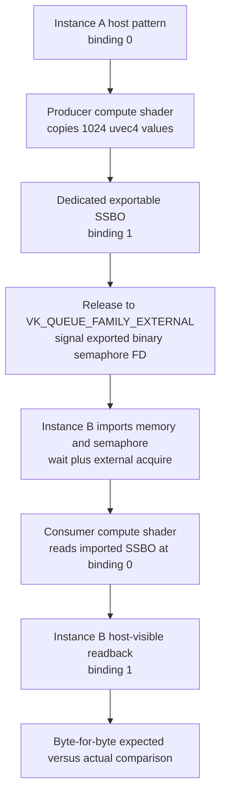

## Overview

**Core question:** Can one Vulkan instance write an externally shared resource and make that write visible to a second instance through an imported semaphore?

- This page covers the `cross_instance` test family implemented in [`vktSynchronizationCrossInstanceSharingTests.cpp`](../../../modules/vulkan/synchronization/vktSynchronizationCrossInstanceSharingTests.cpp).
- The same factory owns `synchronization.cross_instance` and `synchronization2.cross_instance`. `SynchronizationType` selects the legacy or synchronization2 barrier and submission path; the external-memory and external-semaphore flow is shared.
- Instance A creates and writes an exportable buffer or image. Instance B imports the memory and semaphore handles, waits for A's signal, reads the imported resource, and compares the result with A's expected data.
- The page explains the allocation modes, generated operation/resource/handle matrix, cross-instance execution, validation, and support-based pruning.

## Background Knowledge

- **External memory handles** let two Vulkan devices bind resource objects to the same exported memory payload. Export and import support depends on the resource properties and selected handle type.
- **External semaphore handles** transfer or reference a semaphore payload across Vulkan devices. The importing device can wait for work signaled by the exporting device; handle type determines whether the import is temporary or permanent.
- **External queue-family ownership** uses `VK_QUEUE_FAMILY_EXTERNAL` in release and acquire barriers. The source instance releases its exclusive resource to this reserved family, and the destination instance acquires it from the same family.

## Registration Hierarchy

```text
synchronization.cross_instance
├── suballocated
└── dedicated
```

```text
synchronization2.cross_instance
├── suballocated
└── dedicated
```

The factory is attached to both test categories by [`createTestsInternal()`](../../../modules/vulkan/synchronization/vktSynchronizationTests.cpp#L114-L159), outside Vulkan SC builds. Both roots contain the two direct intermediate nodes shown above. The default mustpass files list 31,306 leaves under each root: [`synchronization.txt`](../../../mustpass/main/vk-default/synchronization.txt) and [`synchronization2.txt`](../../../mustpass/main/vk-default/synchronization2.txt).

## Parameter Dimensions and Observed Values

The generator visits the following dimensions. It creates a test case leaf only when both selected operations support the resource.

| Dimension | Registered values or rule | Meaning in this test | Evidence |
|-----------|---------------------------|----------------------|----------|
| Allocation mode | `suballocated`, `dedicated` | Chooses ordinary exportable memory or an allocation dedicated to the selected resource. | [`createTests()`](../../../modules/vulkan/synchronization/vktSynchronizationCrossInstanceSharingTests.cpp#L1199-L1276) |
| Write operation | 33 entries in `s_writeOps` | Selects the operation performed by instance A and supplies its output data and release scope. | [`s_writeOps`](../../../modules/vulkan/synchronization/vktSynchronizationOperationTestData.hpp#L36-L70) |
| Read operation | 39 entries in `s_readOps` | Selects the operation performed by instance B and supplies its input scope and observed data. | [`s_readOps`](../../../modules/vulkan/synchronization/vktSynchronizationOperationTestData.hpp#L72-L112) |
| Resource | 17 descriptions | Covers ordinary buffers, color/depth/stencil images, indirect and index buffers, and one multisampled image. | [`s_resources`](../../../modules/vulkan/synchronization/vktSynchronizationOperationResources.hpp#L36-L80) |
| Semaphore type | `binary_semaphore`, `timeline_semaphore` | Chooses the external execution dependency. Timeline cases also compare the imported and exported counter values. | [`createTests()`](../../../modules/vulkan/synchronization/vktSynchronizationCrossInstanceSharingTests.cpp#L1221-L1264) |
| External handle pair | `_fd`, `_fence_fd`, `_win32_kmt`, `_win32`, `_dma_buf`, `_zircon_handle` | Pairs a memory handle type with a semaphore handle type for Unix-like, Windows, Linux DMA-BUF, or Fuchsia paths. | [`cases[]`](../../../modules/vulkan/synchronization/vktSynchronizationCrossInstanceSharingTests.cpp#L1202-L1219) |
| Synchronization API | `synchronization`, `synchronization2` | Selects legacy or synchronization2 submission and barrier commands without changing the sharing algorithm. | [`SynchronizationWrapper` selection](../../../modules/vulkan/synchronization/vktSynchronizationCrossInstanceSharingTests.cpp#L821-L853) |

An operation-pair intermediate node uses `getOperationName(writeOp) + "_" + getOperationName(readOp)`. Each test case leaf appends the resource name, semaphore type, and handle suffix. The `_fence_fd` suffix uses `VK_EXTERNAL_SEMAPHORE_HANDLE_TYPE_SYNC_FD_BIT`; despite its name, it denotes a semaphore handle rather than a Vulkan fence. The generator omits timeline semaphore leaves for this copy-transference handle.

## Behavior Parameters

The primary behavioral axis is the allocation-mode intermediate node because it changes how the exported memory is allocated and imported while keeping the same cross-instance synchronization flow.

### `suballocated` — non-dedicated external memory

The test passes `dedicated=false` to the allocation and import helpers. It skips the case when the external-memory properties require a dedicated allocation or when the resource's memory requirements report that requirement. This family checks the ordinary external-memory path without a resource-specific dedicated allocation.

### `dedicated` — resource-dedicated external memory

The test passes `dedicated=true` and associates the allocation with the selected buffer or image through the dedicated-allocation path. It requires `VK_KHR_dedicated_allocation`. The imported resource on instance B uses the matching dedicated import path; the synchronization and data checks remain the same as in `suballocated`.

## Shader Analysis

### Representative Shader Walkthrough 1

#### Parameter Values Chosen

Representative path:

```text
dEQP-VK.synchronization.cross_instance.dedicated.write_ssbo_compute_read_ssbo_compute.buffer_16384_binary_semaphore_fd
```

| Parameter choice | Meaning in this representative case |
|------------------|-------------------------------------|
| `dedicated` | The exported 16 KiB buffer memory is allocated for that buffer and imported into the matching buffer on instance B. |
| `write_ssbo_compute` / `read_ssbo_compute` | Both sides use `BufferSupport::initPrograms()` and `initPassthroughPrograms()` to generate compute shaders named `write_ssbo_buffer_16384_comp` and `read_ssbo_buffer_16384_comp`. |
| `buffer_16384` | The resource is 16,384 bytes, so each generated `std140` block contains 1,024 `uvec4` elements. |
| `binary_semaphore_fd` | Instance A exports a binary semaphore as an FD; instance B imports it and waits before reading the imported memory. This choice changes host synchronization, not shader text. |

#### Purpose

The producer and consumer shaders carry the actual test data across the external-memory handoff: instance A writes a deterministic pattern into the shared SSBO, and instance B reads that imported SSBO into host-visible storage. The test then byte-compares the producer's source data with the consumer's readback, so these shaders directly expose failures in cross-instance visibility.

#### Structural Design



#### Shader Code

##### Producer Compute Shader (Instance A)

```glsl
#version 440

layout(local_size_x = 1) in;

/// Binding 0 is the producer's host-filled source SSBO: 1024 uvec4 values occupy the 16 KiB resource span.
layout(set = 0, binding = 0, std140) readonly buffer Input {
    uvec4 data[1024];
} b_in;

/// Binding 1 is the exportable shared SSBO written by instance A and later imported by instance B.
layout(set = 0, binding = 1, std140) writeonly buffer Output {
    uvec4 data[1024];
} b_out;
void main (void)
{
    /// One compute invocation copies the deterministic host pattern into all 1024 shared-buffer elements.
    for (int i = 0; i < 1024; ++i) {
        b_out.data[i] = b_in.data[i];
    }
}
```

##### Consumer Compute Shader (Instance B)

```glsl
#version 440

layout(local_size_x = 1) in;

/// Binding 0 is instance B's SSBO view of the imported 16 KiB shared resource.
layout(set = 0, binding = 0, std140) readonly buffer Input {
    uvec4 data[1024];
} b_in;

/// Binding 1 is instance B's host-visible readback SSBO used to obtain the actual comparison data.
layout(set = 0, binding = 1, std140) writeonly buffer Output {
    uvec4 data[1024];
} b_out;
void main (void)
{
    /// After the imported-semaphore wait and external acquire, copy every shared value to readback storage.
    for (int i = 0; i < 1024; ++i) {
        b_out.data[i] = b_in.data[i];
    }
}
```

#### Additional Info

- The consumer shader has the same generated copy-loop structure as the producer for this SSBO-to-SSBO case, but its descriptor wiring reverses the role of the shared resource: binding 0 is the imported buffer and binding 1 is host-visible readback storage. It varies when the selected read operation, shader stage, buffer type, or resource size varies. [`BufferImplementation`](../../../modules/vulkan/synchronization/vktSynchronizationOperation.cpp#L1766-L1963)
- `SharingTestInstance::iterate()` records the producer before the external release, records the consumer after the external acquire, transfers the semaphore handle between instances, and compares `writeOp->getData()` against `readOp->getData()`. [`SharingTestInstance::iterate()`](../../../modules/vulkan/synchronization/vktSynchronizationCrossInstanceSharingTests.cpp#L720-L1006)
- The exact representative leaf is present in the default mustpass list. [`synchronization.txt`](../../../mustpass/main/vk-default/synchronization.txt#L13209)

#### Parameter Variation Summary

| Parameter dimension | Shader-level variation from this shader | Evidence |
|---------------------|---------------------------------------|----------|
| Write/read operation | Selecting another shader operation can change stage, resource declaration, and copy expression; selecting a transfer or fixed-function operation can remove that side's shader entirely. | [`makeOperationSupport()`](../../../modules/vulkan/synchronization/vktSynchronizationOperation.cpp#L6122-L6306) |
| Resource | `buffer_262144` changes each array bound and loop limit from 1,024 to 16,384; image resources use a different support/generator path. | [`BufferSupport::initPrograms()`](../../../modules/vulkan/synchronization/vktSynchronizationOperation.cpp#L2446-L2494) |
| Allocation mode | `suballocated` versus `dedicated` changes external-memory allocation and import, but not these generated shaders. | [`SharingTestInstance::iterate()`](../../../modules/vulkan/synchronization/vktSynchronizationCrossInstanceSharingTests.cpp#L720-L794) |
| Semaphore type and external handle pair | Binary versus timeline and FD versus other platform handles change export/import and submission behavior, not shader declarations or instructions. | [`SharingTestInstance::iterate()`](../../../modules/vulkan/synchronization/vktSynchronizationCrossInstanceSharingTests.cpp#L855-L901) |
| Synchronization API | `synchronization2` selects another barrier/submission wrapper while preserving shader generation. | [`SharingTestInstance::iterate()`](../../../modules/vulkan/synchronization/vktSynchronizationCrossInstanceSharingTests.cpp#L821-L885) |

#### SPIR-V

##### Producer Compute Shader (Instance A)

- Status: generated and validated
- Source: reconstructed `GLSL` from this walkthrough
- Stage: `comp`
- Target SPIRV version: `spirv1.0`

<details>
<summary>Click to expand SPIRV asm code</summary>

```llvm
; SPIR-V
; Version: 1.0
; Generator: Khronos Glslang Reference Front End; 11
; Bound: 42
; Schema: 0
               OpCapability Shader
          %1 = OpExtInstImport "GLSL.std.450"
               OpMemoryModel Logical GLSL450
               OpEntryPoint GLCompute %main "main"
               OpExecutionMode %main LocalSize 1 1 1
               OpSource GLSL 440
               OpName %main "main"
               OpName %i "i"
               OpName %Output "Output"
               OpMemberName %Output 0 "data"
               OpName %b_out "b_out"
               OpName %Input "Input"
               OpMemberName %Input 0 "data"
               OpName %b_in "b_in"
               OpDecorate %_arr_v4uint_uint_1024 ArrayStride 16
               OpDecorate %Output BufferBlock
               OpMemberDecorate %Output 0 NonReadable
               OpMemberDecorate %Output 0 Offset 0
               OpDecorate %b_out NonReadable
               OpDecorate %b_out Binding 1
               OpDecorate %b_out DescriptorSet 0
               OpDecorate %_arr_v4uint_uint_1024_0 ArrayStride 16
               OpDecorate %Input BufferBlock
               OpMemberDecorate %Input 0 NonWritable
               OpMemberDecorate %Input 0 Offset 0
               OpDecorate %b_in NonWritable
               OpDecorate %b_in Binding 0
               OpDecorate %b_in DescriptorSet 0
               OpDecorate %gl_WorkGroupSize BuiltIn WorkgroupSize
       %void = OpTypeVoid
          %3 = OpTypeFunction %void
        %int = OpTypeInt 32 1
%_ptr_Function_int = OpTypePointer Function %int
      %int_0 = OpConstant %int 0
   %int_1024 = OpConstant %int 1024
       %bool = OpTypeBool
       %uint = OpTypeInt 32 0
     %v4uint = OpTypeVector %uint 4
  %uint_1024 = OpConstant %uint 1024
%_arr_v4uint_uint_1024 = OpTypeArray %v4uint %uint_1024
     %Output = OpTypeStruct %_arr_v4uint_uint_1024
%_ptr_Uniform_Output = OpTypePointer Uniform %Output
      %b_out = OpVariable %_ptr_Uniform_Output Uniform
%_arr_v4uint_uint_1024_0 = OpTypeArray %v4uint %uint_1024
      %Input = OpTypeStruct %_arr_v4uint_uint_1024_0
%_ptr_Uniform_Input = OpTypePointer Uniform %Input
       %b_in = OpVariable %_ptr_Uniform_Input Uniform
%_ptr_Uniform_v4uint = OpTypePointer Uniform %v4uint
      %int_1 = OpConstant %int 1
     %v3uint = OpTypeVector %uint 3
     %uint_1 = OpConstant %uint 1
%gl_WorkGroupSize = OpConstantComposite %v3uint %uint_1 %uint_1 %uint_1
       %main = OpFunction %void None %3
          %5 = OpLabel
          %i = OpVariable %_ptr_Function_int Function
               OpStore %i %int_0
               OpBranch %10
         %10 = OpLabel
               OpLoopMerge %12 %13 None
               OpBranch %14
         %14 = OpLabel
         %15 = OpLoad %int %i
         %18 = OpSLessThan %bool %15 %int_1024
               OpBranchConditional %18 %11 %12
         %11 = OpLabel
         %26 = OpLoad %int %i
         %31 = OpLoad %int %i
         %33 = OpAccessChain %_ptr_Uniform_v4uint %b_in %int_0 %31
         %34 = OpLoad %v4uint %33
         %35 = OpAccessChain %_ptr_Uniform_v4uint %b_out %int_0 %26
               OpStore %35 %34
               OpBranch %13
         %13 = OpLabel
         %36 = OpLoad %int %i
         %38 = OpIAdd %int %36 %int_1
               OpStore %i %38
               OpBranch %10
         %12 = OpLabel
               OpReturn
               OpFunctionEnd
```

</details>

##### Consumer Compute Shader (Instance B)

- Status: generated and validated
- Source: reconstructed `GLSL` from this walkthrough
- Stage: `comp`
- Target SPIRV version: `spirv1.0`

<details>
<summary>Click to expand SPIRV asm code</summary>

```llvm
; SPIR-V
; Version: 1.0
; Generator: Khronos Glslang Reference Front End; 11
; Bound: 42
; Schema: 0
               OpCapability Shader
          %1 = OpExtInstImport "GLSL.std.450"
               OpMemoryModel Logical GLSL450
               OpEntryPoint GLCompute %main "main"
               OpExecutionMode %main LocalSize 1 1 1
               OpSource GLSL 440
               OpName %main "main"
               OpName %i "i"
               OpName %Output "Output"
               OpMemberName %Output 0 "data"
               OpName %b_out "b_out"
               OpName %Input "Input"
               OpMemberName %Input 0 "data"
               OpName %b_in "b_in"
               OpDecorate %_arr_v4uint_uint_1024 ArrayStride 16
               OpDecorate %Output BufferBlock
               OpMemberDecorate %Output 0 NonReadable
               OpMemberDecorate %Output 0 Offset 0
               OpDecorate %b_out NonReadable
               OpDecorate %b_out Binding 1
               OpDecorate %b_out DescriptorSet 0
               OpDecorate %_arr_v4uint_uint_1024_0 ArrayStride 16
               OpDecorate %Input BufferBlock
               OpMemberDecorate %Input 0 NonWritable
               OpMemberDecorate %Input 0 Offset 0
               OpDecorate %b_in NonWritable
               OpDecorate %b_in Binding 0
               OpDecorate %b_in DescriptorSet 0
               OpDecorate %gl_WorkGroupSize BuiltIn WorkgroupSize
       %void = OpTypeVoid
          %3 = OpTypeFunction %void
        %int = OpTypeInt 32 1
%_ptr_Function_int = OpTypePointer Function %int
      %int_0 = OpConstant %int 0
   %int_1024 = OpConstant %int 1024
       %bool = OpTypeBool
       %uint = OpTypeInt 32 0
     %v4uint = OpTypeVector %uint 4
  %uint_1024 = OpConstant %uint 1024
%_arr_v4uint_uint_1024 = OpTypeArray %v4uint %uint_1024
     %Output = OpTypeStruct %_arr_v4uint_uint_1024
%_ptr_Uniform_Output = OpTypePointer Uniform %Output
      %b_out = OpVariable %_ptr_Uniform_Output Uniform
%_arr_v4uint_uint_1024_0 = OpTypeArray %v4uint %uint_1024
      %Input = OpTypeStruct %_arr_v4uint_uint_1024_0
%_ptr_Uniform_Input = OpTypePointer Uniform %Input
       %b_in = OpVariable %_ptr_Uniform_Input Uniform
%_ptr_Uniform_v4uint = OpTypePointer Uniform %v4uint
      %int_1 = OpConstant %int 1
     %v3uint = OpTypeVector %uint 3
     %uint_1 = OpConstant %uint 1
%gl_WorkGroupSize = OpConstantComposite %v3uint %uint_1 %uint_1 %uint_1
       %main = OpFunction %void None %3
          %5 = OpLabel
          %i = OpVariable %_ptr_Function_int Function
               OpStore %i %int_0
               OpBranch %10
         %10 = OpLabel
               OpLoopMerge %12 %13 None
               OpBranch %14
         %14 = OpLabel
         %15 = OpLoad %int %i
         %18 = OpSLessThan %bool %15 %int_1024
               OpBranchConditional %18 %11 %12
         %11 = OpLabel
         %26 = OpLoad %int %i
         %31 = OpLoad %int %i
         %33 = OpAccessChain %_ptr_Uniform_v4uint %b_in %int_0 %31
         %34 = OpLoad %v4uint %33
         %35 = OpAccessChain %_ptr_Uniform_v4uint %b_out %int_0 %26
               OpStore %35 %34
               OpBranch %13
         %13 = OpLabel
         %36 = OpLoad %int %i
         %38 = OpIAdd %int %36 %int_1
               OpStore %i %38
               OpBranch %10
         %12 = OpLabel
               OpReturn
               OpFunctionEnd
```

</details>

## Runtime Execution and Result Checking

- [`InstanceAndDevice`](../../../modules/vulkan/synchronization/vktSynchronizationCrossInstanceSharingTests.cpp#L222-L305) owns two independent custom Vulkan instances, physical devices, and logical devices for the duration of the test family.
- For each pair of queue families, instance A creates an exportable buffer or image, allocates and binds exportable memory, exports its native memory handle, and instance B creates a matching resource and imports that memory.
- The selected write and read operations provide their stage, access, image-layout, resource-usage, and queue requirements. Unsupported queue-family pairs are skipped while the case continues through the remaining pairs.
- Instance A records the write and a release barrier from its queue family to `VK_QUEUE_FAMILY_EXTERNAL`. Instance B records the matching acquire barrier from `VK_QUEUE_FAMILY_EXTERNAL` and then the read.
- A submits the write and signals an exportable binary or timeline semaphore. The test exports its native handle, imports it into B's semaphore, and submits B's command buffer with a wait at the read operation's stage mask.
- After both queues become idle, timeline cases require the semaphore counter values reported by A and B to match.
- Ordinary buffers and images pass only when `deMemCmp` finds exact agreement between the writer's expected data and the reader's observed data. For indirect buffers, the observed counter must be at least the expected counter. The test accumulates mismatches across supported queue-family pairs and collects validation messages from both instances before returning the result.

## Failure Meaning

### Failure Cause Mapping

| If this behavior parameter value fails | Possible failure cause(s) |
|----------------------------------------|---------------------------|
| `suballocated` | Incorrect export/import of non-dedicated memory, external ownership transfer, semaphore sharing, or operation data visibility. |
| `dedicated` | Incorrect dedicated external allocation/import handling, external ownership transfer, semaphore sharing, or operation data visibility. |

A timeline-only counter mismatch points to external timeline semaphore payload or counter handling. A data mismatch in either family can also come from the selected write/read operation path, so the failing leaf and queue pair are needed to narrow the cause.

### Cause Analysis

#### External memory allocation or import is incorrect

**Possible failure symptoms:** Instance B reads bytes that differ from A's expected output, or an indirect-buffer counter is smaller than expected. A failure limited to `dedicated` points toward the dedicated allocation/import path; a failure limited to `suballocated` points toward the non-dedicated path.

**Possible implementation causes:** The implementation may bind the imported resource to an incorrect external memory payload, mishandle the exported memory type, or fail to preserve the resource contents through the selected dedicated or non-dedicated import path. The selected handle pair and allocation mode identify the path to inspect.

#### External ownership transfer or memory dependency is incorrect

**Possible failure symptoms:** Instance B observes stale or incomplete resource data after waiting for A's semaphore, although export and import succeeded.

**Possible implementation causes:** The implementation may mishandle release to or acquire from `VK_QUEUE_FAMILY_EXTERNAL`, the operation-specific stage/access scopes, or the image layout transition. The failing write operation, read operation, resource, and synchronization API identify the dependency to inspect.

#### External semaphore payload handling is incorrect

**Possible failure symptoms:** B's wait does not release correctly, a timeline case reports different counter values for A and B, or the read runs without observing A's completed write.

**Possible implementation causes:** The implementation may mishandle export/import transference for the selected semaphore handle, temporary versus permanent import, binary signal/wait state, or timeline payload propagation. Data mismatches alone do not isolate this cause from external-memory or barrier handling.

#### Selected operation path produces or reads the wrong data

**Possible failure symptoms:** Failures cluster around one writer, reader, resource type, or queue capability while other cross-instance combinations pass.

**Possible implementation causes:** The shared synchronization operation implementation may generate incorrect commands, resource usage, expected data, or readback data for that combination. Source-level investigation of the selected operation is needed before attributing the failure to cross-instance sharing itself.

## Case Pruning

### Requirement-based pruning

- Every leaf requires `VK_KHR_get_physical_device_properties2`, `VK_KHR_external_semaphore_capabilities`, and `VK_KHR_external_memory_capabilities` at instance level, plus external memory and external semaphore device functionality.
- `dedicated` requires `VK_KHR_dedicated_allocation`; synchronization2 requires `VK_KHR_synchronization2`; timeline leaves require timeline semaphore support.
- The selected FD, DMA-BUF, Win32, or Zircon handle pair requires its matching platform extension. Registration of a suffix does not guarantee that the host platform can run it.
- External buffer or image properties and external semaphore properties must advertise both exportable and importable support. Image format, tiling, usage, sample count, and `shaderStorageImageMultisample` support are checked when applicable.
- The selected write and read operations must support the resource and the chosen queue families. Unsupported queue-family pairs are skipped. Vulkan SC builds omit the entire test family.

### Design-based pruning

- The generator omits operation-pair intermediate nodes that have no compatible resource leaves.
- It does not create timeline semaphore leaves for `_fence_fd` because sync FD uses copy transference and is not used for timeline semaphore payloads here.
- Each test case fixes one allocation mode, write/read pair, resource, semaphore type, handle pair, and synchronization API. It does not mix multiple values of those dimensions in one leaf.

## Key Takeaways

- The test shares both memory and execution state across two independent Vulkan instances: A exports the resource memory and semaphore, and B imports both.
- `suballocated` and `dedicated` exercise different external-memory allocation paths around the same release, signal, import, wait, acquire, read, and compare sequence.
- The legacy and synchronization2 roots own matching generated leaves; `SynchronizationWrapper` changes the submission and barrier API path.
- Exact data comparison, indirect-counter comparison, and timeline counter comparison turn cross-instance visibility or payload errors into test failures. See `Failure Meaning` for the possible causes.

## Source Reference Appendix

| Entry point | Link | Why it matters |
|-------------|------|----------------|
| Two-instance/device management | [`InstanceAndDevice`](../../../modules/vulkan/synchronization/vktSynchronizationCrossInstanceSharingTests.cpp#L222-L305) | Creates and retains the independent Vulkan objects used as A and B. |
| External resource import | [`importResource()`](../../../modules/vulkan/synchronization/vktSynchronizationCrossInstanceSharingTests.cpp#L446-L543) | Recreates the resource on B and binds imported memory through the selected allocation path. |
| External release and acquire barriers | [`recordWriteBarrier()` and `recordReadBarrier()`](../../../modules/vulkan/synchronization/vktSynchronizationCrossInstanceSharingTests.cpp#L545-L633) | Transfers ownership through `VK_QUEUE_FAMILY_EXTERNAL` with operation-specific scopes and layouts. |
| Execution and validation | [`SharingTestInstance::iterate()`](../../../modules/vulkan/synchronization/vktSynchronizationCrossInstanceSharingTests.cpp#L720-L1006) | Exports/imports handles, submits both sides, and performs the counter and data checks. |
| Capability checks | [`SharingTestCase::checkSupport()`](../../../modules/vulkan/synchronization/vktSynchronizationCrossInstanceSharingTests.cpp#L1019-L1178) | Applies extension, external property, format, sample-count, and import/export gates. |
| Leaf generation | [`createTests()`](../../../modules/vulkan/synchronization/vktSynchronizationCrossInstanceSharingTests.cpp#L1199-L1276) | Builds both allocation modes and the operation/resource/semaphore/handle matrix. |
| Category registration | [`createTestsInternal()`](../../../modules/vulkan/synchronization/vktSynchronizationTests.cpp#L114-L159) | Attaches the family to both test categories and excludes it from Vulkan SC. |
| Shared operation inventory | [`vktSynchronizationOperationTestData.hpp`](../../../modules/vulkan/synchronization/vktSynchronizationOperationTestData.hpp#L36-L112) | Defines the 33 writers and 39 readers. |
| Shared resource inventory | [`vktSynchronizationOperationResources.hpp`](../../../modules/vulkan/synchronization/vktSynchronizationOperationResources.hpp#L36-L80) | Defines the 17 resource descriptions used by the generator. |
| Legacy mustpass evidence | [`synchronization.txt`](../../../mustpass/main/vk-default/synchronization.txt) | Lists the generated `synchronization.cross_instance` leaves. |
| Synchronization2 mustpass evidence | [`synchronization2.txt`](../../../mustpass/main/vk-default/synchronization2.txt) | Lists the generated `synchronization2.cross_instance` leaves. |
| External ownership semantics | [`resources.adoc`](../../../../vulkan-docs/src/chapters/resources.adoc#L11640-L11648) | Describes `VK_QUEUE_FAMILY_EXTERNAL` as the external source or destination in ownership transfers. |
| External semaphore import semantics | [`synchronization.adoc`](../../../../vulkan-docs/src/chapters/synchronization.adoc#L4843-L4869) | Describes temporary/permanent imports and handle transference. |
