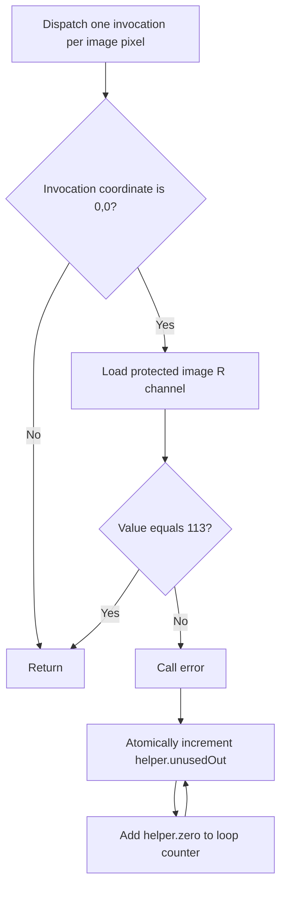

## Overview

**Core question:** Do queues created with global priorities complete the registered cross-queue workloads and produce the expected results?

- This page covers the LEGACY-only `synchronization.global_priority_transition` test family implemented by [`createGlobalPriorityQueueTests()`](../../../modules/vulkan/synchronization/vktGlobalPriorityQueueTests.cpp#L2281-L2420).
- The four priority branches run graphics, compute, and transfer work across two distinct queue families that request the same global priority. The `preemption` branch submits a large workload before a smaller workload on a higher-priority queue.
- The tests check resource contents or workload output. They do not prove that the implementation physically preempted one queue, because Vulkan global priorities impose no scheduling or ordering guarantee.
- Parent registration adds this family only under `synchronization`, not `synchronization2`, and excludes it from Vulkan SC builds.

## Background Knowledge

- **Global queue priority:** `VkDeviceQueueGlobalPriorityCreateInfo` assigns a system-wide priority to queues at device creation. Vulkan orders the values as low, medium, high, and realtime, but does not guarantee more processing time or a particular scheduling result for a higher-priority queue.
- **Queue-family ownership:** an exclusive resource used by different queue families normally needs matching release and acquire operations. The application must order those operations, for example with a semaphore. The current test source encodes explicit queue-family ownership barriers for the compute-to-transfer buffer and transfer-to-compute image paths.

## Registration Hierarchy

```text
synchronization.global_priority_transition
├── low
├── medium
├── high
├── realtime
└── preemption
```

The four priority intermediate nodes expand through `no_sync` or `semaphore`, then `no_modifiers`, `sparse`, or `protected`, and finally four direction leaves. The `preemption` node contains generated queue-type and priority-pair leaves. The default [`synchronization.txt`](../../../mustpass/main/vk-default/synchronization.txt#L31336-L31731) list contains all 396 generated leaves: 24 under each priority node and 300 under `preemption`. [`synchronization2.txt`](../../../mustpass/main/vk-default/synchronization2.txt) contains no matching path.

## Parameter Dimensions and Observed Values

### Queue-transition branches

| Dimension | Registered or observed values | Meaning in this test | Evidence |
|---|---|---|---|
| Global priority | `low`, `medium`, `high`, `realtime` | Both selected queue families request the same value. | [`prios` and `TestConfig`](../../../modules/vulkan/synchronization/vktGlobalPriorityQueueTests.cpp#L2296-L2301) |
| Submission ordering | `no_sync`, `semaphore` | Both forms wait for the producer fence before submitting the consumer. `semaphore` also signals from the producer and waits in the consumer submission. | [`submitCommands()`](../../../modules/vulkan/synchronization/vktGlobalPriorityQueueTests.cpp#L322-L373) |
| Modifier | `no_modifiers`, `sparse`, `protected` | Requests ordinary, sparse-binding, or protected queues and resources. | [`modifiers`](../../../modules/vulkan/synchronization/vktGlobalPriorityQueueTests.cpp#L2293-L2295) |
| Direction leaf | `from_graphics_to_compute`, `from_compute_to_graphics`, `from_compute_to_transfer`, `from_transfer_to_compute` | Selects the producer and consumer queue capabilities and the resource path between them. | [registration filter](../../../modules/vulkan/synchronization/vktGlobalPriorityQueueTests.cpp#L2326-L2363) |
| Extent | 34×25 or 25×34 | Alternates when each direction leaf is generated. | [extent assignment](../../../modules/vulkan/synchronization/vktGlobalPriorityQueueTests.cpp#L2308-L2310) |
| Image format | first supported value from `R32_SINT`, `R32_UINT`, `R8_SINT`, `R8_UINT` | Supplies the single R channel used by image-producing and image-reading paths. | [`GPQCase::checkSupport()`](../../../modules/vulkan/synchronization/vktGlobalPriorityQueueTests.cpp#L484-L497) |

### Preemption branch

| Dimension | Registered or observed values | Meaning in this test | Evidence |
|---|---|---|---|
| Queue A and B type | `graphics`, `compute`, `exclusive-compute`, `transfer`, `exclusive-transfer` | Selects graphics rendering, compute buffer writes, or transfer copies for each device. Exclusive variants require queue families without broader graphics or compute capability. | [queue-type names and support lookup](../../../modules/vulkan/synchronization/vktGlobalPriorityQueueTests.cpp#L1516-L1616) |
| Priority pair | `low`, `medium`, `high`, `realtime`, with A lower than B | Queue A runs the large workload and queue B runs the small higher-priority workload. | [preemption registration loops](../../../modules/vulkan/synchronization/vktGlobalPriorityQueueTests.cpp#L2381-L2415) |
| Submission count for B | ordinary name or `_double_preemption` suffix | The suffix submits and waits for queue B's command buffer a second time. | [`PreemptionInstance::iterate()`](../../../modules/vulkan/synchronization/vktGlobalPriorityQueueTests.cpp#L2215-L2226) |
| Workload extent | A: 512×512; B: 8×8 | Makes A much larger than B while preserving the same output rule for a selected queue type. | [workload sizing](../../../modules/vulkan/synchronization/vktGlobalPriorityQueueTests.cpp#L2110-L2128) |

## Behavior Parameters

The primary behavioral axis is the direct child below `global_priority_transition`: four queue-transition priority values and one preemption workload node.

### `low` — below-default queue transitions

Both queue families request `VK_QUEUE_GLOBAL_PRIORITY_LOW_KHR`. The case then runs the selected direction, synchronization form, and resource modifier and checks the resulting data or completion status.

### `medium` — default-priority queue transitions

Both queue families request `VK_QUEUE_GLOBAL_PRIORITY_MEDIUM_KHR`. This branch uses the same transition mechanisms as `low` while selecting Vulkan's default global priority level.

### `high` — above-default queue transitions

Both queue families request `VK_QUEUE_GLOBAL_PRIORITY_HIGH_KHR`. Device creation may return `VK_ERROR_NOT_PERMITTED_KHR`; the transition implementation reports that permitted denial as a quality warning rather than a test failure.

### `realtime` — highest-priority queue transitions

Both queue families request `VK_QUEUE_GLOBAL_PRIORITY_REALTIME_KHR`. It runs the same transition matrix at the highest registered priority and handles a denied request in the same way as `high`.

### `preemption` — unequal-priority paired workloads

Queue A receives a large workload at a lower global priority, then queue B receives a small workload at a higher global priority. The case requires correct output from both workloads. `_double_preemption` repeats B after its first completion. Passing confirms completion and output correctness under this submission pattern; it does not demonstrate a scheduler preemption event.

## Shader Analysis

### Representative Shader Walkthrough 1

#### Parameter Values Chosen

Representative path:

```text
dEQP-VK.synchronization.global_priority_transition.high.no_sync.protected.from_graphics_to_compute
```

| Parameter choice | Meaning in this representative case |
|------------------|-------------------------------------|
| `high` | Both selected queue families request `VK_QUEUE_GLOBAL_PRIORITY_HIGH_KHR`. |
| `no_sync` | The producer and consumer submissions do not use a semaphore; the host still waits for the producer fence before submitting the consumer. |
| `protected` | The queues, image, and helper buffer use protected-memory support, so validation cannot rely on host readback. |
| `from_graphics_to_compute` | Graphics produces an image whose R channel is `113`; the compute stage shown below consumes and validates that image. |
| 34×25, `VK_FORMAT_R32_SINT` | Registration selects this extent for the leaf, and support probing selects the first supported single-R format from its ordered candidate list. This reconstruction uses the first candidate. |

#### Purpose

The protected compute consumer checks the graphics producer's image at pixel (0, 0). Because protected memory cannot be read back by the host, a mismatch intentionally enters a non-terminating atomic loop, converting bad image data into the consumer fence's timeout signal.

#### Structural Design



#### Shader Code

```glsl
#version 450

/// One compute invocation is launched per producer-image pixel.
layout(local_size_x=1,local_size_y=1) in;
/// Binding 0 is the protected R32_SINT storage image written by the graphics producer.
layout(r32i, binding=0) readonly coherent uniform iimage2D srcImage;
/// Binding 1 is a protected helper buffer shared with the producer-side setup dispatch.
layout(binding=1) coherent buffer ProtectedHelper
{
    highp uint zero; // set to 0
    highp uint unusedOut;
} helper;

/// Preserve a device-visible side effect while intentionally preventing progress when zero is 0.
void error()
{
    for (uint x = 0; x < 10; x += helper.zero)
    {
        atomicAdd(helper.unusedOut, 1u);
    }
}

void main()
{
    ivec2 srcIdx = ivec2(gl_GlobalInvocationID.xy);

    // To match the non-protected validation, we only validate (0, 0).
    if (srcIdx == ivec2(0, 0))
    {
        /// The producer must have stored the expected test value in the image's R channel.
        if (uint(imageLoad(srcImage, srcIdx).r) != 113)
        {
            /// A mismatch enters error(); the consumer fence then cannot complete before its timeout.
            error();
        }
    }
}
```

#### Additional Info

- [`GPQCase::initPrograms()`](../../../modules/vulkan/synchronization/vktGlobalPriorityQueueTests.cpp#L589-L619) specializes this protected consumer with the selected image format/type and test value; [`GPQCase::testValue`](../../../modules/vulkan/synchronization/vktGlobalPriorityQueueTests.cpp#L415) is `113`.
- The producer-side compute setup writes `helper.zero = 0`; therefore the mismatch loop's `x += helper.zero` cannot advance, while `atomicAdd` keeps the loop observably active.
- The protected runtime path treats consumer completion as success and failure to complete as failure because protected memory cannot be inspected by the host ([runtime check](../../../modules/vulkan/synchronization/vktGlobalPriorityQueueTests.cpp#L1030-L1038)).

#### Parameter Variation Summary

| Parameter dimension | Shader-level variation from this shader | Evidence |
|---------------------|---------------------------------------|----------|
| Modifier | `protected` registers `protectedConsumerComp`; ordinary and sparse cases register `consumerComp`, which writes one pass/fail value per pixel to a host-readable buffer instead of looping. | [`GPQCase::initPrograms()`](../../../modules/vulkan/synchronization/vktGlobalPriorityQueueTests.cpp#L575-L656) |
| Image format | The selected R format specializes the storage-image format qualifier and signed or unsigned image type. The ordered candidates are `R32_SINT`, `R32_UINT`, `R8_SINT`, and `R8_UINT`. | [format selection](../../../modules/vulkan/synchronization/vktGlobalPriorityQueueTests.cpp#L484-L497), [specialization map](../../../modules/vulkan/synchronization/vktGlobalPriorityQueueTests.cpp#L640-L650) |
| Direction | Image-consuming directions use `cpyi`; `from_compute_to_transfer` instead uses the `cpyb` buffer-copy producer and has no image-validation consumer shader. | [shader registration](../../../modules/vulkan/synchronization/vktGlobalPriorityQueueTests.cpp#L652-L658), [direction implementations](../../../modules/vulkan/synchronization/vktGlobalPriorityQueueTests.cpp#L661-L1368) |
| Global priority and submission ordering | Priority changes queue creation, while `no_sync` versus `semaphore` changes submission synchronization; neither changes this shader's generated text. | [registration](../../../modules/vulkan/synchronization/vktGlobalPriorityQueueTests.cpp#L2296-L2363), [`submitCommands()`](../../../modules/vulkan/synchronization/vktGlobalPriorityQueueTests.cpp#L322-L373) |

#### SPIR-V

- Status: generated and validated
- Source: reconstructed `GLSL` from this walkthrough
- Stage: `comp`
- Target SPIRV version: `spirv1.0`

<details>
<summary>Click to expand SPIRV asm code</summary>

```llvm
; SPIR-V
; Version: 1.0
; Generator: Khronos Glslang Reference Front End; 11
; Bound: 67
; Schema: 0
               OpCapability Shader
          %1 = OpExtInstImport "GLSL.std.450"
               OpMemoryModel Logical GLSL450
               OpEntryPoint GLCompute %main "main" %gl_GlobalInvocationID
               OpExecutionMode %main LocalSize 1 1 1
               OpSource GLSL 450
               OpName %main "main"
               OpName %error_ "error("
               OpName %x "x"
               OpName %ProtectedHelper "ProtectedHelper"
               OpMemberName %ProtectedHelper 0 "zero"
               OpMemberName %ProtectedHelper 1 "unusedOut"
               OpName %helper "helper"
               OpName %srcIdx "srcIdx"
               OpName %gl_GlobalInvocationID "gl_GlobalInvocationID"
               OpName %srcImage "srcImage"
               OpDecorate %ProtectedHelper BufferBlock
               OpMemberDecorate %ProtectedHelper 0 Coherent
               OpMemberDecorate %ProtectedHelper 0 Offset 0
               OpMemberDecorate %ProtectedHelper 1 Coherent
               OpMemberDecorate %ProtectedHelper 1 Offset 4
               OpDecorate %helper Coherent
               OpDecorate %helper Binding 1
               OpDecorate %helper DescriptorSet 0
               OpDecorate %gl_GlobalInvocationID BuiltIn GlobalInvocationId
               OpDecorate %srcImage Coherent
               OpDecorate %srcImage NonWritable
               OpDecorate %srcImage Binding 0
               OpDecorate %srcImage DescriptorSet 0
               OpDecorate %gl_WorkGroupSize BuiltIn WorkgroupSize
       %void = OpTypeVoid
          %3 = OpTypeFunction %void
       %uint = OpTypeInt 32 0
%_ptr_Function_uint = OpTypePointer Function %uint
     %uint_0 = OpConstant %uint 0
    %uint_10 = OpConstant %uint 10
       %bool = OpTypeBool
%ProtectedHelper = OpTypeStruct %uint %uint
%_ptr_Uniform_ProtectedHelper = OpTypePointer Uniform %ProtectedHelper
     %helper = OpVariable %_ptr_Uniform_ProtectedHelper Uniform
        %int = OpTypeInt 32 1
      %int_1 = OpConstant %int 1
%_ptr_Uniform_uint = OpTypePointer Uniform %uint
     %uint_1 = OpConstant %uint 1
      %int_0 = OpConstant %int 0
      %v2int = OpTypeVector %int 2
%_ptr_Function_v2int = OpTypePointer Function %v2int
     %v3uint = OpTypeVector %uint 3
%_ptr_Input_v3uint = OpTypePointer Input %v3uint
%gl_GlobalInvocationID = OpVariable %_ptr_Input_v3uint Input
     %v2uint = OpTypeVector %uint 2
         %46 = OpConstantComposite %v2int %int_0 %int_0
     %v2bool = OpTypeVector %bool 2
         %52 = OpTypeImage %int 2D 0 0 0 2 R32i
%_ptr_UniformConstant_52 = OpTypePointer UniformConstant %52
   %srcImage = OpVariable %_ptr_UniformConstant_52 UniformConstant
      %v4int = OpTypeVector %int 4
   %uint_113 = OpConstant %uint 113
%gl_WorkGroupSize = OpConstantComposite %v3uint %uint_1 %uint_1 %uint_1
       %main = OpFunction %void None %3
          %5 = OpLabel
     %srcIdx = OpVariable %_ptr_Function_v2int Function
         %42 = OpLoad %v3uint %gl_GlobalInvocationID
         %43 = OpVectorShuffle %v2uint %42 %42 0 1
         %44 = OpBitcast %v2int %43
               OpStore %srcIdx %44
         %45 = OpLoad %v2int %srcIdx
         %48 = OpIEqual %v2bool %45 %46
         %49 = OpAll %bool %48
               OpSelectionMerge %51 None
               OpBranchConditional %49 %50 %51
         %50 = OpLabel
         %55 = OpLoad %52 %srcImage
         %56 = OpLoad %v2int %srcIdx
         %58 = OpImageRead %v4int %55 %56
         %59 = OpCompositeExtract %int %58 0
         %60 = OpBitcast %uint %59
         %62 = OpINotEqual %bool %60 %uint_113
               OpSelectionMerge %64 None
               OpBranchConditional %62 %63 %64
         %63 = OpLabel
         %65 = OpFunctionCall %void %error_
               OpBranch %64
         %64 = OpLabel
               OpBranch %51
         %51 = OpLabel
               OpReturn
               OpFunctionEnd
     %error_ = OpFunction %void None %3
          %7 = OpLabel
          %x = OpVariable %_ptr_Function_uint Function
               OpStore %x %uint_0
               OpBranch %12
         %12 = OpLabel
               OpLoopMerge %14 %15 None
               OpBranch %16
         %16 = OpLabel
         %17 = OpLoad %uint %x
         %20 = OpULessThan %bool %17 %uint_10
               OpBranchConditional %20 %13 %14
         %13 = OpLabel
         %27 = OpAccessChain %_ptr_Uniform_uint %helper %int_1
         %29 = OpAtomicIAdd %uint %27 %uint_1 %uint_0 %uint_1
               OpBranch %15
         %15 = OpLabel
         %31 = OpAccessChain %_ptr_Uniform_uint %helper %int_0
         %32 = OpLoad %uint %31
         %33 = OpLoad %uint %x
         %34 = OpIAdd %uint %33 %32
               OpStore %x %34
               OpBranch %12
         %14 = OpLabel
               OpReturn
               OpFunctionEnd
```

</details>

## Runtime Execution and Result Checking

### Queue-transition execution

1. [`GPQCase::checkSupport()`](../../../modules/vulkan/synchronization/vktGlobalPriorityQueueTests.cpp#L484-L555) selects a supported R-channel format and two distinct queue families with the requested priority and queue flags.
2. [`SpecialDevice`](../../../modules/vulkan/synchronization/vktGlobalPriorityQueueUtils.cpp#L91-L213) creates one device with the two queue families and attaches the requested global priority to both queue create infos.
3. The selected direction records producer and consumer command buffers:
   - `from_graphics_to_compute` renders `113` to an image and checks it with compute work;
   - `from_compute_to_graphics` generates vertex positions with compute work, renders `113`, then checks the image with compute work;
   - `from_compute_to_transfer` copies generated vertex positions to a host-readable buffer and compares each position;
   - `from_transfer_to_compute` uploads `113` to an image, performs explicit image ownership release and acquire barriers, and checks the image with compute work.
4. [`submitCommands()`](../../../modules/vulkan/synchronization/vktGlobalPriorityQueueTests.cpp#L322-L373) submits the producer, waits up to ten seconds for its fence, submits the consumer, and waits up to ten seconds for the consumer fence. The `semaphore` form also carries a signal and wait semaphore between those submissions. The `no_sync` name therefore means no semaphore, not unordered concurrent submissions.
5. Non-protected image-validation paths pass when the host reads `1` at result pixel (0, 0). The compute-to-transfer path compares copied `vec2` values. Protected paths cannot read the resource back; image-consuming protected paths turn a mismatch into a consumer timeout. The protected compute-to-transfer path checks submission completion only.

The source uses explicit queue-family ownership release and acquire barriers for `from_compute_to_transfer` and `from_transfer_to_compute`. The graphics-to-compute and compute-to-graphics implementations use their resources across the selected families without encoding a matching ownership transfer in the shown resource barriers. This page describes that behavior without treating those paths as proof of correct queue-family ownership transfer.

### Preemption execution

1. The case creates separate custom devices and queues for A and B using the requested queue type and priority.
2. It records a 512×512 workload for A and an 8×8 workload for B. Graphics draws one point per pixel, compute writes increasing indices, and transfer copies an input sequence beginning at 1000.
3. It submits A first and B second, waits for B, optionally submits and waits for B again, then waits for A.
4. The host invalidates the output allocations and checks both workloads. Graphics images use `tcu::floatThresholdCompare`; compute buffers must contain an increasing sequence beginning at 0; transfer buffers must contain an increasing sequence beginning at 1000.
5. Any output mismatch fails the test. Completion order is observed only through the programmed fence waits and does not establish how the implementation scheduled the workloads internally.

## Failure Meaning

### Failure Cause Mapping

| If this behavior parameter value fails | Possible failure cause(s) |
|---|---|
| `low` | Queue creation, cross-queue resource use, submission ordering, or output validation at low global priority |
| `medium` | Queue creation, cross-queue resource use, submission ordering, or output validation at medium global priority |
| `high` | The same transition mechanisms at high priority, unless device creation returns the permitted `VK_ERROR_NOT_PERMITTED_KHR` quality warning |
| `realtime` | The same transition mechanisms at realtime priority, unless device creation returns the permitted `VK_ERROR_NOT_PERMITTED_KHR` quality warning |
| `preemption` | Workload recording, submission and fence handling, or graphics/compute/transfer output generation and readback |

### Cause Analysis

#### Queue-transition resource and submission failures

**Possible failure symptoms:** a non-protected image case returns a value other than `1`, compute-to-transfer reports a copied position mismatch, or a consumer fence does not complete before the ten-second timeout.

**Possible implementation causes:** investigation should follow the failed direction. Explicit compute↔transfer ownership barriers, image layouts, access masks, queue-family selection, semaphore signal/wait handling, and the graphics/compute resource path can each affect the observed result. The current graphics↔compute source paths also need source-level investigation because their resource barriers do not encode a matching queue-family ownership transfer.

#### Sparse or protected resource failures

**Possible failure symptoms:** failures occur only with `sparse`, or a protected image-consuming case reaches the consumer timeout. A protected compute-to-transfer case can expose submission failure but cannot expose a data mismatch through host readback.

**Possible implementation causes:** sparse failures can come from sparse buffer or image binding and residency behavior on the selected queues. Protected failures can come from protected queue creation, protected command submission, protected memory use, or a value mismatch that enters the deliberate validation loop.

#### Preemption workload output failures

**Possible failure symptoms:** a graphics gradient differs beyond the threshold, a compute or transfer buffer contains an unexpected sequence value, or a submitted workload does not complete.

**Possible implementation causes:** inspect the failed queue type's pipeline or copy commands, resource visibility before host readback, command submission, and fence completion. A failure does not by itself identify a scheduling or physical-preemption defect because Vulkan makes no such scheduling guarantee.

## Case Pruning

### Requirement-based pruning

- Transition cases require `VK_KHR_get_physical_device_properties2`, `VK_EXT_global_priority`, `VK_EXT_global_priority_query`, a suitable R-channel format, and two distinct queue families supporting the requested flags and priority.
- `sparse` requires sparse binding, sparse buffer residency, and sparse 2D image residency. `protected` requires `protectedMemory`.
- Preemption cases require `VK_KHR_get_physical_device_properties2`, `VK_KHR_global_priority`, and queue families that report the requested queue type and priority.
- The implementation treats `VK_ERROR_NOT_PERMITTED_KHR` from transition device creation as a quality warning. The preemption device helper treats `VK_ERROR_NOT_PERMITTED_KHR` and `VK_ERROR_INITIALIZATION_FAILED` as unsupported device creation, which matches the permitted global-priority request outcomes.

### Design-based pruning

- Transition registration removes same-type queue pairs and graphics↔transfer pairs, leaving graphics↔compute and compute↔transfer in both directions.
- Transition cases request the same priority for both queues; unequal priority pairs belong to `preemption`.
- Preemption registration keeps only `priorityA < priorityB`, because equal or decreasing pairs do not form the intended higher-priority B workload. It generates both ordinary and `_double_preemption` leaves for every retained pair.
- Parent registration excludes the family from `synchronization2` and Vulkan SC.

## Key Takeaways

- `global_priority_transition` contains 96 queue-transition leaves and 300 preemption leaves in the default legacy synchronization mustpass list.
- `no_sync` omits the semaphore but still waits for the producer fence before consumer submission.
- The compute↔transfer directions contain explicit queue-family ownership barriers; the current graphics↔compute source paths do not.
- Protected image-consuming cases turn a device-side mismatch into a fence timeout, while protected compute-to-transfer checks completion without host-visible data validation.
- The preemption branch checks completion and output correctness for unequal-priority workloads. Vulkan does not let this result prove that physical preemption occurred.

## Source Reference Appendix

| Entry point | Link | Why it matters |
|---|---|---|
| Transition configuration and support | [`TestConfig` and `GPQCase`](../../../modules/vulkan/synchronization/vktGlobalPriorityQueueTests.cpp#L61-L555) | Defines requested queue capabilities, format selection, and support checks. |
| Transition programs | [`GPQCase::initPrograms()`](../../../modules/vulkan/synchronization/vktGlobalPriorityQueueTests.cpp#L557-L659) | Generates transition producer and validation shaders. |
| Transition implementations | [`GPQInstance::iterate()` specializations](../../../modules/vulkan/synchronization/vktGlobalPriorityQueueTests.cpp#L661-L1368) | Records each direction and its result check. |
| Transition device setup | [`SpecialDevice`](../../../modules/vulkan/synchronization/vktGlobalPriorityQueueUtils.cpp#L91-L213) | Selects queue families and creates queues with global priority. |
| Preemption setup and support | [`PreemptionCase` and `DeviceHelper`](../../../modules/vulkan/synchronization/vktGlobalPriorityQueueTests.cpp#L1430-L1805) | Selects queue types and priorities and creates the custom devices. |
| Preemption commands and checks | [`WorkLoadData` and `PreemptionInstance::iterate()`](../../../modules/vulkan/synchronization/vktGlobalPriorityQueueTests.cpp#L1807-L2277) | Records workloads, submits them, and validates their output. |
| Complete registration matrix | [`createGlobalPriorityQueueTests()`](../../../modules/vulkan/synchronization/vktGlobalPriorityQueueTests.cpp#L2281-L2420) | Registers all priority, synchronization, modifier, direction, and preemption leaves. |
| Parent registration | [`createTestsInternal()`](../../../modules/vulkan/synchronization/vktSynchronizationTests.cpp#L114-L159) | Shows LEGACY-only and non-Vulkan-SC placement. |
| Default legacy mustpass selection | [`synchronization.txt`](../../../mustpass/main/vk-default/synchronization.txt#L31336-L31731) | Lists the 396 selected leaves. |
| Default synchronization2 mustpass selection | [`synchronization2.txt`](../../../mustpass/main/vk-default/synchronization2.txt) | Confirms that this family has no synchronization2 leaves. |
| Global-priority semantics | [`devsandqueues.adoc`](../../../../vulkan-docs/src/chapters/devsandqueues.adoc#L3650-L3757) | Defines priority ordering, scheduling caveats, and permitted request failures. |
| Queue-family ownership semantics | [`synchronization.adoc`](../../../../vulkan-docs/src/chapters/synchronization.adoc#L8024-L8176) | Defines exclusive-resource release and acquire requirements. |
