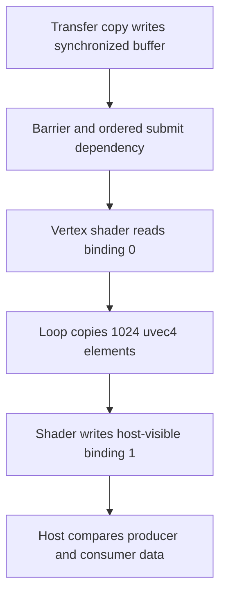

## Overview

**Core question:** Does one queue preserve the semaphore dependencies and ordered submit structure needed to carry each write result to its paired read?

- [`vktSynchronizationImplicitTests.cpp`](../../../modules/vulkan/synchronization/vktSynchronizationImplicitTests.cpp#L152) implements the `implicit` test family for both `dEQP-VK.synchronization.implicit` and `dEQP-VK.synchronization2.implicit`.
- [`createImplicitSyncTests()`](../../../modules/vulkan/synchronization/vktSynchronizationImplicitTests.cpp#L757-L767) registers `binary_semaphore` and `timeline_semaphore`.
- Each case submits several structures to the universal queue in one call, then waits on a fence and compares paired write/read results.
- The source uses one shared algorithm. `SynchronizationWrapper` selects legacy `vkQueueSubmit` packaging or synchronization2 `vkQueueSubmit2` packaging.

## Background Knowledge

- A queue submission call receives an ordered list of submit structures. Each structure may wait on semaphores, run command buffers, and signal semaphores.
- The test also records a resource-access barrier between each write and its paired read. Its result therefore covers the constructed resource access and the ordering of the submit structures, rather than testing an intentionally missing barrier.
- The legacy path uses `VkSubmitInfo`; the synchronization2 path uses `VkSubmitInfo2`, `VkSemaphoreSubmitInfo`, and `VkCommandBufferSubmitInfo`. The dependency model stays the same.

## Registration Hierarchy

```text
synchronization.implicit
├── binary_semaphore
└── timeline_semaphore
```

```text
synchronization2.implicit
├── binary_semaphore
└── timeline_semaphore
```

Under either semaphore test family, the source creates four operation-pair groups. Each pair selects one compatible resource and then 256 four-digit test cases. A leaf has the form `<write>_<read>.<resource>.<combo>`. Each digit in `<combo>` selects one of the four submit-info types described below.

## Parameter Dimensions and Observed Values

| Dimension | Registered values | Meaning in this test | Evidence |
|---|---|---|---|
| API path | `LEGACY`, `SYNCHRONIZATION2` | Selects the submission structure and queue-submit entry point. | [`SynchronizationWrapper`](../../../modules/vulkan/synchronization/vktSynchronizationUtil.hpp#L1) |
| Semaphore family | `binary_semaphore`, `timeline_semaphore` | Selects per-pair binary semaphore handles or timeline semaphore handles with values shared within each submit-info group. | [`createImplicitSyncTests`](../../../modules/vulkan/synchronization/vktSynchronizationImplicitTests.cpp#L757-L767), [`QueueSubmitImplicitTestInstance::addSemaphore`](../../../modules/vulkan/synchronization/vktSynchronizationImplicitTests.cpp#L511-L533) |
| Write operation | `COPY_BUFFER`, `SSBO_VERTEX` | Selects the producer operation. | [`QueueSubmitImplicitTests::init`](../../../modules/vulkan/synchronization/vktSynchronizationImplicitTests.cpp#L677-L705) |
| Read operation | `COPY_BUFFER`, `SSBO_VERTEX` | Selects the consumer operation. | [`QueueSubmitImplicitTests::init`](../../../modules/vulkan/synchronization/vktSynchronizationImplicitTests.cpp#L677-L705) |
| Resource | First compatible entry in `s_resources` | Selects the resource shape for the operation pair. | [`QueueSubmitImplicitTests::init`](../../../modules/vulkan/synchronization/vktSynchronizationImplicitTests.cpp#L710-L740) |
| Submit combination | Four positions, each type `0` through `3` | Changes where waits, command buffers, and signals occur. | [`queueSumbitInfoTypes`](../../../modules/vulkan/synchronization/vktSynchronizationImplicitTests.cpp#L643-L665) |
| Per-element count | Random integer `2` through `10` | Changes the number of waits, command buffers, or signals in a populated position. | [`QueueSubmitImplicitTestInstance`](../../../modules/vulkan/synchronization/vktSynchronizationImplicitTests.cpp#L118-L150) |

## Behavior Parameters

The primary behavioral axis is the four-position submit combination. The semaphore family and API path select the synchronization representation around the same ordering test.

### Type `0` at a position: wait only

The original position waits. The generated counterpart supplies the matching signal. This checks that a later dependent position does not run before its signal becomes available.

### Type `1` at a position: wait and command buffer

The original position waits and runs a command buffer, which carries the read operation. The counterpart supplies the write command buffer and signal needed to release it.

### Type `2` at a position: wait and signal

The generated counterpart splits the matching signal and wait into separate submit structures. This exercises ordering when a position both consumes and produces semaphore state without a command buffer.

### Type `3` at a position: wait, command buffer, and signal

The generated counterpart supplies a command buffer with a signal and a separate wait. This combines the read/write dependency with both sides of semaphore chaining.

## Shader Analysis

### Representative Shader Walkthrough 1

#### Parameter Values Chosen

Representative path:

```text
dEQP-VK.synchronization.implicit.binary_semaphore.write_copy_buffer_read_ssbo_vertex.buffer_16384.1000
```

| Parameter choice | Meaning in this representative case |
|------------------|-------------------------------------|
| `synchronization.implicit` | Uses the legacy queue-submit wrapper for the implicit-ordering family. |
| `binary_semaphore` | Connects generated signal and wait submit elements with binary semaphores. |
| `write_copy_buffer_read_ssbo_vertex` | A transfer copy produces the resource contents; the vertex-stage SSBO operation consumes and copies them to its output buffer. |
| `buffer_16384` | Selects a 16,384-byte buffer, emitted as 1,024 `uvec4` elements because each element occupies 16 bytes. |
| `1000` | Selects wait-plus-command-buffer for the first submit position and wait-only for the remaining three positions; counterpart submit structures provide the matching writes and signals. |

#### Purpose

This vertex shader makes queue-submit ordering observable by reading the synchronized 16 KiB resource as an SSBO and copying every element to a host-readable output SSBO. After queue completion, the test compares that output with the transfer producer's data, so stale or incorrectly ordered reads become content mismatches.

#### Structural Design



#### Shader Code

```glsl
#version 440

/// Vertex position drives the generic raster draw; it is incidental to the synchronized data copy.
layout(location = 0) in vec4 v_in_position;

/// Built-in vertex output required by the generic graphics passthrough pipeline.
out gl_PerVertex {
    vec4 gl_Position;
};

/// The synchronized 16 KiB resource is exposed as 1024 std140-aligned uvec4 values at set 0, binding 0.
layout(set = 0, binding = 0, std140) readonly buffer Input {
    uvec4 data[1024];
} b_in;

/// The read operation copies into a separate 16 KiB host-readable output buffer at set 0, binding 1.
layout(set = 0, binding = 1, std140) writeonly buffer Output {
    uvec4 data[1024];
} b_out;

void main (void)
{
    gl_Position = v_in_position;
    /// Copy every synchronized input element so the host can compare the complete resource contents.
    for (int i = 0; i < 1024; ++i) {
        b_out.data[i] = b_in.data[i];
    }
}
```

#### Additional Info

- `BufferSupport::initPrograms()` derives `1024` from `16384 / sizeof(tcu::UVec4)`, emits both `std140` SSBO declarations and the full-copy loop, and passes them to `initPassthroughPrograms()` for insertion into the vertex stage ([source](../../../modules/vulkan/synchronization/vktSynchronizationOperation.cpp#L2446-L2494)).
- The read implementation binds the synchronized resource at binding 0 and a host-visible storage buffer at binding 1, then inserts a vertex-shader-write-to-host-read barrier before `getData()` exposes the copied bytes ([source](../../../modules/vulkan/synchronization/vktSynchronizationOperation.cpp#L1765-L1963)).

#### Parameter Variation Summary

| Parameter dimension | Shader-level variation from this shader | Evidence |
|---------------------|---------------------------------------|----------|
| API path and semaphore family | No shader text changes; these dimensions alter submit packaging and semaphore representation around the same resource operation. | [`QueueSubmitImplicitTestInstance::iterate`](../../../modules/vulkan/synchronization/vktSynchronizationImplicitTests.cpp#L174-L500) |
| Write operation | Changing the producer to `SSBO_VERTEX` adds producer-side shader programs, but the shown `read_ssbo_buffer_16384_vert` consumer remains the same. | [`QueueSubmitImplicitTests::init`](../../../modules/vulkan/synchronization/vktSynchronizationImplicitTests.cpp#L677-L705) |
| Read operation and shader stage | `READ_COPY_BUFFER` removes this shader path; another shader-access operation or stage would change the generated prefix, required passthrough stages, and the stage receiving the SSBO declarations and loop. | [`initPassthroughPrograms`](../../../modules/vulkan/synchronization/vktSynchronizationOperation.cpp#L2276-L2410) |
| Buffer size | Changes both SSBO array lengths and the loop bound to `size / 16`; `buffer_16384` produces `1024`. | [`BufferSupport::initPrograms`](../../../modules/vulkan/synchronization/vktSynchronizationOperation.cpp#L2446-L2494) |
| Submit combination | No shader text changes; the four digits only select wait, command-buffer, and signal placement in the queue submit structures. | [`QueueSubmitImplicitTests::init`](../../../modules/vulkan/synchronization/vktSynchronizationImplicitTests.cpp#L689-L733) |

#### SPIR-V

- Status: generated and validated
- Source: reconstructed `GLSL` from this walkthrough
- Stage: `vert`
- Target SPIRV version: `spirv1.0`

<details>
<summary>Click to expand SPIRV asm code</summary>

```llvm
; SPIR-V
; Version: 1.0
; Generator: Khronos Glslang Reference Front End; 11
; Bound: 49
; Schema: 0
               OpCapability Shader
          %1 = OpExtInstImport "GLSL.std.450"
               OpMemoryModel Logical GLSL450
               OpEntryPoint Vertex %main "main" %_ %v_in_position
               OpSource GLSL 440
               OpName %main "main"
               OpName %gl_PerVertex "gl_PerVertex"
               OpMemberName %gl_PerVertex 0 "gl_Position"
               OpName %_ ""
               OpName %v_in_position "v_in_position"
               OpName %i "i"
               OpName %Output "Output"
               OpMemberName %Output 0 "data"
               OpName %b_out "b_out"
               OpName %Input "Input"
               OpMemberName %Input 0 "data"
               OpName %b_in "b_in"
               OpDecorate %gl_PerVertex Block
               OpMemberDecorate %gl_PerVertex 0 BuiltIn Position
               OpDecorate %v_in_position Location 0
               OpDecorate %_arr_v4uint_uint_1024 ArrayStride 16
               OpDecorate %Output BufferBlock
               OpMemberDecorate %Output 0 NonReadable
               OpMemberDecorate %Output 0 Offset 0
               OpDecorate %b_out NonReadable
               OpDecorate %b_out Binding 1
               OpDecorate %b_out DescriptorSet 0
               OpDecorate %_arr_v4uint_uint_1024_0 ArrayStride 16
               OpDecorate %Input BufferBlock
               OpMemberDecorate %Input 0 NonWritable
               OpMemberDecorate %Input 0 Offset 0
               OpDecorate %b_in NonWritable
               OpDecorate %b_in Binding 0
               OpDecorate %b_in DescriptorSet 0
       %void = OpTypeVoid
          %3 = OpTypeFunction %void
      %float = OpTypeFloat 32
    %v4float = OpTypeVector %float 4
%gl_PerVertex = OpTypeStruct %v4float
%_ptr_Output_gl_PerVertex = OpTypePointer Output %gl_PerVertex
          %_ = OpVariable %_ptr_Output_gl_PerVertex Output
        %int = OpTypeInt 32 1
      %int_0 = OpConstant %int 0
%_ptr_Input_v4float = OpTypePointer Input %v4float
%v_in_position = OpVariable %_ptr_Input_v4float Input
%_ptr_Output_v4float = OpTypePointer Output %v4float
%_ptr_Function_int = OpTypePointer Function %int
   %int_1024 = OpConstant %int 1024
       %bool = OpTypeBool
       %uint = OpTypeInt 32 0
     %v4uint = OpTypeVector %uint 4
  %uint_1024 = OpConstant %uint 1024
%_arr_v4uint_uint_1024 = OpTypeArray %v4uint %uint_1024
     %Output = OpTypeStruct %_arr_v4uint_uint_1024
%_ptr_Uniform_Output = OpTypePointer Uniform %Output
      %b_out = OpVariable %_ptr_Uniform_Output Uniform
%_arr_v4uint_uint_1024_0 = OpTypeArray %v4uint %uint_1024
      %Input = OpTypeStruct %_arr_v4uint_uint_1024_0
%_ptr_Uniform_Input = OpTypePointer Uniform %Input
       %b_in = OpVariable %_ptr_Uniform_Input Uniform
%_ptr_Uniform_v4uint = OpTypePointer Uniform %v4uint
      %int_1 = OpConstant %int 1
       %main = OpFunction %void None %3
          %5 = OpLabel
          %i = OpVariable %_ptr_Function_int Function
         %15 = OpLoad %v4float %v_in_position
         %17 = OpAccessChain %_ptr_Output_v4float %_ %int_0
               OpStore %17 %15
               OpStore %i %int_0
               OpBranch %20
         %20 = OpLabel
               OpLoopMerge %22 %23 None
               OpBranch %24
         %24 = OpLabel
         %25 = OpLoad %int %i
         %28 = OpSLessThan %bool %25 %int_1024
               OpBranchConditional %28 %21 %22
         %21 = OpLabel
         %36 = OpLoad %int %i
         %41 = OpLoad %int %i
         %43 = OpAccessChain %_ptr_Uniform_v4uint %b_in %int_0 %41
         %44 = OpLoad %v4uint %43
         %45 = OpAccessChain %_ptr_Uniform_v4uint %b_out %int_0 %36
               OpStore %45 %44
               OpBranch %23
         %23 = OpLabel
         %46 = OpLoad %int %i
         %48 = OpIAdd %int %46 %int_1
               OpStore %i %48
               OpBranch %20
         %22 = OpLabel
               OpReturn
               OpFunctionEnd
```

</details>

## Runtime Execution and Result Checking

1. The test selects one write operation, one read operation, and the first resource supported by both.
2. It records paired write and read command buffers. The write command records the resource-access barrier needed by the paired read.
3. It allocates a binary semaphore for each wait-signal pair, or one timeline semaphore with distinct increasing values.
4. It generates counterpart submit structures so every wait has a signal, every signal has a wait, and every read has a write.
5. It submits the complete list to the universal queue through the selected wrapper. The legacy wrapper builds `VkSubmitInfo` arrays and attaches `VkTimelineSemaphoreSubmitInfo` when needed. The synchronization2 wrapper builds `VkSubmitInfo2` arrays with typed semaphore and command-buffer submit records.
6. It waits on a fence, then compares each paired result. Buffer outputs use `deMemCmp`; indirect-buffer checks require at least the expected counter value when applicable.

## Failure Meaning

### Failure Cause Mapping

| If this behavior parameter value fails | Possible failure cause(s) |
|---|---|
| Paired read result | The implementation did not preserve the dependency chain or queue submission order, or the selected resource operation produced incorrect data. |
| Timeline support | The device does not expose the `timelineSemaphore` feature. |
| Synchronization2 support | `VK_KHR_synchronization2` is unavailable. |
| Operation/resource support | The selected operation or resource needs a device feature that is not provided. |
| Queue or fence submission | The generated semaphore, command-buffer, or submit-info construction is invalid for the selected API path. |

### Cause Analysis

#### Dependency or ordering result mismatch

**Possible failure symptoms:** The fence completes, but a paired read result differs from its write result, or an indirect result falls below the expected counter value.

**Possible implementation causes:** The implementation may have failed to honor the generated semaphore dependency or the ordered submit structures. The operation's resource access may also have produced incorrect data. The test source does not assign the failure to a particular implementation layer.

#### Unsupported prerequisite

**Possible failure symptoms:** The test reports `NotSupportedError` before execution.

**Possible implementation causes:** The device may lack `timelineSemaphore`, `VK_KHR_synchronization2`, or a feature required by the selected operation and resource. This is a support skip, not evidence of an ordering failure.

#### Queue submission or fence failure

**Possible failure symptoms:** Queue submission or the completion wait returns an error instead of producing a checked result.

**Possible implementation causes:** The generated semaphore, command-buffer, or submit-info data may be invalid for the selected API path. Source-level investigation is needed to identify the exact construction or implementation issue.

## Case Pruning

### Requirement-based pruning

- Timeline cases require the device `timelineSemaphore` feature.
- Synchronization2 cases require `VK_KHR_synchronization2`.
- Each operation support object checks the selected operation and resource before the case runs.

### Design-based pruning

- The source fixes both write and read operation lists to `COPY_BUFFER` and `SSBO_VERTEX`.
- It selects only the first compatible resource for each operation pair, then stops scanning `s_resources`.
- Four submit positions and four submit types produce the 256-case combination matrix. The reduced operation and resource dimensions keep that matrix bounded.

## Key Takeaways

- The family tests several ordered submit structures in one call on one queue.
- `binary_semaphore` and `timeline_semaphore` use different semaphore representations but the same dependency construction.
- The same cases cover `vkQueueSubmit` and `vkQueueSubmit2` through `SynchronizationWrapper`.
- A passing case produces matching paired write/read results after the queue completes.

## Source Reference Appendix

| Entry point | Link | Why it matters |
|---|---|---|
| Submit element types and dependency invariants | [`QueueSubmitInfo`](../../../modules/vulkan/synchronization/vktSynchronizationImplicitTests.cpp#L104-L150) | Defines the four elements and counterpart rules. |
| Test execution and result checks | [`QueueSubmitImplicitTestInstance::iterate`](../../../modules/vulkan/synchronization/vktSynchronizationImplicitTests.cpp#L174-L220) | Allocates synchronization objects, submits work, waits, and checks results. |
| Support checks | [`QueueSubmitImplicitTestCase::checkSupport`](../../../modules/vulkan/synchronization/vktSynchronizationImplicitTests.cpp#L591-L619) | Defines prerequisite handling. |
| Matrix construction | [`QueueSubmitImplicitTests::init`](../../../modules/vulkan/synchronization/vktSynchronizationImplicitTests.cpp#L677-L743) | Defines operation pairs, resource selection, and case names. |
| Family registration | [`createImplicitSyncTests`](../../../modules/vulkan/synchronization/vktSynchronizationImplicitTests.cpp#L757-L767) | Registers `binary_semaphore` and `timeline_semaphore`. |
| Legacy submit translation | [`LegacySynchronizationWrapper::queueSubmit`](../../../modules/vulkan/synchronization/vktSynchronizationUtil.cpp#L774-L834) | Builds `VkSubmitInfo` and timeline submit data. |
| Synchronization2 submit translation | [`Synchronization2Wrapper`](../../../modules/vulkan/synchronization/vktSynchronizationUtil.cpp#L846-L870) | Builds `VkSubmitInfo2` and typed submit records. |
| Category dispatch | [`vktSynchronizationTests.cpp`](../../../modules/vulkan/synchronization/vktSynchronizationTests.cpp#L114-L126) | Adds the shared family to both test categories. |
| Specification context | [Synchronization and Cache Control](../../../../vulkan-docs/src/chapters/synchronization.adoc) | Describes the limited implicit guarantees and explicit synchronization model. |
