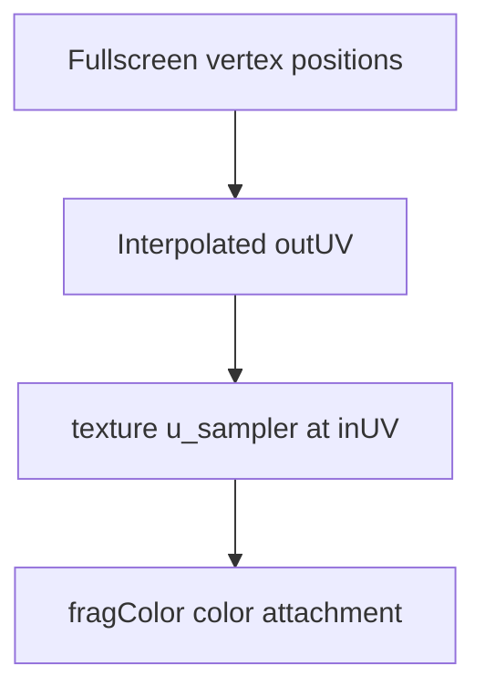

## Overview

**Core question:** Do `NONE` stage and access scopes preserve image data across layout transitions for the synchronization2 image paths exercised by this test family?

- This page explains `vktSynchronizationNoneStageTests.cpp`, which implements the `synchronization2.none_stage` test family.
- Each registered test case combines a writable layout/aspect, a readable layout/aspect, and one of three synchronization/access strategies.
- The test writes a 32x32 gradient, places a barrier with `VK_PIPELINE_STAGE_2_NONE_KHR` and `VK_ACCESS_2_NONE_KHR` in the sequence, transitions to the read layout, and compares the resulting image with the reference.
- The `legacy_` cases use legacy barrier structures, but the entire family is registered only below `synchronization2`.

## Background Knowledge

- A `NONE` destination stage/access mask represents an empty destination scope. It does not by itself name the later operation that consumes the image; this test follows it with a separate barrier that performs the layout transition and specifies the actual read stage/access.
- An image layout describes the access arrangement required by an operation. The tested layout transition must agree with the selected image aspect and the operation used to read or write it.

## Registration Hierarchy

```text
synchronization2.none_stage
└── color_attachment_to_general (optional old_access or legacy prefix, write layout/aspect, and read layout/aspect vary)
```

The generated form is `[<mode>_]<writeLayout>_to_<readLayout>`.

- `<mode>` is absent, `old_access`, or `legacy`.
- `<writeLayout>` takes `transfer_dst`, `general`, `color_attachment`, `depth_stencil_attachment`, `depth_attachment`, `stencil_attachment`, `generic_color_attachment`, `generic_depth_attachment`, `generic_stencil_attachment`, or `generic_depth_stencil_attachment`.
- `<readLayout>` takes `transfer_src`, `general`, `shader_read`, `depth_stencil_read`, `depth_read_stencil_attachment`, `depth_attachment_stencil_read`, `depth_read`, `stencil_read`, `generic_color_read`, `generic_depth_read`, `generic_stencil_read`, or `generic_depth_stencil_read`.

The family is created by [`createNoneStageTests()`](../../../modules/vulkan/synchronization/vktSynchronizationNoneStageTests.cpp#L1375-L1445) and added only to the `synchronization2` category by [`vktSynchronizationTests.cpp`](../../../modules/vulkan/synchronization/vktSynchronizationTests.cpp#L129).

## Parameter Dimensions and Observed Values

| Dimension | Registered values | Meaning in this test | Evidence |
|---|---|---|---|
| Synchronization/access strategy | no prefix; `old_access_`; `legacy_` | Selects synchronization2 generic access masks, synchronization2 specific access masks, or legacy synchronization structures. | [`synchronizationData`](../../../modules/vulkan/synchronization/vktSynchronizationNoneStageTests.cpp#L1415-L1425) |
| Writable layout/aspect | `transfer_dst`, `general`, `color_attachment`, `depth_stencil_attachment`, `depth_attachment`, `stencil_attachment`, `generic_color_attachment`, `generic_depth_attachment`, `generic_stencil_attachment`, `generic_depth_stencil_attachment` | Selects how the image is populated and which format/aspect is transitioned. | [`writableLayoutsData`](../../../modules/vulkan/synchronization/vktSynchronizationNoneStageTests.cpp#L1386-L1397) |
| Readable layout/aspect | `transfer_src`, `general`, `shader_read`, `depth_stencil_read`, `depth_read_stencil_attachment`, `depth_attachment_stencil_read`, `depth_read`, `stencil_read`, `generic_color_read`, `generic_depth_read`, `generic_stencil_read`, `generic_depth_stencil_read` | Selects transfer, sampler, or input-attachment reading and the result format. | [`readableLayoutsData`](../../../modules/vulkan/synchronization/vktSynchronizationNoneStageTests.cpp#L1398-L1413) |
| Access-mask mode | generic or specific | Maps transfer, shader, input-attachment, and attachment accesses to `VK_ACCESS_2_MEMORY_READ_BIT_KHR` / `VK_ACCESS_2_MEMORY_WRITE_BIT_KHR` when generic mode is selected. | [`getAccessFlag`](../../../modules/vulkan/synchronization/vktSynchronizationNoneStageTests.cpp#L400-L423) |
| Image aspect | color, depth, stencil, depth+stencil, or all | Determines format selection, subresource range, pipeline configuration, and comparison component. | [`NoneStageTestInstance` setup](../../../modules/vulkan/synchronization/vktSynchronizationNoneStageTests.cpp#L250-L299) |

The generator iterates over all writable/readable pairs and skips a pair when both aspects are nonzero and differ. The current mustpass file contains the resulting `synchronization2.none_stage` leaves, including the three strategy prefixes.

## Behavior Parameters

The primary behavioral axis is the synchronization/access strategy. Layout and aspect dimensions vary the operation that the barrier must cover, while the three strategies vary the synchronization semantics being checked.

### No prefix: synchronization2 with generic access flags

These cases use synchronization2 structures and map concrete read/write accesses to the generic `VK_ACCESS_2_MEMORY_READ_BIT_KHR` and `VK_ACCESS_2_MEMORY_WRITE_BIT_KHR` flags. They check that generic access scopes work with the `NONE` barrier across compatible layout/aspect pairs.

### `old_access_`: synchronization2 with specific access flags

These cases retain the concrete access type, such as transfer, color-attachment, depth/stencil-attachment, shader, or input-attachment access. They use the same layout/aspect matrix as the no-prefix cases and expose errors in specific synchronization2 access handling.

### `legacy_`: legacy structures with `NONE` stage

These cases use legacy synchronization structures with `VK_PIPELINE_STAGE_NONE_KHR`. They are compatibility coverage inside `synchronization2.none_stage`, not a second registration under `synchronization`.

## Shader Analysis

### Representative Shader Walkthrough 1

#### Parameter Values Chosen

Representative path:

```text
dEQP-VK.synchronization2.none_stage.color_attachment_to_shader_read
```

| Parameter choice | Meaning in this representative case |
|------------------|-------------------------------------|
| `color_attachment` → `shader_read` | The image is written through a color-attachment pipeline, then transitioned for a fragment-shader sampler read. |
| no prefix | The case uses synchronization2 barriers with generic access masks; the source still selects color-attachment output and fragment-shader read stages. |
| 32 × 32 color image | The host creates an `VK_FORMAT_R8G8B8A8_UNORM` color path and compares the rendered result with the gradient reference. |

#### Purpose

This shader samples the image after the `NONE`-destination barrier and writes the sample to a color attachment. The case therefore checks that the image layout transition and synchronization2 visibility rules preserve color data for a fragment-shader read.

#### Structural Design



The write and read graphics pipelines share the same fullscreen vertex support and `frag-color` fragment logic. In the selected case, the write pipeline samples the reference image into the color attachment; after the `NONE` barrier and subsequent transition, the read pipeline samples that transitioned image into the result image.

#### Shader Code

##### Fragment Shader

```glsl
#version 450
layout(binding = 0) uniform sampler2D u_sampler;
/// Interpolated UV coordinates come from the fullscreen vertex stage.
layout(location = 0) in vec2 inUV;
/// The sampled image is emitted as the color attachment result.
layout(location = 0) out vec4 fragColor;
void main(void)
{
  /// The read operation whose visibility depends on the preceding image barriers.
  fragColor = texture(u_sampler, inUV);
}
```

##### Vertex Shader (support)

```glsl
#version 450
layout(location = 0) in  vec4 inPosition;
layout(location = 0) out vec2 outUV;
void main(void)
{
  outUV = vec2(inPosition.x * 0.5 + 0.5, inPosition.y * 0.5 + 0.5);
  gl_Position = inPosition;
}
```

#### Additional Info

- `NoneStageTestInstance` selects `VK_FORMAT_R8G8B8A8_UNORM`, `VK_IMAGE_ASPECT_COLOR_BIT`, and color-attachment output for this color-only pair; the source sets `m_writeFragShaderName` to `frag-color` and uses a sampled reference image ([source](../../../modules/vulkan/synchronization/vktSynchronizationNoneStageTests.cpp#L289-L352)).
- The descriptor is a combined image sampler at binding 0, with nearest filtering and clamp-to-edge addressing; the read path likewise binds the transitioned image using the selected readable layout ([source](../../../modules/vulkan/synchronization/vktSynchronizationNoneStageTests.cpp#L632-L657), [descriptor setup](../../../modules/vulkan/synchronization/vktSynchronizationNoneStageTests.cpp#L880-L893)).
- The vertex buffer contains four fullscreen positions, so both pipeline draws use four vertices and cover the 32 × 32 render area ([source](../../../modules/vulkan/synchronization/vktSynchronizationNoneStageTests.cpp#L437-L448), [draw sequence](../../../modules/vulkan/synchronization/vktSynchronizationNoneStageTests.cpp#L957-L974)).

#### Parameter Variation Summary

| Parameter dimension | Shader-level variation from this shader | Evidence |
|---------------------|---------------------------------------|----------|
| Writable layout/aspect | Color attachment cases use `frag-color`; depth and stencil writable aspects select `frag-color-to-depth` or `frag-color-to-stencil` instead. | [shader selection](../../../modules/vulkan/synchronization/vktSynchronizationNoneStageTests.cpp#L322-L352) |
| Readable layout/aspect | Color and depth-stencil sampler reads use `frag-color`; depth/stencil input-attachment reads use the specialized `frag-depth-or-stencil-to-color`, and stencil sampler reads use `frag-stencil-to-color`. | [read shader selection](../../../modules/vulkan/synchronization/vktSynchronizationNoneStageTests.cpp#L355-L397), [program generation](../../../modules/vulkan/synchronization/vktSynchronizationNoneStageTests.cpp#L1183-L1247) |
| Synchronization/access strategy | The shader text stays fixed across generic, specific, and legacy barrier strategies; the host-side barrier structures and access masks vary. | [barrier sequence](../../../modules/vulkan/synchronization/vktSynchronizationNoneStageTests.cpp#L977-L1007), [access mapping](../../../modules/vulkan/synchronization/vktSynchronizationNoneStageTests.cpp#L400-L423) |

#### SPIR-V

##### Fragment Shader

- Status: generated and validated
- Source: reconstructed `GLSL` from this walkthrough
- Stage: `frag`
- Target SPIRV version: `spirv1.0`

<details>
<summary>Click to expand SPIRV asm code</summary>

```llvm
; SPIR-V
; Version: 1.0
; Generator: Khronos Glslang Reference Front End; 11
; Bound: 20
; Schema: 0
               OpCapability Shader
          %1 = OpExtInstImport "GLSL.std.450"
               OpMemoryModel Logical GLSL450
               OpEntryPoint Fragment %main "main" %fragColor %inUV
               OpExecutionMode %main OriginUpperLeft
               OpSource GLSL 450
               OpName %main "main"
               OpName %fragColor "fragColor"
               OpName %u_sampler "u_sampler"
               OpName %inUV "inUV"
               OpDecorate %fragColor Location 0
               OpDecorate %u_sampler Binding 0
               OpDecorate %u_sampler DescriptorSet 0
               OpDecorate %inUV Location 0
       %void = OpTypeVoid
          %3 = OpTypeFunction %void
      %float = OpTypeFloat 32
    %v4float = OpTypeVector %float 4
%_ptr_Output_v4float = OpTypePointer Output %v4float
  %fragColor = OpVariable %_ptr_Output_v4float Output
         %10 = OpTypeImage %float 2D 0 0 0 1 Unknown
         %11 = OpTypeSampledImage %10
%_ptr_UniformConstant_11 = OpTypePointer UniformConstant %11
  %u_sampler = OpVariable %_ptr_UniformConstant_11 UniformConstant
    %v2float = OpTypeVector %float 2
%_ptr_Input_v2float = OpTypePointer Input %v2float
       %inUV = OpVariable %_ptr_Input_v2float Input
       %main = OpFunction %void None %3
          %5 = OpLabel
         %14 = OpLoad %11 %u_sampler
         %18 = OpLoad %v2float %inUV
         %19 = OpImageSampleImplicitLod %v4float %14 %18
               OpStore %fragColor %19
               OpReturn
               OpFunctionEnd
```

</details>

##### Vertex Shader (support)

- Status: generated and validated
- Source: reconstructed `GLSL` from this walkthrough
- Stage: `vert`
- Target SPIRV version: `spirv1.0`

<details>
<summary>Click to expand SPIRV asm code</summary>

```llvm
; SPIR-V
; Version: 1.0
; Generator: Khronos Glslang Reference Front End; 11
; Bound: 36
; Schema: 0
               OpCapability Shader
          %1 = OpExtInstImport "GLSL.std.450"
               OpMemoryModel Logical GLSL450
               OpEntryPoint Vertex %main "main" %outUV %inPosition %_
               OpSource GLSL 450
               OpName %main "main"
               OpName %outUV "outUV"
               OpName %inPosition "inPosition"
               OpName %gl_PerVertex "gl_PerVertex"
               OpMemberName %gl_PerVertex 0 "gl_Position"
               OpMemberName %gl_PerVertex 1 "gl_PointSize"
               OpMemberName %gl_PerVertex 2 "gl_ClipDistance"
               OpMemberName %gl_PerVertex 3 "gl_CullDistance"
               OpName %_ ""
               OpDecorate %outUV Location 0
               OpDecorate %inPosition Location 0
               OpDecorate %gl_PerVertex Block
               OpMemberDecorate %gl_PerVertex 0 BuiltIn Position
               OpMemberDecorate %gl_PerVertex 1 BuiltIn PointSize
               OpMemberDecorate %gl_PerVertex 2 BuiltIn ClipDistance
               OpMemberDecorate %gl_PerVertex 3 BuiltIn CullDistance
       %void = OpTypeVoid
          %3 = OpTypeFunction %void
      %float = OpTypeFloat 32
    %v2float = OpTypeVector %float 2
%_ptr_Output_v2float = OpTypePointer Output %v2float
      %outUV = OpVariable %_ptr_Output_v2float Output
    %v4float = OpTypeVector %float 4
%_ptr_Input_v4float = OpTypePointer Input %v4float
 %inPosition = OpVariable %_ptr_Input_v4float Input
       %uint = OpTypeInt 32 0
     %uint_0 = OpConstant %uint 0
%_ptr_Input_float = OpTypePointer Input %float
  %float_0_5 = OpConstant %float 0.5
     %uint_1 = OpConstant %uint 1
%_arr_float_uint_1 = OpTypeArray %float %uint_1
%gl_PerVertex = OpTypeStruct %v4float %float %_arr_float_uint_1 %_arr_float_uint_1
%_ptr_Output_gl_PerVertex = OpTypePointer Output %gl_PerVertex
          %_ = OpVariable %_ptr_Output_gl_PerVertex Output
        %int = OpTypeInt 32 1
      %int_0 = OpConstant %int 0
%_ptr_Output_v4float = OpTypePointer Output %v4float
       %main = OpFunction %void None %3
          %5 = OpLabel
         %16 = OpAccessChain %_ptr_Input_float %inPosition %uint_0
         %17 = OpLoad %float %16
         %19 = OpFMul %float %17 %float_0_5
         %20 = OpFAdd %float %19 %float_0_5
         %22 = OpAccessChain %_ptr_Input_float %inPosition %uint_1
         %23 = OpLoad %float %22
         %24 = OpFMul %float %23 %float_0_5
         %25 = OpFAdd %float %24 %float_0_5
         %26 = OpCompositeConstruct %v2float %20 %25
               OpStore %outUV %26
         %33 = OpLoad %v4float %inPosition
         %35 = OpAccessChain %_ptr_Output_v4float %_ %int_0
               OpStore %35 %33
               OpReturn
               OpFunctionEnd
```

</details>

## Runtime Execution and Result Checking

- The test creates a 32x32 reference image, transition image, source buffer, and destination buffer. It fills the source buffer with a component gradient from `(0,0,0,0)` to `(1,1,1,1)`.
- For transfer and `GENERAL` paths, it copies the gradient directly. For attachment paths, it creates the required render pass, framebuffer, descriptor set, and graphics pipeline.
- The central barrier keeps the image in its current layout and uses the selected source stage/access with `VK_PIPELINE_STAGE_2_NONE_KHR` and `VK_ACCESS_2_NONE_KHR` as destination values. A following barrier uses `VK_PIPELINE_STAGE_2_ALL_COMMANDS_BIT_KHR` as its source stage, changes the image to the readable layout, and names the actual destination read stage/access.
- The read path either copies the image to the destination buffer or renders it into a result image through a sampler or input attachment. The queue submission is waited on with a fence before host inspection.
- Floating-point results use `tcu::floatThresholdCompare` with a threshold of `0.01`. Integer and unsigned-integer results are compared exactly and produce an error mask on mismatch. Combined depth/stencil images are reduced to the selected aspect before comparison.

## Failure Meaning

### Failure Cause Mapping

| If this behavior parameter value fails | Possible failure cause(s) |
|---|---|
| synchronization2 with generic access flags (no prefix) | Incorrect handling of synchronization2 generic memory access masks, `NONE` destination scopes, layout transitions, or the selected image path. |
| synchronization2 with specific access flags (`old_access_`) | Incorrect handling of synchronization2-specific source/destination access types or their interaction with the `NONE` barrier and layout transition. |
| legacy synchronization structures with `NONE` stage (`legacy_`) | Incorrect legacy barrier handling for `VK_PIPELINE_STAGE_NONE_KHR`, or incorrect compatibility behavior in the sync2-only registration path. |

### Cause Analysis

#### `NONE` scope or layout-transition semantics

**Possible failure symptoms:** The copied or rendered result differs from the reference gradient, with mismatches in the selected color, depth, stencil, or combined aspect.

**Possible implementation causes:** The implementation may apply the empty destination scope incorrectly, fail to preserve the dependency into the subsequent operation, or mishandle the old/new layout and subresource range. The Vulkan synchronization rules for stage and access scopes in [`synchronization.adoc`](../../../../vulkan-docs/src/chapters/synchronization.adoc) are the relevant specification basis.

#### Access-mask interpretation

**Possible failure symptoms:** Failures cluster in generic-access cases or in `old_access_` cases, while otherwise equivalent layout pairs pass.

**Possible implementation causes:** A generic access mask may not cover the intended memory access, or a specific access type may be associated with the wrong stage/access scope. The source maps generic mode in [`getAccessFlag`](../../../modules/vulkan/synchronization/vktSynchronizationNoneStageTests.cpp#L400-L423); distinguishing the exact implementation defect requires source-level investigation of the failing path.

#### Layout/aspect-specific read or write path

**Possible failure symptoms:** Only depth, stencil, generalized-layout, input-attachment, or particular write/read pairs fail; stencil failures may be isolated to non-diagonal texels.

**Possible implementation causes:** The selected format, aspect range, render-pass layout, sampler/input-attachment path, or copy operation may not match the tested layout. The CTS deliberately skips incompatible aspect pairs and stencil diagonal texels, so those exclusions are not failures.

## Case Pruning

### Requirement-based pruning

- The test requires synchronization2 support and checks the required image format usage and feature support before execution.
- Separate depth/stencil layout cases require the `separateDepthStencilLayouts` feature.
- A case is unsupported when the selected format cannot provide the required image usages.

### Design-based pruning

- A write/read pair is removed when both aspects are nonzero and unequal, because there is no overlapping aspect for the intended comparison.
- Transfer and `GENERAL` paths omit graphics pipelines when they are not needed.
- Stencil verification skips the image diagonal because the one-bit stencil drawing model cannot reproduce the reference gradient there.

## Key Takeaways

- The defining operation is a two-barrier sequence: an image barrier with `NONE` destination scopes followed by a layout-transition barrier that names the real read scope.
- The family spans generic and specific synchronization2 access masks and legacy barrier structures, but all cases are registered below `synchronization2.none_stage`.
- Layout and aspect combinations are not cosmetic: they select formats, pipeline/resource paths, and the exact result comparison.
- A failure means that the tested image contents, synchronization semantics, layout transition, or operation-specific path did not produce the expected image; use the strategy and layout/aspect prefix to narrow the mechanism.

## Source Reference Appendix

| Topic | Source | Evidence |
|---|---|---|
| Test implementation | [`vktSynchronizationNoneStageTests.cpp`](../../../modules/vulkan/synchronization/vktSynchronizationNoneStageTests.cpp#L1) | Image setup, barriers, execution, and validation. |
| Test instance configuration | [`NoneStageTestInstance::NoneStageTestInstance`](../../../modules/vulkan/synchronization/vktSynchronizationNoneStageTests.cpp#L241-L398) | Format, aspect, access, and pipeline selection. |
| Barrier sequence | [`NoneStageTestInstance::iterate`](../../../modules/vulkan/synchronization/vktSynchronizationNoneStageTests.cpp#L977-L1007) | `NONE` barrier and subsequent layout transition. |
| Result validation | [`verifyResult`](../../../modules/vulkan/synchronization/vktSynchronizationNoneStageTests.cpp#L1088-L1128) | Float, integer, depth/stencil, and stencil-diagonal checks. |
| Registration | [`createNoneStageTests`](../../../modules/vulkan/synchronization/vktSynchronizationNoneStageTests.cpp#L1375-L1445) | Test case generation and pruning. |
| Registration dispatcher | [`vktSynchronizationTests.cpp`](../../../modules/vulkan/synchronization/vktSynchronizationTests.cpp#L129) | Adds `none_stage` to `synchronization2`. |
| Mustpass list | [`synchronization2.txt`](../../../mustpass/main/vk-default/synchronization2.txt#L32030-L32031) | Canonical mustpass evidence for the family. |
