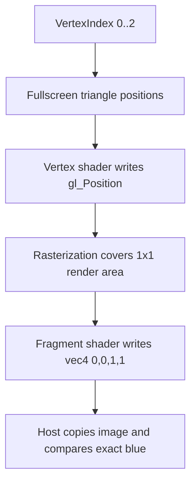

## Overview

**Core question:** Do the basic fence, semaphore, and equal-index queue-family barrier paths complete with the expected host-visible state or data under the legacy and synchronization2 APIs?

- The `smoke` test family provides short checks for submission completion, semaphore signal/wait submission paths across two queues, and buffer or image barriers.
- `synchronization.smoke` and `synchronization2.smoke` share semaphore and barrier test logic. The source selects legacy submission and barrier commands or their synchronization2 counterparts.
- The legacy family also contains `fences`. Fence signaling does not have a separate synchronization2 path, so that leaf is absent from `synchronization2.smoke`.
- Buffer cases compare every copied word. Image cases compare one rendered pixel. Semaphore cases require successful submissions and fence waits, but only log their rendered images.

## Background Knowledge

- A fence lets the host query or wait for completion of submitted queue work. It does not order one queue against another queue.
- A semaphore lets one queue submission wait for a signal from another. A binary semaphore carries signaled or unsignaled state; a timeline semaphore carries a monotonically increasing counter value.
- Buffer and image memory barriers establish execution and memory dependencies within command-buffer work. Queue-family indices describe ownership transfer only when the source and destination indices differ. The barrier leaves on this page use the same value for both indices, including special and arbitrary values, so they do not request ownership transfer.

## Registration Hierarchy

The implementation registers one test family under each test category. Both trees contain the same ten shared leaves; only the legacy tree adds `fences`.

```text
synchronization.smoke
├── fences
├── binary_semaphores
├── timeline_semaphores
├── queue_type_ignore_buffer_ignored
├── queue_type_ignore_buffer_external
├── queue_type_ignore_buffer_foreign
├── queue_type_ignore_buffer_arbitrary
├── queue_type_ignore_image_ignored
├── queue_type_ignore_image_external
├── queue_type_ignore_image_foreign
└── queue_type_ignore_image_arbitrary
```

The synchronization2 test category registers the shared leaves under a separate root:

```text
synchronization2.smoke
├── binary_semaphores
├── timeline_semaphores
├── queue_type_ignore_buffer_ignored
├── queue_type_ignore_buffer_external
├── queue_type_ignore_buffer_foreign
├── queue_type_ignore_buffer_arbitrary
├── queue_type_ignore_image_ignored
├── queue_type_ignore_image_external
├── queue_type_ignore_image_foreign
└── queue_type_ignore_image_arbitrary
```

## Parameter Dimensions and Observed Values

| Dimension | Values | Effect on the test |
|---|---|---|
| Test category | `synchronization`, `synchronization2` | Selects `SynchronizationType::LEGACY` or `SynchronizationType::SYNCHRONIZATION2`. The latter uses synchronization2 submission wrappers and `VkBufferMemoryBarrier2` or `VkImageMemoryBarrier2`. |
| Primitive or resource path | fence, semaphore, buffer barrier, image barrier | Selects the completion state or data that the host checks. |
| Semaphore type | `VK_SEMAPHORE_TYPE_BINARY`, `VK_SEMAPHORE_TYPE_TIMELINE` | Selects semaphore creation and whether submission uses timeline value `1`. |
| Queue-family value | `VK_QUEUE_FAMILY_IGNORED`, `VK_QUEUE_FAMILY_EXTERNAL`, `VK_QUEUE_FAMILY_FOREIGN_EXT`, `0xDEADBEEF` | Supplies the same source and destination queue-family index to each tested barrier. |

Support requirements vary by leaf:

| Leaf or variant | Requirement |
|---|---|
| Semaphore leaves | One graphics queue family exposing at least two queues. The current support check also requires `timelineSemaphore`, including for `binary_semaphores`. |
| `timeline_semaphores` | `VK_KHR_timeline_semaphore`; the custom device enables the timeline semaphore feature. |
| Shared leaves under `synchronization2.smoke` | `VK_KHR_synchronization2`. |
| `*_external` | `VK_KHR_external_memory`. |
| `*_foreign` | `VK_EXT_queue_family_foreign`. |

## Behavior Parameters

The primary behavioral axis is the **behavior leaf**. Each leaf chooses the synchronization mechanism, resource, and host-side evidence that determine the failure diagnosis.

### `fences`

This legacy-only leaf submits rendering with one initially unsignaled fence. It checks initial fence state, several wait forms, timeout on a second unsubmitted fence, and the final signaled state of the submitted fence.

### `binary_semaphores`

Queue 0 renders and signals a binary semaphore. The host waits for that submission's fence before it submits Queue 1, which waits on the semaphore and renders a second image. Both submission fences must complete.

### `timeline_semaphores`

This leaf uses the same ordered two-queue submission flow with a timeline semaphore. The first submission signals value `1`; after waiting for that submission's fence, the host submits the second command buffer with a wait for value `1`.

### `queue_type_ignore_buffer_*`

Each leaf fills a 64-word buffer with `0xAABBCCDD`, then records a transfer-write-to-host-read barrier. The suffix selects one value for both `srcQueueFamilyIndex` and `dstQueueFamilyIndex`. After execution, every word must contain the fill value.

### `queue_type_ignore_image_*`

Each leaf transitions and clears a 1x1 `VK_FORMAT_R8G8B8A8_UNORM` image, renders blue, transitions it for transfer, and copies it to host-visible memory. Every image barrier uses the suffix-selected value for both queue-family fields. The copied pixel must equal `(0, 0, 1, 1)` with zero threshold.

## Shader Analysis

### Representative Shader Walkthrough 1

#### Parameter Values Chosen

Representative path:

```text
dEQP-VK.synchronization2.smoke.queue_type_ignore_image_ignored
```

| Parameter choice | Meaning in this representative case |
|------------------|-------------------------------------|
| `synchronization2` | Selects the `VkImageMemoryBarrier2`/`vkCmdPipelineBarrier2` path in the image test. |
| `queue_type_ignore_image_ignored` | Maps the queue-family parameter to `VK_QUEUE_FAMILY_IGNORED`; the same value is supplied for source and destination indices, while the shader produces the pixel used to verify the barrier and copy sequence. |
| `extent = (1, 1, 1)`, `VK_FORMAT_R8G8B8A8_UNORM` | Defines the single-pixel color attachment and exact host-side comparison target. |

#### Purpose

The image barrier case renders an exact blue pixel after a clear and layout transition, then copies the image to a host-visible buffer. The shaders provide the fullscreen coverage and blue validation signal; the synchronization2 barriers around them are the property under test.

#### Structural Design



#### Shader Code

##### Fragment Shader (primary)

```glsl
#version 460
/// The fragment output is the blue pixel checked after image copyback.
layout (location=0) out vec4 outColor;
void main(void) {
    /// Produce the exact blue RGBA value used by the host reference image.
    outColor = vec4(0.0, 0.0, 1.0, 1.0);
}
```

##### Vertex Shader (fullscreen-triangle support)

```glsl
#version 460
/// Three positions form a fullscreen triangle; no vertex buffer is bound.
vec2 positions[3] = vec2[](
    vec2(-1.0, -1.0),
    vec2( 3.0, -1.0),
    vec2(-1.0,  3.0)
);
void main (void) {
    /// VertexIndex selects one of the three fullscreen-triangle corners.
    gl_Position = vec4(positions[gl_VertexIndex % 3], 0.0, 1.0);
}
```

#### Additional Info

- `initQueueFamilyTypePrograms()` emits both stages with `#version 460`; the fragment stage is the primary shader because its blue output is the host validation signal ([program generation](../../../modules/vulkan/synchronization/vktSynchronizationSmokeTests.cpp#L1370-L1391)).
- The vertex stage is fixed fullscreen-triangle support for this image family and does not vary with `FamilyType` or the legacy/synchronization2 switch ([vertex generator](../../../modules/vulkan/synchronization/vktSynchronizationSmokeTests.cpp#L1370-L1382)).
- The host reference is blue `(0.0f, 0.0f, 1.0f, 1.0f)` with zero threshold; the image is 1x1 and uses `VK_FORMAT_R8G8B8A8_UNORM` ([image setup and reference](../../../modules/vulkan/synchronization/vktSynchronizationSmokeTests.cpp#L1492-L1505), [comparison](../../../modules/vulkan/synchronization/vktSynchronizationSmokeTests.cpp#L1691-L1707)).

#### Parameter Variation Summary

| Parameter dimension | Shader-level variation from this shader | Evidence |
|---------------------|---------------------------------------|----------|
| Queue-family suffix | None; `FamilyType` changes barrier queue-family indices only, not generated shader text. | [family mapping and shader registration](../../../modules/vulkan/synchronization/vktSynchronizationSmokeTests.cpp#L1358-L1391), [image barrier index](../../../modules/vulkan/synchronization/vktSynchronizationSmokeTests.cpp#L1492-L1505) |
| Synchronization API | None; `params.sync2` selects barrier structures and commands around the same shader pair. | [synchronization2 image barriers](../../../modules/vulkan/synchronization/vktSynchronizationSmokeTests.cpp#L1541-L1583), [synchronization2 registration](../../../modules/vulkan/synchronization/vktSynchronizationSmokeTests.cpp#L1755-L1784) |
| Image extent and format | None in shader text; host setup fixes a 1x1 `VK_FORMAT_R8G8B8A8_UNORM` render target for this family. | [image setup](../../../modules/vulkan/synchronization/vktSynchronizationSmokeTests.cpp#L1492-L1505) |

#### SPIR-V

##### Fragment Shader (primary)

- Status: generated and validated
- Source: reconstructed `GLSL` from this walkthrough
- Stage: `frag`
- Target SPIRV version: `spirv1.0`

<details>
<summary>Click to expand SPIRV asm code</summary>

```llvm
; SPIR-V
; Version: 1.0
; Generator: Khronos Glslang Reference Front End; 11
; Bound: 13
; Schema: 0
               OpCapability Shader
          %1 = OpExtInstImport "GLSL.std.450"
               OpMemoryModel Logical GLSL450
               OpEntryPoint Fragment %main "main" %outColor
               OpExecutionMode %main OriginUpperLeft
               OpSource GLSL 460
               OpName %main "main"
               OpName %outColor "outColor"
               OpDecorate %outColor Location 0
       %void = OpTypeVoid
          %3 = OpTypeFunction %void
      %float = OpTypeFloat 32
    %v4float = OpTypeVector %float 4
%_ptr_Output_v4float = OpTypePointer Output %v4float
   %outColor = OpVariable %_ptr_Output_v4float Output
    %float_0 = OpConstant %float 0
    %float_1 = OpConstant %float 1
         %12 = OpConstantComposite %v4float %float_0 %float_0 %float_1 %float_1
       %main = OpFunction %void None %3
          %5 = OpLabel
               OpStore %outColor %12
               OpReturn
               OpFunctionEnd
```

</details>

##### Vertex Shader (fullscreen-triangle support)

- Status: generated and validated
- Source: reconstructed `GLSL` from this walkthrough
- Stage: `vert`
- Target SPIRV version: `spirv1.0`

<details>
<summary>Click to expand SPIRV asm code</summary>

```llvm
; SPIR-V
; Version: 1.0
; Generator: Khronos Glslang Reference Front End; 11
; Bound: 42
; Schema: 0
               OpCapability Shader
          %1 = OpExtInstImport "GLSL.std.450"
               OpMemoryModel Logical GLSL450
               OpEntryPoint Vertex %main "main" %_ %gl_VertexIndex
               OpSource GLSL 460
               OpName %main "main"
               OpName %positions "positions"
               OpName %gl_PerVertex "gl_PerVertex"
               OpMemberName %gl_PerVertex 0 "gl_Position"
               OpMemberName %gl_PerVertex 1 "gl_PointSize"
               OpMemberName %gl_PerVertex 2 "gl_ClipDistance"
               OpMemberName %gl_PerVertex 3 "gl_CullDistance"
               OpName %_ ""
               OpName %gl_VertexIndex "gl_VertexIndex"
               OpDecorate %gl_PerVertex Block
               OpMemberDecorate %gl_PerVertex 0 BuiltIn Position
               OpMemberDecorate %gl_PerVertex 1 BuiltIn PointSize
               OpMemberDecorate %gl_PerVertex 2 BuiltIn ClipDistance
               OpMemberDecorate %gl_PerVertex 3 BuiltIn CullDistance
               OpDecorate %gl_VertexIndex BuiltIn VertexIndex
       %void = OpTypeVoid
          %3 = OpTypeFunction %void
      %float = OpTypeFloat 32
    %v2float = OpTypeVector %float 2
       %uint = OpTypeInt 32 0
     %uint_3 = OpConstant %uint 3
%_arr_v2float_uint_3 = OpTypeArray %v2float %uint_3
%_ptr_Private__arr_v2float_uint_3 = OpTypePointer Private %_arr_v2float_uint_3
  %positions = OpVariable %_ptr_Private__arr_v2float_uint_3 Private
   %float_n1 = OpConstant %float -1
         %14 = OpConstantComposite %v2float %float_n1 %float_n1
    %float_3 = OpConstant %float 3
         %16 = OpConstantComposite %v2float %float_3 %float_n1
         %17 = OpConstantComposite %v2float %float_n1 %float_3
         %18 = OpConstantComposite %_arr_v2float_uint_3 %14 %16 %17
    %v4float = OpTypeVector %float 4
     %uint_1 = OpConstant %uint 1
%_arr_float_uint_1 = OpTypeArray %float %uint_1
%gl_PerVertex = OpTypeStruct %v4float %float %_arr_float_uint_1 %_arr_float_uint_1
%_ptr_Output_gl_PerVertex = OpTypePointer Output %gl_PerVertex
          %_ = OpVariable %_ptr_Output_gl_PerVertex Output
        %int = OpTypeInt 32 1
      %int_0 = OpConstant %int 0
%_ptr_Input_int = OpTypePointer Input %int
%gl_VertexIndex = OpVariable %_ptr_Input_int Input
      %int_3 = OpConstant %int 3
%_ptr_Private_v2float = OpTypePointer Private %v2float
    %float_0 = OpConstant %float 0
    %float_1 = OpConstant %float 1
%_ptr_Output_v4float = OpTypePointer Output %v4float
       %main = OpFunction %void None %3
          %5 = OpLabel
               OpStore %positions %18
         %29 = OpLoad %int %gl_VertexIndex
         %31 = OpSMod %int %29 %int_3
         %33 = OpAccessChain %_ptr_Private_v2float %positions %31
         %34 = OpLoad %v2float %33
         %37 = OpCompositeExtract %float %34 0
         %38 = OpCompositeExtract %float %34 1
         %39 = OpCompositeConstruct %v4float %37 %38 %float_0 %float_1
         %41 = OpAccessChain %_ptr_Output_v4float %_ %int_0
               OpStore %41 %39
               OpReturn
               OpFunctionEnd
```

</details>

## Runtime Execution and Result Checking

- `fences` creates two unsignaled fences, records a 256x256 draw, and submits it with the first fence. Zero-timeout and two-second waits may return either `VK_SUCCESS` or `VK_TIMEOUT`; the infinite wait must return `VK_SUCCESS`. A one-nanosecond wait on the unsubmitted fence must return `VK_TIMEOUT`, and the submitted fence must then report `VK_SUCCESS`. The rendered image is logged but not compared.
- Each semaphore leaf creates a device with two queues from one graphics queue family and records one draw per queue. The host submits the first draw with a semaphore signal and waits for its fence. It then submits the second draw with a wait on that semaphore and waits for the second fence. Both images are invalidated and logged, but their pixels do not determine pass or fail.
- Each buffer leaf fills a host-visible buffer on the device, executes either `vkCmdPipelineBarrier` or `vkCmdPipelineBarrier2`, waits for completion, invalidates the allocation, and compares all 64 words with `0xAABBCCDD`.
- Each image leaf records three barriers around clear, render, and copy operations. It uses legacy barriers for `synchronization.smoke` and synchronization2 barriers for `synchronization2.smoke`. After copying the 1x1 image to a buffer, the host performs an exact floating-point threshold comparison against blue.

## Failure Meaning

### Failure Cause Mapping

| If this behavior parameter value fails | Possible failure cause(s) |
|----------------------------------------|---------------------------|
| `fences` | Incorrect initial fence state, wait result, timeout behavior, or queue-completion signal. |
| `binary_semaphores` | Binary semaphore signal/wait submission failure or failure to complete either queue submission. |
| `timeline_semaphores` | Timeline value-1 signal/wait submission failure or failure to complete either queue submission. |
| `queue_type_ignore_buffer_ignored` | Incorrect equal-index handling for `VK_QUEUE_FAMILY_IGNORED`, or missing transfer-to-host visibility. |
| `queue_type_ignore_buffer_external` | Incorrect equal-index handling for `VK_QUEUE_FAMILY_EXTERNAL`, or missing transfer-to-host visibility. |
| `queue_type_ignore_buffer_foreign` | Incorrect equal-index handling for `VK_QUEUE_FAMILY_FOREIGN_EXT`, or missing transfer-to-host visibility. |
| `queue_type_ignore_buffer_arbitrary` | Incorrect equal-index handling for `0xDEADBEEF`, or missing transfer-to-host visibility. |
| `queue_type_ignore_image_ignored` | Incorrect equal-index image-barrier handling for `VK_QUEUE_FAMILY_IGNORED`, layout transition, rendering, or copyback. |
| `queue_type_ignore_image_external` | Incorrect equal-index image-barrier handling for `VK_QUEUE_FAMILY_EXTERNAL`, layout transition, rendering, or copyback. |
| `queue_type_ignore_image_foreign` | Incorrect equal-index image-barrier handling for `VK_QUEUE_FAMILY_FOREIGN_EXT`, layout transition, rendering, or copyback. |
| `queue_type_ignore_image_arbitrary` | Incorrect equal-index image-barrier handling for `0xDEADBEEF`, layout transition, rendering, or copyback. |

### Cause Analysis

#### Fence state or completion reporting

**Possible failure symptoms:** A new fence reports a state other than `VK_NOT_READY`, a permitted finite wait returns an unexpected error, the unsubmitted fence does not time out, the infinite wait fails, or the submitted fence does not become signaled.

**Possible implementation causes:** The implementation may mishandle initial fence state, host wait timeout rules, or the association between queue completion and fence signal operations. The failing API result identifies the narrower contract that needs source-level investigation.

#### Semaphore submission or completion

**Possible failure symptoms:** Queue submission fails, or either submission fence fails to complete after the signal/wait sequence.

**Possible implementation causes:** The implementation may mishandle the selected semaphore type, timeline value `1`, submission encoding, or the submitted semaphore signal or wait operation. Because the host does not submit Queue 1 until Queue 0's fence signals, these leaves do not demonstrate that the semaphore alone orders concurrently pending work across queues. They also do not compare rendered pixels, so a pass does not establish image-content correctness.

#### Equal-index buffer barrier or host visibility

**Possible failure symptoms:** One or more buffer words differ from `0xAABBCCDD`, or command submission fails for a selected equal-index value.

**Possible implementation causes:** The implementation may interpret equal source and destination queue-family indices as an ownership transfer, mishandle a special queue-family value, or fail to make transfer writes available and visible to host reads. The legacy or synchronization2 category path identifies the barrier API involved.

#### Equal-index image barriers, transitions, or copyback

**Possible failure symptoms:** The copied pixel differs from exact blue, or recording or submission fails for the selected queue-family value.

**Possible implementation causes:** The implementation may mishandle equal-index barrier semantics, one of the image layout transitions, transfer/color-attachment dependencies, rendering, or image-to-buffer copyback. The test result alone does not prove which stage failed; the command sequence and failing category path guide further investigation.

## Case Pruning

### Requirement-based pruning

The source registers every combination shown in the hierarchy, then reports unsupported cases at runtime. Semaphore leaves need a graphics queue family with at least two queues. The current semaphore support check also requires `timelineSemaphore`, including for `binary_semaphores`. The synchronization2 leaves require `VK_KHR_synchronization2`; the `*_external` and `*_foreign` leaves require `VK_KHR_external_memory` and `VK_EXT_queue_family_foreign`, respectively.

### Design-based pruning

The source does not prune queue-family suffixes by test category. The only structural omission is `fences` from `synchronization2.smoke`: the fence test has no synchronization2-specific command path.

## Key Takeaways

- The two test categories share ten smoke leaves and differ by API path; only `synchronization.smoke` adds `fences`.
- The strongest data checks are in the barrier leaves: 64 exact buffer words or one exact blue image pixel.
- Semaphore leaves check that the host can submit and complete the source-fence-then-semaphore-wait sequence. They do not isolate the semaphore as the only ordering mechanism, and their logged images are diagnostic output rather than pass/fail references.
- Queue-family barrier leaves keep source and destination indices equal, so their special values must not cause an ownership transfer.

## Source Reference Appendix

- [Semaphore configuration, shader payload, and two-queue device setup](../../../modules/vulkan/synchronization/vktSynchronizationSmokeTests.cpp#L73-L220)
- [`testFences()` state and wait checks](../../../modules/vulkan/synchronization/vktSynchronizationSmokeTests.cpp#L1054-L1151)
- [`testSemaphores()` two-queue signal/wait flow](../../../modules/vulkan/synchronization/vktSynchronizationSmokeTests.cpp#L1154-L1283)
- [Queue-family value mapping and support checks](../../../modules/vulkan/synchronization/vktSynchronizationSmokeTests.cpp#L1296-L1355)
- [`ignoreQueueFamilyTypeBuffer()` barrier and word comparison](../../../modules/vulkan/synchronization/vktSynchronizationSmokeTests.cpp#L1393-L1489)
- [`ignoreQueueFamilyTypeImage()` transitions, rendering, and pixel comparison](../../../modules/vulkan/synchronization/vktSynchronizationSmokeTests.cpp#L1492-L1709)
- [`synchronization.smoke` and `synchronization2.smoke` registration](../../../modules/vulkan/synchronization/vktSynchronizationSmokeTests.cpp#L1725-L1781)
- [Legacy mustpass entries](../../../mustpass/main/vk-default/synchronization.txt#L60017-L60027)
- [Synchronization2 mustpass entries](../../../mustpass/main/vk-default/synchronization2.txt#L78736-L78745)
- [Vulkan synchronization chapter](../../../../vulkan-docs/src/chapters/synchronization.adoc)
