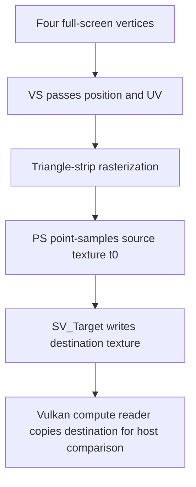

## Overview

**Core question:** Can Vulkan and Direct3D 11 transfer ownership of shared Win32 memory through keyed-mutex keys without losing the data written by Vulkan?

- This page covers the legacy-only `synchronization.win32_keyed_mutex` test family implemented in [`vktSynchronizationWin32KeyedMutexTests.cpp`](../../../modules/vulkan/synchronization/vktSynchronizationWin32KeyedMutexTests.cpp).
- Each case imports two keyed-mutex-backed D3D11 resources into Vulkan. Vulkan writes the first resource, D3D11 transfers its contents to the second, and Vulkan reads the second resource.
- `VkWin32KeyedMutexAcquireReleaseInfoKHR` supplies the ownership keys around the two Vulkan submissions. Legacy pipeline barriers release the first resource to `VK_QUEUE_FAMILY_EXTERNAL` and acquire the second resource from it.
- The default legacy mustpass list contains 1,964 leaves. The family has no `synchronization2` registration and is excluded from Vulkan SC builds.

## Background Knowledge

- **Win32 keyed mutex:** a D3D11 resource created with `D3D11_RESOURCE_MISC_SHARED_KEYEDMUTEX` exposes an `IDXGIKeyedMutex`. An owner releases a numeric key, and the next owner acquires that key before accessing the shared resource. Vulkan supplies acquire and release keys through `VkWin32KeyedMutexAcquireReleaseInfoKHR` in a submission's `pNext` chain.
- **Imported external memory:** Vulkan creates a buffer or image compatible with a D3D11 shared handle, imports that handle into `VkDeviceMemory`, and binds the memory to the Vulkan resource. The selected handle type and external-memory properties determine whether import is supported and whether the allocation must be dedicated.
- **External queue-family ownership:** `VK_QUEUE_FAMILY_EXTERNAL` represents an external API in a queue-family ownership transfer. This test releases the Vulkan-written resource to that family and acquires the D3D11-produced resource from it.

## Registration Hierarchy

```text
synchronization.win32_keyed_mutex
```

The root-only tree avoids presenting selected resource types as direct children. [`createTests()`](../../../modules/vulkan/synchronization/vktSynchronizationWin32KeyedMutexTests.cpp#L1800-L1853) registers 424 direct intermediate nodes named from compatible `<write-operation>_<read-operation>` pairs. Listing only some of those generated children would give an incomplete registration tree. Their leaves encode the resource description and `_nt` or `_kmt` handle suffix. The default [`synchronization.txt`](../../../mustpass/main/vk-default/synchronization.txt#L62908-L64871) contains all 1,964 selected leaves. Parent registration adds this family only to `synchronization`, outside Vulkan SC builds; [`synchronization2.txt`](../../../mustpass/main/vk-default/synchronization2.txt) contains no matching path.

## Parameter Dimensions and Observed Values

| Dimension | Registered values or rule | Meaning in this test | Evidence |
|-----------|---------------------------|----------------------|----------|
| Write operation | 33 entries in `s_writeOps`; compatible selections include transfer, clear, graphics-shader, compute-shader, draw, and indirect writes | Chooses how Vulkan produces the expected data and supplies the outgoing synchronization scope and resource usage. | [`s_writeOps`](../../../modules/vulkan/synchronization/vktSynchronizationOperationTestData.hpp#L36-L70) |
| Read operation | 39 entries in `s_readOps`; compatible selections include transfer, graphics-shader, compute-shader, vertex/index input, and indirect reads | Chooses how Vulkan observes the data and supplies the incoming synchronization scope and resource usage. | [`s_readOps`](../../../modules/vulkan/synchronization/vktSynchronizationOperationTestData.hpp#L72-L112) |
| Resource | Buffers of 16 KiB and 256 KiB; 128x128 single-sampled 2D color images in `R8_UNORM`, `R16_UINT`, `R8G8B8A8_UNORM`, `R16G16B16A16_UINT`, or `R32G32B32A32_SFLOAT` | Selects the shared-memory shape and whether D3D11 transfers data with a buffer copy or a texture sampling draw. | [`s_resourcesWin32KeyedMutex`](../../../modules/vulkan/synchronization/vktSynchronizationWin32KeyedMutexTests.cpp#L67-L83) |
| Handle suffix | `_kmt` for buffers and images; `_nt` for images only | `_kmt` selects `OPAQUE_WIN32_KMT` for buffers or `D3D11_TEXTURE_KMT` for images. `_nt` selects `D3D11_TEXTURE`; D3D11 does not create the buffer form with an NT shared handle here. | [`cases[]`](../../../modules/vulkan/synchronization/vktSynchronizationWin32KeyedMutexTests.cpp#L1803-L1813) |
| Operation-pair intermediate node | 424 compatible `<write-operation>_<read-operation>` names in the default mustpass list | Selects the Vulkan producer and consumer mechanisms. Empty operation pairs are not registered. | [generation loop](../../../modules/vulkan/synchronization/vktSynchronizationWin32KeyedMutexTests.cpp#L1815-L1852) |
| Test case leaf | 1,964 selected leaves; each uses one of 12 distinct resource-and-handle names | Combines one compatible operation pair with one resource and handle form. | [`synchronization.txt`](../../../mustpass/main/vk-default/synchronization.txt#L62908-L64871) |
| Queue family | Every queue family exposed by the selected physical device; compute-only mode starts at a compute family without graphics capability | Repeats the same leaf across queue families. A family without graphics capability is reported as unsupported for the current iteration. | [`Win32KeyedMutexTestInstance::iterate()`](../../../modules/vulkan/synchronization/vktSynchronizationWin32KeyedMutexTests.cpp#L1507-L1532) |

A leaf follows this registered shape:

```text
synchronization.win32_keyed_mutex.<write-operation>_<read-operation>.<resource-name><handle-suffix>
```

For example, the mustpass list includes `write_blit_image_read_blit_image.image_128x128_r16_uint_kmt`. Resource compatibility determines which operation pairs receive buffer leaves, image leaves, or both.

## Behavior Parameters

The primary behavioral axis is the resource kind encoded in each test case leaf. It changes both the imported Vulkan/D3D11 resource and the D3D11 transfer mechanism.

### `buffer_*_kmt` - D3D11 buffer copy

D3D11 creates two keyed-mutex buffers and exposes KMT shared handles. Vulkan imports one buffer for the selected write operation and the other for the selected read operation. Between the two Vulkan submissions, D3D11 calls `CopySubresourceRegion` to copy the complete source buffer into the destination buffer. No NT buffer leaves exist because this source does not support D3D11 buffer creation with the NT shared-handle form.

### `image_*_kmt` and `image_*_nt` - D3D11 texture sampling draw

D3D11 creates two keyed-mutex 2D textures with either KMT or NT shared handles. After Vulkan writes the source texture, D3D11 samples it with point filtering and draws a full-screen triangle strip into the destination texture. Vulkan then acquires and reads the imported destination image. The five image formats exercise the same transfer sequence with different texel representations.

The operation-pair intermediate node is a second behavioral axis. It selects the Vulkan writer and reader, including their commands, resource usages, expected data, synchronization scopes, and image layouts. The common keyed-mutex and D3D11 transfer sequence does not change across those 424 generated pairs.

## Shader Analysis

### Representative Shader Walkthrough 1

#### Parameter Values Chosen

Representative path:

```text
dEQP-VK.synchronization.win32_keyed_mutex.write_image_compute_indirect_read_image_compute.image_128x128_r8g8b8a8_unorm_nt
```

| Parameter choice | Meaning in this representative case |
|------------------|-------------------------------------|
| `write_image_compute_indirect` | Vulkan uses the shared synchronization-operation compute shader to copy a prepared pattern into the imported source image, launching its single workgroup with `vkCmdDispatchIndirect`. |
| `read_image_compute` | After the D3D11 transfer, Vulkan uses the same generated image-copy loop with a direct `vkCmdDispatch` to copy the imported destination image into an internal image for host readback. |
| `image_128x128_r8g8b8a8_unorm` | Selects two 128x128, single-sampled `R8G8B8A8_UNORM` shared textures; the corresponding D3D11 shader resource and render-target views use `DXGI_FORMAT_R8G8B8A8_UNORM`. |
| `_nt` | Selects `VK_EXTERNAL_MEMORY_HANDLE_TYPE_D3D11_TEXTURE_BIT` and D3D11 NT shared handles. The HLSL is unchanged by the handle form. |

#### Purpose

The primary pixel shader performs the cross-API data-transfer step: it samples the Vulkan-written D3D11 source texture and writes that value to the second shared texture. The supporting vertex shader passes full-screen positions and texture coordinates through unchanged so the draw covers the 128x128 destination.

#### Structural Design



#### Shader Code

##### Pixel Shader

```hlsl
/// Binding t0 is the Vulkan-written 128x128 RGBA8 source texture, exposed through a D3D11 shader-resource view.
Texture2D txDiffuse : register(t0);
/// Binding s0 uses MIN_MAG_MIP_POINT filtering; despite its source name, it is not a linear-filter sampler.
SamplerState samLinear : register(s0);

/// The rasterizer supplies the interpolated texture coordinate from the supporting vertex shader; Pos is not read by PS.
struct PS_INPUT
{
    float4 Pos : SV_POSITION;
    float2 Tex : TEXCOORD0;
};

float4 PS(PS_INPUT input) : SV_Target
{
    /// Preserve the sampled RGBA value as the destination render-target value.
    return txDiffuse.Sample(samLinear, input.Tex);
}
```

##### Vertex Shader

```hlsl
/// POSITION and TEXCOORD0 come from the four-entry SimpleVertex buffer used by the triangle strip.
struct VS_INPUT
{
    float4 Pos : POSITION;
    float2 Tex : TEXCOORD0;
};

/// These outputs become the pixel shader's screen position and interpolated sampling coordinate.
struct PS_INPUT
{
    float4 Pos : SV_POSITION;
    float2 Tex : TEXCOORD0;
};

PS_INPUT VS(VS_INPUT input)
{
    PS_INPUT output = (PS_INPUT)0;
    /// Pass through the full-screen clip-space position and vertically oriented texture coordinate.
    output.Pos = input.Pos;
    output.Tex = input.Tex;

    return output;
}
```

#### Additional Info

- The CTS stores both entry points in one HLSL source string and compiles them at runtime as `VS`/`vs_4_0` and `PS`/`ps_4_0`. The stage-specific blocks above separate that shared source for readability; the final SPIR-V is generated only for the primary `PS` entry point.
- The D3D11 sampler uses point filtering and wrap addressing. The four supplied UVs are `(0,1)`, `(0,0)`, `(1,1)`, and `(1,0)`, matching the full-screen triangle-strip vertices.
- Before drawing, D3D11 clears the destination blue; all covered pixels are then replaced by pixel-shader output, making missing draw coverage visible to the later byte comparison.

#### Parameter Variation Summary

| Parameter dimension | Shader-level variation from this shader | Evidence |
|---------------------|---------------------------------------|----------|
| Resource kind | Buffer leaves do not create or run this HLSL pair; D3D11 uses `CopySubresourceRegion`. Every image leaf uses the same vertex/pixel source and four-vertex draw. | [D3D11 resource and transfer branches](../../../modules/vulkan/synchronization/vktSynchronizationWin32KeyedMutexTests.cpp#L663-L884) |
| Image extent and format | This family fixes image extent at 128x128. The HLSL text remains unchanged across the five formats; D3D11 changes the texture, SRV, and render-target formats, while Vulkan's generated compute declarations use the matching storage-image format/type qualifier. | [image inventory](../../../modules/vulkan/synchronization/vktSynchronizationWin32KeyedMutexTests.cpp#L67-L83), [Vulkan image shader generation](../../../modules/vulkan/synchronization/vktSynchronizationOperation.cpp#L2586-L2613) |
| Vulkan write/read operations | For this path, both Vulkan compute programs are generated as `#version 440`, `local_size_x = 1` shaders with binding 0 `readonly` and binding 1 `writeonly` `rgba8 image2D` resources; each single invocation loops over all 128x128 texels using `imageLoad`/`imageStore`. The write launch is indirect and the read launch is direct, a command-recording distinction rather than a GLSL-text difference. Other operation-pair nodes can select different Vulkan stages or non-shader commands. | [compute dispatch selection](../../../modules/vulkan/synchronization/vktSynchronizationOperation.cpp#L1707-L1756), [image shader generation](../../../modules/vulkan/synchronization/vktSynchronizationOperation.cpp#L2554-L2640) |
| Handle suffix | `_nt` versus `_kmt` changes shared-handle creation and Vulkan handle type, but not the HLSL or Vulkan compute shader text. | [D3D11 texture handle branch](../../../modules/vulkan/synchronization/vktSynchronizationWin32KeyedMutexTests.cpp#L667-L724) |

#### SPIR-V

##### Pixel Shader

- Status: generated and validated
- Source: reconstructed `HLSL` from this walkthrough
- Stage: `frag`
- Target SPIRV version: `spirv1.0`

<details>
<summary>Click to expand SPIRV asm code</summary>

```llvm
; SPIR-V
; Version: 1.0
; Generator: Khronos Glslang Reference Front End; 11
; Bound: 57
; Schema: 0
               OpCapability Shader
          %1 = OpExtInstImport "GLSL.std.450"
               OpMemoryModel Logical GLSL450
               OpEntryPoint Fragment %PS "PS" %input_Tex %_entryPointOutput
               OpExecutionMode %PS OriginUpperLeft
               OpSource HLSL 500
               OpName %PS "PS"
               OpName %txDiffuse "txDiffuse"
               OpName %samLinear "samLinear"
               OpName %input_Tex "input.Tex"
               OpName %_entryPointOutput "@entryPointOutput"
               OpDecorate %txDiffuse Binding 0
               OpDecorate %txDiffuse DescriptorSet 0
               OpDecorate %samLinear Binding 0
               OpDecorate %samLinear DescriptorSet 0
               OpDecorate %input_Tex Location 0
               OpDecorate %_entryPointOutput Location 0
       %void = OpTypeVoid
          %3 = OpTypeFunction %void
      %float = OpTypeFloat 32
    %v4float = OpTypeVector %float 4
    %v2float = OpTypeVector %float 2
         %15 = OpTypeImage %float 2D 0 0 0 1 Unknown
%_ptr_UniformConstant_15 = OpTypePointer UniformConstant %15
  %txDiffuse = OpVariable %_ptr_UniformConstant_15 UniformConstant
         %19 = OpTypeSampler
%_ptr_UniformConstant_19 = OpTypePointer UniformConstant %19
  %samLinear = OpVariable %_ptr_UniformConstant_19 UniformConstant
         %23 = OpTypeSampledImage %15
%_ptr_Input_v2float = OpTypePointer Input %v2float
  %input_Tex = OpVariable %_ptr_Input_v2float Input
%_ptr_Output_v4float = OpTypePointer Output %v4float
%_entryPointOutput = OpVariable %_ptr_Output_v4float Output
         %PS = OpFunction %void None %3
          %5 = OpLabel
         %42 = OpLoad %v2float %input_Tex
         %51 = OpLoad %15 %txDiffuse
         %52 = OpLoad %19 %samLinear
         %53 = OpSampledImage %23 %51 %52
         %56 = OpImageSampleImplicitLod %v4float %53 %42
               OpStore %_entryPointOutput %56
               OpReturn
               OpFunctionEnd
```

</details>

##### Vertex Shader

- Status: generated and validated
- Source: reconstructed `HLSL` from this walkthrough
- Stage: `vert`
- Target SPIRV version: `spirv1.0`

<details>
<summary>Click to expand SPIRV asm code</summary>

```llvm
; SPIR-V
; Version: 1.0
; Generator: Khronos Glslang Reference Front End; 11
; Bound: 55
; Schema: 0
               OpCapability Shader
          %1 = OpExtInstImport "GLSL.std.450"
               OpMemoryModel Logical GLSL450
               OpEntryPoint Vertex %VS "VS" %input_Pos %input_Tex %_entryPointOutput_Pos %_entryPointOutput_Tex
               OpSource HLSL 500
               OpName %VS "VS"
               OpName %input_Pos "input.Pos"
               OpName %input_Tex "input.Tex"
               OpName %_entryPointOutput_Pos "@entryPointOutput.Pos"
               OpName %_entryPointOutput_Tex "@entryPointOutput.Tex"
               OpDecorate %input_Pos Location 0
               OpDecorate %input_Tex Location 1
               OpDecorate %_entryPointOutput_Pos BuiltIn Position
               OpDecorate %_entryPointOutput_Tex Location 0
       %void = OpTypeVoid
          %3 = OpTypeFunction %void
      %float = OpTypeFloat 32
    %v4float = OpTypeVector %float 4
    %v2float = OpTypeVector %float 2
%_ptr_Input_v4float = OpTypePointer Input %v4float
  %input_Pos = OpVariable %_ptr_Input_v4float Input
%_ptr_Input_v2float = OpTypePointer Input %v2float
  %input_Tex = OpVariable %_ptr_Input_v2float Input
%_ptr_Output_v4float = OpTypePointer Output %v4float
%_entryPointOutput_Pos = OpVariable %_ptr_Output_v4float Output
%_ptr_Output_v2float = OpTypePointer Output %v2float
%_entryPointOutput_Tex = OpVariable %_ptr_Output_v2float Output
         %VS = OpFunction %void None %3
          %5 = OpLabel
         %39 = OpLoad %v4float %input_Pos
         %43 = OpLoad %v2float %input_Tex
               OpStore %_entryPointOutput_Pos %39
               OpStore %_entryPointOutput_Tex %43
               OpReturn
               OpFunctionEnd
```

</details>

## Runtime Execution and Result Checking

1. A shared [`InstanceAndDevice`](../../../modules/vulkan/synchronization/vktSynchronizationWin32KeyedMutexTests.cpp#L1359-L1419) creates a custom Vulkan instance, selects a physical device, creates one logical device with all queue families, and initializes D3D11 support. The D3D11 setup requires a valid Vulkan device LUID and searches DXGI adapters for the same LUID.
2. For the selected resource and handle type, D3D11 creates two keyed-mutex resources. It acquires their initial key and releases the source resource with `KEYED_MUTEX_VK_WRITE` so Vulkan can begin.
3. Vulkan creates matching buffers or images, imports the source and destination D3D11 handles, and binds their memory. The image import path honors `requiresDedicatedAllocation` reported by Vulkan.
4. The selected Vulkan write operation records commands against the source resource. A legacy buffer or image barrier releases ownership from the current queue family to `VK_QUEUE_FAMILY_EXTERNAL`.
5. The first `vkQueueSubmit` acquires `KEYED_MUTEX_VK_WRITE`, executes the write command buffer, and releases `KEYED_MUTEX_DX_COPY`.
6. D3D11 acquires `KEYED_MUTEX_DX_COPY`. It copies a buffer with `CopySubresourceRegion`, or renders the source texture into the destination texture. It releases the source with `KEYED_MUTEX_DONE` and the destination with `KEYED_MUTEX_VK_VERIFY`.
7. The second Vulkan command buffer acquires the destination resource from `VK_QUEUE_FAMILY_EXTERNAL` and records the selected read operation. Its submission acquires `KEYED_MUTEX_VK_VERIFY` and releases `KEYED_MUTEX_DONE`.
8. After `vkQueueWaitIdle`, the host compares `writeOp->getData()` with `readOp->getData()` using `deMemCmp`. A mismatch logs the first differing byte and up to 256 bytes of expected and actual data. The case accumulates failures and validation messages while iterating through queue families, returning `incomplete` until the last family has run.

## Failure Meaning

### Failure Cause Mapping

| If this behavior parameter value fails | Possible failure cause(s) |
|----------------------------------------|---------------------------|
| `buffer_*_kmt` | KMT buffer creation or import, keyed-mutex ownership transfer, D3D11 buffer copy, legacy external ownership barriers, or the selected Vulkan buffer operations |
| `image_*_kmt` | KMT texture creation or import, keyed-mutex ownership transfer, D3D11 texture rendering, image layout/ownership barriers, or the selected Vulkan image operations |
| `image_*_nt` | NT texture handle creation or import, keyed-mutex ownership transfer, D3D11 texture rendering, image layout/ownership barriers, or the selected Vulkan image operations |

A failure isolated to one operation-pair intermediate node can come from that Vulkan writer or reader rather than the common Win32 sharing path. The failing full leaf and queue family are needed to narrow the cause.

### Cause Analysis

#### External resource creation or import is incorrect

**Possible failure symptoms:** resource creation, handle import, memory binding, or a selected operation fails before comparison; otherwise Vulkan reads bytes that differ from the writer's expected data. Failures limited to `_nt`, image `_kmt`, or buffer `_kmt` identify different handle and resource paths.

**Possible implementation causes:** the implementation may reject a supported handle/resource combination, bind the Vulkan resource to the wrong imported payload, or mishandle a dedicated image allocation. The external-memory properties, selected suffix, and resource type identify the import path to inspect.

#### Keyed-mutex or external ownership transfer is incorrect

**Possible failure symptoms:** a queue submission or D3D11 keyed-mutex operation does not complete, or Vulkan reads stale or incomplete destination data after the programmed key sequence.

**Possible implementation causes:** the implementation may mishandle the acquire/release arrays in `VkWin32KeyedMutexAcquireReleaseInfoKHR`, the transition between Vulkan keys and `IDXGIKeyedMutex`, or the release/acquire barriers involving `VK_QUEUE_FAMILY_EXTERNAL`. For images, incorrect layout propagation can produce the same final mismatch.

#### D3D11 transfer produces incorrect destination contents

**Possible failure symptoms:** buffer failures return copied bytes that differ from the Vulkan writer's data, while image failures return texels changed or omitted by the D3D11 draw.

**Possible implementation causes:** inspect the D3D11 buffer copy for buffer leaves. For image leaves, inspect source-resource binding, point sampling, render-target setup, format mapping, and draw completion before the destination key is released.

#### Selected Vulkan write or read operation is incorrect

**Possible failure symptoms:** failures cluster around one operation-pair intermediate node or one Vulkan operation across otherwise working handle and resource forms.

**Possible implementation causes:** the shared operation implementation may generate incorrect commands, usage flags, synchronization scopes, image layouts, expected data, or readback data for that operation/resource combination. Source-level investigation of the failed operation is required before attributing the result to Win32 keyed-mutex handling.

## Case Pruning

### Requirement-based pruning

- The family requires Windows, `VK_KHR_external_memory_win32`, and `VK_KHR_win32_keyed_mutex`. It also requires the external-memory capability and physical-device-properties2 instance functionality used by the custom instance.
- `VK_KHR_external_memory`, `VK_KHR_dedicated_allocation`, and `VK_KHR_get_memory_requirements2` are required when the selected API version does not provide them as core functionality.
- NT texture handles require Windows 8 or later. Non-Windows execution reports the family as unsupported.
- The selected external buffer or image configuration must be importable. Image format queries may report `VK_ERROR_FORMAT_NOT_SUPPORTED`, and dedicated-only image configurations use dedicated imported memory.
- Both selected operation implementations must support the resource. Runtime also requires a graphics-capable queue family and a valid Vulkan device LUID for D3D11 adapter selection.

### Design-based pruning

- The generator omits every write/read/resource combination for which either operation reports that the resource is unsupported.
- It does not add an operation-pair intermediate node when no resource and handle combination survives that compatibility filter.
- Buffers have `_kmt` leaves only. Images have both `_kmt` and `_nt` leaves.
- The resource inventory excludes depth/stencil images, multisampled images, and resource dimensions other than the two buffer sizes and five 128x128 color-image formats.
- Parent registration places the family under legacy `synchronization` only and excludes it from Vulkan SC. No synchronization2 variant is generated.

## Key Takeaways

- The family checks a four-owner-key sequence: Vulkan writes, D3D11 transfers, Vulkan verifies, and the final owner releases the resource as done.
- Buffer leaves use a D3D11 copy and KMT handles. Image leaves use a D3D11 sampling draw with KMT or NT handles.
- The 1,964 legacy mustpass leaves sit below 424 operation-pair intermediate nodes. `buffer` and `image` are resource concepts encoded in leaf names, not direct registration children.
- Exact byte comparison turns lost ownership, missing visibility, transfer errors, and selected-operation errors into test failures. See `Failure Meaning` for the evidence needed to distinguish them.

## Source Reference Appendix

| Entry point | Link | Why it matters |
|-------------|------|----------------|
| Resource inventory | [`s_resourcesWin32KeyedMutex`](../../../modules/vulkan/synchronization/vktSynchronizationWin32KeyedMutexTests.cpp#L67-L83) | Defines the two buffers and five image descriptions. |
| Imported Vulkan resources | [`importResource()`](../../../modules/vulkan/synchronization/vktSynchronizationWin32KeyedMutexTests.cpp#L345-L408) | Creates a compatible Vulkan buffer or image and imports the D3D11 handle. |
| Legacy external ownership barriers | [`recordWriteBarrier()` and `recordReadBarrier()`](../../../modules/vulkan/synchronization/vktSynchronizationWin32KeyedMutexTests.cpp#L410-L510) | Releases to and acquires from `VK_QUEUE_FAMILY_EXTERNAL`. |
| D3D11 resources and keyed-mutex initialization | [`DX11Operation`](../../../modules/vulkan/synchronization/vktSynchronizationWin32KeyedMutexTests.cpp#L563-L838) | Creates keyed-mutex buffers or textures and prepares the D3D11 image-copy draw. |
| D3D11 transfer and key handoff | [`DX11Operation::copyMemory()`](../../../modules/vulkan/synchronization/vktSynchronizationWin32KeyedMutexTests.cpp#L858-L885) | Copies a buffer or renders a texture, then releases the source and destination keys. |
| D3D11 adapter and device setup | [`DX11OperationSupport`](../../../modules/vulkan/synchronization/vktSynchronizationWin32KeyedMutexTests.cpp#L1174-L1339) | Loads the Windows runtime, validates the Vulkan LUID, searches DXGI adapters, and creates D3D11 support. |
| Runtime submissions and comparison | [`Win32KeyedMutexTestInstance::iterate()`](../../../modules/vulkan/synchronization/vktSynchronizationWin32KeyedMutexTests.cpp#L1507-L1710) | Imports both resources, submits the keyed-mutex work, transfers data through D3D11, and compares bytes. |
| Capability checks | [`Win32KeyedMutexTestCase::checkSupport()`](../../../modules/vulkan/synchronization/vktSynchronizationWin32KeyedMutexTests.cpp#L1723-L1779) | Applies extension, OS, external-memory, format, importability, and operation support gates. |
| Registration generator | [`createTests()`](../../../modules/vulkan/synchronization/vktSynchronizationWin32KeyedMutexTests.cpp#L1800-L1853) | Builds operation-pair intermediate nodes and resource/handle leaves. |
| Parent registration | [`createTestsInternal()`](../../../modules/vulkan/synchronization/vktSynchronizationTests.cpp#L114-L159) | Adds the family only to legacy synchronization outside Vulkan SC. |
| Shared operation inventory | [`vktSynchronizationOperationTestData.hpp`](../../../modules/vulkan/synchronization/vktSynchronizationOperationTestData.hpp#L36-L112) | Defines the 33 writer and 39 reader candidates. |
| Default legacy mustpass selection | [`synchronization.txt`](../../../mustpass/main/vk-default/synchronization.txt#L62908-L64871) | Lists the 1,964 selected leaves and their 424 direct operation-pair parents. |
| Default synchronization2 selection | [`synchronization2.txt`](../../../mustpass/main/vk-default/synchronization2.txt) | Contains no `win32_keyed_mutex` path. |
| Keyed-mutex submission semantics | [`cmdbuffers.adoc`](../../../../vulkan-docs/src/chapters/cmdbuffers.adoc#L2880-L2933) | Defines keyed-mutex acquisition and release through `VkSubmitInfo`. |
