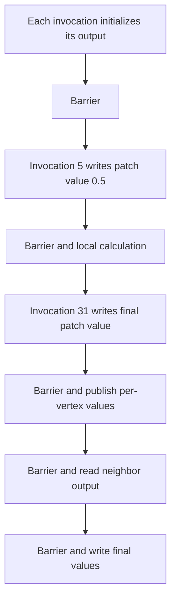

## Overview

**Core question:** Does a tessellation pipeline preserve patch sizes, built-ins, stage interfaces, and barrier-ordered cross-invocation data through the tessellation control and evaluation stages?

- `vktTessellationShaderInputOutputTests.cpp` implements the `tessellation.shader_input_output` test family.
- The 28 direct test leaves cover unequal input/output patch sizes, tessellation built-ins and patch data, `gl_Position` routing, a multi-phase barrier case, and typed cross-invocation communication.
- Each case generates four shader stages, renders the tested values as geometry or color, copies the RGBA8 image to host-visible memory, and compares it with a PNG or generated white reference.
- A mismatch can come from the family-specific interface behavior or from the shared render, copyback, and image-comparison path.

## Background Knowledge

For the shared concepts tessellation pipeline stages and patch interfaces, see [Background Knowledge](../../categories/tessellation.md#background-knowledge) of the `tessellation` page.

- **Input and output patches.** Pipeline patch-control-point state sets the input patch size. The shader `OutputVertices` execution mode sets the TCS output patch size. `gl_PatchVerticesIn` therefore reports the input count in TCS and the TCS output count in TES.
- **Per-vertex and per-patch interfaces.** Per-vertex arrays have one element per control point. A `patch` variable belongs to the whole patch. `gl_InvocationID` identifies the output control point owned by a TCS invocation.
- **TCS barriers.** Invocations in one patch have no defined relative order. `barrier()` divides their work into phases so a later phase can read outputs written by other invocations in an earlier phase.

## Registration Hierarchy

```text
tessellation.shader_input_output
├── patch_vertices_5_in_10_out
├── patch_vertices_10_in_5_out
├── primitive_id_tcs
├── primitive_id_tes
├── patch_vertices_in_tcs
├── patch_vertices_in_tes
├── tess_level_inner_0_tes
├── tess_level_inner_1_tes
├── tess_level_outer_0_tes
├── tess_level_outer_1_tes
├── tess_level_outer_2_tes
├── tess_level_outer_3_tes
├── gl_position_vs_to_tcs
├── gl_position_tcs_to_tes
├── gl_position_vs_to_tcs_to_tes
├── barrier
├── cross_invocation_per_vertex_int
├── cross_invocation_per_vertex_uint
├── cross_invocation_per_vertex_float
├── cross_invocation_per_vertex_vec3
├── cross_invocation_per_vertex_vec4
├── cross_invocation_per_vertex_mat4x3
├── cross_invocation_per_patch_int
├── cross_invocation_per_patch_uint
├── cross_invocation_per_patch_float
├── cross_invocation_per_patch_vec3
├── cross_invocation_per_patch_vec4
└── cross_invocation_per_patch_mat4x3
```

The 28 direct leaves above match the Vulkan default mustpass list.

## Parameter Dimensions and Observed Values

| Dimension | Registered values | Meaning in this test | Evidence |
|-----------|-------------------|----------------------|----------|
| Behavioral group | patch counts, built-ins/patch data, `gl_Position`, barrier, cross-invocation | Selects the shader generator and the tested interface rule. | [`createShaderInputOutputTests()`](../../../modules/vulkan/tessellation/vktTessellationShaderInputOutputTests.cpp#L971-L1085) |
| Patch sizes | `5 -> 10`, `10 -> 5`, and fixed group-specific sizes | Separates pipeline input patch size from shader output patch size. | [`PatchVertexCount`](../../../modules/vulkan/tessellation/vktTessellationShaderInputOutputTests.cpp#L215-L333) |
| Built-in or route | `gl_PrimitiveID`, `gl_PatchVerticesIn`, tessellation levels, `gl_Position` paths | Selects the value transported through the tessellation interfaces. | [`PerPatchData`](../../../modules/vulkan/tessellation/vktTessellationShaderInputOutputTests.cpp#L335-L518), [`GLPosition`](../../../modules/vulkan/tessellation/vktTessellationShaderInputOutputTests.cpp#L520-L643) |
| Cross-invocation storage | `per_vertex`, `per_patch` | Chooses per-control-point outputs or patch arrays. | [`CrossInvocation`](../../../modules/vulkan/tessellation/vktTessellationShaderInputOutputTests.cpp#L792-L967) |
| Cross-invocation type | `int`, `uint`, `float`, `vec3`, `vec4`, `mat4x3` | Exercises type-dependent interface locations and transport. | [`dataTypes`](../../../modules/vulkan/tessellation/vktTessellationShaderInputOutputTests.cpp#L1064-L1082) |

## Behavior Parameters

The primary behavioral axis is the source-level behavior group selected by the flat test-case leaf.

### Patch vertex count

The two patch-count leaves resample control-point data between unequal input and output patch sizes. They check indexing, `gl_InvocationID`, output-patch construction, and TCS-to-TES transport.

### Built-in and per-patch data

These leaves check `gl_PrimitiveID`, stage-specific `gl_PatchVerticesIn`, and all inner and outer tessellation-level values. Some values pass through a patch output; others are read directly by TES.

### `gl_Position` routing

Three leaves route the same packed position/color data through user-defined variables, the `gl_Position` built-in, or both. All paths must produce the same reference triangle and color.

### Multi-phase barrier

The `barrier` leaf uses six barriers to order per-patch and per-vertex writes and reads among 32 TCS invocations. The TES converts the final values into curve geometry and a blue-channel error signal.

### Typed cross-invocation communication

Twelve leaves combine per-vertex or per-patch storage with six data types. Each invocation publishes its ID, waits, and adds the next invocation's value; TES checks every output element.

## Shader Analysis

The barrier case is representative because it exposes the TCS execution model, both interface storage classes, and the strongest synchronization contract in this family.

### Representative Shader Walkthrough 1

#### Parameter Values Chosen

Representative path:

```text
dEQP-VK.tessellation.shader_input_output.barrier
```

| Parameter choice | Meaning in this representative case |
|------------------|-------------------------------------|
| `barrier` | Selects multi-phase communication across 32 TCS invocations. |
| per-vertex location 0 | Carries each invocation's control-point value. |
| patch location 1 | Carries one shared value consumed by TES. |

#### Purpose

The control shader checks that barriers order writes and cross-invocation reads for both per-vertex and per-patch outputs. Later stages turn wrong values into geometry or color differences.

#### Structural Design



#### Shader Code

```glsl
#version 310 es
#extension GL_EXT_tessellation_shader : require

layout(vertices = 32) out;
layout(location = 0) in highp float in_tc_attr[];
layout(location = 0) out highp float in_te_attr[];
layout(location = 1) patch out highp float in_te_patchAttr;

void main (void)
{
    /// Initialize per-vertex and shared patch outputs before cross-invocation reads.
    in_te_attr[gl_InvocationID] = in_tc_attr[gl_InvocationID];
    in_te_patchAttr = 0.0f;
    barrier();

    if (gl_InvocationID == 5)
        in_te_patchAttr = float(gl_InvocationID)*0.1;
    barrier();

    highp float temp = in_te_patchAttr + in_te_attr[gl_InvocationID];
    barrier();

    if (gl_InvocationID == 32-1)
        in_te_patchAttr = float(gl_InvocationID);
    barrier();

    in_te_attr[gl_InvocationID] = temp;
    barrier();

    /// Read the next invocation only after every invocation publishes its value.
    temp = temp + in_te_attr[(gl_InvocationID+1) % 32];
    barrier();

    in_te_attr[gl_InvocationID] = 0.25*temp;
    gl_TessLevelInner[0] = 32.0;
    gl_TessLevelInner[1] = 32.0;
    gl_TessLevelOuter[0] = 32.0;
    gl_TessLevelOuter[1] = 32.0;
    gl_TessLevelOuter[2] = 32.0;
    gl_TessLevelOuter[3] = 32.0;
}
```

#### Additional Info

- The TES reads all 32 per-vertex values and expects the final patch value to equal `31.0`; wrong data changes the curve or the fragment blue channel.
- The vertex shader forwards one float, and the fragment shader writes red plus the TES error value. Those fixed stages do not carry the tested synchronization.
- The source uses the default CTS shader target, SPIR-V 1.0.

#### Parameter Variation Summary

| Parameter dimension | Shader-level variation from this shader | Evidence |
|---------------------|----------------------------------------|----------|
| Behavioral group | Selects a different TCS/TES generator and interface rule. | [`createShaderInputOutputTests()`](../../../modules/vulkan/tessellation/vktTessellationShaderInputOutputTests.cpp#L971-L1085) |
| Cross-invocation storage | Changes varying declarations between per-vertex outputs and patch arrays. | [`CrossInvocation::initPrograms()`](../../../modules/vulkan/tessellation/vktTessellationShaderInputOutputTests.cpp#L823-L929) |
| Cross-invocation type | Changes scalar/vector/matrix declarations and location strides. | [`CrossInvocation::initPrograms()`](../../../modules/vulkan/tessellation/vktTessellationShaderInputOutputTests.cpp#L823-L929) |

#### SPIR-V

- Status: generated and validated
- Source: reconstructed `GLSL` from this walkthrough
- Stage: `tesc`
- Target SPIR-V version: `spirv1.0`

<details>
<summary>Click to expand SPIRV asm code</summary>

```llvm
; SPIR-V
; Version: 1.0
; Generator: Khronos Glslang Reference Front End; 11
; Bound: 86
; Schema: 0
               OpCapability Tessellation
          %1 = OpExtInstImport "GLSL.std.450"
               OpMemoryModel Logical GLSL450
               OpEntryPoint TessellationControl %main "main" %in_te_attr %gl_InvocationID %in_tc_attr %in_te_patchAttr %gl_TessLevelInner %gl_TessLevelOuter
               OpExecutionMode %main OutputVertices 32
               OpSource ESSL 310
               OpSourceExtension "GL_EXT_shader_io_blocks"
               OpSourceExtension "GL_EXT_tessellation_shader"
               OpName %main "main"
               OpName %in_te_attr "in_te_attr"
               OpName %gl_InvocationID "gl_InvocationID"
               OpName %in_tc_attr "in_tc_attr"
               OpName %in_te_patchAttr "in_te_patchAttr"
               OpName %temp "temp"
               OpName %gl_TessLevelInner "gl_TessLevelInner"
               OpName %gl_TessLevelOuter "gl_TessLevelOuter"
               OpDecorate %in_te_attr Location 0
               OpDecorate %gl_InvocationID BuiltIn InvocationId
               OpDecorate %in_tc_attr Location 0
               OpDecorate %in_te_patchAttr Patch
               OpDecorate %in_te_patchAttr Location 1
               OpDecorate %gl_TessLevelInner BuiltIn TessLevelInner
               OpDecorate %gl_TessLevelInner Patch
               OpDecorate %gl_TessLevelOuter BuiltIn TessLevelOuter
               OpDecorate %gl_TessLevelOuter Patch
       %void = OpTypeVoid
          %3 = OpTypeFunction %void
      %float = OpTypeFloat 32
       %uint = OpTypeInt 32 0
    %uint_32 = OpConstant %uint 32
%_arr_float_uint_32 = OpTypeArray %float %uint_32
%_ptr_Output__arr_float_uint_32 = OpTypePointer Output %_arr_float_uint_32
 %in_te_attr = OpVariable %_ptr_Output__arr_float_uint_32 Output
        %int = OpTypeInt 32 1
%_ptr_Input_int = OpTypePointer Input %int
%gl_InvocationID = OpVariable %_ptr_Input_int Input
%_ptr_Input__arr_float_uint_32 = OpTypePointer Input %_arr_float_uint_32
 %in_tc_attr = OpVariable %_ptr_Input__arr_float_uint_32 Input
%_ptr_Input_float = OpTypePointer Input %float
%_ptr_Output_float = OpTypePointer Output %float
%in_te_patchAttr = OpVariable %_ptr_Output_float Output
    %float_0 = OpConstant %float 0
     %uint_2 = OpConstant %uint 2
     %uint_4 = OpConstant %uint 4
     %uint_0 = OpConstant %uint 0
      %int_5 = OpConstant %int 5
       %bool = OpTypeBool
%float_0_100000001 = OpConstant %float 0.100000001
%_ptr_Function_float = OpTypePointer Function %float
     %int_31 = OpConstant %int 31
      %int_1 = OpConstant %int 1
     %int_32 = OpConstant %int 32
 %float_0_25 = OpConstant %float 0.25
%_arr_float_uint_2 = OpTypeArray %float %uint_2
%_ptr_Output__arr_float_uint_2 = OpTypePointer Output %_arr_float_uint_2
%gl_TessLevelInner = OpVariable %_ptr_Output__arr_float_uint_2 Output
      %int_0 = OpConstant %int 0
   %float_32 = OpConstant %float 32
%_arr_float_uint_4 = OpTypeArray %float %uint_4
%_ptr_Output__arr_float_uint_4 = OpTypePointer Output %_arr_float_uint_4
%gl_TessLevelOuter = OpVariable %_ptr_Output__arr_float_uint_4 Output
      %int_2 = OpConstant %int 2
      %int_3 = OpConstant %int 3
       %main = OpFunction %void None %3
          %5 = OpLabel
       %temp = OpVariable %_ptr_Function_float Function
         %15 = OpLoad %int %gl_InvocationID
         %18 = OpLoad %int %gl_InvocationID
         %20 = OpAccessChain %_ptr_Input_float %in_tc_attr %18
         %21 = OpLoad %float %20
         %23 = OpAccessChain %_ptr_Output_float %in_te_attr %15
               OpStore %23 %21
               OpStore %in_te_patchAttr %float_0
               OpControlBarrier %uint_2 %uint_4 %uint_0
         %29 = OpLoad %int %gl_InvocationID
         %32 = OpIEqual %bool %29 %int_5
               OpSelectionMerge %34 None
               OpBranchConditional %32 %33 %34
         %33 = OpLabel
         %35 = OpLoad %int %gl_InvocationID
         %36 = OpConvertSToF %float %35
         %38 = OpFMul %float %36 %float_0_100000001
               OpStore %in_te_patchAttr %38
               OpBranch %34
         %34 = OpLabel
               OpControlBarrier %uint_2 %uint_4 %uint_0
         %41 = OpLoad %float %in_te_patchAttr
         %42 = OpLoad %int %gl_InvocationID
         %43 = OpAccessChain %_ptr_Output_float %in_te_attr %42
         %44 = OpLoad %float %43
         %45 = OpFAdd %float %41 %44
               OpStore %temp %45
               OpControlBarrier %uint_2 %uint_4 %uint_0
         %46 = OpLoad %int %gl_InvocationID
         %48 = OpIEqual %bool %46 %int_31
               OpSelectionMerge %50 None
               OpBranchConditional %48 %49 %50
         %49 = OpLabel
         %51 = OpLoad %int %gl_InvocationID
         %52 = OpConvertSToF %float %51
               OpStore %in_te_patchAttr %52
               OpBranch %50
         %50 = OpLabel
               OpControlBarrier %uint_2 %uint_4 %uint_0
         %53 = OpLoad %int %gl_InvocationID
         %54 = OpLoad %float %temp
         %55 = OpAccessChain %_ptr_Output_float %in_te_attr %53
               OpStore %55 %54
               OpControlBarrier %uint_2 %uint_4 %uint_0
         %56 = OpLoad %float %temp
         %57 = OpLoad %int %gl_InvocationID
         %59 = OpIAdd %int %57 %int_1
         %61 = OpSMod %int %59 %int_32
         %62 = OpAccessChain %_ptr_Output_float %in_te_attr %61
         %63 = OpLoad %float %62
         %64 = OpFAdd %float %56 %63
               OpStore %temp %64
               OpControlBarrier %uint_2 %uint_4 %uint_0
         %65 = OpLoad %int %gl_InvocationID
         %67 = OpLoad %float %temp
         %68 = OpFMul %float %float_0_25 %67
         %69 = OpAccessChain %_ptr_Output_float %in_te_attr %65
               OpStore %69 %68
         %75 = OpAccessChain %_ptr_Output_float %gl_TessLevelInner %int_0
               OpStore %75 %float_32
         %76 = OpAccessChain %_ptr_Output_float %gl_TessLevelInner %int_1
               OpStore %76 %float_32
         %80 = OpAccessChain %_ptr_Output_float %gl_TessLevelOuter %int_0
               OpStore %80 %float_32
         %81 = OpAccessChain %_ptr_Output_float %gl_TessLevelOuter %int_1
               OpStore %81 %float_32
         %83 = OpAccessChain %_ptr_Output_float %gl_TessLevelOuter %int_2
               OpStore %83 %float_32
         %85 = OpAccessChain %_ptr_Output_float %gl_TessLevelOuter %int_3
               OpStore %85 %float_32
               OpReturn
               OpFunctionEnd```

</details>

## Runtime Execution and Result Checking

- `runTest()` requires tessellation shader support, creates a 256x256 RGBA8 color image, uploads group-specific vertex data, and builds a four-stage graphics pipeline with the selected input and output patch sizes.
- The host draws `numPrimitives * inPatchSize` vertices, copies the color attachment to a host-visible buffer, waits for completion, and invalidates the allocation.
- Patch-count, `gl_PrimitiveID`, `gl_Position`, and barrier cases load PNG references. Other built-in and cross-invocation cases use an all-white generated reference.
- `tcu::fuzzyCompare()` uses threshold `0.002`. A match returns `OK`; any image mismatch returns `Failure`.

## Failure Meaning

### Failure Cause Mapping

| If this behavior parameter value fails | Possible failure cause(s) |
|----------------------------------------|---------------------------|
| `patch vertex count` | Incorrect input/output patch sizing, `gl_InvocationID` handling, control-point indexing, or TCS-to-TES array transport. |
| `built-in and per-patch data` | Incorrect `gl_PrimitiveID`, `gl_PatchVerticesIn`, or tessellation-level values; wrong patch storage transport; or a TCS-to-TES built-in propagation error. |
| `gl_Position routing` | Incorrect `gl_Position` interface handling at the vertex-to-TCS or TCS-to-TES boundary, or corruption of the matching user-defined interface. |
| `multi-phase barrier` | Incorrect TCS control-barrier execution, output visibility between phases, cross-invocation indexing, or final TCS-to-TES transport. |
| `typed cross-invocation communication` | Incorrect barrier-ordered reads, per-vertex versus patch array transport, or type-dependent interface lowering. |

### Cause Analysis

#### Patch and interface transport

**Possible failure symptoms:** Geometry or color differs only for one patch-size, built-in, or `gl_Position` route while related cases still pass.

**Possible implementation causes:** The implementation may use the wrong input/output patch count, index a control point incorrectly, or mishandle a built-in or user-defined interface at a stage boundary.

#### Barrier-ordered communication

**Possible failure symptoms:** The barrier curve, blue channel, or cross-invocation white/black result differs from the reference, often only for one storage class or type.

**Possible implementation causes:** TCS barrier execution or output visibility may not preserve the source phase ordering, or type/location lowering may corrupt the per-vertex or patch data.

#### Shared rendering and readback

**Possible failure symptoms:** Many unrelated groups fail with broad image corruption instead of a group-specific shape or color error.

**Possible implementation causes:** Pipeline setup, rasterization, image transition/copy, memory invalidation, or fuzzy-comparison input may be wrong. The image oracle cannot localize a broad shared-path failure more narrowly.

## Case Pruning

### Requirement-based pruning

- Every case requires tessellation shader support.
- Legal patch sizes, interface component use, and type support remain subject to Vulkan limits even though this source has no additional explicit feature branches.

### Design-based pruning

- The source registers selected input/output patch pairs and interface routes rather than every possible size or routing combination.
- Cross-invocation coverage uses two storage forms and six representative types. It does not enumerate every scalar, vector, matrix, precision, or array shape.
- The barrier constants remain fixed at 32 invocations so the phase relationships and reference image stay deterministic.

## Key Takeaways

- The family checks several distinct tessellation interface contracts through one common image oracle.
- Patch sizing and built-ins test stage semantics; `gl_Position` leaves test routing; barrier and cross-invocation leaves test ordered communication.
- The flat 28-leaf hierarchy is best understood as five behavior groups.
- A failure must be interpreted against the selected group before considering the shared rendering and copyback path.

## Source Reference Appendix

| Entry point | Link | Why it matters |
|-------------|------|----------------|
| Shared execution | [`runTest()`](../../../modules/vulkan/tessellation/vktTessellationShaderInputOutputTests.cpp#L68-L197) | Builds the pipeline, draws patches, copies the image, and defines pass/fail. |
| Patch-size cases | [`PatchVertexCount`](../../../modules/vulkan/tessellation/vktTessellationShaderInputOutputTests.cpp#L215-L333) | Defines unequal patch-size behavior. |
| Built-ins and patch data | [`PerPatchData`](../../../modules/vulkan/tessellation/vktTessellationShaderInputOutputTests.cpp#L335-L518) | Tests `gl_PrimitiveID`, `gl_PatchVerticesIn`, and tessellation levels. |
| `gl_Position` routes | [`GLPosition`](../../../modules/vulkan/tessellation/vktTessellationShaderInputOutputTests.cpp#L520-L643) | Tests built-in and user-defined stage transport. |
| Barrier case | [`Barrier`](../../../modules/vulkan/tessellation/vktTessellationShaderInputOutputTests.cpp#L645-L790) | Defines the six ordered phases. |
| Typed communication | [`CrossInvocation`](../../../modules/vulkan/tessellation/vktTessellationShaderInputOutputTests.cpp#L792-L967) | Defines storage/type dimensions and TES validation. |
| Registration | [`createShaderInputOutputTests()`](../../../modules/vulkan/tessellation/vktTessellationShaderInputOutputTests.cpp#L971-L1085) | Registers all 28 leaves. |
| Mustpass coverage | [`tessellation.txt`](../../../mustpass/main/vk-default/tessellation.txt#L388-L415) | Lists all Vulkan `shader_input_output` paths. |
| TCS execution model | [`shaders.adoc`](../../../../vulkan-docs/src/chapters/shaders.adoc#L2634-L2685) | Defines output patch size, parallel invocations, and barriers. |
| Built-in semantics | [`interfaces.adoc`](../../../../vulkan-docs/src/chapters/interfaces.adoc#L3459-L3488) | Defines `gl_InvocationID`; nearby sections define the other built-ins. |
