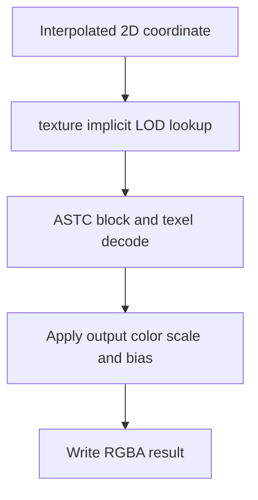

## Overview

**Core question:** Does Vulkan return the correct texels when a sampled image contains ETC2/EAC, ASTC, or BC compressed blocks?

- This page covers the `texture.compressed` and `texture.compressed_3D` test families because both are implemented by `vktTextureCompressedFormatTests.cpp`.
- The host generates encoded blocks, decodes the same bytes with the CTS software decoder, uploads the encoded data to a Vulkan image, and compares sampled device output with the software reference.
- The matrix covers 2D and 3D images, power-of-two and non-power-of-two extents, selected mip behavior, regular and sparse image backing, ASTC void-extent blocks, and native ASTC 3D formats.
- Validation searches a small reference-coordinate neighborhood while enforcing a format-specific RGBA threshold for every output pixel.
- The source registers graphics and compute-marked leaves for the common formats. The current compressed test instances do not forward `useCompute` to `TextureRenderer`, so the compute-marked leaves appear to execute the graphics backend. This source-level discrepancy is documented rather than hidden.

## Background Knowledge

For the shared concepts of format conversion, precision-aware verification, and sparse versus ordinary image backing, see [Background Knowledge](../../categories/texture.md#background-knowledge) of the `texture` page.

- **Block-compressed image:** A fixed-size encoded block represents a rectangular or three-dimensional group of logical texels. Sampling must locate the block, decode the addressed texel according to the selected format, and apply the format's numeric interpretation.

## Registration Hierarchy

```text
texture
├── compressed
└── compressed_3D
```

Both test families contain flat generated test case leaves. Their names encode the format, dimensionality, size class, optional sparse backing, optional ASTC void-extent data, and the registered execution variant.

## Parameter Dimensions and Observed Values

| Dimension | Registered values | Meaning in this test | Evidence |
|-----------|-------------------|----------------------|----------|
| Test family | `compressed`, `compressed_3D` | Selects one 2D image lookup or three sampled XY planes from a 3D image. | [Factories and population](../../../modules/vulkan/texture/vktTextureCompressedFormatTests.cpp#L604-L729) |
| Common format matrix | 6 ETC2, 4 EAC, 28 ASTC 2D, 16 BC | Exercises 54 block-compressed formats with different block rules, channel counts, signedness, sRGB conversion, and floating-point behavior. | [Common format table](../../../modules/vulkan/texture/vktTextureCompressedFormatTests.cpp#L58-L92) |
| Native ASTC 3D formats (non-VulkanSC) | 10 block dimensions, each with UNORM, sRGB, and SFLOAT | In non-VulkanSC builds, adds 30 formats whose encoded blocks extend through depth and require `VK_EXT_texture_compression_astc_3d`. | [ASTC 3D format table](../../../modules/vulkan/texture/vktTextureCompressedFormatTests.cpp#L93-L111) |
| Extent name | `pot`, `npot`, `npot_mip1` | Uses 128 by 64 or 51 by 65. The 3D depths are 8 or 17. Common-format `npot_mip1` cases sample level 1 exactly. | [Size table](../../../modules/vulkan/texture/vktTextureCompressedFormatTests.cpp#L112-L123) |
| Image backing | regular leaf name, `_sparse` | Switches between ordinary image-memory binding and sparse binding plus sparse upload. | [Backing table](../../../modules/vulkan/texture/vktTextureCompressedFormatTests.cpp#L125-L133), [image setup](../../../modules/vulkan/texture/vktTextureTestUtil.cpp#L808-L920) |
| Registered execution variant | graphics leaf, compute-marked leaf ending in `_compute` | The matrix intends to compare rasterized sampling with compute sampling. Current constructors omit the flag needed to choose `ComputeBackend`; see `Shader Analysis` and `Case Pruning`. | [2D generation](../../../modules/vulkan/texture/vktTextureCompressedFormatTests.cpp#L604-L656), [3D generation](../../../modules/vulkan/texture/vktTextureCompressedFormatTests.cpp#L658-L693) |
| ASTC 2D block data | ordinary valid blocks, `voidextent` | Replaces deterministic random valid ASTC input with generated ASTC void-extent LDR blocks. | [Void-extent registration](../../../modules/vulkan/texture/vktTextureCompressedFormatTests.cpp#L639-L654), [data generation](../../../modules/vulkan/pipeline/vktPipelineImageUtil.cpp#L1033-L1052) |
| Filtering | common formats: `NEAREST_MIPMAP_NEAREST` and `NEAREST`; native ASTC 3D: `NEAREST` and `NEAREST` | Avoids within-level interpolation and isolates decoded texel values. Common mip cases clamp LOD to level 1. | [2D sampler parameters](../../../modules/vulkan/texture/vktTextureCompressedFormatTests.cpp#L615-L625), [3D sampler parameters](../../../modules/vulkan/texture/vktTextureCompressedFormatTests.cpp#L670-L712) |
| 3D sampled plane | three Z coordinates derived from base-depth indices `0`, approximately half depth, and `depth-1` | Checks three positions through image depth. For mip cases, the source normalizes these base-depth indices by the selected mip depth. | [3D slice loop](../../../modules/vulkan/texture/vktTextureCompressedFormatTests.cpp#L558-L598) |

The default Vulkan mustpass inventory contains 984 `compressed` leaves and 828 `compressed_3D` leaves. The first count is 648 common-format leaves plus 336 ASTC void-extent leaves. The second is 648 common-format leaves plus 180 native ASTC 3D leaves.

## Behavior Parameters

The primary behavioral axis is the direct test family below `texture`. It changes image dimensionality, compressed-block geometry, sample coordinates, and the amount of image depth validated.

### `compressed`: 2D compressed texel decoding

Each case samples one full 2D image. The host and device receive the same encoded blocks: the device reads them through a compressed Vulkan image, while the host decodes them into the software texture used by `sampleTexture`. ASTC formats add void-extent data cases, and all formats vary ordinary or sparse backing.

### `compressed_3D`: compressed decoding through image depth

Each case creates a 3D image and performs three constant-Z lookups. The common format matrix uses the 2D compressed formats in a 3D image; the extension matrix uses native three-dimensional ASTC blocks. The source derives Z coordinates from the beginning, approximate midpoint, and end of the base depth. For mip cases, it divides those indices by the selected mip depth, so the observed planes are not simply the first, middle, and last planes of level 1.

## Shader Analysis

One ordinary 2D graphics case represents the sampled lookup used by the working execution path. Dimensionality changes the coordinate and sampler types. The shared generator also emits a compute shader, but the current compressed instances select the default graphics backend even for compute-marked leaves.

### Representative Shader Walkthrough 1

#### Parameter Values Chosen

Representative path:

```text
dEQP-VK.texture.compressed.astc_4x4_unorm_block_2d_npot
```

| Parameter choice | Meaning in this representative case |
|------------------|-------------------------------------|
| `astc_4x4_unorm_block` | Each encoded ASTC block covers a 4 by 4 texel region and produces unsigned-normalized color. |
| `2d_npot` | The image is 51 by 65, so the final block row and column cover an extent not divisible by the block dimensions. |
| no `_sparse` | The image uses ordinary memory binding; the sampled shader is unchanged in sparse cases. |
| graphics leaf | A fragment shader performs implicit-LOD sampling of mip level 0 through a `sampler2D`. |

#### Purpose

The fragment shader makes the implementation decode the ASTC block addressed by each interpolated coordinate. It writes the sampled value, after the configured output scale and bias, to the result attachment for host comparison.

#### Structural Design



#### Shader Code

```glsl
#version 450
/// The rasterizer interpolates this normalized coordinate across the full-screen quad.
layout(location = 0) in highp vec2 v_texCoord;
/// The renderer stores sampled values in an R8G8B8A8_UNORM color attachment.
layout(location = 0) out mediump vec4 dEQP_FragColor;
/// Set 0 carries lookup adjustment values. This case uses the color scale and bias fields.
layout(set = 0, binding = 0, std140) uniform Block
{
  highp float u_bias;
  highp float u_ref;
  highp vec4 u_colorScale;
  highp vec4 u_colorBias;
};
/// Set 1 binding 0 combines the compressed ASTC image view with its nearest sampler.
layout(set = 1, binding = 0) uniform highp sampler2D u_sampler;
void main(void)
{
  highp vec2 texCoord = v_texCoord;
  /// texture() selects a logical texel; the implementation decodes its ASTC block before returning color.
  dEQP_FragColor = texture(u_sampler, texCoord) * u_colorScale + u_colorBias;
}
```

#### Additional Info

- The pass-through vertex shader supplies clip-space position and the 2D coordinate. It contains no compressed-format logic.
- The compressed bytes and their software-decoded reference come from the same deterministic host-side `tcu::CompressedTexture` object.
- ASTC and unsigned BC4/BC5 use identity color scale and bias. Signed BC4/BC5 and other formats use adjustments that preserve their values in the output target.

#### Parameter Variation Summary

| Parameter dimension | Shader-level variation from this shader | Evidence |
|---------------------|---------------------------------------|----------|
| 3D family | `vec2` and `sampler2D` become `vec3` and `sampler3D`; the host supplies a constant Z coordinate for each plane. | [Program specialization](../../../modules/vulkan/texture/vktTextureTestUtil.cpp#L383-L395), [3D lookup branch](../../../modules/vulkan/texture/vktTextureTestUtil.cpp#L572-L580) |
| Compressed format | The GLSL sampler declaration is unchanged. The image view format determines the block decoder and returned numeric values. | [Compressed image format selection](../../../modules/vulkan/texture/vktTextureTestUtil.cpp#L823-L830) |
| Sparse backing | The shader is unchanged; image creation flags, memory association, queues, and upload path change. | [Regular/sparse image setup](../../../modules/vulkan/texture/vktTextureTestUtil.cpp#L808-L920) |
| Mip case | The shader still uses `texture`. Host sampler parameters clamp `minLod` and `maxLod` to level 1 for enabled mip cases. | [2D reference and render setup](../../../modules/vulkan/texture/vktTextureCompressedFormatTests.cpp#L351-L402) |
| Compute-marked leaf | The shared generator emits a compute shader that reconstructs coordinates, computes gradients, calls `textureGrad`, and writes a storage image. The compressed constructors currently do not select that backend. | [Compute template](../../../modules/vulkan/texture/vktTextureTestUtil.cpp#L245-L331), [compressed constructors](../../../modules/vulkan/texture/vktTextureCompressedFormatTests.cpp#L174-L183) |

#### SPIR-V

- Status: generated and validated
- Source: reconstructed `GLSL` from this walkthrough
- Stage: `frag`
- Target SPIRV version: `spirv1.0`

<details>
<summary>Click to expand SPIRV asm code</summary>

```llvm
; SPIR-V
; Version: 1.0
; Generator: Khronos Glslang Reference Front End; 11
; Bound: 36
; Schema: 0
               OpCapability Shader
          %1 = OpExtInstImport "GLSL.std.450"
               OpMemoryModel Logical GLSL450
               OpEntryPoint Fragment %main "main" %v_texCoord %dEQP_FragColor
               OpExecutionMode %main OriginUpperLeft
               OpSource GLSL 450
               OpName %main "main"
               OpName %texCoord "texCoord"
               OpName %v_texCoord "v_texCoord"
               OpName %dEQP_FragColor "dEQP_FragColor"
               OpName %u_sampler "u_sampler"
               OpName %Block "Block"
               OpMemberName %Block 0 "u_bias"
               OpMemberName %Block 1 "u_ref"
               OpMemberName %Block 2 "u_colorScale"
               OpMemberName %Block 3 "u_colorBias"
               OpName %_ ""
               OpDecorate %v_texCoord Location 0
               OpDecorate %dEQP_FragColor RelaxedPrecision
               OpDecorate %dEQP_FragColor Location 0
               OpDecorate %u_sampler Binding 0
               OpDecorate %u_sampler DescriptorSet 1
               OpDecorate %Block Block
               OpMemberDecorate %Block 0 Offset 0
               OpMemberDecorate %Block 1 Offset 4
               OpMemberDecorate %Block 2 Offset 16
               OpMemberDecorate %Block 3 Offset 32
               OpDecorate %_ Binding 0
               OpDecorate %_ DescriptorSet 0
       %void = OpTypeVoid
          %3 = OpTypeFunction %void
      %float = OpTypeFloat 32
    %v2float = OpTypeVector %float 2
%_ptr_Function_v2float = OpTypePointer Function %v2float
%_ptr_Input_v2float = OpTypePointer Input %v2float
 %v_texCoord = OpVariable %_ptr_Input_v2float Input
    %v4float = OpTypeVector %float 4
%_ptr_Output_v4float = OpTypePointer Output %v4float
%dEQP_FragColor = OpVariable %_ptr_Output_v4float Output
         %16 = OpTypeImage %float 2D 0 0 0 1 Unknown
         %17 = OpTypeSampledImage %16
%_ptr_UniformConstant_17 = OpTypePointer UniformConstant %17
  %u_sampler = OpVariable %_ptr_UniformConstant_17 UniformConstant
      %Block = OpTypeStruct %float %float %v4float %v4float
%_ptr_Uniform_Block = OpTypePointer Uniform %Block
          %_ = OpVariable %_ptr_Uniform_Block Uniform
        %int = OpTypeInt 32 1
      %int_2 = OpConstant %int 2
%_ptr_Uniform_v4float = OpTypePointer Uniform %v4float
      %int_3 = OpConstant %int 3
       %main = OpFunction %void None %3
          %5 = OpLabel
   %texCoord = OpVariable %_ptr_Function_v2float Function
         %12 = OpLoad %v2float %v_texCoord
               OpStore %texCoord %12
         %20 = OpLoad %17 %u_sampler
         %21 = OpLoad %v2float %texCoord
         %22 = OpImageSampleImplicitLod %v4float %20 %21
         %29 = OpAccessChain %_ptr_Uniform_v4float %_ %int_2
         %30 = OpLoad %v4float %29
         %31 = OpFMul %v4float %22 %30
         %33 = OpAccessChain %_ptr_Uniform_v4float %_ %int_3
         %34 = OpLoad %v4float %33
         %35 = OpFAdd %v4float %31 %34
               OpStore %dEQP_FragColor %35
               OpReturn
               OpFunctionEnd
```

</details>

## Runtime Execution and Result Checking

- The host uses deterministic seed 123 to fill non-ASTC formats with encoded bytes and to generate valid ASTC blocks. It excludes BC7's underspecified mode 8. Dedicated ASTC 2D cases generate void-extent LDR blocks instead.
- For every level, one `tcu::CompressedTexture` retains the encoded bytes for upload. The host decodes the same object into an uncompressed texture level with the CTS format decoder.
- `TextureBinding` creates an optimal-tiled sampled image with transfer-destination usage. A regular case allocates and binds image memory once. A sparse case adds sparse binding and residency flags, queries sparse format properties, binds sparse allocations, and uploads through the sparse helper.
- The image view exposes the compressed format. The sampler uses repeat addressing and nearest filtering. A common-format `npot_mip1` case clamps the reference and Vulkan sampler LOD range to level 1.
- A 2D case samples the normalized range from `(0,0)` to `(1,1)` once. A 3D case repeats the draw at three constant Z coordinates. The source chooses base-depth indices `0`, approximately half depth, and `depth-1`, then divides by `depth >> mipLevel` when forming the normalized coordinate. This distinction matters for the common-format mip cases.
- `sampleTexture` samples the software-decoded texture with the same coordinate and sampler model. For each output pixel, `validateTexture` searches the integer reference coordinates within `0.01` texels of the ideal position.
- An ETC2, EAC, or ASTC result uses the `R8G8B8A8_UNORM` color threshold plus `(2,2,2,2)`. Most BC formats use `(8,8,8,8)`. BC6H and BC7 use `(1,1,1,1)`, and non-bit-exact BC sRGB formats in the 3D path use `(9,9,9,9)`.
- Every component of one neighborhood candidate must pass. A rejected pixel turns red in the error mask; an accepted pixel turns green. Any rejected 2D pixel fails the case. The 3D loop stops and fails at the first rejected plane.
- On failure, the log includes the result, error mask, threshold values, and coordinate tolerance. Non-UNORM values are scaled and biased for display. The current `smpDiff` initialization keeps the diagnostic `maxDiff` at zero, but it does not affect match selection or the case result.

## Failure Meaning

### Failure Cause Mapping

| If this behavior parameter value fails | Possible failure cause(s) |
|----------------------------------------|---------------------------|
| `compressed` | Incorrect 2D compressed-block decoding or format conversion, wrong sampled-image upload or mip selection, ASTC void-extent handling, or a regular/sparse backing-path error. |
| `compressed_3D` | Incorrect decoding or addressing of compressed 3D image data, wrong depth-slice or mip handling, ASTC 3D format support, or a regular/sparse 3D backing-path error. |

### Cause Analysis

#### 2D compressed decoding or image-path failure

**Possible failure symptoms:** Pixels differ from every nearby software-decoded texel by more than the format threshold. Failures may be limited to one format family, signed or sRGB values, non-power-of-two edges, level 1, void-extent input, or sparse leaves.

**Possible implementation causes:** The implementation may decode a block mode, endpoint, index, channel, signed value, floating-point value, or sRGB value incorrectly. It may address edge blocks or mip data incorrectly, lower the sampled-image operation with the wrong view format, mishandle output conversion, or upload compressed regions with wrong block dimensions. A sparse-only pattern points instead to sparse image creation, binding, residency, queue ownership, upload, or visibility while leaving ordinary compressed decoding as another possibility only where evidence supports it.

#### 3D compressed decoding or depth-addressing failure

**Possible failure symptoms:** One or more of the three sampled planes contains colors outside the accepted reference neighborhood. Failures can occur only for native ASTC 3D formats, only at one tested Z coordinate, only at non-power-of-two edges, or only with sparse backing.

**Possible implementation causes:** The implementation may calculate a 3D block address or depth coordinate incorrectly, decode a native ASTC 3D block incorrectly, or apply the wrong format conversion. Common-format 3D failures can also come from compressed image copy layout across depth. A native ASTC 3D-only failure can involve extension feature handling or the extension format decoder. Sparse 3D failures add the sparse binding and residency path to the investigation.

## Case Pruning

### Requirement-based pruning

- `Compressed3DTestInstance` skips ASTC LDR, ETC2/EAC, or BC cases when the corresponding core feature is absent. Native ASTC 3D cases require `VK_EXT_texture_compression_astc_3d` and `textureCompressionASTC_3D`.
- The 2D instance has no family-specific core feature check. Shared image setup queries the exact format, image type, usage, extent, and mip count and skips unsupported combinations.
- Sparse cases are absent from Vulkan SC. For ordinary Vulkan, shared setup skips a sparse case if the format and image type expose no sparse image format properties.
- Shared image setup also skips cases when the format's maximum extent, mip count, or array-layer limit cannot satisfy the generated image.

### Design-based pruning

- The generator uses valid ASTC blocks because the comparison path does not handle invalid ASTC blocks. It also avoids BC7 mode 8 because that mode is underspecified.
- ASTC void-extent input exists only in the 2D family. Native ASTC 3D cases use ordinary generated valid blocks.
- Native ASTC 3D leaves have no compute-marked partners. They use nearest minification without mipmap selection.
- Native ASTC 3D cases are generated under all three size names, including `npot_mip1`, but that branch never assigns `testParameters.mipmaps`. The inherited value remains false, so the native ASTC 3D leaf named `npot_mip1` does not sample mip level 1 in the current source.
- Common-format graphics and compute-marked leaves are both registered. `Compressed2DTestInstance` and `Compressed3DTestInstance` construct `TextureRenderer` without passing `testParameters.useCompute`. The default is false, so current compute-marked leaves appear to use `GraphicsBackend`. The shared compute shader is generated but is not selected by these instances. This requires source-owner investigation; the page does not present the registered suffix as proof of compute execution.

## Key Takeaways

- Device sampling and host reference decoding start from identical compressed bytes, which isolates the implementation's compressed-image path from test-data differences.
- The two test families separate one 2D image from three planes through a 3D image. Native ASTC 3D extends the latter to blocks with depth.
- Regular and sparse leaves preserve logical image contents while changing memory binding and upload behavior.
- Coordinate-neighborhood acceptance handles small sample-location uncertainty. It does not relax the format-specific color threshold.
- ASTC void-extent data, non-power-of-two edges, and exact level-1 sampling target cases that ordinary level-0 random data would not cover.
- Compute-marked registration and native ASTC 3D `npot_mip1` naming do not match the observed current runtime configuration. Treat both as source issues pending owner review.

## Source Reference Appendix

| Entry point | Link | Why it matters |
|-------------|------|----------------|
| Test-category dispatcher | [`createTextureTests`](../../../modules/vulkan/texture/vktTextureTests.cpp#L48-L66) | Registers `compressed` and `compressed_3D` under `texture`. |
| Format, extent, and backing tables | [Compressed test tables](../../../modules/vulkan/texture/vktTextureCompressedFormatTests.cpp#L58-L154) | Defines all compressed formats, three size names, and regular/sparse modes. |
| 2D construction and execution | [`Compressed2DTestInstance`](../../../modules/vulkan/texture/vktTextureCompressedFormatTests.cpp#L156-L429) | Creates the compressed texture, samples one image, and selects 2D thresholds. |
| Shared image comparison | [`validateTexture`](../../../modules/vulkan/texture/vktTextureCompressedFormatTests.cpp#L248-L349) | Builds the software reference and performs neighborhood plus color-threshold validation. |
| 3D construction and execution | [`Compressed3DTestInstance`](../../../modules/vulkan/texture/vktTextureCompressedFormatTests.cpp#L431-L600) | Checks compressed-format features and validates three depth planes. |
| 2D case generation | [`populateTextureCompressedFormatTests`](../../../modules/vulkan/texture/vktTextureCompressedFormatTests.cpp#L604-L656) | Generates common, sparse, compute-marked, and ASTC void-extent 2D leaves. |
| 3D case generation | [`populate3DTextureCompressedFormatTests`](../../../modules/vulkan/texture/vktTextureCompressedFormatTests.cpp#L658-L719) | Generates common-format and native ASTC 3D leaves. |
| Encoded input and software decode | [`populateCompressedLevels`](../../../modules/vulkan/pipeline/vktPipelineImageUtil.cpp#L982-L1031), [`populateCompressedLevelsVoidExtent`](../../../modules/vulkan/pipeline/vktPipelineImageUtil.cpp#L1033-L1052) | Creates the encoded blocks and uncompressed host reference levels. |
| Compressed texture wrappers | [2D and 3D constructors](../../../modules/vulkan/pipeline/vktPipelineImageUtil.cpp#L1220-L1236), [3D constructor](../../../modules/vulkan/pipeline/vktPipelineImageUtil.cpp#L1375-L1381) | Connects compressed levels with their software-decoded textures. |
| Regular and sparse sampled-image setup | [`TextureBinding::updateTextureData`](../../../modules/vulkan/texture/vktTextureTestUtil.cpp#L808-L920) | Queries capabilities, creates the compressed image, binds memory, and uploads blocks. |
| Graphics and compute shader generation | [`initializePrograms`](../../../modules/vulkan/texture/vktTextureTestUtil.cpp#L210-L760) | Specializes `sampler2D` or `sampler3D` graphics shaders and the shared compute template. |
| Backend selection | [`TextureRenderer` constructors](../../../modules/vulkan/texture/vktTextureTestUtil.cpp#L1023-L1053) | Shows that `useCompute` selects `GraphicsBackend` or `ComputeBackend` and defaults to graphics. |
| Default mustpass paths | [`texture.txt`](../../../mustpass/main/vk-default/texture.txt#L1) | Confirms the flattened executable leaf inventory for both test families. |
| Block-compressed format definitions | [Vulkan formats chapter](../../../../vulkan-docs/src/chapters/formats.adoc#L497-L683) | Defines the ETC2/EAC, ASTC, and BC compressed texel formats. |
| Core compressed-format features | [ETC2/EAC and ASTC LDR](../../../../vulkan-docs/src/chapters/features.adoc#L372-L438), [BC](../../../../vulkan-docs/src/chapters/features.adoc#L440-L468) | Defines the core feature promises for sampled compressed formats. |
| ASTC 3D feature | [`VkPhysicalDeviceTextureCompressionASTC3DFeaturesEXT`](../../../../vulkan-docs/src/chapters/features.adoc#L4026-L4079) | Defines extension support for all native ASTC 3D formats. |
| Sparse resource model | [Sparse Resources](../../../../vulkan-docs/src/chapters/sparsemem.adoc#L4-L25) | Defines non-contiguous sparse memory association and the Vulkan SC exclusion. |
| Nearest filtering | [Texel Filtering](../../../../vulkan-docs/src/chapters/textures.adoc#L1886-L1914) | Defines how nearest sampling chooses integer texel coordinates. |
